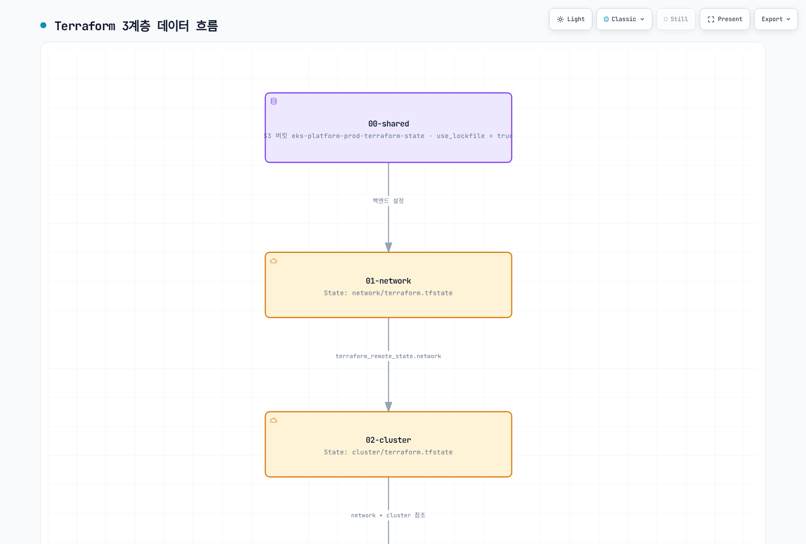

# 인프라 구성 기초

> **지원 버전**: EKS 1.29+, Terraform 1.10+, AWS Provider 5.x **마지막 업데이트**: 2026년 2월 19일

< [이전: 목차](./README.md) | [목차](./README.md) | [다음: NLB 가중치 라우팅](02-infrastructure-advanced.md) >

***

이 문서에서는 Terraform을 사용하여 EKS Auto Mode 클러스터 인프라를 3개의 독립적인 레이어로 구성하는 방법을 설명합니다. 각 레이어는 변경 빈도, 팀 오너십, 그리고 장애 영향 범위(Blast Radius)에 따라 분리되어 있어 운영 안정성과 팀 협업 효율성을 높입니다.

## 목차

1. [3-Layer 아키텍처 소개](01-infrastructure-setup.md#3-layer-아키텍처-소개)
2. [00-shared: 공통 설정](01-infrastructure-setup.md#00-shared-공통-설정)
3. [01-network: VPC 구성](01-infrastructure-setup.md#01-network-vpc-구성)
4. [02-cluster: EKS Auto Mode](01-infrastructure-setup.md#02-cluster-eks-auto-mode)
5. [03-platform: Add-ons & Pod Identity](01-infrastructure-setup.md#03-platform-add-ons--pod-identity)
6. [레이어 간 연계](01-infrastructure-setup.md#레이어-간-연계)
7. [검증](01-infrastructure-setup.md#검증)

***

## 3-Layer 아키텍처 소개

### 왜 레이어를 분리하는가?

단일 Terraform 상태 파일로 모든 인프라를 관리하면 다음과 같은 문제가 발생합니다:

1. **Blast Radius 확대**: 하나의 실수가 전체 인프라에 영향
2. **긴 Plan/Apply 시간**: 변경 사항이 없는 리소스도 매번 검사
3. **팀 협업 충돌**: 여러 팀이 동시에 작업할 때 Lock 경합
4. **권한 관리 어려움**: 네트워크 팀과 애플리케이션 팀의 권한 분리 불가

### 레이어별 특성 비교

| Layer | 이름       | 변경 빈도  | 주요 오너  | Blast Radius | 롤백 난이도 |
| ----- | -------- | ------ | ------ | ------------ | ------ |
| 00    | shared   | 거의 없음  | DevOps | 전체           | 매우 높음  |
| 01    | network  | 월 1-2회 | 네트워크 팀 | VPC 전체       | 높음     |
| 02    | cluster  | 월 1-2회 | 플랫폼 팀  | EKS 클러스터     | 중간     |
| 03    | platform | 주 1-2회 | 플랫폼 팀  | Add-ons만     | 낮음     |

### 디렉토리 구조

```
eks-terraform/
├── 00-shared/
│   ├── backend.tf           # S3 backend 설정
│   └── variables.tf         # 공통 변수 정의
│
├── 01-network/
│   ├── backend.tf           # network/terraform.tfstate
│   ├── main.tf              # VPC 모듈
│   ├── variables.tf         # 네트워크 변수
│   └── outputs.tf           # vpc_id, subnet_ids 출력
│
├── 02-cluster/
│   ├── backend.tf           # cluster/terraform.tfstate
│   ├── data.tf              # remote_state (01-network)
│   ├── main.tf              # EKS Auto Mode 모듈
│   ├── variables.tf         # 클러스터 변수
│   └── outputs.tf           # cluster_name, oidc_arn 출력
│
├── 03-platform/
│   ├── backend.tf           # platform/terraform.tfstate
│   ├── data.tf              # remote_state (01, 02)
│   ├── main.tf              # Add-ons, Pod Identity
│   ├── variables.tf         # 플랫폼 변수
│   └── outputs.tf           # IAM role ARNs 출력
│
├── environments/
│   ├── dev.tfvars
│   ├── staging.tfvars
│   └── prod.tfvars
│
└── modules/                  # 커스텀 모듈 (선택)
    └── pod-identity/
```

### 핵심 원칙

> **Terraform은 AWS 인프라만 관리합니다.**
>
> Kubernetes 리소스(NodePool, Deployment, Service 등)는 ArgoCD를 통한 GitOps 방식으로 관리합니다. 자세한 내용은 [GitOps 멀티 클러스터 배포](04-gitops-multi-cluster.md)를 참조하세요.

***

## 00-shared: 공통 설정

### S3 Backend 구성 (네이티브 S3 잠금)

> **참고**: Terraform 1.10부터 S3 backend에서 `use_lockfile = true` 옵션을 통해 DynamoDB 없이 네이티브 S3 잠금을 사용할 수 있습니다. S3의 conditional writes를 활용하여 상태 파일 잠금을 처리하므로, DynamoDB 테이블 생성 및 관리가 불필요합니다.

모든 레이어가 공유하는 Terraform 상태 저장소를 먼저 구성합니다.

```hcl
# 00-shared/backend-bootstrap.tf
# 이 파일은 최초 1회만 로컬에서 실행합니다

terraform {
  required_version = ">= 1.10.0"

  required_providers {
    aws = {
      source  = "hashicorp/aws"
      version = "~> 5.0"
    }
  }
}

provider "aws" {
  region = var.region

  default_tags {
    tags = {
      ManagedBy   = "terraform"
      Project     = var.project_name
      Environment = var.environment
    }
  }
}

# Terraform 상태 저장용 S3 버킷
resource "aws_s3_bucket" "terraform_state" {
  bucket = "${var.project_name}-${var.environment}-terraform-state"

  lifecycle {
    prevent_destroy = true
  }

  tags = {
    Name        = "${var.project_name}-${var.environment}-terraform-state"
    Description = "Terraform state storage for EKS infrastructure"
  }
}

# S3 버킷 버전 관리 활성화
resource "aws_s3_bucket_versioning" "terraform_state" {
  bucket = aws_s3_bucket.terraform_state.id

  versioning_configuration {
    status = "Enabled"
  }
}

# S3 버킷 암호화
resource "aws_s3_bucket_server_side_encryption_configuration" "terraform_state" {
  bucket = aws_s3_bucket.terraform_state.id

  rule {
    apply_server_side_encryption_by_default {
      sse_algorithm = "aws:kms"
    }
    bucket_key_enabled = true
  }
}

# 퍼블릭 액세스 차단
resource "aws_s3_bucket_public_access_block" "terraform_state" {
  bucket = aws_s3_bucket.terraform_state.id

  block_public_acls       = true
  block_public_policy     = true
  ignore_public_acls      = true
  restrict_public_buckets = true
}

# 출력
output "state_bucket_name" {
  value       = aws_s3_bucket.terraform_state.id
  description = "S3 bucket name for Terraform state"
}
```

### 공통 변수 정의

```hcl
# 00-shared/variables.tf
# 모든 레이어에서 참조하는 공통 변수

variable "region" {
  description = "AWS Region"
  type        = string
  default     = "ap-northeast-2"
}

variable "environment" {
  description = "Environment name (dev, staging, prod)"
  type        = string

  validation {
    condition     = contains(["dev", "staging", "prod"], var.environment)
    error_message = "Environment must be dev, staging, or prod."
  }
}

variable "project_name" {
  description = "Project name for resource naming"
  type        = string
  default     = "eks-platform"

  validation {
    condition     = can(regex("^[a-z0-9-]+$", var.project_name))
    error_message = "Project name must contain only lowercase letters, numbers, and hyphens."
  }
}

# 공통 태그
variable "common_tags" {
  description = "Common tags for all resources"
  type        = map(string)
  default     = {}
}

# 로컬 변수로 태그 병합
locals {
  default_tags = {
    ManagedBy   = "terraform"
    Project     = var.project_name
    Environment = var.environment
    Repository  = "eks-terraform"
  }

  merged_tags = merge(local.default_tags, var.common_tags)
}
```

### 환경별 변수 파일

```hcl
# environments/dev.tfvars
region       = "ap-northeast-2"
environment  = "dev"
project_name = "eks-platform"

common_tags = {
  CostCenter = "development"
  Team       = "platform-dev"
}
```

```hcl
# environments/prod.tfvars
region       = "ap-northeast-2"
environment  = "prod"
project_name = "eks-platform"

common_tags = {
  CostCenter  = "production"
  Team        = "platform-sre"
  Compliance  = "required"
  BackupLevel = "critical"
}
```

***

## 01-network: VPC 구성

### Backend 설정

```hcl
# 01-network/backend.tf
terraform {
  required_version = ">= 1.10.0"

  backend "s3" {
    bucket       = "eks-platform-prod-terraform-state"  # 환경에 맞게 수정
    key          = "network/terraform.tfstate"
    region       = "ap-northeast-2"
    encrypt      = true
    use_lockfile = true
  }

  required_providers {
    aws = {
      source  = "hashicorp/aws"
      version = "~> 5.0"
    }
  }
}

provider "aws" {
  region = var.region

  default_tags {
    tags = local.merged_tags
  }
}
```

### 변수 정의

```hcl
# 01-network/variables.tf
variable "region" {
  description = "AWS Region"
  type        = string
  default     = "ap-northeast-2"
}

variable "environment" {
  description = "Environment name"
  type        = string
}

variable "project_name" {
  description = "Project name"
  type        = string
  default     = "eks-platform"
}

variable "vpc_cidr" {
  description = "VPC CIDR block"
  type        = string
  default     = "10.0.0.0/16"
}

# 블루/그린 클러스터를 위한 싱글존 설계
variable "availability_zones" {
  description = "Availability zones for blue/green clusters"
  type = object({
    blue  = string
    green = string
  })
  default = {
    blue  = "ap-northeast-2a"
    green = "ap-northeast-2c"
  }
}

variable "enable_nat_gateway" {
  description = "Enable NAT Gateway"
  type        = bool
  default     = true
}

variable "single_nat_gateway" {
  description = "Use single NAT Gateway (cost optimization)"
  type        = bool
  default     = false  # prod에서는 false로 각 AZ에 NAT 배치
}

# 태그
variable "common_tags" {
  description = "Common tags"
  type        = map(string)
  default     = {}
}

locals {
  default_tags = {
    ManagedBy   = "terraform"
    Project     = var.project_name
    Environment = var.environment
    Layer       = "network"
  }

  merged_tags = merge(local.default_tags, var.common_tags)

  # 클러스터 이름 (EKS 태그에 필요)
  cluster_names = {
    blue  = "${var.project_name}-${var.environment}-blue"
    green = "${var.project_name}-${var.environment}-green"
  }
}
```

### VPC 메인 구성

```hcl
# 01-network/main.tf

# 블루/그린 클러스터를 위한 VPC 구성
# 각 클러스터는 싱글존으로 운영 (데이터 로컬리티 최적화)

module "vpc" {
  source  = "terraform-aws-modules/vpc/aws"
  version = "~> 5.0"

  name = "${var.project_name}-${var.environment}-vpc"
  cidr = var.vpc_cidr

  # 블루/그린 각각 하나의 AZ 사용
  azs = [
    var.availability_zones.blue,   # ap-northeast-2a
    var.availability_zones.green   # ap-northeast-2c
  ]

  # 프라이빗 서브넷 (EKS 노드)
  # Blue: 10.0.0.0/18 (16,384 IPs)
  # Green: 10.0.64.0/18 (16,384 IPs)
  private_subnets = [
    cidrsubnet(var.vpc_cidr, 2, 0),  # 10.0.0.0/18 - Blue
    cidrsubnet(var.vpc_cidr, 2, 1)   # 10.0.64.0/18 - Green
  ]

  # 퍼블릭 서브넷 (NAT Gateway, Load Balancer)
  # Blue: 10.0.128.0/20 (4,096 IPs)
  # Green: 10.0.144.0/20 (4,096 IPs)
  public_subnets = [
    cidrsubnet(var.vpc_cidr, 4, 8),  # 10.0.128.0/20 - Blue
    cidrsubnet(var.vpc_cidr, 4, 9)   # 10.0.144.0/20 - Green
  ]

  # 인트라 서브넷 (DB, ElastiCache - 인터넷 접근 불필요)
  # Blue: 10.0.160.0/20
  # Green: 10.0.176.0/20
  intra_subnets = [
    cidrsubnet(var.vpc_cidr, 4, 10), # 10.0.160.0/20 - Blue
    cidrsubnet(var.vpc_cidr, 4, 11)  # 10.0.176.0/20 - Green
  ]

  # NAT Gateway 설정
  enable_nat_gateway     = var.enable_nat_gateway
  single_nat_gateway     = var.single_nat_gateway
  one_nat_gateway_per_az = !var.single_nat_gateway

  # DNS 설정
  enable_dns_hostnames = true
  enable_dns_support   = true

  # VPC Flow Logs (보안 감사용)
  enable_flow_log                      = true
  create_flow_log_cloudwatch_iam_role  = true
  create_flow_log_cloudwatch_log_group = true
  flow_log_max_aggregation_interval    = 60

  # EKS 필수 태그 - 퍼블릭 서브넷
  public_subnet_tags = {
    "kubernetes.io/role/elb"                                      = 1
    "kubernetes.io/cluster/${local.cluster_names.blue}"           = "shared"
    "kubernetes.io/cluster/${local.cluster_names.green}"          = "shared"
  }

  # EKS 필수 태그 - 프라이빗 서브넷
  private_subnet_tags = {
    "kubernetes.io/role/internal-elb"                             = 1
    "kubernetes.io/cluster/${local.cluster_names.blue}"           = "shared"
    "kubernetes.io/cluster/${local.cluster_names.green}"          = "shared"
  }

  # 개별 서브넷 태그 (Zone 식별)
  public_subnet_tags_per_az = {
    "${var.availability_zones.blue}" = {
      Zone    = "blue"
      Cluster = local.cluster_names.blue
    }
    "${var.availability_zones.green}" = {
      Zone    = "green"
      Cluster = local.cluster_names.green
    }
  }

  private_subnet_tags_per_az = {
    "${var.availability_zones.blue}" = {
      Zone    = "blue"
      Cluster = local.cluster_names.blue
    }
    "${var.availability_zones.green}" = {
      Zone    = "green"
      Cluster = local.cluster_names.green
    }
  }

  tags = {
    Terraform   = "true"
    Environment = var.environment
  }
}

# VPC Endpoints (프라이빗 EKS 통신용)
module "vpc_endpoints" {
  source  = "terraform-aws-modules/vpc/aws//modules/vpc-endpoints"
  version = "~> 5.0"

  vpc_id = module.vpc.vpc_id

  # 게이트웨이 엔드포인트 (무료)
  endpoints = {
    s3 = {
      service         = "s3"
      service_type    = "Gateway"
      route_table_ids = module.vpc.private_route_table_ids
      tags = {
        Name = "${var.project_name}-${var.environment}-s3-endpoint"
      }
    }

    dynamodb = {
      service         = "dynamodb"
      service_type    = "Gateway"
      route_table_ids = module.vpc.private_route_table_ids
      tags = {
        Name = "${var.project_name}-${var.environment}-dynamodb-endpoint"
      }
    }
  }

  tags = local.merged_tags
}

# 프라이빗 엔드포인트용 보안 그룹
resource "aws_security_group" "vpc_endpoints" {
  name        = "${var.project_name}-${var.environment}-vpc-endpoints-sg"
  description = "Security group for VPC Endpoints"
  vpc_id      = module.vpc.vpc_id

  ingress {
    description = "HTTPS from VPC"
    from_port   = 443
    to_port     = 443
    protocol    = "tcp"
    cidr_blocks = [var.vpc_cidr]
  }

  egress {
    description = "All outbound"
    from_port   = 0
    to_port     = 0
    protocol    = "-1"
    cidr_blocks = ["0.0.0.0/0"]
  }

  tags = merge(local.merged_tags, {
    Name = "${var.project_name}-${var.environment}-vpc-endpoints-sg"
  })
}

# 인터페이스 엔드포인트 (EKS 프라이빗 클러스터용)
resource "aws_vpc_endpoint" "interface_endpoints" {
  for_each = toset([
    "ec2",
    "ecr.api",
    "ecr.dkr",
    "sts",
    "logs",
    "elasticloadbalancing",
    "autoscaling"
  ])

  vpc_id              = module.vpc.vpc_id
  service_name        = "com.amazonaws.${var.region}.${each.value}"
  vpc_endpoint_type   = "Interface"
  subnet_ids          = module.vpc.private_subnets
  security_group_ids  = [aws_security_group.vpc_endpoints.id]
  private_dns_enabled = true

  tags = merge(local.merged_tags, {
    Name = "${var.project_name}-${var.environment}-${replace(each.value, ".", "-")}-endpoint"
  })
}
```

### 출력 정의

```hcl
# 01-network/outputs.tf

# VPC 기본 정보
output "vpc_id" {
  description = "VPC ID"
  value       = module.vpc.vpc_id
}

output "vpc_cidr_block" {
  description = "VPC CIDR block"
  value       = module.vpc.vpc_cidr_block
}

# 서브넷 ID - 전체
output "private_subnet_ids" {
  description = "Private subnet IDs (all)"
  value       = module.vpc.private_subnets
}

output "public_subnet_ids" {
  description = "Public subnet IDs (all)"
  value       = module.vpc.public_subnets
}

output "intra_subnet_ids" {
  description = "Intra subnet IDs (database)"
  value       = module.vpc.intra_subnets
}

# 서브넷 ID - Zone별 분리
output "blue_zone_subnets" {
  description = "Subnet IDs for Blue zone (ap-northeast-2a)"
  value = {
    private = module.vpc.private_subnets[0]
    public  = module.vpc.public_subnets[0]
    intra   = module.vpc.intra_subnets[0]
  }
}

output "green_zone_subnets" {
  description = "Subnet IDs for Green zone (ap-northeast-2c)"
  value = {
    private = module.vpc.private_subnets[1]
    public  = module.vpc.public_subnets[1]
    intra   = module.vpc.intra_subnets[1]
  }
}

# AZ 정보
output "availability_zones" {
  description = "Availability zones"
  value       = module.vpc.azs
}

# NAT Gateway 정보
output "nat_gateway_ids" {
  description = "NAT Gateway IDs"
  value       = module.vpc.natgw_ids
}

output "nat_public_ips" {
  description = "NAT Gateway public IPs"
  value       = module.vpc.nat_public_ips
}

# 보안 그룹
output "vpc_endpoints_security_group_id" {
  description = "Security group ID for VPC endpoints"
  value       = aws_security_group.vpc_endpoints.id
}

# 클러스터 이름 (02-cluster에서 사용)
output "cluster_names" {
  description = "EKS cluster names for blue/green"
  value       = local.cluster_names
}

# 환경 정보
output "environment" {
  description = "Environment name"
  value       = var.environment
}

output "project_name" {
  description = "Project name"
  value       = var.project_name
}
```

***

## 02-cluster: EKS Auto Mode

### Backend 설정

```hcl
# 02-cluster/backend.tf
terraform {
  required_version = ">= 1.10.0"

  backend "s3" {
    bucket       = "eks-platform-prod-terraform-state"
    key          = "cluster/terraform.tfstate"
    region       = "ap-northeast-2"
    encrypt      = true
    use_lockfile = true
  }

  required_providers {
    aws = {
      source  = "hashicorp/aws"
      version = "~> 5.0"
    }
    kubernetes = {
      source  = "hashicorp/kubernetes"
      version = "~> 2.25"
    }
  }
}

provider "aws" {
  region = var.region

  default_tags {
    tags = local.merged_tags
  }
}
```

### Remote State 데이터 소스

```hcl
# 02-cluster/data.tf

# 01-network 레이어의 상태 참조
data "terraform_remote_state" "network" {
  backend = "s3"

  config = {
    bucket = "${var.project_name}-${var.environment}-terraform-state"
    key    = "network/terraform.tfstate"
    region = var.region
  }
}

# 로컬 변수로 네트워크 출력값 매핑
locals {
  vpc_id              = data.terraform_remote_state.network.outputs.vpc_id
  private_subnet_ids  = data.terraform_remote_state.network.outputs.private_subnet_ids
  public_subnet_ids   = data.terraform_remote_state.network.outputs.public_subnet_ids
  blue_zone_subnets   = data.terraform_remote_state.network.outputs.blue_zone_subnets
  green_zone_subnets  = data.terraform_remote_state.network.outputs.green_zone_subnets
  cluster_names       = data.terraform_remote_state.network.outputs.cluster_names
}

# 현재 AWS 계정 정보
data "aws_caller_identity" "current" {}

# 현재 리전 정보
data "aws_region" "current" {}
```

### 변수 정의

```hcl
# 02-cluster/variables.tf
variable "region" {
  description = "AWS Region"
  type        = string
  default     = "ap-northeast-2"
}

variable "environment" {
  description = "Environment name"
  type        = string
}

variable "project_name" {
  description = "Project name"
  type        = string
  default     = "eks-platform"
}

variable "kubernetes_version" {
  description = "Kubernetes version"
  type        = string
  default     = "1.31"
}

# 클러스터 접근 설정
variable "cluster_endpoint_public_access" {
  description = "Enable public access to cluster endpoint"
  type        = bool
  default     = true
}

variable "cluster_endpoint_private_access" {
  description = "Enable private access to cluster endpoint"
  type        = bool
  default     = true
}

# 관리자 IAM Role/User ARNs
variable "cluster_admin_arns" {
  description = "IAM ARNs for cluster administrators"
  type        = list(string)
  default     = []
}

# 블루/그린 클러스터 활성화 여부
variable "enable_blue_cluster" {
  description = "Enable Blue cluster"
  type        = bool
  default     = true
}

variable "enable_green_cluster" {
  description = "Enable Green cluster"
  type        = bool
  default     = true
}

variable "common_tags" {
  description = "Common tags"
  type        = map(string)
  default     = {}
}

locals {
  default_tags = {
    ManagedBy   = "terraform"
    Project     = var.project_name
    Environment = var.environment
    Layer       = "cluster"
  }

  merged_tags = merge(local.default_tags, var.common_tags)
}
```

### EKS Auto Mode 클러스터 구성

```hcl
# 02-cluster/main.tf

# Blue 클러스터 (ap-northeast-2a)
module "eks_blue" {
  source  = "terraform-aws-modules/eks/aws"
  version = "~> 20.0"

  count = var.enable_blue_cluster ? 1 : 0

  cluster_name    = local.cluster_names.blue
  cluster_version = var.kubernetes_version

  # VPC 설정 - Blue zone 서브넷만 사용
  vpc_id     = local.vpc_id
  subnet_ids = [local.blue_zone_subnets.private]

  # Control Plane 서브넷 (ENI 배치)
  control_plane_subnet_ids = [local.blue_zone_subnets.private]

  # Cluster Endpoint 접근 설정
  cluster_endpoint_public_access  = var.cluster_endpoint_public_access
  cluster_endpoint_private_access = var.cluster_endpoint_private_access

  # EKS Auto Mode 활성화
  cluster_compute_config = {
    enabled    = true
    node_pools = ["general-purpose", "system"]
  }

  # Auto Mode 네트워킹
  cluster_kubernetes_network_config = {
    ip_family = "ipv4"
  }

  # Auto Mode 스토리지
  cluster_storage_config = {
    block_storage = {
      enabled = true
    }
  }

  # 클러스터 암호화
  cluster_encryption_config = {
    provider_key_arn = aws_kms_key.eks_blue[0].arn
    resources        = ["secrets"]
  }

  # CloudWatch 로그 활성화
  cluster_enabled_log_types = [
    "api",
    "audit",
    "authenticator",
    "controllerManager",
    "scheduler"
  ]

  # OIDC Provider 생성
  enable_irsa = true

  # Access Entries (EKS API 인증)
  enable_cluster_creator_admin_permissions = true

  access_entries = {
    # 클러스터 관리자
    admin = {
      kubernetes_groups = []
      principal_arn     = var.cluster_admin_arns[0]

      policy_associations = {
        admin = {
          policy_arn = "arn:aws:eks::aws:cluster-access-policy/AmazonEKSClusterAdminPolicy"
          access_scope = {
            type = "cluster"
          }
        }
      }
    }
  }

  tags = merge(local.merged_tags, {
    Cluster = "blue"
    Zone    = "ap-northeast-2a"
  })
}

# Green 클러스터 (ap-northeast-2c)
module "eks_green" {
  source  = "terraform-aws-modules/eks/aws"
  version = "~> 20.0"

  count = var.enable_green_cluster ? 1 : 0

  cluster_name    = local.cluster_names.green
  cluster_version = var.kubernetes_version

  # VPC 설정 - Green zone 서브넷만 사용
  vpc_id     = local.vpc_id
  subnet_ids = [local.green_zone_subnets.private]

  control_plane_subnet_ids = [local.green_zone_subnets.private]

  cluster_endpoint_public_access  = var.cluster_endpoint_public_access
  cluster_endpoint_private_access = var.cluster_endpoint_private_access

  # EKS Auto Mode 활성화
  cluster_compute_config = {
    enabled    = true
    node_pools = ["general-purpose", "system"]
  }

  cluster_kubernetes_network_config = {
    ip_family = "ipv4"
  }

  cluster_storage_config = {
    block_storage = {
      enabled = true
    }
  }

  cluster_encryption_config = {
    provider_key_arn = aws_kms_key.eks_green[0].arn
    resources        = ["secrets"]
  }

  cluster_enabled_log_types = [
    "api",
    "audit",
    "authenticator",
    "controllerManager",
    "scheduler"
  ]

  enable_irsa = true

  enable_cluster_creator_admin_permissions = true

  access_entries = {
    admin = {
      kubernetes_groups = []
      principal_arn     = var.cluster_admin_arns[0]

      policy_associations = {
        admin = {
          policy_arn = "arn:aws:eks::aws:cluster-access-policy/AmazonEKSClusterAdminPolicy"
          access_scope = {
            type = "cluster"
          }
        }
      }
    }
  }

  tags = merge(local.merged_tags, {
    Cluster = "green"
    Zone    = "ap-northeast-2c"
  })
}

# KMS Keys for cluster encryption
resource "aws_kms_key" "eks_blue" {
  count = var.enable_blue_cluster ? 1 : 0

  description             = "KMS key for EKS Blue cluster encryption"
  deletion_window_in_days = 7
  enable_key_rotation     = true

  tags = merge(local.merged_tags, {
    Name    = "${local.cluster_names.blue}-encryption-key"
    Cluster = "blue"
  })
}

resource "aws_kms_key" "eks_green" {
  count = var.enable_green_cluster ? 1 : 0

  description             = "KMS key for EKS Green cluster encryption"
  deletion_window_in_days = 7
  enable_key_rotation     = true

  tags = merge(local.merged_tags, {
    Name    = "${local.cluster_names.green}-encryption-key"
    Cluster = "green"
  })
}

resource "aws_kms_alias" "eks_blue" {
  count = var.enable_blue_cluster ? 1 : 0

  name          = "alias/${local.cluster_names.blue}-encryption"
  target_key_id = aws_kms_key.eks_blue[0].key_id
}

resource "aws_kms_alias" "eks_green" {
  count = var.enable_green_cluster ? 1 : 0

  name          = "alias/${local.cluster_names.green}-encryption"
  target_key_id = aws_kms_key.eks_green[0].key_id
}
```

### 출력 정의

```hcl
# 02-cluster/outputs.tf

# Blue 클러스터 출력
output "blue_cluster_name" {
  description = "Blue cluster name"
  value       = var.enable_blue_cluster ? module.eks_blue[0].cluster_name : null
}

output "blue_cluster_endpoint" {
  description = "Blue cluster API endpoint"
  value       = var.enable_blue_cluster ? module.eks_blue[0].cluster_endpoint : null
}

output "blue_cluster_certificate_authority_data" {
  description = "Blue cluster CA data"
  value       = var.enable_blue_cluster ? module.eks_blue[0].cluster_certificate_authority_data : null
  sensitive   = true
}

output "blue_oidc_provider_arn" {
  description = "Blue cluster OIDC provider ARN"
  value       = var.enable_blue_cluster ? module.eks_blue[0].oidc_provider_arn : null
}

output "blue_oidc_provider_url" {
  description = "Blue cluster OIDC provider URL"
  value       = var.enable_blue_cluster ? module.eks_blue[0].oidc_provider : null
}

# Green 클러스터 출력
output "green_cluster_name" {
  description = "Green cluster name"
  value       = var.enable_green_cluster ? module.eks_green[0].cluster_name : null
}

output "green_cluster_endpoint" {
  description = "Green cluster API endpoint"
  value       = var.enable_green_cluster ? module.eks_green[0].cluster_endpoint : null
}

output "green_cluster_certificate_authority_data" {
  description = "Green cluster CA data"
  value       = var.enable_green_cluster ? module.eks_green[0].cluster_certificate_authority_data : null
  sensitive   = true
}

output "green_oidc_provider_arn" {
  description = "Green cluster OIDC provider ARN"
  value       = var.enable_green_cluster ? module.eks_green[0].oidc_provider_arn : null
}

output "green_oidc_provider_url" {
  description = "Green cluster OIDC provider URL"
  value       = var.enable_green_cluster ? module.eks_green[0].oidc_provider : null
}

# 공통 출력
output "cluster_names" {
  description = "All cluster names"
  value = {
    blue  = var.enable_blue_cluster ? module.eks_blue[0].cluster_name : null
    green = var.enable_green_cluster ? module.eks_green[0].cluster_name : null
  }
}

output "cluster_endpoints" {
  description = "All cluster endpoints"
  value = {
    blue  = var.enable_blue_cluster ? module.eks_blue[0].cluster_endpoint : null
    green = var.enable_green_cluster ? module.eks_green[0].cluster_endpoint : null
  }
}

output "kubernetes_version" {
  description = "Kubernetes version"
  value       = var.kubernetes_version
}
```

***

## 03-platform: Add-ons & Pod Identity

### Backend 설정

```hcl
# 03-platform/backend.tf
terraform {
  required_version = ">= 1.10.0"

  backend "s3" {
    bucket       = "eks-platform-prod-terraform-state"
    key          = "platform/terraform.tfstate"
    region       = "ap-northeast-2"
    encrypt      = true
    use_lockfile = true
  }

  required_providers {
    aws = {
      source  = "hashicorp/aws"
      version = "~> 5.0"
    }
  }
}

provider "aws" {
  region = var.region

  default_tags {
    tags = local.merged_tags
  }
}
```

### Remote State 데이터 소스

```hcl
# 03-platform/data.tf

# 01-network 레이어 참조
data "terraform_remote_state" "network" {
  backend = "s3"

  config = {
    bucket = "${var.project_name}-${var.environment}-terraform-state"
    key    = "network/terraform.tfstate"
    region = var.region
  }
}

# 02-cluster 레이어 참조
data "terraform_remote_state" "cluster" {
  backend = "s3"

  config = {
    bucket = "${var.project_name}-${var.environment}-terraform-state"
    key    = "cluster/terraform.tfstate"
    region = var.region
  }
}

# 로컬 변수로 매핑
locals {
  # Network 출력
  vpc_id = data.terraform_remote_state.network.outputs.vpc_id

  # Cluster 출력
  blue_cluster_name      = data.terraform_remote_state.cluster.outputs.blue_cluster_name
  blue_oidc_provider_arn = data.terraform_remote_state.cluster.outputs.blue_oidc_provider_arn
  blue_oidc_provider_url = data.terraform_remote_state.cluster.outputs.blue_oidc_provider_url

  green_cluster_name      = data.terraform_remote_state.cluster.outputs.green_cluster_name
  green_oidc_provider_arn = data.terraform_remote_state.cluster.outputs.green_oidc_provider_arn
  green_oidc_provider_url = data.terraform_remote_state.cluster.outputs.green_oidc_provider_url
}

data "aws_caller_identity" "current" {}
data "aws_region" "current" {}
```

### 변수 정의

```hcl
# 03-platform/variables.tf
variable "region" {
  description = "AWS Region"
  type        = string
  default     = "ap-northeast-2"
}

variable "environment" {
  description = "Environment name"
  type        = string
}

variable "project_name" {
  description = "Project name"
  type        = string
  default     = "eks-platform"
}

# 개발자 IAM ARNs (읽기 전용 접근)
variable "developer_arns" {
  description = "IAM ARNs for developers (read-only access)"
  type        = list(string)
  default     = []
}

# 관리자 IAM ARNs
variable "admin_arns" {
  description = "IAM ARNs for administrators"
  type        = list(string)
  default     = []
}

# 클러스터 활성화 여부 (02-cluster에서 상속)
variable "enable_blue_cluster" {
  description = "Enable Blue cluster resources"
  type        = bool
  default     = true
}

variable "enable_green_cluster" {
  description = "Enable Green cluster resources"
  type        = bool
  default     = true
}

variable "common_tags" {
  description = "Common tags"
  type        = map(string)
  default     = {}
}

locals {
  default_tags = {
    ManagedBy   = "terraform"
    Project     = var.project_name
    Environment = var.environment
    Layer       = "platform"
  }

  merged_tags = merge(local.default_tags, var.common_tags)
}
```

### Pod Identity 및 Add-ons 구성

```hcl
# 03-platform/main.tf

# ============================================
# Pod Identity Associations
# ============================================

# ArgoCD용 IAM Role (Blue 클러스터)
module "argocd_pod_identity_blue" {
  source  = "terraform-aws-modules/eks-pod-identity/aws"
  version = "~> 1.0"

  count = var.enable_blue_cluster ? 1 : 0

  name = "${local.blue_cluster_name}-argocd"

  attach_custom_policy = true
  policy_statements = [
    {
      sid    = "AllowECRAccess"
      effect = "Allow"
      actions = [
        "ecr:GetAuthorizationToken",
        "ecr:BatchCheckLayerAvailability",
        "ecr:GetDownloadUrlForLayer",
        "ecr:BatchGetImage"
      ]
      resources = ["*"]
    },
    {
      sid    = "AllowSecretsManagerRead"
      effect = "Allow"
      actions = [
        "secretsmanager:GetSecretValue",
        "secretsmanager:DescribeSecret"
      ]
      resources = [
        "arn:aws:secretsmanager:${var.region}:${data.aws_caller_identity.current.account_id}:secret:${var.project_name}/*"
      ]
    }
  ]

  associations = {
    argocd = {
      cluster_name    = local.blue_cluster_name
      namespace       = "argocd"
      service_account = "argocd-server"
    }
    argocd-repo = {
      cluster_name    = local.blue_cluster_name
      namespace       = "argocd"
      service_account = "argocd-repo-server"
    }
  }

  tags = merge(local.merged_tags, {
    Cluster   = "blue"
    Component = "argocd"
  })
}

# ArgoCD용 IAM Role (Green 클러스터)
module "argocd_pod_identity_green" {
  source  = "terraform-aws-modules/eks-pod-identity/aws"
  version = "~> 1.0"

  count = var.enable_green_cluster ? 1 : 0

  name = "${local.green_cluster_name}-argocd"

  attach_custom_policy = true
  policy_statements = [
    {
      sid    = "AllowECRAccess"
      effect = "Allow"
      actions = [
        "ecr:GetAuthorizationToken",
        "ecr:BatchCheckLayerAvailability",
        "ecr:GetDownloadUrlForLayer",
        "ecr:BatchGetImage"
      ]
      resources = ["*"]
    },
    {
      sid    = "AllowSecretsManagerRead"
      effect = "Allow"
      actions = [
        "secretsmanager:GetSecretValue",
        "secretsmanager:DescribeSecret"
      ]
      resources = [
        "arn:aws:secretsmanager:${var.region}:${data.aws_caller_identity.current.account_id}:secret:${var.project_name}/*"
      ]
    }
  ]

  associations = {
    argocd = {
      cluster_name    = local.green_cluster_name
      namespace       = "argocd"
      service_account = "argocd-server"
    }
    argocd-repo = {
      cluster_name    = local.green_cluster_name
      namespace       = "argocd"
      service_account = "argocd-repo-server"
    }
  }

  tags = merge(local.merged_tags, {
    Cluster   = "green"
    Component = "argocd"
  })
}

# External Secrets Operator용 Pod Identity (Blue)
module "external_secrets_pod_identity_blue" {
  source  = "terraform-aws-modules/eks-pod-identity/aws"
  version = "~> 1.0"

  count = var.enable_blue_cluster ? 1 : 0

  name = "${local.blue_cluster_name}-external-secrets"

  attach_custom_policy = true
  policy_statements = [
    {
      sid    = "AllowSecretsManagerAccess"
      effect = "Allow"
      actions = [
        "secretsmanager:GetResourcePolicy",
        "secretsmanager:GetSecretValue",
        "secretsmanager:DescribeSecret",
        "secretsmanager:ListSecretVersionIds",
        "secretsmanager:ListSecrets"
      ]
      resources = [
        "arn:aws:secretsmanager:${var.region}:${data.aws_caller_identity.current.account_id}:secret:${var.project_name}/*"
      ]
    },
    {
      sid    = "AllowSSMParameterAccess"
      effect = "Allow"
      actions = [
        "ssm:GetParameter",
        "ssm:GetParameters",
        "ssm:GetParametersByPath"
      ]
      resources = [
        "arn:aws:ssm:${var.region}:${data.aws_caller_identity.current.account_id}:parameter/${var.project_name}/*"
      ]
    }
  ]

  associations = {
    external-secrets = {
      cluster_name    = local.blue_cluster_name
      namespace       = "external-secrets"
      service_account = "external-secrets"
    }
  }

  tags = merge(local.merged_tags, {
    Cluster   = "blue"
    Component = "external-secrets"
  })
}

# External Secrets Operator용 Pod Identity (Green)
module "external_secrets_pod_identity_green" {
  source  = "terraform-aws-modules/eks-pod-identity/aws"
  version = "~> 1.0"

  count = var.enable_green_cluster ? 1 : 0

  name = "${local.green_cluster_name}-external-secrets"

  attach_custom_policy = true
  policy_statements = [
    {
      sid    = "AllowSecretsManagerAccess"
      effect = "Allow"
      actions = [
        "secretsmanager:GetResourcePolicy",
        "secretsmanager:GetSecretValue",
        "secretsmanager:DescribeSecret",
        "secretsmanager:ListSecretVersionIds",
        "secretsmanager:ListSecrets"
      ]
      resources = [
        "arn:aws:secretsmanager:${var.region}:${data.aws_caller_identity.current.account_id}:secret:${var.project_name}/*"
      ]
    },
    {
      sid    = "AllowSSMParameterAccess"
      effect = "Allow"
      actions = [
        "ssm:GetParameter",
        "ssm:GetParameters",
        "ssm:GetParametersByPath"
      ]
      resources = [
        "arn:aws:ssm:${var.region}:${data.aws_caller_identity.current.account_id}:parameter/${var.project_name}/*"
      ]
    }
  ]

  associations = {
    external-secrets = {
      cluster_name    = local.green_cluster_name
      namespace       = "external-secrets"
      service_account = "external-secrets"
    }
  }

  tags = merge(local.merged_tags, {
    Cluster   = "green"
    Component = "external-secrets"
  })
}

# ============================================
# EKS Add-ons
# ============================================

# EBS CSI Driver (Blue)
resource "aws_eks_addon" "ebs_csi_blue" {
  count = var.enable_blue_cluster ? 1 : 0

  cluster_name                = local.blue_cluster_name
  addon_name                  = "aws-ebs-csi-driver"
  addon_version               = "v1.28.0-eksbuild.1"  # 최신 버전 확인 필요
  resolve_conflicts_on_update = "PRESERVE"

  tags = merge(local.merged_tags, {
    Cluster = "blue"
  })
}

# EBS CSI Driver (Green)
resource "aws_eks_addon" "ebs_csi_green" {
  count = var.enable_green_cluster ? 1 : 0

  cluster_name                = local.green_cluster_name
  addon_name                  = "aws-ebs-csi-driver"
  addon_version               = "v1.28.0-eksbuild.1"
  resolve_conflicts_on_update = "PRESERVE"

  tags = merge(local.merged_tags, {
    Cluster = "green"
  })
}

# ============================================
# Access Entries (개발자 접근 권한)
# ============================================

# Blue 클러스터 - 개발자 읽기 전용 접근
resource "aws_eks_access_entry" "developers_blue" {
  for_each = var.enable_blue_cluster ? toset(var.developer_arns) : []

  cluster_name  = local.blue_cluster_name
  principal_arn = each.value
  type          = "STANDARD"

  tags = merge(local.merged_tags, {
    Cluster = "blue"
    Role    = "developer"
  })
}

resource "aws_eks_access_policy_association" "developers_blue_view" {
  for_each = var.enable_blue_cluster ? toset(var.developer_arns) : []

  cluster_name  = local.blue_cluster_name
  principal_arn = each.value
  policy_arn    = "arn:aws:eks::aws:cluster-access-policy/AmazonEKSViewPolicy"

  access_scope {
    type = "cluster"
  }
}

# Green 클러스터 - 개발자 읽기 전용 접근
resource "aws_eks_access_entry" "developers_green" {
  for_each = var.enable_green_cluster ? toset(var.developer_arns) : []

  cluster_name  = local.green_cluster_name
  principal_arn = each.value
  type          = "STANDARD"

  tags = merge(local.merged_tags, {
    Cluster = "green"
    Role    = "developer"
  })
}

resource "aws_eks_access_policy_association" "developers_green_view" {
  for_each = var.enable_green_cluster ? toset(var.developer_arns) : []

  cluster_name  = local.green_cluster_name
  principal_arn = each.value
  policy_arn    = "arn:aws:eks::aws:cluster-access-policy/AmazonEKSViewPolicy"

  access_scope {
    type = "cluster"
  }
}

# 관리자 접근 (Blue)
resource "aws_eks_access_entry" "admins_blue" {
  for_each = var.enable_blue_cluster ? toset(var.admin_arns) : []

  cluster_name  = local.blue_cluster_name
  principal_arn = each.value
  type          = "STANDARD"

  tags = merge(local.merged_tags, {
    Cluster = "blue"
    Role    = "admin"
  })
}

resource "aws_eks_access_policy_association" "admins_blue" {
  for_each = var.enable_blue_cluster ? toset(var.admin_arns) : []

  cluster_name  = local.blue_cluster_name
  principal_arn = each.value
  policy_arn    = "arn:aws:eks::aws:cluster-access-policy/AmazonEKSClusterAdminPolicy"

  access_scope {
    type = "cluster"
  }
}

# 관리자 접근 (Green)
resource "aws_eks_access_entry" "admins_green" {
  for_each = var.enable_green_cluster ? toset(var.admin_arns) : []

  cluster_name  = local.green_cluster_name
  principal_arn = each.value
  type          = "STANDARD"

  tags = merge(local.merged_tags, {
    Cluster = "green"
    Role    = "admin"
  })
}

resource "aws_eks_access_policy_association" "admins_green" {
  for_each = var.enable_green_cluster ? toset(var.admin_arns) : []

  cluster_name  = local.green_cluster_name
  principal_arn = each.value
  policy_arn    = "arn:aws:eks::aws:cluster-access-policy/AmazonEKSClusterAdminPolicy"

  access_scope {
    type = "cluster"
  }
}
```

### 출력 정의

```hcl
# 03-platform/outputs.tf

# ArgoCD Pod Identity Role ARNs
output "argocd_role_arn_blue" {
  description = "ArgoCD IAM role ARN for Blue cluster"
  value       = var.enable_blue_cluster ? module.argocd_pod_identity_blue[0].iam_role_arn : null
}

output "argocd_role_arn_green" {
  description = "ArgoCD IAM role ARN for Green cluster"
  value       = var.enable_green_cluster ? module.argocd_pod_identity_green[0].iam_role_arn : null
}

# External Secrets Role ARNs
output "external_secrets_role_arn_blue" {
  description = "External Secrets IAM role ARN for Blue cluster"
  value       = var.enable_blue_cluster ? module.external_secrets_pod_identity_blue[0].iam_role_arn : null
}

output "external_secrets_role_arn_green" {
  description = "External Secrets IAM role ARN for Green cluster"
  value       = var.enable_green_cluster ? module.external_secrets_pod_identity_green[0].iam_role_arn : null
}

# EBS CSI Driver Add-on Status
output "ebs_csi_addon_status_blue" {
  description = "EBS CSI addon status for Blue cluster"
  value       = var.enable_blue_cluster ? aws_eks_addon.ebs_csi_blue[0].status : null
}

output "ebs_csi_addon_status_green" {
  description = "EBS CSI addon status for Green cluster"
  value       = var.enable_green_cluster ? aws_eks_addon.ebs_csi_green[0].status : null
}
```

***

## 레이어 간 연계

### terraform\_remote\_state 데이터 소스 패턴

각 레이어는 이전 레이어의 출력값을 `terraform_remote_state` 데이터 소스를 통해 참조합니다.

```hcl
# 기본 패턴
data "terraform_remote_state" "previous_layer" {
  backend = "s3"

  config = {
    bucket = "${var.project_name}-${var.environment}-terraform-state"
    key    = "layer-name/terraform.tfstate"
    region = var.region
  }
}

# 출력값 접근
local {
  value_from_previous = data.terraform_remote_state.previous_layer.outputs.output_name
}
```

### 데이터 흐름 다이어그램



[🔍 인터랙티브 다이어그램 보기](https://www.atomai.click/kubernetes-docs/archmaps/ko-ops-01-infrastructure-setup-0.html)

### 상태 관리 모범 사례

1. **절대 수동으로 상태 파일을 편집하지 마세요**
   * `terraform state mv`, `terraform import` 명령 사용
2. **상태 파일 버전 관리**
   * S3 버전 관리 활성화로 롤백 가능
   * 주기적인 상태 백업 권장
3.  **Lock 충돌 해결**

    ```bash
    # Lock 강제 해제 (주의: 다른 작업이 없는지 확인 후)
    terraform force-unlock LOCK_ID
    ```
4. **출력값 변경 시 주의**
   * 하위 레이어에서 참조하는 출력값 변경 시 영향 범위 확인
   * 출력값 삭제 전 의존성 제거 필요
5. **S3 네이티브 잠금 사용** (Terraform 1.10+)
   * `use_lockfile = true` 설정으로 S3 conditional writes 기반 잠금 활성화
   * DynamoDB 테이블 생성/관리 불필요
   * 기존 DynamoDB 잠금에서 마이그레이션 시 `terraform init -migrate-state` 실행

***

## 검증

### 레이어별 적용 순서

```bash
# 1. 환경 변수 설정
export ENV="prod"
export AWS_REGION="ap-northeast-2"
export PROJECT="eks-platform"

# 2. 00-shared: Backend 인프라 생성 (최초 1회)
cd eks-terraform/00-shared
terraform init
terraform apply -var-file="../environments/${ENV}.tfvars"

# 3. 01-network: VPC 생성
cd ../01-network
terraform init
terraform plan -var-file="../environments/${ENV}.tfvars"
terraform apply -var-file="../environments/${ENV}.tfvars"

# 4. 02-cluster: EKS 클러스터 생성
cd ../02-cluster
terraform init
terraform plan -var-file="../environments/${ENV}.tfvars"
terraform apply -var-file="../environments/${ENV}.tfvars"

# 5. 03-platform: Add-ons 및 Pod Identity 구성
cd ../03-platform
terraform init
terraform plan -var-file="../environments/${ENV}.tfvars"
terraform apply -var-file="../environments/${ENV}.tfvars"
```

### kubectl 검증

```bash
# kubeconfig 업데이트 (Blue 클러스터)
aws eks update-kubeconfig \
  --region ap-northeast-2 \
  --name eks-platform-prod-blue \
  --alias blue-prod

# kubeconfig 업데이트 (Green 클러스터)
aws eks update-kubeconfig \
  --region ap-northeast-2 \
  --name eks-platform-prod-green \
  --alias green-prod

# Blue 클러스터 확인
kubectl --context blue-prod get nodes
kubectl --context blue-prod get nodepools
kubectl --context blue-prod get pods -A

# Green 클러스터 확인
kubectl --context green-prod get nodes
kubectl --context green-prod get nodepools
kubectl --context green-prod get pods -A

# Auto Mode NodePool 확인
kubectl --context blue-prod describe nodepool general-purpose
kubectl --context blue-prod describe nodepool system
```

### Smoke Test 스크립트

```bash
#!/bin/bash
# smoke-test.sh

set -e

BLUE_CONTEXT="blue-prod"
GREEN_CONTEXT="green-prod"

echo "=== EKS Cluster Smoke Test ==="

# 함수: 클러스터 상태 확인
check_cluster() {
    local context=$1
    local cluster_name=$2

    echo ""
    echo "--- Checking $cluster_name cluster ---"

    # 노드 상태
    echo "Nodes:"
    kubectl --context "$context" get nodes -o wide

    # NodePool 상태
    echo ""
    echo "NodePools:"
    kubectl --context "$context" get nodepools

    # 시스템 Pod 상태
    echo ""
    echo "System Pods:"
    kubectl --context "$context" get pods -n kube-system

    # CoreDNS 확인
    echo ""
    echo "CoreDNS status:"
    kubectl --context "$context" get pods -n kube-system -l k8s-app=kube-dns

    # 클러스터 버전
    echo ""
    echo "Cluster version:"
    kubectl --context "$context" version --short
}

# 함수: DNS 테스트
test_dns() {
    local context=$1

    echo ""
    echo "--- DNS Resolution Test ---"
    kubectl --context "$context" run dns-test \
        --image=busybox:1.28 \
        --rm -it --restart=Never \
        -- nslookup kubernetes.default.svc.cluster.local
}

# 함수: 기본 워크로드 배포 테스트
test_workload() {
    local context=$1

    echo ""
    echo "--- Workload Deployment Test ---"

    # 테스트 네임스페이스 생성
    kubectl --context "$context" create namespace smoke-test --dry-run=client -o yaml | \
        kubectl --context "$context" apply -f -

    # 테스트 Deployment 배포
    cat <<EOF | kubectl --context "$context" apply -f -
apiVersion: apps/v1
kind: Deployment
metadata:
  name: nginx-test
  namespace: smoke-test
spec:
  replicas: 1
  selector:
    matchLabels:
      app: nginx-test
  template:
    metadata:
      labels:
        app: nginx-test
    spec:
      containers:
      - name: nginx
        image: nginx:alpine
        ports:
        - containerPort: 80
        resources:
          requests:
            cpu: 100m
            memory: 128Mi
          limits:
            cpu: 200m
            memory: 256Mi
EOF

    # Pod 시작 대기
    echo "Waiting for pod to be ready..."
    kubectl --context "$context" wait --for=condition=ready pod \
        -l app=nginx-test -n smoke-test --timeout=120s

    echo "Test deployment successful!"

    # 정리
    kubectl --context "$context" delete namespace smoke-test
}

# Blue 클러스터 테스트
echo "========================================="
echo "Testing Blue Cluster"
echo "========================================="
check_cluster "$BLUE_CONTEXT" "Blue"
test_workload "$BLUE_CONTEXT"

# Green 클러스터 테스트
echo ""
echo "========================================="
echo "Testing Green Cluster"
echo "========================================="
check_cluster "$GREEN_CONTEXT" "Green"
test_workload "$GREEN_CONTEXT"

echo ""
echo "========================================="
echo "All smoke tests passed!"
echo "========================================="
```

### 트러블슈팅 가이드

#### 일반적인 문제와 해결 방법

| 문제                          | 원인               | 해결 방법                                      |
| --------------------------- | ---------------- | ------------------------------------------ |
| `terraform_remote_state` 오류 | S3 버킷 접근 권한 없음   | IAM 정책 확인, 버킷 이름 확인                        |
| EKS 클러스터 생성 실패              | 서브넷 태그 누락        | 01-network에서 EKS 태그 확인                     |
| NodePool이 노드를 생성하지 않음       | Auto Mode 미활성화   | `cluster_compute_config.enabled = true` 확인 |
| Pod Identity 연결 실패          | OIDC Provider 없음 | `enable_irsa = true` 확인                    |

#### 디버깅 명령어

```bash
# Terraform 상태 확인
terraform state list
terraform state show aws_eks_cluster.example

# EKS 클러스터 상태 확인
aws eks describe-cluster --name eks-platform-prod-blue

# 클러스터 인증 문제 디버깅
aws eks get-token --cluster-name eks-platform-prod-blue

# Pod Identity 연결 확인
aws eks list-pod-identity-associations \
    --cluster-name eks-platform-prod-blue

# CloudWatch 로그 확인
aws logs describe-log-groups \
    --log-group-name-prefix /aws/eks/eks-platform-prod
```

***

## 다음 단계

이 인프라 구성을 완료한 후 다음 문서를 참조하세요:

* [**NLB 가중치 라우팅과 블루/그린 클러스터**](02-infrastructure-advanced.md): NLB를 사용한 트래픽 분배 및 장애 조치
* [**GitOps 멀티 클러스터 배포**](04-gitops-multi-cluster.md): ArgoCD를 사용한 Kubernetes 리소스 관리
* [**EKS Auto Mode 시작하기**](../eks-auto-mode/01-getting-started.md): Auto Mode 상세 설정
* [**EKS 보안**](../eks/05-eks-security.md): 클러스터 보안 모범 사례

***

## 참고 자료

* [Terraform AWS EKS Module](https://registry.terraform.io/modules/terraform-aws-modules/eks/aws/latest)
* [Terraform AWS VPC Module](https://registry.terraform.io/modules/terraform-aws-modules/vpc/aws/latest)
* [EKS Auto Mode 공식 문서](https://docs.aws.amazon.com/eks/latest/userguide/automode.html)
* [EKS Pod Identity 문서](https://docs.aws.amazon.com/eks/latest/userguide/pod-identities.html)
* [Terraform Backend Configuration](https://developer.hashicorp.com/terraform/language/settings/backends/s3)
