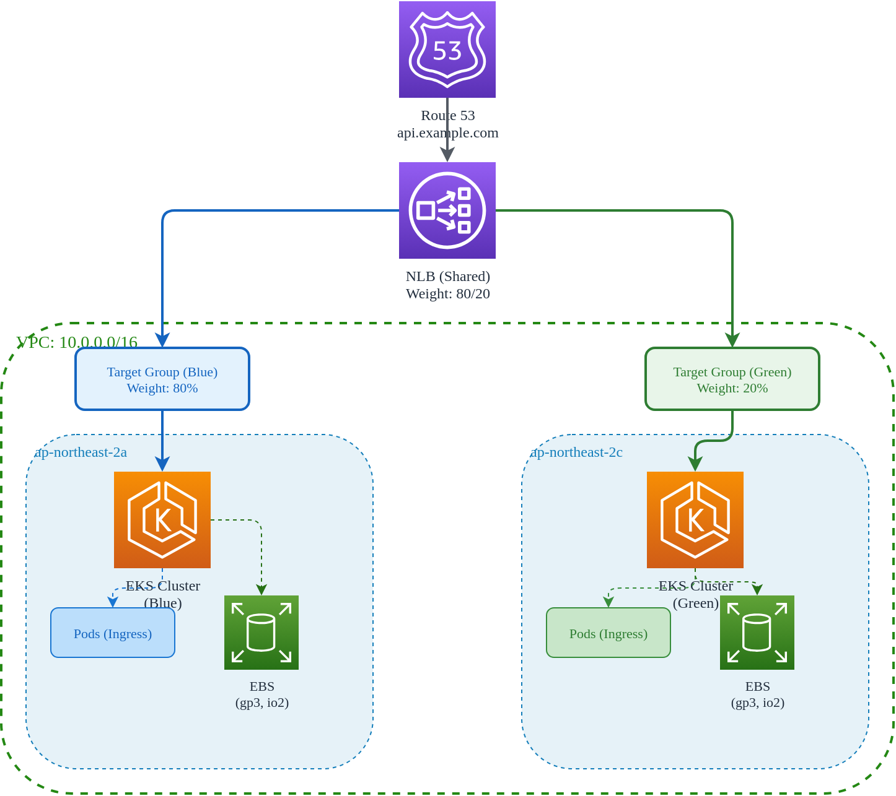

# NLB 가중치 라우팅과 블루/그린 클러스터

> **지원 버전**: EKS 1.29+, Terraform 1.5+, AWS Provider 5.x
> **마지막 업데이트**: 2026년 2월 23일

< [이전: Terraform 3-Layer 인프라](./01-infrastructure-setup.md) | [목차](./README.md) | [다음: CI 파이프라인](./03-ci-pipelines.md) >

---

이 문서에서는 두 개의 싱글존 EKS 클러스터(Blue/Green)를 공유 NLB(Network Load Balancer)로 연결하여 트래픽을 분배하고, 장애 발생 시 자동으로 트래픽을 전환하는 방법을 설명합니다.

## 목차

1. [블루/그린 아키텍처 개요](#블루그린-아키텍처-개요)
2. [NLB 가중치 타겟 그룹](#nlb-가중치-타겟-그룹)
3. [DNS 기반 트래픽 전환](#dns-기반-트래픽-전환)
4. [데이터 노드 배치](#데이터-노드-배치)
5. [장애 조치 자동화](#장애-조치-자동화)

---

## 블루/그린 아키텍처 개요

### 설계 원칙

전통적인 멀티 AZ 클러스터 대신 두 개의 싱글존 클러스터를 운영하는 이유:

| 관점 | 멀티 AZ 클러스터 | 블루/그린 싱글존 |
|------|-----------------|------------------|
| **데이터 로컬리티** | Cross-AZ 트래픽 발생 | 동일 AZ 내 통신 |
| **비용** | Cross-AZ 데이터 전송 비용 | AZ 내 무료 |
| **장애 격리** | AZ 장애 시 부분 영향 | 클러스터 단위 완전 격리 |
| **업그레이드** | 롤링 업데이트 복잡 | 클러스터 단위 전환 |
| **복잡도** | 단일 클러스터 관리 | 2개 클러스터 동기화 필요 |

### 아키텍처 다이어그램



### 싱글존 설계의 이점

1. **데이터 로컬리티 최적화**
   - StatefulSet의 Pod와 PersistentVolume이 동일 AZ에 위치
   - EBS 볼륨 접근 지연 시간 최소화
   - Cross-AZ 데이터 전송 비용 제거

2. **비용 최적화**
   - AZ 간 데이터 전송 비용: $0.01/GB (양방향)
   - 월 10TB 트래픽 기준: 약 $200 절감

3. **장애 격리**
   - AZ 장애 시 해당 클러스터만 영향
   - 다른 클러스터로 100% 트래픽 전환 가능
   - 복구 시간 최소화 (DNS TTL 또는 NLB 가중치 조정)

4. **간편한 클러스터 업그레이드**
   - Green 클러스터 먼저 업그레이드
   - 검증 후 Blue 클러스터 업그레이드
   - 문제 발생 시 이전 버전 클러스터로 즉시 전환

---

## NLB 가중치 타겟 그룹

### Terraform 구성 - NLB 및 타겟 그룹

```hcl
# nlb.tf
# 이 파일은 03-platform 레이어 또는 별도의 04-loadbalancer 레이어에 위치

# Remote State 참조
data "terraform_remote_state" "network" {
  backend = "s3"
  config = {
    bucket = "${var.project_name}-${var.environment}-terraform-state"
    key    = "network/terraform.tfstate"
    region = var.region
  }
}

data "terraform_remote_state" "cluster" {
  backend = "s3"
  config = {
    bucket = "${var.project_name}-${var.environment}-terraform-state"
    key    = "cluster/terraform.tfstate"
    region = var.region
  }
}

locals {
  vpc_id             = data.terraform_remote_state.network.outputs.vpc_id
  public_subnet_ids  = data.terraform_remote_state.network.outputs.public_subnet_ids
  blue_zone_subnets  = data.terraform_remote_state.network.outputs.blue_zone_subnets
  green_zone_subnets = data.terraform_remote_state.network.outputs.green_zone_subnets
}

# ============================================
# Network Load Balancer
# ============================================

resource "aws_lb" "shared" {
  name               = "${var.project_name}-${var.environment}-nlb"
  internal           = false
  load_balancer_type = "network"

  # 두 AZ에 걸쳐 서브넷 배치
  subnets = local.public_subnet_ids

  # Cross-zone 로드 밸런싱 비활성화 (싱글존 설계 유지)
  enable_cross_zone_load_balancing = false

  # 삭제 보호 (프로덕션)
  enable_deletion_protection = var.environment == "prod" ? true : false

  tags = merge(local.merged_tags, {
    Name = "${var.project_name}-${var.environment}-shared-nlb"
  })
}

# ============================================
# Target Groups
# ============================================

# Blue 클러스터 타겟 그룹
resource "aws_lb_target_group" "blue" {
  name        = "${var.project_name}-${var.environment}-blue-tg"
  port        = 443
  protocol    = "TCP"
  vpc_id      = local.vpc_id
  target_type = "ip"

  # 헬스 체크 설정
  health_check {
    enabled             = true
    protocol            = "TCP"
    port                = "traffic-port"
    healthy_threshold   = 2
    unhealthy_threshold = 2
    interval            = 10
    timeout             = 5
  }

  # Deregistration delay (graceful shutdown)
  deregistration_delay = 30

  # Connection termination on deregistration
  connection_termination = true

  # Preserve client IP (Pod에서 클라이언트 IP 확인 가능)
  preserve_client_ip = true

  # Proxy Protocol v2 (선택적)
  proxy_protocol_v2 = false

  tags = merge(local.merged_tags, {
    Name    = "${var.project_name}-${var.environment}-blue-tg"
    Cluster = "blue"
  })

  lifecycle {
    create_before_destroy = true
  }
}

# Green 클러스터 타겟 그룹
resource "aws_lb_target_group" "green" {
  name        = "${var.project_name}-${var.environment}-green-tg"
  port        = 443
  protocol    = "TCP"
  vpc_id      = local.vpc_id
  target_type = "ip"

  health_check {
    enabled             = true
    protocol            = "TCP"
    port                = "traffic-port"
    healthy_threshold   = 2
    unhealthy_threshold = 2
    interval            = 10
    timeout             = 5
  }

  deregistration_delay = 30
  connection_termination = true
  preserve_client_ip = true
  proxy_protocol_v2 = false

  tags = merge(local.merged_tags, {
    Name    = "${var.project_name}-${var.environment}-green-tg"
    Cluster = "green"
  })

  lifecycle {
    create_before_destroy = true
  }
}

# ============================================
# Listener with Weighted Target Groups
# ============================================

resource "aws_lb_listener" "https" {
  load_balancer_arn = aws_lb.shared.arn
  port              = 443
  protocol          = "TCP"

  default_action {
    type = "forward"

    forward {
      # Blue 타겟 그룹 (기본 80%)
      target_group {
        arn    = aws_lb_target_group.blue.arn
        weight = var.blue_weight
      }

      # Green 타겟 그룹 (기본 20%)
      target_group {
        arn    = aws_lb_target_group.green.arn
        weight = var.green_weight
      }

      # Stickiness 설정 (선택적)
      stickiness {
        enabled  = var.enable_stickiness
        duration = 3600  # 1시간
      }
    }
  }

  tags = merge(local.merged_tags, {
    Name = "${var.project_name}-${var.environment}-https-listener"
  })
}

# HTTP to HTTPS 리다이렉트 (선택적)
resource "aws_lb_listener" "http" {
  load_balancer_arn = aws_lb.shared.arn
  port              = 80
  protocol          = "TCP"

  default_action {
    type = "forward"

    forward {
      target_group {
        arn    = aws_lb_target_group.blue.arn
        weight = var.blue_weight
      }

      target_group {
        arn    = aws_lb_target_group.green.arn
        weight = var.green_weight
      }
    }
  }

  tags = merge(local.merged_tags, {
    Name = "${var.project_name}-${var.environment}-http-listener"
  })
}
```

### 변수 정의

```hcl
# variables.tf (NLB 관련)

variable "blue_weight" {
  description = "Traffic weight for Blue cluster (0-100)"
  type        = number
  default     = 80

  validation {
    condition     = var.blue_weight >= 0 && var.blue_weight <= 100
    error_message = "Weight must be between 0 and 100."
  }
}

variable "green_weight" {
  description = "Traffic weight for Green cluster (0-100)"
  type        = number
  default     = 20

  validation {
    condition     = var.green_weight >= 0 && var.green_weight <= 100
    error_message = "Weight must be between 0 and 100."
  }
}

variable "enable_stickiness" {
  description = "Enable session stickiness"
  type        = bool
  default     = false
}

# 가중치 합계 검증
locals {
  weight_sum = var.blue_weight + var.green_weight

  validate_weights = (
    local.weight_sum == 100 ? true :
    file("ERROR: blue_weight + green_weight must equal 100")
  )
}
```

### 동적 가중치 조정

트래픽 가중치를 변경하려면 `tfvars` 파일을 수정하고 적용합니다.

```hcl
# environments/prod.tfvars

# 일반 운영 (Blue 80%, Green 20%)
blue_weight  = 80
green_weight = 20

# 카나리 배포 (Blue 95%, Green 5%)
# blue_weight  = 95
# green_weight = 5

# Green으로 전환 중 (Blue 50%, Green 50%)
# blue_weight  = 50
# green_weight = 50

# Green 전환 완료 (Blue 0%, Green 100%)
# blue_weight  = 0
# green_weight = 100

# Blue로 롤백 (Blue 100%, Green 0%)
# blue_weight  = 100
# green_weight = 0
```

```bash
# 가중치 변경 적용
terraform apply -var-file="environments/prod.tfvars" -target=aws_lb_listener.https

# 또는 CLI에서 직접 지정
terraform apply -var="blue_weight=50" -var="green_weight=50"
```

### 타겟 등록 자동화

Ingress Controller(예: AWS Load Balancer Controller)를 사용하면 타겟 등록이 자동화됩니다. 수동으로 타겟을 등록하려면:

```hcl
# 타겟 등록 (수동)
# 이 방식은 Ingress Controller 없이 직접 Pod IP를 등록할 때 사용

resource "aws_lb_target_group_attachment" "blue_targets" {
  for_each = toset(var.blue_target_ips)

  target_group_arn = aws_lb_target_group.blue.arn
  target_id        = each.value
  port             = 443
}

resource "aws_lb_target_group_attachment" "green_targets" {
  for_each = toset(var.green_target_ips)

  target_group_arn = aws_lb_target_group.green.arn
  target_id        = each.value
  port             = 443
}
```

### 출력

```hcl
# outputs.tf

output "nlb_dns_name" {
  description = "NLB DNS name"
  value       = aws_lb.shared.dns_name
}

output "nlb_zone_id" {
  description = "NLB Zone ID (for Route53 alias)"
  value       = aws_lb.shared.zone_id
}

output "nlb_arn" {
  description = "NLB ARN"
  value       = aws_lb.shared.arn
}

output "blue_target_group_arn" {
  description = "Blue target group ARN"
  value       = aws_lb_target_group.blue.arn
}

output "green_target_group_arn" {
  description = "Green target group ARN"
  value       = aws_lb_target_group.green.arn
}

output "current_weights" {
  description = "Current traffic weights"
  value = {
    blue  = var.blue_weight
    green = var.green_weight
  }
}
```

---

## DNS 기반 트래픽 전환

NLB 가중치와 함께 DNS 레벨에서도 트래픽을 제어할 수 있습니다.

### Route53 가중치 라우팅

```hcl
# route53.tf

# Hosted Zone 데이터 소스
data "aws_route53_zone" "main" {
  name         = var.domain_name
  private_zone = false
}

# NLB를 가리키는 메인 레코드
resource "aws_route53_record" "api" {
  zone_id = data.aws_route53_zone.main.zone_id
  name    = "api.${var.domain_name}"
  type    = "A"

  alias {
    name                   = aws_lb.shared.dns_name
    zone_id                = aws_lb.shared.zone_id
    evaluate_target_health = true
  }
}

# Blue 클러스터 직접 접근용 (디버깅, 테스트)
resource "aws_route53_record" "api_blue" {
  zone_id = data.aws_route53_zone.main.zone_id
  name    = "api-blue.${var.domain_name}"
  type    = "A"

  alias {
    name                   = aws_lb.shared.dns_name
    zone_id                = aws_lb.shared.zone_id
    evaluate_target_health = true
  }

  # 가중치 라우팅 사용 시
  set_identifier = "blue"

  weighted_routing_policy {
    weight = var.dns_blue_weight
  }
}

# Green 클러스터 직접 접근용
resource "aws_route53_record" "api_green" {
  zone_id = data.aws_route53_zone.main.zone_id
  name    = "api-green.${var.domain_name}"
  type    = "A"

  alias {
    name                   = aws_lb.shared.dns_name
    zone_id                = aws_lb.shared.zone_id
    evaluate_target_health = true
  }

  set_identifier = "green"

  weighted_routing_policy {
    weight = var.dns_green_weight
  }
}
```

### 헬스 체크 기반 Failover

```hcl
# health-check.tf

# Blue 클러스터 헬스 체크
resource "aws_route53_health_check" "blue" {
  fqdn              = "api-blue.${var.domain_name}"
  port              = 443
  type              = "HTTPS"
  resource_path     = "/healthz"
  failure_threshold = 3
  request_interval  = 10

  tags = merge(local.merged_tags, {
    Name    = "${var.project_name}-${var.environment}-blue-health"
    Cluster = "blue"
  })
}

# Green 클러스터 헬스 체크
resource "aws_route53_health_check" "green" {
  fqdn              = "api-green.${var.domain_name}"
  port              = 443
  type              = "HTTPS"
  resource_path     = "/healthz"
  failure_threshold = 3
  request_interval  = 10

  tags = merge(local.merged_tags, {
    Name    = "${var.project_name}-${var.environment}-green-health"
    Cluster = "green"
  })
}

# Failover 라우팅 (Primary: Blue, Secondary: Green)
resource "aws_route53_record" "api_failover_primary" {
  zone_id = data.aws_route53_zone.main.zone_id
  name    = "api-failover.${var.domain_name}"
  type    = "A"

  alias {
    name                   = aws_lb.shared.dns_name
    zone_id                = aws_lb.shared.zone_id
    evaluate_target_health = true
  }

  set_identifier  = "primary"
  health_check_id = aws_route53_health_check.blue.id

  failover_routing_policy {
    type = "PRIMARY"
  }
}

resource "aws_route53_record" "api_failover_secondary" {
  zone_id = data.aws_route53_zone.main.zone_id
  name    = "api-failover.${var.domain_name}"
  type    = "A"

  alias {
    name                   = aws_lb.shared.dns_name
    zone_id                = aws_lb.shared.zone_id
    evaluate_target_health = true
  }

  set_identifier  = "secondary"
  health_check_id = aws_route53_health_check.green.id

  failover_routing_policy {
    type = "SECONDARY"
  }
}
```

### TTL 전략

DNS 기반 트래픽 전환의 속도는 TTL에 의해 결정됩니다.

| TTL 값 | 전환 시간 | 적용 시나리오 |
|--------|----------|--------------|
| 60초 | ~1분 | 빠른 장애 조치 필요 |
| 300초 | ~5분 | 일반 운영 |
| 3600초 | ~1시간 | 안정적 운영, DNS 쿼리 비용 절감 |

```hcl
# TTL 설정이 필요한 경우 (CNAME 사용)
resource "aws_route53_record" "api_cname" {
  zone_id = data.aws_route53_zone.main.zone_id
  name    = "api-v2.${var.domain_name}"
  type    = "CNAME"
  ttl     = var.dns_ttl  # 변수로 관리

  records = [aws_lb.shared.dns_name]
}

variable "dns_ttl" {
  description = "DNS TTL in seconds"
  type        = number
  default     = 60  # 빠른 전환을 위해 낮은 값
}
```

---

## 데이터 노드 배치

### Zone Affinity 설계 개념

데이터 집약적 워크로드(데이터베이스, 캐시, 메시지 큐)는 스토리지와 동일한 AZ에 배치해야 합니다.

> **참고**: 실제 Kubernetes 리소스(NodePool, Pod)의 배포는 ArgoCD를 통한 GitOps로 관리합니다.
> 이 섹션에서는 설계 개념과 YAML 예시를 제공합니다.

### TopologySpreadConstraints

Pod를 특정 Zone에 분산하거나 고정합니다.

```yaml
# 데이터베이스 Pod: 특정 Zone에 고정
apiVersion: apps/v1
kind: StatefulSet
metadata:
  name: postgresql
  namespace: data
spec:
  serviceName: postgresql
  replicas: 1
  selector:
    matchLabels:
      app: postgresql
  template:
    metadata:
      labels:
        app: postgresql
    spec:
      # Zone 고정 (Blue 클러스터의 경우)
      nodeSelector:
        topology.kubernetes.io/zone: ap-northeast-2a

      # 또는 TopologySpreadConstraints 사용
      topologySpreadConstraints:
        - maxSkew: 1
          topologyKey: topology.kubernetes.io/zone
          whenUnsatisfiable: DoNotSchedule
          labelSelector:
            matchLabels:
              app: postgresql

      containers:
        - name: postgresql
          image: postgres:15
          ports:
            - containerPort: 5432
          resources:
            requests:
              cpu: "2"
              memory: 4Gi
            limits:
              cpu: "4"
              memory: 8Gi
          volumeMounts:
            - name: data
              mountPath: /var/lib/postgresql/data

  volumeClaimTemplates:
    - metadata:
        name: data
      spec:
        accessModes: ["ReadWriteOnce"]
        storageClassName: gp3-zone-a  # Zone-specific StorageClass
        resources:
          requests:
            storage: 100Gi
```

### Zone별 StorageClass

```yaml
# Blue Zone (ap-northeast-2a) StorageClass
apiVersion: storage.k8s.io/v1
kind: StorageClass
metadata:
  name: gp3-zone-a
provisioner: ebs.csi.aws.com
parameters:
  type: gp3
  iops: "3000"
  throughput: "125"
  encrypted: "true"
allowedTopologies:
  - matchLabelExpressions:
      - key: topology.ebs.csi.aws.com/zone
        values:
          - ap-northeast-2a
volumeBindingMode: WaitForFirstConsumer
reclaimPolicy: Retain

---
# Green Zone (ap-northeast-2c) StorageClass
apiVersion: storage.k8s.io/v1
kind: StorageClass
metadata:
  name: gp3-zone-c
provisioner: ebs.csi.aws.com
parameters:
  type: gp3
  iops: "3000"
  throughput: "125"
  encrypted: "true"
allowedTopologies:
  - matchLabelExpressions:
      - key: topology.ebs.csi.aws.com/zone
        values:
          - ap-northeast-2c
volumeBindingMode: WaitForFirstConsumer
reclaimPolicy: Retain
```

### Pod Affinity/Anti-Affinity

```yaml
# 캐시 서버: 애플리케이션 Pod와 동일 노드 선호
apiVersion: apps/v1
kind: Deployment
metadata:
  name: redis-cache
  namespace: cache
spec:
  replicas: 1
  selector:
    matchLabels:
      app: redis-cache
  template:
    metadata:
      labels:
        app: redis-cache
    spec:
      # 애플리케이션 Pod와 같은 Zone에 배치
      affinity:
        podAffinity:
          preferredDuringSchedulingIgnoredDuringExecution:
            - weight: 100
              podAffinityTerm:
                labelSelector:
                  matchExpressions:
                    - key: app
                      operator: In
                      values:
                        - api-server
                topologyKey: topology.kubernetes.io/zone

        # 같은 앱의 다른 replica와는 다른 노드에
        podAntiAffinity:
          requiredDuringSchedulingIgnoredDuringExecution:
            - labelSelector:
                matchLabels:
                  app: redis-cache
              topologyKey: kubernetes.io/hostname

      containers:
        - name: redis
          image: redis:7-alpine
          ports:
            - containerPort: 6379
          resources:
            requests:
              cpu: 500m
              memory: 1Gi
```

### StatefulSet with VolumeClaimTemplates

```yaml
# 메시지 큐: Zone-aware StatefulSet
apiVersion: apps/v1
kind: StatefulSet
metadata:
  name: kafka
  namespace: messaging
spec:
  serviceName: kafka
  replicas: 3  # 멀티 클러스터 환경에서는 각 클러스터에 1-2개
  podManagementPolicy: Parallel
  selector:
    matchLabels:
      app: kafka
  template:
    metadata:
      labels:
        app: kafka
    spec:
      # Zone 고정
      nodeSelector:
        topology.kubernetes.io/zone: ap-northeast-2a

      # 고성능 노드 선택 (선택적)
      # nodeSelector:
      #   eks.amazonaws.com/nodepool: high-performance

      terminationGracePeriodSeconds: 300

      containers:
        - name: kafka
          image: confluentinc/cp-kafka:7.5.0
          ports:
            - containerPort: 9092
              name: kafka
            - containerPort: 9093
              name: kafka-internal
          env:
            - name: KAFKA_BROKER_ID
              valueFrom:
                fieldRef:
                  fieldPath: metadata.name
            - name: KAFKA_ZOOKEEPER_CONNECT
              value: "zookeeper:2181"
            - name: KAFKA_LISTENER_SECURITY_PROTOCOL_MAP
              value: "INTERNAL:PLAINTEXT,EXTERNAL:PLAINTEXT"
            - name: KAFKA_INTER_BROKER_LISTENER_NAME
              value: "INTERNAL"
          resources:
            requests:
              cpu: "2"
              memory: 4Gi
            limits:
              cpu: "4"
              memory: 8Gi
          volumeMounts:
            - name: data
              mountPath: /var/lib/kafka/data
            - name: logs
              mountPath: /var/lib/kafka/logs

  volumeClaimTemplates:
    - metadata:
        name: data
      spec:
        accessModes: ["ReadWriteOnce"]
        storageClassName: gp3-zone-a
        resources:
          requests:
            storage: 500Gi
    - metadata:
        name: logs
      spec:
        accessModes: ["ReadWriteOnce"]
        storageClassName: gp3-zone-a
        resources:
          requests:
            storage: 100Gi
```

### NodePool Zone Affinity (EKS Auto Mode)

EKS Auto Mode에서는 NodePool이 자동으로 노드를 프로비저닝합니다. Zone을 제한하려면 NodePool 설정이 필요합니다.

```yaml
# 개념적 NodePool 설계 (ArgoCD로 배포)
# 실제 CRD 스펙은 EKS Auto Mode 문서 참조

# Blue 클러스터용 고성능 NodePool
apiVersion: eks.amazonaws.com/v1
kind: NodePool
metadata:
  name: high-performance
spec:
  # Zone 제한
  subnetSelector:
    zone: ap-northeast-2a

  # 인스턴스 타입 제한
  requirements:
    - key: node.kubernetes.io/instance-type
      operator: In
      values:
        - r6i.2xlarge
        - r6i.4xlarge
        - r6i.8xlarge
    - key: karpenter.sh/capacity-type
      operator: In
      values:
        - on-demand

  # 노드 라벨
  labels:
    workload-type: database

  # 노드 테인트
  taints:
    - key: dedicated
      value: database
      effect: NoSchedule

  # 리소스 제한
  limits:
    cpu: 100
    memory: 400Gi

  # Disruption (업그레이드/스케일 다운)
  disruption:
    consolidationPolicy: WhenEmpty
    consolidateAfter: 30m
```

---

## 장애 조치 자동화

### CloudWatch 알람 설정

```hcl
# cloudwatch.tf

# Blue 타겟 그룹 헬스 알람
resource "aws_cloudwatch_metric_alarm" "blue_unhealthy" {
  alarm_name          = "${var.project_name}-${var.environment}-blue-unhealthy"
  comparison_operator = "GreaterThanThreshold"
  evaluation_periods  = 2
  metric_name         = "UnHealthyHostCount"
  namespace           = "AWS/NetworkELB"
  period              = 60
  statistic           = "Average"
  threshold           = 0
  alarm_description   = "Blue cluster has unhealthy targets"

  dimensions = {
    LoadBalancer = aws_lb.shared.arn_suffix
    TargetGroup  = aws_lb_target_group.blue.arn_suffix
  }

  alarm_actions = [
    aws_sns_topic.alerts.arn,
    aws_lambda_function.failover.arn  # 자동 장애 조치
  ]

  ok_actions = [
    aws_sns_topic.alerts.arn
  ]

  tags = merge(local.merged_tags, {
    Cluster = "blue"
  })
}

# Green 타겟 그룹 헬스 알람
resource "aws_cloudwatch_metric_alarm" "green_unhealthy" {
  alarm_name          = "${var.project_name}-${var.environment}-green-unhealthy"
  comparison_operator = "GreaterThanThreshold"
  evaluation_periods  = 2
  metric_name         = "UnHealthyHostCount"
  namespace           = "AWS/NetworkELB"
  period              = 60
  statistic           = "Average"
  threshold           = 0
  alarm_description   = "Green cluster has unhealthy targets"

  dimensions = {
    LoadBalancer = aws_lb.shared.arn_suffix
    TargetGroup  = aws_lb_target_group.green.arn_suffix
  }

  alarm_actions = [
    aws_sns_topic.alerts.arn
  ]

  ok_actions = [
    aws_sns_topic.alerts.arn
  ]

  tags = merge(local.merged_tags, {
    Cluster = "green"
  })
}

# SNS 알림 토픽
resource "aws_sns_topic" "alerts" {
  name = "${var.project_name}-${var.environment}-alerts"

  tags = local.merged_tags
}

resource "aws_sns_topic_subscription" "email" {
  topic_arn = aws_sns_topic.alerts.arn
  protocol  = "email"
  endpoint  = var.alert_email
}
```

### Lambda 자동 장애 조치

```python
# lambda/failover_handler.py
import json
import boto3
import os
import logging

logger = logging.getLogger()
logger.setLevel(logging.INFO)

elbv2 = boto3.client('elbv2')

def lambda_handler(event, context):
    """
    CloudWatch 알람 트리거 시 NLB 가중치 자동 조정
    """
    logger.info(f"Event received: {json.dumps(event)}")

    # 환경 변수에서 설정 로드
    listener_arn = os.environ['LISTENER_ARN']
    blue_tg_arn = os.environ['BLUE_TARGET_GROUP_ARN']
    green_tg_arn = os.environ['GREEN_TARGET_GROUP_ARN']

    # SNS 메시지 파싱
    message = json.loads(event['Records'][0]['Sns']['Message'])
    alarm_name = message['AlarmName']
    new_state = message['NewStateValue']

    logger.info(f"Alarm: {alarm_name}, State: {new_state}")

    # 알람 상태가 ALARM인 경우에만 처리
    if new_state != 'ALARM':
        logger.info("Alarm is not in ALARM state, skipping")
        return {'statusCode': 200, 'body': 'Skipped - not in ALARM state'}

    # 어느 클러스터가 문제인지 확인
    if 'blue-unhealthy' in alarm_name:
        failed_cluster = 'blue'
        healthy_cluster = 'green'
        # Blue 장애 -> Green으로 100% 전환
        new_blue_weight = 0
        new_green_weight = 100
    elif 'green-unhealthy' in alarm_name:
        failed_cluster = 'green'
        healthy_cluster = 'blue'
        # Green 장애 -> Blue로 100% 전환
        new_blue_weight = 100
        new_green_weight = 0
    else:
        logger.warning(f"Unknown alarm: {alarm_name}")
        return {'statusCode': 400, 'body': 'Unknown alarm'}

    logger.info(f"Switching traffic: {failed_cluster} -> {healthy_cluster}")
    logger.info(f"New weights: Blue={new_blue_weight}, Green={new_green_weight}")

    try:
        # Listener 규칙 수정
        response = elbv2.modify_listener(
            ListenerArn=listener_arn,
            DefaultActions=[
                {
                    'Type': 'forward',
                    'ForwardConfig': {
                        'TargetGroups': [
                            {
                                'TargetGroupArn': blue_tg_arn,
                                'Weight': new_blue_weight
                            },
                            {
                                'TargetGroupArn': green_tg_arn,
                                'Weight': new_green_weight
                            }
                        ],
                        'TargetGroupStickinessConfig': {
                            'Enabled': False
                        }
                    }
                }
            ]
        )

        logger.info(f"Listener modified successfully: {response}")

        # 추가 알림 (Slack, PagerDuty 등)
        send_notification(
            f"FAILOVER EXECUTED: Traffic switched from {failed_cluster} to {healthy_cluster}",
            severity='critical'
        )

        return {
            'statusCode': 200,
            'body': json.dumps({
                'message': f'Failover completed: {failed_cluster} -> {healthy_cluster}',
                'blue_weight': new_blue_weight,
                'green_weight': new_green_weight
            })
        }

    except Exception as e:
        logger.error(f"Failed to modify listener: {str(e)}")
        send_notification(
            f"FAILOVER FAILED: {str(e)}",
            severity='critical'
        )
        raise

def send_notification(message, severity='info'):
    """
    알림 전송 (SNS, Slack 등)
    """
    sns = boto3.client('sns')
    topic_arn = os.environ.get('NOTIFICATION_TOPIC_ARN')

    if topic_arn:
        sns.publish(
            TopicArn=topic_arn,
            Subject=f"[{severity.upper()}] EKS Cluster Failover",
            Message=message
        )
```

### Lambda 리소스 정의

```hcl
# lambda.tf

# Lambda 함수용 IAM Role
resource "aws_iam_role" "failover_lambda" {
  name = "${var.project_name}-${var.environment}-failover-lambda"

  assume_role_policy = jsonencode({
    Version = "2012-10-17"
    Statement = [
      {
        Action = "sts:AssumeRole"
        Effect = "Allow"
        Principal = {
          Service = "lambda.amazonaws.com"
        }
      }
    ]
  })

  tags = local.merged_tags
}

# Lambda 정책
resource "aws_iam_role_policy" "failover_lambda" {
  name = "${var.project_name}-${var.environment}-failover-lambda-policy"
  role = aws_iam_role.failover_lambda.id

  policy = jsonencode({
    Version = "2012-10-17"
    Statement = [
      {
        Effect = "Allow"
        Action = [
          "elasticloadbalancing:ModifyListener",
          "elasticloadbalancing:DescribeListeners",
          "elasticloadbalancing:DescribeTargetGroups"
        ]
        Resource = "*"
      },
      {
        Effect = "Allow"
        Action = [
          "sns:Publish"
        ]
        Resource = aws_sns_topic.alerts.arn
      },
      {
        Effect = "Allow"
        Action = [
          "logs:CreateLogGroup",
          "logs:CreateLogStream",
          "logs:PutLogEvents"
        ]
        Resource = "arn:aws:logs:*:*:*"
      }
    ]
  })
}

# Lambda 함수
resource "aws_lambda_function" "failover" {
  filename         = "${path.module}/lambda/failover_handler.zip"
  function_name    = "${var.project_name}-${var.environment}-failover"
  role             = aws_iam_role.failover_lambda.arn
  handler          = "failover_handler.lambda_handler"
  runtime          = "python3.11"
  timeout          = 30
  memory_size      = 128

  environment {
    variables = {
      LISTENER_ARN           = aws_lb_listener.https.arn
      BLUE_TARGET_GROUP_ARN  = aws_lb_target_group.blue.arn
      GREEN_TARGET_GROUP_ARN = aws_lb_target_group.green.arn
      NOTIFICATION_TOPIC_ARN = aws_sns_topic.alerts.arn
    }
  }

  tags = local.merged_tags
}

# SNS -> Lambda 트리거
resource "aws_lambda_permission" "sns" {
  statement_id  = "AllowSNSInvoke"
  action        = "lambda:InvokeFunction"
  function_name = aws_lambda_function.failover.function_name
  principal     = "sns.amazonaws.com"
  source_arn    = aws_sns_topic.alerts.arn
}

resource "aws_sns_topic_subscription" "lambda" {
  topic_arn = aws_sns_topic.alerts.arn
  protocol  = "lambda"
  endpoint  = aws_lambda_function.failover.arn
}
```

### EventBridge 자동화 규칙

```hcl
# eventbridge.tf

# 정기적인 헬스 체크 및 가중치 조정
resource "aws_cloudwatch_event_rule" "health_check" {
  name                = "${var.project_name}-${var.environment}-health-check"
  description         = "Periodic health check for cluster failover"
  schedule_expression = "rate(5 minutes)"

  tags = local.merged_tags
}

resource "aws_cloudwatch_event_target" "health_check_lambda" {
  rule      = aws_cloudwatch_event_rule.health_check.name
  target_id = "HealthCheckLambda"
  arn       = aws_lambda_function.health_check.arn
}

# 헬스 체크 Lambda (failover와 별도)
resource "aws_lambda_function" "health_check" {
  filename         = "${path.module}/lambda/health_check.zip"
  function_name    = "${var.project_name}-${var.environment}-health-check"
  role             = aws_iam_role.failover_lambda.arn
  handler          = "health_check.lambda_handler"
  runtime          = "python3.11"
  timeout          = 60
  memory_size      = 128

  environment {
    variables = {
      BLUE_HEALTH_CHECK_URL  = "https://api-blue.${var.domain_name}/healthz"
      GREEN_HEALTH_CHECK_URL = "https://api-green.${var.domain_name}/healthz"
      LISTENER_ARN           = aws_lb_listener.https.arn
      BLUE_TARGET_GROUP_ARN  = aws_lb_target_group.blue.arn
      GREEN_TARGET_GROUP_ARN = aws_lb_target_group.green.arn
    }
  }

  tags = local.merged_tags
}

resource "aws_lambda_permission" "eventbridge" {
  statement_id  = "AllowEventBridgeInvoke"
  action        = "lambda:InvokeFunction"
  function_name = aws_lambda_function.health_check.function_name
  principal     = "events.amazonaws.com"
  source_arn    = aws_cloudwatch_event_rule.health_check.arn
}
```

### 수동 전환 Runbook

자동 장애 조치가 실패하거나 계획된 유지보수 시 수동으로 전환합니다.

```bash
#!/bin/bash
# runbook/manual-failover.sh
# 수동 트래픽 전환 스크립트

set -e

# 설정
PROFILE="eks-platform-prod"
REGION="ap-northeast-2"
LISTENER_ARN="arn:aws:elasticloadbalancing:ap-northeast-2:123456789012:listener/net/eks-platform-prod-nlb/abc123/def456"
BLUE_TG_ARN="arn:aws:elasticloadbalancing:ap-northeast-2:123456789012:targetgroup/eks-platform-prod-blue-tg/abc123"
GREEN_TG_ARN="arn:aws:elasticloadbalancing:ap-northeast-2:123456789012:targetgroup/eks-platform-prod-green-tg/def456"

usage() {
    echo "Usage: $0 <action>"
    echo ""
    echo "Actions:"
    echo "  status          - Show current traffic weights"
    echo "  blue            - 100% to Blue cluster"
    echo "  green           - 100% to Green cluster"
    echo "  canary-green    - 95% Blue, 5% Green (canary)"
    echo "  split           - 50% Blue, 50% Green"
    echo "  custom B G      - Custom weights (B + G must equal 100)"
    exit 1
}

# 현재 상태 확인
get_status() {
    echo "=== Current NLB Listener Configuration ==="
    aws elbv2 describe-listeners \
        --listener-arns "$LISTENER_ARN" \
        --profile "$PROFILE" \
        --region "$REGION" \
        --query 'Listeners[0].DefaultActions[0].ForwardConfig.TargetGroups' \
        --output table
}

# 가중치 변경
set_weights() {
    local blue_weight=$1
    local green_weight=$2

    echo "Setting weights: Blue=$blue_weight%, Green=$green_weight%"

    aws elbv2 modify-listener \
        --listener-arn "$LISTENER_ARN" \
        --default-actions "[{
            \"Type\": \"forward\",
            \"ForwardConfig\": {
                \"TargetGroups\": [
                    {\"TargetGroupArn\": \"$BLUE_TG_ARN\", \"Weight\": $blue_weight},
                    {\"TargetGroupArn\": \"$GREEN_TG_ARN\", \"Weight\": $green_weight}
                ]
            }
        }]" \
        --profile "$PROFILE" \
        --region "$REGION"

    echo "Done! Verifying..."
    get_status
}

# 타겟 헬스 확인
check_health() {
    echo "=== Blue Target Group Health ==="
    aws elbv2 describe-target-health \
        --target-group-arn "$BLUE_TG_ARN" \
        --profile "$PROFILE" \
        --region "$REGION" \
        --query 'TargetHealthDescriptions[*].{Target:Target.Id,Port:Target.Port,Health:TargetHealth.State}' \
        --output table

    echo ""
    echo "=== Green Target Group Health ==="
    aws elbv2 describe-target-health \
        --target-group-arn "$GREEN_TG_ARN" \
        --profile "$PROFILE" \
        --region "$REGION" \
        --query 'TargetHealthDescriptions[*].{Target:Target.Id,Port:Target.Port,Health:TargetHealth.State}' \
        --output table
}

# 메인 로직
case "${1:-}" in
    status)
        get_status
        check_health
        ;;
    blue)
        set_weights 100 0
        ;;
    green)
        set_weights 0 100
        ;;
    canary-green)
        set_weights 95 5
        ;;
    split)
        set_weights 50 50
        ;;
    custom)
        if [ -z "${2:-}" ] || [ -z "${3:-}" ]; then
            echo "Error: Custom requires two weight arguments"
            usage
        fi
        if [ $(($2 + $3)) -ne 100 ]; then
            echo "Error: Weights must sum to 100"
            exit 1
        fi
        set_weights "$2" "$3"
        ;;
    *)
        usage
        ;;
esac
```

### 장애 조치 절차 (Runbook)

#### 자동 장애 조치 흐름

```
1. CloudWatch 알람 트리거
   ├─ UnHealthyHostCount > 0
   └─ 2회 연속 (2분)

2. SNS 알림 전송
   ├─ Email 알림
   └─ Lambda 트리거

3. Lambda 실행
   ├─ 장애 클러스터 식별
   ├─ NLB 가중치 변경 (0/100)
   └─ 추가 알림 전송

4. 복구 후 수동 조치
   ├─ 장애 원인 분석
   ├─ 클러스터 복구
   └─ 가중치 복원 (80/20)
```

#### 수동 장애 조치 체크리스트

```markdown
## 장애 조치 체크리스트

### 사전 확인
- [ ] 양쪽 클러스터 헬스 상태 확인
- [ ] 현재 트래픽 가중치 확인
- [ ] 연결된 서비스 영향도 파악

### 실행
- [ ] 트래픽 전환 (runbook 스크립트 사용)
- [ ] 전환 후 헬스 체크 확인
- [ ] 애플리케이션 로그 모니터링

### 사후 확인
- [ ] 에러율 확인 (CloudWatch)
- [ ] 응답 시간 확인
- [ ] 사용자 피드백 수집

### 롤백 조건
- [ ] 전환 후 5분 내 에러율 > 5%
- [ ] 응답 시간 200% 증가
- [ ] 중요 기능 장애
```

---

## 다음 단계

이 문서를 완료한 후 다음을 참조하세요:

- **[CI 파이프라인](./03-ci-pipelines.md)**: GitHub Actions를 사용한 CI 구성
- **[GitOps 멀티 클러스터](./04-gitops-multi-cluster.md)**: ArgoCD로 블루/그린 클러스터 배포
- **[모니터링 설정](./07-observability-alerts.md)**: Prometheus/Grafana 통합

---

## 참고 자료

- [AWS NLB 가중치 타겟 그룹](https://docs.aws.amazon.com/elasticloadbalancing/latest/network/load-balancer-target-groups.html)
- [Route53 라우팅 정책](https://docs.aws.amazon.com/Route53/latest/DeveloperGuide/routing-policy.html)
- [EKS 멀티 클러스터 모범 사례](https://aws.github.io/aws-eks-best-practices/reliability/docs/multicluster/)
- [Kubernetes Topology Spread Constraints](https://kubernetes.io/docs/concepts/scheduling-eviction/topology-spread-constraints/)
