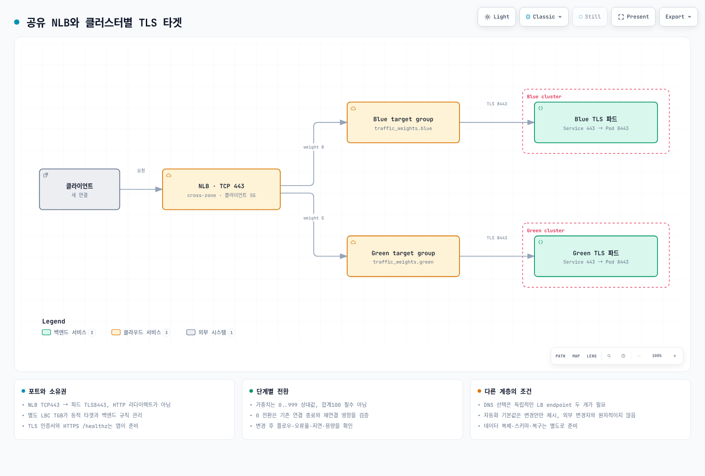

# 인프라 구성 고급

> **검토 기준**: Terraform 1.15.7, AWS Provider 6.64.0, AWS Load Balancer Controller 3.5.0, Boto3 1.43.92
> **마지막 검토**: 2026년 9월 11일. 로컬 스키마·테스트 대역으로 검증했으며 실제 AWS 트래픽 전환은 수행하지 않았습니다.

< [이전: Terraform 인프라](01-infrastructure-setup.md) | [목차](README.md) | [다음: CI 파이프라인](03-ci-pipelines.md) >

두 구성을 구분합니다. **하나의 NLB에서 타겟 그룹 가중치를 조정하는 구성**과 **서로 독립적인 로드밸런서 두 개를 DNS로 선택하는 구성**입니다. 같은 공유 NLB를 가리키는 DNS 이름만 둘로 나눠서는 클러스터를 독립적으로 선택할 수 없습니다.

<span id="블루그린-아키텍처-개요"></span>

## 블루/그린 아키텍처 개요

블루/그린은 다른 환경에서 검증하고 트래픽을 되돌릴 경로를 제공합니다. 무중단, 즉시 롤백, 자동 데이터 복제, cross-AZ 비용 0을 보장하지 않습니다. 목적지의 수용 용량을 확보하고 양쪽 애플리케이션 버전과 데이터·스키마 변경이 호환되는지 확인합니다.

[기초 가이드](01-infrastructure-setup.md)의 기본 Auto Mode pool은 여러 AZ를 사용할 수 있습니다. 클러스터 색상은 워커의 AZ 고정 설정이 아닙니다. EKS 관리형 컨트롤 플레인은 리전에 분산되며, 단일 AZ **워커** 셀에는 별도 NodePool/NodeClass 제약과 복구 용량이 필요합니다. [Zonal 운영](15-zonal-operations-guide.md)을 함께 참고하세요.

| 관점 | 필요한 준비 |
|---|---|
| 트래픽 전환 | 새 플로우·장기 연결·반영 지연·클라이언트 재시도·SLO |
| 데이터 | 복제·일관성·쓰기 소유권·마이그레이션 호환성·복구 시점 |
| 용량 | 목적지의 healthy target과 부하 시험 결과, AZ 장애 시 여유 용량 |
| 설정 소유권 | 리스너 action을 바꾸는 주체를 하나로 정하고 Terraform·스크립트·자동화 조정 |
| 비용 | 두 클러스터, LB/endpoint, 데이터 복제와 cross-AZ 경로를 실제 사용량으로 측정 |



[인터랙티브 다이어그램 보기](https://www.atomai.click/kubernetes-docs/archmaps/ko-ops-02-infrastructure-advanced-0.html)

## NLB 가중치 타겟 그룹

예제는 **TCP/443 리스너에서 파드의 TLS 8443 포트로 전달**합니다. 각 클러스터에 `production/app-https` Service(port 443 → targetPort 8443), 동작하는 TLS 서버와 HTTPS `/healthz`의 200 응답이 먼저 있어야 합니다. TLS 종료와 애플리케이션 인증서는 백엔드가 처리합니다. NLB TCP 리스너 자체는 HTTP→HTTPS 리다이렉트를 생성하지 않습니다.

기초 가이드의 network state를 사용합니다. 아래 파일을 별도 `nlb/` Terraform root에 만들고, S3 backend key를 `nlb/terraform.tfstate`처럼 분리합니다. 실제 state 버킷·VPC CIDR·허용할 클라이언트 CIDR을 입력합니다. 문서용 IP 주소를 실제 접근 권한으로 사용하지 않습니다.

### NLB와 타겟 그룹

```hcl
# nlb/main.tf
terraform {
  required_version = ">= 1.10.0"
  backend "s3" {}
  required_providers {
    aws = { source = "hashicorp/aws", version = "6.64.0" }
  }
}
provider "aws" { region = var.region }
data "aws_caller_identity" "current" {}
data "terraform_remote_state" "network" {
  backend = "s3"
  config = {
    bucket = var.state_bucket_name
    key    = "network/terraform.tfstate"
    region = var.region
  }
}
locals {
  name_prefix = "${var.project_name}-${var.environment}"
  tags        = { Project = var.project_name, Environment = var.environment, ManagedBy = "terraform" }
  alarm_names = { for color in ["blue", "green"] : color => "${local.name_prefix}-${color}-no-healthy" }
  alarm_arns  = { for color, name in local.alarm_names : color => "arn:aws:cloudwatch:${var.region}:${data.aws_caller_identity.current.account_id}:alarm:${name}" }
}
resource "aws_security_group" "nlb" {
  name_prefix = "docs-nlb-"
  description = "Approved clients to the TLS passthrough listener"
  vpc_id      = data.terraform_remote_state.network.outputs.vpc_id
  tags        = local.tags
}
resource "aws_vpc_security_group_ingress_rule" "clients" {
  for_each          = toset(var.allowed_client_cidrs)
  security_group_id = aws_security_group.nlb.id
  cidr_ipv4         = each.value
  ip_protocol       = "tcp"
  from_port         = 443
  to_port           = 443
}
resource "aws_vpc_security_group_egress_rule" "targets" {
  security_group_id = aws_security_group.nlb.id
  cidr_ipv4         = var.target_vpc_cidr
  ip_protocol       = "tcp"
  from_port         = var.backend_port
  to_port           = var.backend_port
}
resource "aws_lb" "shared" {
  name_prefix                      = "docs-"
  internal                         = false
  load_balancer_type               = "network"
  subnets                          = data.terraform_remote_state.network.outputs.public_subnet_ids
  security_groups                  = [aws_security_group.nlb.id]
  enable_cross_zone_load_balancing = true
  enable_deletion_protection       = var.environment == "prod"
  tags                             = local.tags
}
resource "aws_lb_target_group" "cluster" {
  for_each    = toset(["blue", "green"])
  name_prefix = each.key == "blue" ? "doc-b-" : "doc-g-"
  port        = var.backend_port
  protocol    = "TCP"
  target_type = "ip"
  vpc_id      = data.terraform_remote_state.network.outputs.vpc_id
  health_check {
    enabled             = true
    protocol            = "HTTPS"
    port                = "traffic-port"
    path                = "/healthz"
    matcher             = "200"
    interval            = 10
    healthy_threshold   = 2
    unhealthy_threshold = 2
  }
  deregistration_delay   = 30
  connection_termination = true
  preserve_client_ip     = true
  proxy_protocol_v2      = false
  lifecycle { create_before_destroy = true }
  tags = merge(local.tags, { Cluster = each.key })
}
resource "aws_lb_listener" "tls_passthrough" {
  load_balancer_arn = aws_lb.shared.arn
  port              = 443
  protocol          = "TCP"
  default_action {
    type = "forward"
    forward {
      target_group {
        arn    = aws_lb_target_group.cluster["blue"].arn
        weight = var.traffic_weights.blue
      }
      target_group {
        arn    = aws_lb_target_group.cluster["green"].arn
        weight = var.traffic_weights.green
      }
    }
  }
  tags = local.tags
}
```

### 입력값

```hcl
# nlb/variables.tf
variable "region" {
  type    = string
  default = "ap-northeast-2"
}
variable "project_name" {
  type    = string
  default = "eks-platform"
}
variable "environment" {
  type    = string
  default = "dev"
}
variable "state_bucket_name" { type = string }
variable "target_vpc_cidr" {
  description = "CIDR of the same VPC containing the target Pods"
  type        = string
}
variable "allowed_client_cidrs" {
  description = "Approved IPv4 client CIDRs. Supply real values, not documentation addresses"
  type        = list(string)
  validation {
    condition     = length(var.allowed_client_cidrs) > 0 && alltrue([for cidr in var.allowed_client_cidrs : can(cidrnetmask(cidr)) && cidr != "0.0.0.0/0"])
    error_message = "Supply explicit IPv4 CIDRs. Do not expose this example to 0.0.0.0/0."
  }
}
variable "traffic_weights" {
  type    = object({ blue = number, green = number })
  default = { blue = 100, green = 0 }
  validation {
    condition     = alltrue([for value in values(var.traffic_weights) : value >= 0 && value <= 999 && floor(value) == value]) && var.traffic_weights.blue + var.traffic_weights.green > 0
    error_message = "Use integer weights 0..999 with at least one positive weight. The sum need not be 100."
  }
}
variable "automatic_failover" {
  description = "Opt in only after validating capacity, reconnection behavior, and single-writer ownership"
  type        = bool
  default     = false
}
variable "minimum_destination_targets" {
  description = "A demo health gate, not proof of enough capacity. Size from load testing"
  type        = number
  default     = 1
  validation {
    condition     = var.minimum_destination_targets >= 1 && floor(var.minimum_destination_targets) == var.minimum_destination_targets
    error_message = "Use a positive integer destination target count."
  }
}
variable "notification_email" {
  type    = string
  default = null
}

variable "backend_port" {
  description = "Actual Pod TLS targetPort, shared with the Service/TGB networking example"
  type        = number
  default     = 8443
  validation {
    condition     = var.backend_port >= 1 && var.backend_port <= 65535 && floor(var.backend_port) == var.backend_port
    error_message = "Use an integer TCP backend port."
  }
}
```

가중치는 **0–999 정수의 상대값**이며 합계가 100일 필요는 없습니다. 5:5와 50:50은 같은 비율입니다. 플로우 크기·stickiness·샘플링에 따라 실제 요청 수나 바이트 비율은 달라질 수 있습니다. 이 예제에서는 모든 가중치가 0인 입력을 명시적으로 거부합니다.

[NLB 리스너 가이드](https://docs.aws.amazon.com/elasticloadbalancing/latest/network/load-balancer-listeners.html)는 일반 가중치 변경과 0 전환을 구분합니다. 0으로 바꾸면 잠시 후 신규 연결을 받지 않고 기존 연결도 종료됩니다. deregistration delay는 별도 제어입니다. 0 전환 전에 연결 종료·재시도 영향을 확인하고 이후 `NewFlowCount`, `ActiveFlowCount`, 오류율·지연을 관찰합니다.

한 AZ에만 타겟이 있는 그룹으로도 다른 NLB 노드에서 전환할 수 있도록 cross-zone을 켰습니다. 끄면 라우팅 제약이 달라져 기대한 비율이 성립하지 않을 수 있습니다. 실제 경로와 전송비를 확인합니다. NLB 보안 그룹은 생성 시 연결합니다. 보안 그룹 없이 만든 NLB에는 나중에 추가할 수 없습니다.

### 동적 타겟 등록

각 클러스터에 **self-managed AWS Load Balancer Controller**를 별도로 설치·설정하고 `elbv2.k8s.aws/v1beta1` TGB를 사용합니다. 클러스터마다 다른 타겟 그룹을 할당합니다. Terraform은 LB/TG와 프런트 보안 그룹을 소유하고, TGB networking 설정은 컨트롤러에 백엔드 규칙을 요청합니다. 같은 백엔드 규칙이나 수시로 바뀌는 Pod IP attachment를 Terraform과 중복 관리하지 않습니다.

```yaml
# tgb.yaml
# Separately installed AWS Load Balancer Controller, not the built-in Auto Mode TGB API.
# Replace all IDs. The production/app-https Service and its TLS targetPort 8443 must exist.
apiVersion: elbv2.k8s.aws/v1beta1
kind: TargetGroupBinding
metadata:
  name: app-tls
  namespace: production
spec:
  targetGroupARN: arn:aws:elasticloadbalancing:ap-northeast-2:111122223333:targetgroup/REPLACE_BLUE_GROUP/0000000000000001
  targetType: ip
  vpcID: vpc-REPLACE_ME
  serviceRef:
    name: app-https
    port: 443
  networking:
    ingress:
      - from:
          - securityGroup:
              groupID: sg-REPLACE_NLB_SG
        ports:
          - protocol: TCP
            port: 8443
```

Blue 클러스터에는 Blue ARN, Green에는 Green ARN을 넣고 VPC/NLB 보안 그룹 ID도 바꿉니다. 파드 targetPort를 바꾸면 `backend_port`와 TGB networking 포트를 함께 수정합니다. 컨트롤러에는 타겟 등록과 해당 백엔드 보안 그룹 규칙을 조정할 권한이 필요합니다.

Auto Mode 내장 TGB는 `eks.amazonaws.com/v1`이며 [태그·삭제 수명 주기](https://docs.aws.amazon.com/eks/latest/userguide/auto-configure-alb.html)가 다릅니다. 공식 안내는 내장 TGB나 클러스터 삭제 시 타겟 그룹도 삭제된다고 설명하므로 이 외부 소유 구성에 대신 넣지 않습니다. 하나의 TG를 여러 클러스터가 의도적으로 공유할 때는 `multiClusterTargetGroup`을 검토하지만, 여기서는 TG를 분리합니다.

### 출력

```hcl
# nlb/outputs.tf
output "nlb_arn" { value = aws_lb.shared.arn }
output "nlb_dns_name" { value = aws_lb.shared.dns_name }
output "nlb_zone_id" { value = aws_lb.shared.zone_id }
output "listener_arn" { value = aws_lb_listener.tls_passthrough.arn }
output "nlb_security_group_id" { value = aws_security_group.nlb.id }
output "target_group_arns" { value = { for color, group in aws_lb_target_group.cluster : color => group.arn } }
output "traffic_weights" { value = var.traffic_weights }
output "automatic_failover" { value = var.automatic_failover }
output "minimum_destination_targets" { value = var.minimum_destination_targets }

output "backend_port" { value = var.backend_port }
```

## DNS 기반 트래픽 전환

DNS로 클러스터를 선택하려면 **서로 독립적인 실제 ALB/NLB endpoint 두 개**가 각각 의도한 클러스터로 이어져야 합니다. `blue.example.com`과 `green.example.com`이 같은 공유 NLB를 가리키면 이름·가중치·헬스 체크 이름이 달라도 다른 타겟 그룹을 선택하지 않습니다.

별도 `dns/` root는 두 로드밸런서가 이미 존재한다는 전제입니다. `app.<domain>`의 가중치 레코드, 색상별 직접 접근 이름, 별도 `failover.<domain>` 이름을 보여 줍니다. 필요한 이름만 선택하고 같은 이름/type에 서로 다른 라우팅 정책을 섞지 않습니다.

```hcl
# dns/main.tf
terraform {
  required_version = ">= 1.10.0"
  backend "s3" {}
  required_providers {
    aws = { source = "hashicorp/aws", version = "6.64.0" }
  }
}
provider "aws" { region = var.region }
# This is an ALTERNATIVE with two independently provisioned load balancers.
# Supplying the shared NLB from the first example for both entries is rejected.
resource "aws_route53_record" "weighted" {
  for_each       = var.endpoints
  zone_id        = var.hosted_zone_id
  name           = "app.${var.domain_name}"
  type           = "A"
  set_identifier = each.key
  weighted_routing_policy { weight = each.value.weight }
  alias {
    name                   = each.value.dns_name
    zone_id                = each.value.zone_id
    evaluate_target_health = true
  }
}
resource "aws_route53_record" "direct" {
  for_each = var.endpoints
  zone_id  = var.hosted_zone_id
  name     = "${each.key}.${var.domain_name}"
  type     = "A"
  alias {
    name                   = each.value.dns_name
    zone_id                = each.value.zone_id
    evaluate_target_health = true
  }
}
# Different DNS name from the weighted example: don't mix policies on one name/type.
resource "aws_route53_record" "failover" {
  for_each       = var.endpoints
  zone_id        = var.hosted_zone_id
  name           = "failover.${var.domain_name}"
  type           = "A"
  set_identifier = each.key
  failover_routing_policy {
    type = each.key == "blue" ? "PRIMARY" : "SECONDARY"
  }
  alias {
    name                   = each.value.dns_name
    zone_id                = each.value.zone_id
    evaluate_target_health = true
  }
}
```

```hcl
# dns/variables.tf
variable "region" {
  type    = string
  default = "ap-northeast-2"
}
variable "hosted_zone_id" { type = string }
variable "domain_name" { type = string }
variable "endpoints" {
  description = "Two existing independent ALB/NLB endpoints with healthy targets"
  type        = map(object({ dns_name = string, zone_id = string, weight = number }))
  validation {
    condition     = toset(keys(var.endpoints)) == toset(["blue", "green"])
    error_message = "Exactly blue and green endpoints are required."
  }
  validation {
    condition     = length(distinct([for e in values(var.endpoints) : trimprefix(lower(trimsuffix(e.dns_name, ".")), "dualstack.")])) == 2
    error_message = "Two records pointing at the same shared NLB cannot select different clusters."
  }
  validation {
    condition     = alltrue([for e in values(var.endpoints) : e.weight >= 0 && e.weight <= 255 && floor(e.weight) == e.weight]) && sum([for e in values(var.endpoints) : e.weight]) > 0
    error_message = "Use integer DNS weights0..255 with a positive total for this example."
  }
}
```

Route 53 가중치는 ELB와 다른 **0–255 정수**입니다. 가중치 레코드는 같은 DNS 이름/type과 서로 다른 set identifier를 사용합니다. DNS 응답은 캐시되고 연결은 DNS TTL보다 오래 유지될 수 있습니다. Alias TTL은 ELB 타겟을 따르며, TTL을 직접 지정하려고 LB DNS 대신 현재 IP를 복사해 고정하지 않습니다.

`evaluate_target_health`는 타겟 LB의 상태를 평가하며 애플리케이션 트랜잭션의 성공을 보장하지 않습니다. 모든 후보가 비정상이면 DNS 정책의 폴백 동작이 있으므로 완전한 트래픽 차단 장치로 해석하지 않습니다. TTL·헬스 감지·resolver·반영 지연·재연결이 함께 복구 시간을 결정합니다. TTL 60초를 복구 SLA 60초로 쓰지 않습니다.

## 데이터 노드 배치

토폴로지 제약은 배치를 제어하며 데이터 복제나 복구를 만들지 않습니다. AZ에 속하는 EBS와 소비 파드는 호환되어야 하며, `WaitForFirstConsumer`는 스케줄러가 선택한 노드에 맞춰 프로비저닝하게 합니다. Pod nodeSelector/affinity는 적합한 노드를 고르고, NodePool requirements는 오토스케일러의 생성 범위, NodeClass는 subnet 선택을 제어합니다.

아래는 **단일 인스턴스 PostgreSQL 실습이며 HA 데이터베이스가 아닙니다.** 기초 예제의 기본 Auto Mode pool이 default NodeClass를 만들었고 선택 AZ에 용량이 있다는 전제입니다. 승인된 시크릿 관리 방식으로 `data-demo/postgresql-auth`의 `password` 키를 먼저 준비합니다. namespace/Secret 준비 후 워크로드를 배포합니다. 이미지 digest와 UID/GID 999는 공식 PostgreSQL 17 Bookworm 이미지에서 확인했습니다.

```yaml
# data-placement.yaml
apiVersion: v1
kind: Namespace
metadata:
  name: data-demo
---
apiVersion: karpenter.sh/v1
kind: NodePool
metadata:
  name: database-a
spec:
  template:
    metadata:
      labels:
        workload-type: database
    spec:
      nodeClassRef:
        group: eks.amazonaws.com
        kind: NodeClass
        name: default
      requirements:
        - key: topology.kubernetes.io/zone
          operator: In
          values: [ap-northeast-2a]
        - key: karpenter.sh/capacity-type
          operator: In
          values: [on-demand]
        - key: node.kubernetes.io/instance-type
          operator: In
          values: [r6i.2xlarge, r6i.4xlarge]
      taints:
        - key: dedicated
          value: database
          effect: NoSchedule
  limits:
    cpu: "100"
    memory: 400Gi
  disruption:
    consolidationPolicy: WhenEmpty
    consolidateAfter: 30m
---
apiVersion: storage.k8s.io/v1
kind: StorageClass
metadata:
  name: demo-gp3-auto
provisioner: ebs.csi.eks.amazonaws.com
parameters:
  type: gp3
  encrypted: "true"
volumeBindingMode: WaitForFirstConsumer
reclaimPolicy: Retain
allowVolumeExpansion: true
allowedTopologies:
  - matchLabelExpressions:
      - key: eks.amazonaws.com/compute-type
        values: [auto]
---
apiVersion: v1
kind: Service
metadata:
  name: postgresql
  namespace: data-demo
spec:
  clusterIP: None
  selector:
    app: postgresql
  ports:
    - name: postgres
      port: 5432
      targetPort: postgres
---
# Create data-demo/postgresql-auth with a password key through the approved
# secret-management workflow before deploying this single-instance lab.
apiVersion: apps/v1
kind: StatefulSet
metadata:
  name: postgresql
  namespace: data-demo
spec:
  serviceName: postgresql
  replicas: 1
  selector:
    matchLabels:
      app: postgresql
  template:
    metadata:
      labels:
        app: postgresql
    spec:
      nodeSelector:
        workload-type: database
        topology.kubernetes.io/zone: ap-northeast-2a
        eks.amazonaws.com/compute-type: auto
      tolerations:
        - key: dedicated
          operator: Equal
          value: database
          effect: NoSchedule
      securityContext:
        runAsNonRoot: true
        runAsUser: 999
        runAsGroup: 999
        fsGroup: 999
        seccompProfile:
          type: RuntimeDefault
      containers:
        - name: postgres
          image: docker.io/library/postgres@sha256:051f7b7b3abdd564d5d1bd1e8c4b9c1b6e77087d1dd22020ede611c096a272e0
          env:
            - name: POSTGRES_USER
              value: app
            - name: POSTGRES_DB
              value: app
            - name: POSTGRES_PASSWORD_FILE
              value: /run/postgresql-auth/password
            - name: PGDATA
              value: /var/lib/postgresql/data/pgdata
          ports:
            - name: postgres
              containerPort: 5432
          securityContext:
            allowPrivilegeEscalation: false
            capabilities:
              drop: [ALL]
          readinessProbe:
            exec:
              command: [pg_isready, -U, app, -d, app]
            initialDelaySeconds: 10
            periodSeconds: 5
          resources:
            requests:
              cpu: "2"
              memory: 4Gi
            limits:
              cpu: "4"
              memory: 8Gi
          volumeMounts:
            - name: data
              mountPath: /var/lib/postgresql/data
            - name: auth
              mountPath: /run/postgresql-auth
              readOnly: true
      volumes:
        - name: auth
          secret:
            secretName: postgresql-auth
            defaultMode: 0440
  volumeClaimTemplates:
    - metadata:
        name: data
      spec:
        accessModes: [ReadWriteOnce]
        storageClassName: demo-gp3-auto
        resources:
          requests:
            storage: 10Gi
```

파드는 database pool의 라벨을 선택하고 taint를 허용하며 AZ-a를 지정합니다. StorageClass는 Auto Mode provisioner를 사용하고 WFFC가 이 배치에 맞는 스토리지를 선택합니다. `pgdata` 하위 디렉터리는 `lost+found`가 있는 EBS 파일시스템 루트에서 initdb가 실패하는 일을 피합니다. `Retain`은 PVC 삭제 후 볼륨 보존 정책이며 백업이 아닙니다. 실습 정리 시 남은 PV/EBS도 확인합니다.

다른 AZ를 사용하려면 NodePool requirement와 소비 파드 배치를 함께 바꿉니다. NLB weight가 바뀐다고 볼륨이 다른 AZ로 이동하지 않습니다. 운영에는 백업·복제·장애 조치·마이그레이션과 측정한 복구 절차가 필요합니다. [스토리지](../core/04-storage.md), [Kafka on EKS](../data-on-eks/kafka/README.md)를 참고하세요.

### 분산·친화성 설정 발췌

기존 워크로드에 다음 topology spread 규칙을 병합할 수 있습니다. `maxSkew: 1`과 `DoNotSchedule`은 적합한 도메인 사이의 차이를 제한하며, 없는 노드를 생성하거나 AZ 3개를 확보해 주지 않습니다.

```yaml
# 기존 Deployment의 spec.template.spec 아래에 병합하는 발췌입니다.
topologySpreadConstraints:
  - maxSkew: 1
    topologyKey: kubernetes.io/hostname
    whenUnsatisfiable: DoNotSchedule
    labelSelector:
      matchLabels:
        app: api-server
```

다른 네임스페이스의 API 파드와 가까이 배치하려면 peer namespace를 지정합니다. 아래는 완화된 AZ 선호이며 데이터 복제나 동일 노드 배치를 보장하지 않습니다.

```yaml
# spec.template.spec 아래에 병합하는 발췌입니다.
affinity:
  podAffinity:
    preferredDuringSchedulingIgnoredDuringExecution:
      - weight: 100
        podAffinityTerm:
          namespaces: [production]
          labelSelector:
            matchLabels:
              app: api-server
          topologyKey: topology.kubernetes.io/zone
```

기존의 단순 Kafka/ZooKeeper StatefulSet은 완전한 Kafka 배포가 아닙니다. 파드 이름은 숫자 broker ID가 아니며 quorum·listeners·advertised addresses·스토리지·복제를 함께 구성해야 합니다. [Strimzi 가이드](../data-on-eks/kafka/02-strimzi-operator.md)와 [rack awareness](15-zonal-operations-guide.md)를 사용합니다. Kubernetes 파드를 분산하는 것만으로 클러스터 간 Kafka 복제가 생기지는 않습니다.

## 장애 조치 자동화

아래는 **단일 리스너 참조 예제**이며 운영 장애 조치의 안전성을 보장하지 않습니다. 기본 `automatic_failover=false`는 변경안을 알리고 `ModifyListener` 권한도 주지 않습니다. 목적지 수용 용량, 연결 종료·재시도, 모니터링, 변경 주체를 하나로 운영하는 절차를 검증한 후에만 켭니다.

이벤트 경로는 **CloudWatch metric alarm → 입력 SNS → Lambda** 하나입니다. 결정·실패 알림은 다른 SNS로 보냅니다. Alarm action에 Lambda ARN도 함께 추가하지 않습니다. CloudWatch의 직접 Lambda 이벤트는 `alarmData.state.value`를 사용하지만, 이 핸들러는 의도적으로 SNS envelope만 받습니다.

```hcl
# nlb/failover.tf
resource "aws_sns_topic" "alarm_input" {
  name = "${local.name_prefix}-alarm-input"
  tags = local.tags
}
resource "aws_sns_topic" "notifications" {
  name = "${local.name_prefix}-transition-notifications"
  tags = local.tags
}
resource "aws_sns_topic_policy" "alarms" {
  for_each = { input = aws_sns_topic.alarm_input.arn, output = aws_sns_topic.notifications.arn }
  arn      = each.value
  policy = jsonencode({
    Version = "2012-10-17"
    Statement = [{
      Effect    = "Allow"
      Principal = { Service = "cloudwatch.amazonaws.com" }
      Action    = "sns:Publish"
      Resource  = each.value
      Condition = {
        StringEquals = { "aws:SourceAccount" = data.aws_caller_identity.current.account_id }
        ArnEquals    = { "aws:SourceArn" = values(local.alarm_arns) }
      }
    }]
  })
}

resource "aws_cloudwatch_metric_alarm" "health" {
  for_each            = toset(["blue", "green"])
  alarm_name          = local.alarm_names[each.key]
  namespace           = "AWS/NetworkELB"
  metric_name         = "HealthyHostCount"
  statistic           = "Maximum"
  period              = 60
  evaluation_periods  = 2
  datapoints_to_alarm = 2
  comparison_operator = "LessThanThreshold"
  threshold           = 1
  treat_missing_data  = "missing"
  dimensions = {
    LoadBalancer = aws_lb.shared.arn_suffix
    TargetGroup  = aws_lb_target_group.cluster[each.key].arn_suffix
  }
  alarm_actions             = [aws_sns_topic.alarm_input.arn]
  ok_actions                = [aws_sns_topic.notifications.arn]
  insufficient_data_actions = [aws_sns_topic.notifications.arn]
  depends_on                = [aws_sns_topic_policy.alarms]
  tags                      = local.tags
}
resource "aws_iam_role" "failover" {
  name_prefix = "docs-failover-"
  assume_role_policy = jsonencode({
    Version   = "2012-10-17"
    Statement = [{ Effect = "Allow", Action = "sts:AssumeRole", Principal = { Service = "lambda.amazonaws.com" } }]
  })
  tags = local.tags
}
resource "aws_cloudwatch_log_group" "failover" {
  name              = "/aws/lambda/${local.name_prefix}-failover"
  retention_in_days = 30
  tags              = local.tags
}
resource "aws_iam_role_policy" "failover" {
  role = aws_iam_role.failover.id
  policy = jsonencode({
    Version = "2012-10-17"
    Statement = concat([
      {
        Effect    = "Allow"
        Action    = ["elasticloadbalancing:DescribeListeners", "elasticloadbalancing:DescribeTargetHealth", "cloudwatch:DescribeAlarms"]
        Resource  = "*"
        Condition = { StringEquals = { "aws:RequestedRegion" = var.region } }
      },
      {
        Effect   = "Allow"
        Action   = ["logs:CreateLogStream", "logs:PutLogEvents"]
        Resource = "${aws_cloudwatch_log_group.failover.arn}:*"
      },
      {
        Effect   = "Allow"
        Action   = "sns:Publish"
        Resource = aws_sns_topic.notifications.arn
      }
      ], var.automatic_failover ? [{
        Effect   = "Allow"
        Action   = "elasticloadbalancing:ModifyListener"
        Resource = aws_lb_listener.tls_passthrough.arn
    }] : [])
  })
}
resource "aws_lambda_function" "failover" {
  function_name                  = "${local.name_prefix}-failover"
  filename                       = "${path.module}/lambda/failover.zip"
  source_code_hash               = filebase64sha256("${path.module}/lambda/failover.zip")
  handler                        = "failover.lambda_handler"
  runtime                        = "python3.12"
  timeout                        = 60
  memory_size                    = 256
  reserved_concurrent_executions = 1
  role                           = aws_iam_role.failover.arn
  environment {
    variables = {
      ACCOUNT_ID                  = data.aws_caller_identity.current.account_id
      LISTENER_ARN                = aws_lb_listener.tls_passthrough.arn
      ALARM_ARNS_JSON             = jsonencode(local.alarm_arns)
      TARGET_GROUP_ARNS_JSON      = jsonencode({ for color, group in aws_lb_target_group.cluster : color => group.arn })
      ALARM_TOPIC_ARN             = aws_sns_topic.alarm_input.arn
      NOTIFICATION_TOPIC_ARN      = aws_sns_topic.notifications.arn
      AUTOMATIC_FAILOVER          = tostring(var.automatic_failover)
      MINIMUM_DESTINATION_TARGETS = tostring(var.minimum_destination_targets)
    }
  }
  depends_on = [aws_iam_role_policy.failover, aws_cloudwatch_log_group.failover]
  tags       = local.tags
}
resource "aws_lambda_permission" "sns" {
  statement_id   = "AlarmTopicOnly"
  action         = "lambda:InvokeFunction"
  function_name  = aws_lambda_function.failover.function_name
  principal      = "sns.amazonaws.com"
  source_arn     = aws_sns_topic.alarm_input.arn
  source_account = data.aws_caller_identity.current.account_id
}
resource "aws_sns_topic_subscription" "lambda" {
  topic_arn  = aws_sns_topic.alarm_input.arn
  protocol   = "lambda"
  endpoint   = aws_lambda_function.failover.arn
  depends_on = [aws_lambda_permission.sns, aws_lambda_function_event_invoke_config.failover]
}
resource "aws_sns_topic_subscription" "operator" {
  for_each = var.notification_email == null ? {} : {
    alarms    = aws_sns_topic.alarm_input.arn
    decisions = aws_sns_topic.notifications.arn
  }
  topic_arn = each.value
  protocol  = "email"
  endpoint  = var.notification_email
}
resource "aws_lambda_function_event_invoke_config" "failover" {
  function_name                = aws_lambda_function.failover.function_name
  maximum_event_age_in_seconds = 300
  maximum_retry_attempts       = 1
  destination_config {
    on_failure { destination = aws_sns_topic.notifications.arn }
  }
}
```

알람은 Maximum HealthyHostCount로 healthy target이 없는 상태를 감지합니다. 누락된 메트릭은 `INSUFFICIENT_DATA`로 남기고 운영자에게 알리며, 0으로 만들어 무조건 전환하지 않습니다. 목적지 healthy target 수가 양수인 것은 필요한 조건일 뿐 수용 용량이나 애플리케이션 전체의 정상 동작을 증명하지 않습니다.

### 핸들러와 패키지

정확한 알람·입력 토픽·계정, 이벤트 시각, 현재 알람과 타겟 상태, 리스너/TG 매핑을 확인합니다. 다른 forward 속성은 보존하고 이미 적용된 전환은 건너뜁니다. 리스너 ARN 문자열에서 포트를 추측하지 않으며, 결과 알림이 입력 토픽으로 되돌아가지 않습니다.

```python
# nlb/lambda/failover.py
"""SNS alarm -> checked proposal or single-listener update. No automatic failback."""
import copy
import json
import logging
import os
from datetime import datetime, timezone
from functools import lru_cache

import boto3
from botocore.config import Config

LOG = logging.getLogger(__name__)
LOG.setLevel(logging.INFO)


def timestamp(value):
    parsed = value if isinstance(value, datetime) else datetime.fromisoformat(value.replace("Z", "+00:00"))
    if parsed.tzinfo is None:
        raise ValueError("Timezone is required")
    return parsed.astimezone(timezone.utc)


def configuration(env):
    alarms = json.loads(env["ALARM_ARNS_JSON"])
    targets = json.loads(env["TARGET_GROUP_ARNS_JSON"])
    if set(alarms) != {"blue", "green"} or set(targets) != {"blue", "green"}:
        raise ValueError("Exactly blue and green are required")
    if len(set(alarms.values())) != 2 or len(set(targets.values())) != 2:
        raise ValueError("Alarm and target-group ARNs must be distinct")
    if env["ALARM_TOPIC_ARN"] == env["NOTIFICATION_TOPIC_ARN"]:
        raise ValueError("Alarm input and notification output must be separate")
    minimum = int(env.get("MINIMUM_DESTINATION_TARGETS", "1"))
    if minimum < 1:
        raise ValueError("Destination target minimum must be positive")
    return {
        "alarms": alarms, "targets": targets,
        "listener": env["LISTENER_ARN"], "account": env["ACCOUNT_ID"],
        "input_topic": env["ALARM_TOPIC_ARN"], "output_topic": env["NOTIFICATION_TOPIC_ARN"],
        "apply": env.get("AUTOMATIC_FAILOVER", "false") == "true",
        "minimum": minimum,
    }


def healthy_count(elb, arn):
    response = elb.describe_target_health(TargetGroupArn=arn)
    return sum(t["TargetHealth"]["State"] == "healthy" for t in response["TargetHealthDescriptions"])


def listener_actions(elb, cfg):
    listeners = elb.describe_listeners(ListenerArns=[cfg["listener"]])["Listeners"]
    if len(listeners) != 1 or listeners[0]["Port"] != 443 or listeners[0]["Protocol"] != "TCP":
        raise ValueError("Expected the configured TCP/443 listener")
    actions = listeners[0]["DefaultActions"]
    if len(actions) != 1 or actions[0]["Type"] != "forward":
        raise ValueError("Expected one forward action")
    groups = actions[0].get("ForwardConfig", {}).get("TargetGroups", [])
    if len(groups) != 2 or {g["TargetGroupArn"] for g in groups} != set(cfg["targets"].values()):
        raise ValueError("Unexpected target groups: refusing to overwrite listener configuration")
    return actions


def process_record(record, cfg, clients, now):
    if not isinstance(record, dict):
        return {"status": "invalid_record"}
    if record.get("EventSource") != "aws:sns" or record.get("Sns", {}).get("TopicArn") != cfg["input_topic"]:
        return {"status": "ignored_source"}
    try:
        message = json.loads(record["Sns"]["Message"])
        if not isinstance(message, dict) or message.get("NewStateValue") != "ALARM":
            return {"status": "ignored_state"}
        source = next((color for color, arn in cfg["alarms"].items() if message.get("AlarmArn") == arn), None)
        if source is None or str(message.get("AWSAccountId")) != cfg["account"]:
            return {"status": "ignored_alarm"}
        changed = timestamp(message["StateChangeTime"])
    except (KeyError, ValueError, TypeError, AttributeError):
        return {"status": "invalid_message"}
    age = (now - changed).total_seconds()
    if age < -30 or age > 300:
        return {"status": "stale_message"}

    destination = "green" if source == "blue" else "blue"
    names = [arn.split(":alarm:", 1)[1] for arn in cfg["alarms"].values()]
    alarms = clients["cloudwatch"].describe_alarms(AlarmNames=names)["MetricAlarms"]
    states = {alarm["AlarmArn"]: alarm for alarm in alarms}
    current = states.get(cfg["alarms"][source])
    other = states.get(cfg["alarms"][destination])
    if not current or not other or current["StateValue"] != "ALARM" or other["StateValue"] != "OK":
        return {"status": "alarm_state_changed"}
    transition = timestamp(current.get("StateTransitionedTimestamp") or current.get("StateUpdatedTimestamp"))
    if abs((transition - changed).total_seconds()) > 1:
        return {"status": "stale_transition"}

    elb = clients["elbv2"]
    if healthy_count(elb, cfg["targets"][source]) != 0:
        return {"status": "source_recovered"}
    if healthy_count(elb, cfg["targets"][destination]) < cfg["minimum"]:
        return {"status": "destination_not_ready"}
    before = listener_actions(elb, cfg)
    groups = before[0]["ForwardConfig"]["TargetGroups"]
    weights = {g["TargetGroupArn"]: g.get("Weight", 1) for g in groups}
    if weights[cfg["targets"][source]] == 0 and weights[cfg["targets"][destination]] > 0:
        return {"status": "already_shifted"}
    proposed = copy.deepcopy(before)
    for group in proposed[0]["ForwardConfig"]["TargetGroups"]:
        group["Weight"] = 100 if group["TargetGroupArn"] == cfg["targets"][destination] else 0

    status = "proposal"
    if cfg["apply"]:
        # Point-in-time checks, not an atomic compare-and-swap with external writers.
        if listener_actions(elb, cfg) != before:
            return {"status": "concurrent_change"}
        if healthy_count(elb, cfg["targets"][destination]) < cfg["minimum"]:
            return {"status": "destination_changed"}
        elb.modify_listener(ListenerArn=cfg["listener"], DefaultActions=proposed)
        status = "weights_updated"
    result = {"status": status, "from": source, "to": destination}
    try:
        clients["sns"].publish(
            TopicArn=cfg["output_topic"], Subject="EKS traffic transition decision",
            Message=json.dumps(result),
        )
    except Exception:
        # Do not replay a successful listener mutation merely because notification failed.
        LOG.exception("Decision notification failed", extra={"decision_status": status})
        result["notification_failed"] = True
    LOG.info("Traffic transition decision: %s", json.dumps(result))
    return result


def handle(event, cfg, clients, now):
    if not isinstance(event, dict) or not isinstance(event.get("Records"), list):
        return [{"status": "unsupported_envelope"}]
    return [process_record(record, cfg, clients, now) for record in event["Records"]]


@lru_cache(maxsize=1)
def aws_clients():
    config = Config(connect_timeout=2, read_timeout=5, retries={"mode": "standard", "total_max_attempts": 2})
    return {name: boto3.client(name, config=config) for name in ("elbv2", "cloudwatch", "sns")}


def lambda_handler(event, context):
    return handle(event, configuration(os.environ), aws_clients(), datetime.now(timezone.utc))
```

`nlb/lambda/requirements.txt`:

```text
boto3==1.43.92
botocore==1.43.92
jmespath==1.1.0
python-dateutil==2.9.0.post0
s3transfer==0.19.2
six==1.17.0
urllib3==2.7.0
```

Terraform plan 전에 ZIP을 만듭니다. 의존성과 `failover.py`를 같은 최상위 경로에 넣어 `failover.lambda_handler`와 일치시킵니다.

```bash
# nlb/에서, Python 3.12가 있는 깨끗한 빌드 환경에서 실행합니다.
python3.12 -m pip install --target lambda/package -r lambda/requirements.txt
cp lambda/failover.py lambda/package/failover.py
python3.12 - <<'PYCODE'
from pathlib import Path
from zipfile import ZipFile, ZIP_DEFLATED
package = Path("lambda/package")
with ZipFile("lambda/failover.zip", "w", ZIP_DEFLATED) as archive:
    for file in sorted(package.rglob("*")):
        if file.is_file() and "__pycache__" not in file.parts:
            archive.write(file, file.relative_to(package))
PYCODE
terraform init -backend-config=../environment.backend.json -backend-config=key=nlb/terraform.tfstate
terraform validate
terraform plan -var-file=environment.tfvars.json
# 전제 조건과 알림 구독을 준비하고 plan을 검토한 후 승인합니다.
terraform apply -var-file=environment.tfvars.json
```

backend·변수 파일에는 실제 환경 값을 넣습니다. 빌드마다 깨끗한 package 디렉터리를 사용하며 Lambda code hash가 ZIP 변경을 추적합니다. 여기의 의존성은 pure Python 패키지입니다.

Reserved concurrency는 이 함수의 실행을 직렬화하지만 Terraform이나 수동 API 변경자까지 직렬화하지 않습니다. 마지막 읽기·헬스 확인도 특정 시점의 검사이며 외부 변경자와 원자적 compare-and-swap을 수행하지 않습니다. 다른 변경자를 조정하고 계획 배포 중에는 자동화를 멈춘 뒤, 다음 apply 전에 실제 weight를 IaC와 맞춥니다. API 장애·쿼터·알림 전달·컨트롤 플레인 장애에는 별도 운영 대응이 필요합니다. 시간이 지나면 자동으로 80/20으로 복구하는 타이머는 넣지 않았습니다.

자체 구현과 권한이 없는 EventBridge 정기 health checker를 선언하지 않습니다. CloudWatch가 이미 이 메트릭을 평가합니다. 정기 애플리케이션 probe가 필요하면 별도 워크로드와 이벤트 계약을 구현·검증합니다.

### 수동·점진적 전환

의도한 backend/cache와 완전한 변수 파일로 초기화한 NLB root에서 사용합니다. 먼저 자동 전환과 다른 변경자를 멈춥니다. 숫자 범위와 타겟 헬스를 확인하고 전체 plan을 보여 준 뒤 승인을 받습니다. 상시 `-target`, 기본 목적지, 끝나지 않을 수 있는 타이머 루프를 사용하지 않습니다.

```bash
# traffic-shift.sh
#!/usr/bin/env bash
set -euo pipefail
if (( $# != 4 )); then
  echo "Usage: $0 <initialized-nlb-root> <variables-file> <blue-weight> <green-weight>" >&2
  exit 2
fi
DOCS_NLB_ROOT="$(cd -- "$1" && pwd -P)"
DOCS_VARIABLES_FILE="$(cd -- "$(dirname -- "$2")" && pwd -P)/$(basename -- "$2")"
[[ -f "$DOCS_VARIABLES_FILE" ]] || exit 2
for value in "$3" "$4"; do
  [[ "$value" =~ ^[0-9]{1,3}$ ]] || { echo "Weights must be integers 0..999" >&2; exit 2; }
done
blue_weight=$((10#$3))
green_weight=$((10#$4))
(( blue_weight + green_weight > 0 )) || { echo "At least one weight must be positive" >&2; exit 2; }
: "${AWS_REGION:?Set the intended AWS region}"
outputs="$(terraform -chdir="$DOCS_NLB_ROOT" output -json)"
[[ "$(jq -er '.automatic_failover.value | tostring' <<<"$outputs")" == false ]] || {
  echo "Pause automatic failover and other writers before manual changes" >&2
  exit 1
}
listener="$(jq -er '.listener_arn.value' <<<"$outputs")"
minimum="$(jq -er '.minimum_destination_targets.value' <<<"$outputs")"
[[ "$minimum" =~ ^[1-9][0-9]*$ ]] || exit 1
aws elbv2 describe-listeners --region "$AWS_REGION" --listener-arns "$listener" \
  --query 'Listeners[0].DefaultActions' --output json
for color in blue green; do
  weight="$blue_weight"
  [[ "$color" == green ]] && weight="$green_weight"
  target="$(jq -er --arg color "$color" '.target_group_arns.value[$color]' <<<"$outputs")"
  count="$(aws elbv2 describe-target-health --region "$AWS_REGION" \
    --target-group-arn "$target" --output json | jq '[.TargetHealthDescriptions[] | select(.TargetHealth.State == "healthy")] | length')"
  if (( weight > 0 )) && ! jq -en --argjson count "$count" --argjson minimum "$minimum" '$count >= $minimum' >/dev/null; then
    echo "$color has insufficient healthy targets ($count < $minimum)" >&2
    exit 1
  fi
done
workdir="$(mktemp -d "${TMPDIR:-/tmp}/docs-traffic.XXXXXX")"
plan="$workdir/traffic.tfplan"
trap 'rm -f -- "$plan"; rmdir -- "$workdir"' EXIT
terraform -chdir="$DOCS_NLB_ROOT" plan -input=false -out="$plan" -var-file="$DOCS_VARIABLES_FILE" \
  -var=automatic_failover=false -var="traffic_weights={blue=$blue_weight,green=$green_weight}"
terraform -chdir="$DOCS_NLB_ROOT" show -no-color "$plan"
echo "Review the FULL plan and capacity/SLO checks. Weight zero can close existing connections."
read -r -p "Type apply to execute this reviewed plan: " confirmation
[[ "$confirmation" == apply ]] || { echo "No changes applied"; exit 0; }
terraform -chdir="$DOCS_NLB_ROOT" apply "$plan"
echo "Configuration applied. Verify new/active flows, errors, and latency before another step."
```

```bash
# 실제 경로와 AWS 인증 환경으로 바꿉니다. 한 단계씩 검토합니다.
export AWS_REGION=ap-northeast-2
bash traffic-shift.sh ./nlb ./nlb/environment.tfvars.json 95 5
# 새/기존 플로우, 오류율, 지연, 목적지 용량, 데이터 호환성 확인
bash traffic-shift.sh ./nlb ./nlb/environment.tfvars.json 50 50
# 검증에 통과하고 재연결 영향도 수용 가능할 때만 진행
bash traffic-shift.sh ./nlb ./nlb/environment.tfvars.json 0 100
```

API/apply 성공은 설정이 바뀌었다는 뜻이며 모든 트래픽·기존 연결이 이동했다는 증거가 아닙니다. 중단·복구 기준은 워크로드 SLO에서 정하며 보편적인 “오류율 5% / 지연 200%”로 고정하지 않습니다.

## 참고 자료

- [NLB 리스너와 가중치 그룹](https://docs.aws.amazon.com/elasticloadbalancing/latest/network/load-balancer-listeners.html)
- [NLB 보안 그룹](https://docs.aws.amazon.com/elasticloadbalancing/latest/network/load-balancer-security-groups.html)
- [NLB CloudWatch 메트릭](https://docs.aws.amazon.com/elasticloadbalancing/latest/network/load-balancer-cloudwatch-metrics.html)
- [Route 53 가중치 레코드](https://docs.aws.amazon.com/Route53/latest/DeveloperGuide/resource-record-sets-values-weighted.html)
- [CloudWatch 직접 Lambda 이벤트](https://docs.aws.amazon.com/AmazonCloudWatch/latest/monitoring/alarms-and-actions-Lambda.html)
- [LBC 3.5.0 TargetGroupBinding](https://github.com/kubernetes-sigs/aws-load-balancer-controller/blob/v3.5.0/docs/guide/targetgroupbinding/targetgroupbinding.md)

< [이전: Terraform 인프라](01-infrastructure-setup.md) | [목차](README.md) | [다음: CI 파이프라인](03-ci-pipelines.md) >
