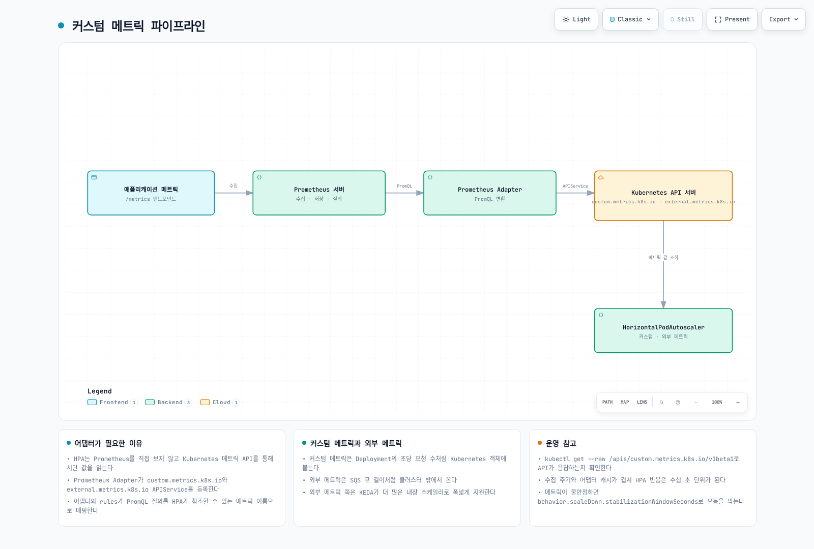

# 스케일링 전략

> **지원 버전**: Kubernetes 1.28+, KEDA 2.14+, VPA 1.0+ **마지막 업데이트**: 2026년 2월 21일

< [이전: GitOps 자동화](05-gitops-automation.md) | [목차](./README.md) | [다음: 운영 알림 구성](07-observability-alerts.md) >

***

## 개요

EKS 클러스터의 효율적인 스케일링은 성능, 비용, 안정성의 균형을 맞추는 핵심 운영 역량입니다. 이 문서에서는 CPU/메모리 외의 커스텀 메트릭을 활용한 HPA, 이벤트 드리븐 스케일링을 위한 KEDA, 리소스 최적화를 위한 VPA, 그리고 비용 효율적인 Spot 인스턴스 활용 전략을 다룹니다.

### 학습 목표

* Prometheus 메트릭 기반 HPA 커스텀 메트릭 구성
* KEDA를 활용한 다양한 이벤트 소스 기반 스케일링
* VPA와 HPA의 효과적인 조합 전략 이해
* Pod Deletion Cost를 활용한 스케일링 우선순위 제어
* Spot 인스턴스의 안전한 활용 및 Fallback 전략

***

## 1. HPA Custom Metrics

기본 CPU/메모리 메트릭 외에 RPS, 큐 깊이, 비즈니스 메트릭 등을 기반으로 스케일링할 수 있습니다.



[🔍 인터랙티브 다이어그램 보기](https://www.atomai.click/kubernetes-docs/archmaps/ko-ops-06-scaling-strategies-0.html)

### 1.1 Prometheus Adapter 설치

**Helm values.yaml:**

```yaml
# prometheus-adapter-values.yaml
prometheus:
  url: http://prometheus.monitoring.svc
  port: 9090

replicas: 2

resources:
  requests:
    cpu: 100m
    memory: 128Mi
  limits:
    cpu: 500m
    memory: 512Mi

# 커스텀 메트릭 규칙
rules:
  default: false

  # 외부 메트릭 (External Metrics)
  external: []

  # 리소스 메트릭 (기본 CPU/Memory 대체)
  resource:
    cpu:
      containerQuery: |
        sum(rate(container_cpu_usage_seconds_total{<<.LabelMatchers>>}[3m])) by (<<.GroupBy>>)
      nodeQuery: |
        sum(rate(container_cpu_usage_seconds_total{<<.LabelMatchers>>, id='/'}[3m])) by (<<.GroupBy>>)
      resources:
        overrides:
          namespace:
            resource: namespace
          node:
            resource: node
          pod:
            resource: pod
      containerLabel: container
    memory:
      containerQuery: |
        sum(container_memory_working_set_bytes{<<.LabelMatchers>>}) by (<<.GroupBy>>)
      nodeQuery: |
        sum(container_memory_working_set_bytes{<<.LabelMatchers>>,id='/'}) by (<<.GroupBy>>)
      resources:
        overrides:
          namespace:
            resource: namespace
          node:
            resource: node
          pod:
            resource: pod
      containerLabel: container

  # 커스텀 메트릭 규칙
  custom:
    # HTTP RPS 메트릭
    - seriesQuery: 'http_requests_total{namespace!="",pod!=""}'
      resources:
        overrides:
          namespace:
            resource: namespace
          pod:
            resource: pod
      name:
        matches: "^(.*)_total$"
        as: "${1}_per_second"
      metricsQuery: |
        sum(rate(<<.Series>>{<<.LabelMatchers>>}[2m])) by (<<.GroupBy>>)

    # HTTP 요청 지연시간
    - seriesQuery: 'http_request_duration_seconds_bucket{namespace!="",pod!=""}'
      resources:
        overrides:
          namespace:
            resource: namespace
          pod:
            resource: pod
      name:
        matches: "^(.*)_bucket$"
        as: "${1}_p99"
      metricsQuery: |
        histogram_quantile(0.99, sum(rate(<<.Series>>{<<.LabelMatchers>>}[5m])) by (le, <<.GroupBy>>))

    # 활성 연결 수
    - seriesQuery: 'nginx_connections_active{namespace!="",pod!=""}'
      resources:
        overrides:
          namespace:
            resource: namespace
          pod:
            resource: pod
      name:
        matches: "^(.*)$"
        as: "${1}"
      metricsQuery: |
        sum(<<.Series>>{<<.LabelMatchers>>}) by (<<.GroupBy>>)

    # 큐 깊이 (Redis)
    - seriesQuery: 'redis_queue_length{namespace!="",service!=""}'
      resources:
        overrides:
          namespace:
            resource: namespace
          service:
            resource: service
      name:
        matches: "^(.*)$"
        as: "${1}"
      metricsQuery: |
        sum(<<.Series>>{<<.LabelMatchers>>}) by (<<.GroupBy>>)

# ServiceMonitor 생성
serviceMonitor:
  enabled: true
  namespace: monitoring

# PodDisruptionBudget
podDisruptionBudget:
  enabled: true
  minAvailable: 1

# 높은 가용성 설정
affinity:
  podAntiAffinity:
    preferredDuringSchedulingIgnoredDuringExecution:
      - weight: 100
        podAffinityTerm:
          labelSelector:
            matchLabels:
              app.kubernetes.io/name: prometheus-adapter
          topologyKey: kubernetes.io/hostname
```

**Helm 설치:**

```bash
# Prometheus Adapter Helm repo 추가
helm repo add prometheus-community https://prometheus-community.github.io/helm-charts
helm repo update

# 설치
helm upgrade --install prometheus-adapter prometheus-community/prometheus-adapter \
  -n monitoring \
  -f prometheus-adapter-values.yaml

# 설치 확인
kubectl get --raw /apis/custom.metrics.k8s.io/v1beta1 | jq .
kubectl get --raw /apis/external.metrics.k8s.io/v1beta1 | jq .
```

### 1.2 RPS 기반 HPA

초당 요청 수(RPS)를 기반으로 Pod를 스케일링합니다.

**애플리케이션 메트릭 노출:**

```yaml
# deployment.yaml
apiVersion: apps/v1
kind: Deployment
metadata:
  name: myapp
  namespace: production
spec:
  replicas: 3
  selector:
    matchLabels:
      app: myapp
  template:
    metadata:
      labels:
        app: myapp
      annotations:
        prometheus.io/scrape: "true"
        prometheus.io/port: "8080"
        prometheus.io/path: "/metrics"
    spec:
      containers:
        - name: myapp
          image: myapp:v1.0.0
          ports:
            - containerPort: 8080
              name: http
          resources:
            requests:
              cpu: 100m
              memory: 128Mi
            limits:
              cpu: 1000m
              memory: 512Mi
---
# servicemonitor.yaml
apiVersion: monitoring.coreos.com/v1
kind: ServiceMonitor
metadata:
  name: myapp
  namespace: production
  labels:
    release: prometheus
spec:
  selector:
    matchLabels:
      app: myapp
  endpoints:
    - port: http
      path: /metrics
      interval: 15s
  namespaceSelector:
    matchNames:
      - production
```

**PromQL 쿼리 테스트:**

```bash
# Prometheus에서 직접 쿼리 테스트
curl -s "http://prometheus.monitoring:9090/api/v1/query" \
  --data-urlencode 'query=sum(rate(http_requests_total{namespace="production",service="myapp"}[2m]))' | jq

# 예상 결과: 전체 RPS
# {"status":"success","data":{"resultType":"vector","result":[{"metric":{},"value":[1234567890,"150.5"]}]}}

# Pod당 RPS
curl -s "http://prometheus.monitoring:9090/api/v1/query" \
  --data-urlencode 'query=sum(rate(http_requests_total{namespace="production",service="myapp"}[2m])) by (pod)' | jq
```

**RPS 기반 HPA:**

```yaml
# hpa-rps.yaml
apiVersion: autoscaling/v2
kind: HorizontalPodAutoscaler
metadata:
  name: myapp-rps
  namespace: production
spec:
  scaleTargetRef:
    apiVersion: apps/v1
    kind: Deployment
    name: myapp

  minReplicas: 3
  maxReplicas: 50

  metrics:
    # 커스텀 메트릭: Pod당 RPS
    - type: Pods
      pods:
        metric:
          name: http_requests_per_second
        target:
          type: AverageValue
          averageValue: "100"  # Pod당 100 RPS 목표

  # 스케일링 동작 세부 설정
  behavior:
    scaleUp:
      stabilizationWindowSeconds: 0  # 즉시 스케일 업
      policies:
        - type: Percent
          value: 100  # 현재 replicas의 100%까지 증가 가능
          periodSeconds: 15
        - type: Pods
          value: 4  # 또는 한 번에 최대 4개 추가
          periodSeconds: 15
      selectPolicy: Max  # 두 정책 중 큰 값 선택

    scaleDown:
      stabilizationWindowSeconds: 300  # 5분 안정화 기간
      policies:
        - type: Percent
          value: 10  # 15초마다 최대 10% 감소
          periodSeconds: 15
        - type: Pods
          value: 2  # 또는 한 번에 최대 2개 감소
          periodSeconds: 60
      selectPolicy: Min  # 두 정책 중 작은 값 선택 (보수적)
```

### 1.3 CloudWatch External Metrics

CloudWatch 메트릭을 HPA에서 사용하기 위해 CloudWatch Exporter를 설치합니다.

**CloudWatch Exporter 설정:**

```yaml
# cloudwatch-exporter-values.yaml
serviceAccount:
  create: true
  name: cloudwatch-exporter
  annotations:
    eks.amazonaws.com/role-arn: arn:aws:iam::111122223333:role/CloudWatchExporterRole

config: |
  region: ap-northeast-2
  metrics:
    # SQS 큐 메트릭
    - aws_namespace: AWS/SQS
      aws_metric_name: ApproximateNumberOfMessagesVisible
      aws_dimensions:
        - QueueName
      aws_statistics:
        - Average
      aws_tag_select:
        resource_type_selection: "sqs:queue"
        resource_id_dimension: QueueName

    # RDS 메트릭
    - aws_namespace: AWS/RDS
      aws_metric_name: DatabaseConnections
      aws_dimensions:
        - DBInstanceIdentifier
      aws_statistics:
        - Average

    # ALB 메트릭
    - aws_namespace: AWS/ApplicationELB
      aws_metric_name: RequestCount
      aws_dimensions:
        - LoadBalancer
        - TargetGroup
      aws_statistics:
        - Sum
      period_seconds: 60

    # Lambda 메트릭
    - aws_namespace: AWS/Lambda
      aws_metric_name: Invocations
      aws_dimensions:
        - FunctionName
      aws_statistics:
        - Sum
```

**External Metrics 기반 HPA:**

```yaml
# hpa-external.yaml
apiVersion: autoscaling/v2
kind: HorizontalPodAutoscaler
metadata:
  name: sqs-worker
  namespace: production
spec:
  scaleTargetRef:
    apiVersion: apps/v1
    kind: Deployment
    name: sqs-worker

  minReplicas: 1
  maxReplicas: 100

  metrics:
    # External 메트릭: SQS 큐 메시지 수
    - type: External
      external:
        metric:
          name: sqs_approximate_number_of_messages_visible
          selector:
            matchLabels:
              queue_name: "my-queue"
        target:
          type: AverageValue
          averageValue: "10"  # Pod당 10개 메시지 처리 목표

  behavior:
    scaleUp:
      stabilizationWindowSeconds: 0
      policies:
        - type: Pods
          value: 10
          periodSeconds: 30
    scaleDown:
      stabilizationWindowSeconds: 300
      policies:
        - type: Percent
          value: 25
          periodSeconds: 60
```

### 1.4 HPA Behavior 상세 설정

**스케일링 속도 제어:**

```yaml
# hpa-behavior-detailed.yaml
apiVersion: autoscaling/v2
kind: HorizontalPodAutoscaler
metadata:
  name: myapp-detailed
  namespace: production
spec:
  scaleTargetRef:
    apiVersion: apps/v1
    kind: Deployment
    name: myapp

  minReplicas: 5
  maxReplicas: 100

  metrics:
    - type: Resource
      resource:
        name: cpu
        target:
          type: Utilization
          averageUtilization: 70
    - type: Pods
      pods:
        metric:
          name: http_requests_per_second
        target:
          type: AverageValue
          averageValue: "100"

  behavior:
    # 스케일 업 정책
    scaleUp:
      # 안정화 기간: 이 시간 동안 가장 높은 권장 replica 수 유지
      stabilizationWindowSeconds: 0

      policies:
        # 정책 1: 현재 replicas의 100%까지 15초마다 증가
        - type: Percent
          value: 100
          periodSeconds: 15

        # 정책 2: 한 번에 최대 10개 Pod 추가
        - type: Pods
          value: 10
          periodSeconds: 15

      # 정책 선택 방식: Max (더 공격적), Min (더 보수적), Disabled
      selectPolicy: Max

    # 스케일 다운 정책
    scaleDown:
      # 안정화 기간: 300초 동안 가장 높은 권장 replica 수 유지
      # -> 일시적 부하 감소에 과민 반응 방지
      stabilizationWindowSeconds: 300

      policies:
        # 정책 1: 60초마다 현재 replicas의 10% 감소
        - type: Percent
          value: 10
          periodSeconds: 60

        # 정책 2: 120초마다 최대 5개 Pod 감소
        - type: Pods
          value: 5
          periodSeconds: 120

      # 정책 선택 방식: Min (보수적으로 감소)
      selectPolicy: Min
```

**Behavior 동작 설명:**

```
ScaleUp (부하 증가 시):
┌─────────────────────────────────────────────────────────────┐
│ 현재: 10 replicas, 목표: 25 replicas                        │
│                                                             │
│ Policy 1 (Percent 100%): 10 * 2 = 20 (15초 후)              │
│ Policy 2 (Pods 10): 10 + 10 = 20 (15초 후)                  │
│                                                             │
│ selectPolicy: Max → 20개로 스케일 업                         │
│                                                             │
│ 15초 후: 20 replicas                                        │
│ Policy 1: 20 * 2 = 40 (> 25, 제한됨) → 25                   │
│ Policy 2: 20 + 10 = 30 (> 25, 제한됨) → 25                  │
│                                                             │
│ 30초 후: 25 replicas (목표 달성)                             │
└─────────────────────────────────────────────────────────────┘

ScaleDown (부하 감소 시):
┌─────────────────────────────────────────────────────────────┐
│ 현재: 25 replicas, 목표: 10 replicas                        │
│ stabilizationWindow: 300초                                  │
│                                                             │
│ T+0: 메트릭 감소 감지, 300초 대기 시작                        │
│ T+300: 안정화 기간 종료                                      │
│                                                             │
│ Policy 1 (Percent 10%): 25 * 0.9 = 22 (60초 후)             │
│ Policy 2 (Pods 5): 25 - 5 = 20 (120초 후)                   │
│                                                             │
│ selectPolicy: Min                                           │
│ - T+360: 22개 (Policy 1 적용)                                │
│ - T+420: 20개 (더 작은 값 선택)                               │
│ - ...계속 감소...                                           │
│ - 최종: 10 replicas                                         │
└─────────────────────────────────────────────────────────────┘
```

### 1.5 테스트 및 검증

```bash
# HPA 상태 확인
kubectl get hpa myapp-detailed -n production -o wide

# HPA 이벤트 확인
kubectl describe hpa myapp-detailed -n production

# 커스텀 메트릭 확인
kubectl get --raw "/apis/custom.metrics.k8s.io/v1beta1/namespaces/production/pods/*/http_requests_per_second" | jq

# 부하 테스트
kubectl run -it --rm load-generator --image=busybox:1.28 \
  --restart=Never -- /bin/sh -c \
  "while sleep 0.01; do wget -q -O- http://myapp.production:80/; done"

# 스케일링 이벤트 모니터링
kubectl get hpa -n production -w

# HPA 메트릭 상세 확인
kubectl get hpa myapp-detailed -n production -o yaml
```

***

## 2. KEDA 이벤트 드리븐 스케일링

KEDA(Kubernetes Event-driven Autoscaling)는 다양한 이벤트 소스를 기반으로 워크로드를 스케일링합니다.

> 상세 내용은 [KEDA 가이드](../autoscaling/01-keda.md)를 참조하세요.

### 2.1 KEDA 아키텍처 요약

```
┌────────────────────────────────────────────────────────────────────┐
│                           KEDA                                      │
│  ┌──────────────────┐    ┌──────────────────┐    ┌───────────────┐ │
│  │  Metrics Server  │    │  KEDA Operator   │    │  Admission    │ │
│  │  (custom.metrics)│    │  (ScaledObject)  │    │  Webhooks     │ │
│  └────────┬─────────┘    └────────┬─────────┘    └───────────────┘ │
│           │                       │                                 │
│           │    ┌──────────────────┴──────────────────┐             │
│           │    │           Event Sources              │             │
│           │    │  ┌─────┐ ┌─────┐ ┌─────┐ ┌───────┐  │             │
│           │    │  │ SQS │ │Kafka│ │Prom │ │Postgres│  │             │
│           │    │  └─────┘ └─────┘ └─────┘ └───────┘  │             │
│           │    └─────────────────────────────────────┘             │
│           │                       │                                 │
│           ▼                       ▼                                 │
│      ┌─────────┐           ┌─────────────┐                         │
│      │   HPA   │◀──────────│ ScaledObject│                         │
│      └────┬────┘           └─────────────┘                         │
│           │                                                         │
│           ▼                                                         │
│      ┌─────────────┐                                               │
│      │ Deployment  │                                               │
│      │ (replicas)  │                                               │
│      └─────────────┘                                               │
└────────────────────────────────────────────────────────────────────┘
```

### 2.2 RPS ScaledObject (Prometheus Trigger)

```yaml
# scaledobject-rps.yaml
apiVersion: keda.sh/v1alpha1
kind: ScaledObject
metadata:
  name: myapp-rps
  namespace: production
spec:
  scaleTargetRef:
    name: myapp
    kind: Deployment
    apiVersion: apps/v1

  minReplicaCount: 3
  maxReplicaCount: 100

  # 0으로 스케일 다운 허용 여부
  # idleReplicaCount: 0  # 트래픽 없을 때 0으로

  # 쿨다운 기간 (초)
  cooldownPeriod: 300

  # 폴링 간격 (초)
  pollingInterval: 15

  # 고급 설정
  advanced:
    horizontalPodAutoscalerConfig:
      name: myapp-rps-hpa
      behavior:
        scaleUp:
          stabilizationWindowSeconds: 0
          policies:
            - type: Percent
              value: 100
              periodSeconds: 15
        scaleDown:
          stabilizationWindowSeconds: 300
          policies:
            - type: Percent
              value: 10
              periodSeconds: 60

  triggers:
    # Prometheus 트리거: RPS 기반
    - type: prometheus
      metadata:
        serverAddress: http://prometheus.monitoring.svc:9090
        metricName: http_requests_per_second
        query: |
          sum(rate(http_requests_total{namespace="production",service="myapp"}[2m]))
        threshold: "500"  # 전체 500 RPS 초과 시 스케일 업
        activationThreshold: "50"  # 50 RPS 이상일 때만 활성화

    # 추가 트리거: CPU 기반 (백업)
    - type: cpu
      metricType: Utilization
      metadata:
        value: "70"
```

### 2.3 PostgreSQL 세션 기반 스케일링

데이터베이스 연결 수를 기반으로 애플리케이션을 스케일링합니다.

```yaml
# scaledobject-postgres.yaml
apiVersion: keda.sh/v1alpha1
kind: ScaledObject
metadata:
  name: api-postgres
  namespace: production
spec:
  scaleTargetRef:
    name: api-server
    kind: Deployment

  minReplicaCount: 2
  maxReplicaCount: 20
  pollingInterval: 30
  cooldownPeriod: 300

  triggers:
    - type: postgresql
      metadata:
        host: mydb.cluster-xxx.ap-northeast-2.rds.amazonaws.com
        port: "5432"
        userName: keda_user
        dbName: myapp
        sslmode: require
        # 활성 연결 수 쿼리
        query: |
          SELECT count(*) FROM pg_stat_activity
          WHERE datname = 'myapp'
          AND state = 'active'
        targetQueryValue: "10"  # Pod당 10개 활성 연결 목표
        activationTargetQueryValue: "5"
      authenticationRef:
        name: postgres-auth
---
# TriggerAuthentication
apiVersion: keda.sh/v1alpha1
kind: TriggerAuthentication
metadata:
  name: postgres-auth
  namespace: production
spec:
  secretTargetRef:
    - parameter: password
      name: postgres-credentials
      key: password
```

### 2.4 SQS 큐 기반 스케일링

```yaml
# scaledobject-sqs.yaml
apiVersion: keda.sh/v1alpha1
kind: ScaledObject
metadata:
  name: sqs-processor
  namespace: production
spec:
  scaleTargetRef:
    name: sqs-worker
    kind: Deployment

  minReplicaCount: 0  # 큐가 비어있으면 0으로
  maxReplicaCount: 50
  pollingInterval: 10
  cooldownPeriod: 60

  triggers:
    - type: aws-sqs-queue
      metadata:
        queueURL: https://sqs.ap-northeast-2.amazonaws.com/111122223333/my-queue
        queueLength: "5"  # 메시지 5개당 1 replica
        awsRegion: ap-northeast-2
        # Dead Letter Queue 포함
        # queueURLFromEnv: SQS_QUEUE_URL
      authenticationRef:
        name: aws-credentials
---
# Pod Identity 기반 인증
apiVersion: keda.sh/v1alpha1
kind: TriggerAuthentication
metadata:
  name: aws-credentials
  namespace: production
spec:
  podIdentity:
    provider: aws
```

### 2.5 Cron 기반 스케일링

예측 가능한 트래픽 패턴에 맞춰 미리 스케일링합니다.

```yaml
# scaledobject-cron.yaml
apiVersion: keda.sh/v1alpha1
kind: ScaledObject
metadata:
  name: myapp-cron
  namespace: production
spec:
  scaleTargetRef:
    name: myapp
    kind: Deployment

  minReplicaCount: 3
  maxReplicaCount: 100

  triggers:
    # 업무 시간 (09:00-18:00 KST)
    - type: cron
      metadata:
        timezone: Asia/Seoul
        start: 0 9 * * 1-5    # 평일 09:00
        end: 0 18 * * 1-5     # 평일 18:00
        desiredReplicas: "20"

    # 점심 시간 피크 (11:30-13:30 KST)
    - type: cron
      metadata:
        timezone: Asia/Seoul
        start: 30 11 * * 1-5  # 평일 11:30
        end: 30 13 * * 1-5    # 평일 13:30
        desiredReplicas: "40"

    # 야간 (18:00-09:00)
    - type: cron
      metadata:
        timezone: Asia/Seoul
        start: 0 18 * * 1-5   # 평일 18:00
        end: 0 9 * * 2-6      # 다음날 09:00
        desiredReplicas: "5"

    # 주말
    - type: cron
      metadata:
        timezone: Asia/Seoul
        start: 0 0 * * 0,6    # 토/일 00:00
        end: 59 23 * * 0,6    # 토/일 23:59
        desiredReplicas: "3"

    # 메트릭 기반 (Cron보다 우선)
    - type: prometheus
      metadata:
        serverAddress: http://prometheus.monitoring.svc:9090
        query: |
          sum(rate(http_requests_total{service="myapp"}[2m]))
        threshold: "1000"
```

### 2.6 복합 트리거 (AND/OR 로직)

```yaml
# scaledobject-composite.yaml
apiVersion: keda.sh/v1alpha1
kind: ScaledObject
metadata:
  name: myapp-composite
  namespace: production
spec:
  scaleTargetRef:
    name: myapp
    kind: Deployment

  minReplicaCount: 3
  maxReplicaCount: 100

  # 복합 트리거 공식
  # formula: "(trigger0 || trigger1) && trigger2"  # 향후 지원 예정

  triggers:
    # 트리거 0: CPU
    - type: cpu
      metricType: Utilization
      metadata:
        value: "70"

    # 트리거 1: RPS
    - type: prometheus
      metadata:
        serverAddress: http://prometheus.monitoring.svc:9090
        query: sum(rate(http_requests_total{service="myapp"}[2m]))
        threshold: "500"

    # 트리거 2: 메모리
    - type: memory
      metricType: Utilization
      metadata:
        value: "80"

# 참고: 현재 KEDA는 OR 로직만 지원 (하나라도 임계값 초과 시 스케일)
# AND 로직이 필요한 경우 Prometheus 쿼리에서 조합
```

### 2.7 ScaledJob (배치 처리)

일회성 작업을 위한 Job 스케일링입니다.

```yaml
# scaledjob.yaml
apiVersion: keda.sh/v1alpha1
kind: ScaledJob
metadata:
  name: batch-processor
  namespace: production
spec:
  jobTargetRef:
    parallelism: 1
    completions: 1
    backoffLimit: 3
    template:
      spec:
        containers:
          - name: processor
            image: batch-processor:v1
            env:
              - name: SQS_QUEUE_URL
                value: https://sqs.ap-northeast-2.amazonaws.com/111122223333/batch-queue
            resources:
              requests:
                cpu: 500m
                memory: 512Mi
        restartPolicy: Never

  # 스케일링 설정
  pollingInterval: 30
  minReplicaCount: 0
  maxReplicaCount: 100

  # 성공한 Job 정리 (초)
  successfulJobsHistoryLimit: 5
  failedJobsHistoryLimit: 5

  # 스케일링 전략
  scalingStrategy:
    strategy: default  # default, custom, accurate
    # accurate: 메시지 수에 정확히 맞춤
    # custom: 사용자 정의 메트릭 사용

  triggers:
    - type: aws-sqs-queue
      metadata:
        queueURL: https://sqs.ap-northeast-2.amazonaws.com/111122223333/batch-queue
        queueLength: "1"  # 메시지 1개당 Job 1개
        awsRegion: ap-northeast-2
      authenticationRef:
        name: aws-credentials
```

### 2.8 KEDA + HPA 상호작용

```
KEDA ScaledObject 생성
        │
        ▼
KEDA가 HPA 자동 생성 (keda-hpa-{scaledobject-name})
        │
        ▼
KEDA Metrics Server가 external.metrics.k8s.io 제공
        │
        ▼
HPA가 KEDA 메트릭 사용하여 스케일링 결정
        │
        ▼
Deployment replica 조정

주의사항:
- 동일 Deployment에 별도 HPA와 ScaledObject 동시 사용 금지
- ScaledObject가 HPA를 관리함
- 기존 HPA가 있다면 ScaledObject로 마이그레이션 필요
```

***

## 3. VPA Pod Resize

VPA(Vertical Pod Autoscaler)는 Pod의 CPU/메모리 리소스 요청을 자동으로 조정합니다.

### 3.1 VPA 설치

```bash
# VPA Helm repo (비공식)
helm repo add cowboysysop https://cowboysysop.github.io/charts/
helm repo update

# 또는 공식 manifest로 설치
git clone https://github.com/kubernetes/autoscaler.git
cd autoscaler/vertical-pod-autoscaler
./hack/vpa-up.sh
```

**Helm values:**

```yaml
# vpa-values.yaml
admissionController:
  enabled: true
  replicaCount: 2
  resources:
    requests:
      cpu: 50m
      memory: 128Mi

  # MutatingWebhook 설정
  mutatingWebhookConfiguration:
    failurePolicy: Ignore  # VPA 장애 시 Pod 생성 허용

recommender:
  enabled: true
  replicaCount: 1
  resources:
    requests:
      cpu: 100m
      memory: 256Mi

  extraArgs:
    - --storage=prometheus
    - --prometheus-address=http://prometheus.monitoring:9090
    - --history-length=48h
    - --memory-aggregation-interval=24h

updater:
  enabled: true
  replicaCount: 1
  resources:
    requests:
      cpu: 50m
      memory: 128Mi

  extraArgs:
    - --min-replicas=2  # 최소 2 replicas 이상일 때만 업데이트
```

### 3.2 UpdateMode 비교

| UpdateMode   | 동작                    | 사용 사례         |
| ------------ | --------------------- | ------------- |
| **Off**      | 추천만 제공, 실제 변경 없음      | 분석 및 검토 단계    |
| **Initial**  | Pod 생성 시에만 적용         | 기존 Pod 영향 최소화 |
| **Recreate** | Pod 재시작하여 적용          | 즉시 적용 필요 시    |
| **Auto**     | Initial + Recreate 조합 | 완전 자동화        |

### 3.3 VPA CRD 예시

```yaml
# vpa-recommendation-only.yaml
apiVersion: autoscaling.k8s.io/v1
kind: VerticalPodAutoscaler
metadata:
  name: myapp-vpa
  namespace: production
spec:
  targetRef:
    apiVersion: apps/v1
    kind: Deployment
    name: myapp

  updatePolicy:
    updateMode: "Off"  # 추천만, 실제 변경 없음

  resourcePolicy:
    containerPolicies:
      - containerName: myapp
        # 리소스 경계 설정
        minAllowed:
          cpu: 100m
          memory: 128Mi
        maxAllowed:
          cpu: 4
          memory: 8Gi
        # 제어 대상 리소스
        controlledResources:
          - cpu
          - memory
        # 제어 모드
        controlledValues: RequestsAndLimits
---
# vpa-auto.yaml
apiVersion: autoscaling.k8s.io/v1
kind: VerticalPodAutoscaler
metadata:
  name: batch-worker-vpa
  namespace: production
spec:
  targetRef:
    apiVersion: apps/v1
    kind: Deployment
    name: batch-worker

  updatePolicy:
    updateMode: "Auto"
    # 최소 2개 replica 유지하면서 업데이트
    minReplicas: 2

  resourcePolicy:
    containerPolicies:
      - containerName: worker
        minAllowed:
          cpu: 250m
          memory: 256Mi
        maxAllowed:
          cpu: 8
          memory: 16Gi
        controlledResources:
          - cpu
          - memory
---
# vpa-memory-only.yaml (HPA와 공존)
apiVersion: autoscaling.k8s.io/v1
kind: VerticalPodAutoscaler
metadata:
  name: api-vpa
  namespace: production
spec:
  targetRef:
    apiVersion: apps/v1
    kind: Deployment
    name: api-server

  updatePolicy:
    updateMode: "Auto"

  resourcePolicy:
    containerPolicies:
      - containerName: api
        # 메모리만 VPA가 관리 (CPU는 HPA용)
        controlledResources:
          - memory
        minAllowed:
          memory: 256Mi
        maxAllowed:
          memory: 4Gi
```

### 3.4 In-Place Pod Resize (KEP-1287)

Kubernetes 1.27+에서 Pod를 재시작하지 않고 리소스를 변경할 수 있습니다.

```yaml
# deployment-resize-enabled.yaml
apiVersion: apps/v1
kind: Deployment
metadata:
  name: myapp
  namespace: production
spec:
  replicas: 3
  selector:
    matchLabels:
      app: myapp
  template:
    metadata:
      labels:
        app: myapp
    spec:
      containers:
        - name: myapp
          image: myapp:v1
          resources:
            requests:
              cpu: 100m
              memory: 128Mi
            limits:
              cpu: 1000m
              memory: 512Mi
          # In-Place Resize 설정
          resizePolicy:
            - resourceName: cpu
              restartPolicy: NotRequired  # CPU 변경 시 재시작 불필요
            - resourceName: memory
              restartPolicy: RestartContainer  # 메모리 변경 시 재시작 필요
```

**리사이즈 실행:**

```bash
# 현재 리소스 확인
kubectl get pod myapp-xxx -n production -o jsonpath='{.spec.containers[0].resources}'

# kubectl patch로 리사이즈 (In-Place)
kubectl patch pod myapp-xxx -n production --subresource=resize -p '{
  "spec": {
    "containers": [{
      "name": "myapp",
      "resources": {
        "requests": {"cpu": "200m"},
        "limits": {"cpu": "2000m"}
      }
    }]
  }
}'

# 리사이즈 상태 확인
kubectl get pod myapp-xxx -n production -o jsonpath='{.status.resize}'
# InProgress, Proposed, Infeasible, Deferred
```

### 3.5 Goldilocks (최적 리소스 추천 대시보드)

```bash
# Goldilocks 설치
helm repo add fairwinds-stable https://charts.fairwinds.com/stable
helm repo update

helm upgrade --install goldilocks fairwinds-stable/goldilocks \
  -n goldilocks \
  --create-namespace \
  --set dashboard.enabled=true \
  --set dashboard.service.type=LoadBalancer
```

**네임스페이스 활성화:**

```bash
# 네임스페이스에 Goldilocks 레이블 추가
kubectl label namespace production goldilocks.fairwinds.com/enabled=true

# VPA가 자동으로 생성됨
kubectl get vpa -n production
```

### 3.6 VPA + HPA 공존 전략

**권장 패턴: CPU는 HPA, Memory는 VPA**

```yaml
# hpa-cpu.yaml
apiVersion: autoscaling/v2
kind: HorizontalPodAutoscaler
metadata:
  name: myapp-hpa
  namespace: production
spec:
  scaleTargetRef:
    apiVersion: apps/v1
    kind: Deployment
    name: myapp
  minReplicas: 3
  maxReplicas: 50
  metrics:
    - type: Resource
      resource:
        name: cpu
        target:
          type: Utilization
          averageUtilization: 70
---
# vpa-memory.yaml
apiVersion: autoscaling.k8s.io/v1
kind: VerticalPodAutoscaler
metadata:
  name: myapp-vpa
  namespace: production
spec:
  targetRef:
    apiVersion: apps/v1
    kind: Deployment
    name: myapp
  updatePolicy:
    updateMode: "Auto"
  resourcePolicy:
    containerPolicies:
      - containerName: myapp
        controlledResources:
          - memory  # 메모리만 VPA 관리
        minAllowed:
          memory: 256Mi
        maxAllowed:
          memory: 4Gi
```

**공존 시 주의사항:**

```
┌───────────────────────────────────────────────────────────────┐
│                VPA + HPA 공존 권장 패턴                        │
├───────────────────────────────────────────────────────────────┤
│                                                               │
│  HPA                          VPA                             │
│  ┌─────────────────┐          ┌─────────────────┐            │
│  │ CPU Utilization │          │ Memory Sizing   │            │
│  │ Custom Metrics  │          │ (controlledRes: │            │
│  │ External Metrics│          │   memory)       │            │
│  └────────┬────────┘          └────────┬────────┘            │
│           │                            │                      │
│           │        Deployment          │                      │
│           └───────────┬───────────────┘                      │
│                       │                                       │
│  HPA: replicas 조정   │  VPA: resources.requests.memory 조정  │
│                       ▼                                       │
│               ┌───────────────┐                              │
│               │    Pods       │                              │
│               └───────────────┘                              │
│                                                               │
│  ⚠️ 주의: 동일 리소스(CPU)에 HPA와 VPA 동시 적용 금지         │
│  - HPA가 replica 조정 → VPA가 requests 변경                   │
│  - → HPA 계산 기준 변경 → 무한 스케일링 루프 가능             │
│                                                               │
└───────────────────────────────────────────────────────────────┘
```

***

## 4. Custom Scheduler & Pod Deletion Cost

스케일 다운 시 어떤 Pod를 먼저 종료할지 제어할 수 있습니다.

> 상세 스케줄러 내용은 [스케줄링 가이드](https://github.com/Atom-oh/kubernetes-docs/blob/main/ko/scheduling/README.md)를 참조하세요.

### 4.1 Pod Deletion Cost 개념

```yaml
# Pod Annotation
metadata:
  annotations:
    controller.kubernetes.io/pod-deletion-cost: "100"
```

**동작 원리:**

```
스케일 다운 시 Pod 삭제 우선순위:

1. controller.kubernetes.io/pod-deletion-cost 값이 낮은 Pod 먼저
2. 값이 같으면:
   - Pending > Running
   - Not Ready > Ready
   - 최근 생성된 Pod > 오래된 Pod
   - 더 많은 container restart > 적은 restart
```

**범위:**

* 최소값: -2147483648 (먼저 삭제)
* 최대값: 2147483647 (마지막에 삭제)
* 기본값: 0

### 4.2 사용 사례

**사례 1: Spot 노드 Pod 우선 삭제**

```yaml
# deployment-spot.yaml
apiVersion: apps/v1
kind: Deployment
metadata:
  name: myapp
  namespace: production
spec:
  replicas: 10
  selector:
    matchLabels:
      app: myapp
  template:
    metadata:
      labels:
        app: myapp
      annotations:
        # Spot 노드에 스케줄된 Pod는 낮은 cost
        controller.kubernetes.io/pod-deletion-cost: "-100"
    spec:
      affinity:
        nodeAffinity:
          requiredDuringSchedulingIgnoredDuringExecution:
            nodeSelectorTerms:
              - matchExpressions:
                  - key: eks.amazonaws.com/capacityType
                    operator: In
                    values:
                      - SPOT
      containers:
        - name: myapp
          image: myapp:v1
---
# deployment-ondemand.yaml
apiVersion: apps/v1
kind: Deployment
metadata:
  name: myapp-ondemand
  namespace: production
spec:
  replicas: 5
  selector:
    matchLabels:
      app: myapp
      tier: stable
  template:
    metadata:
      labels:
        app: myapp
        tier: stable
      annotations:
        # On-Demand 노드에 스케줄된 Pod는 높은 cost
        controller.kubernetes.io/pod-deletion-cost: "100"
    spec:
      affinity:
        nodeAffinity:
          requiredDuringSchedulingIgnoredDuringExecution:
            nodeSelectorTerms:
              - matchExpressions:
                  - key: eks.amazonaws.com/capacityType
                    operator: In
                    values:
                      - ON_DEMAND
      containers:
        - name: myapp
          image: myapp:v1
```

**사례 2: 데이터 처리 Pod 보호**

```yaml
# statefulset-data-processor.yaml
apiVersion: apps/v1
kind: StatefulSet
metadata:
  name: data-processor
  namespace: production
spec:
  replicas: 5
  selector:
    matchLabels:
      app: data-processor
  template:
    metadata:
      labels:
        app: data-processor
      annotations:
        # 데이터 처리 중인 Pod 보호
        controller.kubernetes.io/pod-deletion-cost: "1000"
    spec:
      containers:
        - name: processor
          image: data-processor:v1
          # 데이터 처리 완료 후 annotation 업데이트하는 로직 필요
```

**사례 3: 배치 작업 완료 후 우선 삭제**

```yaml
# batch-job-controller.yaml (컨셉)
apiVersion: apps/v1
kind: Deployment
metadata:
  name: batch-worker
  namespace: production
spec:
  replicas: 10
  template:
    metadata:
      annotations:
        # 초기에는 높은 cost (작업 중)
        controller.kubernetes.io/pod-deletion-cost: "500"
    spec:
      containers:
        - name: worker
          image: batch-worker:v1
          lifecycle:
            preStop:
              exec:
                command:
                  - /bin/sh
                  - -c
                  - |
                    # 작업 완료 시 deletion cost 낮추기
                    # (실제로는 외부 컨트롤러 필요)
                    echo "Batch job completed, reducing deletion cost"
```

### 4.3 동적 Deletion Cost 관리 컨트롤러

```python
# deletion-cost-controller.py
from kubernetes import client, config, watch
import json

config.load_incluster_config()
v1 = client.CoreV1Api()

# Spot 노드의 Pod에 낮은 deletion cost 부여
def update_deletion_cost_for_spot():
    pods = v1.list_pod_for_all_namespaces(
        label_selector="app=myapp"
    )

    for pod in pods.items:
        node_name = pod.spec.node_name
        if not node_name:
            continue

        node = v1.read_node(node_name)
        capacity_type = node.metadata.labels.get(
            'eks.amazonaws.com/capacityType', 'ON_DEMAND'
        )

        current_cost = pod.metadata.annotations.get(
            'controller.kubernetes.io/pod-deletion-cost', '0'
        )

        if capacity_type == 'SPOT':
            new_cost = '-100'
        else:
            new_cost = '100'

        if current_cost != new_cost:
            patch = {
                'metadata': {
                    'annotations': {
                        'controller.kubernetes.io/pod-deletion-cost': new_cost
                    }
                }
            }
            v1.patch_namespaced_pod(
                name=pod.metadata.name,
                namespace=pod.metadata.namespace,
                body=patch
            )
            print(f"Updated {pod.metadata.name}: {current_cost} -> {new_cost}")

# 배치 작업 상태에 따른 deletion cost 조정
def watch_batch_status():
    w = watch.Watch()
    for event in w.stream(v1.list_namespaced_pod, namespace='production',
                          label_selector='app=batch-worker'):
        pod = event['object']
        event_type = event['type']

        if event_type in ['ADDED', 'MODIFIED']:
            # Pod 상태 확인
            phase = pod.status.phase
            conditions = pod.status.conditions or []

            # Ready 상태이고 특정 annotation이 있으면 작업 완료로 판단
            is_ready = any(
                c.type == 'Ready' and c.status == 'True'
                for c in conditions
            )
            job_completed = pod.metadata.annotations.get(
                'batch.example.com/completed', 'false'
            ) == 'true'

            if job_completed:
                new_cost = '-500'  # 완료된 작업은 먼저 삭제
            elif is_ready:
                new_cost = '500'   # 진행 중인 작업은 보호
            else:
                new_cost = '0'     # 준비 안된 Pod는 기본

            current_cost = pod.metadata.annotations.get(
                'controller.kubernetes.io/pod-deletion-cost', '0'
            )

            if current_cost != new_cost:
                patch = {
                    'metadata': {
                        'annotations': {
                            'controller.kubernetes.io/pod-deletion-cost': new_cost
                        }
                    }
                }
                v1.patch_namespaced_pod(
                    name=pod.metadata.name,
                    namespace=pod.metadata.namespace,
                    body=patch
                )

if __name__ == '__main__':
    import threading

    t1 = threading.Thread(target=update_deletion_cost_for_spot, daemon=True)
    t2 = threading.Thread(target=watch_batch_status, daemon=True)

    t1.start()
    t2.start()

    t1.join()
    t2.join()
```

***

## 5. Spot 노드 활용 전략

Spot 인스턴스를 활용하여 비용을 절감하면서 안정성을 유지하는 전략입니다.

### 5.1 Auto Mode NodePool with Spot

```yaml
# nodepool-spot.yaml (EKS Auto Mode)
apiVersion: eks.amazonaws.com/v1
kind: NodePool
metadata:
  name: general-spot
spec:
  template:
    spec:
      nodeClassRef:
        group: eks.amazonaws.com
        kind: NodeClass
        name: default

      # Spot 인스턴스 설정
      capacityType: Spot

      # 인스턴스 타입 다양화 (가용성 향상)
      instanceTypes:
        - m6i.large
        - m6i.xlarge
        - m5.large
        - m5.xlarge
        - c6i.large
        - c6i.xlarge
        - r6i.large
        - r6i.xlarge

      # Taints
      taints:
        - key: eks.amazonaws.com/capacityType
          value: SPOT
          effect: NoSchedule

      # Labels
      labels:
        capacity-type: spot
        workload-type: stateless

  # 스케일링 제한
  limits:
    cpu: 1000
    memory: 2000Gi

  # Disruption 설정
  disruption:
    consolidationPolicy: WhenEmpty
    consolidateAfter: 30s
---
# nodepool-ondemand.yaml
apiVersion: eks.amazonaws.com/v1
kind: NodePool
metadata:
  name: general-ondemand
spec:
  template:
    spec:
      nodeClassRef:
        group: eks.amazonaws.com
        kind: NodeClass
        name: default

      capacityType: OnDemand

      instanceTypes:
        - m6i.large
        - m6i.xlarge
        - m6i.2xlarge

      labels:
        capacity-type: on-demand
        workload-type: stateful

  limits:
    cpu: 200
    memory: 400Gi

  disruption:
    consolidationPolicy: WhenEmpty
    consolidateAfter: 1h
```

### 5.2 NodePool 분리 전략

```
┌────────────────────────────────────────────────────────────────────┐
│                     NodePool 분리 전략                              │
├────────────────────────────────────────────────────────────────────┤
│                                                                    │
│  ┌──────────────────────┐      ┌──────────────────────┐           │
│  │  general-spot        │      │  general-ondemand    │           │
│  │  ────────────────    │      │  ────────────────    │           │
│  │  - Stateless 워크로드 │      │  - Stateful 워크로드  │           │
│  │  - Web servers       │      │  - Databases         │           │
│  │  - API servers       │      │  - Message queues    │           │
│  │  - Batch workers     │      │  - Critical services │           │
│  │                      │      │                      │           │
│  │  Taint:              │      │  No Taint            │           │
│  │  capacityType=SPOT   │      │                      │           │
│  │                      │      │                      │           │
│  │  비용: ~70% 절감     │      │  비용: 기본          │           │
│  └──────────────────────┘      └──────────────────────┘           │
│                                                                    │
│  워크로드 배치:                                                    │
│  - Stateless + 내결함성 → Spot                                     │
│  - Stateful + 중요도 높음 → On-Demand                              │
│  - 혼합 가능 (TopologySpread로 분산)                               │
│                                                                    │
└────────────────────────────────────────────────────────────────────┘
```

### 5.3 Spot Interruption 처리

**Node Termination Handler:**

```yaml
# aws-node-termination-handler.yaml
apiVersion: apps/v1
kind: DaemonSet
metadata:
  name: aws-node-termination-handler
  namespace: kube-system
spec:
  selector:
    matchLabels:
      app: aws-node-termination-handler
  template:
    metadata:
      labels:
        app: aws-node-termination-handler
    spec:
      nodeSelector:
        eks.amazonaws.com/capacityType: SPOT
      serviceAccountName: aws-node-termination-handler
      hostNetwork: true
      containers:
        - name: handler
          image: public.ecr.aws/aws-ec2/aws-node-termination-handler:v1.22.0
          env:
            - name: NODE_NAME
              valueFrom:
                fieldRef:
                  fieldPath: spec.nodeName
            - name: POD_NAME
              valueFrom:
                fieldRef:
                  fieldPath: metadata.name
            - name: NAMESPACE
              valueFrom:
                fieldRef:
                  fieldPath: metadata.namespace
            - name: ENABLE_SPOT_INTERRUPTION_DRAINING
              value: "true"
            - name: ENABLE_SCHEDULED_EVENT_DRAINING
              value: "true"
            - name: ENABLE_REBALANCE_DRAINING
              value: "true"
            - name: DELETE_LOCAL_DATA
              value: "true"
            - name: GRACE_PERIOD
              value: "120"
            - name: WEBHOOK_URL
              value: "https://hooks.slack.com/services/xxx"
            - name: WEBHOOK_HEADERS
              value: '{"Content-Type":"application/json"}'
            - name: WEBHOOK_TEMPLATE
              value: |
                {
                  "text": "Spot Interruption: Node {{.NodeName}} is being terminated",
                  "attachments": [{
                    "color": "warning",
                    "fields": [
                      {"title": "Instance ID", "value": "{{.InstanceID}}", "short": true},
                      {"title": "Node", "value": "{{.NodeName}}", "short": true},
                      {"title": "Event Type", "value": "{{.EventType}}", "short": true}
                    ]
                  }]
                }
          resources:
            requests:
              cpu: 50m
              memory: 64Mi
```

### 5.4 PDB + Pod Deletion Cost 조합

```yaml
# pdb-spot-safe.yaml
apiVersion: policy/v1
kind: PodDisruptionBudget
metadata:
  name: myapp-pdb
  namespace: production
spec:
  # 최소 가용 Pod 수
  minAvailable: 3
  # 또는 최대 비가용 비율
  # maxUnavailable: 25%
  selector:
    matchLabels:
      app: myapp
---
# deployment-spot-optimized.yaml
apiVersion: apps/v1
kind: Deployment
metadata:
  name: myapp
  namespace: production
spec:
  replicas: 10
  selector:
    matchLabels:
      app: myapp
  template:
    metadata:
      labels:
        app: myapp
      annotations:
        # Spot 노드에서 실행되면 낮은 deletion cost
        controller.kubernetes.io/pod-deletion-cost: "-100"
    spec:
      # Spot 노드 Toleration
      tolerations:
        - key: eks.amazonaws.com/capacityType
          operator: Equal
          value: SPOT
          effect: NoSchedule

      # Spot 노드 우선 선호
      affinity:
        nodeAffinity:
          preferredDuringSchedulingIgnoredDuringExecution:
            - weight: 80
              preference:
                matchExpressions:
                  - key: eks.amazonaws.com/capacityType
                    operator: In
                    values:
                      - SPOT
            - weight: 20
              preference:
                matchExpressions:
                  - key: eks.amazonaws.com/capacityType
                    operator: In
                    values:
                      - ON_DEMAND

      containers:
        - name: myapp
          image: myapp:v1
          resources:
            requests:
              cpu: 200m
              memory: 256Mi
          # Graceful shutdown
          lifecycle:
            preStop:
              exec:
                command:
                  - /bin/sh
                  - -c
                  - sleep 15 && /app/graceful-shutdown.sh
          terminationGracePeriodSeconds: 120
```

### 5.5 TopologySpreadConstraints로 분산

```yaml
# deployment-spread.yaml
apiVersion: apps/v1
kind: Deployment
metadata:
  name: myapp
  namespace: production
spec:
  replicas: 12
  selector:
    matchLabels:
      app: myapp
  template:
    metadata:
      labels:
        app: myapp
    spec:
      topologySpreadConstraints:
        # Spot/On-Demand 간 분산
        - maxSkew: 2
          topologyKey: eks.amazonaws.com/capacityType
          whenUnsatisfiable: ScheduleAnyway
          labelSelector:
            matchLabels:
              app: myapp

        # 가용영역 간 분산
        - maxSkew: 1
          topologyKey: topology.kubernetes.io/zone
          whenUnsatisfiable: DoNotSchedule
          labelSelector:
            matchLabels:
              app: myapp

        # 노드 간 분산
        - maxSkew: 2
          topologyKey: kubernetes.io/hostname
          whenUnsatisfiable: ScheduleAnyway
          labelSelector:
            matchLabels:
              app: myapp

      tolerations:
        - key: eks.amazonaws.com/capacityType
          operator: Equal
          value: SPOT
          effect: NoSchedule

      containers:
        - name: myapp
          image: myapp:v1
```

**분산 결과 예시:**

```
가용영역 A              가용영역 B              가용영역 C
┌─────────────────┐   ┌─────────────────┐   ┌─────────────────┐
│ Spot Node 1     │   │ Spot Node 3     │   │ Spot Node 5     │
│  Pod 1, Pod 2   │   │  Pod 5, Pod 6   │   │  Pod 9, Pod 10  │
├─────────────────┤   ├─────────────────┤   ├─────────────────┤
│ Spot Node 2     │   │ Spot Node 4     │   │ On-Demand Node 3│
│  Pod 3, Pod 4   │   │  Pod 7, Pod 8   │   │  Pod 11, Pod 12 │
├─────────────────┤   ├─────────────────┤   ├─────────────────┤
│ On-Demand Node 1│   │ On-Demand Node 2│   │                 │
│  (백업)         │   │  (백업)         │   │                 │
└─────────────────┘   └─────────────────┘   └─────────────────┘

Spot 비율: 10/12 = 83%
On-Demand 비율: 2/12 = 17% (안전 마진)
```

### 5.6 Graceful Shutdown 구현

```yaml
# deployment-graceful.yaml
apiVersion: apps/v1
kind: Deployment
metadata:
  name: myapp
  namespace: production
spec:
  replicas: 10
  selector:
    matchLabels:
      app: myapp
  template:
    metadata:
      labels:
        app: myapp
    spec:
      # 종료 유예 시간 (Spot은 2분 사전 통지)
      terminationGracePeriodSeconds: 120

      containers:
        - name: myapp
          image: myapp:v1
          ports:
            - containerPort: 8080
          lifecycle:
            preStop:
              exec:
                command:
                  - /bin/sh
                  - -c
                  - |
                    echo "Received termination signal"
                    # 1. 새 요청 수락 중지 (LB에서 제외)
                    touch /tmp/unhealthy
                    # 2. 진행 중인 요청 완료 대기
                    sleep 15
                    # 3. 연결 정리
                    /app/graceful-shutdown.sh
                    # 4. 종료
                    echo "Graceful shutdown completed"

          # Health checks
          readinessProbe:
            httpGet:
              path: /health
              port: 8080
            initialDelaySeconds: 5
            periodSeconds: 5
            failureThreshold: 1
          livenessProbe:
            httpGet:
              path: /health
              port: 8080
            initialDelaySeconds: 10
            periodSeconds: 10
            failureThreshold: 3

      # Pod 우선순위 (Spot에서 중요)
      priorityClassName: high-priority
```

**graceful-shutdown.sh 예시:**

```bash
#!/bin/bash
# graceful-shutdown.sh

echo "Starting graceful shutdown..."

# 1. 새 연결 거부 (nginx의 경우)
# nginx -s quit

# 2. 데이터베이스 연결 정리
if [ -n "$DB_HOST" ]; then
  echo "Closing database connections..."
  # 연결 풀 정리 로직
fi

# 3. 캐시 플러시
if [ -n "$REDIS_HOST" ]; then
  echo "Flushing cache..."
  # Redis 연결 정리
fi

# 4. 메시지 큐 연결 정리
if [ -n "$SQS_QUEUE_URL" ]; then
  echo "Draining message queue connections..."
  # 진행 중인 메시지 처리 완료 대기
fi

# 5. 메트릭 전송 (최종 상태)
curl -s -X POST http://prometheus-pushgateway:9091/metrics/job/myapp/instance/${HOSTNAME} \
  --data-binary @- << EOF
# TYPE shutdown_timestamp gauge
shutdown_timestamp $(date +%s)
EOF

echo "Graceful shutdown completed"
exit 0
```

### 5.7 비용 분석

**Spot 절감 추정:**

```
On-Demand 기준 비용 (월간):
- m6i.xlarge (4 vCPU, 16GB): $0.192/hr x 730hr = $140.16
- 10개 노드: $140.16 x 10 = $1,401.60

Spot 사용 시 (약 70% 할인):
- m6i.xlarge Spot: ~$0.058/hr x 730hr = $42.34
- 10개 노드: $42.34 x 10 = $423.40

월간 절감: $1,401.60 - $423.40 = $978.20 (70% 절감)

혼합 전략 (Spot 80%, On-Demand 20%):
- Spot 8개: $42.34 x 8 = $338.72
- On-Demand 2개: $140.16 x 2 = $280.32
- 합계: $619.04
- 절감: $1,401.60 - $619.04 = $782.56 (56% 절감)

권장: 80/20 혼합으로 안정성 확보하면서 50%+ 비용 절감
```

### 5.8 Fallback 전략

```yaml
# fallback-strategy.yaml
# 1. NodePool 우선순위 설정
apiVersion: eks.amazonaws.com/v1
kind: NodePool
metadata:
  name: spot-priority
spec:
  weight: 100  # 높은 우선순위
  template:
    spec:
      capacityType: Spot
      # ...
---
apiVersion: eks.amazonaws.com/v1
kind: NodePool
metadata:
  name: ondemand-fallback
spec:
  weight: 10  # 낮은 우선순위 (Spot 부족 시 사용)
  template:
    spec:
      capacityType: OnDemand
      # ...
---
# 2. Capacity Reservation (예약 용량)
# Terraform으로 관리
# resource "aws_ec2_capacity_reservation" "eks_fallback" {
#   instance_type           = "m6i.xlarge"
#   instance_platform       = "Linux/UNIX"
#   availability_zone       = "ap-northeast-2a"
#   instance_count          = 5
#   instance_match_criteria = "targeted"
#
#   tags = {
#     Name = "eks-fallback-capacity"
#   }
# }
```

***

## 요약

### 스케일링 전략 선택 가이드

| 상황            | 권장 전략                               |
| ------------- | ----------------------------------- |
| 웹 트래픽 기반 스케일링 | HPA + Prometheus Adapter (RPS 메트릭)  |
| 큐 기반 워커 스케일링  | KEDA + SQS/Kafka 트리거                |
| 예측 가능한 트래픽    | KEDA Cron 트리거 + 메트릭 백업              |
| 리소스 최적화       | VPA (추천 모드) + Goldilocks            |
| 비용 최적화        | Spot NodePool + Deletion Cost       |
| 고가용성 요구       | TopologySpread + PDB + On-Demand 백업 |

### 핵심 포인트

1. **HPA Custom Metrics**: Prometheus Adapter로 비즈니스 메트릭 기반 스케일링
2. **KEDA**: 이벤트 드리븐 워크로드에 최적, 0으로 스케일 다운 지원
3. **VPA**: HPA와 공존 시 리소스 분리 필수 (CPU vs Memory)
4. **Pod Deletion Cost**: 스케일 다운 시 중요 Pod 보호
5. **Spot 활용**: 70%+ 비용 절감 가능, 적절한 Fallback 필수

***

## 참고 자료

* [Kubernetes HPA 공식 문서](https://kubernetes.io/docs/tasks/run-application/horizontal-pod-autoscale/)
* [Prometheus Adapter](https://github.com/kubernetes-sigs/prometheus-adapter)
* [KEDA 공식 문서](https://keda.sh/docs/)
* [VPA 공식 문서](https://github.com/kubernetes/autoscaler/tree/master/vertical-pod-autoscaler)
* [EKS Spot Best Practices](https://aws.github.io/aws-eks-best-practices/cost_optimization/spot/)
* [Pod Deletion Cost](https://kubernetes.io/docs/concepts/workloads/controllers/replicaset/#pod-deletion-cost)
* [KEDA 가이드](../autoscaling/01-keda.md)
* [스케줄링 가이드](https://github.com/Atom-oh/kubernetes-docs/blob/main/ko/scheduling/README.md)

***

< [이전: GitOps 자동화](05-gitops-automation.md) | [목차](./README.md) | [다음: 운영 알림 구성](07-observability-alerts.md) >
