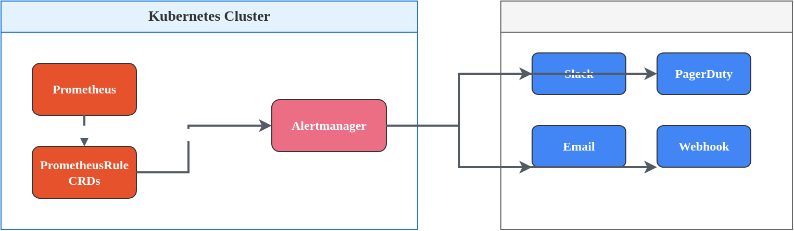
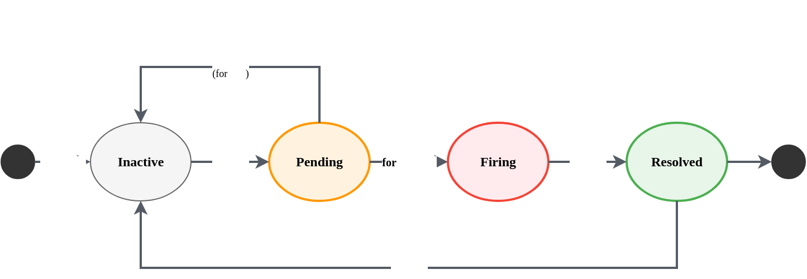

# Observability 알림 설정

> **지원 버전**: Prometheus 2.50+, Alertmanager 0.27+, kube-prometheus-stack 50+ **마지막 업데이트**: 2026년 2월 23일

< [이전: 스케일링 전략](06-scaling-strategies.md) | [목차](./README.md) | [다음: 관측성 분석](08-observability-analysis.md) >

***

## 목차

1. [알림 아키텍처](07-observability-alerts.md#알림-아키텍처)
2. [네트워크 알림](07-observability-alerts.md#네트워크-알림)
3. [CPU 알림](07-observability-alerts.md#cpu-알림)
4. [디스크 알림](07-observability-alerts.md#디스크-알림)
5. [Auto Mode 노드 종료 알림](07-observability-alerts.md#auto-mode-노드-종료-알림)
6. [Alertmanager 설정](07-observability-alerts.md#alertmanager-설정)

***

## 알림 아키텍처

### 알림 흐름 개요

Kubernetes 환경에서 효과적인 알림 시스템은 운영 가시성과 신속한 장애 대응의 핵심입니다. Prometheus와 Alertmanager를 기반으로 한 알림 아키텍처는 다음과 같은 흐름으로 동작합니다.



### Alert Severity 레벨

알림 심각도(Severity)는 운영 팀의 대응 우선순위를 결정합니다.

| Severity     | 설명                  | 대응 시간      | 알림 채널            |
| ------------ | ------------------- | ---------- | ---------------- |
| **critical** | 서비스 중단 또는 데이터 손실 위험 | 즉시 (5분 이내) | PagerDuty, Phone |
| **warning**  | 성능 저하 또는 잠재적 문제     | 업무 시간 내    | Slack, Email     |
| **info**     | 정보성 알림, 모니터링 목적     | 주간 리뷰      | Email, Dashboard |

### 알림 라이프사이클



* **Inactive**: 알림 조건이 충족되지 않은 상태
* **Pending**: 알림 조건이 충족되었지만 `for` 기간이 경과하지 않은 상태
* **Firing**: 알림이 발생하여 Alertmanager로 전송된 상태
* **Resolved**: 알림 조건이 해소되어 종료된 상태

### PrometheusRule CRD 개요

PrometheusRule은 Prometheus Operator에서 관리하는 Custom Resource로, 알림 및 레코딩 규칙을 선언적으로 정의합니다.

```yaml
apiVersion: monitoring.coreos.com/v1
kind: PrometheusRule
metadata:
  name: example-rules
  namespace: monitoring
  labels:
    release: prometheus  # Prometheus가 이 규칙을 선택하도록 하는 레이블
spec:
  groups:
  - name: example.rules
    interval: 30s  # 규칙 평가 간격 (선택사항)
    rules:
    - alert: ExampleAlert
      expr: vector(1) > 0  # PromQL 표현식
      for: 5m               # Pending 기간
      labels:
        severity: warning
      annotations:
        summary: "예시 알림"
        description: "상세 설명 (템플릿 사용 가능: {{ $value }})"
        runbook_url: "https://runbook.example.com/example"
```

***

## 네트워크 알림

네트워크 문제는 클러스터 통신과 서비스 가용성에 직접적인 영향을 미칩니다. 다음은 핵심 네트워크 메트릭에 대한 알림 규칙입니다.

### 패킷 드롭 감지

네트워크 인터페이스에서 패킷 드롭이 발생하면 네트워크 혼잡, 하드웨어 문제, 또는 버퍼 오버플로우를 의미할 수 있습니다.

```yaml
apiVersion: monitoring.coreos.com/v1
kind: PrometheusRule
metadata:
  name: network-packet-drop-alerts
  namespace: monitoring
  labels:
    release: prometheus
spec:
  groups:
  - name: network.packet.drops
    rules:
    # 수신 패킷 드롭률 알림
    - alert: NetworkReceivePacketDropHigh
      expr: |
        rate(node_network_receive_drop_total{device!~"veth.*|docker.*|br-.*"}[5m]) > 0
      for: 5m
      labels:
        severity: warning
      annotations:
        summary: "노드 {{ $labels.instance }}에서 수신 패킷 드롭 감지"
        description: |
          노드 {{ $labels.instance }}의 인터페이스 {{ $labels.device }}에서
          패킷 드롭이 발생하고 있습니다.
          현재 드롭률: {{ printf "%.2f" $value }} packets/s
        runbook_url: "https://runbook.example.com/network-packet-drop"

    # 송신 패킷 드롭률 알림
    - alert: NetworkTransmitPacketDropHigh
      expr: |
        rate(node_network_transmit_drop_total{device!~"veth.*|docker.*|br-.*"}[5m]) > 0
      for: 5m
      labels:
        severity: warning
      annotations:
        summary: "노드 {{ $labels.instance }}에서 송신 패킷 드롭 감지"
        description: |
          노드 {{ $labels.instance }}의 인터페이스 {{ $labels.device }}에서
          송신 패킷 드롭이 발생하고 있습니다.
          현재 드롭률: {{ printf "%.2f" $value }} packets/s

    # 심각한 패킷 드롭 (초당 100개 이상)
    - alert: NetworkPacketDropCritical
      expr: |
        (
          rate(node_network_receive_drop_total{device!~"veth.*|docker.*|br-.*"}[5m]) +
          rate(node_network_transmit_drop_total{device!~"veth.*|docker.*|br-.*"}[5m])
        ) > 100
      for: 2m
      labels:
        severity: critical
      annotations:
        summary: "심각한 패킷 드롭 발생: {{ $labels.instance }}"
        description: |
          노드 {{ $labels.instance }}에서 초당 100개 이상의 패킷이 드롭되고 있습니다.
          즉각적인 조사가 필요합니다.
```

### 대역폭 포화 감지

네트워크 대역폭 포화는 서비스 지연과 타임아웃의 주요 원인입니다.

```yaml
apiVersion: monitoring.coreos.com/v1
kind: PrometheusRule
metadata:
  name: network-bandwidth-alerts
  namespace: monitoring
  labels:
    release: prometheus
spec:
  groups:
  - name: network.bandwidth
    rules:
    # 수신 대역폭 포화 (80% 이상 사용)
    - alert: NetworkReceiveBandwidthSaturation
      expr: |
        (
          rate(node_network_receive_bytes_total{device!~"lo|veth.*|docker.*|br-.*"}[5m]) * 8
        ) / (
          node_network_speed_bytes{device!~"lo|veth.*|docker.*|br-.*"} * 8
        ) > 0.8
      for: 10m
      labels:
        severity: warning
      annotations:
        summary: "네트워크 수신 대역폭 포화: {{ $labels.instance }}"
        description: |
          노드 {{ $labels.instance }}의 {{ $labels.device }} 인터페이스에서
          수신 대역폭 사용률이 80%를 초과했습니다.
          현재 사용률: {{ printf "%.1f" (mul $value 100) }}%

    # 송신 대역폭 포화
    - alert: NetworkTransmitBandwidthSaturation
      expr: |
        (
          rate(node_network_transmit_bytes_total{device!~"lo|veth.*|docker.*|br-.*"}[5m]) * 8
        ) / (
          node_network_speed_bytes{device!~"lo|veth.*|docker.*|br-.*"} * 8
        ) > 0.8
      for: 10m
      labels:
        severity: warning
      annotations:
        summary: "네트워크 송신 대역폭 포화: {{ $labels.instance }}"
        description: |
          노드 {{ $labels.instance }}의 {{ $labels.device }} 인터페이스에서
          송신 대역폭 사용률이 80%를 초과했습니다.
```

### VPC CNI 및 ENI 알림

Amazon EKS 환경에서 VPC CNI 플러그인 관련 문제를 감지합니다.

```yaml
apiVersion: monitoring.coreos.com/v1
kind: PrometheusRule
metadata:
  name: vpc-cni-alerts
  namespace: monitoring
  labels:
    release: prometheus
spec:
  groups:
  - name: vpc.cni
    rules:
    # IP 주소 고갈 경고
    - alert: VPCCNIIPAddressExhaustion
      expr: |
        awscni_total_ip_addresses - awscni_assigned_ip_addresses < 5
      for: 5m
      labels:
        severity: warning
      annotations:
        summary: "VPC CNI IP 주소 부족: {{ $labels.node }}"
        description: |
          노드 {{ $labels.node }}에서 사용 가능한 IP 주소가 5개 미만입니다.
          총 IP: {{ $labels.total_ips }}
          할당된 IP: {{ $labels.assigned_ips }}
          새로운 Pod 생성이 실패할 수 있습니다.

    # IP 주소 완전 고갈
    - alert: VPCCNINoAvailableIPs
      expr: |
        awscni_total_ip_addresses - awscni_assigned_ip_addresses == 0
      for: 1m
      labels:
        severity: critical
      annotations:
        summary: "VPC CNI IP 주소 고갈: {{ $labels.node }}"
        description: |
          노드 {{ $labels.node }}에서 사용 가능한 IP 주소가 없습니다.
          새로운 Pod 생성이 불가능합니다.
          노드 확장 또는 ENI 설정 확인이 필요합니다.

    # ENI 연결 오류
    - alert: VPCCNIENIAttachmentErrors
      expr: |
        increase(awscni_eni_max_reached[5m]) > 0
      for: 5m
      labels:
        severity: warning
      annotations:
        summary: "ENI 최대 한도 도달: {{ $labels.node }}"
        description: |
          노드 {{ $labels.node }}가 ENI 최대 한도에 도달했습니다.
          인스턴스 타입 업그레이드 또는 서브넷 IP 확보가 필요합니다.

    # VPC CNI 플러그인 오류
    - alert: VPCCNIPluginErrors
      expr: |
        rate(awscni_add_ip_req_count{status="failed"}[5m]) > 0
      for: 5m
      labels:
        severity: warning
      annotations:
        summary: "VPC CNI IP 할당 실패: {{ $labels.node }}"
        description: |
          노드 {{ $labels.node }}에서 IP 할당 요청이 실패하고 있습니다.
          VPC CNI 로그를 확인하세요.
```

### DNS 해석 오류 알림

CoreDNS 오류는 클러스터 내 서비스 디스커버리에 직접적인 영향을 미칩니다.

```yaml
apiVersion: monitoring.coreos.com/v1
kind: PrometheusRule
metadata:
  name: coredns-alerts
  namespace: monitoring
  labels:
    release: prometheus
spec:
  groups:
  - name: coredns
    rules:
    # DNS 쿼리 실패율
    - alert: CoreDNSErrorRateHigh
      expr: |
        sum(rate(coredns_dns_responses_total{rcode=~"SERVFAIL|REFUSED|NXDOMAIN"}[5m]))
        /
        sum(rate(coredns_dns_responses_total[5m])) > 0.05
      for: 5m
      labels:
        severity: warning
      annotations:
        summary: "CoreDNS 오류율 높음"
        description: |
          CoreDNS 오류율이 5%를 초과했습니다.
          현재 오류율: {{ printf "%.2f" (mul $value 100) }}%
          DNS 해석 문제로 서비스 통신에 영향이 있을 수 있습니다.

    # DNS 쿼리 지연
    - alert: CoreDNSLatencyHigh
      expr: |
        histogram_quantile(0.99,
          sum(rate(coredns_dns_request_duration_seconds_bucket[5m])) by (le)
        ) > 0.1
      for: 10m
      labels:
        severity: warning
      annotations:
        summary: "CoreDNS 지연 시간 높음"
        description: |
          CoreDNS P99 지연 시간이 100ms를 초과했습니다.
          현재 P99: {{ printf "%.3f" $value }}s

    # CoreDNS 파드 다운
    - alert: CoreDNSDown
      expr: |
        absent(up{job="coredns"} == 1)
      for: 5m
      labels:
        severity: critical
      annotations:
        summary: "CoreDNS가 다운되었습니다"
        description: |
          CoreDNS 파드가 응답하지 않습니다.
          클러스터 내 DNS 해석이 불가능합니다.
```

### 네트워크 정책 거부 추적

NetworkPolicy로 인한 트래픽 거부를 모니터링합니다.

```yaml
apiVersion: monitoring.coreos.com/v1
kind: PrometheusRule
metadata:
  name: network-policy-alerts
  namespace: monitoring
  labels:
    release: prometheus
spec:
  groups:
  - name: network.policy
    rules:
    # Cilium 기반 네트워크 정책 거부
    - alert: NetworkPolicyDenialSpike
      expr: |
        sum(rate(cilium_policy_verdict_total{verdict="denied"}[5m])) by (namespace) > 10
      for: 5m
      labels:
        severity: warning
      annotations:
        summary: "네트워크 정책 거부 급증: {{ $labels.namespace }}"
        description: |
          네임스페이스 {{ $labels.namespace }}에서 분당 10회 이상의
          네트워크 정책 거부가 발생하고 있습니다.
          현재 거부율: {{ printf "%.1f" $value }}/s
          의도된 동작인지 확인이 필요합니다.

    # Calico 기반 네트워크 정책 거부
    - alert: CalicoNetworkPolicyDenials
      expr: |
        sum(rate(calico_denied_packets[5m])) by (namespace) > 10
      for: 5m
      labels:
        severity: warning
      annotations:
        summary: "Calico 네트워크 정책 거부: {{ $labels.namespace }}"
        description: |
          네임스페이스 {{ $labels.namespace }}에서 Calico 네트워크 정책에 의해
          트래픽이 거부되고 있습니다.
```

### 전체 네트워크 알림 규칙

```yaml
apiVersion: monitoring.coreos.com/v1
kind: PrometheusRule
metadata:
  name: network-alerts-complete
  namespace: monitoring
  labels:
    release: prometheus
    app: kube-prometheus-stack
spec:
  groups:
  - name: network.alerts
    interval: 30s
    rules:
    # 패킷 드롭
    - alert: NetworkPacketDropDetected
      expr: |
        rate(node_network_receive_drop_total{device!~"veth.*|docker.*|br-.*|lo"}[5m]) > 0
      for: 5m
      labels:
        severity: warning
        category: network
      annotations:
        summary: "패킷 드롭 감지: {{ $labels.instance }}"
        description: "인터페이스 {{ $labels.device }}에서 패킷 드롭 발생"

    # 대역폭 포화
    - alert: NetworkBandwidthSaturation
      expr: |
        (rate(node_network_receive_bytes_total[5m]) +
         rate(node_network_transmit_bytes_total[5m])) * 8 / 1e9 > 8
      for: 10m
      labels:
        severity: warning
        category: network
      annotations:
        summary: "높은 네트워크 사용량: {{ $labels.instance }}"
        description: "노드의 네트워크 사용량이 8Gbps를 초과했습니다"

    # VPC CNI IP 고갈
    - alert: VPCCNIIPExhaustion
      expr: awscni_total_ip_addresses - awscni_assigned_ip_addresses < 5
      for: 5m
      labels:
        severity: warning
        category: network
      annotations:
        summary: "VPC CNI IP 부족: {{ $labels.node }}"
        description: "사용 가능한 IP 주소가 5개 미만입니다"

    # CoreDNS 오류
    - alert: CoreDNSErrorsHigh
      expr: |
        sum(rate(coredns_dns_responses_total{rcode!="NOERROR"}[5m])) /
        sum(rate(coredns_dns_responses_total[5m])) > 0.01
      for: 10m
      labels:
        severity: warning
        category: network
      annotations:
        summary: "CoreDNS 오류율 높음"
        description: "DNS 오류율이 1%를 초과했습니다"
```

***

## CPU 알림

CPU 관련 문제는 애플리케이션 성능에 직접적인 영향을 미칩니다. 특히 CPU 스로틀링은 컨테이너 리소스 제한으로 인한 성능 저하의 주요 원인입니다.

### CPU 스로틀링 감지

컨테이너가 CPU 리소스 제한에 도달하면 CFS(Completely Fair Scheduler)에 의해 스로틀링됩니다.

```yaml
apiVersion: monitoring.coreos.com/v1
kind: PrometheusRule
metadata:
  name: cpu-throttling-alerts
  namespace: monitoring
  labels:
    release: prometheus
spec:
  groups:
  - name: cpu.throttling
    rules:
    # 높은 CPU 스로틀링 (25% 이상)
    - alert: CPUThrottlingHigh
      expr: |
        sum by (namespace, pod, container) (
          rate(container_cpu_cfs_throttled_periods_total[5m])
        ) / sum by (namespace, pod, container) (
          rate(container_cpu_cfs_periods_total[5m])
        ) > 0.25
      for: 5m
      labels:
        severity: warning
      annotations:
        summary: "높은 CPU 스로틀링: {{ $labels.namespace }}/{{ $labels.pod }}"
        description: |
          컨테이너 {{ $labels.container }}가 CPU 스로틀링을 겪고 있습니다.
          스로틀링 비율: {{ printf "%.1f" (mul $value 100) }}%
          CPU 리소스 제한(limits)을 증가시키거나 애플리케이션 최적화가 필요합니다.
        runbook_url: "https://runbook.example.com/cpu-throttling"

    # 심각한 CPU 스로틀링 (50% 이상)
    - alert: CPUThrottlingCritical
      expr: |
        sum by (namespace, pod, container) (
          rate(container_cpu_cfs_throttled_periods_total[5m])
        ) / sum by (namespace, pod, container) (
          rate(container_cpu_cfs_periods_total[5m])
        ) > 0.5
      for: 5m
      labels:
        severity: critical
      annotations:
        summary: "심각한 CPU 스로틀링: {{ $labels.namespace }}/{{ $labels.pod }}"
        description: |
          컨테이너 {{ $labels.container }}의 CPU 스로틀링이 50%를 초과했습니다.
          애플리케이션 응답 시간에 심각한 영향이 있습니다.
          즉각적인 조치가 필요합니다.

    # CFS 쿼터 고갈
    - alert: CPUCFSQuotaExhausted
      expr: |
        sum by (namespace, pod, container) (
          container_cpu_cfs_throttled_seconds_total
        ) > 0
        and
        delta(container_cpu_cfs_throttled_seconds_total[5m]) > 60
      for: 5m
      labels:
        severity: warning
      annotations:
        summary: "CFS 쿼터 고갈: {{ $labels.namespace }}/{{ $labels.pod }}"
        description: |
          지난 5분간 {{ $labels.container }}의 스로틀링 시간이 60초를 초과했습니다.
```

### 노드 CPU 압박 알림

노드 수준의 CPU 사용량 모니터링입니다.

```yaml
apiVersion: monitoring.coreos.com/v1
kind: PrometheusRule
metadata:
  name: node-cpu-alerts
  namespace: monitoring
  labels:
    release: prometheus
spec:
  groups:
  - name: node.cpu
    rules:
    # 노드 CPU 사용률 높음 (유휴 상태 15% 미만)
    - alert: NodeCPUHighUsage
      expr: |
        100 - (avg by (instance) (
          rate(node_cpu_seconds_total{mode="idle"}[5m])
        ) * 100) > 85
      for: 10m
      labels:
        severity: warning
      annotations:
        summary: "높은 노드 CPU 사용률: {{ $labels.instance }}"
        description: |
          노드 {{ $labels.instance }}의 CPU 사용률이 85%를 초과했습니다.
          현재 사용률: {{ printf "%.1f" $value }}%

    # 노드 CPU 압박 (유휴 상태 5% 미만)
    - alert: NodeCPUPressure
      expr: |
        100 - (avg by (instance) (
          rate(node_cpu_seconds_total{mode="idle"}[5m])
        ) * 100) > 95
      for: 5m
      labels:
        severity: critical
      annotations:
        summary: "노드 CPU 압박 상태: {{ $labels.instance }}"
        description: |
          노드 {{ $labels.instance }}의 CPU 사용률이 95%를 초과했습니다.
          워크로드 분산 또는 노드 확장이 필요합니다.

    # CPU 시스템 모드 사용률 높음
    - alert: NodeCPUSystemHighUsage
      expr: |
        avg by (instance) (
          rate(node_cpu_seconds_total{mode="system"}[5m])
        ) * 100 > 30
      for: 10m
      labels:
        severity: warning
      annotations:
        summary: "높은 시스템 CPU 사용률: {{ $labels.instance }}"
        description: |
          노드 {{ $labels.instance }}의 시스템 모드 CPU 사용률이 30%를 초과했습니다.
          커널 또는 시스템 프로세스에서 과도한 CPU를 사용하고 있습니다.

    # CPU iowait 높음
    - alert: NodeCPUIOWaitHigh
      expr: |
        avg by (instance) (
          rate(node_cpu_seconds_total{mode="iowait"}[5m])
        ) * 100 > 20
      for: 10m
      labels:
        severity: warning
      annotations:
        summary: "높은 CPU iowait: {{ $labels.instance }}"
        description: |
          노드 {{ $labels.instance }}의 CPU iowait가 20%를 초과했습니다.
          디스크 I/O 병목이 발생하고 있습니다.
```

### 컨테이너 CPU 사용량 대비 요청 비율

```yaml
apiVersion: monitoring.coreos.com/v1
kind: PrometheusRule
metadata:
  name: container-cpu-alerts
  namespace: monitoring
  labels:
    release: prometheus
spec:
  groups:
  - name: container.cpu
    rules:
    # CPU 사용량이 요청의 150%를 초과
    - alert: ContainerCPUUsageOverRequest
      expr: |
        sum by (namespace, pod, container) (
          rate(container_cpu_usage_seconds_total{container!=""}[5m])
        ) / sum by (namespace, pod, container) (
          kube_pod_container_resource_requests{resource="cpu", unit="core"}
        ) > 1.5
      for: 10m
      labels:
        severity: warning
      annotations:
        summary: "CPU 사용량 초과: {{ $labels.namespace }}/{{ $labels.pod }}"
        description: |
          컨테이너 {{ $labels.container }}의 CPU 사용량이 요청의 150%를 초과했습니다.
          현재 사용률: {{ printf "%.0f" (mul $value 100) }}%
          리소스 요청(requests) 값 조정이 필요합니다.

    # CPU 사용량이 제한의 90%를 초과
    - alert: ContainerCPUNearLimit
      expr: |
        sum by (namespace, pod, container) (
          rate(container_cpu_usage_seconds_total{container!=""}[5m])
        ) / sum by (namespace, pod, container) (
          kube_pod_container_resource_limits{resource="cpu", unit="core"}
        ) > 0.9
      for: 5m
      labels:
        severity: warning
      annotations:
        summary: "CPU 제한 임박: {{ $labels.namespace }}/{{ $labels.pod }}"
        description: |
          컨테이너 {{ $labels.container }}의 CPU 사용량이 제한의 90%에 도달했습니다.
          스로틀링이 곧 발생할 수 있습니다.
```

### 시스템 프로세스 CPU 사용량

kubelet, containerd 등 시스템 컴포넌트의 CPU 사용량을 모니터링합니다.

```yaml
apiVersion: monitoring.coreos.com/v1
kind: PrometheusRule
metadata:
  name: system-process-cpu-alerts
  namespace: monitoring
  labels:
    release: prometheus
spec:
  groups:
  - name: system.process.cpu
    rules:
    # kubelet CPU 사용량 높음
    - alert: KubeletCPUUsageHigh
      expr: |
        rate(process_cpu_seconds_total{job="kubelet"}[5m]) > 0.5
      for: 10m
      labels:
        severity: warning
      annotations:
        summary: "kubelet CPU 사용량 높음: {{ $labels.instance }}"
        description: |
          노드 {{ $labels.instance }}의 kubelet이 과도한 CPU를 사용하고 있습니다.
          현재 사용량: {{ printf "%.2f" $value }} cores
          파드 수가 많거나 API 서버 통신 문제일 수 있습니다.

    # containerd CPU 사용량 높음
    - alert: ContainerdCPUUsageHigh
      expr: |
        rate(process_cpu_seconds_total{job="containerd"}[5m]) > 1.0
      for: 10m
      labels:
        severity: warning
      annotations:
        summary: "containerd CPU 사용량 높음: {{ $labels.instance }}"
        description: |
          노드 {{ $labels.instance }}의 containerd가 과도한 CPU를 사용하고 있습니다.
          이미지 풀링이 많거나 컨테이너 생성/삭제가 빈번할 수 있습니다.

    # kube-proxy CPU 사용량 높음
    - alert: KubeProxyCPUUsageHigh
      expr: |
        rate(process_cpu_seconds_total{job="kube-proxy"}[5m]) > 0.3
      for: 10m
      labels:
        severity: warning
      annotations:
        summary: "kube-proxy CPU 사용량 높음: {{ $labels.instance }}"
        description: |
          노드 {{ $labels.instance }}의 kube-proxy가 과도한 CPU를 사용하고 있습니다.
          서비스 수가 많거나 iptables/IPVS 규칙 동기화 문제일 수 있습니다.
```

### 전체 CPU 알림 규칙

```yaml
apiVersion: monitoring.coreos.com/v1
kind: PrometheusRule
metadata:
  name: cpu-alerts-complete
  namespace: monitoring
  labels:
    release: prometheus
    app: kube-prometheus-stack
spec:
  groups:
  - name: cpu.alerts
    interval: 30s
    rules:
    # CPU 스로틀링 경고
    - alert: CPUThrottlingWarning
      expr: |
        sum by (namespace, pod, container) (
          rate(container_cpu_cfs_throttled_periods_total[5m])
        ) / sum by (namespace, pod, container) (
          rate(container_cpu_cfs_periods_total[5m])
        ) > 0.25
      for: 5m
      labels:
        severity: warning
        category: cpu
      annotations:
        summary: "CPU 스로틀링: {{ $labels.pod }}"
        description: "스로틀링 비율: {{ printf \"%.1f\" (mul $value 100) }}%"

    # CPU 스로틀링 위험
    - alert: CPUThrottlingCritical
      expr: |
        sum by (namespace, pod, container) (
          rate(container_cpu_cfs_throttled_periods_total[5m])
        ) / sum by (namespace, pod, container) (
          rate(container_cpu_cfs_periods_total[5m])
        ) > 0.5
      for: 5m
      labels:
        severity: critical
        category: cpu
      annotations:
        summary: "심각한 CPU 스로틀링: {{ $labels.pod }}"
        description: "스로틀링 비율이 50%를 초과했습니다"

    # 노드 CPU 높은 사용률
    - alert: NodeCPUHigh
      expr: |
        100 - (avg by (instance) (rate(node_cpu_seconds_total{mode="idle"}[5m])) * 100) > 85
      for: 10m
      labels:
        severity: warning
        category: cpu
      annotations:
        summary: "높은 CPU 사용률: {{ $labels.instance }}"
        description: "CPU 사용률: {{ printf \"%.1f\" $value }}%"

    # 노드 CPU 압박
    - alert: NodeCPUCritical
      expr: |
        100 - (avg by (instance) (rate(node_cpu_seconds_total{mode="idle"}[5m])) * 100) > 95
      for: 5m
      labels:
        severity: critical
        category: cpu
      annotations:
        summary: "CPU 압박: {{ $labels.instance }}"
        description: "CPU 사용률이 95%를 초과했습니다"

    # kubelet CPU
    - alert: KubeletHighCPU
      expr: rate(process_cpu_seconds_total{job="kubelet"}[5m]) > 0.5
      for: 10m
      labels:
        severity: warning
        category: cpu
      annotations:
        summary: "kubelet 높은 CPU: {{ $labels.instance }}"
        description: "kubelet CPU 사용량: {{ printf \"%.2f\" $value }} cores"
```

***

## 디스크 알림

디스크 공간 부족과 I/O 성능 문제는 애플리케이션 장애의 주요 원인입니다. 특히 PersistentVolume 사용량과 inode 고갈을 사전에 감지해야 합니다.

### EBS 볼륨 포화 알림

```yaml
apiVersion: monitoring.coreos.com/v1
kind: PrometheusRule
metadata:
  name: ebs-volume-alerts
  namespace: monitoring
  labels:
    release: prometheus
spec:
  groups:
  - name: ebs.volume
    rules:
    # PVC 사용률 85% 초과
    - alert: PVCUsageHigh
      expr: |
        kubelet_volume_stats_used_bytes / kubelet_volume_stats_capacity_bytes > 0.85
      for: 5m
      labels:
        severity: warning
      annotations:
        summary: "PVC 사용률 높음: {{ $labels.persistentvolumeclaim }}"
        description: |
          네임스페이스 {{ $labels.namespace }}의 PVC {{ $labels.persistentvolumeclaim }}
          사용률이 85%를 초과했습니다.
          현재 사용률: {{ printf "%.1f" (mul $value 100) }}%
          사용량: {{ printf "%.2f" (div $labels.used_bytes 1073741824) }} GiB /
                  {{ printf "%.2f" (div $labels.capacity_bytes 1073741824) }} GiB

    # PVC 사용률 95% 초과 (위험)
    - alert: PVCUsageCritical
      expr: |
        kubelet_volume_stats_used_bytes / kubelet_volume_stats_capacity_bytes > 0.95
      for: 5m
      labels:
        severity: critical
      annotations:
        summary: "PVC 사용률 위험: {{ $labels.persistentvolumeclaim }}"
        description: |
          PVC {{ $labels.persistentvolumeclaim }}의 사용률이 95%를 초과했습니다.
          즉시 용량 확장 또는 데이터 정리가 필요합니다.

    # 볼륨 확장 필요 예측 (24시간 내 가득 참)
    - alert: PVCWillFillIn24Hours
      expr: |
        predict_linear(kubelet_volume_stats_used_bytes[6h], 24*60*60)
        > kubelet_volume_stats_capacity_bytes
      for: 1h
      labels:
        severity: warning
      annotations:
        summary: "PVC 용량 부족 예상: {{ $labels.persistentvolumeclaim }}"
        description: |
          현재 사용 추세로 볼 때 PVC {{ $labels.persistentvolumeclaim }}이
          24시간 내에 가득 찰 것으로 예상됩니다.
          사전 조치가 필요합니다.
```

### Inode 고갈 알림

파일 시스템의 inode 고갈은 새 파일 생성을 불가능하게 만듭니다.

```yaml
apiVersion: monitoring.coreos.com/v1
kind: PrometheusRule
metadata:
  name: inode-alerts
  namespace: monitoring
  labels:
    release: prometheus
spec:
  groups:
  - name: inode
    rules:
    # PVC inode 사용률 80% 초과
    - alert: PVCInodeUsageHigh
      expr: |
        kubelet_volume_stats_inodes_used / kubelet_volume_stats_inodes > 0.8
      for: 10m
      labels:
        severity: warning
      annotations:
        summary: "PVC inode 사용률 높음: {{ $labels.persistentvolumeclaim }}"
        description: |
          PVC {{ $labels.persistentvolumeclaim }}의 inode 사용률이 80%를 초과했습니다.
          현재 사용률: {{ printf "%.1f" (mul $value 100) }}%
          작은 파일이 많거나 로그 파일 정리가 필요할 수 있습니다.

    # PVC inode 사용률 95% 초과 (위험)
    - alert: PVCInodeUsageCritical
      expr: |
        kubelet_volume_stats_inodes_used / kubelet_volume_stats_inodes > 0.95
      for: 5m
      labels:
        severity: critical
      annotations:
        summary: "PVC inode 고갈 임박: {{ $labels.persistentvolumeclaim }}"
        description: |
          PVC {{ $labels.persistentvolumeclaim }}의 inode가 거의 고갈되었습니다.
          새 파일 생성이 곧 불가능해집니다.

    # 노드 루트 파일시스템 inode 사용률
    - alert: NodeInodeUsageHigh
      expr: |
        (1 - node_filesystem_files_free{mountpoint="/"} /
             node_filesystem_files{mountpoint="/"}) > 0.8
      for: 10m
      labels:
        severity: warning
      annotations:
        summary: "노드 inode 사용률 높음: {{ $labels.instance }}"
        description: |
          노드 {{ $labels.instance }}의 루트 파일시스템 inode 사용률이 80%를 초과했습니다.
```

### 노드 디스크 압박 알림

```yaml
apiVersion: monitoring.coreos.com/v1
kind: PrometheusRule
metadata:
  name: node-disk-alerts
  namespace: monitoring
  labels:
    release: prometheus
spec:
  groups:
  - name: node.disk
    rules:
    # 노드 디스크 사용률 85% 초과
    - alert: NodeDiskUsageHigh
      expr: |
        100 - (node_filesystem_avail_bytes{mountpoint="/",fstype!="rootfs"}
               / node_filesystem_size_bytes{mountpoint="/"} * 100) > 85
      for: 10m
      labels:
        severity: warning
      annotations:
        summary: "노드 디스크 사용률 높음: {{ $labels.instance }}"
        description: |
          노드 {{ $labels.instance }}의 디스크 사용률이 85%를 초과했습니다.
          현재 사용률: {{ printf "%.1f" $value }}%

    # 노드 디스크 사용률 95% 초과 (위험)
    - alert: NodeDiskUsageCritical
      expr: |
        100 - (node_filesystem_avail_bytes{mountpoint="/",fstype!="rootfs"}
               / node_filesystem_size_bytes{mountpoint="/"} * 100) > 95
      for: 5m
      labels:
        severity: critical
      annotations:
        summary: "노드 디스크 압박: {{ $labels.instance }}"
        description: |
          노드 {{ $labels.instance }}의 디스크 사용률이 95%를 초과했습니다.
          kubelet이 파드 축출을 시작할 수 있습니다.

    # kubelet 디스크 압박 조건
    - alert: NodeDiskPressure
      expr: |
        kube_node_status_condition{condition="DiskPressure",status="true"} == 1
      for: 5m
      labels:
        severity: critical
      annotations:
        summary: "노드 DiskPressure 조건 활성화: {{ $labels.node }}"
        description: |
          노드 {{ $labels.node }}가 DiskPressure 상태입니다.
          kubelet이 파드 축출을 시작합니다.
          즉각적인 조치가 필요합니다.
```

### Ephemeral Storage 알림

```yaml
apiVersion: monitoring.coreos.com/v1
kind: PrometheusRule
metadata:
  name: ephemeral-storage-alerts
  namespace: monitoring
  labels:
    release: prometheus
spec:
  groups:
  - name: ephemeral.storage
    rules:
    # 컨테이너 ephemeral storage 사용량 높음
    - alert: ContainerEphemeralStorageUsageHigh
      expr: |
        container_fs_usage_bytes{container!=""} /
        container_fs_limit_bytes{container!=""} > 0.8
      for: 10m
      labels:
        severity: warning
      annotations:
        summary: "Ephemeral storage 사용량 높음: {{ $labels.pod }}"
        description: |
          컨테이너 {{ $labels.container }}의 ephemeral storage 사용량이
          제한의 80%를 초과했습니다.
          현재 사용률: {{ printf "%.1f" (mul $value 100) }}%

    # 노드 ephemeral storage 압박
    - alert: NodeEphemeralStoragePressure
      expr: |
        (node_filesystem_size_bytes{mountpoint="/var/lib/kubelet"} -
         node_filesystem_avail_bytes{mountpoint="/var/lib/kubelet"})
        / node_filesystem_size_bytes{mountpoint="/var/lib/kubelet"} > 0.85
      for: 10m
      labels:
        severity: warning
      annotations:
        summary: "노드 ephemeral storage 압박: {{ $labels.instance }}"
        description: |
          노드 {{ $labels.instance }}의 kubelet 볼륨 사용률이 85%를 초과했습니다.
```

### 전체 디스크 알림 규칙

```yaml
apiVersion: monitoring.coreos.com/v1
kind: PrometheusRule
metadata:
  name: disk-alerts-complete
  namespace: monitoring
  labels:
    release: prometheus
    app: kube-prometheus-stack
spec:
  groups:
  - name: disk.alerts
    interval: 60s
    rules:
    # PVC 사용률 경고
    - alert: PVCUsageWarning
      expr: kubelet_volume_stats_used_bytes / kubelet_volume_stats_capacity_bytes > 0.85
      for: 5m
      labels:
        severity: warning
        category: disk
      annotations:
        summary: "PVC 사용률 85%: {{ $labels.persistentvolumeclaim }}"
        description: "사용률: {{ printf \"%.1f\" (mul $value 100) }}%"

    # PVC 사용률 위험
    - alert: PVCUsageCritical
      expr: kubelet_volume_stats_used_bytes / kubelet_volume_stats_capacity_bytes > 0.95
      for: 5m
      labels:
        severity: critical
        category: disk
      annotations:
        summary: "PVC 사용률 95%: {{ $labels.persistentvolumeclaim }}"
        description: "즉시 용량 확장이 필요합니다"

    # Inode 사용률 경고
    - alert: PVCInodeWarning
      expr: kubelet_volume_stats_inodes_used / kubelet_volume_stats_inodes > 0.8
      for: 10m
      labels:
        severity: warning
        category: disk
      annotations:
        summary: "PVC inode 80%: {{ $labels.persistentvolumeclaim }}"
        description: "Inode 사용률: {{ printf \"%.1f\" (mul $value 100) }}%"

    # 노드 디스크 압박
    - alert: NodeDiskPressure
      expr: kube_node_status_condition{condition="DiskPressure",status="true"} == 1
      for: 5m
      labels:
        severity: critical
        category: disk
      annotations:
        summary: "노드 DiskPressure: {{ $labels.node }}"
        description: "노드가 디스크 압박 상태입니다"

    # 용량 부족 예측
    - alert: PVCWillFillSoon
      expr: |
        predict_linear(kubelet_volume_stats_used_bytes[6h], 24*60*60)
        > kubelet_volume_stats_capacity_bytes
      for: 1h
      labels:
        severity: warning
        category: disk
      annotations:
        summary: "PVC 24시간 내 가득 참 예상: {{ $labels.persistentvolumeclaim }}"
        description: "현재 추세로 24시간 내 용량 고갈 예상"
```

***

## Auto Mode 노드 종료 알림

EKS Auto Mode에서 Karpenter가 관리하는 노드의 lifecycle 이벤트를 모니터링합니다. 예상치 못한 노드 종료나 Spot 인터럽션을 신속하게 감지해야 합니다.

### Karpenter 노드 종료 알림

```yaml
apiVersion: monitoring.coreos.com/v1
kind: PrometheusRule
metadata:
  name: karpenter-disruption-alerts
  namespace: monitoring
  labels:
    release: prometheus
spec:
  groups:
  - name: karpenter.disruption
    rules:
    # 노드 종료 이벤트 (사유별)
    - alert: KarpenterNodeTerminated
      expr: |
        increase(karpenter_nodes_terminated_total[5m]) > 0
      for: 0m
      labels:
        severity: info
      annotations:
        summary: "Karpenter 노드 종료: {{ $labels.reason }}"
        description: |
          Karpenter가 노드를 종료했습니다.
          사유: {{ $labels.reason }}
          NodePool: {{ $labels.nodepool }}

    # 비정상적으로 많은 노드 종료
    - alert: KarpenterHighNodeTerminationRate
      expr: |
        sum(increase(karpenter_nodes_terminated_total[30m])) > 5
      for: 5m
      labels:
        severity: warning
      annotations:
        summary: "높은 노드 종료율 감지"
        description: |
          지난 30분간 5개 이상의 노드가 종료되었습니다.
          클러스터 안정성 확인이 필요합니다.

    # 비자발적 노드 종료 (Spot 회수 등)
    - alert: KarpenterInvoluntaryDisruption
      expr: |
        increase(karpenter_nodes_terminated_total{reason=~"spot-interruption|instance-unhealthy|instance-stopping"}[5m]) > 0
      for: 0m
      labels:
        severity: warning
      annotations:
        summary: "비자발적 노드 종료: {{ $labels.reason }}"
        description: |
          AWS에 의해 노드가 종료되었습니다.
          사유: {{ $labels.reason }}
          워크로드 영향도 확인이 필요합니다.
```

### Spot 인터럽션 알림

```yaml
apiVersion: monitoring.coreos.com/v1
kind: PrometheusRule
metadata:
  name: spot-interruption-alerts
  namespace: monitoring
  labels:
    release: prometheus
spec:
  groups:
  - name: spot.interruption
    rules:
    # Spot 인터럽션 메시지 수신
    - alert: SpotInterruptionReceived
      expr: |
        increase(karpenter_interruption_received_messages_total[5m]) > 0
      for: 0m
      labels:
        severity: warning
      annotations:
        summary: "Spot 인터럽션 알림 수신"
        description: |
          Spot 인터럽션 알림이 수신되었습니다.
          메시지 타입: {{ $labels.message_type }}
          영향받는 노드에서 워크로드가 재배치됩니다.

    # Spot 인터럽션 처리 실패
    - alert: SpotInterruptionHandlingFailed
      expr: |
        increase(karpenter_interruption_actions_performed_total{action="failed"}[5m]) > 0
      for: 0m
      labels:
        severity: critical
      annotations:
        summary: "Spot 인터럽션 처리 실패"
        description: |
          Spot 인터럽션 처리에 실패했습니다.
          수동 개입이 필요할 수 있습니다.

    # 높은 Spot 인터럽션 빈도
    - alert: HighSpotInterruptionFrequency
      expr: |
        sum(increase(karpenter_interruption_received_messages_total[1h])) > 3
      for: 0m
      labels:
        severity: warning
      annotations:
        summary: "높은 Spot 인터럽션 빈도"
        description: |
          지난 1시간 동안 3회 이상의 Spot 인터럽션이 발생했습니다.
          On-Demand 인스턴스 비율 증가를 고려하세요.
```

### 예상치 못한 노드 종료 감지

```yaml
apiVersion: monitoring.coreos.com/v1
kind: PrometheusRule
metadata:
  name: unexpected-node-termination-alerts
  namespace: monitoring
  labels:
    release: prometheus
spec:
  groups:
  - name: unexpected.termination
    rules:
    # Karpenter가 아닌 원인으로 노드 종료
    - alert: UnexpectedNodeTermination
      expr: |
        kube_node_status_condition{condition="Ready",status="true"} == 0
        and on(node)
        karpenter_nodes_created_total offset 5m
        unless on(node)
        karpenter_nodes_terminated_total
      for: 5m
      labels:
        severity: warning
      annotations:
        summary: "예상치 못한 노드 종료: {{ $labels.node }}"
        description: |
          노드 {{ $labels.node }}가 Karpenter 외부 요인으로 종료되었습니다.
          AWS 콘솔에서 원인을 확인하세요.

    # 노드 갑작스러운 사라짐
    - alert: NodeSuddenlyDisappeared
      expr: |
        absent(kube_node_info{node=~".+"}) == 1
        and
        count(kube_node_info offset 5m) > count(kube_node_info)
      for: 1m
      labels:
        severity: critical
      annotations:
        summary: "노드가 갑자기 사라졌습니다"
        description: |
          클러스터에서 노드가 갑자기 제거되었습니다.
          원인 조사가 필요합니다.
```

### 노드 NotReady 감지

```yaml
apiVersion: monitoring.coreos.com/v1
kind: PrometheusRule
metadata:
  name: node-notready-alerts
  namespace: monitoring
  labels:
    release: prometheus
spec:
  groups:
  - name: node.notready
    rules:
    # 노드 NotReady 상태
    - alert: NodeNotReady
      expr: |
        kube_node_status_condition{condition="Ready",status="true"} == 0
      for: 5m
      labels:
        severity: warning
      annotations:
        summary: "노드 NotReady: {{ $labels.node }}"
        description: |
          노드 {{ $labels.node }}가 5분 이상 NotReady 상태입니다.
          kubelet 상태와 노드 리소스를 확인하세요.

    # 노드 장시간 NotReady
    - alert: NodeNotReadyExtended
      expr: |
        kube_node_status_condition{condition="Ready",status="true"} == 0
      for: 15m
      labels:
        severity: critical
      annotations:
        summary: "노드 장시간 NotReady: {{ $labels.node }}"
        description: |
          노드 {{ $labels.node }}가 15분 이상 NotReady 상태입니다.
          자동 복구가 실패했을 수 있습니다.
          수동 개입이 필요합니다.

    # 여러 노드 동시 NotReady
    - alert: MultipleNodesNotReady
      expr: |
        count(kube_node_status_condition{condition="Ready",status="true"} == 0) > 1
      for: 5m
      labels:
        severity: critical
      annotations:
        summary: "여러 노드 동시 NotReady"
        description: |
          {{ $value }}개의 노드가 동시에 NotReady 상태입니다.
          클러스터 수준의 문제일 수 있습니다.
```

### 파드 축출 추적

```yaml
apiVersion: monitoring.coreos.com/v1
kind: PrometheusRule
metadata:
  name: pod-eviction-alerts
  namespace: monitoring
  labels:
    release: prometheus
spec:
  groups:
  - name: pod.eviction
    rules:
    # 노드 드레인 중 파드 축출
    - alert: PodsEvictedDuringDrain
      expr: |
        increase(kube_pod_deletion_timestamp{reason="NodeDrain"}[5m]) > 0
      for: 0m
      labels:
        severity: info
      annotations:
        summary: "노드 드레인으로 인한 파드 축출"
        description: |
          노드 드레인으로 인해 파드가 축출되고 있습니다.
          네임스페이스: {{ $labels.namespace }}
          파드: {{ $labels.pod }}

    # 높은 파드 축출율
    - alert: HighPodEvictionRate
      expr: |
        sum(increase(kube_pod_status_phase{phase="Failed",reason="Evicted"}[30m])) > 10
      for: 5m
      labels:
        severity: warning
      annotations:
        summary: "높은 파드 축출율"
        description: |
          지난 30분간 10개 이상의 파드가 축출되었습니다.
          리소스 압박 또는 노드 문제를 확인하세요.

    # PodDisruptionBudget 위반 감지
    - alert: PDBViolation
      expr: |
        kube_poddisruptionbudget_status_current_healthy <
        kube_poddisruptionbudget_status_desired_healthy
      for: 5m
      labels:
        severity: warning
      annotations:
        summary: "PDB 위반: {{ $labels.poddisruptionbudget }}"
        description: |
          PodDisruptionBudget {{ $labels.poddisruptionbudget }}이 위반되었습니다.
          필요한 healthy 파드 수: {{ $labels.desired_healthy }}
          현재 healthy 파드 수: {{ $labels.current_healthy }}
```

### NodePool 용량 알림

```yaml
apiVersion: monitoring.coreos.com/v1
kind: PrometheusRule
metadata:
  name: nodepool-capacity-alerts
  namespace: monitoring
  labels:
    release: prometheus
spec:
  groups:
  - name: nodepool.capacity
    rules:
    # NodePool CPU 용량 한도 접근
    - alert: NodePoolCPUCapacityNearLimit
      expr: |
        sum by (nodepool) (karpenter_nodepools_usage{resource_type="cpu"}) /
        sum by (nodepool) (karpenter_nodepools_limit{resource_type="cpu"}) > 0.9
      for: 10m
      labels:
        severity: warning
      annotations:
        summary: "NodePool CPU 한도 접근: {{ $labels.nodepool }}"
        description: |
          NodePool {{ $labels.nodepool }}의 CPU 사용량이 한도의 90%에 도달했습니다.
          한도 증가 또는 워크로드 분산이 필요합니다.

    # NodePool 메모리 용량 한도 접근
    - alert: NodePoolMemoryCapacityNearLimit
      expr: |
        sum by (nodepool) (karpenter_nodepools_usage{resource_type="memory"}) /
        sum by (nodepool) (karpenter_nodepools_limit{resource_type="memory"}) > 0.9
      for: 10m
      labels:
        severity: warning
      annotations:
        summary: "NodePool 메모리 한도 접근: {{ $labels.nodepool }}"
        description: |
          NodePool {{ $labels.nodepool }}의 메모리 사용량이 한도의 90%에 도달했습니다.

    # NodePool 노드 수 한도 접근
    - alert: NodePoolNodeCountNearLimit
      expr: |
        count by (nodepool) (kube_node_labels{label_karpenter_sh_nodepool!=""}) /
        karpenter_nodepools_limit{resource_type="nodes"} > 0.9
      for: 10m
      labels:
        severity: warning
      annotations:
        summary: "NodePool 노드 수 한도 접근: {{ $labels.nodepool }}"
        description: |
          NodePool {{ $labels.nodepool }}의 노드 수가 한도의 90%에 도달했습니다.
```

### 전체 Auto Mode 알림 규칙

```yaml
apiVersion: monitoring.coreos.com/v1
kind: PrometheusRule
metadata:
  name: automode-alerts-complete
  namespace: monitoring
  labels:
    release: prometheus
    app: kube-prometheus-stack
spec:
  groups:
  - name: automode.alerts
    interval: 30s
    rules:
    # Karpenter 노드 종료
    - alert: KarpenterNodeTerminated
      expr: increase(karpenter_nodes_terminated_total[5m]) > 0
      for: 0m
      labels:
        severity: info
        category: automode
      annotations:
        summary: "노드 종료: {{ $labels.reason }}"
        description: "Karpenter가 노드를 종료했습니다"

    # Spot 인터럽션
    - alert: SpotInterruption
      expr: increase(karpenter_interruption_received_messages_total[5m]) > 0
      for: 0m
      labels:
        severity: warning
        category: automode
      annotations:
        summary: "Spot 인터럽션 수신"
        description: "Spot 인터럽션 메시지 타입: {{ $labels.message_type }}"

    # 노드 NotReady
    - alert: NodeNotReady
      expr: kube_node_status_condition{condition="Ready",status="true"} == 0
      for: 5m
      labels:
        severity: warning
        category: automode
      annotations:
        summary: "노드 NotReady: {{ $labels.node }}"
        description: "노드가 5분 이상 NotReady 상태입니다"

    # 높은 노드 종료율
    - alert: HighNodeTerminationRate
      expr: sum(increase(karpenter_nodes_terminated_total[30m])) > 5
      for: 5m
      labels:
        severity: warning
        category: automode
      annotations:
        summary: "높은 노드 종료율"
        description: "30분간 5개 이상의 노드가 종료되었습니다"

    # NodePool 용량 한도
    - alert: NodePoolNearCapacity
      expr: |
        sum by (nodepool) (karpenter_nodepools_usage{resource_type="cpu"}) /
        sum by (nodepool) (karpenter_nodepools_limit{resource_type="cpu"}) > 0.9
      for: 10m
      labels:
        severity: warning
        category: automode
      annotations:
        summary: "NodePool 용량 90%: {{ $labels.nodepool }}"
        description: "NodePool이 용량 한도에 근접했습니다"
```

***

## Alertmanager 설정

Alertmanager는 Prometheus에서 발생한 알림을 수신하여 중복 제거, 그룹화, 라우팅을 수행하고 적절한 채널로 전달합니다.

### 전체 Alertmanager 설정

```yaml
apiVersion: v1
kind: Secret
metadata:
  name: alertmanager-config
  namespace: monitoring
type: Opaque
stringData:
  alertmanager.yaml: |
    global:
      # 알림 해제 타임아웃
      resolve_timeout: 5m
      # SMTP 설정
      smtp_smarthost: 'smtp.example.com:587'
      smtp_from: 'alertmanager@example.com'
      smtp_auth_username: 'alertmanager'
      smtp_auth_password: '${SMTP_PASSWORD}'
      smtp_require_tls: true
      # Slack 기본 URL
      slack_api_url: '${SLACK_WEBHOOK_URL}'
      # PagerDuty URL
      pagerduty_url: 'https://events.pagerduty.com/v2/enqueue'

    # 알림 라우팅 설정
    route:
      # 기본 수신자
      receiver: 'default-receiver'

      # 그룹화 기준
      group_by: ['alertname', 'namespace', 'severity']

      # 그룹화 대기 시간 (첫 알림 후 대기)
      group_wait: 30s

      # 같은 그룹의 다음 알림까지 대기 시간
      group_interval: 5m

      # 알림 반복 간격
      repeat_interval: 12h

      # 하위 라우팅 규칙
      routes:
        # Critical 알림 -> PagerDuty (즉시)
        - receiver: 'pagerduty-critical'
          matchers:
            - severity = critical
          group_wait: 10s
          group_interval: 1m
          repeat_interval: 1h
          continue: true  # 다음 규칙도 평가

        # Critical 알림 -> Slack #alerts-critical
        - receiver: 'slack-critical'
          matchers:
            - severity = critical
          group_wait: 10s
          group_interval: 1m
          repeat_interval: 1h

        # Warning 알림 -> Slack #alerts
        - receiver: 'slack-warning'
          matchers:
            - severity = warning
          group_wait: 30s
          group_interval: 5m
          repeat_interval: 4h

        # 네트워크 관련 알림 -> 네트워크 팀
        - receiver: 'slack-network-team'
          matchers:
            - category = network
          group_by: ['alertname', 'instance', 'device']
          group_wait: 1m
          group_interval: 5m
          repeat_interval: 2h

        # Auto Mode 관련 알림 -> 인프라 팀
        - receiver: 'slack-infra-team'
          matchers:
            - category = automode
          group_by: ['alertname', 'nodepool']
          group_wait: 30s
          group_interval: 5m
          repeat_interval: 4h

        # Info 알림 -> Email (일간 다이제스트)
        - receiver: 'email-digest'
          matchers:
            - severity = info
          group_wait: 1h
          group_interval: 6h
          repeat_interval: 24h

    # 억제 규칙 (Inhibition Rules)
    inhibit_rules:
      # Critical 알림이 있으면 같은 알림의 Warning 억제
      - source_matchers:
          - severity = critical
        target_matchers:
          - severity = warning
        equal: ['alertname', 'namespace', 'instance']

      # 노드 다운 시 해당 노드의 다른 알림 억제
      - source_matchers:
          - alertname = NodeNotReady
        target_matchers:
          - severity =~ warning|info
        equal: ['node']

      # 클러스터 문제 시 개별 노드 알림 억제
      - source_matchers:
          - alertname = MultipleNodesNotReady
        target_matchers:
          - alertname = NodeNotReady

    # 수신자 정의
    receivers:
      # 기본 수신자 (이메일)
      - name: 'default-receiver'
        email_configs:
          - to: 'ops-team@example.com'
            send_resolved: true
            headers:
              Subject: '[{{ .Status | toUpper }}] {{ .GroupLabels.alertname }}'
            html: '{{ template "email.default.html" . }}'

      # PagerDuty (Critical)
      - name: 'pagerduty-critical'
        pagerduty_configs:
          - service_key: '${PAGERDUTY_SERVICE_KEY}'
            send_resolved: true
            severity: '{{ if eq .Status "firing" }}critical{{ else }}info{{ end }}'
            description: '{{ template "pagerduty.default.description" . }}'
            details:
              firing: '{{ template "pagerduty.default.instances" .Alerts.Firing }}'
              resolved: '{{ template "pagerduty.default.instances" .Alerts.Resolved }}'
              num_firing: '{{ .Alerts.Firing | len }}'
              num_resolved: '{{ .Alerts.Resolved | len }}'

      # Slack Critical 채널
      - name: 'slack-critical'
        slack_configs:
          - channel: '#alerts-critical'
            send_resolved: true
            username: 'AlertManager'
            icon_emoji: ':rotating_light:'
            color: '{{ if eq .Status "firing" }}danger{{ else }}good{{ end }}'
            title: '{{ template "slack.default.title" . }}'
            text: '{{ template "slack.default.text" . }}'
            actions:
              - type: button
                text: 'Runbook :book:'
                url: '{{ (index .Alerts 0).Annotations.runbook_url }}'
              - type: button
                text: 'Dashboard :chart_with_upwards_trend:'
                url: 'https://grafana.example.com/d/alerts'

      # Slack Warning 채널
      - name: 'slack-warning'
        slack_configs:
          - channel: '#alerts'
            send_resolved: true
            username: 'AlertManager'
            icon_emoji: ':warning:'
            color: '{{ if eq .Status "firing" }}warning{{ else }}good{{ end }}'
            title: '{{ template "slack.default.title" . }}'
            text: '{{ template "slack.default.text" . }}'

      # Slack 네트워크 팀
      - name: 'slack-network-team'
        slack_configs:
          - channel: '#network-team-alerts'
            send_resolved: true
            username: 'Network AlertManager'
            icon_emoji: ':globe_with_meridians:'
            color: '{{ if eq .Status "firing" }}warning{{ else }}good{{ end }}'
            title: '[Network] {{ .GroupLabels.alertname }}'
            text: '{{ template "slack.network.text" . }}'

      # Slack 인프라 팀
      - name: 'slack-infra-team'
        slack_configs:
          - channel: '#infra-team-alerts'
            send_resolved: true
            username: 'Infra AlertManager'
            icon_emoji: ':gear:'
            color: '{{ if eq .Status "firing" }}warning{{ else }}good{{ end }}'
            title: '[Infra] {{ .GroupLabels.alertname }}'
            text: '{{ template "slack.infra.text" . }}'

      # Email 다이제스트
      - name: 'email-digest'
        email_configs:
          - to: 'ops-team@example.com'
            send_resolved: false
            headers:
              Subject: '[Daily Digest] {{ .Alerts | len }} alerts'

    # 메시지 템플릿
    templates:
      - '/etc/alertmanager/templates/*.tmpl'
```

### Slack 메시지 템플릿

```yaml
apiVersion: v1
kind: ConfigMap
metadata:
  name: alertmanager-templates
  namespace: monitoring
data:
  slack.tmpl: |
    {{ define "slack.default.title" -}}
    [{{ .Status | toUpper }}{{ if eq .Status "firing" }}:{{ .Alerts.Firing | len }}{{ end }}] {{ .GroupLabels.SortedPairs.Values | join " " }}
    {{- end }}

    {{ define "slack.default.text" -}}
    {{ range .Alerts }}
    *Alert:* {{ .Labels.alertname }}{{ if .Labels.severity }} - `{{ .Labels.severity }}`{{ end }}
    *Namespace:* {{ .Labels.namespace }}
    *Description:* {{ .Annotations.description }}
    *Details:*
    {{ range .Labels.SortedPairs }}  - *{{ .Name }}:* `{{ .Value }}`
    {{ end }}
    {{ end }}
    {{- end }}

    {{ define "slack.network.text" -}}
    {{ range .Alerts }}
    *Alert:* {{ .Labels.alertname }}
    *Instance:* {{ .Labels.instance }}
    *Device:* {{ .Labels.device }}
    *Description:* {{ .Annotations.description }}
    {{ end }}
    {{- end }}

    {{ define "slack.infra.text" -}}
    {{ range .Alerts }}
    *Alert:* {{ .Labels.alertname }}
    *NodePool:* {{ .Labels.nodepool }}
    *Node:* {{ .Labels.node }}
    *Reason:* {{ .Labels.reason }}
    *Description:* {{ .Annotations.description }}
    {{ end }}
    {{- end }}

  pagerduty.tmpl: |
    {{ define "pagerduty.default.description" -}}
    {{ .GroupLabels.alertname }}: {{ .CommonAnnotations.summary }}
    {{- end }}

    {{ define "pagerduty.default.instances" -}}
    {{ range . }}{{ .Labels.instance }} {{ end }}
    {{- end }}

  email.tmpl: |
    {{ define "email.default.html" }}
    <!DOCTYPE html>
    <html>
    <head>
      <style>
        body { font-family: Arial, sans-serif; }
        .alert { padding: 10px; margin: 10px 0; border-radius: 4px; }
        .critical { background-color: #ff4444; color: white; }
        .warning { background-color: #ffbb33; color: black; }
        .info { background-color: #33b5e5; color: white; }
      </style>
    </head>
    <body>
      <h2>{{ .Status | toUpper }}: {{ .GroupLabels.alertname }}</h2>
      {{ range .Alerts }}
      <div class="alert {{ .Labels.severity }}">
        <h3>{{ .Labels.alertname }}</h3>
        <p><strong>Severity:</strong> {{ .Labels.severity }}</p>
        <p><strong>Namespace:</strong> {{ .Labels.namespace }}</p>
        <p><strong>Summary:</strong> {{ .Annotations.summary }}</p>
        <p><strong>Description:</strong> {{ .Annotations.description }}</p>
      </div>
      {{ end }}
    </body>
    </html>
    {{ end }}
```

### Silence 및 Mute 설정

특정 유지보수 기간 동안 알림을 일시적으로 억제할 수 있습니다.

```yaml
# Silence 생성 예시 (amtool 사용)
# amtool silence add alertname=NodeNotReady node=maintenance-node-1 \
#   --author="admin" \
#   --comment="Scheduled maintenance" \
#   --duration="2h"

# MuteTimeInterval 설정
apiVersion: monitoring.coreos.com/v1alpha1
kind: AlertmanagerConfig
metadata:
  name: mute-config
  namespace: monitoring
spec:
  muteTimeIntervals:
    # 야간 유지보수 시간 (매일 02:00-04:00 KST)
    - name: 'nightly-maintenance'
      timeIntervals:
        - times:
            - start_time: '17:00'  # UTC
              end_time: '19:00'    # UTC
          weekdays: ['monday:friday']

    # 주말
    - name: 'weekends'
      timeIntervals:
        - weekdays: ['saturday', 'sunday']

  route:
    receiver: 'default'
    routes:
      # Warning 알림은 야간 유지보수 시간에 억제
      - matchers:
          - severity = warning
        mute_time_intervals:
          - 'nightly-maintenance'

      # Info 알림은 주말에 억제
      - matchers:
          - severity = info
        mute_time_intervals:
          - 'weekends'
```

### 알림 그룹화 전략

효과적인 알림 그룹화는 알림 피로를 줄이고 운영 효율성을 높입니다.

```yaml
route:
  # 기본 그룹화: 알림명, 네임스페이스, 심각도
  group_by: ['alertname', 'namespace', 'severity']

  routes:
    # 노드 관련 알림: 노드별로 그룹화
    - matchers:
        - alertname =~ "Node.*"
      group_by: ['alertname', 'node']

    # 파드 관련 알림: 네임스페이스와 파드별로 그룹화
    - matchers:
        - alertname =~ "Pod.*|Container.*"
      group_by: ['alertname', 'namespace', 'pod']

    # 스토리지 관련 알림: PVC별로 그룹화
    - matchers:
        - category = disk
      group_by: ['alertname', 'namespace', 'persistentvolumeclaim']

    # Karpenter 관련 알림: NodePool별로 그룹화
    - matchers:
        - alertname =~ "Karpenter.*|NodePool.*"
      group_by: ['alertname', 'nodepool', 'reason']
```

***

## 참고 자료

* [Prometheus Alerting Rules 문서](https://prometheus.io/docs/prometheus/latest/configuration/alerting_rules/)
* [Alertmanager Configuration](https://prometheus.io/docs/alerting/latest/configuration/)
* [PrometheusRule CRD 스펙](https://prometheus-operator.dev/docs/api-reference/api/#monitoring.coreos.com/v1.PrometheusRule)
* [EKS Karpenter Metrics](https://karpenter.sh/docs/reference/metrics/)
* [VPC CNI Metrics](https://docs.aws.amazon.com/eks/latest/userguide/cni-metrics-helper.html)

***

## 관련 문서

* [모니터링 스택](../observability/README.md) - Prometheus, VictoriaMetrics, Grafana 설정
* [로깅 스택](../observability/logging/README.md) - Loki, Tempo 설정
* [EKS Auto Mode 노드 라이프사이클](../eks-auto-mode/07-node-lifecycle.md) - Karpenter 노드 관리

***

< [이전: 스케일링 전략](06-scaling-strategies.md) | [목차](./README.md) | [다음: 관측성 분석](08-observability-analysis.md) >
