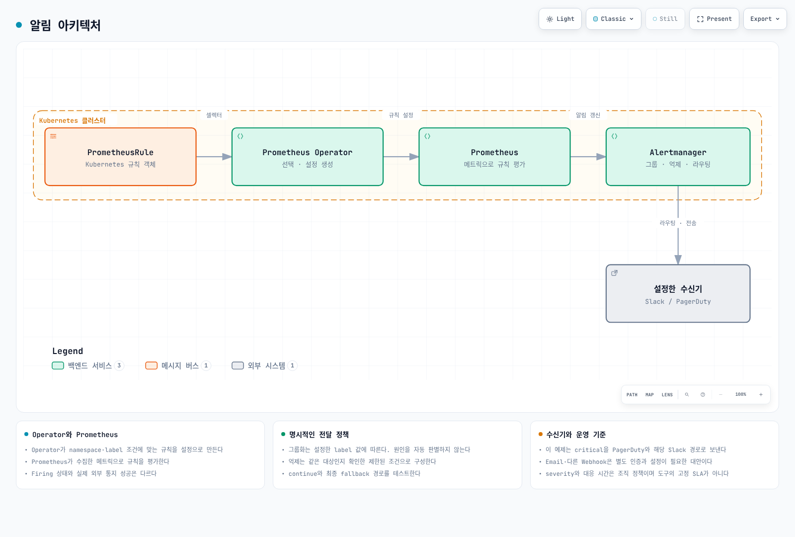
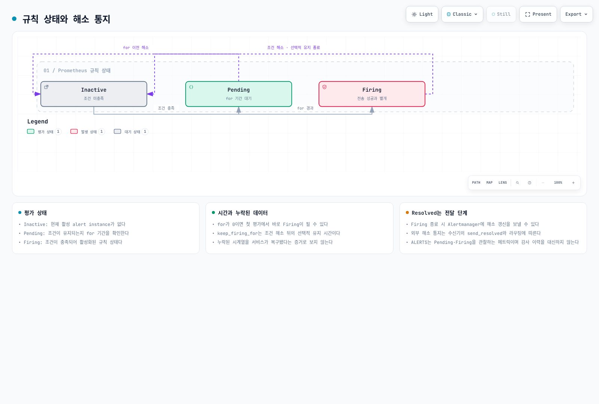

# Observability 알림 설정

> **검토 기준**: Prometheus 3.14.0, Alertmanager 0.34.0, kube-prometheus-stack 90.1.1 / Prometheus Operator 0.93.1\
> **마지막 검토**: 2026년 9월 11일. 규칙 평가·템플릿·라우팅·억제 범위와 차트 연결을 로컬에서 검증했습니다. 실제 클러스터 알림 설정이나 Slack·PagerDuty 발송은 실행하지 않았습니다.

< [이전: 스케일링](06-scaling-strategies.md) | [목차](README.md) | [다음: 관측성 분석](08-observability-analysis.md) >

알림은 지표의 이름만 복사해 만들 수 없습니다. 수집 대상, metric type, label, 단위와 누락 시 동작을 먼저 확인하고, 실제 서비스 영향과 운영 팀의 대응 절차에 맞춰 임계값을 정합니다. 아래 임계값은 예제이며 기본 kube-prometheus-stack 규칙과 중복되는 항목은 선택·조정해서 사용합니다.

## 알림 아키텍처



[인터랙티브 다이어그램](https://www.atomai.click/kubernetes-docs/archmaps/ko-ops-07-observability-alerts-0.html)

PrometheusRule은 Kubernetes 객체입니다. **Prometheus Operator가 namespace와 label selector에 맞는 객체를 선택해 규칙 설정을 만들고**, Prometheus가 생성된 규칙으로 수집한 시계열을 평가합니다.

이 예제는 `monitoring` namespace의 Helm release 이름도 `monitoring`으로 사용하며, Rule의 `release: monitoring`을 그 selector에 맞췄습니다. 기존 release 이름이나 ruleSelector가 다르면 둘을 함께 변경합니다.

| 구분 | 의미 |
|---|---|
| `labels` | alert instance 식별, 그룹화·라우팅·억제 조건 |
| `annotations` | summary, 설명과 실제 runbook 링크 |
| `for` | 해당 label 집합의 조건이 유지돼야 하는 기간 |
| `keep_firing_for` | 조건 해소 뒤에도 Firing을 유지하는 선택적 기간 |
| severity | 조직이 정하는 label 값과 대응 정책 |

`critical`, `warning`, `info`는 흔한 규약이며 고정 enum이나 도구의 SLA가 아닙니다. 평가 주기, `for`, 전송, group_wait와 외부 수신기의 처리 시간이 모두 실제 통지 시각에 영향을 줍니다.

### 평가 상태와 해소 통지



[상태 다이어그램](https://www.atomai.click/kubernetes-docs/archmaps/ko-ops-07-observability-alerts-1.html)

Prometheus의 평가 상태와 Alertmanager의 전달 상태를 구분합니다. `Firing`이라고 Slack이 이미 수신했다는 뜻은 아닙니다. Firing이 종료되면 해소 갱신을 전달할 수 있으며 외부 recovery 통지는 `send_resolved`, 라우팅·묵음·전송 상태에 따릅니다.

Alert expression은 **반환된 vector 원소**를 기준으로 활성화됩니다. 값이 0인 원소라도 남아 있으면 alert가 될 수 있습니다. 예를 들어 `Ready == 0`은 의도적으로 0-valued 원소를 남깁니다. 비교에 `bool`을 잘못 붙여 false인 원소까지 남기지 않습니다.

시계열이 사라지면 표현식 결과도 사라질 수 있으므로 해소만으로 실제 복구를 판단하지 않습니다. `ALERTS`는 pending/firing 관찰에 유용하지만 노드 종료·사용자 조치의 완전한 감사 이력은 아닙니다.

## 검증한 기본 규칙

다음은 node-exporter, kubelet/cAdvisor, kube-state-metrics가 실제로 수집되는 환경용 예제입니다. metric 이름·job·label과 적용되는 노드/volume 모드를 확인합니다. 단일 클러스터 Prometheus를 기본으로 하며 중앙 집계 환경에서는 **실제 시계열에도 cluster label**이 있어야 다른 클러스터를 섞지 않습니다.

```yaml
# prometheusrule.yaml
apiVersion: monitoring.coreos.com/v1
kind: PrometheusRule
metadata:
  name: reviewed-operational-alerts
  namespace: monitoring
  labels:
    release: monitoring
spec:
  groups:
  - name: docs.network
    rules:
    - alert: NodeNetworkReceiveDropsHigh
      expr: rate(node_network_receive_drop_total{device!~"lo|veth.*|docker.*|br-.*|cali.*"}[5m]) > 100
      for: 5m
      labels:
        severity: warning
        alert_family: network_receive_drop
        team: network
      annotations:
        summary: Elevated receive drops on {{ $labels.instance }}
        description: '{{ $labels.device }} reports {{ printf "%.2f" $value }} dropped packets/s. Correlate with
          workload symptoms.'
        runbook_url: https://www.atomai.click/kubernetes-docs/en/ops/16-troubleshooting-playbook
    - alert: NodeNetworkTransmitDropsHigh
      expr: rate(node_network_transmit_drop_total{device!~"lo|veth.*|docker.*|br-.*|cali.*"}[5m]) > 100
      for: 5m
      labels:
        severity: warning
        alert_family: network_transmit_drop
        team: network
      annotations:
        summary: Elevated transmit drops on {{ $labels.instance }}
        description: '{{ $labels.device }} reports {{ printf "%.2f" $value }} dropped packets/s. Check the actual
          interface and path.'
        runbook_url: https://www.atomai.click/kubernetes-docs/en/ops/16-troubleshooting-playbook
  - name: docs.cpu
    rules:
    - alert: NodeCPUUsageHigh
      expr: (1 - avg by (cluster, instance, job) (rate(node_cpu_seconds_total{mode="idle"}[5m]))) > 0.85
      for: 5m
      labels:
        severity: warning
        alert_family: node_cpu
        team: platform
      annotations:
        summary: Elevated CPU utilization on {{ $labels.instance }}
        description: '{{ $value | humanizePercentage }} non-idle CPU time. This alone does not establish CPU pressure
          or customer impact.'
        runbook_url: https://www.atomai.click/kubernetes-docs/en/ops/16-troubleshooting-playbook
    - alert: NodeCPUUsageCritical
      expr: (1 - avg by (cluster, instance, job) (rate(node_cpu_seconds_total{mode="idle"}[5m]))) > 0.95
      for: 5m
      labels:
        severity: critical
        alert_family: node_cpu
        team: platform
      annotations:
        summary: Elevated CPU utilization on {{ $labels.instance }}
        description: '{{ $value | humanizePercentage }} non-idle CPU time. This alone does not establish CPU pressure
          or customer impact.'
        runbook_url: https://www.atomai.click/kubernetes-docs/en/ops/16-troubleshooting-playbook
    - alert: ContainerCPUThrottlingHigh
      expr: (sum by (cluster, namespace, pod, container) (rate(container_cpu_cfs_throttled_periods_total{container!="",container!="POD"}[5m])))
        / ((sum by (cluster, namespace, pod, container) (rate(container_cpu_cfs_periods_total{container!="",container!="POD"}[5m])))
        > 0) > 0.25
      for: 5m
      labels:
        severity: warning
        alert_family: container_cpu_throttling
        team: platform
      annotations:
        summary: CPU throttling on {{ $labels.namespace }}/{{ $labels.pod }}/{{ $labels.container }}
        description: '{{ $value | humanizePercentage }} of observed CFS periods included throttling. Correlate with
          latency and CPU quota before changing limits.'
        runbook_url: https://www.atomai.click/kubernetes-docs/en/ops/16-troubleshooting-playbook
    - alert: ContainerCPUThrottlingCritical
      expr: (sum by (cluster, namespace, pod, container) (rate(container_cpu_cfs_throttled_periods_total{container!="",container!="POD"}[5m])))
        / ((sum by (cluster, namespace, pod, container) (rate(container_cpu_cfs_periods_total{container!="",container!="POD"}[5m])))
        > 0) > 0.5
      for: 5m
      labels:
        severity: critical
        alert_family: container_cpu_throttling
        team: platform
      annotations:
        summary: CPU throttling on {{ $labels.namespace }}/{{ $labels.pod }}/{{ $labels.container }}
        description: '{{ $value | humanizePercentage }} of observed CFS periods included throttling. Correlate with
          latency and CPU quota before changing limits.'
        runbook_url: https://www.atomai.click/kubernetes-docs/en/ops/16-troubleshooting-playbook
    - alert: ContainerCPUAboveRequest
      expr: (sum by (cluster, namespace, pod, container) (rate(container_cpu_usage_seconds_total{container!="",container!="POD"}[5m])))
        / ((max by (cluster, namespace, pod, container) (kube_pod_container_resource_requests{resource="cpu",unit="core",container!=""}))
        > 0) > 1.5
      for: 30m
      labels:
        severity: info
        alert_family: container_cpu_request
        team: platform
      annotations:
        summary: CPU use exceeds request on {{ $labels.namespace }}/{{ $labels.pod }}
        description: '{{ printf "%.2f" $value }} times the request. CPU requests are not a hard usage limit; review
          sustained demand.'
        runbook_url: https://www.atomai.click/kubernetes-docs/en/ops/16-troubleshooting-playbook
  - name: docs.storage
    rules:
    - alert: NodeFilesystemUsageHigh
      expr: ((1 - node_filesystem_avail_bytes{fstype!~"tmpfs|overlay|squashfs|nsfs|tracefs"} / (node_filesystem_size_bytes{fstype!~"tmpfs|overlay|squashfs|nsfs|tracefs"}
        > 0)) > 0.85) and (node_filesystem_readonly{fstype!~"tmpfs|overlay|squashfs|nsfs|tracefs"} == 0)
      for: 5m
      labels:
        severity: warning
        alert_family: node_filesystem
        team: storage
      annotations:
        summary: Filesystem usage on {{ $labels.instance }} {{ $labels.mountpoint }}
        description: '{{ $value | humanizePercentage }} of reported capacity is unavailable. Check actual mount
          layout and workload storage.'
        runbook_url: https://www.atomai.click/kubernetes-docs/en/ops/16-troubleshooting-playbook
    - alert: NodeFilesystemUsageCritical
      expr: ((1 - node_filesystem_avail_bytes{fstype!~"tmpfs|overlay|squashfs|nsfs|tracefs"} / (node_filesystem_size_bytes{fstype!~"tmpfs|overlay|squashfs|nsfs|tracefs"}
        > 0)) > 0.95) and (node_filesystem_readonly{fstype!~"tmpfs|overlay|squashfs|nsfs|tracefs"} == 0)
      for: 5m
      labels:
        severity: critical
        alert_family: node_filesystem
        team: storage
      annotations:
        summary: Filesystem usage on {{ $labels.instance }} {{ $labels.mountpoint }}
        description: '{{ $value | humanizePercentage }} of reported capacity is unavailable. Check actual mount
          layout and workload storage.'
        runbook_url: https://www.atomai.click/kubernetes-docs/en/ops/16-troubleshooting-playbook
    - alert: PVCUsageHigh
      expr: (max by (cluster, namespace, persistentvolumeclaim) (kubelet_volume_stats_used_bytes{persistentvolumeclaim!=""}
        / (kubelet_volume_stats_capacity_bytes{persistentvolumeclaim!=""} > 0))) > 0.85
      for: 5m
      labels:
        severity: warning
        alert_family: pvc_usage
        team: storage
      annotations:
        summary: PVC usage on {{ $labels.namespace }}/{{ $labels.persistentvolumeclaim }}
        description: '{{ $value | humanizePercentage }} filesystem usage. This is not an EBS IOPS/throughput measurement.'
        runbook_url: https://www.atomai.click/kubernetes-docs/en/ops/16-troubleshooting-playbook
    - alert: PVCUsageCritical
      expr: (max by (cluster, namespace, persistentvolumeclaim) (kubelet_volume_stats_used_bytes{persistentvolumeclaim!=""}
        / (kubelet_volume_stats_capacity_bytes{persistentvolumeclaim!=""} > 0))) > 0.95
      for: 5m
      labels:
        severity: critical
        alert_family: pvc_usage
        team: storage
      annotations:
        summary: PVC usage on {{ $labels.namespace }}/{{ $labels.persistentvolumeclaim }}
        description: '{{ $value | humanizePercentage }} filesystem usage. This is not an EBS IOPS/throughput measurement.'
        runbook_url: https://www.atomai.click/kubernetes-docs/en/ops/16-troubleshooting-playbook
    - alert: PVCInodesHigh
      expr: max by (cluster, namespace, persistentvolumeclaim) (kubelet_volume_stats_inodes_used{persistentvolumeclaim!=""}
        / (kubelet_volume_stats_inodes{persistentvolumeclaim!=""} > 0)) > 0.9
      for: 5m
      labels:
        severity: warning
        alert_family: pvc_inodes
        team: storage
      annotations:
        summary: PVC inode usage on {{ $labels.namespace }}/{{ $labels.persistentvolumeclaim }}
        description: '{{ $value | humanizePercentage }} of reported inodes are used. The driver/filesystem must
          support these statistics.'
        runbook_url: https://www.atomai.click/kubernetes-docs/en/ops/16-troubleshooting-playbook
    - alert: PVCGrowthProjectionHigh
      expr: max by (cluster, namespace, persistentvolumeclaim) ((predict_linear(kubelet_volume_stats_used_bytes{persistentvolumeclaim!=""}[6h],
        24*3600) / (kubelet_volume_stats_capacity_bytes{persistentvolumeclaim!=""} > 0)) and (kubelet_volume_stats_used_bytes{persistentvolumeclaim!=""}
        / (kubelet_volume_stats_capacity_bytes{persistentvolumeclaim!=""} > 0) > 0.7)) > 1
      for: 1h
      labels:
        severity: warning
        alert_family: pvc_growth
        team: storage
      annotations:
        summary: PVC growth projection on {{ $labels.namespace }}/{{ $labels.persistentvolumeclaim }}
        description: A linear fit projects usage beyond current capacity within 24h. Check data coverage, resizing
          and nonlinear changes.
        runbook_url: https://www.atomai.click/kubernetes-docs/en/ops/16-troubleshooting-playbook
  - name: docs.nodes
    rules:
    - alert: NodeNotReady
      expr: max by (cluster, node) (kube_node_status_condition{condition="Ready",status="true"}) == 0
      for: 5m
      labels:
        severity: warning
        alert_family: node_ready
        team: platform
      annotations:
        summary: Node {{ $labels.node }} is not Ready
        description: An observed Node has Ready=false or unknown. Inspect conditions and events; this is not proof
          of termination.
        runbook_url: https://www.atomai.click/kubernetes-docs/en/ops/16-troubleshooting-playbook
    - alert: NodeDiskPressure
      expr: max by (cluster, node) (kube_node_status_condition{condition="DiskPressure",status="true"}) == 1
      for: 5m
      labels:
        severity: critical
        alert_family: node_disk_pressure
        team: storage
      annotations:
        summary: Node {{ $labels.node }} reports DiskPressure
        description: Kubelet reports disk pressure. Correlate filesystem space/inodes and eviction events.
        runbook_url: https://www.atomai.click/kubernetes-docs/en/ops/16-troubleshooting-playbook
    - alert: PDBHealthyBelowDesired
      expr: max by (cluster, namespace, poddisruptionbudget) (kube_poddisruptionbudget_status_desired_healthy -
        kube_poddisruptionbudget_status_current_healthy) > 0
      for: 5m
      labels:
        severity: warning
        alert_family: pdb_health
        team: platform
      annotations:
        summary: PDB healthy count below desired in {{ $labels.namespace }}
        description: '{{ printf "%.0f" $value }} fewer healthy Pods than desired for {{ $labels.poddisruptionbudget
          }}. This does not prove a policy was bypassed.'
        runbook_url: https://www.atomai.click/kubernetes-docs/en/ops/16-troubleshooting-playbook
  - name: docs.collection
    rules:
    - alert: KnownScrapeTargetDown
      expr: up == 0
      for: 5m
      labels:
        severity: warning
        alert_family: scrape
        team: platform
      annotations:
        summary: Cannot scrape {{ $labels.job }} at {{ $labels.instance }}
        description: A known target failed scraping. A target removed from discovery needs separate absence/inventory
          monitoring.
        runbook_url: https://www.atomai.click/kubernetes-docs/en/ops/16-troubleshooting-playbook
```

이 규칙은 비율을 `humanizePercentage`로 표시합니다. Prometheus alert annotation은 임의의 Sprig `mul`/`div` 함수를 제공하지 않습니다. `0.96`을 `0.96%`로 출력하거나 사용량을 존재하지 않는 `$labels.used_bytes`에서 읽지 않습니다. `$value`는 expression의 결과이며 다른 피연산자가 자동으로 label이 되지는 않습니다.

### 네트워크

패킷 drop counter에는 `rate()`를 사용하며 결과 단위는 packets/s입니다. 초당 100개와 분당 100개를 혼동하지 않습니다. 정상적인 정책 거부·일시적 drop도 있을 수 있으므로 지속성·트래픽 크기·서비스 영향을 함께 확인합니다.

대역폭 자체는 다음처럼 bits/s로 확인할 수 있습니다.

```promql
rate(node_network_transmit_bytes_total{device!~"lo|veth.*|docker.*|br-.*"}[5m]) * 8
```

EC2의 baseline/burst bandwidth와 실제 경로·PPS 제한을 확인한 뒤 비교합니다. Gbps의 `10^9`와 Gi 단위를 혼동하지 않습니다. Linux의 `node_network_speed_bytes`가 0/미상 값이거나 가상 NIC의 표시 속도일 수 있으며, RX+TX 합을 무조건 full-duplex link 포화율로 볼 수도 없습니다. 확인하지 않은 모든 노드에 “10Gbps” 분모를 적용하지 않습니다.

### CPU

CFS throttled-period 비율은 **스로틀링이 관측된 기간의 비율**이지 CPU 시간의 손실률이 아닙니다. throttled seconds를 실제 CPU usage로 나눈 값도 단순한 “시간의 몇 %”로 해석할 수 없습니다. counter에 `delta()`를 사용하지 않고 0인 분모를 걸러냅니다.

CPU request 초과는 허용된 burst일 수 있습니다. 높은 사용률·스로틀링·iowait/steal 값 하나로 고객 영향이나 root cause를 확정하지 않습니다. limits·requests 변경은 서비스 latency와 quota, scheduling·HPA 영향을 함께 검토합니다.

`process_cpu_seconds_total{job="containerd"}` 같은 식은 해당 프로세스 exporter와 job이 실제로 있을 때만 의미가 있습니다. Auto Mode의 시스템 서비스나 관리형 구성요소가 일반 Deployment/DaemonSet의 지표를 그대로 제공한다고 가정하지 않습니다.

### 파일시스템·PVC·inode

`kubelet_volume_stats_*`는 지원되는 driver/filesystem의 volume 통계입니다. PVC 사용률은 EBS IOPS/throughput 포화율이 아니며, 모든 volume mode에서 같은 통계가 제공되는 것도 아닙니다.

분모가 0이거나 수집되지 않으면 “0% 사용”으로 바꾸지 않습니다. Read-only/가상 filesystem을 목적에 맞게 제외하고 실제 mount를 확인합니다. `/var/lib/kubelet`이 항상 독립된 mountpoint인 것은 아닙니다.

`container_fs_limit_bytes`는 Kubernetes의 `resources.limits.ephemeral-storage`와 동일한 값이라고 보장되지 않습니다. Writable layer, 로그, emptyDir와 노드 filesystem의 회계 범위를 구분합니다.

`predict_linear`는 관측 구간에 대한 선형 외삽입니다. 용량 확장, 데이터 삭제, 수집 공백과 비선형 증가가 있으면 예측이 바뀝니다. “반드시 24시간 뒤 고갈”이나 무조건적인 자동 확장 명령으로 해석하지 않습니다.

## CNI·DNS·정책 메트릭은 설치 모드에 맞추기

### VPC CNI

일반 VPC CNI IPAM metrics endpoint와 CloudWatch로 집계하는 cni-metrics-helper는 서로 다른 경로와 이름을 사용합니다. 예를 들어 v1.23.1 소스에서 다음 gauge/counter 정의를 확인할 수 있습니다. 설치 버전과 실제 `/metrics`를 대조한 뒤 사용합니다.

```promql
# 현재 할당된 pool의 여유 IP gauge
awscni_total_ip_addresses - awscni_assigned_ip_addresses

# IPAM error counter
rate(awscni_ipamd_error_count[5m])

# 사용 가능한 IP를 얻지 못한 counter
rate(awscni_no_available_ip_addresses[5m])
```

여유 warm IP가 0이라는 것만으로 subnet 전체가 고갈됐거나 모든 Pod 생성이 불가능하다고 결론내리지 않습니다. IPAM의 추가 할당, prefix delegation, ENI 제한, 실제 오류·subnet 용량을 함께 봅니다.

`awscni_add_ip_req_count`에 존재하지 않는 `status="failed"` label을 붙이거나 임의의 ENI latency histogram 이름을 만들지 않습니다. cni-metrics-helper의 CloudWatch 이름·cluster 단위 집계와 원래 Prometheus metric 이름도 구분합니다.

### DNS

`NXDOMAIN`은 정상적인 negative lookup일 수 있습니다. DNS 오류율은 실제 실패 정의와 트래픽을 기준으로 정합니다. 수집된 CoreDNS 지표가 있는 환경에서 다음은 SERVFAIL/REFUSED 비율의 진단 예시입니다.

```promql
(
  sum by (cluster) (rate(coredns_dns_responses_total{rcode=~"SERVFAIL|REFUSED"}[5m]))
  or on (cluster)
  (0 * sum by (cluster) (rate(coredns_dns_responses_total[5m])))
)
/
(sum by (cluster) (rate(coredns_dns_responses_total[5m])) > 0)
```

지표 수집 실패와 DNS 질의 실패는 다른 현상입니다. `absent(up{job="coredns"} == 1)`만으로 클러스터 DNS가 불가능하다고 단정하지 않습니다. **순수 EKS Auto Mode의 CoreDNS는 노드 시스템 서비스**이며 일반 CoreDNS Deployment 전제를 그대로 적용하지 않습니다. 혼합 노드는 해당 배치의 DNS 구성을 확인합니다.

### 네트워크 정책 거부

Cilium 1.20.1 Hubble의 drop handler는 drop metrics가 활성화된 경우 `hubble_drop_total`과 reason/protocol 및 선택한 context label을 제공합니다.

```promql
sum by (cluster, reason) (
  rate(hubble_drop_total{reason="POLICY_DENIED"}[5m])
)
```

Namespace context는 설정한 경우에만 제공됩니다. 정책에 의한 drop 자체가 오설정의 증거는 아닙니다. Cilium/Calico의 실제 배포판·기능·metrics 설정을 확인하고 존재하지 않는 공통 `denied_packets` metric으로 일반화하지 않습니다. [검토된 Cilium 관측성 문서](../service-mesh/cilium-service-mesh/04-observability.md)를 참고합니다.

## Auto Mode 노드 상태와 종료 원인

`NodeNotReady`는 관측된 Node의 Ready 상태가 false/unknown이라는 뜻입니다. 종료·교체·용량 고갈을 단독으로 증명하지 않습니다. 노드가 inventory에서 사라진 경우와 exporter 장애도 구분해야 합니다.

```promql
# 5분 전에는 있었지만 현재 inventory에는 없는 Node: 진단용
max by (cluster, node) (kube_node_info offset 5m)
unless on (cluster, node)
max by (cluster, node) (kube_node_info)

# 현재 남아 있는 Evicted Pod 상태: 발생 횟수 counter가 아님
sum by (cluster, namespace) (kube_pod_status_reason{reason="Evicted"} == 1)
```

Pod phase/reason과 deletion timestamp는 사건 counter가 아닙니다. 여기에 `increase()`를 붙여 기간별 eviction 건수를 구하거나 존재하지 않는 `reason="NodeDrain"` label을 사용하지 않습니다. Pod GC 이후의 이력은 Kubernetes Events를 보존하는 파이프라인과 audit/운영 로그로 확인합니다.

PDB의 currentHealthy가 desiredHealthy보다 작다는 것은 건강 상태 부족이지 누군가 PDB를 위반했다는 증거가 아닙니다. 비자발적 장애나 직접적인 replica 변경 등 원인을 따로 조사합니다.

### 관리형 Auto Mode와 자체 관리 Karpenter

자체 관리 Karpenter controller의 Prometheus endpoint를 Auto Mode에도 있다고 가정하지 않습니다. Auto Mode는 Node 조건, NodeClaim/NodePool 상태와 관리형 control-plane audit 로그 등 지원되는 관측 경로를 확인합니다.

AWS의 Auto Mode 문제 해결 문서에서는 control-plane audit 로그의 `DisruptionBlocked`, `DisruptionTerminating`, `FailedScheduling`, `FailedDraining` 등 이벤트를 조회하는 방법을 안내합니다. Audit logging이 켜진 실제 cluster log group에서 다음처럼 범위를 정해 조사할 수 있습니다.

```text
fields @timestamp, @message
| filter @logStream like /kube-apiserver-audit/
| filter @message like /DisruptionBlocked|DisruptionTerminating|FailedScheduling|FailedDraining|NodeRepairBlocked/
| sort @timestamp desc
| limit 100
```

자체 관리 Karpenter에서는 설치 버전의 metric catalog를 기준으로 구성합니다. 현재 NodeClaim termination counter는 집계값이며 모든 개별 node와 termination reason을 담은 감사 로그가 아닙니다. Interruption queue 수신 counter에도 Spot 이외 메시지가 포함될 수 있습니다.

`karpenter_nodepools_usage`는 NodePool에 **프로비저닝된 자원**이며 CPU busy 사용률이 아닙니다. Limit과 비교할 때 실제 resource label·단위·cluster와 0/미설정 limit을 확인합니다. Pending Pod와 미사용 capacity 지표를 함께 봐도 그 Pod가 실제로 스케줄 가능한지는 affinity, taint, topology, volume 등을 더 확인해야 합니다.

## Alertmanager 설정과 차트 연결

아래는 **native Alertmanager YAML**입니다. `AlertmanagerConfig` CRD의 structured matcher/camelCase 필드와 섞지 않습니다. 환경 변수 `${NAME}`를 넣으면 native Alertmanager가 자동 치환해 주지 않습니다.

### 파일과 Secret 준비

같은 `monitoring` namespace에서 다음을 준비합니다.

| 객체 | 내용 |
|---|---|
| Secret `reviewed-alertmanager-config` | `alertmanager.yaml` key |
| ConfigMap `notification-templates` | `notifications.tmpl` key |
| Secret `notification-credentials` | `slack-default`, `slack-network`, `slack-storage`, `slack-info`, `pagerduty-routing-key` |

수신기 자격 증명은 승인된 secret 관리 방식으로 공급합니다. 실제 URL·키를 Git, Helm values나 PR 로그에 넣지 않습니다. 현대 Slack incoming webhook은 설치 때 선택한 채널에 연결되므로, 하나의 URL에 `channel`을 바꿔 여러 채널로 보낼 수 있다고 가정하지 않습니다. 예제는 채널별 URL 파일을 사용합니다.

PagerDuty 예제는 Events API v2의 routing key입니다. `service_key`/`service_key_file`도 지원되는 별도 v1 integration 경로이므로 선택한 integration type에 맞춰야 합니다.

```yaml
# alertmanager.yaml
global:
  resolve_timeout: 5m
route:
  receiver: default-slack
  group_by: [cluster, alertname, namespace, severity]
  group_wait: 30s
  group_interval: 5m
  repeat_interval: 4h
  routes:
    - receiver: oncall
      matchers: ['severity="critical"']
      group_wait: 10s
      repeat_interval: 1h
      continue: true
    - receiver: low-priority
      matchers: ['severity="info"']
      mute_time_intervals: [nightly-maintenance]
    - receiver: network-team
      matchers: ['team="network"']
    - receiver: storage-team
      matchers: ['team="storage"']
    # Explicit sibling fallback: a matched critical route does not fall back
    # to the root receiver merely because its continue flag is true.
    - receiver: default-slack

inhibit_rules:
  - source_matchers: ['severity="critical"', 'cluster!=""', 'alert_family!=""', 'instance!=""']
    target_matchers: ['severity="warning"', 'cluster!=""', 'alert_family!=""', 'instance!=""']
    equal: [cluster, alert_family, instance, job, device, mountpoint, fstype]
  - source_matchers: ['severity="critical"', 'cluster!=""', 'alert_family!=""', 'namespace!=""', 'pod!=""', 'container!=""']
    target_matchers: ['severity="warning"', 'cluster!=""', 'alert_family!=""', 'namespace!=""', 'pod!=""', 'container!=""']
    equal: [cluster, alert_family, namespace, pod, container]
  - source_matchers: ['severity="critical"', 'cluster!=""', 'alert_family!=""', 'namespace!=""', 'persistentvolumeclaim!=""']
    target_matchers: ['severity="warning"', 'cluster!=""', 'alert_family!=""', 'namespace!=""', 'persistentvolumeclaim!=""']
    equal: [cluster, alert_family, namespace, persistentvolumeclaim]

receivers:
  - name: default-slack
    slack_configs:
      - api_url_file: /etc/alertmanager/secrets/notification-credentials/slack-default
        send_resolved: true
        title: '{{ template "docs.title" . }}'
        text: '{{ template "docs.text" . }}'
  - name: network-team
    slack_configs:
      - api_url_file: /etc/alertmanager/secrets/notification-credentials/slack-network
        send_resolved: true
        title: '{{ template "docs.title" . }}'
        text: '{{ template "docs.text" . }}'
  - name: storage-team
    slack_configs:
      - api_url_file: /etc/alertmanager/secrets/notification-credentials/slack-storage
        send_resolved: true
        title: '{{ template "docs.title" . }}'
        text: '{{ template "docs.text" . }}'
  - name: low-priority
    slack_configs:
      - api_url_file: /etc/alertmanager/secrets/notification-credentials/slack-info
        send_resolved: true
        title: '{{ template "docs.title" . }}'
        text: '{{ template "docs.text" . }}'
  - name: oncall
    pagerduty_configs:
      - routing_key_file: /etc/alertmanager/secrets/notification-credentials/pagerduty-routing-key
        send_resolved: true
        severity: critical
        description: '{{ template "docs.title" . }}'
        details:
          alerts: '{{ template "docs.text" . }}'

templates:
  - /etc/alertmanager/configmaps/notification-templates/*.tmpl

time_intervals:
  - name: nightly-maintenance
    time_intervals:
      - location: Asia/Seoul
        times:
          - start_time: "02:00"
            end_time: "04:00"
```

Critical은 oncall에 전달한 뒤 팀별 Slack 경로도 평가합니다. 마지막 sibling fallback을 명시했기 때문에 team이 없는 critical도 Slack을 받습니다. 한 자식 route가 이미 match했다면 `continue: true`만으로 root receiver가 자동 fallback하는 것은 아닙니다.

Info는 별도 경로를 사용하며 매일 **Asia/Seoul 02:00–04:00**에 그 경로만 mute합니다. 이는 기존 알림을 모아 일간 다이제스트로 보내는 기능이 아닙니다. 반복·그룹 대기 시간도 달력 기반 digest를 대신하지 않습니다.

억제는 cluster와 대상 식별자가 실제로 있을 때만 적용합니다. Warning/critical의 alertname이 달라도 같은 `alert_family`와 같은 node/container/PVC여야 합니다. 없는 label은 빈 값처럼 같게 취급될 수 있어, `equal: [node]`만으로 광범위한 억제를 만들지 않습니다.

`resolve_timeout`은 EndsAt을 포함하는 Prometheus 알림의 `for`나 해소 지연을 바꾸지 않습니다. `send_resolved`를 포함한 실제 수신기 동작을 따로 확인합니다.

### 메시지 템플릿

`notifications.tmpl`:

```text
{{ define "docs.title" -}}
[{{ .Status | toUpper }}] {{ .GroupLabels.alertname }} — {{ .CommonLabels.cluster }}
{{- end }}

{{ define "docs.text" -}}
{{ range .Alerts -}}
[{{ .Status | toUpper }}] {{ .Annotations.summary }}
{{ .Annotations.description }}
{{ if .Labels.namespace }}Namespace: {{ .Labels.namespace }}
{{ end -}}
{{ if .Annotations.runbook_url }}Runbook: {{ .Annotations.runbook_url }}
{{ end -}}
{{ end -}}
{{ if .ExternalURL }}Alertmanager: {{ .ExternalURL }}
{{ end -}}
{{- end }}
```

한 그룹에 firing/resolved가 섞여도 각 alert의 상태를 표시합니다. 없는 runbook label을 무조건 URL 버튼에 넣거나 label을 인코딩하지 않은 silence URL을 조합하지 않습니다. 구체적인 알림 선택·silence 작업은 인증된 Alertmanager UI에서 처리할 수 있습니다.

설정 파일과 템플릿을 Kubernetes 객체로 공급하는 예입니다. Credentials Secret은 이 명령으로 생성하지 않습니다.

```bash
kubectl --context "$TARGET_CONTEXT" -n monitoring create secret generic \
  reviewed-alertmanager-config --from-file=alertmanager.yaml \
  --dry-run=client -o yaml |
  kubectl --context "$TARGET_CONTEXT" -n monitoring apply -f -

kubectl --context "$TARGET_CONTEXT" -n monitoring create configmap \
  notification-templates --from-file=notifications.tmpl \
  --dry-run=client -o yaml |
  kubectl --context "$TARGET_CONTEXT" -n monitoring apply -f -
```

### kube-prometheus-stack values

```yaml
# alerting-values.yaml
# Merge into the reviewed full values for the actual release named "monitoring".
alertmanager:
  enabled: true
  alertmanagerSpec:
    useExistingSecret: true
    configSecret: reviewed-alertmanager-config
    secrets: [notification-credentials]
    configMaps: [notification-templates]
    externalUrl: https://alertmanager.example.com
    # No AlertmanagerConfig object is supplied in this example.
    # Adding one with this label is an explicit, separately reviewed choice.
    alertmanagerConfigSelector:
      matchLabels:
        alertmanager-config: platform-approved
    alertmanagerConfigNamespaceSelector:
      matchLabels:
        kubernetes.io/metadata.name: monitoring
prometheus:
  prometheusSpec:
    externalLabels:
      cluster: REPLACE_CLUSTER_NAME
    additionalAlertRelabelConfigs:
      - action: labeldrop
        regex: prometheus_replica
```

기존 release의 **전체 values에 병합**하고 cluster 이름과 실제 접근 URL을 바꿉니다. 이것만으로 기존 설치를 덮어쓰지 않습니다. Chart 90.1.1은 추가 alert relabel 설정을 별도 Secret으로 만들고 Prometheus가 참조하게 합니다.

```bash
helm template monitoring prometheus-community/kube-prometheus-stack \
  --version 90.1.1 --namespace monitoring \
  --values monitoring-values.yaml --values alerting-values.yaml \
  > rendered-monitoring.yaml
```

먼저 해당 Helm repository를 준비하고 CRD·차트 upgrade 절차를 검토합니다. 기존 default rules와 중복, 수집할 수 없는 관리형 control-plane/Auto Mode job에 대한 가정을 확인한 뒤 운영 배포 절차로 적용합니다.

Prometheus externalLabels는 외부로 전송하는 alert의 cluster 식별에 사용됩니다. 이것만으로 로컬 query의 모든 시계열에 label이 붙지는 않습니다. HA deduplication을 위해 per-replica label을 제거하되 cluster 같은 실제 식별자는 유지합니다.

이 예제는 기본 Secret과 특정 label의 추가 AlertmanagerConfig만 선택하도록 연결했습니다. 그 label의 CRD를 추가하는 것은 별도의 설정 병합이므로 의도적으로 검토합니다.

## 검증과 유지보수

PyYAML이 있는 검증 환경에서 PrometheusRule의 spec을 native rule 파일로 추출할 수 있습니다.

```bash
python3 - <<'PY'
from pathlib import Path
import yaml
resource = yaml.safe_load(Path("prometheusrule.yaml").read_text())
Path("rules.yaml").write_text(yaml.safe_dump(resource["spec"], sort_keys=False))
PY
promtool check rules rules.yaml
```

Alertmanager는 template/credential 파일 경로가 준비된 검증 사본에서 검사합니다.

```bash
amtool check-config alertmanager.yaml --enable-feature=utf8-strict-mode
amtool config routes test --config.file=alertmanager.yaml \
  --verify.receivers=oncall,network-team severity=critical team=network
```

로컬 검증에는 실제 자격 증명 대신 synthetic 파일을 쓸 수 있습니다. 이 장은 17개 rule의 파싱과 18개 평가 시나리오, 10개 라우팅 사례, native template 2개, 외부 수신기가 없는 로컬 Alertmanager의 억제 범위 16개를 확인했습니다. 실제 exporter 데이터·외부 채널 인증·전송 성공은 환경 연결 후 별도로 확인해야 합니다.

Silence 생성·만료는 알림 정책을 바꾸는 작업입니다. 실제 Alertmanager URL, cluster·namespace·대상 matcher, 책임자·사유·기간을 확인합니다. Silence는 Prometheus 평가 자체를 중단시키는 기능이 아닙니다. 장기 muted alert를 성공적으로 해결한 것으로 처리하지 않습니다.

OOMKilled를 확인할 때 마지막 종료 이유 gauge는 과거 상태가 남아 있을 수 있습니다. 재시작 수·종료 시각·Events를 함께 확인하고, 무조건 limit을 늘리거나 메모리 누수라고 단정하지 않습니다.

## 참고 자료

- [Prometheus alerting rules](https://prometheus.io/docs/prometheus/latest/configuration/alerting_rules/)
- [Alertmanager configuration](https://prometheus.io/docs/alerting/latest/configuration/)
- [VPC CNI v1.23.1 metric definitions](https://github.com/aws/amazon-vpc-cni-k8s/blob/v1.23.1/utils/prometheusmetrics/prometheusmetrics.go)
- [Auto Mode 문제 해결](https://docs.aws.amazon.com/eks/latest/userguide/auto-troubleshoot.html)
- [Karpenter metrics](https://karpenter.sh/docs/reference/metrics/)
- [Slack incoming webhooks](https://docs.slack.dev/messaging/sending-messages-using-incoming-webhooks/)
- [이 장의 퀴즈](../quizzes/ops/07-observability-alerts-quiz.md)

< [이전: 스케일링](06-scaling-strategies.md) | [목차](README.md) | [다음: 관측성 분석](08-observability-analysis.md) >
