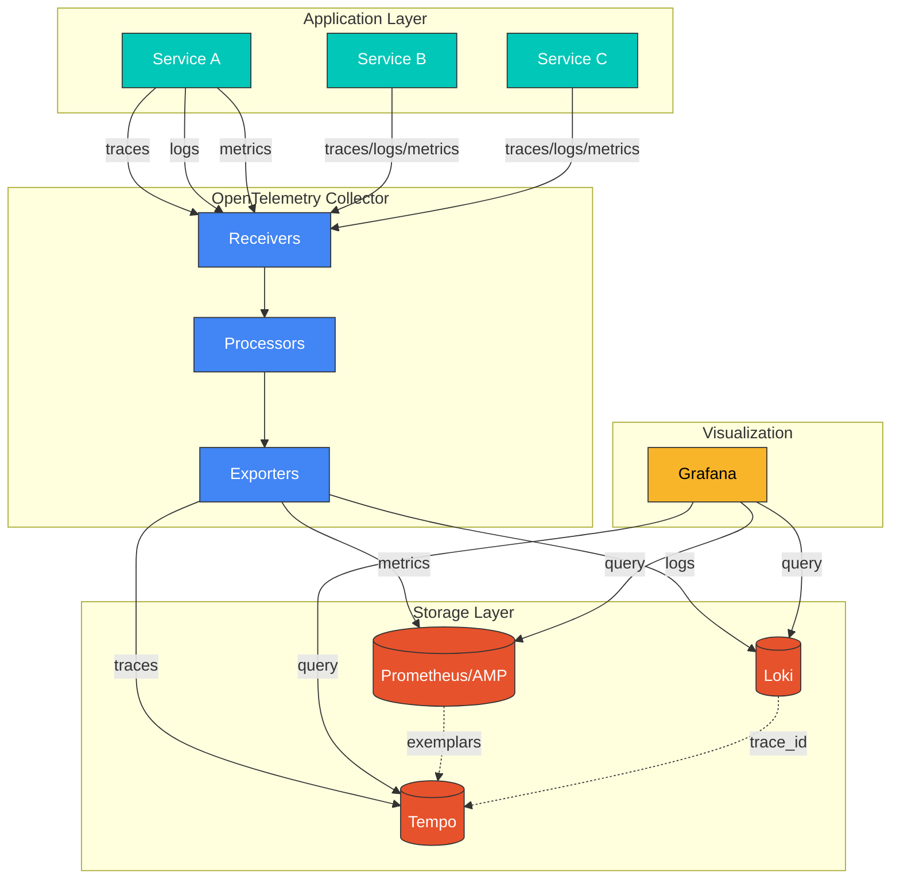
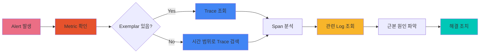

# 관측성 분석: Logs/Metrics/Traces 상관 분석

> **지원 버전**: Loki 3.0+, Tempo 2.4+, Prometheus 2.50+, Grafana 10.0+
> **마지막 업데이트**: 2026년 2월 23일

< [이전: 운영 알림 구성](./07-observability-alerts.md) | [목차](./README.md) | [다음: 관측성 스택 운영](./09-observability-stack.md) >

---

## 목차

1. [상관 분석 전략](#상관-분석-전략)
2. [Loki LogQL 분석](#loki-logql-분석)
3. [Prometheus PromQL 패턴](#prometheus-promql-패턴)
4. [Tempo TraceQL 분석](#tempo-traceql-분석)
5. [Grafana 대시보드](#grafana-대시보드)

---

## 상관 분석 전략

효과적인 관측성(Observability)은 로그, 메트릭, 트레이스 세 가지 신호(Three Pillars)를 상호 연결하여 분석할 때 진정한 가치를 발휘합니다. 상관 분석을 통해 문제의 근본 원인을 신속하게 파악할 수 있습니다.

### Trace ID 전파

분산 시스템에서 요청을 추적하려면 Trace ID를 모든 서비스 간에 전파해야 합니다.

#### W3C TraceContext 표준

W3C TraceContext는 분산 추적을 위한 표준화된 HTTP 헤더 형식입니다.

```
# W3C TraceContext 헤더 형식
traceparent: 00-{trace-id}-{span-id}-{flags}
tracestate: {vendor-specific-data}

# 예시
traceparent: 00-0af7651916cd43dd8448eb211c80319c-b7ad6b7169203331-01
tracestate: congo=t61rcWkgMzE,rojo=00f067aa0ba902b7
```

- **trace-id**: 32자리 16진수 (128비트)
- **span-id**: 16자리 16진수 (64비트)
- **flags**: 2자리 16진수 (샘플링 결정 등)

#### B3 헤더 형식 (Zipkin 호환)

```
# B3 Single Header
b3: {TraceId}-{SpanId}-{SamplingState}-{ParentSpanId}

# B3 Multiple Headers
X-B3-TraceId: 80f198ee56343ba864fe8b2a57d3eff7
X-B3-SpanId: e457b5a2e4d86bd1
X-B3-ParentSpanId: 05e3ac9a4f6e3b90
X-B3-Sampled: 1
```

### OpenTelemetry SDK 계측 패턴

애플리케이션에서 OpenTelemetry SDK를 사용하여 자동 및 수동 계측을 구현합니다.

#### Go 애플리케이션 계측

```go
package main

import (
    "context"
    "net/http"
    "log"

    "go.opentelemetry.io/otel"
    "go.opentelemetry.io/otel/exporters/otlp/otlptrace/otlptracegrpc"
    "go.opentelemetry.io/otel/propagation"
    "go.opentelemetry.io/otel/sdk/resource"
    sdktrace "go.opentelemetry.io/otel/sdk/trace"
    semconv "go.opentelemetry.io/otel/semconv/v1.21.0"
    "go.opentelemetry.io/otel/trace"
    "go.opentelemetry.io/contrib/instrumentation/net/http/otelhttp"
)

var tracer trace.Tracer

func initTracer() func() {
    ctx := context.Background()

    // OTLP exporter 설정
    exporter, err := otlptracegrpc.New(ctx,
        otlptracegrpc.WithEndpoint("otel-collector:4317"),
        otlptracegrpc.WithInsecure(),
    )
    if err != nil {
        log.Fatal(err)
    }

    // Resource 설정 (서비스 메타데이터)
    res, _ := resource.Merge(
        resource.Default(),
        resource.NewWithAttributes(
            semconv.SchemaURL,
            semconv.ServiceName("my-service"),
            semconv.ServiceVersion("1.0.0"),
            semconv.DeploymentEnvironment("production"),
        ),
    )

    // TracerProvider 설정
    tp := sdktrace.NewTracerProvider(
        sdktrace.WithBatcher(exporter),
        sdktrace.WithResource(res),
        sdktrace.WithSampler(sdktrace.AlwaysSample()),
    )
    otel.SetTracerProvider(tp)

    // Propagator 설정 (W3C TraceContext + Baggage)
    otel.SetTextMapPropagator(propagation.NewCompositeTextMapPropagator(
        propagation.TraceContext{},
        propagation.Baggage{},
    ))

    tracer = tp.Tracer("my-service")

    return func() {
        tp.Shutdown(ctx)
    }
}

func main() {
    cleanup := initTracer()
    defer cleanup()

    // HTTP 핸들러에 자동 계측 적용
    handler := otelhttp.NewHandler(http.HandlerFunc(handleRequest), "handle-request")
    http.Handle("/api/v1/users", handler)
    http.ListenAndServe(":8080", nil)
}

func handleRequest(w http.ResponseWriter, r *http.Request) {
    ctx := r.Context()

    // 수동 span 생성
    ctx, span := tracer.Start(ctx, "process-user-request")
    defer span.End()

    // span에 속성 추가
    span.SetAttributes(
        semconv.HTTPMethod(r.Method),
        semconv.HTTPRoute("/api/v1/users"),
    )

    // 비즈니스 로직 수행
    processRequest(ctx)
}

func processRequest(ctx context.Context) {
    _, span := tracer.Start(ctx, "database-query")
    defer span.End()
    // DB 쿼리 실행
}
```

#### Python 애플리케이션 계측

```python
from opentelemetry import trace
from opentelemetry.exporter.otlp.proto.grpc.trace_exporter import OTLPSpanExporter
from opentelemetry.sdk.trace import TracerProvider
from opentelemetry.sdk.trace.export import BatchSpanProcessor
from opentelemetry.sdk.resources import Resource, SERVICE_NAME
from opentelemetry.instrumentation.flask import FlaskInstrumentor
from opentelemetry.instrumentation.requests import RequestsInstrumentor
from opentelemetry.propagate import set_global_textmap
from opentelemetry.propagators.composite import CompositePropagator
from opentelemetry.trace.propagation.tracecontext import TraceContextTextMapPropagator
from opentelemetry.baggage.propagation import W3CBaggagePropagator
import logging

# Resource 설정
resource = Resource.create({
    SERVICE_NAME: "python-api-service",
    "service.version": "1.0.0",
    "deployment.environment": "production",
})

# TracerProvider 설정
provider = TracerProvider(resource=resource)
processor = BatchSpanProcessor(
    OTLPSpanExporter(endpoint="otel-collector:4317", insecure=True)
)
provider.add_span_processor(processor)
trace.set_tracer_provider(provider)

# Propagator 설정
set_global_textmap(CompositePropagator([
    TraceContextTextMapPropagator(),
    W3CBaggagePropagator(),
]))

# tracer 인스턴스
tracer = trace.get_tracer(__name__)

# Flask 자동 계측
from flask import Flask
app = Flask(__name__)
FlaskInstrumentor().instrument_app(app)
RequestsInstrumentor().instrument()

@app.route('/api/orders')
def get_orders():
    # 현재 span 컨텍스트 가져오기
    current_span = trace.get_current_span()
    trace_id = format(current_span.get_span_context().trace_id, '032x')

    # 로그에 trace_id 포함
    logging.info(f"Processing order request", extra={
        'trace_id': trace_id,
        'span_id': format(current_span.get_span_context().span_id, '016x')
    })

    # 수동 span 생성
    with tracer.start_as_current_span("fetch-orders-from-db") as span:
        span.set_attribute("db.system", "postgresql")
        span.set_attribute("db.operation", "SELECT")
        orders = fetch_orders()

    return orders
```

### Exemplars: 메트릭과 트레이스 연결

Exemplars는 메트릭과 특정 트레이스를 연결하여 이상 징후가 발생한 정확한 요청을 추적할 수 있게 합니다.

```go
// Go에서 Prometheus 메트릭에 Exemplar 추가
import (
    "github.com/prometheus/client_golang/prometheus"
    "go.opentelemetry.io/otel/trace"
)

var httpRequestDuration = prometheus.NewHistogramVec(
    prometheus.HistogramOpts{
        Name:    "http_request_duration_seconds",
        Help:    "HTTP request duration in seconds",
        Buckets: prometheus.DefBuckets,
    },
    []string{"method", "path", "status"},
)

func recordMetricWithExemplar(ctx context.Context, duration float64, labels prometheus.Labels) {
    span := trace.SpanFromContext(ctx)
    traceID := span.SpanContext().TraceID().String()

    // Exemplar와 함께 메트릭 기록
    httpRequestDuration.With(labels).(prometheus.ExemplarObserver).ObserveWithExemplar(
        duration,
        prometheus.Labels{"trace_id": traceID},
    )
}
```

### Log-Trace 상관관계

로그에 Trace ID를 주입하여 로그와 트레이스를 연결합니다.

#### 구조화된 로깅 (JSON)

```json
{
  "timestamp": "2025-01-15T10:30:45.123Z",
  "level": "ERROR",
  "message": "Failed to process payment",
  "service": "payment-service",
  "trace_id": "0af7651916cd43dd8448eb211c80319c",
  "span_id": "b7ad6b7169203331",
  "user_id": "user-12345",
  "order_id": "order-67890",
  "error": "insufficient_funds"
}
```

#### Logback 설정 (Java/Spring)

```xml
<configuration>
    <appender name="JSON" class="ch.qos.logback.core.ConsoleAppender">
        <encoder class="net.logstash.logback.encoder.LogstashEncoder">
            <provider class="net.logstash.logback.composite.loggingevent.LoggingEventCompositeJsonProvider">
                <providers>
                    <timestamp/>
                    <logLevel/>
                    <message/>
                    <mdc/>
                    <stackTrace/>
                </providers>
            </provider>
        </encoder>
    </appender>

    <root level="INFO">
        <appender-ref ref="JSON"/>
    </root>
</configuration>
```

### 아키텍처 다이어그램



### 상관 분석 워크플로우

문제 발생 시 상관 분석을 통한 근본 원인 분석 워크플로우입니다.



1. **Alert 발생**: Prometheus에서 알림 트리거
2. **Metric 확인**: 관련 메트릭 대시보드에서 이상 패턴 확인
3. **Trace 조회**: Exemplar를 통해 또는 시간 범위로 관련 트레이스 검색
4. **Span 분석**: 트레이스 내 개별 span에서 지연 또는 오류 구간 식별
5. **Log 조회**: Trace ID로 관련 로그 필터링하여 상세 컨텍스트 확인
6. **근본 원인 파악**: 수집된 정보를 종합하여 문제 원인 도출

---

## Loki LogQL 분석

Loki의 LogQL은 Prometheus의 PromQL에서 영감을 받은 로그 쿼리 언어입니다. 스트림 선택자와 필터를 조합하여 로그를 검색하고 분석합니다.

### 오류율 계산

```logql
# 네임스페이스별 ERROR 로그 발생률 (5분 윈도우)
sum(rate({namespace="production"} |= "ERROR" [5m])) by (app)

# 서비스별 오류 로그 비율
sum(rate({app="api-gateway"} |= "error" [5m]))
/
sum(rate({app="api-gateway"} [5m]))

# HTTP 5xx 오류 로그 카운트
sum(count_over_time({namespace="production"} | json | status_code >= 500 [1h])) by (service)
```

### 지연 시간 추출

JSON 형식 로그에서 지연 시간을 추출하고 분석합니다.

```logql
# 지연 시간 500ms 초과 로그 필터링
{app="api-service"} | json | latency_ms > 500

# 지연 시간 분포 분석 (히스토그램)
quantile_over_time(0.95, {app="api-service"} | json | unwrap latency_ms [5m]) by (endpoint)

# P99 지연 시간이 높은 엔드포인트 찾기
topk(5,
  quantile_over_time(0.99,
    {app="api-service"} | json | unwrap response_time_ms [5m]
  ) by (endpoint)
)

# 평균 지연 시간 추세
avg_over_time({app="api-service"} | json | unwrap latency_ms [5m]) by (endpoint)
```

### 로그 기반 알림 규칙

Loki Ruler를 사용하여 로그 기반 알림을 설정합니다.

```yaml
apiVersion: v1
kind: ConfigMap
metadata:
  name: loki-rules
  namespace: monitoring
data:
  rules.yaml: |
    groups:
      - name: log-based-alerts
        interval: 1m
        rules:
          # 오류 로그 급증 알림
          - alert: HighErrorLogRate
            expr: |
              sum(rate({namespace="production"} |= "ERROR" [5m])) by (app) > 10
            for: 5m
            labels:
              severity: warning
            annotations:
              summary: "높은 오류 로그 발생률: {{ $labels.app }}"
              description: "{{ $labels.app }}에서 분당 10건 이상의 오류 로그 발생"

          # 특정 오류 패턴 감지
          - alert: DatabaseConnectionError
            expr: |
              count_over_time({app=~".+"} |~ "connection refused|timeout|connection reset" [5m]) > 5
            for: 2m
            labels:
              severity: critical
            annotations:
              summary: "데이터베이스 연결 오류 감지"
              description: "데이터베이스 연결 관련 오류 로그가 5건 이상 발생했습니다"

          # OOM 킬러 감지
          - alert: OOMKillerDetected
            expr: |
              count_over_time({unit="kernel"} |= "Out of memory: Killed process" [5m]) > 0
            for: 0m
            labels:
              severity: critical
            annotations:
              summary: "OOM Killer 활성화 감지"
              description: "커널에서 OOM Killer가 프로세스를 종료했습니다"

          # 보안 관련 로그 감지
          - alert: SuspiciousLoginAttempts
            expr: |
              count_over_time({app="auth-service"} |= "authentication failed" [5m]) > 50
            for: 2m
            labels:
              severity: warning
            annotations:
              summary: "의심스러운 로그인 시도 감지"
              description: "5분 내 50회 이상의 인증 실패가 발생했습니다"
```

### 레이블 전략과 카디널리티

Loki에서 효율적인 쿼리를 위한 레이블 전략입니다.

```yaml
# 권장 레이블 (낮은 카디널리티)
scrape_configs:
  - job_name: kubernetes-pods
    kubernetes_sd_configs:
      - role: pod
    relabel_configs:
      # 정적이고 유한한 값을 가진 레이블만 사용
      - source_labels: [__meta_kubernetes_namespace]
        target_label: namespace
      - source_labels: [__meta_kubernetes_pod_label_app]
        target_label: app
      - source_labels: [__meta_kubernetes_pod_container_name]
        target_label: container
      # 높은 카디널리티 레이블 제외 (pod name, node name 등)

# 피해야 할 레이블 (높은 카디널리티)
# - pod: 동적으로 생성되는 파드 이름 (예: api-6d4f5b7c8d-xj2kl)
# - request_id: 요청마다 고유한 값
# - user_id: 사용자 ID
```

### LogQL 패턴 매칭 및 파싱

```logql
# Nginx 액세스 로그 패턴 파싱
{app="nginx"}
  | pattern `<ip> - - [<_>] "<method> <path> <_>" <status> <size>`
  | status >= 400

# JSON 로그 파싱 및 필터링
{app="api-service"}
  | json
  | level = "error"
  | message =~ ".*timeout.*"
  | line_format "{{.timestamp}} [{{.level}}] {{.service}}: {{.message}}"

# 정규식을 사용한 필드 추출
{app="api-service"}
  | regexp `(?P<timestamp>\d{4}-\d{2}-\d{2}T\d{2}:\d{2}:\d{2}) (?P<level>\w+) (?P<message>.*)`
  | level = "ERROR"

# logfmt 형식 파싱
{app="go-service"}
  | logfmt
  | duration > 1s
  | status_code >= 500
```

### 집계 쿼리

```logql
# 상위 5개 오류 발생 엔드포인트
topk(5,
  sum(count_over_time({app="api-service"} | json | status_code >= 500 [1h])) by (endpoint)
)

# 시간별 오류 분포
sum(count_over_time({namespace="production"} |= "ERROR" [1h])) by (app)

# 백분위수 계산 (지연 시간)
quantile_over_time(0.99,
  {app="api-service"} | json | unwrap latency_ms [5m]
) by (endpoint)

# 로그 볼륨 비율
sum(rate({namespace=~".+"}[5m])) by (namespace) / ignoring(namespace) group_left
sum(rate({namespace=~".+"}[5m]))
```

### 멀티라인 로그 처리

스택 트레이스와 같은 멀티라인 로그를 처리합니다.

```yaml
# Promtail 설정에서 멀티라인 처리
scrape_configs:
  - job_name: java-apps
    kubernetes_sd_configs:
      - role: pod
    pipeline_stages:
      - multiline:
          firstline: '^\d{4}-\d{2}-\d{2}'
          max_wait_time: 3s
          max_lines: 128
      - regex:
          expression: '^(?P<timestamp>\d{4}-\d{2}-\d{2}T\d{2}:\d{2}:\d{2}\.\d{3}) (?P<level>\w+) (?P<message>[\s\S]*)'
      - labels:
          level:
```

### 전체 Loki 알림 규칙 예시

```yaml
apiVersion: monitoring.coreos.com/v1
kind: PrometheusRule
metadata:
  name: loki-alerting-rules
  namespace: monitoring
  labels:
    release: prometheus
spec:
  groups:
  - name: loki.log.alerts
    rules:
    # 로그 수집 지연
    - alert: LokiIngestionLag
      expr: |
        sum(loki_distributor_bytes_received_total) == 0
      for: 5m
      labels:
        severity: critical
      annotations:
        summary: "Loki 로그 수집 중단"
        description: "Loki가 5분 이상 로그를 수집하지 못하고 있습니다"

    # 로그 저장 실패
    - alert: LokiIngesterFailures
      expr: |
        rate(loki_ingester_chunk_stored_bytes_total[5m]) == 0
      for: 5m
      labels:
        severity: warning
      annotations:
        summary: "Loki 로그 저장 실패"
        description: "Loki Ingester가 로그를 저장하지 못하고 있습니다"
```

---

## Prometheus PromQL 패턴

PromQL은 시계열 데이터를 쿼리하고 분석하기 위한 강력한 표현식 언어입니다.

### RPS (Requests Per Second) 계산

```promql
# 서비스별 초당 요청 수
sum(rate(http_requests_total[5m])) by (service)

# 엔드포인트별 RPS
sum(rate(http_requests_total[5m])) by (method, path)

# 전체 클러스터 RPS
sum(rate(http_requests_total[5m]))

# 증가 추세 비교 (이전 시간 대비)
sum(rate(http_requests_total[5m]))
/
sum(rate(http_requests_total[5m] offset 1h))
```

### RED 메소드 구현

RED(Rate, Errors, Duration) 메소드는 서비스 모니터링의 황금 신호입니다.

```promql
# Rate: 초당 요청 수
sum(rate(http_requests_total[5m])) by (service)

# Errors: 오류율 (5xx 응답 비율)
sum(rate(http_requests_total{status=~"5.."}[5m])) by (service)
/
sum(rate(http_requests_total[5m])) by (service)

# Duration: 요청 지연 시간 백분위수
# P50
histogram_quantile(0.50,
  sum(rate(http_request_duration_seconds_bucket[5m])) by (le, service)
)

# P95
histogram_quantile(0.95,
  sum(rate(http_request_duration_seconds_bucket[5m])) by (le, service)
)

# P99
histogram_quantile(0.99,
  sum(rate(http_request_duration_seconds_bucket[5m])) by (le, service)
)

# 평균 지연 시간
sum(rate(http_request_duration_seconds_sum[5m])) by (service)
/
sum(rate(http_request_duration_seconds_count[5m])) by (service)
```

### Istio Service Mesh 메트릭

Istio 환경에서 서비스 간 통신 메트릭을 분석합니다.

```promql
# 서비스별 요청 수
sum(rate(istio_requests_total[5m])) by (destination_service_name)

# 서비스 간 요청 실패율
sum(rate(istio_requests_total{response_code=~"5.."}[5m])) by (source_app, destination_app)
/
sum(rate(istio_requests_total[5m])) by (source_app, destination_app)

# P99 지연 시간
histogram_quantile(0.99,
  sum(rate(istio_request_duration_milliseconds_bucket[5m])) by (le, destination_service_name)
)

# 서비스 메시 트래픽 볼륨
sum(rate(istio_tcp_sent_bytes_total[5m])) by (source_app, destination_app)

# mTLS 적용률
sum(rate(istio_requests_total{connection_security_policy="mutual_tls"}[5m]))
/
sum(rate(istio_requests_total[5m]))

# Envoy 프록시 오류
sum(rate(envoy_cluster_upstream_cx_connect_fail[5m])) by (cluster_name)
```

### ALB 메트릭 (CloudWatch 연동)

Amazon Managed Prometheus(AMP)에서 CloudWatch 메트릭을 쿼리합니다.

```promql
# ALB 평균 응답 시간
avg(aws_alb_target_response_time_average) by (load_balancer)

# ALB 요청 수
sum(rate(aws_alb_request_count_sum[5m])) by (load_balancer)

# ALB HTTP 5xx 오류 수
sum(rate(aws_alb_httpcode_target_5xx_count_sum[5m])) by (load_balancer)

# ALB 활성 연결 수
sum(aws_alb_active_connection_count_sum) by (load_balancer)

# Target Group 건강 상태
aws_alb_tg_healthy_host_count /
(aws_alb_tg_healthy_host_count + aws_alb_tg_unhealthy_host_count)

# Unhealthy target 감지
aws_alb_tg_unhealthy_host_count > 0
```

### AMP (Amazon Managed Prometheus) 쿼리 패턴

```promql
# 크로스 리전 메트릭 집계
sum(rate(http_requests_total{region=~"ap-northeast-1|ap-northeast-2"}[5m])) by (service, region)

# 장기 보존 데이터 쿼리 (30일 추세)
avg_over_time(http_requests_total[30d])

# 다중 클러스터 비교
sum(rate(http_requests_total[5m])) by (cluster)

# AMP 메트릭 수집 상태
up{job="amp-remote-write"}
```

### Recording Rules

자주 사용하는 쿼리를 Recording Rule로 사전 계산하여 성능을 최적화합니다.

```yaml
apiVersion: monitoring.coreos.com/v1
kind: PrometheusRule
metadata:
  name: recording-rules
  namespace: monitoring
  labels:
    release: prometheus
spec:
  groups:
  - name: service.slo.rules
    interval: 30s
    rules:
    # 서비스별 요청률
    - record: service:http_requests_total:rate5m
      expr: sum(rate(http_requests_total[5m])) by (service)

    # 서비스별 오류율
    - record: service:http_requests_errors:rate5m
      expr: |
        sum(rate(http_requests_total{status=~"5.."}[5m])) by (service)
        /
        sum(rate(http_requests_total[5m])) by (service)

    # 서비스별 P99 지연 시간
    - record: service:http_request_duration_seconds:p99
      expr: |
        histogram_quantile(0.99,
          sum(rate(http_request_duration_seconds_bucket[5m])) by (le, service)
        )

    # 서비스별 P95 지연 시간
    - record: service:http_request_duration_seconds:p95
      expr: |
        histogram_quantile(0.95,
          sum(rate(http_request_duration_seconds_bucket[5m])) by (le, service)
        )

    # 서비스별 평균 지연 시간
    - record: service:http_request_duration_seconds:avg
      expr: |
        sum(rate(http_request_duration_seconds_sum[5m])) by (service)
        /
        sum(rate(http_request_duration_seconds_count[5m])) by (service)

  - name: node.resources.rules
    interval: 60s
    rules:
    # 노드별 CPU 사용률
    - record: node:cpu_utilization:ratio
      expr: |
        1 - avg(rate(node_cpu_seconds_total{mode="idle"}[5m])) by (instance)

    # 노드별 메모리 사용률
    - record: node:memory_utilization:ratio
      expr: |
        1 - (node_memory_MemAvailable_bytes / node_memory_MemTotal_bytes)

    # 노드별 디스크 사용률
    - record: node:disk_utilization:ratio
      expr: |
        1 - (node_filesystem_avail_bytes{mountpoint="/"} / node_filesystem_size_bytes{mountpoint="/"})

  - name: namespace.resources.rules
    interval: 60s
    rules:
    # 네임스페이스별 CPU 사용량
    - record: namespace:container_cpu_usage_seconds:sum_rate
      expr: |
        sum(rate(container_cpu_usage_seconds_total{container!=""}[5m])) by (namespace)

    # 네임스페이스별 메모리 사용량
    - record: namespace:container_memory_working_set_bytes:sum
      expr: |
        sum(container_memory_working_set_bytes{container!=""}) by (namespace)

    # 네임스페이스별 네트워크 수신 대역폭
    - record: namespace:container_network_receive_bytes:sum_rate
      expr: |
        sum(rate(container_network_receive_bytes_total[5m])) by (namespace)
```

### Recording Rules YAML 전체 예시

```yaml
apiVersion: monitoring.coreos.com/v1
kind: PrometheusRule
metadata:
  name: complete-recording-rules
  namespace: monitoring
  labels:
    release: prometheus
    app: kube-prometheus-stack
spec:
  groups:
  # SLO 관련 recording rules
  - name: slo.rules
    interval: 30s
    rules:
    - record: slo:service_availability:ratio_rate5m
      expr: |
        1 - (
          sum(rate(http_requests_total{status=~"5.."}[5m])) by (service)
          /
          sum(rate(http_requests_total[5m])) by (service)
        )

    - record: slo:service_latency_p99:seconds
      expr: |
        histogram_quantile(0.99,
          sum(rate(http_request_duration_seconds_bucket[5m])) by (le, service)
        )

  # 리소스 효율성 rules
  - name: efficiency.rules
    interval: 60s
    rules:
    - record: pod:cpu_usage_vs_request:ratio
      expr: |
        sum(rate(container_cpu_usage_seconds_total{container!=""}[5m])) by (namespace, pod)
        /
        sum(kube_pod_container_resource_requests{resource="cpu"}) by (namespace, pod)

    - record: pod:memory_usage_vs_request:ratio
      expr: |
        sum(container_memory_working_set_bytes{container!=""}) by (namespace, pod)
        /
        sum(kube_pod_container_resource_requests{resource="memory"}) by (namespace, pod)

  # Istio 관련 rules
  - name: istio.rules
    interval: 30s
    rules:
    - record: istio:service_request_rate:sum_rate5m
      expr: sum(rate(istio_requests_total[5m])) by (destination_service_name)

    - record: istio:service_error_rate:ratio_rate5m
      expr: |
        sum(rate(istio_requests_total{response_code=~"5.."}[5m])) by (destination_service_name)
        /
        sum(rate(istio_requests_total[5m])) by (destination_service_name)

    - record: istio:service_latency_p99:milliseconds
      expr: |
        histogram_quantile(0.99,
          sum(rate(istio_request_duration_milliseconds_bucket[5m])) by (le, destination_service_name)
        )
```

---

## Tempo TraceQL 분석

Grafana Tempo의 TraceQL은 분산 트레이스를 쿼리하기 위한 언어입니다.

### 기본 TraceQL 구문

```traceql
# 기본 쿼리 구조
{ <span selector> }

# 서비스 이름으로 필터링
{ resource.service.name = "api-gateway" }

# Span 속성으로 필터링
{ span.http.status_code >= 500 }

# 여러 조건 조합
{ resource.service.name = "api-gateway" && span.http.status_code >= 500 }

# 정규식 매칭
{ span.http.url =~ "/api/v1/users.*" }
```

### 지연 시간 분석

```traceql
# 2초 이상 걸린 트레이스
{ duration > 2s }

# 특정 서비스에서 지연이 발생한 트레이스
{ resource.service.name = "database-service" && duration > 1s }

# 오류와 함께 높은 지연 시간
{ duration > 2s && status = error }

# Span 레벨 지연 시간 분석
{ span.name = "db.query" && span.duration > 500ms }
```

### 오류 트레이스 검색

```traceql
# HTTP 5xx 오류가 있는 트레이스
{ span.http.status_code >= 500 }

# 오류 상태의 트레이스
{ status = error }

# 특정 오류 메시지 포함
{ span.error.message =~ ".*timeout.*" }

# gRPC 오류 코드
{ span.rpc.grpc.status_code != 0 }

# 데이터베이스 오류
{ span.db.system = "postgresql" && status = error }
```

### 서비스 의존성 매핑

```traceql
# 특정 서비스를 호출하는 모든 서비스
{ resource.service.name != "target-service" } >> { resource.service.name = "target-service" }

# 서비스 간 호출 경로
{ resource.service.name = "frontend" } >> { resource.service.name = "api-gateway" } >> { resource.service.name = "user-service" }

# 외부 API 호출 추적
{ span.http.url =~ "https://external-api.com.*" }
```

### Span 속성 필터링

```traceql
# HTTP 메서드별 필터링
{ span.http.method = "POST" }

# 특정 엔드포인트
{ span.http.route = "/api/v1/orders" }

# 데이터베이스 쿼리 분석
{ span.db.system = "mysql" && span.db.operation = "SELECT" }

# Kafka 메시지 추적
{ span.messaging.system = "kafka" && span.messaging.destination = "orders-topic" }

# 사용자별 요청 추적
{ span.user.id = "user-12345" }
```

### 구조적 쿼리 (부모-자식 관계)

```traceql
# 부모 span 다음에 오는 자식 span
{ resource.service.name = "api-gateway" } >> { resource.service.name = "user-service" }

# 자식 span이 오류인 트레이스
{ resource.service.name = "api-gateway" } >> { status = error }

# 특정 깊이의 span
{ resource.service.name = "frontend" } >> { } >> { span.db.system = "postgresql" }

# 형제 span 관계
{ resource.service.name = "api-gateway" }
  >> ({ span.http.route = "/users" } || { span.http.route = "/orders" })
```

### 트레이스 비교 (배포 전후)

```traceql
# 특정 버전의 트레이스
{ resource.service.version = "v2.0.0" }

# 배포 환경별 비교
{ resource.deployment.environment = "canary" && duration > 1s }

# 특정 시간 범위의 트레이스 (Grafana UI에서 시간 선택기 사용)
{ resource.service.name = "api-gateway" }
```

### 서비스 그래프 생성

Tempo는 트레이스 데이터로부터 서비스 그래프를 자동 생성할 수 있습니다.

```yaml
# Tempo 설정에서 서비스 그래프 활성화
apiVersion: v1
kind: ConfigMap
metadata:
  name: tempo-config
  namespace: monitoring
data:
  tempo.yaml: |
    metrics_generator:
      registry:
        external_labels:
          source: tempo
          cluster: eks-production
      storage:
        path: /var/tempo/wal
        remote_write:
          - url: http://prometheus:9090/api/v1/write
      traces_storage:
        path: /var/tempo/traces
      processor:
        service_graphs:
          enabled: true
          histogram_buckets: [0.1, 0.2, 0.4, 0.8, 1.6, 3.2]
          dimensions: [service.namespace]
        span_metrics:
          enabled: true
          histogram_buckets: [0.002, 0.005, 0.01, 0.025, 0.05, 0.1, 0.25, 0.5, 1, 2.5, 5, 10]
```

### TraceQL 고급 패턴

```traceql
# 느린 데이터베이스 쿼리를 포함한 트레이스
{ } >> { span.db.system != "" && span.duration > 100ms }

# 재시도가 발생한 트레이스 (동일 span.name이 여러 번)
{ } | count() > 1 by (span.name)

# 특정 사용자의 전체 요청 경로
{ span.user.id = "user-12345" } >> { }*

# 캐시 미스 패턴
{ span.cache.hit = false }

# 서킷 브레이커 트리거
{ span.circuitbreaker.state = "open" }
```

---

## Grafana 대시보드

Grafana에서 메트릭, 로그, 트레이스를 통합하여 시각화하고 상관 분석을 수행합니다.

### RED 메소드 대시보드

```json
{
  "panels": [
    {
      "title": "Request Rate",
      "type": "graph",
      "targets": [
        {
          "expr": "sum(rate(http_requests_total[5m])) by (service)",
          "legendFormat": "{{ service }}"
        }
      ]
    },
    {
      "title": "Error Rate",
      "type": "graph",
      "targets": [
        {
          "expr": "sum(rate(http_requests_total{status=~\"5..\"}[5m])) by (service) / sum(rate(http_requests_total[5m])) by (service)",
          "legendFormat": "{{ service }}"
        }
      ]
    },
    {
      "title": "Latency (P99)",
      "type": "graph",
      "targets": [
        {
          "expr": "histogram_quantile(0.99, sum(rate(http_request_duration_seconds_bucket[5m])) by (le, service))",
          "legendFormat": "{{ service }}"
        }
      ]
    }
  ]
}
```

### USE 메소드 (인프라)

USE(Utilization, Saturation, Errors) 메소드는 리소스 모니터링에 적합합니다.

```json
{
  "panels": [
    {
      "title": "CPU Utilization",
      "type": "gauge",
      "targets": [
        {
          "expr": "100 - (avg(rate(node_cpu_seconds_total{mode=\"idle\"}[5m])) * 100)",
          "legendFormat": "CPU Usage %"
        }
      ],
      "fieldConfig": {
        "defaults": {
          "max": 100,
          "thresholds": {
            "steps": [
              { "value": 0, "color": "green" },
              { "value": 70, "color": "yellow" },
              { "value": 85, "color": "red" }
            ]
          }
        }
      }
    },
    {
      "title": "Memory Utilization",
      "type": "gauge",
      "targets": [
        {
          "expr": "(1 - (node_memory_MemAvailable_bytes / node_memory_MemTotal_bytes)) * 100",
          "legendFormat": "Memory Usage %"
        }
      ]
    },
    {
      "title": "Disk Saturation (I/O Wait)",
      "type": "graph",
      "targets": [
        {
          "expr": "rate(node_cpu_seconds_total{mode=\"iowait\"}[5m]) * 100",
          "legendFormat": "{{ instance }}"
        }
      ]
    }
  ]
}
```

### 크로스 데이터소스 링킹

Grafana에서 Prometheus, Loki, Tempo 간의 연결을 설정합니다.

#### Prometheus → Tempo (Exemplars)

```yaml
# Grafana 데이터소스 설정
apiVersion: 1
datasources:
  - name: Prometheus
    type: prometheus
    url: http://prometheus:9090
    jsonData:
      httpMethod: POST
      exemplarTraceIdDestinations:
        - name: trace_id
          datasourceUid: tempo
          urlDisplayLabel: View Trace

  - name: Tempo
    type: tempo
    uid: tempo
    url: http://tempo:3200
    jsonData:
      tracesToLogs:
        datasourceUid: loki
        tags: ['service.name', 'trace_id']
        spanStartTimeShift: '-1h'
        spanEndTimeShift: '1h'
        filterByTraceID: true
        filterBySpanID: true
```

#### Loki → Tempo (Derived Fields)

```yaml
# Loki 데이터소스에서 Derived Fields 설정
datasources:
  - name: Loki
    type: loki
    url: http://loki:3100
    jsonData:
      derivedFields:
        - name: TraceID
          matcherRegex: '"trace_id":"([a-f0-9]+)"'
          url: 'http://grafana:3000/explore?orgId=1&left=["now-1h","now","Tempo",{"query":"${__value.raw}"}]'
          datasourceUid: tempo
```

### 대시보드 프로비저닝

```yaml
apiVersion: v1
kind: ConfigMap
metadata:
  name: grafana-dashboards-config
  namespace: monitoring
data:
  dashboards.yaml: |
    apiVersion: 1
    providers:
      - name: 'default'
        orgId: 1
        folder: 'Kubernetes'
        type: file
        disableDeletion: false
        updateIntervalSeconds: 30
        options:
          path: /var/lib/grafana/dashboards/default
      - name: 'observability'
        orgId: 1
        folder: 'Observability'
        type: file
        disableDeletion: false
        options:
          path: /var/lib/grafana/dashboards/observability
```

### 변수 템플릿

네임스페이스 및 서비스 필터링을 위한 대시보드 변수입니다.

```json
{
  "templating": {
    "list": [
      {
        "name": "namespace",
        "type": "query",
        "datasource": "Prometheus",
        "query": "label_values(kube_namespace_labels, namespace)",
        "multi": true,
        "includeAll": true
      },
      {
        "name": "service",
        "type": "query",
        "datasource": "Prometheus",
        "query": "label_values(http_requests_total{namespace=~\"$namespace\"}, service)",
        "multi": true,
        "includeAll": true
      },
      {
        "name": "pod",
        "type": "query",
        "datasource": "Prometheus",
        "query": "label_values(kube_pod_info{namespace=~\"$namespace\"}, pod)",
        "multi": true,
        "includeAll": true
      }
    ]
  }
}
```

### 통합 관측성 대시보드 JSON

```json
{
  "title": "Service Observability",
  "uid": "service-observability",
  "tags": ["kubernetes", "observability"],
  "timezone": "browser",
  "schemaVersion": 30,
  "panels": [
    {
      "id": 1,
      "title": "Request Rate",
      "type": "stat",
      "gridPos": { "h": 4, "w": 6, "x": 0, "y": 0 },
      "targets": [
        {
          "datasource": "Prometheus",
          "expr": "sum(rate(http_requests_total{namespace=~\"$namespace\", service=~\"$service\"}[5m]))"
        }
      ],
      "fieldConfig": {
        "defaults": {
          "unit": "reqps"
        }
      }
    },
    {
      "id": 2,
      "title": "Error Rate",
      "type": "stat",
      "gridPos": { "h": 4, "w": 6, "x": 6, "y": 0 },
      "targets": [
        {
          "datasource": "Prometheus",
          "expr": "sum(rate(http_requests_total{namespace=~\"$namespace\", service=~\"$service\", status=~\"5..\"}[5m])) / sum(rate(http_requests_total{namespace=~\"$namespace\", service=~\"$service\"}[5m]))"
        }
      ],
      "fieldConfig": {
        "defaults": {
          "unit": "percentunit",
          "thresholds": {
            "steps": [
              { "value": 0, "color": "green" },
              { "value": 0.01, "color": "yellow" },
              { "value": 0.05, "color": "red" }
            ]
          }
        }
      }
    },
    {
      "id": 3,
      "title": "P99 Latency",
      "type": "stat",
      "gridPos": { "h": 4, "w": 6, "x": 12, "y": 0 },
      "targets": [
        {
          "datasource": "Prometheus",
          "expr": "histogram_quantile(0.99, sum(rate(http_request_duration_seconds_bucket{namespace=~\"$namespace\", service=~\"$service\"}[5m])) by (le))"
        }
      ],
      "fieldConfig": {
        "defaults": {
          "unit": "s"
        }
      }
    },
    {
      "id": 4,
      "title": "Active Traces",
      "type": "stat",
      "gridPos": { "h": 4, "w": 6, "x": 18, "y": 0 },
      "targets": [
        {
          "datasource": "Tempo",
          "queryType": "search",
          "search": "{ resource.service.name = \"$service\" }"
        }
      ]
    },
    {
      "id": 5,
      "title": "Request Rate Over Time",
      "type": "timeseries",
      "gridPos": { "h": 8, "w": 12, "x": 0, "y": 4 },
      "targets": [
        {
          "datasource": "Prometheus",
          "expr": "sum(rate(http_requests_total{namespace=~\"$namespace\", service=~\"$service\"}[5m])) by (service)",
          "legendFormat": "{{ service }}"
        }
      ],
      "options": {
        "legend": { "displayMode": "list" }
      }
    },
    {
      "id": 6,
      "title": "Latency Distribution",
      "type": "heatmap",
      "gridPos": { "h": 8, "w": 12, "x": 12, "y": 4 },
      "targets": [
        {
          "datasource": "Prometheus",
          "expr": "sum(rate(http_request_duration_seconds_bucket{namespace=~\"$namespace\", service=~\"$service\"}[5m])) by (le)",
          "legendFormat": "{{ le }}"
        }
      ]
    },
    {
      "id": 7,
      "title": "Recent Error Logs",
      "type": "logs",
      "gridPos": { "h": 8, "w": 24, "x": 0, "y": 12 },
      "targets": [
        {
          "datasource": "Loki",
          "expr": "{namespace=~\"$namespace\", app=~\"$service\"} |= \"error\" | json"
        }
      ],
      "options": {
        "showTime": true,
        "showLabels": false,
        "wrapLogMessage": true
      }
    },
    {
      "id": 8,
      "title": "Service Map",
      "type": "nodeGraph",
      "gridPos": { "h": 10, "w": 12, "x": 0, "y": 20 },
      "targets": [
        {
          "datasource": "Tempo",
          "queryType": "serviceMap"
        }
      ]
    },
    {
      "id": 9,
      "title": "Slow Traces",
      "type": "table",
      "gridPos": { "h": 10, "w": 12, "x": 12, "y": 20 },
      "targets": [
        {
          "datasource": "Tempo",
          "queryType": "search",
          "search": "{ resource.service.name = \"$service\" && duration > 1s }"
        }
      ],
      "transformations": [
        {
          "id": "organize",
          "options": {
            "excludeByName": {},
            "indexByName": {
              "traceID": 0,
              "serviceName": 1,
              "duration": 2,
              "startTime": 3
            }
          }
        }
      ]
    }
  ]
}
```

---

## 참고 자료

- [Grafana Loki LogQL 문서](https://grafana.com/docs/loki/latest/query/)
- [Prometheus PromQL 문서](https://prometheus.io/docs/prometheus/latest/querying/basics/)
- [Grafana Tempo TraceQL 문서](https://grafana.com/docs/tempo/latest/traceql/)
- [OpenTelemetry SDK 문서](https://opentelemetry.io/docs/)
- [Grafana Dashboard Best Practices](https://grafana.com/docs/grafana/latest/best-practices/common-observability-strategies/)

---

## 관련 문서

- [모니터링 스택](../observability/README.md) - Prometheus, VictoriaMetrics, Grafana 설정
- [로깅 스택](../observability/logging/README.md) - Loki, Tempo 설정
- [관측성 최적화](../observability/09-observability-optimization.md) - 고급 최적화 전략

---

< [이전: 운영 알림 구성](./07-observability-alerts.md) | [목차](./README.md) | [다음: 관측성 스택 운영](./09-observability-stack.md) >
