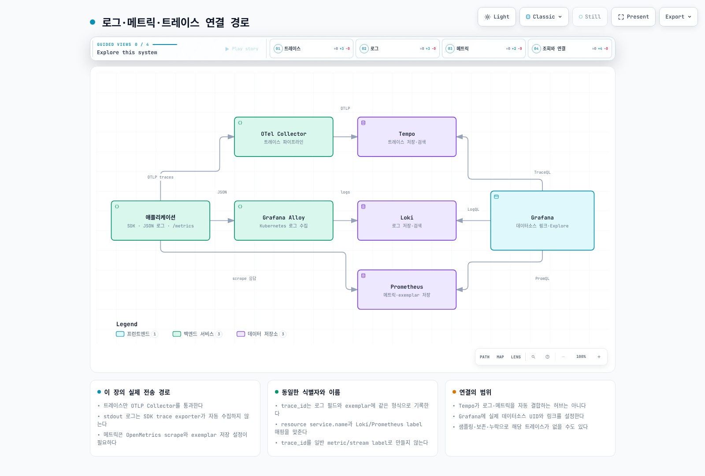
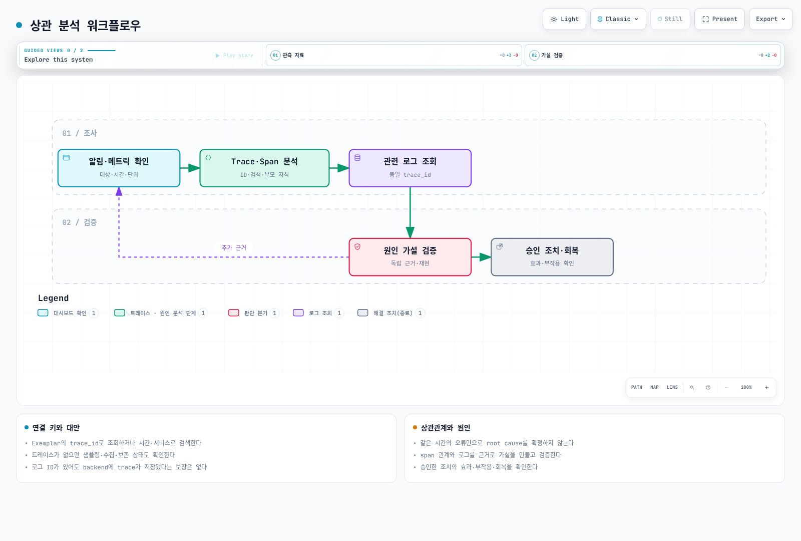

# 관측성 분석: Logs/Metrics/Traces 상관 분석

> **검토 기준**: OTel Go 1.46.0 / otelhttp 0.71.0, Python SDK 1.44.0 / instrumentation 0.65b0, Collector 0.160.0, Alloy 1.19.2, Loki 3.7.7, Tempo 3.0.3, Grafana 13.2.1\
> **마지막 검토**: 2026년 9월 11일. SDK·로그·exemplar는 메모리 exporter와 HTTP 테스트 대역으로, LogQL은 로컬 Loki의 합성 로그로 확인했습니다. 실제 클러스터나 외부 telemetry backend로 데이터를 내보내지 않았습니다.

< [이전: 운영 알림](07-observability-alerts.md) | [목차](README.md) | [다음: 스택 운영](09-observability-stack.md) >

상관 분석은 같은 시간·서비스·요청에 관한 근거를 연결하는 작업입니다. 함께 발생했다는 사실만으로 root cause가 확정되지는 않습니다. 데이터 누락·샘플링·보존 기간도 확인한 뒤 가설을 검증합니다.

## 1. 식별자와 실제 전송 경로



[인터랙티브 다이어그램](https://www.atomai.click/kubernetes-docs/archmaps/ko-ops-08-observability-analysis-0.html)

| 신호 | 이 장의 생성·전송 경로 | 연결 기준 |
|---|---|---|
| Traces | SDK → OTLP/HTTP Collector → Tempo | W3C context와 `service.name` |
| Logs | JSON stdout → Alloy Kubernetes log source → Loki | JSON의 `trace_id`, `span_id` |
| Metrics | Prometheus client → `/metrics` OpenMetrics scrape | exemplar의 `trace_id` |
| 조회 | Grafana → 각 데이터소스 | 고정 UID와 명시적인 label 매핑 |

Trace exporter는 stdout 로그나 Prometheus client metric을 자동으로 OTLP로 바꾸지 않습니다. 모든 신호를 OTLP로 보내려면 각각의 SDK exporter/수집기와 Collector pipeline을 별도로 구성해야 합니다. Tempo가 로그·메트릭을 자동 결합하는 허브도 아닙니다.

### W3C와 B3

```text
traceparent: 00-0af7651916cd43dd8448eb211c80319c-b7ad6b7169203331-01
```

W3C trace ID는 32자리 hex, parent span ID는 16자리 hex이며 all-zero ID는 유효하지 않습니다. 마지막 flags는 sampled 등의 비트를 나타냅니다. Sampled flag나 유효한 ID만으로 backend 저장·보존까지 보장되지는 않습니다.

B3는 별도 지원되는 전파 형식이며 B3 trace ID에는 64-bit/128-bit 형태가 있습니다. 전파 형식을 함께 사용할 때는 충돌하는 헤더의 우선순위와 ingress 신뢰 경계를 정합니다. 아래 코드는 W3C TraceContext만 사용합니다. Baggage에 민감한 값을 무작정 넣어 전파하지 않습니다.

## 2. 실행 가능한 SDK 예제

Go와 Python은 같은 로그·메트릭 계약을 구현하는 **대안**입니다. 둘을 같은 포트에 동시에 실행하지 않습니다. main의 서버는 loopback에 바인딩하는 로컬 데모이며, 실제 배포에서는 애플리케이션 서버·Service·bind 주소를 해당 운영 방식에 맞춥니다.

공통 서비스 이름은 `correlation-api`입니다. JSON에는 `timestamp`, `level`, `message`, `service_name`, `route`, `status_code`, `latency_ms`와 유효한 trace/span ID를 넣습니다. Route는 제한된 템플릿을 사용하고 raw URL·사용자 ID를 일반 metric label에 넣지 않습니다.

### Go

지원되는 최신 patch의 Go 1.25 이상 환경에서 다음 모듈 파일과 코드를 사용합니다. 이 검토의 로컬 컴파일 도구는 Go 1.25.0이었으며 운영용 patch 선택과는 별개입니다.

```text
module example.com/correlation-demo

go 1.25.0

require (
	github.com/prometheus/client_golang v1.24.1
	go.opentelemetry.io/contrib/instrumentation/net/http/otelhttp v0.71.0
	go.opentelemetry.io/otel v1.46.0
	go.opentelemetry.io/otel/exporters/otlp/otlptrace/otlptracehttp v1.46.0
	go.opentelemetry.io/otel/sdk v1.46.0
	go.opentelemetry.io/otel/trace v1.46.0
)

require (
	github.com/beorn7/perks v1.0.1 // indirect
	github.com/cenkalti/backoff/v5 v5.0.3 // indirect
	github.com/cespare/xxhash/v2 v2.3.0 // indirect
	github.com/felixge/httpsnoop v1.1.0 // indirect
	github.com/go-logr/logr v1.4.4 // indirect
	github.com/go-logr/stdr v1.2.2 // indirect
	github.com/google/uuid v1.6.0 // indirect
	github.com/grpc-ecosystem/grpc-gateway/v2 v2.30.0 // indirect
	github.com/munnerz/goautoneg v0.0.0-20191010083416-a7dc8b61c822 // indirect
	github.com/prometheus/client_model v0.6.2 // indirect
	github.com/prometheus/common v0.70.1 // indirect
	github.com/prometheus/procfs v0.21.1 // indirect
	go.opentelemetry.io/auto/sdk v1.2.1 // indirect
	go.opentelemetry.io/otel/exporters/otlp/otlptrace v1.46.0 // indirect
	go.opentelemetry.io/otel/metric v1.46.0 // indirect
	go.opentelemetry.io/proto/otlp v1.11.0 // indirect
	golang.org/x/net v0.58.0 // indirect
	golang.org/x/sys v0.47.0 // indirect
	golang.org/x/text v0.41.0 // indirect
	google.golang.org/genproto/googleapis/api v0.0.0-20260819154853-08b0e4226688 // indirect
	google.golang.org/genproto/googleapis/rpc v0.0.0-20260819154853-08b0e4226688 // indirect
	google.golang.org/grpc v1.83.1 // indirect
	google.golang.org/protobuf v1.36.12 // indirect
)
```

```go
// main.go
package main

import (
	"context"
	"encoding/json"
	"errors"
	"io"
	"log/slog"
	"net/http"
	"os"
	"os/signal"
	"strconv"
	"syscall"
	"time"

	"github.com/prometheus/client_golang/prometheus"
	"github.com/prometheus/client_golang/prometheus/promhttp"
	"go.opentelemetry.io/contrib/instrumentation/net/http/otelhttp"
	"go.opentelemetry.io/otel/attribute"
	"go.opentelemetry.io/otel/codes"
	"go.opentelemetry.io/otel/exporters/otlp/otlptrace/otlptracehttp"
	"go.opentelemetry.io/otel/propagation"
	"go.opentelemetry.io/otel/sdk/resource"
	sdktrace "go.opentelemetry.io/otel/sdk/trace"
	"go.opentelemetry.io/otel/trace"
)

const serviceName = "correlation-api"

func newLogger(writer io.Writer) *slog.Logger {
	return slog.New(slog.NewJSONHandler(writer, &slog.HandlerOptions{
		ReplaceAttr: func(groups []string, attr slog.Attr) slog.Attr {
			if len(groups) == 0 {
				if attr.Key == slog.TimeKey {
					attr.Key = "timestamp"
				}
				if attr.Key == slog.MessageKey {
					attr.Key = "message"
				}
			}
			return attr
		},
	}))
}

func newProvider(exporter sdktrace.SpanExporter, ratio float64) *sdktrace.TracerProvider {
	// Explicit resource attributes avoid mixing incompatible schema URLs.
	return sdktrace.NewTracerProvider(
		sdktrace.WithBatcher(exporter),
		sdktrace.WithResource(resource.NewSchemaless(
			attribute.String("service.name", serviceName),
			attribute.String("service.version", "1.0.0"),
			attribute.String("deployment.environment.name", "demo"),
		)),
		sdktrace.WithSampler(sdktrace.ParentBased(sdktrace.TraceIDRatioBased(ratio))),
	)
}

func newHandler(tp *sdktrace.TracerProvider, logger *slog.Logger, downstream string, transport http.RoundTripper) http.Handler {
	registry := prometheus.NewRegistry()
	requests := prometheus.NewCounterVec(prometheus.CounterOpts{
		Name: "http_requests_total", Help: "Completed requests",
	}, []string{"method", "route", "status"})
	duration := prometheus.NewHistogramVec(prometheus.HistogramOpts{
		Name: "http_request_duration_seconds", Help: "HTTP duration in seconds", Buckets: prometheus.DefBuckets,
	}, []string{"method", "route", "status"})
	registry.MustRegister(requests, duration)
	propagator := propagation.TraceContext{}
	client := &http.Client{
		Transport: otelhttp.NewTransport(transport, otelhttp.WithTracerProvider(tp), otelhttp.WithPropagators(propagator)),
		Timeout:   5 * time.Second,
	}
	tracer := tp.Tracer("correlation-demo")
	mux := http.NewServeMux()
	mux.Handle("/metrics", promhttp.HandlerFor(registry, promhttp.HandlerOpts{EnableOpenMetrics: true}))
	mux.HandleFunc("/healthz", func(w http.ResponseWriter, _ *http.Request) { w.WriteHeader(http.StatusOK) })
	mux.Handle("GET /api/orders", otelhttp.NewHandler(http.HandlerFunc(func(w http.ResponseWriter, r *http.Request) {
		started := time.Now()
		status := http.StatusOK
		ctx, span := tracer.Start(r.Context(), "prepare-order-response")
		span.SetAttributes(attribute.String("app.operation", "orders.list"))
		if downstream != "" {
			// Trusted configuration only; never derive the destination from request input.
			req, err := http.NewRequestWithContext(ctx, http.MethodGet, downstream, nil)
			if err == nil {
				var response *http.Response
				response, err = client.Do(req)
				if err == nil {
					_, _ = io.Copy(io.Discard, io.LimitReader(response.Body, 4096))
					_ = response.Body.Close()
					if response.StatusCode >= 400 {
						err = errors.New("dependency returned unsuccessful status")
					}
				}
			}
			if err != nil {
				span.RecordError(err)
				span.SetStatus(codes.Error, "dependency unavailable")
				status = http.StatusBadGateway
			}
		}
		span.End()
		w.Header().Set("Content-Type", "application/json")
		w.WriteHeader(status)
		_ = json.NewEncoder(w).Encode(map[string]bool{"ok": status == http.StatusOK})
		seconds := time.Since(started).Seconds()
		statusLabel := strconv.Itoa(status)
		method := r.Method // The GET ServeMux pattern accepts GET and HEAD.
		requests.WithLabelValues(method, "/api/orders", statusLabel).Inc()
		context := trace.SpanContextFromContext(r.Context())
		observer := duration.WithLabelValues(method, "/api/orders", statusLabel)
		if context.IsValid() && context.IsSampled() {
			observer.(prometheus.ExemplarObserver).ObserveWithExemplar(seconds, prometheus.Labels{"trace_id": context.TraceID().String()})
		} else {
			observer.Observe(seconds)
		}
		attributes := []any{
			"service_name", serviceName, "method", method, "route", "/api/orders",
			"status_code", status, "latency_ms", seconds * 1000,
		}
		if context.IsValid() {
			attributes = append(attributes, "trace_id", context.TraceID().String(), "span_id", context.SpanID().String())
		}
		level := slog.LevelInfo
		if status >= 500 {
			level = slog.LevelError
		}
		logger.Log(r.Context(), level, "request completed", attributes...)
	}), "orders", otelhttp.WithTracerProvider(tp), otelhttp.WithPropagators(propagator),
		otelhttp.WithSpanNameFormatter(func(_ string, r *http.Request) string {
			return r.Method + " /api/orders"
		})))
	return mux
}

func main() {
	logger := newLogger(os.Stdout)
	ctx, stop := signal.NotifyContext(context.Background(), os.Interrupt, syscall.SIGTERM)
	defer stop()
	// Standard OTEL exporter variables configure the real endpoint and TLS/auth.
	exporter, err := otlptracehttp.New(ctx, otlptracehttp.WithTimeout(5*time.Second))
	if err != nil {
		logger.Error("cannot configure trace exporter", "error", err)
		os.Exit(1)
	}
	provider := newProvider(exporter, 0.1)
	server := &http.Server{
		Addr:              "127.0.0.1:8080",
		Handler:           newHandler(provider, logger, os.Getenv("DEMO_DOWNSTREAM_URL"), http.DefaultTransport),
		ReadHeaderTimeout: 5 * time.Second,
		IdleTimeout:       60 * time.Second,
	}
	failed := make(chan error, 1)
	go func() { failed <- server.ListenAndServe() }()
	select {
	case err := <-failed:
		if !errors.Is(err, http.ErrServerClosed) {
			logger.Error("HTTP server failed", "error", err)
		}
	case <-ctx.Done():
	}
	shutdown, cancel := context.WithTimeout(context.Background(), 10*time.Second)
	defer cancel()
	if err := server.Shutdown(shutdown); err != nil {
		logger.Error("HTTP shutdown incomplete", "error", err)
	}
	// Use a fresh deadline so HTTP draining does not consume the exporter budget.
	flush, cancelFlush := context.WithTimeout(context.Background(), 5*time.Second)
	defer cancelFlush()
	if err := provider.Shutdown(flush); err != nil {
		logger.Error("trace shutdown incomplete", "error", err)
	}
}
```

`resource.NewSchemaless`에 필요한 속성을 명시해 서로 다른 semantic-convention SchemaURL의 merge 오류를 숨기지 않습니다. Provider와 propagator를 handler/transport에 연결하고, 별도의 종료 deadline으로 trace buffer를 비웁니다. 실패한 dependency는 error span과 HTTP 502로 남깁니다.

### Python

Python 3.12에서 확인한 직접 의존성입니다.

```text
opentelemetry-sdk==1.44.0
opentelemetry-exporter-otlp-proto-http==1.44.0
opentelemetry-instrumentation-flask==0.65b0
opentelemetry-instrumentation-requests==0.65b0
Flask==3.1.3
requests==2.34.2
prometheus-client==0.26.0
```

```python
# app.py
"""Local correlation demo: OTLP traces, JSON stdout logs, OpenMetrics metrics."""
import json
import logging
import os
import sys
import time
from datetime import datetime, timezone

import requests
from flask import Flask, Response, g, jsonify, request
from opentelemetry import trace
from opentelemetry.exporter.otlp.proto.http.trace_exporter import OTLPSpanExporter
from opentelemetry.instrumentation.flask import FlaskInstrumentor
from opentelemetry.instrumentation.requests import RequestsInstrumentor
from opentelemetry.propagate import set_global_textmap
from opentelemetry.sdk.resources import Resource
from opentelemetry.sdk.trace import TracerProvider
from opentelemetry.sdk.trace.export import BatchSpanProcessor
from opentelemetry.sdk.trace.sampling import ParentBased, TraceIdRatioBased
from opentelemetry.trace import Status, StatusCode
from opentelemetry.trace.propagation.tracecontext import TraceContextTextMapPropagator
from prometheus_client import CollectorRegistry, Counter, Histogram
from prometheus_client.openmetrics.exposition import CONTENT_TYPE_LATEST, generate_latest

SERVICE_NAME = "correlation-api"


class CorrelatedJSON(logging.Formatter):
    def format(self, record):
        result = {
            "timestamp": datetime.fromtimestamp(record.created, timezone.utc).isoformat(),
            "level": record.levelname,
            "message": record.getMessage(),
            "service_name": SERVICE_NAME,
        }
        context = trace.get_current_span().get_span_context()
        # Unsampled context can still be valid. Do not invent all-zero IDs.
        if context.is_valid:
            result.update(trace_id=f"{context.trace_id:032x}", span_id=f"{context.span_id:016x}")
        for key in ("method", "route", "status_code", "latency_ms"):
            if hasattr(record, key):
                result[key] = getattr(record, key)
        return json.dumps(result, ensure_ascii=False, allow_nan=False)


def make_provider(exporter, sample_ratio=0.1):
    if not 0 <= sample_ratio <= 1:
        raise ValueError("sample_ratio must be between zero and one")
    provider = TracerProvider(
        resource=Resource({
            "service.name": SERVICE_NAME,
            "service.version": "1.0.0",
            "deployment.environment.name": "demo",
        }),
        sampler=ParentBased(TraceIdRatioBased(sample_ratio)),
        shutdown_on_exit=False,
    )
    provider.add_span_processor(BatchSpanProcessor(exporter))
    return provider


def create_app(provider, log_stream=None, session=None, downstream_url=None):
    app = Flask(__name__)
    registry = CollectorRegistry()
    counts = Counter("http_requests_total", "Completed HTTP requests", ["method", "route", "status"], registry=registry)
    duration = Histogram("http_request_duration_seconds", "HTTP duration in seconds", ["method", "route", "status"], registry=registry)
    logger = logging.getLogger("correlation-demo")
    logger.handlers.clear()
    logger.propagate = False
    handler = logging.StreamHandler(log_stream if log_stream is not None else sys.stdout)
    handler.setFormatter(CorrelatedJSON())
    logger.addHandler(handler)
    logger.setLevel(logging.INFO)
    set_global_textmap(TraceContextTextMapPropagator())
    FlaskInstrumentor().instrument_app(app, tracer_provider=provider, excluded_urls="metrics,healthz")
    RequestsInstrumentor().instrument(tracer_provider=provider)
    tracer = provider.get_tracer("correlation-demo")
    client = session if session is not None else requests.Session()

    @app.before_request
    def start_timer():
        g.started = time.perf_counter()

    @app.after_request
    def observe(response):
        route = request.url_rule.rule if request.url_rule is not None else "unmatched"
        if route in {"/metrics", "/healthz"}:
            return response
        elapsed = time.perf_counter() - g.started
        method = request.method if request.method in {"GET", "POST", "PUT", "PATCH", "DELETE", "HEAD", "OPTIONS"} else "_OTHER"
        status = str(response.status_code)
        context = trace.get_current_span().get_span_context()
        exemplar = {"trace_id": f"{context.trace_id:032x}"} if context.is_valid and context.trace_flags.sampled else None
        counts.labels(method, route, status).inc()
        duration.labels(method, route, status).observe(elapsed, exemplar=exemplar)
        logger.log(logging.ERROR if response.status_code >= 500 else logging.INFO, "request completed",
                   extra={"method": method, "route": route, "status_code": response.status_code, "latency_ms": round(elapsed * 1000, 3)})
        return response

    @app.get("/api/orders")
    def orders():
        with tracer.start_as_current_span("prepare-order-response") as span:
            span.set_attribute("app.operation", "orders.list")
            if downstream_url is not None:
                try:
                    # This URL comes from trusted configuration, not request input.
                    with client.get(downstream_url, timeout=(2, 5)) as response:
                        response.raise_for_status()
                except requests.RequestException as error:
                    span.record_exception(error)
                    span.set_status(Status(StatusCode.ERROR))
                    return jsonify(error="dependency unavailable"), 502
            # Demonstration data, not a real database query.
            return jsonify(orders=[{"id": "demo-1", "state": "ready"}])

    @app.get("/metrics")
    def metrics():
        return Response(generate_latest(registry), content_type=CONTENT_TYPE_LATEST)

    @app.get("/healthz")
    def health():
        return jsonify(status="ok")

    return app, client


if __name__ == "__main__":
    # Configure the real OTLP endpoint/TLS/auth through standard exporter settings.
    provider = make_provider(OTLPSpanExporter(), sample_ratio=0.1)
    app, session = create_app(provider, downstream_url=os.environ.get("DEMO_DOWNSTREAM_URL"))
    try:
        # Local demonstration server. Use a proper WSGI server for deployment.
        app.run(host="127.0.0.1", port=8080, debug=False, use_reloader=False)
    finally:
        session.close()
        RequestsInstrumentor().uninstrument()
        provider.shutdown()
```

로그 formatter와 INFO level을 실제로 연결했습니다. `logging.info(..., extra=...)`만 쓰면 기본 설정에서 로그가 출력되지 않거나 extra 필드가 보이지 않을 수 있습니다. Sampled가 아니어도 유효한 context는 로그에 남기며, context가 없을 때 all-zero ID를 만들지 않습니다.

HTTP semantic-convention 속성은 instrumentation의 버전과 opt-in 설정에 따라 달라집니다. 이 Python 실행에서 기본 HTTP 속성은 `http.method`, `http.status_code` 같은 호환 이름으로 출력됐습니다. 최신 SDK라는 이유만으로 모든 query를 새 이름으로 바꾸지 말고 실제 span attributes를 확인합니다.

Exporter는 표준 OTel 환경 설정으로 실제 endpoint를 받습니다. HTTP/protobuf 예시:

```bash
export OTEL_EXPORTER_OTLP_PROTOCOL=http/protobuf
export OTEL_EXPORTER_OTLP_ENDPOINT=http://otel-collector.observability.svc:4318
```

이 주소는 준비된 Collector Service를 전제로 합니다. 배포에 필요한 TLS·인증·네트워크 정책을 별도로 구성합니다. Base endpoint와 `/v1/traces`를 포함하는 signal별 endpoint 설정을 혼동하지 않습니다.

### Java JSON logging

Logback 1.6.3, logstash-logback-encoder 9.0과 JDK 21에서 다음 encoder 구성을 확인했습니다.

```xml
<configuration>
  <!-- A configured OTel Java agent or MDC bridge must supply these MDC keys. -->
  <appender name="JSON" class="ch.qos.logback.core.ConsoleAppender">
    <encoder class="net.logstash.logback.encoder.LogstashEncoder">
      <fieldNames>
        <timestamp>timestamp</timestamp>
      </fieldNames>
      <customFields>{"service_name":"correlation-api"}</customFields>
      <includeMdcKeyName>trace_id</includeMdcKeyName>
      <includeMdcKeyName>span_id</includeMdcKeyName>
    </encoder>
  </appender>
  <root level="INFO">
    <appender-ref ref="JSON"/>
  </root>
</configuration>
```

실제 OTel Java agent 또는 MDC bridge가 `trace_id`/`span_id`를 먼저 넣어야 합니다. XML만으로 자동 계측이 켜지지 않습니다. Java agent의 service.name도 로그와 같은 실제 서비스 이름으로 맞춥니다. 검증에서는 MDC 값을 직접 넣어 encoder와 허용 key, multiline 문자열의 한 줄 JSON 인코딩을 확인했으며 Java agent의 전파까지 실행한 것은 아닙니다.

## 3. 수집기와 backend 연결

아래 파일은 **이미 배포할 Collector/Alloy/Prometheus의 설정**입니다. ConfigMap 하나를 만드는 것만으로 Deployment, Service, RBAC나 backend가 생기지는 않습니다. 실제 namespace·Service 이름·인증을 맞춰야 합니다.

### 트레이스 Collector

```yaml
# collector.yaml
# Trace gateway configuration only. Deploy a matching Collector Service and
# constrain network/authentication separately; this file does not install it.
receivers:
  otlp:
    protocols:
      grpc:
        endpoint: 0.0.0.0:4317
      http:
        endpoint: 0.0.0.0:4318
processors:
  memory_limiter:
    check_interval: 1s
    limit_mib: 256
    spike_limit_mib: 64
  batch:
    timeout: 1s
    send_batch_size: 512
exporters:
  otlphttp/tempo:
    endpoint: http://tempo-distributor.observability.svc:4318
    timeout: 5s
service:
  pipelines:
    traces:
      receivers: [otlp]
      processors: [memory_limiter, batch]
      exporters: [otlphttp/tempo]
```

이 gateway는 traces만 처리합니다. Memory limiter와 batch를 사용하며 불필요한 wildcard CORS를 켜지 않습니다. Kubernetes metadata가 필요하면 올바른 `k8sattributes` processor, pod association과 RBAC를 batch보다 앞에 추가합니다. 중간 proxy를 거친 connection IP만으로 원래 Pod를 식별할 수 있다고 가정하지 않습니다.

SDK resource attribute와 전파 헤더도 신뢰 경계에 따라 검증해야 하며 인증·인가 식별자를 대신하지 않습니다.

### stdout 로그와 Alloy

Promtail은 2026년 3월 2일 EOL에 도달했습니다. 이 예제는 Alloy의 Kubernetes API log source를 사용합니다.

```yaml
# log-reader-rbac.yaml
apiVersion: v1
kind: ServiceAccount
metadata:
  name: correlation-log-reader
  namespace: observability
---
apiVersion: rbac.authorization.k8s.io/v1
kind: Role
metadata:
  name: correlation-log-reader
  namespace: observability
rules:
  - apiGroups: [""]
    resources: [pods]
    verbs: [get, list, watch]
  - apiGroups: [""]
    resources: [pods/log]
    verbs: [get]
---
apiVersion: rbac.authorization.k8s.io/v1
kind: RoleBinding
metadata:
  name: correlation-log-reader
  namespace: observability
roleRef:
  apiGroup: rbac.authorization.k8s.io
  kind: Role
  name: correlation-log-reader
subjects:
  - kind: ServiceAccount
    name: correlation-log-reader
    namespace: observability
```

Alloy를 `observability` namespace의 `correlation-log-reader` 계정으로 실행하고 다음 설정을 실제 config 경로에 공급합니다. 대상 Pod에는 `app=correlation-api` label이 있어야 합니다.

```alloy
// logs.alloy
// Kubernetes API log source: configure its ServiceAccount permissions first.
discovery.kubernetes "application" {
  role = "pod"
  namespaces {
    names = ["observability"]
  }
  selectors {
    role  = "pod"
    label = "app=correlation-api"
  }
}

discovery.relabel "application_logs" {
  targets = discovery.kubernetes.application.targets
  rule {
    source_labels = ["__meta_kubernetes_namespace"]
    target_label  = "namespace"
  }
  rule {
    source_labels = ["__meta_kubernetes_pod_label_app"]
    target_label  = "service_name"
  }
  rule {
    source_labels = ["__meta_kubernetes_pod_container_name"]
    target_label  = "container"
  }
}

loki.source.kubernetes "application" {
  targets    = discovery.relabel.application_logs.output
  forward_to = [loki.process.application.receiver]
}

loki.process "application" {
  stage.json {
    expressions = {
      level = "level",
    }
  }
  stage.labels {
    values = {
      level = "",
    }
  }
  // Keep the complete JSON body, including trace_id/span_id. They are not
  // indexed stream labels and remain available for parsing/correlation.
  forward_to = [loki.write.backend.receiver]
}

loki.write "backend" {
  endpoint {
    url = "http://loki.observability.svc:3100/loki/api/v1/push"
  }
}
```

Kubernetes API log source와 host file tail은 다른 경로입니다. File tail을 쓴다면 CRI/Docker framing, partial line과 multiline 처리를 그 입력에 맞춥니다. JSON 한 이벤트에 stack trace를 escaped newline으로 담으면 여러 독립 라인을 잘못 합칠 가능성을 줄일 수 있습니다.

Trace ID, request ID, 사용자 ID를 Loki stream label로 올리지 않습니다. Log line 또는 적절한 structured metadata에 두고 query 시 필터링합니다. Pod·instance label도 변경량과 보존 기간을 고려합니다.

현재 Collector에서 제거된 `loki` exporter 설정을 재사용하지 않습니다. OTLP logs를 직접 Loki에 보낼 대안은 `otlphttp` exporter의 `http://<loki>/otlp` endpoint와 logs pipeline입니다. Loki의 structured metadata/schema 요구 사항도 맞춰야 합니다. 이는 위의 JSON stdout 수집 경로와 다른 선택입니다.

### 메트릭과 exemplar 저장

```yaml
# prometheus.yaml
# Direct application scrape. HTTP/2 does not enable exemplar storage.
global:
  scrape_interval: 15s
rule_files:
  - recording-rules.yaml
scrape_configs:
  - job_name: correlation-api
    scrape_protocols: [OpenMetricsText1.0.0, PrometheusText0.0.4]
    static_configs:
      - targets: [correlation-api.observability.svc:8080]
        labels:
          service: correlation-api
          namespace: observability
storage:
  exemplars:
    max_exemplars: 10000
```

Prometheus 3.14의 exemplar 저장에는 다음 feature 설정도 필요합니다. `enable_http2`는 exemplar 저장을 켜는 옵션이 아닙니다.

```bash
prometheus --config.file=prometheus.yaml --enable-feature=exemplar-storage
```

파일과 recording rule은 같은 설정 디렉터리에 둡니다. SDK 예제는 OpenMetrics exposition을 제공하고 sampled·valid context의 ID만 exemplar에 첨부합니다. 샘플링, 버퍼 교체나 Tempo 보존 만료로 링크 대상이 없을 수 있습니다. Exemplar가 histogram의 모든 요청이나 정확한 P99 요청을 대표하는 것도 아닙니다.

## 4. LogQL

로그 query는 이 예제의 `service_name`, JSON 대문자 level과 completion-record 계약을 기준으로 합니다. 임의의 `error` substring 비율을 요청 실패율과 동일시하지 않습니다.

### 필터와 집계

```logql
{service_name="correlation-api"} | json | level="ERROR" | __error__=""
```

```logql
sum by (service_name) (rate({service_name="correlation-api"} | json | message="request completed" | status_code>=500 | status_code<600 | __error__="" [5m]))
```

```logql
sum by (service_name) (count_over_time({service_name="correlation-api"} | json | level="ERROR" | __error__="" [1h]))
```

`rate`는 lines/s, `count_over_time`은 각 범위의 line count입니다. 여러 stream의 합계가 필요하면 집계합니다. `|=`는 대소문자를 구분하는 substring 필터이며 JSON severity 검사와 다릅니다.

### 지연과 오류 처리

```logql
quantile_over_time(0.95, {service_name="correlation-api"} | json | latency_ms>=0 | __error__="" | unwrap latency_ms | __error__="" [5m]) by (route)
```

```logql
avg_over_time({service_name="correlation-api"} | json | latency_ms>=0 | __error__="" | unwrap latency_ms | __error__="" [5m]) by (route)
```

JSON 파싱·숫자 비교·unwrap이 오류를 만들 수 있으므로 적절한 위치의 `__error__=""` 필터가 필요합니다. 이 예제는 먼저 `latency_ms>=0`으로 숫자를 검증합니다. Loki 3.7.7에서 정상 10ms/800ms, 잘못된 숫자와 깨진 JSON을 섞어 테스트했고, 수정한 query는 평균 405ms와 P95 760.5ms를 반환했습니다.

이것은 unwrap한 값의 범위 집계이며 Prometheus histogram bucket과 다릅니다. 전체 자유 형식 `message`나 raw URL을 집계 label로 쓰면 query 결과의 cardinality도 폭증할 수 있습니다.

### Trace ID 조회

```logql
{service_name="correlation-api"} | json | trace_id="0af7651916cd43dd8448eb211c80319c" | __error__=""
```

Regex/pattern/json parser 뒤의 오류도 확인합니다. 중첩 JSON을 파싱할 때 두 번째 `| json`이 자동으로 특정 내부 문자열을 대상으로 삼는 것은 아닙니다. 필요한 field를 명시적으로 추출하거나 line을 변환한 뒤 다시 파싱합니다.

### Loki Ruler

```yaml
# loki-rules.yaml
# Native Loki Ruler file. Store through the configured Ruler backend/API.
# This is not a PrometheusRule CRD and not a Grafana Alerting provisioning file.
groups:
  - name: correlation.logs
    rules:
      - alert: CompletedRequestErrorLogsHigh
        expr: |
          sum by (service_name) (
            rate({service_name="correlation-api"} | json
              | message="request completed" | status_code>=500 | __error__="" [5m])
          ) > 1
        for: 5m
        labels:
          severity: warning
        annotations:
          summary: High completed-request error log rate
          description: '{{ $labels.service_name }} emitted {{ printf "%.2f" $value }} matching log lines/s.'
```

이 파일은 Loki Ruler의 storage/API에 연결해야 합니다. LogQL을 PrometheusRule CRD에 넣어 Prometheus가 평가하도록 할 수 없습니다. Grafana Alerting provisioning의 `apiVersion`·schema도 별개입니다.

Loki 수집량 counter의 누적값이 0인지 보는 것은 수집 중단 검사가 아닙니다. 최근 증가율과 예상 입력, collector 오류·backpressure·저장 오류를 함께 확인합니다. 입력이 없는 시간에 저장량이 0인 것만으로 장애를 확정하지 않습니다.

## 5. PromQL과 metric 단위

```yaml
# recording-rules.yaml
groups:
  - name: correlation.red
    interval: 30s
    rules:
      - record: service:http_requests:rate5m
        expr: sum by (namespace, service) (rate(http_requests_total[5m]))
      - record: service:http_errors:rate5m
        expr: |
          sum by (namespace, service) (rate(http_requests_total{status=~"5.."}[5m]))
          or on (namespace, service) (0 * service:http_requests:rate5m)
      - record: service:http_error_ratio:rate5m
        expr: service:http_errors:rate5m / (service:http_requests:rate5m > 0)
      - record: service:http_latency_p99:seconds
        expr: |
          histogram_quantile(0.99,
            sum by (namespace, service, le) (rate(http_request_duration_seconds_bucket[5m]))
          )
      - record: service:http_latency_mean:seconds
        expr: |
          sum by (namespace, service) (rate(http_request_duration_seconds_sum[5m]))
          /
          (sum by (namespace, service) (rate(http_request_duration_seconds_count[5m])) > 0)
```

Classic histogram은 `le`를 보존해서 집계합니다. Error series가 아직 없으면 같은 서비스의 실제 요청 series를 기준으로 0을 채우고, 요청도 0이면 비율을 정상 0으로 만들지 않습니다. 기록 규칙의 단위와 dashboard의 `s`, `percentunit`, `reqps`를 맞춥니다.

RPS는 counter의 `rate`로 구하고 장기 추세도 rate/증가량을 목적에 맞게 사용합니다. 누적 counter를 30일 평균내면 평균 요청률이 되지 않습니다. 평균·백분위수와 histogram quantile은 서로 다른 통계입니다.

Istio 요청 metric은 source/destination reporter가 중복될 수 있으므로 관측 방향을 선택합니다. 예를 들어 destination 관찰값을 집계할 때:

```promql
sum by (cluster, destination_service_namespace, destination_service_name) (
  rate(istio_requests_total{reporter="destination"}[5m])
)
```

Istio duration metric의 milliseconds와 애플리케이션 seconds를 혼동하지 않습니다. L7 metric의 mTLS 비율은 관측한 HTTP 요청의 비율이며 모든 L4 트래픽의 암호화 정책 증명은 아닙니다. Ambient 구성은 waypoint 여부 등 실제 L7 telemetry 경로를 확인합니다.

CloudWatch exporter의 `_sum`은 기간 통계 gauge일 수 있습니다. 이를 monotonic counter로 보고 `rate()`를 적용하지 않습니다. 집계 기간이 60초인 RequestCount Sum을 RPS로 환산한다면 그 기간과 exporter의 timestamp/delay·중복 series를 확인한 뒤 나눕니다. Metric prefix와 label은 exporter마다 다릅니다.

AMP는 ingest한 데이터를 query하는 workspace입니다. CloudWatch 수집, 다른 workspace/리전 통합이나 `up{job="amp-remote-write"}`가 자동으로 만들어지는 것은 아닙니다. 실제 remote-write queue/오류와 AMP가 제공하는 수집 상태를 확인합니다.

## 6. TraceQL

다음은 Tempo 3.0.3 문서와 Grafana 공식 parser로 확인한 구문입니다. 속성 이름은 실제 instrumentation의 semantic-convention 출력과 일치해야 합니다.

```traceql
{ resource.service.name = "correlation-api" }
```

```traceql
{ resource.service.name = "correlation-api" && span:duration > 500ms }
```

```traceql
{ trace:duration > 2s }
```

`span:duration`은 span, `trace:duration`은 trace 전체 시간 범위입니다. `span:name` 같은 intrinsic과 `span.name`이라는 사용자 attribute는 다릅니다.

```traceql
{ resource.service.name = "correlation-api" && span:status = error }
```

```traceql
{ resource.service.name = "correlation-api" && span.http.status_code >= 500 }
```

Go 실행에서는 `http.request.method`와 `http.response.status_code`가 기록됐습니다. 같은 예제의 Go backend에는 다음 query를 사용합니다.

```traceql
{ resource.service.name = "correlation-api" && span.http.response.status_code >= 500 }
```

Error status는 정확한 HTTP 500과 같은 조건이 아닙니다. 이 예제의 기본 Python instrumentation은 `http.status_code`를 출력했지만 새 semantic convention을 선택했다면 `http.response.status_code` 등 실제 이름에 맞춰 query를 변경합니다.

### 관계와 집계

```traceql
{ span:kind = server } > { span:name = "prepare-order-response" }
```

```traceql
{ span:kind = server } >> { span:status = error }
```

```traceql
{ span:name = "check-stock" } ~ { span:name = "check-payment" }
```

`>`는 직접 자식, `>>`는 임의 깊이의 후손, `<`는 직접 부모, `~`는 같은 부모를 가진 형제 관계입니다. 동일 서비스의 client/server span만 선택하는 query가 모든 상대 서비스를 자동 매핑하는 것은 아닙니다.

```traceql
{ resource.service.name = "correlation-api" } | by(span:name) | count() > 1
```

같은 이름의 span이 여러 개 있다는 것만으로 retry를 확정하지 않습니다. `{ }*` 같은 지원하지 않는 반복 구문을 쓰지 말고 trace ID 조회와 명시적 구조 query를 사용합니다.

```traceql
{ resource.service.name = "correlation-api" } | quantile_over_time(duration, 0.99)
```

이 결과는 TraceQL metrics 시계열이며 느린 개별 trace 목록이 아닙니다. 선택한 query 모드와 해당 Tempo 배포의 기능·데이터 경로를 확인합니다. Service graph가 필요하면 지원되는 생성기/processor와 저장·조회 경로를 별도로 구성합니다.

`traces_service_graph_request_total` 같은 생성된 metric은 Prometheus/호환 metric backend의 **PromQL**로 조회합니다. Client/server span 종류·대응 관계·샘플링에 따라 graph가 불완전할 수 있습니다. 오래된 `processor.*.enabled=true` 조각만으로 현재 Tempo 구성이 완성된다고 가정하지 않습니다.

## 7. Grafana 데이터소스와 대시보드

```yaml
# datasources.yaml
apiVersion: 1
datasources:
  - name: Prometheus
    uid: prometheus
    type: prometheus
    access: proxy
    url: http://prometheus.observability.svc:9090
    jsonData:
      httpMethod: POST
      exemplarTraceIdDestinations:
        - name: trace_id
          datasourceUid: tempo
          urlDisplayLabel: View trace
  - name: Loki
    uid: loki
    type: loki
    access: proxy
    url: http://loki.observability.svc:3100
    jsonData:
      derivedFields:
        - name: TraceID
          matcherRegex: '"trace_id"\s*:\s*"([0-9a-f]{32})"'
          datasourceUid: tempo
          url: '$${__value.raw}'
          urlDisplayLabel: View trace
  - name: Tempo
    uid: tempo
    type: tempo
    access: proxy
    url: http://tempo-query-frontend.observability.svc:3200
    jsonData:
      tracesToLogsV2:
        datasourceUid: loki
        spanStartTimeShift: "-5m"
        spanEndTimeShift: "5m"
        tags:
          - key: service.name
            value: service_name
        filterByTraceID: true
        filterBySpanID: false
        customQuery: false
      tracesToMetrics:
        datasourceUid: prometheus
        spanStartTimeShift: "-5m"
        spanEndTimeShift: "5m"
        tags:
          - key: service.name
            value: service
        queries:
          - name: Request rate
            query: 'sum(rate(http_requests_total{$$__tags}[5m]))'
```

세 UID를 모두 명시하고 참조를 일치시켰습니다. Prometheus exemplar의 `trace_id`, JSON log의 `trace_id`와 Loki derived field를 연결합니다. JSON의 공백 유무를 허용하며 32자리 ID를 검사합니다.

프로비저닝 YAML에서는 `$`를 `$$`로 보존해야 Grafana의 `${__value.raw}`와 `__tags` macro가 유지됩니다. 내부 Tempo 링크에는 raw trace ID query를 전달하고 별도의 Explore URL을 중복 조합하지 않습니다.

`tracesToLogsV2`는 trace의 `service.name`을 Loki `service_name` label로 매핑합니다. Trace 전체 로그를 보고 싶을 때 span ID까지 불필요하게 제한하지 않습니다. 다중 tenant·TLS·인증·실제 Service URL은 운영 환경에 맞춰 준비합니다.

### 재현 가능한 파일 형식

```yaml
# dashboard-provider.yaml
apiVersion: 1
providers:
  - name: correlation
    orgId: 1
    folder: Observability
    type: file
    disableDeletion: true
    allowUiUpdates: false
    updateIntervalSeconds: 30
    options:
      path: /var/lib/grafana/dashboards/correlation
```

Datasource 파일은 Grafana datasource provisioning 경로에, 위 provider 파일은 dashboard provisioning 경로에, 아래 JSON은 provider가 읽는 디렉터리에 마운트합니다. ConfigMap만 생성해서는 연결되지 않습니다.

```json
{
  "id": null,
  "uid": "correlation-demo",
  "title": "Service correlation demo",
  "tags": [
    "observability",
    "correlation"
  ],
  "timezone": "browser",
  "schemaVersion": 41,
  "version": 1,
  "refresh": "30s",
  "time": {
    "from": "now-1h",
    "to": "now"
  },
  "panels": [
    {
      "id": 1,
      "title": "Request rate",
      "type": "timeseries",
      "datasource": {
        "type": "prometheus",
        "uid": "prometheus"
      },
      "gridPos": {
        "x": 0,
        "y": 0,
        "w": 8,
        "h": 8
      },
      "targets": [
        {
          "refId": "A",
          "expr": "service:http_requests:rate5m{service=\"correlation-api\",namespace=\"observability\"}",
          "legendFormat": "{{service}}",
          "datasource": {
            "type": "prometheus",
            "uid": "prometheus"
          }
        }
      ],
      "fieldConfig": {
        "defaults": {
          "unit": "reqps",
          "min": 0
        },
        "overrides": []
      },
      "options": {
        "legend": {
          "displayMode": "list",
          "placement": "bottom"
        },
        "tooltip": {
          "mode": "single"
        }
      }
    },
    {
      "id": 2,
      "title": "HTTP error ratio",
      "type": "timeseries",
      "datasource": {
        "type": "prometheus",
        "uid": "prometheus"
      },
      "gridPos": {
        "x": 8,
        "y": 0,
        "w": 8,
        "h": 8
      },
      "targets": [
        {
          "refId": "A",
          "expr": "service:http_error_ratio:rate5m{service=\"correlation-api\",namespace=\"observability\"}",
          "legendFormat": "{{service}}",
          "datasource": {
            "type": "prometheus",
            "uid": "prometheus"
          }
        }
      ],
      "fieldConfig": {
        "defaults": {
          "unit": "percentunit",
          "min": 0
        },
        "overrides": []
      },
      "options": {
        "legend": {
          "displayMode": "list",
          "placement": "bottom"
        },
        "tooltip": {
          "mode": "single"
        }
      }
    },
    {
      "id": 3,
      "title": "P99 latency",
      "type": "timeseries",
      "datasource": {
        "type": "prometheus",
        "uid": "prometheus"
      },
      "gridPos": {
        "x": 16,
        "y": 0,
        "w": 8,
        "h": 8
      },
      "targets": [
        {
          "refId": "A",
          "expr": "service:http_latency_p99:seconds{service=\"correlation-api\",namespace=\"observability\"}",
          "legendFormat": "{{service}}",
          "datasource": {
            "type": "prometheus",
            "uid": "prometheus"
          }
        }
      ],
      "fieldConfig": {
        "defaults": {
          "unit": "s",
          "min": 0
        },
        "overrides": []
      },
      "options": {
        "legend": {
          "displayMode": "list",
          "placement": "bottom"
        },
        "tooltip": {
          "mode": "single"
        }
      }
    },
    {
      "id": 4,
      "title": "Request histogram with trace exemplars",
      "type": "timeseries",
      "datasource": {
        "type": "prometheus",
        "uid": "prometheus"
      },
      "gridPos": {
        "x": 0,
        "y": 8,
        "w": 24,
        "h": 8
      },
      "targets": [
        {
          "refId": "A",
          "expr": "sum by (le) (rate(http_request_duration_seconds_bucket{service=\"correlation-api\",namespace=\"observability\"}[5m]))",
          "legendFormat": "le={{le}}",
          "exemplar": true,
          "datasource": {
            "type": "prometheus",
            "uid": "prometheus"
          }
        }
      ],
      "fieldConfig": {
        "defaults": {
          "unit": "reqps",
          "min": 0
        },
        "overrides": []
      },
      "options": {
        "legend": {
          "displayMode": "list",
          "placement": "bottom"
        },
        "tooltip": {
          "mode": "single"
        }
      }
    },
    {
      "id": 5,
      "title": "Correlated application logs",
      "type": "logs",
      "datasource": {
        "type": "loki",
        "uid": "loki"
      },
      "gridPos": {
        "x": 0,
        "y": 16,
        "w": 24,
        "h": 9
      },
      "targets": [
        {
          "refId": "A",
          "expr": "{namespace=\"observability\",service_name=\"correlation-api\"}",
          "queryType": "range",
          "datasource": {
            "type": "loki",
            "uid": "loki"
          }
        }
      ],
      "options": {
        "showTime": true,
        "showLabels": false,
        "wrapLogMessage": true,
        "sortOrder": "Descending"
      }
    }
  ],
  "templating": {
    "list": []
  },
  "annotations": {
    "list": []
  }
}
```

File provisioning에는 이처럼 dashboard 객체 자체를 저장합니다. HTTP API의 `{"dashboard": ...}` wrapper를 사용하지 않습니다. 이 예제는 정의되지 않은 변수를 없애고 고정된 서비스와 datasource UID를 사용합니다.

구형 `graph` panel 대신 현재 `timeseries`를 사용합니다. Cumulative histogram bucket 곡선은 heatmap의 bucket별 분포와 다릅니다. Trace search 결과를 변환 없이 “Active Traces” 숫자나 service-map panel로 표시하지 않습니다.

변수를 추가할 때는 실제 query/metric에 존재하는 label을 사용합니다. Multi/All 값은 적절한 regex escaping과 매칭 연산자가 필요하며 단일 문자열과 같다고 가정하지 않습니다. 데이터소스별 문법에 맞춰 테스트합니다.

## 검증 범위



[조사 절차 다이어그램](https://www.atomai.click/kubernetes-docs/archmaps/ko-ops-08-observability-analysis-1.html)

SDK 테스트는 외부 OTLP exporter를 만들지 않고 명시적인 in-memory exporter와 fake HTTP transport만 사용했습니다. 해당 격리된 테스트 안에서만 recording을 켰으며 개인 endpoint/resource 환경값은 사용하지 않았습니다.

Collector/Alloy native 설정 검사, Loki 합성 로그 query 결과, Prometheus recording rule 계산, Java encoder, Trace ID regex와 UID 연결을 확인했습니다. TraceQL parser 검증은 실제 Tempo ingest/search 실행을 대신하지 않으며 Grafana UI·실제 backend 인증과 배포는 별도로 확인해야 합니다.

## 참고 자료

- [OpenTelemetry Go 1.46](https://github.com/open-telemetry/opentelemetry-go/releases/tag/v1.46.0)
- [Loki native OTLP](https://grafana.com/docs/loki/latest/send-data/otel/)
- [Promtail EOL](https://grafana.com/docs/loki/latest/send-data/promtail/)
- [Tempo 3.0.3 TraceQL](https://github.com/grafana/tempo/blob/v3.0.3/docs/sources/tempo/traceql/construct-traceql-queries.md)
- [Grafana Tempo provisioning](https://grafana.com/docs/grafana/latest/datasources/tempo/configure-tempo-data-source/provision/)
- [Grafana Loki configuration](https://grafana.com/docs/grafana/latest/datasources/loki/configure/)
- [이 장의 퀴즈](../quizzes/ops/08-observability-analysis-quiz.md)

< [이전: 운영 알림](07-observability-alerts.md) | [목차](README.md) | [다음: 스택 운영](09-observability-stack.md) >
