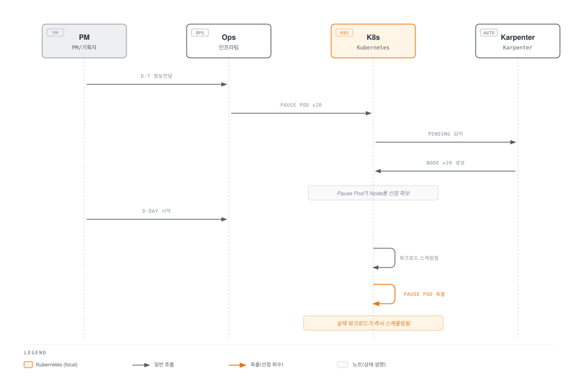
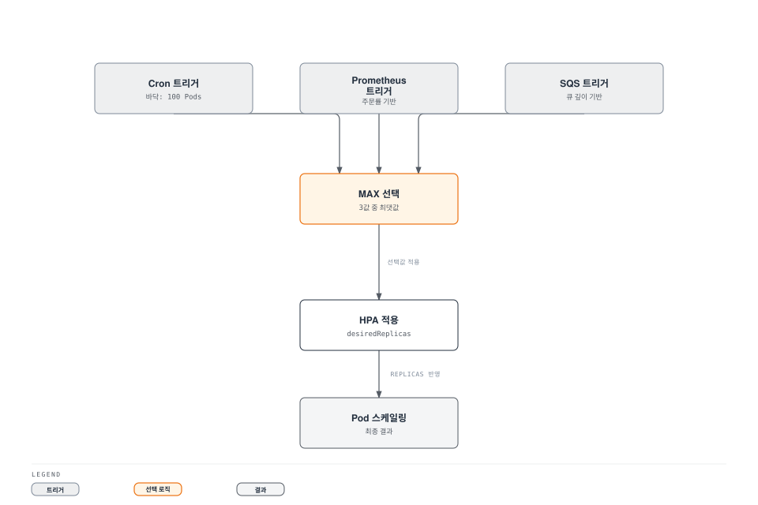
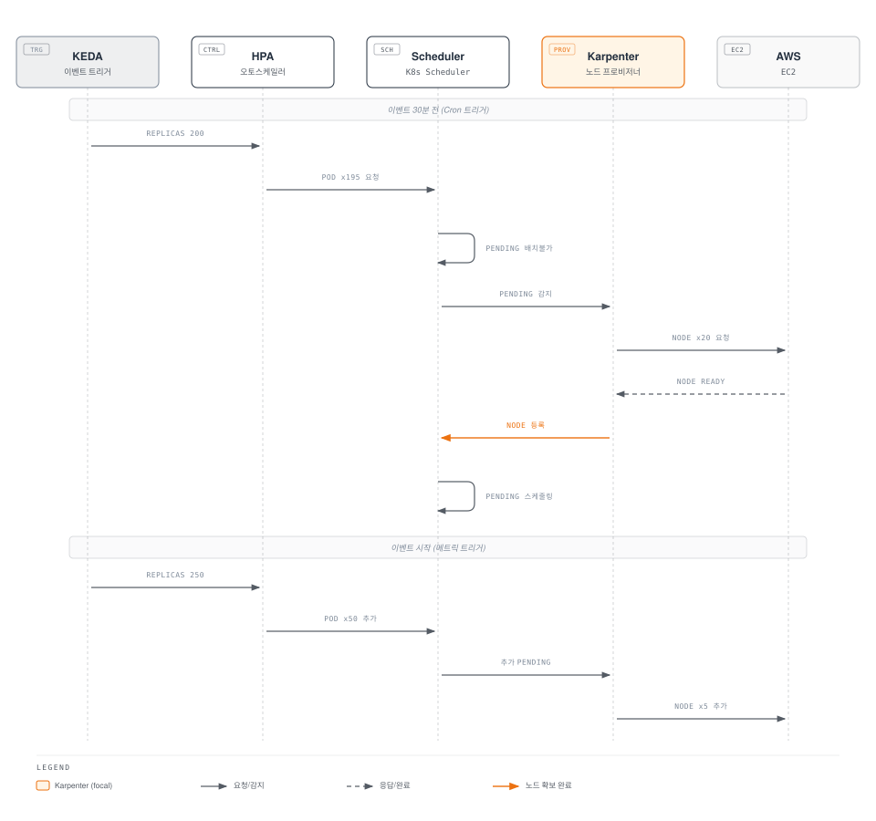

# 이벤트 용량 계획 플레이북

> **지원 버전**: Kubernetes 1.28+, KEDA 2.14+, Karpenter 0.37+
> **마지막 업데이트**: 2026년 4월 25일

< [이전: EKS 업그레이드 운영](./11-upgrade-operations.md) | [목차](./README.md) | [다음: FinOps 비용 가시성](./13-finops-cost-platform.md) >

---

## 개요

플래시 세일, 마케팅 캠페인, 시즌 이벤트 등 계획된 트래픽 급증 상황에서 인프라를 안정적으로 운영하려면 **사전 용량 계획**이 필수입니다. 이 문서는 운영 엔지니어뿐만 아니라 **PM, 마케터 등 비기술 이해관계자**도 활용할 수 있는 실전 플레이북을 제공합니다.

KEDA와 Karpenter를 조합하여 Pod 레벨과 Node 레벨 스케일링을 동시에 제어하고, 비즈니스 메트릭 기반으로 실시간 대응하면서도 Cron 기반 사전 스케일링으로 안전 마진을 확보하는 전략을 다룹니다.

### 학습 목표

- 이벤트 유형별 트래픽 패턴과 스케일링 전략 이해
- PM/기획자를 위한 용량 계획 워크시트 활용
- KEDA Cron + 비즈니스 메트릭 복합 트리거 구성
- Karpenter Warm Pool과 EC2 Capacity Reservation 활용
- KEDA + Karpenter 연동을 통한 End-to-End 스케일링 구현
- 이벤트별 런북 작성 및 운영 체계 구축

---

## 1. 이벤트 용량 계획 프레임워크

### 1.1 이벤트 유형 분류

| 이벤트 유형 | 트래픽 배수 | 램프업 시간 | 지속 시간 | 예측 가능성 | 예시 |
|-------------|-----------|-----------|----------|-----------|------|
| 플래시 세일 | 10-50x | 수초 | 1-4시간 | 높음 | 타임딜, 한정판 출시 |
| 제품 출시 | 5-20x | 수분 | 1-7일 | 높음 | 신규 기능 오픈, 앱 업데이트 |
| 마케팅 캠페인 | 3-10x | 수분-수시간 | 수시간-수일 | 중간 | TV 광고, SNS 바이럴 |
| 시즌 이벤트 | 5-30x | 수시간 | 1-7일 | 높음 | 블랙프라이데이, 연말 세일 |
| 예기치 않은 급증 | 5-100x | 수초 | 불확실 | 낮음 | 뉴스/SNS 바이럴, 봇 공격 |

### 1.2 용량 계획 워크시트

PM과 기획자가 인프라팀에 전달할 수 있는 표준 워크시트입니다.

**입력 정보 (PM/기획자 작성):**

| 항목 | 설명 | 예시 값 |
|------|------|--------|
| 이벤트 유형 | 플래시 세일 / 마케팅 / 시즌 | 플래시 세일 |
| 예상 동시 사용자 | 피크 시 동시 접속 수 | 100,000명 |
| 예상 피크 RPM | 분당 최대 요청 수 | 600,000 |
| 이벤트 시작 시간 | 날짜와 시각 (KST) | 2026-05-01 12:00 |
| 이벤트 지속 시간 | 피크 상태 유지 시간 | 2시간 |
| 램프업 시간 | 최대 트래픽까지 도달 시간 | 10초 |
| 기존 평시 트래픽 | 일반 시간대 RPM | 30,000 |

**산출 공식:**

```
필요 Pod 수 = 피크 RPM ÷ Pod당 처리량(RPM)
필요 Node 수 = 필요 Pod 수 ÷ Node당 Pod 수
예상 비용 = Node 수 × 시간당 비용 × 이벤트 시간 + 사전 스케일링 시간

예시 계산:
- Pod당 처리량: 3,000 RPM (부하 테스트로 측정)
- 필요 Pod: 600,000 ÷ 3,000 = 200 Pods
- Node당 Pod: 10 (c5.4xlarge 기준)
- 필요 Node: 200 ÷ 10 = 20 Nodes
- 안전 마진(+30%): 26 Nodes
- 비용: 26 × $0.68/hr × (2hr 이벤트 + 1hr 사전 + 1hr 쿨다운) = ~$70.72
```

### 1.3 D-30 ~ D+1 타임라인 체크리스트

| 시점 | 담당 | 작업 | 완료 |
|------|------|------|------|
| **D-30** | PM + Infra | 이벤트 정보 공유 (워크시트 작성) | ☐ |
| **D-30** | Infra | Capacity Reservation 신청 (필요 시) | ☐ |
| **D-30** | Finance | 추가 인프라 비용 승인 | ☐ |
| **D-14** | Infra | 부하 테스트 실행 (목표 RPM의 120%) | ☐ |
| **D-14** | Infra | 병목 지점 식별 및 해결 | ☐ |
| **D-7** | Infra | KEDA ScaledObject 배포 (Cron 사전 스케일링) | ☐ |
| **D-7** | Infra | Karpenter NodePool 이벤트 설정 배포 | ☐ |
| **D-7** | Infra | 모니터링 대시보드 구성 | ☐ |
| **D-3** | Infra | 사전 스케일링 드라이런 (실제 스케일링 없이 검증) | ☐ |
| **D-1** | Infra + PM | 최종 검증: Pod/Node 수, 알림 채널, 대시보드 URL 공유 | ☐ |
| **D-1** | Infra | 워룸(War Room) 구성, 온콜 담당자 지정 | ☐ |
| **D-Day** | Infra | 사전 스케일링 동작 확인 (이벤트 30분 전) | ☐ |
| **D-Day** | Infra | 실시간 모니터링 및 수동 개입 대기 | ☐ |
| **D+1** | Infra | 스케일 다운 확인, 잔여 리소스 정리 | ☐ |
| **D+1** | Infra + PM | 포스트모템: 예측 vs 실제, 비용 분석 | ☐ |

---

## 2. 사전 스케일링 전략

### 2.1 KEDA Cron 기반 사전 스케일링

이벤트 시작 전에 미리 Pod를 확장하여 트래픽 급증에 대비합니다.

**단일 이벤트 윈도우:**

```yaml
apiVersion: keda.sh/v1alpha1
kind: ScaledObject
metadata:
  name: flash-sale-prescale
  namespace: ecommerce
spec:
  scaleTargetRef:
    name: order-service
  minReplicaCount: 5
  maxReplicaCount: 300
  triggers:
    # 이벤트 30분 전부터 사전 스케일링
    - type: cron
      metadata:
        timezone: Asia/Seoul
        start: "30 11 1 5 *"    # 5월 1일 11:30 시작
        end: "30 14 1 5 *"      # 5월 1일 14:30 종료
        desiredReplicas: "200"
```

**복수 이벤트 윈도우 (멀티 타임존):**

```yaml
apiVersion: keda.sh/v1alpha1
kind: ScaledObject
metadata:
  name: global-sale-prescale
  namespace: ecommerce
spec:
  scaleTargetRef:
    name: order-service
  minReplicaCount: 5
  maxReplicaCount: 500
  triggers:
    # 한국 플래시 세일 (KST 12:00-14:00)
    - type: cron
      metadata:
        timezone: Asia/Seoul
        start: "30 11 1 5 *"
        end: "30 14 1 5 *"
        desiredReplicas: "200"
    # 일본 플래시 세일 (JST 18:00-20:00)
    - type: cron
      metadata:
        timezone: Asia/Tokyo
        start: "30 17 1 5 *"
        end: "30 20 1 5 *"
        desiredReplicas: "150"
    # 미국 플래시 세일 (EST 09:00-11:00)
    - type: cron
      metadata:
        timezone: America/New_York
        start: "30 8 1 5 *"
        end: "30 11 1 5 *"
        desiredReplicas: "180"
```

### 2.2 Karpenter Warm Pool

이벤트 전에 미리 Node를 프로비저닝하여 Pod 스케줄링 지연을 제거합니다.

```yaml
apiVersion: karpenter.sh/v1
kind: NodePool
metadata:
  name: event-warm-pool
spec:
  template:
    metadata:
      labels:
        workload-type: event
        pool: warm
    spec:
      requirements:
        - key: kubernetes.io/arch
          operator: In
          values: ["amd64"]
        - key: karpenter.sh/capacity-type
          operator: In
          values: ["on-demand"]  # 이벤트에는 On-Demand 우선
        - key: node.kubernetes.io/instance-type
          operator: In
          values:
            - c5.4xlarge
            - c5.2xlarge
            - m5.4xlarge
      nodeClassRef:
        group: karpenter.k8s.aws
        kind: EC2NodeClass
        name: event-nodes
  limits:
    cpu: "640"
    memory: 1280Gi
  disruption:
    consolidationPolicy: WhenEmpty
    consolidateAfter: 30m  # 이벤트 후 30분 유예
  weight: 100  # 높은 가중치로 이벤트 NodePool 우선 사용
---
apiVersion: karpenter.k8s.aws/v1
kind: EC2NodeClass
metadata:
  name: event-nodes
spec:
  amiSelectorTerms:
    - alias: al2023@latest
  subnetSelectorTerms:
    - tags:
        karpenter.sh/discovery: my-cluster
  securityGroupSelectorTerms:
    - tags:
        karpenter.sh/discovery: my-cluster
  blockDeviceMappings:
    - deviceName: /dev/xvda
      ebs:
        volumeSize: 100Gi
        volumeType: gp3
        iops: 5000
        throughput: 250
  tags:
    event: flash-sale-2026-05
    cost-center: marketing
```

### 2.3 EC2 Capacity Reservation

대규모 이벤트에서 인스턴스 가용성을 보장합니다.

**Terraform HCL:**

```hcl
resource "aws_ec2_capacity_reservation" "flash_sale" {
  instance_type     = "c5.4xlarge"
  instance_platform = "Linux/UNIX"
  availability_zone = "ap-northeast-2a"
  instance_count    = 15
  instance_match_criteria = "targeted"

  # 이벤트 기간 + 사전 준비 시간
  end_date_type = "limited"
  end_date      = "2026-05-01T15:00:00Z"  # UTC

  tags = {
    Name       = "flash-sale-2026-05"
    Event      = "flash-sale"
    CostCenter = "marketing"
  }
}

# Capacity Reservation을 Karpenter에 연결
resource "aws_ec2_capacity_reservation" "flash_sale_2b" {
  instance_type     = "c5.4xlarge"
  instance_platform = "Linux/UNIX"
  availability_zone = "ap-northeast-2b"
  instance_count    = 11
  instance_match_criteria = "targeted"
  end_date_type = "limited"
  end_date      = "2026-05-01T15:00:00Z"
  tags = {
    Name       = "flash-sale-2026-05-2b"
    Event      = "flash-sale"
    CostCenter = "marketing"
  }
}
```

**Karpenter NodePool에서 Capacity Reservation 타겟팅:**

```yaml
apiVersion: karpenter.k8s.aws/v1
kind: EC2NodeClass
metadata:
  name: event-reserved
spec:
  amiSelectorTerms:
    - alias: al2023@latest
  subnetSelectorTerms:
    - tags:
        karpenter.sh/discovery: my-cluster
  securityGroupSelectorTerms:
    - tags:
        karpenter.sh/discovery: my-cluster
  capacityReservationSelectorTerms:
    - tags:
        Event: flash-sale
```

### 2.4 Pause Pod (플레이스홀더 스케일링)

저우선순위 Pause Pod로 Node를 미리 확보하고, 실제 워크로드가 배치될 때 자동으로 축출합니다.

```yaml
apiVersion: scheduling.k8s.io/v1
kind: PriorityClass
metadata:
  name: pause-priority
value: -10
globalDefault: false
description: "Pause pods for pre-warming nodes - evicted by real workloads"
---
apiVersion: apps/v1
kind: Deployment
metadata:
  name: event-pause-pods
  namespace: ecommerce
  labels:
    purpose: node-warm-pool
spec:
  replicas: 20  # 사전 확보할 Node 수에 맞춤
  selector:
    matchLabels:
      app: pause-placeholder
  template:
    metadata:
      labels:
        app: pause-placeholder
    spec:
      priorityClassName: pause-priority
      terminationGracePeriodSeconds: 0
      containers:
        - name: pause
          image: registry.k8s.io/pause:3.9
          resources:
            requests:
              cpu: "14"      # Node 1대를 거의 차지하도록
              memory: 24Gi
            limits:
              cpu: "14"
              memory: 24Gi
      tolerations:
        - key: event-workload
          operator: Exists
          effect: NoSchedule
```

**동작 원리:**



---

## 3. 비즈니스 메트릭 기반 스케일링

### 3.1 주문률 기반 스케일링

Prometheus에 수집된 비즈니스 메트릭으로 스케일링합니다.

**PrometheusRule (Recording Rule):**

```yaml
apiVersion: monitoring.coreos.com/v1
kind: PrometheusRule
metadata:
  name: business-metrics
  namespace: monitoring
spec:
  groups:
    - name: business.rules
      interval: 15s
      rules:
        - record: business:orders_per_minute:rate5m
          expr: sum(rate(order_completed_total[5m])) * 60
        - record: business:page_views_per_minute:rate5m
          expr: sum(rate(nginx_http_requests_total{path=~"/product.*"}[5m])) * 60
        - record: business:cart_additions_per_minute:rate5m
          expr: sum(rate(cart_add_total[5m])) * 60
```

**KEDA ScaledObject (주문률 기반):**

```yaml
apiVersion: keda.sh/v1alpha1
kind: ScaledObject
metadata:
  name: order-service-scaler
  namespace: ecommerce
spec:
  scaleTargetRef:
    name: order-service
  pollingInterval: 10
  cooldownPeriod: 60
  minReplicaCount: 5
  maxReplicaCount: 300
  triggers:
    - type: prometheus
      metadata:
        serverAddress: http://prometheus.monitoring.svc:9090
        query: business:orders_per_minute:rate5m
        threshold: "150"      # Pod당 분당 150건 처리
        activationThreshold: "10"
  advanced:
    horizontalPodAutoscalerConfig:
      behavior:
        scaleUp:
          stabilizationWindowSeconds: 0   # 즉시 스케일 업
          policies:
            - type: Percent
              value: 100
              periodSeconds: 15
        scaleDown:
          stabilizationWindowSeconds: 300  # 5분 안정화 후 스케일 다운
          policies:
            - type: Percent
              value: 10
              periodSeconds: 60
```

### 3.2 페이지뷰/세션 기반 스케일링

CloudWatch 메트릭을 활용한 프론트엔드 스케일링입니다.

```yaml
apiVersion: keda.sh/v1alpha1
kind: ScaledObject
metadata:
  name: frontend-pageview-scaler
  namespace: ecommerce
spec:
  scaleTargetRef:
    name: frontend-web
  pollingInterval: 15
  cooldownPeriod: 120
  minReplicaCount: 3
  maxReplicaCount: 200
  triggers:
    - type: aws-cloudwatch
      metadata:
        namespace: ECommerce/Frontend
        dimensionName: Service
        dimensionValue: frontend-web
        metricName: PageViewsPerMinute
        targetMetricValue: "5000"
        minMetricValue: "100"
        metricStatPeriod: "60"
        metricStatType: Sum
        awsRegion: ap-northeast-2
      authenticationRef:
        name: keda-aws-credentials
---
apiVersion: keda.sh/v1alpha1
kind: TriggerAuthentication
metadata:
  name: keda-aws-credentials
  namespace: ecommerce
spec:
  podIdentity:
    provider: aws
```

### 3.3 SQS 큐 깊이 기반 스케일링

주문 처리 파이프라인의 큐 백로그에 따라 워커를 스케일링합니다.

```yaml
apiVersion: keda.sh/v1alpha1
kind: ScaledObject
metadata:
  name: order-worker-scaler
  namespace: ecommerce
spec:
  scaleTargetRef:
    name: order-worker
  pollingInterval: 5
  cooldownPeriod: 30
  minReplicaCount: 2
  maxReplicaCount: 100
  triggers:
    - type: aws-sqs-queue
      metadata:
        queueURL: https://sqs.ap-northeast-2.amazonaws.com/123456789012/order-processing
        queueLength: "5"        # 메시지 5개당 Pod 1개
        awsRegion: ap-northeast-2
        activationQueueLength: "1"
      authenticationRef:
        name: keda-aws-credentials
```

### 3.4 복합 트리거 구성

Cron으로 바닥을 잡고, 비즈니스 메트릭으로 천장을 결정하는 패턴입니다.

```yaml
apiVersion: keda.sh/v1alpha1
kind: ScaledObject
metadata:
  name: order-service-composite
  namespace: ecommerce
  annotations:
    description: "Cron이 최소 바닥을 보장, 메트릭이 추가 스케일링 결정"
spec:
  scaleTargetRef:
    name: order-service
  pollingInterval: 10
  cooldownPeriod: 120
  minReplicaCount: 5
  maxReplicaCount: 300
  triggers:
    # 바닥: 이벤트 시간대 최소 100 Pod 보장
    - type: cron
      metadata:
        timezone: Asia/Seoul
        start: "30 11 1 5 *"
        end: "30 14 1 5 *"
        desiredReplicas: "100"
    # 천장: 실제 주문량에 따라 100 이상으로 추가 스케일
    - type: prometheus
      metadata:
        serverAddress: http://prometheus.monitoring.svc:9090
        query: business:orders_per_minute:rate5m
        threshold: "150"
        activationThreshold: "10"
    # 보조: SQS 백로그도 함께 고려
    - type: aws-sqs-queue
      metadata:
        queueURL: https://sqs.ap-northeast-2.amazonaws.com/123456789012/order-processing
        queueLength: "10"
        awsRegion: ap-northeast-2
      authenticationRef:
        name: keda-aws-credentials
```

KEDA는 복수 트리거 중 **가장 높은 replica 수를 선택**합니다. 따라서 Cron이 100을 요구하고 Prometheus가 150을 요구하면 150이 적용됩니다.



---

## 4. KEDA + Karpenter 연동

### 4.1 Pod-Level과 Node-Level 스케일링 조합



### 4.2 스케일링 타이밍 최적화

| 구간 | 소요 시간 | 최적화 방법 |
|------|----------|------------|
| KEDA 폴링 → HPA 업데이트 | 10-30초 | pollingInterval 줄이기 |
| HPA → Pod 생성 | 1-5초 | scaleUp stabilization: 0 |
| Pod Pending → Node 프로비저닝 | 60-90초 | Karpenter (vs CA 3-5분) |
| Node Ready → Pod Running | 10-30초 | 이미지 사전 캐싱 |
| **총 콜드 스타트** | **~2분** | Warm Pool로 제거 |

**이미지 사전 캐싱 (DaemonSet):**

```yaml
apiVersion: apps/v1
kind: DaemonSet
metadata:
  name: image-cache
  namespace: kube-system
spec:
  selector:
    matchLabels:
      app: image-cache
  template:
    metadata:
      labels:
        app: image-cache
    spec:
      initContainers:
        - name: cache-order-service
          image: 123456789012.dkr.ecr.ap-northeast-2.amazonaws.com/order-service:v2.5.0
          command: ["sh", "-c", "echo cached"]
        - name: cache-frontend
          image: 123456789012.dkr.ecr.ap-northeast-2.amazonaws.com/frontend:v3.1.0
          command: ["sh", "-c", "echo cached"]
      containers:
        - name: pause
          image: registry.k8s.io/pause:3.9
          resources:
            requests:
              cpu: 10m
              memory: 16Mi
      tolerations:
        - operator: Exists
```

### 4.3 종합 예제: 플래시 세일 시나리오

2026년 5월 1일 12:00 KST 플래시 세일을 위한 전체 구성입니다.

**1) KEDA ScaledObject:**

```yaml
apiVersion: keda.sh/v1alpha1
kind: ScaledObject
metadata:
  name: flash-sale-order-service
  namespace: ecommerce
spec:
  scaleTargetRef:
    name: order-service
  pollingInterval: 10
  cooldownPeriod: 180
  minReplicaCount: 5
  maxReplicaCount: 300
  triggers:
    - type: cron
      metadata:
        timezone: Asia/Seoul
        start: "30 11 1 5 *"
        end: "00 15 1 5 *"
        desiredReplicas: "150"
    - type: prometheus
      metadata:
        serverAddress: http://prometheus.monitoring.svc:9090
        query: business:orders_per_minute:rate5m
        threshold: "150"
  advanced:
    horizontalPodAutoscalerConfig:
      behavior:
        scaleUp:
          stabilizationWindowSeconds: 0
          policies:
            - type: Percent
              value: 100
              periodSeconds: 15
        scaleDown:
          stabilizationWindowSeconds: 600
          policies:
            - type: Percent
              value: 5
              periodSeconds: 60
```

**2) Karpenter NodePool:**

```yaml
apiVersion: karpenter.sh/v1
kind: NodePool
metadata:
  name: flash-sale-pool
spec:
  template:
    metadata:
      labels:
        event: flash-sale-2026-05
    spec:
      requirements:
        - key: karpenter.sh/capacity-type
          operator: In
          values: ["on-demand", "spot"]
        - key: node.kubernetes.io/instance-type
          operator: In
          values: ["c5.4xlarge", "c5.2xlarge", "c6i.4xlarge", "c6i.2xlarge"]
      nodeClassRef:
        group: karpenter.k8s.aws
        kind: EC2NodeClass
        name: event-nodes
  limits:
    cpu: "800"
    memory: 1600Gi
  disruption:
    consolidationPolicy: WhenEmpty
    consolidateAfter: 30m
  weight: 100
```

**3) PodDisruptionBudget:**

```yaml
apiVersion: policy/v1
kind: PodDisruptionBudget
metadata:
  name: order-service-pdb
  namespace: ecommerce
spec:
  minAvailable: "80%"
  selector:
    matchLabels:
      app: order-service
```

**4) 타임라인 시각화:**

```
시간    11:00  11:30  12:00  12:30  13:00  13:30  14:00  14:30  15:00
        ──────────────────────────────────────────────────────────
Pods:     5     150    250    280    260    200    150     50      5
Nodes:    2      20     28     30     28     22     20      8      2
트래픽:   1x     1x    20x    35x    25x    15x    10x     2x     1x
        ──────────────────────────────────────────────────────────
             ▲                                           ▲
         Cron 시작                                   Cron 종료
         사전 스케일링                               쿨다운 시작
```

---

## 5. 런북: 이벤트별 플레이북

### 5.1 플래시 세일 런북

**D-7: 사전 구성 배포**

```bash
# 1. 이벤트 전용 Namespace 레이블 설정
kubectl label namespace ecommerce event=flash-sale-2026-05

# 2. KEDA ScaledObject 배포
kubectl apply -f flash-sale-scaledobject.yaml

# 3. Karpenter NodePool 배포
kubectl apply -f flash-sale-nodepool.yaml

# 4. PDB 배포
kubectl apply -f order-service-pdb.yaml

# 5. 이미지 캐시 DaemonSet 배포
kubectl apply -f image-cache-daemonset.yaml
```

**D-1: 최종 검증**

```bash
# ScaledObject 상태 확인
kubectl get scaledobject -n ecommerce
kubectl describe scaledobject flash-sale-order-service -n ecommerce

# Karpenter NodePool 확인
kubectl get nodepool flash-sale-pool
kubectl describe nodepool flash-sale-pool

# 현재 Pod/Node 수 기록 (베이스라인)
echo "=== 베이스라인 ==="
echo "Pods: $(kubectl get pods -n ecommerce -l app=order-service --no-headers | wc -l)"
echo "Nodes: $(kubectl get nodes --no-headers | wc -l)"
```

**D-Day: 이벤트 모니터링**

```bash
# 실시간 Pod 수 모니터링
watch -n 5 'kubectl get pods -n ecommerce -l app=order-service --no-headers | wc -l'

# 실시간 Node 수 모니터링
watch -n 10 'kubectl get nodes -l event=flash-sale-2026-05 --no-headers | wc -l'

# HPA 상태 확인
kubectl get hpa -n ecommerce -w

# 긴급 수동 스케일 (메트릭이 느린 경우)
kubectl scale deployment order-service -n ecommerce --replicas=250
```

**D+1: 정리 및 분석**

```bash
# KEDA ScaledObject 제거 (평시 설정으로 복원)
kubectl delete scaledobject flash-sale-order-service -n ecommerce

# 이벤트 NodePool 제거
kubectl delete nodepool flash-sale-pool

# 비용 확인 (Kubecost API)
kubectl port-forward -n kubecost svc/kubecost-cost-analyzer 9090:9090 &
curl -s "http://localhost:9090/model/allocation?window=2d&aggregate=label:event" | jq '.data'
```

### 5.2 마케팅 캠페인 런북

마케팅 캠페인은 점진적으로 트래픽이 증가하므로 단계별 스케일링을 적용합니다.

```yaml
apiVersion: keda.sh/v1alpha1
kind: ScaledObject
metadata:
  name: campaign-gradual-scale
  namespace: ecommerce
spec:
  scaleTargetRef:
    name: frontend-web
  minReplicaCount: 3
  maxReplicaCount: 100
  triggers:
    # 캠페인 시작: 소규모 스케일업
    - type: cron
      metadata:
        timezone: Asia/Seoul
        start: "0 9 1 5 *"      # D-Day 09:00
        end: "0 12 1 5 *"
        desiredReplicas: "20"
    # 피크 시간대: 풀 스케일
    - type: cron
      metadata:
        timezone: Asia/Seoul
        start: "0 12 1 5 *"
        end: "0 22 1 5 *"
        desiredReplicas: "50"
    # 메트릭 기반 추가 스케일
    - type: prometheus
      metadata:
        serverAddress: http://prometheus.monitoring.svc:9090
        query: sum(rate(nginx_http_requests_total{service="frontend-web"}[2m])) * 60
        threshold: "10000"
```

### 5.3 긴급 대응 런북

예기치 않은 트래픽 급증에 대한 즉각 대응 절차입니다.

```bash
#!/bin/bash
# emergency-scale.sh - 긴급 스케일링 스크립트

NAMESPACE=${1:-ecommerce}
DEPLOYMENT=${2:-order-service}
TARGET_REPLICAS=${3:-100}

echo "=== 긴급 스케일링 시작 ==="
echo "대상: ${NAMESPACE}/${DEPLOYMENT}"
echo "목표 Replicas: ${TARGET_REPLICAS}"

# 1. 즉시 수동 스케일
kubectl scale deployment ${DEPLOYMENT} \
  -n ${NAMESPACE} \
  --replicas=${TARGET_REPLICAS}

# 2. HPA 최소값 임시 상향
kubectl patch hpa ${DEPLOYMENT} \
  -n ${NAMESPACE} \
  --type='json' \
  -p='[{"op":"replace","path":"/spec/minReplicas","value":'${TARGET_REPLICAS}'}]'

# 3. Karpenter 긴급 NodePool 적용
cat <<EOF | kubectl apply -f -
apiVersion: karpenter.sh/v1
kind: NodePool
metadata:
  name: emergency-pool
spec:
  template:
    spec:
      requirements:
        - key: karpenter.sh/capacity-type
          operator: In
          values: ["on-demand"]
        - key: node.kubernetes.io/instance-type
          operator: In
          values: ["c5.4xlarge", "c6i.4xlarge", "m5.4xlarge"]
      nodeClassRef:
        group: karpenter.k8s.aws
        kind: EC2NodeClass
        name: default
  limits:
    cpu: "500"
  weight: 200
EOF

echo "=== 스케일링 진행 상태 ==="
kubectl get pods -n ${NAMESPACE} -l app=${DEPLOYMENT} --no-headers | wc -l
kubectl get nodes --no-headers | wc -l
```

---

## 6. 모니터링과 대시보드

### 6.1 이벤트 기간 대시보드

이벤트 기간 중 핵심 지표를 한 눈에 볼 수 있는 Grafana 대시보드 구성입니다.

**핵심 패널:**

| 패널 | PromQL | 목적 |
|------|--------|------|
| RPS | `sum(rate(http_requests_total[1m]))` | 초당 요청 수 |
| Pod 수 | `count(kube_pod_info{namespace="ecommerce"})` | 현재 Pod 수 |
| Node 수 | `count(kube_node_info)` | 현재 Node 수 |
| Error Rate | `sum(rate(http_requests_total{code=~"5.."}[1m])) / sum(rate(http_requests_total[1m]))` | 에러율 |
| P99 Latency | `histogram_quantile(0.99, sum(rate(http_request_duration_seconds_bucket[1m])) by (le))` | 응답 시간 |
| Queue Depth | `aws_sqs_approximate_number_of_messages_visible` | SQS 백로그 |
| 시간당 비용 | `sum(node_cost_hourly)` | 현재 인프라 비용 |

**Grafana Dashboard JSON (핵심 패널 발췌):**

```json
{
  "dashboard": {
    "title": "Event Capacity Dashboard",
    "tags": ["event", "capacity"],
    "panels": [
      {
        "title": "Requests Per Second",
        "type": "timeseries",
        "gridPos": {"h": 8, "w": 8, "x": 0, "y": 0},
        "targets": [
          {
            "expr": "sum(rate(http_requests_total{namespace=\"ecommerce\"}[1m]))",
            "legendFormat": "RPS"
          }
        ],
        "fieldConfig": {
          "defaults": {
            "thresholds": {
              "steps": [
                {"color": "green", "value": null},
                {"color": "yellow", "value": 5000},
                {"color": "red", "value": 8000}
              ]
            }
          }
        }
      },
      {
        "title": "Pod Count vs Target",
        "type": "timeseries",
        "gridPos": {"h": 8, "w": 8, "x": 8, "y": 0},
        "targets": [
          {
            "expr": "count(kube_pod_status_phase{namespace=\"ecommerce\",phase=\"Running\"})",
            "legendFormat": "Running Pods"
          },
          {
            "expr": "kube_horizontalpodautoscaler_spec_target_metric{namespace=\"ecommerce\"}",
            "legendFormat": "Target"
          }
        ]
      },
      {
        "title": "Node Count",
        "type": "stat",
        "gridPos": {"h": 8, "w": 8, "x": 16, "y": 0},
        "targets": [
          {
            "expr": "count(kube_node_info)",
            "legendFormat": "Total Nodes"
          }
        ]
      }
    ]
  }
}
```

### 6.2 이벤트 후 분석

**포스트모템 분석 템플릿:**

| 항목 | 예측값 | 실제값 | 차이 |
|------|--------|--------|------|
| 피크 RPM | 600,000 | 520,000 | -13% |
| 최대 Pod 수 | 200 | 175 | -12.5% |
| 최대 Node 수 | 26 | 22 | -15% |
| 피크 P99 지연시간 | 200ms | 180ms | -10% |
| 에러율 | < 0.1% | 0.02% | OK |
| 이벤트 총 비용 | $70.72 | $59.84 | -15% |
| 매출 | $500,000 | $620,000 | +24% |
| 인프라 비용/매출 비율 | 0.014% | 0.010% | OK |

```bash
# Kubecost를 통한 이벤트 기간 비용 분석
curl -s "http://kubecost:9090/model/allocation" \
  --data-urlencode "window=2026-05-01T02:00:00Z,2026-05-01T08:00:00Z" \
  --data-urlencode "aggregate=namespace" \
  --data-urlencode "accumulate=true" | jq '
  .data[0] | to_entries[] | 
  select(.key == "ecommerce") | 
  {namespace: .key, totalCost: .value.totalCost, cpuCost: .value.cpuCost, memCost: .value.ramCost}'
```

---

## 7. 비용 관리

### 7.1 이벤트 비용 예측

| 인스턴스 유형 | vCPU | 메모리 | 시간당 비용 (서울) | Pod 수용량 |
|-------------|------|--------|------------------|-----------|
| c5.2xlarge | 8 | 16 GiB | $0.34 | ~5 pods |
| c5.4xlarge | 16 | 32 GiB | $0.68 | ~10 pods |
| c6i.4xlarge | 16 | 32 GiB | $0.72 | ~10 pods |
| m5.4xlarge | 16 | 64 GiB | $0.77 | ~10 pods |

**Spot vs On-Demand 결정 매트릭스:**

| 기준 | On-Demand 권장 | Spot 허용 |
|------|---------------|----------|
| 이벤트 중요도 | 매출 직접 영향 | 보조 서비스 |
| 중단 허용 | 불가 | 가능 (retry 로직 있음) |
| 이벤트 지속 시간 | < 2시간 | > 4시간 |
| Spot 절감율 | < 50% | > 60% |

### 7.2 자동 스케일 다운

```yaml
# 이벤트 후 점진적 스케일 다운을 위한 HPA Behavior
advanced:
  horizontalPodAutoscalerConfig:
    behavior:
      scaleDown:
        stabilizationWindowSeconds: 600  # 10분 대기
        policies:
          - type: Percent
            value: 10               # 10%씩 감소
            periodSeconds: 120       # 2분마다
```

**Karpenter 통합 해제 절차:**

```bash
# 1. 이벤트 NodePool의 consolidation을 즉시 동작으로 변경
kubectl patch nodepool flash-sale-pool --type='merge' -p '
  {"spec":{"disruption":{"consolidationPolicy":"WhenEmptyOrUnderutilized","consolidateAfter":"5m"}}}'

# 2. 30분 후 이벤트 NodePool 제거
sleep 1800 && kubectl delete nodepool flash-sale-pool

# 3. Capacity Reservation 해제 (Terraform)
terraform destroy -target=aws_ec2_capacity_reservation.flash_sale
```

---

## 8. 모범 사례와 안티 패턴

### 모범 사례

| # | 사례 | 설명 |
|---|------|------|
| 1 | 부하 테스트 필수 | 이벤트 2주 전에 목표 트래픽의 120%로 부하 테스트 |
| 2 | Cron + 메트릭 복합 사용 | Cron으로 바닥, 메트릭으로 천장 제어 |
| 3 | 점진적 스케일 다운 | 이벤트 후 급격한 축소 대신 10%씩 점진 축소 |
| 4 | 이벤트 레이블 태깅 | 모든 리소스에 이벤트 레이블로 비용 추적 |
| 5 | 비기술 이해관계자 참여 | PM에게 대시보드 URL과 진행 상황 공유 |
| 6 | 포스트모템 수행 | 매 이벤트 후 예측 vs 실제 분석으로 정확도 향상 |
| 7 | Warm Pool 활용 | 콜드 스타트 2분을 0초로 단축 |

### 안티 패턴

| # | 안티 패턴 | 문제점 | 대안 |
|---|----------|--------|------|
| 1 | 수동 스케일링만 의존 | 야간/주말 이벤트 대응 불가 | KEDA Cron 자동화 |
| 2 | maxReplicas 없이 운영 | 비용 폭증, 리소스 고갈 | 항상 상한선 설정 |
| 3 | 이벤트 직전 설정 변경 | 검증 시간 부족, 장애 위험 | D-7 배포 + D-3 검증 |
| 4 | 스케일 다운 미수행 | 이벤트 후 불필요 비용 지속 | TTL/쿨다운 설정 필수 |

---

## 9. 참고 자료

- [KEDA 공식 문서](https://keda.sh/docs/)
- [Karpenter 공식 문서](https://karpenter.sh/docs/)
- [AWS EC2 Capacity Reservations](https://docs.aws.amazon.com/AWSEC2/latest/UserGuide/ec2-capacity-reservations.html)
- [KEDA Cron Trigger](https://keda.sh/docs/scalers/cron/)
- [Kubernetes HPA Behavior](https://kubernetes.io/docs/tasks/run-application/horizontal-pod-autoscale/#configurable-scaling-behavior)
- [KEDA 이벤트 드리븐 스케일링](../autoscaling/01-keda.md)
- [Karpenter 노드 오토스케일링](../autoscaling/02-karpenter.md)
- [스케일링 전략 심화](./06-scaling-strategies.md)
- [EKS 비용 최적화](../eks/07-eks-cost-optimization.md)
