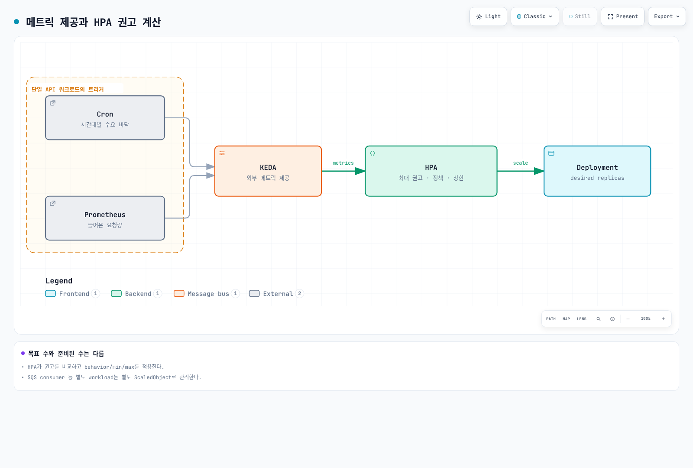
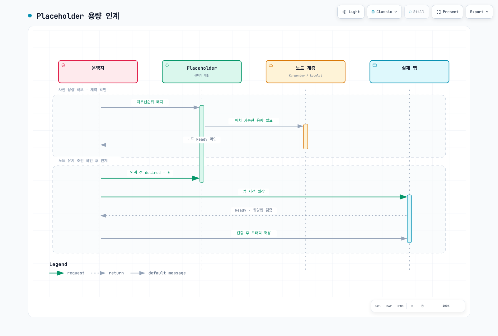
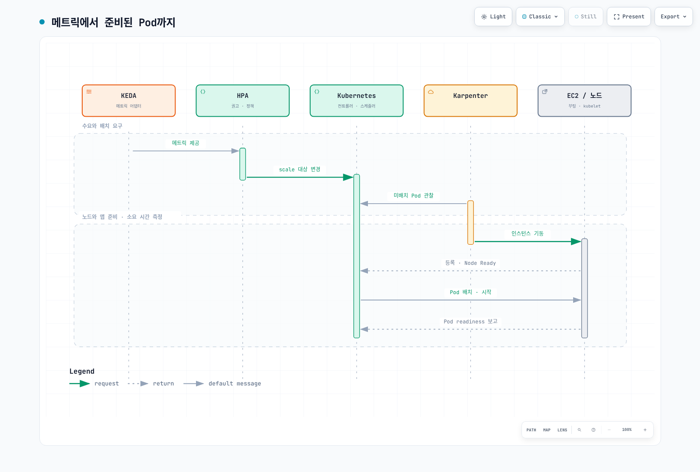

# 이벤트 용량 계획 플레이북

> 검토: 2026-09-12. KEDA 2.20.2, 자가 관리 Karpenter AWS provider 1.14.1 기준.
> 숫자는 명시한 가정의 계산 예제이며 운영 부하 측정 결과가 아닙니다.

PM/기획자는 목표 수요·시작/종료·허용 지연·장애 시 목표를 제공하고,
운영팀은 앱/노드/DB/네트워크/큐의 처리량·한도·준비 시간을 검증합니다.
이벤트 종류만으로 “10–50배”, “30분이면 준비 완료” 같은 수치를 보장하지 않습니다.
봇/과부하에는 rate limit·대기열·backpressure도 필요하며 스케일링만으로 대응하지 않습니다.

## 1. 계산할 입력과 단위

| 입력 | 확인할 내용 |
|---|---|
| 피크 RPM/RPS | 단위, 사용자 행동, cache hit, 재시도 증폭과 API별 부하 |
| Pod당 처리량 | 대표 입력·CPU/memory request·동시성에서 SLO를 충족한 측정값 |
| 노드 수용량 | 실제 allocatable에서 DaemonSet 비용을 빼고 CPU/메모리/Pod slot 제약 적용 |
| 장애 목표 | 단일 Pod/노드/AZ 손실과 목표 트래픽을 함께 정의 |
| 시간 | IANA timezone과 UTC offset, 실제 노드·예약 활성 구간 |
| 비용 | 가격 관측일·리전·OS·tenancy, 미사용 예약, 다른 서비스와 세금 |

아래 계산기는 올림·단위·예약 중복 과금·AZ 손실을 확인합니다.
노드 수용량은 동일한 Pod 프로파일 가정이며 여러 앱과 topology/volume/포트 제약은 별도로 합산·검증합니다.
30% **추가 용량**과 용량의 30%를 비워 두는 정책은 다릅니다.
AZ 손실 시험은 기준 피크를 대상으로 하며 추가 수요까지 동시에 견딘다는 보장이 아닙니다.

`scenario.json`

```json
{
  "description": "Illustrative inputs; replace throughput and allocatable values with measured evidence.",
  "peak_rpm": 600000,
  "pod_rpm_at_slo": 3000,
  "extra_capacity_fraction": "0.30",
  "pod_cpu_milli": 1500,
  "pod_memory_mib": 2048,
  "allocatable_cpu_milli": 15500,
  "daemon_cpu_milli": 500,
  "allocatable_memory_mib": 29696,
  "daemon_memory_mib": 1024,
  "max_pods": 58,
  "daemon_pods": 7,
  "nodes_by_az": {"az-a": 15, "az-b": 11},
  "reserved_nodes_by_az": {"az-a": 15, "az-b": 11},
  "node_start": "2026-11-27T11:00:00+09:00",
  "node_end": "2026-11-27T15:00:00+09:00",
  "reservation_start": "2026-11-27T11:00:00+09:00",
  "reservation_end": "2026-11-27T15:00:00+09:00",
  "usd_per_instance_hour": "0.768",
  "price_region": "ap-northeast-2",
  "price_instance_type": "c5.4xlarge",
  "price_observed_date": "2026-09-12",
  "hpa_max_replicas": 300,
  "node_budget": 40,
  "require_one_az_loss": true,
  "other_services_budget_usd": null
}
```

```python
# capacity.py
"""Deterministic planning arithmetic, not a benchmark or AWS provisioning tool."""
import argparse
import json
from datetime import datetime, timezone
from decimal import Decimal, ROUND_CEILING, ROUND_HALF_UP


def number(value, name, minimum=Decimal(0), positive=False):
    if isinstance(value, bool):
        raise ValueError(f"{name}: boolean is not a number")
    result = Decimal(str(value))
    if not result.is_finite() or result < minimum or (positive and result == minimum):
        raise ValueError(f"{name}: invalid finite range")
    return result


def integer(value, name, positive=False):
    result = number(value, name, positive=positive)
    if result != result.to_integral_value():
        raise ValueError(f"{name}: integer required")
    return int(result)


def instant(value):
    result = datetime.fromisoformat(value.replace("Z", "+00:00"))
    if result.tzinfo is None or result.utcoffset() is None:
        raise ValueError("Use timestamps with an explicit UTC offset")
    return result.astimezone(timezone.utc)


def seconds_between(start, end):
    delta = end-start
    return Decimal(delta.days*86400 + delta.seconds) + Decimal(delta.microseconds)/Decimal(1_000_000)


def hours(start, end):
    seconds = seconds_between(start,end)
    if seconds < 60:
        raise ValueError("Planning intervals must be at least 60 seconds")
    return seconds/Decimal(3600)


def ceiling(value):
    return int(value.to_integral_value(rounding=ROUND_CEILING))


def calculate(config):
    if type(config.get("require_one_az_loss",False)) is not bool:
        raise ValueError("require_one_az_loss must be a boolean")
    demand = number(config["peak_rpm"], "peak_rpm", positive=True)
    pod_rate = number(config["pod_rpm_at_slo"], "pod_rpm_at_slo", positive=True)
    margin = number(config["extra_capacity_fraction"], "extra_capacity_fraction")
    pod_cpu = number(config["pod_cpu_milli"], "pod_cpu_milli", positive=True)
    pod_mem = number(config["pod_memory_mib"], "pod_memory_mib", positive=True)
    cpu = number(config["allocatable_cpu_milli"], "allocatable_cpu_milli", positive=True) - number(config["daemon_cpu_milli"], "daemon_cpu_milli")
    memory = number(config["allocatable_memory_mib"], "allocatable_memory_mib", positive=True) - number(config["daemon_memory_mib"], "daemon_memory_mib")
    slots = integer(config["max_pods"], "max_pods", positive=True) - integer(config["daemon_pods"], "daemon_pods")
    if cpu <= 0 or memory <= 0 or slots <= 0:
        raise ValueError("No allocatable application capacity after DaemonSet overhead")
    per_node = min(int(cpu//pod_cpu), int(memory//pod_mem), slots)
    if per_node < 1:
        raise ValueError("The workload cannot fit this node profile")
    base_pods = ceiling(demand/pod_rate)
    planned_pods = ceiling(demand*(Decimal(1)+margin)/pod_rate)
    needed_nodes = ceiling(Decimal(planned_pods)/Decimal(per_node))
    placements = {zone:integer(count, "nodes_by_az") for zone,count in config["nodes_by_az"].items()}
    reservations = {zone:integer(count, "reserved_nodes_by_az") for zone,count in config["reserved_nodes_by_az"].items()}
    if not placements or sum(placements.values()) < 1:
        raise ValueError("Provide at least one planned node")
    nodes = sum(placements.values())
    survivors = nodes-max(placements.values())
    surviving_rpm = Decimal(survivors*per_node)*pod_rate
    start, end = instant(config["node_start"]), instant(config["node_end"])
    reserve_start, reserve_end = instant(config["reservation_start"]), instant(config["reservation_end"])
    node_hours = hours(start,end)
    reservation_hours = hours(reserve_start,reserve_end)
    overlap_start, overlap_end = max(start,reserve_start), min(end,reserve_end)
    overlap = (seconds_between(overlap_start,overlap_end)/Decimal(3600)
               if overlap_end > overlap_start else Decimal(0))
    price = number(config["usd_per_instance_hour"], "usd_per_instance_hour", positive=True)
    # Pay for running instances and unused reserved slots, without double-counting
    # a matching instance occupying a reservation. Assume one instance profile/type.
    running_cost = Decimal(nodes)*node_hours*price
    unused_cost = Decimal(0)
    for zone,reserved in reservations.items():
        used = min(reserved,placements.get(zone,0))
        unused_slot_hours = Decimal(reserved)*reservation_hours-Decimal(used)*overlap
        unused_cost += unused_slot_hours*price
    compute_cost = running_cost+unused_cost
    other = config.get("other_services_budget_usd")
    total = None if other is None else compute_cost+number(other,"other_services_budget_usd")
    findings = []
    if nodes < needed_nodes:
        findings.append("Planned nodes do not satisfy the capacity target")
    if planned_pods > integer(config["hpa_max_replicas"],"hpa_max_replicas",positive=True):
        findings.append("Planned Pod target exceeds the approved HPA maximum")
    if nodes > integer(config["node_budget"],"node_budget",positive=True):
        findings.append("Planned nodes exceed the approved node budget")
    if config.get("require_one_az_loss") and surviving_rpm < demand:
        findings.append("Losing the largest AZ leaves less than the baseline peak demand capacity")
    money = lambda value: format(value.quantize(Decimal("0.01"),rounding=ROUND_HALF_UP),"f")
    return {
        "base_pods":base_pods, "planned_pods_with_extra_capacity":planned_pods,
        "pods_per_node_from_inputs":per_node, "minimum_nodes_for_capacity":needed_nodes,
        "planned_nodes":nodes, "surviving_nodes_after_largest_az_loss":survivors,
        "surviving_rpm":str(surviving_rpm), "node_hours_per_instance":str(node_hours),
        "reservation_hours_per_slot":str(reservation_hours),
        "running_instances_usd":money(running_cost), "unused_reservations_usd":money(unused_cost),
        "ec2_compute_subtotal_usd":money(compute_cost),
        "total_budget_estimate_usd":None if total is None else money(total),
        "findings":findings,
        "assumptions":[
            "Input throughput/allocatable values require workload-specific measurement.",
            "Extra capacity is added once; it is not the same as leaving that fraction unused.",
            "Constant node counts over the interval; matching reservations consumed first within each AZ.",
            "All instances/reservations have the same type/platform/tenancy and supplied hourly rate.",
            "Current public pricing is an estimate for a future event, not a guaranteed charge.",
            "EC2 subtotal excludes EBS, EKS/Auto Mode, networking, load balancers, databases, telemetry and tax.",
            "Capacity and AZ arithmetic do not prove scheduling, recovery or application SLO."
        ]
    }


if __name__ == "__main__":
    parser = argparse.ArgumentParser()
    parser.add_argument("input")
    args = parser.parse_args()
    try:
        with open(args.input,encoding="utf-8") as stream:
            result = calculate(json.load(stream))
    except (ValueError, KeyError, ArithmeticError) as error:
        parser.error(str(error))
    print(json.dumps(result,indent=2))
```

```bash
python3 capacity.py scenario.json
```

이 예제 입력에서는 기준 Pod 200개, 추가 용량을 포함한 목표 260개, 최소 노드 26개가 계산됩니다.
하지만 15/11로 나눈 두 AZ 중 큰 AZ를 잃으면 11개 노드, 330,000 RPM만 남으므로
600,000 RPM의 기준 피크를 충족하지 않습니다. 결과의 findings를 무시하고 실행 계획으로 승인하지 않습니다.
같은 입력 프로파일에서 3개 AZ에 10개씩 계획한 별도 계산은 기준 피크를 견디지만 실제 배치와 복구 시험은 여전히 필요합니다.

예약 비용은 실제 예약을 소비하는 matching instance와 미사용 slot을 구분합니다.
`targeted` 예약은 하드웨어 속성만 같다고 기존 인스턴스에 자동 적용되지 않습니다.
실제 CapacityReservationId/available count를 확인해야 하며 계산기의 우선 소비 가정은 검증 대상입니다.
다른 서비스 비용이 null이면 전체 예산도 null입니다. EC2 subtotal을 전체 이벤트 비용으로 부르지 않습니다.

### 가격 근거

2026-09-12 AWS Price List API의 서울(ap-northeast-2), Linux, shared tenancy, preinstalled software 없음,
On-Demand Hrs 가격을 조회했습니다. 계약 할인·Spot·세금은 포함되지 않습니다.

| 유형 | vCPU | 메모리 | USD/시간 |
|---|---:|---:|---:|
| c5.2xlarge | 8 | 16 GiB | 0.384 |
| c5.4xlarge | 16 | 32 GiB | 0.768 |
| c6i.4xlarge | 16 | 32 GiB | 0.768 |
| m5.4xlarge | 16 | 64 GiB | 0.944 |

26대·4시간 가정의 c5.4xlarge EC2 subtotal은 $79.87입니다.
기존 $0.68/시간을 서울 가격으로 사용한 $70.72 계산은 지역 가격이 맞지 않았습니다.
같은 26대 예약을 노드보다 30일 먼저 활성화한 가정은 미사용 예약을 포함해 $14,456.83입니다.
이는 계산 예시이며 실제 청구액이 아닙니다. 가격과 활성 시간을 행사 직전에 다시 확인합니다.
EBS·EKS/Auto Mode·LB·NAT/전송·DB·관측성 비용과 평시/행사 증분 구분도 예산에 반영합니다.

## 2. 역할과 준비

이 장의 EC2NodeClass/NodePool 예제는 **자가 관리 Karpenter**입니다.
Auto Mode는 `eks.amazonaws.com` NodeClass를 사용하며 같은 YAML을 복사하지 않습니다.
현재 Auto Mode NodeClass에도 capacityReservationSelectorTerms 지원이 있으므로 “예약 미지원”으로 단정하지 않습니다.
해당 서비스의 selector·권한·지원 범위를 별도로 확인합니다.

KEDA/VPA/HPA 기본 설치와 operator IRSA는 [스케일링 장](./06-scaling-strategies.md)을 참조합니다.
애플리케이션 Deployment, ecommerce namespace, Prometheus와 metric 계약이 먼저 있어야 합니다.
아래 AWS 인증은 operator identity를 사용하며 역할을 자동 생성하지 않습니다.

```yaml
# trigger-auth.yaml
apiVersion: keda.sh/v1alpha1
kind: TriggerAuthentication
metadata:
  name: event-aws
  namespace: ecommerce
spec:
  podIdentity:
    provider: aws
    identityOwner: keda
```

`operator-read-policy.json`

```json
{
  "Version": "2012-10-17",
  "Statement": [
    {
      "Effect": "Allow",
      "Action": ["sqs:GetQueueAttributes"],
      "Resource": "arn:aws:sqs:ap-northeast-2:123456789012:order-processing"
    },
    {
      "Effect": "Allow",
      "Action": ["cloudwatch:GetMetricData"],
      "Resource": "*",
      "Condition": {
        "StringEquals": {
          "aws:RequestedRegion": "ap-northeast-2"
        }
      }
    }
  ]
}
```

정확한 계정·queue ARN으로 바꾸고 KEDA operator 역할에 필요한 읽기 권한을 연결합니다.
CloudWatch GetMetricData는 resource-level scoping 대신 요청 리전 조건을 사용했습니다.
이 정책은 worker의 ReceiveMessage/DeleteMessage 권한을 주지 않습니다.
여러 팀이 operator를 공유한다면 ScaledObject/TriggerAuthentication을 만들 권한도 제한합니다.

## 3. KEDA: 워크로드별 하나의 소유자

한 Deployment에 여러 ScaledObject/HPA를 동시에 붙이지 않습니다.
다음 세 예제는 각각 order-api, order-worker, frontend를 대상으로 합니다.
평시에도 metrics 기반 autoscaling을 유지하고 이벤트가 끝나면 해당 Cron만 제거/수정하는 방식을 사용합니다.

API는 완료 주문 수만으로 확장하지 않습니다. 포화되면 완료율이 정체되거나 줄어 오히려 scale-down
신호가 될 수 있습니다. 들어온 요청량·backlog·대기 시간과 실제 처리 능력을 연결합니다.
아래 규칙은 앱이 http_requests_total counter를 내보내고 scrape가 namespace/service label을
제공한다는 계약입니다. 표준 NGINX exporter에 path/page-view metric이 자동 생긴다고 가정하지 않습니다.
이 예제 Prometheus는 해당 클러스터 전용이며 공유 backend에서는 cluster scope도 추가합니다.

```yaml
# prometheus-rule.yaml
apiVersion: monitoring.coreos.com/v1
kind: PrometheusRule
metadata:
  name: event-demand
  namespace: observability
  labels:
    release: prometheus
spec:
  groups:
  - name: event-demand
    rules:
    - record: event:incoming_requests_per_minute:rate1m
      expr: sum by (namespace, service) (rate(http_requests_total{namespace="ecommerce",service="order-api"}[1m]))
        * 60
    - record: event:order_api_error_ratio:rate5m
      expr: (sum by (namespace, service) (rate(http_requests_total{namespace="ecommerce",service="order-api",status=~"5.."}[5m]))
        or 0 * sum by (namespace, service) (rate(http_requests_total{namespace="ecommerce",service="order-api"}[5m])))
        / (sum by (namespace, service) (rate(http_requests_total{namespace="ecommerce",service="order-api"}[5m]))
        > 0)
```

```yaml
# order-api-scaledobject.yaml
apiVersion: keda.sh/v1alpha1
kind: ScaledObject
metadata:
  name: order-api
  namespace: ecommerce
  labels:
    event: flash-sale-2026-11
spec:
  scaleTargetRef:
    name: order-api
  minReplicaCount: 5
  maxReplicaCount: 300
  pollingInterval: 15
  advanced:
    horizontalPodAutoscalerConfig:
      behavior:
        scaleUp:
          stabilizationWindowSeconds: 0
          policies:
          - type: Percent
            value: 100
            periodSeconds: 15
        scaleDown:
          stabilizationWindowSeconds: 600
          policies:
          - type: Percent
            value: 10
            periodSeconds: 120
  triggers:
  - type: cron
    metricType: AverageValue
    metadata:
      timezone: Asia/Seoul
      start: 0 11 27 11 *
      end: 0 15 27 11 *
      desiredReplicas: '260'
  - type: prometheus
    metricType: AverageValue
    metadata:
      serverAddress: http://prometheus-kube-prometheus-prometheus.observability.svc:9090
      query: event:incoming_requests_per_minute:rate1m{namespace="ecommerce",service="order-api"}
      threshold: '3000'
      ignoreNullValues: 'false'
```

threshold 3,000은 Pod당 **분당 요청** 기준입니다. 현재 예제의 throughput 가정과 같은 단위이며
실제 부하시험으로 바꿔야 합니다. query는 한 개 값으로 귀결되어야 합니다.
ignoreNullValues=false는 수집 누락을 0 수요로 숨기지 않게 합니다. 오류/누락 시의 HPA 동작과
수동 대응을 비운영 환경에서 시험합니다.

Cron은 Linux 5필드이며 **연도 필드가 없습니다**. 11월 27일 예제를 그대로 두면 다음 해에도 반복됩니다.
한 번의 행사 후 Git의 이벤트 설정을 정리합니다. IANA timezone은 DST를 따르며 5월 New York은
EST가 아니라 EDT입니다. 시작/종료 경계, 겹치는 창과 DST의 모호한 시간을 검증합니다.

HPA가 metric별 권고의 최댓값을 사용하고 min/max·behavior 등의 제약을 적용합니다.
Cron은 그 구간의 수요 바닥 역할이며 **준비된 Pod 수 보장**이 아닙니다.
천장은 metrics가 아니라 maxReplicaCount 등 한도입니다. 정책·용량 부족으로 원하는 시점에
목표에 도달하지 못할 수 있습니다.



[크게 보기 · 확대/이동](https://www.atomai.click/kubernetes-docs/archmaps/ko-ops-12-event-capacity-planning-1.html)

minReplicaCount가 0보다 큰 예제에서는 cooldownPeriod를 평시 replica까지 내려가는
일반 지연으로 해석하지 않습니다. KEDA의 0↔활성화와 HPA의 1→N 동작, 각 polling/sync/cache 간격을 구분합니다.
HPA의 Percent/periodSeconds는 rolling window의 변경 제한이며 정확한 시각마다 반복하는 timer가 아닙니다.
stabilization도 무조건 대기 후 한 번 실행하는 sleep이 아닙니다.

### SQS worker

queueLength는 target backlog/Pod이며 “각 Pod가 정확히 메시지 10개만 처리”한다는 뜻이 아닙니다.
처리 시간·동시성·허용 대기 시간으로 정하고 ApproximateAgeOfOldestMessage, DLQ와 재시도를 함께 봅니다.
아래는 visible+in-flight를 포함하며 delayed는 제외합니다. 값은 approximate입니다.
worker의 visibility timeout, 중복 처리/idempotency와 종료 시 ack 정책은 별도 구현입니다.

```yaml
# worker-scaledobject.yaml
apiVersion: keda.sh/v1alpha1
kind: ScaledObject
metadata:
  name: order-worker
  namespace: ecommerce
  labels:
    event: flash-sale-2026-11
spec:
  scaleTargetRef:
    name: order-worker
  minReplicaCount: 2
  maxReplicaCount: 100
  pollingInterval: 15
  advanced:
    horizontalPodAutoscalerConfig:
      behavior:
        scaleUp:
          stabilizationWindowSeconds: 0
          policies:
          - type: Percent
            value: 100
            periodSeconds: 15
        scaleDown:
          stabilizationWindowSeconds: 600
          policies:
          - type: Percent
            value: 10
            periodSeconds: 120
  triggers:
  - type: aws-sqs-queue
    metricType: AverageValue
    metadata:
      queueURL: https://sqs.ap-northeast-2.amazonaws.com/123456789012/order-processing
      awsRegion: ap-northeast-2
      queueLength: '10'
      activationQueueLength: '1'
      scaleOnInFlight: 'true'
      scaleOnDelayed: 'false'
    authenticationRef:
      name: event-aws
```

### CloudWatch frontend

RequestCount는 앱이 발행하는 **요청 count/delta**이고 Sum/60초로 한 구간의 요청 수를 얻는 예제입니다.
분당 rate gauge나 누적 counter를 반복 발행한 값을 Sum으로 더하지 않습니다.
KEDA 2.20.2 필드는 metricStat이며 기존 metricStatType은 맞지 않습니다.
minMetricValue는 NoData fallback이지 activation 기준이 아닙니다.
ignoreNullValues=false가 우선하며, collection time·end offset과 CloudWatch 게시 지연을 검증합니다.

```yaml
# frontend-scaledobject.yaml
apiVersion: keda.sh/v1alpha1
kind: ScaledObject
metadata:
  name: frontend
  namespace: ecommerce
  labels:
    event: flash-sale-2026-11
spec:
  scaleTargetRef:
    name: frontend
  minReplicaCount: 3
  maxReplicaCount: 100
  triggers:
  - type: aws-cloudwatch
    metricType: AverageValue
    metadata:
      namespace: ECommerce/Frontend
      dimensionName: Service
      dimensionValue: frontend
      metricName: RequestCount
      metricStat: Sum
      metricStatPeriod: '60'
      metricCollectionTime: '180'
      metricEndTimeOffset: '60'
      metricUnit: Count
      targetMetricValue: '3000'
      activationTargetMetricValue: '0'
      minMetricValue: '0'
      ignoreNullValues: 'false'
      awsRegion: ap-northeast-2
    authenticationRef:
      name: event-aws
```

## 4. 노드 사전 확보: 동적과 정적을 구분

NodePool의 weight와 limits만 설정해도 노드가 미리 생기는 것은 아닙니다.
동적 pool은 배치할 Pod 요구에 반응합니다. 먼저 실제 앱을 확장해 초기화까지 확인하는 방법이 기본입니다.
자가 관리 Karpenter에는 spec.replicas로 노드를 유지하는 **정적 NodePool**도 있습니다.
이는 EC2 Auto Scaling의 stopped-instance Warm Pool과 다른 기능입니다.

다음 NodeClass는 자가 관리 Karpenter용입니다. 역할·subnet/SG tag·cluster version을 실제 값으로 맞춥니다.
서울 EKS 1.36 AL2023 x86_64 public SSM parameter에서 확인한 release의 alias를 고정했습니다.
다른 Kubernetes 버전/architecture에는 해당 AMI 호환성을 다시 확인합니다.
예약 selector가 비어 있거나 가용량이 부족할 때 fallback을 허용할지도 명시적으로 결정합니다.

```yaml
# nodeclass.yaml
apiVersion: karpenter.k8s.aws/v1
kind: EC2NodeClass
metadata:
  name: event-nodes
spec:
  role: KarpenterNodeRole-my-cluster
  amiSelectorTerms:
  - alias: al2023@v20260903
  subnetSelectorTerms:
  - tags:
      karpenter.sh/discovery: my-cluster
  securityGroupSelectorTerms:
  - tags:
      karpenter.sh/discovery: my-cluster
  capacityReservationSelectorTerms:
  - tags:
      event: flash-sale-2026-11
  blockDeviceMappings:
  - deviceName: /dev/xvda
    ebs:
      volumeSize: 100Gi
      volumeType: gp3
      encrypted: true
  tags:
    event: flash-sale-2026-11
```

### 선택 A: 실제 앱을 사전 확장하는 동적 pool

reserved는 ODCR/capacity block 용량이며 RI 할인 상품을 뜻하지 않습니다.
허용한 capacity type 가운데 reserved를 우선 사용하고 이후 허용한 대안으로 fallback합니다.
아래는 Spot을 허용하지 않는 예제이며 On-Demand도 서비스 무중단이나 신규 용량 확보를 보장하지는 않습니다.
weight는 여러 적합한 dynamic pool의 provisioning 선호이며 kube-scheduler의 기존 노드 배치를 강제하지 않습니다.

```yaml
# dynamic-nodepool.yaml
apiVersion: karpenter.sh/v1
kind: NodePool
metadata:
  name: event-dynamic
spec:
  template:
    metadata:
      labels:
        event: flash-sale-2026-11
    spec:
      nodeClassRef:
        group: karpenter.k8s.aws
        kind: EC2NodeClass
        name: event-nodes
      taints:
      - key: event
        value: flash-sale-2026-11
        effect: NoSchedule
      requirements:
      - key: kubernetes.io/arch
        operator: In
        values:
        - amd64
      - key: karpenter.sh/capacity-type
        operator: In
        values:
        - reserved
        - on-demand
      - key: node.kubernetes.io/instance-type
        operator: In
        values:
        - c5.4xlarge
  limits:
    cpu: '640'
  weight: 100
  disruption:
    consolidationPolicy: WhenEmptyOrUnderutilized
    consolidateAfter: 10m
```

노드/Pod 양쪽의 event label·selector·taint/toleration을 맞춥니다.
다음은 기존 Deployment에 병합할 **placement 조각**입니다. 단독 Deployment manifest가 아닙니다.
namespace label만으로 Pod label이나 EC2 비용 tag가 생기지 않습니다.
live workload의 selector를 바꾸면 rollout과 배치 제약이 바뀌므로 준비된 용량과 PDB를 확인한 뒤 반영합니다.

```yaml
# workload-placement-patch.yaml
spec:
  template:
    metadata:
      labels:
        event: flash-sale-2026-11
    spec:
      nodeSelector:
        event: flash-sale-2026-11
      tolerations:
      - key: event
        operator: Equal
        value: flash-sale-2026-11
        effect: NoSchedule
```

### 선택 B: 정적 pool

아래는 대안이며 선택 A와 무심코 동시에 적용하지 않습니다.
처음 replicas=0으로 정의한 정적 pool은 노드를 만들지 않습니다. 승인한 시점에 실제 수를 늘립니다.
spec.replicas를 설정한 뒤 제거해 dynamic 모드로 바꿀 수 없고, weight를 쓸 수 없으며
limits에는 nodes만 사용합니다. 정적 pool은 consolidation 대상이 아니고
scale 명령은 NodePool disruption budget을 우회하지만 PDB는 고려합니다.
단일 static pool에 여러 AZ를 허용한다고 균등 분산이 보장되는 것은 아니므로 예제는 AZ별로 나눴습니다.

```yaml
# static-nodepools.yaml
apiVersion: karpenter.sh/v1
kind: NodePool
metadata:
  name: event-static-a
spec:
  replicas: 0
  template:
    metadata:
      labels:
        event: flash-sale-2026-11
    spec:
      nodeClassRef:
        group: karpenter.k8s.aws
        kind: EC2NodeClass
        name: event-nodes
      taints:
      - key: event
        value: flash-sale-2026-11
        effect: NoSchedule
      requirements:
      - key: kubernetes.io/arch
        operator: In
        values:
        - amd64
      - key: karpenter.sh/capacity-type
        operator: In
        values:
        - reserved
        - on-demand
      - key: node.kubernetes.io/instance-type
        operator: In
        values:
        - c5.4xlarge
      - key: topology.kubernetes.io/zone
        operator: In
        values:
        - ap-northeast-2a
  limits:
    nodes: 12
---
apiVersion: karpenter.sh/v1
kind: NodePool
metadata:
  name: event-static-b
spec:
  replicas: 0
  template:
    metadata:
      labels:
        event: flash-sale-2026-11
    spec:
      nodeClassRef:
        group: karpenter.k8s.aws
        kind: EC2NodeClass
        name: event-nodes
      taints:
      - key: event
        value: flash-sale-2026-11
        effect: NoSchedule
      requirements:
      - key: kubernetes.io/arch
        operator: In
        values:
        - amd64
      - key: karpenter.sh/capacity-type
        operator: In
        values:
        - reserved
        - on-demand
      - key: node.kubernetes.io/instance-type
        operator: In
        values:
        - c5.4xlarge
      - key: topology.kubernetes.io/zone
        operator: In
        values:
        - ap-northeast-2b
  limits:
    nodes: 12
---
apiVersion: karpenter.sh/v1
kind: NodePool
metadata:
  name: event-static-c
spec:
  replicas: 0
  template:
    metadata:
      labels:
        event: flash-sale-2026-11
    spec:
      nodeClassRef:
        group: karpenter.k8s.aws
        kind: EC2NodeClass
        name: event-nodes
      taints:
      - key: event
        value: flash-sale-2026-11
        effect: NoSchedule
      requirements:
      - key: kubernetes.io/arch
        operator: In
        values:
        - amd64
      - key: karpenter.sh/capacity-type
        operator: In
        values:
        - reserved
        - on-demand
      - key: node.kubernetes.io/instance-type
        operator: In
        values:
        - c5.4xlarge
      - key: topology.kubernetes.io/zone
        operator: In
        values:
        - ap-northeast-2c
  limits:
    nodes: 12
```

```bash
# Example only after approval of matching capacity and cost:
DOCS_CONTEXT="my-event-cluster"
kubectl --context "$DOCS_CONTEXT" scale nodepool event-static-a --replicas=10
kubectl --context "$DOCS_CONTEXT" scale nodepool event-static-b --replicas=10
kubectl --context "$DOCS_CONTEXT" scale nodepool event-static-c --replicas=10
```

GitOps가 replicas를 관리하면 Git의 desired state도 같은 값으로 바꿉니다.
정적 용량은 Nodes Ready를 확인한 뒤 placement와 이벤트 확장 설정을 활성화합니다.
replicas=0인 노드로 live workload를 먼저 옮기거나 준비 전에 Cron만 활성화하지 않습니다.
먼저 시작한 준비 시간은 비용 입력의 node_start/reservation_start에도 반영합니다.

### Placeholder를 쓰는 경우

낮은 PriorityClass Pod는 preemption 후보가 될 수 있지만 즉시 배치나 Ready를 보장하지 않습니다.
해당 Deployment의 desired 수를 그대로 두면 선점된 placeholder가 재생성되어 추가 노드를 만들 수 있습니다.
노드 유지/만료 조건과 인계 순서를 검토하고 placeholder의 목표를 제거한 뒤 실제 앱 준비를 검증합니다.
작은 타입에 들어가지 않는 큰 placeholder request, selector 누락과 baseline autoscaler 충돌도 확인합니다.



[크게 보기 · 확대/이동](https://www.atomai.click/kubernetes-docs/archmaps/ko-ops-12-event-capacity-planning-0.html)

## 5. Capacity Reservation: 용량과 과금

targeted는 명시적으로 예약을 참조한 인스턴스가 소비하도록 하는 설정이지 특정 NodePool만 허용하는
보안 ACL이 아닙니다. 계정/공유 권한·AZ·타입·platform·tenancy가 맞고 예약이 성공적으로 활성화되어야 합니다.
selector와 status.capacityReservations, 실제 인스턴스의 CapacityReservationId를 확인합니다.
예약 용량은 앱 readiness/SLO나 장애 없는 실행을 보장하지 않습니다.

아래 Terraform은 **즉시 예약**을 생성합니다. 미래 end_date는 미래 시작을 의미하지 않습니다.
D-30에 apply하면 행사 직전까지 미사용 요금이 발생할 수 있습니다.
future-dated reservation은 별도의 조건·commitment·시작 시간 규칙이 있으므로 같은 것으로 취급하지 않습니다.
az_counts에는 용량 계산과 예산에서 승인한 수량을 입력합니다.

```hcl
# reservations/main.tf
terraform {
  required_version = ">= 1.15.0, < 2.0.0"
  required_providers {
    aws = {
      source  = "hashicorp/aws"
      version = "6.64.0"
    }
  }
}

provider "aws" {
  region = var.region
}

variable "region" {
  type    = string
  default = "ap-northeast-2"
}

variable "event" {
  type    = string
  default = "flash-sale-2026-11"
}

variable "instance_type" {
  type    = string
  default = "c5.4xlarge"
}

variable "az_counts" {
  type        = map(number)
  description = "Approved matching capacity per Availability Zone in this AWS account."
  validation {
    condition = length(var.az_counts) > 0 && alltrue([
      for count in values(var.az_counts) : count > 0 && floor(count) == count
    ])
    error_message = "Provide positive integer reservation counts."
  }
}

variable "reservation_end_utc" {
  type        = string
  description = "RFC3339 expiration. This resource creates an immediate reservation, not a future-dated request."
  validation {
    condition     = can(timecmp(var.reservation_end_utc, plantimestamp())) && try(timecmp(var.reservation_end_utc, plantimestamp()) > 0, false)
    error_message = "The expiration must be a valid future RFC3339 timestamp."
  }
}

resource "aws_ec2_capacity_reservation" "event" {
  for_each                = var.az_counts
  instance_type           = var.instance_type
  instance_platform       = "Linux/UNIX"
  tenancy                 = "default"
  availability_zone       = each.key
  instance_count          = each.value
  instance_match_criteria = "targeted"
  end_date_type           = "limited"
  end_date                = var.reservation_end_utc
  tags = {
    Name  = "${var.event}-${each.key}"
    event = var.event
  }
}

output "reservation_ids" {
  value = { for zone, reservation in aws_ec2_capacity_reservation.event : zone => reservation.id }
}
```

```json
{
  "az_counts": {
    "ap-northeast-2a": 10,
    "ap-northeast-2b": 10,
    "ap-northeast-2c": 10
  },
  "reservation_end_utc": "2026-11-27T06:00:00Z"
}
```

위 입력은 예시이며 실제 계정 AZ/용량/종료 시간을 확인해 reservations/approved-event.tfvars.json으로 저장합니다.
15:00 KST는 06:00 UTC입니다. 과거 end_date나 timezone 없는 날짜를 사용하지 않습니다.
계획 검토와 실제 생성 시점을 분리합니다.

```bash
terraform -chdir=reservations init
terraform -chdir=reservations plan -var-file=approved-event.tfvars.json -out=event.tfplan
terraform -chdir=reservations show event.tfplan
```

사용 중인 예약 slot은 인스턴스 요금과 다시 이중으로 더하지 않습니다.
미사용 slot은 동등한 On-Demand 요금으로 과금될 수 있습니다.
즉시/미래 예약의 과금 시작 시점, 최소 과금 단위와 적용 가능한 할인은 공식 조건을 확인합니다.
예약 취소/만료도 실행 중인 EC2 인스턴스를 자동 종료하지 않습니다.
종료 계획은 노드·볼륨·예약을 각각 확인해야 합니다.

## 6. 기동 시간과 이미지

KEDA polling, HPA sync, controller reconcile, EC2 가용성/부팅, CNI·볼륨 attach,
이미지 pull과 애플리케이션 warmup을 따로 측정합니다.
다음 흐름의 desired 수와 Ready 수를 구별합니다. Node 수를 항상 Pod 수÷10으로 단정하지 않습니다.



[크게 보기 · 확대/이동](https://www.atomai.click/kubernetes-docs/archmaps/ko-ops-12-event-capacity-planning-2.html)

실제 앱 replica 사전 확장은 이미지 다운로드뿐 아니라 초기화와 의존 서비스 부하를 검증합니다.
일반 pre-cache DaemonSet에 임의 앱 이미지를 넣고 `sh -c echo cached`를 실행하면
distroless 이미지처럼 shell이 없는 경우 실패합니다.
캐시 도구를 쓴다면 이미지가 지원하는 무해한 실행 방식, registry 권한, architecture,
동일 digest와 대상 node selector를 확인합니다.
이미지 GC/노드 교체/pull policy 때문에 캐시가 항상 유지되거나 pull이 완전히 생략되지는 않습니다.
“콜드 스타트 0초”를 보장하지 않습니다.

## 7. 실행 런북

| 시점 | 완료할 일 |
|---|---|
| 초기 계획 | 수요·SLO·장애 목표·의존 서비스와 예산 정의, quota/예약 가능성 확인 |
| 비운영 검증 | 대표 부하와 실패/회복 시험, 제약·startup 분포·metric 누락 동작 확인 |
| 사전 준비 | 버전 고정 설정 렌더링/검증, GitOps 소유권과 baseline 복구값 보관 |
| 활성화 | 승인한 비용 구간에 용량 준비, Nodes Ready, placement, 앱 Ready와 SLO 검증 |
| 행사 중 | desired/available·오류·지연·backlog age·제약·비용을 관찰 |
| 종료 | 이벤트 Cron/임시 floor 복원, backlog/세션/배치를 처리하고 실제 노드·예약 상태 확인 |

render/schema 또는 server dry-run은 실제 EC2 확보나 앱 warmup을 검증하지 않습니다.
실제 사전 확장 시험은 리소스와 비용을 발생시킬 수 있는 별도 비운영 시험입니다.
아래 context와 region을 실제 대상으로 설정하고 변경 전에 확인합니다.

```bash
DOCS_CONTEXT="my-event-cluster"
DOCS_REGION="ap-northeast-2"
kubectl --context "$DOCS_CONTEXT" -n ecommerce get scaledobjects
kubectl --context "$DOCS_CONTEXT" get nodes -l event=flash-sale-2026-11 -o wide
kubectl --context "$DOCS_CONTEXT" -n ecommerce get deployment order-api
DOCS_HPA=$(kubectl --context "$DOCS_CONTEXT" -n ecommerce get scaledobject order-api \
  -o jsonpath='{.status.hpaName}')
test -n "$DOCS_HPA" || exit 1
kubectl --context "$DOCS_CONTEXT" -n ecommerce get hpa "$DOCS_HPA"
```

메트릭이 느릴 때 Deployment만 kubectl scale하거나 KEDA가 소유한 HPA를 직접 patch하면
다음 reconcile에서 덮어쓸 수 있습니다. HPA 이름이 Deployment 이름과 같다고 가정하지 않습니다.
필요하면 **승인된 maxReplicaCount 이내**에서 ScaledObject minReplicaCount를 일시 상향하고
원래 값을 기록·복원합니다. GitOps가 관리한다면 Git에도 반영해야 합니다.
새 NodePool이나 상한을 무조건 늘리는 emergency script를 기본 대응으로 사용하지 않습니다.

```bash
# Example only after checking the current maximum and change ownership:
kubectl --context "$DOCS_CONTEXT" -n ecommerce patch scaledobject order-api \
  --type merge -p '{"spec":{"minReplicaCount":260}}'
```

행사 종료 시 baseline metrics trigger를 유지하며 이벤트 Cron/임시 floor를 되돌립니다.
ScaledObject 삭제가 원래 replica를 자동 복원하는 것은 아닙니다.
NodePool 삭제는 연관 노드의 종료를 일으킬 수 있으므로 타이머 뒤 delete나
terraform destroy -target을 정리 자동화로 제시하지 않습니다.
정적 pool의 경우 workload가 안전하게 옮겨진 뒤 desired를 0으로 낮추고 실제 종료를 확인합니다.
PDB·장기 작업·세션·예약 만료·잔여 볼륨과 비용을 각각 확인합니다.

## 8. 관측과 사후 분석

대시보드는 같은 workload scope의 수요, Deployment desired/available, HPA 권고, 오류율과 latency를
나란히 보여 줍니다. target metric은 목표 Pod 수가 아니며 Running phase gauge의 시계열 개수를
count한 값도 Ready Pod 수가 아닙니다.

```promql
max(kube_deployment_spec_replicas{namespace="ecommerce",deployment="order-api"})
```

```promql
max(kube_deployment_status_replicas_available{namespace="ecommerce",deployment="order-api"})
```

```promql
event:incoming_requests_per_minute:rate1m{namespace="ecommerce",service="order-api"} / 60
```

```promql
event:order_api_error_ratio:rate5m{namespace="ecommerce",service="order-api"}
```

수집 범위가 여러 클러스터라면 cluster label도 포함해 집계합니다.
SQS/CloudWatch exporter와 비용 metric은 실제 설치된 exporter의 metric/label 이름을 확인합니다.
node_cost_hourly 같은 미정의 metric이 기본 제공된다고 가정하지 않습니다.
OpenCost/Kubecost API와 소스별 비용 범위는 [FinOps 장](./13-finops-cost-platform.md)에서 확인합니다.
GET API에 curl --data-urlencode를 쓸 때는 -G가 필요한지 해당 API 문서를 확인합니다.
대시보드 provisioning에는 완전한 JSON body를 사용하며 API wrapper나 부분 panel을 그대로 넣지 않습니다.

사후 기록에는 예측/실측, 측정 구간·sample 수, requests와 completed orders의 차이,
desired/available 차이, 의존 서비스 병목, 실제 노드·예약 활성 시간과 비용 범위를 남깁니다.
가상의 매출/비용을 실측 결과처럼 제시하지 않습니다.
On-Demand는 Spot 회수 위험을 피하는 선택지지만 모든 장애를 없애지는 않습니다.
Spot은 가능한 사전 알림도 포함해 interrupt/retry/recovery를 시험하며 고정 절감률이나 이벤트 시간만으로 결정하지 않습니다.

검토에서는 Decimal 계산, 버전 고정 스키마/metadata, Cron 시간대·경계, Terraform mock와 다이어그램을
검증했습니다. 실제 행사 부하, EC2 확보, SQS 처리나 청구를 시험한 것은 아닙니다.

## 공식 자료

- [KEDA Cron](https://keda.sh/docs/2.20/scalers/cron/)
- [KEDA ScaledObject](https://keda.sh/docs/2.20/reference/scaledobject-spec/)
- [KEDA CloudWatch](https://keda.sh/docs/2.20/scalers/aws-cloudwatch/)
- [KEDA SQS](https://keda.sh/docs/2.20/scalers/aws-sqs/)
- [Karpenter NodePools](https://karpenter.sh/docs/concepts/nodepools/)
- [Karpenter NodeClasses](https://karpenter.sh/docs/concepts/nodeclasses/)
- [Auto Mode NodeClass](https://docs.aws.amazon.com/eks/latest/userguide/create-node-class.html)
- [Capacity Reservations](https://docs.aws.amazon.com/AWSEC2/latest/UserGuide/ec2-capacity-reservations.html)
- [Reservation billing](https://docs.aws.amazon.com/AWSEC2/latest/UserGuide/capacity-reservations-pricing-billing.html)
- [AWS Price List API](https://docs.aws.amazon.com/awsaccountbilling/latest/aboutv2/price-changes.html)

---

< [이전: EKS 업그레이드](./11-upgrade-operations.md) | [목차](./README.md) | [다음: FinOps](./13-finops-cost-platform.md) >
