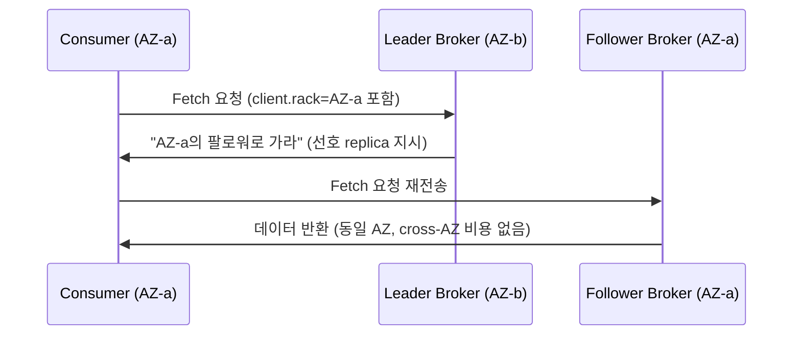

# Zonal 클러스터 운영 전략: 트래픽 전환, 업그레이드 롤백, 데이터 AZ 친화

> **지원 버전**: Amazon EKS 1.33+, AWS Load Balancer Controller 2.9+, Kafka 2.4+ (KIP-392), Valkey GLIDE 1.x
> **마지막 업데이트**: 2026년 7월 15일

< [이전: Tekton Pipelines](14-tekton-pipelines.md) | [목차](./) >

***

고객 문의에서 가장 많이 나오는 주제는 "운영"입니다. 그중에서도 반복되는 조합이 있습니다: **zone 단위로 클러스터를 쪼개 장애를 격리하고, 로드밸런서 타겟 그룹의 weight로 트래픽을 옮기고, 문제가 생기면 클러스터를 새로 만들지 않고 in-place로 되돌리는 것.** 이 문서는 이 조합을 하나의 운영 전략으로 정리하고, 여기에 흔히 빠지는 조각인 **DB/캐시/메시징의 read 경로를 zone에 고정하는 방법**까지 더합니다.

각 영역의 구체적인 절차는 이미 이 레포의 다른 문서에 있습니다. 이 문서는 그 조각들이 "왜 함께 쓰이는지"와 "지금까지 없던 데이터 계층 부분"을 채웁니다.

## 목차

1. [왜 zonal 운영인가](#왜-zonal-운영인가)
2. [트래픽 계층: Target Group + TargetGroupBinding + Weight 전환](#트래픽-계층-target-group--targetgroupbinding--weight-전환)
3. [업그레이드: In-Place + 네이티브 롤백이 기본이 된 이유](#업그레이드-in-place--네이티브-롤백이-기본이-된-이유)
4. [데이터 계층: Read 경로를 Zone에 고정하기](#데이터-계층-read-경로를-zone에-고정하기)
5. [권장 조합 요약](#권장-조합-요약)

***

## 왜 zonal 운영인가

멀티 AZ 단일 클러스터와 AZ마다 클러스터를 두는 zonal(싱글존) 구성은 트레이드오프가 다릅니다.

| 관점 | 멀티 AZ 단일 클러스터 | Zonal(싱글존) 클러스터 |
|------|----------------------|------------------------|
| 장애 격리 | AZ 장애가 클러스터 일부에 영향 | AZ 장애가 해당 zonal 클러스터에만 영향, 나머지는 무관 |
| Cross-AZ 비용 | 파드 간 통신이 AZ 경계를 넘나듦 ($0.01/GB) | 같은 AZ 내 통신이라 인터-AZ 전송비 발생 안 함 |
| 업그레이드 | 롤링 업데이트, 클러스터 전체가 한 번에 버전 이동 | zone 단위로 순차 업그레이드, 나머지 zone은 이전 버전 유지 |
| 운영 복잡도 | 클러스터 1개 관리 | 클러스터 N개 + 트래픽 라우팅 계층 동기화 필요 |

AWS도 이 패턴을 [Cell-Based Architecture for Amazon EKS 공식 가이드](https://aws.amazon.com/solutions/guidance/cell-based-architecture-for-amazon-eks/)로 제공합니다. 여기서 zonal 클러스터 하나가 "cell"이고, 여러 cell을 리전 단위로 묶은 것이 "supercell"입니다. 셀 앞단의 라우팅 계층(Route 53 가중치 라우팅 + Application Recovery Controller)이 장애 조치를 담당하고, 각 cell 내부에는 ALB가 트래픽을 분배합니다. 핵심은 "cell 경계를 넘는 트래픽이 없으므로 인터-AZ 데이터 전송비가 발생하지 않는다"는 점입니다.

이 레포에서 zonal/블루-그린 아키텍처 자체는 이미 [`ops/02-infrastructure-advanced.md`](02-infrastructure-advanced.md#블루그린-아키텍처-개요)에서, 성숙도 모델 관점의 Multi-AZ/Cell-Based Architecture는 [`eks/10-eks-resiliency.md`](../eks/10-eks-resiliency.md)에서 다룹니다. 이 문서는 그 위에 트래픽 전환·업그레이드·데이터 read를 "하나의 운영 루프"로 엮습니다.

***

## 트래픽 계층: Target Group + TargetGroupBinding + Weight 전환

zonal 클러스터 여러 개를 운영할 때 트래픽을 옮기는 표준 패턴은 다음과 같습니다.

1. NLB/ALB와 Target Group을 클러스터 **밖에서** Terraform 등 IaC로 생성합니다 (클러스터가 사라져도 로드밸런서는 유지됨).
2. 각 zonal 클러스터의 Service를 `TargetGroupBinding` CRD로 해당 Target Group에 바인딩합니다.
3. 클러스터 간 트래픽 이동은 클러스터 내부 리소스를 건드리지 않고, 로드밸런서의 **Target Group weight**만 조정합니다.

```yaml
apiVersion: elbv2.k8s.aws/v1beta1
kind: TargetGroupBinding
metadata:
  name: zone-a-tgb
  namespace: production
spec:
  targetGroupARN: arn:aws:elasticloadbalancing:ap-northeast-2:ACCOUNT:targetgroup/zone-a-tg/xxxxxxxxxxxx
  serviceRef:
    name: app-service
    port: 80
  targetType: ip
```

```bash
# ALB 리스너 규칙의 forward action에서 Target Group 간 weight 조정
aws elbv2 modify-listener \
  --listener-arn "$LISTENER_ARN" \
  --default-actions '[{
    "Type": "forward",
    "ForwardConfig": {
      "TargetGroups": [
        {"TargetGroupArn": "'"$ZONE_A_TG_ARN"'", "Weight": 20},
        {"TargetGroupArn": "'"$ZONE_C_TG_ARN"'", "Weight": 80}
      ]
    }
  }]'
```

TargetGroupBinding의 기본/고급/멀티포트 설정은 [`networking/03-aws-lb-controller.md`](../networking/03-aws-lb-controller.md#targetgroupbinding)에, NLB 가중치 타겟 그룹과 Route 53 가중치 라우팅의 전체 Terraform 구성은 [`ops/02-infrastructure-advanced.md`](02-infrastructure-advanced.md#nlb-가중치-타겟-그룹)에 있습니다.

**계획된 전환 vs 장애 시 전환**: weight 조정은 업그레이드·배포처럼 **계획된** 전환에 씁니다. AZ 장애처럼 **예기치 않은** 상황은 [ARC(Application Recovery Controller) Zonal Shift](../eks/10-eks-resiliency.md#arc-zonal-shift)가 자동 감지·전환을 담당합니다 — 두 메커니즘은 경쟁하지 않고 계획적/반응적으로 역할이 나뉩니다.

***

## 업그레이드: In-Place + 네이티브 롤백이 기본이 된 이유

2026년 7월 Amazon EKS가 [Kubernetes 버전 네이티브 롤백을 GA](https://aws.amazon.com/blogs/containers/announcing-amazon-eks-rollback-for-safe-and-reliable-management-of-cluster-upgrades/)했습니다. 업그레이드 후 문제가 발견되면 **7일 이내, 한 번에 마이너 버전 1개**를 되돌릴 수 있고, 롤백 전 API 호환성·kubelet 스큐·add-on 버전을 점검하는 Rollback Readiness Insights가 자동으로 사전 체크를 수행합니다. Auto Mode 클러스터는 컨트롤 플레인뿐 아니라 데이터 플레인(워커 노드)까지 롤백 대상에 포함됩니다 — 단, 셀프 매니지드 노드 그룹으로 zonal 클러스터를 in-place 업그레이드한 경우(3절)에는 이 자동 데이터 플레인 롤백이 적용되지 않고 컨트롤 플레인만 되돌아가므로, 노드/AMI/애드온 변경은 따로 되돌려야 합니다. 두 경우 모두 추가 비용은 없습니다.

이 기능이 나오기 전에는 "새 버전이 잘못되면 어떻게 되돌리나"라는 질문에 클러스터를 통째로 새로 만들어 검증하는 블루/그린 플릿이 유일한 답이었습니다. 이제는 이미 zonal(싱글존) 구성으로 운영 중인 팀이라면, zone별 클러스터를 하나씩 in-place로 업그레이드하고 문제 시 네이티브 롤백을 안전망으로 쓰는 더 가벼운 방식을 쓸 수 있습니다.

| 방식 | 언제 유리한가 |
|------|---------------|
| **블루/그린 클러스터 플릿 상시 유지** | 전환 전에 완전히 분리된 클러스터에서 실제 프로덕션 트래픽으로 신규 버전을 검증해야 하는 경우. 노드/AMI/애드온까지 통째로 되돌려야 하는 경우 (네이티브 롤백은 컨트롤 플레인만 되돌림) |
| **Zonal In-Place + 네이티브 롤백** | 원래 가용성 목적으로 zonal 클러스터를 운영 중이고, 클러스터 플릿 두 벌을 상시 운영하는 비용을 피하고 싶으며, 즉각적인 클러스터 단위 failback보다 ~7일 롤백 유효기간을 감내할 수 있는 경우 |
| **Route 53 가중치 DNS 전환** | 클러스터가 아예 다른 리전/계정에 있거나, NLB 계층 자체를 교체해야 하는 경우 |

실행 절차(NLB weight 이동 → in-place 업그레이드 → 검증 → weight 복원, 그리고 롤백 조건을 충족하지 못하는 경우들)는 이미 [`ops/11-upgrade-operations.md`의 "대안: 네이티브 롤백을 활용한 Zonal In-Place 업그레이드"](11-upgrade-operations.md#대안-네이티브-롤백을-활용한-zonal-in-place-업그레이드) 섹션에 정리되어 있으므로 여기서는 반복하지 않습니다. 롤백이 가능한 정확한 조건(대상 버전으로 새로 생성된 클러스터는 롤백 불가, 이미 재업그레이드된 경우 등)은 [`eks/08-eks-upgrades.md`의 롤백 절차](../eks/08-eks-upgrades.md#롤백-절차)를 참고하세요.

***

## 데이터 계층: Read 경로를 Zone에 고정하기

트래픽 전환과 업그레이드까지는 zonal 아키텍처를 갖춘 팀이라면 대체로 준비되어 있습니다. 반면 **DB/캐시/메시징의 read 경로**는 놓치기 쉽습니다 — 애플리케이션 파드는 자기가 속한 AZ 안에 있어도, DB reader나 캐시 replica, Kafka broker는 라운드로빈으로 다른 AZ에 배정되어 조용히 인터-AZ 비용과 지연을 만듭니다.

공통 원리는 하나입니다: **write는 leader/primary로 가야 하니 어차피 cross-AZ가 발생할 수 있지만, read는 같은 AZ의 replica로만 보내면 됩니다.** 트래픽의 대부분이 read인 워크로드(캐시, 조회성 쿼리, 컨슈머)에서는 이것만으로도 인터-AZ 비용의 상당 부분이 사라집니다.

이걸 하려면 먼저 파드가 "나는 어느 AZ에 있는가"를 알아야 합니다. Kubernetes Downward API는 Pod에 노드의 zone 라벨(`topology.kubernetes.io/zone`)을 직접 주입해주지 않으므로, 다음 중 하나가 필요합니다.

- **EC2 IMDS 조회**: 파드/사이드카가 `http://169.254.169.254/latest/meta-data/placement/availability-zone`을 직접 호출
- **Admission 시점 라벨 주입**: Kyverno 같은 mutating policy로, 노드의 `topology.k8s.aws/zone-id` 라벨을 파드 annotation으로 복사 — AWS가 [MSK-on-EKS rack awareness 가이드](https://aws.amazon.com/blogs/big-data/optimize-traffic-costs-of-amazon-msk-consumers-on-amazon-eks-with-rack-awareness/)에서 권장하는 패턴이며, 이 레포의 [`security/01-kyverno-policy-management.md`](../security/01-kyverno-policy-management.md)에서 Kyverno 정책 작성법을 다룹니다
- **오퍼레이터 내장 지원**: Strimzi처럼 rack-awareness를 1급 기능으로 제공하는 오퍼레이터를 쓰면 별도 구현 없이 init-container가 자동으로 처리

### Kafka: KIP-392 Follower Fetching

[KIP-392](https://cwiki.apache.org/confluence/display/KAFKA/KIP-392:+Allow+consumers+to+fetch+from+closest+replica)(Kafka 2.4+)는 컨슈머가 파티션 리더가 아니라 **같은 rack(AZ)에 있는 팔로워 replica**에서 직접 fetch하도록 허용합니다.



- **브로커**: `replica.selector.class=org.apache.kafka.common.replica.RackAwareReplicaSelector` 설정, 모든 브로커에 `broker.rack`(AZ ID) 지정
- **컨슈머**: `client.rack` 컨슈머 속성에 자기 AZ ID를 설정 — 앞서 설명한 zone 인지 방법으로 얻은 값을 주입
- **Strimzi 사용 시**: 오퍼레이터가 이를 내장 지원합니다.

  ```yaml
  apiVersion: kafka.strimzi.io/v1beta2
  kind: Kafka
  spec:
    kafka:
      rack:
        topologyKey: topology.kubernetes.io/zone
      config:
        replica.selector.class: org.apache.kafka.common.replica.RackAwareReplicaSelector
  ```

  `rack.topologyKey`를 지정하면 Strimzi가 broker.rack 설정과 client rack을 파드에 주입하는 init-container를 자동으로 구성합니다.
- 참고: [KIP-881](https://cwiki.apache.org/confluence/display/KAFKA/KIP-881%3A+Rack-aware+Partition+Assignment+for+Kafka+Consumers)은 여기서 한 단계 더 나가, 컨슈머 그룹의 파티션 할당 자체를 rack 인지형으로 만듭니다.

Kafka on EKS 배포 전반은 [`data-on-eks/kafka/`](../data-on-eks/kafka/README.md) 문서를 참고하세요.

### Redis/Valkey (ElastiCache): AZ Affinity Read 전략

[Valkey GLIDE](https://valkey.io/blog/az-affinity-strategy/) 클라이언트는 `ReadFrom` 설정으로 4가지 read 전략을 지원합니다.

| 전략 | 동작 |
|------|------|
| `PRIMARY` | 항상 primary에서 읽음 (기본값, AZ 무관) |
| `PREFER_REPLICA` | replica 사이 라운드로빈, 실패 시 폴백 |
| `AZ_AFFINITY` | 같은 AZ의 replica를 우선, 없으면 폴백 |
| `AZ_AFFINITY_REPLICAS_AND_PRIMARY` | 같은 AZ의 replica 우선 → 같은 AZ의 primary → 최후에 다른 AZ |

Read 비율이 압도적으로 높은 워크로드(>99% read)에는 `AZ_AFFINITY_REPLICAS_AND_PRIMARY`가 비용 절감과 가용성의 균형점으로 권장됩니다.

```python
from glide import GlideClient, GlideClientConfiguration, ReadFrom

config = GlideClientConfiguration(
    addresses=[...],
    read_from=ReadFrom.AZ_AFFINITY_REPLICAS_AND_PRIMARY,
    client_az="ap-northeast-2a",  # 파드가 속한 AZ — 앞서 설명한 방법으로 획득
)
client = await GlideClient.create(config)
```

실사례로 HotelTrader는 Valkey GLIDE의 AZ affinity 라우팅 도입 후 인터-AZ 데이터 전송비를 95% 절감하고 평균 지연을 49% 개선했습니다 (AZ 인지 없이는 캐시 요청이 AZ와 무관하게 무작위 분산되어 불필요한 전송비가 발생하고 있었습니다). 자세한 내용은 [AWS 데이터베이스 블로그](https://aws.amazon.com/blogs/database/how-hoteltrader-cut-inter-az-cost-95-and-latency-by-49-with-valkey-glide-on-amazon-elasticache/)를 참고하세요.

### Aurora/RDS: Reader Endpoint의 한계와 우회

Aurora의 기본 reader endpoint는 **AZ를 고려하지 않는 라운드로빈 DNS**입니다 — 같은 AZ에 replica가 있어도 우선권이 없습니다. 이건 기능 누락이 아니라 현재 시점의 실제 제약이며, AZ affinity 자체를 요청하는 [aws-advanced-jdbc-wrapper#1139](https://github.com/aws/aws-advanced-jdbc-wrapper/issues/1139) 이슈가 아직 열려 있습니다.

우회 방법은 두 가지입니다.

1. **AZ별 커스텀 엔드포인트**: 특정 AZ의 replica 인스턴스 서브셋만 묶어 커스텀 엔드포인트를 만들고, 해당 AZ의 애플리케이션이 그 엔드포인트로 접속하도록 설정합니다.

   ```bash
   aws rds create-db-cluster-endpoint \
     --db-cluster-identifier my-aurora-cluster \
     --db-cluster-endpoint-identifier reader-az-a \
     --endpoint-type READER \
     --static-members db-instance-az-a-1 db-instance-az-a-2
   ```

2. **AWS Advanced JDBC Wrapper**: read/write splitting과 `fastestResponse` 리더 선택 전략을 제공해, 완전한 AZ affinity는 아니지만 응답이 빠른(대체로 같은 AZ인) 리더를 선호하게 만듭니다.

완전한 AZ affinity가 필요하다면, 위 이슈가 해결되기 전까지는 ①번(커스텀 엔드포인트)이 유일하게 확실한 방법입니다.

### Kubernetes 서비스 계층 보완

애플리케이션 계층에서 Service 트래픽 자체를 AZ에 고정하려면 [Topology Aware Routing GA](../eks/12-kubernetes-version-roadmap.md#topology-aware-routing-ga-kep-2433)를, 서비스 메시를 쓴다면 [Istio Zone-Aware Routing](../service-mesh/istio/resilience/03-zone-aware-routing.md)을 참고하세요. 이 문서의 데이터 계층 전략과 함께 쓰면 애플리케이션→캐시/DB/메시징까지 전체 read 경로가 AZ 안에 머뭅니다.

***

## 권장 조합 요약

| 계층 | 2026년 기준 권장 | 대안/폴백 |
|------|-----------------|-----------|
| 아키텍처 | Zonal(싱글존) 클러스터 + Cell-Based Architecture | 멀티 AZ 단일 클러스터 (운영 인력이 적을 때) |
| 트래픽 전환 | Target Group + TargetGroupBinding + weight 조정 | Route 53 가중치 DNS (리전/계정이 다를 때) |
| 장애 대응 | ARC Zonal Shift (자동) | 수동 weight 조정 |
| 업그레이드 | Zonal In-Place + EKS 네이티브 롤백 (7일) | 블루/그린 클러스터 플릿 (완전한 사전 검증 필요 시) |
| Kafka read | KIP-392 (`client.rack` + `RackAwareReplicaSelector`), Strimzi는 `rack.topologyKey` | 리전 전역 폴백 허용 (팔로워 부재 시 자동) |
| 캐시 read | Valkey GLIDE `AZ_AFFINITY_REPLICAS_AND_PRIMARY` | `PREFER_REPLICA` (AZ 인지 불필요한 경우) |
| DB read | Aurora AZ별 커스텀 엔드포인트 | AWS Advanced JDBC Wrapper `fastestResponse` |

도입 순서는 **트래픽 전환 계층 → 업그레이드/롤백 → 데이터 read 계층** 순을 권장합니다. 앞 단계가 없으면 뒤 단계의 효과(특히 비용 절감)를 측정하기 어렵기 때문입니다.

***

< [이전: Tekton Pipelines](14-tekton-pipelines.md) | [목차](./) >
