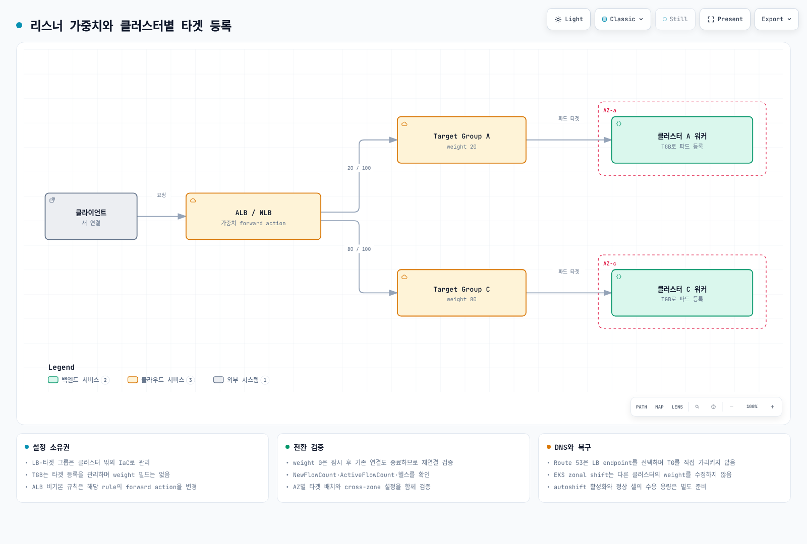
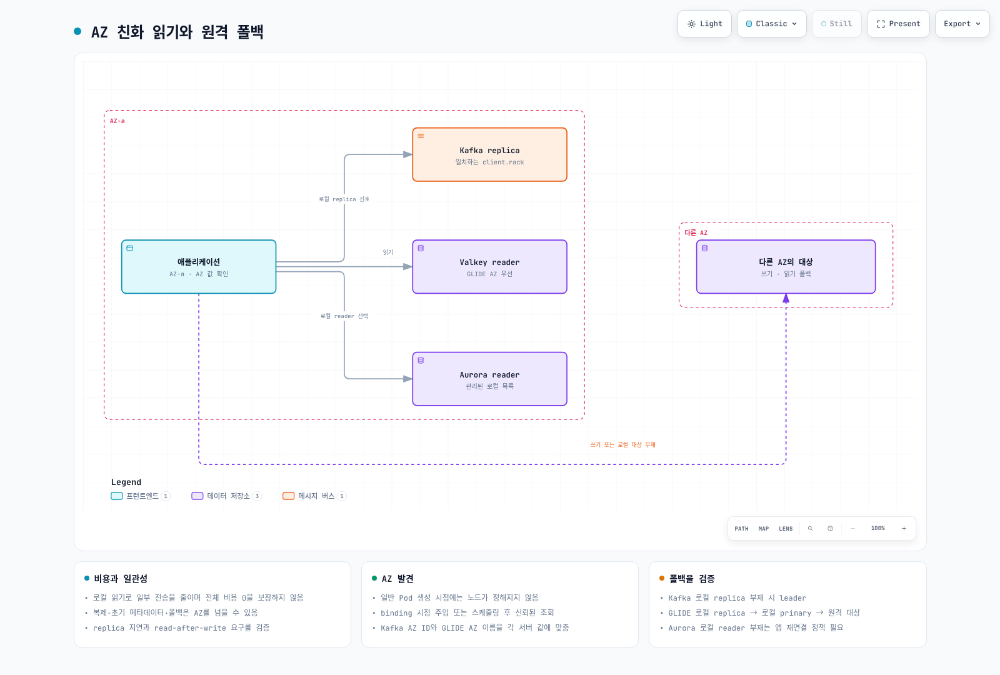
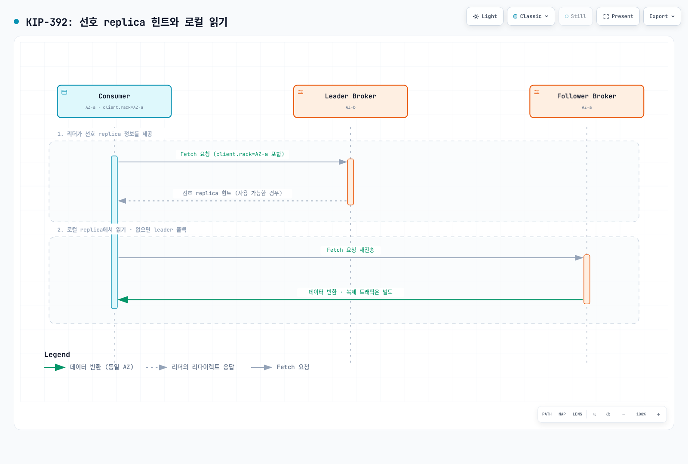

# Zonal 클러스터 운영 전략: 트래픽 전환, 업그레이드 롤백, 데이터 AZ 친화

> **검토 기준**: EKS 버전 롤백·ARC 공식 문서, Strimzi 1.2.0, Valkey GLIDE 2.5.2, AWS Advanced JDBC Wrapper 4.4.0
> **마지막 검토**: 2026년 9월 11일. 설정 예제를 검증했으며 실제 클러스터 전환·장애 실험은 수행하지 않았습니다.

< [이전: Tekton Pipelines](14-tekton-pipelines.md) | [목차](./README.md) | [다음: 트러블슈팅 플레이북](16-troubleshooting-playbook.md) >

***

이 문서는 **AZ별 워커를 갖는 클러스터 플릿의 트래픽 전환, 조건부 버전 롤백, 데이터 읽기의 AZ 친화성**을 함께 다룹니다. Zonal 구성은 모든 팀의 기본 선택이 아닙니다. 셀별 용량·라우팅·배포·데이터 의존성을 독립적으로 운영할 수 있을 때 검토하는 장애 격리 전략입니다.

여기서 zonal은 **워커와 애플리케이션 배치 범위**를 뜻합니다. [EKS 관리형 컨트롤 플레인](https://docs.aws.amazon.com/eks/latest/userguide/eks-architecture.html)은 여러 AZ에 분산됩니다. 클러스터 전체가 단일 AZ 안에만 존재한다는 뜻이 아닙니다.

## 목차

1. [왜 zonal 운영인가](#왜-zonal-운영인가)
2. [트래픽 계층: Target Group + TargetGroupBinding + Weight 전환](#트래픽-계층-target-group--targetgroupbinding--weight-전환)
3. [업그레이드: In-Place와 네이티브 롤백의 조건](#업그레이드-in-place와-네이티브-롤백의-조건)
4. [데이터 계층: 같은 AZ의 Read 경로 선호하기](#데이터-계층-같은-az의-read-경로-선호하기)
5. [권장 조합 요약](#권장-조합-요약)

***

## 왜 zonal 운영인가

멀티 AZ 단일 클러스터와 AZ마다 클러스터를 두는 zonal(싱글존) 구성은 트레이드오프가 다릅니다.

| 관점 | 멀티 AZ 단일 클러스터 | Zonal(싱글존) 클러스터 |
|------|----------------------|------------------------|
| 장애 격리 | 정상 AZ의 복제본·여유 용량으로 대응 | 해당 셀의 워커를 잃을 수 있음. 공유 DB·라우팅·리전 의존성은 다른 셀에도 영향 |
| Cross-AZ 비용 | 서비스·데이터 경로에 따라 발생 | 로컬 애플리케이션 통신은 줄일 수 있으나 복제·공유 서비스·LB 우회 비용은 남음 |
| 업그레이드 | 컨트롤 플레인과 노드의 순차 변경, 버전 스큐 관리 | 셀별 순차 변경. 나머지 셀의 수용 용량과 버전 호환성 필요 |
| 운영 복잡도 | 클러스터 1개 관리 | 클러스터 N개 + 트래픽 라우팅 계층 동기화 필요 |

AWS의 [Cell-Based Architecture for Amazon EKS 가이드](https://aws.amazon.com/solutions/guidance/cell-based-architecture-for-amazon-eks/)도 참고할 수 있습니다. 셀 간 의존성을 줄이고 장애 셀의 부하를 정상 셀이 수용하도록 설계합니다. 셀별 LB를 DNS로 선택하는 방식과 하나의 LB에서 타겟 그룹 가중치를 조정하는 방식은 서로 다른 라우팅 구조입니다. 실제 경로와 서비스별 과금 기준으로 비용을 측정해야 합니다.

이 레포에서 zonal/블루-그린 아키텍처 자체는 이미 [`ops/02-infrastructure-advanced.md`](02-infrastructure-advanced.md#블루그린-아키텍처-개요)에서, 성숙도 모델 관점의 Multi-AZ/Cell-Based Architecture는 [`eks/10-eks-resiliency.md`](../eks/10-eks-resiliency.md)에서 다룹니다. 이 문서는 그 위에 트래픽 전환·업그레이드·데이터 read를 "하나의 운영 루프"로 엮습니다.

***

<span id="트래픽-계층-target-group--targetgroupbinding--weight-전환"></span>

## 트래픽 계층: Target Group + TargetGroupBinding + Weight 전환



[🔍 인터랙티브 다이어그램 보기](https://www.atomai.click/kubernetes-docs/archmaps/ko-ops-15-zonal-operations-guide-0.html)

하나의 LB를 공유하는 두 클러스터의 전환 패턴은 다음과 같습니다.

1. NLB/ALB와 Target Group을 클러스터 **밖에서** Terraform 등 IaC로 생성합니다 (클러스터가 사라져도 로드밸런서는 유지됨).
2. 각 zonal 클러스터의 Service를 `TargetGroupBinding` CRD로 해당 Target Group에 바인딩합니다.
3. **리스너의 forward action**에서 Target Group weight를 조정합니다. TGB 자체에는 weight가 없습니다. 각 클러스터는 별도 타겟 그룹을 사용하고 타겟 그룹·리스너의 소유권을 IaC와 컨트롤러 사이에서 명확히 합니다.

아래 TGB는 `production` 네임스페이스, `app-service:80`, 해당 VPC의 IP 타겟 그룹과 AWS Load Balancer Controller가 이미 존재한다는 전제의 예제입니다. ARN을 실제 값으로 바꾸고 타겟 헬스와 네트워크 접근을 확인합니다.

이 예제는 **별도로 설치한 AWS Load Balancer Controller**의 API를 사용합니다. Auto Mode 내장 TGB는 `eks.amazonaws.com/v1`이며 [태그와 수명 주기](https://docs.aws.amazon.com/eks/latest/userguide/auto-configure-alb.html)가 다릅니다. 공식 안내는 내장 TGB/클러스터 삭제 시 타겟 그룹도 삭제된다고 명시하므로, 외부 IaC 소유의 타겟 그룹을 유지하려는 이 구성과 혼용하지 않습니다.

```yaml
apiVersion: elbv2.k8s.aws/v1beta1
kind: TargetGroupBinding
metadata:
  name: zone-a-tgb
  namespace: production
spec:
  targetGroupARN: arn:aws:elasticloadbalancing:ap-northeast-2:ACCOUNT:targetgroup/zone-a-tg/xxxxxxxxxxxx
  serviceRef:
    name: app-service
    port: 80
  targetType: ip
```

```bash
set -euo pipefail
# 기존 default action이 두 타겟 그룹을 사용하는 NLB 리스너 예제.
# ALB의 비기본 규칙은 modify-rule 대상이며 이 명령의 대상이 아닙니다.
: "${LISTENER_ARN:?}" "${ZONE_A_TG_ARN:?}" "${ZONE_C_TG_ARN:?}"
aws elbv2 describe-listeners \
  --listener-arns "$LISTENER_ARN" \
  --query 'Listeners[0].DefaultActions' --output json > current-actions.json
jq -e --arg a "$ZONE_A_TG_ARN" --arg c "$ZONE_C_TG_ARN" '
  if $a == $c or length != 1 or .[0].Type != "forward"
     or ([.[0].ForwardConfig.TargetGroups[].TargetGroupArn] | sort)
        != ([$a, $c] | sort)
  then error("Expected one forward action with exactly the two selected groups")
  else
    .[0].ForwardConfig.TargetGroups |= map(
      .Weight = (if .TargetGroupArn == $a then 20 else 80 end))
  end
' current-actions.json > proposed-actions.json &&
aws elbv2 modify-listener \
  --listener-arn "$LISTENER_ARN" \
  --default-actions file://proposed-actions.json
```

실행 전에 IaC 변경 계획과 일치하는지 확인합니다. 일반적인 NLB weight 변경은 신규 플로우 분배를 바꾸지만, **weight 0은 별도 주의가 필요합니다.** [현재 사용자 가이드](https://docs.aws.amazon.com/elasticloadbalancing/latest/network/load-balancer-listeners.html)는 0으로 바꾸면 잠시 후 신규 연결을 받지 않고 기존 연결도 종료된다고 설명합니다. 따라서 기존 연결이 자연 종료될 때까지 유지된다고 가정하지 말고, 0 전환 전에 애플리케이션의 graceful drain·재연결·재시도 영향을 검증합니다. [공식 가이드](https://aws.amazon.com/blogs/networking-and-content-delivery/network-load-balancers-now-support-weighted-target-groups/)에 따라 `NewFlowCount`와 `ActiveFlowCount`를 타겟 그룹별로 확인하고, 헬스·오류율·연결 종료를 검증한 후 노드를 변경합니다. 타겟 그룹의 프로토콜·IP 버전 조건과 cross-zone 설정도 확인합니다. 한 타겟 그룹이 한 AZ에만 있을 때 cross-zone을 끄면 기대한 가중치 분배가 성립하지 않을 수 있습니다.

Route 53의 가중치 레코드는 **LB DNS 이름**을 선택하며 타겟 그룹 ARN을 직접 가리키지 않습니다. DNS TTL·클라이언트 캐시·장기 연결 때문에 DNS 전환도 즉시 완료되지 않습니다.

TargetGroupBinding의 기본/고급/멀티포트 설정은 [`networking/03-aws-lb-controller.md`](../networking/03-aws-lb-controller.md#targetgroupbinding)에, NLB 가중치 타겟 그룹과 Route 53 가중치 라우팅의 전체 Terraform 구성은 [`ops/02-infrastructure-advanced.md`](02-infrastructure-advanced.md#nlb-가중치-타겟-그룹)에 있습니다.

**계획된 전환과 장애 대응**: weight 조정은 계획된 전환에 활용할 수 있지만 자동 장애 조치를 제공하지는 않습니다. [ARC zonal shift](https://docs.aws.amazon.com/eks/latest/userguide/zone-shift.html)는 운영자가 시작하는 전환이고 **zonal autoshift**는 별도 활성화·연습·알람 설정이 필요한 자동 전환입니다. EKS 리소스의 shift는 같은 클러스터의 장애 AZ 엔드포인트·노드 처리를 조정합니다. 다른 클러스터의 타겟 그룹 weight를 자동 수정하지 않습니다. LB 리소스의 shift도 별도로 계획해야 합니다.

> **EKS Auto Mode 지원**: [2026년 7월 지원](https://aws.amazon.com/about-aws/whats-new/2026/07/eks-auto-mode-arc-zonal-shift/)부터 클러스터에서 zonal shift를 활성화하면 shift 중 장애 AZ의 신규 노드 프로비저닝·자발적 중단이 제한됩니다. 이것만으로 autoshift가 활성화되지는 않습니다. **유일한 워커 AZ를 shift하면 대체 파드가 없어 장애를 만들 수 있습니다.** EKS shift에는 정상 AZ의 파드·CoreDNS·여유 용량이 필요하며, 단일 AZ 워커 셀의 복구는 외부 셀 라우팅과 함께 설계합니다.

***

## 업그레이드: In-Place와 네이티브 롤백의 조건

2026년 7월 도입된 [EKS 네이티브 롤백](https://docs.aws.amazon.com/eks/latest/userguide/rollback-cluster.html)은 **업그레이드 완료 후 7일 이내에, 바로 이전 마이너 버전으로** 되돌릴 수 있습니다. 7일은 롤백 소요 시간이 아닌 **시작 자격 기간**입니다. 생성 버전·지원 종료·후속 업그레이드·기능 호환성 조건과 Rollback Readiness Insights를 확인해야 합니다.

- **Auto Mode**: EKS가 Auto Mode 노드를 먼저 되돌린 뒤 컨트롤 플레인을 되돌립니다. PDB·NodePool 중단 예산을 따르므로 즉시 완료되지 않습니다.
- **Managed node group**: `UpdateNodegroupVersion`으로 별도 노드 롤백을 진행합니다. 셀프 매니지드·Hybrid 노드는 운영자가 대상 버전에 맞게 준비합니다. 노드는 컨트롤 플레인보다 새 버전일 수 없습니다.
- **애드온·데이터·애플리케이션**: 버전 롤백이 애드온, etcd 데이터, 볼륨 데이터, 애플리케이션 변경까지 복원하지 않습니다. 호환성·데이터 마이그레이션 복구를 따로 준비합니다.
- **`--force`**: readiness insight를 우회할 수 있으나 7일 등 자격 조건이나 Auto Mode 중단 제어를 우회하지 않습니다. 정상 절차에서는 문제를 해결한 뒤 진행합니다.

롤백 기능 자체의 추가 요금은 없지만 클러스터·노드·트래픽 등 기존 자원 요금은 유지됩니다. 다른 셀의 용량과 회복 목표를 검증한 후 in-place 또는 블루/그린 방식을 선택합니다.

| 방식 | 언제 유리한가 |
|------|---------------|
| **블루/그린 클러스터** | 분리된 새 클러스터에서 검증하고 기존 환경으로 트래픽을 되돌려야 할 때. 공유 데이터 변경은 별도 복구 계획 필요 |
| **Zonal In-Place + 네이티브 롤백** | 이미 셀 플릿을 운영하며 다른 셀이 부하를 수용하고, 롤백 자격·호환성·회복 시간을 검증한 경우 |
| **Route 53 가중치 DNS 전환** | 클러스터가 아예 다른 리전/계정에 있거나, NLB 계층 자체를 교체해야 하는 경우 |

실행 순서는 **다른 셀 용량 확인 → weight 이동 → 기존 연결 종료 확인 → 업그레이드 → 검증 → weight 복원**입니다. 자세한 절차는 [업그레이드 운영](11-upgrade-operations.md), 자격 조건과 노드 유형별 주의점은 [EKS 업그레이드](../eks/08-eks-upgrades.md)를 참고하세요.

***

## 데이터 계층: 같은 AZ의 Read 경로 선호하기

같은 AZ에 적절한 복제본이 있고 애플리케이션이 해당 읽기 일관성을 허용하면 로컬 읽기를 선호할 수 있습니다. 쓰기·데이터 복제·초기 메타데이터 조회·장애 시 폴백은 여전히 AZ를 넘을 수 있습니다. 복제 지연, 오류율, 실제 연결 대상과 전송량을 함께 측정합니다.



[🔍 인터랙티브 다이어그램 보기](https://www.atomai.click/kubernetes-docs/archmaps/ko-ops-15-zonal-operations-guide-1.html)

먼저 파드의 AZ를 알아야 합니다. Downward API는 파드의 필드를 노출하며 노드 라벨을 직접 조회하지 않습니다.

- **노드 메타데이터 주입**: 스케줄링 전 일반 Pod 생성 admission에서는 아직 대상 노드를 모릅니다. AWS의 [MSK 가이드](https://aws.amazon.com/blogs/big-data/optimize-traffic-costs-of-amazon-msk-consumers-on-amazon-eks-with-rack-awareness/)는 **`Pod/binding` 요청**에서 대상 노드를 읽고 AZ ID를 주입합니다. Kyverno의 binding 요청 필터·노드 조회 RBAC·파드 시작 전 주입 완료를 함께 구성해야 합니다.
- **스케줄링 후 조회**: Downward API의 `spec.nodeName`을 사용해 신뢰하는 초기화 구성 요소가 노드 라벨을 읽도록 할 수 있습니다. 애플리케이션 전체에 광범위한 노드 조회 권한을 부여하지 않습니다.
- **EC2 IMDSv2**: 접근이 허용된 EC2 환경에서는 토큰을 먼저 발급받아 placement 정보를 읽습니다. IMDSv1 단순 GET을 전제하거나 메타데이터 접근 제한을 무조건 해제하지 않습니다. Fargate 등에는 그대로 적용할 수 없습니다.
- **오퍼레이터 지원**: Strimzi는 자신이 관리하는 브로커·지원 클라이언트 리소스의 rack 설정을 처리합니다. 별도 Deployment로 배포한 일반 애플리케이션 컨슈머의 `client.rack`까지 자동 설정하지는 않습니다.

**AZ 이름과 ID를 혼용하지 않습니다.** Kafka의 `broker.rack`과 `client.rack`은 동일한 문자열 체계를 사용해야 합니다. MSK에서 AZ ID를 사용한다면 `ap-northeast-2a` 같은 AZ 이름을 그대로 넣지 않습니다. GLIDE의 `client_az`도 서버가 보고하는 AZ 값과 맞춰야 합니다.

### Kafka: KIP-392 Follower Fetching

[KIP-392](https://cwiki.apache.org/confluence/display/KAFKA/KIP-392:+Allow+consumers+to+fetch+from+closest+replica)는 Kafka 2.4에서 도입된 기능으로, 컨슈머가 같은 rack의 replica에서 읽을 수 있도록 합니다. 이는 기능 도입 버전이며 Kafka 2.4를 현재 배포 버전으로 권장한다는 뜻이 아닙니다.



[🔍 인터랙티브 다이어그램 보기](https://www.atomai.click/kubernetes-docs/archmaps/ko-ops-15-zonal-operations-guide-10.html)

- **브로커**: `replica.selector.class=org.apache.kafka.common.replica.RackAwareReplicaSelector`와 `broker.rack`을 설정합니다.
- **컨슈머**: `client.rack`을 자신의 rack 값으로 지정합니다. 로컬에 적절한 replica가 없으면 리더로 폴백합니다.
- **Strimzi 1.2.0**: 아래는 기존 Kafka CR에 병합하는 **설정 발췌**입니다. 전체 배포에는 KafkaNodePool, 리스너, 스토리지 등 추가 설정이 필요합니다. Strimzi 1.0부터 CR API는 `v1`이며 rack 종류도 지정합니다.

```yaml
apiVersion: kafka.strimzi.io/v1
kind: Kafka
metadata:
  name: my-cluster
spec:
  kafka:
    rack:
      type: topology-label
      topologyKey: topology.kubernetes.io/zone
    config:
      replica.selector.class: org.apache.kafka.common.replica.RackAwareReplicaSelector
```

이 설정은 브로커의 `broker.rack`을 구성합니다. 일반 컨슈머의 `client.rack`은 별도로 지정합니다. KafkaConnect·MirrorMaker 2·Bridge는 각 CR의 rack 설정을 확인합니다. [Strimzi 공식 설명](https://strimzi.io/docs/operators/1.2.0/configuring.html)에 따라 브로커 배치 분산도 별도로 보장합니다. follower fetch는 복제 지연으로 읽기 지연을 늘릴 수도 있습니다.

[KIP-881](https://cwiki.apache.org/confluence/display/KAFKA/KIP-881%3A+Rack-aware+Partition+Assignment+for+Kafka+Consumers)의 rack-aware 파티션 할당은 이와 별개입니다. 사용할 컨슈머 버전·assignor 지원을 확인합니다. 배포 전반은 [Kafka on EKS](../data-on-eks/kafka/README.md)를 참고하세요.

### Redis/Valkey (ElastiCache): AZ Affinity Read 전략

[Valkey GLIDE](https://valkey.io/blog/az-affinity-strategy/)에서 이 가이드가 비교하는 주요 `ReadFrom` 전략입니다. GLIDE 2.5.2에는 `ALL_NODES`도 있으므로 전체 enum 목록으로 해석하지 않습니다.

| 전략 | 동작 |
|------|------|
| `PRIMARY` | primary에서 읽음 (기본값) |
| `PREFER_REPLICA` | replica 사이 라운드로빈, 사용할 replica가 없으면 primary |
| `AZ_AFFINITY` | 같은 AZ의 replica 우선, 없으면 다른 replica 또는 primary |
| `AZ_AFFINITY_REPLICAS_AND_PRIMARY` | 같은 AZ의 replica → 같은 AZ의 primary → 다른 AZ의 replica 또는 primary |

replica 읽기의 지연된 데이터를 허용할 때 AZ 친화 전략을 검토합니다. read 비율만으로 선택하지 않습니다. 서버의 AZ 메타데이터 지원·설정, primary 부하, 장애 시 폴백을 확인합니다. **최신성이나 read-after-write가 필요한 요청**은 해당 데이터 모델에 맞게 primary 읽기 등을 별도로 설계합니다.

아래는 `valkey-glide==2.5.2`의 **cluster mode용 설정 생성 함수**입니다. 네트워크 연결은 만들지 않습니다. TLS를 사용하며 인증이 필요한 환경에서는 `credentials`를 전달합니다. cluster mode가 꺼져 있으면 `GlideClientConfiguration`과 `GlideClient`를 사용합니다.

```python
from glide import GlideClusterClientConfiguration, NodeAddress, ReadFrom


def cache_config(host: str, client_az: str, credentials=None):
    if not host or not client_az:
        raise ValueError("Cache endpoint and client AZ are required")
    return GlideClusterClientConfiguration(
        addresses=[NodeAddress(host, 6379)],
        use_tls=True,
        credentials=credentials,
        read_from=ReadFrom.AZ_AFFINITY_REPLICAS_AND_PRIMARY,
        client_az=client_az,
    )
```

HotelTrader는 [공개 사례](https://aws.amazon.com/blogs/database/how-hoteltrader-cut-inter-az-cost-95-and-latency-by-49-with-valkey-glide-on-amazon-elasticache/)에서 AZ 친화 라우팅과 **요청 배칭을 함께** 적용해 AZ 간 전송비 95%, 평균 지연 49% 개선을 보고했습니다. 해당 ECS·ElastiCache 워크로드의 결과이며, 라우팅 옵션만으로 동일한 개선을 보장하지 않습니다.

### Aurora/RDS: Reader Endpoint의 한계와 우회

Aurora의 [기본 reader endpoint](https://docs.aws.amazon.com/AmazonRDS/latest/AuroraUserGuide/Aurora.Endpoints.Reader.html)는 **연결 단위로 읽기 복제본을 분산**하며 AZ 우선 선택이나 쿼리별 부하 분산을 보장하지 않습니다. 복제본이 하나도 없으면 writer에 연결될 수 있습니다. 기존 커넥션 풀의 연결은 DNS 변경만으로 다른 인스턴스로 이동하지 않습니다.

1. **AZ별 커스텀 엔드포인트**: 실제 AZ와 reader 역할을 확인한 인스턴스 ID를 명시합니다. 다음은 이름을 실제 값으로 바꿔 실행하는 생성 예제입니다.

   ```bash
   aws rds create-db-cluster-endpoint \
     --db-cluster-identifier my-aurora-cluster \
     --db-cluster-endpoint-identifier reader-az-a \
     --endpoint-type READER \
     --static-members db-instance-az-a-1 db-instance-az-a-2
   ```

   `READER` 형식은 CLI/API에서 지정할 수 있습니다. writer로 승격된 멤버는 제외되고, static list에는 새 replica가 자동 추가되지 않습니다. [멤버 관리 조건](https://docs.aws.amazon.com/AmazonRDS/latest/AuroraUserGuide/Aurora.Endpoints.Custom.Considerations.html)을 확인하고, 로컬 reader가 모두 없을 때 사용할 다른 AZ endpoint 또는 오류 처리 정책을 애플리케이션에 준비합니다.

2. **AWS Advanced JDBC Wrapper 4.4.0**: [`fastestResponse` 전략](https://github.com/aws/aws-advanced-jdbc-wrapper/blob/4.4.0/docs/using-the-jdbc-driver/HostSelectionStrategies.md)은 측정한 응답 시간으로 호스트를 선택합니다. `fastestResponseStrategy` 플러그인도 로드해야 합니다. AZ 라벨 기반의 강제 제약이 아니므로 가장 빠른 호스트가 항상 같은 AZ라는 보장은 없습니다.

기존 [기능 요청 #1139](https://github.com/aws/aws-advanced-jdbc-wrapper/issues/1139)는 2.5.5의 응답 시간 기반 기능이 요구를 충족한다는 논의 후 **2025년 5월 종료**됐습니다. 미해결 이슈를 근거로 커스텀 엔드포인트가 유일한 방법이라고 설명하지 않습니다.

### Kubernetes 서비스 계층 보완

[Topology Aware Routing](https://kubernetes.io/docs/concepts/services-networking/topology-aware-routing/)과 [Istio Zone-Aware Routing](../service-mesh/istio/resilience/03-zone-aware-routing.md)은 서비스 엔드포인트 선택을 보완합니다. 로컬 엔드포인트 부족·헬스 변화·기능 설정에 따라 다른 AZ로 갈 수 있으며, 외부 DB·캐시·Kafka 연결을 자동으로 제어하지 않습니다. 선호 라우팅을 전체 read 경로의 강제 AZ 고정으로 해석하지 않습니다.

***

## 권장 조합 요약

| 계층 | 선택 기준 | 대안/폴백 |
|------|-----------|-----------|
| 아키텍처 | 독립 셀 운영 역량·정상 셀 수용 용량 검증 | 멀티 AZ 단일 클러스터도 유효한 선택 |
| 트래픽 전환 | LB forward action의 weight + TGB 타겟 등록 | Route 53은 LB endpoint를 선택 |
| 장애 대응 | 수동 zonal shift / 별도 활성화한 autoshift | 단일 AZ 셀은 외부 셀 라우팅 필요 |
| 업그레이드 | 롤백 자격·호환성·회복 시간 검증 | 블루/그린, 데이터 변경 별도 복구 |
| Kafka read | 브로커 selector와 일치하는 consumer rack | 로컬 replica가 없으면 leader |
| 캐시 read | 최신성 요구와 AZ 메타데이터에 맞는 GLIDE 전략 | 다른 AZ 폴백·primary 부하 검증 |
| DB read | 관리된 로컬 reader 목록 또는 응답 시간 기반 선택 | 로컬 reader 부재와 재연결 정책 |

먼저 부하·비용·회복 시간의 기준선을 측정하고, 트래픽 전환과 롤백을 비운영 환경에서 연습합니다. 데이터 읽기 최적화는 독립적으로 도입할 수도 있으며, 일관성·폴백·비용을 검증한 작은 범위부터 확대합니다.

***

< [이전: Tekton Pipelines](14-tekton-pipelines.md) | [목차](./README.md) | [다음: 트러블슈팅 플레이북](16-troubleshooting-playbook.md) >
