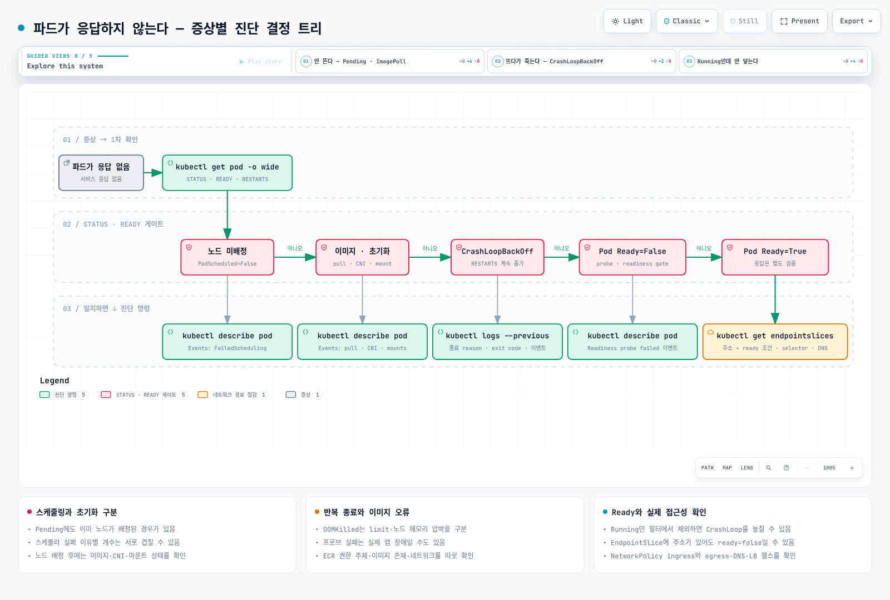

# Kubernetes/EKS 트러블슈팅 플레이북: 증상 → 진단 → 원인 → 조치

> **기존 출력의 기록 버전**: Amazon EKS 1.36의 기존 출력 예시 — 컨트롤 플레인 v1.36.2-eks-bca9cf6, 플랫폼 버전 eks.9, Karpenter 1.4, VPC CNI v1.21, CoreDNS v1.14
> **마지막 검토**: 2026년 9월 11일

< [이전: Zonal 클러스터 운영 전략](15-zonal-operations-guide.md) | [목차](./README.md) >

***

새벽 3시에 알림을 받고 터미널을 열었을 때 필요한 것은 개념 설명이 아니라 **지금 보이는 증상에서 다음에 칠 명령**입니다. 이 문서는 개념이 아니라 **증상**에서 출발합니다. 각 증상마다 "무엇이 보이는가 → 무엇을 치는가 → 출력이 어떻게 나오는가 → 가장 흔한 원인은 무엇이고 어떻게 고치는가"를 한 덩어리로 묶었습니다.

아래 출력은 기존 문서에 기록된 2026년 9월 2일 환경의 예시와 공식 문서의 메시지를 설명하기 위한 것입니다. 이번 검토에서 해당 클러스터를 다시 실행하거나 원본 수집 로그를 재검증하지 않았습니다. 특히 [Karpenter 호환성 표](https://karpenter.sh/docs/upgrading/compatibility/)는 Kubernetes 1.36에 Karpenter 1.13 이상을 요구합니다. 기록된 1.4.0 조합을 지원되는 배포 구성으로 재사용하지 않습니다.

깊은 원인 분석(컨트롤 플레인 로그, CloudWatch Logs Insights 쿼리, 노드 조인 실패 8가지 원인 등)은 이미 [EKS 문제 해결](../eks/09-eks-troubleshooting.md)과 [EKS 고급 디버깅](../eks/11-eks-advanced-debugging.md)에 있습니다. 이 문서는 그 앞단에서 **어느 페이지로 들어가야 하는지를 30초 안에 결정하는 것**이 목적이며, 해당 내용을 반복하지 않고 링크합니다.

## 목차

1. [30초 요약: 증상 → 첫 명령 → 가장 흔한 원인](#30초-요약-증상--첫-명령--가장-흔한-원인)
2. [진단 결정 트리](#진단-결정-트리)
3. [증상별 플레이북](#증상별-플레이북)
4. [kubectl 진단 치트시트](#kubectl-진단-치트시트)
5. [더 깊이 들어가기: 관련 문서](#더-깊이-들어가기-관련-문서)
6. [참고 자료](#참고-자료)

***

<span id="30초-요약-증상--첫-명령--가장-흔한-원인"></span>

## 30초 요약: 증상 → 첫 명령 → 가장 흔한 원인

증상 칸을 클릭하면 아래 해당 플레이북 섹션으로 이동합니다.

| 증상 (`kubectl get pods`/`nodes`에서 보이는 것) | 첫 명령 | 가장 흔한 원인 |
|---|---|---|
| [`Pending`](#1-pod가-pending에서-멈춤) | `kubectl describe pod <pod>` → Events의 `FailedScheduling` 메시지 | 리소스 부족(`Insufficient cpu/memory`), toleration 누락, nodeSelector 불일치, PVC 미바인딩 |
| [`ImagePullBackOff` / `ErrImagePull`](#2-imagepullbackoff--errimagepull) | `kubectl describe pod <pod>` → `Failed to pull image` 줄 | 태그 오타, 프라이빗 레지스트리 인증(imagePullSecrets/노드 IAM), ECR 리전·계정 불일치 |
| [`CrashLoopBackOff`](#3-crashloopbackoff-exit-137-oomkilled-프로브-실패-설정-오류) | `kubectl logs <pod> --previous` + `lastState.terminated` 확인 | 앱 시작 실패(exit 1), `OOMKilled`(exit 137), liveness 프로브 실패, ConfigMap/Secret 누락 |
| [`Running` 인데 READY `0/1`](#4-running인데-ready가-아님--endpoints가-비어-있음) | `kubectl describe pod <pod>` → `Readiness probe failed` | readiness 프로브 경로/포트 오류, 의존 서비스 대기, 사이드카 미준비 |
| [Service로 요청이 안 감](#5-service에-접근이-안-됨) | `kubectl get endpointslices -l kubernetes.io/service-name=<svc>` | 셀렉터 라벨 불일치, `targetPort` 오류, NetworkPolicy 차단, CoreDNS 장애 |
| [Node `NotReady`](#6-node-notready--kubelet-압박-diskpressure-memorypressure-pidpressure) | `kubectl describe node <node>` → Conditions | kubelet 중단/네트워크 단절, `DiskPressure`, `MemoryPressure`, `PIDPressure` |
| [PVC `Pending`](#7-pvc가-pending) | `kubectl describe pvc <pvc>` → Events | `WaitForFirstConsumer`(정상 대기), StorageClass 누락/오타, AZ 불일치 |
| [앱 로그에 `AccessDenied` (AWS API)](#8-eks-irsa--pod-identity-accessdenied) | `kubectl get sa <sa> -o yaml` + 자격 증명 공급자 주입 필드 | IRSA(IAM Roles for Service Accounts) 어노테이션/신뢰 정책 오류, Pod Identity association 누락, 파드 재시작 안 함 |
| [`ContainerCreating`에서 멈춤 + `failed to assign an IP address`](#9-eks-enivpc-cni-ip-고갈) | `kubectl describe pod <pod>` → `FailedCreatePodSandBox` | 서브넷 IP 고갈, 노드 max-pods 도달, `aws-node` 비정상 |
| [Karpenter가 노드를 안 만듦](#10-eks-karpenter가-노드를-만들지-않음) | `kubectl get events -A --field-selector reason=FailedScheduling` | NodePool `limits` 도달, requirements/taint 불일치, 인스턴스 타입 제한 |
| [Service 생성이 `failed calling webhook`으로 거부됨](#11-어떤-service도-만들-수-없음-failed-calling-webhook) | `kubectl -n kube-system get endpointslices -l kubernetes.io/service-name=aws-load-balancer-webhook-service` | 웹훅 Deployment 비정상(CrashLoop)인데 `failurePolicy: Fail` + 전체 네임스페이스 매치 |

***

## 진단 결정 트리



[🔍 인터랙티브 다이어그램 보기](https://www.atomai.click/kubernetes-docs/archmaps/ko-ops-16-troubleshooting-playbook-0.html)

먼저 컨텍스트와 네임스페이스를 확인합니다. `<pod>`, `<ns>` 등은 실제 값으로 치환하는 자리표시자입니다. Pod phase와 컨테이너 상태는 다르므로 `Running`을 전부 제외하면 CrashLoop나 readiness 실패를 놓칠 수 있습니다. 아래는 완료된 파드를 제외하고 phase 또는 Ready 조건이 비정상인 파드를 조회합니다.

```bash
# phase와 Ready 조건을 함께 확인
kubectl get pods -A -o json | jq -r '
  .items[]
  | select(.status.phase != "Succeeded")
  | select(.status.phase != "Running" or
      ([.status.conditions[]? | select(.type == "Ready" and .status == "True")] | length == 0))
  | [.metadata.namespace, .metadata.name, .status.phase,
     ([.status.initContainerStatuses[]?, .status.containerStatuses[]?
       | .state.waiting.reason // empty] | join(","))] | @tsv
'

# 최근 Warning 이벤트 (클러스터 전체, lastTimestamp 기준)
kubectl get events -A --field-selector type=Warning --sort-by=.lastTimestamp | tail -30
```

***

## 증상별 플레이북

<span id="1-pod가-pending에서-멈춤"></span>

### 1. Pod가 `Pending`에서 멈춤

**증상**: `Pending`은 스케줄 대기뿐 아니라 이미지 다운로드·초기화 대기도 포함합니다. `.spec.nodeName`과 `PodScheduled` 조건을 먼저 확인합니다. 노드 미배정이면 스케줄러 이벤트를, 이미 배정됐다면 컨테이너 상태·마운트·CNI 이벤트를 확인합니다.

**진단**: 미스케줄 파드는 `FailedScheduling`에서 단서를 찾습니다. 이 요약은 실패 이유별 노드 수를 집계하므로 이유별 노드 집합이 서로 겹칠 수 있습니다.

```bash
kubectl describe pod <pod> -n <ns> | sed -n '/^Events:/,$p'
```

```
Warning  FailedScheduling  default-scheduler  0/15 nodes are available: 1 Insufficient cpu, 1 Insufficient memory,
  6 node(s) didn't match Pod's node affinity/selector, 8 node(s) had untolerated taint(s).
  no new claims to deallocate, preemption: 0/15 nodes are available:
  1 No preemption victims found for incoming pod, 14 Preemption is not helpful for scheduling.
```

이 출력만으로 CPU와 메모리 부족이 반드시 같은 노드에서 발생했다거나 정확히 한 노드만 다른 제약을 통과했다고 단정하지 않습니다. [스케줄러 집계 코드](https://github.com/kubernetes/kubernetes/blob/v1.36.2/pkg/scheduler/framework/types.go)는 각 노드의 여러 reason을 누적할 수 있습니다. 실제 노드의 라벨·taint·할당량을 대조합니다. DRA 관련 문구는 ResourceClaim 사용 여부와 함께 읽습니다.

**원인과 조치**:

| 메시지 조각 | 원인 | 조치 |
|---|---|---|
| `Insufficient cpu` / `Insufficient memory` | 요청량이 남은 노드 용량보다 큼 | requests 현실화, 오토스케일러 확인(→ [10. Karpenter](#10-eks-karpenter가-노드를-만들지-않음)), `kubectl describe node`의 `Allocated resources` 확인 |
| `Too many pods` | 설정된 노드 max-pods 도달; CNI IP 용량은 별도 확인 | → [9. ENI/IP 고갈](#9-eks-enivpc-cni-ip-고갈) |
| `node(s) had untolerated taint(s)` | 노드 taint에 대한 toleration 없음 | `kubectl get nodes -o custom-columns=NAME:.metadata.name,TAINTS:.spec.taints[*].key`로 taint 확인 후 toleration 추가 또는 NodePool 조정 |
| `node(s) didn't match Pod's node affinity/selector` | nodeSelector/affinity 라벨이 어느 노드에도 없음 | `kubectl get nodes --show-labels`로 라벨 확인. Karpenter라면 well-known 키인지, NodePool template labels/requirements에서 해당 값을 제공하는지 확인 |
| `pod has unbound immediate PersistentVolumeClaims` | PVC가 `Pending` | → [7. PVC Pending](#7-pvc가-pending) |
| `node(s) had volume node affinity conflict` | PV(EBS)가 있는 AZ에 스케줄 가능한 노드가 없음 | PV의 `nodeAffinity` zone 확인 후 해당 AZ에 노드 확보 |
| `node(s) didn't match pod topology spread constraints` / `pod anti-affinity rules` | 분산 제약을 만족하는 노드 없음 | 필요한 노드 추가. topology spread는 가용성 목표를 검토한 후 ScheduleAnyway를 고려하고, pod anti-affinity는 required/preferred 규칙을 별도로 검토 |
| 이벤트가 전혀 없음 | 스케줄러 자체 문제, 또는 `schedulerName` 오타 | `kubectl get pod <pod> -o jsonpath='{.spec.schedulerName}'` 확인 |

<span id="2-imagepullbackoff--errimagepull"></span>

### 2. `ImagePullBackOff` / `ErrImagePull`

**증상**: STATUS가 `ErrImagePull`로 시작해 몇 번 재시도 후 `ImagePullBackOff`로 바뀝니다. kubelet의 pull 재시도 백오프는 최대 5분까지 늘어납니다.

**진단**:

```bash
kubectl describe pod <pod> -n <ns> | grep -A2 -E "Failed to pull|Back-off pulling"
kubectl get pod <pod> -n <ns> -o jsonpath='{range .spec.containers[*]}{.name}{"\t"}{.image}{"\n"}{end}'
kubectl get pod <pod> -n <ns> -o jsonpath='{.spec.imagePullSecrets}'
```

```
Warning  Failed   kubelet  Failed to pull image "123456789012.dkr.ecr.ap-northeast-2.amazonaws.com/app:v1.2.3": ... not found
Warning  Failed   kubelet  Error: ErrImagePull
Normal   BackOff  kubelet  Back-off pulling image "123456789012.dkr.ecr.ap-northeast-2.amazonaws.com/app:v1.2.3"
Warning  Failed   kubelet  Error: ImagePullBackOff
```

정상 pull은 `Pulling image "..."` → `Successfully pulled image "..." in 4.501s ...` 이벤트 쌍으로 남고, 이미 있는 이미지는 `Container image "..." already present on machine` 으로 찍힙니다. 이 이벤트는 다운로드가 성공했다는 뜻입니다. 이미지 안의 실행 파일·아키텍처·설정 문제까지 배제하지는 않습니다.

**원인과 조치**:

| `Failed to pull image` 뒤에 붙는 내용 | 원인 | 조치 |
|---|---|---|
| `not found` / `manifest unknown` | 태그 오타, 아직 push 안 된 태그, 잘못된 리포지토리 | `aws ecr describe-images --repository-name <repo> --image-ids imageTag=<tag>`로 존재 확인 |
| `401 Unauthorized` / `no basic auth credentials` | 프라이빗 레지스트리 인증 실패 | ECR이면 노드 IAM 역할에 `AmazonEC2ContainerRegistryPullOnly`(또는 `ReadOnly`), 외부 레지스트리면 `imagePullSecrets` 확인 |
| 다른 리전/계정의 ECR에서 pull 실패 | 주소 차이 자체는 오류가 아님. 크로스 계정 정책·리전 endpoint 접근 확인 | ECR 리포지토리 정책에 pull 주체 추가 |
| `dial tcp ... i/o timeout` | 프라이빗 서브넷에서 NAT/VPC 엔드포인트 없음 | `com.amazonaws.<region>.ecr.api`, `ecr.dkr`, S3 게이트웨이 엔드포인트 확인 |
| `toomanyrequests` | Docker Hub rate limit | ECR pull-through cache로 미러링 |

노드 진단이 필요하면 먼저 kubelet 이벤트·로그와 이미지 pull에 사용되는 자격 증명 공급자를 확인합니다. `crictl pull`은 kubelet의 ECR credential provider나 Pod의 imagePullSecrets를 자동 재사용하지 않으므로 같은 인증 경로를 재현한다고 가정하지 않습니다. Fargate의 이미지 pull에는 Pod 실행 역할이 쓰이며 애플리케이션의 IRSA 역할과 다릅니다.

<span id="3-crashloopbackoff-exit-137-oomkilled-프로브-실패-설정-오류"></span>

### 3. `CrashLoopBackOff` (exit 137 `OOMKilled`, 프로브 실패, 설정 오류)

**증상**: 컨테이너가 반복 종료하며 RESTARTS가 증가합니다. 일반적인 백오프는 10초부터 두 배씩 증가해 300초에 도달하지만 feature gate와 kubelet 설정에 따라 달라집니다. [Pod lifecycle](https://kubernetes.io/docs/concepts/workloads/pods/pod-lifecycle/)의 restart 정책을 확인합니다.

**진단**: 세 가지를 순서대로 봅니다 — **종료 이유와 exit code**, **이전 컨테이너의 로그**, **Events**.

```bash
# (1) 왜 죽었는가: lastState.terminated
kubectl get pod <pod> -n <ns> -o jsonpath='{range .status.containerStatuses[*]}{.name}{"\t"}restarts={.restartCount}{"\t"}reason={.lastState.terminated.reason}{"\t"}exit={.lastState.terminated.exitCode}{"\n"}{end}'

# (2) 죽기 직전 로그 (현재 컨테이너가 아니라 이전 컨테이너)
kubectl logs <pod> -n <ns> -c <container> --previous --tail=100

# (3) 프로브/킬 이벤트
kubectl describe pod <pod> -n <ns> | sed -n '/^Events:/,$p'
```

기존 문서의 출력 예시 — 메모리 limit 128Mi로 기록된 컨테이너:

```
    Last State:     Terminated
      Reason:       OOMKilled
      Exit Code:    137
      Started:      Mon, 31 Aug 2026 08:55:27 +0000
      Finished:     Tue, 01 Sep 2026 21:13:37 +0000
    Restart Count:  3
```

약 36시간 실행 후 종료됐다는 사실은 즉시 시작 실패와 구분하는 단서입니다. 이것만으로 메모리 누수를 확정하지 않습니다. 트래픽 급증·배치 작업·노드 OOM·limit 변경 등도 확인하고 메모리 시계열과 커널/cgroup 이벤트를 대조합니다.

**exit code 읽는 법**:

| Exit Code | Reason | 의미 | 조치 |
|---|---|---|---|
| `0` | `Completed` | 프로세스가 정상 종료 — Deployment라면 앱이 포그라운드로 안 떠 있음 | 장기 서비스는 엔트리포인트를 포그라운드로, 또는 Job으로 전환 |
| `1` | `Error` | 앱이 스스로 종료 (설정 오류, 의존 서비스 연결 실패) | `logs --previous`에 스택트레이스가 있음 |
| `126` | `Error` | 셸 엔트리포인트에서 커맨드는 찾았지만 실행 불가 — 실행 권한 누락, 또는 셸이 `cannot execute binary file: Exec format error`를 낸 경우(아키텍처 불일치) | Dockerfile에서 `chmod +x`; `kubectl get nodes -L kubernetes.io/arch`로 arm64/amd64 확인 후 멀티아치 이미지 사용 |
| `127` | `Error` | 셸 엔트리포인트에서 커맨드를 찾을 수 없음 — 경로 오타, 또는 최종 이미지 스테이지에 바이너리가 복사되지 않음 | `command`/`args`와 이미지 안의 실제 파일을 비교 (`kubectl debug ... -- ls <path>`) |
| `137` | `OOMKilled` | OOM으로 종료됨. 컨테이너 limit 또는 노드 메모리 압박을 구분 | limit 상향 또는 누수 수정. JVM은 `-XX:MaxRAMPercentage` 확인 → [리소스 최적화](10-resource-optimization.md) |
| `137` | `Error` | limit이 아닌 다른 이유의 SIGKILL — liveness 실패 후 `terminationGracePeriodSeconds` 안에 안 죽음 | preStop/graceful shutdown 점검 |
| `143` | `Error` | SIGTERM을 받고 종료 (정상 롤링/축출 과정일 수 있음) | 반복되면 누가 죽이는지 Events 확인 |

- 셸 없이 바이너리를 직접 실행하는 이미지라면 아키텍처 불일치는 exit 126으로 나오지 않습니다 — 컨테이너가 아예 시작되지 못하고 `lastState.terminated`에 Reason `StartError`, 메시지에 `exec format error`가 찍힙니다. 조치는 같습니다: 멀티아치 이미지, 또는 `kubernetes.io/arch` nodeSelector.

**프로브 실패**: 아래 이벤트는 liveness 검사 실패로 재시작했다는 뜻입니다. 경로·포트 오류뿐 아니라 실제 앱 장애, 과부하, 교착도 원인일 수 있습니다. 프로브를 완화하기 전에 응답과 앱 상태를 확인합니다.

```
Warning  Unhealthy  kubelet  Liveness probe failed: HTTP probe failed with statuscode: 503
Normal   Killing    kubelet  Container app failed liveness probe, will be restarted
```

- 앱 기동이 느려서 죽는다면 liveness의 `initialDelaySeconds`를 늘리는 대신 **`startupProbe`** 를 추가합니다(startupProbe가 성공할 때까지 liveness는 시작되지 않음).
- `Readiness probe failed: dial tcp 10.0.2.45:8080: connect: connection refused`처럼 TCP 거부라면 컨테이너 포트와 프로브 포트가 다른지 먼저 봅니다.

**설정 참조 오류** — 정확히는 CrashLoop이 아니라 `CreateContainerConfigError`로 멈춥니다:

```
Warning  Failed  kubelet  Error: configmap "app-config" not found
Warning  Failed  kubelet  Error: secret "db-credentials" not found
```

`kubectl get cm,secret -n <ns>`로 이름·네임스페이스를 대조하면 끝납니다. 볼륨 마운트로 참조했다면 `FailedMount` 이벤트(`MountVolume.SetUp failed for volume "cfg" : configmap "app-config" not found`)로 나타납니다.

<span id="4-running인데-ready가-아님--endpoints가-비어-있음"></span>

### 4. `Running`인데 READY가 아님 / Endpoints가 비어 있음

**증상**: STATUS는 `Running`인데 READY가 `0/1`(사이드카가 있으면 `1/2`). 일반적인 Service 라우팅에서는 not-ready endpoint가 제외됩니다. publishNotReadyAddresses·종료 중 endpoint·LB fail-open 등 설정은 별도 확인하며 사용자 증상은 프록시에 따라 오류 또는 타임아웃일 수 있습니다.

**진단**:

```bash
kubectl describe pod <pod> -n <ns> | grep -E "Ready|Readiness probe"
kubectl get endpointslices -n <ns> -l kubernetes.io/service-name=<svc>
```

**EndpointSlice의 주소 목록과 Ready 상태는 별개입니다.** selector에 매칭된 not-ready 파드도 주소와 `ready: false`로 포함될 수 있습니다. 기본 표의 ENDPOINTS 열만으로 준비 상태를 판단하지 말고 `ready`, `serving`, `terminating`을 확인합니다.

```bash
kubectl get endpointslices -n <ns> -l kubernetes.io/service-name=<svc> -o json | jq -r '
  .items[] as $slice | $slice.endpoints[]?
  | [$slice.metadata.name, (.addresses | join(",")), (.conditions | tojson)] | @tsv
'
```

`ready` 미설정은 API에서 unknown이며 소비자는 ready로 해석합니다. `publishNotReadyAddresses: true`는 Ready 필터링에 예외를 만들고, 종료 중인 serving endpoint 처리도 프록시에 따라 고려됩니다. selector가 없는 Service는 수동 관리 EndpointSlice 여부를 확인합니다. `v1 Endpoints`는 Kubernetes 1.33부터 deprecated이므로 신규 진단은 EndpointSlice를 사용합니다.

**원인과 조치**:

| 관찰 | 원인 | 조치 |
|---|---|---|
| Events에 `Readiness probe failed` 반복 | 프로브 경로/포트 오류, 앱이 아직 의존 서비스(DB 등) 대기 중 | 프로브 대상 URL을 앱의 실제 헬스 엔드포인트로. 의존성 대기는 readiness에 두고 liveness에서는 빼기 |
| Conditions에 `Ready False`, 사유가 `ReadinessGatesNotReady` | Pod readiness gate 대기 — AWS Load Balancer Controller의 `target-health.elbv2.k8s.aws/*` 게이트가 대표적 | Target Group 헬스체크 실패 원인 확인 → [AWS Load Balancer Controller](../networking/03-aws-lb-controller.md) |
| `1/2` Running, 앱 컨테이너만 Ready | 사이드카(istio-proxy 등) 미준비 또는 사이드카가 앱보다 늦게 떠서 초기 연결 실패 | 사이드카 로그 확인, 주입기·사이드카 버전이 지원하는 시작 순서와 readiness 설정 확인. native sidecar 전환만으로 Ready 실패가 해결되지는 않음 |
| Ready인데도 EndpointSlice가 비어 있음 | Service 셀렉터가 파드 라벨과 불일치 | → [5. Service 접근 불가](#5-service에-접근이-안-됨) |

<span id="5-service에-접근이-안-됨"></span>

### 5. Service에 접근이 안 됨

**증상**: 컨테이너는 `1/1 Running`인데 `curl http://<svc>.<ns>.svc.cluster.local` 이 타임아웃/거절, 또는 이름 풀이 실패.

**진단은 세 층으로 나눕니다**: (a) Service → 파드 매핑, (b) 네트워크 정책, (c) DNS.

```bash
# (a) 셀렉터와 실제 라벨 대조
kubectl get svc <svc> -n <ns> -o jsonpath='{.spec.selector}{"\n"}{.spec.ports}{"\n"}'
kubectl get pods -n <ns> -l <key>=<value> -o wide
kubectl get endpointslices -n <ns> -l kubernetes.io/service-name=<svc>

# (b) 네임스페이스에 걸린 NetworkPolicy
kubectl get networkpolicies -n <ns>
kubectl describe networkpolicy <policy> -n <ns>

# (c) CoreDNS 상태와 로그
kubectl get pods -n kube-system -l k8s-app=kube-dns
kubectl logs -n kube-system -l k8s-app=kube-dns --tail=50
kubectl get cm -n kube-system coredns -o jsonpath='{.data.Corefile}'
```

**원인과 조치**:

| 관찰 | 원인 | 조치 |
|---|---|---|
| 셀렉터 `{"app":"api"}` 인데 파드 라벨은 `app=api-server` | 라벨 불일치 → EndpointSlice 비어 있음 | 라벨/셀렉터 통일. Helm 차트에서 `selectorLabels`와 `podLabels`가 갈라진 경우가 흔함 |
| EndpointSlice에 IP는 있는데 `connection refused` | `targetPort`가 컨테이너가 실제로 listen하는 포트와 다름 | `kubectl get pod <pod> -n <ns> -o jsonpath='{.spec.containers[*].ports}'`와 대조. 앱이 `127.0.0.1`에만 바인딩된 경우도 같은 증상 |
| 특정 네임스페이스에서만 안 됨 | `default-deny` NetworkPolicy가 있고 ingress 허용 규칙 누락 | `podSelector`/`namespaceSelector` 확인. VPC CNI 네트워크 정책은 `kubectl get policyendpoints -n <ns>`로 실제 적용 상태 확인 → [네트워크 정책](../security/04-network-policies.md) |
| `nslookup <svc>` 가 `NXDOMAIN` | 다른 네임스페이스에서 짧은 이름 사용, 또는 CoreDNS 장애 | FQDN(`<svc>.<ns>.svc.cluster.local`) 사용. CoreDNS 파드가 `Running`인지, `/etc/resolv.conf`의 `nameserver`가 kube-dns ClusterIP(이 클러스터는 `172.20.0.10`)인지 확인 |
| 외부 도메인 해석이 느림 | 기본값 `ndots:5` 때문에 점이 5개 미만인 이름은 search 도메인(`<ns>.svc.cluster.local`, `svc.cluster.local`, `cluster.local`, 노드의 VPC 도메인)을 전부 먼저 시도한 뒤에야 절대 이름으로 질의 | 외부 이름 끝에 `.`을 붙이거나 dnsConfig.options에 `name: ndots`, `value: "2"` 설정을 검토 |
| NodePort/LB는 되는데 일부 노드로만 됨 | `externalTrafficPolicy: Local`인데 그 노드에 파드가 없음 | 의도된 동작. 모든 노드 수신이 필요하면 client IP 보존·cross-node 트래픽 영향을 검토해 Cluster 고려 |

DNS를 파드 관점에서 재현하려면 임시 파드를 하나 띄웁니다: `kubectl run -it --rm dns-test --image=busybox:1.36 --restart=Never -- nslookup kubernetes.default.svc.cluster.local`. CoreDNS 개념과 Corefile 구성은 [서비스와 네트워킹](../core/03-services-networking.md#coredns)을 참고합니다.

NetworkPolicy는 목적지 ingress와 출발지 egress를 모두 확인합니다. containerPort 선언은 실제 listen 소켓을 만들지 않으므로 앱 로그나 소켓 상태를 확인합니다. NodeLocal DNSCache를 쓰면 resolv.conf의 nameserver가 kube-dns ClusterIP와 달라도 정상일 수 있습니다.

**Auto Mode의 DNS 진단**: [현재 Auto Mode](https://docs.aws.amazon.com/eks/latest/userguide/auto-networking.html)는 노드 시스템 서비스인 CoreDNS를 사용하므로 순수 Auto Mode에서 kube-dns Pod/Service가 없다는 것만으로 장애라고 판단하지 않습니다. 혼합 클러스터의 일반 노드에는 CoreDNS Deployment가 필요합니다. 위 Pod/ConfigMap 명령은 Deployment 기반 DNS를 확인하는 절차이며, Auto Mode는 파드의 실제 이름 해석과 노드 DNS 로그·상위 resolver 접근을 함께 확인합니다.

<span id="6-node-notready--kubelet-압박-diskpressure-memorypressure-pidpressure"></span>

### 6. Node `NotReady` / kubelet 압박 (`DiskPressure`, `MemoryPressure`, `PIDPressure`)

**증상**: `kubectl get nodes`에 `NotReady`가 보이거나, 노드는 `Ready`인데 파드가 `Evicted`되거나 새 파드가 `node(s) had untolerated taint(s)`로 그 노드를 피합니다.

**진단**:

```bash
# 노드 컨디션 한 줄 요약
kubectl get nodes -o custom-columns='NAME:.metadata.name,READY:.status.conditions[?(@.type=="Ready")].status,MEM:.status.conditions[?(@.type=="MemoryPressure")].status,DISK:.status.conditions[?(@.type=="DiskPressure")].status,PID:.status.conditions[?(@.type=="PIDPressure")].status'

# 컨디션의 reason까지
kubectl get node <node> -o jsonpath='{range .status.conditions[*]}{.type}{"="}{.status}{" ("}{.reason}{")\n"}{end}'

# 노드가 자동으로 받은 taint
kubectl get node <node> -o jsonpath='{.spec.taints}'
```

정상 노드 출력 (EKS Node Monitoring Agent가 붙어 있으면 `ContainerRuntimeReady`/`NetworkingReady`/`KernelReady`/`StorageReady` 컨디션이 추가로 보입니다):

```
MemoryPressure=False (KubeletHasSufficientMemory)
DiskPressure=False (KubeletHasNoDiskPressure)
PIDPressure=False (KubeletHasSufficientPID)
Ready=True (KubeletReady)
ContainerRuntimeReady=True (ContainerRuntimeIsReady)
NetworkingReady=True (NetworkingIsReady)
KernelReady=True (KernelIsReady)
StorageReady=True (DiskIsReady)
```

**원인과 조치**:

| 컨디션 / reason | 자동 taint | 원인 | 조치 |
|---|---|---|---|
| `Ready=Unknown` (`NodeStatusUnknown`, "Kubelet stopped posting node status.") | `node.kubernetes.io/unreachable` | kubelet 프로세스 중단, 인스턴스 정지/네트워크 단절, API 서버 인증 실패 | EC2 인스턴스 상태 확인 → 노드가 응답하면 지원되는 로그 접근 방식 사용. kubelet이 죽으면 debug Pod도 실행되지 않을 수 있음 |
| `Ready=False` | `node.kubernetes.io/not-ready` | 컨테이너 런타임 다운, CNI 미초기화(`aws-node` 비정상) | `kubectl get pods -n kube-system -l k8s-app=aws-node -o wide`로 해당 노드의 aws-node 확인 |
| `DiskPressure=True` (`KubeletHasDiskPressure`) | `node.kubernetes.io/disk-pressure` | 이미지 캐시/컨테이너 로그가 루트 볼륨을 채움 | `crictl rmi --prune`, 로그 로테이션, 루트 EBS 확대. 파드는 `The node was low on resource: ephemeral-storage` 메시지로 `Evicted` |
| `MemoryPressure=True` (`KubeletHasInsufficientMemory`) | `node.kubernetes.io/memory-pressure` | 실제 사용량이 예약을 초과하거나 시스템 예약 부족. limit만 지정하면 request도 기본 지정될 수 있음 | requests 설정 강제(LimitRange), `kube-reserved`/`system-reserved` 확인 |
| `PIDPressure=True` (`KubeletHasInsufficientPID`) | `node.kubernetes.io/pid-pressure` | 포크 폭주(스레드 누수) | 해당 파드 찾아 재시작, `podPidsLimit` 설정 |

아래는 호스트에 셸·journalctl·crictl이 설치된 일반 Linux 워커용 예제이며 privileged 디버그 Pod를 만듭니다. Bottlerocket/EKS Auto Mode의 불변 호스트에 같은 chroot 절차를 가정하지 않습니다. [Auto Mode 진단](https://docs.aws.amazon.com/eks/latest/userguide/auto-troubleshoot.html)의 debug container·콘솔 로그 절차를 사용합니다.

```bash
kubectl debug node/<node> -it --image=busybox --profile=sysadmin -- chroot /host
# 들어간 뒤
journalctl -u kubelet --since "10 min ago" | tail -50
df -h /var/lib/containerd
crictl ps -a | head
```

`kubectl get nodes`에 노드가 **아예 나타나지 않는** 경우(조인 실패: IAM 역할/access entry, 서브넷 라우팅, 보안 그룹, AMI 불일치)는 별도 주제입니다 → [EKS 고급 디버깅 — 노드 조인 실패 진단](../eks/11-eks-advanced-debugging.md#node-join-diagnosis), [EKS 문제 해결 — 노드 및 파드 문제](../eks/09-eks-troubleshooting.md#노드-및-파드-문제). Karpenter 노드라면 [10번](#10-eks-karpenter가-노드를-만들지-않음)의 NodeClaim 확인을 먼저 합니다.

<span id="7-pvc가-pending"></span>

### 7. PVC가 `Pending`

**증상**: `kubectl get pvc`에 `Pending`, 이를 쓰는 파드는 `pod has unbound immediate PersistentVolumeClaims`로 `Pending`.

**진단**:

```bash
kubectl get pvc -n <ns>
kubectl describe pvc <pvc> -n <ns> | sed -n '/^Events:/,$p'
kubectl get storageclass
kubectl get pods -n kube-system -l app=ebs-csi-node -o wide     # 해당 노드에 CSI 노드 플러그인이 있는가
```

```
NAME   PROVISIONER             RECLAIMPOLICY   VOLUMEBINDINGMODE      ALLOWVOLUMEEXPANSION   AGE
gp2    kubernetes.io/aws-ebs   Delete          WaitForFirstConsumer   false                  145d
gp3    ebs.csi.aws.com         Delete          WaitForFirstConsumer   true                   76d
```

위 StorageClass 목록은 환경 예시입니다. Auto Mode의 `ebs.csi.eks.amazonaws.com`과 별도 EBS CSI의 `ebs.csi.aws.com`은 구분합니다. Auto Mode에서는 일반 ebs-csi-node DaemonSet이 없다는 이유만으로 장애라고 판단하지 않습니다. `storageClassName: ""`은 기본 클래스를 사용하지 않겠다는 명시적 요청이므로 필드 생략과도 다릅니다.

**원인과 조치**: `describe pvc`의 Events 메시지가 곧 진단입니다.

| Events 메시지 | 원인 | 조치 |
|---|---|---|
| `WaitForFirstConsumer: waiting for first consumer to be created before binding` | **정상**. `volumeBindingMode: WaitForFirstConsumer`는 파드가 스케줄될 때까지 볼륨을 만들지 않음 | 파드가 없어서 Pending이면 그대로 두면 됨. 파드도 Pending이면 파드 쪽 `FailedScheduling`을 봐야 함 |
| `FailedBinding: no persistent volumes available for this claim and no storage class is set` | `storageClassName`을 안 썼고 기본 StorageClass도 없음 | PVC에 `storageClassName: gp3` 지정, 또는 SC에 `storageclass.kubernetes.io/is-default-class: "true"` 어노테이션 |
| `ProvisioningFailed: storageclass.storage.k8s.io "<name>" not found` | StorageClass 이름 오타, 다른 클러스터에서 가져온 매니페스트 | `kubectl get sc`의 실제 이름으로 수정 |
| `ProvisioningFailed: error generating accessibility requirements: no topology key found for node <node>` | 파드가 배정된 노드에 EBS CSI 노드 플러그인이 아직 등록되지 않음(`CSINode`에 드라이버 없음) | `kubectl get csinode <node>`의 DRIVERS 열 확인, `ebs-csi-node` 데몬셋이 그 노드에 떠 있는지 확인 |
| `ProvisioningFailed` + `UnauthorizedOperation`/`AccessDenied` | EBS CSI 컨트롤러의 IRSA/Pod Identity 권한 없음 | → [8. IRSA/Pod Identity](#8-eks-irsa--pod-identity-accessdenied) — 대상은 `ebs-csi-controller-sa` |
| 파드 쪽 `node(s) had volume node affinity conflict` | 기존 PV(EBS)는 AZ `ap-northeast-2a`에 있는데 스케줄 가능한 노드는 다른 AZ | EBS는 AZ를 못 넘음. `kubectl get pv <pv> -o jsonpath='{.spec.nodeAffinity}'`로 zone 확인 후 해당 AZ에 노드 확보(NodePool zone requirement 또는 nodeSelector) |
| 파드 쪽 `FailedAttachVolume: Multi-Attach error for volume` | RWO 볼륨이 이전 노드에서 아직 detach 안 됨(노드 장애 후 StatefulSet 재스케줄) | `kubectl get volumeattachments`로 stale attachment 확인. 노드가 사라졌으면 attachment가 정리될 때까지 수 분 대기 |

`WaitForFirstConsumer`, StorageClass, 동적 프로비저닝 개념은 [스토리지](../core/04-storage.md#스토리지-클래스storageclass)에, EBS/EFS CSI 오류 패턴은 [EKS 고급 디버깅 — 스토리지](../eks/11-eks-advanced-debugging.md#6-스토리지-문제-해결)에 있습니다.

<span id="8-eks-irsa--pod-identity-accessdenied"></span>

### 8. EKS: IRSA / Pod Identity `AccessDenied`

**증상**: 파드는 정상 `Running`인데 앱 로그에 AWS SDK 오류.

```
An error occurred (AccessDenied) when calling the AssumeRoleWithWebIdentity operation:
  Not authorized to perform sts:AssumeRoleWithWebIdentity
```

또는 S3/DynamoDB 호출 자체가 `... is not authorized to perform: s3:GetObject` 로 거부되는데, 거부된 주체가 서비스 계정 역할이 아니라 **노드 IAM 역할**(`assumed-role/<node-role>/i-0abc...`)인 경우. 이는 SDK가 노드 자격 증명을 선택했다는 단서입니다. 주입 누락 외에도 SDK 버전·공급자 우선순위·명시적 자격 증명을 확인합니다. IMDS 접근이 차단돼 있으면 노드 역할로 폴백하지 못합니다.

**진단** — 어떤 방식을 쓰는지부터 확인합니다. 파드 환경 변수에 답이 있습니다.

```bash
# 서비스 계정 어노테이션 (IRSA)
kubectl get sa <sa> -n <ns> -o jsonpath='{.metadata.annotations.eks\.amazonaws\.com/role-arn}{"\n"}'

# 파드에 주입된 자격 증명 관련 env
kubectl get pod <pod> -n <ns> -o json | jq -r '
  (.spec.initContainers[]?, .spec.containers[]?) as $container
  | $container.env[]?
  | select(.name == "AWS_ROLE_ARN" or .name == "AWS_WEB_IDENTITY_TOKEN_FILE"
        or .name == "AWS_CONTAINER_CREDENTIALS_FULL_URI"
        or .name == "AWS_CONTAINER_AUTHORIZATION_TOKEN_FILE")
  | [$container.name, .name, (.value // "valueFrom")] | @tsv
'
```

| 주입된 env | 방식 | 의미 |
|---|---|---|
| `AWS_ROLE_ARN=arn:aws:iam::...:role/<role>` + `AWS_WEB_IDENTITY_TOKEN_FILE=/var/run/secrets/eks.amazonaws.com/serviceaccount/token` | **IRSA** | pod-identity-webhook이 주입. 없으면 SA 어노테이션이 파드 생성 **이후**에 붙었거나 SA 이름이 다름 |
| `AWS_CONTAINER_CREDENTIALS_FULL_URI` + `AWS_CONTAINER_AUTHORIZATION_TOKEN_FILE` | **EKS Pod Identity** | `eks-pod-identity-agent`가 `169.254.170.23`에서 자격 증명 제공. association이 있어야 주입됨 |
| 둘 다 없음 | 다른 공급자 또는 자격 증명 없음 | 아래 표 참고 |

```bash
# Pod Identity: 에이전트와 association
kubectl get pods -n kube-system -l app.kubernetes.io/name=eks-pod-identity-agent
aws eks list-pod-identity-associations --cluster-name <cluster> --namespace <ns> --service-account <sa>

# IRSA: 신뢰 정책의 OIDC 조건
aws eks describe-cluster --name <cluster> --query 'cluster.identity.oidc.issuer' --output text
aws iam get-role --role-name <role> --query 'Role.AssumeRolePolicyDocument'
```

**원인과 조치**:

| 관찰 | 원인 | 조치 |
|---|---|---|
| env 없음, SA 어노테이션은 있음 | 생성 순서, 실제 serviceAccountName 또는 webhook 주입 설정 문제 | 설정을 확인·수정한 뒤 해당 네임스페이스에서 rollout 영향 검토 후 재생성 |
| env 없음, association도 없음 | Pod Identity association 미생성 또는 다른 SA/네임스페이스로 생성 | `aws eks create-pod-identity-association ...` 후 파드 재시작 |
| `Not authorized to perform sts:AssumeRoleWithWebIdentity` | IRSA 신뢰 정책의 `Federated` OIDC provider ARN 또는 `sub` 조건(`system:serviceaccount:<ns>:<sa>`)/`aud`(`sts.amazonaws.com`) 불일치 | 신뢰 정책 수정. 클러스터를 재생성했다면 OIDC issuer가 바뀌어 provider도 새로 만들어야 함 |
| Pod Identity인데 `AssumeRole` 거부 | 신뢰 정책 Principal이 `pods.eks.amazonaws.com`이 아니거나 `sts:TagSession` 누락 | 신뢰 정책에 `sts:AssumeRole` + `sts:TagSession` 모두 허용 |
| env는 정상, 특정 API만 `AccessDenied` | 권한 정책, 리소스 정책, SCP, boundary, session/VPC endpoint 정책 등의 거부 | 사용 주체와 요청 리소스를 확인하고 명시적 Deny까지 추적. CloudTrail data event는 수집 설정이 필요할 수 있음 |
| Pod Identity env 있는데 SDK가 `Unable to locate credentials` | SDK가 너무 오래되어 컨테이너 자격 증명 공급자(`FULL_URI`)를 지원 안 함 | SDK 업그레이드 — 지원 최소 버전은 EKS 문서 참고 |

IRSA와 Pod Identity의 동작 원리·설정 방법은 [EKS 보안 모범 사례](../security/06-eks-security-best-practices.md#irsa-iam-roles-for-service-accounts)와 [EKS 보안](../eks/05-eks-security.md#eks-pod-identity)에, 토큰 만료·webhook 이슈는 [EKS 고급 디버깅 — 컨트롤 플레인 디버깅](../eks/11-eks-advanced-debugging.md#2-컨트롤-플레인-디버깅)에 있습니다.

<span id="9-eks-enivpc-cni-ip-고갈"></span>

### 9. EKS: ENI/VPC CNI IP 고갈

**증상**: 파드가 `ContainerCreating`에서 멈추고, Events에 `FailedCreatePodSandBox`:

```
Warning  FailedCreatePodSandBox  kubelet  Failed to create pod sandbox: rpc error: code = Unknown desc =
  failed to setup network for sandbox "...": plugin type="aws-cni" name="aws-cni" failed (add):
  add cmd: failed to assign an IP address to container
```

스케줄 단계의 `Too many pods`는 kubelet의 파드 개수 상한에 도달했다는 뜻입니다. IP 부족과 연관될 수 있지만 동일 원인으로 단정하지 않습니다. `FailedCreatePodSandBox`의 CNI 오류는 노드 배정 이후 발생합니다.

**진단**:

```bash
# 노드에 실제 설정된 파드 상한. secondary-IP 기본 계산과 prefix/custom networking 설정을 구분
kubectl get node <node> -o jsonpath='{.status.allocatable.pods}{"\n"}'
kubectl get pods -A --field-selector spec.nodeName=<node>,status.phase!=Succeeded,status.phase!=Failed --no-headers | wc -l

# aws-node 상태와 IPAM 설정
kubectl get pods -n kube-system -l k8s-app=aws-node -o wide
kubectl get ds -n kube-system aws-node -o jsonpath='{range .spec.template.spec.containers[?(@.name=="aws-node")].env[*]}{.name}={.value}{"\n"}{end}' | grep -E "PREFIX|WARM|MINIMUM|CUSTOM_NETWORK"

# 서브넷 잔여 IP
aws ec2 describe-subnets --subnet-ids <subnet-id> --query 'Subnets[].{id:SubnetId,az:AvailabilityZone,free:AvailableIpAddressCount}' --output table
```

IPv4 secondary-IP 모드에서 `WARM_ENI_TARGET=1`은 여분 ENI 용량을 유지하려는 기본 설정입니다. ENI마다 primary IP도 소비되며 m5.xlarge의 15 IPv4 주소 중 일반 파드용 secondary IP는 14개입니다. 양수 `WARM_IP_TARGET`/`MINIMUM_IP_TARGET`은 warm ENI 규칙보다 우선합니다. 예를 들어 warm=3, minimum=6이면 사용 중 1개일 때 총 6개·여분 5개가 필요할 수 있고, 사용 중 5개이면 총 8개·여분 3개를 목표로 합니다. 항상 여분이 정확히 3개라는 뜻이 아닙니다. IPAM 조정 시간·ENI 한계·prefix 단위 할당에 따라 실제 개수는 달라집니다.

**원인과 조치**:

| 관찰 | 원인 | 조치 |
|---|---|---|
| 서브넷 `AvailableIpAddressCount`가 한 자릿수 | 서브넷 자체가 고갈. warm pool이 IP를 선점 | `WARM_IP_TARGET`/`MINIMUM_IP_TARGET`으로 warm pool 축소(위 설정처럼), 보조 CIDR(100.64.0.0/16 등) 추가 후 **custom networking**(`ENIConfig`), 장기적으로 IPv6 |
| 노드 파드 수 = allocatable pods | 설정된 파드 개수 상한. IP 용량과 별도 확인 | 지원·서브넷 여유를 확인한 **prefix delegation**(`ENABLE_PREFIX_DELEGATION=true`, /28 prefix 단위 할당, 지원 인스턴스와 연속된 /28 여유 블록 필요) + max-pods 재계산, 또는 더 큰 인스턴스 |
| `aws-node`가 해당 노드에서 `CrashLoopBackOff` | CNI 자체 장애(IAM 정책 `AmazonEKS_CNI_Policy` 누락, 버전 불일치) | `kubectl logs -n kube-system <aws-node-pod> -c aws-node`, 노드의 `/var/log/aws-routed-eni/ipamd.log` |
| Security Groups for Pods 사용 중 `vpc.amazonaws.com/pod-eni` 부족 | branch ENI 한계 | 트렁크 ENI를 지원하는 인스턴스로, `ENABLE_POD_ENI=true` 확인 |

IPAM 동작(warm pool, prefix delegation, custom networking)은 [VPC CNI — IP 주소 관리](../networking/01-vpc-cni.md#ip-주소-관리)에, 단계별 IP 고갈 대응은 [EKS 고급 디버깅 — 네트워킹 진단](../eks/11-eks-advanced-debugging.md#5-네트워킹-진단)과 [EKS 문제 해결 — VPC CNI 문제](../eks/09-eks-troubleshooting.md#네트워킹-문제)에 있습니다.

<span id="10-eks-karpenter가-노드를-만들지-않음"></span>

### 10. EKS: Karpenter가 노드를 만들지 않음

**증상**: 파드가 `Pending`인데 `kubectl get nodeclaims`에 새 NodeClaim이 생기지 않음. 기본 스케줄러의 `FailedScheduling`과 **별도로** Karpenter가 같은 파드에 자기 이유를 이벤트로 남깁니다.

**진단**:

```bash
# Karpenter가 남긴 이벤트 (source가 karpenter)
kubectl get events -n <ns> --field-selector involvedObject.name=<pod> -o custom-columns=REASON:.reason,SRC:.source.component,MSG:.message

# NodePool limits vs 현재 사용량
kubectl get nodepool -o custom-columns='NAME:.metadata.name,CPU_LIMIT:.spec.limits.cpu,CPU_USED:.status.resources.cpu,MEM_LIMIT:.spec.limits.memory,MEM_USED:.status.resources.memory,READY:.status.conditions[?(@.type=="Ready")].status'

# NodeClaim 진행 단계
kubectl get nodeclaims -o custom-columns='NAME:.metadata.name,TYPE:.metadata.labels.node\.kubernetes\.io/instance-type,LAUNCHED:.status.conditions[?(@.type=="Launched")].status,REGISTERED:.status.conditions[?(@.type=="Registered")].status,READY:.status.conditions[?(@.type=="Ready")].status'

kubectl logs -n kube-system -l app.kubernetes.io/name=karpenter --tail=100
```

기존 문서의 Karpenter 이벤트 예시 (여러 NodePool의 탈락 이유):

```
FailedScheduling  karpenter  Failed to schedule pod, incompatible with nodepool "system",
  daemonset overhead={"cpu":"821m","memory":"1350Mi","pods":"10"}, incompatible requirements,
  label "nvidia.com/device-plugin.config" does not have known values;
  incompatible with nodepool "runner-arm", ..., did not tolerate workload-type=ci-runner:NoSchedule;
  all available instance types exceed limits for nodepool "graviton";
  incompatible with nodepool "gpu-ner", ..., incompatible requirements, key node.kubernetes.io/instance-type,
  node.kubernetes.io/instance-type In [g6e.4xlarge] not in node.kubernetes.io/instance-type In [g6.2xlarge g6.4xlarge g6.xlarge]
```

기존 예시는 CPU_LIMIT 8 / CPU_USED 8을 기록했지만, `exceed limits`가 반드시 현재 사용량=상한을 뜻하지는 않습니다. 남은 여유보다 모든 후보 인스턴스가 크면 상한 미만에서도 같은 오류가 납니다. `Nominated`도 성공 완료가 아니라 스케줄링 후보 지정이므로 NodeClaim의 Launched·Registered·Initialized·Ready와 실제 Pod 배정을 확인합니다.

**원인과 조치**:

| 메시지 조각 | 원인 | 조치 |
|---|---|---|
| `all available instance types exceed limits for nodepool "<np>"` | 후보 인스턴스를 추가하면 NodePool limits 초과 | limit 상향, 또는 consolidation으로 유휴 노드 회수 확인 |
| `label "<key>" does not have known values` | 파드가 요구한 custom label 값을 NodePool template labels/requirements에서 제공하지 않음 | NodePool `spec.template.spec.requirements`에 해당 키 추가(값 목록 포함) |
| `did not tolerate <key>=<value>:NoSchedule` | NodePool `taints`에 대한 toleration 없음 | 의도된 격리라면 다른 NodePool 사용, 아니면 toleration 추가 |
| `key node.kubernetes.io/instance-type, ... In [X] not in ... In [Y Z]` | 파드가 요구한 인스턴스 타입이 NodePool 허용 목록에 없음 | 둘 중 하나를 맞춤. 파드 쪽 requirement가 너무 좁은 경우가 많음 |
| `daemonset overhead={...}`가 크고 `Insufficient` | 데몬셋 예약분을 뺀 뒤 남는 용량이 부족 | 더 큰 인스턴스를 requirements에 포함 |
| NodeClaim `LAUNCHED=True, REGISTERED=False`가 수 분 지속 | EC2는 떴는데 노드가 조인 못 함 (EC2NodeClass의 subnet/SG 셀렉터, 노드 IAM 역할 access entry, AMI) | `kubectl describe nodeclaim <name>`의 Conditions/Events, EC2 콘솔의 시스템 로그 |
| Karpenter 로그에 `InsufficientInstanceCapacity` | 해당 AZ/인스턴스 타입의 EC2 용량 없음 (ICE — Insufficient Capacity Error) | 인스턴스 타입·AZ·capacity-type(spot/on-demand) 범위 확대 |
| 이벤트 없음, Karpenter 로그도 조용 | 파드가 Karpenter 대상이 아님 (`nodeSelector`가 MNG 라벨을 가리킴, 또는 Karpenter와 무관한 스케줄 제약) | 파드 spec에서 노드 관련 제약 전체를 다시 확인 |

NodePool/EC2NodeClass 구조와 상세 문제 해결은 [Karpenter — 문제 해결](../autoscaling/02-karpenter.md#문제-해결)과 [EKS 고급 디버깅 — Karpenter 프로비저닝 문제](../eks/11-eks-advanced-debugging.md#karpenter-프로비저닝-문제)에 있습니다.

<span id="11-어떤-service도-만들-수-없음-failed-calling-webhook"></span>

### 11. 어떤 Service도 만들 수 없음: failed calling webhook

**증상**: 어느 네임스페이스에서든 — 로드밸런서와 아무 상관 없는 네임스페이스라도 — Service를 `kubectl apply`/`create` 하면 API 서버가 거부합니다. Service가 들어 있는 Deployment 배포, Helm 설치, ArgoCD sync가 그 자리에서 멈추는데, **기존 Service는 계속 정상 동작**하므로 파드 상태만 보면 아무 이상이 없습니다.

```
Internal error occurred: failed calling webhook "mservice.elbv2.k8s.aws": failed to call webhook:
  ... no endpoints available for service "aws-load-balancer-webhook-service"
```

**진단**: 메시지 안에 웹훅 이름과 그 뒤의 Service 이름이 다 들어 있습니다. 웹훅 설정 → 웹훅 Service의 endpoints → 그 뒤의 Deployment 순으로 내려갑니다.

```bash
# (1) 어떤 웹훅이 걸려 있고, 각각 실패 시 어떻게 동작하는가 (rules, namespaceSelector, objectSelector, failurePolicy)
kubectl get mutatingwebhookconfigurations,validatingwebhookconfigurations
kubectl get mutatingwebhookconfiguration aws-load-balancer-webhook -o jsonpath='{range .webhooks[*]}{.name}{"\t"}failurePolicy={.failurePolicy}{"\t"}ns={.namespaceSelector}{"\t"}obj={.objectSelector}{"\t"}{.rules[*].operations}{" "}{.rules[*].resources}{"\n"}{end}'

# (2) 웹훅 Service 뒤에 Ready 파드가 있는가
kubectl -n kube-system get endpointslices -l kubernetes.io/service-name=aws-load-balancer-webhook-service

# (3) 그 Deployment는 왜 죽는가
kubectl -n kube-system get pods -l app.kubernetes.io/name=aws-load-balancer-controller
kubectl -n kube-system logs deploy/aws-load-balancer-controller --previous
```

기존 문서에는 2026년 9월 2일 LBC v3.2.1의 반복 종료와 아래 로그가 기록되어 있습니다. 이번 검토에서는 당시 재시작 횟수·지속 시간을 재검증하지 않았으므로 일반적인 재현 결과로 인용하지 않습니다. 여기서 검증할 단서는 설치된 CRD와 컨트롤러가 요청하는 API 버전의 불일치입니다.

```
{"ts":"2026-09-02T07:54:42Z","logger":"setup","msg":"Disabling NLBGatewayAPI: missing required Gateway API CRDs","missing":["TLSRoute","TCPRoute","UDPRoute"]}
{"level":"error","logger":"controller-runtime.source.Kind","msg":"if kind is a CRD, it should be installed before calling Start","kind":"ListenerSet.gateway.networking.k8s.io","error":"no matches for kind \"ListenerSet\" in version \"gateway.networking.k8s.io/v1\""}
{"ts":"2026-09-02T07:57:00Z","level":"error","logger":"setup","msg":"problem running manager","error":"failed to wait for gateway.k8s.aws/alb caches to sync kind source: *v1.ListenerSet: timed out waiting for cache to be synced for Kind *v1.ListenerSet"}
```

`ListenerSet.gateway.networking.k8s.io/v1`을 찾지 못해 컨트롤러의 캐시 동기화가 실패한 로그입니다. **Gateway API 1.5.0에서는 ListenerSet이 standard 채널에 포함**됩니다. [LBC v3.2.1 가이드](https://github.com/kubernetes-sigs/aws-load-balancer-controller/blob/v3.2.1/docs/guide/gateway/gateway.md)의 요구 버전·standard CRD와 LBC 전용 CRD를 확인합니다. TCPRoute·UDPRoute 등 추가 API가 필요할 때만 해당 experimental 배포 요구를 검토합니다. 실제 웹훅의 rules·namespaceSelector·objectSelector·failurePolicy에 매칭되는 요청이 영향을 받습니다. 기존 LB 데이터 경로가 계속 동작할 수 있어도 컨트롤러 장애 중 타겟 갱신·신규 리소스 조정은 중단될 수 있습니다.

**원인과 조치**:

| 관찰 | 원인 | 조치 |
|---|---|---|
| `no endpoints available for service "aws-load-balancer-webhook-service"` | 웹훅 Deployment에 Ready 파드가 0개 (CrashLoop, 스케줄 실패, replicas 0) | **컨트롤러를 먼저 살립니다** (아래 행). 복구 확인은 EndpointSlice의 주소·ready 조건 및 실제 webhook 요청으로 |
| 로그에 `no matches for kind "ListenerSet"` → `timed out waiting for cache to be synced` | 컨트롤러 버전이 요구하는 Gateway API CRD가 미설치 | (a) 그 컨트롤러 버전이 요구하는 Gateway API CRD 설치 — Gateway API 1.5.0의 `ListenerSet`은 standard 채널, (b) CRD를 갖추기 전까지 Helm의 feature-gate 값으로 컨트롤러의 Gateway API 기능을 끈다 (정확한 gate 이름은 해당 버전의 `values.yaml`에서 확인), (c) 설치된 CRD와 맞는 컨트롤러 버전으로 고정 |
| endpoints는 있는데 `connection refused` / `context deadline exceeded` / `x509` | 웹훅 포트로의 경로 차단(NetworkPolicy/보안 그룹), 인증서 만료·불일치 | API 서버 → 파드 웹훅 포트 경로, `clientConfig.caBundle`과 인증서 갱신 상태 확인 |
| 지금 당장 Service를 만들어야 함 | — | **영향 범위를 이해한 의식적인 비상조치로만**: `mservice.elbv2.k8s.aws`의 `failurePolicy`를 `Ignore`로 패치. 그 사이 만든 Service는 컨트롤러의 mutation(기본 `loadBalancerClass` 주입)을 받지 못하므로, 복구 후 **반드시 `Fail`로 되돌리고** 그동안 만든 Service를 점검 |

하지 말아야 할 것: Service에 `app.kubernetes.io/name=aws-load-balancer-controller` 라벨을 붙여 `objectSelector`를 피해 가는 것. 웹훅은 통과하지만 그 Service는 **해당 mutation을 받지 못하고**, 라벨이 거짓말을 하게 됩니다. 이 selector는 컨트롤러 자신의 Service를 만들기 위한 예외일 뿐입니다.

Gateway API 기능을 사용하지 않는 동안 끄기로 결정했다면 v3.2.1 차트의 다음 values를 기존 설정에 병합하고 Helm diff를 검토합니다. 다른 Gateway 리소스를 운영 중인지 먼저 확인합니다.

```yaml
controllerConfig:
  featureGates:
    ALBGatewayAPI: false
    NLBGatewayAPI: false
```

**예방**: webhook Deployment의 가용 복제본과 CrashLoop에 알림을 설정합니다. 예를 들어 kube-state-metrics의 아래 값이 5분 동안 참이면 알리도록 규칙을 구성합니다.

```promql
kube_deployment_status_replicas_available{
  namespace="kube-system", deployment="aws-load-balancer-controller"
} < 1
```

메트릭이 수집되지 않으면 이 식도 결과가 없으므로 별도의 `absent_over_time(...[5m])` 또는 scrape 장애 알림이 필요합니다. Deployment Available만으로 Service selector·인증서·네트워크 경로까지 보장하지는 않습니다. EndpointSlice 조건과 webhook 경로도 점검합니다. 복제본을 여러 AZ에 분산하고 PDB를 적용하면 일부 노드 장애에 도움이 되지만, 모든 복제본의 잘못된 설정을 해결해 주지는 않습니다.

기존 [Pod 네트워크 벤치마크](../networking/06-pod-network-benchmark.md)의 ClusterIP 측정 제외 사유는 해당 문서의 측정 범위로 남깁니다. 이번 검토에서 그 장애를 다시 실행하지는 않았습니다.

***

## kubectl 진단 치트시트

조회 명령과 디버그 작업을 구분합니다. get/describe/logs/top은 조회이며, `kubectl debug`·`kubectl run`은 컨테이너 또는 Pod를 생성합니다. 복제 디버그 Pod의 라벨이 Service selector와 겹치지 않도록 확인하고, 작업 후 생성한 디버그 Pod를 정리합니다. ephemeral container는 해당 Pod에 기록이 남습니다.

```bash
# ── 상태 스캔 ──────────────────────────────────────────────────────────
# 비정상 파드만
kubectl get pods -A -o json | jq -r '
  .items[]
  | select(.status.phase != "Succeeded")
  | select(.status.phase != "Running" or
      ([.status.conditions[]? | select(.type == "Ready" and .status == "True")] | length == 0))
  | [.metadata.namespace, .metadata.name, .status.phase,
     ([.status.initContainerStatuses[]?, .status.containerStatuses[]?
       | .state.waiting.reason // empty] | join(","))] | @tsv
'
# 재시작 횟수 오름차순 정렬이므로 tail을 거치면 가장 많이 재시작한 15개가 마지막에 나옴 + 마지막 종료 이유.
# 첫 번째 컨테이너([0])만 읽으므로 멀티 컨테이너 파드는 나머지 컨테이너를 따로 확인.
kubectl get pods -A --sort-by='.status.containerStatuses[0].restartCount' \
  -o custom-columns='NS:.metadata.namespace,NAME:.metadata.name,RESTARTS:.status.containerStatuses[0].restartCount,REASON:.status.containerStatuses[0].lastState.terminated.reason' | tail -15
# 특정 노드의 파드
kubectl get pods -A --field-selector spec.nodeName=<node> -o wide
# 노드 컨디션 + zone + 인스턴스 타입
kubectl get nodes -o custom-columns='NAME:.metadata.name,READY:.status.conditions[?(@.type=="Ready")].status,DISK:.status.conditions[?(@.type=="DiskPressure")].status,MEM:.status.conditions[?(@.type=="MemoryPressure")].status,ZONE:.metadata.labels.topology\.kubernetes\.io/zone,TYPE:.metadata.labels.node\.kubernetes\.io/instance-type'

# ── 이벤트 ─────────────────────────────────────────────────────────────
kubectl get events -A --field-selector type=Warning --sort-by=.lastTimestamp | tail -30
kubectl get events -n <ns> --field-selector involvedObject.name=<pod>,reason=FailedScheduling
kubectl events -n <ns> --for pod/<pod> --watch          # 특정 객체 실시간 추적
kubectl events -A --types=Warning                       # kubectl events 서브커맨드 (1.26+)

# ── jsonpath로 딱 필요한 필드만 ───────────────────────────────────────
kubectl get pod <pod> -o jsonpath='{.status.containerStatuses[*].lastState.terminated}'
kubectl get pod <pod> -o jsonpath='{range .spec.containers[*]}{.name}{": "}{.resources}{"\n"}{end}'
kubectl get svc <svc> -o jsonpath='{.spec.selector}'
kubectl get sa <sa> -o jsonpath='{.metadata.annotations.eks\.amazonaws\.com/role-arn}'
kubectl get pv <pv> -o jsonpath='{.spec.nodeAffinity.required.nodeSelectorTerms[0].matchExpressions}'

# ── 로그 ───────────────────────────────────────────────────────────────
kubectl logs <pod> -c <container> --previous --tail=100   # 죽은 컨테이너의 로그
kubectl logs -n kube-system -l k8s-app=kube-dns --tail=50  # 라벨로 여러 파드
kubectl logs deploy/<name> --all-containers --since=10m

# ── 디버그 컨테이너 ────────────────────────────────────────────────────
# distroless 파드에 임시 컨테이너 붙이기 (target 런타임 지원 필요)
kubectl debug -it <pod> --image=nicolaka/netshoot --target=<container>
# 셸이 있는 승인된 debug-image로 복제 (복제 라벨·볼륨 접근을 먼저 검토)
kubectl debug <pod> -it --copy-to=<pod>-debug --container=<container> --set-image=<container>=<debug-image> -- sh
# 노드 셸 (SSH 없이). --profile=sysadmin 은 privileged 컨테이너
kubectl debug node/<node> -it --image=busybox --profile=sysadmin -- chroot /host

# ── 리소스 사용량 (metrics-server 필요) ────────────────────────────────
kubectl top nodes
kubectl top pods -n <ns> --sort-by=memory
# metrics-server가 없으면: "error: Metrics API not available"

# ── 스키마 확인 ────────────────────────────────────────────────────────
kubectl explain pod.status.containerStatuses.lastState.terminated
kubectl explain nodepool.spec.limits        # CRD도 동작
kubectl api-resources | grep -E "karpenter|k8s.aws"

# ── 롤아웃 ─────────────────────────────────────────────────────────────
kubectl rollout status deploy/<name> -n <ns>
kubectl rollout history deploy/<name> -n <ns>
```

`kubectl debug`의 `--profile` 값은 `legacy`, `general`, `baseline`, `restricted`, `netadmin`, `sysadmin`이며(기본값은 kubectl 버전에 따라 `legacy` 또는 `general` — `kubectl debug --help`로 확인), restricted 정책을 적용한 네임스페이스에서는 `--profile=restricted`와 호환 이미지·보안 컨텍스트가 필요하며, 다른 admission 정책까지 통과한다는 보장은 없습니다. 노드 디버그의 privileged 작업은 별도 허용이 필요합니다.

***

## 더 깊이 들어가기: 관련 문서

이 플레이북은 "어디로 들어갈지"를 정하는 입구입니다. 원인이 좁혀졌으면 아래 문서로 이동합니다.

| 좁혀진 영역 | 개념 문서 | 심화 문제 해결 |
|---|---|---|
| 파드 라이프사이클, 프로브, 재시작 정책 | [파드와 워크로드](../core/02-pods-and-workloads.md#파드-라이프사이클) | [EKS 고급 디버깅 — 워크로드 디버깅](../eks/11-eks-advanced-debugging.md#4-워크로드-디버깅) |
| Service, EndpointSlice, CoreDNS, NetworkPolicy | [서비스와 네트워킹](../core/03-services-networking.md), [네트워크 정책](../security/04-network-policies.md) | [EKS 문제 해결 — 네트워킹 문제](../eks/09-eks-troubleshooting.md#네트워킹-문제) |
| PV/PVC/StorageClass, EBS CSI | [스토리지](../core/04-storage.md) | [EKS 문제 해결 — 스토리지 문제](../eks/09-eks-troubleshooting.md#스토리지-문제) |
| 노드 조인, kubelet, 리소스 압박 | [클러스터 아키텍처](../core/01-cluster-architecture.md) | [EKS 문제 해결 — 노드 및 파드 문제](../eks/09-eks-troubleshooting.md#노드-및-파드-문제) |
| Karpenter NodePool/NodeClaim | [Karpenter](../autoscaling/02-karpenter.md) | [스케일링 전략](06-scaling-strategies.md) |
| VPC CNI IPAM, prefix delegation, custom networking | [VPC CNI](../networking/01-vpc-cni.md) | [EKS 네트워킹 Part 3: 문제 해결](../eks/03-eks-networking-part3.md) |
| IRSA, Pod Identity, RBAC | [EKS 보안 모범 사례](../security/06-eks-security-best-practices.md), [Kubernetes 인증 및 권한 부여](../security/02-kubernetes-auth-authz.md) | [EKS 문제 해결 — IAM 및 인증 문제](../eks/09-eks-troubleshooting.md#iam-및-인증-문제) |
| 로그가 어디 있고 어떻게 찾는가 | [Logging 개요](../observability/logging/README.md) | [관측성 분석](08-observability-analysis.md) |
| requests/limits, OOM, JVM 메모리 | [리소스 최적화](10-resource-optimization.md) | [EKS 문제 해결 — 성능 문제](../eks/09-eks-troubleshooting.md#성능-문제) |
| 장애 대응 절차, 심각도, 첫 5분 체크리스트 | — | [EKS 고급 디버깅 — 장애 대응 프레임워크](../eks/11-eks-advanced-debugging.md#1-장애-대응-프레임워크) |

***

## 참고 자료

이 문서에 인용한 문자열과 경험 법칙의 근거가 되는 공식 문서입니다.

**Kubernetes**

- [Taints and Tolerations](https://kubernetes.io/docs/concepts/scheduling-eviction/taint-and-toleration/) — 노드 컨트롤러가 자동으로 붙이는 `node.kubernetes.io/*` taint (6번)
- [Debugging Kubernetes Nodes With Kubectl](https://kubernetes.io/docs/tasks/debug/debug-cluster/kubectl-node-debug/), [`kubectl debug` 레퍼런스](https://kubernetes.io/docs/reference/kubectl/generated/kubectl_debug/) — 노드 디버그 파드와 `--profile` 값 (2번, 6번, 치트시트)
- [Debug Running Pods](https://kubernetes.io/docs/tasks/debug/debug-application/debug-running-pod/) — 임시 컨테이너, `--copy-to`, `--target` (치트시트)
- [EndpointSlices](https://kubernetes.io/docs/concepts/services-networking/endpoint-slices/) — `v1 Endpoints`가 1.33부터 deprecated인 이유 (4번)
- [Debug Services](https://kubernetes.io/docs/tasks/debug/debug-application/debug-service/), [Debugging DNS Resolution](https://kubernetes.io/docs/tasks/administer-cluster/dns-debugging-resolution/) — 셀렉터/포트/DNS 점검과 `ndots` (5번)

**Amazon EKS / AWS**

- [Amazon VPC CNI plugin README](https://github.com/aws/amazon-vpc-cni-k8s/blob/master/README.md) — `WARM_ENI_TARGET`, `WARM_IP_TARGET`, `MINIMUM_IP_TARGET`, `ENABLE_PREFIX_DELEGATION`의 의미와 우선순위 (9번)
- [Assign more IP addresses to Amazon EKS nodes with prefixes](https://docs.aws.amazon.com/eks/latest/userguide/cni-increase-ip-addresses.html) — prefix delegation과 max-pods 재계산 (9번)
- [EKS Pod Identity](https://docs.aws.amazon.com/eks/latest/userguide/pod-identities.html), [IAM roles for service accounts](https://docs.aws.amazon.com/eks/latest/userguide/iam-roles-for-service-accounts.html) — 신뢰 정책 형태와 주입되는 환경 변수 (8번)
- [Detect node health issues and enable automatic node repair](https://docs.aws.amazon.com/eks/latest/userguide/node-health.html) — 6번에 나온 Node Monitoring Agent 컨디션
- [Troubleshoot problems with Amazon EKS clusters and nodes](https://docs.aws.amazon.com/eks/latest/userguide/troubleshooting.html) — 노드 조인 실패, `AccessDenied`, CNI 오류
- [Karpenter — Troubleshooting](https://karpenter.sh/docs/troubleshooting/) — NodePool limits, requirements 불일치, NodeClaim 기동/등록 실패 (10번)

***

< [이전: Zonal 클러스터 운영 전략](15-zonal-operations-guide.md) | [목차](./README.md) >
