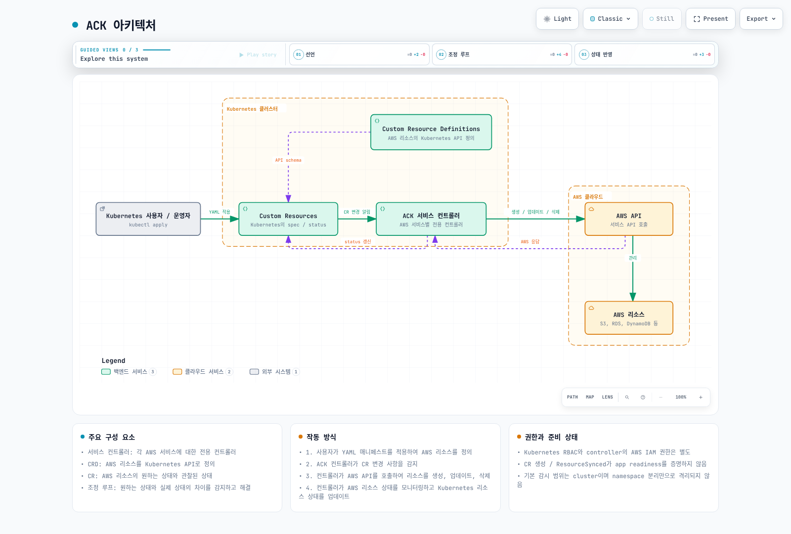

# AWS Controllers for Kubernetes (ACK)

> **검토일**: 2026년 9월 12일

## 개념과 아키텍처

ACK는 Kubernetes custom resource를 AWS API에 연결하는 서비스별 controller입니다. CRD가 입력 구조를 정의하고 controller가 원하는 상태와 AWS의 관찰된 상태를 조정합니다. CR을 생성했다는 사실만으로 AWS 리소스가 준비된 것은 아닙니다. status와 서비스 자체의 상태를 확인해야 합니다.

Kubernetes API·RBAC·GitOps 도구를 재사용할 수 있지만 Kubernetes 권한과 AWS IAM 권한은 별도입니다. 개발자가 작성한 CR은 보통 controller의 AWS 권한으로 처리됩니다. CR 작성 권한을 주는 것은 해당 controller를 통해 AWS 작업을 요청할 수 있게 하는 권한 위임입니다.

ACK가 CloudFormation이나 Terraform의 후속 교체품인 것은 아닙니다. AWS 실제 상태는 AWS에, CR spec/status는 Kubernetes에 존재합니다. controller가 지원하는 필드와 조정 로직에 따라 drift 감지·복구 범위가 달라집니다. 한 AWS 리소스를 여러 도구나 cluster에서 동시에 변경하지 않도록 관리 주체를 정하세요.



[인터랙티브 다이어그램](https://www.atomai.click/kubernetes-docs/archmaps/ko-platform-engineering-02-ack-0.html)

## 버전과 지원 범위

| Controller | Version |
| --- | --- |
| s3 | 1.12.1 |
| iam | 1.9.0 |
| sqs | 1.7.0 |
| sns | 1.10.1 |
| elbv2 | 1.7.0 |
| route53 | 1.6.0 |
| rds | 1.12.0 |

위 버전은 공식 release와 OCI chart를 확인한 검토 기준입니다. 전체 서비스 목록과 Alpha/Beta/GA 상태는 공식 목록에서 확인하세요. GA가 모든 AWS API 기능이나 사용자의 운영 요구를 지원한다는 뜻은 아닙니다. CRD의 v1alpha1 문자열과 controller의 제품 성숙도도 구분합니다.

과거의 Kubernetes 1.16 이상이라는 최소 조건을 현재 운영 기준으로 사용하지 않습니다. 지원 중인 Kubernetes/EKS와 controller release의 호환성, Helm 버전, CRD upgrade 절차를 함께 확인하세요.

## 설치 준비와 오프라인 검사

ACK chart는 아래 OCI 경로를 사용합니다. 예전 eks-charts repository의 s3-chart 경로는 사용하지 않습니다. 아래 명령은 cluster에 설치하지 않고 manifest를 렌더링합니다.

```bash
helm template ack-s3 \
  oci://public.ecr.aws/aws-controllers-k8s/s3-chart \
  --version 1.12.1 --namespace infra \
  --set aws.region=us-west-2 \
  --set installScope=namespace --set watchNamespace=infra \
  --set enableCARM=false --set enableCrossNamespace=false \
  --set serviceAccount.create=false \
  --set serviceAccount.name=ack-s3-controller \
  --set metrics.service.create=true --set deletionPolicy=retain
```

실제 install/upgrade 전에는 infra namespace와 controller ServiceAccount를 준비하고 IRSA 또는 지원되는 EKS Pod Identity 연결을 구성합니다. IRSA는 OIDC trust의 namespace/ServiceAccount 조건을, Pod Identity는 agent·SDK 호환성과 association을 확인합니다. IAM role 생성만으로 ServiceAccount에 권한이 연결되지는 않습니다.

controller의 read/create/update/delete/tag 및 필요한 PassRole 권한을 실제 관리 리소스에 맞춰 검토합니다. AmazonS3FullAccess나 Resource:"*"를 최소 권한 예제로 제시하지 않습니다. 여기의 데이터 접근 policy 예제는 controller 전체 권한을 대체하지 않습니다.

template 성공은 IAM, AWS API 제약, admission, CRD 적용, endpoint 연결성이나 리소스 생성을 검증하지 않습니다. controller 설치와 CRD 변경도 별도 운영 변경입니다.

## namespace와 계정 격리

기본 installScope는 cluster입니다. release namespace만 dev/prod로 나누어 설치하면 두 controller가 같은 CR을 감시할 수 있습니다. 예제는 installScope=namespace, watchNamespace=infra를 지정하고 CARM과 cross-namespace 참조를 끕니다. 다른 팀에는 다른 감시 범위·ServiceAccount·IAM role·RBAC를 사용합니다.

현재 chart는 namespace 모드에서도 namespace cache를 위한 ClusterRole의 namespaces get/list/watch를 렌더링합니다. namespace 모드가 모든 cluster 권한을 제거하는 것은 아닙니다. 실제 렌더링된 Role/ClusterRole/Binding과 Secret·FieldExport 접근을 검토하세요. namespace annotation, 역할 mapping, 참조 대상 변경 권한도 격리 경계에 포함됩니다.

CARM은 별도 target role trust와 AssumeRole 권한, controller 설정이 필요한 cross-account 기능입니다. 여러 cluster가 같은 리소스를 안전하게 공동 수정할 수 있다는 보장이 아닙니다. 읽기 전용 참조와 실제 변경 소유권을 구분합니다.

## 리소스 생성·참조·상태

서비스별 필드는 서로 다릅니다. S3 policy는 Bucket.spec.policy이며 별도의 BucketPolicy CRD가 없습니다. IAM managed policy 연결은 Role의 policies/policyRefs를 사용합니다. SQS Queue의 queueName과 문자열 attribute 필드, SNS Topic/Subscription의 전용 필드는 하위 예제에서 확인하세요.

- [S3 / IAM](ack/01-s3-iam.md)
- [SQS / SNS](ack/02-sqs-sns.md)
- [ELBv2 / Route 53 / Aurora](ack/03-elbv2-route53-rds.md)

```bash
kubectl get buckets.s3.services.k8s.aws -n infra
kubectl get bucket.s3.services.k8s.aws app-data -n infra -o json
kubectl describe bucket.s3.services.k8s.aws app-data -n infra
kubectl logs -n infra \
  -l app.kubernetes.io/instance=ack-s3 --all-containers --tail=100
kubectl get events -n infra \
  --field-selector involvedObject.name=app-data
```

ACK.ResourceSynced=True는 controller의 동기화 조건입니다. DB 연결 성공이나 app readiness를 대신하지 않습니다. ACK.Terminal/ACK.Recoverable 등 다른 조건과 서비스 상태도 확인합니다. ARN은 해당 리소스에서 제공될 때 status.ackResourceMetadata.arn에 있으며, NLB와 TargetGroup의 ARN도 이 경로를 사용합니다.

같은 namespace의 지원되는 Ref 필드로 리소스를 연결할 수 있습니다. 여러 YAML 문서를 함께 적용해도 AWS 전체 작업이 transaction으로 실행되지는 않습니다. 참조 대상 readiness와 외부 ID·ARN을 확인합니다.

## 기존 리소스 가져오기와 삭제 보존

ResourceAdoption 기능에서 아래 annotation을 사용합니다. 현재 S3 chart는 이 feature gate가 활성화되어 있습니다. 리소스 식별자·계정·리전을 검토하고 다른 관리 도구와의 소유권 이전을 준비한 뒤 사용합니다.

```yaml
apiVersion: s3.services.k8s.aws/v1alpha1
kind: Bucket
metadata:
  name: existing-data
  namespace: infra
  annotations:
    services.k8s.aws/adoption-policy: adopt
    services.k8s.aws/adoption-fields: '{"name":"REPLACE_WITH_EXISTING_BUCKET"}'
    services.k8s.aws/deletion-policy: retain
spec:
  name: REPLACE_WITH_EXISTING_BUCKET
```

현재 runtime이 받는 adoption-policy 값은 adopt와 adopt-or-create입니다. adopt는 기존 상태를 읽어 spec/status에 반영하고, adopt-or-create는 없으면 생성할 수 있습니다. 가져온 뒤의 일반 reconcile은 변경을 수행할 수 있으므로 단순 조회 권한으로 생각하지 마세요. read-only는 별도 기능이며 feature gate와 리소스 lifecycle을 확인해야 합니다. 예전 resource-imported:"true" annotation은 이 기능을 구성하지 않습니다. AdoptedResource CR은 공식 문서에서도 이전 방식으로 안내합니다.

삭제 보존 값은 **retain**입니다. orphan은 현재 runtime의 허용 값이 아닙니다. 우선순위는 개별 CR의 services.k8s.aws/deletion-policy, namespace의 서비스별 deletion-policy, controller 기본값 순서입니다. retain은 CR 삭제 시 AWS 리소스를 남기며 이후 비용·소유권·백업 책임이 없어지지 않습니다.

## 관찰·확장·복구

metrics.service.create=true로 실제 Service를 생성하고 아래처럼 대상 namespace와 port 이름을 맞춥니다. Prometheus Operator CRD 및 Prometheus의 ServiceMonitor 선택 설정은 별도 전제입니다.

```yaml
apiVersion: monitoring.coreos.com/v1
kind: ServiceMonitor
metadata:
  name: ack-s3
  namespace: monitoring
spec:
  namespaceSelector:
    matchNames: [infra]
  selector:
    matchLabels:
      app.kubernetes.io/name: s3-chart
      app.kubernetes.io/instance: ack-s3
  endpoints:
    - port: metricsport
      interval: 30s
```

검토한 runtime의 ACK 메트릭은 ack_outbound_api_requests_total과 ack_outbound_api_requests_error_total입니다. 성공/실패 reconcile이나 API latency를 뜻하는 임의 이름을 사용하지 않습니다. controller-runtime 메트릭도 실제 endpoint에서 이름·label·버전을 확인한 뒤 사용합니다. CloudTrail은 해당 서비스/API의 기록 지원과 event 설정 범위 안에서 감사에 사용합니다.

replica 수는 deployment.replicas이며 여러 replica에는 leaderElection.enabled를 함께 검토합니다. replicaCount는 이 chart의 설정이 아닙니다. leader election을 켠 replica 증가는 곧바로 병렬 처리량 증가를 뜻하지 않습니다. reconcile concurrency/resync, API quota·throttling과 자원을 관찰하면서 조정합니다.

Git에 환경별 manifest와 chart 버전을 기록하고 credentials는 저장하지 않습니다. 복구에는 CR뿐 아니라 AWS 데이터·백업·식별자·삭제 정책·관리 소유권이 필요합니다. 다른 region의 CR을 만드는 것만으로 데이터 복제와 복구가 완성되지는 않습니다.

## 문제 해결

생성 실패는 conditions/events, controller image·로그, 계정·region, IAM trust/policy, 참조 대상과 AWS 서비스 제약부터 확인합니다. AccessDenied는 RBAC와 IAM 중 어느 계층인지 구분합니다. Terminating 상태에서는 finalizer가 기다리는 AWS 삭제·dependency·보존 정책을 조사합니다.

finalizer를 비우는 명령을 일반 해결책으로 사용하지 않습니다. 추적되지 않는 AWS 리소스를 남길 수 있으므로 원인을 해결하고, 마지막 수단은 리소스 실제 상태·백업·이후 소유권을 검토한 복구 절차로 수행합니다.

## 검증 범위와 참고 자료

한국어·영어 본문 8개와 퀴즈 2개의 원문 및 56개 고유 code block을 읽었습니다. 공식 OCI chart 7개를 렌더링하고 예제 18개를 versioned CRD와 대조했습니다. 알 수 없는 spec 필드도 별도로 거부하도록 검사했습니다. AWS 리소스 생성, controller 실행, admission/CEL 또는 실제 메시지·DB 연결을 검증한 것은 아닙니다.

- [ACK services](https://aws-controllers-k8s.github.io/community/docs/community/services/)
- [Resource adoption](https://aws-controllers-k8s.github.io/community/docs/user-docs/features/#resourceadoption)
- [Retention](https://aws-controllers-k8s.github.io/community/docs/user-docs/deletion-policy/)
- [S3 chart 1.12.1](https://github.com/aws-controllers-k8s/s3-controller/tree/v1.12.1/helm)
- [Runtime 0.63.0](https://github.com/aws-controllers-k8s/runtime/tree/v0.63.0)

[ACK 퀴즈](../quizzes/platform-engineering/02-ack-quiz.md)
