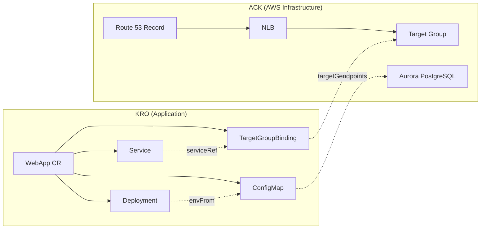

# ExampleCorp 주문 시스템: ACK + KRO 통합 배포

> **마지막 업데이트**: 2026년 2월 21일

## 시나리오 개요

ExampleCorp의 Order API를 Kubernetes에 배포하는 end-to-end 예제입니다. ACK가 AWS 인프라(NLB, Aurora PostgreSQL, Route 53)를 프로비저닝하고, KRO가 애플리케이션 리소스(Deployment, Service, TargetGroupBinding, ConfigMap)를 단일 Custom Resource로 관리합니다.

```
ACK (AWS 인프라)          KRO (앱 배포)
─────────────────       ─────────────────
NLB + TargetGroup  ←──  TargetGroupBinding
Aurora PostgreSQL  ←──  ConfigMap (endpoints)
Route 53 Record         Deployment + Service
```

ACK는 [ACK 문서](./02-ack.md)에서 설명한 ELBv2, Route 53, RDS 컨트롤러를 사용하여 인프라를 생성하고, KRO는 이 인프라를 참조하는 애플리케이션 리소스를 단일 CR로 관리합니다.

## 아키텍처 다이어그램



## Step 1: ACK로 인프라 프로비저닝

ACK 컨트롤러(elbv2, route53, rds)를 사용하여 다음 인프라를 프로비저닝합니다. 각 리소스의 상세 YAML은 [ACK 리소스 예제](./ack/03-elbv2-route53-rds.md)를 참조하세요.

- **NLB + TargetGroup + Listener**: 애플리케이션 트래픽 수신
- **Route 53 DNS Record**: `app.example.com` → NLB 매핑
- **Aurora PostgreSQL**: DBSubnetGroup + DBCluster + Writer + 2 Reader + Custom Endpoint

## Step 2: KRO ResourceGraphDefinition

```yaml
apiVersion: kro.run/v1alpha1
kind: ResourceGraphDefinition
metadata:
  name: webapp-graph
spec:
  resourceKind:
    group: kro.example.com
    kind: WebApp
    version: v1
  childResources:
    # 1. ConfigMap — Aurora 접속 정보
    - apiVersion: v1
      kind: ConfigMap
      nameTemplate: "{{.parent.metadata.name}}-db-config"
      template: |
        data:
          DB_WRITER_HOST: "{{.parent.spec.aurora.writerEndpoint}}"
          DB_READER_HOST: "{{.parent.spec.aurora.readerEndpoint}}"
          DB_PORT: "{{.parent.spec.aurora.port}}"
          DB_NAME: "{{.parent.spec.aurora.dbName}}"

    # 2. Deployment — 앱 컨테이너
    - apiVersion: apps/v1
      kind: Deployment
      nameTemplate: "{{.parent.metadata.name}}"
      template: |
        spec:
          replicas: {{.parent.spec.replicas}}
          selector:
            matchLabels:
              app: {{.parent.spec.appName}}
          template:
            metadata:
              labels:
                app: {{.parent.spec.appName}}
            spec:
              containers:
              - name: {{.parent.spec.appName}}
                image: {{.parent.spec.image}}
                ports:
                - containerPort: {{.parent.spec.port}}
                envFrom:
                - configMapRef:
                    name: {{.children.configmap.metadata.name}}

    # 3. Service — ClusterIP
    - apiVersion: v1
      kind: Service
      nameTemplate: "{{.parent.metadata.name}}"
      template: |
        spec:
          selector:
            app: {{.parent.spec.appName}}
          ports:
          - port: {{.parent.spec.port}}
            targetPort: {{.parent.spec.port}}
          type: ClusterIP

    # 4. TargetGroupBinding — ACK Target Group 연결
    - apiVersion: elbv2.k8s.aws/v1beta1
      kind: TargetGroupBinding
      nameTemplate: "{{.parent.metadata.name}}-tgb"
      template: |
        spec:
          targetGroupARN: {{.parent.spec.targetGroupARN}}
          serviceRef:
            name: {{.children.service.metadata.name}}
            port: {{.parent.spec.port}}
          targetType: ip

  statusMappings:
    - childResource:
        kind: Deployment
        name: "{{.parent.metadata.name}}"
      conditions:
        - type: Available
          mapping:
            type: Ready
    - childResource:
        kind: Service
        name: "{{.parent.metadata.name}}"
      fieldMappings:
        - child: "spec.clusterIP"
          parent: "status.serviceIP"
```

### 입력 필드 설명

| 필드 | 설명 |
|------|------|
| `appName` | 애플리케이션 이름 (레이블, 셀렉터에 사용) |
| `image` | 컨테이너 이미지 URI |
| `replicas` | Deployment 레플리카 수 |
| `port` | 컨테이너 및 서비스 포트 |
| `targetGroupARN` | ACK가 생성한 Target Group ARN |
| `aurora.writerEndpoint` | ACK DBCluster의 Writer 엔드포인트 |
| `aurora.readerEndpoint` | ACK DBCluster의 Reader 엔드포인트 |
| `aurora.port` | Aurora 포트 (기본 5432) |
| `aurora.dbName` | 데이터베이스 이름 |

## Step 3: 앱 배포

```yaml
apiVersion: kro.example.com/v1
kind: WebApp
metadata:
  name: order-api
  namespace: production
spec:
  appName: order-api
  image: 123456789012.dkr.ecr.ap-northeast-2.amazonaws.com/order-api:v1.2.0
  replicas: 3
  port: 8080
  targetGroupARN: <ACK TargetGroup의 .status.targetGroupARN>
  aurora:
    writerEndpoint: <ACK DBCluster의 .status.endpoint>
    readerEndpoint: <ACK DBCluster의 .status.readerEndpoint>
    port: "5432"
    dbName: orders
```

ACK가 생성한 인프라의 출력값(Target Group ARN, Aurora 엔드포인트)을 KRO CR의 spec에 주입합니다.

## Step 4: 검증

```bash
# WebApp CR 상태 확인
kubectl get webapp order-api -n production -o yaml

# 생성된 리소스 확인
kubectl get deploy,svc,targetgroupbinding,configmap -n production -l app=order-api
```

## 운영 패턴

### 새 서비스 추가
기존 인프라를 재사용하여 새로운 WebApp CR만 추가하면 됩니다:

```yaml
apiVersion: kro.example.com/v1
kind: WebApp
metadata:
  name: payment-api
  namespace: production
spec:
  appName: payment-api
  image: 123456789012.dkr.ecr.ap-northeast-2.amazonaws.com/payment-api:v1.0.0
  replicas: 2
  port: 8080
  targetGroupARN: <새로운 Target Group ARN>
  aurora:
    writerEndpoint: <기존 Aurora Writer Endpoint>
    readerEndpoint: <기존 Aurora Reader Endpoint>
    port: "5432"
    dbName: payments
```

### Aurora 스케일링
ACK DBInstance를 추가하여 Read Replica를 수평 확장합니다:

```yaml
apiVersion: rds.services.k8s.aws/v1alpha1
kind: DBInstance
metadata:
  name: my-aurora-reader-3
  namespace: infra
spec:
  dbInstanceIdentifier: my-aurora-reader-3
  dbClusterIdentifier: my-aurora-cluster
  dbInstanceClass: db.r6g.xlarge
  engine: aurora-postgresql
```

### Blue/Green 배포
KRO CR을 교체하여 무중단 배포를 수행합니다. 새로운 버전의 CR을 적용하면 KRO가 자동으로 Deployment를 업데이트합니다.

## 참고 문서

- [ACK 개념 및 설치](./02-ack.md)
- [ACK 리소스 예제: ELBv2, Route 53, RDS](./ack/03-elbv2-route53-rds.md)
- [KRO 개념 및 RGD](./03-kro.md)
