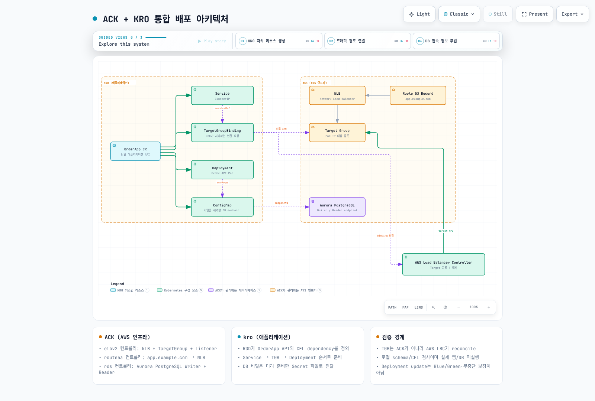

# ExampleCorp 주문 시스템: ACK + kro 통합 구성

> **검토일**: 2026년 9월 12일 · kro 0.9.4 / AWS Load Balancer Controller 3.5.0

## 시나리오와 검증 범위

ExampleCorp는 학습용 가상 조직입니다. 이 문서는 ACK가 생성한 AWS 인프라에 kro 애플리케이션 그래프를 연결하는 구성 계약이며, 동작하는 Order API 구현이나 공개 이미지를 제공하는 end-to-end 실습은 아닙니다. 원문의 가상 ECR 이미지가 실행 가능하다고 표시하지 않습니다.

ACK는 NLB·TargetGroup·Listener, Route 53 record와 Aurora를 관리합니다. kro는 Service, ConfigMap, TargetGroupBinding(TGB), Deployment를 만듭니다. **TGB를 보고 Pod IP를 target에 등록·해제하는 주체는 별도의 AWS Load Balancer Controller(LBC)**입니다. ACK와 kro만 설치해서는 이 연결이 작동하지 않습니다.



[인터랙티브 다이어그램](https://www.atomai.click/kubernetes-docs/archmaps/ko-platform-engineering-05-example-corp-app-0.html)

## 인프라와 애플리케이션 전제

[ACK 리소스 예제](ack/03-elbv2-route53-rds.md)의 현재 schema와 lifecycle 설명을 먼저 확인합니다. 승인된 VPC/private subnet/security group, 내부 NLB와 Listener, ip TargetGroup, DNS, Aurora DB cluster/instance를 준비해야 합니다. `.status.ackResourceMetadata.arn`에서 TargetGroup ARN을 확인하며 예전 `.status.targetGroupARN`을 사용하지 않습니다.

AWS LBC의 버전과 CRD, IAM·ServiceAccount와 webhook을 별도로 준비합니다. 여기서는 OSS LBC 3.5.0의 elbv2.k8s.aws/v1beta1 TGB를 검증했으며 EKS Auto Mode의 별도 load-balancing API와 혼용하지 않습니다. TGB 작성자는 controller IAM 범위의 TargetGroup을 참조할 수 있으므로 허용 ARN·namespace와 작성 권한을 제한해야 합니다.

Order API image는 운영자가 제공해야 하며 다음 계약을 충족해야 합니다.

- 설정한 port에서 HTTP를 받고 `/readyz`가 준비 상태를 나타냅니다.
- ConfigMap의 DB_WRITER_HOST, DB_READER_HOST, DB_PORT, DB_NAME을 읽습니다.
- DB_CREDENTIALS_DIR 아래 Secret 파일에서 인증 정보를 읽고 회전을 처리합니다. 비밀번호를 환경 변수·ConfigMap·status에 넣지 않습니다.
- UID 10001, 읽기 전용 root와 제한된 resource, /tmp 쓰기 volume에서 동작해야 합니다. 실제 image가 다르면 보안 정책에 맞춰 계약을 조정합니다.

production namespace와 order-db-credentials Secret을 승인된 provider/ESO 경로로 먼저 준비합니다. RDS가 Secrets Manager에 master credential을 관리한다고 Kubernetes Secret이 자동 생성되는 것은 아닙니다. app 사용자·DB 생성, 최소 DB 권한, TLS 검증과 connection pool도 별도입니다. DB 이름을 CR에 적는 것만으로 해당 database를 생성하지 않습니다.

## readiness gate와 생성 순서

LBC의 Pod readiness gate를 사용하려면 namespace에 elbv2.k8s.aws/pod-readiness-gate-inject=enabled를 **Pod 생성 전** 설정하고, Pod label과 맞는 Service 및 그 Service의 ip TGB가 먼저 있어야 합니다. 이 예제는 Service → TGB → Deployment의 CEL dependency를 둡니다. Deployment의 metadata annotation이 TGB 이름을 참조하여 이 순서를 만듭니다.

TGB에는 target이 healthy해질 때까지 기다리는 readyWhen을 넣지 않았습니다. Pod 생성이 TGB health를 기다리면 Pod가 없어 target도 healthy해질 수 없는 순환 대기가 생길 수 있습니다. TGB 객체 존재, LBC 조정, target health, Pod readiness는 서로 다른 상태입니다. webhook failurePolicy와 실제 주입 여부, rollout·종료 grace·deregistration delay를 검증해야 합니다.

## ResourceGraphDefinition

아래 파일과 인스턴스는 examples/platform/examplecorp에도 있습니다. kro aggregation RBAC에는 OrderApp API/status/finalizers와 Service·ConfigMap·Deployment·TGB 권한을 검토하여 추가합니다. RGD를 만들 수 있는 사용자가 controller 권한을 위임받는다는 점도 고려합니다.

```yaml
apiVersion: kro.run/v1alpha1
kind: ResourceGraphDefinition
metadata:
  name: examplecorp-webapps
spec:
  schema:
    apiVersion: v1alpha1
    group: platform.example.com
    kind: OrderApp
    scope: Namespaced
    spec:
      replicas: integer | default=3 minimum=1 maximum=10
      image: string | required=true
      port: integer | default=8080 minimum=1 maximum=65535
      targetGroupARN: string | required=true
      vpcID: string | required=true
      credentialsSecretName: string | required=true
      aurora:
        writerEndpoint: string | required=true
        readerEndpoint: string | required=true
        port: integer | default=5432
        dbName: string | required=true
    status:
      availableReplicas: ${deployment.status.availableReplicas}
      serviceIP: ${service.spec.clusterIP}
  resources:
  - id: service
    template:
      apiVersion: v1
      kind: Service
      metadata:
        name: ${schema.metadata.name}
        namespace: ${schema.metadata.namespace}
        labels:
          app.kubernetes.io/name: ${schema.metadata.name}
      spec:
        type: ClusterIP
        selector:
          app.kubernetes.io/name: ${schema.metadata.name}
        ports:
        - name: http
          port: ${schema.spec.port}
          targetPort: http
  - id: dbConfig
    template:
      apiVersion: v1
      kind: ConfigMap
      metadata:
        name: ${schema.metadata.name + "-db"}
        namespace: ${schema.metadata.namespace}
        labels:
          app.kubernetes.io/name: ${schema.metadata.name}
      data:
        DB_WRITER_HOST: ${schema.spec.aurora.writerEndpoint}
        DB_READER_HOST: ${schema.spec.aurora.readerEndpoint}
        DB_PORT: ${string(schema.spec.aurora.port)}
        DB_NAME: ${schema.spec.aurora.dbName}
  - id: targetGroupBinding
    template:
      apiVersion: elbv2.k8s.aws/v1beta1
      kind: TargetGroupBinding
      metadata:
        name: ${schema.metadata.name + "-tgb"}
        namespace: ${schema.metadata.namespace}
        labels:
          app.kubernetes.io/name: ${schema.metadata.name}
      spec:
        targetGroupARN: ${schema.spec.targetGroupARN}
        targetType: ip
        vpcID: ${schema.spec.vpcID}
        serviceRef:
          name: ${service.metadata.name}
          port: ${schema.spec.port}
  - id: deployment
    readyWhen:
    - ${deployment.status.availableReplicas >= deployment.spec.replicas}
    - ${deployment.status.observedGeneration >= deployment.metadata.generation}
    template:
      apiVersion: apps/v1
      kind: Deployment
      metadata:
        name: ${schema.metadata.name}
        namespace: ${schema.metadata.namespace}
        labels:
          app.kubernetes.io/name: ${schema.metadata.name}
      spec:
        replicas: ${schema.spec.replicas}
        selector:
          matchLabels:
            app.kubernetes.io/name: ${schema.metadata.name}
        template:
          metadata:
            labels:
              app.kubernetes.io/name: ${schema.metadata.name}
            annotations:
              platform.example.com/target-group-binding: ${targetGroupBinding.metadata.name}
          spec:
            automountServiceAccountToken: false
            securityContext:
              runAsNonRoot: true
              runAsUser: 10001
              runAsGroup: 10001
              fsGroup: 10001
              seccompProfile:
                type: RuntimeDefault
            containers:
            - name: order-api
              image: ${schema.spec.image}
              ports:
              - name: http
                containerPort: ${schema.spec.port}
              securityContext:
                allowPrivilegeEscalation: false
                readOnlyRootFilesystem: true
                capabilities:
                  drop:
                  - ALL
              resources:
                requests:
                  cpu: 100m
                  memory: 64Mi
                limits:
                  cpu: 500m
                  memory: 128Mi
              readinessProbe:
                httpGet:
                  path: /readyz
                  port: http
              volumeMounts:
              - name: tmp
                mountPath: /tmp
              - name: db-credentials
                mountPath: /var/run/order-db
                readOnly: true
              envFrom:
              - configMapRef:
                  name: ${dbConfig.metadata.name}
              env:
              - name: DB_CREDENTIALS_DIR
                value: /var/run/order-db
            volumes:
            - name: tmp
              emptyDir:
                sizeLimit: 64Mi
            - name: db-credentials
              secret:
                secretName: ${schema.spec.credentialsSecretName}
```

## 인스턴스 입력

아래 example.invalid 주소와 이미지, ARN·VPC ID는 치환해야 하는 예시 값입니다. ACK status에서 실제 endpoint/ARN을 읽고 app image digest와 Secret 이름을 검증한 뒤 사용합니다. 수동으로 복사한 endpoint는 ACK 변경 시 자동 갱신되지 않으므로 승인된 GitOps 입력 갱신 경로가 필요합니다.

```yaml
apiVersion: platform.example.com/v1alpha1
kind: OrderApp
metadata:
  name: order-api
  namespace: production
spec:
  replicas: 3
  image: example.invalid/order-api:replace-with-reviewed-image
  port: 8080
  targetGroupARN: arn:aws:elasticloadbalancing:us-west-2:123456789012:targetgroup/replace-with-approved-tg/0123456789abcdef
  vpcID: vpc-0123456789abcdef0
  credentialsSecretName: order-db-credentials
  aurora:
    writerEndpoint: replace-with-writer-endpoint.example.invalid
    readerEndpoint: replace-with-reader-endpoint.example.invalid
    port: 5432
    dbName: orders
```

## 검증과 운영

```bash
kubectl get orderapps.platform.example.com order-api -n production -o yaml
kubectl get deploy,svc,targetgroupbindings.elbv2.k8s.aws,configmap \
  -n production -l app.kubernetes.io/name=order-api
kubectl get pods -n production -l app.kubernetes.io/name=order-api -o wide
```

CR conditions와 Deployment뿐 아니라 Pod readiness gates, EndpointSlice, TGB 상태, AWS target health, DNS·HTTP와 DB TLS 연결을 확인합니다. readiness endpoint가 DB 연결을 검증하는지는 실제 app 계약에 달려 있습니다. label은 모든 생성 리소스 metadata에 동일하게 넣어 조회가 맞도록 했습니다.

새 payment 서비스에는 검증한 image와 별도 TargetGroup·Listener routing, DB 사용자/권한·schema 계약이 필요합니다. 동일 Aurora cluster 사용이 데이터·성능·비용 격리를 보장하지 않습니다. 같은 TargetGroup을 여러 TGB/cluster가 공유하면 LBC의 multiClusterTargetGroup lifecycle을 별도로 검토합니다. 기본 소유 모델을 무시하면 다른 target이 해제될 수 있습니다.

Aurora replica는 ACK DBInstance와 지원 class/region으로 추가할 수 있지만 writer 역할은 이름/tag로 고정되지 않습니다. 기존 [RDS 예제](ack/03-elbv2-route53-rds.md)의 promotionTier, endpoint와 failover 설명을 따르고 실제 부하·복구를 검증합니다.

Deployment image 갱신은 보통 RollingUpdate이며 Blue/Green이나 무중단을 자동 보장하지 않습니다. Blue/Green은 별도 app 버전·target/routing 전환, 검증 지표와 rollback 조건, DB 호환성을 설계해야 합니다. CR 삭제·교체가 child TGB/Deployment와 target 연결을 정리할 수 있으므로 가벼운 버전 전환 명령처럼 사용하지 않습니다.

## 수행한 검증

두 원문 문서와 모든 예제를 읽고 현재 RGD·TGB schema를 대조했습니다. cel-go로 21개 고유 식을 컴파일·평가하여 4개 리소스, Service/Pod selector, ConfigMap/Service 참조, TGB 선행 dependency와 status를 확인했습니다. 이것은 합성 입력의 로컬 검사입니다. AWS 리소스, app image, DB, LBC target health나 실제 Pod 주입·트래픽은 실행하지 않았습니다.

- [ACK](02-ack.md)
- [kro](03-kro.md)
- [AWS LBC 3.5.0 TGB](https://github.com/kubernetes-sigs/aws-load-balancer-controller/blob/v3.5.0/docs/guide/targetgroupbinding/targetgroupbinding.md)
- [Pod readiness gates](https://github.com/kubernetes-sigs/aws-load-balancer-controller/blob/v3.5.0/docs/deploy/pod_readiness_gate.md)
