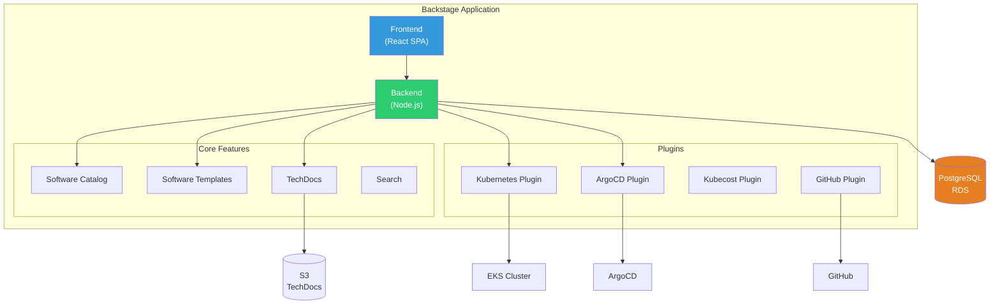
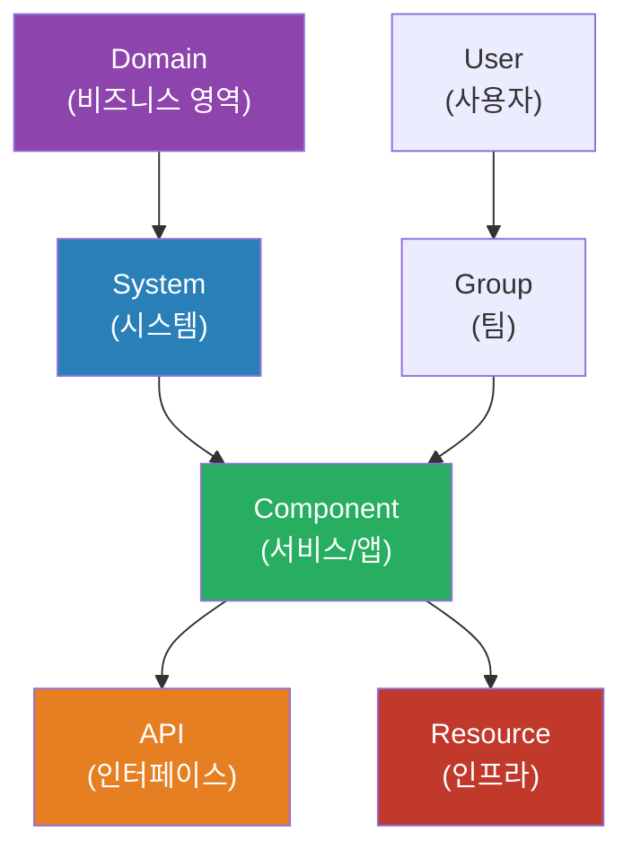

# Backstage: Internal Developer Platform on EKS

> **지원 버전**: Backstage 1.26+, Kubernetes 1.28+, EKS
> **마지막 업데이트**: 2026년 4월 25일

---

## 개요

Backstage는 Spotify에서 개발하고 CNCF에 기부한 오픈소스 **Internal Developer Platform(IDP)** 프레임워크입니다. Software Catalog, Software Templates(Golden Paths), TechDocs를 핵심으로 개발자 경험(DX)을 표준화하고, 플러그인 생태계를 통해 조직의 모든 인프라 도구를 단일 포털로 통합합니다.

### 학습 목표

- Backstage IDP 아키텍처와 핵심 개념 이해
- EKS에 Backstage를 프로덕션 레벨로 배포
- Software Catalog를 통한 서비스 자산 관리
- Software Templates로 Golden Path 표준화
- ArgoCD, Kubecost, Kubernetes 플러그인 통합
- RBAC과 거버넌스 구성

---

## 1. IDP 플랫폼 비교

| 기준 | Backstage | Port | Cortex | 자체 구축 |
|------|-----------|------|--------|----------|
| 라이선스 | Apache 2.0 (CNCF) | 상용 (Free tier) | 상용 | - |
| 커스터마이징 | 매우 높음 (React 플러그인) | 중간 (설정 기반) | 낮음 | 무제한 |
| 플러그인 생태계 | 200+ 커뮤니티 플러그인 | 내장 통합 | 내장 통합 | 직접 구축 |
| 운영 부담 | 높음 (자체 호스팅) | 낮음 (SaaS) | 낮음 (SaaS) | 매우 높음 |
| K8s 통합 | 네이티브 플러그인 | API 기반 | API 기반 | 직접 구현 |
| 초기 구축 시간 | 2-4주 | 1-2주 | 1-2주 | 2-6개월 |

---

## 2. Backstage 아키텍처



### 핵심 개념

| 개념 | 설명 |
|------|------|
| **Software Catalog** | 조직의 모든 서비스, API, 인프라, 팀 정보를 중앙에서 관리 |
| **Software Templates** | 새 서비스/인프라를 표준화된 방식으로 생성 (Golden Path) |
| **TechDocs** | MkDocs 기반 기술 문서를 카탈로그와 통합 |
| **Plugin System** | React 프론트엔드 + Node.js 백엔드 플러그인으로 확장 |
| **Entity** | 카탈로그의 기본 단위 (Component, API, System, Domain 등) |

---

## 3. EKS에 Backstage 배포

### 3.1 사전 요구 사항

- EKS 클러스터 (1.28+)
- Amazon RDS PostgreSQL (13+)
- Amazon S3 버킷 (TechDocs 저장)
- AWS Load Balancer Controller (ALB Ingress)
- ECR 레포지토리
- OIDC Provider (Cognito 또는 Okta)

### 3.2 Backstage 앱 생성

```bash
# Backstage CLI로 앱 생성
npx @backstage/create-app@latest --name my-backstage

cd my-backstage

# 필수 플러그인 설치
yarn --cwd packages/backend add @backstage/plugin-kubernetes-backend
yarn --cwd packages/app add @backstage/plugin-kubernetes
yarn --cwd packages/app add @roadiehq/backstage-plugin-argo-cd
```

### 3.3 Dockerfile

```dockerfile
FROM node:20-bookworm-slim AS build

WORKDIR /app
COPY . .

RUN yarn install --frozen-lockfile
RUN yarn tsc
RUN yarn build:backend --config app-config.yaml --config app-config.production.yaml

FROM node:20-bookworm-slim

RUN apt-get update && apt-get install -y python3 build-essential && rm -rf /var/lib/apt/lists/*

WORKDIR /app

COPY --from=build /app/yarn.lock /app/package.json /app/packages/backend/dist ./packages/backend/dist
COPY --from=build /app/plugins ./plugins

RUN yarn install --frozen-lockfile --production

CMD ["node", "packages/backend", "--config", "app-config.yaml", "--config", "app-config.production.yaml"]
```

### 3.4 Helm을 사용한 EKS 배포

**values.yaml:**

```yaml
backstage:
  image:
    registry: 123456789012.dkr.ecr.ap-northeast-2.amazonaws.com
    repository: backstage
    tag: "1.26.0"
  
  replicas: 2
  
  resources:
    requests:
      cpu: 500m
      memory: 1Gi
    limits:
      cpu: 2000m
      memory: 2Gi
  
  extraEnvVars:
    - name: POSTGRES_HOST
      valueFrom:
        secretKeyRef:
          name: backstage-db-credentials
          key: host
    - name: POSTGRES_USER
      valueFrom:
        secretKeyRef:
          name: backstage-db-credentials
          key: username
    - name: POSTGRES_PASSWORD
      valueFrom:
        secretKeyRef:
          name: backstage-db-credentials
          key: password

  appConfig:
    app:
      title: "My Company Developer Portal"
      baseUrl: https://backstage.example.com
    backend:
      baseUrl: https://backstage.example.com
      database:
        client: pg
        connection:
          host: ${POSTGRES_HOST}
          port: 5432
          user: ${POSTGRES_USER}
          password: ${POSTGRES_PASSWORD}
          database: backstage

postgresql:
  enabled: false   # 외부 RDS 사용

serviceAccount:
  create: true
  annotations:
    eks.amazonaws.com/role-arn: arn:aws:iam::123456789012:role/backstage-irsa
```

```bash
helm repo add backstage https://backstage.github.io/charts
helm install backstage backstage/backstage \
  -n backstage --create-namespace \
  -f values.yaml
```

### 3.5 ALB Ingress

```yaml
apiVersion: networking.k8s.io/v1
kind: Ingress
metadata:
  name: backstage
  namespace: backstage
  annotations:
    alb.ingress.kubernetes.io/scheme: internet-facing
    alb.ingress.kubernetes.io/target-type: ip
    alb.ingress.kubernetes.io/certificate-arn: arn:aws:acm:ap-northeast-2:123456789012:certificate/xxx
    alb.ingress.kubernetes.io/listen-ports: '[{"HTTPS":443}]'
    alb.ingress.kubernetes.io/ssl-redirect: "443"
    alb.ingress.kubernetes.io/healthcheck-path: /healthcheck
spec:
  ingressClassName: alb
  rules:
    - host: backstage.example.com
      http:
        paths:
          - path: /
            pathType: Prefix
            backend:
              service:
                name: backstage
                port:
                  number: 7007
```

### 3.6 OIDC 인증 (Amazon Cognito)

**app-config.production.yaml:**

```yaml
auth:
  environment: production
  providers:
    oidc:
      production:
        metadataUrl: https://cognito-idp.ap-northeast-2.amazonaws.com/ap-northeast-2_XXXXX/.well-known/openid-configuration
        clientId: ${COGNITO_CLIENT_ID}
        clientSecret: ${COGNITO_CLIENT_SECRET}
        prompt: auto
        signIn:
          resolvers:
            - resolver: emailMatchingUserEntityProfileEmail
```

---

## 4. Software Catalog

### 4.1 Entity 모델



### 4.2 Catalog Entity 예제

**Component (마이크로서비스):**

```yaml
# catalog-info.yaml (Git 레포 루트에 배치)
apiVersion: backstage.io/v1alpha1
kind: Component
metadata:
  name: order-service
  description: 주문 처리 마이크로서비스
  annotations:
    backstage.io/techdocs-ref: dir:.
    argocd/app-name: order-service
    backstage.io/kubernetes-id: order-service
  tags:
    - java
    - spring-boot
  links:
    - url: https://grafana.example.com/d/order-service
      title: Grafana Dashboard
spec:
  type: service
  lifecycle: production
  owner: team-commerce
  system: ecommerce-platform
  providesApis:
    - order-api
  dependsOn:
    - resource:order-database
    - component:payment-service
```

**System:**

```yaml
apiVersion: backstage.io/v1alpha1
kind: System
metadata:
  name: ecommerce-platform
  description: 이커머스 플랫폼 시스템
spec:
  owner: team-commerce
  domain: retail
```

**API:**

```yaml
apiVersion: backstage.io/v1alpha1
kind: API
metadata:
  name: order-api
  description: 주문 REST API
spec:
  type: openapi
  lifecycle: production
  owner: team-commerce
  system: ecommerce-platform
  definition:
    $text: ./openapi.yaml
```

**Resource (데이터베이스):**

```yaml
apiVersion: backstage.io/v1alpha1
kind: Resource
metadata:
  name: order-database
  description: 주문 데이터베이스 (RDS PostgreSQL)
spec:
  type: database
  owner: team-commerce
  system: ecommerce-platform
```

### 4.3 GitHub 자동 디스커버리

```yaml
# app-config.yaml
catalog:
  providers:
    github:
      myOrg:
        organization: 'my-company'
        catalogPath: '/catalog-info.yaml'
        filters:
          branch: 'main'
          repository: '.*'   # 모든 레포 스캔
        schedule:
          frequency: { minutes: 30 }
          timeout: { minutes: 3 }
  rules:
    - allow: [Component, System, API, Resource, Domain, Group, User]
```

### 4.4 Kubernetes 클러스터 통합

**app-config.yaml:**

```yaml
kubernetes:
  serviceLocatorMethod:
    type: multiTenant
  clusterLocatorMethods:
    - type: config
      clusters:
        - name: eks-production
          url: https://XXXXX.gr7.ap-northeast-2.eks.amazonaws.com
          authProvider: serviceAccount
          serviceAccountToken: ${K8S_SA_TOKEN}
          caData: ${K8S_CA_DATA}
          dashboardApp: standard
```

**Backstage ServiceAccount RBAC:**

```yaml
apiVersion: v1
kind: ServiceAccount
metadata:
  name: backstage-k8s-reader
  namespace: backstage
---
apiVersion: rbac.authorization.k8s.io/v1
kind: ClusterRole
metadata:
  name: backstage-reader
rules:
  - apiGroups: [""]
    resources: ["pods", "services", "configmaps", "namespaces"]
    verbs: ["get", "list", "watch"]
  - apiGroups: ["apps"]
    resources: ["deployments", "replicasets", "statefulsets", "daemonsets"]
    verbs: ["get", "list", "watch"]
  - apiGroups: ["batch"]
    resources: ["jobs", "cronjobs"]
    verbs: ["get", "list", "watch"]
  - apiGroups: ["networking.k8s.io"]
    resources: ["ingresses"]
    verbs: ["get", "list", "watch"]
  - apiGroups: ["autoscaling"]
    resources: ["horizontalpodautoscalers"]
    verbs: ["get", "list", "watch"]
---
apiVersion: rbac.authorization.k8s.io/v1
kind: ClusterRoleBinding
metadata:
  name: backstage-reader-binding
roleRef:
  apiGroup: rbac.authorization.k8s.io
  kind: ClusterRole
  name: backstage-reader
subjects:
  - kind: ServiceAccount
    name: backstage-k8s-reader
    namespace: backstage
```

---

## 5. Software Templates (Golden Paths)

### 5.1 마이크로서비스 Golden Path

개발자가 Backstage UI에서 몇 가지 파라미터를 입력하면, 표준화된 마이크로서비스 프로젝트가 자동 생성됩니다.

```yaml
# templates/microservice/template.yaml
apiVersion: scaffolder.backstage.io/v1beta3
kind: Template
metadata:
  name: eks-microservice
  title: EKS 마이크로서비스
  description: 표준 마이크로서비스 생성 (Dockerfile + Helm + ArgoCD + CI)
  tags:
    - recommended
    - java
    - go
    - python
spec:
  owner: platform-team
  type: service

  parameters:
    - title: 서비스 정보
      required: [name, owner, language]
      properties:
        name:
          title: 서비스 이름
          type: string
          pattern: '^[a-z][a-z0-9-]*$'
        description:
          title: 설명
          type: string
        owner:
          title: 소유 팀
          type: string
          ui:field: OwnerPicker
          ui:options:
            catalogFilter:
              kind: Group
        language:
          title: 프로그래밍 언어
          type: string
          enum: [java, go, python, nodejs]
          enumNames: [Java (Spring Boot), Go, Python (FastAPI), Node.js (Express)]
    
    - title: 인프라 설정
      properties:
        namespace:
          title: Kubernetes Namespace
          type: string
          default: default
        replicas:
          title: 초기 Replica 수
          type: integer
          default: 2
        needsDatabase:
          title: 데이터베이스 필요
          type: boolean
          default: false

  steps:
    - id: fetch-template
      name: 템플릿 가져오기
      action: fetch:template
      input:
        url: ./skeleton
        values:
          name: ${{ parameters.name }}
          owner: ${{ parameters.owner }}
          language: ${{ parameters.language }}
          namespace: ${{ parameters.namespace }}
          replicas: ${{ parameters.replicas }}

    - id: publish-github
      name: GitHub 레포지토리 생성
      action: publish:github
      input:
        repoUrl: github.com?owner=my-company&repo=${{ parameters.name }}
        defaultBranch: main
        description: ${{ parameters.description }}

    - id: create-argocd-app
      name: ArgoCD Application 생성
      action: argocd:create-resources
      input:
        appName: ${{ parameters.name }}
        argoInstance: main
        namespace: ${{ parameters.namespace }}
        repoUrl: ${{ steps['publish-github'].output.remoteUrl }}
        path: helm

    - id: register-catalog
      name: 카탈로그에 등록
      action: catalog:register
      input:
        repoContentsUrl: ${{ steps['publish-github'].output.repoContentsUrl }}
        catalogInfoPath: /catalog-info.yaml

  output:
    links:
      - title: GitHub Repository
        url: ${{ steps['publish-github'].output.remoteUrl }}
      - title: ArgoCD Application
        url: https://argocd.example.com/applications/${{ parameters.name }}
      - title: 카탈로그 엔터티
        entityRef: ${{ steps['register-catalog'].output.entityRef }}
```

### 5.2 인프라 프로비저닝 템플릿

[ACK](./02-ack.md)와 [KRO](./03-kro.md)를 활용하여 AWS 리소스를 셀프서비스로 프로비저닝합니다.

```yaml
apiVersion: scaffolder.backstage.io/v1beta3
kind: Template
metadata:
  name: aws-database
  title: AWS 데이터베이스 프로비저닝
  description: RDS PostgreSQL 데이터베이스를 셀프서비스로 생성
spec:
  owner: platform-team
  type: resource

  parameters:
    - title: 데이터베이스 정보
      required: [name, owner, environment]
      properties:
        name:
          title: 데이터베이스 이름
          type: string
        owner:
          title: 소유 팀
          type: string
          ui:field: OwnerPicker
        environment:
          title: 환경
          type: string
          enum: [dev, staging, production]
        instanceClass:
          title: 인스턴스 클래스
          type: string
          enum: [db.t3.medium, db.r6g.large, db.r6g.xlarge]
          default: db.t3.medium
        storageGb:
          title: 스토리지 (GB)
          type: integer
          default: 20

  steps:
    - id: create-rds
      name: RDS 리소스 생성
      action: kubernetes:apply
      input:
        namespaced: true
        namespace: ${{ parameters.owner }}
        manifest:
          apiVersion: rds.services.k8s.aws/v1alpha1
          kind: DBInstance
          metadata:
            name: ${{ parameters.name }}
            labels:
              team: ${{ parameters.owner }}
              environment: ${{ parameters.environment }}
          spec:
            engine: postgres
            engineVersion: "15"
            dbInstanceClass: ${{ parameters.instanceClass }}
            allocatedStorage: ${{ parameters.storageGb }}
            masterUsername: admin
            masterUserPassword:
              name: ${{ parameters.name }}-credentials
              key: password

    - id: register-catalog
      name: 카탈로그 등록
      action: catalog:register
      input:
        catalogInfoPath: /catalog-info.yaml
```

---

## 6. TechDocs

### 6.1 S3 기반 TechDocs 스토리지

```yaml
# app-config.production.yaml
techdocs:
  builder: external        # CI/CD에서 빌드
  publisher:
    type: awsS3
    awsS3:
      bucketName: my-backstage-techdocs
      region: ap-northeast-2
      credentials:
        roleArn: arn:aws:iam::123456789012:role/backstage-techdocs

  generators:
    techdocs: docker       # Docker 기반 MkDocs 빌드
```

### 6.2 TechDocs CI 빌드 (GitHub Actions)

```yaml
# .github/workflows/techdocs.yaml
name: TechDocs Build
on:
  push:
    branches: [main]
    paths: ['docs/**', 'mkdocs.yml']

jobs:
  build:
    runs-on: ubuntu-latest
    steps:
      - uses: actions/checkout@v4
      - uses: actions/setup-python@v5
        with:
          python-version: '3.11'
      - run: pip install mkdocs-techdocs-core
      - run: npx @techdocs/cli generate --no-docker
      - run: npx @techdocs/cli publish --publisher-type awsS3 --storage-name my-backstage-techdocs
        env:
          AWS_REGION: ap-northeast-2
          AWS_ROLE_ARN: arn:aws:iam::123456789012:role/techdocs-publisher
```

---

## 7. 플러그인 생태계

### 7.1 Kubernetes 플러그인

카탈로그에 등록된 서비스의 Pod/Deployment 상태를 실시간으로 확인합니다.

Component의 `backstage.io/kubernetes-id` 어노테이션과 매칭되는 Kubernetes 리소스를 자동으로 표시합니다.

```yaml
# catalog-info.yaml 어노테이션
metadata:
  annotations:
    backstage.io/kubernetes-id: order-service
    backstage.io/kubernetes-namespace: ecommerce
    backstage.io/kubernetes-cluster: eks-production
```

### 7.2 ArgoCD 플러그인

배포 동기화 상태, 헬스 체크, 히스토리를 Backstage UI에서 확인합니다.

```yaml
# app-config.yaml
argocd:
  appLocatorMethods:
    - type: config
      instances:
        - name: main
          url: https://argocd.example.com
          token: ${ARGOCD_TOKEN}

# catalog-info.yaml 어노테이션
metadata:
  annotations:
    argocd/app-name: order-service
```

### 7.3 Kubecost 플러그인

서비스별 비용을 카탈로그에서 직접 확인하여, 팀이 자신의 비용을 인식하게 합니다.

```yaml
# app-config.yaml
kubecost:
  baseUrl: http://kubecost-cost-analyzer.kubecost:9090
```

### 7.4 통합 대시보드 화면

Backstage 카탈로그에서 서비스를 선택하면 한 화면에서 다음을 확인할 수 있습니다:

| 탭 | 정보 | 플러그인 |
|----|------|---------|
| Overview | 서비스 설명, 소유 팀, 의존성 | Core Catalog |
| Kubernetes | Pod 상태, 로그, 이벤트 | @backstage/plugin-kubernetes |
| Deployments | ArgoCD 싱크 상태, 롤백 | @roadiehq/backstage-plugin-argo-cd |
| Cost | 일/주/월 비용, 리소스 효율성 | Kubecost Plugin |
| Docs | TechDocs 기술 문서 | @backstage/plugin-techdocs |
| API | OpenAPI 스펙, gRPC 정의 | @backstage/plugin-api-docs |

---

## 8. RBAC과 거버넌스

### 8.1 Permission Framework

Backstage 1.21+의 Permission Framework를 사용하여 역할 기반 접근 제어를 구성합니다.

```yaml
# app-config.yaml
permission:
  enabled: true

  policies:
    # 플랫폼 팀: 모든 권한
    - effect: allow
      principal:
        type: group
        name: platform-team
      actions: ['*']
    
    # 개발팀: 자기 팀 엔터티만 수정 가능
    - effect: allow
      principal:
        type: group
        name: team-commerce
      actions: ['catalog.entity.read', 'catalog.entity.update']
      conditions:
        - field: spec.owner
          value: team-commerce
    
    # 템플릿: 모든 사용자가 실행 가능
    - effect: allow
      principal:
        type: all
      actions: ['scaffolder.template.execute']
    
    # 기본: 읽기만 허용
    - effect: allow
      principal:
        type: all
      actions: ['catalog.entity.read']
```

### 8.2 감사 로깅

```yaml
# app-config.yaml
audit:
  enabled: true
  logger:
    type: winston
    transports:
      - type: file
        filename: /var/log/backstage/audit.log
      - type: console
```

---

## 9. 프로덕션 운영

### 9.1 고가용성 구성

```yaml
# Helm values.yaml (프로덕션)
backstage:
  replicas: 3
  
  resources:
    requests:
      cpu: 1000m
      memory: 2Gi
    limits:
      cpu: 4000m
      memory: 4Gi

  podDisruptionBudget:
    minAvailable: 2

  topologySpreadConstraints:
    - maxSkew: 1
      topologyKey: topology.kubernetes.io/zone
      whenUnsatisfiable: DoNotSchedule
      labelSelector:
        matchLabels:
          app.kubernetes.io/name: backstage
```

### 9.2 업그레이드 전략

1. **버전 고정**: `package.json`에서 `@backstage/*` 패키지 버전을 명시적으로 관리
2. **단계적 업그레이드**: Backstage CLI의 `backstage-cli versions:bump` 사용
3. **데이터베이스 마이그레이션**: 업그레이드 전 DB 백업 후 마이그레이션 실행

```bash
# 버전 업그레이드
yarn backstage-cli versions:bump

# DB 마이그레이션
yarn backstage-cli migrate:up
```

---

## 10. 모범 사례

| # | 사례 | 설명 |
|---|------|------|
| 1 | 점진적 도입 | Software Catalog부터 시작, Templates와 TechDocs는 단계적으로 추가 |
| 2 | Golden Path 표준화 | 팀별 자유 구성 대신 검증된 템플릿으로 일관성 확보 |
| 3 | 플러그인 최소화 | 필요한 플러그인만 설치하여 복잡도와 업그레이드 부담 감소 |
| 4 | catalog-info.yaml 의무화 | 모든 레포에 카탈로그 파일 포함을 코드 리뷰 규칙으로 설정 |
| 5 | 외부 DB 사용 | 프로덕션에서는 반드시 RDS 같은 관리형 DB 사용 |
| 6 | OIDC 인증 필수 | Guest 접근 비활성화, 조직 SSO와 통합 |
| 7 | 팀 자율성 존중 | 플랫폼은 도구를 제공하되, 팀이 선택할 수 있게 |

---

## 11. 참고 자료

- [Backstage 공식 문서](https://backstage.io/docs/)
- [Backstage GitHub](https://github.com/backstage/backstage)
- [CNCF Backstage](https://www.cncf.io/projects/backstage/)
- [Backstage 플러그인 마켓플레이스](https://backstage.io/plugins)
- [Platform Engineering 개요](./00-platform-engineering-overview.md)
- [AWS Controllers for Kubernetes](./02-ack.md)
- [Kubernetes Resource Operator](./03-kro.md)
- [ArgoCD 애플리케이션 관리](../gitops/argocd/02-applications.md)
