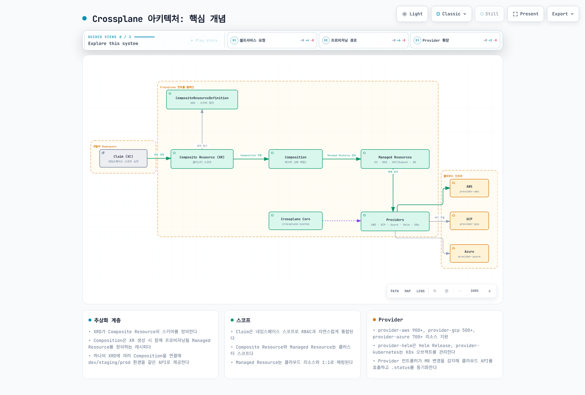
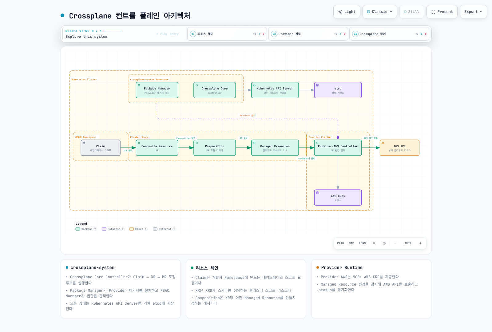
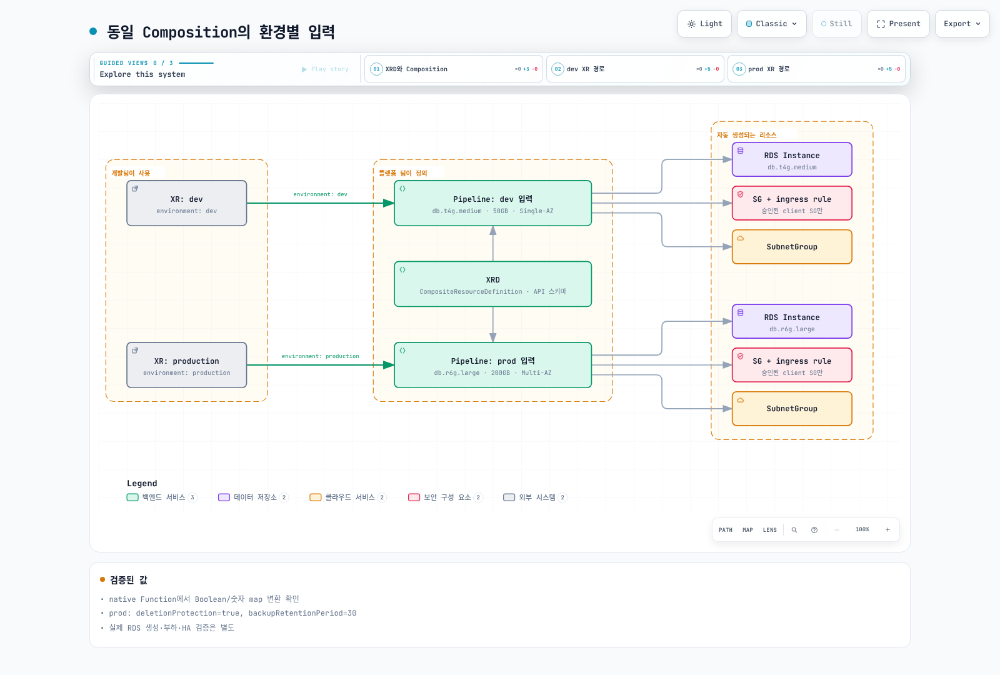
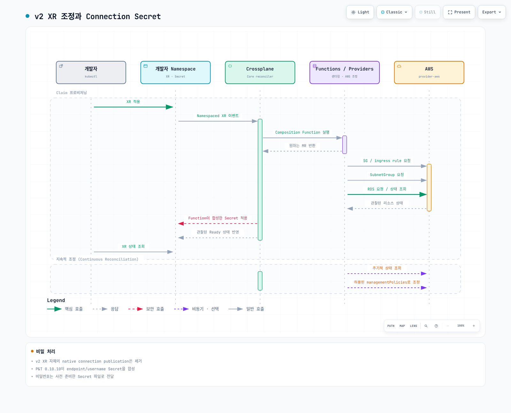
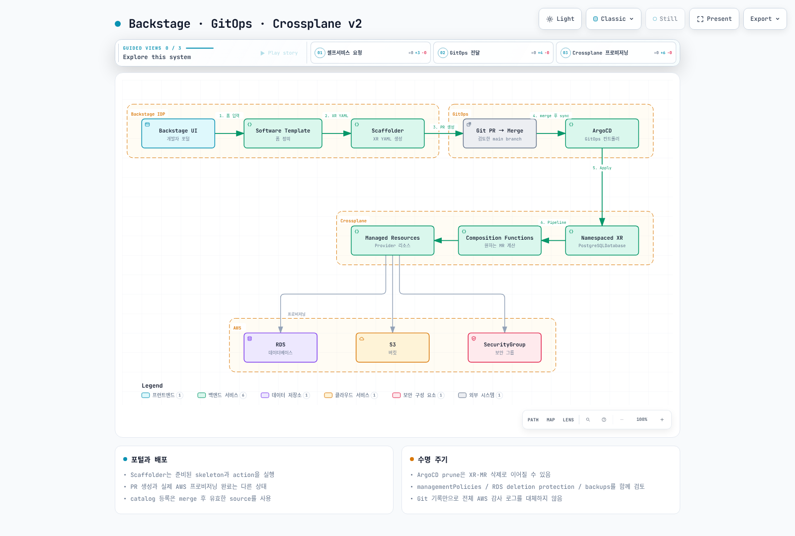

# Crossplane

> **지원 버전**: Crossplane v1.17+, Provider-AWS v1.15+
> **마지막 업데이트**: 2025년 6월

## 목차

- [개요 및 학습 목표](#개요-및-학습-목표)
- [Crossplane 아키텍처](#crossplane-아키텍처)
- [EKS 설치 및 구성](#eks-설치-및-구성)
- [Managed Resources](#managed-resources)
- [Compositions (플랫폼 추상화)](#compositions-플랫폼-추상화)
- [Claims (셀프서비스)](#claims-셀프서비스)
- [ACK vs Crossplane](#ack-vs-crossplane)
- [Backstage + Crossplane 통합](#backstage--crossplane-통합)
- [프로덕션 운영](#프로덕션-운영)
- [모범 사례](#모범-사례)
- [참고 자료](#참고-자료)

---

## 개요 및 학습 목표

### Crossplane이란?

Crossplane은 Kubernetes API를 통해 클라우드 인프라를 선언적으로 프로비저닝하고 관리할 수 있는 오픈소스 프로젝트입니다. Kubernetes의 컨트롤 플레인을 **범용 인프라 컨트롤 플레인**으로 확장하여, AWS, GCP, Azure 등 다양한 클라우드 프로바이더의 리소스를 `kubectl`과 표준 Kubernetes 매니페스트만으로 관리할 수 있게 합니다.

Crossplane은 **CNCF Graduated 프로젝트**로, 2023년 9월 졸업 단계에 도달하였습니다. Upbound이 주도하여 개발하며, 전 세계 수천 개 조직의 프로덕션 환경에서 사용되고 있습니다.

### 왜 Crossplane인가?

기존 인프라 관리 도구들이 가진 한계를 Crossplane이 어떻게 해결하는지 이해하는 것이 중요합니다.

**기존 접근 방식의 문제점:**

- **Terraform**: 강력하지만 Kubernetes 생태계와 분리된 워크플로우. 상태 파일 관리, 드리프트 감지의 수동적 특성, 개발자 셀프서비스 제공이 어려움
- **CloudFormation**: AWS 전용이며, Kubernetes 네이티브가 아님. 복잡한 템플릿 문법
- **수동 관리**: AWS 콘솔이나 CLI를 통한 인프라 관리는 추적 불가, 재현 불가

**Crossplane이 제공하는 가치:**

- **Kubernetes 네이티브**: `kubectl`, RBAC, Namespace, GitOps 등 기존 Kubernetes 워크플로우와 완전히 통합
- **지속적 조정(Continuous Reconciliation)**: 인프라 드리프트를 자동으로 감지하고 복원
- **플랫폼 추상화**: Composition을 통해 복잡한 인프라를 단순한 API로 추상화하여 개발자에게 셀프서비스 제공
- **멀티 클라우드**: 단일 컨트롤 플레인에서 AWS, GCP, Azure 리소스를 동시에 관리

### 인프라 관리 도구 비교

| 비교 기준 | Crossplane | ACK | Terraform | CloudFormation |
|-----------|------------|-----|-----------|----------------|
| **인터페이스** | Kubernetes API | Kubernetes API | HCL / CLI | JSON/YAML 템플릿 |
| **상태 관리** | Kubernetes etcd | Kubernetes etcd | 상태 파일 (S3 등) | CloudFormation 스택 |
| **지속적 조정** | ✅ 자동 드리프트 복원 | ✅ 자동 드리프트 복원 | ❌ 수동 `plan`/`apply` | ✅ 드리프트 감지 (제한적) |
| **플랫폼 추상화** | ✅ Composition/XRD | ❌ 없음 | ❌ 모듈 (제한적) | ❌ 중첩 스택 (제한적) |
| **멀티 클라우드** | ✅ 다중 Provider | ❌ AWS 전용 | ✅ 다중 Provider | ❌ AWS 전용 |
| **셀프서비스** | ✅ Claim (네임스페이스 스코프) | ❌ | ❌ | ❌ |
| **GitOps 통합** | ✅ 네이티브 | ✅ 네이티브 | ⚠️ 별도 도구 필요 | ❌ |
| **CNCF 프로젝트** | ✅ Graduated | ✅ (AWS 주도) | ❌ (HashiCorp) | ❌ (AWS 독점) |
| **학습 곡선** | 중간~높음 | 낮음 | 중간 | 중간 |
| **지원 리소스** | 1,000+ (멀티 클라우드) | AWS 서비스 (확장 중) | 광범위 | AWS 전체 |

### CNCF 프로젝트로서의 Crossplane

Crossplane은 CNCF 프로젝트 성숙도 단계를 다음과 같이 거쳐왔습니다:

- **2020년 6월**: CNCF Sandbox 프로젝트로 합류
- **2021년 9월**: CNCF Incubating 프로젝트로 승격
- **2023년 9월**: CNCF Graduated 프로젝트로 졸업

Graduated 프로젝트는 프로덕션 환경에서의 광범위한 채택, 건전한 거버넌스, 보안 감사를 통과한 프로젝트만 받을 수 있는 최고 등급입니다.

### 학습 목표

이 문서를 통해 다음을 학습합니다:

1. **Crossplane의 핵심 개념**(Provider, Managed Resource, Composite Resource, Composition, Claim)을 이해하고 설명할 수 있다
2. **Amazon EKS에 Crossplane을 설치**하고 Provider-AWS를 IRSA로 구성할 수 있다
3. **Managed Resource**를 사용하여 AWS 리소스(S3, RDS, VPC 등)를 Kubernetes API로 직접 관리할 수 있다
4. **Composition과 XRD**를 설계하여 복잡한 인프라를 플랫폼 API로 추상화할 수 있다
5. **Claim**을 활용하여 개발자에게 네임스페이스 수준의 셀프서비스 인프라 프로비저닝을 제공할 수 있다
6. **ACK과 Crossplane의 차이**를 이해하고 적절한 도구를 선택할 수 있다
7. **Backstage + Crossplane + ArgoCD**를 연동한 IDP 셀프서비스 워크플로우를 구성할 수 있다

---

## Crossplane 아키텍처

### 핵심 개념

Crossplane의 아키텍처를 이해하려면 다섯 가지 핵심 개념을 먼저 파악해야 합니다.



[🔍 인터랙티브 다이어그램 보기](https://www.atomai.click/kubernetes-docs/archmaps/ko-platform-engineering-07-crossplane-0.html)

### 개념별 상세 설명

#### 1. Provider

Provider는 특정 클라우드 또는 서비스에 대한 인프라 관리 기능을 제공하는 Crossplane 확장 패키지입니다. ACK의 서비스 컨트롤러와 유사한 역할을 하지만, 하나의 Provider가 해당 클라우드의 모든 서비스를 포함합니다.

**주요 Provider 목록:**

| Provider | 설명 | 지원 리소스 수 |
|----------|------|--------------|
| `provider-aws` | AWS 리소스 관리 | 900+ |
| `provider-gcp` | Google Cloud 리소스 관리 | 500+ |
| `provider-azure` | Azure 리소스 관리 | 700+ |
| `provider-helm` | Helm Release 관리 | Helm 차트 배포 |
| `provider-kubernetes` | Kubernetes 오브젝트 관리 | 모든 K8s 리소스 |

#### 2. Managed Resource (MR)

Managed Resource는 Provider가 제공하는 개별 클라우드 리소스를 나타내는 Kubernetes 커스텀 리소스입니다. ACK의 CR(Custom Resource)과 동일한 역할을 합니다. **클러스터 스코프**이며, 클라우드 리소스와 1:1로 매핑됩니다.

#### 3. Composite Resource (XR)

Composite Resource는 여러 Managed Resource를 하나의 논리적 단위로 묶은 상위 리소스입니다. **클러스터 스코프**이며, XRD에 의해 스키마가 정의되고 Composition에 의해 실제 리소스 매핑이 결정됩니다.

#### 4. Composition

Composition은 Composite Resource가 생성될 때 어떤 Managed Resource들이 함께 프로비저닝될지를 정의하는 **레시피**입니다. 하나의 XRD에 여러 Composition을 연결하여 동일한 API로 다른 환경(dev, staging, prod)의 인프라를 프로비저닝할 수 있습니다.

#### 5. Claim (XC)

Claim은 Composite Resource의 **네임스페이스 스코프** 버전입니다. 개발자가 자신의 네임스페이스에서 인프라를 요청할 수 있는 인터페이스로, Kubernetes RBAC과 자연스럽게 통합됩니다. Claim이 생성되면 대응하는 Composite Resource가 자동으로 생성됩니다.

### 컨트롤 플레인 아키텍처



[🔍 인터랙티브 다이어그램 보기](https://www.atomai.click/kubernetes-docs/archmaps/ko-platform-engineering-07-crossplane-1.html)

### 리소스 생명주기

Crossplane에서 인프라가 프로비저닝되는 전체 흐름은 다음과 같습니다:

1. **플랫폼 엔지니어**가 XRD와 Composition을 정의하여 플랫폼 API를 설계
2. **개발자**가 Claim을 자신의 네임스페이스에 적용
3. Crossplane이 Claim에 대응하는 **Composite Resource(XR)**를 클러스터 스코프에 자동 생성
4. XR에 연결된 **Composition**에 따라 필요한 **Managed Resource**들을 생성
5. 해당 **Provider Controller**가 Managed Resource의 변경을 감지하고 **클라우드 API**를 호출
6. 클라우드 리소스가 생성되면 Provider가 **상태를 동기화**하여 Managed Resource의 `.status`에 반영
7. 상태가 XR과 Claim까지 **역방향으로 전파**되어 개발자가 리소스 상태를 확인 가능

---

## EKS 설치 및 구성

### 사전 요구 사항

- Amazon EKS 클러스터 (Kubernetes 1.28+)
- `kubectl`, `helm` CLI 도구
- AWS IAM 권한 (Crossplane Provider가 사용할 역할)
- IRSA(IAM Roles for Service Accounts) 또는 EKS Pod Identity 구성

### Crossplane Helm 설치

```bash
# Crossplane Helm 리포지토리 추가
helm repo add crossplane-stable https://charts.crossplane.io/stable
helm repo update

# crossplane-system 네임스페이스에 Crossplane 설치
helm install crossplane \
  crossplane-stable/crossplane \
  --namespace crossplane-system \
  --create-namespace \
  --version 1.17.1 \
  --set args='{"--enable-usages"}' \
  --set metrics.enabled=true \
  --wait

# 설치 확인
kubectl get pods -n crossplane-system
```

정상 설치 시 다음과 유사한 출력이 나타납니다:

```
NAME                                       READY   STATUS    RESTARTS   AGE
crossplane-7c88c45998-x5kzl               1/1     Running   0          2m
crossplane-rbac-manager-78bd597746-9h5jk   1/1     Running   0          2m
```

### Provider-AWS 설치

Crossplane의 Provider는 **Provider Family** 방식으로 분리되어 있습니다. 필요한 서비스 그룹만 선택적으로 설치할 수 있어 리소스 효율성을 높일 수 있습니다.

```yaml
# provider-aws-s3.yaml
apiVersion: pkg.crossplane.io/v1
kind: Provider
metadata:
  name: provider-aws-s3
spec:
  package: xpkg.upbound.io/upbound/provider-aws-s3:v1.15.0
  runtimeConfigRef:
    name: provider-aws-runtime
---
# provider-aws-rds.yaml
apiVersion: pkg.crossplane.io/v1
kind: Provider
metadata:
  name: provider-aws-rds
spec:
  package: xpkg.upbound.io/upbound/provider-aws-rds:v1.15.0
  runtimeConfigRef:
    name: provider-aws-runtime
---
# provider-aws-ec2.yaml
apiVersion: pkg.crossplane.io/v1
kind: Provider
metadata:
  name: provider-aws-ec2
spec:
  package: xpkg.upbound.io/upbound/provider-aws-ec2:v1.15.0
  runtimeConfigRef:
    name: provider-aws-runtime
---
# provider-aws-iam.yaml
apiVersion: pkg.crossplane.io/v1
kind: Provider
metadata:
  name: provider-aws-iam
spec:
  package: xpkg.upbound.io/upbound/provider-aws-iam:v1.15.0
  runtimeConfigRef:
    name: provider-aws-runtime
```

```bash
# Provider 설치
kubectl apply -f provider-aws-s3.yaml
kubectl apply -f provider-aws-rds.yaml
kubectl apply -f provider-aws-ec2.yaml
kubectl apply -f provider-aws-iam.yaml

# Provider 상태 확인
kubectl get providers
```

출력 예시:

```
NAME               INSTALLED   HEALTHY   PACKAGE                                             AGE
provider-aws-ec2   True        True      xpkg.upbound.io/upbound/provider-aws-ec2:v1.15.0   3m
provider-aws-iam   True        True      xpkg.upbound.io/upbound/provider-aws-iam:v1.15.0   3m
provider-aws-rds   True        True      xpkg.upbound.io/upbound/provider-aws-rds:v1.15.0   3m
provider-aws-s3    True        True      xpkg.upbound.io/upbound/provider-aws-s3:v1.15.0    3m
```

### IAM 구성 (IRSA)

Provider-AWS가 AWS API를 호출하려면 적절한 IAM 권한이 필요합니다. EKS 환경에서는 **IRSA(IAM Roles for Service Accounts)**를 사용하는 것이 가장 안전한 방식입니다.

#### 1단계: IAM 정책 생성

```bash
# Crossplane Provider용 IAM 정책 생성
cat > crossplane-policy.json << 'EOF'
{
  "Version": "2012-10-17",
  "Statement": [
    {
      "Effect": "Allow",
      "Action": [
        "s3:*",
        "rds:*",
        "ec2:*",
        "iam:*"
      ],
      "Resource": "*",
      "Condition": {
        "StringEquals": {
          "aws:RequestedRegion": ["ap-northeast-2"]
        }
      }
    }
  ]
}
EOF

aws iam create-policy \
  --policy-name CrossplaneProviderPolicy \
  --policy-document file://crossplane-policy.json
```

> **주의**: 프로덕션 환경에서는 위와 같은 광범위한 권한 대신, 필요한 리소스와 액션만 명시하는 최소 권한 원칙을 적용하세요.

#### 2단계: IRSA용 IAM 역할 생성

```bash
# EKS OIDC Provider 확인
OIDC_PROVIDER=$(aws eks describe-cluster \
  --name my-cluster \
  --query "cluster.identity.oidc.issuer" \
  --output text | sed 's|https://||')

ACCOUNT_ID=$(aws sts get-caller-identity --query Account --output text)

# Trust Policy 생성
cat > trust-policy.json << EOF
{
  "Version": "2012-10-17",
  "Statement": [
    {
      "Effect": "Allow",
      "Principal": {
        "Federated": "arn:aws:iam::${ACCOUNT_ID}:oidc-provider/${OIDC_PROVIDER}"
      },
      "Action": "sts:AssumeRoleWithWebIdentity",
      "Condition": {
        "StringLike": {
          "${OIDC_PROVIDER}:sub": "system:serviceaccount:crossplane-system:provider-aws-*"
        }
      }
    }
  ]
}
EOF

# IAM 역할 생성 및 정책 연결
aws iam create-role \
  --role-name CrossplaneProviderAWSRole \
  --assume-role-policy-document file://trust-policy.json

aws iam attach-role-policy \
  --role-name CrossplaneProviderAWSRole \
  --policy-arn "arn:aws:iam::${ACCOUNT_ID}:policy/CrossplaneProviderPolicy"
```

### DeploymentRuntimeConfig

`DeploymentRuntimeConfig`를 사용하여 Provider Pod에 IRSA 어노테이션을 자동으로 주입합니다.

```yaml
# deployment-runtime-config.yaml
apiVersion: pkg.crossplane.io/v1beta1
kind: DeploymentRuntimeConfig
metadata:
  name: provider-aws-runtime
spec:
  deploymentTemplate:
    spec:
      selector: {}
      template:
        metadata:
          labels:
            app: provider-aws
        spec:
          containers:
            - name: package-runtime
              resources:
                requests:
                  cpu: 100m
                  memory: 256Mi
                limits:
                  cpu: 500m
                  memory: 512Mi
  serviceAccountTemplate:
    metadata:
      annotations:
        eks.amazonaws.com/role-arn: "arn:aws:iam::123456789012:role/CrossplaneProviderAWSRole"
```

```bash
kubectl apply -f deployment-runtime-config.yaml
```

### ProviderConfig

Provider가 사용할 인증 방식과 기본 리전을 설정합니다.

```yaml
# provider-config.yaml
apiVersion: aws.upbound.io/v1beta1
kind: ProviderConfig
metadata:
  name: default
spec:
  credentials:
    source: IRSA
```

```bash
kubectl apply -f provider-config.yaml

# ProviderConfig 상태 확인
kubectl get providerconfig
```

---

## Managed Resources

### 개요

Managed Resource는 Crossplane에서 개별 클라우드 리소스를 나타내는 가장 기본적인 단위입니다. 각 Managed Resource는 클라우드 리소스와 1:1로 매핑되며, Provider가 해당 리소스의 생명주기를 관리합니다.

### S3 Bucket 생성

```yaml
# s3-bucket.yaml
apiVersion: s3.aws.upbound.io/v1beta2
kind: Bucket
metadata:
  name: my-crossplane-bucket
spec:
  forProvider:
    region: ap-northeast-2
    tags:
      Environment: dev
      ManagedBy: crossplane
  # deletionPolicy: Orphan으로 설정하면 Crossplane 리소스 삭제 시
  # 실제 AWS 리소스는 유지됩니다.
  deletionPolicy: Delete
  providerConfigRef:
    name: default
---
# 버킷 버전 관리 활성화
apiVersion: s3.aws.upbound.io/v1beta1
kind: BucketVersioning
metadata:
  name: my-crossplane-bucket-versioning
spec:
  forProvider:
    region: ap-northeast-2
    bucketRef:
      name: my-crossplane-bucket
    versioningConfiguration:
      - status: Enabled
  providerConfigRef:
    name: default
---
# 서버 사이드 암호화 설정
apiVersion: s3.aws.upbound.io/v1beta1
kind: BucketServerSideEncryptionConfiguration
metadata:
  name: my-crossplane-bucket-sse
spec:
  forProvider:
    region: ap-northeast-2
    bucketRef:
      name: my-crossplane-bucket
    rule:
      - applyServerSideEncryptionByDefault:
          - sseAlgorithm: aws:kms
  providerConfigRef:
    name: default
```

```bash
kubectl apply -f s3-bucket.yaml

# 리소스 상태 확인
kubectl get bucket my-crossplane-bucket
kubectl describe bucket my-crossplane-bucket
```

### VPC 및 네트워크 리소스

```yaml
# vpc.yaml
apiVersion: ec2.aws.upbound.io/v1beta1
kind: VPC
metadata:
  name: crossplane-vpc
  labels:
    app.kubernetes.io/managed-by: crossplane
spec:
  forProvider:
    region: ap-northeast-2
    cidrBlock: 10.0.0.0/16
    enableDnsSupport: true
    enableDnsHostnames: true
    tags:
      Name: crossplane-vpc
      Environment: dev
  providerConfigRef:
    name: default
---
# 프라이빗 서브넷 - AZ-a
apiVersion: ec2.aws.upbound.io/v1beta1
kind: Subnet
metadata:
  name: crossplane-private-subnet-a
  labels:
    zone: ap-northeast-2a
    access: private
spec:
  forProvider:
    region: ap-northeast-2
    vpcIdRef:
      name: crossplane-vpc
    cidrBlock: 10.0.1.0/24
    availabilityZone: ap-northeast-2a
    mapPublicIpOnLaunch: false
    tags:
      Name: crossplane-private-subnet-a
  providerConfigRef:
    name: default
---
# 프라이빗 서브넷 - AZ-c
apiVersion: ec2.aws.upbound.io/v1beta1
kind: Subnet
metadata:
  name: crossplane-private-subnet-c
  labels:
    zone: ap-northeast-2c
    access: private
spec:
  forProvider:
    region: ap-northeast-2
    vpcIdRef:
      name: crossplane-vpc
    cidrBlock: 10.0.2.0/24
    availabilityZone: ap-northeast-2c
    mapPublicIpOnLaunch: false
    tags:
      Name: crossplane-private-subnet-c
  providerConfigRef:
    name: default
---
# 보안 그룹
apiVersion: ec2.aws.upbound.io/v1beta1
kind: SecurityGroup
metadata:
  name: crossplane-rds-sg
spec:
  forProvider:
    region: ap-northeast-2
    vpcIdRef:
      name: crossplane-vpc
    name: crossplane-rds-sg
    description: "Security group for RDS managed by Crossplane"
    tags:
      Name: crossplane-rds-sg
  providerConfigRef:
    name: default
---
# 보안 그룹 인바운드 규칙
apiVersion: ec2.aws.upbound.io/v1beta1
kind: SecurityGroupRule
metadata:
  name: crossplane-rds-sg-ingress
spec:
  forProvider:
    region: ap-northeast-2
    securityGroupIdRef:
      name: crossplane-rds-sg
    type: ingress
    fromPort: 5432
    toPort: 5432
    protocol: tcp
    cidrBlocks:
      - 10.0.0.0/16
    description: "Allow PostgreSQL access from VPC"
  providerConfigRef:
    name: default
```

### RDS Instance 생성

```yaml
# rds-subnet-group.yaml
apiVersion: rds.aws.upbound.io/v1beta1
kind: SubnetGroup
metadata:
  name: crossplane-rds-subnet-group
spec:
  forProvider:
    region: ap-northeast-2
    description: "Subnet group for Crossplane managed RDS"
    subnetIdRefs:
      - name: crossplane-private-subnet-a
      - name: crossplane-private-subnet-c
    tags:
      Name: crossplane-rds-subnet-group
  providerConfigRef:
    name: default
---
# rds-instance.yaml
apiVersion: rds.aws.upbound.io/v1beta2
kind: Instance
metadata:
  name: crossplane-postgres
spec:
  forProvider:
    region: ap-northeast-2
    engine: postgres
    engineVersion: "15.7"
    instanceClass: db.t3.medium
    allocatedStorage: 20
    maxAllocatedStorage: 100
    storageType: gp3
    storageEncrypted: true
    dbName: myappdb
    username: dbadmin
    # 비밀번호는 Kubernetes Secret에서 참조
    passwordSecretRef:
      name: rds-password
      namespace: crossplane-system
      key: password
    dbSubnetGroupNameRef:
      name: crossplane-rds-subnet-group
    vpcSecurityGroupIdRefs:
      - name: crossplane-rds-sg
    publiclyAccessible: false
    multiAz: false
    backupRetentionPeriod: 7
    deletionProtection: false
    skipFinalSnapshot: true
    tags:
      Environment: dev
      ManagedBy: crossplane
  # Connection Details를 자동으로 Secret에 저장
  writeConnectionSecretToRef:
    name: rds-connection-details
    namespace: crossplane-system
  providerConfigRef:
    name: default
```

```bash
# RDS 비밀번호 Secret 생성
kubectl create secret generic rds-password \
  -n crossplane-system \
  --from-literal=password='MySecureP@ssw0rd!'

# 리소스 적용
kubectl apply -f rds-subnet-group.yaml
kubectl apply -f rds-instance.yaml

# 프로비저닝 상태 확인
kubectl get instance crossplane-postgres -o wide
```

### 리소스 상태 확인

모든 Managed Resource는 공통적인 상태 필드를 가지며, 이를 통해 프로비저닝 진행 상황을 확인할 수 있습니다.

```bash
# 전체 Managed Resource 상태 조회
kubectl get managed

# 특정 리소스의 상세 상태 확인
kubectl describe instance crossplane-postgres

# Conditions 기반 상태 확인
kubectl get instance crossplane-postgres -o jsonpath='{.status.conditions[*].type}'
# 출력: Ready Synced LastAsyncOperation
```

주요 Condition 유형:

| Condition | 설명 |
|-----------|------|
| `Synced` | Crossplane이 원하는 상태를 클라우드에 동기화했는지 여부 |
| `Ready` | 클라우드 리소스가 사용 가능한 상태인지 여부 |
| `LastAsyncOperation` | 마지막 비동기 작업의 상태 |

### 리소스 참조와 셀렉터

Crossplane Managed Resource 간의 의존성은 **참조(Reference)**와 **셀렉터(Selector)**를 통해 해결됩니다.

```yaml
# 참조 방식 - 이름으로 직접 참조
spec:
  forProvider:
    vpcIdRef:
      name: crossplane-vpc

# 셀렉터 방식 - 라벨로 동적 선택
spec:
  forProvider:
    vpcIdSelector:
      matchLabels:
        app.kubernetes.io/managed-by: crossplane
        environment: dev
```

---

## Compositions (플랫폼 추상화)

### 개요

Composition은 Crossplane의 가장 강력한 기능입니다. 플랫폼 엔지니어가 복잡한 인프라를 **단순한 API**로 추상화하여, 개발자가 클라우드 리소스의 세부 사항을 몰라도 인프라를 프로비저닝할 수 있게 합니다.



[🔍 인터랙티브 다이어그램 보기](https://www.atomai.click/kubernetes-docs/archmaps/ko-platform-engineering-07-crossplane-2.html)

### CompositeResourceDefinition (XRD) 정의

XRD는 플랫폼 API의 **스키마**를 정의합니다. 개발자에게 노출할 파라미터와 반환할 상태 정보를 선언합니다.

```yaml
# xrd-database.yaml
apiVersion: apiextensions.crossplane.io/v1
kind: CompositeResourceDefinition
metadata:
  name: xdatabases.platform.example.com
spec:
  group: platform.example.com
  names:
    kind: XDatabase
    plural: xdatabases
  # claimNames를 정의하면 네임스페이스 스코프 Claim 사용 가능
  claimNames:
    kind: Database
    plural: databases
  
  # 버전 관리 - API 진화에 대응
  versions:
    - name: v1alpha1
      served: true
      referenceable: true
      schema:
        openAPIV3Schema:
          type: object
          properties:
            spec:
              type: object
              properties:
                # 개발자가 설정하는 파라미터
                parameters:
                  type: object
                  required:
                    - engine
                    - size
                  properties:
                    engine:
                      type: string
                      description: "데이터베이스 엔진 (postgres 또는 mysql)"
                      enum:
                        - postgres
                        - mysql
                    size:
                      type: string
                      description: "인스턴스 크기 (small, medium, large)"
                      enum:
                        - small
                        - medium
                        - large
                    storageGB:
                      type: integer
                      description: "스토리지 크기 (GB)"
                      default: 20
                      minimum: 20
                      maximum: 1000
                    version:
                      type: string
                      description: "엔진 버전"
                      default: "15.7"
                    highAvailability:
                      type: boolean
                      description: "Multi-AZ 활성화 여부"
                      default: false
                    backupRetentionDays:
                      type: integer
                      description: "백업 보관 기간 (일)"
                      default: 7
                      minimum: 1
                      maximum: 35
              required:
                - parameters
            status:
              type: object
              properties:
                # Composition에서 설정하는 상태 정보
                endpoint:
                  type: string
                  description: "데이터베이스 엔드포인트"
                port:
                  type: integer
                  description: "데이터베이스 포트"
                dbName:
                  type: string
                  description: "데이터베이스 이름"
      # additionalPrinterColumns로 kubectl get 출력 커스터마이징
      additionalPrinterColumns:
        - name: Engine
          type: string
          jsonPath: ".spec.parameters.engine"
        - name: Size
          type: string
          jsonPath: ".spec.parameters.size"
        - name: Endpoint
          type: string
          jsonPath: ".status.endpoint"
        - name: Ready
          type: string
          jsonPath: ".status.conditions[?(@.type=='Ready')].status"
        - name: Age
          type: date
          jsonPath: ".metadata.creationTimestamp"
```

### Composition 작성

다음은 RDS Instance, SecurityGroup, SubnetGroup을 하나의 패키지로 프로비저닝하는 Composition입니다.

```yaml
# composition-database.yaml
apiVersion: apiextensions.crossplane.io/v1
kind: Composition
metadata:
  name: xdatabases.aws.platform.example.com
  labels:
    provider: aws
    environment: dev
spec:
  # 이 Composition이 적용되는 XRD
  compositeTypeRef:
    apiVersion: platform.example.com/v1alpha1
    kind: XDatabase
  
  # Pipeline 모드 (Crossplane v1.14+)
  mode: Pipeline
  pipeline:
    # ────────────────────────────
    # Step 1: Patch & Transform
    # ────────────────────────────
    - step: patch-and-transform
      functionRef:
        name: function-patch-and-transform
      input:
        apiVersion: pt.fn.crossplane.io/v1beta1
        kind: Resources
        resources:
          # ── SecurityGroup ──
          - name: securityGroup
            base:
              apiVersion: ec2.aws.upbound.io/v1beta1
              kind: SecurityGroup
              spec:
                forProvider:
                  region: ap-northeast-2
                  description: "Database security group managed by Crossplane"
                  vpcIdSelector:
                    matchLabels:
                      platform.example.com/network: shared
                providerConfigRef:
                  name: default
            patches:
              # Composite Resource 이름을 SG 이름에 매핑
              - type: FromCompositeFieldPath
                fromFieldPath: metadata.name
                toFieldPath: spec.forProvider.name
                transforms:
                  - type: string
                    string:
                      type: Format
                      fmt: "%s-db-sg"
              # 라벨 전파
              - type: FromCompositeFieldPath
                fromFieldPath: metadata.labels
                toFieldPath: metadata.labels

          # ── SecurityGroup Ingress Rule ──
          - name: securityGroupRule
            base:
              apiVersion: ec2.aws.upbound.io/v1beta1
              kind: SecurityGroupRule
              spec:
                forProvider:
                  region: ap-northeast-2
                  type: ingress
                  protocol: tcp
                  cidrBlocks:
                    - 10.0.0.0/16
                  description: "Database port access from VPC"
                  securityGroupIdSelector:
                    matchControllerRef: true
                providerConfigRef:
                  name: default
            patches:
              # 엔진에 따라 포트 매핑
              - type: FromCompositeFieldPath
                fromFieldPath: spec.parameters.engine
                toFieldPath: spec.forProvider.fromPort
                transforms:
                  - type: map
                    map:
                      postgres: "5432"
                      mysql: "3306"
              - type: FromCompositeFieldPath
                fromFieldPath: spec.parameters.engine
                toFieldPath: spec.forProvider.toPort
                transforms:
                  - type: map
                    map:
                      postgres: "5432"
                      mysql: "3306"

          # ── DB Subnet Group ──
          - name: subnetGroup
            base:
              apiVersion: rds.aws.upbound.io/v1beta1
              kind: SubnetGroup
              spec:
                forProvider:
                  region: ap-northeast-2
                  description: "Database subnet group managed by Crossplane"
                  subnetIdSelector:
                    matchLabels:
                      platform.example.com/network: shared
                      access: private
                providerConfigRef:
                  name: default
            patches:
              - type: FromCompositeFieldPath
                fromFieldPath: metadata.name
                toFieldPath: spec.forProvider.description
                transforms:
                  - type: string
                    string:
                      type: Format
                      fmt: "Subnet group for %s"

          # ── RDS Instance ──
          - name: rdsInstance
            base:
              apiVersion: rds.aws.upbound.io/v1beta2
              kind: Instance
              spec:
                forProvider:
                  region: ap-northeast-2
                  storageType: gp3
                  storageEncrypted: true
                  publiclyAccessible: false
                  skipFinalSnapshot: true
                  dbSubnetGroupNameSelector:
                    matchControllerRef: true
                  vpcSecurityGroupIdSelector:
                    matchControllerRef: true
                  passwordSecretRef:
                    namespace: crossplane-system
                    key: password
                providerConfigRef:
                  name: default
            patches:
              # 엔진 매핑
              - type: FromCompositeFieldPath
                fromFieldPath: spec.parameters.engine
                toFieldPath: spec.forProvider.engine
              # 엔진 버전 매핑
              - type: FromCompositeFieldPath
                fromFieldPath: spec.parameters.version
                toFieldPath: spec.forProvider.engineVersion
              # 인스턴스 크기 매핑 (size -> instanceClass)
              - type: FromCompositeFieldPath
                fromFieldPath: spec.parameters.size
                toFieldPath: spec.forProvider.instanceClass
                transforms:
                  - type: map
                    map:
                      small: db.t3.medium
                      medium: db.r6g.large
                      large: db.r6g.xlarge
              # 스토리지 크기
              - type: FromCompositeFieldPath
                fromFieldPath: spec.parameters.storageGB
                toFieldPath: spec.forProvider.allocatedStorage
              # Multi-AZ
              - type: FromCompositeFieldPath
                fromFieldPath: spec.parameters.highAvailability
                toFieldPath: spec.forProvider.multiAz
              # 백업 보관 기간
              - type: FromCompositeFieldPath
                fromFieldPath: spec.parameters.backupRetentionDays
                toFieldPath: spec.forProvider.backupRetentionPeriod
              # 비밀번호 Secret 이름 매핑
              - type: FromCompositeFieldPath
                fromFieldPath: metadata.name
                toFieldPath: spec.forProvider.passwordSecretRef.name
                transforms:
                  - type: string
                    string:
                      type: Format
                      fmt: "%s-db-password"
              # 데이터베이스 이름 생성
              - type: FromCompositeFieldPath
                fromFieldPath: metadata.name
                toFieldPath: spec.forProvider.dbName
                transforms:
                  - type: string
                    string:
                      type: Convert
                      convert: ToLower
                  - type: string
                    string:
                      type: Regexp
                      regexp:
                        match: '[^a-z0-9]'
                        group: 0
              # Connection Details를 Secret으로 저장
              - type: FromCompositeFieldPath
                fromFieldPath: metadata.name
                toFieldPath: spec.writeConnectionSecretToRef.name
                transforms:
                  - type: string
                    string:
                      type: Format
                      fmt: "%s-connection"
              - type: ToCompositeFieldPath
                fromFieldPath: spec.writeConnectionSecretToRef.namespace
                toFieldPath: spec.writeConnectionSecretToRef.namespace
              # 상태 정보를 XR status로 전파
              - type: ToCompositeFieldPath
                fromFieldPath: status.atProvider.endpoint
                toFieldPath: status.endpoint
              - type: ToCompositeFieldPath
                fromFieldPath: status.atProvider.port
                toFieldPath: status.port

            # Connection Details 정의
            connectionDetails:
              - name: endpoint
                fromFieldPath: status.atProvider.endpoint
              - name: port
                fromFieldPath: status.atProvider.port
                type: FromValue
              - name: username
                fromFieldPath: spec.forProvider.username
              - name: password
                fromConnectionSecretKey: password
```

### Patch & Transform 상세

Composition에서 사용할 수 있는 주요 Patch 유형과 Transform을 정리합니다.

**Patch 유형:**

| Patch 유형 | 방향 | 설명 |
|-----------|------|------|
| `FromCompositeFieldPath` | XR → MR | Composite Resource의 값을 Managed Resource로 전달 |
| `ToCompositeFieldPath` | MR → XR | Managed Resource의 상태를 Composite Resource로 전파 |
| `CombineFromComposite` | XR → MR | 여러 XR 필드를 조합하여 MR 필드에 매핑 |
| `CombineToComposite` | MR → XR | 여러 MR 필드를 조합하여 XR 필드에 매핑 |

**주요 Transform:**

```yaml
# 문자열 변환 - Format
transforms:
  - type: string
    string:
      type: Format
      fmt: "%s-suffix"

# 맵 변환 - 값 매핑
transforms:
  - type: map
    map:
      small: db.t3.medium
      medium: db.r6g.large
      large: db.r6g.xlarge

# 수학 연산 - 곱셈
transforms:
  - type: math
    math:
      type: Multiply
      multiply: 1024

# 조건부 변환 - 문자열 변환
transforms:
  - type: string
    string:
      type: Convert
      convert: ToUpper
```

### Composition Functions

Crossplane v1.14부터 **Composition Functions**를 통해 더 유연한 리소스 구성이 가능합니다. Go, Python 등으로 작성된 함수를 Composition Pipeline에서 호출할 수 있습니다.

```yaml
# Composition Function 설치
apiVersion: pkg.crossplane.io/v1beta1
kind: Function
metadata:
  name: function-patch-and-transform
spec:
  package: xpkg.upbound.io/crossplane-contrib/function-patch-and-transform:v0.7.0
---
apiVersion: pkg.crossplane.io/v1beta1
kind: Function
metadata:
  name: function-auto-ready
spec:
  package: xpkg.upbound.io/crossplane-contrib/function-auto-ready:v0.3.0
```

자주 사용되는 Composition Function 목록:

| Function | 설명 |
|----------|------|
| `function-patch-and-transform` | 기본 Patch & Transform 로직 |
| `function-auto-ready` | 모든 MR이 Ready이면 XR을 Ready로 설정 |
| `function-go-templating` | Go 템플릿을 사용한 리소스 생성 |
| `function-kcl` | KCL 언어로 리소스 생성 |
| `function-conditional` | 조건부 리소스 생성 |

---

## Claims (셀프서비스)

### 개요

Claim은 Crossplane의 **셀프서비스 인터페이스**입니다. 개발자는 자신의 네임스페이스에서 Claim을 생성하여 인프라를 요청하며, 플랫폼 팀이 정의한 Composition에 따라 실제 클라우드 리소스가 프로비저닝됩니다.



[🔍 인터랙티브 다이어그램 보기](https://www.atomai.click/kubernetes-docs/archmaps/ko-platform-engineering-07-crossplane-3.html)

### 데이터베이스 Claim 예제

앞서 정의한 XRD와 Composition을 기반으로, 개발자가 사용하는 Claim은 다음과 같이 간단합니다.

```yaml
# database-claim.yaml
apiVersion: platform.example.com/v1alpha1
kind: Database
metadata:
  name: order-service-db
  namespace: order-team
spec:
  parameters:
    engine: postgres
    size: small
    storageGB: 50
    version: "15.7"
    highAvailability: false
    backupRetentionDays: 7
  
  # Composition 선택 (선택사항 - compositionSelector 또는 compositionRef 사용)
  compositionSelector:
    matchLabels:
      provider: aws
      environment: dev
  
  # Connection Details를 이 네임스페이스의 Secret으로 저장
  writeConnectionSecretToRef:
    name: order-db-connection
```

```bash
# 데이터베이스 비밀번호 Secret 생성
kubectl create secret generic order-service-db-db-password \
  -n crossplane-system \
  --from-literal=password='OrderDB_Secure_2025!'

# Claim 적용
kubectl apply -f database-claim.yaml

# Claim 상태 확인
kubectl get database -n order-team
```

출력 예시:

```
NAME               ENGINE     SIZE    ENDPOINT                                           READY   AGE
order-service-db   postgres   small   order-service-db-xxxxx.ap-northeast-2.rds.amazonaws.com   True    15m
```

### Connection Details (Secret 자동 생성)

Claim에서 `writeConnectionSecretToRef`를 지정하면, Crossplane이 프로비저닝 완료 후 해당 네임스페이스에 Connection Secret을 자동으로 생성합니다.

```bash
# Connection Secret 확인
kubectl get secret order-db-connection -n order-team -o yaml
```

```yaml
apiVersion: v1
kind: Secret
metadata:
  name: order-db-connection
  namespace: order-team
type: connection.crossplane.io/v1alpha1
data:
  endpoint: b3JkZXItc2VydmljZS1kYi14eHh4eC5hcC1ub3J0aGVhc3QtMi5yZHMuYW1hem9uYXdzLmNvbQ==
  port: NTQzMg==
  username: ZGJhZG1pbg==
  password: T3JkZXJEQl9TZWN1cmVfMjAyNSE=
```

애플리케이션에서 이 Secret을 환경 변수로 주입하여 사용합니다:

```yaml
# 애플리케이션 Deployment에서 Connection Secret 사용
apiVersion: apps/v1
kind: Deployment
metadata:
  name: order-service
  namespace: order-team
spec:
  replicas: 2
  selector:
    matchLabels:
      app: order-service
  template:
    metadata:
      labels:
        app: order-service
    spec:
      containers:
        - name: order-service
          image: example.com/order-service:latest
          env:
            - name: DB_HOST
              valueFrom:
                secretKeyRef:
                  name: order-db-connection
                  key: endpoint
            - name: DB_PORT
              valueFrom:
                secretKeyRef:
                  name: order-db-connection
                  key: port
            - name: DB_USER
              valueFrom:
                secretKeyRef:
                  name: order-db-connection
                  key: username
            - name: DB_PASSWORD
              valueFrom:
                secretKeyRef:
                  name: order-db-connection
                  key: password
```

### Claim으로 전체 인프라 프로비저닝

하나의 Claim으로 여러 리소스(RDS + SecurityGroup + SubnetGroup)가 함께 프로비저닝되는 것을 확인할 수 있습니다.

```bash
# Claim에 의해 생성된 모든 리소스 추적
kubectl get composite
kubectl get managed

# 리소스 트리 확인 (crossplane CLI 사용)
# crossplane CLI 설치: curl -sL https://raw.githubusercontent.com/crossplane/crossplane/master/install.sh | sh
crossplane beta trace database order-service-db -n order-team
```

출력 예시:

```
NAME                                                  SYNCED   READY   STATUS
Database/order-service-db (order-team)                True     True    Available
└─ XDatabase/order-service-db-xxxxx                   True     True    Available
   ├─ SecurityGroup/order-service-db-xxxxx-sg         True     True    Available
   ├─ SecurityGroupRule/order-service-db-xxxxx-sgr    True     True    Available
   ├─ SubnetGroup/order-service-db-xxxxx-sng          True     True    Available
   └─ Instance/order-service-db-xxxxx-rds             True     True    Available
```

---

## ACK vs Crossplane

### 상세 비교

[AWS Controllers for Kubernetes (ACK)](./02-ack.md)와 Crossplane은 모두 Kubernetes API를 통해 AWS 리소스를 관리하지만, 설계 철학과 기능 범위에서 큰 차이가 있습니다.

| 비교 기준 | ACK | Crossplane |
|-----------|-----|------------|
| **프로젝트 주체** | AWS | Upbound / CNCF |
| **CNCF 상태** | AWS 오픈소스 | CNCF Graduated |
| **설계 철학** | AWS 서비스별 컨트롤러 | 범용 인프라 컨트롤 플레인 |
| **추상화 수준** | 낮음 (1:1 리소스 매핑) | 높음 (Composition으로 추상화) |
| **Composition** | ❌ 없음 | ✅ XRD + Composition |
| **Claim (셀프서비스)** | ❌ 없음 | ✅ Namespace-scoped Claim |
| **멀티 클라우드** | ❌ AWS 전용 | ✅ AWS, GCP, Azure, 기타 |
| **Provider 방식** | 서비스별 개별 컨트롤러 | Family Provider (서비스 그룹별) |
| **CRD 수** | 서비스당 수십 개 | 900+ (AWS만) |
| **리소스 참조** | `ACKResourceReference` | `Ref` / `Selector` |
| **상태 전파** | `.status.conditions` | `.status.conditions` + Connection Details |
| **드리프트 감지** | ✅ | ✅ |
| **설치 복잡도** | 낮음 (Helm 차트) | 중간 (Core + Provider + XRD) |
| **메모리 사용량** | 낮음 (서비스별 분리) | 높음 (Provider가 많은 CRD 로드) |
| **KRO 통합** | ✅ 좋음 (동일 AWS 에코시스템) | ⚠️ 별도 에코시스템 |
| **커뮤니티 크기** | AWS 중심 | 글로벌 CNCF 커뮤니티 |

### 언제 ACK을 사용하는가

다음 조건에 해당하면 ACK이 더 적합합니다:

- **AWS 전용 환경**: 멀티 클라우드 요구 사항이 없는 경우
- **단순한 리소스 관리**: 1:1 매핑으로 충분한 경우 (S3 버킷 하나, SQS 큐 하나 등)
- **낮은 학습 곡선**: Crossplane의 XRD/Composition 개념 없이 빠르게 시작하고 싶은 경우
- **KRO와 결합**: ACK + [KRO](./03-kro.md)로 추상화 계층을 구축하는 경우
- **리소스 효율성**: Provider의 메모리 사용량을 최소화해야 하는 경우

### 언제 Crossplane을 사용하는가

다음 조건에 해당하면 Crossplane이 더 적합합니다:

- **플랫폼 추상화 필요**: 개발자에게 셀프서비스 인프라 API를 제공해야 하는 경우
- **멀티 클라우드**: AWS, GCP, Azure 리소스를 단일 컨트롤 플레인에서 관리하는 경우
- **복합 리소스 관리**: 하나의 API로 여러 리소스(RDS + SG + SubnetGroup)를 패키지로 프로비저닝하는 경우
- **Connection Details 자동화**: 프로비저닝된 리소스의 접속 정보를 Secret으로 자동 전달해야 하는 경우
- **Backstage IDP 통합**: [Backstage](./06-backstage-idp.md) 템플릿에서 인프라 프로비저닝을 자동화하는 경우

### 공존 전략

ACK과 Crossplane은 동일 클러스터에서 공존할 수 있습니다. 단, **동일한 AWS 리소스를 양쪽에서 동시에 관리하면 충돌**이 발생하므로 주의가 필요합니다.

```
권장 패턴:
├── ACK: 단순한 AWS 리소스 (S3, SQS, SNS 등) — KRO로 조합
├── Crossplane: 복합 인프라 (Database, Network Stack 등) — Composition으로 추상화
└── 공통: GitOps (ArgoCD)로 양쪽 모두 관리
```

---

## Backstage + Crossplane 통합

### 개요

[Backstage IDP](./06-backstage-idp.md)와 Crossplane을 통합하면, 개발자가 Backstage UI에서 버튼 클릭만으로 데이터베이스, 캐시, 메시지 큐 등의 인프라를 셀프서비스로 프로비저닝할 수 있습니다.



[🔍 인터랙티브 다이어그램 보기](https://www.atomai.click/kubernetes-docs/archmaps/ko-platform-engineering-07-crossplane-4.html)

### Backstage Template에서 Crossplane Claim 생성

Backstage Software Template을 작성하여 개발자가 폼을 통해 Crossplane Claim을 생성하도록 합니다.

```yaml
# backstage-template-database.yaml
apiVersion: scaffolder.backstage.io/v1beta3
kind: Template
metadata:
  name: provision-database
  title: "데이터베이스 프로비저닝"
  description: "Crossplane Claim을 통해 PostgreSQL 또는 MySQL 데이터베이스를 프로비저닝합니다."
  tags:
    - infrastructure
    - database
    - crossplane
spec:
  owner: platform-team
  type: infrastructure

  parameters:
    - title: "데이터베이스 설정"
      required:
        - name
        - engine
        - size
      properties:
        name:
          title: "데이터베이스 이름"
          type: string
          description: "프로비저닝할 데이터베이스 이름 (영문 소문자, 하이픈)"
          pattern: "^[a-z][a-z0-9-]*$"
          maxLength: 40
        engine:
          title: "데이터베이스 엔진"
          type: string
          enum:
            - postgres
            - mysql
          enumNames:
            - "PostgreSQL 15.7"
            - "MySQL 8.0"
        size:
          title: "인스턴스 크기"
          type: string
          enum:
            - small
            - medium
            - large
          enumNames:
            - "Small (db.t3.medium - 개발/테스트)"
            - "Medium (db.r6g.large - 스테이징)"
            - "Large (db.r6g.xlarge - 프로덕션)"
        storageGB:
          title: "스토리지 크기 (GB)"
          type: integer
          default: 50
          minimum: 20
          maximum: 1000
        highAvailability:
          title: "고가용성 (Multi-AZ)"
          type: boolean
          default: false
          description: "프로덕션 환경에서는 활성화를 권장합니다."

    - title: "배포 대상"
      required:
        - namespace
        - environment
      properties:
        namespace:
          title: "네임스페이스"
          type: string
          description: "Claim이 생성될 Kubernetes 네임스페이스"
        environment:
          title: "환경"
          type: string
          enum:
            - dev
            - staging
            - prod
          enumNames:
            - "Development"
            - "Staging"
            - "Production"

  steps:
    # 1단계: Crossplane Claim YAML 생성
    - id: create-claim
      name: "Crossplane Claim 생성"
      action: fetch:template
      input:
        url: ./templates/database-claim
        targetPath: ./gitops/claims
        values:
          name: ${{ parameters.name }}
          engine: ${{ parameters.engine }}
          size: ${{ parameters.size }}
          storageGB: ${{ parameters.storageGB }}
          highAvailability: ${{ parameters.highAvailability }}
          namespace: ${{ parameters.namespace }}
          environment: ${{ parameters.environment }}

    # 2단계: Git 리포지토리에 Push
    - id: publish
      name: "GitOps 리포지토리에 Push"
      action: publish:github:pull-request
      input:
        repoUrl: "github.com?repo=infra-gitops&owner=my-org"
        branchName: "provision-db-${{ parameters.name }}"
        title: "Provision Database: ${{ parameters.name }}"
        description: |
          ## 데이터베이스 프로비저닝 요청
          - **이름**: ${{ parameters.name }}
          - **엔진**: ${{ parameters.engine }}
          - **크기**: ${{ parameters.size }}
          - **스토리지**: ${{ parameters.storageGB }}GB
          - **환경**: ${{ parameters.environment }}
          - **네임스페이스**: ${{ parameters.namespace }}

    # 3단계: 카탈로그에 등록
    - id: register
      name: "Backstage 카탈로그 등록"
      action: catalog:register
      input:
        repoContentsUrl: ${{ steps.publish.output.repoContentsUrl }}
        catalogInfoPath: "/catalog-info.yaml"

  output:
    links:
      - title: "Pull Request"
        url: ${{ steps.publish.output.remoteUrl }}
      - title: "카탈로그에서 보기"
        icon: catalog
        entityRef: ${{ steps.register.output.entityRef }}
```

### GitOps 워크플로우 (ArgoCD + Crossplane)

Backstage Template이 생성한 Claim YAML은 Git 리포지토리에 Push되고, [ArgoCD](../gitops/argocd/02-applications.md)가 이를 클러스터에 동기화합니다.

```yaml
# argocd-application-crossplane-claims.yaml
apiVersion: argoproj.io/v1alpha1
kind: Application
metadata:
  name: crossplane-claims
  namespace: argocd
spec:
  project: infrastructure
  source:
    repoURL: https://github.com/my-org/infra-gitops.git
    targetRevision: main
    path: gitops/claims
    directory:
      recurse: true
  destination:
    server: https://kubernetes.default.svc
  syncPolicy:
    automated:
      prune: true
      selfHeal: true
    syncOptions:
      - CreateNamespace=true
    retry:
      limit: 3
      backoff:
        duration: 30s
        factor: 2
        maxDuration: 3m
```

**전체 워크플로우:**

1. 개발자가 Backstage UI에서 "데이터베이스 프로비저닝" 템플릿을 실행
2. Backstage Scaffolder가 Claim YAML을 생성하고 Git PR을 생성
3. 팀 리드가 PR을 리뷰하고 승인 (거버넌스)
4. PR 머지 시 ArgoCD가 자동으로 Claim을 클러스터에 적용
5. Crossplane이 Composition에 따라 AWS 리소스를 프로비저닝
6. Connection Secret이 개발자 네임스페이스에 자동 생성
7. 개발자는 Backstage 카탈로그에서 리소스 상태를 확인

### IDP에서 셀프서비스 인프라

Backstage + Crossplane + ArgoCD 통합으로 구현되는 셀프서비스 인프라의 핵심 가치:

| 역할 | 기존 방식 | IDP 셀프서비스 |
|------|----------|--------------|
| **개발자** | Jira 티켓 → 인프라 팀 대기 → 수일 소요 | Backstage UI → 즉시 프로비저닝 |
| **플랫폼 팀** | 매번 수동 프로비저닝 | Composition 정의 후 자동화 |
| **보안 팀** | 수동 리뷰 | Git PR 기반 자동 거버넌스 |
| **감사** | 변경 이력 추적 어려움 | Git 커밋 기록 = 감사 로그 |

---

## 프로덕션 운영

### 상태 관리와 드리프트 감지

Crossplane의 핵심 강점 중 하나는 **지속적 조정(Continuous Reconciliation)**입니다. Provider가 주기적으로 클라우드 리소스의 실제 상태를 확인하고, 매니페스트에 정의된 원하는 상태와 다르면 자동으로 복원합니다.

```yaml
# Provider의 조정 주기 설정 (ProviderConfig)
apiVersion: aws.upbound.io/v1beta1
kind: ProviderConfig
metadata:
  name: default
spec:
  credentials:
    source: IRSA
```

```bash
# 드리프트 감지 확인 - AWS 콘솔에서 수동 변경 후
# Crossplane이 자동으로 원래 상태로 복원하는지 확인

# 이벤트에서 드리프트 복원 로그 확인
kubectl get events --field-selector reason=ReconcileSuccess -n crossplane-system

# 특정 리소스의 조정 상태 확인
kubectl describe bucket my-crossplane-bucket | grep -A 5 "Conditions"
```

**드리프트 감지 동작 방식:**

1. Provider Controller가 **pollInterval** (기본 10분)마다 AWS API를 호출하여 실제 상태 확인
2. 원하는 상태(`spec.forProvider`)와 실제 상태(`status.atProvider`)를 비교
3. 차이가 있으면 AWS API를 호출하여 원하는 상태로 복원
4. `Synced` Condition을 업데이트하여 동기화 상태를 표시

### 업그레이드 전략

#### Crossplane Core 업그레이드

```bash
# 현재 버전 확인
helm list -n crossplane-system

# 업그레이드 (Helm)
helm upgrade crossplane \
  crossplane-stable/crossplane \
  --namespace crossplane-system \
  --version 1.18.0 \
  --wait

# 업그레이드 후 상태 확인
kubectl get pods -n crossplane-system
kubectl get providers
```

#### Provider 업그레이드

```yaml
# Provider 버전 업그레이드 - spec.package 버전을 변경
apiVersion: pkg.crossplane.io/v1
kind: Provider
metadata:
  name: provider-aws-s3
spec:
  package: xpkg.upbound.io/upbound/provider-aws-s3:v1.16.0  # 버전 업데이트
  runtimeConfigRef:
    name: provider-aws-runtime
```

> **주의 사항**: Provider 업그레이드 시 CRD가 변경될 수 있습니다. 반드시 릴리스 노트를 확인하고, 스테이징 환경에서 먼저 테스트하세요. 메이저 버전 업그레이드 시에는 기존 Managed Resource의 API 버전 호환성을 확인해야 합니다.

### Provider 버전 관리

프로덕션 환경에서는 Provider 버전을 명시적으로 고정하고, 자동 업데이트를 비활성화하는 것을 권장합니다.

```yaml
apiVersion: pkg.crossplane.io/v1
kind: Provider
metadata:
  name: provider-aws-s3
spec:
  package: xpkg.upbound.io/upbound/provider-aws-s3:v1.15.0
  # 자동 업데이트 비활성화
  packagePullPolicy: IfNotPresent
  # Revision 관리
  revisionActivationPolicy: Automatic
  revisionHistoryLimit: 3
  runtimeConfigRef:
    name: provider-aws-runtime
```

### 모니터링 및 알림

#### Prometheus 메트릭

Crossplane은 Prometheus 메트릭을 기본으로 노출합니다.

```yaml
# ServiceMonitor 설정 (Prometheus Operator)
apiVersion: monitoring.coreos.com/v1
kind: ServiceMonitor
metadata:
  name: crossplane
  namespace: crossplane-system
  labels:
    app: crossplane
spec:
  selector:
    matchLabels:
      app: crossplane
  endpoints:
    - port: metrics
      interval: 30s
      path: /metrics
---
# Provider 메트릭 수집
apiVersion: monitoring.coreos.com/v1
kind: ServiceMonitor
metadata:
  name: provider-aws
  namespace: crossplane-system
spec:
  selector:
    matchLabels:
      pkg.crossplane.io/revision: provider-aws-s3
  endpoints:
    - port: metrics
      interval: 30s
```

#### 주요 모니터링 메트릭

| 메트릭 | 설명 | 알림 기준 |
|--------|------|----------|
| `upjet_resource_ttr_bucket` | 리소스 프로비저닝 소요 시간 | > 30분 |
| `controller_runtime_reconcile_errors_total` | 조정 오류 횟수 | > 10/분 |
| `controller_runtime_reconcile_time_seconds` | 조정 소요 시간 | p99 > 30초 |
| `certwatcher_read_certificate_errors_total` | 인증서 오류 | > 0 |
| `workqueue_depth` | 처리 대기 큐 깊이 | > 100 |

#### Grafana 대시보드 예시 쿼리

```promql
# Managed Resource 상태별 개수
count by (status) (
  kube_customresource_status_condition{
    group=~".*aws.upbound.io",
    condition="Ready"
  }
)

# 조정 오류율
rate(controller_runtime_reconcile_errors_total{
  controller=~"managed/.*"
}[5m])

# 리소스 프로비저닝 지연 시간 (p95)
histogram_quantile(0.95,
  rate(upjet_resource_ttr_bucket[1h])
)
```

#### AlertManager 규칙

```yaml
# crossplane-alerts.yaml
apiVersion: monitoring.coreos.com/v1
kind: PrometheusRule
metadata:
  name: crossplane-alerts
  namespace: crossplane-system
spec:
  groups:
    - name: crossplane
      rules:
        - alert: CrossplaneManagedResourceNotReady
          expr: |
            kube_customresource_status_condition{
              group=~".*aws.upbound.io",
              condition="Ready",
              status="False"
            } == 1
          for: 30m
          labels:
            severity: warning
          annotations:
            summary: "Managed Resource가 30분 이상 Ready 상태가 아닙니다"
            description: "{{ $labels.customresource_kind }}/{{ $labels.customresource_name }}이 Ready 상태가 아닙니다."
        
        - alert: CrossplaneProviderUnhealthy
          expr: |
            kube_customresource_status_condition{
              group="pkg.crossplane.io",
              kind="Provider",
              condition="Healthy",
              status="False"
            } == 1
          for: 5m
          labels:
            severity: critical
          annotations:
            summary: "Crossplane Provider가 비정상 상태입니다"
            description: "Provider {{ $labels.customresource_name }}이 Healthy 상태가 아닙니다."
        
        - alert: CrossplaneHighReconcileErrors
          expr: |
            rate(controller_runtime_reconcile_errors_total[5m]) > 0.1
          for: 10m
          labels:
            severity: warning
          annotations:
            summary: "Crossplane 조정 오류율이 높습니다"
```

---

## 모범 사례

### Composition 설계 원칙

#### 1. 단일 책임 원칙

하나의 Composition은 하나의 논리적 인프라 단위만 담당해야 합니다.

```
✅ 좋은 예:
├── composition-database.yaml      — RDS + SG + SubnetGroup
├── composition-cache.yaml         — ElastiCache + SG + SubnetGroup
└── composition-storage.yaml       — S3 + IAM Policy + CloudFront

❌ 나쁜 예:
└── composition-everything.yaml    — RDS + ElastiCache + S3 + VPC + ...
```

#### 2. 환경별 Composition 분리

동일한 XRD에 여러 Composition을 연결하여 환경별 차이를 관리합니다.

```yaml
# XRD: xdatabases.platform.example.com (스키마 공통)

# Composition 1: dev 환경
metadata:
  name: xdatabases.aws.dev.platform.example.com
  labels:
    environment: dev
# → db.t3.medium, Single-AZ, 20GB, 백업 7일

# Composition 2: prod 환경
metadata:
  name: xdatabases.aws.prod.platform.example.com
  labels:
    environment: prod
# → db.r6g.xlarge, Multi-AZ, 100GB+, 백업 35일, 암호화 강제
```

#### 3. API 버전 관리

XRD의 버전을 관리하여 하위 호환성을 유지합니다.

```yaml
spec:
  versions:
    - name: v1alpha1
      served: true       # 이전 버전도 계속 제공
      referenceable: true
    - name: v1beta1
      served: true
      referenceable: true
      # 새로운 필드 추가 (기존 필드는 유지)
```

### 네이밍 컨벤션

| 리소스 유형 | 네이밍 패턴 | 예시 |
|------------|-----------|------|
| **XRD** | `x<resource>s.<group>` | `xdatabases.platform.example.com` |
| **Composition** | `x<resource>s.<provider>.<env>.<group>` | `xdatabases.aws.prod.platform.example.com` |
| **Claim** | `<service>-<type>` | `order-service-db` |
| **ProviderConfig** | `<purpose>` | `default`, `readonly` |
| **Provider** | `provider-<cloud>-<service>` | `provider-aws-s3` |

### Secret 관리

#### 비밀번호 관리

Crossplane에서 관리하는 리소스의 비밀번호는 다음 방법으로 안전하게 관리합니다.

```yaml
# 방법 1: External Secrets Operator와 연동
apiVersion: external-secrets.io/v1beta1
kind: ExternalSecret
metadata:
  name: rds-password
  namespace: crossplane-system
spec:
  refreshInterval: 1h
  secretStoreRef:
    name: aws-secrets-manager
    kind: ClusterSecretStore
  target:
    name: rds-password
  data:
    - secretKey: password
      remoteRef:
        key: /crossplane/rds/password
```

```yaml
# 방법 2: SealedSecret 사용
apiVersion: bitnami.com/v1alpha1
kind: SealedSecret
metadata:
  name: rds-password
  namespace: crossplane-system
spec:
  encryptedData:
    password: AgBy3i4OJSWK...  # kubeseal로 암호화된 값
```

#### Connection Details 보안

```yaml
# Connection Details를 특정 네임스페이스로만 전파하도록 제한
spec:
  writeConnectionSecretToRef:
    name: db-connection
    namespace: order-team  # 특정 네임스페이스로 제한
```

### 멀티 테넌시

여러 팀이 동일한 Crossplane 인스턴스를 공유하는 환경에서의 격리 전략:

#### Namespace 기반 격리

```yaml
# 팀별 Namespace에서 Claim 생성 권한 제한
apiVersion: rbac.authorization.k8s.io/v1
kind: Role
metadata:
  name: database-consumer
  namespace: order-team
rules:
  - apiGroups: ["platform.example.com"]
    resources: ["databases"]  # Claim 리소스
    verbs: ["get", "list", "watch", "create", "update", "delete"]
---
apiVersion: rbac.authorization.k8s.io/v1
kind: RoleBinding
metadata:
  name: order-team-database-consumer
  namespace: order-team
subjects:
  - kind: Group
    name: order-team
    apiGroup: rbac.authorization.k8s.io
roleRef:
  kind: Role
  name: database-consumer
  apiGroup: rbac.authorization.k8s.io
```

#### Usage 기반 보호

Crossplane의 `Usage` 리소스를 사용하여 의존성이 있는 리소스의 실수로 인한 삭제를 방지합니다.

```yaml
# VPC가 사용 중일 때 삭제 방지
apiVersion: apiextensions.crossplane.io/v1alpha1
kind: Usage
metadata:
  name: protect-shared-vpc
spec:
  of:
    apiVersion: ec2.aws.upbound.io/v1beta1
    kind: VPC
    resourceRef:
      name: shared-vpc
  reason: "이 VPC는 여러 팀의 RDS 인스턴스에서 사용 중입니다. 삭제하려면 먼저 의존하는 모든 리소스를 제거하세요."
```

### 리소스 삭제 정책

프로덕션 환경에서는 `deletionPolicy`를 신중하게 설정해야 합니다.

```yaml
spec:
  # Delete: Crossplane 리소스 삭제 시 AWS 리소스도 함께 삭제 (기본값)
  deletionPolicy: Delete
  
  # Orphan: Crossplane 리소스 삭제 시 AWS 리소스는 유지
  # 프로덕션 데이터베이스에 권장
  deletionPolicy: Orphan
```

> **프로덕션 권장**: 데이터를 포함하는 리소스(RDS, S3 등)는 `Orphan` 정책을 사용하여 실수로 인한 데이터 손실을 방지하세요.

---

## 참고 자료

### 공식 문서

- [Crossplane 공식 문서](https://docs.crossplane.io/)
- [Crossplane GitHub 리포지토리](https://github.com/crossplane/crossplane)
- [Upbound Marketplace (Provider 목록)](https://marketplace.upbound.io/)
- [CNCF Crossplane 프로젝트 페이지](https://www.cncf.io/projects/crossplane/)
- [Crossplane Composition Functions](https://docs.crossplane.io/latest/concepts/composition-functions/)
- [Provider-AWS (Upbound) 문서](https://marketplace.upbound.io/providers/upbound/provider-family-aws/)

### AWS 관련

- [EKS Best Practices Guide](https://aws.github.io/aws-eks-best-practices/)
- [IRSA (IAM Roles for Service Accounts)](https://docs.aws.amazon.com/eks/latest/userguide/iam-roles-for-service-accounts.html)
- [EKS Pod Identity](https://docs.aws.amazon.com/eks/latest/userguide/pod-identities.html)

### 관련 내부 문서

- [AWS Controllers for Kubernetes (ACK)](./02-ack.md) -- ACK과의 비교 및 공존 전략
- [Kubernetes Resource Operator (KRO)](./03-kro.md) -- ACK + KRO 조합과 Crossplane Composition 비교
- [Backstage IDP](./06-backstage-idp.md) -- Backstage + Crossplane 통합 IDP 구축
- [ArgoCD Applications](../gitops/argocd/02-applications.md) -- GitOps 워크플로우에서의 Crossplane Claim 관리
- [Platform Engineering 개요](./00-platform-engineering-overview.md) -- 플랫폼 엔지니어링 전반

---

[이전: Backstage IDP](./06-backstage-idp.md) | [다음: vCluster](./08-vcluster.md)
