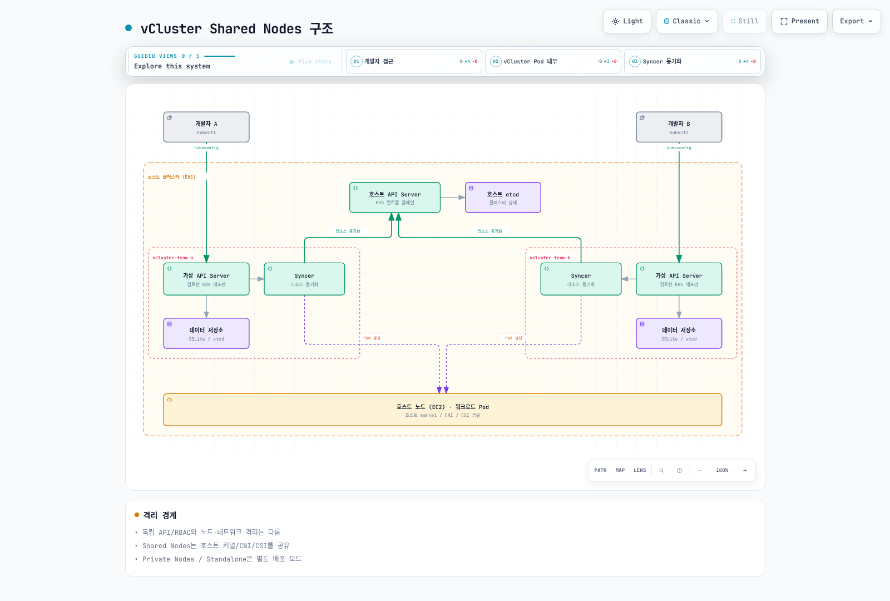
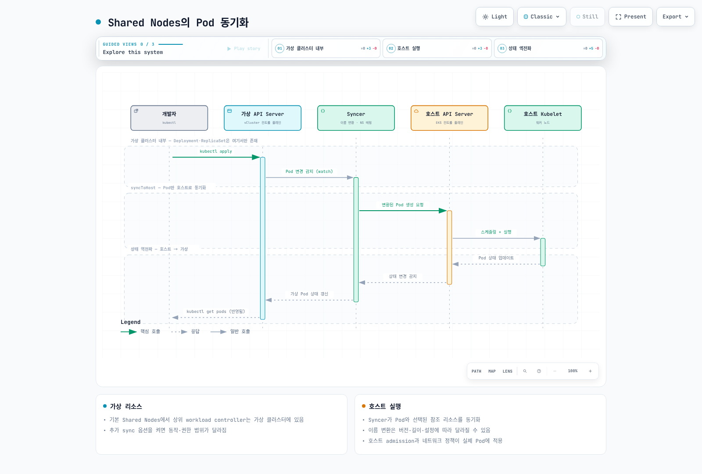
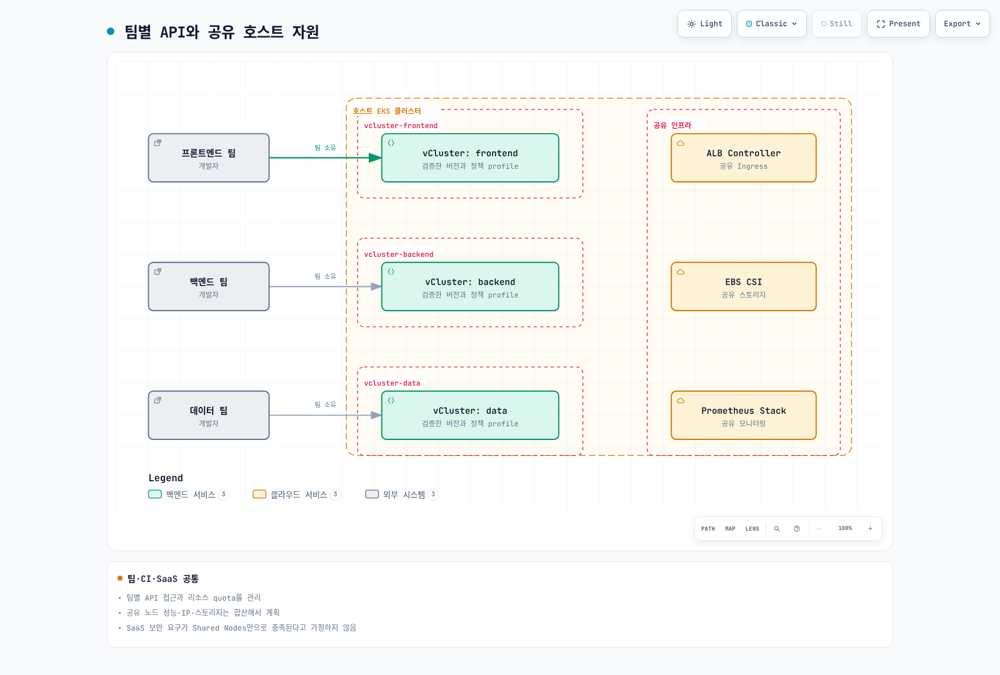
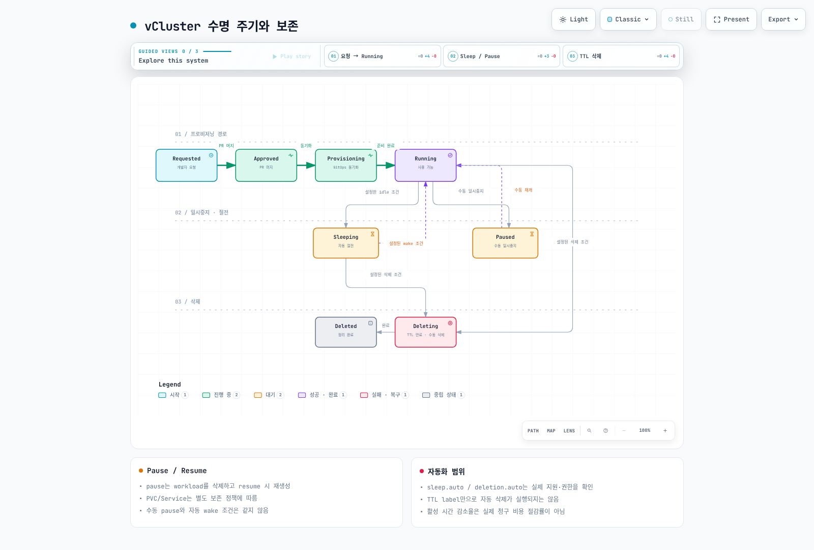
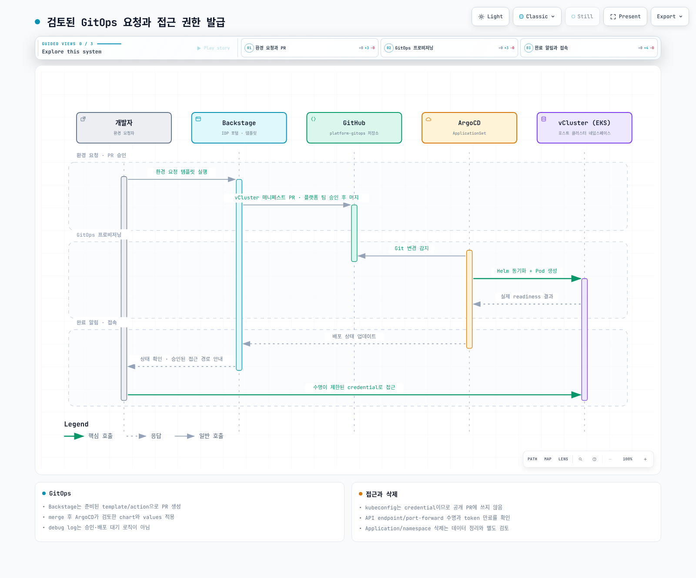

# vCluster

> **마지막 업데이트**: 2026년 9월 13일 · 검토 기준 vCluster 0.37.0

## 개념과 격리 범위

vCluster는 팀별 Kubernetes API와 controller·데이터 저장소를 제공할 수 있습니다. 이 문서의 **Shared Nodes** 예제에서는 실제 workload가 호스트 클러스터의 노드에서 실행되므로 kernel·CNI·CSI와 자원 용량을 공유합니다. 독립된 API/RBAC가 완전한 하드웨어·네트워크·성능 격리를 의미하지는 않습니다.

| 방식 | 구분할 경계 |
| --- | --- |
| Namespace | API server와 cluster 리소스·노드를 공유하며 RBAC, quota, network policy가 필요합니다. |
| Shared Nodes vCluster | 가상 API를 나누고 workload node/CNI/CSI는 공유합니다. |
| Dedicated/Private Nodes | 별도 node 배치와 Private Nodes의 CNI/CSI 경계를 실제 구성에서 확인합니다. |
| Standalone | 호스트 control-plane cluster 없이 별도 인프라에서 실행하는 다른 배포 모드입니다. |
| 별도 Kubernetes cluster | 계정·VPC·관리자·하드웨어 공유 여부에 따라 격리 경계가 달라집니다. |

공개 저장소의 소스 라이선스는 Apache 2.0입니다. 배포 image, Platform 기능, 자동 sleep/snapshot 등은 선택한 제품·지원·entitlement를 확인해야 합니다. 원문의 “CNCF Sandbox 2024년 11월 합류” 주장은 공식 프로젝트 페이지로 확인되지 않아 제거했습니다. Kubernetes conformance 표시는 CNCF 프로젝트 소속과 다른 사항입니다.

30초 생성, 100~200MiB overhead, 수백 cluster 수용량, 60~70% 비용 절감은 일반 보장으로 사용하지 않습니다. 실제 profile, host API 부하, PVC, image pull, workload와 청구 방식에 따라 측정하세요.



[인터랙티브 다이어그램](https://www.atomai.click/kubernetes-docs/archmaps/ko-platform-engineering-08-vcluster-10.html)

## 현재 버전과 기본 구성

검토 중 GitHub의 latest endpoint는 0.36.1을 반환했지만 0.37.0이 2026년 9월 8일 stable release로 공개된 것을 별도로 확인했습니다. 따라서 이 예제는 CLI/chart 0.37.0을 기준으로 합니다. 배포판 Kubernetes image는 존재를 확인한 ghcr.io/loft-sh/kubernetes:v1.36.3을 사용합니다. image 실행·전체 조합의 runtime 호환성은 별도 검증 대상입니다.

현재 schema에는 과거 k3s/k0s distro 설정이 없습니다. k8s 설정, backing store와 정확한 version을 구분하고 예전 키를 복사하지 않습니다. 기본 chart image는 vcluster-pro이며 image 이름만으로 소스 라이선스나 무료 사용 범위를 판단하지 않습니다.

아래 profile은 replica 1개와 embedded database, PVC를 사용하는 Shared Nodes 예제입니다. gp3 StorageClass와 CSI, quota·identity·host 정책은 운영자가 준비해야 합니다.

```yaml
controlPlane:
  distro:
    k8s:
      enabled: true
      image:
        tag: v1.36.3
  backingStore:
    database:
      embedded:
        enabled: true
  statefulSet:
    highAvailability:
      replicas: 1
    resources:
      requests:
        cpu: 200m
        memory: 512Mi
        ephemeral-storage: 1Gi
      limits:
        cpu: "2"
        memory: 4Gi
        ephemeral-storage: 10Gi
    persistence:
      volumeClaim:
        enabled: true
        storageClass: gp3
        size: 10Gi
        retentionPolicy: Retain
  service:
    spec:
      type: ClusterIP
  ingress:
    enabled: false
sync:
  fromHost:
    nodes:
      enabled: false
    storageClasses:
      enabled: true
  toHost:
    pods:
      enabled: true
    services:
      enabled: true
    configMaps:
      enabled: true
      all: false
    secrets:
      enabled: true
      all: false
    persistentVolumeClaims:
      enabled: true
    ingresses:
      enabled: false
    serviceAccounts:
      enabled: false
    networkPolicies:
      enabled: false
privateNodes:
  enabled: false
policies:
  podSecurityStandard: restricted
telemetry:
  enabled: false
```

실제 schema/Helm 렌더링을 통과했습니다. 그러나 embedded database와 replica 3개 조합도 Helm은 렌더링하고 런타임 소스는 거부합니다. HA는 지원 backing store와 quorum·스토리지·복구 검증을 통해 구성해야 하며 replica 숫자만 올리지 않습니다.

sync의 configMaps, serviceAccounts, persistentVolumeClaims 등은 대소문자가 정확해야 합니다. StorageClass/CSI의 auto 기본값도 배포 모드에 따라 결정되므로 “항상 모두 동기화”라고 설명하지 않습니다. 이 profile은 ingress, ServiceAccount와 NetworkPolicy 동기화를 명시적으로 끕니다.



[인터랙티브 다이어그램](https://www.atomai.click/kubernetes-docs/archmaps/ko-platform-engineering-08-vcluster-11.html)

상위 Deployment/ReplicaSet controller와 실제 host Pod를 구분합니다. Syncer의 이름·label 변환은 mode, 길이와 버전에 따라 달라질 수 있으므로 IRSA trust나 운영 스크립트에서 문자열을 추측해 고정하지 않습니다. fromHost.nodes의 가시성 설정은 workload node 격리를 자동 보장하지 않습니다.

## 설치와 연결

CLI artifact는 OS/architecture와 공식 checksum을 확인합니다. 예제 명령은 실제 클러스터를 변경할 수 있으므로 HOST_CONTEXT와 namespace를 먼저 확인합니다. 이 검토에서는 create/delete/snapshot을 실행하지 않았습니다.

```bash
helm repo add loft-sh https://charts.loft.sh
helm repo update
helm template team-alpha loft-sh/vcluster   --version 0.37.0 --namespace vcluster-team-alpha   -f examples/platform/vcluster/vcluster.yaml

# After the reviewed host prerequisites are ready:
vcluster create team-alpha --driver helm --context HOST_CONTEXT   --namespace vcluster-team-alpha --chart-version 0.37.0   --values examples/platform/vcluster/vcluster.yaml --connect=false

# Keep the forwarding lifetime tied to the child command:
vcluster connect team-alpha --driver helm --context HOST_CONTEXT   --namespace vcluster-team-alpha --background-proxy=false --   kubectl get namespaces
```

`connect`는 접속 경로와 kubeconfig를 다룹니다. 오래된 --update-current/--kube-config는 제거된 옵션이 아니라 deprecated alias였습니다. `--print`로 credential을 출력할 수 있지만 채팅·로그·PR에 노출하지 말고 제한된 파일로 저장합니다.

외부에서 재사용할 kubeconfig는 접근 가능한 API endpoint, 인증서 SAN/CA와 credential 만료가 필요합니다. localhost port-forward 주소만 저장하고 forwarding 프로세스가 종료되면 계속 접근할 수 없습니다. background proxy는 Docker와 별도 image가 필요할 수 있습니다. 사용자별 최소 권한 ServiceAccount와 --token-expiration을 검토하고 기본 admin credential을 공동 배포하지 않습니다.

호스트 작업에는 --context HOST_CONTEXT를 명시하여 tenant context에서 namespace 삭제·backup 명령을 잘못 실행하지 않습니다. 여러 교육용 cluster를 병렬 생성할 때는 각 종료 코드를 수집하고, 실패했는데 모두 준비됐다고 출력하지 않습니다.

## EKS 스토리지·Ingress·IAM

Shared Nodes에서 PVC는 host로 동기화되고 host CSI가 실제 volume을 처리합니다. StorageClass, volumeBindingMode, topology, reclaimPolicy와 보존 정책을 함께 확인합니다. statefulSet.persistence.volumeClaim.storageClass/size가 현재 profile의 경로입니다.

Ingress를 host로 동기화할 경우 실제 LBC와 IngressClass, Service 참조, TLS·보안 그룹·접근 경로를 준비합니다. host LBC webhook Service를 임의로 tenant에 복제한다고 ALB 통합이 구성되는 것은 아닙니다. Service annotation은 controlPlane.service.annotations에 두며 service.spec.annotations는 Kubernetes ServiceSpec 필드가 아닙니다.

ServiceAccount sync가 꺼져 있으면 host workload ServiceAccount 경로를 사용하고, 켜면 실제 syncer 동작과 이름 변환을 확인해야 합니다. 가상 Pod annotation 복사만으로 IRSA가 구성되지는 않습니다. host ServiceAccount, token issuer/subject/audience, role trust와 injection을 확인하고 tenant가 임의 IAM role annotation으로 권한을 얻지 못하게 제한합니다.

## 격리와 거버넌스

```yaml
apiVersion: v1
kind: Namespace
metadata:
  name: vcluster-team-alpha
  labels:
    platform.example.com/tenant: team-alpha
    pod-security.kubernetes.io/enforce: baseline
    pod-security.kubernetes.io/enforce-version: v1.36
---
apiVersion: v1
kind: ResourceQuota
metadata:
  name: vcluster-budget
  namespace: vcluster-team-alpha
spec:
  hard:
    requests.cpu: "8"
    requests.memory: 16Gi
    limits.cpu: "16"
    limits.memory: 32Gi
    requests.ephemeral-storage: 20Gi
    limits.ephemeral-storage: 80Gi
    pods: "50"
    services: "20"
    services.loadbalancers: "0"
    services.nodeports: "0"
    persistentvolumeclaims: "10"
    requests.storage: 100Gi
---
apiVersion: v1
kind: LimitRange
metadata:
  name: workload-defaults
  namespace: vcluster-team-alpha
spec:
  limits:
    - type: Container
      defaultRequest:
        cpu: 100m
        memory: 128Mi
      default:
        cpu: "1"
        memory: 512Mi
```

chart의 control-plane Syncer는 기본 UID 0으로 렌더링됩니다. 따라서 host namespace에 restricted를 무조건 적용하면 control plane부터 거부될 수 있습니다. 위 namespace의 baseline과 profile의 policies.podSecurityStandard: restricted는 대상이 다릅니다. 전자는 host admission, 후자는 virtual workload 검사이며 실제 번역된 Pod와 host 정책을 함께 검증해야 합니다.

Quota는 control plane, CoreDNS, tenant workload와 storage를 합친 예산입니다. quota가 node capacity를 예약하거나 성능을 보장하지는 않습니다. 생성된 Role/ClusterRole과 Secret 접근 범위를 검토하고 tenant에게 host namespace의 모든 Secret/Role 수정 권한을 주지 않습니다.

선택적으로 아래 chart network policy를 렌더링할 수 있습니다.

```yaml
policies:
  networkPolicy:
    enabled: true
    workload:
      publicEgress:
        enabled: false
```

실제 렌더링에서는 workload public egress가 꺼졌지만 control plane에는 443/8443/6443 등의 넓은 egress가 남았습니다. 이를 완전한 host API 차단으로 표시하지 않습니다. NetworkPolicy는 허용 규칙이 합쳐지므로 별도의 “deny” 정책을 추가해 기존 allow를 축소할 수 없습니다.

Syncer는 host API 접근이 필요합니다. control plane까지 같은 deny-egress로 막으면 동기화가 멈출 수 있습니다. DNS, API endpoint IP/DNAT, 필요한 app·DB·registry 경로와 CNI의 실제 동작을 검증합니다. default-deny 및 예외는 신뢰한 control-plane/workload 구분 기준으로 설계해야 합니다.



[인터랙티브 다이어그램](https://www.atomai.click/kubernetes-docs/archmaps/ko-platform-engineering-08-vcluster-12.html)

## Pause·Sleep·삭제·Snapshot

현재 CLI pause는 virtual control plane을 줄이고 workload를 삭제하며 resume 때 재생성합니다. PVC와 Service 등은 별도 보존 경로를 따릅니다. 따라서 Pod 메모리 상태가 보존되는 suspend나 데이터 backup으로 설명하지 않습니다. 수동 pause와 자동 sleep의 wake 조건도 구분합니다.

아래는 optional lifecycle 설정입니다. product entitlement, 실제 controller와 workload 동작을 먼저 확인합니다. 자동 삭제는 켜지 않았습니다.

```yaml
# Optional configuration: verify product entitlement and workload behavior first.
sleep:
  auto:
    afterInactivity: 30m
    schedule: "0 20 * * 1-5"
    timezone: Etc/UTC
    wakeup:
      schedule: "0 8 * * 1-5"
# No automatic deletion is enabled by this example.
deletion:
  prevent: true
```

현재 설정은 sleep.auto와 deletion.auto 등의 경로를 사용합니다. 원문의 임의 management.loft.sh/VirtualCluster 필드는 현재 설정 계약으로 사용하지 않습니다. TTL label/annotation만 붙여도 삭제가 실행되지는 않습니다. 실제 controller가 해석하는 정책과 owner·active workload·backup 확인이 필요합니다.

namespace 삭제는 내부 PVC와 남은 workload까지 제거할 수 있습니다. vcluster delete/Helm uninstall/ArgoCD Application 삭제의 차이와 PVC retention·PV reclaim·external resources를 확인하세요. 삭제 방지 설정도 host 관리자가 namespace를 직접 지우는 모든 경로를 막는다고 가정하지 않습니다.

snapshot create는 비동기 요청입니다. snapshot 요청 성공과 ready/복구 성공을 구분합니다. PV의 이름은 EBS volume ID가 아니며 EBS라면 실제 PV의 spec.csi.driver와 volumeHandle을 확인해야 합니다. live database 디스크 snapshot에는 일관성·quiescing·복구 시험이 필요합니다.

0.37 chart는 deploy.volumeSnapshotController를 거부하지만 paired volumeSnapshots/volumeSnapshotContents 동기화 옵션은 다시 지원합니다. stale schema 주석만으로 모두 제거됐다고 판단하지 않았습니다. CSI Snapshot controller/class와 양쪽 옵션, 실제 restore 동작을 별도로 준비합니다. Secret을 평문 파일로 나열해 저장한 결과를 완전한 backup이라고 부르지 않습니다.



[인터랙티브 다이어그램](https://www.atomai.click/kubernetes-docs/archmaps/ko-platform-engineering-08-vcluster-14.html)

## Backstage·ArgoCD·임시 환경

팀 개발, CI, PR preview, 교육과 SaaS는 서로 다른 trust·성능·수명 요구를 갖습니다. “개발 환경이면 Spot 중단을 견딘다”거나 “SaaS 고객이 서로 영향을 주지 않는다”고 일반화하지 않습니다.

CI에서는 host 접근 identity, 신뢰한 event/branch와 OIDC permissions를 먼저 구성합니다. fork의 신뢰하지 않은 코드에 host credential을 주지 않습니다. 생성·접속·test·cleanup마다 정확한 namespace와 context를 사용하고 port-forward lifetime을 test와 연결합니다. 독립 cleanup job에도 필요한 tools·identity가 있어야 하며 모든 exit code를 확인합니다.

아래 ApplicationSet은 누락됐던 $values sourceRef를 포함합니다. vclusters/team-alpha/config.yaml에 gitops-config.yaml 내용, 같은 디렉터리에 검토한 vcluster.yaml을 둡니다. repo와 AppProject/destination 권한을 실제 승인된 값으로 바꿉니다.

```yaml
apiVersion: argoproj.io/v1alpha1
kind: ApplicationSet
metadata:
  name: reviewed-vclusters
  namespace: argocd
spec:
  goTemplate: true
  goTemplateOptions: ["missingkey=error"]
  generators:
    - git:
        repoURL: https://github.com/REPLACE_APPROVED_ORG/platform-config
        revision: main
        files:
          - path: vclusters/*/config.yaml
  syncPolicy:
    preserveResourcesOnDeletion: true
  template:
    metadata:
      name: "vcluster-{{ .name }}"
    spec:
      project: vcluster-tenants
      sources:
        - repoURL: https://charts.loft.sh
          chart: vcluster
          targetRevision: "0.37.0"
          helm:
            releaseName: "{{ .name }}"
            valueFiles:
              - "$values/vclusters/{{ .name }}/vcluster.yaml"
        - repoURL: https://github.com/REPLACE_APPROVED_ORG/platform-config
          targetRevision: main
          ref: values
      destination:
        server: https://kubernetes.default.svc
        namespace: "{{ .namespace }}"
      syncPolicy:
        automated:
          selfHeal: true
          prune: false
        syncOptions: [CreateNamespace=true]
```

preserveResourcesOnDeletion과 prune:false는 config 제거가 곧바로 모든 데이터 삭제로 이어지지 않도록 선택한 예입니다. 남은 리소스의 비용·소유권과 실제 decommission 절차는 별도로 관리합니다. Backstage의 debug:log action은 PR 승인이나 배포 대기를 구현하지 않습니다.



[인터랙티브 다이어그램](https://www.atomai.click/kubernetes-docs/archmaps/ko-platform-engineering-08-vcluster-13.html)

## 관찰·자원·비용

StatefulSet desired replicas가 0인 pause 상태를 장애로 바로 알리지 않습니다. 단일 absent()로 모든 cluster를 집계하면 하나가 살아 있을 때 다른 장애를 놓칠 수 있습니다. 실제 job/namespace/pod/container label과 metrics endpoint, 정상 pause inventory를 확인해 경보를 구성합니다. chart container 이름은 syncer이며 임의 vcluster_syncer_* 메트릭 존재를 가정하지 않습니다.

requests는 사용량이나 청구 비용이 아닙니다. CPU 1과 250m, memory 1Gi와 512Mi를 문자열 숫자처럼 더할 수 없습니다. examples/platform/vcluster/usage는 Kubernetes PodRequests 함수를 사용해 단위, init container, overhead와 Pod-level request를 계산합니다.

```bash
# Run inside examples/platform/vcluster/usage with the pinned Go dependencies:
kubectl --context HOST_CONTEXT get pods -n vcluster-team-alpha -o json | go run .
```

이 도구는 종료된 Pod를 제외한 spec 기준 요청 합계이며 실제 RSS/CPU, resize status, PVC 비용을 계산하지 않습니다. 3개의 합성 사례로 검증했고 실제 cluster 조회는 실행하지 않았습니다.

168시간에서 50시간으로 active time이 줄었다고 node·EBS·load balancer·라이선스 비용이 같은 비율로 줄지는 않습니다. node scale-down과 잔여 storage, 약정, 최소 용량을 실제 청구 자료와 비교하세요. Kubernetes label이 자동으로 AWS cost-allocation tag가 되는 것도 아닙니다.

EKS의 API server/etcd replica나 instance type을 사용자가 직접 조정할 수 있다고 안내하지 않습니다. 관리형 제어 평면의 지원되는 설정·quota와 workload API 호출량을 확인합니다. upgrade는 chart/CLI/Kubernetes/store 조합을 pin하고 backup·staging 검증을 거쳐 수행하며, 같은 release 이름이 여러 namespace에 있을 수 있음을 고려합니다.

## 수행한 검증

한국어 1,998줄·영어 2,171줄과 각 퀴즈 143줄, 고유 code block 106개를 읽었습니다. 0.37.0의 schema와 Helm profile, lifecycle/network policy 렌더링, 공식 checksum과 image index, Kubernetes resource 계산을 검증했습니다. schema와 runtime 제약이 다른 사례도 기록했습니다.

0.36.1에서 deprecated 연결 옵션을 확인하려던 두 시도는 기존 cluster에 read-only 조회를 시도했으나 Unauthorized로 실패했습니다. 리소스 변경은 없었고 이후 0.37 검증은 version/help/source와 오프라인 chart로 제한했습니다. 실제 vCluster 생성, image 실행, sleep/delete/snapshot/restore, 네트워크 격리·IAM 인증·부하·비용 절감은 검증하지 않았습니다.

- [vCluster 0.37.0](https://github.com/loft-sh/vcluster/releases/tag/v0.37.0)
- [Versioned configuration](https://github.com/loft-sh/vcluster/blob/v0.37.0/config/values.yaml)
- [Versioned schema](https://github.com/loft-sh/vcluster/blob/v0.37.0/chart/values.schema.json)
- [Architecture](https://www.vcluster.com/docs/vcluster/introduction/architecture)
- [Sleep configuration](https://www.vcluster.com/docs/vcluster/configure/vcluster-yaml/sleep)

[Backstage](06-backstage-idp.md) · [Crossplane](07-crossplane.md)

[vCluster 퀴즈](../quizzes/platform-engineering/08-vcluster-quiz.md)
