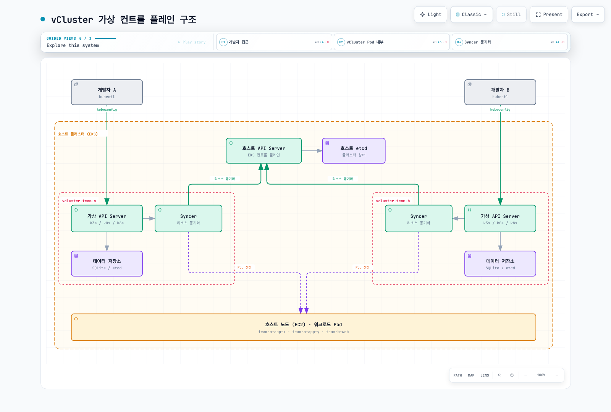
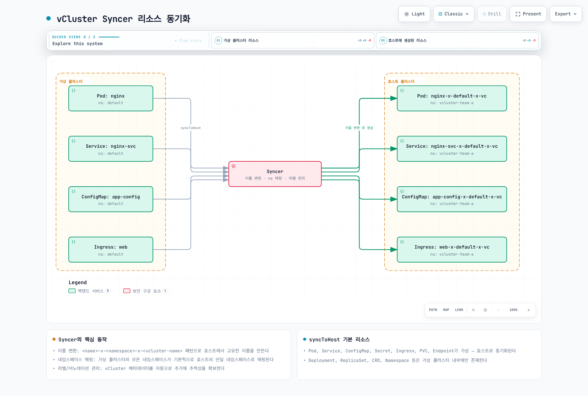
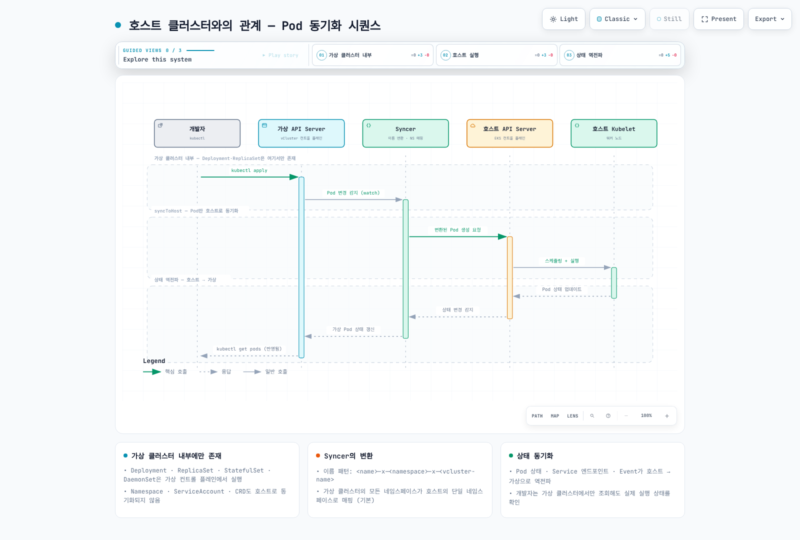
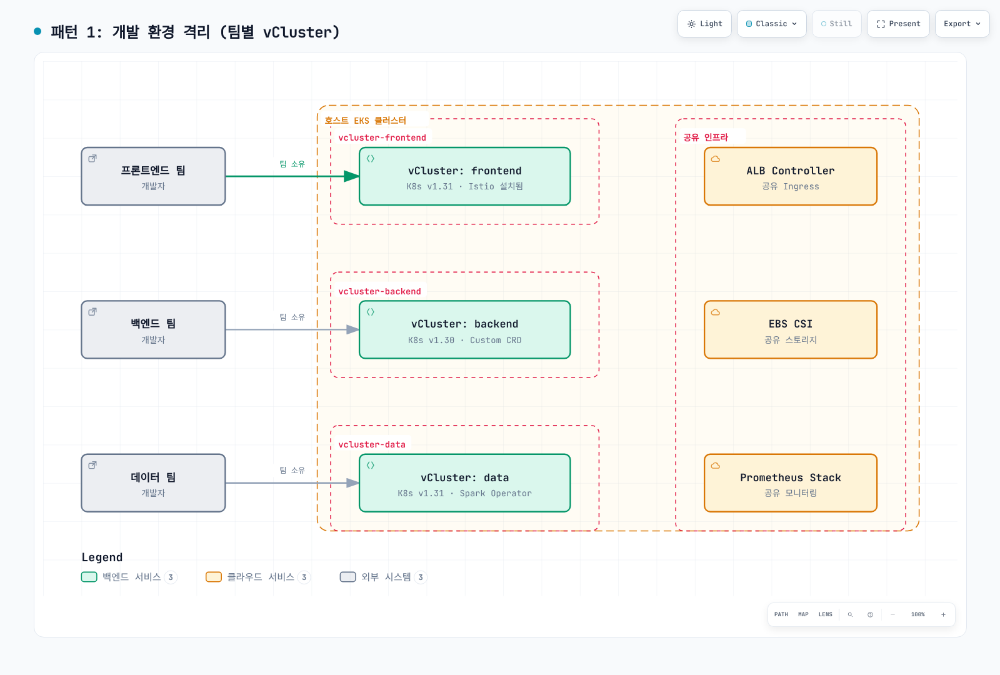
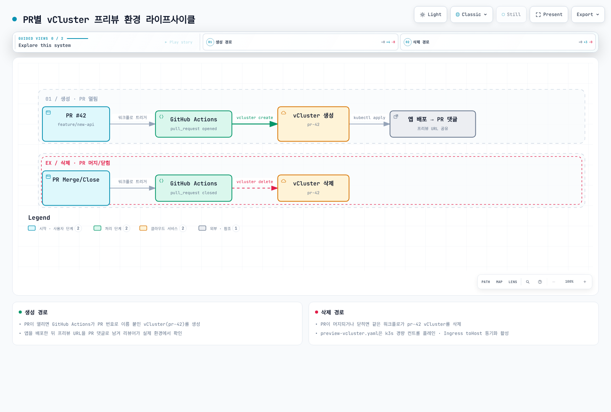
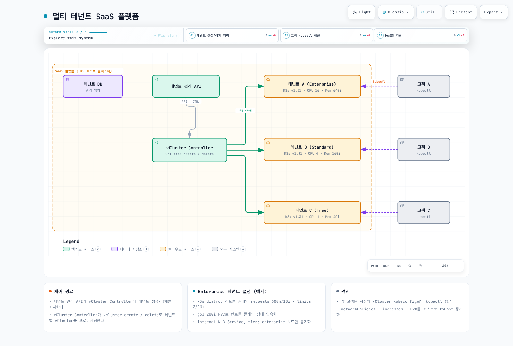
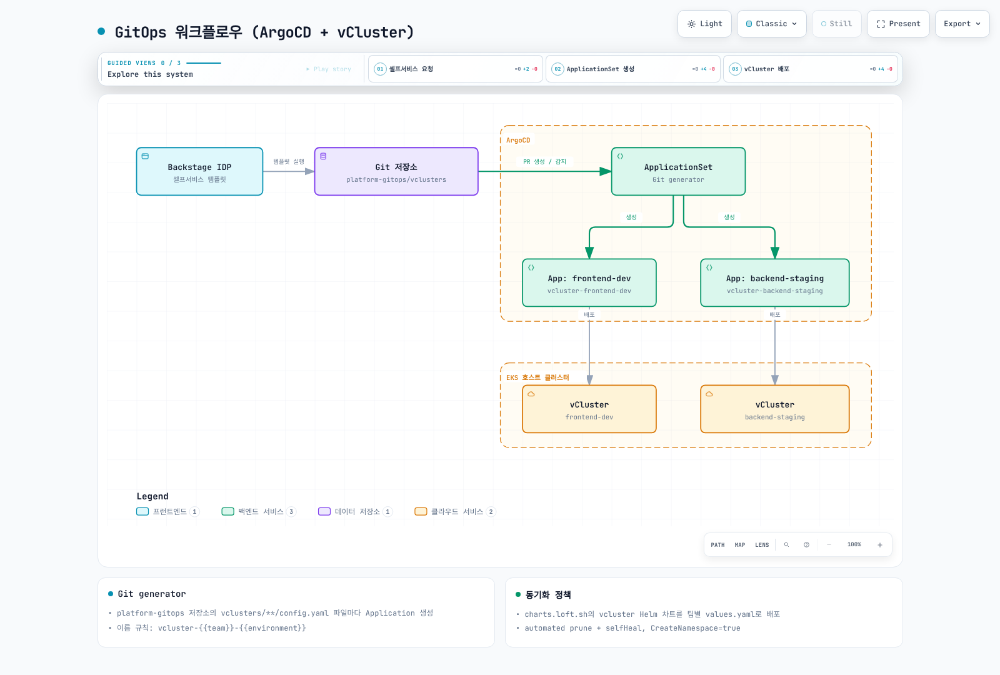
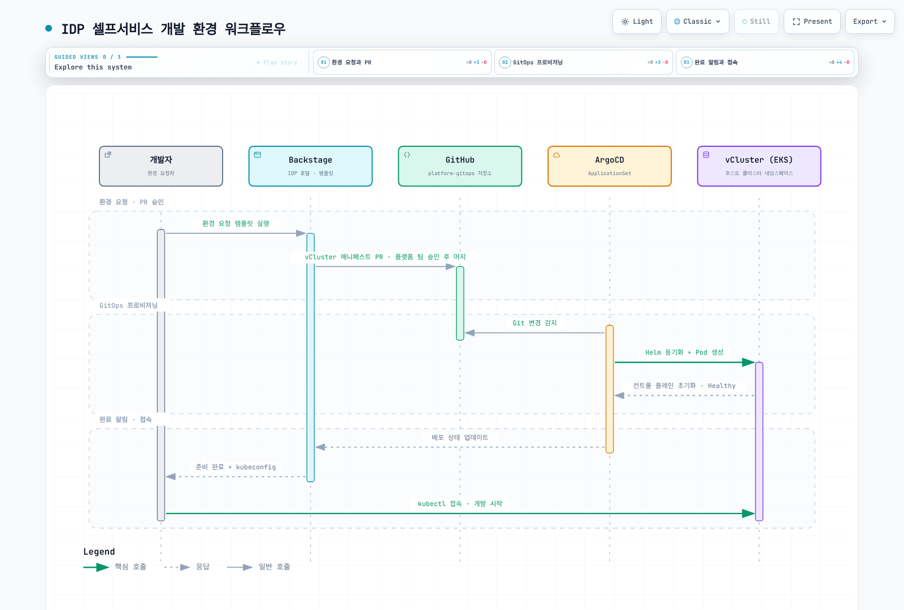
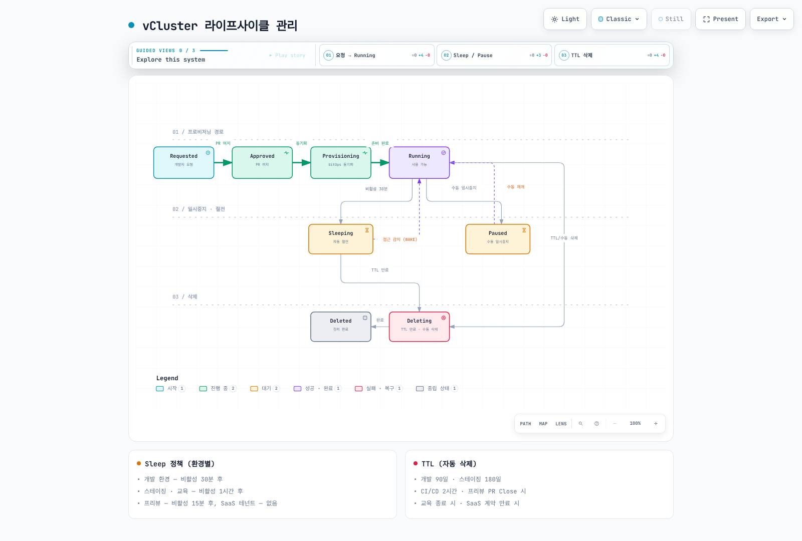

# vCluster

> **지원 버전**: vCluster v0.21+, vCluster Pro v0.21+
> **마지막 업데이트**: 2025년 6월

## 목차

- [개요 및 학습 목표](#개요-및-학습-목표)
- [vCluster 아키텍처](#vcluster-아키텍처)
- [EKS 설치 및 구성](#eks-설치-및-구성)
- [가상 클러스터 운영](#가상-클러스터-운영)
- [멀티 테넌시 패턴](#멀티-테넌시-패턴)
- [보안 및 격리](#보안-및-격리)
- [Backstage + vCluster 통합](#backstage--vcluster-통합)
- [프로덕션 운영](#프로덕션-운영)
- [모범 사례](#모범-사례)
- [참고 자료](#참고-자료)

---

## 개요 및 학습 목표

### vCluster란?

vCluster(Virtual Cluster)는 Kubernetes 클러스터 내부에 **가상 Kubernetes 클러스터**를 생성하는 오픈소스 프로젝트입니다. 각 가상 클러스터는 독립된 컨트롤 플레인(API Server, Controller Manager, etcd/SQLite)을 가지며, 실제 워크로드는 호스트 클러스터의 노드에서 실행됩니다. 이를 통해 물리 클러스터를 추가하지 않고도 완전한 클러스터 수준의 격리를 제공할 수 있습니다.

vCluster는 **Loft Labs**가 개발하며, CNCF Sandbox 프로젝트(2024년 11월 합류)로서 Kubernetes 멀티 테넌시 영역에서 빠르게 성장하고 있습니다. 상용 버전인 **vCluster Pro**는 Sleep Mode, Auto-Delete, 중앙 관리 UI 등 엔터프라이즈 기능을 추가로 제공합니다.

### 왜 vCluster인가?

Kubernetes에서 멀티 테넌시를 구현하는 전통적인 방법들에는 다음과 같은 한계가 있습니다.

**기존 접근 방식의 문제점:**

- **Namespace 격리**: 가장 단순하지만, CRD/ClusterRole/Webhook 등 클러스터 스코프 리소스를 공유해야 함. 테넌트 간 충돌 위험
- **물리 클러스터 분리**: 완벽한 격리를 제공하지만, 클러스터 당 컨트롤 플레인 비용(EKS의 경우 월 $73)과 관리 오버헤드가 큼
- **Namespace-as-a-Service**: RBAC과 ResourceQuota로 제한적 격리를 제공하지만, 테넌트가 자체 CRD를 설치하거나 Admission Webhook를 구성할 수 없음

**vCluster가 제공하는 가치:**

- **완전한 컨트롤 플레인 격리**: 각 테넌트가 자체 API Server를 보유하여 CRD, RBAC, Admission Webhook를 독립적으로 관리
- **경량 오버헤드**: 가상 컨트롤 플레인은 단일 Pod(또는 StatefulSet)으로 실행되며, 물리 클러스터 대비 리소스 소모가 미미
- **빠른 프로비저닝**: 새 가상 클러스터를 수 초 내에 생성 가능. 물리 클러스터 프로비저닝(10-15분) 대비 극적으로 빠름
- **비용 효율**: 하나의 호스트 클러스터에서 수십~수백 개의 가상 클러스터를 운영하여 컨트롤 플레인 비용 절감
- **호환성**: 표준 Kubernetes API를 완전히 지원하여 기존 도구(Helm, ArgoCD, Terraform 등)가 그대로 동작

### 멀티 테넌시 격리 수준 비교

| 비교 기준 | Namespace 격리 | vCluster | 물리 클러스터 분리 |
|-----------|---------------|----------|-------------------|
| **격리 수준** | 낮음 (논리적) | 높음 (가상 컨트롤 플레인) | 최고 (물리적) |
| **CRD 독립성** | ❌ 공유 | ✅ 독립 | ✅ 독립 |
| **RBAC 독립성** | ⚠️ ClusterRole 공유 | ✅ 독립 | ✅ 독립 |
| **Admission Webhook** | ❌ 공유 | ✅ 독립 | ✅ 독립 |
| **네트워크 격리** | ⚠️ NetworkPolicy 필요 | ⚠️ NetworkPolicy 필요 | ✅ 물리적 분리 |
| **노드 격리** | ❌ 공유 | ❌ 공유 (기본값) | ✅ 독립 |
| **프로비저닝 속도** | 즉시 | 수 초 | 10-15분 |
| **컨트롤 플레인 비용** | 없음 | 매우 낮음 (Pod 수준) | 높음 (클러스터 당) |
| **관리 복잡도** | 낮음 | 중간 | 높음 |
| **테넌트 자율성** | 낮음 | 높음 | 최고 |
| **Kubernetes 버전 독립** | ❌ 공유 | ✅ 독립 선택 가능 | ✅ 독립 |

### 학습 목표

이 문서를 통해 다음을 학습합니다:

1. **vCluster의 핵심 개념**(가상 컨트롤 플레인, Syncer, 리소스 동기화)을 이해하고 설명할 수 있다
2. **Amazon EKS에 vCluster를 설치**하고 EKS 특화 설정(EBS CSI, ALB, IRSA)을 구성할 수 있다
3. **가상 클러스터의 전체 라이프사이클**(생성, 접근, 일시중지, 삭제)을 관리할 수 있다
4. **리소스 동기화 규칙**을 이해하고, syncFromHost/syncToHost를 목적에 맞게 커스터마이즈할 수 있다
5. **멀티 테넌시 패턴**(개발 환경, CI/CD, 프리뷰, SaaS)을 요구사항에 맞게 설계하고 구현할 수 있다
6. **보안 격리**(NetworkPolicy, ResourceQuota, PSS, RBAC)를 프로덕션 수준으로 구성할 수 있다
7. **Backstage + ArgoCD + vCluster**를 연동한 IDP 셀프서비스 워크플로우를 구축할 수 있다

---

## vCluster 아키텍처

### 가상 컨트롤 플레인 구조

vCluster의 핵심은 호스트 클러스터 내부에서 실행되는 **가상 컨트롤 플레인**입니다. 각 가상 클러스터는 자체 API Server, Controller Manager, 데이터 저장소를 보유합니다.



[🔍 인터랙티브 다이어그램 보기](https://www.atomai.click/kubernetes-docs/archmaps/ko-platform-engineering-08-vcluster-0.html)

### Syncer 컴포넌트

Syncer는 vCluster의 핵심 컴포넌트로, 가상 클러스터와 호스트 클러스터 간의 **리소스 동기화**를 담당합니다.



[🔍 인터랙티브 다이어그램 보기](https://www.atomai.click/kubernetes-docs/archmaps/ko-platform-engineering-08-vcluster-1.html)

**Syncer의 핵심 동작:**

1. **이름 변환(Name Rewriting)**: 가상 클러스터의 리소스 이름을 호스트 클러스터에서 고유한 이름으로 변환합니다. 기본 패턴: `<name>-x-<namespace>-x-<vcluster-name>`
2. **네임스페이스 매핑**: 가상 클러스터의 모든 네임스페이스가 호스트 클러스터의 단일 네임스페이스로 매핑됩니다 (기본 동작). 멀티 네임스페이스 모드도 지원합니다.
3. **상태 동기화**: Pod 상태, Service 엔드포인트, Event 등 호스트 클러스터의 상태를 가상 클러스터로 역전파합니다.
4. **라벨/어노테이션 관리**: vCluster 관련 메타데이터를 자동으로 추가하여 추적성을 확보합니다.

### 리소스 동기화 메커니즘

vCluster는 리소스를 두 방향으로 동기화합니다:

| 동기화 방향 | 설명 | 기본 동기화 리소스 |
|------------|------|-------------------|
| **syncToHost** | 가상 → 호스트. 가상 클러스터에서 생성된 리소스를 호스트에 반영 | Pod, Service, ConfigMap, Secret, Ingress, PVC, Endpoint |
| **syncFromHost** | 호스트 → 가상. 호스트 클러스터의 리소스를 가상 클러스터에 노출 | Node, StorageClass, IngressClass, CSINode, CSIDriver, CSIStorageCapacity |

**동기화되지 않는 리소스 (가상 클러스터 내부에만 존재):**

- Deployment, StatefulSet, DaemonSet, ReplicaSet (컨트롤러가 가상 컨트롤 플레인에서 실행)
- CRD, ClusterRole, ClusterRoleBinding (가상 클러스터 자체 리소스)
- Namespace (가상 클러스터 내부에서만 유효)
- ServiceAccount (가상 클러스터 자체 관리)

### 컨트롤 플레인 배포판 옵션

vCluster는 가상 컨트롤 플레인으로 사용할 Kubernetes 배포판을 선택할 수 있습니다:

| 배포판 | 설명 | 장점 | 단점 | 권장 시나리오 |
|--------|------|------|------|-------------|
| **k3s** (기본값) | Rancher의 경량 Kubernetes | 가장 가벼움, 빠른 시작, SQLite 기본 | 일부 API 비호환 가능 | 개발/테스트, 대부분의 프로덕션 |
| **k0s** | Mirantis의 경량 Kubernetes | 단일 바이너리, 낮은 리소스 | 커뮤니티 규모 작음 | 리소스 제약 환경 |
| **k8s** (vanilla) | 공식 Kubernetes | 완벽한 API 호환 | 리소스 사용량 높음 | 엄격한 호환성 요구 |
| **EKS** (vCluster Pro) | EKS 배포판 | EKS API 완벽 호환, IRSA 네이티브 | Pro 라이선스 필요 | EKS 기반 프로덕션 |

```yaml
# vcluster.yaml - 배포판 선택 예시
# k3s (기본값)
controlPlane:
  distro:
    k3s:
      enabled: true
      image:
        repository: rancher/k3s
        tag: v1.31.2-k3s1

---
# k0s
controlPlane:
  distro:
    k0s:
      enabled: true
      image:
        repository: k0sproject/k0s
        tag: v1.31.2-k0s.0

---
# Vanilla Kubernetes
controlPlane:
  distro:
    k8s:
      enabled: true
      apiServer:
        image:
          repository: registry.k8s.io/kube-apiserver
          tag: v1.31.2
      controllerManager:
        image:
          repository: registry.k8s.io/kube-controller-manager
          tag: v1.31.2
```

### 호스트 클러스터와의 관계



[🔍 인터랙티브 다이어그램 보기](https://www.atomai.click/kubernetes-docs/archmaps/ko-platform-engineering-08-vcluster-2.html)

이 시퀀스에서 핵심은 **Deployment와 ReplicaSet은 가상 클러스터 내부에서만 존재**하고, **Pod만 호스트 클러스터로 동기화**된다는 점입니다. 이를 통해 가상 클러스터는 자체 컨트롤러 로직을 독립적으로 실행하면서도 호스트 클러스터의 컴퓨팅 리소스를 효율적으로 공유합니다.

---

## EKS 설치 및 구성

### 사전 요구사항

- Amazon EKS 클러스터 (v1.27 이상)
- kubectl 설치 및 EKS kubeconfig 구성
- Helm v3.10 이상
- EBS CSI Driver 설치 (가상 클러스터 데이터 저장소 PVC 용도)

### vCluster CLI 설치

```bash
# macOS
brew install loft-sh/tap/vcluster

# Linux (amd64)
curl -L -o vcluster "https://github.com/loft-sh/vcluster/releases/latest/download/vcluster-linux-amd64"
chmod +x vcluster
sudo mv vcluster /usr/local/bin/

# 설치 확인
vcluster version
```

### Helm을 이용한 설치

vCluster CLI 없이 Helm만으로도 가상 클러스터를 프로비저닝할 수 있습니다. 이 방법은 GitOps 워크플로우에서 특히 유용합니다.

```bash
# vCluster Helm 저장소 추가
helm repo add loft-sh https://charts.loft.sh
helm repo update

# 기본 설정으로 가상 클러스터 생성
helm install my-vcluster loft-sh/vcluster \
  --namespace vcluster-my-vcluster \
  --create-namespace \
  --values vcluster.yaml
```

### vcluster.yaml 구성 파일

프로덕션 환경에서 사용할 수 있는 완전한 구성 예제입니다:

```yaml
# vcluster.yaml - EKS 프로덕션 구성
# ======================================

# 컨트롤 플레인 설정
controlPlane:
  # 배포판 선택 (k3s가 기본값)
  distro:
    k3s:
      enabled: true
      image:
        repository: rancher/k3s
        tag: v1.31.2-k3s1
      # 가상 클러스터에서 사용할 추가 인자
      extraArgs:
        - --kube-apiserver-arg=--audit-log-path=/var/log/audit.log
        - --kube-apiserver-arg=--audit-log-maxage=7

  # 컨트롤 플레인 리소스 제한
  statefulSet:
    resources:
      requests:
        cpu: 200m
        memory: 256Mi
      limits:
        cpu: "1"
        memory: 2Gi

    persistence:
      # 데이터 저장소 PVC 설정 (EBS 볼륨 사용)
      volumeClaim:
        enabled: true
        storageClassName: gp3
        accessModes:
          - ReadWriteOnce
        size: 5Gi

    # 고가용성: 컨트롤 플레인 replicas
    # (vCluster Pro 전용, OSS는 1)
    replicas: 1

  # 가상 API Server 노출 방식
  service:
    spec:
      type: ClusterIP  # ClusterIP | LoadBalancer | NodePort

  # Ingress를 통한 API Server 노출
  ingress:
    enabled: false
    # host: vcluster-team-a.example.com

  # CoreDNS 설정
  coredns:
    enabled: true
    resources:
      requests:
        cpu: 20m
        memory: 64Mi
      limits:
        cpu: 100m
        memory: 128Mi

# 리소스 동기화 설정
sync:
  # 호스트 → 가상 클러스터 동기화
  fromHost:
    # 호스트 노드를 가상 클러스터에 노출
    nodes:
      enabled: true
      # 특정 노드만 동기화 (선택적)
      selector:
        labels:
          node-pool: "general"

    # 스토리지 클래스 동기화
    storageClasses:
      enabled: true

    # CSI 관련 리소스 동기화 (EBS CSI Driver)
    csiNodes:
      enabled: true
    csiDrivers:
      enabled: true
    csiStorageCapacities:
      enabled: true

    # IngressClass 동기화 (ALB Ingress Controller)
    ingressClasses:
      enabled: true

  # 가상 → 호스트 클러스터 동기화
  toHost:
    pods:
      enabled: true
    services:
      enabled: true
    configMaps:
      enabled: true
      # 모든 ConfigMap 동기화 (기본: 참조된 것만)
      all: false
    secrets:
      enabled: true
      all: false
    ingresses:
      enabled: true
    persistentVolumeClaims:
      enabled: true
    endpoints:
      enabled: true
    networkPolicies:
      enabled: true

# 네트워킹 설정
networking:
  # 가상 클러스터 내부 DNS 해석
  replicateServices:
    fromHost:
      # 호스트 클러스터 서비스를 가상 클러스터에 노출
      - from: "kube-system/aws-load-balancer-webhook-service"
        to: "kube-system/aws-load-balancer-webhook-service"
    toHost: []

# 플러그인 (vCluster Pro)
# plugins: {}

# 실험적 기능
experimental:
  # 멀티 네임스페이스 모드 (고급)
  multiNamespaceMode:
    enabled: false

  # 격리 모드 (리소스 제한 강제)
  isolatedControlPlane:
    headless: false

  # 가상 클러스터 내 추가 Helm 차트 배포
  deploy:
    vcluster:
      helm: []
      manifests: ""
    host:
      helm: []
      manifests: ""

# Kubernetes 버전 텔레메트리
telemetry:
  enabled: false
```

### EKS 특화 설정

#### EBS CSI Driver 연동

가상 클러스터에서 PersistentVolumeClaim을 사용하려면 호스트 클러스터의 EBS CSI Driver와 StorageClass가 올바르게 동기화되어야 합니다:

```yaml
# vcluster.yaml - EBS CSI 동기화 설정
sync:
  fromHost:
    storageClasses:
      enabled: true
    csiNodes:
      enabled: true
    csiDrivers:
      enabled: true
    csiStorageCapacities:
      enabled: true
  toHost:
    persistentVolumeClaims:
      enabled: true
```

```bash
# 가상 클러스터 내에서 StorageClass 확인
vcluster connect my-vcluster -n vcluster-my-vcluster -- \
  kubectl get storageclass

# 가상 클러스터에서 PVC 생성 테스트
vcluster connect my-vcluster -n vcluster-my-vcluster -- \
  kubectl apply -f - <<EOF
apiVersion: v1
kind: PersistentVolumeClaim
metadata:
  name: test-ebs-pvc
spec:
  accessModes:
    - ReadWriteOnce
  storageClassName: gp3
  resources:
    requests:
      storage: 1Gi
EOF
```

#### ALB Ingress Controller 연동

가상 클러스터의 Ingress가 호스트 클러스터의 AWS ALB Ingress Controller를 사용하도록 설정합니다:

```yaml
# vcluster.yaml - ALB Ingress 설정
sync:
  fromHost:
    ingressClasses:
      enabled: true
  toHost:
    ingresses:
      enabled: true

networking:
  replicateServices:
    fromHost:
      - from: "kube-system/aws-load-balancer-webhook-service"
        to: "kube-system/aws-load-balancer-webhook-service"
```

```yaml
# 가상 클러스터 내에서 ALB Ingress 리소스 생성
apiVersion: networking.k8s.io/v1
kind: Ingress
metadata:
  name: app-ingress
  annotations:
    alb.ingress.kubernetes.io/scheme: internet-facing
    alb.ingress.kubernetes.io/target-type: ip
spec:
  ingressClassName: alb
  rules:
    - host: app.example.com
      http:
        paths:
          - path: /
            pathType: Prefix
            backend:
              service:
                name: app-service
                port:
                  number: 80
```

#### IRSA (IAM Roles for Service Accounts) 연동

가상 클러스터에서 IRSA를 사용하려면 호스트 클러스터의 ServiceAccount와 IAM Role 매핑이 필요합니다:

```yaml
# vcluster.yaml - IRSA 지원을 위한 동기화 설정
sync:
  toHost:
    pods:
      enabled: true
      # Pod에 IRSA 어노테이션 유지
      translatePatches:
        - path: "metadata.annotations"
          # IRSA 관련 어노테이션을 호스트로 전파
          regex:
            find: "eks\\.amazonaws\\.com/(.*)"
            replace: "eks.amazonaws.com/$1"
```

```yaml
# 가상 클러스터 내에서 IRSA를 사용하는 ServiceAccount
apiVersion: v1
kind: ServiceAccount
metadata:
  name: s3-reader
  namespace: default
  annotations:
    eks.amazonaws.com/role-arn: arn:aws:iam::123456789012:role/vcluster-team-a-s3-reader
---
apiVersion: apps/v1
kind: Deployment
metadata:
  name: s3-app
spec:
  replicas: 1
  selector:
    matchLabels:
      app: s3-app
  template:
    metadata:
      labels:
        app: s3-app
    spec:
      serviceAccountName: s3-reader
      containers:
        - name: app
          image: amazon/aws-cli:latest
          command: ["sleep", "infinity"]
```

### 리소스 제한

호스트 클러스터에서 가상 클러스터가 사용할 수 있는 리소스를 제한합니다:

```yaml
# 호스트 클러스터의 네임스페이스에 ResourceQuota 적용
apiVersion: v1
kind: ResourceQuota
metadata:
  name: vcluster-team-a-quota
  namespace: vcluster-team-a
spec:
  hard:
    requests.cpu: "8"
    requests.memory: 16Gi
    limits.cpu: "16"
    limits.memory: 32Gi
    pods: "50"
    services: "20"
    persistentvolumeclaims: "10"
    requests.storage: 100Gi
---
apiVersion: v1
kind: LimitRange
metadata:
  name: vcluster-team-a-limits
  namespace: vcluster-team-a
spec:
  limits:
    - type: Container
      default:
        cpu: 500m
        memory: 512Mi
      defaultRequest:
        cpu: 100m
        memory: 128Mi
      max:
        cpu: "4"
        memory: 8Gi
    - type: Pod
      max:
        cpu: "8"
        memory: 16Gi
```

---

## 가상 클러스터 운영

### vCluster 생성

```bash
# CLI를 이용한 기본 생성
vcluster create team-alpha \
  --namespace vcluster-team-alpha \
  --values vcluster.yaml

# Helm을 이용한 생성 (GitOps 친화적)
helm install team-alpha loft-sh/vcluster \
  --namespace vcluster-team-alpha \
  --create-namespace \
  --values vcluster.yaml

# 생성 상태 확인
vcluster list

# 출력 예시:
#  NAME          NAMESPACE              STATUS    VERSION   CONNECTED   AGE
#  team-alpha    vcluster-team-alpha    Running   0.21.0    True        2m
#  team-beta     vcluster-team-beta     Running   0.21.0    False       5h
```

### kubeconfig 접근

```bash
# 현재 터미널 세션에서 가상 클러스터에 접속 (포트 포워딩 자동 설정)
vcluster connect team-alpha -n vcluster-team-alpha

# kubeconfig를 파일로 내보내기
vcluster connect team-alpha -n vcluster-team-alpha \
  --update-current=false \
  --kube-config ./team-alpha-kubeconfig.yaml

# 내보낸 kubeconfig를 사용한 접속
export KUBECONFIG=./team-alpha-kubeconfig.yaml
kubectl get nodes
kubectl get namespaces

# 접속 해제
vcluster disconnect
```

### 가상 클러스터 내에서의 작업

```bash
# 가상 클러스터에 접속 후 일반적인 kubectl 명령어 사용
vcluster connect team-alpha -n vcluster-team-alpha

# 가상 클러스터의 노드 확인 (호스트 노드가 동기화됨)
kubectl get nodes -o wide

# 네임스페이스 생성 (가상 클러스터 내부에만 존재)
kubectl create namespace staging
kubectl create namespace production

# Deployment 배포
kubectl apply -f - <<EOF
apiVersion: apps/v1
kind: Deployment
metadata:
  name: nginx
  namespace: staging
spec:
  replicas: 3
  selector:
    matchLabels:
      app: nginx
  template:
    metadata:
      labels:
        app: nginx
    spec:
      containers:
        - name: nginx
          image: nginx:1.27
          ports:
            - containerPort: 80
          resources:
            requests:
              cpu: 50m
              memory: 64Mi
            limits:
              cpu: 200m
              memory: 256Mi
---
apiVersion: v1
kind: Service
metadata:
  name: nginx-svc
  namespace: staging
spec:
  selector:
    app: nginx
  ports:
    - port: 80
      targetPort: 80
EOF

# 가상 클러스터 내에서 확인
kubectl get pods -n staging
kubectl get svc -n staging

# 접속 해제
vcluster disconnect
```

```bash
# 호스트 클러스터에서 동기화된 리소스 확인
kubectl get pods -n vcluster-team-alpha
# NAME                                               READY   STATUS    RESTARTS   AGE
# nginx-x-staging-x-team-alpha-5d8f7b9c4-abc12       1/1     Running   0          1m
# nginx-x-staging-x-team-alpha-5d8f7b9c4-def34       1/1     Running   0          1m
# nginx-x-staging-x-team-alpha-5d8f7b9c4-ghi56       1/1     Running   0          1m
# team-alpha-0                                        1/1     Running   0          10m
```

### 일시중지 및 재개

비용 절감을 위해 사용하지 않는 가상 클러스터를 일시중지할 수 있습니다:

```bash
# 가상 클러스터 일시중지 (모든 워크로드 중지, 데이터 유지)
vcluster pause team-alpha -n vcluster-team-alpha

# 상태 확인
vcluster list
# NAME          NAMESPACE              STATUS    VERSION   CONNECTED   AGE
# team-alpha    vcluster-team-alpha    Paused    0.21.0    False       2h

# 가상 클러스터 재개
vcluster resume team-alpha -n vcluster-team-alpha

# 재개 후 상태 확인 (이전 워크로드가 복원됨)
vcluster connect team-alpha -n vcluster-team-alpha
kubectl get pods -A
```

### 가상 클러스터 삭제

```bash
# CLI로 삭제
vcluster delete team-alpha -n vcluster-team-alpha

# Helm으로 삭제
helm uninstall team-alpha -n vcluster-team-alpha
kubectl delete namespace vcluster-team-alpha

# 삭제 확인
vcluster list
```

### 리소스 동기화 규칙 커스터마이즈

#### 추가 리소스 동기화

기본 동기화 리소스 외에 추가 리소스를 동기화할 수 있습니다:

```yaml
# vcluster.yaml - 추가 동기화 설정

sync:
  toHost:
    # NetworkPolicy 동기화 (가상 클러스터에서 정의한 정책을 호스트에 적용)
    networkPolicies:
      enabled: true

    # PriorityClass를 호스트로 동기화하지 않음 (가상 클러스터 내부만)
    priorityClasses:
      enabled: false

  fromHost:
    # 특정 노드만 동기화 (라벨 셀렉터 사용)
    nodes:
      enabled: true
      selector:
        labels:
          team: "alpha"
          node-type: "compute"

    # 호스트의 특정 ConfigMap을 가상 클러스터에 노출
    configMaps:
      enabled: true
      selector:
        labels:
          vcluster-sync: "true"
```

#### 서비스 노출 방법

가상 클러스터의 서비스를 외부에 노출하는 세 가지 방법:

```yaml
# 방법 1: LoadBalancer (AWS NLB/ALB)
# vcluster.yaml
controlPlane:
  service:
    spec:
      type: LoadBalancer
      annotations:
        service.beta.kubernetes.io/aws-load-balancer-type: nlb
        service.beta.kubernetes.io/aws-load-balancer-scheme: internal
```

```yaml
# 방법 2: Ingress (NGINX Ingress Controller 또는 ALB)
# vcluster.yaml
controlPlane:
  ingress:
    enabled: true
    host: "team-alpha.vcluster.example.com"
    annotations:
      nginx.ingress.kubernetes.io/backend-protocol: HTTPS
      nginx.ingress.kubernetes.io/ssl-passthrough: "true"
      nginx.ingress.kubernetes.io/ssl-redirect: "true"
```

```yaml
# 방법 3: NodePort
# vcluster.yaml
controlPlane:
  service:
    spec:
      type: NodePort
```

---

## 멀티 테넌시 패턴

### 패턴 1: 개발 환경 격리 (팀별 vCluster)

각 개발 팀에 독립된 가상 클러스터를 제공하여, 팀 간 간섭 없이 자유롭게 개발할 수 있는 환경을 구성합니다.



[🔍 인터랙티브 다이어그램 보기](https://www.atomai.click/kubernetes-docs/archmaps/ko-platform-engineering-08-vcluster-3.html)

```yaml
# team-frontend-vcluster.yaml
controlPlane:
  distro:
    k3s:
      enabled: true
      image:
        tag: v1.31.2-k3s1

sync:
  fromHost:
    nodes:
      enabled: true
      selector:
        labels:
          node-pool: "general"
    storageClasses:
      enabled: true
    ingressClasses:
      enabled: true
    csiDrivers:
      enabled: true
    csiNodes:
      enabled: true
  toHost:
    ingresses:
      enabled: true
    networkPolicies:
      enabled: true

# 가상 클러스터 생성 시 자동으로 배포할 Helm 차트
experimental:
  deploy:
    vcluster:
      helm:
        # 팀에 필요한 도구를 자동 설치
        - chart:
            name: istio-base
            repo: https://istio-release.storage.googleapis.com/charts
            version: "1.24.0"
          release:
            name: istio-base
            namespace: istio-system
        - chart:
            name: istiod
            repo: https://istio-release.storage.googleapis.com/charts
            version: "1.24.0"
          release:
            name: istiod
            namespace: istio-system
```

### 패턴 2: CI/CD 임시 환경

CI/CD 파이프라인에서 테스트용 가상 클러스터를 동적으로 생성하고, 테스트 완료 후 자동으로 삭제합니다.

```yaml
# .github/workflows/integration-test.yaml
name: Integration Test with vCluster
on:
  pull_request:
    branches: [main]

jobs:
  test:
    runs-on: ubuntu-latest
    steps:
      - uses: actions/checkout@v4

      - name: Configure AWS credentials
        uses: aws-actions/configure-aws-credentials@v4
        with:
          role-to-assume: arn:aws:iam::123456789012:role/github-actions
          aws-region: ap-northeast-2

      - name: Update kubeconfig
        run: aws eks update-kubeconfig --name my-cluster --region ap-northeast-2

      - name: Install vCluster CLI
        run: |
          curl -L -o vcluster "https://github.com/loft-sh/vcluster/releases/latest/download/vcluster-linux-amd64"
          chmod +x vcluster
          sudo mv vcluster /usr/local/bin/

      - name: Create test vCluster
        run: |
          vcluster create test-${{ github.run_id }} \
            --namespace vcluster-test-${{ github.run_id }} \
            --values ci-vcluster.yaml \
            --connect=false

      - name: Deploy application
        run: |
          vcluster connect test-${{ github.run_id }} \
            -n vcluster-test-${{ github.run_id }}
          kubectl apply -k ./deploy/overlays/test/
          kubectl wait --for=condition=available deployment --all --timeout=120s

      - name: Run integration tests
        run: |
          kubectl port-forward svc/app 8080:80 &
          sleep 5
          npm run test:integration

      - name: Cleanup vCluster
        if: always()
        run: |
          vcluster delete test-${{ github.run_id }} \
            -n vcluster-test-${{ github.run_id }} \
            --delete-namespace
```

```yaml
# ci-vcluster.yaml - CI용 경량 설정
controlPlane:
  distro:
    k3s:
      enabled: true
  statefulSet:
    resources:
      requests:
        cpu: 100m
        memory: 128Mi
      limits:
        cpu: 500m
        memory: 1Gi
    persistence:
      volumeClaim:
        enabled: false  # CI에서는 영구 저장 불필요

sync:
  fromHost:
    storageClasses:
      enabled: true
    csiDrivers:
      enabled: true
    csiNodes:
      enabled: true
  toHost:
    ingresses:
      enabled: false  # CI에서는 Ingress 불필요
```

### 패턴 3: 프리뷰 환경 (PR별 vCluster)

Pull Request가 생성될 때마다 독립된 프리뷰 환경을 자동으로 생성하여, 리뷰어가 변경사항을 실제 환경에서 확인할 수 있게 합니다.



[🔍 인터랙티브 다이어그램 보기](https://www.atomai.click/kubernetes-docs/archmaps/ko-platform-engineering-08-vcluster-4.html)

```yaml
# preview-vcluster.yaml
controlPlane:
  distro:
    k3s:
      enabled: true
  statefulSet:
    resources:
      requests:
        cpu: 100m
        memory: 128Mi
      limits:
        cpu: 500m
        memory: 1Gi
    persistence:
      volumeClaim:
        enabled: false

sync:
  fromHost:
    ingressClasses:
      enabled: true
    storageClasses:
      enabled: true
    csiDrivers:
      enabled: true
    csiNodes:
      enabled: true
  toHost:
    ingresses:
      enabled: true
```

### 패턴 4: 교육/트레이닝 환경

수강생 각자에게 독립된 Kubernetes 클러스터를 제공하는 교육 환경입니다:

```bash
#!/bin/bash
# create-training-env.sh
# 수강생별 가상 클러스터 일괄 생성

STUDENTS=("student-01" "student-02" "student-03" "student-04" "student-05")
VALUES_FILE="training-vcluster.yaml"

for student in "${STUDENTS[@]}"; do
  echo "Creating vCluster for $student..."
  
  vcluster create "$student" \
    --namespace "vcluster-$student" \
    --values "$VALUES_FILE" \
    --connect=false
  
  # kubeconfig 내보내기
  vcluster connect "$student" \
    -n "vcluster-$student" \
    --update-current=false \
    --kube-config "./kubeconfigs/${student}.yaml"
  
  echo "Created vCluster for $student: ./kubeconfigs/${student}.yaml"
done

echo "All training environments ready!"
```

```yaml
# training-vcluster.yaml - 교육용 경량 설정
controlPlane:
  distro:
    k3s:
      enabled: true
  statefulSet:
    resources:
      requests:
        cpu: 50m
        memory: 128Mi
      limits:
        cpu: 250m
        memory: 512Mi
    persistence:
      volumeClaim:
        enabled: false

sync:
  fromHost:
    nodes:
      enabled: true
    storageClasses:
      enabled: true
    csiDrivers:
      enabled: true
    csiNodes:
      enabled: true
```

### 패턴 5: 멀티 테넌트 SaaS 플랫폼

SaaS 고객별로 격리된 Kubernetes 환경을 제공하는 플랫폼입니다:



[🔍 인터랙티브 다이어그램 보기](https://www.atomai.click/kubernetes-docs/archmaps/ko-platform-engineering-08-vcluster-5.html)

```yaml
# enterprise-tenant-vcluster.yaml
controlPlane:
  distro:
    k3s:
      enabled: true
  statefulSet:
    resources:
      requests:
        cpu: 500m
        memory: 1Gi
      limits:
        cpu: "2"
        memory: 4Gi
    persistence:
      volumeClaim:
        enabled: true
        storageClassName: gp3
        size: 20Gi
  service:
    spec:
      type: LoadBalancer
      annotations:
        service.beta.kubernetes.io/aws-load-balancer-type: nlb
        service.beta.kubernetes.io/aws-load-balancer-scheme: internal

sync:
  fromHost:
    nodes:
      enabled: true
      selector:
        labels:
          tier: "enterprise"
    storageClasses:
      enabled: true
    ingressClasses:
      enabled: true
    csiDrivers:
      enabled: true
    csiNodes:
      enabled: true
  toHost:
    ingresses:
      enabled: true
    networkPolicies:
      enabled: true
    persistentVolumeClaims:
      enabled: true
```

---

## 보안 및 격리

### NetworkPolicy 격리

호스트 클러스터에서 가상 클러스터 간의 네트워크 트래픽을 제한합니다:

```yaml
# 가상 클러스터 네임스페이스 간 트래픽 차단
apiVersion: networking.k8s.io/v1
kind: NetworkPolicy
metadata:
  name: isolate-vcluster
  namespace: vcluster-team-alpha
spec:
  podSelector: {}  # 네임스페이스의 모든 Pod에 적용
  policyTypes:
    - Ingress
    - Egress
  ingress:
    # 같은 네임스페이스 내 트래픽만 허용
    - from:
        - podSelector: {}
    # DNS 쿼리 허용
    - from: []
      ports:
        - port: 53
          protocol: UDP
        - port: 53
          protocol: TCP
  egress:
    # 같은 네임스페이스 내 트래픽 허용
    - to:
        - podSelector: {}
    # DNS 쿼리 허용
    - to:
        - namespaceSelector:
            matchLabels:
              kubernetes.io/metadata.name: kube-system
      ports:
        - port: 53
          protocol: UDP
        - port: 53
          protocol: TCP
    # 외부 인터넷 접근 허용 (필요시)
    - to:
        - ipBlock:
            cidr: 0.0.0.0/0
            except:
              - 10.0.0.0/8      # VPC 내부 IP 차단
              - 172.16.0.0/12
              - 192.168.0.0/16
```

```yaml
# 가상 클러스터 간 특정 서비스만 통신 허용
apiVersion: networking.k8s.io/v1
kind: NetworkPolicy
metadata:
  name: allow-shared-db
  namespace: vcluster-team-alpha
spec:
  podSelector:
    matchLabels:
      app: web-app
  policyTypes:
    - Egress
  egress:
    # 공유 데이터베이스 네임스페이스에 대한 접근 허용
    - to:
        - namespaceSelector:
            matchLabels:
              kubernetes.io/metadata.name: shared-databases
          podSelector:
            matchLabels:
              app: postgresql
      ports:
        - port: 5432
          protocol: TCP
```

### ResourceQuota 적용

```yaml
# 테넌트별 리소스 할당 — 호스트 클러스터 네임스페이스에 적용
apiVersion: v1
kind: ResourceQuota
metadata:
  name: tenant-quota
  namespace: vcluster-team-alpha
spec:
  hard:
    # 컴퓨팅 리소스
    requests.cpu: "8"
    requests.memory: 16Gi
    limits.cpu: "16"
    limits.memory: 32Gi
    # 오브젝트 수
    pods: "100"
    services: "30"
    services.loadbalancers: "2"
    services.nodeports: "5"
    configmaps: "50"
    secrets: "50"
    persistentvolumeclaims: "20"
    # 스토리지
    requests.storage: 200Gi
    # 리소스별 스토리지 제한
    gp3.storageclass.storage.k8s.io/requests.storage: 200Gi
```

### Pod Security Standards

호스트 클러스터에서 가상 클러스터 네임스페이스에 Pod Security Standards를 적용합니다:

```yaml
# 네임스페이스에 PSS 레이블 적용
apiVersion: v1
kind: Namespace
metadata:
  name: vcluster-team-alpha
  labels:
    # Pod Security Standards 적용
    pod-security.kubernetes.io/enforce: baseline
    pod-security.kubernetes.io/enforce-version: latest
    pod-security.kubernetes.io/warn: restricted
    pod-security.kubernetes.io/warn-version: latest
    pod-security.kubernetes.io/audit: restricted
    pod-security.kubernetes.io/audit-version: latest
```

```yaml
# vcluster.yaml - 가상 클러스터 내부에서도 PSS 적용
controlPlane:
  distro:
    k3s:
      enabled: true
      extraArgs:
        - --kube-apiserver-arg=--enable-admission-plugins=PodSecurity
```

### Admission Webhook 동기화

가상 클러스터 내에서 자체 Admission Webhook를 운영하는 경우, 호스트 클러스터로의 동기화가 필요할 수 있습니다:

```yaml
# vcluster.yaml - Webhook 관련 설정
sync:
  fromHost:
    # 호스트의 ValidatingWebhookConfiguration을 가상 클러스터에 노출하지 않음
    # (가상 클러스터는 독자적인 Webhook 운영)
    validatingWebhookConfigurations:
      enabled: false
    mutatingWebhookConfigurations:
      enabled: false
```

가상 클러스터 내부에서 Webhook을 독립적으로 운영할 수 있다는 것이 vCluster의 핵심 장점 중 하나입니다. 예를 들어 OPA Gatekeeper, Kyverno 등의 정책 엔진을 가상 클러스터별로 다르게 구성할 수 있습니다.

### RBAC 구성

```yaml
# 호스트 클러스터: 플랫폼 팀이 가상 클러스터를 관리
apiVersion: rbac.authorization.k8s.io/v1
kind: Role
metadata:
  name: vcluster-admin
  namespace: vcluster-team-alpha
rules:
  - apiGroups: [""]
    resources: ["*"]
    verbs: ["*"]
  - apiGroups: ["apps"]
    resources: ["*"]
    verbs: ["*"]
---
apiVersion: rbac.authorization.k8s.io/v1
kind: RoleBinding
metadata:
  name: vcluster-admin-binding
  namespace: vcluster-team-alpha
subjects:
  - kind: Group
    name: platform-team
    apiGroup: rbac.authorization.k8s.io
roleRef:
  kind: Role
  name: vcluster-admin
  apiGroup: rbac.authorization.k8s.io
```

```yaml
# 가상 클러스터 내부: 팀 멤버에게 관리자 권한 부여
# (가상 클러스터 접속 후 적용)
apiVersion: rbac.authorization.k8s.io/v1
kind: ClusterRoleBinding
metadata:
  name: team-alpha-admin
subjects:
  - kind: User
    name: developer@example.com
    apiGroup: rbac.authorization.k8s.io
roleRef:
  kind: ClusterRole
  name: cluster-admin
  apiGroup: rbac.authorization.k8s.io
```

### 호스트 클러스터 접근 제한

가상 클러스터의 Pod가 호스트 클러스터의 API Server에 직접 접근하는 것을 방지합니다:

```yaml
# 호스트 API Server 접근 차단 NetworkPolicy
apiVersion: networking.k8s.io/v1
kind: NetworkPolicy
metadata:
  name: deny-host-apiserver
  namespace: vcluster-team-alpha
spec:
  podSelector:
    matchExpressions:
      # vCluster 컨트롤 플레인 Pod은 제외 (Syncer가 호스트 API에 접근해야 함)
      - key: app
        operator: NotIn
        values: ["vcluster"]
  policyTypes:
    - Egress
  egress:
    # 모든 트래픽 허용하되, 호스트 API Server IP 차단
    - to:
        - ipBlock:
            cidr: 0.0.0.0/0
            except:
              # EKS API Server 엔드포인트 CIDR (환경에 맞게 수정)
              - 10.100.0.1/32
```

---

## Backstage + vCluster 통합

### Backstage Template으로 vCluster 프로비저닝

[Backstage IDP](./06-backstage-idp.md)와 vCluster를 통합하면, 개발자가 셀프서비스로 가상 클러스터를 요청하고 프로비저닝할 수 있는 IDP를 구축할 수 있습니다.

```yaml
# backstage-template/vcluster-template.yaml
apiVersion: scaffolder.backstage.io/v1beta3
kind: Template
metadata:
  name: vcluster-environment
  title: 개발 환경 요청 (vCluster)
  description: 팀 전용 가상 Kubernetes 클러스터를 생성합니다
  tags:
    - kubernetes
    - vcluster
    - environment
spec:
  owner: platform-team
  type: environment

  parameters:
    - title: 환경 정보
      required:
        - teamName
        - environment
        - kubernetesVersion
      properties:
        teamName:
          title: 팀 이름
          type: string
          description: 가상 클러스터를 사용할 팀 이름
          enum:
            - frontend
            - backend
            - data
            - ml
        environment:
          title: 환경 유형
          type: string
          enum:
            - development
            - staging
            - testing
        kubernetesVersion:
          title: Kubernetes 버전
          type: string
          default: "v1.31"
          enum:
            - "v1.31"
            - "v1.30"
            - "v1.29"

    - title: 리소스 설정
      properties:
        cpuLimit:
          title: CPU 제한 (cores)
          type: integer
          default: 8
          enum: [2, 4, 8, 16]
        memoryLimit:
          title: 메모리 제한 (Gi)
          type: integer
          default: 16
          enum: [4, 8, 16, 32]
        storageSize:
          title: 스토리지 크기 (Gi)
          type: integer
          default: 50
          enum: [10, 50, 100, 200]
        autoDelete:
          title: 자동 삭제 기간 (일)
          type: integer
          default: 30
          description: 지정한 기간 후 자동으로 삭제됩니다

  steps:
    - id: generate
      name: vCluster 매니페스트 생성
      action: fetch:template
      input:
        url: ./skeleton
        values:
          teamName: ${{ parameters.teamName }}
          environment: ${{ parameters.environment }}
          kubernetesVersion: ${{ parameters.kubernetesVersion }}
          cpuLimit: ${{ parameters.cpuLimit }}
          memoryLimit: ${{ parameters.memoryLimit }}
          storageSize: ${{ parameters.storageSize }}
          autoDelete: ${{ parameters.autoDelete }}

    - id: publish
      name: GitOps 저장소에 Push
      action: publish:github:pull-request
      input:
        repoUrl: github.com?repo=platform-gitops&owner=my-org
        title: "vCluster 생성 요청: ${{ parameters.teamName }}-${{ parameters.environment }}"
        branchName: "vcluster/${{ parameters.teamName }}-${{ parameters.environment }}"
        description: |
          팀: ${{ parameters.teamName }}
          환경: ${{ parameters.environment }}
          K8s 버전: ${{ parameters.kubernetesVersion }}
          리소스: CPU ${{ parameters.cpuLimit }}코어, 메모리 ${{ parameters.memoryLimit }}Gi

    - id: approve-and-sync
      name: ArgoCD 동기화 대기
      action: debug:log
      input:
        message: "PR 승인 후 ArgoCD가 자동으로 vCluster를 배포합니다"

  output:
    links:
      - title: Pull Request
        url: ${{ steps['publish'].output.remoteUrl }}
      - title: ArgoCD 대시보드
        url: "https://argocd.example.com/applications/vcluster-${{ parameters.teamName }}-${{ parameters.environment }}"
```

```yaml
# backstage-template/skeleton/vcluster.yaml
# ArgoCD가 관리할 vCluster Helm Release 매니페스트
apiVersion: argoproj.io/v1alpha1
kind: Application
metadata:
  name: vcluster-${{ values.teamName }}-${{ values.environment }}
  namespace: argocd
  labels:
    app.kubernetes.io/part-of: vcluster
    team: ${{ values.teamName }}
    environment: ${{ values.environment }}
  annotations:
    # 자동 삭제 스케줄 (vCluster Pro 또는 커스텀 컨트롤러)
    vcluster.loft.sh/auto-delete: "${{ values.autoDelete }}d"
spec:
  project: platform
  source:
    repoURL: https://charts.loft.sh
    chart: vcluster
    targetRevision: "0.21.*"
    helm:
      releaseName: ${{ values.teamName }}-${{ values.environment }}
      values: |
        controlPlane:
          distro:
            k3s:
              enabled: true
              image:
                tag: ${{ values.kubernetesVersion }}.2-k3s1
          statefulSet:
            resources:
              requests:
                cpu: 200m
                memory: 256Mi
              limits:
                cpu: "1"
                memory: 2Gi
            persistence:
              volumeClaim:
                enabled: true
                storageClassName: gp3
                size: 5Gi
        sync:
          fromHost:
            nodes:
              enabled: true
            storageClasses:
              enabled: true
            ingressClasses:
              enabled: true
            csiDrivers:
              enabled: true
            csiNodes:
              enabled: true
          toHost:
            ingresses:
              enabled: true
            networkPolicies:
              enabled: true
  destination:
    server: https://kubernetes.default.svc
    namespace: vcluster-${{ values.teamName }}-${{ values.environment }}
  syncPolicy:
    automated:
      prune: true
      selfHeal: true
    syncOptions:
      - CreateNamespace=true
```

### GitOps 워크플로우 (ArgoCD + vCluster)

[ArgoCD](../gitops/argocd/02-applications.md)를 사용하여 가상 클러스터의 라이프사이클을 GitOps로 관리합니다:



[🔍 인터랙티브 다이어그램 보기](https://www.atomai.click/kubernetes-docs/archmaps/ko-platform-engineering-08-vcluster-6.html)

```yaml
# argocd/vcluster-appset.yaml
apiVersion: argoproj.io/v1alpha1
kind: ApplicationSet
metadata:
  name: vclusters
  namespace: argocd
spec:
  generators:
    - git:
        repoURL: https://github.com/my-org/platform-gitops.git
        revision: HEAD
        files:
          - path: "vclusters/**/config.yaml"
  template:
    metadata:
      name: "vcluster-{{team}}-{{environment}}"
      namespace: argocd
    spec:
      project: platform
      source:
        repoURL: https://charts.loft.sh
        chart: vcluster
        targetRevision: "{{vclusterVersion}}"
        helm:
          releaseName: "{{team}}-{{environment}}"
          valueFiles:
            - "$values/vclusters/{{team}}/{{environment}}/values.yaml"
      destination:
        server: https://kubernetes.default.svc
        namespace: "vcluster-{{team}}-{{environment}}"
      syncPolicy:
        automated:
          prune: true
          selfHeal: true
        syncOptions:
          - CreateNamespace=true
```

### IDP에서 셀프서비스 개발 환경

Backstage + ArgoCD + vCluster를 결합한 완전한 셀프서비스 워크플로우:



[🔍 인터랙티브 다이어그램 보기](https://www.atomai.click/kubernetes-docs/archmaps/ko-platform-engineering-08-vcluster-7.html)

---

## 프로덕션 운영

### 모니터링 및 알림

#### Prometheus 메트릭 수집

vCluster의 핵심 메트릭을 Prometheus로 수집하여 모니터링합니다:

```yaml
# 호스트 클러스터에 ServiceMonitor 배포
apiVersion: monitoring.coreos.com/v1
kind: ServiceMonitor
metadata:
  name: vcluster-metrics
  namespace: vcluster-team-alpha
  labels:
    release: prometheus  # Prometheus Operator가 감지할 레이블
spec:
  selector:
    matchLabels:
      app: vcluster
  endpoints:
    - port: metrics
      interval: 30s
      path: /metrics
```

```yaml
# Grafana 대시보드용 주요 PromQL 쿼리

# 가상 클러스터별 Pod 수
# sum by (namespace) (kube_pod_info{namespace=~"vcluster-.*"})

# 가상 클러스터 컨트롤 플레인 CPU 사용률
# rate(container_cpu_usage_seconds_total{
#   namespace=~"vcluster-.*",
#   container="vcluster"
# }[5m])

# 가상 클러스터 컨트롤 플레인 메모리 사용량
# container_memory_working_set_bytes{
#   namespace=~"vcluster-.*",
#   container="vcluster"
# }

# Syncer 동기화 지연 시간
# vcluster_syncer_reconcile_duration_seconds_bucket
```

#### 알림 규칙

```yaml
# PrometheusRule - vCluster 알림
apiVersion: monitoring.coreos.com/v1
kind: PrometheusRule
metadata:
  name: vcluster-alerts
  namespace: monitoring
spec:
  groups:
    - name: vcluster
      rules:
        - alert: VClusterControlPlaneDown
          expr: |
            absent(up{job="vcluster-metrics", namespace=~"vcluster-.*"} == 1)
          for: 5m
          labels:
            severity: critical
          annotations:
            summary: "vCluster 컨트롤 플레인이 응답하지 않습니다"
            description: "{{ $labels.namespace }}의 vCluster가 5분 이상 다운 상태입니다"

        - alert: VClusterHighMemory
          expr: |
            container_memory_working_set_bytes{
              namespace=~"vcluster-.*",
              container="vcluster"
            } / container_spec_memory_limit_bytes{
              namespace=~"vcluster-.*",
              container="vcluster"
            } > 0.85
          for: 10m
          labels:
            severity: warning
          annotations:
            summary: "vCluster 메모리 사용률이 85%를 초과했습니다"
            description: "{{ $labels.namespace }}의 메모리 사용률: {{ $value | humanizePercentage }}"

        - alert: VClusterSyncerErrors
          expr: |
            rate(vcluster_syncer_reconcile_errors_total[5m]) > 0.1
          for: 15m
          labels:
            severity: warning
          annotations:
            summary: "vCluster Syncer에서 동기화 오류가 발생하고 있습니다"
            description: "{{ $labels.namespace }}의 Syncer 오류율: {{ $value }}/초"
```

### 백업/복구

#### etcd/SQLite 백업

```bash
#!/bin/bash
# backup-vcluster.sh - vCluster 데이터 백업 스크립트

VCLUSTER_NAME="team-alpha"
NAMESPACE="vcluster-${VCLUSTER_NAME}"
BACKUP_DIR="/backups/vcluster/${VCLUSTER_NAME}"
DATE=$(date +%Y%m%d-%H%M%S)

mkdir -p "${BACKUP_DIR}"

# 방법 1: PVC 스냅샷 (EBS 볼륨 사용 시)
kubectl get pvc -n "${NAMESPACE}" -o jsonpath='{.items[0].spec.volumeName}' | \
  xargs -I {} aws ec2 create-snapshot \
    --volume-id {} \
    --description "vCluster backup: ${VCLUSTER_NAME} - ${DATE}" \
    --tag-specifications "ResourceType=snapshot,Tags=[{Key=vcluster,Value=${VCLUSTER_NAME}},{Key=date,Value=${DATE}}]"

# 방법 2: kubectl을 이용한 리소스 백업
vcluster connect "${VCLUSTER_NAME}" -n "${NAMESPACE}"

# 모든 네임스페이스의 주요 리소스 백업
for resource in deployments services configmaps secrets ingresses; do
  kubectl get "${resource}" --all-namespaces -o yaml > \
    "${BACKUP_DIR}/${DATE}-${resource}.yaml"
done

# CRD 백업
kubectl get crds -o yaml > "${BACKUP_DIR}/${DATE}-crds.yaml"

# RBAC 백업
kubectl get clusterroles,clusterrolebindings -o yaml > \
  "${BACKUP_DIR}/${DATE}-rbac.yaml"

vcluster disconnect

echo "Backup completed: ${BACKUP_DIR}"
```

#### VolumeSnapshot을 이용한 백업

```yaml
# EBS CSI Driver의 VolumeSnapshot으로 데이터 보호
apiVersion: snapshot.storage.k8s.io/v1
kind: VolumeSnapshot
metadata:
  name: vcluster-team-alpha-snapshot
  namespace: vcluster-team-alpha
spec:
  volumeSnapshotClassName: ebs-snapshot-class
  source:
    persistentVolumeClaimName: data-team-alpha-0
```

### 업그레이드 전략

```bash
# vCluster 업그레이드 절차

# 1. 현재 버전 확인
vcluster list

# 2. 데이터 백업
./backup-vcluster.sh team-alpha

# 3. Helm을 이용한 Rolling 업그레이드
helm upgrade team-alpha loft-sh/vcluster \
  --namespace vcluster-team-alpha \
  --values vcluster.yaml \
  --version 0.22.0

# 4. 업그레이드 상태 확인
kubectl rollout status statefulset/team-alpha -n vcluster-team-alpha

# 5. 가상 클러스터 접속 테스트
vcluster connect team-alpha -n vcluster-team-alpha
kubectl get nodes
kubectl get pods -A
vcluster disconnect
```

```yaml
# ArgoCD를 이용한 점진적 업그레이드 (ApplicationSet)
# vclusters/team-alpha/config.yaml
team: team-alpha
environment: development
vclusterVersion: "0.22.0"    # 버전 업데이트 -> ArgoCD 자동 동기화
kubernetesVersion: "v1.31.2"
```

### 비용 관리

#### Sleep Mode (vCluster Pro)

사용하지 않는 가상 클러스터를 자동으로 일시중지하여 비용을 절감합니다:

```yaml
# vcluster-pro-sleep.yaml
# vCluster Pro에서 Sleep Mode 설정
apiVersion: management.loft.sh/v1
kind: VirtualCluster
metadata:
  name: team-alpha-dev
  namespace: loft-p-team-alpha
spec:
  # 30분 비활성 시 자동 Sleep
  sleepAfter:
    duration: 1800  # 초 단위 (30분)
  # 접근 시 자동 Wake-up
  autoWakeup:
    enabled: true
```

```bash
# CLI를 이용한 수동 일시중지/재개 (OSS)
# 업무 종료 후 일시중지
vcluster pause team-alpha-dev -n vcluster-team-alpha-dev

# 다음 날 업무 시작 시 재개
vcluster resume team-alpha-dev -n vcluster-team-alpha-dev
```

#### Auto-Delete (vCluster Pro)

지정된 기간이 지나면 가상 클러스터를 자동으로 삭제합니다. CI/CD 임시 환경이나 프리뷰 환경에 적합합니다:

```yaml
# vcluster-pro-auto-delete.yaml
apiVersion: management.loft.sh/v1
kind: VirtualCluster
metadata:
  name: pr-42-preview
  namespace: loft-p-previews
spec:
  # 7일 후 자동 삭제
  deleteAfter:
    duration: 604800  # 초 단위 (7일)
```

#### 비용 분석 스크립트

```bash
#!/bin/bash
# cost-report.sh - 가상 클러스터별 리소스 사용량 리포트

echo "=== vCluster Resource Usage Report ==="
echo "Date: $(date)"
echo ""

for ns in $(kubectl get namespaces -l vcluster.loft.sh/managed -o jsonpath='{.items[*].metadata.name}'); do
  VCLUSTER_NAME=${ns#vcluster-}
  
  # Pod 수
  POD_COUNT=$(kubectl get pods -n "$ns" --no-headers 2>/dev/null | wc -l)
  
  # CPU 요청 합계
  CPU_REQUESTS=$(kubectl get pods -n "$ns" -o jsonpath='{.items[*].spec.containers[*].resources.requests.cpu}' 2>/dev/null | tr ' ' '\n' | awk '{sum += $1} END {print sum "m"}')
  
  # 메모리 요청 합계
  MEM_REQUESTS=$(kubectl get pods -n "$ns" -o jsonpath='{.items[*].spec.containers[*].resources.requests.memory}' 2>/dev/null | tr ' ' '\n' | awk '{sum += $1} END {print sum "Mi"}')
  
  # PVC 크기 합계
  PVC_SIZE=$(kubectl get pvc -n "$ns" -o jsonpath='{.items[*].spec.resources.requests.storage}' 2>/dev/null | tr ' ' '\n' | awk '{sum += $1} END {print sum "Gi"}')
  
  echo "vCluster: $VCLUSTER_NAME"
  echo "  Pods: $POD_COUNT"
  echo "  CPU Requests: $CPU_REQUESTS"
  echo "  Memory Requests: $MEM_REQUESTS"
  echo "  Storage: $PVC_SIZE"
  echo ""
done
```

### 대규모 운영 시 고려사항

| 고려사항 | 설명 | 권장 사항 |
|---------|------|----------|
| **호스트 클러스터 사이징** | 가상 클러스터 수가 증가하면 호스트 클러스터의 API Server 부하 증가 | etcd 성능 모니터링, API Server replica 수 조절 |
| **네임스페이스 폭발** | 가상 클러스터 당 1개의 네임스페이스 사용 (기본값) | 네임스페이스 정리 자동화, 명명 규칙 준수 |
| **네트워크 정책** | 가상 클러스터 수 증가 시 NetworkPolicy 규칙 복잡도 증가 | 템플릿화, Calico/Cilium 사용 권장 |
| **RBAC 관리** | 가상 클러스터별 RBAC 설정이 호스트에 누적 | 호스트 RBAC 최소화, 가상 클러스터 내부 자체 관리 |
| **etcd 용량** | 가상 클러스터 메타데이터가 호스트 etcd에 저장 | etcd 크기 모니터링, 불필요한 클러스터 정리 |
| **IP 주소 고갈** | 모든 가상 클러스터 Pod이 호스트 네트워크 사용 | VPC 서브넷 사이징, Secondary CIDR 활용 |
| **DNS 부하** | 가상 클러스터별 CoreDNS 인스턴스 운영 | CoreDNS 리소스 최적화, 캐시 설정 조정 |

---

## 모범 사례

### 리소스 거버넌스

1. **ResourceQuota 필수 적용**: 모든 가상 클러스터 네임스페이스에 ResourceQuota를 적용하여 리소스 과사용을 방지합니다.
2. **LimitRange 설정**: 기본 리소스 요청/제한을 설정하여 리소스 미지정 Pod를 방지합니다.
3. **티어별 리소스 할당**: 개발/스테이징/프로덕션 또는 Free/Standard/Enterprise 등 티어별로 차등화된 리소스 한도를 적용합니다.

```yaml
# 리소스 거버넌스 매트릭스 예시
# Tier     | CPU(req) | CPU(limit) | Memory(req) | Memory(limit) | Pods | Storage
# Free     | 1        | 2          | 2Gi         | 4Gi           | 10   | 10Gi
# Standard | 4        | 8          | 8Gi         | 16Gi          | 50   | 100Gi
# Premium  | 16       | 32         | 32Gi        | 64Gi          | 200  | 500Gi
```

### 네이밍 컨벤션

일관된 네이밍 규칙은 대규모 운영에서 관리 부담을 크게 줄여줍니다:

| 리소스 | 네이밍 패턴 | 예시 |
|--------|------------|------|
| **네임스페이스** | `vcluster-<team>-<env>` | `vcluster-frontend-dev` |
| **vCluster 이름** | `<team>-<env>` | `frontend-dev` |
| **Helm Release** | `<team>-<env>` | `frontend-dev` |
| **CI/CD 환경** | `vcluster-ci-<run-id>` | `vcluster-ci-12345` |
| **프리뷰 환경** | `vcluster-pr-<pr-number>` | `vcluster-pr-42` |
| **교육 환경** | `vcluster-train-<student-id>` | `vcluster-train-s01` |
| **ArgoCD App** | `vcluster-<team>-<env>` | `vcluster-frontend-dev` |

### 라이프사이클 관리



[🔍 인터랙티브 다이어그램 보기](https://www.atomai.click/kubernetes-docs/archmaps/ko-platform-engineering-08-vcluster-8.html)

**주요 라이프사이클 정책:**

| 환경 유형 | Sleep 정책 | TTL (자동 삭제) | 백업 정책 |
|-----------|-----------|----------------|----------|
| 개발 환경 | 비활성 30분 후 | 90일 | 없음 |
| 스테이징 | 비활성 1시간 후 | 180일 | 주 1회 |
| CI/CD | 즉시 삭제 | 2시간 | 없음 |
| 프리뷰 | 비활성 15분 후 | PR Close 시 | 없음 |
| 교육 | 비활성 1시간 후 | 교육 종료 시 | 없음 |
| SaaS 테넌트 | 없음 | 계약 만료 시 | 일 1회 |

### 비용 최적화

1. **Sleep Mode 적극 활용**: 업무 시간 외에 개발/스테이징 환경을 자동으로 일시중지하여 최대 70%의 비용을 절감합니다.
2. **경량 컨트롤 플레인 설정**: CI/CD 및 프리뷰 환경에서는 PVC를 비활성화하고 리소스 요청을 최소화합니다.
3. **호스트 클러스터 노드 효율**: Karpenter 또는 Cluster Autoscaler를 사용하여 가상 클러스터 워크로드에 따라 호스트 노드를 자동 스케일링합니다.
4. **정기 정리 자동화**: TTL이 만료된 가상 클러스터, CI/CD 임시 환경 등을 정기적으로 정리하는 CronJob을 운영합니다.

```yaml
# CronJob: 오래된 CI/CD vCluster 정리
apiVersion: batch/v1
kind: CronJob
metadata:
  name: cleanup-stale-vclusters
  namespace: platform-system
spec:
  schedule: "0 */6 * * *"  # 6시간마다 실행
  jobTemplate:
    spec:
      template:
        spec:
          serviceAccountName: vcluster-cleanup
          containers:
            - name: cleanup
              image: bitnami/kubectl:latest
              command:
                - /bin/bash
                - -c
                - |
                  # 24시간 이상 된 CI vCluster 네임스페이스 정리
                  for ns in $(kubectl get namespaces -l purpose=ci-test -o jsonpath='{.items[*].metadata.name}'); do
                    CREATED=$(kubectl get namespace "$ns" -o jsonpath='{.metadata.creationTimestamp}')
                    CREATED_EPOCH=$(date -d "$CREATED" +%s)
                    NOW_EPOCH=$(date +%s)
                    AGE_HOURS=$(( (NOW_EPOCH - CREATED_EPOCH) / 3600 ))
                    
                    if [ "$AGE_HOURS" -gt 24 ]; then
                      echo "Deleting stale vCluster namespace: $ns (age: ${AGE_HOURS}h)"
                      kubectl delete namespace "$ns" --wait=false
                    fi
                  done
          restartPolicy: OnFailure
```

---

## 참고 자료

### 공식 문서

- [vCluster 공식 문서](https://www.vcluster.com/docs)
- [vCluster GitHub 저장소](https://github.com/loft-sh/vcluster)
- [vCluster Helm Chart](https://github.com/loft-sh/vcluster/tree/main/chart)
- [vCluster Pro 문서](https://www.vcluster.com/pro)
- [Loft Labs 블로그](https://loft.sh/blog)
- [CNCF vCluster 페이지](https://www.cncf.io/projects/vcluster/)

### AWS 관련

- [Amazon EKS 모범 사례 - 멀티 테넌시](https://aws.github.io/aws-eks-best-practices/security/docs/multitenancy/)
- [EKS Workshop - Multi-Tenancy](https://www.eksworkshop.com/)
- [EBS CSI Driver 설치 가이드](https://docs.aws.amazon.com/eks/latest/userguide/ebs-csi.html)
- [AWS ALB Ingress Controller](https://docs.aws.amazon.com/eks/latest/userguide/aws-load-balancer-controller.html)
- [IRSA (IAM Roles for Service Accounts)](https://docs.aws.amazon.com/eks/latest/userguide/iam-roles-for-service-accounts.html)

### 관련 내부 문서

- [Crossplane](./07-crossplane.md) -- Crossplane과 vCluster을 결합한 인프라 프로비저닝
- [Backstage IDP](./06-backstage-idp.md) -- Backstage 셀프서비스 템플릿과 vCluster 통합
- [ArgoCD Applications](../gitops/argocd/02-applications.md) -- GitOps 워크플로우에서의 vCluster 관리
- [Platform Engineering 개요](./00-platform-engineering-overview.md) -- 플랫폼 엔지니어링 전반

---

[이전: Crossplane](./07-crossplane.md) | 다음: 없음
