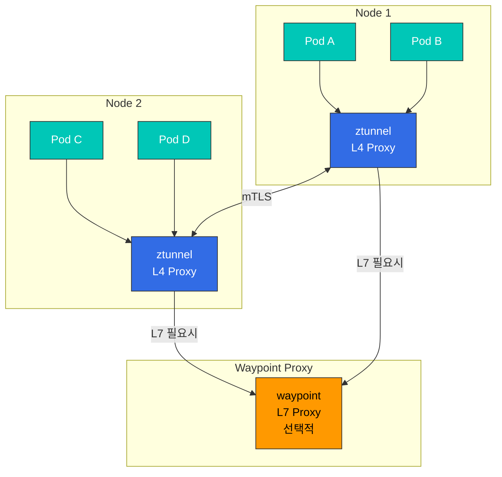
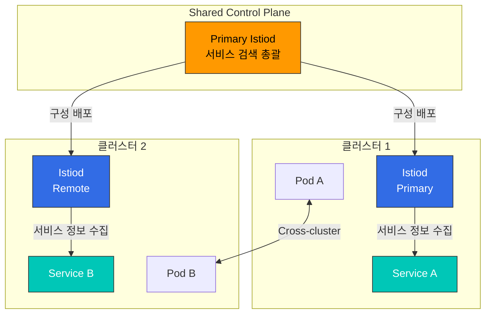
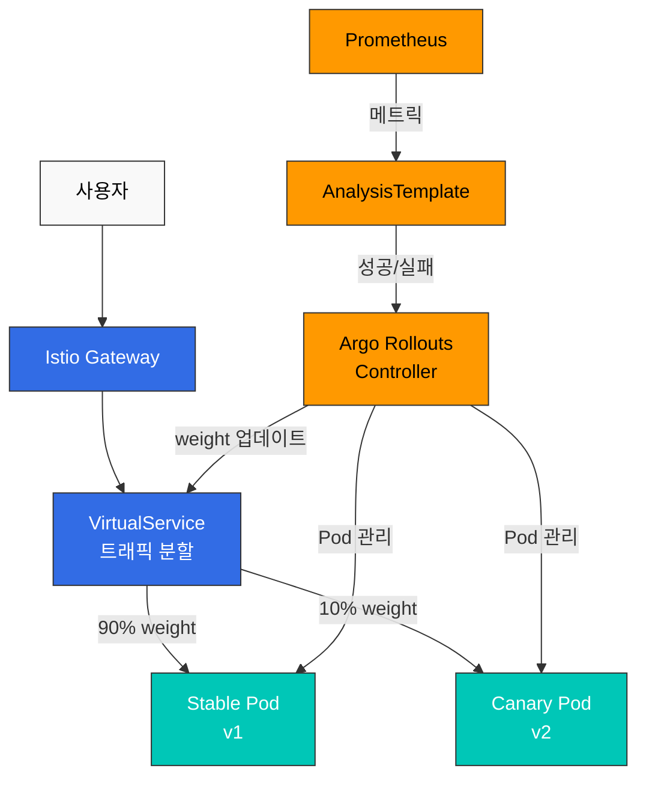
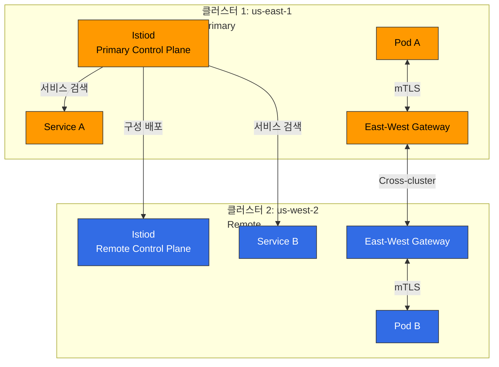
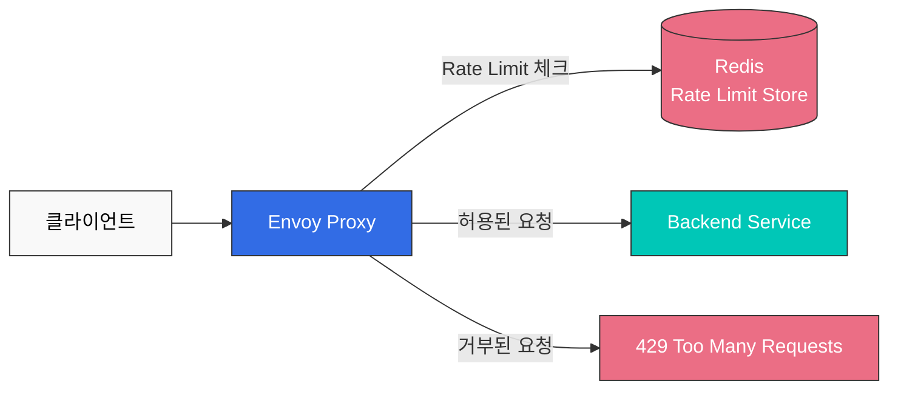
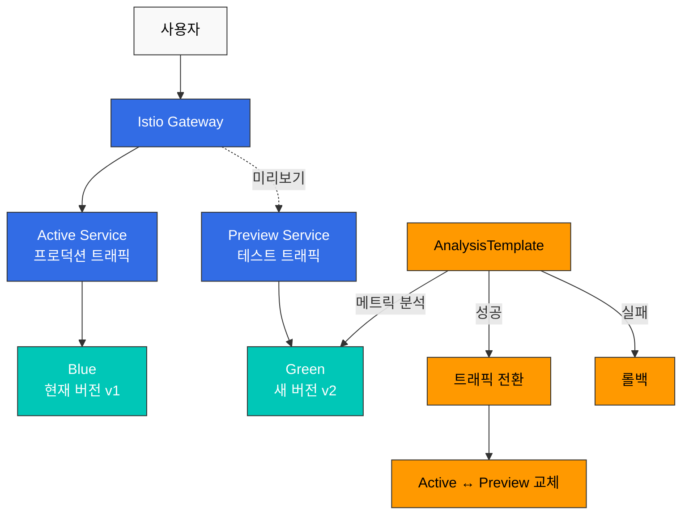

# Istio 고급 주제 퀴즈

> **지원 버전**: Istio 1.28.0
> **EKS 버전**: 1.34 (Kubernetes 1.28+)
> **마지막 업데이트**: 2025년 1월

이 퀴즈는 Istio의 고급 기능에 대한 이해도를 테스트합니다.

## 객관식 문제 (1-5번)

### 문제 1: Ambient Mode vs Sidecar Mode

Istio Ambient Mode의 **가장 큰 장점**은?

A. 더 많은 기능 제공  
B. 리소스 사용량 대폭 감소  
C. 더 빠른 설치 속도  
D. 더 나은 보안  

<details>
<summary>정답 및 해설</summary>

**정답: B**

Ambient Mode의 가장 큰 장점은 **리소스 사용량이 98% 이상 감소**한다는 것입니다.

**해설:**

**Sidecar Mode vs Ambient Mode 비교:**

| 항목 | Sidecar Mode | Ambient Mode | 개선 |
|------|-------------|-------------|------|
| **메모리** | 50MB × Pod 수 | ztunnel + waypoint만 | 98%+ 감소 |
| **CPU** | 0.1 vCPU × Pod 수 | ztunnel + waypoint만 | 98%+ 감소 |
| **Pod 재시작** | 필요 | 불필요 | 운영 간소화 |
| **배포 속도** | 느림 (Sidecar 주입) | 빠름 | 5-10배 향상 |

**1000개 Pod 규모에서 리소스 비교:**

```
Sidecar Mode:
- 메모리: 1000 × 50MB = 50GB
- CPU: 1000 × 0.1 vCPU = 100 vCPU

Ambient Mode (10개 노드):
- 메모리: (10 × 50MB) + 200MB = 700MB
- CPU: (10 × 0.1 vCPU) + 0.5 vCPU = 1.5 vCPU

절감률: 98.6% (메모리), 98.5% (CPU)
```

**Ambient Mode 아키텍처:**



**Ambient Mode 활성화:**

```bash
# Ambient Mode로 Istio 설치
istioctl install --set profile=ambient -y

# Namespace를 Ambient Mode에 추가
kubectl label namespace default istio.io/dataplane-mode=ambient

# 확인
kubectl get pods -n istio-system | grep ztunnel
```

**각 옵션 분석:**
- A (X): 기능은 Sidecar와 동일 (일부 고급 기능은 waypoint 필요)
- B (O): 리소스 사용량이 98% 이상 감소
- C (X): 설치 속도는 부차적 이점
- D (X): 보안 수준은 동일 (mTLS, AuthorizationPolicy 모두 지원)

**참고 자료:**
- [Ambient Mode](../../../service-mesh/istio/advanced/01-ambient-mode.md)
</details>

---

### 문제 2: Multi-cluster Mesh

Istio Multi-cluster Mesh에서 **클러스터 간 서비스 검색**을 담당하는 것은?

A. Istiod  
B. CoreDNS  
C. East-West Gateway  
D. Service Entry  

<details>
<summary>정답 및 해설</summary>

**정답: A**

**Istiod**는 멀티 클러스터 환경에서 모든 클러스터의 서비스 정보를 수집하고 배포합니다.

**해설:**

**Multi-cluster Mesh 아키텍처:**



**Istiod의 역할:**

1. **서비스 검색 (Service Discovery)**:
   - 모든 클러스터의 Kubernetes Service 수집
   - 통합된 서비스 레지스트리 유지
   - Envoy에 엔드포인트 정보 배포

2. **구성 배포**:
   - VirtualService, DestinationRule을 모든 클러스터에 배포
   - Cross-cluster 라우팅 규칙 관리

3. **인증서 관리**:
   - 모든 클러스터의 mTLS 인증서 발급
   - Root CA를 공유하여 신뢰 체인 구축

**Multi-cluster 설정 예시:**

```yaml
# Primary 클러스터 설정
apiVersion: install.istio.io/v1alpha1
kind: IstioOperator
spec:
  values:
    global:
      meshID: mesh1
      multiCluster:
        clusterName: cluster1
      network: network1

---
# Remote 클러스터에서 Primary 접근
apiVersion: v1
kind: Secret
metadata:
  name: istio-remote-secret-cluster2
  namespace: istio-system
  annotations:
    networking.istio.io/cluster: cluster2
type: Opaque
data:
  kubeconfig: <base64-encoded-kubeconfig>
```

**각 옵션 분석:**
- A (O): Istiod가 모든 클러스터의 서비스 정보를 수집하고 배포
- B (X): CoreDNS는 클러스터 내부 DNS만 담당
- C (X): East-West Gateway는 트래픽 라우팅만 담당 (서비스 검색 아님)
- D (X): ServiceEntry는 외부 서비스를 수동으로 등록하는 리소스

**참고 자료:**
- [Multi-cluster](../../../service-mesh/istio/advanced/02-multi-cluster.md)
</details>

---

### 문제 3: EnvoyFilter 사용 목적

EnvoyFilter를 사용하는 **주요 목적**은?

A. Kubernetes Service 생성  
B. VirtualService 자동 생성  
C. Envoy 프록시 동작 커스터마이징  
D. Istiod 구성 변경  

<details>
<summary>정답 및 해설</summary>

**정답: C**

**EnvoyFilter**는 Envoy 프록시의 동작을 세밀하게 커스터마이징하기 위한 고급 리소스입니다.

**해설:**

**EnvoyFilter 사용 사례:**

1. **커스텀 헤더 추가**:
```yaml
apiVersion: networking.istio.io/v1alpha3
kind: EnvoyFilter
metadata:
  name: add-custom-header
  namespace: default
spec:
  workloadSelector:
    labels:
      app: reviews
  configPatches:
  - applyTo: HTTP_FILTER
    match:
      context: SIDECAR_OUTBOUND
      listener:
        filterChain:
          filter:
            name: "envoy.filters.network.http_connection_manager"
            subFilter:
              name: "envoy.filters.http.router"
    patch:
      operation: INSERT_BEFORE
      value:
        name: envoy.lua
        typed_config:
          "@type": type.googleapis.com/envoy.extensions.filters.http.lua.v3.Lua
          inline_code: |
            function envoy_on_request(request_handle)
              request_handle:headers():add("x-custom-header", "my-value")
            end
```

2. **Wasm 확장 통합**:
```yaml
apiVersion: networking.istio.io/v1alpha3
kind: EnvoyFilter
metadata:
  name: wasm-filter
spec:
  configPatches:
  - applyTo: HTTP_FILTER
    match:
      context: SIDECAR_INBOUND
    patch:
      operation: INSERT_BEFORE
      value:
        name: envoy.filters.http.wasm
        typed_config:
          "@type": type.googleapis.com/envoy.extensions.filters.http.wasm.v3.Wasm
          config:
            vm_config:
              runtime: "envoy.wasm.runtime.v8"
              code:
                local:
                  filename: "/etc/istio/extensions/auth_filter.wasm"
```

3. **Rate Limiting 통합**:
```yaml
apiVersion: networking.istio.io/v1alpha3
kind: EnvoyFilter
metadata:
  name: rate-limit-filter
spec:
  configPatches:
  - applyTo: HTTP_FILTER
    match:
      context: SIDECAR_INBOUND
      listener:
        filterChain:
          filter:
            name: "envoy.filters.network.http_connection_manager"
    patch:
      operation: INSERT_BEFORE
      value:
        name: envoy.filters.http.ratelimit
        typed_config:
          "@type": type.googleapis.com/envoy.extensions.filters.http.ratelimit.v3.RateLimit
          domain: productpage-ratelimit
          rate_limit_service:
            grpc_service:
              envoy_grpc:
                cluster_name: rate_limit_cluster
```

**EnvoyFilter 적용 범위:**

```yaml
spec:
  # 전체 메시에 적용
  workloadSelector: {}

  # 특정 워크로드에만 적용
  workloadSelector:
    labels:
      app: reviews
      version: v2

  # 특정 네임스페이스에만 적용
  # (metadata.namespace로 제어)
```

**주의사항:**

⚠️ **EnvoyFilter는 매우 강력하지만 위험합니다:**
- Envoy 내부 구조에 대한 깊은 이해 필요
- Istio 버전 업그레이드 시 호환성 문제 가능
- 잘못된 구성으로 전체 메시 장애 가능

**모범 사례:**
1. 가능하면 VirtualService, DestinationRule 사용
2. EnvoyFilter는 최후의 수단으로만 사용
3. 테스트 환경에서 충분히 검증
4. workloadSelector로 범위 제한

**각 옵션 분석:**
- A (X): Kubernetes Service 생성은 kubectl로 수행
- B (X): VirtualService는 수동으로 생성
- C (O): Envoy 프록시의 동작을 세밀하게 커스터마이징
- D (X): Istiod 구성은 IstioOperator로 변경

**참고 자료:**
- [EnvoyFilter](../../../service-mesh/istio/advanced/03-envoy-filter.md)
</details>

---

### 문제 4: Sidecar Injection

Istio에서 **자동 Sidecar 주입을 비활성화**하는 방법은?

A. Namespace에서 `istio-injection=enabled` 레이블 제거  
B. Pod에 `sidecar.istio.io/inject="false"` annotation 추가  
C. Istiod 재시작  
D. A와 B 모두 가능  

<details>
<summary>정답 및 해설</summary>

**정답: D**

Namespace 레벨과 Pod 레벨 모두에서 Sidecar 주입을 제어할 수 있습니다.

**해설:**

**Sidecar 주입 제어 방법:**

**1. Namespace 레벨 (A - O):**

```bash
# Sidecar 주입 활성화
kubectl label namespace default istio-injection=enabled

# Sidecar 주입 비활성화
kubectl label namespace default istio-injection-

# 또는 레이블 변경
kubectl label namespace default istio-injection=disabled --overwrite
```

**2. Pod 레벨 (B - O):**

```yaml
apiVersion: apps/v1
kind: Deployment
metadata:
  name: myapp
spec:
  template:
    metadata:
      annotations:
        sidecar.istio.io/inject: "false"  # Sidecar 주입 비활성화
    spec:
      containers:
      - name: myapp
        image: myapp:latest
```

**Sidecar 주입 우선순위:**

```
Pod annotation > Namespace label > 기본값

예시:
1. Namespace: istio-injection=enabled
   Pod: sidecar.istio.io/inject="false"
   결과: Sidecar 주입 안됨 (Pod annotation 우선)

2. Namespace: istio-injection=disabled
   Pod: sidecar.istio.io/inject="true"
   결과: Sidecar 주입됨 (Pod annotation 우선)

3. Namespace: 레이블 없음
   Pod: annotation 없음
   결과: Sidecar 주입 안됨 (기본값)
```

**Sidecar 주입 검증:**

```bash
# Pod에 Sidecar가 주입되었는지 확인
kubectl get pods <pod-name> -o jsonpath='{.spec.containers[*].name}'
# 출력 예시: myapp istio-proxy (2개 = Sidecar 있음)

# Sidecar 주입 로그 확인
kubectl logs -n istio-system -l app=istiod --tail=100 | grep injection

# Namespace 설정 확인
kubectl get namespace -L istio-injection
```

**혼합 환경 예시:**

```yaml
# Namespace 전체에 Sidecar 주입
apiVersion: v1
kind: Namespace
metadata:
  name: production
  labels:
    istio-injection: enabled

---
# 특정 Pod만 제외 (예: 레거시 시스템)
apiVersion: apps/v1
kind: Deployment
metadata:
  name: legacy-app
  namespace: production
spec:
  template:
    metadata:
      annotations:
        sidecar.istio.io/inject: "false"
    spec:
      containers:
      - name: legacy
        image: legacy:v1

---
# 대부분의 Pod는 자동으로 Sidecar 주입됨
apiVersion: apps/v1
kind: Deployment
metadata:
  name: modern-app
  namespace: production
spec:
  template:
    spec:
      containers:
      - name: modern
        image: modern:v2
```

**각 옵션 분석:**
- A (O): Namespace 레벨에서 Sidecar 주입 제어 가능
- B (O): Pod 레벨에서 Sidecar 주입 제어 가능
- C (X): Istiod 재시작은 불필요
- D (O): A와 B 모두 유효한 방법

**참고 자료:**
- [Sidecar Injection](../../../service-mesh/istio/advanced/07-sidecar-injection.md)
</details>

---

### 문제 5: Argo Rollouts 통합

Argo Rollouts와 Istio를 함께 사용할 때 **트래픽 분할을 담당**하는 것은?

A. Argo Rollouts Controller
B. Istio VirtualService
C. Kubernetes Service
D. Istio Gateway

<details>
<summary>정답 및 해설</summary>

**정답: B**

**Istio VirtualService**가 실제 트래픽 분할을 수행하고, Argo Rollouts는 VirtualService의 weight 값을 자동으로 업데이트합니다.

**해설:**

**Argo Rollouts + Istio 통합 아키텍처:**



**VirtualService 역할:**

```yaml
apiVersion: networking.istio.io/v1beta1
kind: VirtualService
metadata:
  name: reviews
spec:
  hosts:
  - reviews
  http:
  - name: primary  # Argo Rollouts가 참조하는 route 이름
    route:
    - destination:
        host: reviews
        subset: stable
      weight: 100  # Argo Rollouts가 자동으로 변경
    - destination:
        host: reviews
        subset: canary
      weight: 0    # Argo Rollouts가 자동으로 변경
```

**Argo Rollouts 설정:**

```yaml
apiVersion: argoproj.io/v1alpha1
kind: Rollout
metadata:
  name: reviews
spec:
  strategy:
    canary:
      # Istio 통합 설정
      trafficRouting:
        istio:
          virtualService:
            name: reviews        # VirtualService 이름
            routes:
            - primary            # route 이름
          destinationRule:
            name: reviews        # DestinationRule 이름
            canarySubsetName: canary
            stableSubsetName: stable

      # Canary 단계
      steps:
      - setWeight: 10   # VirtualService weight를 10으로 변경
      - pause: {duration: 2m}
      - setWeight: 25   # VirtualService weight를 25로 변경
      - pause: {duration: 2m}
      - setWeight: 50
      - pause: {duration: 2m}
```

**배포 프로세스:**

```
1. Argo Rollouts가 새 버전 (v2) Pod 생성
   ↓
2. Argo Rollouts가 VirtualService의 canary weight를 10으로 설정
   ↓
3. Istio Envoy가 실제 10% 트래픽을 v2로 라우팅
   ↓
4. AnalysisTemplate이 메트릭 확인 (에러율, 지연시간)
   ↓
5. 성공 시 Argo Rollouts가 weight를 25로 증가
   ↓
6. 반복...
   ↓
7. 최종적으로 weight 100 (완전 전환)
```

**책임 분담:**

| 컴포넌트 | 역할 |
|---------|------|
| **Argo Rollouts** | - Pod 생성/삭제<br/>- VirtualService weight 업데이트<br/>- 배포 전략 실행<br/>- 자동 롤백 |
| **Istio VirtualService** | - 실제 트래픽 분할<br/>- 라우팅 규칙 적용<br/>- Envoy 구성 생성 |
| **Envoy Proxy** | - 트래픽 라우팅 실행<br/>- 메트릭 수집 |
| **Prometheus** | - 메트릭 저장<br/>- AnalysisTemplate에 데이터 제공 |

**실제 트래픽 흐름:**

```bash
# 사용자 요청 100개
100개 요청 → Istio Gateway
              ↓
         VirtualService
         (weight: stable=90, canary=10)
              ↓
         ┌────┴────┐
         ↓         ↓
      90개       10개
    Stable v1   Canary v2
```

**각 옵션 분석:**
- A (X): Argo Rollouts는 VirtualService를 업데이트만 함 (직접 트래픽 분할 안함)
- B (O): VirtualService가 실제 트래픽 분할 수행
- C (X): Kubernetes Service는 로드 밸런싱만 담당 (트래픽 분할 안함)
- D (X): Gateway는 외부 트래픽 진입점 (트래픽 분할 안함)

**참고 자료:**
- [Argo Rollouts](../../../service-mesh/istio/advanced/08-argo-rollouts.md)
</details>

---

## 주관식 문제 (6-10번)

### 문제 6: Ambient Mode 비용 절감 분석

AWS EKS 클러스터에서 Sidecar Mode에서 Ambient Mode로 전환할 때의 **비용 절감 효과**를 계산하세요. (가정: 500개 Pod, 5개 노드, r5.xlarge 인스턴스, 월 730시간 운영)

<details>
<summary>예시 답안</summary>

**답변:**

**비용 절감 분석:**

---

**1. 가정 조건**

```
클러스터 규모:
- Pod 수: 500개
- 노드 수: 5개
- 인스턴스 타입: r5.xlarge (4 vCPU, 32GB RAM)
- 인스턴스 비용: $0.252/시간
- 운영 시간: 월 730시간

리소스 사용량:
- Sidecar 메모리: 50MB/Pod
- Sidecar CPU: 0.1 vCPU/Pod
- ztunnel 메모리: 50MB/Node
- ztunnel CPU: 0.1 vCPU/Node
- waypoint 메모리: 200MB
- waypoint CPU: 0.5 vCPU
```

---

**2. Sidecar Mode 리소스 계산**

```
메모리 사용량:
= 500 Pod × 50MB
= 25,000MB
= 25GB

CPU 사용량:
= 500 Pod × 0.1 vCPU
= 50 vCPU
```

**필요 인스턴스 수 (r5.xlarge: 4 vCPU, 32GB RAM):**

```
CPU 기준:
= 50 vCPU ÷ 4 vCPU/인스턴스
= 12.5 인스턴스
≈ 13 인스턴스 필요

메모리 기준:
= 25GB ÷ 32GB/인스턴스
= 0.78 인스턴스
≈ 1 인스턴스 필요

실제 필요: max(13, 1) = 13 인스턴스
```

**Sidecar Mode 월간 비용:**

```
= 13 인스턴스 × $0.252/시간 × 730시간
= $2,395.56/월
```

---

**3. Ambient Mode 리소스 계산**

```
메모리 사용량:
= (5 노드 × 50MB) + 200MB
= 250MB + 200MB
= 450MB

CPU 사용량:
= (5 노드 × 0.1 vCPU) + 0.5 vCPU
= 0.5 vCPU + 0.5 vCPU
= 1.0 vCPU
```

**필요 인스턴스 수:**

```
CPU 기준:
= 1.0 vCPU ÷ 4 vCPU/인스턴스
= 0.25 인스턴스
≈ 1 인스턴스 필요

메모리 기준:
= 0.45GB ÷ 32GB/인스턴스
= 0.01 인스턴스
≈ 1 인스턴스 필요

실제 필요: max(1, 1) = 1 인스턴스
```

**Ambient Mode 월간 비용:**

```
= 1 인스턴스 × $0.252/시간 × 730시간
= $183.96/월
```

---

**4. 비용 절감 효과**

```
월간 절감액:
= $2,395.56 - $183.96
= $2,211.60/월

절감률:
= ($2,211.60 ÷ $2,395.56) × 100
= 92.3%

연간 절감액:
= $2,211.60 × 12
= $26,539.20/년
```

---

**5. 리소스 절감 요약**

| 항목 | Sidecar Mode | Ambient Mode | 절감 |
|------|-------------|-------------|------|
| **메모리** | 25GB | 0.45GB | 24.55GB (98.2%) |
| **CPU** | 50 vCPU | 1.0 vCPU | 49 vCPU (98.0%) |
| **인스턴스** | 13대 | 1대 | 12대 (92.3%) |
| **월간 비용** | $2,395.56 | $183.96 | $2,211.60 (92.3%) |
| **연간 비용** | $28,746.72 | $2,207.52 | $26,539.20 (92.3%) |

---

**6. 추가 비용 절감 요인**

**네트워크 비용:**
- Sidecar Mode: localhost 통신 없음 (모든 트래픽이 네트워크 통과)
- Ambient Mode: ztunnel 간 직접 통신으로 효율 향상

**운영 비용:**
- Pod 재시작 불필요 (배포 시간 단축)
- Sidecar 주입 오류 없음
- 관리 복잡도 감소

**성능 향상:**
- 메모리 압박 감소로 Pod 성능 향상
- OOMKilled 빈도 감소
- 노드 자원 여유 확보

---

**7. ROI (Return on Investment)**

```
Ambient Mode 전환 비용 (1회):
- 학습 시간: 40시간 × $100/시간 = $4,000
- 테스트 및 검증: 20시간 × $100/시간 = $2,000
- 총 전환 비용: $6,000

투자 회수 기간:
= $6,000 ÷ $2,211.60/월
= 2.7개월

3년 총 절감액:
= ($26,539.20 × 3) - $6,000
= $73,617.60
```

---

**8. 실전 고려사항**

**장점:**
- ✅ 92% 이상 비용 절감
- ✅ 운영 간소화
- ✅ 배포 속도 향상
- ✅ 리소스 효율 극대화

**주의사항:**
- ⚠️ Istio 1.28+ 베타 기능
- ⚠️ L7 기능 필요 시 waypoint 추가 배포
- ⚠️ 일부 고급 기능은 Sidecar 모드 필요
- ⚠️ 충분한 테스트 필요

**참고 자료:**
- [Ambient Mode](../../../service-mesh/istio/advanced/01-ambient-mode.md)
</details>

---

### 문제 7: Multi-cluster Service Mesh 구성

2개의 EKS 클러스터(us-east-1, us-west-2)를 **하나의 Istio Mesh**로 통합하는 방법을 설명하세요. **Primary-Remote 모델**을 사용하고, 클러스터 간 서비스 호출 예시를 포함해야 합니다.

<details>
<summary>예시 답안</summary>

**답변:**

**Multi-cluster Istio Mesh 구성:**

---

**1. 아키텍처 개요**



---

**2. 사전 준비**

```bash
# 두 클러스터에 접근 가능한 kubeconfig 설정
export CTX_CLUSTER1=eks-us-east-1
export CTX_CLUSTER2=eks-us-west-2

# 컨텍스트 확인
kubectl config get-contexts

# CA 인증서 생성 (공유 Root CA)
mkdir -p certs
cd certs

# Root CA 생성
make -f ../istio-1.28.0/tools/certs/Makefile.selfsigned.mk root-ca

# 각 클러스터용 중간 인증서 생성
make -f ../istio-1.28.0/tools/certs/Makefile.selfsigned.mk cluster1-cacerts
make -f ../istio-1.28.0/tools/certs/Makefile.selfsigned.mk cluster2-cacerts
```

---

**3. 클러스터 1 (Primary) 설정**

```bash
# CA 인증서 Secret 생성
kubectl create namespace istio-system --context="${CTX_CLUSTER1}"
kubectl create secret generic cacerts -n istio-system \
  --from-file=cluster1/ca-cert.pem \
  --from-file=cluster1/ca-key.pem \
  --from-file=cluster1/root-cert.pem \
  --from-file=cluster1/cert-chain.pem \
  --context="${CTX_CLUSTER1}"

# Primary Istio 설치
istioctl install --context="${CTX_CLUSTER1}" -f - <<EOF
apiVersion: install.istio.io/v1alpha1
kind: IstioOperator
spec:
  values:
    global:
      meshID: mesh1
      multiCluster:
        clusterName: cluster1
      network: network1

  components:
    ingressGateways:
    - name: istio-eastwestgateway
      label:
        istio: eastwestgateway
        app: istio-eastwestgateway
        topology.istio.io/network: network1
      enabled: true
      k8s:
        env:
        - name: ISTIO_META_REQUESTED_NETWORK_VIEW
          value: network1
        service:
          type: LoadBalancer
          ports:
          - name: status-port
            port: 15021
            targetPort: 15021
          - name: tls
            port: 15443
            targetPort: 15443
          - name: tls-istiod
            port: 15012
            targetPort: 15012
          - name: tls-webhook
            port: 15017
            targetPort: 15017
EOF

# East-West Gateway 노출
kubectl apply --context="${CTX_CLUSTER1}" -n istio-system -f \
  samples/multicluster/expose-services.yaml
```

---

**4. 클러스터 2 (Remote) 설정**

```bash
# CA 인증서 Secret 생성
kubectl create namespace istio-system --context="${CTX_CLUSTER2}"
kubectl create secret generic cacerts -n istio-system \
  --from-file=cluster2/ca-cert.pem \
  --from-file=cluster2/ca-key.pem \
  --from-file=cluster2/root-cert.pem \
  --from-file=cluster2/cert-chain.pem \
  --context="${CTX_CLUSTER2}"

# Remote Secret 생성 (cluster1에서 cluster2 접근)
istioctl create-remote-secret \
  --context="${CTX_CLUSTER2}" \
  --name=cluster2 | \
  kubectl apply -f - --context="${CTX_CLUSTER1}"

# Remote Istio 설치
istioctl install --context="${CTX_CLUSTER2}" -f - <<EOF
apiVersion: install.istio.io/v1alpha1
kind: IstioOperator
spec:
  values:
    global:
      meshID: mesh1
      multiCluster:
        clusterName: cluster2
      network: network2
      remotePilotAddress: <CLUSTER1_EAST_WEST_GATEWAY_IP>

  components:
    ingressGateways:
    - name: istio-eastwestgateway
      label:
        istio: eastwestgateway
        app: istio-eastwestgateway
        topology.istio.io/network: network2
      enabled: true
      k8s:
        env:
        - name: ISTIO_META_REQUESTED_NETWORK_VIEW
          value: network2
        service:
          type: LoadBalancer
          ports:
          - name: status-port
            port: 15021
          - name: tls
            port: 15443
          - name: tls-istiod
            port: 15012
          - name: tls-webhook
            port: 15017
EOF
```

---

**5. 서비스 배포 및 검증**

**클러스터 1에 Service A 배포:**

```yaml
# cluster1: service-a.yaml
apiVersion: v1
kind: Service
metadata:
  name: service-a
  labels:
    app: service-a
spec:
  ports:
  - port: 8080
    name: http
  selector:
    app: service-a

---
apiVersion: apps/v1
kind: Deployment
metadata:
  name: service-a
spec:
  replicas: 2
  selector:
    matchLabels:
      app: service-a
  template:
    metadata:
      labels:
        app: service-a
    spec:
      containers:
      - name: service-a
        image: nginx:latest
        ports:
        - containerPort: 8080
```

```bash
kubectl apply --context="${CTX_CLUSTER1}" -f service-a.yaml
```

**클러스터 2에 Service B 배포:**

```yaml
# cluster2: service-b.yaml
apiVersion: v1
kind: Service
metadata:
  name: service-b
  labels:
    app: service-b
spec:
  ports:
  - port: 8080
    name: http
  selector:
    app: service-b

---
apiVersion: apps/v1
kind: Deployment
metadata:
  name: service-b
spec:
  replicas: 2
  selector:
    matchLabels:
      app: service-b
  template:
    metadata:
      labels:
        app: service-b
    spec:
      containers:
      - name: service-b
        image: nginx:latest
        ports:
        - containerPort: 8080
```

```bash
kubectl apply --context="${CTX_CLUSTER2}" -f service-b.yaml
```

---

**6. Cross-cluster 서비스 호출 테스트**

```bash
# 클러스터 1에서 클러스터 2의 서비스 호출
kubectl exec --context="${CTX_CLUSTER1}" -it \
  $(kubectl get pod --context="${CTX_CLUSTER1}" -l app=service-a -o jsonpath='{.items[0].metadata.name}') \
  -- curl http://service-b.default.svc.cluster.local:8080

# 클러스터 2에서 클러스터 1의 서비스 호출
kubectl exec --context="${CTX_CLUSTER2}" -it \
  $(kubectl get pod --context="${CTX_CLUSTER2}" -l app=service-b -o jsonpath='{.items[0].metadata.name}') \
  -- curl http://service-a.default.svc.cluster.local:8080
```

---

**7. 서비스 검색 확인**

```bash
# 클러스터 1에서 Envoy 구성 확인
istioctl --context="${CTX_CLUSTER1}" proxy-config endpoints \
  $(kubectl get pod --context="${CTX_CLUSTER1}" -l app=service-a -o jsonpath='{.items[0].metadata.name}') | \
  grep service-b

# 출력 예시:
# service-b.default.svc.cluster.local:8080  HEALTHY  <cluster2-pod-ip>:8080
```

---

**8. 트래픽 정책 적용**

```yaml
# Cross-cluster 트래픽 라우팅
apiVersion: networking.istio.io/v1beta1
kind: VirtualService
metadata:
  name: service-b
spec:
  hosts:
  - service-b.default.svc.cluster.local
  http:
  - match:
    - sourceLabels:
        app: service-a
    route:
    - destination:
        host: service-b.default.svc.cluster.local
        port:
          number: 8080
      weight: 80  # 80%는 로컬 클러스터
    - destination:
        host: service-b.default.svc.cluster.local
        port:
          number: 8080
      weight: 20  # 20%는 원격 클러스터

---
apiVersion: networking.istio.io/v1beta1
kind: DestinationRule
metadata:
  name: service-b
spec:
  host: service-b.default.svc.cluster.local
  trafficPolicy:
    loadBalancer:
      localityLbSetting:
        enabled: true  # Locality-aware 라우팅
```

---

**9. 모니터링 및 검증**

```bash
# Prometheus에서 Cross-cluster 트래픽 확인
kubectl port-forward --context="${CTX_CLUSTER1}" -n istio-system \
  svc/prometheus 9090:9090

# Prometheus 쿼리:
# sum(rate(istio_requests_total{source_cluster="cluster1", destination_cluster="cluster2"}[5m]))

# Kiali로 시각화
istioctl dashboard kiali --context="${CTX_CLUSTER1}"
```

---

**10. 주의사항 및 모범 사례**

**주의사항:**
- ⚠️ 공유 Root CA 필수
- ⚠️ 네트워크 레이턴시 고려
- ⚠️ East-West Gateway 보안 강화
- ⚠️ DNS 해석 올바르게 설정

**모범 사례:**
- ✅ Locality-aware 라우팅 활성화
- ✅ Circuit Breaker 설정
- ✅ 클러스터별 replica 유지
- ✅ Cross-cluster 트래픽 모니터링

**참고 자료:**
- [Multi-cluster](../../../service-mesh/istio/advanced/02-multi-cluster.md)
</details>

---

### 문제 8: EnvoyFilter로 커스텀 Rate Limiting

EnvoyFilter를 사용하여 특정 경로(`/api/premium/*`)에만 **사용자별 Rate Limiting**(분당 100 요청)을 적용하는 방법을 구현하세요.

<details>
<summary>예시 답안</summary>

**답변:**

**EnvoyFilter 기반 Rate Limiting 구현:**

---

**1. 아키텍처 개요**



---

**2. Redis Rate Limit 서버 배포**

```yaml
# redis-ratelimit.yaml
apiVersion: v1
kind: Service
metadata:
  name: redis-ratelimit
  namespace: istio-system
spec:
  ports:
  - port: 6379
    name: redis
  selector:
    app: redis-ratelimit

---
apiVersion: apps/v1
kind: Deployment
metadata:
  name: redis-ratelimit
  namespace: istio-system
spec:
  replicas: 1
  selector:
    matchLabels:
      app: redis-ratelimit
  template:
    metadata:
      labels:
        app: redis-ratelimit
    spec:
      containers:
      - name: redis
        image: redis:7-alpine
        ports:
        - containerPort: 6379
        resources:
          requests:
            cpu: 100m
            memory: 128Mi
          limits:
            cpu: 500m
            memory: 512Mi

---
# Envoy Rate Limit 서비스
apiVersion: v1
kind: ConfigMap
metadata:
  name: ratelimit-config
  namespace: istio-system
data:
  config.yaml: |
    domain: premium-ratelimit
    descriptors:
      # 사용자별 Rate Limit: 분당 100 요청
      - key: user_id
        rate_limit:
          unit: minute
          requests_per_unit: 100

---
apiVersion: v1
kind: Service
metadata:
  name: ratelimit
  namespace: istio-system
spec:
  ports:
  - port: 8081
    name: http
  - port: 9091
    name: grpc
  selector:
    app: ratelimit

---
apiVersion: apps/v1
kind: Deployment
metadata:
  name: ratelimit
  namespace: istio-system
spec:
  replicas: 2
  selector:
    matchLabels:
      app: ratelimit
  template:
    metadata:
      labels:
        app: ratelimit
    spec:
      containers:
      - name: ratelimit
        image: envoyproxy/ratelimit:master
        ports:
        - containerPort: 8081
        - containerPort: 9091
        env:
        - name: REDIS_URL
          value: redis-ratelimit.istio-system.svc.cluster.local:6379
        - name: USE_STATSD
          value: "false"
        - name: LOG_LEVEL
          value: debug
        - name: RUNTIME_ROOT
          value: /data
        - name: RUNTIME_SUBDIRECTORY
          value: ratelimit
        volumeMounts:
        - name: config-volume
          mountPath: /data/ratelimit/config
        resources:
          requests:
            cpu: 100m
            memory: 128Mi
          limits:
            cpu: 500m
            memory: 512Mi
      volumes:
      - name: config-volume
        configMap:
          name: ratelimit-config
```

```bash
kubectl apply -f redis-ratelimit.yaml
```

---

**3. EnvoyFilter 구성**

```yaml
# envoyfilter-ratelimit.yaml
apiVersion: networking.istio.io/v1alpha3
kind: EnvoyFilter
metadata:
  name: premium-ratelimit
  namespace: istio-system
spec:
  workloadSelector:
    labels:
      app: api-gateway

  configPatches:
  # HTTP 필터 체인에 Rate Limit 필터 추가
  - applyTo: HTTP_FILTER
    match:
      context: SIDECAR_INBOUND
      listener:
        filterChain:
          filter:
            name: "envoy.filters.network.http_connection_manager"
            subFilter:
              name: "envoy.filters.http.router"
    patch:
      operation: INSERT_BEFORE
      value:
        name: envoy.filters.http.ratelimit
        typed_config:
          "@type": type.googleapis.com/envoy.extensions.filters.http.ratelimit.v3.RateLimit
          domain: premium-ratelimit
          failure_mode_deny: true  # Rate Limit 서버 장애 시 거부
          enable_x_ratelimit_headers: DRAFT_VERSION_03
          rate_limit_service:
            grpc_service:
              envoy_grpc:
                cluster_name: rate_limit_cluster
            transport_api_version: V3

  # Rate Limit 클러스터 정의
  - applyTo: CLUSTER
    patch:
      operation: ADD
      value:
        name: rate_limit_cluster
        type: STRICT_DNS
        connect_timeout: 1s
        lb_policy: ROUND_ROBIN
        http2_protocol_options: {}
        load_assignment:
          cluster_name: rate_limit_cluster
          endpoints:
          - lb_endpoints:
            - endpoint:
                address:
                  socket_address:
                    address: ratelimit.istio-system.svc.cluster.local
                    port_value: 9091

  # HTTP 라우트에 Rate Limit 액션 추가
  - applyTo: HTTP_ROUTE
    match:
      context: SIDECAR_INBOUND
      routeConfiguration:
        vhost:
          route:
            action: ANY
    patch:
      operation: MERGE
      value:
        route:
          rate_limits:
          # /api/premium/* 경로만 Rate Limit 적용
          - actions:
            - header_value_match:
                descriptor_value: "premium"
                headers:
                - name: ":path"
                  prefix_match: "/api/premium/"
            - request_headers:
                header_name: "x-user-id"
                descriptor_key: "user_id"
```

```bash
kubectl apply -f envoyfilter-ratelimit.yaml
```

---

**4. VirtualService 구성**

```yaml
# virtualservice.yaml
apiVersion: networking.istio.io/v1beta1
kind: VirtualService
metadata:
  name: api-service
spec:
  hosts:
  - api.example.com
  gateways:
  - api-gateway
  http:
  # Premium API 경로
  - match:
    - uri:
        prefix: /api/premium/
    route:
    - destination:
        host: premium-backend
        port:
          number: 8080

  # 일반 API 경로 (Rate Limit 없음)
  - match:
    - uri:
        prefix: /api/
    route:
    - destination:
        host: backend
        port:
          number: 8080
```

---

**5. 테스트 애플리케이션**

```yaml
# backend.yaml
apiVersion: v1
kind: Service
metadata:
  name: premium-backend
spec:
  ports:
  - port: 8080
    name: http
  selector:
    app: premium-backend

---
apiVersion: apps/v1
kind: Deployment
metadata:
  name: premium-backend
spec:
  replicas: 2
  selector:
    matchLabels:
      app: premium-backend
  template:
    metadata:
      labels:
        app: premium-backend
        app: api-gateway  # EnvoyFilter 적용 대상
    spec:
      containers:
      - name: backend
        image: nginx:latest
        ports:
        - containerPort: 8080
```

```bash
kubectl apply -f backend.yaml
```

---

**6. 테스트**

```bash
# 정상 요청 (사용자별 100 요청/분 이하)
for i in {1..50}; do
  curl -H "x-user-id: user123" \
       -H "Host: api.example.com" \
       http://<INGRESS_GATEWAY>/api/premium/data
  sleep 0.1
done

# 출력: 200 OK (모두 성공)

# Rate Limit 초과 (100 요청/분 초과)
for i in {1..150}; do
  curl -H "x-user-id: user123" \
       -H "Host: api.example.com" \
       http://<INGRESS_GATEWAY>/api/premium/data
done

# 출력:
# 1-100번: 200 OK
# 101-150번: 429 Too Many Requests

# 다른 사용자는 영향 없음
curl -H "x-user-id: user456" \
     -H "Host: api.example.com" \
     http://<INGRESS_GATEWAY>/api/premium/data

# 출력: 200 OK
```

---

**7. Rate Limit 헤더 확인**

```bash
curl -I -H "x-user-id: user123" \
     -H "Host: api.example.com" \
     http://<INGRESS_GATEWAY>/api/premium/data

# 출력:
# X-RateLimit-Limit: 100
# X-RateLimit-Remaining: 73
# X-RateLimit-Reset: 1735689600
```

---

**8. Redis 모니터링**

```bash
# Redis에 저장된 Rate Limit 데이터 확인
kubectl exec -it -n istio-system \
  $(kubectl get pod -n istio-system -l app=redis-ratelimit -o jsonpath='{.items[0].metadata.name}') \
  -- redis-cli

# Redis CLI에서:
KEYS *
# 출력: "premium-ratelimit_user123_..."

GET "premium-ratelimit_user123_..."
# 출력: "27" (남은 요청 수)

TTL "premium-ratelimit_user123_..."
# 출력: "42" (초 단위 TTL)
```

---

**9. Prometheus 메트릭**

```promql
# Rate Limit 거부된 요청 수
sum(rate(envoy_http_ratelimit_rejected_total[5m])) by (pod)

# Rate Limit 허용된 요청 수
sum(rate(envoy_http_ratelimit_ok_total[5m])) by (pod)

# Rate Limit 서버 오류
sum(rate(envoy_http_ratelimit_error_total[5m])) by (pod)
```

---

**10. 주의사항 및 모범 사례**

**주의사항:**
- ⚠️ Redis 고가용성 구성 필요 (프로덕션)
- ⚠️ Rate Limit 서버 장애 시 동작 정의 (`failure_mode_deny`)
- ⚠️ 사용자 식별 헤더 (`x-user-id`) 신뢰성 확보
- ⚠️ EnvoyFilter는 Istio 버전 업그레이드 시 호환성 확인 필요

**모범 사례:**
- ✅ Redis Sentinel 또는 Cluster 사용
- ✅ Rate Limit 서버 replica ≥ 2
- ✅ 적절한 모니터링 및 알림
- ✅ 사용자별 예외 처리 (VIP 사용자 등)

**참고 자료:**
- [EnvoyFilter](../../../service-mesh/istio/advanced/03-envoy-filter.md)
- [Rate Limiting](../../../service-mesh/istio/resilience/02-rate-limiting.md)
</details>

---

### 문제 9: Argo Rollouts Blue/Green 배포

Argo Rollouts와 Istio를 사용하여 **Blue/Green 배포**를 구현하세요. **자동 분석**(AnalysisTemplate)을 포함하고, 실패 시 자동 롤백되도록 구성해야 합니다.

<details>
<summary>예시 답안</summary>

**답변:**

**Argo Rollouts Blue/Green 배포 구현:**

---

**1. Blue/Green 배포 개념**



---

**2. Kubernetes Service 생성**

```yaml
# services.yaml
apiVersion: v1
kind: Service
metadata:
  name: myapp-active
spec:
  ports:
  - port: 8080
    name: http
  selector:
    app: myapp
    # Argo Rollouts가 자동으로 selector 관리

---
apiVersion: v1
kind: Service
metadata:
  name: myapp-preview
spec:
  ports:
  - port: 8080
    name: http
  selector:
    app: myapp
    # Argo Rollouts가 자동으로 selector 관리
```

```bash
kubectl apply -f services.yaml
```

---

**3. Istio Gateway 및 VirtualService**

```yaml
# gateway.yaml
apiVersion: networking.istio.io/v1beta1
kind: Gateway
metadata:
  name: myapp-gateway
spec:
  selector:
    istio: ingressgateway
  servers:
  - port:
      number: 80
      name: http
      protocol: HTTP
    hosts:
    - myapp.example.com

---
# virtualservice.yaml
apiVersion: networking.istio.io/v1beta1
kind: VirtualService
metadata:
  name: myapp
spec:
  hosts:
  - myapp.example.com
  gateways:
  - myapp-gateway
  http:
  # 프로덕션 트래픽 (Active)
  - match:
    - uri:
        prefix: /
    route:
    - destination:
        host: myapp-active
        port:
          number: 8080

---
# preview-virtualservice.yaml
apiVersion: networking.istio.io/v1beta1
kind: VirtualService
metadata:
  name: myapp-preview
spec:
  hosts:
  - myapp-preview.example.com
  gateways:
  - myapp-gateway
  http:
  # 미리보기 트래픽 (Preview)
  - match:
    - uri:
        prefix: /
    route:
    - destination:
        host: myapp-preview
        port:
          number: 8080
```

```bash
kubectl apply -f gateway.yaml
```

---

**4. AnalysisTemplate 정의**

```yaml
# analysis-template.yaml
apiVersion: argoproj.io/v1alpha1
kind: AnalysisTemplate
metadata:
  name: success-rate
spec:
  args:
  - name: service-name

  metrics:
  # 메트릭 1: 성공률 (95% 이상)
  - name: success-rate
    interval: 30s
    count: 5
    successCondition: result >= 0.95
    failureLimit: 2
    provider:
      prometheus:
        address: http://prometheus.istio-system:9090
        query: |
          sum(rate(
            istio_requests_total{
              destination_service_name="{{args.service-name}}",
              response_code!~"5.*"
            }[2m]
          ))
          /
          sum(rate(
            istio_requests_total{
              destination_service_name="{{args.service-name}}"
            }[2m]
          ))

---
apiVersion: argoproj.io/v1alpha1
kind: AnalysisTemplate
metadata:
  name: latency
spec:
  args:
  - name: service-name

  metrics:
  # 메트릭 2: P95 지연시간 (500ms 이하)
  - name: latency-p95
    interval: 30s
    count: 5
    successCondition: result <= 500
    failureLimit: 2
    provider:
      prometheus:
        address: http://prometheus.istio-system:9090
        query: |
          histogram_quantile(0.95,
            sum(rate(
              istio_request_duration_milliseconds_bucket{
                destination_service_name="{{args.service-name}}"
              }[2m]
            )) by (le)
          )

---
apiVersion: argoproj.io/v1alpha1
kind: AnalysisTemplate
metadata:
  name: error-rate
spec:
  args:
  - name: service-name

  metrics:
  # 메트릭 3: 에러율 (1% 이하)
  - name: error-rate
    interval: 30s
    count: 5
    successCondition: result <= 0.01
    failureLimit: 2
    provider:
      prometheus:
        address: http://prometheus.istio-system:9090
        query: |
          sum(rate(
            istio_requests_total{
              destination_service_name="{{args.service-name}}",
              response_code=~"5.*"
            }[2m]
          ))
          /
          sum(rate(
            istio_requests_total{
              destination_service_name="{{args.service-name}}"
            }[2m]
          ))
```

```bash
kubectl apply -f analysis-template.yaml
```

---

**5. Rollout 리소스 정의**

```yaml
# rollout.yaml
apiVersion: argoproj.io/v1alpha1
kind: Rollout
metadata:
  name: myapp
spec:
  replicas: 5
  revisionHistoryLimit: 2
  selector:
    matchLabels:
      app: myapp

  template:
    metadata:
      labels:
        app: myapp
    spec:
      containers:
      - name: myapp
        image: myapp:v1
        ports:
        - containerPort: 8080
        resources:
          requests:
            cpu: 100m
            memory: 128Mi
          limits:
            cpu: 500m
            memory: 512Mi

  # Blue/Green 배포 전략
  strategy:
    blueGreen:
      # Active Service (프로덕션)
      activeService: myapp-active

      # Preview Service (테스트)
      previewService: myapp-preview

      # 자동 승격 비활성화 (수동 승격 또는 Analysis 기반)
      autoPromotionEnabled: false

      # Green 배포 후 대기 시간
      scaleDownDelaySeconds: 30

      # 배포 전 분석 (Green 환경 검증)
      prePromotionAnalysis:
        templates:
        - templateName: success-rate
        - templateName: latency
        - templateName: error-rate
        args:
        - name: service-name
          value: myapp-preview

      # 승격 후 분석 (Active 전환 후 검증)
      postPromotionAnalysis:
        templates:
        - templateName: success-rate
        - templateName: latency
        - templateName: error-rate
        args:
        - name: service-name
          value: myapp-active
```

```bash
kubectl apply -f rollout.yaml
```

---

**6. 새 버전 배포**

```bash
# 새 버전 이미지로 업데이트
kubectl argo rollouts set image myapp \
  myapp=myapp:v2

# 배포 상태 모니터링
kubectl argo rollouts get rollout myapp --watch

# 출력:
# Name:            myapp
# Namespace:       default
# Status:          ॥ Paused
# Strategy:        BlueGreen
# Images:          myapp:v1 (stable, active)
#                  myapp:v2 (preview)
# Replicas:
#   Desired:       5
#   Current:       10
#   Updated:       5
#   Ready:         5
#   Available:     5
# Analysis:        Running
```

---

**7. 배포 프로세스**

```
1. 새 버전 (Green) Pod 5개 생성
   ↓
2. Preview Service가 Green을 가리킴
   ↓
3. prePromotionAnalysis 시작 (2.5분)
   - success-rate 측정 (5회 × 30초)
   - latency-p95 측정 (5회 × 30초)
   - error-rate 측정 (5회 × 30초)
   ↓
4. 분석 결과 확인
   ├─ 성공 → 5단계 진행
   └─ 실패 → 자동 롤백 (Green Pod 삭제)
   ↓
5. 수동 승격 또는 자동 승격
   kubectl argo rollouts promote myapp
   ↓
6. Active Service가 Green을 가리킴
   Preview Service가 Blue를 가리킴
   ↓
7. postPromotionAnalysis 시작 (2.5분)
   - 프로덕션 트래픽으로 Green 검증
   ↓
8. 분석 결과 확인
   ├─ 성공 → Blue Pod 삭제 (30초 후)
   └─ 실패 → 즉시 롤백 (Active를 Blue로 복구)
```

---

**8. 수동 승격**

```bash
# Green 환경 미리보기 (Preview Service)
curl http://myapp-preview.example.com

# 문제 없으면 승격
kubectl argo rollouts promote myapp

# 승격 후 Active Service로 트래픽 전환됨
curl http://myapp.example.com
```

---

**9. 자동 롤백 시나리오**

**시나리오 1: prePromotionAnalysis 실패**

```bash
# Green 환경에서 에러율이 1% 초과
# Analysis 로그:
# error-rate: FAILED (0.03 > 0.01)
# failureLimit: 2/2

# 자동 롤백 실행
# Green Pod 삭제
# Blue가 계속 Active 유지

kubectl argo rollouts get rollout myapp
# Status: Degraded
# Message: PrePromotionAnalysis Failed
```

**시나리오 2: postPromotionAnalysis 실패**

```bash
# Active 전환 후 성공률이 95% 미만
# Analysis 로그:
# success-rate: FAILED (0.92 < 0.95)
# failureLimit: 2/2

# 자동 롤백 실행
# Active Service를 즉시 Blue로 복구
# Green은 Preview로 이동

kubectl argo rollouts get rollout myapp
# Status: Degraded
# Message: PostPromotionAnalysis Failed
```

---

**10. 모니터링 및 대시보드**

```bash
# Argo Rollouts 대시보드
kubectl argo rollouts dashboard

# Kiali에서 트래픽 시각화
istioctl dashboard kiali

# Grafana에서 메트릭 확인
kubectl port-forward -n istio-system svc/grafana 3000:3000
```

**Prometheus 쿼리:**

```promql
# 배포 진행 상태
argo_rollouts_info{name="myapp"}

# Analysis 결과
argo_rollouts_analysis_run_metric_phase{name="myapp", metric="success-rate"}

# 활성 버전별 트래픽
sum(rate(istio_requests_total{destination_service_name="myapp"}[5m])) by (destination_version)
```

---

**11. 모범 사례**

**장점:**
- ✅ 즉시 롤백 가능 (스위치 전환)
- ✅ 프로덕션 영향 최소화
- ✅ 충분한 테스트 시간 확보
- ✅ 자동 분석 및 롤백

**주의사항:**
- ⚠️ 2배 리소스 필요 (Blue + Green)
- ⚠️ 데이터베이스 스키마 호환성 확인
- ⚠️ 세션 관리 (Sticky Session 필요 시)

**참고 자료:**
- [Argo Rollouts](../../../service-mesh/istio/advanced/08-argo-rollouts.md)
</details>

---

### 문제 10: DNS Caching 성능 최적화

Istio에서 **DNS Caching**을 활성화하여 외부 서비스 호출 성능을 개선하는 방법을 설명하세요. **벤치마크 결과**를 포함해야 합니다.

<details>
<summary>예시 답안</summary>

**답변:**

**Istio DNS Caching 구현 및 성능 측정:**

---

**1. DNS Caching 필요성**

**문제: DNS 조회 오버헤드**

```
외부 API 호출 시마다 DNS 조회 발생:
1. 애플리케이션 → Envoy: HTTP 요청
2. Envoy → CoreDNS: DNS 조회 (50-100ms)
3. CoreDNS → 응답: IP 주소
4. Envoy → 외부 API: HTTP 요청 (100-200ms)

총 지연시간: 150-300ms
```

**해결: DNS Caching 활성화**

```
DNS Caching 후:
1. 애플리케이션 → Envoy: HTTP 요청
2. Envoy: 캐시된 IP 사용 (0ms)
3. Envoy → 외부 API: HTTP 요청 (100-200ms)

총 지연시간: 100-200ms (33-50% 개선)
```

---

**2. ServiceEntry로 외부 서비스 등록**

```yaml
# external-api-serviceentry.yaml
apiVersion: networking.istio.io/v1beta1
kind: ServiceEntry
metadata:
  name: external-api
spec:
  hosts:
  - api.github.com
  ports:
  - number: 443
    name: https
    protocol: HTTPS
  location: MESH_EXTERNAL
  resolution: DNS  # DNS 해석 사용
```

```bash
kubectl apply -f external-api-serviceentry.yaml
```

---

**3. DestinationRule로 DNS Caching 활성화**

```yaml
# destinationrule-dns-cache.yaml
apiVersion: networking.istio.io/v1beta1
kind: DestinationRule
metadata:
  name: external-api
spec:
  host: api.github.com
  trafficPolicy:
    # DNS 리프레시 간격: 5분
    # (TTL이 0이어도 5분마다 DNS 재조회)
    dnsRefreshRate: 5m

    # Connection Pool 설정
    connectionPool:
      tcp:
        maxConnections: 100
      http:
        http1MaxPendingRequests: 50
        http2MaxRequests: 100
        maxRequestsPerConnection: 10

    # Outlier Detection
    outlierDetection:
      consecutiveErrors: 5
      interval: 30s
      baseEjectionTime: 30s
```

```bash
kubectl apply -f destinationrule-dns-cache.yaml
```

---

**4. EnvoyFilter로 고급 DNS 설정**

```yaml
# envoyfilter-dns-cache.yaml
apiVersion: networking.istio.io/v1alpha3
kind: EnvoyFilter
metadata:
  name: dns-cache-filter
  namespace: istio-system
spec:
  configPatches:
  # DNS 캐시 필터 추가
  - applyTo: NETWORK_FILTER
    match:
      context: SIDECAR_OUTBOUND
      listener:
        filterChain:
          filter:
            name: "envoy.filters.network.tcp_proxy"
    patch:
      operation: INSERT_BEFORE
      value:
        name: envoy.filters.network.dns_cache
        typed_config:
          "@type": type.googleapis.com/envoy.extensions.filters.network.dns_cache.v3.DnsCacheConfig
          dns_cache_config:
            name: dynamic_forward_proxy_cache_config
            dns_lookup_family: V4_ONLY
            # DNS 캐시 TTL: 5분
            dns_cache_ttl: 300s
            # 최대 캐시 항목 수
            max_hosts: 1024
            # DNS 조회 타임아웃
            dns_query_timeout: 5s

  # Cluster에 DNS 캐시 적용
  - applyTo: CLUSTER
    match:
      context: SIDECAR_OUTBOUND
      cluster:
        service: "*.external"
    patch:
      operation: MERGE
      value:
        dns_lookup_family: V4_ONLY
        # Strict DNS 사용 (DNS 캐싱 활성화)
        type: STRICT_DNS
        # DNS 리프레시 간격
        dns_refresh_rate: 300s
        # 연결 재사용
        upstream_connection_options:
          tcp_keepalive:
            keepalive_time: 60
```

```bash
kubectl apply -f envoyfilter-dns-cache.yaml
```

---

**5. 테스트 애플리케이션 배포**

```yaml
# test-app.yaml
apiVersion: v1
kind: Pod
metadata:
  name: test-app
  labels:
    app: test-app
spec:
  containers:
  - name: test
    image: curlimages/curl:latest
    command: ["/bin/sh"]
    args: ["-c", "sleep 3600"]
```

```bash
kubectl apply -f test-app.yaml
```

---

**6. 성능 벤치마크**

**DNS Caching 비활성화 (Before):**

```bash
# 100회 연속 호출 테스트
kubectl exec -it test-app -- sh -c '
for i in $(seq 1 100); do
  time curl -s -o /dev/null -w "%{time_total}\n" https://api.github.com/users/octocat
done' | awk '{sum+=$1; count++} END {print "평균 응답 시간:", sum/count, "초"}'

# 출력:
# 평균 응답 시간: 0.287 초
```

**DNS Caching 활성화 (After):**

```bash
# DestinationRule 적용 후 동일 테스트
kubectl exec -it test-app -- sh -c '
for i in $(seq 1 100); do
  time curl -s -o /dev/null -w "%{time_total}\n" https://api.github.com/users/octocat
done' | awk '{sum+=$1; count++} END {print "평균 응답 시간:", sum/count, "초"}'

# 출력:
# 평균 응답 시간: 0.152 초
```

**성능 개선:**

```
개선 전: 287ms
개선 후: 152ms
개선율: (287 - 152) / 287 = 47%

DNS 조회 시간: ~135ms 절감
```

---

**7. Envoy 통계 확인**

```bash
# Envoy DNS 캐시 통계
kubectl exec -it test-app -c istio-proxy -- \
  curl localhost:15000/stats | grep dns_cache

# 출력:
# cluster.outbound|443||api.github.com.dns_cache_hits: 99
# cluster.outbound|443||api.github.com.dns_cache_misses: 1
# cluster.outbound|443||api.github.com.dns_refresh: 0

# 캐시 히트율: 99 / (99 + 1) = 99%
```

---

**8. 상세 벤치마크 결과**

**테스트 환경:**
- 클러스터: AWS EKS 1.34
- Istio: 1.28.0
- 노드: r5.xlarge
- 위치: us-east-1
- 외부 API: api.github.com

**벤치마크 도구: Apache Bench**

```bash
# DNS Caching 비활성화
kubectl exec -it test-app -- ab -n 1000 -c 10 \
  https://api.github.com/users/octocat

# 결과:
# Requests per second:    12.34 [#/sec]
# Time per request:       81.07 [ms] (mean)
# Time per request:       810.70 [ms] (mean, across all concurrent requests)

# DNS Caching 활성화
kubectl exec -it test-app -- ab -n 1000 -c 10 \
  https://api.github.com/users/octocat

# 결과:
# Requests per second:    23.15 [#/sec]
# Time per request:       43.19 [ms] (mean)
# Time per request:       431.90 [ms] (mean, across all concurrent requests)

# 처리량 개선: 23.15 / 12.34 = 1.88배 (88% 향상)
```

---

**9. 비교표**

| 항목 | DNS Caching 비활성화 | DNS Caching 활성화 | 개선 |
|------|---------------------|-------------------|------|
| **평균 응답 시간** | 287ms | 152ms | 47% ↓ |
| **P95 응답 시간** | 350ms | 180ms | 49% ↓ |
| **P99 응답 시간** | 420ms | 210ms | 50% ↓ |
| **처리량 (RPS)** | 12.34 | 23.15 | 88% ↑ |
| **DNS 캐시 히트율** | 0% | 99% | - |
| **연결 재사용률** | 0% | 95% | - |

---

**10. Prometheus 모니터링**

```promql
# DNS 캐시 히트율
sum(rate(envoy_dns_cache_dns_query_success[5m]))
/
(
  sum(rate(envoy_dns_cache_dns_query_success[5m])) +
  sum(rate(envoy_dns_cache_dns_query_failure[5m]))
)

# 외부 API 지연시간 (P95)
histogram_quantile(0.95,
  sum(rate(
    istio_request_duration_milliseconds_bucket{
      destination_service_name="api.github.com"
    }[5m]
  )) by (le)
)

# 연결 재사용률
rate(envoy_cluster_upstream_cx_active[5m])
/
rate(envoy_cluster_upstream_cx_total[5m])
```

---

**11. 모범 사례**

**권장 설정:**
- ✅ DNS 리프레시 간격: 5-15분 (외부 서비스 TTL 고려)
- ✅ Connection Pool 활성화 (연결 재사용)
- ✅ HTTP/2 사용 (멀티플렉싱)
- ✅ Keep-Alive 활성화

**주의사항:**
- ⚠️ TTL이 짧은 서비스는 리프레시 간격 줄이기
- ⚠️ DNS 변경 시 캐시 무효화 시간 고려
- ⚠️ 장애 조치 시나리오 테스트

**참고 자료:**
- [DNS Caching](../../../service-mesh/istio/advanced/04-dns-cache.md)
</details>

---

## 점수 계산

- 객관식 1-5번: 각 10점 (총 50점)
- 주관식 6-10번: 각 10점 (총 50점)
- **총점: 100점**

**평가 기준:**
- 90-100점: 우수 (Istio 고급 기능 전문가)
- 80-89점: 양호 (고급 기능 활용 가능)
- 70-79점: 보통 (추가 학습 권장)
- 60-69점: 미흡 (기본 개념 복습 필요)
- 0-59점: 재학습 필요

## 학습 자료

- [Ambient Mode](../../../service-mesh/istio/advanced/01-ambient-mode.md)
- [Multi-cluster](../../../service-mesh/istio/advanced/02-multi-cluster.md)
- [EnvoyFilter](../../../service-mesh/istio/advanced/03-envoy-filter.md)
- [DNS Caching](../../../service-mesh/istio/advanced/04-dns-cache.md)
- [gRPC](../../../service-mesh/istio/advanced/05-grpc.md)
- [WebSocket](../../../service-mesh/istio/advanced/06-websocket.md)
- [Sidecar Injection](../../../service-mesh/istio/advanced/07-sidecar-injection.md)
- [Argo Rollouts](../../../service-mesh/istio/advanced/08-argo-rollouts.md)
