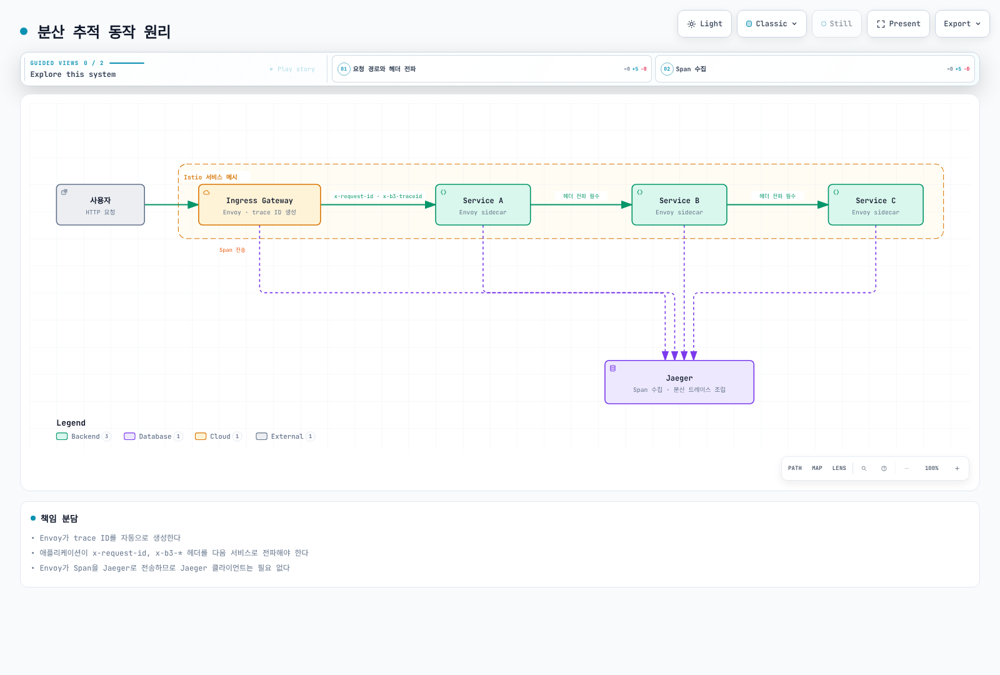
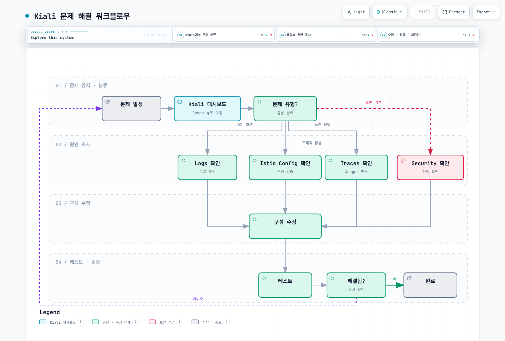

# Observability 퀴즈

> **마지막 업데이트**: 2026년 9월 11일 · Istio1.31 · Kubernetes1.32–1.36. EKS·Kiali 호환성 제한은 설치·대시보드 장을 확인하세요.

설정된 사이드카·waypoint 텔레메트리를 다루는 퀴즈입니다. 각 예제는 독립적이며 명시한 백엔드·네임스페이스·권한·트래픽을 전제합니다. YAML/API/쿼리 확인은 운영·실제 클러스터 검증이 아니며 ztunnel L4·native sidecar·HA 배포는 해당 수집 설정이 필요합니다.

## 객관식 문제 (1-5번)

### 문제 1: Prometheus 메트릭

다음 중 **Istio 표준 서비스 메트릭 이름·계열이 아닌** 것은?

A. istio\_requests\_total (총 요청 수)\
B. istio\_request\_duration\_milliseconds (요청 지연시간)\
C. istio\_request\_bytes (요청 크기)\
D. istio\_pod\_cpu\_usage (Pod CPU 사용률)

<details>

<summary>정답 및 해설</summary>

**정답: D**

Istio 표준 서비스 메트릭은 트래픽을 나타내며 Envoy 내부 통계도 별도로 존재합니다. Prometheus의 컨테이너 CPU 사용량은 kubelet/cAdvisor(또는 런타임 자원 pipeline)에서 얻습니다. Metrics Server는 autoscaling·`kubectl top`용 자원 메트릭을 제공하고 kube-state-metrics는 실측 CPU가 아닌 객체 상태·설정된 request/limit을 노출합니다.

**해설:**

**Istio가 수집하는 메트릭:**

1. **istio\_requests\_total (A - O)**

```promql
# 서비스별 초당 요청률
sum(rate(istio_requests_total{reporter="destination"}[5m])) by (destination_service_name, destination_service_namespace)
```

2. **istio\_request\_duration\_milliseconds (B - O)**

```promql
# P95 지연시간
histogram_quantile(0.95,
  sum(rate(istio_request_duration_milliseconds_bucket{reporter="destination"}[5m])) by (le)
)
```

3. **istio\_request\_bytes (C - O)**

```promql
# 요청 본문 byte rate(초당 바이트)이며 평균 요청 크기가 아님
sum(rate(istio_request_bytes_sum{reporter="destination"}[5m])) by (destination_service_name, destination_service_namespace)
```

4. **istio\_pod\_cpu\_usage (D - X)**

* 이것은 Istio 메트릭이 아닙니다
* Kubernetes 메트릭: `container_cpu_usage_seconds_total`
* kubelet/cAdvisor를 스크레이프하며 설정된 limit과 비교할 때 kube-state-metrics를 사용

**Istio 메트릭 카테고리:**

| 카테고리         | 메트릭 예시                                        | 설명          |
| ------------ | --------------------------------------------- | ----------- |
| **Request**  | istio\_requests\_total                        | 요청 수, 응답 코드 |
| **Duration** | istio\_request\_duration\_milliseconds        | 지연시간 분포     |
| **Size**     | istio\_request\_bytes, istio\_response\_bytes | 트래픽 크기      |
| **TCP**      | istio\_tcp\_connections\_opened\_total        | TCP 연결      |

**Golden Signals 예제:**

```promql
# 1. Latency (지연시간)
histogram_quantile(0.95,
  sum(rate(
    istio_request_duration_milliseconds_bucket{reporter="destination",
      destination_service_name="reviews", destination_service_namespace="default"
    }[5m]
  )) by (le)
)

# 2. Traffic (트래픽)
sum(rate(
  istio_requests_total{reporter="destination",
    destination_service_name="reviews", destination_service_namespace="default"
  }[5m]
))

# 3. Errors (에러율)
sum(rate(
  istio_requests_total{reporter="destination",
    destination_service_name="reviews", destination_service_namespace="default",
    response_code=~"5.."
  }[5m]
))
/
sum(rate(
  istio_requests_total{reporter="destination",
    destination_service_name="reviews", destination_service_namespace="default"
  }[5m]
))

# 4. Saturation (포화도) - Kubernetes 메트릭 사용
sum(rate(
  container_cpu_usage_seconds_total{
    namespace="default", container="istio-proxy", pod=~"reviews-.*"
  }[5m]
))
```

**메트릭 확인:**

```bash
# Envoy Admin API로 메트릭 확인
istioctl x envoy-stats <pod-name>.default --output prom

# Prometheus에서 확인
kubectl port-forward -n istio-system svc/prometheus 9090:9090
# http://localhost:9090에서 쿼리
```

**참고 자료:**

* [메트릭](../../../service-mesh/istio/observability/01-metrics.md)

</details>

***

### 문제 2: 분산 추적 (Distributed Tracing)

정상 추적 제공자·백엔드가 있을 때 서비스 호출 사이의 프록시 span을 연결하기 위해 애플리케이션이 해야 할 일은?

A. 애플리케이션이 trace ID를 생성해야 한다\
B. 애플리케이션이 HTTP 헤더를 전파(propagate)해야 한다\
C. 모든 서비스에 Jaeger 클라이언트를 설치해야 한다\
D. Envoy가 자동으로 모든 것을 처리한다

<details>

<summary>정답 및 해설</summary>

**정답: B**

설정된 프록시는 span·trace ID를 만들 수 있지만 애플리케이션은 송신 호출에 trace context를 전파해야 합니다. SDK는 활성 context를 주입하므로 trace ID는 유지되면서 자식 span ID가 달라질 수 있습니다. 자체 span이 없는 투명 애플리케이션은 선택한 전파 헤더를 전달할 수 있습니다.

**해설:**

**분산 추적 동작 원리:**



[🔍 인터랙티브 다이어그램 보기](https://www.atomai.click/kubernetes-docs/archmaps/ko-quizzes-service-mesh-istio-observability-0.html)

그림은 설정된 Jaeger 백엔드로의 B3 전파를 보여줍니다. W3C 전파와 중간 OpenTelemetry Collector도 지원하며 계측된 애플리케이션은 모든 헤더를 그대로 복사하는 대신 활성 span context를 주입합니다.

**전파해야 하는 HTTP 헤더:**

```text
W3C: traceparent, tracestate
B3 (if configured): b3 OR x-b3-traceid, x-b3-spanid, x-b3-parentspanid, x-b3-sampled
Istio correlation: x-request-id
B3 debug flag: x-b3-flags (do not force debug sampling on ordinary traffic)
```

**애플리케이션 코드 예시:**

```python
# Python Flask 예시
from flask import Flask, request
import requests

app = Flask(__name__)

@app.route('/api/users')
def get_users():
    # 1. 수신된 헤더 추출
    headers = {}
    for header in ['x-request-id', 'traceparent', 'tracestate', 'b3', 'x-b3-traceid', 'x-b3-spanid',
                   'x-b3-parentspanid', 'x-b3-sampled', 'x-b3-flags']:
        if header in request.headers:
            headers[header] = request.headers[header]

    # 2. 다음 서비스 호출 시 헤더 전파
    response = requests.get(
        'http://user-service/users',
        headers=headers, timeout=3  # 선택한 전파 형식
    )

    response.raise_for_status()
    return response.json()
```

```javascript
// Node.js Express 예시
const express = require('express');
const axios = require('axios');
const app = express();

app.get('/api/users', async (req, res) => {
  // 1. 수신된 헤더 추출
  const tracingHeaders = {};
  ['x-request-id', 'traceparent', 'tracestate', 'b3', 'x-b3-traceid', 'x-b3-spanid',
   'x-b3-parentspanid', 'x-b3-sampled', 'x-b3-flags'].forEach(header => {
    if (req.headers[header]) {
      tracingHeaders[header] = req.headers[header];
    }
  });

  // 2. 다음 서비스 호출 시 헤더 전파
  try {
    const response = await axios.get('http://user-service/users', {
      headers: tracingHeaders, timeout: 3000
    });
    res.json(response.data);
  } catch (error) {
    res.status(502).json({error: 'Downstream request failed'});
  }
});
```

**각 옵션 분석:**

* **A (X)**: Envoy가 자동으로 trace ID 생성
* **B (O)**: 애플리케이션이 HTTP 헤더를 전파해야 함 (필수)
* **C (X)**: Jaeger 클라이언트 불필요, Envoy가 Span 전송
* **D (X)**: Envoy는 Span 생성/전송하지만, 헤더 전파는 애플리케이션 책임

**샘플링 설정:**

추적 장의 `otel-tracing` 제공자를 전제합니다. `1.0`은100%가 아닌1%이며 제공자·exporter 설정과 context 전파는 별도 요구입니다.

```yaml
apiVersion: telemetry.istio.io/v1
kind: Telemetry
metadata:
  name: tracing-sample
  namespace: default
spec:
  tracing:
  - providers:
    - name: otel-tracing
    randomSamplingPercentage: 1.0
```

**Jaeger 접속:**

```bash
kubectl port-forward -n observability svc/jaeger-query 16686:16686
```

**참고 자료:**

* [분산 추적](../../../service-mesh/istio/observability/02-tracing.md)

</details>

***

### 문제 3: Kiali 시각화

Kiali가 제공하는 기능이 **아닌** 것은?

A. 서비스 토폴로지 시각화\
B. 트래픽 흐름 분석\
C. 자동 Canary 배포 실행\
D. Istio 구성 검증

<details>

<summary>정답 및 해설</summary>

**정답: C**

Kiali는 **관찰 및 분석 도구**이며, 배포 실행은 **Argo Rollouts** 같은 도구가 담당합니다.

**해설:**

**Kiali의 주요 기능:**

**1. 서비스 토폴로지 시각화 (A - O)**

```bash
# Kiali 대시보드 열기
istioctl dashboard kiali

# 기능:
# - 실시간 서비스 간 연결 표시
# - 트래픽 흐름 방향 표시
# - 서비스 상태 (정상/오류)
# - 응답 시간 표시
```

**Graph 뷰 예시:**

```
Frontend → Backend → Database
   ↓
External API

색상 코드:
- 녹색: 정상
- 빨강: 에러
- 회색: 트래픽 없음
```

**2. 트래픽 흐름 분석 (B - O)**

Kiali는 다음을 표시합니다:

* 요청 수 (RPS)
* 에러율 (%)
* P50/P95/P99 지연시간
* TCP 연결 수

**3. 자동 Canary 배포 실행 (C - X)**

* Kiali는 트래픽을 표시하고 권한이 있으면 Istio 설정 편집·트래픽 wizard를 사용할 수 있습니다
* 자동 progressive-delivery controller를 대체하지는 않습니다
* ✅ 배포 실행: Argo Rollouts, Flagger

**4. Istio 구성 검증 (D - O)**

[Kiali 검증 목록](https://kiali.io/docs/features/validations/)의 예시입니다:

- VirtualService: 정의되지 않은 subset (`KIA1107`).
- DestinationRule: host/subset 정의 중복 (`KIA0201`).
- AuthorizationPolicy: 참조한 namespace 없음 (`KIA0101`), 또는 principal이 검색된 workload의 ServiceAccount와 연결되지 않음 (`KIA0106`).

검사는 Kiali 버전·검색 범위·권한에 따라 달라집니다. 실제 코드·메시지와 프록시 정책을 확인해야 하며 임의의 정책 충돌이나 모든 인증서·실행 중 route의 정상 동작을 증명하지는 않습니다.

**Kiali 설치:**

고정된 operator·인증·현재 호환성 제한은 [대시보드 장](../../../service-mesh/istio/observability/04-dashboards.md)을 따릅니다. Kiali는 별도로 설치하며 sample addon은 데모입니다. 백엔드·RBAC가 없는 Helm 설치는 운영 구성이 아닙니다.

**Kiali 주요 메뉴:**

```
1. Overview: Namespace별 서비스 요약
2. Graph: 서비스 토폴로지
3. Applications: 애플리케이션 목록
4. Workloads: Deployment, StatefulSet 등
5. Services: Kubernetes Service
6. Istio Config: VirtualService, DestinationRule 등
```

**Kiali vs 다른 도구:**

| 도구 | 역할 | 자동 progressive delivery |
| ----------------- | -------------------- | ----- |
| **Kiali**         | 시각화, 분석, 검증          | ❌     |
| **Argo Rollouts** | Progressive Delivery | ✅     |
| **Flagger**       | 자동 Canary 배포         | ✅     |
| **Grafana**       | 메트릭 대시보드             | ❌     |
| **Jaeger**        | 분산 추적                | ❌     |

**실전 사용 예시:**

```bash
# 1. Kiali에서 서비스 토폴로지 확인
istioctl dashboard kiali

# 2. Graph 뷰에서 이상 감지
#    - reviews 서비스 에러율 5%
#    - productpage → reviews 지연시간 증가

# 3. Workload 뷰에서 상세 확인
#    - reviews-v2 Pod의 로그 확인
#    - Envoy 메트릭 확인

# 4. Istio Config 뷰에서 구성 검증
#    - VirtualService에 오타 발견
#    - 수정 후 재배포
```

**참고 자료:**

* [시각화](../../../service-mesh/istio/observability/04-dashboards.md)
* [Kiali 공식 문서](https://kiali.io/docs/)

</details>

***

### 문제 4: Access Log 구성

Istio에서 Access Log를 **JSON 형식**으로 출력하도록 설정하는 방법은?

A. IstioOperator의 meshConfig.accessLogEncoding을 JSON으로 설정\
B. Envoy ConfigMap을 직접 수정\
C. 각 Pod에 annotation 추가\
D. Prometheus 쿼리로 JSON 변환

<details>

<summary>정답 및 해설</summary>

**정답: A**

A는 유효한 MeshConfig 방법입니다. 로깅을 켠 `istioctl install -f` 입력에 `accessLogEncoding: JSON`을 사용하며 클러스터 내 operator 리소스로 적용하지 않습니다. 로깅 장의 `envoyFileAccessLog.logFormat.labels` 사용자 제공자도 지원되는 방법입니다.

**해설:**

**JSON 형식 Access Log 설정:**

```yaml
apiVersion: install.istio.io/v1alpha1
kind: IstioOperator
spec:
  meshConfig:
    # Access Log 활성화
    accessLogFile: /dev/stdout

    # JSON 형식으로 출력
    accessLogEncoding: JSON

    # 커스텀 JSON 형식 정의
    accessLogFormat: |
      {
        "log_type": "access",
        "start_time": "%START_TIME%",
        "method": "%REQ(:METHOD)%",
        "path": "%REQ_WITHOUT_QUERY(X-ENVOY-ORIGINAL-PATH?:PATH)%",
        "protocol": "%PROTOCOL%",
        "response_code": "%RESPONSE_CODE%",
        "response_flags": "%RESPONSE_FLAGS%",
        "bytes_received": "%BYTES_RECEIVED%",
        "bytes_sent": "%BYTES_SENT%",
        "duration": "%DURATION%",
        "upstream_service_time": "%RESP(X-ENVOY-UPSTREAM-SERVICE-TIME)%",
        "x_forwarded_for": "%REQ(X-FORWARDED-FOR)%",
        "user_agent": "%REQ(USER-AGENT)%",
        "request_id": "%REQ(X-REQUEST-ID)%",
        "authority": "%REQ(:AUTHORITY)%",
        "upstream_host": "%UPSTREAM_HOST%",
        "upstream_cluster": "%UPSTREAM_CLUSTER%",
        "upstream_local_address": "%UPSTREAM_LOCAL_ADDRESS%",
        "downstream_local_address": "%DOWNSTREAM_LOCAL_ADDRESS%",
        "downstream_remote_address": "%DOWNSTREAM_REMOTE_ADDRESS%",
        "requested_server_name": "%REQUESTED_SERVER_NAME%",
        "route_name": "%ROUTE_NAME%"
      }
```

**출력 예시:**

```json
{
  "log_type": "access",
  "start_time": "2025-01-20T10:30:00.123Z",
  "method": "GET",
  "path": "/api/users",
  "protocol": "HTTP/1.1",
  "response_code": 200,
  "response_flags": "-",
  "bytes_received": 0,
  "bytes_sent": 1234,
  "duration": 42,
  "upstream_service_time": "40",
  "x_forwarded_for": "192.168.1.100",
  "user_agent": "Mozilla/5.0",
  "request_id": "abc-123-def",
  "authority": "example.com",
  "upstream_host": "10.0.1.20:8080",
  "upstream_cluster": "outbound|8080||backend.default.svc.cluster.local",
  "upstream_local_address": "10.0.1.10:54321",
  "downstream_local_address": "10.0.1.10:8080",
  "downstream_remote_address": "10.0.1.5:12345",
  "requested_server_name": "-",
  "route_name": "default"
}
```

**Namespace별 설정:**

이 대안은 로깅 장처럼 `mesh-json`을 먼저 정의합니다. Telemetry는 제공자·범위를 선택하며 자체적으로 제공자의 형식을 바꾸지는 않습니다.

```yaml
apiVersion: telemetry.istio.io/v1
kind: Telemetry
metadata:
  name: access-logging
  namespace: production
spec:
  accessLogging:
  - providers:
    - name: mesh-json
    # 이미 정의된 JSON 제공자 선택
```

**Envoy 포맷 변수:**

```text
# 주요 변수:
%START_TIME%: 요청 시작 시간
%REQ(HEADER)%: 요청 헤더
%RESP(HEADER)%: 응답 헤더
%RESPONSE_CODE%: HTTP 응답 코드
%DURATION%: 총 소요 시간 (ms)
%BYTES_RECEIVED%: 수신 바이트
%BYTES_SENT%: 전송 바이트
%UPSTREAM_HOST%: 업스트림 서버 주소
%DOWNSTREAM_REMOTE_ADDRESS%: 클라이언트 주소
```

**CloudWatch Logs 통합:**

일치하는 input tag·CRI/JSON 파싱·IAM 자격 증명·로그 마운트를 구성한 기존 Fluent Bit agent의 출력 조각입니다. ConfigMap만으로 로그가 수집되지 않습니다. EKS Fargate는 지원되는 log-router 설정이 필요합니다.

```yaml
apiVersion: v1
kind: ConfigMap
metadata:
  name: fluent-bit-config
  namespace: istio-system
data:
  output.conf: |
    [OUTPUT]
        Name cloudwatch_logs
        Match *
        region us-east-1
        log_group_name /aws/eks/istio/access-logs
        log_stream_prefix istio-
        auto_create_group true
```

**로그 확인:**

```bash
# Pod의 Access Log 확인
kubectl logs <pod-name> -c istio-proxy

# 실시간 모니터링
kubectl logs -f <pod-name> -c istio-proxy | jq -R 'fromjson?'

# 특정 응답 코드 필터링
kubectl logs <pod-name> -c istio-proxy | \
  jq -R 'fromjson? | select((.response_code | tonumber?) == 500)'
```

**TEXT 형식 vs JSON 형식:**

| 항목      | TEXT    | JSON      |
| ------- | ------- | --------- |
| **가독성** | 높음 (사람) | 낮음 (사람)   |
| **파싱**  | 어려움     | 쉬움 (기계)   |
| **크기**  | 작음      | 큼         |
| **구조화** | 비구조화    | 구조화       |
| **쿼리**  | 어려움     | 쉬움 (jq 등) |

**TEXT 형식 예시:**

```
[2025-01-20T10:30:00.123Z] "GET /api/users HTTP/1.1" 200 - "-" "-" 0 1234 42 40 "192.168.1.100" "Mozilla/5.0" "abc-123-def" "example.com" "10.0.1.20:8080" outbound|8080||backend.default.svc.cluster.local 10.0.1.10:54321 10.0.1.10:8080 10.0.1.5:12345 - default
```

**참고 자료:**

* [로깅](../../../service-mesh/istio/observability/03-logging.md)
* [Envoy Access Log Format](https://www.envoyproxy.io/docs/envoy/latest/configuration/observability/access_log/usage)

</details>

***

### 문제 5: Grafana 대시보드

Istio가 제공하는 Grafana 대시보드 목록에 **포함되지 않는** 것은?

A. Istio Service Dashboard\
B. Istio Workload Dashboard\
C. Istio Performance Dashboard\
D. Istio Cost Dashboard

<details>

<summary>정답 및 해설</summary>

**정답: D**

D입니다. Istio는 트래픽·컨트롤 플레인 대시보드를 제공하지만 Grafana 자체는 별도 addon이므로 Istio 설치만으로 대시보드가 자동 설치되지는 않습니다.

**해설:**

1.31 목록은 Service7636·Workload7630·Mesh7639·Performance11829·Control Plane7645·Wasm13277·Ztunnel21306을 포함합니다. Performance는 자원·전송량 중심이고 xDS·webhook은 주로 Control Plane 패널입니다. Mesh는 전체 트래픽·컴포넌트 버전을 다루며 기존에 나열한 모든 지연 패널이 있지는 않습니다. 설치한 Istio에 맞는 리비전을 선택합니다.

`istio_requests_total`에 GB 전송 단가를 곱해 비용을 계산할 수는 없습니다. 요청 수는 바이트가 아니고 `source_cluster`·`destination_cluster`는 AZ가 아닌 클러스터 ID입니다. 프록시 메모리 사용량도 청구 금액이 아닙니다. 네트워크 비용에는 과금 대상 바이트·실제 위치·서비스별 규칙, 자원 비용 배분에는 노드 가격·시간·명시적 배분 모델이 필요합니다. 고정 공식을 단정하지 말고 실제 AWS 청구/CUR·해당 가격과 추정치를 대조합니다.

검증한 리비전과 완전한 JSON·provisioning 예제는 [대시보드 장](../../../service-mesh/istio/observability/04-dashboards.md)을 참고합니다. ConfigMap·레이블만으로 loader가 설치되거나 datasource 입력이 치환되지는 않습니다.

</details>

***

## 주관식 문제 (6-10번)

### 문제 6: Golden Signals 모니터링

Google SRE의 **Golden Signals**(Latency, Traffic, Errors, Saturation)를 Istio와 Prometheus를 사용하여 모니터링하는 방법을 설명하세요. 각 신호에 대한 **Prometheus 쿼리**와 **알림 규칙**을 포함해야 합니다.

<details>

<summary>예시 답안</summary>

서비스 홉 계산에는 한 reporter를 선택하고 서비스 네임스페이스(필요 시 클러스터)를 유지합니다. 수신 메트릭은 서비스에 도착한 요청을, 도착하지 못한 upstream 오류는 송신 메트릭으로 봅니다. HTTP5xx는 오류 정의 중 하나이며 gRPC는 `grpc_response_status`와 애플리케이션 SLI 규칙이 필요합니다. 다음 지연 단위는 밀리초, rate는 초당 값입니다:

```promql
histogram_quantile(0.95, sum by (destination_service_name, destination_service_namespace, le) (rate(istio_request_duration_milliseconds_bucket{reporter="destination"}[5m])))

histogram_quantile(0.99, sum by (destination_service_name, destination_service_namespace, le) (rate(istio_request_duration_milliseconds_bucket{reporter="destination"}[5m])))

sum by (destination_service_name, destination_service_namespace) (rate(istio_requests_total{reporter="destination"}[5m]))

sum by (destination_service_name, destination_service_namespace) (rate(istio_requests_total{reporter="destination",response_code=~"5.."}[5m])) / sum by (destination_service_name, destination_service_namespace) (rate(istio_requests_total{reporter="destination"}[5m]))
```

단일 클러스터의 일반 사이드카 사용량/limit 비율에는 kubelet/cAdvisor와 kube-state-metrics가 필요합니다. 없거나0인 limit은 제외합니다. Native sidecar의 설정 limit은 init-container 자원 시계열일 수 있으므로 실제 메트릭 계열을 확인합니다:

```promql
sum by (namespace, pod, container) (rate(container_cpu_usage_seconds_total{container="istio-proxy"}[5m])) / on (namespace, pod, container) (max by (namespace, pod, container) (kube_pod_container_resource_limits{container="istio-proxy",resource="cpu",unit="core"}) > 0)

max by (namespace, pod, container) (container_memory_working_set_bytes{container="istio-proxy"}) / on (namespace, pod, container) (max by (namespace, pod, container) (kube_pod_container_resource_limits{container="istio-proxy",resource="memory",unit="byte"}) > 0)

envoy_cluster_upstream_cx_active
envoy_cluster_upstream_rq_pending_active
envoy_cluster_circuit_breakers_default_cx_open
```

`_cx_open`은0/1 상태 gauge이므로 활성 연결 수를 이것으로 나누면 사용률이 되지 않습니다. 비율이 필요하면 설정된 circuit breaker 한도를 확인합니다. 나누기 전 CPU rate는 core, working set은 byte 단위입니다. 메서드별 집계에는 제한된 `request_method` Telemetry 레이블을 먼저 추가해야 합니다.

다음 PrometheusRule을 설치된 Prometheus Operator가 선택해야 합니다. 임계치·비교 구간은 예시이며 계절성·데이터 부재·스크레이프 실패·최소 트래픽 조건은 환경에 맞춰 처리합니다. 이전1시간 구간은 학습된 정상 baseline이 아닙니다.

```yaml
apiVersion: monitoring.coreos.com/v1
kind: PrometheusRule
metadata:
  name: istio-golden-signals
  namespace: monitoring
spec:
  groups:
  - name: golden-signals
    rules:
    - alert: HighLatency
      expr: histogram_quantile(0.95, sum by (destination_service_name, destination_service_namespace,
        le) (rate(istio_request_duration_milliseconds_bucket{reporter="destination"}[5m]))) > 500
      for: 5m
      labels:
        severity: warning
      annotations:
        summary: P95 request duration exceeds500ms
    - alert: TrafficSpike
      expr: sum by (destination_service_name, destination_service_namespace) (rate(istio_requests_total{reporter="destination"}[5m]))
        > 2 * sum by (destination_service_name, destination_service_namespace) (rate(istio_requests_total{reporter="destination"}[1h]
        offset 1h))
      for: 5m
      labels:
        severity: warning
      annotations:
        summary: Traffic exceeds the previous comparison window
    - alert: HighErrorRate
      expr: sum by (destination_service_name, destination_service_namespace) (rate(istio_requests_total{reporter="destination",response_code=~"5.."}[5m]))
        / sum by (destination_service_name, destination_service_namespace) (rate(istio_requests_total{reporter="destination"}[5m]))
        > 0.01
      for: 5m
      labels:
        severity: warning
      annotations:
        summary: HTTP5xx fraction exceeds1%
    - alert: HighEnvoyCPU
      expr: sum by (namespace, pod, container) (rate(container_cpu_usage_seconds_total{container="istio-proxy"}[5m]))
        / on (namespace, pod, container) (max by (namespace, pod, container) (kube_pod_container_resource_limits{container="istio-proxy",resource="cpu",unit="core"})
        > 0) > 0.8
      for: 5m
      labels:
        severity: warning
      annotations:
        summary: Proxy CPU consumption exceeds80% of its configured limit
    - alert: HighEnvoyMemory
      expr: max by (namespace, pod, container) (container_memory_working_set_bytes{container="istio-proxy"})
        / on (namespace, pod, container) (max by (namespace, pod, container) (kube_pod_container_resource_limits{container="istio-proxy",resource="memory",unit="byte"})
        > 0) > 0.8
      for: 5m
      labels:
        severity: warning
      annotations:
        summary: Proxy working set exceeds80% of its configured limit
    - alert: ConnectionBreakerAtCapacity
      expr: envoy_cluster_circuit_breakers_default_cx_open == 1
      for: 5m
      labels:
        severity: warning
      annotations:
        summary: Connection breaker at capacity
```

[검증한 대시보드 템플릿](../../../service-mesh/istio/observability/04-dashboards.md)으로 요청률·오류 비율·지연·자원 단위를 구분해 표시합니다. CPU core와 메모리 byte를 단위 없는 같은 축에 놓지 않습니다.

</details>

***

### 문제 7: Jaeger를 사용한 성능 병목 지점 찾기

분산 추적 도구인 Jaeger를 사용하여 마이크로서비스 아키텍처에서 **성능 병목 지점**을 찾는 방법을 설명하세요. **Trace 분석 방법**과 **실전 디버깅 시나리오**를 포함해야 합니다.

<details>

<summary>예시 답안</summary>

[Jaeger2/OTLP 추적 설정](../../../service-mesh/istio/observability/02-tracing.md), 구성된 Telemetry 제공자, 애플리케이션 context 전파로 시작합니다. 오래된 Jaeger addon·Zipkin 포트나 샘플링 값만으로 추적이 배포된다고 가정하지 않습니다. 애플리케이션·DB span에는 SDK·agent 계측이 필요하며 프록시 span으로 DB 쿼리 내부를 알 수 없습니다.

1. Namespace를 제한한 Prometheus 지연 쿼리로 서비스·시간 범위를 찾고 Jaeger에서 대표적인 느린·정상 trace를 비교합니다. Histogram 쿼리는 trace ID가 아닌 집계 통계입니다.
2. Critical path를 따라 부모 전체 시간과 exclusive time을 구분합니다. 긴 부모에는 자식 시간이 포함되므로 자동으로 원인이 되지는 않습니다.
3. 오류·재시도·연결 대기·쿼리 실행·병렬성을 비교하며 샘플링·누락 span·시계 오차의 한계를 고려합니다.

```promql
histogram_quantile(0.99, sum by (destination_service_name, destination_service_namespace, le) (rate(istio_request_duration_milliseconds_bucket{reporter="destination"}[5m]))) > 2000
```

```bash
kubectl port-forward -n observability svc/jaeger-query 16686:16686
```

다음은 벤치마크 결과나 실제 Jaeger API 응답이 아닌 가상 진단 사례입니다:

| 관측 | 확인할 사항 | 대응 |
|---|---|---|
|2.1초 요청 중 계측된 DB 작업1.8초|Pool 대기·쿼리·lock·네트워크를 나누고 실행 계획 확인|측정된 원인을 수정합니다. `redis.conf` ConfigMap만으로 애플리케이션 캐시가 생기지 않습니다|
|연결 pool timeout을 포함한 약10초 요청|애플리케이션 DB client pool·동시성·DB 용량 확인|애플리케이션/DB pool·누수를 수정합니다. DestinationRule은 애플리케이션 pool을 설정하지 않으며 HTTP pool 값은 PostgreSQL 튜닝이 아닙니다|
|독립적인2초+2초+1초 호출이 순차 실행|의존성·부하 제한·trace context 확인|실제 async client나 제한된 thread로 독립 I/O만 병렬화합니다. 최장 호출+오버헤드에 가까워질 수 있지만2초를 보장하지 않습니다|

기존 동기 I/O callback에는 Python3.9 이상에서 다음 thread 방식을 사용할 수 있습니다. Callback과 timeout은 애플리케이션이 제공해야 하며 await 취소가 이미 실행 중인 thread를 중단하지는 않습니다:

```python
import asyncio

async def get_user_data(user_id):
    # Application-owned synchronous I/O functions; each must enforce its timeout.
    profile, orders, recommendations = await asyncio.gather(
        asyncio.to_thread(call_backend_a, user_id),
        asyncio.to_thread(call_backend_b, user_id),
        asyncio.to_thread(call_backend_c, user_id),
    )
    return merge(profile, orders, recommendations)
```

Timeout은 대기를 제한할 뿐 느린 DB를 고치지 않으며 재시도는 부하를 늘릴 수 있습니다. VirtualService timeout에는 실제 route 목적지를 포함하고 멱등성·부하를 고려해 재시도합니다. 영속 Jaeger의 전체 의존성 map에는 추가 집계가 필요할 수 있으며 단일 trace waterfall과 다른 기능입니다. 하나의 trace만 보고 결론내리지 말고 반복 트래픽·메트릭·trace로 수정 효과를 확인합니다.

</details>

***

### 문제 8: Kiali를 사용한 서비스 메시 문제 해결

Kiali를 사용하여 Istio 서비스 메시에서 발생하는 **일반적인 문제**(구성 오류, 트래픽 이상, 보안 정책 충돌)를 진단하고 해결하는 방법을 설명하세요.

<details>

<summary>예시 답안</summary>

Kiali 설정 검사·관측 트래픽·파드 로그·trace를 근거로 실제 프록시 설정을 확인합니다. 버전·인증 전제 조건은 대시보드 장에 있습니다. 그래프 모양으로 존재하지 않는 경고를 만들거나 녹색 아이콘을 실행 보장으로 해석하지 않습니다.

| 증상 | 올바른 해석과 확인 |
|---|---|
|서비스·subset 없음|`default`에서 `reviews`와 FQDN `reviews.default.svc.cluster.local`은 같은 host입니다. 짧게 바꿔도 없는 Service가 생기지 않습니다. KIA1107은 정의되지 않은 subset이며 Service/EndpointSlice·DestinationRule·실제 파드 레이블을 확인합니다|
|Subset 레이블 불일치|`1.0` 자체가 잘못된 값은 아닙니다. 의도한 Deployment 레이블과 맞추고 완전한 DestinationRule에는 metadata·host·문서 구분자를 포함합니다|
|설정50/50인데 관측90/10|실제 가중치·매칭 규칙·연결 affinity·재시도·endpoint/ejection·시간 범위를 확인합니다. Ready replica 감소만으로 subset 가중치가 바뀌거나 이후50/50이 보장되지는 않습니다|
|A↔B 순환|양방향 그래프가 재귀 호출·deadlock·자동 Kiali 경고의 증거는 아닙니다. 실제 의도하지 않은 순환인지 trace로 확인한 뒤 설계를 바꿉니다|
|HTTP403|강제하는 프록시의 정책·신원·응답 세부 정보를 봅니다. 빈 spec 정책은 규칙이 없는 ALLOW이며 다른 ALLOW가 예외를 허용할 수 있습니다. 우선 적용되는 DENY가 아닙니다|
|mTLS 오류|PeerAuthentication은 수신자를 설명합니다. 해당 방향의 송신 TLS·수신 정책·등록·인증서/신뢰·포트 프로토콜을 확인합니다. 수신 모드 차이가 자동 충돌은 아니며 전체 STRICT는 마이그레이션 결정이지 일반 오류 해결책이 아닙니다|

mTLS로 지정한 frontend principal을 확인하고 앞선 CUSTOM/DENY가 거부하지 않는다면 다음 기본 거부·예외 조합은 유효합니다:

```yaml
apiVersion: security.istio.io/v1
kind: AuthorizationPolicy
metadata:
  name: backend-default-deny
  namespace: default
spec:
  selector:
    matchLabels:
      app: backend
---
apiVersion: security.istio.io/v1
kind: AuthorizationPolicy
metadata:
  name: backend-allow-frontend
  namespace: default
spec:
  selector:
    matchLabels:
      app: backend
  action: ALLOW
  rules:
  - from:
    - source:
        principals:
        - cluster.local/ns/default/sa/frontend
```

```bash
kubectl get service reviews -n default
kubectl get endpointslice -n default -l kubernetes.io/service-name=reviews
kubectl get pods -n default -l app=reviews --show-labels
istioctl analyze -n default
istioctl proxy-config clusters <source-pod> -n default --fqdn reviews.default.svc.cluster.local -o json
istioctl x authz check <backend-pod>.default
```

트래픽 애니메이션은 선택한 구간의 요약이며 바이트 단위 패킷 검사가 아닙니다. 가설이 틀리면 워크로드를 무조건 재시작하지 말고 진단·설정·검증을 반복합니다.



[🔍 인터랙티브 다이어그램 보기](https://www.atomai.click/kubernetes-docs/archmaps/ko-quizzes-service-mesh-istio-observability-1.html)

</details>

***

### 문제 9: 프로덕션 환경 관찰성 스택 구축

프로덕션 Kubernetes 클러스터에서 Istio 관찰성 스택(Prometheus, Grafana, Jaeger, Kiali)을 **고가용성(HA)** 구성으로 배포하는 방법을 설명하세요. **영속성 스토리지**, **스케일링**, **백업** 전략을 포함해야 합니다.

<details>

<summary>예시 답안</summary>

운영 HA 스택은 환경별 설계·검증 작업입니다. 다음은 주요 요구 사항을 설명한 답안이며 운영에서 검증된 배포 번들이 아닙니다. 호환되는 Kubernetes/Istio/operator/chart/backend 버전을 고정하고 실제 chart 값을 확인한 뒤 장애·복원 동작을 검증합니다. 현재 Kiali 호환성 공백은 [대시보드 장](../../../service-mesh/istio/observability/04-dashboards.md)에 있으며 최신 버전이라는 이유로 호환성을 추론하지 않습니다.

| 구성 요소 | 상태·HA 요구 사항 |
|---|---|
|Prometheus|Replica별 독립 PVC, 같은 클러스터 replica들이 공유하는 cluster 레이블과 서로 다른 replica 레이블(중복 제거하려면 나머지 레이블이 일치해야 함)이 필요합니다. 장애 도메인을 분산하고 실제 수집량으로 보존 용량을 정합니다. Load balancer가 두 이력을 병합하지는 않습니다|
|Thanos|Sidecar는 StoreAPI·선택적 block upload를 제공하고 Query는 실제 endpoint와 replica 레이블로 중복 제거합니다. Store Gateway는 object storage를 읽고 Compactor는 single-writer·sharding 소유권에 맞춰 block 압축·보존을 처리합니다|
|Grafana|Replica2개에는 공유 HA PostgreSQL/MySQL, 동일한 provisioning/plugin/비밀 설정과 load balancer가 필요합니다. SQLite 또는 노드 간 단일 EBS ReadWriteOnce 볼륨 공유는 Grafana HA가 아닙니다|
|Alertmanager|Peer·알림 중복 제거·영속 상태·receiver 자격 증명이 필요합니다. Chart 값에 Slack webhook을 적는 것만으로 비밀·알림 설계가 완성되지 않습니다|
|Jaeger2/collector|상태 없는 query/collector replica와 지원되는 영속 backend 자체의 HA·TLS·자격 증명이 필요합니다. Tail sampler는 trace-ID affinity가 필요하며 임의 Service 분산만으로 완전한 trace가 모이지 않습니다|
|Kiali|호환 operator/server, 공유 설정·세션 Secret 동작, 적절한 파드 배치가 필요합니다. Backend API·사용자 네임스페이스 권한을 보호합니다. Token은 단일 클러스터용이며 멀티 클러스터는 문서화된 인증을 선택합니다|

**스토리지·object store 연결**:

- Object storage를 사용해도 최근 head/WAL은 아직 upload되지 않았을 수 있으므로 Prometheus 로컬 영속성을 유지합니다. Sidecar upload는 설치한 Thanos의 local compaction·block duration 요구를 따릅니다.
- S3 bucket·지역 endpoint·암호화·보존·IAM 권한을 준비하고 실제 sidecar/Store/Compactor 파드의 ServiceAccount에 자격 증명을 연결합니다. “IRSA” 주석만으로 권한이 생기지 않습니다. 현재 Thanos S3는 `aws_sdk_auth: true`와 지원되는 AWS SDK credential chain을 사용할 수 있습니다.
- 현재 kube-prometheus-stack의 기존 object-store Secret 선택은 `prometheus.prometheusSpec.thanos.objectStorageConfig.existingSecret` 아래 실제 name/key입니다. `thanos.yaml` key를 마운트해도 `objstore.yaml` 파일이 생기지 않습니다. 경로·gRPC Service 포트 이름·DNS-SRV 대상을 확인합니다.
- 현재 Thanos Query는 `--endpoint`·`--query.replica-label`을 사용하므로 릴리스 확인 없이 기존 `--store` 예제를 가져오지 않습니다. Kiali가 Prometheus 호환 backend를 조회할 때는 문서화된 `thanos_proxy` 설정도 필요할 수 있습니다.
- Deployment/StatefulSet의 selector·파드 레이블·Service가 일치해야 합니다. 기존의 불완전한 리소스는 정상 StoreAPI 토폴로지가 아니었습니다. EKS의 EBS 상태 저장은 지원되는 EC2 배치·CSI가 필요하며 Fargate는 EBS 마운트·임의 DaemonSet을 지원하지 않습니다.

**설정·백업·검증**:

1. 실제 monitor/rule selector·scrape target을 구성합니다. kube-prometheus-stack의 `alertmanager.config`는 `alertmanager.alertmanagerSpec`과 형제 필드이며 고정한 chart schema를 확인합니다. 비밀번호·webhook은 지원되는 Secret 참조로 관리합니다.
2. Grafana DB·설정·provisioning dashboard·plugin, 필요한 Prometheus 상태, Jaeger 저장소를 애플리케이션 일관성이 보장되는 절차로 백업합니다. Object-store 보존만으로 모든 구성 요소의 복원 전략이 완성되지는 않습니다.
3. Velero의 PVC/PV 매니페스트만으로 볼륨 데이터 백업이 증명되지 않습니다. 지원되는 CSI snapshot/data-mover 또는 filesystem backup, snapshot class/plugin·자격 증명·복원할 workload 리소스를 구성하고 상태 확인·격리 복원을 수행합니다.
4. Backup Job은 필요한 도구가 있는 검증된 이미지, 정확한 source URL·제한된 신원·bucket·실패 처리가 필요합니다. 기존 AWS CLI 이미지에 curl+jq가 있다고 가정한 S3 CronJob은 검증된 백업 해법이 아니었습니다.
5. Receiver/exporter 실패·queue·scrape·실제 PVC 용량을 관찰합니다. `prometheus_tsdb_storage_blocks_bytes_total`은 유효한 용량 분모가 아닙니다. 스택 전체 장애는 스스로 안정적으로 알리기 어려우므로 독립 heartbeat/observer가 필요하고 누락·no-data를 `up == 0`과 구분합니다.
6. Replica·node·zone 손실, 스토리지 중단, backend·인증 오류, rollout·복원을 시험합니다. PDB는 계획된 중단을 돕지만 DB·zone HA를 만들지는 않습니다. Replica 수로 RPO/RTO·용량을 단정하지 말고 관측 결과를 기록합니다.

[Grafana HA](https://grafana.com/docs/grafana/latest/setup-grafana/set-up-for-high-availability/), [Thanos Sidecar](https://thanos.io/tip/components/sidecar.md/), [Thanos Query](https://thanos.io/tip/components/query.md/), [Thanos storage](https://thanos.io/tip/thanos/storage.md/), [Velero CSI backup](https://velero.io/docs/main/csi/)을 참고하세요.

</details>

***

### 문제 10: 커스텀 메트릭 및 대시보드 생성

Istio Envoy가 수집하는 기본 메트릭 외에 **비즈니스 메트릭**(예: 주문 수, 결제 성공률)을 수집하고, Grafana 커스텀 대시보드를 생성하는 방법을 설명하세요.

<details>

<summary>예시 답안</summary>

메트릭 선택 전에 비즈니스 이벤트·집계 경계를 정의합니다. Envoy는 요청을 알지만 주문의 영속 생성·결제 확정을 알지는 못합니다. 다음 **통합 코드 조각은 완료된 처리 시도**를 세며 고유 주문 수·회계 매출이 아닙니다. 처리 함수·오류 계약·멱등성·입력 검증은 애플리케이션이 제공해야 합니다. 실제 결제 성공률은 결제 경계의 결과 counter로 계산하며 갱신하지 않는 Gauge는 성공률이 아닙니다.

상태·카테고리 레이블을 제한하고 Counter로 시도 수, Histogram으로 비음수 금액·지연을 관찰합니다. 실패 지연도 포함되도록 `finally`에서 기록합니다. 주문/user ID·원시 URL을 레이블로 넣지 않습니다. 단일 process 예제이며 multi-worker는 라이브러리가 지원하는 집계 설정이 필요합니다.

**Python/Flask** (`process_order`·`PaymentException`은 애플리케이션 제공):

```python
from flask import Flask, request, jsonify, Response
from prometheus_client import Counter, Histogram, generate_latest, CONTENT_TYPE_LATEST
import time

# Integration fragment: your application supplies process_order and PaymentException.
# process_order returns a validated nonnegative USD amount and category after processing.
app = Flask(__name__)
CATEGORIES = {"books", "electronics", "other"}
STATUSES = ("success", "payment_failed", "error")
orders_total = Counter("orders_total", "Completed order-processing attempts", ["status", "product_category"])
order_amount = Histogram("order_amount_dollars", "Observed amounts of successful attempts in USD",
                         buckets=[10, 50, 100, 500, 1000, 5000])
order_duration = Histogram("order_processing_duration_seconds", "Order attempt duration, including failures",
                           buckets=[0.1, 0.5, 1.0, 2.0, 5.0])
for status in STATUSES:
    for category in CATEGORIES:
        orders_total.labels(status=status, product_category=category).inc(0)

@app.post("/api/orders")
def create_order():
    payload = request.get_json()
    started = time.perf_counter()
    try:
        order = process_order(payload)
        category = order["category"] if order["category"] in CATEGORIES else "other"
        orders_total.labels(status="success", product_category=category).inc()
        order_amount.observe(order["amount"])
        return jsonify(order), 201
    except PaymentException:
        orders_total.labels(status="payment_failed", product_category="other").inc()
        return jsonify({"error": "Payment failed"}), 400
    except Exception:
        orders_total.labels(status="error", product_category="other").inc()
        return jsonify({"error": "Order processing failed"}), 500
    finally:
        order_duration.observe(time.perf_counter() - started)

@app.get("/metrics")
def metrics():
    return Response(generate_latest(), content_type=CONTENT_TYPE_LATEST)

# Use the application's server lifecycle. Do not treat a Flask development server
# or process-local counters as a production accounting system.
```

**Node.js/Express**: 유지보수되는 패키지는 `@prometheus-io/client`입니다(예제 API는 Node22·0.16.1 기준 확인). 기존 `prom-client`는 이 패키지로 대체되어 deprecated이므로 프로젝트 이동 시 changelog를 확인합니다. JSON middleware를 구성하고 `register.metrics()`를 await합니다:

```javascript
const express = require('express');
const client = require('@prometheus-io/client'); // Example verified with0.16.1, Node22
const app = express();
app.use(express.json());
const register = new client.Registry();
const categories = new Set(['books', 'electronics', 'other']);
const ordersTotal = new client.Counter({
  name: 'orders_total', help: 'Completed order-processing attempts',
  labelNames: ['status', 'product_category'], registers: [register]
});
const orderAmount = new client.Histogram({
  name: 'order_amount_dollars', help: 'Observed successful attempt amounts in USD',
  buckets: [10, 50, 100, 500, 1000, 5000], registers: [register]
});
const orderDuration = new client.Histogram({
  name: 'order_processing_duration_seconds', help: 'Order attempt duration, including failures',
  buckets: [0.1, 0.5, 1, 2, 5], registers: [register]
});
for (const status of ['success', 'payment_failed', 'error']) {
  for (const product_category of categories) ordersTotal.inc({status, product_category}, 0);
}
// The application supplies async processOrder with validated amount/category output.
app.post('/api/orders', async (req, res) => {
  const end = orderDuration.startTimer();
  try {
    const order = await processOrder(req.body);
    const product_category = categories.has(order.category) ? order.category : 'other';
    ordersTotal.inc({status: 'success', product_category});
    orderAmount.observe(order.amount);
    res.status(201).json(order);
  } catch (error) {
    const status = error.code === 'PAYMENT_FAILED' ? 'payment_failed' : 'error';
    ordersTotal.inc({status, product_category: 'other'});
    res.status(status === 'payment_failed' ? 400 : 500).json({error: 'Order processing failed'});
  } finally {
    end();
  }
});
app.get('/metrics', async (req, res) => {
  try {
    res.set('Content-Type', register.contentType);
    res.end(await register.metrics());
  } catch (error) {
    res.status(500).end();
  }
});
// Integrate app.listen/shutdown with the application's server lifecycle.
```

**Kubernetes 수집**: 이 사이드카 실습은 Istio 병합 endpoint를 사용하므로 평문 애플리케이션 스크레이프가 STRICT mTLS를 통과한다고 가정하지 않습니다. `default`의 실제 `order-service` Deployment에 다음 레이블·annotation을 병합하고 이미지가8080 `/metrics`를 제공해야 합니다. 메시의 Prometheus 병합 기능이 필요합니다. Agent15020은 평문이므로 네트워크 접근을 제한하고 이미 수집 중인 비즈니스 메트릭을 중복 스크레이프하지 않습니다.

```yaml
spec:
  template:
    metadata:
      labels:
        app: order-service
      annotations:
        prometheus.io/scrape: 'true'
        prometheus.io/path: /metrics
        prometheus.io/port: '8080'
        prometheus.istio.io/merge-metrics: 'true'
```

```yaml
apiVersion: v1
kind: Service
metadata:
  name: order-service
  namespace: default
  labels:
    app: order-service
spec:
  selector:
    app: order-service
  ports:
  - name: http
    port: 8080
    targetPort: 8080
  - name: merged-metrics
    port: 15020
    targetPort: 15020
---
apiVersion: monitoring.coreos.com/v1
kind: ServiceMonitor
metadata:
  name: order-service-metrics
  namespace: istio-system
spec:
  namespaceSelector:
    matchNames:
    - default
  selector:
    matchLabels:
      app: order-service
  targetLabels:
  - app
  endpoints:
  - port: merged-metrics
    path: /stats/prometheus
    interval: 30s
    metricRelabelings:
    - sourceLabels:
      - __name__
      regex: orders_total|order_amount_dollars_(bucket|sum|count)|order_processing_duration_seconds_(bucket|sum|count)
      action: keep
```

Prometheus가 `istio-system`의 ServiceMonitor를 선택해야 하며 monitor는 `default` Service를 검색합니다. 비즈니스 계열만 유지해 다른 곳에서 수집한 프록시 메트릭 중복을 피하고 `targetLabels`로 Service의 `app`을 명시적으로 추가합니다. 사이드카 예제이며 ambient·직접 TLS 스크레이프는 별도 지원 설계가 필요합니다.

**쿼리** (순서대로 구간 시도 수·초당 시도 수·성공 비율·관측 금액 P95·지연 P99·카테고리별 rate·주문 시도 중 결제 실패 비율):

```promql
sum(increase(orders_total{namespace="default",app="order-service"}[5m]))

sum(rate(orders_total{namespace="default",app="order-service"}[5m]))

sum(rate(orders_total{namespace="default",app="order-service",status="success"}[5m])) / sum(rate(orders_total{namespace="default",app="order-service"}[5m]))

histogram_quantile(0.95, sum by (le) (rate(order_amount_dollars_bucket{namespace="default",app="order-service"}[5m])))

histogram_quantile(0.99, sum by (le) (rate(order_processing_duration_seconds_bucket{namespace="default",app="order-service"}[5m])))

sum by (product_category) (rate(orders_total{namespace="default",app="order-service"}[5m]))

sum(rate(orders_total{namespace="default",app="order-service",status="payment_failed"}[5m])) / sum(rate(orders_total{namespace="default",app="order-service"}[5m]))
```

`increase`는 구간 합계 추정, `rate`는 초당 값입니다. Process 재시작·재시도·스크레이프 누락이 있으므로 운영 counter·금액 합계는 회계 원장이 아닙니다. 고유 확정 주문·매출은 텔레메트리가 exactly-once라고 가정하지 말고 영속 비즈니스 시스템과 대조합니다.

**Grafana**: 다음 완전한 dashboard 객체는 datasource UID `prometheus`와 앞 monitor의 레이블을 사용합니다. API wrapper 없이 저장하고 [대시보드 파일 provisioning](../../../service-mesh/istio/observability/04-dashboards.md)을 적용합니다. ConfigMap 레이블만으로 provider가 구성되지는 않습니다.

```json
{
  "uid": "order-business-metrics",
  "title": "Order Processing Operational Metrics",
  "timezone": "browser",
  "panels": [
    {
      "id": 1,
      "title": "Completed Attempts per Minute",
      "type": "timeseries",
      "datasource": {
        "type": "prometheus",
        "uid": "prometheus"
      },
      "targets": [
        {
          "expr": "sum(rate(orders_total{namespace=\"default\",app=\"order-service\"}[5m])) * 60",
          "refId": "A"
        }
      ],
      "gridPos": {
        "x": 0,
        "y": 0,
        "w": 12,
        "h": 8
      }
    },
    {
      "id": 2,
      "title": "Attempt Success Fraction",
      "type": "gauge",
      "datasource": {
        "type": "prometheus",
        "uid": "prometheus"
      },
      "targets": [
        {
          "expr": "sum(rate(orders_total{namespace=\"default\",app=\"order-service\",status=\"success\"}[5m])) / sum(rate(orders_total{namespace=\"default\",app=\"order-service\"}[5m]))",
          "refId": "A"
        }
      ],
      "gridPos": {
        "x": 12,
        "y": 0,
        "w": 12,
        "h": 8
      },
      "fieldConfig": {
        "defaults": {
          "unit": "percentunit"
        }
      }
    },
    {
      "id": 3,
      "title": "Processing P95",
      "type": "timeseries",
      "datasource": {
        "type": "prometheus",
        "uid": "prometheus"
      },
      "targets": [
        {
          "expr": "histogram_quantile(0.95, sum by (le) (rate(order_processing_duration_seconds_bucket{namespace=\"default\",app=\"order-service\"}[5m])))",
          "refId": "A"
        }
      ],
      "gridPos": {
        "x": 0,
        "y": 8,
        "w": 12,
        "h": 8
      },
      "fieldConfig": {
        "defaults": {
          "unit": "s"
        }
      }
    },
    {
      "id": 4,
      "title": "Observed Successful Attempt Amount (Last Hour)",
      "type": "stat",
      "datasource": {
        "type": "prometheus",
        "uid": "prometheus"
      },
      "targets": [
        {
          "expr": "sum(increase(order_amount_dollars_sum{namespace=\"default\",app=\"order-service\"}[1h]))",
          "refId": "A"
        }
      ],
      "gridPos": {
        "x": 12,
        "y": 8,
        "w": 12,
        "h": 8
      },
      "fieldConfig": {
        "defaults": {
          "unit": "currencyUSD"
        }
      }
    }
  ],
  "time": {
    "from": "now-1h",
    "to": "now"
  },
  "refresh": "30s"
}
```

**알림**: 설치된 Prometheus Operator가 다음 규칙을 선택해야 합니다. 최소 트래픽 조건은 무트래픽 비율 경고를 피하며 시계열 부재·스크레이프 실패는 별도 신호가 필요합니다. 임계치는 비즈니스 SLO 보장이 아닌 예시입니다.

```yaml
apiVersion: monitoring.coreos.com/v1
kind: PrometheusRule
metadata:
  name: business-metrics-alerts
  namespace: istio-system
spec:
  groups:
  - name: business-metrics
    rules:
    - alert: LowOrderAttemptSuccessFraction
      expr: (sum(rate(orders_total{namespace="default",app="order-service",status="success"}[5m])) / sum(rate(orders_total{namespace="default",app="order-service"}[5m]))
        < 0.95) and (sum(rate(orders_total{namespace="default",app="order-service"}[5m])) > 0.1)
      for: 5m
      labels:
        severity: warning
      annotations:
        summary: Order-processing attempt success fraction below95%
    - alert: SlowOrderProcessing
      expr: histogram_quantile(0.95, sum by (le) (rate(order_processing_duration_seconds_bucket{namespace="default",app="order-service"}[5m])))
        > 2
      for: 5m
      labels:
        severity: warning
      annotations:
        summary: P95 processing attempt duration exceeds2s
```

메트릭 유형·노출·process 모델은 [Python client](https://prometheus.github.io/client_python/)와 [JavaScript client](https://github.com/prometheus/client_js)를 참고하세요.

</details>

***

## 점수 계산

* 객관식 1-5번: 각 10점 (총 50점)
* 주관식 6-10번: 각 10점 (총 50점)
* **총점: 100점**

**평가 기준:**

* 90-100점: 우수 (해당 주제 이해도 높음)
* 80-89점: 양호 (배포 검증은 별도 필요)
* 70-79점: 보통 (추가 학습 권장)
* 60-69점: 미흡 (기본 개념 복습 필요)
* 0-59점: 재학습 필요

## 학습 자료

* [메트릭](../../../service-mesh/istio/observability/01-metrics.md)
* [분산 추적](../../../service-mesh/istio/observability/02-tracing.md)
* [로깅](../../../service-mesh/istio/observability/03-logging.md)
* [시각화](../../../service-mesh/istio/observability/04-dashboards.md)
