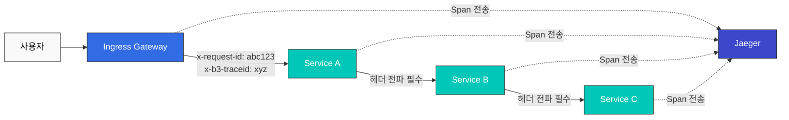
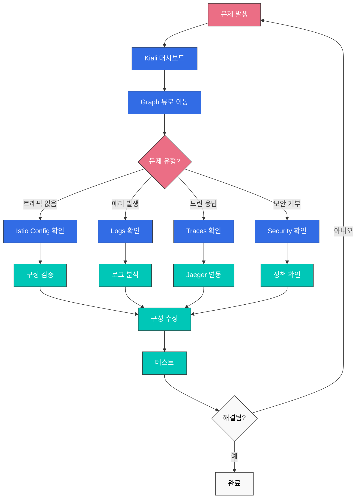

# Istio 관찰성 퀴즈

> **지원 버전**: Istio 1.28.0
> **EKS 버전**: 1.34 (Kubernetes 1.28+)
> **마지막 업데이트**: 2025년 1월

이 퀴즈는 Istio의 관찰성 기능에 대한 이해도를 테스트합니다.

## 객관식 문제 (1-5번)

### 문제 1: Prometheus 메트릭

Istio에서 Prometheus가 기본적으로 수집하는 메트릭이 **아닌** 것은?

A. istio_requests_total (총 요청 수)  
B. istio_request_duration_milliseconds (요청 지연시간)  
C. istio_request_bytes (요청 크기)  
D. istio_pod_cpu_usage (Pod CPU 사용률)  

<details>
<summary>정답 및 해설</summary>

**정답: D**

Istio Envoy는 **트래픽 관련 메트릭**만 수집하며, Pod CPU 사용률은 **Kubernetes 메트릭 서버**나 **cAdvisor**가 수집합니다.

**해설:**

**Istio가 수집하는 메트릭:**

1. **istio_requests_total (A - O)**
```promql
# 서비스별 총 요청 수
sum(rate(istio_requests_total[5m])) by (destination_service_name)
```

2. **istio_request_duration_milliseconds (B - O)**
```promql
# P95 지연시간
histogram_quantile(0.95,
  sum(rate(istio_request_duration_milliseconds_bucket[5m])) by (le)
)
```

3. **istio_request_bytes (C - O)**
```promql
# 요청 크기
sum(rate(istio_request_bytes_sum[5m])) by (destination_service_name)
```

4. **istio_pod_cpu_usage (D - X)**
- 이것은 Istio 메트릭이 아닙니다
- Kubernetes 메트릭: `container_cpu_usage_seconds_total`
- Prometheus에서 수집하려면 kube-state-metrics 필요

**Istio 메트릭 카테고리:**

| 카테고리 | 메트릭 예시 | 설명 |
|---------|------------|------|
| **Request** | istio_requests_total | 요청 수, 응답 코드 |
| **Duration** | istio_request_duration_milliseconds | 지연시간 분포 |
| **Size** | istio_request_bytes, istio_response_bytes | 트래픽 크기 |
| **TCP** | istio_tcp_connections_opened_total | TCP 연결 |

**Golden Signals 예제:**

```promql
# 1. Latency (지연시간)
histogram_quantile(0.95,
  sum(rate(
    istio_request_duration_milliseconds_bucket{
      destination_service_name="reviews"
    }[5m]
  )) by (le)
)

# 2. Traffic (트래픽)
sum(rate(
  istio_requests_total{
    destination_service_name="reviews"
  }[5m]
))

# 3. Errors (에러율)
sum(rate(
  istio_requests_total{
    destination_service_name="reviews",
    response_code=~"5.."
  }[5m]
))
/
sum(rate(
  istio_requests_total{
    destination_service_name="reviews"
  }[5m]
))

# 4. Saturation (포화도) - Kubernetes 메트릭 사용
sum(rate(
  container_cpu_usage_seconds_total{
    pod=~"reviews-.*"
  }[5m]
))
```

**메트릭 확인:**

```bash
# Envoy Admin API로 메트릭 확인
kubectl exec <pod-name> -c istio-proxy -- \
  curl localhost:15000/stats/prometheus

# Prometheus에서 확인
kubectl port-forward -n istio-system svc/prometheus 9090:9090
# http://localhost:9090에서 쿼리
```

**참고 자료:**
- [메트릭](../../../service-mesh/istio/observability/01-metrics.md)
</details>

---

### 문제 2: 분산 추적 (Distributed Tracing)

Istio에서 분산 추적을 위해 필요한 **최소 구성**은?

A. 애플리케이션이 trace ID를 생성해야 한다  
B. 애플리케이션이 HTTP 헤더를 전파(propagate)해야 한다  
C. 모든 서비스에 Jaeger 클라이언트를 설치해야 한다  
D. Envoy가 자동으로 모든 것을 처리한다  

<details>
<summary>정답 및 해설</summary>

**정답: B**

Istio Envoy는 trace ID를 자동으로 생성하지만, **애플리케이션이 HTTP 헤더를 다음 서비스로 전파**해야 합니다.

**해설:**

**분산 추적 동작 원리:**



**전파해야 하는 HTTP 헤더:**

```yaml
# Zipkin (B3) 헤더
x-b3-traceid: 추적 ID
x-b3-spanid: 현재 Span ID
x-b3-parentspanid: 부모 Span ID
x-b3-sampled: 샘플링 여부
x-b3-flags: 플래그

# 또는 단일 헤더
b3: {traceid}-{spanid}-{sampled}-{parentspanid}

# Istio 내부 헤더
x-request-id: 고유 요청 ID

# Jaeger 네이티브 헤더 (선택적)
uber-trace-id
```

**애플리케이션 코드 예시:**

```python
# Python Flask 예시
from flask import Flask, request
import requests

app = Flask(__name__)

@app.route('/api/users')
def get_users():
    # 1. 수신된 헤더 추출
    headers = {}
    for header in ['x-request-id', 'x-b3-traceid', 'x-b3-spanid',
                   'x-b3-parentspanid', 'x-b3-sampled', 'x-b3-flags']:
        if header in request.headers:
            headers[header] = request.headers[header]

    # 2. 다음 서비스 호출 시 헤더 전파
    response = requests.get(
        'http://user-service/users',
        headers=headers  # ✅ 헤더 전파 필수
    )

    return response.json()
```

```javascript
// Node.js Express 예시
const express = require('express');
const axios = require('axios');
const app = express();

app.get('/api/users', async (req, res) => {
  // 1. 수신된 헤더 추출
  const tracingHeaders = {};
  ['x-request-id', 'x-b3-traceid', 'x-b3-spanid',
   'x-b3-parentspanid', 'x-b3-sampled', 'x-b3-flags'].forEach(header => {
    if (req.headers[header]) {
      tracingHeaders[header] = req.headers[header];
    }
  });

  // 2. 다음 서비스 호출 시 헤더 전파
  const response = await axios.get('http://user-service/users', {
    headers: tracingHeaders  // ✅ 헤더 전파 필수
  });

  res.json(response.data);
});
```

**각 옵션 분석:**

- **A (X)**: Envoy가 자동으로 trace ID 생성
- **B (O)**: 애플리케이션이 HTTP 헤더를 전파해야 함 (필수)
- **C (X)**: Jaeger 클라이언트 불필요, Envoy가 Span 전송
- **D (X)**: Envoy는 Span 생성/전송하지만, 헤더 전파는 애플리케이션 책임

**샘플링 설정:**

```yaml
apiVersion: install.istio.io/v1alpha1
kind: IstioOperator
spec:
  meshConfig:
    defaultConfig:
      tracing:
        sampling: 1.0  # 100% 샘플링 (개발환경)
        # sampling: 10.0  # 10% 샘플링 (프로덕션)
```

**Jaeger 접속:**

```bash
istioctl dashboard jaeger
```

**참고 자료:**
- [분산 추적](../../../service-mesh/istio/observability/02-distributed-tracing.md)
</details>

---

### 문제 3: Kiali 시각화

Kiali가 제공하는 기능이 **아닌** 것은?

A. 서비스 토폴로지 시각화  
B. 트래픽 흐름 분석  
C. 자동 Canary 배포 실행  
D. Istio 구성 검증  

<details>
<summary>정답 및 해설</summary>

**정답: C**

Kiali는 **관찰 및 분석 도구**이며, 배포 실행은 **Argo Rollouts** 같은 도구가 담당합니다.

**해설:**

**Kiali의 주요 기능:**

**1. 서비스 토폴로지 시각화 (A - O)**

```bash
# Kiali 대시보드 열기
istioctl dashboard kiali

# 기능:
# - 실시간 서비스 간 연결 표시
# - 트래픽 흐름 방향 표시
# - 서비스 상태 (정상/오류)
# - 응답 시간 표시
```

**Graph 뷰 예시:**
```
Frontend → Backend → Database
   ↓
External API

색상 코드:
- 녹색: 정상
- 빨강: 에러
- 회색: 트래픽 없음
```

**2. 트래픽 흐름 분석 (B - O)**

Kiali는 다음을 표시합니다:
- 요청 수 (RPS)
- 에러율 (%)
- P50/P95/P99 지연시간
- TCP 연결 수

**3. 자동 Canary 배포 실행 (C - X)**

- ❌ Kiali는 배포를 실행하지 않습니다
- ✅ Kiali는 트래픽 분할 상태를 **시각화**만 합니다
- ✅ 배포 실행: Argo Rollouts, Flagger

**4. Istio 구성 검증 (D - O)**

```yaml
# Kiali가 검증하는 항목:

1. VirtualService 오류:
   - 존재하지 않는 host 참조
   - 잘못된 subset 참조
   - weight 합이 100이 아님

2. DestinationRule 오류:
   - subset 레이블이 Pod와 불일치
   - 중복된 subset 이름

3. Gateway 오류:
   - TLS 인증서 누락
   - 잘못된 selector

4. AuthorizationPolicy 오류:
   - 충돌하는 정책
   - 잘못된 principal 형식
```

**Kiali 설치:**

```bash
# Istio 샘플에 포함된 Kiali 설치
kubectl apply -f samples/addons/kiali.yaml

# 또는 Helm으로 설치
helm repo add kiali https://kiali.org/helm-charts
helm install kiali-server kiali/kiali-server \
  --namespace istio-system
```

**Kiali 주요 메뉴:**

```
1. Overview: Namespace별 서비스 요약
2. Graph: 서비스 토폴로지
3. Applications: 애플리케이션 목록
4. Workloads: Deployment, StatefulSet 등
5. Services: Kubernetes Service
6. Istio Config: VirtualService, DestinationRule 등
```

**Kiali vs 다른 도구:**

| 도구 | 역할 | 배포 실행 |
|------|------|----------|
| **Kiali** | 시각화, 분석, 검증 | ❌ |
| **Argo Rollouts** | Progressive Delivery | ✅ |
| **Flagger** | 자동 Canary 배포 | ✅ |
| **Grafana** | 메트릭 대시보드 | ❌ |
| **Jaeger** | 분산 추적 | ❌ |

**실전 사용 예시:**

```bash
# 1. Kiali에서 서비스 토폴로지 확인
istioctl dashboard kiali

# 2. Graph 뷰에서 이상 감지
#    - reviews 서비스 에러율 5%
#    - productpage → reviews 지연시간 증가

# 3. Workload 뷰에서 상세 확인
#    - reviews-v2 Pod의 로그 확인
#    - Envoy 메트릭 확인

# 4. Istio Config 뷰에서 구성 검증
#    - VirtualService에 오타 발견
#    - 수정 후 재배포
```

**참고 자료:**
- [시각화](../../../service-mesh/istio/observability/04-visualization.md)
- [Kiali 공식 문서](https://kiali.io/docs/)
</details>

---

### 문제 4: Access Log 구성

Istio에서 Access Log를 **JSON 형식**으로 출력하도록 설정하는 방법은?

A. IstioOperator의 meshConfig.accessLogEncoding을 JSON으로 설정  
B. Envoy ConfigMap을 직접 수정  
C. 각 Pod에 annotation 추가  
D. Prometheus 쿼리로 JSON 변환  

<details>
<summary>정답 및 해설</summary>

**정답: A**

IstioOperator의 **meshConfig.accessLogEncoding** 필드를 `JSON`으로 설정하면 됩니다.

**해설:**

**JSON 형식 Access Log 설정:**

```yaml
apiVersion: install.istio.io/v1alpha1
kind: IstioOperator
spec:
  meshConfig:
    # Access Log 활성화
    accessLogFile: /dev/stdout

    # JSON 형식으로 출력
    accessLogEncoding: JSON

    # 커스텀 JSON 형식 정의
    accessLogFormat: |
      {
        "start_time": "%START_TIME%",
        "method": "%REQ(:METHOD)%",
        "path": "%REQ(X-ENVOY-ORIGINAL-PATH?:PATH)%",
        "protocol": "%PROTOCOL%",
        "response_code": "%RESPONSE_CODE%",
        "response_flags": "%RESPONSE_FLAGS%",
        "bytes_received": "%BYTES_RECEIVED%",
        "bytes_sent": "%BYTES_SENT%",
        "duration": "%DURATION%",
        "upstream_service_time": "%RESP(X-ENVOY-UPSTREAM-SERVICE-TIME)%",
        "x_forwarded_for": "%REQ(X-FORWARDED-FOR)%",
        "user_agent": "%REQ(USER-AGENT)%",
        "request_id": "%REQ(X-REQUEST-ID)%",
        "authority": "%REQ(:AUTHORITY)%",
        "upstream_host": "%UPSTREAM_HOST%",
        "upstream_cluster": "%UPSTREAM_CLUSTER%",
        "upstream_local_address": "%UPSTREAM_LOCAL_ADDRESS%",
        "downstream_local_address": "%DOWNSTREAM_LOCAL_ADDRESS%",
        "downstream_remote_address": "%DOWNSTREAM_REMOTE_ADDRESS%",
        "requested_server_name": "%REQUESTED_SERVER_NAME%",
        "route_name": "%ROUTE_NAME%"
      }
```

**출력 예시:**

```json
{
  "start_time": "2025-01-20T10:30:00.123Z",
  "method": "GET",
  "path": "/api/users",
  "protocol": "HTTP/1.1",
  "response_code": 200,
  "response_flags": "-",
  "bytes_received": 0,
  "bytes_sent": 1234,
  "duration": 42,
  "upstream_service_time": "40",
  "x_forwarded_for": "192.168.1.100",
  "user_agent": "Mozilla/5.0",
  "request_id": "abc-123-def",
  "authority": "example.com",
  "upstream_host": "10.0.1.20:8080",
  "upstream_cluster": "outbound|8080||backend.default.svc.cluster.local",
  "upstream_local_address": "10.0.1.10:54321",
  "downstream_local_address": "10.0.1.10:8080",
  "downstream_remote_address": "10.0.1.5:12345",
  "requested_server_name": "-",
  "route_name": "default"
}
```

**Namespace별 설정:**

```yaml
apiVersion: telemetry.istio.io/v1alpha1
kind: Telemetry
metadata:
  name: access-logging
  namespace: production
spec:
  accessLogging:
  - providers:
    - name: envoy
    # JSON 형식으로 특정 Namespace만 설정 가능
```

**Envoy 포맷 변수:**

```yaml
# 주요 변수:
%START_TIME%: 요청 시작 시간
%REQ(HEADER)%: 요청 헤더
%RESP(HEADER)%: 응답 헤더
%RESPONSE_CODE%: HTTP 응답 코드
%DURATION%: 총 소요 시간 (ms)
%BYTES_RECEIVED%: 수신 바이트
%BYTES_SENT%: 전송 바이트
%UPSTREAM_HOST%: 업스트림 서버 주소
%DOWNSTREAM_REMOTE_ADDRESS%: 클라이언트 주소
```

**CloudWatch Logs 통합:**

```yaml
apiVersion: v1
kind: ConfigMap
metadata:
  name: fluent-bit-config
  namespace: istio-system
data:
  output.conf: |
    [OUTPUT]
        Name cloudwatch_logs
        Match *
        region us-east-1
        log_group_name /aws/eks/istio/access-logs
        log_stream_prefix istio-
        auto_create_group true
```

**로그 확인:**

```bash
# Pod의 Access Log 확인
kubectl logs <pod-name> -c istio-proxy

# 실시간 모니터링
kubectl logs -f <pod-name> -c istio-proxy | jq .

# 특정 응답 코드 필터링
kubectl logs <pod-name> -c istio-proxy | \
  jq 'select(.response_code == "500")'
```

**TEXT 형식 vs JSON 형식:**

| 항목 | TEXT | JSON |
|------|------|------|
| **가독성** | 높음 (사람) | 낮음 (사람) |
| **파싱** | 어려움 | 쉬움 (기계) |
| **크기** | 작음 | 큼 |
| **구조화** | 비구조화 | 구조화 |
| **쿼리** | 어려움 | 쉬움 (jq 등) |

**TEXT 형식 예시:**

```
[2025-01-20T10:30:00.123Z] "GET /api/users HTTP/1.1" 200 - "-" "-" 0 1234 42 40 "192.168.1.100" "Mozilla/5.0" "abc-123-def" "example.com" "10.0.1.20:8080" outbound|8080||backend.default.svc.cluster.local 10.0.1.10:54321 10.0.1.10:8080 10.0.1.5:12345 - default
```

**참고 자료:**
- [로깅](../../../service-mesh/istio/observability/03-logging.md)
- [Envoy Access Log Format](https://www.envoyproxy.io/docs/envoy/latest/configuration/observability/access_log/usage)
</details>

---

### 문제 5: Grafana 대시보드

Istio 설치 시 기본 제공되는 Grafana 대시보드가 **아닌** 것은?

A. Istio Service Dashboard  
B. Istio Workload Dashboard  
C. Istio Performance Dashboard  
D. Istio Cost Dashboard  

<details>
<summary>정답 및 해설</summary>

**정답: D**

Istio는 **Cost Dashboard**를 기본 제공하지 않습니다.

**해설:**

**Istio 기본 Grafana 대시보드:**

**1. Istio Service Dashboard (A - O)**
```
서비스 수준 메트릭:
- Request Volume (요청 수)
- Request Duration (P50, P95, P99)
- Request Size / Response Size
- Success Rate (성공률)
- 4xx, 5xx 에러 추이
```

**2. Istio Workload Dashboard (B - O)**
```
워크로드(Pod) 수준 메트릭:
- Incoming Request Volume
- Incoming Success Rate
- Incoming Request Duration
- Incoming Request Size
- Outgoing Request Volume
- Outgoing Success Rate
```

**3. Istio Performance Dashboard (C - O)**
```
Istio 자체 성능 메트릭:
- Pilot 성능 (xDS 푸시 시간)
- Envoy 메모리 사용량
- Envoy CPU 사용량
- Sidecar 주입 성공률
- 구성 동기화 지연시간
```

**4. Istio Control Plane Dashboard**
```
Control Plane 메트릭:
- Istiod 리소스 사용량
- xDS 연결 수
- Webhook 성능
- 인증서 발급 통계
```

**5. Istio Mesh Dashboard**
```
전체 메시 메트릭:
- 총 요청 수
- 전체 성공률
- Global P99 지연시간
- 서비스 수, Pod 수
```

**Cost Dashboard는 없음 (D - X)**

비용 관련 메트릭을 보려면 직접 커스텀 대시보드를 만들어야 합니다:

```promql
# 크로스 AZ 트래픽 비용 추정
sum(rate(istio_requests_total{
  source_cluster="us-east-1a",
  destination_cluster!="us-east-1a"
}[5m])) * 86400 * 30 * 0.01 / 1000000

# Sidecar 리소스 비용 (메모리 기준)
sum(container_memory_usage_bytes{
  container="istio-proxy"
}) / 1024 / 1024 / 1024 * 30 * 0.01
```

**Grafana 설치 및 접속:**

```bash
# Grafana 설치
kubectl apply -f samples/addons/grafana.yaml

# Grafana 접속
istioctl dashboard grafana

# 또는 포트 포워딩
kubectl port-forward -n istio-system svc/grafana 3000:3000
# http://localhost:3000
```

**커스텀 대시보드 생성:**

```json
{
  "dashboard": {
    "title": "Istio Custom Metrics",
    "panels": [
      {
        "title": "Request Rate",
        "targets": [
          {
            "expr": "sum(rate(istio_requests_total[5m])) by (destination_service_name)"
          }
        ]
      },
      {
        "title": "Error Rate",
        "targets": [
          {
            "expr": "sum(rate(istio_requests_total{response_code=~\"5..\"}[5m])) / sum(rate(istio_requests_total[5m]))"
          }
        ]
      }
    ]
  }
}
```

**대시보드 변수 활용:**

```yaml
# Namespace 변수 추가
variables:
  - name: namespace
    type: query
    query: label_values(istio_requests_total, destination_workload_namespace)

# 패널에서 변수 사용
expr: |
  sum(rate(
    istio_requests_total{
      destination_workload_namespace="$namespace"
    }[5m]
  )) by (destination_service_name)
```

**참고 자료:**
- [시각화](../../../service-mesh/istio/observability/04-visualization.md)
- [Grafana 공식 문서](https://grafana.com/docs/)
</details>

---

## 주관식 문제 (6-10번)

### 문제 6: Golden Signals 모니터링

Google SRE의 **Golden Signals**(Latency, Traffic, Errors, Saturation)를 Istio와 Prometheus를 사용하여 모니터링하는 방법을 설명하세요. 각 신호에 대한 **Prometheus 쿼리**와 **알림 규칙**을 포함해야 합니다.

<details>
<summary>예시 답안</summary>

**답변:**

**Golden Signals 모니터링 구현:**

---

**1. Latency (지연시간)**

**Prometheus 쿼리:**
```promql
# P95 지연시간
histogram_quantile(0.95,
  sum(rate(
    istio_request_duration_milliseconds_bucket{
      destination_service_name="reviews"
    }[5m]
  )) by (le)
)

# P99 지연시간
histogram_quantile(0.99,
  sum(rate(
    istio_request_duration_milliseconds_bucket{
      destination_service_name="reviews"
    }[5m]
  )) by (le)
)

# P50 지연시간 (중앙값)
histogram_quantile(0.50,
  sum(rate(
    istio_request_duration_milliseconds_bucket{
      destination_service_name="reviews"
    }[5m]
  )) by (le)
)
```

**알림 규칙:**
```yaml
apiVersion: monitoring.coreos.com/v1
kind: PrometheusRule
metadata:
  name: istio-latency-alerts
  namespace: monitoring
spec:
  groups:
  - name: latency
    interval: 30s
    rules:
    # P95 지연시간이 500ms 초과
    - alert: HighLatency
      expr: |
        histogram_quantile(0.95,
          sum(rate(
            istio_request_duration_milliseconds_bucket[5m]
          )) by (le, destination_service_name)
        ) > 500
      for: 5m
      labels:
        severity: warning
      annotations:
        summary: "High latency detected on {{ $labels.destination_service_name }}"
        description: "P95 latency is {{ $value }}ms"

    # P99 지연시간이 1초 초과
    - alert: CriticalLatency
      expr: |
        histogram_quantile(0.99,
          sum(rate(
            istio_request_duration_milliseconds_bucket[5m]
          )) by (le, destination_service_name)
        ) > 1000
      for: 5m
      labels:
        severity: critical
      annotations:
        summary: "Critical latency on {{ $labels.destination_service_name }}"
```

---

**2. Traffic (트래픽)**

**Prometheus 쿼리:**
```promql
# 초당 요청 수 (RPS)
sum(rate(
  istio_requests_total{
    destination_service_name="reviews"
  }[5m]
))

# 서비스별 RPS
sum(rate(
  istio_requests_total[5m]
)) by (destination_service_name)

# HTTP 메서드별 RPS
sum(rate(
  istio_requests_total[5m]
)) by (request_method)
```

**알림 규칙:**
```yaml
apiVersion: monitoring.coreos.com/v1
kind: PrometheusRule
metadata:
  name: istio-traffic-alerts
spec:
  groups:
  - name: traffic
    rules:
    # 트래픽 급증 (평소 대비 2배)
    - alert: TrafficSpike
      expr: |
        sum(rate(istio_requests_total[5m])) by (destination_service_name)
        >
        sum(rate(istio_requests_total[1h] offset 1h)) by (destination_service_name) * 2
      for: 5m
      labels:
        severity: warning
      annotations:
        summary: "Traffic spike on {{ $labels.destination_service_name }}"

    # 트래픽 급감 (평소 대비 50% 이하)
    - alert: TrafficDrop
      expr: |
        sum(rate(istio_requests_total[5m])) by (destination_service_name)
        <
        sum(rate(istio_requests_total[1h] offset 1h)) by (destination_service_name) * 0.5
      for: 10m
      labels:
        severity: warning
```

---

**3. Errors (에러)**

**Prometheus 쿼리:**
```promql
# 에러율 (5xx)
sum(rate(
  istio_requests_total{
    destination_service_name="reviews",
    response_code=~"5.."
  }[5m]
))
/
sum(rate(
  istio_requests_total{
    destination_service_name="reviews"
  }[5m]
))

# 4xx + 5xx 에러율
sum(rate(
  istio_requests_total{
    destination_service_name="reviews",
    response_code=~"[45].."
  }[5m]
))
/
sum(rate(
  istio_requests_total{
    destination_service_name="reviews"
  }[5m]
))

# 응답 코드별 분포
sum(rate(
  istio_requests_total[5m]
)) by (response_code, destination_service_name)
```

**알림 규칙:**
```yaml
apiVersion: monitoring.coreos.com/v1
kind: PrometheusRule
metadata:
  name: istio-error-alerts
spec:
  groups:
  - name: errors
    rules:
    # 에러율 > 1%
    - alert: HighErrorRate
      expr: |
        (
          sum(rate(istio_requests_total{response_code=~"5.."}[5m])) by (destination_service_name)
          /
          sum(rate(istio_requests_total[5m])) by (destination_service_name)
        ) > 0.01
      for: 5m
      labels:
        severity: warning
      annotations:
        summary: "High error rate on {{ $labels.destination_service_name }}"
        description: "Error rate is {{ $value | humanizePercentage }}"

    # 에러율 > 5%
    - alert: CriticalErrorRate
      expr: |
        (
          sum(rate(istio_requests_total{response_code=~"5.."}[5m])) by (destination_service_name)
          /
          sum(rate(istio_requests_total[5m])) by (destination_service_name)
        ) > 0.05
      for: 2m
      labels:
        severity: critical
```

---

**4. Saturation (포화도)**

**Prometheus 쿼리:**
```promql
# Envoy CPU 사용률
sum(rate(
  container_cpu_usage_seconds_total{
    pod=~".*",
    container="istio-proxy"
  }[5m]
)) by (pod)

# Envoy 메모리 사용률
sum(
  container_memory_usage_bytes{
    pod=~".*",
    container="istio-proxy"
  }
) by (pod)

# Envoy 연결 수
sum(
  envoy_cluster_upstream_cx_active
) by (cluster_name)

# Envoy 대기 중인 요청
sum(
  envoy_cluster_upstream_rq_pending_active
) by (cluster_name)
```

**알림 규칙:**
```yaml
apiVersion: monitoring.coreos.com/v1
kind: PrometheusRule
metadata:
  name: istio-saturation-alerts
spec:
  groups:
  - name: saturation
    rules:
    # Envoy CPU > 80%
    - alert: HighEnvoyCPU
      expr: |
        sum(rate(
          container_cpu_usage_seconds_total{
            container="istio-proxy"
          }[5m]
        )) by (pod, namespace)
        /
        sum(
          container_spec_cpu_quota{
            container="istio-proxy"
          } / 100000
        ) by (pod, namespace)
        > 0.8
      for: 5m
      labels:
        severity: warning

    # Envoy 메모리 > 80%
    - alert: HighEnvoyMemory
      expr: |
        sum(
          container_memory_usage_bytes{
            container="istio-proxy"
          }
        ) by (pod, namespace)
        /
        sum(
          container_spec_memory_limit_bytes{
            container="istio-proxy"
          }
        ) by (pod, namespace)
        > 0.8
      for: 5m
      labels:
        severity: warning

    # Connection Pool 포화
    - alert: ConnectionPoolSaturated
      expr: |
        envoy_cluster_upstream_cx_active
        /
        envoy_cluster_circuit_breakers_default_cx_open
        > 0.9
      for: 5m
      labels:
        severity: critical
```

---

**Grafana 대시보드 구성:**

```json
{
  "dashboard": {
    "title": "Golden Signals",
    "panels": [
      {
        "title": "Latency (P95, P99)",
        "targets": [
          {"expr": "histogram_quantile(0.95, sum(rate(istio_request_duration_milliseconds_bucket[5m])) by (le))"},
          {"expr": "histogram_quantile(0.99, sum(rate(istio_request_duration_milliseconds_bucket[5m])) by (le))"}
        ]
      },
      {
        "title": "Traffic (RPS)",
        "targets": [
          {"expr": "sum(rate(istio_requests_total[5m])) by (destination_service_name)"}
        ]
      },
      {
        "title": "Errors (Rate)",
        "targets": [
          {"expr": "sum(rate(istio_requests_total{response_code=~\"5..\"}[5m])) / sum(rate(istio_requests_total[5m]))"}
        ]
      },
      {
        "title": "Saturation (CPU, Memory)",
        "targets": [
          {"expr": "sum(rate(container_cpu_usage_seconds_total{container=\"istio-proxy\"}[5m])) by (pod)"},
          {"expr": "sum(container_memory_usage_bytes{container=\"istio-proxy\"}) by (pod)"}
        ]
      }
    ]
  }
}
```

**참고 자료:**
- [메트릭](../../../service-mesh/istio/observability/01-metrics.md)
- [Google SRE Book - Monitoring](https://sre.google/sre-book/monitoring-distributed-systems/)
</details>

---

### 문제 7: Jaeger를 사용한 성능 병목 지점 찾기

분산 추적 도구인 Jaeger를 사용하여 마이크로서비스 아키텍처에서 **성능 병목 지점**을 찾는 방법을 설명하세요. **Trace 분석 방법**과 **실전 디버깅 시나리오**를 포함해야 합니다.

<details>
<summary>예시 답안</summary>

**답변:**

**Jaeger를 사용한 성능 병목 지점 분석:**

---

**1. Jaeger 설치 및 구성**

```bash
# Jaeger 설치
kubectl apply -f samples/addons/jaeger.yaml

# Tracing 활성화 (100% 샘플링)
istioctl install --set values.pilot.traceSampling=100.0
```

```yaml
# 또는 IstioOperator로 설정
apiVersion: install.istio.io/v1alpha1
kind: IstioOperator
spec:
  meshConfig:
    defaultConfig:
      tracing:
        sampling: 100.0  # 개발환경: 100%, 프로덕션: 1-10%
        zipkin:
          address: jaeger-collector.istio-system:9411
```

---

**2. Trace 구조 이해**

```
Trace (추적)
└─ Span 1: Ingress Gateway (총 150ms)
   └─ Span 2: Frontend (총 140ms)
      ├─ Span 3: Backend API (총 100ms)
      │  ├─ Span 4: Database Query (80ms)  ← 병목!
      │  └─ Span 5: Cache Check (10ms)
      └─ Span 6: External API (30ms)
```

**Span 정보:**
- **Duration**: Span 소요 시간
- **Tags**: 메타데이터 (HTTP 메서드, URL, 응답 코드)
- **Logs**: 이벤트 (에러, 경고)
- **Parent-Child 관계**: 호출 계층

---

**3. 실전 디버깅 시나리오**

**시나리오 1: 높은 P99 지연시간**

**증상:**
```promql
# P99 지연시간이 2초
histogram_quantile(0.99,
  sum(rate(
    istio_request_duration_milliseconds_bucket[5m]
  )) by (le)
) = 2000
```

**Jaeger 분석 단계:**

```bash
# 1. Jaeger UI 접속
istioctl dashboard jaeger

# 2. 검색 조건 설정
Service: productpage
Lookback: Last 1 hour
Min Duration: 2000ms  # 2초 이상만 필터링
Limit Results: 20

# 3. 결과 분석
```

**발견된 문제:**
```
Trace ID: abc-123-def
Total Duration: 2.1초

├─ productpage (2.1초)
   └─ reviews (2.0초)  ← 병목!
      └─ ratings (1.9초)  ← 실제 병목!
         └─ MongoDB Query (1.8초)  ← 원인!
```

**해결 방법:**
```yaml
# 1. MongoDB 쿼리 최적화
# - 인덱스 추가
# - 쿼리 튜닝

# 2. 캐싱 추가
apiVersion: v1
kind: ConfigMap
metadata:
  name: ratings-config
data:
  redis.conf: |
    host: redis.default.svc.cluster.local
    port: 6379
    ttl: 300

# 3. Timeout 설정
apiVersion: networking.istio.io/v1beta1
kind: VirtualService
metadata:
  name: ratings
spec:
  hosts:
  - ratings
  http:
  - timeout: 500ms  # 타임아웃 설정
    retries:
      attempts: 3
      perTryTimeout: 200ms
```

---

**시나리오 2: 간헐적 타임아웃**

**Jaeger 분석:**

```
# 정상 Trace
Trace ID: normal-001
Duration: 120ms
├─ frontend (120ms)
   └─ backend (100ms)
      └─ database (80ms)

# 타임아웃 Trace
Trace ID: timeout-001
Duration: 10,000ms  ← 이상!
├─ frontend (10,000ms)
   └─ backend (9,980ms)
      └─ database (9,950ms)  ← 병목!
         └─ Error: Connection timeout
```

**Span Details 확인:**
```json
{
  "traceID": "timeout-001",
  "spanID": "span-db",
  "operationName": "database.query",
  "duration": 9950000,
  "tags": {
    "db.statement": "SELECT * FROM users WHERE status = 'active'",
    "db.type": "postgresql",
    "error": true
  },
  "logs": [
    {
      "timestamp": 1234567890,
      "fields": [
        {"key": "event", "value": "error"},
        {"key": "error.kind", "value": "ConnectionTimeout"},
        {"key": "message", "value": "Connection pool exhausted"}
      ]
    }
  ]
}
```

**해결 방법:**
```yaml
# Connection Pool 증가
apiVersion: networking.istio.io/v1beta1
kind: DestinationRule
metadata:
  name: database
spec:
  host: database
  trafficPolicy:
    connectionPool:
      tcp:
        maxConnections: 100  # 50 → 100
      http:
        http1MaxPendingRequests: 50
        maxRequestsPerConnection: 2
```

---

**시나리오 3: 캐스케이딩 지연**

**Jaeger 분석:**

```
Trace ID: cascade-001
Total Duration: 5.2초

├─ frontend (5.2초)
   ├─ backend-a (2.0초)
   │  └─ database (1.9초)
   ├─ backend-b (2.0초)  ← 순차 호출 문제!
   │  └─ external-api (1.9초)
   └─ backend-c (1.0초)
      └─ cache (0.9초)

문제: 병렬 처리 가능한 호출을 순차적으로 실행
```

**해결 방법 (애플리케이션 수정):**

```python
# ❌ 순차 호출 (Before)
def get_user_data(user_id):
    profile = call_backend_a(user_id)      # 2초
    orders = call_backend_b(user_id)       # 2초
    recommendations = call_backend_c(user_id)  # 1초
    return merge(profile, orders, recommendations)

# 총 시간: 5초

# ✅ 병렬 호출 (After)
import asyncio

async def get_user_data(user_id):
    profile, orders, recommendations = await asyncio.gather(
        call_backend_a(user_id),      # 2초
        call_backend_b(user_id),       # 2초
        call_backend_c(user_id)        # 1초
    )
    return merge(profile, orders, recommendations)

# 총 시간: 2초 (가장 긴 호출)
```

---

**4. Jaeger UI 활용 팁**

**Service Dependencies (서비스 의존성 그래프):**
```bash
# Jaeger UI → Dependencies 탭
# - 서비스 간 호출 관계 시각화
# - 에러율 표시
# - 요청 수 표시
```

**Compare Traces (트레이스 비교):**
```bash
# 1. 정상 Trace 선택
# 2. 느린 Trace 선택
# 3. Compare 버튼 클릭
# 4. Span별 시간 차이 확인
```

**Deep Dependency Graph:**
```bash
# 특정 Trace의 상세 의존성 확인
# - 각 Span의 소요 시간
# - 병렬/순차 실행 여부
# - Critical Path (주요 경로)
```

---

**5. 성능 최적화 체크리스트**

```yaml
# 1. 불필요한 호출 제거
# - N+1 쿼리 문제
# - 중복 API 호출

# 2. 병렬 처리
# - 독립적인 호출은 병렬 실행
# - asyncio, Promise.all 등 사용

# 3. 캐싱
# - Redis, Memcached
# - CDN (정적 리소스)

# 4. Connection Pool 튜닝
# - 적절한 최대 연결 수
# - Keep-Alive 활성화

# 5. 타임아웃 설정
# - 적절한 타임아웃 (너무 길지 않게)
# - 빠른 실패 (Fail Fast)

# 6. 데이터베이스 최적화
# - 인덱스 추가
# - 쿼리 최적화
# - 읽기 전용 복제본 사용
```

---

**6. Prometheus + Jaeger 연동**

```promql
# 높은 지연시간을 가진 Trace 찾기
histogram_quantile(0.99,
  sum(rate(
    istio_request_duration_milliseconds_bucket[5m]
  )) by (le, destination_service_name)
) > 1000

# Prometheus에서 확인 후 Jaeger에서 해당 시간대 Trace 검색
```

**참고 자료:**
- [분산 추적](../../../service-mesh/istio/observability/02-distributed-tracing.md)
- [Jaeger 공식 문서](https://www.jaegertracing.io/docs/)
</details>

---

### 문제 8: Kiali를 사용한 서비스 메시 문제 해결

Kiali를 사용하여 Istio 서비스 메시에서 발생하는 **일반적인 문제**(구성 오류, 트래픽 이상, 보안 정책 충돌)를 진단하고 해결하는 방법을 설명하세요.

<details>
<summary>예시 답안</summary>

**답변:**

**Kiali를 사용한 서비스 메시 문제 해결:**

---

**1. 구성 오류 진단**

**문제 1: VirtualService 호스트 오류**

**증상:**
```bash
# 서비스 호출 실패
curl http://reviews:9080
# 503 Service Unavailable
```

**Kiali 진단:**

```bash
# 1. Kiali 대시보드 접속
istioctl dashboard kiali

# 2. Istio Config → VirtualServices 탭
# 3. reviews VirtualService에 ⚠️ 경고 표시

# 4. 클릭하여 상세 정보 확인
```

**Kiali 오류 메시지:**
```
⚠️ VirtualService 'reviews-vs' has issues:
- Host 'reviews.default.svc.cluster.local' references service 'reviews'
  but service does not exist
- Subset 'v2' references DestinationRule 'reviews-dr'
  but subset is not defined
```

**해결 방법:**

```yaml
# ❌ 잘못된 구성
apiVersion: networking.istio.io/v1beta1
kind: VirtualService
metadata:
  name: reviews-vs
spec:
  hosts:
  - reviews.default.svc.cluster.local  # 서비스 없음!
  http:
  - route:
    - destination:
        host: reviews
        subset: v2  # DestinationRule에 정의되지 않음!

---
# ✅ 올바른 구성
apiVersion: networking.istio.io/v1beta1
kind: VirtualService
metadata:
  name: reviews-vs
spec:
  hosts:
  - reviews  # 서비스 이름만
  http:
  - route:
    - destination:
        host: reviews
        subset: v1  # 존재하는 subset

---
apiVersion: networking.istio.io/v1beta1
kind: DestinationRule
metadata:
  name: reviews-dr
spec:
  host: reviews
  subsets:
  - name: v1
    labels:
      version: v1
```

---

**문제 2: DestinationRule Subset 레이블 불일치**

**Kiali 진단:**

```
Graph 뷰에서 확인:
- reviews 서비스에 트래픽 전송되지 않음
- Kiali가 빨간색 점선으로 표시

Istio Config 탭:
⚠️ DestinationRule 'reviews-dr' has issues:
- Subset 'v1' selects labels {version: v1}
  but no pods match these labels
```

**문제 확인:**
```bash
# Pod 레이블 확인
kubectl get pods -l app=reviews --show-labels

# 출력:
NAME            LABELS
reviews-v1-xxx  app=reviews,version=1.0  ← version=1.0 (잘못됨)
```

**해결 방법:**
```yaml
# ❌ 잘못된 DestinationRule
apiVersion: networking.istio.io/v1beta1
kind: DestinationRule
spec:
  subsets:
  - name: v1
    labels:
      version: v1  # Pod는 version=1.0

# ✅ 수정된 DestinationRule
apiVersion: networking.istio.io/v1beta1
kind: DestinationRule
spec:
  subsets:
  - name: v1
    labels:
      version: "1.0"  # Pod 레이블과 일치
```

---

**2. 트래픽 이상 진단**

**문제 3: 트래픽 불균형**

**Kiali Graph 뷰에서 확인:**

```
frontend → backend-v1 (90% 트래픽)  ← 예상: 50%
frontend → backend-v2 (10% 트래픽)  ← 예상: 50%
```

**원인 분석:**

```bash
# Kiali → Workloads 탭 → backend
# Pod 상태 확인:

backend-v1: 5 pods (모두 Ready)
backend-v2: 5 pods (3개 Ready, 2개 Terminating)

# 문제: backend-v2의 Pod가 정상 시작되지 않음
```

**해결 방법:**

```bash
# 1. Kiali에서 backend-v2 로그 확인
Workloads → backend-v2 → Logs 탭

# 2. 로그 분석
Error: Cannot connect to database
Connection: postgresql://db:5432

# 3. 해결
kubectl edit deployment backend-v2
# 데이터베이스 연결 문자열 수정

# 4. Kiali에서 트래픽 균형 확인
# 몇 분 후: 50% / 50%로 정상화
```

---

**문제 4: 순환 의존성 (Circular Dependency)**

**Kiali Graph 뷰에서 확인:**

```
service-a → service-b
    ↑           ↓
    └───────────┘

순환 의존성 발견!
```

**Kiali 알림:**
```
⚠️ Circular dependency detected:
service-a → service-b → service-a
```

**해결 방법:**

```yaml
# 아키텍처 재설계 필요
# Before:
service-a ↔ service-b

# After:
service-a → service-c (공통 서비스)
service-b → service-c
```

---

**3. 보안 정책 충돌 진단**

**문제 5: AuthorizationPolicy 충돌**

**증상:**
```bash
# frontend → backend 호출 실패
curl http://backend:8080
# 403 RBAC: access denied
```

**Kiali 진단:**

```bash
# Kiali → Istio Config → Authorization Policies

정책 1:
apiVersion: security.istio.io/v1beta1
kind: AuthorizationPolicy
metadata:
  name: deny-all
spec: {}  # 모든 요청 거부

정책 2:
apiVersion: security.istio.io/v1beta1
kind: AuthorizationPolicy
metadata:
  name: allow-frontend
spec:
  action: ALLOW
  rules:
  - from:
    - source:
        principals: ["cluster.local/ns/default/sa/frontend"]

# Kiali 경고:
⚠️ Policy conflict detected:
- deny-all denies all traffic
- allow-frontend allows traffic from frontend
- Evaluation order: DENY policies are evaluated first
```

**해결 방법:**

```yaml
# ✅ 올바른 구성 (Namespace별 분리)
---
# deny-all은 특정 서비스에만 적용
apiVersion: security.istio.io/v1beta1
kind: AuthorizationPolicy
metadata:
  name: backend-deny-all
spec:
  selector:
    matchLabels:
      app: backend
  # 빈 rules = 모든 요청 거부

---
# 명시적 허용 정책
apiVersion: security.istio.io/v1beta1
kind: AuthorizationPolicy
metadata:
  name: backend-allow-frontend
spec:
  selector:
    matchLabels:
      app: backend
  action: ALLOW
  rules:
  - from:
    - source:
        principals: ["cluster.local/ns/default/sa/frontend"]
```

---

**문제 6: mTLS 모드 불일치**

**Kiali Security 뷰에서 확인:**

```
service-a: mTLS STRICT
service-b: mTLS PERMISSIVE
service-c: mTLS DISABLED

Kiali 경고:
⚠️ mTLS configuration mismatch detected
- service-a requires mTLS but service-c has mTLS disabled
- Connection may fail
```

**해결 방법:**

```yaml
# 전체 메시에 일관된 mTLS 정책 적용
apiVersion: security.istio.io/v1beta1
kind: PeerAuthentication
metadata:
  name: default
  namespace: istio-system
spec:
  mtls:
    mode: STRICT  # 모든 서비스에 STRICT 적용
```

---

**4. Kiali 고급 기능 활용**

**Custom Time Range:**
```bash
# Kiali → Graph 뷰
# Time Range: Last 1 hour
# Refresh Interval: Every 15s

# 특정 시간대 문제 분석
# - 장애 발생 시간 전후 확인
# - 배포 전후 비교
```

**Traffic Animation:**
```bash
# Kiali → Graph 뷰
# Display: Traffic Animation 활성화

# 실시간 트래픽 흐름 시각화
# - 요청 크기를 애니메이션 속도로 표시
# - 에러는 빨간색으로 표시
```

**Edge Labels:**
```bash
# Kiali → Graph 뷰
# Edge Labels:
# - Request percentage
# - Request per second
# - Response time (95th percentile)

# 트래픽 분할 비율 확인
frontend → backend-v1: 80% (8 rps)
frontend → backend-v2: 20% (2 rps)
```

**Service Details:**
```bash
# Kiali → Services → backend

탭:
1. Overview: 요약 정보
2. Traffic: 인바운드/아웃바운드 트래픽
3. Inbound Metrics: 메트릭 차트
4. Traces: Jaeger 트레이스 연동
5. Envoy: Envoy 구성 확인
```

---

**5. 문제 해결 워크플로우**



**참고 자료:**
- [시각화](../../../service-mesh/istio/observability/04-visualization.md)
- [Kiali 공식 문서](https://kiali.io/docs/)
</details>

---

### 문제 9: 프로덕션 환경 관찰성 스택 구축

프로덕션 Kubernetes 클러스터에서 Istio 관찰성 스택(Prometheus, Grafana, Jaeger, Kiali)을 **고가용성(HA)** 구성으로 배포하는 방법을 설명하세요. **영속성 스토리지**, **스케일링**, **백업** 전략을 포함해야 합니다.

<details>
<summary>예시 답안</summary>

**답변:**

**프로덕션 관찰성 스택 구축:**

---

**1. Prometheus 고가용성 구성**

**Helm으로 설치 (kube-prometheus-stack):**

```bash
# Helm 저장소 추가
helm repo add prometheus-community https://prometheus-community.github.io/helm-charts
helm repo update

# 커스텀 values.yaml 생성
cat <<EOF > prometheus-values.yaml
prometheus:
  prometheusSpec:
    # 고가용성: 2개 replica
    replicas: 2

    # 리소스 설정
    resources:
      requests:
        cpu: 500m
        memory: 2Gi
      limits:
        cpu: 2000m
        memory: 8Gi

    # 영속성 스토리지 (AWS EBS)
    storageSpec:
      volumeClaimTemplate:
        spec:
          storageClassName: gp3
          accessModes: ["ReadWriteOnce"]
          resources:
            requests:
              storage: 50Gi

    # 데이터 보존 기간
    retention: 15d
    retentionSize: "45GB"

    # Thanos Sidecar 활성화 (장기 보관)
    thanos:
      image: quay.io/thanos/thanos:v0.32.0
      objectStorageConfig:
        key: thanos.yaml
        name: thanos-objstore-secret

    # Service Monitor 설정
    serviceMonitorSelectorNilUsesHelmValues: false

    # Pod 분산 배치
    affinity:
      podAntiAffinity:
        requiredDuringSchedulingIgnoredDuringExecution:
        - labelSelector:
            matchExpressions:
            - key: app.kubernetes.io/name
              operator: In
              values:
              - prometheus
          topologyKey: kubernetes.io/hostname

# Grafana 설정
grafana:
  enabled: true
  replicas: 2

  persistence:
    enabled: true
    storageClassName: gp3
    size: 10Gi

  adminPassword: "your-secure-password"

  # 사전 구성된 대시보드
  dashboardProviders:
    dashboardproviders.yaml:
      apiVersion: 1
      providers:
      - name: 'istio'
        folder: 'Istio'
        type: file
        options:
          path: /var/lib/grafana/dashboards/istio

  dashboards:
    istio:
      istio-mesh:
        url: https://grafana.com/api/dashboards/7639/revisions/latest/download
      istio-service:
        url: https://grafana.com/api/dashboards/7636/revisions/latest/download
      istio-workload:
        url: https://grafana.com/api/dashboards/7630/revisions/latest/download

# Alertmanager 설정
alertmanager:
  alertmanagerSpec:
    replicas: 3
    storage:
      volumeClaimTemplate:
        spec:
          storageClassName: gp3
          resources:
            requests:
              storage: 10Gi

    # Slack 알림 설정
    config:
      global:
        slack_api_url: 'https://hooks.slack.com/services/YOUR/WEBHOOK/URL'
      route:
        receiver: 'slack-notifications'
        group_by: ['alertname', 'cluster', 'service']
        group_wait: 30s
        group_interval: 5m
        repeat_interval: 12h
      receivers:
      - name: 'slack-notifications'
        slack_configs:
        - channel: '#alerts'
          title: 'Istio Alert'
          text: '{{ range .Alerts }}{{ .Annotations.summary }}{{ end }}'
EOF

# 설치
helm install prometheus prometheus-community/kube-prometheus-stack \
  --namespace monitoring \
  --create-namespace \
  -f prometheus-values.yaml
```

---

**2. Thanos로 장기 메트릭 보관**

**Thanos 구성 (S3 백엔드):**

```yaml
# Thanos Object Storage 설정
apiVersion: v1
kind: Secret
metadata:
  name: thanos-objstore-secret
  namespace: monitoring
type: Opaque
stringData:
  thanos.yaml: |
    type: S3
    config:
      bucket: "istio-metrics-backup"
      endpoint: "s3.us-east-1.amazonaws.com"
      region: "us-east-1"
      # IRSA 사용 (AWS IAM Role)
```

**Thanos Query 배포:**

```yaml
apiVersion: apps/v1
kind: Deployment
metadata:
  name: thanos-query
  namespace: monitoring
spec:
  replicas: 2
  template:
    spec:
      containers:
      - name: thanos-query
        image: quay.io/thanos/thanos:v0.32.0
        args:
        - query
        - --http-address=0.0.0.0:9090
        - --grpc-address=0.0.0.0:10901
        - --store=dnssrv+_grpc._tcp.prometheus-operated.monitoring.svc.cluster.local
        - --store=dnssrv+_grpc._tcp.thanos-store.monitoring.svc.cluster.local
        ports:
        - containerPort: 9090
          name: http
        - containerPort: 10901
          name: grpc
        resources:
          requests:
            cpu: 100m
            memory: 512Mi
          limits:
            cpu: 500m
            memory: 2Gi
---
apiVersion: v1
kind: Service
metadata:
  name: thanos-query
  namespace: monitoring
spec:
  ports:
  - port: 9090
    name: http
  selector:
    app: thanos-query
```

**Thanos Store (장기 데이터 조회):**

```yaml
apiVersion: apps/v1
kind: StatefulSet
metadata:
  name: thanos-store
  namespace: monitoring
spec:
  serviceName: thanos-store
  replicas: 2
  template:
    spec:
      containers:
      - name: thanos-store
        image: quay.io/thanos/thanos:v0.32.0
        args:
        - store
        - --data-dir=/var/thanos/store
        - --objstore.config-file=/etc/thanos/objstore.yaml
        - --grpc-address=0.0.0.0:10901
        volumeMounts:
        - name: data
          mountPath: /var/thanos/store
        - name: objstore-config
          mountPath: /etc/thanos
        resources:
          requests:
            cpu: 500m
            memory: 2Gi
      volumes:
      - name: objstore-config
        secret:
          secretName: thanos-objstore-secret
  volumeClaimTemplates:
  - metadata:
      name: data
    spec:
      storageClassName: gp3
      accessModes: ["ReadWriteOnce"]
      resources:
        requests:
          storage: 10Gi
```

---

**3. Jaeger 고가용성 구성**

**Elasticsearch 백엔드 사용:**

```yaml
# Jaeger Operator 설치
kubectl create namespace observability
kubectl create -f https://github.com/jaegertracing/jaeger-operator/releases/download/v1.48.0/jaeger-operator.yaml -n observability

# Jaeger CR (Production)
apiVersion: jaegertracing.io/v1
kind: Jaeger
metadata:
  name: jaeger-prod
  namespace: observability
spec:
  strategy: production

  # Elasticsearch 백엔드
  storage:
    type: elasticsearch
    options:
      es:
        server-urls: https://elasticsearch.observability.svc.cluster.local:9200
        index-prefix: jaeger
        tls:
          ca: /etc/jaeger/tls/ca.crt
    secretName: jaeger-es-secret

  # Collector 설정
  collector:
    maxReplicas: 5
    resources:
      requests:
        cpu: 100m
        memory: 128Mi
      limits:
        cpu: 1000m
        memory: 1Gi
    affinity:
      podAntiAffinity:
        preferredDuringSchedulingIgnoredDuringExecution:
        - weight: 100
          podAffinityTerm:
            labelSelector:
              matchLabels:
                app: jaeger
                app.kubernetes.io/component: collector
            topologyKey: kubernetes.io/hostname

  # Query 설정
  query:
    replicas: 2
    resources:
      requests:
        cpu: 100m
        memory: 256Mi
      limits:
        cpu: 500m
        memory: 1Gi

  # Ingester 설정 (Kafka 사용 시)
  ingester:
    maxReplicas: 3
    resources:
      requests:
        cpu: 500m
        memory: 512Mi
```

---

**4. Kiali 고가용성 구성**

```yaml
apiVersion: kiali.io/v1alpha1
kind: Kiali
metadata:
  name: kiali
  namespace: istio-system
spec:
  istio_namespace: istio-system

  deployment:
    replicas: 2
    resources:
      requests:
        cpu: 100m
        memory: 256Mi
      limits:
        cpu: 500m
        memory: 1Gi

    affinity:
      pod_anti:
        label_selector:
        - key: app.kubernetes.io/name
          operator: In
          values:
          - kiali
        topology_key: kubernetes.io/hostname

  external_services:
    prometheus:
      url: http://thanos-query.monitoring:9090
    tracing:
      enabled: true
      url: http://jaeger-prod-query.observability:16686
    grafana:
      enabled: true
      url: http://prometheus-grafana.monitoring:3000

  auth:
    strategy: token
```

---

**5. 백업 및 복구 전략**

**Prometheus 데이터 백업:**

```yaml
# Velero로 백업
apiVersion: velero.io/v1
kind: Schedule
metadata:
  name: prometheus-backup
  namespace: velero
spec:
  schedule: "0 2 * * *"  # 매일 새벽 2시
  template:
    includedNamespaces:
    - monitoring
    includedResources:
    - persistentvolumeclaims
    - persistentvolumes
    labelSelector:
      matchLabels:
        app.kubernetes.io/name: prometheus
    ttl: 720h  # 30일 보관
```

**Grafana 대시보드 백업:**

```bash
# Grafana 대시보드 자동 백업 (CronJob)
apiVersion: batch/v1
kind: CronJob
metadata:
  name: grafana-backup
  namespace: monitoring
spec:
  schedule: "0 3 * * *"  # 매일 새벽 3시
  jobTemplate:
    spec:
      template:
        spec:
          containers:
          - name: backup
            image: amazon/aws-cli:latest
            command:
            - /bin/sh
            - -c
            - |
              # Grafana API로 대시보드 내보내기
              DASHBOARDS=$(curl -H "Authorization: Bearer $GRAFANA_TOKEN" \
                http://prometheus-grafana/api/search?type=dash-db)

              for uid in $(echo $DASHBOARDS | jq -r '.[].uid'); do
                curl -H "Authorization: Bearer $GRAFANA_TOKEN" \
                  http://prometheus-grafana/api/dashboards/uid/$uid \
                  | jq . > /backup/$uid.json
              done

              # S3에 업로드
              aws s3 sync /backup s3://grafana-backups/$(date +%Y-%m-%d)/
            env:
            - name: GRAFANA_TOKEN
              valueFrom:
                secretKeyRef:
                  name: grafana-backup-token
                  key: token
            volumeMounts:
            - name: backup
              mountPath: /backup
          volumes:
          - name: backup
            emptyDir: {}
          restartPolicy: OnFailure
```

---

**6. 모니터링 및 알림**

```yaml
# Prometheus Alerting Rules
apiVersion: monitoring.coreos.com/v1
kind: PrometheusRule
metadata:
  name: observability-stack-alerts
  namespace: monitoring
spec:
  groups:
  - name: observability
    rules:
    # Prometheus 다운
    - alert: PrometheusDown
      expr: up{job="prometheus"} == 0
      for: 5m
      labels:
        severity: critical
      annotations:
        summary: "Prometheus is down"

    # Jaeger Collector 다운
    - alert: JaegerCollectorDown
      expr: up{job="jaeger-collector"} == 0
      for: 5m
      labels:
        severity: critical

    # Grafana 다운
    - alert: GrafanaDown
      expr: up{job="grafana"} == 0
      for: 5m
      labels:
        severity: warning

    # 디스크 공간 부족
    - alert: PrometheusStorageAlmostFull
      expr: |
        (prometheus_tsdb_storage_blocks_bytes /
         prometheus_tsdb_storage_blocks_bytes_total) > 0.8
      for: 10m
      labels:
        severity: warning
      annotations:
        summary: "Prometheus storage is 80% full"
```

**참고 자료:**
- [Prometheus Operator](https://github.com/prometheus-operator/prometheus-operator)
- [Thanos](https://thanos.io/tip/thanos/getting-started.md/)
- [Jaeger Operator](https://www.jaegertracing.io/docs/latest/operator/)
</details>

---

### 문제 10: 커스텀 메트릭 및 대시보드 생성

Istio Envoy가 수집하는 기본 메트릭 외에 **비즈니스 메트릭**(예: 주문 수, 결제 성공률)을 수집하고, Grafana 커스텀 대시보드를 생성하는 방법을 설명하세요.

<details>
<summary>예시 답안</summary>

**답변:**

**커스텀 메트릭 및 대시보드 생성:**

---

**1. 애플리케이션에서 메트릭 노출**

**Python Flask 예시 (Prometheus Client):**

```python
from flask import Flask
from prometheus_client import Counter, Histogram, Gauge, generate_latest, REGISTRY
import time

app = Flask(__name__)

# 커스텀 메트릭 정의
orders_total = Counter(
    'orders_total',
    'Total number of orders',
    ['status', 'product_category']
)

order_amount = Histogram(
    'order_amount_dollars',
    'Order amount in dollars',
    buckets=[10, 50, 100, 500, 1000, 5000]
)

payment_success_rate = Gauge(
    'payment_success_rate',
    'Payment success rate'
)

order_processing_duration = Histogram(
    'order_processing_duration_seconds',
    'Time to process an order',
    buckets=[0.1, 0.5, 1.0, 2.0, 5.0]
)

# 비즈니스 로직
@app.route('/api/orders', methods=['POST'])
def create_order():
    start_time = time.time()

    # 주문 처리
    try:
        order = process_order(request.json)

        # 메트릭 기록
        orders_total.labels(
            status='success',
            product_category=order['category']
        ).inc()

        order_amount.observe(order['amount'])

        # 처리 시간 기록
        duration = time.time() - start_time
        order_processing_duration.observe(duration)

        return jsonify(order), 201

    except PaymentException as e:
        orders_total.labels(
            status='payment_failed',
            product_category='unknown'
        ).inc()
        return jsonify({'error': str(e)}), 400

# Prometheus 메트릭 엔드포인트
@app.route('/metrics')
def metrics():
    return generate_latest(REGISTRY)

if __name__ == '__main__':
    app.run(host='0.0.0.0', port=8080)
```

**Node.js Express 예시:**

```javascript
const express = require('express');
const promClient = require('prom-client');

const app = express();
const register = new promClient.Registry();

// 커스텀 메트릭
const ordersTotal = new promClient.Counter({
  name: 'orders_total',
  help: 'Total number of orders',
  labelNames: ['status', 'product_category'],
  registers: [register]
});

const orderAmount = new promClient.Histogram({
  name: 'order_amount_dollars',
  help: 'Order amount in dollars',
  buckets: [10, 50, 100, 500, 1000, 5000],
  registers: [register]
});

const orderProcessingDuration = new promClient.Histogram({
  name: 'order_processing_duration_seconds',
  help: 'Time to process an order',
  buckets: [0.1, 0.5, 1.0, 2.0, 5.0],
  registers: [register]
});

// 비즈니스 로직
app.post('/api/orders', async (req, res) => {
  const start = Date.now();

  try {
    const order = await processOrder(req.body);

    // 메트릭 기록
    ordersTotal.labels({
      status: 'success',
      product_category: order.category
    }).inc();

    orderAmount.observe(order.amount);

    const duration = (Date.now() - start) / 1000;
    orderProcessingDuration.observe(duration);

    res.status(201).json(order);
  } catch (error) {
    ordersTotal.labels({
      status: 'payment_failed',
      product_category: 'unknown'
    }).inc();

    res.status(400).json({ error: error.message });
  }
});

// Prometheus 메트릭 엔드포인트
app.get('/metrics', (req, res) => {
  res.set('Content-Type', register.contentType);
  res.end(register.metrics());
});

app.listen(8080);
```

---

**2. Kubernetes ServiceMonitor 설정**

```yaml
apiVersion: v1
kind: Service
metadata:
  name: order-service
  namespace: default
  labels:
    app: order-service
spec:
  ports:
  - name: http
    port: 8080
  - name: metrics  # 메트릭 포트
    port: 8080
  selector:
    app: order-service

---
# Prometheus가 스크랩하도록 ServiceMonitor 생성
apiVersion: monitoring.coreos.com/v1
kind: ServiceMonitor
metadata:
  name: order-service-metrics
  namespace: default
  labels:
    app: order-service
spec:
  selector:
    matchLabels:
      app: order-service
  endpoints:
  - port: metrics
    path: /metrics
    interval: 30s
```

---

**3. Prometheus 쿼리**

```promql
# 총 주문 수 (지난 5분)
sum(rate(orders_total[5m]))

# 성공률
sum(rate(orders_total{status="success"}[5m]))
/
sum(rate(orders_total[5m]))

# 주문 금액 P95
histogram_quantile(0.95,
  sum(rate(order_amount_dollars_bucket[5m])) by (le)
)

# 주문 처리 시간 P99
histogram_quantile(0.99,
  sum(rate(order_processing_duration_seconds_bucket[5m])) by (le)
)

# 카테고리별 주문 수
sum(rate(orders_total[5m])) by (product_category)

# 결제 실패율
sum(rate(orders_total{status="payment_failed"}[5m]))
/
sum(rate(orders_total[5m]))
```

---

**4. Grafana 커스텀 대시보드**

```json
{
  "dashboard": {
    "title": "Order Service Business Metrics",
    "timezone": "browser",
    "panels": [
      {
        "id": 1,
        "title": "Orders Per Minute",
        "type": "graph",
        "targets": [
          {
            "expr": "sum(rate(orders_total[1m])) * 60",
            "legendFormat": "Total Orders"
          },
          {
            "expr": "sum(rate(orders_total{status=\"success\"}[1m])) * 60",
            "legendFormat": "Successful Orders"
          },
          {
            "expr": "sum(rate(orders_total{status=\"payment_failed\"}[1m])) * 60",
            "legendFormat": "Failed Orders"
          }
        ],
        "gridPos": {"x": 0, "y": 0, "w": 12, "h": 8}
      },
      {
        "id": 2,
        "title": "Success Rate",
        "type": "gauge",
        "targets": [
          {
            "expr": "sum(rate(orders_total{status=\"success\"}[5m])) / sum(rate(orders_total[5m])) * 100"
          }
        ],
        "fieldConfig": {
          "defaults": {
            "unit": "percent",
            "thresholds": {
              "steps": [
                {"value": 0, "color": "red"},
                {"value": 90, "color": "yellow"},
                {"value": 95, "color": "green"}
              ]
            }
          }
        },
        "gridPos": {"x": 12, "y": 0, "w": 6, "h": 8}
      },
      {
        "id": 3,
        "title": "Order Amount Distribution",
        "type": "heatmap",
        "targets": [
          {
            "expr": "sum(rate(order_amount_dollars_bucket[5m])) by (le)",
            "format": "heatmap",
            "legendFormat": "{{le}}"
          }
        ],
        "gridPos": {"x": 18, "y": 0, "w": 6, "h": 8}
      },
      {
        "id": 4,
        "title": "Order Processing Duration (P50, P95, P99)",
        "type": "graph",
        "targets": [
          {
            "expr": "histogram_quantile(0.50, sum(rate(order_processing_duration_seconds_bucket[5m])) by (le))",
            "legendFormat": "P50"
          },
          {
            "expr": "histogram_quantile(0.95, sum(rate(order_processing_duration_seconds_bucket[5m])) by (le))",
            "legendFormat": "P95"
          },
          {
            "expr": "histogram_quantile(0.99, sum(rate(order_processing_duration_seconds_bucket[5m])) by (le))",
            "legendFormat": "P99"
          }
        ],
        "gridPos": {"x": 0, "y": 8, "w": 12, "h": 8}
      },
      {
        "id": 5,
        "title": "Orders by Product Category",
        "type": "piechart",
        "targets": [
          {
            "expr": "sum(rate(orders_total[5m])) by (product_category)",
            "legendFormat": "{{product_category}}"
          }
        ],
        "gridPos": {"x": 12, "y": 8, "w": 12, "h": 8}
      },
      {
        "id": 6,
        "title": "Revenue (Last Hour)",
        "type": "stat",
        "targets": [
          {
            "expr": "sum(increase(order_amount_dollars_sum[1h]))"
          }
        ],
        "fieldConfig": {
          "defaults": {
            "unit": "currencyUSD",
            "decimals": 2
          }
        },
        "gridPos": {"x": 0, "y": 16, "w": 6, "h": 4}
      }
    ]
  }
}
```

---

**5. 대시보드 프로비저닝**

```yaml
# ConfigMap으로 대시보드 배포
apiVersion: v1
kind: ConfigMap
metadata:
  name: order-service-dashboard
  namespace: monitoring
  labels:
    grafana_dashboard: "1"
data:
  order-service.json: |
    {
      "dashboard": {
        ... (위의 JSON 내용)
      }
    }
```

**Grafana Helm values.yaml:**

```yaml
grafana:
  dashboardProviders:
    dashboardproviders.yaml:
      apiVersion: 1
      providers:
      - name: 'business-metrics'
        orgId: 1
        folder: 'Business Metrics'
        type: file
        disableDeletion: false
        editable: true
        options:
          path: /var/lib/grafana/dashboards/business-metrics

  dashboardsConfigMaps:
    business-metrics: "order-service-dashboard"
```

---

**6. 알림 설정**

```yaml
# Prometheus Alerting Rules
apiVersion: monitoring.coreos.com/v1
kind: PrometheusRule
metadata:
  name: business-metrics-alerts
  namespace: monitoring
spec:
  groups:
  - name: business-metrics
    rules:
    # 주문 성공률 < 95%
    - alert: LowOrderSuccessRate
      expr: |
        (
          sum(rate(orders_total{status="success"}[5m]))
          /
          sum(rate(orders_total[5m]))
        ) < 0.95
      for: 5m
      labels:
        severity: warning
      annotations:
        summary: "Order success rate is below 95%"
        description: "Current rate: {{ $value | humanizePercentage }}"

    # 주문 처리 시간 > 2초
    - alert: SlowOrderProcessing
      expr: |
        histogram_quantile(0.95,
          sum(rate(order_processing_duration_seconds_bucket[5m])) by (le)
        ) > 2
      for: 5m
      labels:
        severity: warning
      annotations:
        summary: "Order processing is slow"
        description: "P95 latency: {{ $value }}s"

    # 주문 급감 (평소 대비 50% 이하)
    - alert: OrderVolumeDrop
      expr: |
        sum(rate(orders_total[5m]))
        <
        sum(rate(orders_total[1h] offset 1h)) * 0.5
      for: 10m
      labels:
        severity: critical
      annotations:
        summary: "Significant drop in order volume"
```

**참고 자료:**
- [메트릭](../../../service-mesh/istio/observability/01-metrics.md)
- [Prometheus Client Libraries](https://prometheus.io/docs/instrumenting/clientlibs/)
- [Grafana Provisioning](https://grafana.com/docs/grafana/latest/administration/provisioning/)
</details>

---

## 점수 계산

- 객관식 1-5번: 각 10점 (총 50점)
- 주관식 6-10번: 각 10점 (총 50점)
- **총점: 100점**

**평가 기준:**
- 90-100점: 우수 (Istio 관찰성 전문가)
- 80-89점: 양호 (프로덕션 모니터링 가능)
- 70-79점: 보통 (추가 학습 권장)
- 60-69점: 미흡 (기본 개념 복습 필요)
- 0-59점: 재학습 필요

## 학습 자료

- [메트릭](../../../service-mesh/istio/observability/01-metrics.md)
- [분산 추적](../../../service-mesh/istio/observability/02-distributed-tracing.md)
- [로깅](../../../service-mesh/istio/observability/03-logging.md)
- [시각화](../../../service-mesh/istio/observability/04-visualization.md)
