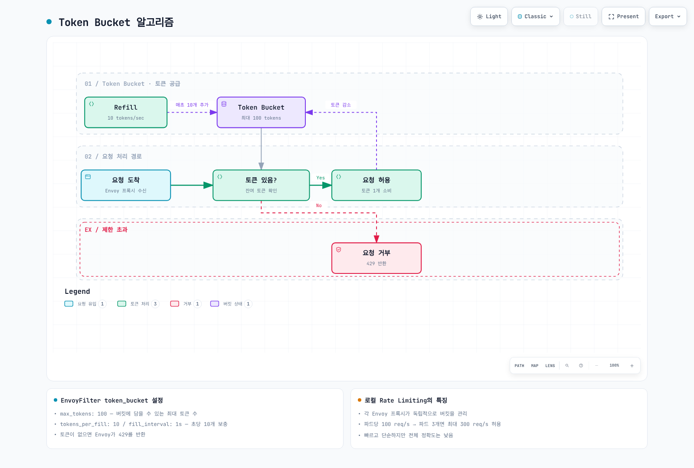

# Resilience 퀴즈

> **검토일**: 2026년 9월 11일 · Istio1.31 · Kubernetes1.32–1.36. EKS 호환성은 설치 장을 확인하세요.

이 퀴즈는 Istio의 복원력(Resilience) 기능에 대한 이해도를 테스트합니다.

각 예제는 독립적이며 지정한 Service·레이블·namespace·사이드카 HTTP8080 workload가 있다고 가정합니다. 값은 예시이며 schema/쿼리 확인은 운영·부하 검증이 아닙니다. Locality 예제는 별도 `zoneAwareLbSetting`이 아닌 `localityLbSetting`을 사용합니다.

## 객관식 문제 (1-5번)

### 문제 1: Outlier Detection 기본 개념

Outlier Detection의 주요 목적으로 옳지 **않은** 것은?

A. 비정상적으로 동작하는 인스턴스를 자동으로 감지\
B. 설정한 오류 임계치·제외 cap이 허용하면 일시 제외\
C. 제외된 인스턴스를 영구적으로 삭제\
D. 일시 제외 기간 뒤 host를 다시 트래픽 후보로 편입

<details>

<summary>정답 및 해설</summary>

**정답: C**

Outlier Detection은 **인스턴스를 삭제하지 않고** 트래픽 풀에서 일시적으로 제외합니다.

**해설:**

**Outlier Detection의 작동 원리:**


**주요 기능:**

1. **자동 감지**: 설정한 연속 HTTP/전송 실패를 집계
2. **자동 제외**: 임계값 초과 시 트래픽 풀에서 일시적 제외
3. **후보 복귀**: 제외 기간이 끝나며 active probe·실제 복구 증명은 아님
4. **일시적 조치**: 인스턴스를 삭제하지 않고 트래픽만 차단

**잘못된 선택지 C의 문제점:**

* Outlier Detection은 Circuit Breaker 패턴
* 인스턴스를 **일시적으로 제외**하되 삭제하지 않음
* 이후 정상 트래픽으로 복구를 확인하며 반복 실패 시 더 긴 제외가 가능

**참고 자료:**

* [Outlier Detection](../../../service-mesh/istio/resilience/01-outlier-detection.md)

</details>

***

### 문제 2: Rate Limiting 유형 비교

로컬 Rate Limiting과 글로벌 Rate Limiting의 비교로 옳은 것은?

A. 로컬 Rate Limiting이 정확도가 더 높다\
B. 글로벌 Rate Limiting이 성능이 더 빠르다\
C. 로컬 Rate Limiting은 각 Envoy 프록시가 독립적으로 제한한다\
D. 글로벌 Rate Limiting은 외부 서비스 없이 동작한다

<details>

<summary>정답 및 해설</summary>

**정답: C**

로컬 Rate Limiting은 **각 Envoy 프록시가 독립적으로** 요청을 제한합니다.

**해설:**

**로컬 vs 글로벌 Rate Limiting 비교:**

| 특성        | 로컬 Rate Limiting | 글로벌 Rate Limiting |
| --------- | ---------------- | ----------------- |
| **Quota 범위** | 로컬 설정 bucket | 공유 domain/descriptor·window |
| **성능**    | ✅ 매우 빠름          | ⚠️ 약간 느림          |
| **복잡도**   | ✅ 낮음             | ⚠️ 높음 (외부 서비스 필요) |
| **사용 사례** | 일반적인 보호          | 정확한 제한 필요 시       |

**로컬 Rate Limiting의 특징:**

```yaml
apiVersion: networking.istio.io/v1alpha3
kind: EnvoyFilter
metadata:
  name: local-ratelimit
  namespace: default
spec:
  workloadSelector:
    labels:
      app: myapp
  configPatches:
  - applyTo: HTTP_FILTER
    match:
      context: SIDECAR_INBOUND
      listener:
        portNumber: 8080
        filterChain:
          filter:
            name: envoy.filters.network.http_connection_manager
            subFilter:
              name: envoy.filters.http.router
    patch:
      operation: INSERT_BEFORE
      value:
        name: envoy.filters.http.local_ratelimit
        typed_config:
          '@type': type.googleapis.com/envoy.extensions.filters.http.local_ratelimit.v3.LocalRateLimit
          stat_prefix: http_local_rate_limiter
          token_bucket:
            max_tokens: 100
            tokens_per_fill: 10
            fill_interval: 1s
          filter_enabled:
            default_value:
              numerator: 100
              denominator: HUNDRED
          filter_enforced:
            default_value:
              numerator: 100
              denominator: HUNDRED
```

예제 bucket은100 token으로 시작해 초당10개를 보충합니다. Replica3개는 분산 상태에 따라 합계 약30/s를 지속 허용하며 burst도 각각 있습니다. 공유30/s cap은 아닙니다.

**글로벌 Rate Limiting의 특징:**

```yaml
# 공유 descriptor quota: backend 초 단위 window당100개
# 실제 강제는 공유 backend·window·장애 정책에 따라 달라짐
# 실제 gRPC rate-limit 서비스와 Redis 같은 공유 counter 저장소 필요
```

**Token Bucket 알고리즘:**



[🔍 인터랙티브 다이어그램 보기](https://www.atomai.click/kubernetes-docs/archmaps/ko-quizzes-service-mesh-istio-resilience-1.html)

**참고 자료:**

* [Rate Limiting](../../../service-mesh/istio/resilience/02-rate-limiting.md)

</details>

***

### 문제 3: Zone Aware Routing의 이점

Zone Aware Routing을 사용할 때 얻을 수 있는 이점으로 옳지 **않은** 것은?

A. 같은 AZ 내 통신으로 지연시간 감소\
B. 크로스 AZ 데이터 전송 비용 절감\
C. 모든 서비스 replica를 한 AZ에 배치해 가용성 향상을 보장\
D. 적절한 정책·용량이 있을 때 도달 가능한 정상 endpoint로 장애조치

<details>

<summary>정답 및 해설</summary>

**정답: C**

C는 보장이 아닙니다. Locality는 호출자 기준이므로 각 호출자의 트래픽이 자신의 AZ로 집중될 수 있습니다. 모든 replica를 한 AZ로 옮기면 장애 도메인을 공유하고 그 AZ가 과부하될 수 있습니다.

**해설:**

**Zone Aware Routing의 올바른 동작:**


**Zone Aware Routing의 실제 이점:**

동일 AZ routing은 지연의 네트워크 부분·과금 대상 교차 AZ byte를 줄일 수 있지만 정확한 지연·가격·절감액은 환경에 달려 있습니다. 80/10/10은 세 정상 AZ에 평상시 트래픽을 보내는 비율이며10% 부분은 대기 failover가 아닙니다. 다른 AZ에는 실제 접근 가능한 endpoint·여유 용량이 필요합니다.

**DestinationRule 설정 예시:**

```yaml
apiVersion: networking.istio.io/v1
kind: DestinationRule
metadata:
  name: myapp
  namespace: default
spec:
  host: myapp
  trafficPolicy:
    loadBalancer:
      localityLbSetting:
        enabled: true
        distribute:
        - from: us-east-1/us-east-1a/*
          to:
            us-east-1/us-east-1a/*: 80
            us-east-1/us-east-1b/*: 10
            us-east-1/us-east-1c/*: 10
    outlierDetection:
      consecutive5xxErrors: 5
      interval: 30s
      baseEjectionTime: 30s
      maxEjectionPercent: 50
      minHealthPercent: 0
```

**참고 자료:**

* [Zone Aware Routing](../../../service-mesh/istio/resilience/03-zone-aware-routing.md)

</details>

***

### 문제 4: Outlier Detection 파라미터

다음 Outlier Detection 설정에서 인스턴스가 제외되는 조건은?

```yaml
outlierDetection:
  consecutive5xxErrors: 5
  interval: 30s
  baseEjectionTime: 30s
  maxEjectionPercent: 50
```

A. 5초 동안 에러 발생 시\
B. 해당5xx 실패가 연속5회로 임계치에 도달하고 제외 cap이 허용할 때\
C. 30초 동안 에러율 50% 초과 시\
D. 30초마다 무조건 제외

<details>

<summary>정답 및 해설</summary>

**정답: B**

B가 감지 조건입니다. 해당 실패가 연속5회이면 즉시 감지할 수 있으며 `interval`은 주기적 sweep 간격이고 `maxEjectionPercent`가 강제를 막을 수 있습니다. 느리지만 성공한 응답 자체는 지연 기반 outlier가 아닙니다.

**해설:**

**Outlier Detection 주요 파라미터:**

| 파라미터                   | 설명        | 기본값 | 예시 범위      |
| ---------------------- | --------- | --- | -------- |
| **consecutive5xxErrors**  | 연속 에러 임계값 | 5   | 3-10     |
| **interval**           | 분석 주기     | 10s | 10s-60s  |
| **baseEjectionTime**   | 최소 제외 시간  | 30s | 30s-300s |
| **maxEjectionPercent** | 최대 제외 비율  | 10% | 10%-50%  |

**파라미터 상세 설명:**

**consecutive5xxErrors**

```yaml
# 민감한 서비스 (빠른 감지)
consecutive5xxErrors: 3

# 일반 서비스
---
consecutive5xxErrors: 5

# 관대한 설정 (오탐 방지)
---
consecutive5xxErrors: 10
```

**interval**

```yaml
# 빠른 감지 (높은 부하)
interval: 10s

# 일반적인 경우
---
interval: 30s

# 안정적인 서비스
---
interval: 60s
```

**baseEjectionTime**

```yaml
# 빠른 복구 시도
baseEjectionTime: 30s

# 일반적인 경우
---
baseEjectionTime: 60s

# 신중한 복구
---
baseEjectionTime: 300s
```

**maxEjectionPercent**

```yaml
# 보수적 (안정성 우선)
maxEjectionPercent: 10

# 균형잡힌 설정
---
maxEjectionPercent: 30

# 공격적 (성능 우선)
---
maxEjectionPercent: 50
```

**완전한 DestinationRule 예제:**

```yaml
apiVersion: networking.istio.io/v1
kind: DestinationRule
metadata:
  name: reviews-outlier
  namespace: default
spec:
  host: reviews
  trafficPolicy:
    outlierDetection:
      consecutive5xxErrors: 5
      interval: 30s
      baseEjectionTime: 30s
      maxEjectionPercent: 50
      minHealthPercent: 0
```

**동작 예시:**

성공하면 해당 연속 오류 카운트가 초기화됩니다. Host가 임계치에 도달하고 cap이 허용하면 제외되며 실제 제외 기간 뒤 후보로 돌아옵니다. 반복 제외 시 Envoy 배수·상한에 따라 기간이 늘어납니다. `minHealthPercent`는 정상 Pod 비율 보장이 아닌 panic/fail-open 임계치이며0으로 비활성화합니다.

**참고 자료:**

* [Outlier Detection](../../../service-mesh/istio/resilience/01-outlier-detection.md)

</details>

***

### 문제 5: Token Bucket 알고리즘

요청당 token 하나·지속적인 수요를 가정할 때 초기 burst 이후 장기 refill 기준 허용 요청률은?

```yaml
token_bucket:
  max_tokens: 100
  tokens_per_fill: 10
  fill_interval: 1s
```

A. 10 req/s\
B. 100 req/s\
C. 110 req/s\
D. 1000 req/s

<details>

<summary>정답 및 해설</summary>

**정답: A**

`tokens_per_fill: 10`과 `fill_interval: 1s`로 **초당 10개의 토큰**이 추가되므로, 평균 **10 req/s**입니다.

**해설:**

**Token Bucket 알고리즘 파라미터:**

* **max\_tokens**: 버킷에 저장할 수 있는 최대 토큰 수 (버스트 허용량)
* **tokens\_per\_fill**: 매 fill\_interval마다 추가할 토큰 수 (**평균 처리량**)
* **fill\_interval**: 토큰 추가 주기

**계산 방식:**

```
평균 요청 처리율 = tokens_per_fill / fill_interval
                = 10 / 1s
                = 10 req/s

버스트 처리량 = max_tokens
            = 100 req (짧은 순간)
```

**시간에 따른 동작:**

```
T=0: 버킷에 100개 토큰 (초기 상태)
     Bucket이 차 있으면 최대100개 즉시 허용; backend 동시 처리 능력과는 별개

T=0.1s: 버킷 비어있음 (0개)
        추가 요청 거부 ❌

T=1s: 10개 토큰 추가 (Refill)
      10개 요청 처리 가능 ✅

T=2s: 10개 토큰 추가
      10개 요청 처리 가능 ✅

평균: 10 req/s (지속 가능한 처리량)
Burst 허용량: 가득 찬 bucket의100개 요청이며 지속 req/s가 아님
```

**실전 설정 예시:**

```yaml
# 시나리오 1: 일반 API 엔드포인트
token_bucket:
  max_tokens: 100        # 버스트 100개 허용
  tokens_per_fill: 10    # 평균 10 req/s
  fill_interval: 1s

# 시나리오 2: 고성능 API
---
token_bucket:
  max_tokens: 1000       # 버스트 1000개 허용
  tokens_per_fill: 100   # 평균 100 req/s
  fill_interval: 1s

# 시나리오 3: 제한적인 리소스
---
token_bucket:
  max_tokens: 10         # 버스트 10개만
  tokens_per_fill: 1     # 평균 1 req/s
  fill_interval: 1s
```

**EnvoyFilter 완전한 예제:**

```yaml
apiVersion: networking.istio.io/v1alpha3
kind: EnvoyFilter
metadata:
  name: local-ratelimit
  namespace: default
spec:
  workloadSelector:
    labels:
      app: myapp
  configPatches:
  - applyTo: HTTP_FILTER
    match:
      context: SIDECAR_INBOUND
      listener:
        portNumber: 8080
        filterChain:
          filter:
            name: envoy.filters.network.http_connection_manager
            subFilter:
              name: envoy.filters.http.router
    patch:
      operation: INSERT_BEFORE
      value:
        name: envoy.filters.http.local_ratelimit
        typed_config:
          '@type': type.googleapis.com/envoy.extensions.filters.http.local_ratelimit.v3.LocalRateLimit
          stat_prefix: http_local_rate_limiter
          token_bucket:
            max_tokens: 100
            tokens_per_fill: 10
            fill_interval: 1s
          filter_enabled:
            default_value:
              numerator: 100
              denominator: HUNDRED
          filter_enforced:
            default_value:
              numerator: 100
              denominator: HUNDRED
```

**참고 자료:**

* [Rate Limiting](../../../service-mesh/istio/resilience/02-rate-limiting.md)

</details>

***

## 주관식 문제 (6-10번)

### 문제 6: Outlier Detection 구현

프로덕션 환경에서 실행 중인 `product-service`가 간헐적으로 느려지고 타임아웃이 발생합니다. Outlier Detection을 구현하여 문제있는 인스턴스를 자동으로 제외하고 싶습니다. 다음 요구사항을 만족하는 DestinationRule을 작성하세요:

**요구사항:**

* 연속 3번 에러 발생 시 제외
* 주기적 sweep은20초이며 연속 실패 감지는 즉시 가능
* 초기 base 제외 기간은60초
* 최대 30%까지만 제외 가능
* 502, 503, 504 게이트웨이 에러도 감지

<details>

<summary>예시 답안</summary>

느린 응답 자체는 outlier 기준이 아닙니다. HTTP 오류·로컬 전송 실패를 분리하며 timeout을 관측하려면 실제 route/client timeout 설정이 있어야 합니다.

```yaml
apiVersion: networking.istio.io/v1
kind: DestinationRule
metadata:
  name: product-service-outlier
  namespace: production
spec:
  host: product-service
  trafficPolicy:
    outlierDetection:
      consecutive5xxErrors: 3
      splitExternalLocalOriginErrors: true
      consecutiveLocalOriginFailures: 3
      interval: 20s
      baseEjectionTime: 60s
      maxEjectionPercent: 30
      minHealthPercent: 0
      consecutiveGatewayErrors: 3
```

502/503/504는 이미5xx에 포함됩니다. 두 임계치3은 중복이지만 유효하며 gateway 임계치를 더 낮추면 그 부분집합을 더 빨리 제외할 수 있습니다. `interval: 20s`는 연속 오류 감지를 지연시키지 않습니다. `baseEjectionTime: 60s`는 초기 최소 기간이며 active health probe가 아닙니다. 30% cap이 나머지 endpoint를 정상으로 만들지는 않습니다. `minHealthPercent: 70`은70% 정상 용량 보장이 아닌 임계치 아래 panic 동작입니다. 지원되지 않는 `enforcing*` 필드는 이 DestinationRule API가 아닌 Envoy 내부 필드입니다.

Host10개 예제에서는 세 번 제외 후 cap에 도달할 수 있지만 실제 pool 크기·반올림·건강 상태에 따라 달라집니다. Enforced/detected/overflow counter를 확인하고 복귀 host의 정상 트래픽으로 실제 복구를 확인합니다.

```bash
istioctl proxy-config clusters <caller-pod> -n production --fqdn product-service.production.svc.cluster.local -o json
istioctl x envoy-stats <caller-pod> -n production --output prom | grep outlier_detection
```

```promql
envoy_cluster_outlier_detection_ejections_active{namespace="production"}
rate(envoy_cluster_outlier_detection_ejections_enforced_total{namespace="production"}[5m])
```

선택적 통계·수집은 [outlier 장](../../../service-mesh/istio/resilience/01-outlier-detection.md)을 따릅니다. 실측 오류·여유 용량으로 임계치를 정하며 일반적인 “운영 정답” 값은 아닙니다.

</details>

***

### 문제 7: 로컬 Rate Limiting 적용

사이드카가 주입된 `api-gateway` 앱에 과도한 HTTP 트래픽이 들어옵니다. 로컬 Rate Limiting을 적용하여 각 Envoy 프록시에서 초당 50개 요청으로 제한하고, 버스트로 최대 200개까지 허용하려고 합니다. EnvoyFilter를 작성하세요.

추가 요구사항:

* Rate limit이 적용될 때 `X-RateLimit-Limit` 헤더 추가
* 429 응답 시 `Retry-After: 1` 헤더 포함

<details>

<summary>예시 답안</summary>

`api-gateway`가 `production`의 HTTP8080 사이드카 주입 앱이라고 가정합니다. Envoy에 도착한 HTTP 요청을 제한하며 완전한 DDoS·연결/TLS 보호가 아닙니다. 실제 Istio ingress gateway에는 rate-limit 장처럼 해당 namespace/selector·`GATEWAY` context를 사용합니다.

```yaml
apiVersion: networking.istio.io/v1alpha3
kind: EnvoyFilter
metadata:
  name: api-gateway-ratelimit
  namespace: production
spec:
  workloadSelector:
    labels:
      app: api-gateway
  configPatches:
  - applyTo: HTTP_FILTER
    match:
      context: SIDECAR_INBOUND
      listener:
        portNumber: 8080
        filterChain:
          filter:
            name: envoy.filters.network.http_connection_manager
            subFilter:
              name: envoy.filters.http.router
    patch:
      operation: INSERT_BEFORE
      value:
        name: envoy.filters.http.local_ratelimit
        typed_config:
          '@type': type.googleapis.com/envoy.extensions.filters.http.local_ratelimit.v3.LocalRateLimit
          stat_prefix: http_local_rate_limiter
          token_bucket:
            max_tokens: 200
            tokens_per_fill: 50
            fill_interval: 1s
          filter_enabled:
            default_value:
              numerator: 100
              denominator: HUNDRED
          filter_enforced:
            default_value:
              numerator: 100
              denominator: HUNDRED
          response_headers_to_add:
          - append_action: OVERWRITE_IF_EXISTS_OR_ADD
            header:
              key: X-RateLimit-Limit
              value: '50'
          - append_action: OVERWRITE_IF_EXISTS_OR_ADD
            header:
              key: X-Local-Rate-Limit
              value: 'true'
          - append_action: OVERWRITE_IF_EXISTS_OR_ADD
            header:
              key: Retry-After
              value: '1'
```

가득 찬 bucket은 즉시 최대200개를 허용한 뒤 초당50 token을 보충합니다. 고갈 이후100 요청/s가 지속되면 요청당1 token·다른 제한 없음 가정에서 약50/s를 허용합니다. 고르게40/s이면 수용할 수 있지만 평균40/s만으로 모든 burst 허용을 보장하지는 않습니다. 허용이 backend 처리 성공을 보장하지도 않습니다.

Filter는 기본HTTP429이며 강제 거부 응답에만 헤더를 추가합니다. 정상200에는 이 설정으로 헤더가 붙지 않습니다. `Retry-After: 1`은 권고 대기 시간이며1초 뒤 성공 예약·보장이 아닙니다. 이 예제는 `tokens_remaining` dynamic metadata를 만들지 않으므로 허구의 Remaining 헤더를 넣지 않습니다.

```http
HTTP/1.1 429 Too Many Requests
X-RateLimit-Limit: 50
X-Local-Rate-Limit: true
Retry-After: 1
```

경로 prefix별 bucket이 필요하면 중복 filter로 추가하지 말고 다음 **대안**을 사용합니다. 명시적 descriptor 생성은 Istio1.31 고정 Envoy API가 지원합니다. 미매칭 경로는 제한된 기본 bucket을 사용하며 prefix로 시작하는 더 긴 경로도 일치합니다.

```yaml
apiVersion: networking.istio.io/v1alpha3
kind: EnvoyFilter
metadata:
  name: path-based-ratelimit
  namespace: production
spec:
  workloadSelector:
    labels:
      app: api-gateway
  configPatches:
  - applyTo: HTTP_FILTER
    match:
      context: SIDECAR_INBOUND
      listener:
        portNumber: 8080
        filterChain:
          filter:
            name: envoy.filters.network.http_connection_manager
            subFilter:
              name: envoy.filters.http.router
    patch:
      operation: INSERT_BEFORE
      value:
        name: envoy.filters.http.local_ratelimit
        typed_config:
          '@type': type.googleapis.com/envoy.extensions.filters.http.local_ratelimit.v3.LocalRateLimit
          stat_prefix: http_local_rate_limiter
          token_bucket:
            max_tokens: 30
            tokens_per_fill: 10
            fill_interval: 1s
          filter_enabled:
            default_value:
              numerator: 100
              denominator: HUNDRED
          filter_enforced:
            default_value:
              numerator: 100
              denominator: HUNDRED
          always_consume_default_token_bucket: false
          descriptors:
          - entries:
            - key: header_match
              value: /api/login
            token_bucket:
              max_tokens: 30
              tokens_per_fill: 10
              fill_interval: 1s
          - entries:
            - key: header_match
              value: /api/search
            token_bucket:
              max_tokens: 300
              tokens_per_fill: 100
              fill_interval: 1s
          rate_limits:
          - actions:
            - header_value_match:
                descriptor_value: /api/login
                headers:
                - name: :path
                  string_match:
                    prefix: /api/login
          - actions:
            - header_value_match:
                descriptor_value: /api/search
                headers:
                - name: :path
                  string_match:
                    prefix: /api/search
```

```promql
sum by (pod) (rate({__name__=~"envoy_.*http_local_rate_limit_enforced",namespace="production"}[5m]))
```

선택적 통계 수집·전역 서비스/Redis 전제·신뢰한 신원 처리는 [rate limiting](../../../service-mesh/istio/resilience/02-rate-limiting.md)을 참고합니다.

</details>

***

### 문제 8: Zone Aware Routing 설정

AWS EKS 클러스터가 3개의 AZ (us-east-1a, us-east-1b, us-east-1c)에 분산되어 있습니다. `order-service`에 Zone Aware Routing을 설정하여 크로스 AZ 데이터 전송 비용을 절감하려고 합니다.

**요구사항:**

* 같은 AZ 파드에 70% 트래픽 전송
* 다른 AZ에 각각 15%씩 분산
* 별도 priority failover 대안과 AZ 전체 장애의 한계 설명
* minHealthPercent50이 정상50% 보장·locality 활성 switch가 아닌 이유 설명

<details>

<summary>예시 답안</summary>

요구사항에는 가중치 분배·우선순위 장애조치·정상 용량 보장이 섞여 있어 한 locality 정책의 필드 조합으로 모두 표현할 수 없습니다. 평상시70/15/15에는 다음 분배 정책을 사용합니다. `minHealthPercent`는 Pod 절반이 정상일 때만 locality를 켜는 switch가 아닙니다.

```yaml
apiVersion: networking.istio.io/v1
kind: DestinationRule
metadata:
  name: order-service-locality
  namespace: production
spec:
  host: order-service
  trafficPolicy:
    loadBalancer:
      localityLbSetting:
        enabled: true
        distribute:
        - from: us-east-1/us-east-1a/*
          to:
            us-east-1/us-east-1a/*: 70
            us-east-1/us-east-1b/*: 15
            us-east-1/us-east-1c/*: 15
        - from: us-east-1/us-east-1b/*
          to:
            us-east-1/us-east-1a/*: 15
            us-east-1/us-east-1b/*: 70
            us-east-1/us-east-1c/*: 15
        - from: us-east-1/us-east-1c/*
          to:
            us-east-1/us-east-1a/*: 15
            us-east-1/us-east-1b/*: 15
            us-east-1/us-east-1c/*: 70
    outlierDetection:
      consecutive5xxErrors: 5
      splitExternalLocalOriginErrors: true
      consecutiveLocalOriginFailures: 5
      interval: 30s
      baseEjectionTime: 30s
      maxEjectionPercent: 50
      minHealthPercent: 0
```

같은 AZ 우선·spillover가 목적이면 두 정책을 함께 적용하지 말고 다음 **대안**을 사용합니다. `localityLbSetting.failover`는 `region/zone` 경로가 아닌 리전 이름을 받습니다. 이 API에서는 `distribute`와 priority 모드를 함께 쓰지 않습니다.

```yaml
apiVersion: networking.istio.io/v1
kind: DestinationRule
metadata:
  name: order-service-failover
  namespace: production
spec:
  host: order-service
  trafficPolicy:
    loadBalancer:
      localityLbSetting:
        enabled: true
        failoverPriority:
        - topology.kubernetes.io/region
        - topology.kubernetes.io/zone
    outlierDetection:
      consecutive5xxErrors: 5
      splitExternalLocalOriginErrors: true
      consecutiveLocalOriginFailures: 5
      interval: 30s
      baseEjectionTime: 30s
      maxEjectionPercent: 100
      minHealthPercent: 0
```

AZ 전체 장애는 그 AZ의 client에도 영향을 주므로 다른 위치의 생존/재생성 client·진입점이 필요합니다. 남은 정상 endpoint 용량·감지·연결 재사용·접근 가능성이 장애조치를 결정하며 zoneB로100% 전환·즉시 복구를 보장하지 않습니다. `minHealthPercent: 0`은 비정상 host까지 쓰는 panic 동작을 끄고100% cap은 모두 실패하면 모두 제외할 수 있게 합니다. 정상 용량을 만들어주지는 않습니다.

Node→Pod topology·일치하는 topologySpreadConstraints·EKS node-group·EDS 진단은 [zone-aware 장](../../../service-mesh/istio/resilience/03-zone-aware-routing.md)을 따릅니다. 예제를 맞추려고 cloud topology 레이블을 임의로 지정하지 않습니다. Istio 표준 메트릭에는 `source_cluster_zone`/`destination_cluster_zone`이 없으며 AZ 쿼리는 routing과 별개인 검증된 enrichment가 필요합니다.

**가상 비용 계산**: decimal1TB=1000GB, 과금 대상 GB당 유효 단가$0.01, 기존 교차 AZ 비율2/3, 변경 후0.30을 가정합니다. 실제 AWS 가격·실측 절감·전체 네트워크 청구가 아닌 단순 모델입니다.

| 월 트래픽 | 이전 | 이후 | 월 절감 | 연 절감 |
|---|---:|---:|---:|---:|
|1TB|$6.67|$3.00|$3.67|$44.00|
|100TB|$666.67|$300.00|$366.67|$4,400.00|

모델의 감소율은55%입니다. 정확한 분수로 계산한 뒤 표시 금액만 반올림하며 월$367로 미리 반올림한 값을 연간으로 곱하지 않습니다. 실제 과금 방향·byte·리전·서비스 처리 비용은 청구/flow 근거로 확인해야 합니다.

```bash
kubectl get nodes -L topology.kubernetes.io/region,topology.kubernetes.io/zone
istioctl proxy-config bootstrap <caller-pod> -n production -o json
istioctl proxy-config all <caller-pod> -n production -o json
```

</details>

***

### 문제 9: 복합 Resilience 전략

`payment-service`는 외부 결제 API를 호출하는 중요한 서비스입니다. 다음 복합 Resilience 전략을 구현하세요:

1. **Outlier Detection**: 연속 3번 에러 시 인스턴스 제외
2. **Retry**: 멱등성이 확인된 읽기의502/503/504에 최대3회, 쓰기 retry는 명시적으로 비활성화
3. **Timeout**: 요청당 5초 타임아웃
4. **Circuit Breaker**: “오류율50% 초과 시 서비스 전체 차단”이 이 API의 pool breaker가 아닌 이유와 지원되는 동시성 제한 제시

DestinationRule과 VirtualService를 작성하세요.

<details>

<summary>예시 답안</summary>

나열한 success-rate 필드로 DestinationRule이 “오류율50% 이상이면 서비스 전체 차단”을 구현할 수는 없습니다. 해당 필드는 여기서 지원하지 않고 통계 편차도 고정 오류 비율이 아닙니다. Pool breaker는 호출 프록시의 upstream cluster별 동시 연결·요청을 제한하고 outlier detection은 host 후보를 바꿉니다. 전역 오류 비율 breaker에는 별도 앱/controller 설계가 필요합니다.

다음은 **호출자→payment-service HTTP8080** 정책입니다. 서비스→외부 결제 API에는 [outlier 장](../../../service-mesh/istio/resilience/01-outlier-detection.md)의 별도 목적지 정책·TLS 가시성이 필요합니다. Mesh retry가 결제 멱등성을 제공하지는 않습니다.

```yaml
apiVersion: networking.istio.io/v1
kind: DestinationRule
metadata:
  name: payment-service-resilience
  namespace: production
spec:
  host: payment-service
  trafficPolicy:
    connectionPool:
      tcp:
        maxConnections: 100
        connectTimeout: 1s
      http:
        http1MaxPendingRequests: 50
        http2MaxRequests: 100
        maxRequestsPerConnection: 0
        maxRetries: 3
    outlierDetection:
      consecutive5xxErrors: 3
      splitExternalLocalOriginErrors: true
      consecutiveLocalOriginFailures: 3
      interval: 10s
      baseEjectionTime: 30s
      maxEjectionPercent: 50
      minHealthPercent: 0
---
apiVersion: networking.istio.io/v1
kind: VirtualService
metadata:
  name: payment-service-retry
  namespace: production
spec:
  hosts:
  - payment-service
  http:
  - name: writes-no-retry
    match:
    - method:
        regex: ^(POST|PUT|PATCH|DELETE)$
    route:
    - destination:
        host: payment-service
        port:
          number: 8080
    timeout: 5s
    retries:
      attempts: 0
  - name: idempotent-reads
    match:
    - method:
        regex: ^(GET|HEAD|OPTIONS)$
    route:
    - destination:
        host: payment-service
        port:
          number: 8080
    timeout: 5s
    retries:
      attempts: 3
      perTryTimeout: 2s
      retryOn: gateway-error,connect-failure,refused-stream
  - name: other-methods-no-retry
    route:
    - destination:
        host: payment-service
        port:
          number: 8080
    timeout: 5s
    retries:
      attempts: 0
```

명시한 쓰기/fallback rule은 상속할 mesh retry를 끕니다. 반복해도 안전한 앱 의미가 확인된 매칭 읽기만 재시도합니다. `gateway-error`는502/503/504이며 결제 쓰기에 광범위한 reset/5xx/4xx 조건을 넣지 않습니다. 전송 오류만으로 결제 완료 여부를 판단할 수 없습니다.

`attempts: 3`은 최초 요청 **이후** 최대3회입니다. 2초씩 네 번+backoff는5초 안에 들어가지 않아 전체 route 예산으로 더 일찍 끝납니다. 앱 deadline은 upload/streaming·downstream 작업도 고려해야 합니다. 정확한 실패 타임라인이나 특정 최종 HTTP 상태 보장이 아닙니다.

`maxRetries: 3`은 요청별 횟수가 아닌 해당 프록시/cluster의 동시 진행 retry 한도입니다. `http2MaxRequests`는 HTTP/1.1에도 적용됩니다. `maxRequestsPerConnection: 0`은 이 요청 수 cap 없이 재사용을 허용합니다. Pending/active request overflow는 HTTP 요청을 거부할 수 있지만 단순 연결 한도는 먼저 대기를 만들 수 있습니다. 어느 것도 전역50%-오류 circuit이 아닙니다.

| 관측 | 올바른 해석 |
|---|---|
|안전한 읽기가502 후 retry에서 성공|Retry가 도움을 줄 수 있지만 같은 host를 다시 선택하거나 실패할 수도 있음|
|Host가 오류 임계치 도달|해당 호출자는 cap이 허용하면 제외하며 다른 호출자는 별도 상태를 유지|
|모든 endpoint 실패|정상 목적지가 없을 수 있으며 제외 timer가 서비스를 고치거나 전역 half-open 시험을 만들지 않음|

```promql
sum(rate(envoy_cluster_upstream_rq_retry{namespace="production"}[5m]))
envoy_cluster_circuit_breakers_default_rq_pending_open{namespace="production"}
sum(rate(envoy_cluster_outlier_detection_ejections_enforced_total{namespace="production"}[5m]))
sum(rate(istio_requests_total{reporter="source",destination_service_name="payment-service",destination_service_namespace="production",response_flags=~".*UT.*"}[5m]))
```

`_open`은0/1 gauge이며 `rate`를 적용할 counter가 아닙니다. Envoy cluster 레이블 범위를 맞추고 관련 통계를 켭니다. 운영상 선택은 [retry/timeout](../../../service-mesh/istio/traffic-management/05-retry-timeout.md)·[circuit breaking](../../../service-mesh/istio/traffic-management/07-circuit-breaker.md)을 참고합니다.

</details>

***

### 문제 10: 성능 최적화 및 비용 절감

대규모 마이크로서비스 환경에서 월 네트워크 비용이 $5,000입니다. Istio Resilience 기능을 활용하여 성능을 최적화하고 비용을 절감하는 종합 전략을 수립하세요.

**현재 상황:**

* 3개 AZ에 균등 분산된 100개 서비스
* 월 트래픽: 500TB
* 평균 응답 시간: 150ms
* 에러율: 3%

**목표:**

* 크로스 AZ 비용 50% 절감
* 평균 응답 시간 100ms 이하
* 에러율 1% 이하

<details>

<summary>예시 답안</summary>

제시한100개 서비스·월500TB·$5,000·150ms·오류3%는 이 감사의 실측값이 아닌 **가상 baseline**입니다. 먼저 과금 트래픽 구성 요소·사용자 SLI 경계를 확인합니다. 프록시 홉 지연이 곧 전체 요청 지연은 아닙니다.

**1. 검토한 서비스별 destination 정책 하나로 통합**

대표 `api-service` 예제는 pool 제한·locality 가중치·지원되는 outlier detection을 하나의 DestinationRule에 넣습니다. 경쟁하는 wildcard rule을 여러 개 적용하거나 모든 서비스를 같은 generic backend로 보내지 않습니다. 호출자·목적지마다 용량을 산정하며 운영 기본값이 아닙니다.

```yaml
apiVersion: networking.istio.io/v1
kind: DestinationRule
metadata:
  name: api-service-resilience
  namespace: production
spec:
  host: api-service
  trafficPolicy:
    connectionPool:
      tcp:
        maxConnections: 100
        connectTimeout: 1s
      http:
        http1MaxPendingRequests: 50
        http2MaxRequests: 100
        maxRequestsPerConnection: 0
        maxRetries: 3
    loadBalancer:
      localityLbSetting:
        enabled: true
        distribute:
        - from: us-east-1/us-east-1a/*
          to:
            us-east-1/us-east-1a/*: 80
            us-east-1/us-east-1b/*: 10
            us-east-1/us-east-1c/*: 10
        - from: us-east-1/us-east-1b/*
          to:
            us-east-1/us-east-1a/*: 10
            us-east-1/us-east-1b/*: 80
            us-east-1/us-east-1c/*: 10
        - from: us-east-1/us-east-1c/*
          to:
            us-east-1/us-east-1a/*: 10
            us-east-1/us-east-1b/*: 10
            us-east-1/us-east-1c/*: 80
    outlierDetection:
      consecutive5xxErrors: 3
      splitExternalLocalOriginErrors: true
      consecutiveLocalOriginFailures: 3
      interval: 10s
      baseEjectionTime: 60s
      maxEjectionPercent: 30
      minHealthPercent: 0
      consecutiveGatewayErrors: 2
---
apiVersion: networking.istio.io/v1
kind: VirtualService
metadata:
  name: api-service-routing
  namespace: production
spec:
  hosts:
  - api-service
  http:
  - name: writes-no-retry
    match:
    - method:
        regex: ^(POST|PUT|PATCH|DELETE)$
    route:
    - destination:
        host: api-service
        port:
          number: 8080
    timeout: 3s
    retries:
      attempts: 0
  - name: idempotent-reads
    match:
    - method:
        regex: ^(GET|HEAD|OPTIONS)$
    route:
    - destination:
        host: api-service
        port:
          number: 8080
    timeout: 3s
    retries:
      attempts: 2
      perTryTimeout: 1s
      retryOn: gateway-error,connect-failure,refused-stream
  - name: other-methods-no-retry
    route:
    - destination:
        host: api-service
        port:
          number: 8080
    timeout: 3s
    retries:
      attempts: 0
```

**2. 실측 용량에 맞춘 요청 허용 제한**

`production`의 HTTP8080 프록시별 독립 bucket입니다. Tier 레이블·용량을 검증하며 “critical”이라는 이름만으로 특정률이 정당화되지는 않습니다. 서비스/계정의 공유 quota나 edge 보호 대체가 아닙니다.

```yaml
apiVersion: networking.istio.io/v1alpha3
kind: EnvoyFilter
metadata:
  name: critical-service-ratelimit
  namespace: production
spec:
  workloadSelector:
    labels:
      tier: critical
  configPatches:
  - applyTo: HTTP_FILTER
    match:
      context: SIDECAR_INBOUND
      listener:
        portNumber: 8080
        filterChain:
          filter:
            name: envoy.filters.network.http_connection_manager
            subFilter:
              name: envoy.filters.http.router
    patch:
      operation: INSERT_BEFORE
      value:
        name: envoy.filters.http.local_ratelimit
        typed_config:
          '@type': type.googleapis.com/envoy.extensions.filters.http.local_ratelimit.v3.LocalRateLimit
          stat_prefix: http_local_rate_limiter
          token_bucket:
            max_tokens: 500
            tokens_per_fill: 100
            fill_interval: 1s
          filter_enabled:
            default_value:
              numerator: 100
              denominator: HUNDRED
          filter_enforced:
            default_value:
              numerator: 100
              denominator: HUNDRED
---
apiVersion: networking.istio.io/v1alpha3
kind: EnvoyFilter
metadata:
  name: standard-service-ratelimit
  namespace: production
spec:
  workloadSelector:
    labels:
      tier: standard
  configPatches:
  - applyTo: HTTP_FILTER
    match:
      context: SIDECAR_INBOUND
      listener:
        portNumber: 8080
        filterChain:
          filter:
            name: envoy.filters.network.http_connection_manager
            subFilter:
              name: envoy.filters.http.router
    patch:
      operation: INSERT_BEFORE
      value:
        name: envoy.filters.http.local_ratelimit
        typed_config:
          '@type': type.googleapis.com/envoy.extensions.filters.http.local_ratelimit.v3.LocalRateLimit
          stat_prefix: http_local_rate_limiter
          token_bucket:
            max_tokens: 200
            tokens_per_fill: 50
            fill_interval: 1s
          filter_enabled:
            default_value:
              numerator: 100
              denominator: HUNDRED
          filter_enforced:
            default_value:
              numerator: 100
              denominator: HUNDRED
```

**3. 단순 모델과 실제 청구 구분**

Decimal500TB=500,000GB, 기존 교차 AZ 비율2/3, 변경 후0.20, 과금 GB당 **가정한 유효 단가**$0.015라면 가변 구성 요소는 다음과 같습니다:

| 모델 | 계산 | 월 금액 |
|---|---|---:|
|이전|500,000 × 2/3 × 0.015|$5,000|
|이후|500,000 × 0.20 × 0.015|$1,500|
|차이|5,000 − 1,500|$3,500 (70%)|

전체$5,000이 이 가변 요소일 때만 원래 청구액과 일치합니다. 실제 청구에는 다른 방향·LB/NAT 처리·인터넷/리전 전송·고정 비용이 포함될 수 있습니다. 요청·응답 크기가 다르면 요청 가중치가 byte 비율과 같지도 않습니다. 과금 flow/CUR·현행 가격으로 모델을 검증하며 전체 청구70% 절감을 보장하지 않습니다.

한 홉의 가상 네트워크 지연을 동일 AZ0.3ms·교차 AZ1.5ms로 두면3개 AZ 균등 baseline은0.3×1/3+1.5×2/3=1.10ms,80/20은0.54ms입니다. 이 구성 요소0.56ms 변화로 전체150ms→100ms를 입증할 수는 없습니다. 실제 critical path·DB/pool 대기·앱 처리·retry 증폭을 추적합니다.

**4. 단계별 변경 검증**

| 단계 예시 | 적용 확대 전 필요한 근거 |
|---|---|
|1–2주: topology/locality|실제 Node/Pod/EDS 연결·AZ별 용량·요청/과금 byte 분포·장애 동작|
|3–4주: outlier/pool 한도|강제 제외·남은 endpoint·overflow·지연·앱 오류 원인|
|5–6주: rate limit|정상 요청을 과도하게 막지 않고 실제 과부하를 거부하는지, client retry 동작|

일정은 예시입니다. Rollback/중단 기준을 정하고 변경마다 측정합니다. Outlier detection은 용량을 줄이거나 근본 장애를 드러낼 수 있으며 오류1% 미만을 보장하지 않습니다. Timeout을 줄이면 작업이 빨라지기보다 오류가 늘 수도 있습니다.

**5. 유형·범위가 맞는 메트릭 사용**

다음은 대표 서비스 진단용이며 사용자 SLI는 별도로 측정합니다. 평균은 P50이 아닌 histogram sum/count이며 활성 제외는 gauge, 강제 제외 event는 counter입니다.

```promql
# Per-service mean request duration, milliseconds
sum(rate(istio_request_duration_milliseconds_sum{reporter="destination",destination_service_name="api-service",destination_service_namespace="production"}[5m])) /
sum(rate(istio_request_duration_milliseconds_count{reporter="destination",destination_service_name="api-service",destination_service_namespace="production"}[5m]))

# Per-service HTTP5xx percentage (define gRPC/application failures separately)
100 * sum(rate(istio_requests_total{reporter="destination",destination_service_name="api-service",destination_service_namespace="production",response_code=~"5.."}[5m])) /
sum(rate(istio_requests_total{reporter="destination",destination_service_name="api-service",destination_service_namespace="production"}[5m]))

envoy_cluster_outlier_detection_ejections_active{namespace="production"}
sum(rate(envoy_cluster_outlier_detection_ejections_enforced_total{namespace="production"}[5m]))
sum by (pod) (rate({__name__=~"envoy_.*http_local_rate_limit_enforced",namespace="production"}[5m]))
```

선택적 통계를 켜고 무트래픽·scrape 실패를 처리합니다. 교차 AZ 쿼리에는 실제 zone enrichment가 필요하며 `source_cluster_zone!=destination_cluster_zone`은 유효한 PromQL이 아닙니다. 범위를 명시한 조건부 쿼리는 [zone 장](../../../service-mesh/istio/resilience/03-zone-aware-routing.md)을 참고합니다.

**목표는 측정으로 확인해야 합니다**: 교차 AZ 비용−50%·사용자 평균 지연≤100ms·오류<1%는 예상 결과가 아닌 수용 기준입니다. Cache 위치는 거리를 줄일 수 있지만 자체적으로 hit ratio를 높이지 않습니다. Ambient 기능·용량 전제를 평가한 뒤 overhead를 비교하며 일반적인30–50% 절감을 단정하지 않습니다. 다중 AZ Deployment의 HPA 하나는 AZ별로 독립 scaling하지 않으므로 독립 scaling에는 명시적 workload/controller 설계가 필요합니다.

참고: [Outlier detection](../../../service-mesh/istio/resilience/01-outlier-detection.md), [rate limiting](../../../service-mesh/istio/resilience/02-rate-limiting.md), [EKS 네트워크 비용 최적화](https://docs.aws.amazon.com/eks/latest/best-practices/cost-opt-networking.html).

</details>

***

## 점수 계산

* 객관식 1-5번: 각 10점 (총 50점)
* 주관식 6-10번: 각 10점 (총 50점)
* **총점: 100점**

**평가 기준:**

* 90-100점: 우수 (Istio Resilience 전문가)
* 80-89점: 양호 (실제 배포 검증은 별도 필요)
* 70-79점: 보통 (추가 학습 권장)
* 60-69점: 미흡 (기본 개념 복습 필요)
* 0-59점: 재학습 필요

## 학습 자료

* [Outlier Detection](../../../service-mesh/istio/resilience/01-outlier-detection.md)
* [Rate Limiting](../../../service-mesh/istio/resilience/02-rate-limiting.md)
* [Zone Aware Routing](../../../service-mesh/istio/resilience/03-zone-aware-routing.md)
