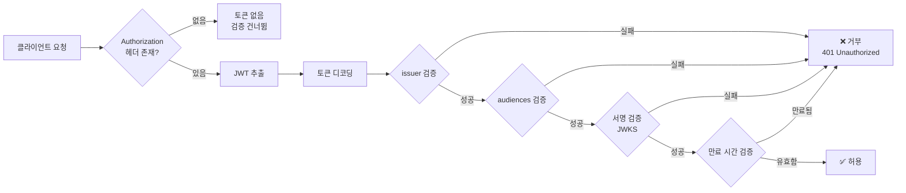
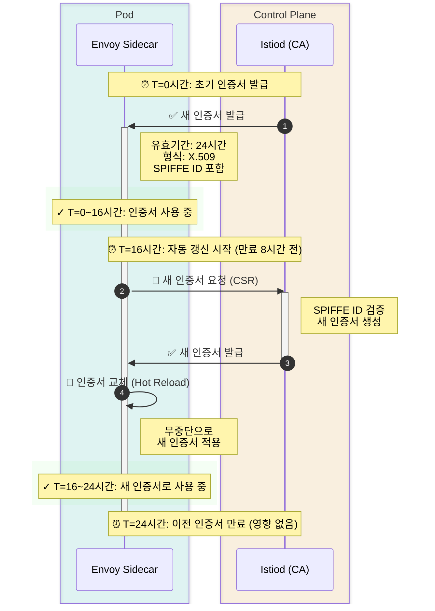

# Security 퀴즈

> **지원 버전**: Istio 1.28.0 **EKS 버전**: 1.34 (Kubernetes 1.28+) **마지막 업데이트**: 2026년 2월 23일

이 퀴즈는 Istio의 보안 기능에 대한 이해도를 테스트합니다.

## 객관식 문제 (1-5번)

### 문제 1: PeerAuthentication 모드

PeerAuthentication의 mTLS 모드 중 **PERMISSIVE**의 특징으로 옳은 것은?

A. mTLS와 평문 트래픽을 모두 허용한다\
B. mTLS만 허용하고 평문은 거부한다\
C. 모든 트래픽을 거부한다\
D. mTLS를 비활성화한다

<details>

<summary>정답 및 해설</summary>

**정답: A**

PERMISSIVE 모드는 **mTLS와 평문 트래픽을 모두 허용**하여 점진적 마이그레이션을 지원합니다.

**해설:**

**PeerAuthentication의 mTLS 모드:**

| 모드             | 설명              | 사용 시나리오           |
| -------------- | --------------- | ----------------- |
| **PERMISSIVE** | mTLS + 평문 모두 허용 | 점진적 마이그레이션, 혼합 환경 |
| **STRICT**     | mTLS만 허용        | 프로덕션 보안 강화        |
| **DISABLE**    | mTLS 비활성화 (평문만) | 디버깅, 레거시 시스템      |

**PERMISSIVE 모드 예제:**

```yaml
apiVersion: security.istio.io/v1beta1
kind: PeerAuthentication
metadata:
  name: default
  namespace: istio-system
spec:
  mtls:
    mode: PERMISSIVE  # mTLS + 평문 모두 허용
```

**동작 방식:**

```
클라이언트 A (Istio Sidecar) → [mTLS] → 서버 (PERMISSIVE)  ✅ 허용
클라이언트 B (No Sidecar)     → [평문] → 서버 (PERMISSIVE)  ✅ 허용
```

**STRICT 모드와 비교:**

```yaml
apiVersion: security.istio.io/v1beta1
kind: PeerAuthentication
metadata:
  name: strict-mtls
  namespace: production
spec:
  mtls:
    mode: STRICT  # mTLS만 허용
```

```
클라이언트 A (Istio Sidecar) → [mTLS] → 서버 (STRICT)  ✅ 허용
클라이언트 B (No Sidecar)     → [평문] → 서버 (STRICT)  ❌ 거부
```

**마이그레이션 전략:**

```
1단계: PERMISSIVE (혼합 트래픽 허용)
  ↓
2단계: 모든 서비스에 Sidecar 주입
  ↓
3단계: STRICT (mTLS 강제)
```

**참고 자료:**

* [PeerAuthentication](https://github.com/Atom-oh/kubernetes-docs/blob/main/ko/service-mesh/istio/security/04-peer-authentication.md)
* [mTLS](../../../service-mesh/istio/security/01-mtls.md)

</details>

***

### 문제 2: AuthorizationPolicy의 action

다음 AuthorizationPolicy 구성의 의미는?

```yaml
apiVersion: security.istio.io/v1beta1
kind: AuthorizationPolicy
metadata:
  name: deny-all
spec:
  {}
```

A. 모든 요청을 허용한다\
B. 모든 요청을 거부한다\
C. 정책을 적용하지 않는다\
D. mTLS만 허용한다

<details>

<summary>정답 및 해설</summary>

**정답: B**

빈 spec을 가진 AuthorizationPolicy는 **모든 요청을 거부**합니다 (deny-by-default).

**해설:**

**AuthorizationPolicy의 기본 동작:**

1. **정책이 없으면**: 모든 요청 허용
2. **빈 spec (예제와 같음)**: 모든 요청 거부
3. **rules가 있으면**: rules에 따라 허용/거부

**Deny-by-default 패턴:**

```yaml
# 1단계: 모든 요청 거부
apiVersion: security.istio.io/v1beta1
kind: AuthorizationPolicy
metadata:
  name: deny-all
  namespace: default
spec: {}  # 빈 spec = 모든 요청 거부

---
# 2단계: 필요한 것만 선택적으로 허용
apiVersion: security.istio.io/v1beta1
kind: AuthorizationPolicy
metadata:
  name: allow-frontend
  namespace: default
spec:
  selector:
    matchLabels:
      app: backend
  action: ALLOW
  rules:
  - from:
    - source:
        principals: ["cluster.local/ns/default/sa/frontend"]
    to:
    - operation:
        methods: ["GET", "POST"]
```

**AuthorizationPolicy의 action 종류:**

| action     | 설명        | 우선순위    |
| ---------- | --------- | ------- |
| **DENY**   | 명시적 거부    | 1 (최우선) |
| **ALLOW**  | 명시적 허용    | 2       |
| **AUDIT**  | 로그만 기록    | 3       |
| **CUSTOM** | 외부 인증 서비스 | 4       |

**평가 순서:**

```
1. DENY 정책 평가 → 매칭되면 즉시 거부
   ↓ (통과)
2. ALLOW 정책 평가 → 매칭되면 허용
   ↓ (매칭 안됨)
3. 기본 동작
   - ALLOW 정책이 하나라도 있으면 → 거부
   - ALLOW 정책이 없으면 → 허용
```

**실전 예제:**

```yaml
# 시나리오: HTTP 메서드 제한
---
# DENY: DELETE 금지
apiVersion: security.istio.io/v1beta1
kind: AuthorizationPolicy
metadata:
  name: deny-delete
spec:
  selector:
    matchLabels:
      app: backend
  action: DENY
  rules:
  - to:
    - operation:
        methods: ["DELETE"]

---
# ALLOW: GET, POST만 허용
apiVersion: security.istio.io/v1beta1
kind: AuthorizationPolicy
metadata:
  name: allow-read-write
spec:
  selector:
    matchLabels:
      app: backend
  action: ALLOW
  rules:
  - from:
    - source:
        principals: ["cluster.local/ns/default/sa/frontend"]
    to:
    - operation:
        methods: ["GET", "POST"]
```

**테스트:**

```bash
# GET 요청 → ALLOW 정책 매칭 → ✅ 허용
curl http://backend/api

# POST 요청 → ALLOW 정책 매칭 → ✅ 허용
curl -X POST http://backend/api

# DELETE 요청 → DENY 정책 매칭 → ❌ 거부
curl -X DELETE http://backend/api

# PUT 요청 → ALLOW 정책 불일치 → ❌ 거부
curl -X PUT http://backend/api
```

**참고 자료:**

* [Authorization Policy](https://github.com/Atom-oh/kubernetes-docs/blob/main/ko/service-mesh/istio/security/02-authorization-policy.md)

</details>

***

### 문제 3: JWT 인증

RequestAuthentication에서 JWT 토큰을 검증할 때 사용하는 필드는?

A. issuer와 audiences\
B. principals와 namespaces\
C. methods와 paths\
D. hosts와 ports

<details>

<summary>정답 및 해설</summary>

**정답: A**

RequestAuthentication은 **issuer**와 **audiences** 필드를 사용하여 JWT 토큰을 검증합니다.

**해설:**

**JWT 토큰 구조:**

```
Header.Payload.Signature

Payload 예시:
{
  "iss": "https://auth.example.com",        # issuer
  "sub": "user@example.com",                # subject
  "aud": ["api.example.com"],               # audiences
  "exp": 1735689600,                        # expiration
  "iat": 1735686000                         # issued at
}
```

**RequestAuthentication 구성:**

```yaml
apiVersion: security.istio.io/v1beta1
kind: RequestAuthentication
metadata:
  name: jwt-auth
  namespace: default
spec:
  selector:
    matchLabels:
      app: backend
  jwtRules:
  - issuer: "https://auth.example.com"      # iss 필드 검증
    jwksUri: "https://auth.example.com/.well-known/jwks.json"
    audiences:
    - "api.example.com"                     # aud 필드 검증
    forwardOriginalToken: true
```

**JWT 검증 프로세스:**



**OIDC 제공자와 통합:**

```yaml
# Google OAuth2 예제
apiVersion: security.istio.io/v1beta1
kind: RequestAuthentication
metadata:
  name: google-jwt
spec:
  jwtRules:
  - issuer: "https://accounts.google.com"
    jwksUri: "https://www.googleapis.com/oauth2/v3/certs"
    audiences:
    - "123456789-abcdefg.apps.googleusercontent.com"

---
# Keycloak 예제
apiVersion: security.istio.io/v1beta1
kind: RequestAuthentication
metadata:
  name: keycloak-jwt
spec:
  jwtRules:
  - issuer: "https://keycloak.example.com/realms/myrealm"
    jwksUri: "https://keycloak.example.com/realms/myrealm/protocol/openid-connect/certs"
    audiences:
    - "myapp"
```

**AuthorizationPolicy와 결합:**

```yaml
# 1. RequestAuthentication: JWT 검증
apiVersion: security.istio.io/v1beta1
kind: RequestAuthentication
metadata:
  name: jwt-auth
spec:
  selector:
    matchLabels:
      app: backend
  jwtRules:
  - issuer: "https://auth.example.com"
    jwksUri: "https://auth.example.com/.well-known/jwks.json"

---
# 2. AuthorizationPolicy: 인증된 요청만 허용
apiVersion: security.istio.io/v1beta1
kind: AuthorizationPolicy
metadata:
  name: require-jwt
spec:
  selector:
    matchLabels:
      app: backend
  action: ALLOW
  rules:
  - from:
    - source:
        requestPrincipals: ["*"]  # JWT 있는 요청만
    to:
    - operation:
        methods: ["GET", "POST"]

---
# 3. AuthorizationPolicy: 특정 issuer만 허용
apiVersion: security.istio.io/v1beta1
kind: AuthorizationPolicy
metadata:
  name: require-specific-issuer
spec:
  selector:
    matchLabels:
      app: backend
  action: ALLOW
  rules:
  - from:
    - source:
        requestPrincipals: ["https://auth.example.com/*"]
```

**테스트:**

```bash
# JWT 없이 요청 → RequestAuthentication은 통과, AuthorizationPolicy에서 거부
curl http://backend/api
# 401 Unauthorized

# 유효한 JWT로 요청
TOKEN="eyJhbGc..."
curl -H "Authorization: Bearer $TOKEN" http://backend/api
# 200 OK
```

**참고 자료:**

* [Request Authentication](https://github.com/Atom-oh/kubernetes-docs/blob/main/ko/service-mesh/istio/security/03-request-authentication.md)

</details>

***

### 문제 4: mTLS 인증서 관리

Istio에서 mTLS 인증서의 기본 유효 기간은?

A. 1시간\
B. 24시간\
C. 7일\
D. 90일

<details>

<summary>정답 및 해설</summary>

**정답: B**

Istio에서 mTLS 인증서의 기본 유효 기간은 **24시간**이며, 자동으로 갱신됩니다.

**해설:**

**Istio 인증서 관리:**

```yaml
# Istiod 구성 (기본값)
apiVersion: install.istio.io/v1alpha1
kind: IstioOperator
spec:
  meshConfig:
    certificates:
    - secretName: dns.example-service-account
      dnsNames:
      - example.com
```

**기본 설정:**

* **인증서 유효 기간**: 24시간 (1일)
* **갱신 시점**: 만료 전 8시간
* **갱신 방식**: 자동 (Istiod가 관리)
* **인증서 형식**: X.509

**인증서 라이프사이클:**



**인증서 확인:**

```bash
# Pod의 mTLS 인증서 확인
istioctl proxy-config secret <pod-name> -o json

# 출력 예시:
{
  "name": "default",
  "tlsCertificate": {
    "certificateChain": {
      "inlineBytes": "LS0tLS1CRU..."
    },
    "privateKey": {
      "inlineBytes": "LS0tLS1CRU..."
    }
  },
  "validationContext": {
    "trustedCa": {
      "inlineBytes": "LS0tLS1CRU..."
    }
  }
}

# 인증서 내용 디코딩
kubectl exec <pod-name> -c istio-proxy -- \
  openssl x509 -text -noout -in /etc/certs/cert-chain.pem

# 출력 예시:
Certificate:
    Validity
        Not Before: Jan 20 00:00:00 2025 GMT
        Not After : Jan 21 00:00:00 2025 GMT  # 24시간 후
    Subject: O=cluster.local
    X509v3 Subject Alternative Name:
        URI:spiffe://cluster.local/ns/default/sa/myapp
```

**유효 기간 커스터마이징:**

```yaml
apiVersion: install.istio.io/v1alpha1
kind: IstioOperator
spec:
  meshConfig:
    # 인증서 유효 기간 변경
    defaultConfig:
      proxyMetadata:
        SECRET_TTL: "48h"  # 48시간으로 연장
```

**인증서 갱신 실패 시나리오:**

```bash
# Istiod 로그 확인
kubectl logs -n istio-system -l app=istiod

# 일반적인 문제:
# 1. Istiod와 Envoy 간 통신 문제
# 2. RBAC 권한 문제
# 3. 네트워크 정책으로 인한 차단

# 수동으로 인증서 갱신 트리거
kubectl delete pod <pod-name>  # Pod 재시작으로 인증서 재발급
```

**SPIFFE ID:**

```
Istio의 mTLS 인증서는 SPIFFE (Secure Production Identity Framework For Everyone) 표준을 따릅니다.

형식: spiffe://<trust-domain>/ns/<namespace>/sa/<service-account>
예시: spiffe://cluster.local/ns/default/sa/frontend
```

**CA 계층 구조:**

```
Root CA (Istiod)
  ├─ Intermediate CA (자동 생성)
  │   ├─ frontend Pod 인증서 (24시간)
  │   ├─ backend Pod 인증서 (24시간)
  │   └─ database Pod 인증서 (24시간)
  └─ ...
```

**외부 CA 통합:**

```yaml
# Cert-Manager로 외부 CA 사용
apiVersion: install.istio.io/v1alpha1
kind: IstioOperator
spec:
  components:
    pilot:
      k8s:
        env:
        - name: EXTERNAL_CA
          value: ISTIOD_RA_KUBERNETES_API
```

**참고 자료:**

* [mTLS](../../../service-mesh/istio/security/01-mtls.md)
* [인증서 관리](../../../service-mesh/istio/03-architecture.md#인증서-관리)

</details>

***

### 문제 5: Service Account 기반 인증

Istio에서 서비스 간 인증에 사용되는 identity는?

A. Pod 이름\
B. Service 이름\
C. Service Account\
D. Namespace 이름

<details>

<summary>정답 및 해설</summary>

**정답: C**

Istio는 **Service Account**를 기반으로 서비스 간 identity를 관리합니다.

**해설:**

**Service Account 기반 Identity:**

```yaml
# 1. Service Account 생성
apiVersion: v1
kind: ServiceAccount
metadata:
  name: frontend
  namespace: default

---
# 2. Deployment에서 Service Account 사용
apiVersion: apps/v1
kind: Deployment
metadata:
  name: frontend
spec:
  template:
    spec:
      serviceAccountName: frontend  # Identity로 사용
      containers:
      - name: frontend
        image: frontend:v1
```

**SPIFFE ID 형식:**

```
spiffe://<trust-domain>/ns/<namespace>/sa/<service-account>

예시:
spiffe://cluster.local/ns/default/sa/frontend
spiffe://cluster.local/ns/production/sa/backend
```

**AuthorizationPolicy에서 Service Account 사용:**

```yaml
apiVersion: security.istio.io/v1beta1
kind: AuthorizationPolicy
metadata:
  name: backend-policy
  namespace: default
spec:
  selector:
    matchLabels:
      app: backend
  action: ALLOW
  rules:
  # frontend Service Account만 허용
  - from:
    - source:
        principals:
        - "cluster.local/ns/default/sa/frontend"
    to:
    - operation:
        methods: ["GET", "POST"]
        paths: ["/api/*"]

  # admin Service Account는 모든 작업 허용
  - from:
    - source:
        principals:
        - "cluster.local/ns/default/sa/admin"
```

**Service Account vs Pod/Service 이름:**

| 항목          | Service Account   | Pod 이름  | Service 이름 |
| ----------- | ----------------- | ------- | ---------- |
| **안정성**     | ✅ 안정적             | ❌ 동적 변경 | ✅ 안정적      |
| **보안**      | ✅ 인증서 기반          | ❌ 신뢰 불가 | ❌ 신뢰 불가    |
| **RBAC 통합** | ✅ Kubernetes RBAC | ❌ 불가능   | ❌ 불가능      |
| **mTLS**    | ✅ 인증서에 포함         | ❌ 포함 안됨 | ❌ 포함 안됨    |

**실전 예제: 3-Tier 애플리케이션:**

```yaml
# Frontend → Backend만 허용
---
apiVersion: v1
kind: ServiceAccount
metadata:
  name: frontend
  namespace: app

---
apiVersion: v1
kind: ServiceAccount
metadata:
  name: backend
  namespace: app

---
apiVersion: v1
kind: ServiceAccount
metadata:
  name: database
  namespace: app

---
# Backend 정책: Frontend만 접근 허용
apiVersion: security.istio.io/v1beta1
kind: AuthorizationPolicy
metadata:
  name: backend-policy
  namespace: app
spec:
  selector:
    matchLabels:
      app: backend
  action: ALLOW
  rules:
  - from:
    - source:
        principals: ["cluster.local/ns/app/sa/frontend"]

---
# Database 정책: Backend만 접근 허용
apiVersion: security.istio.io/v1beta1
kind: AuthorizationPolicy
metadata:
  name: database-policy
  namespace: app
spec:
  selector:
    matchLabels:
      app: database
  action: ALLOW
  rules:
  - from:
    - source:
        principals: ["cluster.local/ns/app/sa/backend"]
```

**Service Account 확인:**

```bash
# Pod의 Service Account 확인
kubectl get pod <pod-name> -o jsonpath='{.spec.serviceAccountName}'

# mTLS 인증서에서 SPIFFE ID 확인
istioctl proxy-config secret <pod-name> -o json | \
  jq -r '.dynamicActiveSecrets[0].secret.tlsCertificate.certificateChain.inlineBytes' | \
  base64 -d | openssl x509 -text -noout | grep URI

# 출력:
# URI:spiffe://cluster.local/ns/default/sa/frontend
```

**Namespace 간 통신:**

```yaml
# Production namespace의 frontend → Staging namespace의 backend 접근
apiVersion: security.istio.io/v1beta1
kind: AuthorizationPolicy
metadata:
  name: backend-policy
  namespace: staging
spec:
  selector:
    matchLabels:
      app: backend
  action: ALLOW
  rules:
  - from:
    - source:
        principals:
        - "cluster.local/ns/production/sa/frontend"
        namespaces:
        - "production"
```

**참고 자료:**

* [mTLS](../../../service-mesh/istio/security/01-mtls.md)
* [Authorization Policy](https://github.com/Atom-oh/kubernetes-docs/blob/main/ko/service-mesh/istio/security/02-authorization-policy.md)

</details>

***

## 주관식 문제 (6-10번)

### 문제 6: Deny-by-default 보안 정책 구현

Kubernetes 클러스터에서 Istio를 사용하여 **deny-by-default** 보안 정책을 구현하는 방법을 단계별로 설명하세요. **필수 리소스**(PeerAuthentication, AuthorizationPolicy)와 **예외 처리** 방법을 포함해야 합니다.

<details>

<summary>예시 답안</summary>

**답변:**

**Deny-by-default 보안 정책 구현:**

***

**1단계: mTLS STRICT 모드 활성화**

모든 서비스 간 통신을 mTLS로 강제합니다:

```yaml
apiVersion: security.istio.io/v1beta1
kind: PeerAuthentication
metadata:
  name: default
  namespace: istio-system
spec:
  mtls:
    mode: STRICT  # mTLS 강제
```

**적용 범위:**

* `istio-system` namespace에 배포 → 전체 메시에 적용
* 특정 namespace에 배포 → 해당 namespace만 적용
* selector 사용 → 특정 workload만 적용

***

**2단계: 모든 트래픽 거부 (Deny-by-default)**

```yaml
apiVersion: security.istio.io/v1beta1
kind: AuthorizationPolicy
metadata:
  name: deny-all
  namespace: default
spec: {}  # 빈 spec = 모든 요청 거부
```

**이 정책 이후:**

* ❌ 모든 inbound 트래픽 거부
* ❌ 서비스 간 통신 불가
* ❌ 외부에서 접근 불가

***

**3단계: 필요한 통신만 선택적 허용**

**예시 1: Frontend → Backend 통신 허용**

```yaml
apiVersion: security.istio.io/v1beta1
kind: AuthorizationPolicy
metadata:
  name: allow-frontend-to-backend
  namespace: default
spec:
  selector:
    matchLabels:
      app: backend  # Backend에 적용
  action: ALLOW
  rules:
  - from:
    - source:
        principals:
        - "cluster.local/ns/default/sa/frontend"  # Frontend만 허용
    to:
    - operation:
        methods: ["GET", "POST"]
        paths: ["/api/*"]
```

**예시 2: Backend → Database 통신 허용**

```yaml
apiVersion: security.istio.io/v1beta1
kind: AuthorizationPolicy
metadata:
  name: allow-backend-to-database
  namespace: default
spec:
  selector:
    matchLabels:
      app: database
  action: ALLOW
  rules:
  - from:
    - source:
        principals:
        - "cluster.local/ns/default/sa/backend"
    to:
    - operation:
        ports: ["5432"]  # PostgreSQL 포트
```

***

**4단계: Ingress Gateway 정책**

외부 트래픽을 허용하려면 Ingress Gateway에도 정책이 필요합니다:

```yaml
# Ingress Gateway로의 트래픽 허용
apiVersion: security.istio.io/v1beta1
kind: AuthorizationPolicy
metadata:
  name: allow-ingress
  namespace: istio-system
spec:
  selector:
    matchLabels:
      istio: ingressgateway
  action: ALLOW
  rules:
  - to:
    - operation:
        ports: ["80", "443"]

---
# Ingress Gateway → Frontend 허용
apiVersion: security.istio.io/v1beta1
kind: AuthorizationPolicy
metadata:
  name: allow-gateway-to-frontend
  namespace: default
spec:
  selector:
    matchLabels:
      app: frontend
  action: ALLOW
  rules:
  - from:
    - source:
        principals:
        - "cluster.local/ns/istio-system/sa/istio-ingressgateway-service-account"
```

***

**5단계: Health Check 및 Readiness Probe 예외 처리**

Kubernetes health check가 차단되지 않도록 예외 처리:

```yaml
apiVersion: security.istio.io/v1beta1
kind: AuthorizationPolicy
metadata:
  name: allow-health-checks
  namespace: default
spec:
  selector:
    matchLabels:
      app: backend
  action: ALLOW
  rules:
  # Kubernetes health check 허용
  - to:
    - operation:
        paths: ["/health", "/ready"]
        methods: ["GET"]
```

또는 PeerAuthentication에서 특정 포트 제외:

```yaml
apiVersion: security.istio.io/v1beta1
kind: PeerAuthentication
metadata:
  name: default
  namespace: default
spec:
  mtls:
    mode: STRICT
  portLevelMtls:
    8080:
      mode: DISABLE  # Health check 포트는 mTLS 비활성화
```

***

**6단계: 모니터링 및 로깅 예외**

Prometheus가 메트릭을 수집할 수 있도록 허용:

```yaml
apiVersion: security.istio.io/v1beta1
kind: AuthorizationPolicy
metadata:
  name: allow-prometheus
  namespace: default
spec:
  action: ALLOW
  rules:
  - from:
    - source:
        namespaces: ["istio-system"]
        principals: ["cluster.local/ns/istio-system/sa/prometheus"]
    to:
    - operation:
        paths: ["/stats/prometheus"]
        methods: ["GET"]
```

***

**완전한 예제: 3-Tier 애플리케이션**

```yaml
# 1. mTLS STRICT
---
apiVersion: security.istio.io/v1beta1
kind: PeerAuthentication
metadata:
  name: default
  namespace: production
spec:
  mtls:
    mode: STRICT

# 2. Deny-by-default
---
apiVersion: security.istio.io/v1beta1
kind: AuthorizationPolicy
metadata:
  name: deny-all
  namespace: production
spec: {}

# 3. Ingress → Frontend
---
apiVersion: security.istio.io/v1beta1
kind: AuthorizationPolicy
metadata:
  name: allow-ingress-to-frontend
  namespace: production
spec:
  selector:
    matchLabels:
      app: frontend
  action: ALLOW
  rules:
  - from:
    - source:
        principals: ["cluster.local/ns/istio-system/sa/istio-ingressgateway-service-account"]

# 4. Frontend → Backend
---
apiVersion: security.istio.io/v1beta1
kind: AuthorizationPolicy
metadata:
  name: allow-frontend-to-backend
  namespace: production
spec:
  selector:
    matchLabels:
      app: backend
  action: ALLOW
  rules:
  - from:
    - source:
        principals: ["cluster.local/ns/production/sa/frontend"]
    to:
    - operation:
        methods: ["GET", "POST", "PUT", "DELETE"]
        paths: ["/api/*"]

# 5. Backend → Database
---
apiVersion: security.istio.io/v1beta1
kind: AuthorizationPolicy
metadata:
  name: allow-backend-to-database
  namespace: production
spec:
  selector:
    matchLabels:
      app: database
  action: ALLOW
  rules:
  - from:
    - source:
        principals: ["cluster.local/ns/production/sa/backend"]

# 6. Health Checks
---
apiVersion: security.istio.io/v1beta1
kind: AuthorizationPolicy
metadata:
  name: allow-health-checks
  namespace: production
spec:
  action: ALLOW
  rules:
  - to:
    - operation:
        paths: ["/health", "/ready", "/live"]

# 7. Prometheus 메트릭
---
apiVersion: security.istio.io/v1beta1
kind: AuthorizationPolicy
metadata:
  name: allow-prometheus
  namespace: production
spec:
  action: ALLOW
  rules:
  - from:
    - source:
        namespaces: ["istio-system"]
    to:
    - operation:
        paths: ["/stats/prometheus"]
```

***

**테스트 및 검증:**

```bash
# 1. Frontend → Backend (허용됨)
kubectl exec -it <frontend-pod> -- curl http://backend/api
# 200 OK

# 2. 직접 Database 접근 (거부됨)
kubectl exec -it <frontend-pod> -- curl http://database:5432
# 403 RBAC: access denied

# 3. 외부에서 Backend 직접 접근 (거부됨)
curl http://<ingress-gateway>/backend
# 403 RBAC: access denied

# 4. 정상 경로 (허용됨)
curl http://<ingress-gateway>/frontend
# 200 OK
```

***

**모범 사례:**

1. **점진적 적용**:
   * 먼저 PERMISSIVE 모드로 mTLS 활성화
   * 모든 서비스에 Sidecar 주입 확인
   * STRICT 모드로 전환
   * Deny-by-default 정책 적용
2. **최소 권한 원칙**:
   * 필요한 최소한의 통신만 허용
   * HTTP 메서드 제한 (GET만, POST만 등)
   * 경로 제한 (/api/\*만 등)
3. **예외 처리**:
   * Health check는 반드시 예외 처리
   * 모니터링 시스템 접근 허용
   * Ingress Gateway 정책 설정
4. **테스트**:
   * 각 정책 적용 후 테스트
   * 부작용 확인 (로그, 메트릭)
   * 롤백 계획 준비

**참고 자료:**

* [Authorization Policy](https://github.com/Atom-oh/kubernetes-docs/blob/main/ko/service-mesh/istio/security/02-authorization-policy.md)
* [PeerAuthentication](https://github.com/Atom-oh/kubernetes-docs/blob/main/ko/service-mesh/istio/security/04-peer-authentication.md)

</details>

***

### 문제 7: JWT + mTLS 이중 인증

Istio에서 \*\*최종 사용자 인증(JWT)\*\*과 \*\*서비스 간 인증(mTLS)\*\*을 함께 사용하는 시나리오를 구현하세요. OAuth2/OIDC 제공자(예: Keycloak)와 통합하는 방법을 포함해야 합니다.

<details>

<summary>예시 답안</summary>

**답변:**

**JWT + mTLS 이중 인증 아키텍처:**

```
사용자
  ↓ (JWT 토큰)
Ingress Gateway (RequestAuthentication으로 JWT 검증)
  ↓ (mTLS)
Frontend (PeerAuthentication으로 mTLS 검증)
  ↓ (mTLS)
Backend
```

***

**1단계: Keycloak 설정**

```bash
# Keycloak Realm 생성
Realm: myrealm

# Client 생성
Client ID: myapp
Access Type: confidential
Valid Redirect URIs: http://myapp.example.com/*

# JWKS URI 확인
https://keycloak.example.com/realms/myrealm/protocol/openid-connect/certs
```

***

**2단계: mTLS 활성화 (서비스 간 인증)**

```yaml
# 전체 메시에 STRICT mTLS 적용
apiVersion: security.istio.io/v1beta1
kind: PeerAuthentication
metadata:
  name: default
  namespace: istio-system
spec:
  mtls:
    mode: STRICT
```

***

**3단계: JWT 인증 설정 (최종 사용자 인증)**

```yaml
# Ingress Gateway에서 JWT 검증
apiVersion: security.istio.io/v1beta1
kind: RequestAuthentication
metadata:
  name: jwt-ingress
  namespace: istio-system
spec:
  selector:
    matchLabels:
      istio: ingressgateway
  jwtRules:
  - issuer: "https://keycloak.example.com/realms/myrealm"
    jwksUri: "https://keycloak.example.com/realms/myrealm/protocol/openid-connect/certs"
    audiences:
    - "myapp"
    forwardOriginalToken: true  # JWT를 백엔드로 전달
    outputPayloadToHeader: "x-jwt-payload"  # Payload를 헤더로 추출
```

***

**4단계: AuthorizationPolicy 설정**

**Ingress Gateway 정책**

```yaml
apiVersion: security.istio.io/v1beta1
kind: AuthorizationPolicy
metadata:
  name: ingress-jwt-policy
  namespace: istio-system
spec:
  selector:
    matchLabels:
      istio: ingressgateway
  action: ALLOW
  rules:
  # JWT 있는 요청만 허용
  - from:
    - source:
        requestPrincipals: ["*"]
    to:
    - operation:
        paths: ["/api/*", "/app/*"]

  # Health check는 JWT 없이 허용
  - to:
    - operation:
        paths: ["/health", "/ready"]
```

**Backend 정책**

```yaml
apiVersion: security.istio.io/v1beta1
kind: AuthorizationPolicy
metadata:
  name: backend-jwt-mtls-policy
  namespace: default
spec:
  selector:
    matchLabels:
      app: backend
  action: ALLOW
  rules:
  # 1. mTLS: Frontend Service Account만 허용
  # 2. JWT: 유효한 JWT 있어야 함
  - from:
    - source:
        principals: ["cluster.local/ns/default/sa/frontend"]
        requestPrincipals: ["https://keycloak.example.com/realms/myrealm/*"]
    to:
    - operation:
        methods: ["GET", "POST"]
```

***

**5단계: Role 기반 접근 제어**

JWT claims 기반으로 세밀한 권한 제어:

```yaml
apiVersion: security.istio.io/v1beta1
kind: AuthorizationPolicy
metadata:
  name: backend-rbac
  namespace: default
spec:
  selector:
    matchLabels:
      app: backend
  action: ALLOW
  rules:
  # Admin role만 DELETE 허용
  - from:
    - source:
        principals: ["cluster.local/ns/default/sa/frontend"]
        requestPrincipals: ["*"]
    when:
    - key: request.auth.claims[roles]
      values: ["admin"]
    to:
    - operation:
        methods: ["DELETE"]
        paths: ["/api/admin/*"]

  # User role은 GET, POST만 허용
  - from:
    - source:
        principals: ["cluster.local/ns/default/sa/frontend"]
        requestPrincipals: ["*"]
    when:
    - key: request.auth.claims[roles]
      values: ["user"]
    to:
    - operation:
        methods: ["GET", "POST"]
        paths: ["/api/users/*"]
```

***

**6단계: JWT Payload 활용**

Backend에서 JWT payload 사용:

```yaml
# Envoy Filter로 JWT claim을 헤더로 전달
apiVersion: networking.istio.io/v1alpha3
kind: EnvoyFilter
metadata:
  name: jwt-claim-to-header
  namespace: istio-system
spec:
  workloadSelector:
    labels:
      istio: ingressgateway
  configPatches:
  - applyTo: HTTP_FILTER
    match:
      context: GATEWAY
      listener:
        filterChain:
          filter:
            name: "envoy.filters.network.http_connection_manager"
            subFilter:
              name: "envoy.filters.http.jwt_authn"
    patch:
      operation: INSERT_AFTER
      value:
        name: envoy.lua
        typed_config:
          "@type": type.googleapis.com/envoy.extensions.filters.http.lua.v3.Lua
          inline_code: |
            function envoy_on_request(request_handle)
              local payload = request_handle:headers():get("x-jwt-payload")
              if payload then
                -- Base64 디코딩 및 JSON 파싱
                local json = require("json")
                local decoded = json.decode(payload)

                -- 사용자 정보를 헤더로 전달
                request_handle:headers():add("x-user-id", decoded.sub)
                request_handle:headers():add("x-user-email", decoded.email)
                request_handle:headers():add("x-user-roles", table.concat(decoded.roles, ","))
              end
            end
```

***

**7단계: 완전한 예제**

**Ingress Gateway**

```yaml
---
# JWT 검증
apiVersion: security.istio.io/v1beta1
kind: RequestAuthentication
metadata:
  name: jwt-ingress
  namespace: istio-system
spec:
  selector:
    matchLabels:
      istio: ingressgateway
  jwtRules:
  - issuer: "https://keycloak.example.com/realms/myrealm"
    jwksUri: "https://keycloak.example.com/realms/myrealm/protocol/openid-connect/certs"
    audiences: ["myapp"]
    forwardOriginalToken: true

---
# JWT 필수
apiVersion: security.istio.io/v1beta1
kind: AuthorizationPolicy
metadata:
  name: require-jwt
  namespace: istio-system
spec:
  selector:
    matchLabels:
      istio: ingressgateway
  action: ALLOW
  rules:
  - from:
    - source:
        requestPrincipals: ["*"]
```

**Frontend**

```yaml
---
# mTLS STRICT
apiVersion: security.istio.io/v1beta1
kind: PeerAuthentication
metadata:
  name: frontend-mtls
  namespace: default
spec:
  selector:
    matchLabels:
      app: frontend
  mtls:
    mode: STRICT

---
# Ingress Gateway만 접근 허용
apiVersion: security.istio.io/v1beta1
kind: AuthorizationPolicy
metadata:
  name: frontend-policy
  namespace: default
spec:
  selector:
    matchLabels:
      app: frontend
  action: ALLOW
  rules:
  - from:
    - source:
        principals: ["cluster.local/ns/istio-system/sa/istio-ingressgateway-service-account"]
        requestPrincipals: ["*"]
```

**Backend**

```yaml
---
# mTLS STRICT
apiVersion: security.istio.io/v1beta1
kind: PeerAuthentication
metadata:
  name: backend-mtls
  namespace: default
spec:
  selector:
    matchLabels:
      app: backend
  mtls:
    mode: STRICT

---
# Frontend만 접근 허용 + JWT 필수
apiVersion: security.istio.io/v1beta1
kind: AuthorizationPolicy
metadata:
  name: backend-policy
  namespace: default
spec:
  selector:
    matchLabels:
      app: backend
  action: ALLOW
  rules:
  - from:
    - source:
        principals: ["cluster.local/ns/default/sa/frontend"]
        requestPrincipals: ["https://keycloak.example.com/realms/myrealm/*"]
```

***

**테스트:**

```bash
# 1. Keycloak에서 토큰 획득
TOKEN=$(curl -X POST \
  "https://keycloak.example.com/realms/myrealm/protocol/openid-connect/token" \
  -d "client_id=myapp" \
  -d "client_secret=<secret>" \
  -d "grant_type=password" \
  -d "username=user@example.com" \
  -d "password=password123" \
  | jq -r '.access_token')

# 2. JWT로 API 호출
curl -H "Authorization: Bearer $TOKEN" \
  http://myapp.example.com/api/users

# 3. JWT 없이 호출 (실패)
curl http://myapp.example.com/api/users
# 401 Unauthorized

# 4. 유효하지 않은 JWT (실패)
curl -H "Authorization: Bearer invalid-token" \
  http://myapp.example.com/api/users
# 401 Unauthorized
```

***

**보안 이점:**

1. **이중 인증**:
   * JWT: 최종 사용자 신원 확인
   * mTLS: 서비스 간 신원 확인
2. **깊은 방어 (Defense in Depth)**:
   * Gateway에서 JWT 검증
   * 서비스 간 mTLS로 통신 암호화
   * AuthorizationPolicy로 세밀한 권한 제어
3. **역할 기반 접근 제어 (RBAC)**:
   * JWT claims 기반 권한 관리
   * 동적 권한 업데이트 (Keycloak에서 관리)

**참고 자료:**

* [Request Authentication](https://github.com/Atom-oh/kubernetes-docs/blob/main/ko/service-mesh/istio/security/03-request-authentication.md)
* [mTLS](../../../service-mesh/istio/security/01-mtls.md)

</details>

***

### 문제 8: 외부 서비스 접근 제어

Istio에서 **Egress 트래픽**을 제어하여 특정 외부 서비스만 접근을 허용하는 방법을 설명하세요. **ServiceEntry**, **VirtualService**, **AuthorizationPolicy**를 사용한 완전한 예제를 포함해야 합니다.

<details>

<summary>예시 답안</summary>

**답변:**

**Egress 트래픽 제어 전략:**

***

**1단계: Egress 트래픽 기본 모드 확인**

Istio는 두 가지 egress 모드를 지원합니다:

```yaml
apiVersion: install.istio.io/v1alpha1
kind: IstioOperator
spec:
  meshConfig:
    outboundTrafficPolicy:
      mode: REGISTRY_ONLY  # 또는 ALLOW_ANY
```

**모드 비교:**

| 모드                 | 설명                        | 보안    |
| ------------------ | ------------------------- | ----- |
| **ALLOW\_ANY**     | 모든 외부 트래픽 허용 (기본값)        | ⚠️ 낮음 |
| **REGISTRY\_ONLY** | ServiceEntry에 등록된 서비스만 허용 | ✅ 높음  |

**REGISTRY\_ONLY 모드로 변경:**

```bash
istioctl install --set meshConfig.outboundTrafficPolicy.mode=REGISTRY_ONLY
```

***

**2단계: ServiceEntry로 외부 서비스 등록**

**예제 1: HTTPS API (GitHub)**

```yaml
apiVersion: networking.istio.io/v1beta1
kind: ServiceEntry
metadata:
  name: github-api
  namespace: default
spec:
  hosts:
  - api.github.com
  ports:
  - number: 443
    name: https
    protocol: HTTPS
  location: MESH_EXTERNAL
  resolution: DNS
```

**예제 2: HTTP API (httpbin)**

```yaml
apiVersion: networking.istio.io/v1beta1
kind: ServiceEntry
metadata:
  name: httpbin-ext
  namespace: default
spec:
  hosts:
  - httpbin.org
  ports:
  - number: 80
    name: http
    protocol: HTTP
  - number: 443
    name: https
    protocol: HTTPS
  location: MESH_EXTERNAL
  resolution: DNS
```

**예제 3: 특정 IP 주소**

```yaml
apiVersion: networking.istio.io/v1beta1
kind: ServiceEntry
metadata:
  name: external-database
  namespace: default
spec:
  hosts:
  - database.external.com
  addresses:
  - 203.0.113.10  # 특정 IP
  ports:
  - number: 5432
    name: postgres
    protocol: TCP
  location: MESH_EXTERNAL
  resolution: STATIC
  endpoints:
  - address: 203.0.113.10
```

***

**3단계: VirtualService로 트래픽 제어**

**타임아웃 및 재시도 설정**

```yaml
apiVersion: networking.istio.io/v1beta1
kind: VirtualService
metadata:
  name: github-api-vs
  namespace: default
spec:
  hosts:
  - api.github.com
  http:
  - timeout: 10s
    retries:
      attempts: 3
      perTryTimeout: 3s
      retryOn: 5xx,reset,connect-failure
    route:
    - destination:
        host: api.github.com
```

**헤더 추가 (API Key)**

```yaml
apiVersion: networking.istio.io/v1beta1
kind: VirtualService
metadata:
  name: external-api-vs
  namespace: default
spec:
  hosts:
  - api.example.com
  http:
  - headers:
      request:
        add:
          X-API-Key: "my-secret-key"
    route:
    - destination:
        host: api.example.com
```

***

**4단계: AuthorizationPolicy로 접근 제어**

**특정 Service Account만 허용**

```yaml
apiVersion: security.istio.io/v1beta1
kind: AuthorizationPolicy
metadata:
  name: allow-github-api
  namespace: default
spec:
  action: ALLOW
  rules:
  # Backend Service Account만 GitHub API 접근 허용
  - from:
    - source:
        principals: ["cluster.local/ns/default/sa/backend"]
    to:
    - operation:
        hosts: ["api.github.com"]
```

**특정 경로만 허용**

```yaml
apiVersion: security.istio.io/v1beta1
kind: AuthorizationPolicy
metadata:
  name: allow-specific-api
  namespace: default
spec:
  action: ALLOW
  rules:
  - from:
    - source:
        principals: ["cluster.local/ns/default/sa/backend"]
    to:
    - operation:
        hosts: ["api.example.com"]
        paths: ["/v1/data", "/v1/status"]
        methods: ["GET"]
```

***

**5단계: Egress Gateway 사용 (선택사항)**

중앙 집중식 egress 제어:

```yaml
# Egress Gateway 배포
apiVersion: install.istio.io/v1alpha1
kind: IstioOperator
spec:
  components:
    egressGateways:
    - name: istio-egressgateway
      enabled: true
      k8s:
        replicas: 2

---
# Gateway 정의
apiVersion: networking.istio.io/v1beta1
kind: Gateway
metadata:
  name: egress-gateway
  namespace: default
spec:
  selector:
    istio: egressgateway
  servers:
  - port:
      number: 443
      name: https
      protocol: HTTPS
    hosts:
    - api.github.com
    tls:
      mode: PASSTHROUGH  # TLS 트래픽을 그대로 통과

---
# DestinationRule
apiVersion: networking.istio.io/v1beta1
kind: DestinationRule
metadata:
  name: egress-gateway-dr
  namespace: default
spec:
  host: istio-egressgateway.istio-system.svc.cluster.local
  subsets:
  - name: github

---
# VirtualService: Pod → Egress Gateway
apiVersion: networking.istio.io/v1beta1
kind: VirtualService
metadata:
  name: github-through-egress
  namespace: default
spec:
  hosts:
  - api.github.com
  gateways:
  - mesh  # Sidecar에서
  - egress-gateway
  http:
  - match:
    - gateways:
      - mesh  # Pod에서 시작
      port: 443
    route:
    - destination:
        host: istio-egressgateway.istio-system.svc.cluster.local
        subset: github
        port:
          number: 443
  - match:
    - gateways:
      - egress-gateway  # Egress Gateway에서
      port: 443
    route:
    - destination:
        host: api.github.com
        port:
          number: 443
```

**트래픽 흐름:**

```
Pod → Sidecar → Egress Gateway → 외부 서비스
```

***

**6단계: 완전한 예제**

**시나리오**: Backend 서비스만 GitHub API에 접근 허용

```yaml
# 1. REGISTRY_ONLY 모드 설정
---
apiVersion: v1
kind: ConfigMap
metadata:
  name: istio
  namespace: istio-system
data:
  mesh: |
    outboundTrafficPolicy:
      mode: REGISTRY_ONLY

# 2. GitHub API ServiceEntry
---
apiVersion: networking.istio.io/v1beta1
kind: ServiceEntry
metadata:
  name: github-api
  namespace: default
spec:
  hosts:
  - api.github.com
  ports:
  - number: 443
    name: https
    protocol: HTTPS
  location: MESH_EXTERNAL
  resolution: DNS

# 3. VirtualService: 타임아웃 및 재시도
---
apiVersion: networking.istio.io/v1beta1
kind: VirtualService
metadata:
  name: github-api-vs
  namespace: default
spec:
  hosts:
  - api.github.com
  http:
  - timeout: 30s
    retries:
      attempts: 3
      perTryTimeout: 10s
      retryOn: 5xx,reset,connect-failure
    route:
    - destination:
        host: api.github.com
        port:
          number: 443

# 4. AuthorizationPolicy: Backend만 허용
---
apiVersion: security.istio.io/v1beta1
kind: AuthorizationPolicy
metadata:
  name: allow-backend-github
  namespace: default
spec:
  action: ALLOW
  rules:
  - from:
    - source:
        principals: ["cluster.local/ns/default/sa/backend"]
    to:
    - operation:
        hosts: ["api.github.com"]
        methods: ["GET", "POST"]

# 5. Deny-by-default (다른 모든 egress 차단)
---
apiVersion: security.istio.io/v1beta1
kind: AuthorizationPolicy
metadata:
  name: deny-all-egress
  namespace: default
spec:
  action: DENY
  rules:
  - to:
    - operation:
        hosts: ["*"]
```

***

**테스트:**

```bash
# 1. Backend에서 GitHub API 호출 (허용됨)
kubectl exec -it <backend-pod> -- \
  curl -I https://api.github.com/users/octocat
# 200 OK

# 2. Frontend에서 GitHub API 호출 (거부됨)
kubectl exec -it <frontend-pod> -- \
  curl -I https://api.github.com/users/octocat
# Connection refused

# 3. Backend에서 다른 외부 서비스 호출 (거부됨)
kubectl exec -it <backend-pod> -- \
  curl -I https://google.com
# Connection refused (ServiceEntry 없음)
```

***

**모니터링:**

```bash
# Egress 트래픽 확인
kubectl exec -it <backend-pod> -c istio-proxy -- \
  curl localhost:15000/stats/prometheus | grep upstream_cx_total

# ServiceEntry 확인
istioctl proxy-config clusters <backend-pod> | grep github
```

***

**보안 이점:**

1. **화이트리스트 방식**: ServiceEntry에 등록된 서비스만 접근
2. **Service Account 기반 제어**: 특정 서비스만 외부 API 호출 가능
3. **감사 및 로깅**: 모든 egress 트래픽 로깅 가능
4. **중앙 집중식 관리**: Egress Gateway로 모든 외부 트래픽 모니터링

**참고 자료:**

* [ServiceEntry](https://istio.io/latest/docs/reference/config/networking/service-entry/)
* [Egress Traffic](https://istio.io/latest/docs/tasks/traffic-management/egress/)

</details>

***

### 문제 9: 보안 감사 및 로깅

Istio에서 보안 관련 이벤트를 \*\*감사(Audit)\*\*하고 로깅하는 방법을 설명하세요. **AuthorizationPolicy의 AUDIT action**과 **Access Log** 구성을 포함해야 합니다.

<details>

<summary>예시 답안</summary>

**답변:**

**Istio 보안 감사 및 로깅 전략:**

***

**1. AuthorizationPolicy AUDIT Action**

AUDIT action은 트래픽을 차단하지 않고 로그만 기록합니다.

**기본 AUDIT 정책**

```yaml
apiVersion: security.istio.io/v1beta1
kind: AuthorizationPolicy
metadata:
  name: audit-all-requests
  namespace: default
spec:
  selector:
    matchLabels:
      app: backend
  action: AUDIT
  rules:
  - {}  # 모든 요청 감사
```

**특정 조건만 감사**

```yaml
apiVersion: security.istio.io/v1beta1
kind: AuthorizationPolicy
metadata:
  name: audit-sensitive-operations
  namespace: default
spec:
  selector:
    matchLabels:
      app: backend
  action: AUDIT
  rules:
  # DELETE 작업 감사
  - to:
    - operation:
        methods: ["DELETE"]

  # Admin API 접근 감사
  - to:
    - operation:
        paths: ["/api/admin/*"]

  # 외부 IP 접근 감사
  - from:
    - source:
        notNamespaces: ["default", "production"]
```

***

**2. Access Log 활성화**

**전체 메시에 Access Log 활성화**

```yaml
apiVersion: install.istio.io/v1alpha1
kind: IstioOperator
spec:
  meshConfig:
    accessLogFile: /dev/stdout
    accessLogEncoding: JSON
    accessLogFormat: |
      {
        "start_time": "%START_TIME%",
        "method": "%REQ(:METHOD)%",
        "path": "%REQ(X-ENVOY-ORIGINAL-PATH?:PATH)%",
        "protocol": "%PROTOCOL%",
        "response_code": "%RESPONSE_CODE%",
        "response_flags": "%RESPONSE_FLAGS%",
        "bytes_received": "%BYTES_RECEIVED%",
        "bytes_sent": "%BYTES_SENT%",
        "duration": "%DURATION%",
        "upstream_service_time": "%RESP(X-ENVOY-UPSTREAM-SERVICE-TIME)%",
        "x_forwarded_for": "%REQ(X-FORWARDED-FOR)%",
        "user_agent": "%REQ(USER-AGENT)%",
        "request_id": "%REQ(X-REQUEST-ID)%",
        "authority": "%REQ(:AUTHORITY)%",
        "upstream_host": "%UPSTREAM_HOST%",
        "upstream_cluster": "%UPSTREAM_CLUSTER%",
        "upstream_local_address": "%UPSTREAM_LOCAL_ADDRESS%",
        "downstream_local_address": "%DOWNSTREAM_LOCAL_ADDRESS%",
        "downstream_remote_address": "%DOWNSTREAM_REMOTE_ADDRESS%",
        "requested_server_name": "%REQUESTED_SERVER_NAME%",
        "route_name": "%ROUTE_NAME%"
      }
```

**특정 Namespace에만 적용**

```yaml
apiVersion: telemetry.istio.io/v1alpha1
kind: Telemetry
metadata:
  name: access-logging
  namespace: production
spec:
  accessLogging:
  - providers:
    - name: envoy
```

***

**3. 보안 감사를 위한 커스텀 로그 필터**

**mTLS 정보 포함**

```yaml
apiVersion: install.istio.io/v1alpha1
kind: IstioOperator
spec:
  meshConfig:
    accessLogFile: /dev/stdout
    accessLogFormat: |
      [%START_TIME%] "%REQ(:METHOD)% %REQ(X-ENVOY-ORIGINAL-PATH?:PATH)% %PROTOCOL%"
      %RESPONSE_CODE% %RESPONSE_FLAGS%
      %BYTES_RECEIVED% %BYTES_SENT% %DURATION%
      "%REQ(X-FORWARDED-FOR)%" "%REQ(USER-AGENT)%"
      "%REQ(X-REQUEST-ID)%" "%REQ(:AUTHORITY)%"
      "%UPSTREAM_HOST%" "%DOWNSTREAM_REMOTE_ADDRESS%"
      mtls=%DOWNSTREAM_PEER_ISSUER% peer=%DOWNSTREAM_PEER_URI_SAN%
```

**Authorization 정보 포함**

```yaml
apiVersion: telemetry.istio.io/v1alpha1
kind: Telemetry
metadata:
  name: security-audit-logging
  namespace: default
spec:
  accessLogging:
  - providers:
    - name: envoy
    filter:
      expression: response.code >= 400  # 에러만 로깅
```

***

**4. 외부 로깅 시스템 통합**

**FluentBit으로 CloudWatch 전송**

```yaml
apiVersion: v1
kind: ConfigMap
metadata:
  name: fluent-bit-config
  namespace: istio-system
data:
  fluent-bit.conf: |
    [SERVICE]
        Flush         5
        Log_Level     info

    [INPUT]
        Name              tail
        Path              /var/log/containers/*istio-proxy*.log
        Parser            docker
        Tag               istio.proxy
        Refresh_Interval  5

    [FILTER]
        Name    parser
        Match   istio.proxy
        Parser  istio-access-log

    [OUTPUT]
        Name cloudwatch_logs
        Match   istio.proxy
        region  us-east-1
        log_group_name  /aws/eks/istio/access-logs
        log_stream_prefix proxy-
        auto_create_group true
```

**Elasticsearch 통합**

```yaml
apiVersion: telemetry.istio.io/v1alpha1
kind: Telemetry
metadata:
  name: elasticsearch-logging
  namespace: default
spec:
  accessLogging:
  - providers:
    - name: envoy
    filter:
      expression: |
        response.code >= 400 ||
        request.headers['x-audit'] == 'true'
```

***

**5. 완전한 보안 감사 구성**

```yaml
# 1. AUDIT Policy: 민감한 작업 감사
---
apiVersion: security.istio.io/v1beta1
kind: AuthorizationPolicy
metadata:
  name: audit-sensitive
  namespace: production
spec:
  selector:
    matchLabels:
      app: backend
  action: AUDIT
  rules:
  # DELETE 작업
  - to:
    - operation:
        methods: ["DELETE"]

  # Admin API
  - to:
    - operation:
        paths: ["/api/admin/*"]

  # Production 외부 접근
  - from:
    - source:
        notNamespaces: ["production"]

# 2. DENY Policy: 실제 차단
---
apiVersion: security.istio.io/v1beta1
kind: AuthorizationPolicy
metadata:
  name: deny-unauthorized
  namespace: production
spec:
  selector:
    matchLabels:
      app: backend
  action: DENY
  rules:
  # Production 외부에서 admin 접근 차단
  - from:
    - source:
        notNamespaces: ["production"]
    to:
    - operation:
        paths: ["/api/admin/*"]

# 3. Access Logging: JSON 형식
---
apiVersion: telemetry.istio.io/v1alpha1
kind: Telemetry
metadata:
  name: security-logging
  namespace: production
spec:
  accessLogging:
  - providers:
    - name: envoy
    filter:
      expression: |
        response.code >= 400 ||
        request.method == "DELETE" ||
        request.url_path.startsWith("/api/admin")
```

***

**6. 로그 분석 쿼리**

**Prometheus 쿼리**

```promql
# Authorization 거부 횟수
sum(rate(
  envoy_http_rbac_denied_total[5m]
)) by (namespace, pod)

# AUDIT action이 트리거된 횟수
sum(rate(
  envoy_http_rbac_logged_total[5m]
)) by (namespace, pod)

# 403 Forbidden 응답
sum(rate(
  istio_requests_total{
    response_code="403"
  }[5m]
)) by (destination_service_name)
```

**CloudWatch Insights 쿼리**

```sql
# DELETE 작업 감사
fields @timestamp, method, path, response_code, downstream_remote_address
| filter method = "DELETE"
| sort @timestamp desc
| limit 100

# Admin API 접근
fields @timestamp, path, response_code, downstream_remote_address, user_agent
| filter path like /api/admin/
| sort @timestamp desc

# 실패한 Authorization
fields @timestamp, path, response_code, response_flags
| filter response_code = 403
| stats count() by bin(5m)
```

***

**7. Grafana 대시보드**

```yaml
# 패널 1: Authorization 거부율
rate(envoy_http_rbac_denied_total[5m])

# 패널 2: AUDIT 로그 트렌드
rate(envoy_http_rbac_logged_total[5m])

# 패널 3: 403 응답 분포
sum by (destination_service_name) (
  rate(istio_requests_total{response_code="403"}[5m])
)

# 패널 4: 민감한 작업 (DELETE)
sum by (destination_service_name) (
  rate(istio_requests_total{request_method="DELETE"}[5m])
)
```

***

**8. 알림 설정**

```yaml
# PrometheusRule
apiVersion: monitoring.coreos.com/v1
kind: PrometheusRule
metadata:
  name: istio-security-alerts
  namespace: monitoring
spec:
  groups:
  - name: istio-security
    interval: 30s
    rules:
    # 높은 Authorization 거부율
    - alert: HighAuthorizationDenyRate
      expr: |
        sum(rate(envoy_http_rbac_denied_total[5m])) by (namespace)
        > 10
      for: 5m
      labels:
        severity: warning
      annotations:
        summary: "High authorization deny rate in {{ $labels.namespace }}"
        description: "{{ $value }} denials per second"

    # Admin API 무단 접근 시도
    - alert: UnauthorizedAdminAccess
      expr: |
        sum(rate(istio_requests_total{
          request_url_path=~"/api/admin/.*",
          response_code="403"
        }[5m])) > 0
      for: 1m
      labels:
        severity: critical
      annotations:
        summary: "Unauthorized admin API access attempt"
```

***

**모범 사례:**

1. **AUDIT 먼저, DENY 나중에**:
   * 새 정책은 AUDIT로 시작
   * 로그 분석 후 DENY로 전환
2. **선택적 로깅**:
   * 모든 트래픽 로깅은 비용 증가
   * 민감한 작업만 로깅
3. **로그 보존**:
   * 보안 감사: 최소 90일
   * 규정 준수: 1년 이상
4. **실시간 알림**:
   * 무단 접근 시도 즉시 알림
   * 비정상 패턴 탐지

**참고 자료:**

* [Authorization Policy](https://github.com/Atom-oh/kubernetes-docs/blob/main/ko/service-mesh/istio/security/02-authorization-policy.md)
* [Access Logging](../../../service-mesh/istio/observability/03-logging.md)

</details>

***

### 문제 10: Zero Trust 네트워크 구현

Istio를 사용하여 **Zero Trust 네트워크** 원칙을 구현하는 방법을 설명하세요. **mTLS STRICT**, **deny-by-default**, **least privilege** 원칙을 적용한 완전한 예제를 포함해야 합니다.

<details>

<summary>예시 답안</summary>

**답변:**

**Zero Trust 네트워크 원칙:**

1. **Never Trust, Always Verify**: 모든 통신을 검증
2. **Least Privilege**: 최소 권한만 부여
3. **Assume Breach**: 침해를 가정하고 설계

***

**Istio Zero Trust 아키텍처:**

```yaml
# 1. mTLS STRICT (암호화된 통신만 허용)
# 2. Deny-by-default (모든 트래픽 기본 거부)
# 3. Explicit Allow (필요한 통신만 명시적 허용)
# 4. Identity-based (Service Account 기반)
# 5. Fine-grained (경로/메서드 수준 제어)
```

***

**1단계: mTLS STRICT 모드**

모든 서비스 간 통신을 암호화:

```yaml
apiVersion: security.istio.io/v1beta1
kind: PeerAuthentication
metadata:
  name: default
  namespace: istio-system
spec:
  mtls:
    mode: STRICT
```

**검증:**

```bash
# mTLS 상태 확인
istioctl authn tls-check <pod-name>.<namespace>

# 출력:
# HOST:PORT                            STATUS     SERVER     CLIENT     AUTHN POLICY
# backend.default.svc.cluster.local    OK         mTLS       mTLS       default/default
```

***

**2단계: Deny-by-default 정책**

**전역 Deny 정책**

```yaml
# 모든 Namespace에 적용
---
apiVersion: security.istio.io/v1beta1
kind: AuthorizationPolicy
metadata:
  name: deny-all
  namespace: default
spec: {}

---
apiVersion: security.istio.io/v1beta1
kind: AuthorizationPolicy
metadata:
  name: deny-all
  namespace: production
spec: {}
```

***

**3단계: Least Privilege (최소 권한)**

**시나리오: 3-Tier 웹 애플리케이션**

```
User → Ingress Gateway → Frontend → Backend → Database
```

**Service Account 생성**

```yaml
---
apiVersion: v1
kind: ServiceAccount
metadata:
  name: frontend
  namespace: app

---
apiVersion: v1
kind: ServiceAccount
metadata:
  name: backend
  namespace: app

---
apiVersion: v1
kind: ServiceAccount
metadata:
  name: database
  namespace: app
```

**Ingress Gateway → Frontend**

```yaml
apiVersion: security.istio.io/v1beta1
kind: AuthorizationPolicy
metadata:
  name: allow-ingress-to-frontend
  namespace: app
spec:
  selector:
    matchLabels:
      app: frontend
  action: ALLOW
  rules:
  - from:
    - source:
        principals:
        - "cluster.local/ns/istio-system/sa/istio-ingressgateway-service-account"
```

**Frontend → Backend**

```yaml
apiVersion: security.istio.io/v1beta1
kind: AuthorizationPolicy
metadata:
  name: allow-frontend-to-backend
  namespace: app
spec:
  selector:
    matchLabels:
      app: backend
  action: ALLOW
  rules:
  - from:
    - source:
        principals:
        - "cluster.local/ns/app/sa/frontend"
    to:
    - operation:
        methods: ["GET", "POST", "PUT"]  # DELETE 제외
        paths: ["/api/v1/*"]  # v1 API만
        ports: ["8080"]  # 특정 포트만
```

**Backend → Database**

```yaml
apiVersion: security.istio.io/v1beta1
kind: AuthorizationPolicy
metadata:
  name: allow-backend-to-database
  namespace: app
spec:
  selector:
    matchLabels:
      app: database
  action: ALLOW
  rules:
  - from:
    - source:
        principals:
        - "cluster.local/ns/app/sa/backend"
    to:
    - operation:
        ports: ["5432"]  # PostgreSQL만
```

***

**4단계: 네임스페이스 격리**

다른 Namespace에서의 접근 차단:

```yaml
# Production → Staging 차단
apiVersion: security.istio.io/v1beta1
kind: AuthorizationPolicy
metadata:
  name: deny-cross-namespace
  namespace: production
spec:
  action: DENY
  rules:
  - from:
    - source:
        notNamespaces: ["production", "istio-system"]
```

***

**5단계: 시간 기반 접근 제어**

EnvoyFilter로 시간 기반 제어 구현:

```yaml
apiVersion: networking.istio.io/v1alpha3
kind: EnvoyFilter
metadata:
  name: time-based-access
  namespace: app
spec:
  workloadSelector:
    labels:
      app: backend
  configPatches:
  - applyTo: HTTP_FILTER
    match:
      context: SIDECAR_INBOUND
    patch:
      operation: INSERT_BEFORE
      value:
        name: envoy.filters.http.lua
        typed_config:
          "@type": type.googleapis.com/envoy.extensions.filters.http.lua.v3.Lua
          inline_code: |
            function envoy_on_request(request_handle)
              local hour = tonumber(os.date("%H"))
              -- 업무 시간만 허용 (9시-18시)
              if hour < 9 or hour >= 18 then
                request_handle:respond(
                  {[":status"] = "403"},
                  "Access denied outside business hours"
                )
              end
            end
```

***

**6단계: Egress 트래픽 제어**

외부 서비스 접근 제한:

```yaml
# REGISTRY_ONLY 모드
apiVersion: install.istio.io/v1alpha1
kind: IstioOperator
spec:
  meshConfig:
    outboundTrafficPolicy:
      mode: REGISTRY_ONLY

---
# 승인된 외부 서비스만 등록
apiVersion: networking.istio.io/v1beta1
kind: ServiceEntry
metadata:
  name: allowed-external-api
  namespace: app
spec:
  hosts:
  - api.approved-vendor.com
  ports:
  - number: 443
    name: https
    protocol: HTTPS
  location: MESH_EXTERNAL
  resolution: DNS

---
# Backend만 외부 API 접근 허용
apiVersion: security.istio.io/v1beta1
kind: AuthorizationPolicy
metadata:
  name: allow-backend-egress
  namespace: app
spec:
  action: ALLOW
  rules:
  - from:
    - source:
        principals: ["cluster.local/ns/app/sa/backend"]
    to:
    - operation:
        hosts: ["api.approved-vendor.com"]
```

***

**7단계: 완전한 Zero Trust 구성**

```yaml
# ========================================
# 1. mTLS STRICT (전체 메시)
# ========================================
---
apiVersion: security.istio.io/v1beta1
kind: PeerAuthentication
metadata:
  name: default
  namespace: istio-system
spec:
  mtls:
    mode: STRICT

# ========================================
# 2. Deny-by-default (각 Namespace)
# ========================================
---
apiVersion: security.istio.io/v1beta1
kind: AuthorizationPolicy
metadata:
  name: deny-all
  namespace: app
spec: {}

# ========================================
# 3. Ingress Gateway 정책
# ========================================
---
# Gateway Pod만 외부 트래픽 허용
apiVersion: security.istio.io/v1beta1
kind: AuthorizationPolicy
metadata:
  name: allow-external
  namespace: istio-system
spec:
  selector:
    matchLabels:
      istio: ingressgateway
  action: ALLOW
  rules:
  - to:
    - operation:
        ports: ["80", "443"]

# ========================================
# 4. Frontend 정책 (최소 권한)
# ========================================
---
apiVersion: security.istio.io/v1beta1
kind: AuthorizationPolicy
metadata:
  name: frontend-policy
  namespace: app
spec:
  selector:
    matchLabels:
      app: frontend
  action: ALLOW
  rules:
  # Ingress Gateway만 허용
  - from:
    - source:
        principals:
        - "cluster.local/ns/istio-system/sa/istio-ingressgateway-service-account"

# ========================================
# 5. Backend 정책 (세밀한 제어)
# ========================================
---
apiVersion: security.istio.io/v1beta1
kind: AuthorizationPolicy
metadata:
  name: backend-policy
  namespace: app
spec:
  selector:
    matchLabels:
      app: backend
  action: ALLOW
  rules:
  # Frontend만 허용
  - from:
    - source:
        principals: ["cluster.local/ns/app/sa/frontend"]
    to:
    - operation:
        methods: ["GET", "POST", "PUT"]
        paths: ["/api/v1/users/*", "/api/v1/data/*"]
        ports: ["8080"]

# ========================================
# 6. Database 정책 (가장 제한적)
# ========================================
---
apiVersion: security.istio.io/v1beta1
kind: AuthorizationPolicy
metadata:
  name: database-policy
  namespace: app
spec:
  selector:
    matchLabels:
      app: database
  action: ALLOW
  rules:
  # Backend만 허용
  - from:
    - source:
        principals: ["cluster.local/ns/app/sa/backend"]
    to:
    - operation:
        ports: ["5432"]

# ========================================
# 7. Health Check 예외
# ========================================
---
apiVersion: security.istio.io/v1beta1
kind: AuthorizationPolicy
metadata:
  name: allow-health-checks
  namespace: app
spec:
  action: ALLOW
  rules:
  - to:
    - operation:
        paths: ["/health", "/ready", "/live"]
        methods: ["GET"]

# ========================================
# 8. Prometheus 메트릭 예외
# ========================================
---
apiVersion: security.istio.io/v1beta1
kind: AuthorizationPolicy
metadata:
  name: allow-prometheus
  namespace: app
spec:
  action: ALLOW
  rules:
  - from:
    - source:
        namespaces: ["istio-system"]
        principals: ["cluster.local/ns/istio-system/sa/prometheus"]
    to:
    - operation:
        paths: ["/stats/prometheus"]

# ========================================
# 9. Egress 제어
# ========================================
---
apiVersion: security.istio.io/v1beta1
kind: AuthorizationPolicy
metadata:
  name: deny-all-egress
  namespace: app
spec:
  action: DENY
  rules:
  - to:
    - operation:
        hosts: ["*"]

---
apiVersion: security.istio.io/v1beta1
kind: AuthorizationPolicy
metadata:
  name: allow-backend-egress
  namespace: app
spec:
  action: ALLOW
  rules:
  - from:
    - source:
        principals: ["cluster.local/ns/app/sa/backend"]
    to:
    - operation:
        hosts: ["api.approved-vendor.com"]
```

***

**8단계: 검증 및 모니터링**

```bash
# 1. mTLS 검증
istioctl authn tls-check <pod-name>.<namespace>

# 2. Authorization 테스트
# Frontend → Backend (허용됨)
kubectl exec -it <frontend-pod> -n app -- \
  curl http://backend:8080/api/v1/users

# Frontend → Database (거부됨)
kubectl exec -it <frontend-pod> -n app -- \
  curl http://database:5432

# 3. Prometheus 쿼리
# Authorization 거부 횟수
sum(rate(envoy_http_rbac_denied_total[5m])) by (namespace, pod)

# 4. Grafana 대시보드
# - mTLS 연결 수
# - Authorization 거부율
# - 서비스 간 통신 매트릭스
```

***

**Zero Trust 체크리스트:**

* ✅ mTLS STRICT 모드 (모든 통신 암호화)
* ✅ Deny-by-default (기본 모든 거부)
* ✅ Explicit Allow (필요한 것만 허용)
* ✅ Service Account 기반 identity
* ✅ 최소 권한 (메서드/경로/포트 제한)
* ✅ Namespace 격리
* ✅ Egress 트래픽 제어
* ✅ Health check 예외 처리
* ✅ 모니터링 및 감사
* ✅ 정기적인 정책 검토

**참고 자료:**

* [Zero Trust with Istio](https://istio.io/latest/blog/2021/zero-trust/)
* [mTLS](../../../service-mesh/istio/security/01-mtls.md)
* [Authorization Policy](https://github.com/Atom-oh/kubernetes-docs/blob/main/ko/service-mesh/istio/security/02-authorization-policy.md)

</details>

***

## 점수 계산

* 객관식 1-5번: 각 10점 (총 50점)
* 주관식 6-10번: 각 10점 (총 50점)
* **총점: 100점**

**평가 기준:**

* 90-100점: 우수 (Istio 보안 전문가)
* 80-89점: 양호 (프로덕션 보안 구성 가능)
* 70-79점: 보통 (추가 학습 권장)
* 60-69점: 미흡 (기본 개념 복습 필요)
* 0-59점: 재학습 필요

## 학습 자료

* [mTLS](../../../service-mesh/istio/security/01-mtls.md)
* [Authorization Policy](https://github.com/Atom-oh/kubernetes-docs/blob/main/ko/service-mesh/istio/security/02-authorization-policy.md)
* [Request Authentication](https://github.com/Atom-oh/kubernetes-docs/blob/main/ko/service-mesh/istio/security/03-request-authentication.md)
* [Peer Authentication](https://github.com/Atom-oh/kubernetes-docs/blob/main/ko/service-mesh/istio/security/04-peer-authentication.md)
