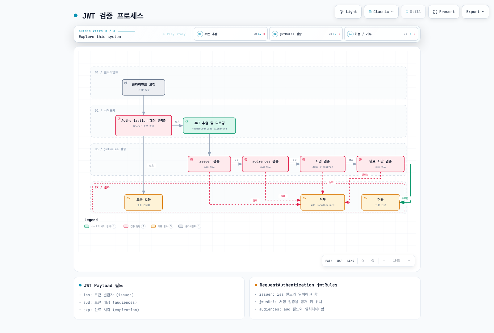

# Security 퀴즈

> **검토일**: 2026-09-11 · Istio 1.31 · Kubernetes 1.32–1.36 (EKS 표준 지원: 1.34–1.36). [설치 호환성](../../../service-mesh/istio/01-installation.md)을 확인하세요.

이 퀴즈는 사이드카 예제로 Istio 보안을 다룹니다. 각 문제는 독립적인 시나리오이며 모든 ALLOW 정책을 같은 워크로드에 함께 적용하지 않습니다. Ambient의 HTTP/JWT 정책은 waypoint `targetRefs`가 필요하며 PeerAuthentication `DISABLE`은 지원하지 않습니다. 워크로드·ServiceAccount·포트·신원은 실제 배포와 일치해야 합니다.

## 객관식 문제 (1-5번)

### 문제 1: PeerAuthentication 모드

PeerAuthentication의 mTLS 모드 중 **PERMISSIVE**의 특징으로 옳은 것은?

A. mTLS와 평문 트래픽을 모두 허용한다\
B. mTLS만 허용하고 평문은 거부한다\
C. 모든 트래픽을 거부한다\
D. mTLS를 비활성화한다

<details>

<summary>정답 및 해설</summary>

**정답: A**

PERMISSIVE 모드는 **mTLS와 평문 트래픽을 모두 허용**하여 점진적 마이그레이션을 지원합니다.

**해설:**

**PeerAuthentication의 mTLS 모드:**

| 모드             | 설명              | 사용 시나리오           |
| -------------- | --------------- | ----------------- |
| **PERMISSIVE** | mTLS + 평문 모두 허용 | 점진적 마이그레이션, 혼합 환경 |
| **STRICT**     | mTLS만 허용        | 프로덕션 보안 강화        |
| **DISABLE**    | 선택한 수신자의 메시 mTLS 비활성화 | 명시적 레거시 예외      |

**PERMISSIVE 모드 예제:**

```yaml
apiVersion: security.istio.io/v1
kind: PeerAuthentication
metadata:
  name: default
  namespace: istio-system
spec:
  mtls:
    mode: PERMISSIVE  # mTLS + 평문 모두 허용
```

**동작 방식:**

```
클라이언트 A (Istio Sidecar) → [mTLS] → 서버 (PERMISSIVE)  ✅ 허용
클라이언트 B (No Sidecar)     → [평문] → 서버 (PERMISSIVE)  ✅ 허용
```

**STRICT 모드와 비교:**

```yaml
apiVersion: security.istio.io/v1
kind: PeerAuthentication
metadata:
  name: strict-mtls
  namespace: production
spec:
  mtls:
    mode: STRICT  # mTLS만 허용
```

```
클라이언트 A (Istio Sidecar) → [mTLS] → 서버 (STRICT)  ✅ 허용
클라이언트 B (No Sidecar)     → [평문] → 서버 (STRICT)  ❌ 거부
```

**마이그레이션 전략:**

```
1단계: PERMISSIVE (혼합 트래픽 허용)
  ↓
2단계: 모든 서비스에 Sidecar 주입
  ↓
3단계: STRICT (mTLS 강제)
```

**참고 자료:**

* [PeerAuthentication](../../../service-mesh/istio/security/01-mtls.md)
* [mTLS](../../../service-mesh/istio/security/01-mtls.md)

</details>

***

### 문제 2: AuthorizationPolicy의 action

이 네임스페이스의 대상 워크로드에 적용되는 유일한 AuthorizationPolicy라면 다음 구성의 의미는?

```yaml
apiVersion: security.istio.io/v1
kind: AuthorizationPolicy
metadata:
  name: deny-all
spec:
  {}
```

A. 모든 요청을 허용한다\
B. 모든 요청을 거부한다\
C. 정책을 적용하지 않는다\
D. mTLS만 허용한다

<details>

<summary>정답 및 해설</summary>

**정답: B**

빈 spec은 일치하는 규칙이 없는 ALLOW이므로 이 정책만 적용되면 **모든 요청을 거부**합니다. 다른 ALLOW 정책으로 예외를 허용할 수 있지만 명시적 DENY-all은 ALLOW로 덮어쓸 수 없습니다.

**해설:**

**AuthorizationPolicy의 기본 동작:**

1. **정책이 없으면**: 모든 요청 허용
2. **빈 spec (예제와 같음)**: 모든 요청 거부
3. **rules가 있으면**: rules에 따라 허용/거부

**Deny-by-default 패턴:**

```yaml
# 1단계: 모든 요청 거부
apiVersion: security.istio.io/v1
kind: AuthorizationPolicy
metadata:
  name: deny-all
  namespace: default
spec: {}  # 빈 spec = 모든 요청 거부

---
# 2단계: 필요한 것만 선택적으로 허용
apiVersion: security.istio.io/v1
kind: AuthorizationPolicy
metadata:
  name: allow-frontend
  namespace: default
spec:
  selector:
    matchLabels:
      app: backend
  action: ALLOW
  rules:
  - from:
    - source:
        principals: ["cluster.local/ns/default/sa/frontend"]
    to:
    - operation:
        methods: ["GET", "POST"]
```

**평가:** CUSTOM → DENY → ALLOW 순서입니다. 일치하는 CUSTOM 제공자가 허용한 뒤에도 DENY가 일치하면 거부합니다. 적용되는 ALLOW 정책이 있으면 하나 이상의 규칙이 일치해야 하며 ALLOW가 없으면 이 단계는 허용합니다. 규칙과 ALLOW 정책은 합집합이며 순서대로 제한을 추가하는 목록이 아닙니다. AUDIT는 설정된 감사 플러그인용으로 요청을 표시하며 네 번째 인가 단계나 자체 로깅 기능이 아닙니다.

**실전 예제:**

```yaml
# 시나리오: HTTP 메서드 제한
---
# DENY: DELETE 금지
apiVersion: security.istio.io/v1
kind: AuthorizationPolicy
metadata:
  name: deny-delete
spec:
  selector:
    matchLabels:
      app: backend
  action: DENY
  rules:
  - to:
    - operation:
        methods: ["DELETE"]

---
# ALLOW: GET, POST만 허용
apiVersion: security.istio.io/v1
kind: AuthorizationPolicy
metadata:
  name: allow-read-write
spec:
  selector:
    matchLabels:
      app: backend
  action: ALLOW
  rules:
  - from:
    - source:
        principals: ["cluster.local/ns/default/sa/frontend"]
    to:
    - operation:
        methods: ["GET", "POST"]
```

**테스트:** ServiceAccount `frontend`를 사용하는 메시 frontend 워크로드에서 실행하고 backend HTTP 프로토콜·포트 인식을 구성합니다.

```bash
# GET 요청 → ALLOW 정책 매칭 → ✅ 허용
curl http://backend/api

# POST 요청 → ALLOW 정책 매칭 → ✅ 허용
curl -X POST http://backend/api

# DELETE 요청 → DENY 정책 매칭 → ❌ 거부
curl -X DELETE http://backend/api

# PUT 요청 → ALLOW 정책 불일치 → ❌ 거부
curl -X PUT http://backend/api
```

**참고 자료:**

* [Authorization Policy](../../../service-mesh/istio/security/03-authorization.md)

</details>

***

### 문제 3: JWT 인증

RequestAuthentication에서 JWT 토큰을 검증할 때 사용하는 필드는?

A. issuer와 audiences\
B. principals와 namespaces\
C. methods와 paths\
D. hosts와 ports

<details>

<summary>정답 및 해설</summary>

**정답: A**

RequestAuthentication은 **issuer**와 **audiences** 필드를 사용하여 JWT 토큰을 검증합니다.

**해설:**

토큰이 있으면 서명·발급자·대상·시간 검증을 통과해야 합니다. RequestAuthentication만으로는 토큰 없는 요청을 거부하지 않으므로 AuthorizationPolicy에서 `requestPrincipals`를 요구해야 합니다. 아래 timestamp는 만료된 과거 구조 예시이며 사용 가능한 토큰이 아닙니다.

**JWT 토큰 구조:**

```
Header.Payload.Signature

Payload 예시:
{
  "iss": "https://auth.example.com",        # issuer
  "sub": "user@example.com",                # subject
  "aud": ["api.example.com"],               # audiences
  "exp": 1735689600,                        # expiration
  "iat": 1735686000                         # issued at
}
```

**RequestAuthentication 구성:**

```yaml
apiVersion: security.istio.io/v1
kind: RequestAuthentication
metadata:
  name: jwt-auth
  namespace: default
spec:
  selector:
    matchLabels:
      app: backend
  jwtRules:
  - issuer: "https://auth.example.com"      # iss 필드 검증
    jwksUri: "https://auth.example.com/.well-known/jwks.json"
    audiences:
    - "api.example.com"                     # aud 필드 검증
    forwardOriginalToken: true
```

**JWT 검증 프로세스:**



[🔍 인터랙티브 다이어그램 보기](https://www.atomai.click/kubernetes-docs/archmaps/ko-quizzes-service-mesh-istio-security-0.html)

그림은 제공된 토큰의 검증 과정이며 인가나 토큰 누락 처리까지 나타내지 않습니다. 아래 제공자 예제는 대안이며 애플리케이션이 기대하는 토큰 종류와 audience를 설정합니다.

**OIDC 제공자와 통합:**

```yaml
# Google OAuth2 예제
apiVersion: security.istio.io/v1
kind: RequestAuthentication
metadata:
  name: google-jwt
spec:
  jwtRules:
  - issuer: "https://accounts.google.com"
    jwksUri: "https://www.googleapis.com/oauth2/v3/certs"
    audiences:
    - "123456789-abcdefg.apps.googleusercontent.com"

---
# Keycloak 예제
apiVersion: security.istio.io/v1
kind: RequestAuthentication
metadata:
  name: keycloak-jwt
spec:
  jwtRules:
  - issuer: "https://keycloak.example.com/realms/myrealm"
    jwksUri: "https://keycloak.example.com/realms/myrealm/protocol/openid-connect/certs"
    audiences:
    - "myapp"
```

**AuthorizationPolicy와 결합:**

```yaml
# 1. RequestAuthentication: JWT 검증
apiVersion: security.istio.io/v1
kind: RequestAuthentication
metadata:
  name: jwt-auth
spec:
  selector:
    matchLabels:
      app: backend
  jwtRules:
  - issuer: "https://auth.example.com"
    jwksUri: "https://auth.example.com/.well-known/jwks.json"
    audiences: ["api.example.com"]

---
# 2. AuthorizationPolicy: 인증된 요청만 허용
apiVersion: security.istio.io/v1
kind: AuthorizationPolicy
metadata:
  name: require-jwt
spec:
  selector:
    matchLabels:
      app: backend
  action: ALLOW
  rules:
  - from:
    - source:
        requestPrincipals: ["https://auth.example.com/*"]  # 같은 규칙에서 검증된 issuer와 메서드 확인
    to:
    - operation:
        methods: ["GET", "POST"]

```

**테스트:**

```bash
# JWT 없이 요청 → RequestAuthentication은 통과, AuthorizationPolicy에서 거부
curl http://backend/api
# 403 Forbidden

# 유효한 JWT로 요청
read -rsp "Test access token: " TOKEN; echo
curl -H "Authorization: Bearer $TOKEN" http://backend/api
unset TOKEN
# 200 OK
```

**참고 자료:**

* [Request Authentication](../../../service-mesh/istio/security/02-authentication.md)

</details>

***

### 문제 4: mTLS 인증서 관리

Istio에서 mTLS 인증서의 기본 유효 기간은?

A. 1시간\
B. 24시간\
C. 7일\
D. 90일

<details>

<summary>정답 및 해설</summary>

**정답: B**

Istio에서 mTLS 인증서의 기본 유효 기간은 **24시간**이며, 자동으로 갱신됩니다.

**해설:**

Agent는 기본 24시간 leaf를 요청하고 수명의 절반 부근에 jitter를 더해 갱신합니다(`SECRET_GRACE_PERIOD_RATIO=0.5`). Istiod 또는 선택한 외부 CA가 서명하고 agent가 SDS로 Envoy에 전달합니다. 루트·중간 CA의 수명은 별도입니다. 기본 자체 서명 루트는 leaf에 직접 서명하며 중간 CA 계층은 관리자가 구성합니다.

`/etc/certs` 파일이나 고정 SDS 배열 순서를 가정하지 않고 공개 인증서를 확인합니다:

```bash
istioctl proxy-config secret <pod-name> -n <namespace> -o json | \
  jq -r '.dynamicActiveSecrets[] | select(.secret.name == "default") | .secret.tlsCertificate.certificateChain.inlineBytes' | \
  base64 -d | openssl x509 -noout -dates -issuer -ext subjectAltName
```

**유효 기간 커스터마이징:**

```yaml
apiVersion: install.istio.io/v1alpha1
kind: IstioOperator
spec:
  meshConfig:
    # 인증서 유효 기간 변경
    defaultConfig:
      proxyMetadata:
        SECRET_TTL: "48h"  # 48시간으로 연장
```

이는 클러스터 내 operator 리소스가 아닌 `istioctl install -f` 입력 조각입니다. 발급자가 48시간 요청 TTL을 제한할 수 있으므로 실제 인증서를 확인하고 부트스트랩 변경 시 대상 프록시를 순차 교체합니다.

갱신 실패 시 워크로드 재시작 전에 agent·istiod 로그, CA 연결, 토큰 인증, 시각 동기화, 신뢰 번들을 확인합니다. 재시작만으로 만료된 CA는 복구되지 않습니다. cert-manager 통합에는 **istio-csr**과 설치 전제 조건이 필요하며 `EXTERNAL_CA=ISTIOD_RA_KUBERNETES_API`만으로 구성되지 않습니다. [인증서 수명 주기](../../../service-mesh/istio/security/01-mtls.md)를 참고하세요.

</details>

***

### 문제 5: Service Account 기반 인증

Istio에서 서비스 간 인증에 사용되는 identity는?

A. Pod 이름\
B. Service 이름\
C. Service Account\
D. Namespace 이름

<details>

<summary>정답 및 해설</summary>

**정답: C**

Istio는 **Service Account**를 기반으로 서비스 간 identity를 관리합니다.

**해설:**

**Service Account 기반 Identity:**

```yaml
# 1. Service Account 생성
apiVersion: v1
kind: ServiceAccount
metadata:
  name: frontend
  namespace: default

---
# 2. Deployment에서 Service Account 사용
apiVersion: apps/v1
kind: Deployment
metadata:
  name: frontend
  namespace: default
spec:
  selector:
    matchLabels:
      app: frontend
  template:
    metadata:
      labels:
        app: frontend
    spec:
      serviceAccountName: frontend  # Identity로 사용
      containers:
      - name: frontend
        image: registry.example.com/team/frontend:REPLACE_WITH_TESTED_TAG
```

**SPIFFE ID 형식:**

```
spiffe://<trust-domain>/ns/<namespace>/sa/<service-account>

예시:
spiffe://cluster.local/ns/default/sa/frontend
spiffe://cluster.local/ns/production/sa/backend
```

**AuthorizationPolicy에서 Service Account 사용:**

```yaml
apiVersion: security.istio.io/v1
kind: AuthorizationPolicy
metadata:
  name: backend-policy
  namespace: default
spec:
  selector:
    matchLabels:
      app: backend
  action: ALLOW
  rules:
  # frontend Service Account만 허용
  - from:
    - source:
        principals:
        - "cluster.local/ns/default/sa/frontend"
    to:
    - operation:
        methods: ["GET", "POST"]
        paths: ["/api/*"]

  # admin Service Account는 모든 작업 허용
  - from:
    - source:
        principals:
        - "cluster.local/ns/default/sa/admin"
```

위 이미지는 애플리케이션 자리 표시자입니다. Kubernetes RBAC는 Kubernetes API 접근을 제어하며 메시 트래픽 권한을 자동 부여하지 않습니다. Istio 인가는 인증된 ServiceAccount 신원을 별도로 사용하며 principal에는 네임스페이스와 trust domain도 포함됩니다.

**Service Account vs Pod/Service 이름:**

| 항목          | Service Account   | Pod 이름  | Service 이름 |
| ----------- | ----------------- | ------- | ---------- |
| **안정성**     | ✅ 안정적             | ❌ 동적 변경 | ✅ 안정적      |
| **보안**      | ✅ 인증서 기반          | ❌ 신뢰 불가 | ❌ 신뢰 불가    |
| **RBAC 통합** | ✅ Kubernetes RBAC | ❌ 불가능   | ❌ 불가능      |
| **mTLS**    | ✅ 인증서에 포함         | ❌ 포함 안됨 | ❌ 포함 안됨    |

**실전 예제: 3-Tier 애플리케이션:**

```yaml
# Frontend → Backend만 허용
---
apiVersion: v1
kind: ServiceAccount
metadata:
  name: frontend
  namespace: app

---
apiVersion: v1
kind: ServiceAccount
metadata:
  name: backend
  namespace: app

---
apiVersion: v1
kind: ServiceAccount
metadata:
  name: database
  namespace: app

---
# Backend 정책: Frontend만 접근 허용
apiVersion: security.istio.io/v1
kind: AuthorizationPolicy
metadata:
  name: backend-policy
  namespace: app
spec:
  selector:
    matchLabels:
      app: backend
  action: ALLOW
  rules:
  - from:
    - source:
        principals: ["cluster.local/ns/app/sa/frontend"]

---
# Database 정책: Backend만 접근 허용
apiVersion: security.istio.io/v1
kind: AuthorizationPolicy
metadata:
  name: database-policy
  namespace: app
spec:
  selector:
    matchLabels:
      app: database
  action: ALLOW
  rules:
  - from:
    - source:
        principals: ["cluster.local/ns/app/sa/backend"]
```

**Service Account 확인:**

```bash
# Pod의 Service Account 확인
kubectl get pod <pod-name> -o jsonpath='{.spec.serviceAccountName}'

# mTLS 인증서에서 SPIFFE ID 확인
istioctl proxy-config secret <pod-name> -o json | \
  jq -r '.dynamicActiveSecrets[] | select(.secret.name == "default") | .secret.tlsCertificate.certificateChain.inlineBytes' | \
  base64 -d | openssl x509 -text -noout | grep URI

# 출력:
# URI:spiffe://cluster.local/ns/default/sa/frontend
```

**Namespace 간 통신:**

```yaml
# Production namespace의 frontend → Staging namespace의 backend 접근
apiVersion: security.istio.io/v1
kind: AuthorizationPolicy
metadata:
  name: backend-policy
  namespace: staging
spec:
  selector:
    matchLabels:
      app: backend
  action: ALLOW
  rules:
  - from:
    - source:
        principals:
        - "cluster.local/ns/production/sa/frontend"
        namespaces:
        - "production"
```

**참고 자료:**

* [mTLS](../../../service-mesh/istio/security/01-mtls.md)
* [Authorization Policy](../../../service-mesh/istio/security/03-authorization.md)

</details>

***

## 주관식 문제 (6-10번)

### 문제 6: Deny-by-default 보안 정책 구현

Kubernetes 클러스터에서 Istio를 사용하여 **deny-by-default** 보안 정책을 구현하는 방법을 단계별로 설명하세요. **필수 리소스**(PeerAuthentication, AuthorizationPolicy)와 **예외 처리** 방법을 포함해야 합니다.

<details>

<summary>예시 답안</summary>

1. 실제 호출자, ServiceAccount, 워크로드 포트, 애플리케이션 프로토콜을 조사합니다. 워크로드를 메시에 등록하고 호환성을 확인한 뒤 네임스페이스 `STRICT`를 적용합니다. PeerAuthentication 자체는 호출자를 인가하지 않습니다.
2. 빈 ALLOW 정책을 네임스페이스 기본값으로 적용하고 필요한 호출 관계만 허용합니다. 예외가 필요할 때 `DENY`와 `rules: [{}]`를 사용하면 안 됩니다.
3. 예제는 `app` 네임스페이스, 동일한 `app` 레이블·ServiceAccount를 가진 frontend/backend/database 메시 워크로드, HTTP 8080·PostgreSQL 5432, `istio-system`의 게이트웨이 ServiceAccount `istio-ingressgateway`를 가정합니다. 실제 게이트웨이 파드에서 신원을 확인합니다. 게이트웨이 Service의 HTTPS 443은 **워크로드 포트 8443**으로 연결되므로 AuthorizationPolicy는 8443을 사용합니다. TLS 종료와 `myapp.example.com/api/*`용 VirtualService는 별도로 구성합니다.

```yaml
apiVersion: security.istio.io/v1
kind: PeerAuthentication
metadata:
  name: default
  namespace: app
spec:
  mtls:
    mode: STRICT
---
apiVersion: security.istio.io/v1
kind: AuthorizationPolicy
metadata:
  name: default-deny
  namespace: app
spec: {}
---
apiVersion: security.istio.io/v1
kind: AuthorizationPolicy
metadata:
  name: ingress-public-api
  namespace: istio-system
spec:
  selector:
    matchLabels:
      istio: ingressgateway
  action: ALLOW
  rules:
  - to:
    - operation:
        ports:
        - '8443'
        hosts:
        - myapp.example.com
        paths:
        - /api/*
        methods:
        - GET
        - POST
---
apiVersion: security.istio.io/v1
kind: AuthorizationPolicy
metadata:
  name: frontend-policy
  namespace: app
spec:
  selector:
    matchLabels:
      app: frontend
  action: ALLOW
  rules:
  - from:
    - source:
        principals:
        - cluster.local/ns/istio-system/sa/istio-ingressgateway
    to:
    - operation:
        ports:
        - '8080'
        paths:
        - /api/*
        methods:
        - GET
        - POST
---
apiVersion: security.istio.io/v1
kind: AuthorizationPolicy
metadata:
  name: backend-policy
  namespace: app
spec:
  selector:
    matchLabels:
      app: backend
  action: ALLOW
  rules:
  - from:
    - source:
        principals:
        - cluster.local/ns/app/sa/frontend
    to:
    - operation:
        ports:
        - '8080'
        paths:
        - /api/*
        methods:
        - GET
        - POST
---
apiVersion: security.istio.io/v1
kind: AuthorizationPolicy
metadata:
  name: database-policy
  namespace: app
spec:
  selector:
    matchLabels:
      app: database
  action: ALLOW
  rules:
  - from:
    - source:
        principals:
        - cluster.local/ns/app/sa/backend
    to:
    - operation:
        ports:
        - '5432'
```

4. 사이드카에서는 Istio의 기본 probe rewrite를 유지합니다. Kubelet HTTP/TCP/gRPC 프로브는 agent(일반적으로 15020)를 통합니다. HTTP 경로 ALLOW만으로 평문이 STRICT를 통과하지는 않습니다. 레거시 상태 확인에 평문 예외가 필요하면 `portLevelMtls`에 workload selector와 워크로드 포트를 지정하고 인가·네트워크 제한을 함께 적용합니다. 일반적인 상태 확인 해결책으로 애플리케이션 포트의 mTLS를 끄지 않습니다.
5. Agent/Envoy 메트릭 포트(15020/15090)는 캡처되는 애플리케이션 메트릭 endpoint와 다릅니다. 보호된 애플리케이션 메트릭에는 워크로드·실제 포트·경로·mTLS Prometheus principal을 제한한 ALLOW를 사용합니다. Agent 메트릭은 스크레이프와 네트워크 접근을 구성해야 하며 애플리케이션 inbound AuthorizationPolicy만으로 해결되지 않습니다.
6. 실제 설정과 허용·거부 경로를 모두 검증합니다:

```bash
istioctl analyze -n app
istioctl proxy-config secret <backend-pod> -n app
istioctl proxy-config clusters <frontend-pod> -n app -o json
istioctl x authz check <backend-pod>.app
# Run from the indicated application containers with the test clients installed.
kubectl exec <frontend-pod> -n app -c frontend -- curl -i http://backend:8080/api/users
kubectl exec <frontend-pod> -n app -c frontend -- pg_isready -h database -p 5432
kubectl exec <backend-pod> -n app -c backend -- pg_isready -h database -p 5432
```

Frontend → backend는 애플리케이션에 도달하고 frontend → database는 HTTP 403이 아닌 TCP 계층에서 실패해야 합니다. Backend → database는 PostgreSQL에 도달해야 하며 DB 자격 증명은 별도 검사입니다. 라우팅이 없으면 대상 backend 인가까지 도달하기 전에 404가 나올 수 있습니다. 네임스페이스·애플리케이션 컨테이너·실제 테스트 클라이언트를 지정합니다. [인가](../../../service-mesh/istio/security/03-authorization.md)와 [상태 확인](https://istio.io/latest/docs/ops/configuration/mesh/app-health-check/)을 참고하세요.

</details>

***

### 문제 7: JWT + mTLS 이중 인증

Istio에서 \*\*최종 사용자 인증(JWT)\*\*과 \*\*서비스 간 인증(mTLS)\*\*을 함께 사용하는 시나리오를 구현하세요. OAuth2/OIDC 제공자(예: Keycloak)와 통합하는 방법을 포함해야 합니다.

<details>

<summary>예시 답안</summary>

Keycloak의 `myrealm`, OIDC 클라이언트, 명시적 API audience `myapp`을 구성합니다. PKCE를 포함한 authorization code 흐름과 정확한 HTTPS redirect URI를 사용합니다. 클라이언트 유형·인증은 애플리케이션의 비밀 보관 가능 여부에 맞춥니다. Keycloak 역할은 보통 `realm_access.roles`에 있으며 audience mapper/client scope로 API 토큰에 기대하는 `aud`를 넣습니다.

`requestPrincipals`나 `request.auth.claims`를 평가하는 각 프록시에 RequestAuthentication이 필요합니다. 게이트웨이의 JWT 검증은 frontend/backend의 요청 신원을 자동 설정하지 않습니다. `forwardOriginalToken`은 해당 전달 요청의 토큰을 보존하며 **frontend 애플리케이션은 새 backend 요청에 Authorization을 전파해야 합니다**.

다음은 문제 6의 관련 정책을 대체합니다. ALLOW 정책은 합집합이므로 역할 제한 backend 규칙 옆에 더 넓은 ALLOW를 남겨두지 않습니다. 배포와 HTTPS 게이트웨이 전제 조건은 문제 6과 같습니다.

```yaml
apiVersion: security.istio.io/v1
kind: PeerAuthentication
metadata:
  name: default
  namespace: app
spec:
  mtls:
    mode: STRICT
---
apiVersion: security.istio.io/v1
kind: AuthorizationPolicy
metadata:
  name: default-deny
  namespace: app
spec: {}
---
apiVersion: security.istio.io/v1
kind: RequestAuthentication
metadata:
  name: jwt-ingress
  namespace: istio-system
spec:
  selector:
    matchLabels:
      istio: ingressgateway
  jwtRules:
  - issuer: https://keycloak.example.com/realms/myrealm
    jwksUri: https://keycloak.example.com/realms/myrealm/protocol/openid-connect/certs
    audiences:
    - myapp
    forwardOriginalToken: true
---
apiVersion: security.istio.io/v1
kind: AuthorizationPolicy
metadata:
  name: ingress-public-api
  namespace: istio-system
spec:
  selector:
    matchLabels:
      istio: ingressgateway
  action: ALLOW
  rules:
  - to:
    - operation:
        ports:
        - '8443'
        hosts:
        - myapp.example.com
        paths:
        - /api/*
        methods:
        - GET
        - POST
        - DELETE
    from:
    - source:
        requestPrincipals:
        - https://keycloak.example.com/realms/myrealm/*
---
apiVersion: security.istio.io/v1
kind: RequestAuthentication
metadata:
  name: jwt-frontend
  namespace: app
spec:
  selector:
    matchLabels:
      app: frontend
  jwtRules:
  - issuer: https://keycloak.example.com/realms/myrealm
    jwksUri: https://keycloak.example.com/realms/myrealm/protocol/openid-connect/certs
    audiences:
    - myapp
    forwardOriginalToken: true
---
apiVersion: security.istio.io/v1
kind: AuthorizationPolicy
metadata:
  name: frontend-policy
  namespace: app
spec:
  selector:
    matchLabels:
      app: frontend
  action: ALLOW
  rules:
  - from:
    - source:
        principals:
        - cluster.local/ns/istio-system/sa/istio-ingressgateway
        requestPrincipals:
        - https://keycloak.example.com/realms/myrealm/*
    to:
    - operation:
        ports:
        - '8080'
        paths:
        - /api/*
        methods:
        - GET
        - POST
        - DELETE
---
apiVersion: security.istio.io/v1
kind: RequestAuthentication
metadata:
  name: jwt-backend
  namespace: app
spec:
  selector:
    matchLabels:
      app: backend
  jwtRules:
  - issuer: https://keycloak.example.com/realms/myrealm
    jwksUri: https://keycloak.example.com/realms/myrealm/protocol/openid-connect/certs
    audiences:
    - myapp
    forwardOriginalToken: true
---
apiVersion: security.istio.io/v1
kind: AuthorizationPolicy
metadata:
  name: backend-policy
  namespace: app
spec:
  selector:
    matchLabels:
      app: backend
  action: ALLOW
  rules:
  - from:
    - source:
        principals:
        - cluster.local/ns/app/sa/frontend
        requestPrincipals:
        - https://keycloak.example.com/realms/myrealm/*
    to:
    - operation:
        ports:
        - '8080'
        paths:
        - /api/users/*
        methods:
        - GET
        - POST
    when:
    - key: request.auth.claims[realm_access][roles]
      values:
      - user
      - admin
  - from:
    - source:
        principals:
        - cluster.local/ns/app/sa/frontend
        requestPrincipals:
        - https://keycloak.example.com/realms/myrealm/*
    to:
    - operation:
        ports:
        - '8080'
        methods:
        - DELETE
        paths:
        - /api/admin/*
    when:
    - key: request.auth.claims[realm_access][roles]
      values:
      - admin
```

애플리케이션에 scalar claim 헤더가 필요하면 RequestAuthentication의 실험적 `outputClaimToHeaders`(예: `header: x-user-id`, `claim: sub`)를 사용할 수 있습니다. 인가에는 검증된 JWT claim을 사용하고 호출자가 넣은 신원 헤더는 신뢰하지 않습니다. `outputPayloadToHeader`는 인코딩된 payload이며 Envoy Lua에 임의의 `require("json")` 모듈이 내장되어 있지는 않습니다. 역할 배열은 무조건 헤더로 합치기보다 claim으로 평가합니다.

설정한 로그인 흐름으로 테스트 토큰을 받은 후 HTTPS를 시험합니다. 퀴즈 명령에 비밀번호·클라이언트 비밀을 넣지 않습니다:

```bash
read -rsp "Test access token: " TOKEN; echo
curl -i -H "Authorization: Bearer $TOKEN" https://myapp.example.com/api/users/test
unset TOKEN
curl -i https://myapp.example.com/api/users/test
# No JWT: 403 from AuthorizationPolicy.
curl -i -H "Authorization: Bearer invalid-token" https://myapp.example.com/api/users/test
# Invalid JWT: 401 from RequestAuthentication.
```

잘못된 ServiceAccount·audience·부족한 역할도 시험합니다. 역할 변경이 이미 발급된 JWT를 즉시 폐기하지는 않으므로 토큰 수명과 제공자·애플리케이션의 폐기 방식도 고려합니다. [인증](../../../service-mesh/istio/security/02-authentication.md)과 [Keycloak grant 유형](https://www.keycloak.org/securing-apps/oidc-layers)을 참고하세요.

</details>

***

### 문제 8: 외부 서비스 접근 제어

Istio에서 **Egress 트래픽**을 제어하여 특정 외부 서비스만 접근을 허용하는 방법을 설명하세요. **ServiceEntry**, **VirtualService**, **AuthorizationPolicy**를 사용한 완전한 예제를 포함해야 합니다.

<details>

<summary>예시 답안</summary>

`ALLOW_ANY`는 알 수 없는 대상을 전달하고 `REGISTRY_ONLY`는 프록시 레지스트리에 없는 대상을 거부합니다. 레지스트리에는 ServiceEntry뿐 아니라 Kubernetes Service도 포함됩니다. 어느 모드도 방화벽이 아니며 별도 네트워크 제한 없이는 애플리케이션이 프록시를 우회할 수 있습니다. 메시 설정은 기존 설치 값에 병합하며 한 필드만 있는 조각으로 전체 `istio` ConfigMap을 교체하지 않습니다.

AuthorizationPolicy는 선택한 프록시가 수신하는 트래픽을 평가합니다. 클라이언트 사이드카 네임스페이스 정책은 outbound ACL이 아닙니다. 신원·메서드·경로를 제한하려면 메시 mTLS를 종료하는 egress gateway에서 인가한 뒤 외부 서버로 TLS를 시작합니다. 애플리케이션은 사이드카에 HTTP를 보내며 HTTPS passthrough에서는 HTTP 경로·메서드가 보이지 않습니다.

전제 조건: `app`의 메시 클라이언트, `istio: egressgateway` 레이블의 전용 게이트웨이, 443을 워크로드 8443으로 연결하는 `istio-egressgateway.istio-system.svc.cluster.local` Service, 다른 광범위한 게이트웨이 ALLOW가 없는 상태입니다. 프록시의 공개 CA 신뢰로 GitHub 인증서를 검증할 수 있어야 합니다.

```yaml
apiVersion: networking.istio.io/v1
kind: ServiceEntry
metadata:
  name: github-api
  namespace: app
spec:
  hosts:
  - api.github.com
  location: MESH_EXTERNAL
  resolution: DNS
  ports:
  - number: 80
    targetPort: 443
    name: http
    protocol: HTTP
---
apiVersion: networking.istio.io/v1
kind: Gateway
metadata:
  name: github-egress
  namespace: istio-system
spec:
  selector:
    istio: egressgateway
  servers:
  - port:
      number: 443
      name: https
      protocol: HTTPS
    hosts:
    - api.github.com
    tls:
      mode: ISTIO_MUTUAL
---
apiVersion: networking.istio.io/v1
kind: DestinationRule
metadata:
  name: to-egress
  namespace: app
spec:
  host: istio-egressgateway.istio-system.svc.cluster.local
  trafficPolicy:
    tls:
      mode: ISTIO_MUTUAL
      sni: api.github.com
---
apiVersion: networking.istio.io/v1
kind: VirtualService
metadata:
  name: github-through-egress
  namespace: app
spec:
  hosts:
  - api.github.com
  gateways:
  - mesh
  - istio-system/github-egress
  http:
  - match:
    - gateways:
      - mesh
      port: 80
    route:
    - destination:
        host: istio-egressgateway.istio-system.svc.cluster.local
        port:
          number: 443
  - match:
    - gateways:
      - istio-system/github-egress
      port: 443
    timeout: 10s
    retries:
      attempts: 2
      perTryTimeout: 3s
      retryOn: connect-failure,reset
    route:
    - destination:
        host: api.github.com
        port:
          number: 80
---
apiVersion: networking.istio.io/v1
kind: DestinationRule
metadata:
  name: github-origin-tls
  namespace: istio-system
spec:
  host: api.github.com
  workloadSelector:
    matchLabels:
      istio: egressgateway
  trafficPolicy:
    tls:
      mode: SIMPLE
      sni: api.github.com
      subjectAltNames:
      - api.github.com
---
apiVersion: security.istio.io/v1
kind: AuthorizationPolicy
metadata:
  name: github-egress-allow
  namespace: istio-system
spec:
  selector:
    matchLabels:
      istio: egressgateway
  action: ALLOW
  rules:
  - from:
    - source:
        principals:
        - cluster.local/ns/app/sa/backend
    to:
    - operation:
        hosts:
        - api.github.com
        methods:
        - GET
        paths:
        - /users/*
        ports:
        - '8443'
```

메시 클라이언트는 `http://api.github.com/users/octocat`을 호출합니다. 사이드카는 ISTIO_MUTUAL로 게이트웨이에 연결하고 게이트웨이는 backend ServiceAccount와 GET `/users/*`를 제한한 뒤 80 → targetPort 443으로 GitHub HTTPS를 호출합니다. 재시도는 이 멱등 GET 용도이며 부작용이 있는 임의 API에 그대로 적용하지 않습니다.

```bash
kubectl exec <backend-pod> -n app -c backend -- curl -i http://api.github.com/users/octocat
kubectl exec <frontend-pod> -n app -c frontend -- curl -i http://api.github.com/users/octocat
# Gateway should reject the second caller with HTTP 403.
istioctl proxy-config clusters <egress-pod> -n istio-system --fqdn api.github.com -o json
istioctl x authz check <egress-pod>.istio-system
```

사설 외부 DB는 명시적 endpoint/address와 TCP 5432를 가진 STATIC ServiceEntry를 사용하고 해당 프로토콜의 TLS·DB 인증을 설계합니다. HTTP-only 서비스는 HTTP ServiceEntry로 등록할 수 있지만 민감 데이터에는 암호화가 필요합니다. API 자격 증명은 애플리케이션이나 지원되는 Secret 기반 서명·인증 구성에서 처리합니다. VirtualService 헤더 리터럴은 읽을 수 있는 설정이며 비밀 저장소가 아닙니다.

마지막으로 CNI NetworkPolicy·방화벽으로 경로를 강제합니다. 클라이언트에는 필요한 메시 서비스·DNS·istiod·egress gateway 접근만 허용하고 임의 인터넷 IP를 제한하며 게이트웨이에 필요한 외부 접근을 부여합니다. IPv4/IPv6, 우회·제외 포트와 권한 있는 워크로드를 고려합니다. 표준 NetworkPolicy는 DNS 이름을 필터링하지 않으므로 필요하면 지원되는 FQDN 제어를 사용합니다. 허용 경로뿐 아니라 직접 IP·HTTPS 우회도 테스트합니다. [Egress 제어](../../../service-mesh/istio/traffic-management/11-egress-control.md)와 [TLS origination](https://istio.io/latest/docs/tasks/traffic-management/egress/egress-gateway-tls-origination/)을 참고하세요.

</details>

***

### 문제 9: 보안 감사 및 로깅

Istio에서 보안 관련 이벤트를 \*\*감사(Audit)\*\*하고 로깅하는 방법을 설명하세요. **AuthorizationPolicy의 AUDIT action**과 **Access Log** 구성을 포함해야 합니다.

<details>

<summary>예시 답안</summary>

`AUDIT`는 **설치된 감사 플러그인**용으로 요청을 표시합니다. 플러그인이 없으면 로깅 효과가 없으며 트래픽을 허용·거부하지도 않습니다. 다음은 DELETE와 admin 경로가 함께 일치하는 조건이며 순서대로 적용되는 두 규칙이 아닙니다:

```yaml
apiVersion: security.istio.io/v1
kind: AuthorizationPolicy
metadata:
  name: audit-sensitive
  namespace: app
spec:
  selector:
    matchLabels:
      app: backend
  action: AUDIT
  rules:
  - to:
    - operation:
        methods:
        - DELETE
        paths:
        - /api/admin/*
```

Access log는 별도 기능입니다. 다음 사용자 제공자를 기존 Istio 설치 설정에 병합하고 `istioctl install -f`로 적용하며 다른 제공자·설정을 보존합니다. 이어서 대상 backend에만 활성화합니다. 형식에는 쿼리 문자열·Bearer 토큰·전체 JWT payload를 포함하지 않습니다.

```yaml
apiVersion: install.istio.io/v1alpha1
kind: IstioOperator
spec:
  meshConfig:
    extensionProviders:
    - name: security-json
      envoyFileAccessLog:
        path: /dev/stdout
        logFormat:
          labels:
            start_time: '%START_TIME%'
            method: '%REQ(:METHOD)%'
            path: '%REQ_WITHOUT_QUERY(:PATH)%'
            response_code: '%RESPONSE_CODE%'
            response_code_details: '%RESPONSE_CODE_DETAILS%'
            response_flags: '%RESPONSE_FLAGS%'
            peer: '%DOWNSTREAM_PEER_URI_SAN%'
            request_id: '%REQ(X-REQUEST-ID)%'
```

```yaml
apiVersion: telemetry.istio.io/v1
kind: Telemetry
metadata:
  name: backend-security
  namespace: app
spec:
  selector:
    matchLabels:
      app: backend
  accessLogging:
  - providers:
    - name: security-json
    filter:
      expression: response.code >= 400 || request.method == "DELETE" || request.url_path.startsWith("/api/admin/")
  metrics:
  - providers:
    - name: prometheus
    overrides:
    - match:
        metric: REQUEST_COUNT
        mode: SERVER
      tagOverrides:
        security_operation:
          value: 'request.url_path.startsWith("/api/admin/") ? "admin" : "other"'
```

Telemetry는 요청 수에 제한된 `security_operation` 차원(`admin`/`other`)도 추가합니다. `request_method`와 원시 URL 경로는 기본 Istio 메트릭 레이블이 아닙니다. 전체 URL 레이블은 카디널리티·민감 데이터 문제 때문에 피합니다. AUDIT 플러그인이 없어도 오류·DELETE·admin 접근은 access log에 기록됩니다. 필터를 빼면 모든 요청, selector를 빼면 네임스페이스, 루트 네임스페이스의 selector 없는 정책은 메시 전체에 적용됩니다.

CloudWatch에는 지원되는 EKS 로깅 agent 또는 Fluent Bit DaemonSet을 배포하고 노드 로그 마운트, CRI/containerd 파싱, `log` 필드 JSON 파싱, IAM 자격 증명, CloudWatch 출력을 구성합니다. ConfigMap만으로 agent는 실행되지 않습니다. Elasticsearch/OpenSearch에는 해당 수집기 출력을 설정합니다. `envoy` 제공자의 Telemetry는 stdout에 쓰며 Elasticsearch를 구성하지 않습니다. Fargate는 노드 DaemonSet 대신 지원되는 로깅 방식을 사용합니다.

구조화된 JSON 필드를 수집한 뒤 각 CloudWatch Logs Insights 쿼리를 따로 실행합니다:

```sql
fields @timestamp, method, path, response_code, peer
| filter method = "DELETE"
| sort @timestamp desc
| limit 100
```

```sql
fields @timestamp, path, response_code, response_code_details
| filter path like /^\/api\/admin\//
| filter response_code = "403"
| stats count() by bin(5m), response_code_details
```

403은 애플리케이션·JWT 인가·외부 제공자에서 발생할 수 있습니다. Istio 차단으로 단정하기 전에 `response_code_details`, 프록시 RBAC 로그, 실제 정책을 확인합니다. `envoy_http_rbac_logged_total`을 내장 AUDIT 카운터로 가정하지 않습니다. 실제 RBAC·실험적 dry-run 통계는 프록시 설정·이름에 따라 달라지므로 노출 시계열을 확인합니다.

Grafana에서는 표준 수신 측 403 발생률과 사용자 admin 차원을 표시할 수 있습니다. 설치된 Prometheus Operator가 선택하는 PrometheusRule로 다음을 경고합니다:

```yaml
apiVersion: monitoring.coreos.com/v1
kind: PrometheusRule
metadata:
  name: istio-security-alerts
  namespace: monitoring
spec:
  groups:
  - name: istio-security
    rules:
    - alert: AdminHTTP403Responses
      expr: sum(rate(istio_requests_total{reporter="destination",security_operation="admin",response_code="403"}[5m]))
        > 0
      for: 5m
      labels:
        severity: warning
      annotations:
        summary: Admin API returned HTTP 403; inspect response_code_details to identify
          the cause
```

새 정책 적용 전에 ALLOW/DENY의 실험적 `istio.io/dry-run: "true"`로 shadow 결과를 관찰할 수 있습니다. 이는 AUDIT와 다르며 진단 출력은 안정적 API가 아닙니다. 보존 기간·접근 제어·마스킹은 실제 조직·법적 요구에 맞추며 보편적인 90일·1년 의무는 없습니다. [Access log](https://istio.io/latest/docs/tasks/observability/logs/access-log/)와 [인가 dry-run](https://istio.io/latest/docs/tasks/security/authorization/authz-dry-run/)을 참고하세요.

</details>

***

### 문제 10: Zero Trust 네트워크 구현

Istio를 사용하여 **Zero Trust 네트워크** 원칙을 구현하는 방법을 설명하세요. **mTLS STRICT**, **deny-by-default**, **least privilege** 원칙을 적용한 완전한 예제를 포함해야 합니다.

<details>

<summary>예시 답안</summary>

제로 트러스트는 인증된 신원, 명시적 최소 권한 인가, 워크로드 침해 이후에도 유지되는 제어를 결합합니다. Istio는 데이터플레인이 캡처한 트래픽을 보호하며 Kubernetes RBAC·admission policy·네트워크 격리·애플리케이션 인가를 대체하지 않습니다.

1. Frontend/backend/database에 별도 ServiceAccount를 부여하고 서로의 계정을 임의로 사용할 수 없도록 제한합니다. 워크로드를 메시에 등록하고 trust domain, 인증서 발급·갱신을 확인합니다.
2. 대상 네임스페이스에 STRICT와 빈 ALLOW 기본값을 적용합니다. `default` 정책이 `app`까지 자동 적용되지 않습니다. 루트 네임스페이스 기본값은 영향 범위가 넓어 게이트웨이·운영 예외가 필요합니다.
3. Gateway → frontend → backend → database만 허용합니다. 문제 6과 같은 배포 전제 조건에서 완전한 트래픽 정책은 다음과 같습니다:

```yaml
apiVersion: security.istio.io/v1
kind: PeerAuthentication
metadata:
  name: default
  namespace: app
spec:
  mtls:
    mode: STRICT
---
apiVersion: security.istio.io/v1
kind: AuthorizationPolicy
metadata:
  name: default-deny
  namespace: app
spec: {}
---
apiVersion: security.istio.io/v1
kind: AuthorizationPolicy
metadata:
  name: ingress-public-api
  namespace: istio-system
spec:
  selector:
    matchLabels:
      istio: ingressgateway
  action: ALLOW
  rules:
  - to:
    - operation:
        ports:
        - '8443'
        hosts:
        - myapp.example.com
        paths:
        - /api/*
        methods:
        - GET
        - POST
---
apiVersion: security.istio.io/v1
kind: AuthorizationPolicy
metadata:
  name: frontend-policy
  namespace: app
spec:
  selector:
    matchLabels:
      app: frontend
  action: ALLOW
  rules:
  - from:
    - source:
        principals:
        - cluster.local/ns/istio-system/sa/istio-ingressgateway
    to:
    - operation:
        ports:
        - '8080'
        paths:
        - /api/*
        methods:
        - GET
        - POST
---
apiVersion: security.istio.io/v1
kind: AuthorizationPolicy
metadata:
  name: backend-policy
  namespace: app
spec:
  selector:
    matchLabels:
      app: backend
  action: ALLOW
  rules:
  - from:
    - source:
        principals:
        - cluster.local/ns/app/sa/frontend
    to:
    - operation:
        ports:
        - '8080'
        paths:
        - /api/*
        methods:
        - GET
        - POST
---
apiVersion: security.istio.io/v1
kind: AuthorizationPolicy
metadata:
  name: database-policy
  namespace: app
spec:
  selector:
    matchLabels:
      app: database
  action: ALLOW
  rules:
  - from:
    - source:
        principals:
        - cluster.local/ns/app/sa/backend
    to:
    - operation:
        ports:
        - '5432'
```

4. 네임스페이스 격리는 인증된 namespace/principal로 제한합니다. `production` 대상 DENY의 `notNamespaces: [production, istio-system]`는 **다른 호출자 → production**을 차단하며 production → staging 차단이 아닙니다. 게이트웨이·운영 호출자를 고려하고 DENY가 ALLOW보다 우선함을 확인합니다.
5. 업무 시간 제한은 시간대·시계·실패 정책을 명시한 애플리케이션 인가 또는 CUSTOM 외부 인가 제공자로 구현합니다. 삽입 위치·시간대가 불명확한 Lua `os.date()` 검사는 완전한 인가 설계가 아닙니다. CUSTOM 허용 후에도 DENY/ALLOW를 통과해야 합니다.
6. 문제 8의 게이트웨이와 네트워크 제어로 egress를 강제합니다. REGISTRY_ONLY나 `deny-all-egress`라는 이름의 사이드카 정책은 방화벽이 아닙니다. 모든 host에 일치하는 inbound DENY는 오히려 애플리케이션 트래픽을 차단하며 ALLOW로 되돌릴 수 없습니다.
7. 문제 6처럼 probe rewrite를 유지하고 올바른 포트로 수집하며 필요한 예외만 추가합니다. 사용자 인가에는 문제 7의 JWT 검증·각 홉 토큰 전파를 적용하고 문제 9의 로그·알림과 mTLS 장의 인증서 만료 모니터링을 사용합니다.
8. 각 변경 후 실제 정책과 허용·거부 행렬, TCP DB 접근, egress 우회를 검사합니다:

```bash
istioctl analyze -n app
istioctl proxy-config secret <backend-pod> -n app
istioctl proxy-config clusters <frontend-pod> -n app -o json
istioctl x authz check <backend-pod>.app
# Run from the indicated application containers with the test clients installed.
kubectl exec <frontend-pod> -n app -c frontend -- curl -i http://backend:8080/api/users
kubectl exec <frontend-pod> -n app -c frontend -- pg_isready -h database -p 5432
kubectl exec <backend-pod> -n app -c backend -- pg_isready -h database -p 5432
```

퀴즈 점수는 운영 준비 상태의 증거가 아닙니다. 실제 환경의 워크로드 신원 할당, 네트워크 우회, 발급자 신뢰, 최소 권한 규칙, 관측성, 롤백, 애플리케이션 권한을 검토합니다. [보안 개념](https://istio.io/latest/docs/concepts/security/)과 [인가](../../../service-mesh/istio/security/03-authorization.md)를 참고하세요.

</details>

***

## 점수 계산

* 객관식 1-5번: 각 10점 (총 50점)
* 주관식 6-10번: 각 10점 (총 50점)
* **총점: 100점**

**평가 기준:**

* 90-100점: 우수 (퀴즈 주제 이해도 높음)
* 80-89점: 양호 (실제 배포는 별도 검증 필요)
* 70-79점: 보통 (추가 학습 권장)
* 60-69점: 미흡 (기본 개념 복습 필요)
* 0-59점: 재학습 필요

## 학습 자료

* [mTLS](../../../service-mesh/istio/security/01-mtls.md)
* [Authorization Policy](../../../service-mesh/istio/security/03-authorization.md)
* [Request Authentication](../../../service-mesh/istio/security/02-authentication.md)
* [Peer Authentication](../../../service-mesh/istio/security/01-mtls.md)
