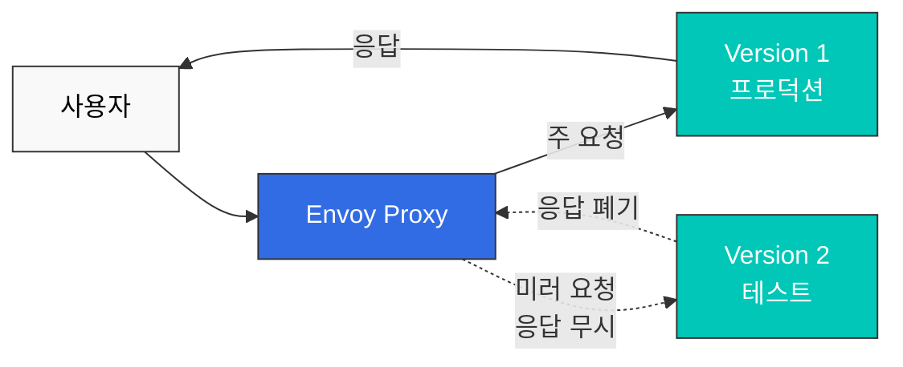

# Istio 트래픽 관리 퀴즈

> **지원 버전**: Istio 1.28.0
> **EKS 버전**: 1.34 (Kubernetes 1.28+)
> **마지막 업데이트**: 2026년 2월 23일

이 퀴즈는 Istio의 트래픽 관리 기능에 대한 이해도를 테스트합니다.

## 객관식 문제 (1-5번)

### 문제 1: VirtualService의 역할

VirtualService에 대한 설명으로 **올바른** 것은?

A. Kubernetes Service를 대체하는 리소스이다  
B. 로드 밸런싱 알고리즘만 정의할 수 있다  
C. 라우팅 규칙을 정의하고 트래픽을 제어한다  
D. Control Plane에서만 작동한다  

<details>
<summary>정답 및 해설</summary>

**정답: C**

VirtualService는 **라우팅 규칙**을 정의하여 트래픽을 제어하는 Istio의 핵심 CRD입니다.

**해설:**
- A (X): VirtualService는 Kubernetes Service를 대체하지 않고, Service 위에서 라우팅 규칙을 추가합니다
- B (X): 로드 밸런싱은 DestinationRule이 담당하고, VirtualService는 라우팅 규칙을 정의합니다
- C (O): VirtualService는 다음을 정의합니다:
  - HTTP/TCP 라우팅 규칙
  - URL 경로 기반 라우팅
  - Header 기반 라우팅
  - 가중치 기반 트래픽 분할
  - Timeout, Retry 설정
- D (X): VirtualService는 Data Plane의 Envoy에서 실행됩니다

**예제:**
```yaml
apiVersion: networking.istio.io/v1beta1
kind: VirtualService
metadata:
  name: reviews
spec:
  hosts:
  - reviews
  http:
  - match:
    - headers:
        end-user:
          exact: jason
    route:
    - destination:
        host: reviews
        subset: v2
  - route:
    - destination:
        host: reviews
        subset: v1
```

**참고 자료:**
- [라우팅](../../../service-mesh/istio/traffic-management/02-routing.md)
- [VirtualService 개념](../../../service-mesh/istio/02-basic-concepts.md#virtualservice)
</details>

---

### 문제 2: DestinationRule의 기능

DestinationRule이 수행하는 작업이 **아닌** 것은?

A. 서브셋(Subset) 정의  
B. 로드 밸런싱 알고리즘 설정  
C. HTTP 경로 기반 라우팅  
D. Connection Pool 설정  

<details>
<summary>정답 및 해설</summary>

**정답: C**

HTTP 경로 기반 라우팅은 **VirtualService**의 역할입니다.

**해설:**

**DestinationRule의 주요 기능:**

1. **서브셋 정의 (A - O)**
```yaml
apiVersion: networking.istio.io/v1beta1
kind: DestinationRule
metadata:
  name: reviews
spec:
  host: reviews
  subsets:
  - name: v1
    labels:
      version: v1
  - name: v2
    labels:
      version: v2
```

2. **로드 밸런싱 설정 (B - O)**
```yaml
spec:
  trafficPolicy:
    loadBalancer:
      simple: ROUND_ROBIN  # RANDOM, LEAST_REQUEST 등
```

3. **Connection Pool 설정 (D - O)**
```yaml
spec:
  trafficPolicy:
    connectionPool:
      tcp:
        maxConnections: 100
      http:
        http1MaxPendingRequests: 50
```

4. **HTTP 경로 기반 라우팅 (C - X)**
- 이것은 VirtualService의 역할입니다:
```yaml
# VirtualService에서 처리
apiVersion: networking.istio.io/v1beta1
kind: VirtualService
spec:
  http:
  - match:
    - uri:
        prefix: /api  # 경로 기반 라우팅
    route:
    - destination:
        host: api-service
```

**비교표:**

| 기능 | VirtualService | DestinationRule |
|------|---------------|----------------|
| 라우팅 규칙 | ✅ | ❌ |
| 경로 매칭 | ✅ | ❌ |
| 서브셋 정의 | ❌ | ✅ |
| 로드 밸런싱 | ❌ | ✅ |
| Connection Pool | ❌ | ✅ |

**참고 자료:**
- [로드 밸런싱](../../../service-mesh/istio/traffic-management/05-load-balancing.md)
- [Connection Pool](../../../service-mesh/istio/traffic-management/08-connection-pool.md)
</details>

---

### 문제 3: Canary 배포의 트래픽 분할

다음 VirtualService 구성에서 v1과 v2로 가는 트래픽의 비율은?

```yaml
apiVersion: networking.istio.io/v1beta1
kind: VirtualService
metadata:
  name: reviews
spec:
  hosts:
  - reviews
  http:
  - route:
    - destination:
        host: reviews
        subset: v1
      weight: 80
    - destination:
        host: reviews
        subset: v2
      weight: 20
```

A. v1: 50%, v2: 50%  
B. v1: 80%, v2: 20%  
C. v1: 20%, v2: 80%  
D. v1: 100%, v2: 0%  

<details>
<summary>정답 및 해설</summary>

**정답: B**

weight 값이 **v1: 80, v2: 20**이므로 트래픽은 **80%가 v1**, **20%가 v2**로 분배됩니다.

**해설:**

**Weight 기반 트래픽 분할:**
- `weight` 필드는 상대적 비율을 의미합니다
- 총 weight: 80 + 20 = 100
- v1 비율: 80/100 = 80%
- v2 비율: 20/100 = 20%

**Canary 배포 단계:**
```yaml
# 1단계: 10% Canary
- weight: 90  # v1
- weight: 10  # v2

# 2단계: 25% Canary
- weight: 75  # v1
- weight: 25  # v2

# 3단계: 50% Canary
- weight: 50  # v1
- weight: 50  # v2

# 4단계: 100% v2
- weight: 0   # v1
- weight: 100 # v2
```

**Argo Rollouts를 사용한 자동 Canary:**
```yaml
apiVersion: argoproj.io/v1alpha1
kind: Rollout
spec:
  strategy:
    canary:
      trafficRouting:
        istio:
          virtualService:
            name: reviews
      steps:
      - setWeight: 10
      - pause: {duration: 2m}
      - setWeight: 25
      - pause: {duration: 2m}
      - setWeight: 50
      - pause: {duration: 2m}
```

**참고 자료:**
- [트래픽 분할](../../../service-mesh/istio/traffic-management/03-traffic-splitting.md)
- [Argo Rollouts 통합](../../../service-mesh/istio/advanced/08-argo-rollouts.md)
</details>

---

### 문제 4: Gateway의 용도

Istio Gateway의 주요 역할로 **적절하지 않은** 것은?

A. 클러스터 외부에서 내부로의 트래픽 진입점  
B. TLS 종료 및 인증서 관리  
C. 서비스 간 mTLS 암호화  
D. 외부 트래픽의 로드 밸런싱  

<details>
<summary>정답 및 해설</summary>

**정답: C**

서비스 간 mTLS 암호화는 **Sidecar Envoy**와 **PeerAuthentication**의 역할입니다.

**해설:**

**Gateway의 주요 역할:**

1. **Ingress/Egress 트래픽 진입점 (A - O)**
```yaml
apiVersion: networking.istio.io/v1beta1
kind: Gateway
metadata:
  name: bookinfo-gateway
spec:
  selector:
    istio: ingressgateway  # Ingress Gateway Pod 선택
  servers:
  - port:
      number: 80
      name: http
      protocol: HTTP
    hosts:
    - "*"
```

2. **TLS 종료 (B - O)**
```yaml
spec:
  servers:
  - port:
      number: 443
      name: https
      protocol: HTTPS
    tls:
      mode: SIMPLE
      credentialName: bookinfo-secret  # TLS 인증서
    hosts:
    - bookinfo.example.com
```

3. **외부 트래픽 로드 밸런싱 (D - O)**
- Gateway는 Kubernetes LoadBalancer Service와 연동
- 외부 트래픽을 클러스터 내부로 분산

4. **서비스 간 mTLS (C - X)**
- 이것은 Sidecar Envoy의 역할입니다:
```yaml
# PeerAuthentication으로 mTLS 활성화
apiVersion: security.istio.io/v1beta1
kind: PeerAuthentication
metadata:
  name: default
spec:
  mtls:
    mode: STRICT
```

**Gateway vs Sidecar 역할:**

| 기능 | Gateway | Sidecar Envoy |
|------|---------|--------------|
| 외부 → 내부 트래픽 | ✅ | ❌ |
| TLS 종료 | ✅ | ❌ |
| 서비스 간 mTLS | ❌ | ✅ |
| 내부 라우팅 | ❌ | ✅ |

**참고 자료:**
- [Gateway](../../../service-mesh/istio/traffic-management/01-gateway.md)
- [mTLS](../../../service-mesh/istio/security/01-mtls.md)
</details>

---

### 문제 5: Timeout 및 Retry 정책

다음 VirtualService 구성의 의미는?

```yaml
apiVersion: networking.istio.io/v1beta1
kind: VirtualService
metadata:
  name: reviews
spec:
  hosts:
  - reviews
  http:
  - route:
    - destination:
        host: reviews
    timeout: 10s
    retries:
      attempts: 3
      perTryTimeout: 2s
```

A. 총 10초 동안 3번 재시도, 각 시도는 2초 제한  
B. 총 2초 동안 3번 재시도, 각 시도는 10초 제한  
C. 총 10초 동안 무제한 재시도, 각 시도는 2초 제한  
D. 재시도 없이 10초 후 실패  

<details>
<summary>정답 및 해설</summary>

**정답: A**

이 구성은 **총 10초** 내에 **3번까지 재시도**하되, **각 시도는 2초 제한**입니다.

**해설:**

**구성 해석:**
```yaml
timeout: 10s           # 전체 요청의 최대 시간
retries:
  attempts: 3          # 최대 재시도 횟수
  perTryTimeout: 2s    # 각 시도의 제한 시간
```

**실행 시나리오:**
```
시나리오 1: 첫 시도 성공
├─ 1번째 시도: 1.5초 소요 → 성공
└─ 총 소요 시간: 1.5초

시나리오 2: 2번 시도 후 성공
├─ 1번째 시도: 2초 타임아웃 → 실패
├─ 2번째 시도: 1.8초 소요 → 성공
└─ 총 소요 시간: 3.8초

시나리오 3: 3번 모두 실패
├─ 1번째 시도: 2초 타임아웃 → 실패
├─ 2번째 시도: 2초 타임아웃 → 실패
├─ 3번째 시도: 2초 타임아웃 → 실패
└─ 총 소요 시간: 6초 (10초 전에 실패)

시나리오 4: 전체 타임아웃
├─ 1번째 시도: 2초 타임아웃 → 실패
├─ 2번째 시도: 2초 타임아웃 → 실패
├─ 3번째 시도: 2초 타임아웃 → 실패
├─ 4번째 시도: 2초 지나지 않았지만 전체 10초 도달
└─ 총 소요 시간: 10초 (전체 타임아웃)
```

**Retry 조건 설정:**
```yaml
retries:
  attempts: 3
  perTryTimeout: 2s
  retryOn: 5xx,connect-failure,refused-stream  # 재시도 조건
```

**모범 사례:**
```yaml
# 일반적인 설정
timeout: 30s
retries:
  attempts: 3
  perTryTimeout: 10s
  retryOn: 5xx,gateway-error,reset,connect-failure
```

**주의사항:**
- `timeout` ≥ `attempts × perTryTimeout`이어야 모든 재시도 가능
- 너무 많은 재시도는 cascading failure 유발 가능
- Idempotent 작업에만 재시도 권장

**참고 자료:**
- [Timeout과 Retry](../../../service-mesh/istio/traffic-management/06-timeout-retry.md)
</details>

---

## 주관식 문제 (6-10번)

### 문제 6: Argo Rollouts + Istio Canary 배포

Argo Rollouts와 Istio를 함께 사용하여 자동화된 Canary 배포를 구현하는 과정을 설명하세요. **필수 리소스**(Rollout, VirtualService, DestinationRule, AnalysisTemplate)와 **자동 롤백 조건**을 포함해야 합니다.

<details>
<summary>예시 답안</summary>

**답변:**

**Argo Rollouts + Istio Canary 배포 구현:**

---

**1. Service 생성 (기본 Kubernetes Service)**

```yaml
apiVersion: v1
kind: Service
metadata:
  name: reviews
spec:
  ports:
  - port: 9080
    name: http
  selector:
    app: reviews  # Rollout의 모든 Pod 선택
```

---

**2. DestinationRule 정의 (서브셋 정의)**

```yaml
apiVersion: networking.istio.io/v1beta1
kind: DestinationRule
metadata:
  name: reviews-destrule
spec:
  host: reviews
  subsets:
  - name: stable
    labels: {}  # Rollout이 자동으로 관리
  - name: canary
    labels: {}  # Rollout이 자동으로 관리
```

**중요**: Rollout은 Pod에 `rollouts-pod-template-hash` 레이블을 자동으로 추가하고, 이 레이블로 서브셋을 구분합니다.

---

**3. VirtualService 정의 (트래픽 분할)**

```yaml
apiVersion: networking.istio.io/v1beta1
kind: VirtualService
metadata:
  name: reviews-vsvc
spec:
  hosts:
  - reviews
  http:
  - name: primary  # Rollout이 참조하는 route 이름 (필수)
    route:
    - destination:
        host: reviews
        subset: stable
      weight: 100  # Rollout이 자동으로 변경
    - destination:
        host: reviews
        subset: canary
      weight: 0    # Rollout이 자동으로 변경
```

**주요 포인트**:
- `http[].name` 필드는 필수
- Rollout은 이 VirtualService의 `weight` 값만 자동으로 업데이트

---

**4. AnalysisTemplate 정의 (자동 롤백 조건)**

**성공률 분석:**
```yaml
apiVersion: argoproj.io/v1alpha1
kind: AnalysisTemplate
metadata:
  name: success-rate
spec:
  args:
  - name: service-name

  metrics:
  - name: success-rate
    interval: 30s
    count: 4  # 4번 측정 (총 2분)
    successCondition: result >= 0.95  # 95% 이상 성공률
    failureLimit: 2  # 2번 실패하면 자동 롤백
    provider:
      prometheus:
        address: http://prometheus.istio-system:9090
        query: |
          sum(rate(
            istio_requests_total{
              destination_service_name="{{args.service-name}}",
              response_code!~"5.*"
            }[2m]
          ))
          /
          sum(rate(
            istio_requests_total{
              destination_service_name="{{args.service-name}}"
            }[2m]
          ))
```

**지연시간 분석:**
```yaml
apiVersion: argoproj.io/v1alpha1
kind: AnalysisTemplate
metadata:
  name: latency
spec:
  args:
  - name: service-name

  metrics:
  - name: latency-p95
    interval: 30s
    count: 4
    successCondition: result <= 500  # P95 지연시간 500ms 이하
    failureLimit: 2
    provider:
      prometheus:
        address: http://prometheus.istio-system:9090
        query: |
          histogram_quantile(0.95,
            sum(rate(
              istio_request_duration_milliseconds_bucket{
                destination_service_name="{{args.service-name}}"
              }[2m]
            )) by (le)
          )
```

---

**5. Rollout 리소스 정의 (Canary 전략)**

```yaml
apiVersion: argoproj.io/v1alpha1
kind: Rollout
metadata:
  name: reviews
spec:
  replicas: 5
  revisionHistoryLimit: 2
  selector:
    matchLabels:
      app: reviews
  template:
    metadata:
      labels:
        app: reviews
    spec:
      containers:
      - name: reviews
        image: istio/examples-bookinfo-reviews-v2:1.17.0
        ports:
        - containerPort: 9080

  # Canary 배포 전략
  strategy:
    canary:
      # Istio VirtualService를 통한 트래픽 제어
      trafficRouting:
        istio:
          virtualService:
            name: reviews-vsvc
            routes:
            - primary
          destinationRule:
            name: reviews-destrule
            canarySubsetName: canary
            stableSubsetName: stable

      # Canary 단계 정의
      steps:
      - setWeight: 10    # 10% 트래픽을 Canary로
      - pause:
          duration: 2m

      - setWeight: 25    # 25% 트래픽을 Canary로
      - pause:
          duration: 2m

      - setWeight: 50    # 50% 트래픽을 Canary로
      - pause:
          duration: 2m

      - setWeight: 75    # 75% 트래픽을 Canary로
      - pause:
          duration: 2m

      # 자동 메트릭 분석
      analysis:
        templates:
        - templateName: success-rate
        - templateName: latency
        startingStep: 1
        args:
        - name: service-name
          value: reviews
```

---

**6. 배포 실행 및 모니터링**

```bash
# Argo Rollouts 설치
kubectl create namespace argo-rollouts
kubectl apply -n argo-rollouts -f https://github.com/argoproj/argo-rollouts/releases/latest/download/install.yaml

# 리소스 배포
kubectl apply -f service.yaml
kubectl apply -f destination-rule.yaml
kubectl apply -f virtual-service.yaml
kubectl apply -f analysis-templates.yaml
kubectl apply -f rollout.yaml

# 새 버전 배포
kubectl argo rollouts set image reviews \
  reviews=istio/examples-bookinfo-reviews-v3:1.17.0

# 배포 상태 실시간 모니터링
kubectl argo rollouts get rollout reviews --watch

# Rollout 대시보드
kubectl argo rollouts dashboard
```

---

**자동 롤백 시나리오:**

**시나리오 1: 에러율 > 5%**
```
10% Canary → Analysis 시작
├─ 측정 1 (30초): 에러율 6% → 실패 (1/2)
├─ 측정 2 (30초): 에러율 7% → 실패 (2/2)
└─ 자동 롤백 실행 → Stable 100%
```

**시나리오 2: 지연시간 > 500ms**
```
25% Canary → Analysis 시작
├─ 측정 1 (30초): P95 600ms → 실패 (1/2)
├─ 측정 2 (30초): P95 550ms → 실패 (2/2)
└─ 자동 롤백 실행 → Stable 100%
```

**시나리오 3: 모든 메트릭 정상**
```
10% Canary → Analysis 통과 → 25% Canary
25% Canary → Analysis 통과 → 50% Canary
50% Canary → Analysis 통과 → 75% Canary
75% Canary → Analysis 통과 → 100% Canary
```

---

**주요 이점:**

1. **완전 자동화**: 사람 개입 없이 배포 진행
2. **즉시 롤백**: 메트릭 실패 감지 후 수초 내 롤백
3. **안전한 배포**: 각 단계마다 자동 검증
4. **일관된 프로세스**: 표준화된 배포 전략

**참고 자료:**
- [트래픽 분할](../../../service-mesh/istio/traffic-management/03-traffic-splitting.md)
- [Argo Rollouts](../../../service-mesh/istio/advanced/08-argo-rollouts.md)
</details>

---

### 문제 7: Blue/Green 배포 vs Canary 배포

Blue/Green 배포와 Canary 배포의 **차이점**을 비교하고, 각각의 **장단점** 및 **사용 시나리오**를 설명하세요.

<details>
<summary>예시 답안</summary>

**답변:**

**Blue/Green 배포 vs Canary 배포 비교:**

---

**1. 배포 방식 차이**

**Blue/Green 배포:**
```
Blue (현재 버전) ──┐
                   ├─→ [100% 트래픽]
Green (새 버전) ───┘

단계 1: Blue 100% 활성
단계 2: Green 배포 및 테스트 (0% 트래픽)
단계 3: 트래픽 전환 (Blue 0% → Green 100%)
단계 4: Blue 제거
```

**Canary 배포:**
```
Stable (현재 버전) ─→ 90% → 75% → 50% → 0%
Canary (새 버전) ───→ 10% → 25% → 50% → 100%

점진적으로 트래픽 증가
```

---

**2. 상세 비교표**

| 항목 | Blue/Green | Canary |
|------|-----------|--------|
| **트래픽 전환** | 즉시 100% 전환 | 점진적 증가 (10% → 100%) |
| **롤백 속도** | 즉시 (단일 전환) | 빠름 (현재 단계에서만) |
| **리소스 사용** | 2배 (Blue + Green) | 1배 + 소량 (Stable + Canary) |
| **위험도** | 중간 (한 번에 모든 사용자) | 낮음 (소수 사용자부터) |
| **테스트 기간** | 배포 전 충분히 테스트 | 프로덕션에서 점진적 검증 |
| **복잡도** | 낮음 | 중간 (메트릭 분석 필요) |
| **사용자 영향** | 모든 사용자 동시 영향 | 소수 사용자부터 점진적 |

---

**3. Istio 구현 예제**

**Blue/Green 배포 (Argo Rollouts):**
```yaml
apiVersion: argoproj.io/v1alpha1
kind: Rollout
metadata:
  name: myapp
spec:
  replicas: 5
  strategy:
    blueGreen:
      activeService: myapp-active    # Blue (프로덕션)
      previewService: myapp-preview  # Green (테스트)
      autoPromotionEnabled: false    # 수동 승인
      scaleDownDelaySeconds: 30      # Green → Blue 전환 후 30초 뒤 이전 버전 제거

      # 사전 테스트
      prePromotionAnalysis:
        templates:
        - templateName: smoke-tests

      # 사후 검증
      postPromotionAnalysis:
        templates:
        - templateName: performance-tests
```

**Canary 배포 (Argo Rollouts):**
```yaml
apiVersion: argoproj.io/v1alpha1
kind: Rollout
metadata:
  name: myapp
spec:
  replicas: 5
  strategy:
    canary:
      trafficRouting:
        istio:
          virtualService:
            name: myapp-vsvc
      steps:
      - setWeight: 10
      - pause: {duration: 2m}
      - analysis:
          templates:
          - templateName: success-rate
      - setWeight: 25
      - pause: {duration: 2m}
      - analysis:
          templates:
          - templateName: success-rate
      - setWeight: 50
      - pause: {duration: 2m}
      - setWeight: 100
```

---

**4. 장단점 비교**

**Blue/Green 장점:**
- ✅ 간단한 구조 (Blue ↔ Green 전환만)
- ✅ 즉시 롤백 가능 (스위치 전환)
- ✅ 배포 전 충분한 테스트 가능
- ✅ 예측 가능한 동작

**Blue/Green 단점:**
- ❌ 2배의 리소스 필요
- ❌ 전체 사용자에게 동시 영향
- ❌ 데이터베이스 마이그레이션 복잡
- ❌ 점진적 검증 불가

**Canary 장점:**
- ✅ 소수 사용자부터 점진적 검증
- ✅ 리소스 효율적 (1배 + 소량)
- ✅ 프로덕션 환경에서 실제 검증
- ✅ 자동 롤백 가능 (메트릭 기반)

**Canary 단점:**
- ❌ 복잡한 구성 (메트릭, 분석)
- ❌ 모니터링 필수
- ❌ 긴 배포 시간
- ❌ 버전 혼재 기간 존재

---

**5. 사용 시나리오**

**Blue/Green 권장 시나리오:**
1. **중요한 릴리스**: 충분한 테스트 후 빠른 전환
2. **데이터베이스 변경 없음**: 스키마 변경이 없는 경우
3. **즉시 롤백 필요**: 문제 발생 시 빠른 복구 필요
4. **충분한 리소스**: 2배 리소스를 감당할 수 있는 경우
5. **예측 가능한 변경**: 사전 테스트로 충분히 검증 가능

**예시:**
```
- 주요 기능 릴리스
- UI 전면 개편
- API 버전 업그레이드
- 마케팅 캠페인 연동 (특정 시간에 전환)
```

**Canary 권장 시나리오:**
1. **실험적 기능**: 소수 사용자에게 먼저 테스트
2. **리소스 제약**: 2배 리소스를 사용할 수 없는 경우
3. **점진적 검증**: 프로덕션 환경에서 실제 데이터로 검증
4. **자동화된 배포**: CI/CD에서 자동으로 배포
5. **마이크로서비스**: 서비스 간 의존성이 복잡한 경우

**예시:**
```
- A/B 테스트
- 성능 최적화
- 버그 수정
- 마이너 기능 추가
- 일일 배포 (Continuous Deployment)
```

---

**6. 하이브리드 접근**

실제로는 두 전략을 조합하여 사용할 수 있습니다:

```yaml
# 1단계: Canary로 점진적 검증
10% → 25% → 50%

# 2단계: Blue/Green으로 최종 전환
50% → 100% (즉시 전환)
```

**참고 자료:**
- [트래픽 분할](../../../service-mesh/istio/traffic-management/03-traffic-splitting.md)
- [Blue/Green 배포](../../../service-mesh/istio/traffic-management/03-traffic-splitting.md#bluegreen-배포)
</details>

---

### 문제 8: Traffic Mirroring (섀도우 테스트)

Traffic Mirroring을 사용하여 새 버전을 안전하게 테스트하는 방법을 설명하세요. **사용 사례**, **구성 방법**, **주의사항**을 포함해야 합니다.

<details>
<summary>예시 답안</summary>

**답변:**

**Traffic Mirroring (트래픽 미러링) 개념:**

트래픽 미러링은 프로덕션 트래픽을 복제하여 새 버전으로 전송하되, **응답은 무시**하는 기법입니다. "섀도우 테스트"라고도 합니다.

---

**1. 작동 원리**



**핵심 특징:**
- 사용자는 v1의 응답만 받음
- v2의 응답은 Envoy가 폐기
- v2의 에러는 사용자에게 영향 없음

---

**2. 구성 방법**

**기본 미러링 (100%):**
```yaml
apiVersion: networking.istio.io/v1beta1
kind: VirtualService
metadata:
  name: reviews
spec:
  hosts:
  - reviews
  http:
  - route:
    - destination:
        host: reviews
        subset: v1
      weight: 100  # 주 트래픽
    mirror:
      host: reviews
      subset: v2  # 미러 대상
    mirrorPercentage:
      value: 100  # 100% 미러링
```

**부분 미러링 (50%):**
```yaml
spec:
  http:
  - route:
    - destination:
        host: reviews
        subset: v1
      weight: 100
    mirror:
      host: reviews
      subset: v2
    mirrorPercentage:
      value: 50  # 50%만 미러링 (트래픽 부하 감소)
```

**미러링 + Canary 조합:**
```yaml
spec:
  http:
  - route:
    # 주 트래픽: 90% v1, 10% v2
    - destination:
        host: reviews
        subset: v1
      weight: 90
    - destination:
        host: reviews
        subset: v2
      weight: 10

    # 미러링: 모든 트래픽을 v3로 미러 (테스트)
    mirror:
      host: reviews
      subset: v3
    mirrorPercentage:
      value: 100
```

---

**3. 사용 사례**

**사례 1: 새 버전 성능 테스트**
```
목적: v2의 성능이 v1보다 나은지 확인

1. v1 (프로덕션) + v2 (미러) 동시 실행
2. v2의 지연시간, CPU, 메모리 모니터링
3. v2가 v1보다 빠르면 → Canary 배포 진행
4. v2가 v1보다 느리면 → 최적화 후 재테스트
```

**사례 2: 데이터베이스 마이그레이션 검증**
```
목적: 새 데이터베이스 스키마 검증

1. v1 → 기존 DB
2. v2 → 새 DB (미러링)
3. v2의 쿼리 성능 및 에러율 확인
4. 문제 없으면 → v2로 전환
```

**사례 3: 버그 수정 검증**
```
목적: 버그 수정이 실제로 작동하는지 확인

1. v1 (버그 있음) + v2 (수정 버전, 미러) 실행
2. 프로덕션 트래픽으로 v2 테스트
3. v2의 에러율이 감소하면 → 배포
```

**사례 4: 캐시 워밍**
```
목적: 새 버전의 캐시를 사전에 채움

1. v2 배포 전 미러링으로 캐시 워밍
2. v2의 캐시가 충분히 채워지면
3. v2로 전환 시 cold start 없음
```

---

**4. 모니터링 구성**

**Prometheus 쿼리로 미러 트래픽 모니터링:**
```promql
# v2 (미러)의 에러율
sum(rate(
  istio_requests_total{
    destination_version="v2",
    response_code=~"5.."
  }[5m]
))
/
sum(rate(
  istio_requests_total{
    destination_version="v2"
  }[5m]
))

# v1 vs v2 지연시간 비교
histogram_quantile(0.95,
  sum(rate(
    istio_request_duration_milliseconds_bucket[5m]
  )) by (destination_version, le)
)
```

**Grafana 대시보드:**
```yaml
# 패널 1: 에러율 비교 (v1 vs v2)
# 패널 2: 지연시간 비교 (P50, P95, P99)
# 패널 3: CPU/메모리 사용량
# 패널 4: 요청 수 (v1: 실제, v2: 미러)
```

---

**5. 주의사항**

**⚠️ 부하 증가:**
```
미러링은 서비스 부하를 증가시킵니다.

예시:
- v1: 1000 RPS
- v2: 1000 RPS (미러)
- 총 부하: 2000 RPS

해결: mirrorPercentage를 50% 이하로 설정
```

**⚠️ 부작용 주의:**
```yaml
# 쓰기 작업은 미러링하지 마세요!

# ❌ 위험한 예
POST /api/orders  # v1과 v2 모두 주문 생성 → 중복!

# ✅ 안전한 예
GET /api/orders   # 읽기 전용 작업만 미러링
```

**⚠️ 비용:**
```
미러링은 리소스와 비용을 증가시킵니다.

- 컴퓨팅 리소스 2배
- 네트워크 트래픽 2배
- 데이터베이스 쿼리 2배

해결: 짧은 기간만 미러링 (1-2일)
```

**⚠️ 응답 검증 불가:**
```
미러 트래픽의 응답은 폐기되므로
응답 내용을 검증할 수 없습니다.

검증 가능:
- ✅ 에러율
- ✅ 지연시간
- ✅ 리소스 사용량

검증 불가:
- ❌ 응답 데이터 정확성
- ❌ 비즈니스 로직 검증
```

---

**6. 모범 사례**

```yaml
# ✅ 좋은 예
1. 읽기 전용 API만 미러링
2. mirrorPercentage: 50% (부하 감소)
3. 짧은 기간 테스트 (1-2일)
4. 메트릭 기반 자동 검증

# ❌ 나쁜 예
1. 쓰기 작업 미러링 (중복 데이터)
2. mirrorPercentage: 100% (과부하)
3. 장기간 미러링 (비용 증가)
4. 수동 검증 (느림)
```

**참고 자료:**
- [트래픽 미러링](../../../service-mesh/istio/traffic-management/04-traffic-mirroring.md)
</details>

---

### 문제 9: Locality Load Balancing (Zone Aware Routing)

AWS EKS에서 Istio의 Locality Load Balancing을 사용하여 **크로스 AZ 비용을 절감**하는 방법을 설명하세요. 구성 예시와 **예상 비용 절감액**을 포함해야 합니다.

<details>
<summary>예시 답안</summary>

**답변:**

**Locality Load Balancing 개념:**

Locality Load Balancing은 **같은 가용 영역(AZ) 내 서비스를 우선적으로 라우팅**하여 네트워크 지연시간을 줄이고 크로스 AZ 비용을 절감하는 기능입니다.

---

**1. AWS EKS에서 크로스 AZ 비용**

**비용 구조:**
```
같은 AZ 트래픽: 무료
크로스 AZ 트래픽: GB당 $0.01-0.02
크로스 Region 트래픽: GB당 $0.02-0.09
```

**예시 계산:**
```
서비스 A (us-east-1a) → 서비스 B (us-east-1b)
- 월간 트래픽: 1TB = 1000GB
- 크로스 AZ 비용: 1000GB × $0.01 = $10/월

만약 80% 트래픽을 같은 AZ로 라우팅하면:
- 같은 AZ: 800GB × $0 = $0
- 크로스 AZ: 200GB × $0.01 = $2/월
- 절감: $8/월 (80%)
```

---

**2. EKS Pod Topology 레이블**

EKS 노드는 자동으로 topology 레이블이 설정됩니다:

```yaml
# EKS 노드 레이블 (자동)
topology.kubernetes.io/region: us-east-1
topology.kubernetes.io/zone: us-east-1a

# Pod는 노드의 레이블을 상속
```

---

**3. Locality Load Balancing 구성**

**기본 구성 (같은 AZ 우선):**
```yaml
apiVersion: networking.istio.io/v1beta1
kind: DestinationRule
metadata:
  name: reviews
spec:
  host: reviews
  trafficPolicy:
    loadBalancer:
      localityLbSetting:
        enabled: true
        # 같은 AZ에 Pod가 있으면 100% 라우팅
        # 없으면 자동으로 다른 AZ로 장애 조치
```

**고급 구성 (가중치 분배):**
```yaml
apiVersion: networking.istio.io/v1beta1
kind: DestinationRule
metadata:
  name: reviews
spec:
  host: reviews
  trafficPolicy:
    loadBalancer:
      localityLbSetting:
        enabled: true
        distribute:
        # us-east-1a에서 시작하는 트래픽
        - from: us-east-1/us-east-1a/*
          to:
            "us-east-1/us-east-1a/*": 80  # 같은 AZ 80%
            "us-east-1/us-east-1b/*": 20  # 다른 AZ 20% (장애 조치용)

        # us-east-1b에서 시작하는 트래픽
        - from: us-east-1/us-east-1b/*
          to:
            "us-east-1/us-east-1b/*": 80  # 같은 AZ 80%
            "us-east-1/us-east-1a/*": 20  # 다른 AZ 20% (장애 조치용)
```

**장애 조치 정책:**
```yaml
spec:
  trafficPolicy:
    loadBalancer:
      localityLbSetting:
        enabled: true
        failover:
        # us-east-1a 장애 시 us-east-1b로
        - from: us-east-1/us-east-1a
          to: us-east-1/us-east-1b

        # us-east-1 전체 장애 시 us-west-2로
        - from: us-east-1
          to: us-west-2
```

---

**4. Outlier Detection과 결합**

```yaml
apiVersion: networking.istio.io/v1beta1
kind: DestinationRule
metadata:
  name: reviews
spec:
  host: reviews
  trafficPolicy:
    # Locality Load Balancing
    loadBalancer:
      localityLbSetting:
        enabled: true

    # Outlier Detection (비정상 인스턴스 제외)
    outlierDetection:
      consecutiveErrors: 5
      interval: 30s
      baseEjectionTime: 30s
      maxEjectionPercent: 50
```

**동작:**
```
1. 같은 AZ (us-east-1a) 내 Pod 우선 선택
2. 5회 연속 실패하면 해당 Pod 제외
3. 다른 AZ (us-east-1b)의 정상 Pod로 자동 전환
4. 30초 후 제외된 Pod 재시도
```

---

**5. 비용 절감 계산**

**시나리오: 대규모 마이크로서비스 아키텍처**
```
가정:
- 서비스 수: 20개
- 각 서비스 간 월간 트래픽: 500GB
- 총 월간 트래픽: 20 × 20 × 500GB = 200TB
- 크로스 AZ 비율 (Locality LB 없음): 70%
- 크로스 AZ 비율 (Locality LB 적용): 20%
```

**Locality LB 없음:**
```
크로스 AZ 트래픽: 200TB × 70% = 140TB
비용: 140,000GB × $0.01 = $1,400/월
```

**Locality LB 적용:**
```
크로스 AZ 트래픽: 200TB × 20% = 40TB
비용: 40,000GB × $0.01 = $400/월

절감액: $1,400 - $400 = $1,000/월 (71% 절감)
연간 절감액: $1,000 × 12 = $12,000/년
```

---

**6. 성능 향상**

**지연시간 개선:**
```
같은 AZ 내 통신: ~1ms
크로스 AZ 통신: ~2-3ms

Locality LB 적용 시:
- 평균 지연시간 30-50% 감소
- P99 지연시간 40-60% 감소
```

**실제 측정 예시:**
```bash
# us-east-1a → us-east-1a (같은 AZ)
$ kubectl exec -it pod-a -- curl -w "%{time_total}\n" http://service-b
0.001s

# us-east-1a → us-east-1b (크로스 AZ)
$ kubectl exec -it pod-a -- curl -w "%{time_total}\n" http://service-b
0.003s
```

---

**7. 모니터링**

**Prometheus 쿼리:**
```promql
# Locality별 트래픽 분포
sum(rate(
  istio_requests_total[5m]
)) by (
  source_workload_namespace,
  destination_workload_namespace,
  source_canonical_service,
  destination_canonical_service
)

# 크로스 AZ 트래픽 비율
sum(rate(istio_requests_total{
  source_cluster="us-east-1a",
  destination_cluster!="us-east-1a"
}[5m]))
/
sum(rate(istio_requests_total[5m]))
```

**Grafana 대시보드:**
```yaml
패널 1: Locality별 요청 수 (us-east-1a, us-east-1b, us-east-1c)
패널 2: 크로스 AZ 트래픽 비율 (목표: <20%)
패널 3: 지연시간 (같은 AZ vs 크로스 AZ)
패널 4: 예상 비용 (크로스 AZ 트래픽 × $0.01/GB)
```

---

**8. 주의사항**

**⚠️ 불균형 로드:**
```
한 AZ에만 모든 트래픽이 집중되면 과부하 발생 가능

해결책:
- 각 AZ에 충분한 replica 배포
- HPA (Horizontal Pod Autoscaler) 설정
- PodDisruptionBudget으로 최소 replica 보장
```

**⚠️ AZ 장애:**
```
한 AZ 전체가 장애나면 트래픽이 다른 AZ로 이동

failover 정책 설정 필수:
- from: us-east-1/us-east-1a
  to: us-east-1/us-east-1b
```

**⚠️ Cold Start:**
```
장애 조치 시 다른 AZ의 Pod가 cold start 상태일 수 있음

해결책:
- 각 AZ에 최소 1개 replica 유지
- Readiness Probe로 준비 상태 확인
```

---

**9. 모범 사례**

```yaml
# ✅ 권장 구성
apiVersion: networking.istio.io/v1beta1
kind: DestinationRule
metadata:
  name: production-service
spec:
  host: production-service
  trafficPolicy:
    loadBalancer:
      localityLbSetting:
        enabled: true
        distribute:
        - from: us-east-1/us-east-1a/*
          to:
            "us-east-1/us-east-1a/*": 80  # 비용 절감
            "us-east-1/us-east-1b/*": 15  # 장애 조치
            "us-east-1/us-east-1c/*": 5   # 추가 백업

    outlierDetection:
      consecutiveErrors: 5
      interval: 30s
      baseEjectionTime: 30s

    connectionPool:
      tcp:
        maxConnections: 100
      http:
        http1MaxPendingRequests: 50
```

**참고 자료:**
- [Zone Aware Routing](../../../service-mesh/istio/resilience/03-zone-aware-routing.md)
- [AWS EKS 비용 최적화](../../../service-mesh/istio/best-practices.md#비용-최적화)
</details>

---

### 문제 10: Gateway TLS 구성

Istio Gateway에서 **TLS 종료**를 구성하고, **HTTPS 리다이렉트**를 설정하는 방법을 설명하세요. ACM (AWS Certificate Manager) 인증서를 사용하는 경우와 자체 인증서를 사용하는 경우를 모두 포함해야 합니다.

<details>
<summary>예시 답안</summary>

**답변:**

**Istio Gateway TLS 구성:**

---

**1. 자체 인증서 사용 (Kubernetes Secret)**

**1단계: TLS 인증서 생성**

```bash
# 자체 서명 인증서 생성 (테스트용)
openssl req -x509 -nodes -days 365 -newkey rsa:2048 \
  -keyout bookinfo.key \
  -out bookinfo.crt \
  -subj "/CN=bookinfo.example.com"

# 또는 Let's Encrypt 인증서 사용
certbot certonly --standalone -d bookinfo.example.com
```

**2단계: Kubernetes Secret 생성**

```bash
# Istio가 사용할 Secret 생성
kubectl create -n istio-system secret tls bookinfo-secret \
  --key=bookinfo.key \
  --cert=bookinfo.crt

# Secret 확인
kubectl get secret bookinfo-secret -n istio-system
```

**3단계: Gateway 구성 (HTTPS + HTTP → HTTPS 리다이렉트)**

```yaml
apiVersion: networking.istio.io/v1beta1
kind: Gateway
metadata:
  name: bookinfo-gateway
  namespace: default
spec:
  selector:
    istio: ingressgateway
  servers:
  # HTTPS (443 포트)
  - port:
      number: 443
      name: https
      protocol: HTTPS
    tls:
      mode: SIMPLE  # 단방향 TLS (서버만 인증서)
      credentialName: bookinfo-secret  # Kubernetes Secret 이름
    hosts:
    - bookinfo.example.com

  # HTTP (80 포트) - HTTPS로 리다이렉트
  - port:
      number: 80
      name: http
      protocol: HTTP
    hosts:
    - bookinfo.example.com
    tls:
      httpsRedirect: true  # HTTP → HTTPS 리다이렉트
```

**4단계: VirtualService 연결**

```yaml
apiVersion: networking.istio.io/v1beta1
kind: VirtualService
metadata:
  name: bookinfo-vs
  namespace: default
spec:
  hosts:
  - bookinfo.example.com
  gateways:
  - bookinfo-gateway
  http:
  - match:
    - uri:
        prefix: /productpage
    route:
    - destination:
        host: productpage
        port:
          number: 9080
    timeout: 10s
    retries:
      attempts: 3
      perTryTimeout: 2s
```

**5단계: 테스트**

```bash
# HTTPS 접속
curl -v https://bookinfo.example.com/productpage

# HTTP 접속 → HTTPS 리다이렉트 확인
curl -v http://bookinfo.example.com/productpage
# 출력:
# HTTP/1.1 301 Moved Permanently
# location: https://bookinfo.example.com/productpage
```

---

**2. AWS ACM 인증서 사용 (NLB Annotation)**

AWS EKS에서는 ACM 인증서를 NLB에서 TLS 종료하는 방법을 권장합니다.

**1단계: ACM 인증서 발급**

```bash
# AWS Console 또는 CLI로 ACM 인증서 발급
aws acm request-certificate \
  --domain-name bookinfo.example.com \
  --validation-method DNS \
  --region us-east-1

# ARN 확인
aws acm list-certificates --region us-east-1
# 출력: arn:aws:acm:us-east-1:123456789012:certificate/abc123
```

**2단계: Istio Ingress Gateway Service 수정**

```yaml
apiVersion: v1
kind: Service
metadata:
  name: istio-ingressgateway
  namespace: istio-system
  annotations:
    # NLB 사용
    service.beta.kubernetes.io/aws-load-balancer-type: "nlb"

    # TLS 종료 (ACM 인증서)
    service.beta.kubernetes.io/aws-load-balancer-ssl-cert: "arn:aws:acm:us-east-1:123456789012:certificate/abc123"
    service.beta.kubernetes.io/aws-load-balancer-ssl-ports: "443"

    # HTTP → HTTPS 리다이렉트 (NLB 레벨)
    service.beta.kubernetes.io/aws-load-balancer-ssl-negotiation-policy: "ELBSecurityPolicy-TLS-1-2-2017-01"

    # 크로스 AZ 로드 밸런싱
    service.beta.kubernetes.io/aws-load-balancer-cross-zone-load-balancing-enabled: "true"

spec:
  type: LoadBalancer
  selector:
    istio: ingressgateway
    app: istio-ingressgateway
  ports:
  # HTTP (80) - NLB가 HTTPS(443)로 리다이렉트
  - name: http
    port: 80
    targetPort: 8080
    protocol: TCP

  # HTTPS (443) - NLB가 TLS 종료 후 8443으로 전달
  - name: https
    port: 443
    targetPort: 8443
    protocol: TCP
```

**3단계: Gateway 구성 (TLS Passthrough)**

```yaml
apiVersion: networking.istio.io/v1beta1
kind: Gateway
metadata:
  name: bookinfo-gateway
spec:
  selector:
    istio: ingressgateway
  servers:
  # NLB가 TLS 종료했으므로 HTTP로 수신
  - port:
      number: 8443
      name: http
      protocol: HTTP  # NLB가 이미 TLS 종료함
    hosts:
    - bookinfo.example.com
```

---

**3. Mutual TLS (mTLS) - 클라이언트 인증**

클라이언트도 인증서를 제시해야 하는 경우:

```yaml
apiVersion: networking.istio.io/v1beta1
kind: Gateway
metadata:
  name: secure-gateway
spec:
  selector:
    istio: ingressgateway
  servers:
  - port:
      number: 443
      name: https-mutual
      protocol: HTTPS
    tls:
      mode: MUTUAL  # 양방향 TLS
      credentialName: server-cert-secret  # 서버 인증서
      caCertificates: /etc/istio/client-ca/ca-chain.crt  # 클라이언트 CA
    hosts:
    - secure.example.com
```

**클라이언트 인증서로 접속:**
```bash
curl --cert client.crt --key client.key \
  https://secure.example.com/api
```

---

**4. 와일드카드 인증서**

여러 서브도메인을 하나의 인증서로:

```bash
# 와일드카드 인증서 생성
openssl req -x509 -nodes -days 365 -newkey rsa:2048 \
  -keyout wildcard.key \
  -out wildcard.crt \
  -subj "/CN=*.example.com"

# Secret 생성
kubectl create -n istio-system secret tls wildcard-secret \
  --key=wildcard.key \
  --cert=wildcard.crt
```

```yaml
apiVersion: networking.istio.io/v1beta1
kind: Gateway
metadata:
  name: wildcard-gateway
spec:
  selector:
    istio: ingressgateway
  servers:
  - port:
      number: 443
      name: https
      protocol: HTTPS
    tls:
      mode: SIMPLE
      credentialName: wildcard-secret
    hosts:
    - "*.example.com"  # 모든 서브도메인 허용
```

**VirtualService로 서브도메인별 라우팅:**
```yaml
apiVersion: networking.istio.io/v1beta1
kind: VirtualService
metadata:
  name: multi-subdomain
spec:
  hosts:
  - api.example.com
  - web.example.com
  - admin.example.com
  gateways:
  - wildcard-gateway
  http:
  - match:
    - uri:
        prefix: /api
      authority:
        exact: api.example.com
    route:
    - destination:
        host: api-service

  - match:
    - authority:
        exact: web.example.com
    route:
    - destination:
        host: web-service

  - match:
    - authority:
        exact: admin.example.com
    route:
    - destination:
        host: admin-service
```

---

**5. TLS 버전 및 Cipher Suite 설정**

```yaml
apiVersion: networking.istio.io/v1beta1
kind: Gateway
metadata:
  name: secure-gateway
spec:
  selector:
    istio: ingressgateway
  servers:
  - port:
      number: 443
      name: https
      protocol: HTTPS
    tls:
      mode: SIMPLE
      credentialName: bookinfo-secret
      minProtocolVersion: TLSV1_2  # TLS 1.2 이상만 허용
      maxProtocolVersion: TLSV1_3
      cipherSuites:
      - ECDHE-ECDSA-AES256-GCM-SHA384
      - ECDHE-RSA-AES256-GCM-SHA384
      - ECDHE-ECDSA-AES128-GCM-SHA256
    hosts:
    - bookinfo.example.com
```

---

**6. 인증서 자동 갱신 (cert-manager)**

```bash
# cert-manager 설치
kubectl apply -f https://github.com/cert-manager/cert-manager/releases/download/v1.13.0/cert-manager.yaml

# Let's Encrypt Issuer 생성
kubectl apply -f - <<EOF
apiVersion: cert-manager.io/v1
kind: ClusterIssuer
metadata:
  name: letsencrypt-prod
spec:
  acme:
    server: https://acme-v02.api.letsencrypt.org/directory
    email: admin@example.com
    privateKeySecretRef:
      name: letsencrypt-prod
    solvers:
    - http01:
        ingress:
          class: istio
EOF

# Certificate 리소스 생성 (자동 갱신)
kubectl apply -f - <<EOF
apiVersion: cert-manager.io/v1
kind: Certificate
metadata:
  name: bookinfo-cert
  namespace: istio-system
spec:
  secretName: bookinfo-secret
  issuerRef:
    name: letsencrypt-prod
    kind: ClusterIssuer
  dnsNames:
  - bookinfo.example.com
EOF
```

---

**7. 모범 사례**

```yaml
# ✅ 권장 구성
apiVersion: networking.istio.io/v1beta1
kind: Gateway
metadata:
  name: production-gateway
spec:
  selector:
    istio: ingressgateway
  servers:
  # HTTPS (권장)
  - port:
      number: 443
      name: https
      protocol: HTTPS
    tls:
      mode: SIMPLE
      credentialName: prod-tls-secret
      minProtocolVersion: TLSV1_2  # 보안 강화
    hosts:
    - "*.example.com"

  # HTTP → HTTPS 리다이렉트
  - port:
      number: 80
      name: http
      protocol: HTTP
    hosts:
    - "*.example.com"
    tls:
      httpsRedirect: true
```

**주의사항:**
- ✅ TLS 1.2 이상 사용
- ✅ 강력한 Cipher Suite 설정
- ✅ 인증서 자동 갱신 (cert-manager)
- ✅ HTTP → HTTPS 리다이렉트 활성화
- ❌ 자체 서명 인증서는 프로덕션에 사용 금지
- ❌ TLS 1.0/1.1 사용 금지

**참고 자료:**
- [Gateway](../../../service-mesh/istio/traffic-management/01-gateway.md)
- [TLS 구성](../../../service-mesh/istio/traffic-management/01-gateway.md#tls-구성)
</details>

---

## 점수 계산

- 객관식 1-5번: 각 10점 (총 50점)
- 주관식 6-10번: 각 10점 (총 50점)
- **총점: 100점**

**평가 기준:**
- 90-100점: 우수 (Istio 트래픽 관리 전문가)
- 80-89점: 양호 (프로덕션 운영 가능)
- 70-79점: 보통 (추가 학습 권장)
- 60-69점: 미흡 (기본 개념 복습 필요)
- 0-59점: 재학습 필요

## 학습 자료

- [트래픽 관리 문서](../../../service-mesh/istio/traffic-management/)
- [VirtualService](../../../service-mesh/istio/traffic-management/02-routing.md)
- [Gateway](../../../service-mesh/istio/traffic-management/01-gateway.md)
- [트래픽 분할](../../../service-mesh/istio/traffic-management/03-traffic-splitting.md)
- [Argo Rollouts](../../../service-mesh/istio/advanced/08-argo-rollouts.md)
