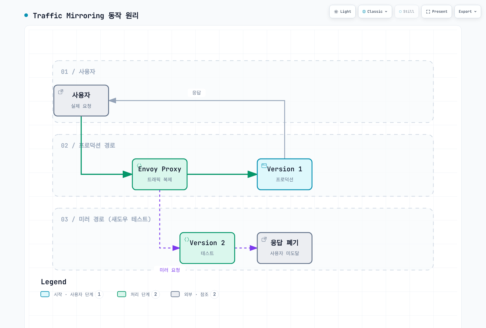

# Traffic Management 퀴즈

> **검토 버전**: Istio 1.31.0 **EKS 버전**: 1.34–1.36 **마지막 업데이트**: 2026년 9월 11일

이 퀴즈는 Istio의 트래픽 관리 기능에 대한 이해도를 테스트합니다.

## 객관식 문제 (1-5번)

### 문제 1: VirtualService의 역할

VirtualService에 대한 설명으로 **올바른** 것은?

A. Kubernetes Service를 대체하는 리소스이다\
B. 로드 밸런싱 알고리즘만 정의할 수 있다\
C. 라우팅 규칙을 정의하고 트래픽을 제어한다\
D. 모든 애플리케이션 요청을 istiod를 통해 전송한다

<details>

<summary>정답 및 해설</summary>

**정답: C**

VirtualService는 **라우팅 규칙**을 정의하여 트래픽을 제어하는 Istio의 핵심 CRD입니다.

**해설:**

* A (X): VirtualService는 Kubernetes Service를 대체하지 않고, Service 위에서 라우팅 규칙을 추가합니다
* B (X): 로드 밸런싱은 DestinationRule이 담당하고, VirtualService는 라우팅 규칙을 정의합니다
* C (O): VirtualService는 다음을 정의합니다:
  * HTTP/TCP 라우팅 규칙
  * URL 경로 기반 라우팅
  * Header 기반 라우팅
  * 가중치 기반 트래픽 분할
  * Timeout, Retry 설정
* D (X): istiod가 VirtualService API 객체를 변환하고 Data Plane의 Envoy가 생성된 라우팅 구성을 적용합니다

**예제:**

```yaml
apiVersion: networking.istio.io/v1
kind: VirtualService
metadata:
  name: reviews
spec:
  hosts:
  - reviews
  http:
  - match:
    - headers:
        end-user:
          exact: jason
    route:
    - destination:
        host: reviews
        subset: v2
  - route:
    - destination:
        host: reviews
        subset: v1
```

**참고 자료:**

* [라우팅](../../../service-mesh/istio/traffic-management/02-routing.md)
* [VirtualService 개념](../../../service-mesh/istio/02-basic-concepts.md#1-virtualservice)

</details>

***

### 문제 2: DestinationRule의 기능

DestinationRule이 수행하는 작업이 **아닌** 것은?

A. 서브셋(Subset) 정의\
B. 로드 밸런싱 알고리즘 설정\
C. HTTP 경로 기반 라우팅\
D. Connection Pool 설정

<details>

<summary>정답 및 해설</summary>

**정답: C**

HTTP 경로 기반 라우팅은 **VirtualService**의 역할입니다.

**해설:**

**DestinationRule의 주요 기능:**

1. **서브셋 정의 (A - O)**

```yaml
apiVersion: networking.istio.io/v1
kind: DestinationRule
metadata:
  name: reviews
spec:
  host: reviews
  subsets:
  - name: v1
    labels:
      version: v1
  - name: v2
    labels:
      version: v2
```

2. **로드 밸런싱 설정 (B - O)**

```yaml
spec:
  trafficPolicy:
    loadBalancer:
      simple: ROUND_ROBIN  # RANDOM, LEAST_REQUEST 등
```

3. **Connection Pool 설정 (D - O)**

```yaml
spec:
  trafficPolicy:
    connectionPool:
      tcp:
        maxConnections: 100
      http:
        http1MaxPendingRequests: 50
```

4. **HTTP 경로 기반 라우팅 (C - X)**

* 이것은 VirtualService의 역할입니다:

```yaml
# VirtualService에서 처리
apiVersion: networking.istio.io/v1
kind: VirtualService
metadata:
  name: path-routing-example
spec:
  hosts:
  - api-service
  http:
  - match:
    - uri:
        prefix: /api  # 경로 기반 라우팅
    route:
    - destination:
        host: api-service
```

**비교표:**

| 기능              | VirtualService | DestinationRule |
| --------------- | -------------- | --------------- |
| 라우팅 규칙          | ✅              | ❌               |
| 경로 매칭           | ✅              | ❌               |
| 서브셋 정의          | ❌              | ✅               |
| 로드 밸런싱          | ❌              | ✅               |
| Connection Pool | ❌              | ✅               |

**참고 자료:**

* [로드 밸런싱](../../../service-mesh/istio/traffic-management/06-load-balancing.md)
* [Connection Pool](../../../service-mesh/istio/traffic-management/07-circuit-breaker.md)

</details>

***

### 문제 3: Canary 배포의 트래픽 분할

다음 VirtualService 구성에서 v1과 v2로 가는 트래픽의 비율은?

```yaml
apiVersion: networking.istio.io/v1
kind: VirtualService
metadata:
  name: reviews
spec:
  hosts:
  - reviews
  http:
  - route:
    - destination:
        host: reviews
        subset: v1
      weight: 80
    - destination:
        host: reviews
        subset: v2
      weight: 20
```

A. v1: 50%, v2: 50%\
B. v1: 80%, v2: 20%\
C. v1: 20%, v2: 80%\
D. v1: 100%, v2: 0%

<details>

<summary>정답 및 해설</summary>

**정답: B**

weight 값이 **v1: 80, v2: 20**이므로 트래픽은 **80%가 v1**, **20%가 v2**로 분배됩니다.

**해설:**

**Weight 기반 트래픽 분할:**

* `weight` 필드는 상대적 비율을 의미합니다
* 총 weight: 80 + 20 = 100
* v1 비율: 80/100 = 80%
* v2 비율: 20/100 = 20%

**Canary 배포 단계:**

```yaml
# 1단계: 10% Canary
- weight: 90  # v1
- weight: 10  # v2

# 2단계: 25% Canary
- weight: 75  # v1
- weight: 25  # v2

# 3단계: 50% Canary
- weight: 50  # v1
- weight: 50  # v2

# 4단계: 100% v2
- weight: 0   # v1
- weight: 100 # v2
```

**Argo Rollouts를 사용한 자동 Canary:**

```yaml
# Strategy fragment; merge into a complete Rollout with selector/template
strategy:
  canary:
    trafficRouting:
      istio:
        virtualService:
          name: reviews
        destinationRule:
          name: reviews
          stableSubsetName: v1
          canarySubsetName: v2
    steps:
    - setWeight: 10
    - pause: {duration: 2m}
    - setWeight: 25
    - pause: {duration: 2m}
    - setWeight: 50
    - pause: {duration: 2m}
```

**참고 자료:**

* [트래픽 분할](../../../service-mesh/istio/traffic-management/04-traffic-splitting.md)
* [Argo Rollouts 통합](../../../service-mesh/istio/advanced/08-argo-rollouts.md)

</details>

***

### 문제 4: Gateway의 용도

Istio 인바운드 Gateway 구성의 역할이 **아닌** 것은?

A. 리스너 포트·프로토콜·허용 호스트 정의\
B. 인증서 Secret을 이용한 TLS 종료 구성\
C. 모든 앱 Pod에 프록시를 자동 주입하고 단독으로 전체 east-west 트래픽 보호\
D. 인바운드 트래픽을 VirtualService 라우팅에 연결

<details>
<summary>정답 및 해설</summary>

**정답: C**

Istio Gateway는 기존 게이트웨이 프록시를 구성합니다. 워크로드 등록과 서비스 간 보안에는 Sidecar 또는 Ambient Data Plane과 정책이 필요합니다. Gateway 프록시 자체도 업스트림 mTLS를 시작할 수 있으므로 Gateway가 mTLS를 전혀 사용하지 않는다는 설명도 틀립니다. Gateway는 인증서를 발급하지 않으며 credentialName은 게이트웨이 워크로드 네임스페이스에서 별도로 관리하는 Secret을 참조합니다.

```yaml
apiVersion: networking.istio.io/v1
kind: Gateway
metadata:
  name: bookinfo-gateway
  namespace: istio-system
spec:
  selector:
    istio: ingressgateway
  servers:
  - port:
      number: 443
      name: https
      protocol: HTTPS
    hosts: [bookinfo.example.com]
    tls:
      mode: SIMPLE
      credentialName: bookinfo-secret
```

[Gateway와 VirtualService](../../../service-mesh/istio/traffic-management/01-gateway-virtualservice.md)

</details>

***

### 문제 5: Timeout 및 Retry 정책

다음 VirtualService 구성의 의미는?

```yaml
apiVersion: networking.istio.io/v1
kind: VirtualService
metadata:
  name: reviews
spec:
  hosts:
  - reviews
  http:
  - route:
    - destination:
        host: reviews
    timeout: 10s
    retries:
      attempts: 3
      perTryTimeout: 2s
```

A. 최초 요청 이후 최대 3번 재시도하며, 각 전달은 2초 제한이고 전체는 10초 제한\
B. 총 2초 동안 3번 재시도, 각 시도는 10초 제한\
C. 총 10초 동안 무제한 재시도, 각 시도는 2초 제한\
D. 재시도 없이 10초 후 실패

<details>

<summary>정답 및 해설</summary>

**정답: A**

이 구성은 최초 요청 이후 **최대 3번 추가 재시도**하되, 각 전달은 **2초 제한**, 전체 요청은 **10초 제한**입니다. 따라서 최악의 경우 upstream에 최대 4번 전달될 수 있습니다.

**해설:**

**구성 해석:**

```yaml
timeout: 10s           # 전체 요청의 최대 시간
retries:
  attempts: 3          # 최초 요청 이후 최대 3번 재시도
  perTryTimeout: 2s    # 각 전달의 제한 시간
```

시간 예시는 retryOn 조건에 해당하는 실패를 가정하며 backoff/처리 오버헤드를 생략합니다. 모든 정책이 타임아웃을 재시도하는 것은 아닙니다.

**실행 시나리오:**

```
시나리오 1: 첫 시도 성공
├─ 1번째 시도: 1.5초 소요 → 성공
└─ 총 소요 시간: 1.5초

시나리오 2: 2번 시도 후 성공
├─ 1번째 시도: 2초 타임아웃 → 실패
├─ 2번째 시도: 1.8초 소요 → 성공
└─ 총 소요 시간: 3.8초

시나리오 3: 최초 요청과 재시도 3번이 모두 실패
├─ 1번째 시도: 2초 타임아웃 → 실패
├─ 2번째 시도: 2초 타임아웃 → 실패
├─ 3번째 시도: 2초 타임아웃 → 실패
├─ 4번째 시도: 2초 타임아웃 → 실패
└─ 총 소요 시간: 약 8초
```

**Retry 조건 설정:**

```yaml
retries:
  attempts: 3
  perTryTimeout: 2s
  retryOn: 5xx,connect-failure,refused-stream  # 재시도 조건
```

**모범 사례:**

```yaml
# 읽기 요청: 제한적 retry
- match:
  - method:
      regex: "^(GET|HEAD)$"
  retries:
    attempts: 2
    perTryTimeout: 2s
    retryOn: connect-failure,refused-stream

# 쓰기 요청: mesh retry 비활성화
- match:
  - method:
      regex: "^(POST|PUT|PATCH|DELETE)$"
  retries:
    attempts: 0
```

**주의사항:**

* 모든 재시도 시간 예산을 확보하려면 `timeout`이 대략 `(1 + attempts) × perTryTimeout`보다 커야 하며 backoff도 고려해야 함
* 너무 많은 재시도는 cascading failure 유발 가능
* `attempts: 0`은 retry 비활성화, `attempts: 1`은 최초 요청 이후 한 번 재전송
* POST/PATCH는 서버가 commit한 뒤 응답만 유실될 수 있으므로 기본적으로 mesh retry 비활성화
* mTLS나 네트워크 암호화는 요청 replay의 안전성을 보장하지 않음

**참고 자료:**

* [Timeout과 Retry](../../../service-mesh/istio/traffic-management/05-retry-timeout.md)

</details>

***

## 주관식 문제 (6-10번)

### 문제 6: Argo Rollouts + Istio Canary 배포

리소스, 적용 순서, 중단 조건을 포함해 메트릭 검증을 사용하는 subset 기반 Canary 배포를 설명하세요.

<details>
<summary>예시 답안</summary>

Service, stable/canary subset의 DestinationRule, VirtualService 라우트, AnalysisTemplate, 완전한 Rollout을 사용합니다. Argo는 라우트 가중치와 subset 파드 템플릿 해시를 변경하지만 참조할 Istio 리소스를 생성하지 않습니다. Host 기반 통합은 별도의 stable/canary Service를 사용합니다. routes 목록을 명시하면 해당 이름과 일치해야 하며 라우트가 하나면 목록을 생략할 수 있습니다.

Sidecar 주입과 호환 Argo Rollouts 컨트롤러/CLI가 준비된 새 실습 네임스페이스를 사용하세요 (검토한 가이드는 v1.10.0). Prometheus Pod 스크래핑에 아래 relabel 규칙을 추가하고 실제 트래픽에 rollout_hash와 reporter="destination" 레이블이 있는지 확인합니다. 안정 버전과 섞인 평균이 아닌 최신 ReplicaSet을 측정합니다.

```yaml
# 기존 워크로드 Pod scrape job의 relabel_configs 발췌
- source_labels: [__meta_kubernetes_pod_label_rollouts_pod_template_hash]
  target_label: rollout_hash
```

먼저 사전 리소스를 생성합니다:

```yaml
apiVersion: v1
kind: Service
metadata:
  name: reviews
  namespace: default
spec:
  ports:
  - port: 9080
    name: http
  selector:
    app: reviews
---
apiVersion: networking.istio.io/v1
kind: DestinationRule
metadata:
  name: reviews-destrule
  namespace: default
spec:
  host: reviews
  subsets:
  - name: stable
    labels:
      app: reviews
  - name: canary
    labels:
      app: reviews
---
apiVersion: networking.istio.io/v1
kind: VirtualService
metadata:
  name: reviews-vsvc
  namespace: default
spec:
  hosts:
  - reviews
  http:
  - name: primary
    route:
    - destination:
        host: reviews
        subset: stable
      weight: 100
    - destination:
        host: reviews
        subset: canary
      weight: 0
---
apiVersion: argoproj.io/v1alpha1
kind: AnalysisTemplate
metadata:
  name: success-rate
  namespace: default
spec:
  args:
  - name: service-name
  - name: pod-template-hash
  metrics:
  - name: success-rate
    interval: 30s
    count: 4
    successCondition: len(result) == 1 && !isNaN(result[0]) && result[0] >= 0.95
    failureLimit: 0
    provider:
      prometheus:
        address: http://prometheus.istio-system:9090
        query: "sum(rate(\n  istio_requests_total{\n    destination_service_name=\"\
          {{args.service-name}}\",\n    reporter=\"destination\",\n    rollout_hash=\"\
          {{args.pod-template-hash}}\",\n    destination_workload_namespace=\"default\"\
          ,\n    response_code!~\"5.*\"\n  }[2m]\n))\n/\nsum(rate(\n  istio_requests_total{\n\
          \    destination_service_name=\"{{args.service-name}}\",\n    reporter=\"\
          destination\",\n    rollout_hash=\"{{args.pod-template-hash}}\",\n    destination_workload_namespace=\"\
          default\"\n  }[2m]\n))\n"
---
apiVersion: argoproj.io/v1alpha1
kind: AnalysisTemplate
metadata:
  name: latency
  namespace: default
spec:
  args:
  - name: service-name
  - name: pod-template-hash
  metrics:
  - name: latency-p95
    interval: 30s
    count: 4
    successCondition: len(result) == 1 && !isNaN(result[0]) && result[0] <= 500
    failureLimit: 0
    provider:
      prometheus:
        address: http://prometheus.istio-system:9090
        query: "histogram_quantile(0.95,\n  sum(rate(\n    istio_request_duration_milliseconds_bucket{\n\
          \      destination_service_name=\"{{args.service-name}}\",\n    reporter=\"\
          destination\",\n    rollout_hash=\"{{args.pod-template-hash}}\",\n     \
          \ destination_workload_namespace=\"default\"\n    }[2m]\n  )) by (le)\n\
          )\n"
```

다음으로 Rollout을 생성합니다:

```yaml
apiVersion: argoproj.io/v1alpha1
kind: Rollout
metadata:
  name: reviews
  namespace: default
spec:
  replicas: 5
  revisionHistoryLimit: 2
  selector:
    matchLabels:
      app: reviews
  template:
    metadata:
      labels:
        app: reviews
        sidecar.istio.io/inject: 'true'
    spec:
      containers:
      - name: reviews
        image: docker.io/istio/examples-bookinfo-reviews-v2:1.20.3
        ports:
        - containerPort: 9080
        resources:
          requests:
            memory: 64Mi
            cpu: 100m
          limits:
            memory: 128Mi
            cpu: 200m
  strategy:
    canary:
      trafficRouting:
        istio:
          virtualService:
            name: reviews-vsvc
            routes:
            - primary
          destinationRule:
            name: reviews-destrule
            canarySubsetName: canary
            stableSubsetName: stable
      steps:
      - setWeight: 10
      - pause:
          duration: 2m
      - analysis:
          templates:
          - templateName: success-rate
          - templateName: latency
          args:
          - name: service-name
            value: reviews
          - name: pod-template-hash
            valueFrom:
              podTemplateHashValue: Latest
      - setWeight: 25
      - pause:
          duration: 2m
      - analysis:
          templates:
          - templateName: success-rate
          - templateName: latency
          args:
          - name: service-name
            value: reviews
          - name: pod-template-hash
            valueFrom:
              podTemplateHashValue: Latest
      - setWeight: 50
      - pause:
          duration: 2m
      - analysis:
          templates:
          - templateName: success-rate
          - templateName: latency
          args:
          - name: service-name
            value: reviews
          - name: pod-template-hash
            valueFrom:
              podTemplateHashValue: Latest
      - setWeight: 75
      - pause:
          duration: 2m
      - analysis:
          templates:
          - templateName: success-rate
          - templateName: latency
          args:
          - name: service-name
            value: reviews
          - name: pod-template-hash
            valueFrom:
              podTemplateHashValue: Latest
```

최초 배포는 안정 버전을 만들며 이미지 업데이트에서 Canary 단계를 검증합니다. 각 가중치 단계에는 유한한 inline analysis가 있습니다. failureLimit 0이므로 실패 측정 하나로 진행 중인 롤아웃을 중단하며 누락/NaN은 성공하지 않습니다. 성공하면 다음 단계로 진행합니다. 시간은 트래픽, 수집/분석 간격과 reconciliation에 따라 달라져 수초 이내를 보장하지 않습니다.

```bash
kubectl argo rollouts get rollout reviews --watch
kubectl get analysisruns
kubectl argo rollouts set image reviews reviews=istio/examples-bookinfo-reviews-v3:1.20.3
# 실패한 진행 중 롤아웃 중단; 목표 템플릿을 되돌리는 undo와는 별개
kubectl argo rollouts abort reviews
```

실제 트래픽 전환 전에 구성 전파와 정상 엔드포인트를 확인하고 다른 컨트롤러가 Argo의 가중치/해시를 덮어쓰지 않게 하세요. 설치·실행 사전 요구사항은 [완전한 롤아웃 가이드](../../../service-mesh/istio/traffic-management/04-traffic-splitting.md)를 따릅니다.

</details>

***

### 문제 7: Blue/Green 배포 vs Canary 배포

트래픽 전환, 리소스, 롤백, 적합한 사용 사례를 비교하세요.

<details>
<summary>예시 답안</summary>

| 항목 | Blue/Green | Canary |
| --- | --- | --- |
| 트래픽 | Preview 검증 후 Active Service selector 전환 | 요청 가중치를 단계적으로 증가 |
| 검증 | 승격 전/후 분석 | 진행 중 inline/background 분석 |
| 용량 | 전환 중 두 전체 revision이 필요할 수 있으며 preview 크기 조정 가능 | replica/스케일링 정책에 따라 다르며 stable 전체 용량 유지 시 두 revision 수준까지 증가 가능 |
| 롤백 | 이전 revision과 용량이 남아 있을 때 되돌림 | 진행 중 abort로 stable 복귀; 승격 후에는 적절한 undo/재배포 |
| 핵심 장단점 | 단순한 전환, 승격 시 넓은 영향 | 단계별 작은 노출, 더 많은 라우팅/분석 조정 |

두 방식 모두 네트워크 관점에서 원자적이지 않습니다. 엔드포인트/프록시 전파와 기존 연결이 영향을 줍니다. DB 마이그레이션이나 외부 부수 효과도 되돌리지 못하므로 공존 기간의 스키마/API 호환성을 유지하세요. Canary weight는 고정 사용자 집단이 아니며 A/B 테스트에는 명시적인 집단 키가 필요합니다.

Blue/Green은 충분한 사전 검증과 임시 용량이 가능한 릴리스에, Canary는 대표 트래픽과 신뢰할 메트릭으로 점진 검증할 때 적합합니다. Canary가 항상 1배+소량의 용량이라는 가정만으로 선택하지 말고 선택적 dynamicStableScale을 포함한 스케일링 설정을 확인하세요.

```yaml
# 완전한 Rollout에 적용할 대안 전략 발췌
strategy:
  blueGreen:
    activeService: myapp-active
    previewService: myapp-preview
    autoPromotionEnabled: false
    scaleDownDelaySeconds: 600
    prePromotionAnalysis:
      templates:
      - templateName: smoke-tests
    postPromotionAnalysis:
      templates:
      - templateName: post-promotion-tests
```

사용 전에 Service와 필수 인자가 맞는 AnalysisTemplate을 생성하고 사후 분석/롤백에 맞는 이전 용량 유지 시간을 정하세요. 하이브리드 전환은 설계한 워크플로우이며 진행 중 strategy 필드를 바꾼다고 자동 전환되지 않습니다.

[배포 전략과 예제](../../../service-mesh/istio/traffic-management/04-traffic-splitting.md)

</details>

***

### 문제 8: Traffic Mirroring (섀도우 테스트)

Traffic Mirroring을 사용하여 새 버전을 안전하게 테스트하는 방법을 설명하세요. **사용 사례**, **구성 방법**, **주의사항**을 포함해야 합니다.

<details>

<summary>예시 답안</summary>

**답변:**

**Traffic Mirroring (트래픽 미러링) 개념:**

트래픽 미러링은 프로덕션 트래픽을 복제하여 새 버전으로 전송하되, **응답은 무시**하는 기법입니다. "섀도우 테스트"라고도 합니다.

***

**1. 작동 원리**



[🔍 인터랙티브 다이어그램 보기](https://www.atomai.click/kubernetes-docs/archmaps/ko-quizzes-service-mesh-istio-traffic-management-0.html)

**핵심 특징:**

* 사용자는 v1의 응답만 받음
* v2의 응답은 Envoy가 폐기
* v2 응답은 클라이언트에 반환되지 않지만 공유 리소스 경쟁과 쓰기 부수 효과는 사용자에게 영향을 줄 수 있음

***

**2. 구성 방법**

**기본 미러링 (100%):**

```yaml
apiVersion: networking.istio.io/v1
kind: VirtualService
metadata:
  name: reviews
spec:
  hosts:
  - reviews
  http:
  - route:
    - destination:
        host: reviews
        subset: v1
      weight: 100  # 주 트래픽
    mirror:
      host: reviews
      subset: v2  # 미러 대상
    mirrorPercentage:
      value: 100  # 100% 미러링
```

**부분 미러링 (50%):**

```yaml
spec:
  http:
  - route:
    - destination:
        host: reviews
        subset: v1
      weight: 100
    mirror:
      host: reviews
      subset: v2
    mirrorPercentage:
      value: 50  # 50%만 미러링 (트래픽 부하 감소)
```

**미러링 + Canary 조합:**

```yaml
spec:
  http:
  - route:
    # 주 트래픽: 90% v1, 10% v2
    - destination:
        host: reviews
        subset: v1
      weight: 90
    - destination:
        host: reviews
        subset: v2
      weight: 10

    # 미러링: 모든 트래픽을 v3로 미러 (테스트)
    mirror:
      host: reviews
      subset: v3
    mirrorPercentage:
      value: 100
```

***

**3. 사용 사례**

**사례 1: 새 버전 성능 테스트**

```
목적: v2의 성능이 v1보다 나은지 확인

1. v1 (프로덕션) + v2 (미러) 동시 실행
2. v2의 지연시간, CPU, 메모리 모니터링
3. v2가 v1보다 빠르면 → Canary 배포 진행
4. v2가 v1보다 느리면 → 최적화 후 재테스트
```

**사례 2: 데이터베이스 마이그레이션 검증**

```
목적: 새 데이터베이스 스키마 검증

1. v1 → 기존 DB
2. v2 → 새 DB (미러링)
3. v2의 쿼리 성능 및 에러율 확인
4. 문제 없으면 → v2로 전환
```

**사례 3: 버그 수정 검증**

```
목적: 버그 수정이 실제로 작동하는지 확인

1. v1 (버그 있음) + v2 (수정 버전, 미러) 실행
2. 프로덕션 트래픽으로 v2 테스트
3. v2의 에러율이 감소하면 → 배포
```

**사례 4: 캐시 워밍**

```
목적: 새 버전의 캐시를 사전에 채움

1. v2 배포 후 트래픽 전환 전에 미러링으로 캐시 워밍
2. v2의 캐시가 충분히 채워지면
3. 워밍은 캐시 미스를 줄일 수 있지만 cold start 제거를 보장하지 않음
```

***

**4. 모니터링 구성**

**Prometheus 쿼리로 미러 트래픽 모니터링:**

```promql
# v2 (미러)의 에러율
sum(rate(
  istio_requests_total{
    destination_version="v2",
    response_code=~"5.."
  }[5m]
))
/
sum(rate(
  istio_requests_total{
    destination_version="v2"
  }[5m]
))

# v1 vs v2 지연시간 비교
histogram_quantile(0.95,
  sum(rate(
    istio_request_duration_milliseconds_bucket[5m]
  )) by (destination_version, le)
)
```

**Grafana 대시보드:**

```yaml
# 패널 1: 에러율 비교 (v1 vs v2)
# 패널 2: 지연시간 비교 (P50, P95, P99)
# 패널 3: CPU/메모리 사용량
# 패널 4: 요청 수 (v1: 실제, v2: 미러)
```

***

**5. 주의사항**

**⚠️ 부하 증가:**

```
미러링은 서비스 부하를 증가시킵니다.

예시:
- v1: 1000 RPS
- v2: 1000 RPS (미러)
- 총 부하: 2000 RPS

Shadow 용량과 가설에 맞게 비율 선택; 50%가 공통 안전 기준은 아님
```

**⚠️ 부작용 주의:**

```text
# 쓰기 작업은 미러링하지 마세요!

# ❌ 위험한 예
POST /api/orders  # v1과 v2 모두 주문 생성 → 중복!

# ✅ 안전한 예
GET /api/orders   # 읽기 전용 작업만 미러링
```

**⚠️ 비용:**

```
미러링은 리소스와 비용을 증가시킵니다.

- 100% 미러링은 해당 라우트의 요청 수를 복제
- CPU, 응답 트래픽, DB 비용은 실제 동작에 따라 달라짐

해결: 짧은 기간만 미러링 (1-2일)
```

**⚠️ 응답 검증 불가:**

```
미러 트래픽의 응답은 폐기되므로
Istio가 응답 내용을 비교하지 않습니다. 앱 계측이나 별도 Shadow 비교 시스템으로 정확성을 검사할 수 있습니다.

검증 가능:
- ✅ 에러율
- ✅ 지연시간
- ✅ 리소스 사용량

검증 불가:
- Istio 미러링만으로는 응답 정확성/비즈니스 검증을 하지 않음
```

***

**6. 모범 사례**

```text
# ✅ 좋은 예
1. 읽기 전용 API만 미러링
2. mirrorPercentage: 50% (부하 감소)
3. 짧은 기간 테스트 (1-2일)
4. 메트릭 기반 자동 검증

# ❌ 나쁜 예
1. 쓰기 작업 미러링 (중복 데이터)
2. mirrorPercentage: 100%를 용량 계획 없이 사용
3. 장기간 미러링 (비용 증가)
4. 수동 검증 (느림)
```

**참고 자료:**

* [트래픽 미러링](../../../service-mesh/istio/traffic-management/09-traffic-mirror.md)

</details>

***

### 문제 9: Locality와 크로스 AZ 비용

EKS locality 라우팅, 장애 조치 요구사항, 측정한 트래픽으로 비용 절감을 산정하는 방법을 설명하세요.

<details>
<summary>예시 답안</summary>

Istiod는 노드 topology로 locality를 결정하며 Pod가 노드 레이블을 자동 상속하지는 않습니다. 노드와 프록시 엔드포인트 locality를 확인합니다:

```bash
kubectl get pods -o wide
kubectl get nodes -L topology.kubernetes.io/region,topology.kubernetes.io/zone
istioctl proxy-config endpoints <pod-name> -o json
```

가중치 분배 예제:

```yaml
apiVersion: networking.istio.io/v1
kind: DestinationRule
metadata:
  name: reviews-locality
spec:
  host: reviews
  trafficPolicy:
    loadBalancer:
      localityLbSetting:
        enabled: true
        distribute:
        - from: us-east-1/us-east-1a/*
          to:
            "us-east-1/us-east-1a/*": 80
            "us-east-1/us-east-1b/*": 20
        - from: us-east-1/us-east-1b/*
          to:
            "us-east-1/us-east-1b/*": 80
            "us-east-1/us-east-1a/*": 20
    outlierDetection:
      consecutive5xxErrors: 5
      interval: 10s
      baseEjectionTime: 30s
```

원격 20%는 실제 트래픽이며 대기 중인 장애 조치 용량이 아닙니다. 명시적 failover는 distribute의 대안이며 from/to는 us-east-1 → us-west-2 같은 **리전**이지 region/zone 경로가 아닙니다. 존 장애 조치는 엔드포인트 locality/상태를 사용합니다. 다른 AZ의 정상 용량과 ejection/panic 동작을 검증하세요. PDB는 자발적 중단을 제한할 뿐 replica를 만들거나 AZ 장애를 막지 않습니다.

**AWS 요금 인용이 아닌 가정 계산:** 월 과금 대상 200,000GB, 크로스 AZ 비율 70% → 20%, 측정 경로의 유효 요율을 과금 GB당 $0.01로 가정합니다.

| | 변경 전 | 변경 후 |
| --- | ---: | ---: |
| 크로스 AZ GB | 140,000 | 40,000 |
| 가정한 월 요금 | $1,400 | $400 |

가정상 월 $1,000(71.4%), 연 $12,000 절감입니다. 실제 경로별 요율, 방향, LB/NAT/서비스 처리 비용과 측정 바이트를 사용하세요. 서비스 수의 제곱만으로 트래픽을 추정하면 안 됩니다. 현재 요율은 리전·서비스·경로에 따라 다르며 같은 AZ라고 모든 처리 비용이 무료는 아닙니다.

source_cluster/destination_cluster는 AZ가 아닌 클러스터 ID입니다. 표준 Istio 메트릭이 모든 출발/목적지 AZ 레이블을 자동 제공하지 않습니다. 명시적으로 구성한 topology 텔레메트리 또는 VPC Flow Logs와 시점에 맞는 엔드포인트/AZ 매핑, 과금 데이터를 사용하세요. 지연 시간도 제어된 트래픽으로 측정하며 30–60% 같은 고정 개선율은 보장되지 않습니다.

- [AWS EC2 전송 요금](https://aws.amazon.com/ec2/pricing/on-demand/)
- [VPC Flow Log 필드](https://docs.aws.amazon.com/vpc/latest/userguide/flow-log-records.html)
- [Locality 가이드](../../../service-mesh/istio/traffic-management/06-load-balancing.md)

</details>

***

### 문제 10: Gateway TLS 구성

Istio의 TLS 종료와 ACM 인증서를 사용한 NLB TLS 종료를 비교하고 HTTP 리다이렉트와 인증서 갱신을 설명하세요.

<details>
<summary>예시 답안</summary>

TLS 종료 방식을 하나 선택합니다. 게이트웨이 워크로드는 istio-system의 istio=ingressgateway 레이블을 사용하며 Service 포트와 AWS Load Balancer Controller가 준비되어 있다고 가정합니다. Service 변경은 해당 설치 도구 설정에 병합하세요. NLB 인증서 ARN과 Istio credentialName은 서로 다른 객체입니다.

**1. Istio에서 TLS 종료**

NLB는 TCP 패스스루를 사용합니다. 실습용 인증서는 DNS SAN을 넣고 클라이언트가 명시적으로 신뢰하도록 합니다. 예시 호스트를 관리하는 도메인으로 바꾸세요:

```bash
openssl req -x509 -nodes -days 365 -newkey rsa:2048 \
  -keyout bookinfo.key -out bookinfo.crt \
  -subj "/CN=bookinfo.example.com" \
  -addext "subjectAltName=DNS:bookinfo.example.com"
kubectl create secret tls bookinfo-secret -n istio-system \
  --key=bookinfo.key --cert=bookinfo.crt
```

```yaml
apiVersion: networking.istio.io/v1
kind: Gateway
metadata:
  name: bookinfo-gateway
  namespace: istio-system
spec:
  selector:
    istio: ingressgateway
  servers:
  - port:
      number: 443
      name: https
      protocol: HTTPS
    hosts: [bookinfo.example.com]
    tls:
      mode: SIMPLE
      credentialName: bookinfo-secret
  - port:
      number: 80
      name: http
      protocol: HTTP
    hosts: [bookinfo.example.com]
    tls:
      httpsRedirect: true
---
apiVersion: networking.istio.io/v1
kind: VirtualService
metadata:
  name: bookinfo-vs
  namespace: default
spec:
  hosts: [bookinfo.example.com]
  gateways: [istio-system/bookinfo-gateway]
  http:
  - route:
    - destination:
        host: productpage
        port:
          number: 9080
```

```bash
# INGRESS_HOST is the actual LB hostname; preserve the certificate hostname/SNI
curl --cacert bookinfo.crt \
  --connect-to "bookinfo.example.com:443:${INGRESS_HOST}:443" \
  https://bookinfo.example.com/productpage
curl -I --connect-to "bookinfo.example.com:80:${INGRESS_HOST}:80" \
  http://bookinfo.example.com/productpage
```

**2. NLB에서 ACM TLS 종료**

NLB와 같은 리전에서 DNS 검증을 완료한 ISSUED 상태의 ACM 인증서를 사용하세요. 인증서 요청만으로 검증이 끝나지 않습니다. NLB는 전송 계층 로드 밸런서라 HTTP 리다이렉트를 수행하지 않으며 SSL negotiation policy는 TLS 버전/암호군만 정합니다. 복호화한 443 트래픽과 HTTP 리다이렉트 리스너의 대상 포트를 분리해 루프를 피하세요:

```yaml
apiVersion: v1
kind: Service
metadata:
  name: istio-ingressgateway
  namespace: istio-system
  annotations:
    service.beta.kubernetes.io/aws-load-balancer-type: external
    service.beta.kubernetes.io/aws-load-balancer-nlb-target-type: ip
    service.beta.kubernetes.io/aws-load-balancer-scheme: internet-facing
    service.beta.kubernetes.io/aws-load-balancer-ssl-cert: arn:aws:acm:us-east-1:123456789012:certificate/replace-with-issued-certificate
    service.beta.kubernetes.io/aws-load-balancer-ssl-ports: "443"
    service.beta.kubernetes.io/aws-load-balancer-backend-protocol: tcp
    service.beta.kubernetes.io/aws-load-balancer-ssl-negotiation-policy: ELBSecurityPolicy-TLS13-1-2-2021-06
    service.beta.kubernetes.io/aws-load-balancer-attributes: load_balancing.cross_zone.enabled=true
spec:
  type: LoadBalancer
  selector:
    istio: ingressgateway
    app: istio-ingressgateway
  ports:
  - name: http
    port: 80
    targetPort: 8080
  - name: https
    port: 443
    targetPort: 8081
---
apiVersion: networking.istio.io/v1
kind: Gateway
metadata:
  name: bookinfo-gateway
  namespace: istio-system
spec:
  selector:
    istio: ingressgateway
  servers:
  - port:
      number: 80
      name: http-redirect
      protocol: HTTP
    hosts: [bookinfo.example.com]
    tls:
      httpsRedirect: true
  - port:
      number: 443
      name: http-after-nlb
      protocol: HTTP
    hosts: [bookinfo.example.com]
```

이 대안은 앞의 TLS Gateway를 대체하고 같은 VirtualService 연결을 사용합니다. 위 NLB→게이트웨이 구간은 평문입니다. 이 구간도 암호화하려면 서로 맞는 별도 TLS 백엔드 구성을 사용하고 SIMPLE/패스스루 리스너를 혼합하지 마세요.

**3. Istio에서 클라이언트 인증서 인증**

MUTUAL 리스너는 서버 자격 증명과 신뢰할 클라이언트 CA가 들어 있는 Secret을 사용하며 credentialName과 별도 CA 파일 경로를 혼합하지 않습니다:

```bash
kubectl create secret generic server-cert-secret -n istio-system \
  --from-file=tls.crt=server.crt --from-file=tls.key=server.key \
  --from-file=ca.crt=client-ca.crt
```

```yaml
apiVersion: networking.istio.io/v1
kind: Gateway
metadata:
  name: mutual-gateway
  namespace: istio-system
spec:
  selector:
    istio: ingressgateway
  servers:
  - port:
      number: 443
      name: https-mutual
      protocol: HTTPS
    hosts: [secure.example.com]
    tls:
      mode: MUTUAL
      credentialName: server-cert-secret
      minProtocolVersion: TLSV1_2
```

```bash
curl --cacert server-ca.crt --cert client.crt --key client.key \
  https://secure.example.com/api
```

해당 호스트의 VirtualService/DNS도 구성하세요. *.example.com SAN은 api.example.com 같은 왼쪽 한 레이블을 포함하며 example.com이나 x.api.example.com은 포함하지 않습니다. SAN을 명시하세요. cipherSuites는 TLS 1.3 이전 암호군용이며 TLS 1.3 암호군을 선택하지 않습니다.

**4. 인증서 갱신**

cert-manager 1.21은 Kubernetes 1.33–1.36을 지원합니다. 설치/업그레이드 전에 지원 매트릭스를 다시 확인하세요. 클러스터에서 이미 관리하지 않는 경우 검토한 릴리스는 v1.21.1입니다:

```bash
kubectl apply -f https://github.com/cert-manager/cert-manager/releases/download/v1.21.1/cert-manager.yaml
```

실제 Ingress/Gateway API/DNS 구성에 맞는 challenge solver를 사용해 Ready인 Issuer/ClusterIssuer를 준비하세요. ingress class 문자열만으로 ACME 검증 경로가 연결되지는 않습니다. 그다음 게이트웨이 워크로드 네임스페이스에 Certificate를 만듭니다:

```yaml
apiVersion: cert-manager.io/v1
kind: Certificate
metadata:
  name: bookinfo-cert
  namespace: istio-system
spec:
  secretName: bookinfo-secret
  issuerRef:
    name: configured-issuer
    kind: ClusterIssuer
  dnsNames: [bookinfo.example.com]
```

```bash
kubectl wait --for=condition=Ready certificate/bookinfo-cert -n istio-system --timeout=120s
```

Istio는 결과 Secret을 감시하며 갱신은 cert-manager가 수행합니다. 수동 Secret 관리와 충돌하지 않게 하세요. 공개 인바운드는 클라이언트가 신뢰하는 인증서가 필요합니다. 위 자체 서명은 실습 신뢰 설정이며 내부 PKI는 별도의 신뢰 배포와 수명 주기 관리가 필요합니다.

- [Istio cert-manager 통합](https://istio.io/latest/docs/ops/integrations/certmanager/)
- [cert-manager 지원 릴리스](https://cert-manager.io/docs/releases/)
- [AWS 통합 예제](../../../service-mesh/istio/04-aws-integration.md)

</details>

***

## 점수 계산

* 객관식 1-5번: 각 10점 (총 50점)
* 주관식 6-10번: 각 10점 (총 50점)
* **총점: 100점**

**평가 기준:**

* 90-100점: 우수 (Istio 트래픽 관리 전문가)
* 80-89점: 양호 (프로덕션 운영 가능)
* 70-79점: 보통 (추가 학습 권장)
* 60-69점: 미흡 (기본 개념 복습 필요)
* 0-59점: 재학습 필요

## 학습 자료

* [트래픽 관리 문서](../../../service-mesh/istio/traffic-management/README.md)
* [VirtualService](../../../service-mesh/istio/traffic-management/02-routing.md)
* [Gateway](../../../service-mesh/istio/traffic-management/01-gateway-virtualservice.md)
* [트래픽 분할](../../../service-mesh/istio/traffic-management/04-traffic-splitting.md)
* [Argo Rollouts](../../../service-mesh/istio/advanced/08-argo-rollouts.md)

* [Primary reference 1](https://istio.io/latest/docs/reference/config/networking/virtual-service/)
* [Primary reference 2](https://istio.io/latest/docs/reference/config/networking/gateway/)
* [Primary reference 3](https://istio.io/latest/docs/reference/config/networking/destination-rule/)
* [Primary reference 4](https://raw.githubusercontent.com/argoproj/argo-rollouts/v1.10.0/docs/features/traffic-management/istio.md)
* [Primary reference 5](https://raw.githubusercontent.com/argoproj/argo-rollouts/v1.10.0/docs/analysis/prometheus.md)
* [Primary reference 6](https://raw.githubusercontent.com/argoproj/argo-rollouts/v1.10.0/docs/features/bluegreen.md)
* [Primary reference 7](https://aws.amazon.com/ec2/pricing/on-demand/)
* [Primary reference 8](https://docs.aws.amazon.com/vpc/latest/userguide/flow-log-records.html)
* [Primary reference 9](https://docs.aws.amazon.com/elasticloadbalancing/latest/network/load-balancer-listeners.html)
* [Primary reference 10](https://kubernetes-sigs.github.io/aws-load-balancer-controller/latest/guide/service/annotations/)
* [Primary reference 11](https://cert-manager.io/docs/releases/)
* [Primary reference 12](https://istio.io/latest/docs/ops/integrations/certmanager/)
* [Primary reference 13](https://cert-manager.io/docs/usage/certificate/)
* [Primary reference 14](https://www.rfc-editor.org/rfc/rfc9525.html)
