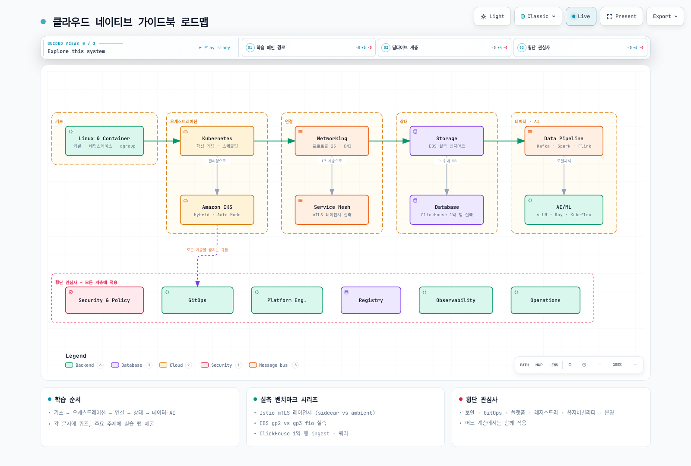

# 가이드북 로드맵

> **마지막 업데이트**: 2026년 9월 2일

이 가이드북은 Linux 커널에서 시작해 컨테이너, Kubernetes, Amazon EKS, 네트워킹, 서비스 메시, 스토리지, 데이터베이스, 데이터 파이프라인, AI/ML, 그리고 보안·GitOps·플랫폼 엔지니어링·컨테이너 레지스트리·옵저버빌리티·운영까지 — 클라우드 네이티브 스택 전체를 하나의 서사로 다룹니다. 이 페이지는 전체 지도이자 추천 학습 경로입니다.

[🔍 인터랙티브 다이어그램 보기](https://www.atomai.click/kubernetes-docs/archmaps/ko-roadmap-0.html)

## 도메인 지도

| 계층 | 도메인 | 시작점 | 한 줄 요약 |
|------|--------|--------|-----------|
| 기초 | Linux & Container | [Linux 기초](basics/01-linux-basics.md) | 커널, 네임스페이스, cgroup — 컨테이너의 실체 |
| 오케스트레이션 | Kubernetes 핵심 개념 | [Kubernetes 소개](basics/04-kubernetes-introduction.md) | 워크로드·스케줄링·오토스케일링까지 K8s 그 자체 |
| 오케스트레이션 | Amazon EKS | [EKS 소개](eks/01-eks-introduction.md) | 클러스터 생성부터 하이브리드/Auto Mode까지 |
| 연결 | Networking | [네트워크 기초](basics/06-network-fundamentals-part1.md) | 프로토콜 25개부터 CNI(Cilium/Calico)까지 |
| 연결 | Service Mesh | [Istio](service-mesh/istio/README.md) | Istio/Linkerd/Cilium Mesh — mTLS 레이턴시 실측 포함 |
| 상태 | Storage | [Storage 개요](storage/README.md) | EBS gp2 vs gp3 fio 실측 벤치마크 |
| 상태 | Database | [Database 개요](database/README.md) | Operator 지형과 ClickHouse 1억 행 실측 |
| 데이터·AI | Data Pipeline | [Data on EKS 개요](data-on-eks/README.md) | Kafka·Spark·Airflow·Flink 딥다이브 — Kafka RF3/gp3 ingest 상한 실측 포함 |
| 데이터·AI | AI/ML | [AI/ML 워크로드](ai-ml/01-ai-ml-workloads.md) | vLLM·Ray·Kubeflow·MLflow on EKS |
| 횡단 | Security & Policy | [Kyverno](security/01-kyverno-policy-management.md) | 인증/인가, 정책, 런타임 보안, 공급망 |
| 횡단 | GitOps | [GitOps](gitops/README.md) | ArgoCD·Flux·Progressive Delivery |
| 횡단 | Platform Engineering | [개요](platform-engineering/00-platform-engineering-overview.md) | ACK·KRO·Crossplane·Backstage |
| 횡단 | Container Registry | [개요](container-registry/README.md) | ECR·Harbor·이미지 공급망 |
| 횡단 | Observability | [개요](observability/README.md) | 메트릭·로그·트레이싱·알림 스택 |
| 횡단 | Operations Guide | [운영 가이드](ops/README.md) | 용량 계획·FinOps·업그레이드와 증상 기반 [트러블슈팅 플레이북](ops/16-troubleshooting-playbook.md) |

## 실측 벤치마크 시리즈

스펙 시트가 아니라 실제 AWS 리소스에서 직접 측정한 숫자를 담은 문서들입니다:

- [Istio sidecar vs ambient 실측](service-mesh/istio/comparison/03-sidecar-vs-ambient.md) — mTLS 데이터플레인별 P50/P99 레이턴시와 rollout 중 503 비율
- [EBS gp2 vs gp3 실측 벤치마크](storage/01-ebs-gp2-gp3-benchmark.md) — 같은 100GiB에서 IOPS 10배 차이와 gp2 버스트 크레딧 절벽
- [ClickHouse on EKS 실측 벤치마크](database/01-clickhouse-on-eks.md) — 1억 행 ingest 처리량, 압축률, 쿼리 레이턴시
- [Kafka on EKS 실측 벤치마크](data-on-eks/kafka/09-kafka-benchmark.md) — RF3 클러스터 ingest 상한 ≈130–135 MiB/s(= gp3 볼륨 1개 쓰기 캡)과 RF1 338 MiB/s, acks별 p99, 콜드 컨슈머가 프로듀서 처리량을 약 45% 깎는 현상
- [Pod 네트워크 실측 벤치마크](networking/06-pod-network-benchmark.md) — 같은 노드 0.040 ms → 같은 AZ 0.339 ms → 다른 AZ 0.544 ms RTT 사다리, AZ와 무관한 단일 TCP 플로우 4.96 Gbps 상한과 8플로우 9.94 Gbps, `ndots:5`의 10쿼리/8 NXDOMAIN 증폭

## 다이어그램 공유하기 — LinkedIn·발표용 내보내기

이 가이드북의 모든 인터랙티브 다이어그램은 `https://www.atomai.click/kubernetes-docs/archmaps/<이름>.html`에서 열리고, 뷰어 툴바의 **Export** 버튼(단축키 `E`)이 공유용 파일을 바로 만들어 줍니다. 별도 캡처 도구 없이 다이어그램 페이지 하나로 끝납니다.

### Export 메뉴 구성

| 그룹 | 메뉴 항목 | 결과물 | 언제 쓰나 |
|------|-----------|--------|-----------|
| Share | **Share Card** / **Copy Share Card** | 1200×630 PNG (다운로드 / 클립보드) | LinkedIn·X 링크 미리보기, README, 릴리스 노트 |
| Share | **Route Share Card** | 1200×630 PNG (다운로드 전용) | Route Probe(`R`)로 두 노드 사이 경로를 추적한 뒤에만 나타남 |
| Share | **Reach Share Card** | 1200×630 PNG (다운로드 전용) | Semantic Passport에서 노드의 upstream/downstream 도달성을 조회한 뒤에만 나타남 |
| Share | **Copy diagram** | 전체 다이어그램 PNG를 클립보드로 | 슬라이드·문서에 바로 붙여넣기 |
| Image | **PNG** / **JPEG** / **WebP** | 전체 다이어그램 래스터 이미지 | 무손실이 필요하면 PNG, 용량이 중요하면 JPEG/WebP |
| Vector & motion | **SVG** | 라이트·다크 테마를 모두 담은 벡터 | 확대해도 깨지지 않는 발표 자료 |
| Vector & motion | **WebM** | 트레이스 애니메이션 6초 녹화 | 피드에서 흐름이 실제로 "움직이는" LinkedIn 포스트 |

내보내기 결과물에서는 뷰어 상태(가이드 패널, 렌즈, 검색창, 포커스, 경로, 스토리, 카메라 위치, 레이더, 프레젠테이션 모드, 임시 오버레이)가 모두 제거되고 다이어그램 본체만 남습니다. Share Card는 현재 테마와 비주얼 프리셋을 그대로 쓰되 다이어그램 전체를 잘림 없이 담습니다. WebM 녹화는 트레이스 애니메이션이 있는 다이어그램과 브라우저의 MediaRecorder 지원이 필요하며, 미지원 브라우저에서는 메뉴가 그렇게 알려줍니다.

### LinkedIn 포스팅용 30초 레시피

1. **다이어그램 열기** — 문서에 삽입된 다이어그램 아래의 "전체 화면으로 열기 ↗"(GitBook에서는 "🔍 인터랙티브 다이어그램 보기") 링크를 클릭합니다.
2. **트레이스 재생 확인** — 툴바의 **Live/Still** 토글이 Live인지 확인합니다. 화살표를 따라 흐르는 이 모션이 영상에 담기는 내용입니다. 발표 리허설이라면 **Presentation stage**(`F`)로 다이어그램에 화면 전체를 내어 주세요.
3. **Export → WebM**(움직이는 포스트) 또는 **Export → Share Card**(1200×630 정적 미리보기) — WebM은 "Recording 6 seconds of motion…" 표시 후 파일이 내려옵니다.
4. **포스트** — WebM은 영상으로, Share Card는 이미지로 올리고 원문 문서 URL을 함께 붙입니다. 특정 노드·경로·스토리 장면을 짚어 주려면 Semantic Passport와 Route Probe의 **Copy link**, Story Beat의 **Copy moment**(스토리 챕터가 정의된 다이어그램에서만 보입니다)로 딥링크를 복사해 댓글이나 슬라이드에 넣으세요.

### 내보내기의 한계 — 정직하게 말하기

- 내보낸 파일은 **커뮤니케이션 자산**입니다. 아키텍처가 검증됐다는 증거가 아니며, 게시된 원본 HTML과 작성자의 검증 과정을 대신하지 않습니다. Share Card에도 "검증됨" 같은 표시는 붙지 않습니다.
- Route Share Card는 **작성자가 명시한 방향성 관계**만 따라 계산된 경로입니다. 도형이 가까이 있다는 이유로 경로를 추측하지 않고, 경로가 바뀌었거나 도달 불가능하면 내보내기를 거부합니다.
- Reach Share Card가 보여 주는 것은 *authored reachability*입니다. 영향 범위(impact), 장애 반경(blast radius), 장애 전파(breakage), 런타임 인과관계로 해석해 소개하지 마세요.

## 추천 학습 경로

### ① 인프라 입문 — "컨테이너부터 EKS까지"

Linux 기초 → 컨테이너 기술 → Kubernetes 소개 → 핵심 개념(파드/서비스/스토리지/구성) → EKS 클러스터 생성 → 네트워크 기초. 각 문서의 퀴즈로 이해를 점검하고, [실습 랩](labs/README.md)을 병행하세요.

### ② 플랫폼/SRE — "운영 가능한 클러스터"

EKS 운영(업그레이드/문제 해결/복원력) → Networking(VPC CNI, Cilium) → Service Mesh 비교 가이드 → Security & Policy → Observability 스택 → GitOps → Operations Guide의 용량 계획/FinOps. 실측 벤치마크 시리즈가 이 경로의 판단 근거를 제공합니다.

### ③ 데이터·AI 플랫폼 — "상태와 데이터의 세계"

Storage → Database → Data Pipeline(Kafka → Spark → Airflow → Flink) → AI/ML(vLLM → Ray → Kubeflow). GPU/스케줄링이 필요하면 Kubernetes 핵심 개념의 Custom Scheduler 파트를 함께 보세요.

## AI와 함께 읽기

이 가이드북 전체는 llms.txt 표준으로도 제공됩니다 — LLM에게 URL 하나로 전체 콘텐츠를 읽힐 수 있습니다. 엔드포인트와 활용 예시는 [LLM과 함께 읽기](llm-guide.md)에서 확인하세요.
