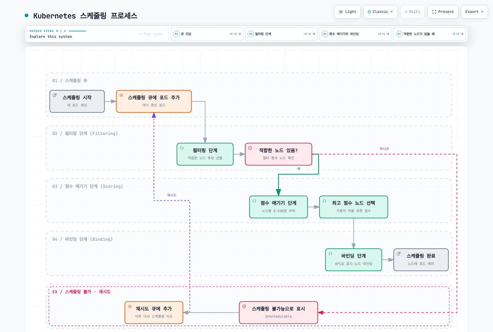
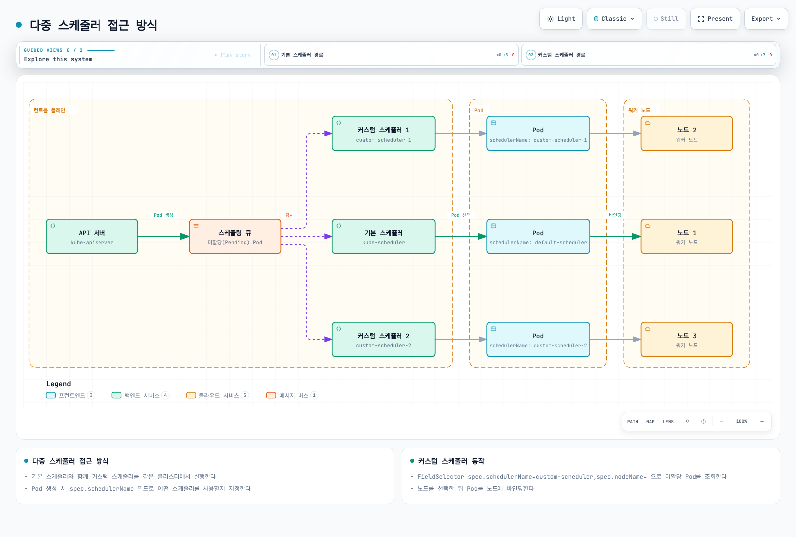
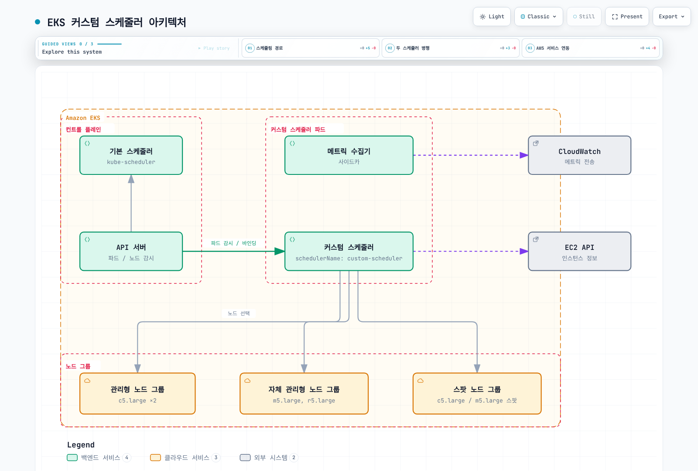

# Custom Scheduler

> **예제 기준 버전**: Kubernetes 1.35.8, Go 1.27.1
> **마지막 업데이트**: 2026년 9월 11일

Kubernetes 스케줄러는 포드를 어떤 노드에 배치할지 결정하는 중요한 구성 요소입니다. 기본 스케줄러는 대부분의 경우 잘 작동하지만, 특정 요구 사항이 있는 경우 커스텀 스케줄러를 구현할 수 있습니다. 이 장에서는 EKS에서 커스텀 스케줄러를 구현하는 방법을 알아보겠습니다.

## 실습 환경 설정

이 문서의 예제를 따라하기 위해서는 다음과 같은 도구와 환경이 필요합니다:

### 필수 도구

* 클러스터 API 서버와 마이너 버전 차이가 1 이내인 kubectl
* 아래 재현 예제용 Go 1.27.1 및 Python 3
* Linux 워커 노드가 있는 폐기 가능한 Kubernetes 1.35 실습 클러스터. EKS는 먼저 [AWS 버전 일정](https://docs.aws.amazon.com/eks/latest/userguide/kubernetes-versions.html)을 확인

이 문서의 프레임워크 인터페이스와 설정은 Kubernetes **1.35.8**을 기준으로 확인했습니다. 예제 기준 버전이며, 최신 Kubernetes 또는 EKS 버전이라는 뜻이 아닙니다. 스케줄러를 클러스터 마이너 버전에 맞추고 업그레이드 시 플러그인·기능 게이트·RBAC를 다시 검증하세요. Kubernetes 모듈의 staging 의존성은 `v0.0.0`을 사용하므로 `go get k8s.io/kubernetes`만으로는 독립 모듈의 의존성을 해결할 수 없습니다.

### 개발 환경 설정

```bash
mkdir -p custom-scheduler
cd custom-scheduler

# Generate a standalone module from the pinned upstream staging-module list.
python3 - <<'PY'
from pathlib import Path
import re
from urllib.request import urlopen

version = "v1.35.8"
staging_version = "v0.35.8"
url = f"https://raw.githubusercontent.com/kubernetes/kubernetes/{version}/go.mod"
with urlopen(url, timeout=30) as response:
    upstream = response.read().decode()
modules = re.findall(r"^\s*(k8s\.io/[\w-]+) => \./staging/src/\1\s*$", upstream, re.M)
if not modules:
    raise RuntimeError("No staging modules found; review upstream go.mod")
text = f"module example.com/custom-scheduler\n\ngo 1.27.1\n\nrequire k8s.io/kubernetes {version}\n\nreplace (\n"
text += "".join(f"\t{m} => {m} {staging_version}\n" for m in modules)
Path("go.mod").write_text(text + ")\n")
PY
```

## 스케줄링 개요

### Kubernetes 스케줄링 프로세스

Kubernetes 스케줄링 프로세스는 다음과 같은 단계로 이루어집니다:



[🔍 인터랙티브 다이어그램 보기](https://www.atomai.click/kubernetes-docs/archmaps/ko-scheduling-01-custom-scheduler-part1-10.html)

### 스케줄링 단계 상세 설명

1. **필터링 단계 (Filtering Phase)**
   * 포드가 실행될 수 있는 적합한 노드를 찾는 단계
   * 각 필터 플러그인은 노드가 포드를 호스팅할 수 있는지 여부를 결정
   * 하나의 필터라도 실패하면 해당 노드는 후보에서 제외됨
2. **점수 매기기 단계 (Scoring Phase)**
   * 필터링을 통과한 노드에 점수를 매기는 단계
   * 각 점수 플러그인은 선택적인 정규화 이후 0–100 범위의 점수를 반환
   * 가중치를 적용하여 최종 점수 계산
3. **바인딩 단계 (Binding Phase)**
   * 최고 점수를 받은 노드에 포드를 할당하는 단계
   * Kubernetes API를 통해 포드-노드 바인딩 정보 업데이트

## 커스텀 스케줄러가 필요한 경우

다음과 같은 경우에 커스텀 스케줄러를 고려할 수 있습니다:

1. **특수한 하드웨어 요구 사항**: GPU, FPGA, 특수 네트워크 장치 등
2. **복잡한 워크로드 배치 규칙**: 특정 노드 그룹에 특정 워크로드 배치
3. **비용 최적화**: 스팟 인스턴스와 온디맨드 인스턴스 간의 최적 배치
4. **지역성 요구 사항**: 데이터 지역성을 고려한 워크로드 배치
5. **다중 스케줄러 시나리오**: 다양한 워크로드 유형에 대해 여러 스케줄러 사용

### 실제 사용 사례

| 산업  | 사용 사례      | 커스텀 스케줄러 이점                   |
| --- | ---------- | ----------------------------- |
| 금융  | 고주파 거래 시스템 | 지연 시간 최소화를 위한 네트워크 토폴로지 인식 배치 |
| 의료  | 의료 영상 처리   | GPU 배치와 데이터 지역성 선호      |
| 통신  | 5G 네트워크 기능 | 레이블이 있는 네트워크 장치에 대한 배치 제약         |
| 소매  | 계절적 트래픽 처리 | 비용 효율적인 스팟 인스턴스 활용 최적화        |
| 미디어 | 비디오 트랜스코딩  | 워크로드 특성에 따른 CPU/GPU 노드 선택     |

1. **필터링(Filtering)**: 포드를 실행할 수 있는 노드를 식별합니다. 이 단계에서는 리소스 요구 사항, 노드 선택기, 노드 어피니티, 테인트 및 톨러레이션 등을 고려합니다.
2. **점수 매기기(Scoring)**: 필터링된 노드에 점수를 매깁니다. 이 단계에서는 노드의 리소스 사용량, 포드 간 어피니티, 노드 어피니티 등을 고려합니다.
3. **바인딩(Binding)**: 가장 높은 점수를 받은 노드에 포드를 할당합니다.

코드를 작성하기 전에 device plugin, required/preferred affinity, taint/toleration, topology spread로 요구 사항을 표현할 수 있는지 확인하세요. 일반적인 GPU 요청에는 커스텀 스케줄러가 필요하지 않습니다.

### 기본 스케줄러의 한계

기본 스케줄러는 다음과 같은 한계가 있을 수 있습니다:

1. **특정 하드웨어 요구 사항**: GPU, FPGA 등 특수 하드웨어에 대한 고급 스케줄링 로직이 필요할 수 있습니다.
2. **복잡한 어피니티 규칙**: 기본 어피니티 규칙으로는 표현하기 어려운 복잡한 배치 제약 조건이 있을 수 있습니다.
3. **사용자 정의 메트릭**: 기본 스케줄러가 고려하지 않는 사용자 정의 메트릭을 기반으로 스케줄링해야 할 수 있습니다.
4. **특정 도메인 지식**: 특정 애플리케이션 도메인에 특화된 스케줄링 로직이 필요할 수 있습니다.

## 커스텀 스케줄러 구현 방법

커스텀 스케줄러를 구현하는 방법은 크게 세 가지가 있습니다:

1. **다중 스케줄러 접근 방식**: 기본 스케줄러와 함께 커스텀 스케줄러를 실행합니다.
2. **스케줄러 확장(Extender) 접근 방식**: 기본 스케줄러를 확장하여 추가 필터링 및 우선순위 기능을 제공합니다.
3. **스케줄러 프레임워크 플러그인**: Kubernetes 1.15부터 도입된 스케줄러 프레임워크를 사용하여 플러그인을 개발합니다.

### 다중 스케줄러 접근 방식

다중 스케줄러 접근 방식에서는 기본 스케줄러와 함께 커스텀 스케줄러를 실행합니다. 포드를 생성할 때 `schedulerName` 필드를 사용하여 어떤 스케줄러를 사용할지 지정할 수 있습니다.



[🔍 인터랙티브 다이어그램 보기](https://www.atomai.click/kubernetes-docs/archmaps/ko-scheduling-01-custom-scheduler-part1-11.html)

#### 커스텀 스케줄러 구현

upstream 스케줄러 명령을 별도 스케줄러의 기반으로 사용합니다. 그러면 `NodeResourcesFit`, `TaintToleration`, `NodeAffinity`, `VolumeBinding` 등 기본 플러그인을 유지할 수 있습니다. 첫 번째 Ready 노드를 골라 바인딩 API를 호출하는 방식은 이러한 검사를 우회합니다.

다음을 `main.go`로 저장합니다. 아직 사용자 정의 배치 정책은 추가하지 않습니다. 뒤의 점수 함수와 퀴즈에서 확장 지점을 다룹니다.

```go
package main

import (
    "os"

    "k8s.io/component-base/cli"
    "k8s.io/kubernetes/cmd/kube-scheduler/app"
)

func main() {
    os.Exit(cli.Run(app.NewSchedulerCommand()))
}
```

#### 커스텀 스케줄러 배포

아래 `Dockerfile`을 저장하고 로컬 빌드 명령을 실행한 다음, 승인된 레지스트리 절차로 이미지를 배포하세요. 매니페스트의 `registry.example.com/...`을 해당 이미지로 바꾸고 가능하면 digest로 고정합니다. 바이너리와 이미지 아키텍처는 워커 노드와 일치해야 합니다.

```dockerfile
FROM gcr.io/distroless/static-debian12:nonroot
COPY custom-scheduler /custom-scheduler
ENTRYPOINT ["/custom-scheduler"]
```

```bash
go mod tidy
CGO_ENABLED=0 go build -buildvcs=false -trimpath -o custom-scheduler .
# Build for the same architecture as the scheduler's worker nodes.
docker build -t custom-scheduler:v1.35.8-1 .
```

이 구성은 실습용이며 운영 환경에서 HA를 검증한 레시피가 아닙니다. 스케줄러 Pod 자체는 `default-scheduler`를 사용하므로 `custom-scheduler`가 없어도 시작할 수 있습니다. 두 복제본은 `scheduler-lab`의 **동일한 Lease**를 공유합니다. 다른 스케줄러 그룹에는 별도 Lease가 필요합니다. 선호 anti-affinity는 배치에 도움을 주지만 호스트·AZ 분리를 보장하지 않습니다.

관리자는 참조한 기본 RBAC 역할이 존재하는지 확인해야 합니다. `system:kube-scheduler`와 `system:volume-scheduler`는 바인딩·선점을 포함한 강력한 클러스터 전체 스케줄링 권한을 부여합니다. `schedulerName`은 보안 경계가 아닙니다. 별도 Role로 자체 Lease 권한을 추가하며 Kubernetes 기본 역할은 변경하지 않습니다. HTTPS 엔드포인트는 비공개로 유지하고 대상 클러스터에서 리소스 크기와 장애 동작을 검증하세요.

```yaml
apiVersion: v1
kind: Namespace
metadata:
  name: scheduler-lab
---
apiVersion: v1
kind: ServiceAccount
metadata:
  name: custom-scheduler
  namespace: scheduler-lab
---
apiVersion: rbac.authorization.k8s.io/v1
kind: ClusterRoleBinding
metadata:
  name: scheduler-lab-scheduling
subjects:
- kind: ServiceAccount
  name: custom-scheduler
  namespace: scheduler-lab
roleRef:
  apiGroup: rbac.authorization.k8s.io
  kind: ClusterRole
  name: system:kube-scheduler
---
apiVersion: rbac.authorization.k8s.io/v1
kind: ClusterRoleBinding
metadata:
  name: scheduler-lab-volumes
subjects:
- kind: ServiceAccount
  name: custom-scheduler
  namespace: scheduler-lab
roleRef:
  apiGroup: rbac.authorization.k8s.io
  kind: ClusterRole
  name: system:volume-scheduler
---
apiVersion: rbac.authorization.k8s.io/v1
kind: RoleBinding
metadata:
  name: scheduler-lab-authentication
  namespace: kube-system
subjects:
- kind: ServiceAccount
  name: custom-scheduler
  namespace: scheduler-lab
roleRef:
  apiGroup: rbac.authorization.k8s.io
  kind: Role
  name: extension-apiserver-authentication-reader
---
apiVersion: rbac.authorization.k8s.io/v1
kind: Role
metadata:
  name: custom-scheduler-leader-election
  namespace: scheduler-lab
rules:
- apiGroups: ["coordination.k8s.io"]
  resources: ["leases"]
  verbs: ["create"]
- apiGroups: ["coordination.k8s.io"]
  resources: ["leases"]
  resourceNames: ["custom-scheduler"]
  verbs: ["get", "update", "patch"]
---
apiVersion: rbac.authorization.k8s.io/v1
kind: RoleBinding
metadata:
  name: custom-scheduler-leader-election
  namespace: scheduler-lab
subjects:
- kind: ServiceAccount
  name: custom-scheduler
  namespace: scheduler-lab
roleRef:
  apiGroup: rbac.authorization.k8s.io
  kind: Role
  name: custom-scheduler-leader-election
---
apiVersion: v1
kind: ConfigMap
metadata:
  name: custom-scheduler-config
  namespace: scheduler-lab
data:
  config.yaml: |
    apiVersion: kubescheduler.config.k8s.io/v1
    kind: KubeSchedulerConfiguration
    leaderElection:
      leaderElect: true
      resourceLock: leases
      resourceName: custom-scheduler
      resourceNamespace: scheduler-lab
      leaseDuration: 15s
      renewDeadline: 10s
      retryPeriod: 2s
    profiles:
    - schedulerName: custom-scheduler
---
apiVersion: apps/v1
kind: Deployment
metadata:
  name: custom-scheduler
  namespace: scheduler-lab
spec:
  replicas: 2
  selector:
    matchLabels:
      app: custom-scheduler
  template:
    metadata:
      labels:
        app: custom-scheduler
    spec:
      serviceAccountName: custom-scheduler
      securityContext:
        runAsUser: 65532
        runAsGroup: 65532
        fsGroup: 65532
      nodeSelector:
        kubernetes.io/os: linux
      affinity:
        podAntiAffinity:
          preferredDuringSchedulingIgnoredDuringExecution:
          - weight: 100
            podAffinityTerm:
              topologyKey: kubernetes.io/hostname
              labelSelector:
                matchLabels:
                  app: custom-scheduler
      containers:
      - name: custom-scheduler
        image: registry.example.com/training/custom-scheduler:v1.35.8-1
        args:
        - --config=/etc/scheduler/config.yaml
        - --cert-dir=/tmp
        ports:
        - name: https
          containerPort: 10259
        livenessProbe:
          httpGet:
            path: /healthz
            port: https
            scheme: HTTPS
          initialDelaySeconds: 15
        securityContext:
          runAsNonRoot: true
          allowPrivilegeEscalation: false
          readOnlyRootFilesystem: true
          capabilities:
            drop: ["ALL"]
          seccompProfile:
            type: RuntimeDefault
        resources:
          requests:
            cpu: 100m
            memory: 256Mi
          limits:
            memory: 512Mi
        volumeMounts:
        - name: config
          mountPath: /etc/scheduler
          readOnly: true
        - name: tmp
          mountPath: /tmp
      volumes:
      - name: config
        configMap:
          name: custom-scheduler-config
      - name: tmp
        emptyDir: {}
```

#### 커스텀 스케줄러 사용

포드를 생성할 때 `schedulerName` 필드를 사용하여 커스텀 스케줄러를 지정합니다:

```yaml
apiVersion: v1
kind: Pod
metadata:
  name: nginx
spec:
  schedulerName: custom-scheduler
  containers:
  - name: nginx
    image: nginx:1.30.4
    resources:
      requests:
        cpu: 100m
        memory: 64Mi
      limits:
        memory: 128Mi
```

## EKS에서의 커스텀 스케줄러 구현

Amazon EKS에서 커스텀 스케줄러를 구현할 때는 다음 사항을 고려합니다:

1. **Kubernetes 인증·인가**: 클러스터 내부 스케줄러는 ServiceAccount 토큰과 Kubernetes RBAC를 사용합니다. EC2·CloudWatch 같은 AWS API도 호출할 때만 추가 IAM 권한이 필요하며, 해당 워크로드 자격 증명에 필요한 권한만 부여합니다.
2. **관리형 컨트롤 플레인**: 자체 보조 스케줄러를 워커 노드에 실행합니다. 관리형 기본 스케줄러의 프로세스·플래그·플러그인 레지스트리를 수정할 수 있다고 가정하지 마세요.
3. **컴퓨팅 경계**: 이 예제는 EC2 워커 노드 대상입니다. [EKS Fargate는 AWS 관리형 스케줄링·어드미션 컨트롤러](https://docs.aws.amazon.com/eks/latest/userguide/fargate.html)를 사용합니다. Fargate 노드를 선택하거나 `custom-scheduler`를 지정한다고 Fargate 용량이 생성되지는 않습니다.
4. **토폴로지·인스턴스 레이블**: 기존 노드 레이블, 리소스 요청, affinity, topology spread를 먼저 활용합니다. 커스텀 스케줄러는 용량을 생성하거나 지연 시간을 보장하지 않습니다.

### EKS 커스텀 스케줄러 아키텍처

각 스케줄러는 Kubernetes API를 감시하고 일치하는 Pod를 위한 **자체 캐시와 큐**를 유지합니다. API 서버는 Pod 상태를 저장·제공하며 공용 스케줄링 큐를 소유하지 않습니다. EC2·CloudWatch 연동은 선택 사항이고, 느리거나 실패한 메트릭 조회에는 제한된 타임아웃과 명시적인 대체 정책이 필요합니다.



[🔍 인터랙티브 다이어그램 보기](https://www.atomai.click/kubernetes-docs/archmaps/ko-scheduling-01-custom-scheduler-part1-12.html)

### EKS 특화 스케줄링 고려 사항

아래 함수는 `preferences` 패키지의 별도 파일에 저장하는 **선호도 점수 예제**입니다. 앞의 바이너리에 자동 등록되지 않습니다. 기본 필터를 통과한 뒤 검증된 프레임워크 `Score` 플러그인에서 호출하세요. **0점인 노드도 후보로 남습니다.** 필수 조건은 필터나 required affinity로 표현하고 점수는 0–100 범위를 유지합니다.

#### 1. 인스턴스 유형 인식 스케줄링

아래 c5/m5/r5 가중치는 레이블 기반 선호도를 설명하기 위한 값입니다. 실측 성능 순위나 해당 세대의 구매 권고가 아닙니다. 실제 워크로드는 적합한 인스턴스를 벤치마크한 뒤 선호도를 명시적으로 설정하세요.

```go
package preferences

import (
	"strings"

	v1 "k8s.io/api/core/v1"
)

// Illustrative weights, not measured performance or current purchase advice.
func ScoreInstanceType(node *v1.Node) int64 {
	switch {
	case strings.HasPrefix(node.Labels["node.kubernetes.io/instance-type"], "c5."):
		return 100
	case strings.HasPrefix(node.Labels["node.kubernetes.io/instance-type"], "m5."):
		return 50
	case strings.HasPrefix(node.Labels["node.kubernetes.io/instance-type"], "r5."):
		return 30
	default:
		return 10
	}
}
```

#### 2. 가용 영역 분산 스케줄링

기본 `PodTopologySpread` 플러그인과 `topologySpreadConstraints`를 먼저 사용하세요. 별도 점수가 필요하면 스케줄러 캐시에서 대상 워크로드와 모든 적격 AZ를 포함한 일관된 사이클 스냅샷을 만듭니다. Pod가 0개인 AZ도 포함하고 할당·assume된 Pod를 적절히 집계합니다. Running Pod만 세면 예약된 요청을 놓칩니다. 후보 노드마다 API list/get을 반복하거나 API 오류를 임의의 개수로 바꾸지 마세요.

```go
package preferences

import (
	"fmt"

	v1 "k8s.io/api/core/v1"
)

// counts is a consistent snapshot for one workload, including empty eligible zones.
// Build it once per scheduling cycle, not by making API calls for every node.
func ScoreAZ(node *v1.Node, counts map[string]int) (int64, error) {
	zone := node.Labels["topology.kubernetes.io/zone"]
	count, ok := counts[zone]
	if zone == "" || !ok {
		return 0, fmt.Errorf("missing eligible-zone snapshot for node %q", node.Name)
	}
	maxCount := 0
	for _, n := range counts {
		if n < 0 {
			return 0, fmt.Errorf("negative pod count")
		}
		if n > maxCount {
			maxCount = n
		}
	}
	if maxCount == 0 {
		return 100, nil
	}
	return int64(100 * (maxCount - count) / maxCount), nil
}
```

#### 3. 스팟 인스턴스 인식 스케줄링

[EKS 관리형 노드 그룹](https://docs.aws.amazon.com/eks/latest/userguide/managed-node-groups.html)은 `eks.amazonaws.com/capacityType`의 `SPOT` / `ON_DEMAND` 값을, [Karpenter](https://karpenter.sh/docs/concepts/nodepools/)는 `karpenter.sh/capacity-type`의 `spot` / `on-demand` / `reserved` 값을 사용합니다. `node.kubernetes.io/lifecycle`은 이에 해당하는 표준 레이블이 아닙니다. 아래 함수는 Pod의 명시적인 선호도만 적용하고 알 수 없는 레이블에는 중립 점수를 줍니다. 용량 유형이 필수이면 required affinity를 사용하세요. 점수만으로 Spot 가격이나 중단 허용 여부를 판단할 수 없습니다.

```go
package preferences

import v1 "k8s.io/api/core/v1"

func ScoreCapacityType(node *v1.Node, pod *v1.Pod) int64 {
	preferred := pod.Labels["lifecycle-preference"]
	if preferred != "spot" && preferred != "on-demand" {
		return 50
	}
	actual := node.Labels["karpenter.sh/capacity-type"]
	if actual == "" {
		switch node.Labels["eks.amazonaws.com/capacityType"] {
		case "SPOT":
			actual = "spot"
		case "ON_DEMAND":
			actual = "on-demand"
		}
	}
	if actual != "spot" && actual != "on-demand" && actual != "reserved" {
		return 50
	}
	if actual == preferred {
		return 100
	}
	return 0
}
```

#### 4. GPU 워크로드 스케줄링

device plugin이 GPU 리소스를 광고하고 어드미션을 거친 Pod가 해당 리소스를 요청해야 합니다. 확장 리소스에서 limit만 지정하면 동일한 request가 기본 설정되며, 0인 request는 GPU 수요가 아닙니다. `NodeResourcesFit`은 유효 요청량을 기존·assume된 요청을 제외한 allocatable과 비교합니다. `Capacity`만으로 남은 GPU를 알 수 없습니다.

이 함수는 GPU가 필요 없는 워크로드의 GPU 노드 사용을 낮게 평가할 뿐입니다. 버전에 맞는 리소스 도우미로 init/sidecar/overhead를 고려하며, API 기본값이 적용된 Pod를 전제로 합니다. GPU 적격성을 판정하거나 모든 DRA 리소스 모델을 처리하거나 기본 리소스 필터를 대체하지 않습니다.

```go
package preferences

import (
	v1 "k8s.io/api/core/v1"
	resourcehelper "k8s.io/component-helpers/resource"
)

// pod must be API-defaulted; limits-only extended resources acquire requests.
// NodeResourcesFit still decides whether the effective request fits.
func ScoreGPU(node *v1.Node, pod *v1.Pod) int64 {
	requests := resourcehelper.PodRequests(pod, resourcehelper.PodResourcesOptions{})
	gpuRequest := requests[v1.ResourceName("nvidia.com/gpu")]
	if gpuRequest.Sign() > 0 {
		return 50
	}
	gpuAllocatable := node.Status.Allocatable[v1.ResourceName("nvidia.com/gpu")]
	if gpuAllocatable.Sign() > 0 {
		return 0
	}
	return 100
}
```

## 결론

이 장에서는 Kubernetes 스케줄링 프로세스의 개요와 다중 스케줄러 접근 방식을 사용하여 커스텀 스케줄러를 구현하는 방법을 알아보았습니다. 또한 EKS 클러스터에서 커스텀 스케줄러를 구현할 때 고려해야 할 사항들을 살펴보았습니다.

다음 장에서는 스케줄러 확장(Extender) 접근 방식과 스케줄러 프레임워크 플러그인을 사용하여 커스텀 스케줄러를 구현하는 방법을 알아보겠습니다.

## 검증 범위와 참고 자료

Go 명령·플러그인·설정은 고정된 의존성 버전으로 로컬 검증합니다. 이번 감사에서 클러스터 배포, 이미지 push, AWS 호출, 배치 벤치마크 또는 HA 장애 전환 테스트는 실행하지 않았습니다.

* [다중 스케줄러 구성](https://kubernetes.io/docs/tasks/extend-kubernetes/configure-multiple-schedulers/) — 구조·RBAC 패턴 참고용이며 오래된 이미지·빌드 예제는 버전 지침으로 사용하지 않음
* [스케줄러 설정](https://kubernetes.io/docs/reference/scheduling/config/)
* [스케줄링 프레임워크](https://kubernetes.io/docs/concepts/scheduling-eviction/scheduling-framework/)
* [Kubernetes 1.35.8 프레임워크 인터페이스](https://github.com/kubernetes/kubernetes/blob/v1.35.8/staging/src/k8s.io/kube-scheduler/framework/interface.go)
* [Kubernetes 1.35.8 기본 플러그인](https://github.com/kubernetes/kubernetes/blob/v1.35.8/pkg/scheduler/apis/config/v1/default_plugins.go)

## 퀴즈

이 장에서 배운 내용을 테스트하려면 [주제 퀴즈](../quizzes/scheduling/02-custom-scheduler-part1-quiz.md)를 풀어보세요.
