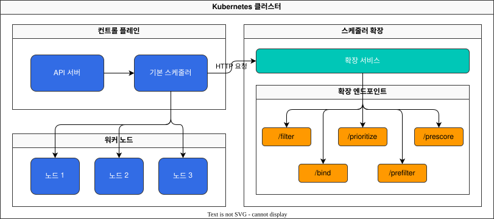
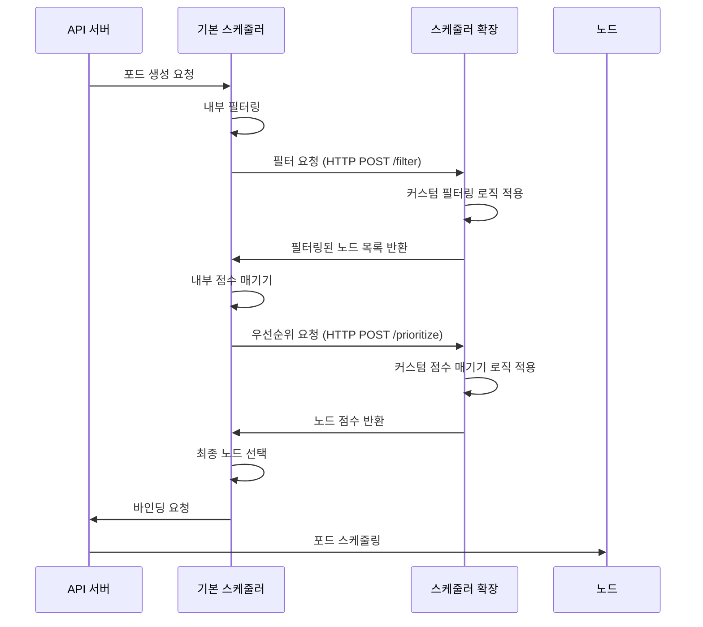
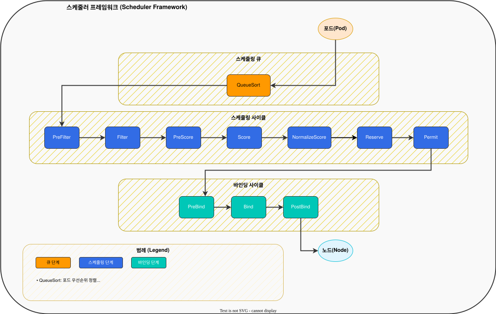
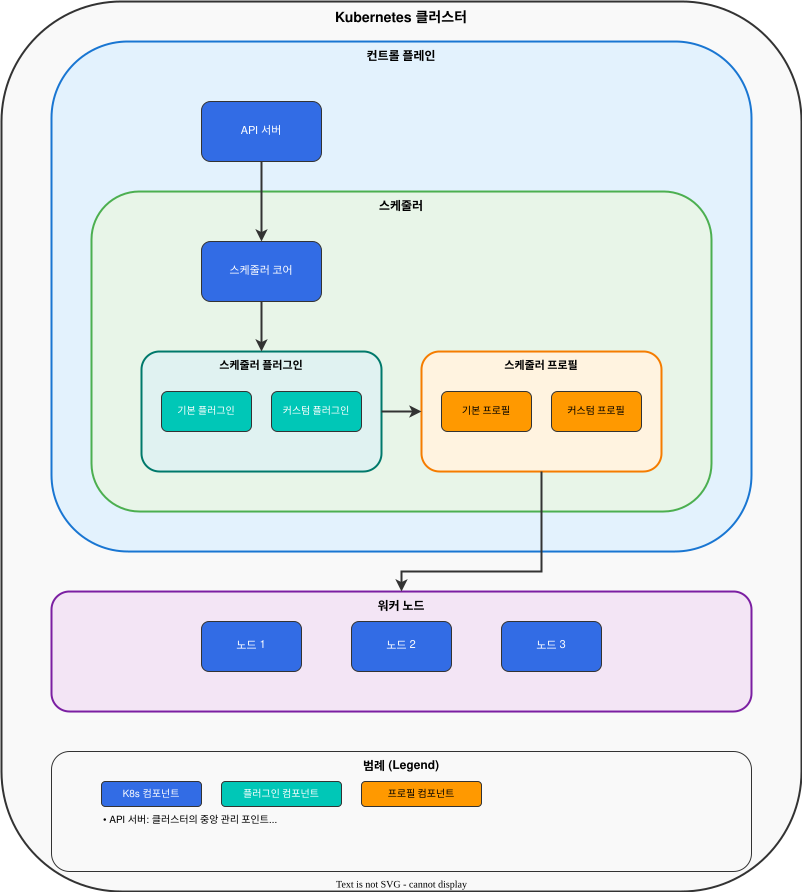
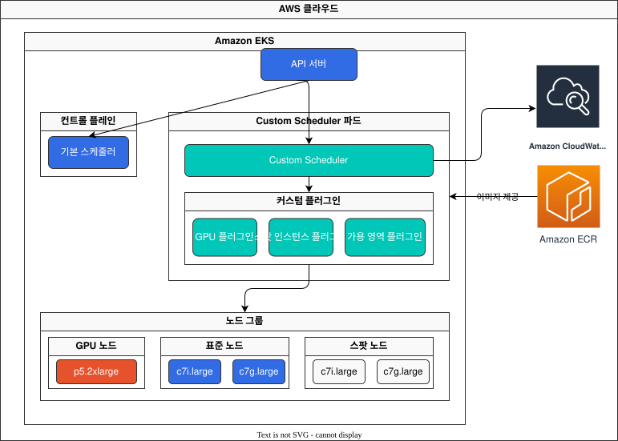

# Part 2: 구현

## 스케줄러 확장(Extender) 접근 방식

스케줄러 확장 접근 방식은 기본 스케줄러의 기능을 확장하는 방법입니다. 이 접근 방식에서는 기본 스케줄러가 HTTP 요청을 통해 외부 서비스(스케줄러 확장)를 호출하여 추가 필터링 및 우선순위 기능을 제공합니다.

### 스케줄러 확장 아키텍처

다음 다이어그램은 스케줄러 확장 접근 방식의 아키텍처를 보여줍니다:



### 스케줄러 확장 워크플로우

스케줄러 확장의 워크플로우는 다음과 같습니다:



### 스케줄러 확장 구현

스케줄러 확장은 다음과 같은 HTTP 엔드포인트를 제공해야 합니다:

1. **필터(Filter)**: 포드를 실행할 수 없는 노드를 필터링합니다.
2. **우선순위(Prioritize)**: 노드에 우선순위 점수를 할당합니다.
3. **바인드(Bind)**: 포드를 노드에 바인딩합니다(선택 사항).
4. **사전 필터(Prefilter)**: 필터링 전에 포드를 검사합니다(선택 사항).
5. **사전 점수(Prescore)**: 점수 매기기 전에 포드를 검사합니다(선택 사항).

다음은 Go 언어를 사용한 간단한 스케줄러 확장 예제입니다:

```go
package main

import (
    "encoding/json"
    "log"
    "net/http"

    "github.com/julienschmidt/httprouter"
    extenderv1 "k8s.io/kube-scheduler/extender/v1"
)

func main() {
    router := httprouter.New()
    router.POST("/filter", filterHandler)
    router.POST("/prioritize", prioritizeHandler)

    log.Fatal(http.ListenAndServe(":8888", router))
}

// 필터 핸들러
func filterHandler(w http.ResponseWriter, r *http.Request, _ httprouter.Params) {
    var extenderArgs extenderv1.ExtenderArgs
    var extenderFilterResult extenderv1.ExtenderFilterResult

    if err := json.NewDecoder(r.Body).Decode(&extenderArgs); err != nil {
        http.Error(w, err.Error(), http.StatusBadRequest)
        return
    }

    // 모든 노드를 허용하는 간단한 예제
    extenderFilterResult.Nodes = extenderArgs.Nodes
    extenderFilterResult.FailedNodes = make(map[string]string)

    // 특정 조건에 따라 노드 필터링
    // 예: GPU 요구 사항이 있는 포드에 대해 GPU가 있는 노드만 허용
    if requiresGPU(&extenderArgs.Pod) {
        filteredNodes := &extenderv1.NodeList{
            Items: make([]extenderv1.Node, 0),
        }
        
        for _, node := range extenderArgs.Nodes.Items {
            if hasGPU(&node) {
                filteredNodes.Items = append(filteredNodes.Items, node)
            } else {
                extenderFilterResult.FailedNodes[node.Name] = "Node does not have GPU"
            }
        }
        
        extenderFilterResult.Nodes = filteredNodes
    }

    if err := json.NewEncoder(w).Encode(extenderFilterResult); err != nil {
        http.Error(w, err.Error(), http.StatusInternalServerError)
        return
    }
}

// 우선순위 핸들러
func prioritizeHandler(w http.ResponseWriter, r *http.Request, _ httprouter.Params) {
    var extenderArgs extenderv1.ExtenderArgs
    var hostPriorityList extenderv1.HostPriorityList

    if err := json.NewDecoder(r.Body).Decode(&extenderArgs); err != nil {
        http.Error(w, err.Error(), http.StatusBadRequest)
        return
    }

    // 각 노드에 점수 할당
    hostPriorityList = make(extenderv1.HostPriorityList, len(extenderArgs.Nodes.Items))
    for i, node := range extenderArgs.Nodes.Items {
        // 간단한 예제: 모든 노드에 동일한 점수 할당
        hostPriorityList[i] = extenderv1.HostPriority{
            Host:  node.Name,
            Score: 1,
        }
        
        // 특정 조건에 따라 점수 조정
        // 예: GPU 메모리가 많은 노드에 더 높은 점수 할당
        if requiresGPU(&extenderArgs.Pod) && hasGPU(&node) {
            gpuMemory := getGPUMemory(&node)
            hostPriorityList[i].Score = int64(gpuMemory / 1024) // GB 단위로 변환
        }
    }

    if err := json.NewEncoder(w).Encode(hostPriorityList); err != nil {
        http.Error(w, err.Error(), http.StatusInternalServerError)
        return
    }
}

// GPU 요구 사항 확인 함수
func requiresGPU(pod *extenderv1.Pod) bool {
    // 포드의 리소스 요청에서 GPU 요구 사항 확인
    for _, container := range pod.Spec.Containers {
        if _, ok := container.Resources.Requests["nvidia.com/gpu"]; ok {
            return true
        }
    }
    return false
}

// 노드에 GPU가 있는지 확인하는 함수
func hasGPU(node *extenderv1.Node) bool {
    // 노드의 용량에서 GPU 확인
    if _, ok := node.Status.Capacity["nvidia.com/gpu"]; ok {
        return true
    }
    return false
}

// 노드의 GPU 메모리 확인 함수
func getGPUMemory(node *extenderv1.Node) int {
    // 노드 레이블에서 GPU 메모리 확인
    if memoryStr, ok := node.Labels["gpu.nvidia.com/memory"]; ok {
        var memory int
        fmt.Sscanf(memoryStr, "%d", &memory)
        return memory
    }
    return 0
}
```

### 스케줄러 확장 배포

스케줄러 확장을 컨테이너 이미지로 빌드하고 Kubernetes에 배포합니다:

```yaml
apiVersion: apps/v1
kind: Deployment
metadata:
  name: scheduler-extender
  namespace: kube-system
spec:
  replicas: 1
  selector:
    matchLabels:
      app: scheduler-extender
  template:
    metadata:
      labels:
        app: scheduler-extender
    spec:
      containers:
      - name: scheduler-extender
        image: your-registry/scheduler-extender:latest
        ports:
        - containerPort: 8888
        resources:
          requests:
            cpu: "100m"
            memory: "100Mi"
          limits:
            cpu: "200m"
            memory: "200Mi"
---
apiVersion: v1
kind: Service
metadata:
  name: scheduler-extender
  namespace: kube-system
spec:
  selector:
    app: scheduler-extender
  ports:
  - port: 8888
    targetPort: 8888
```

### 스케줄러 구성

스케줄러 확장을 사용하려면 기본 스케줄러의 구성을 수정해야 합니다. EKS에서는 다음과 같이 구성할 수 있습니다:

1. 스케줄러 구성 파일 생성:

```yaml
apiVersion: kubescheduler.config.k8s.io/v1beta1
kind: KubeSchedulerConfiguration
clientConnection:
  kubeconfig: /etc/kubernetes/scheduler.conf
extenders:
- urlPrefix: "http://scheduler-extender.kube-system.svc.cluster.local:8888"
  filterVerb: "filter"
  prioritizeVerb: "prioritize"
  weight: 1
  enableHTTPS: false
  nodeCacheCapable: false
```

2. 스케줄러 구성을 ConfigMap으로 생성:

```yaml
apiVersion: v1
kind: ConfigMap
metadata:
  name: scheduler-config
  namespace: kube-system
data:
  scheduler-config.yaml: |
    apiVersion: kubescheduler.config.k8s.io/v1beta1
    kind: KubeSchedulerConfiguration
    clientConnection:
      kubeconfig: /etc/kubernetes/scheduler.conf
    extenders:
    - urlPrefix: "http://scheduler-extender.kube-system.svc.cluster.local:8888"
      filterVerb: "filter"
      prioritizeVerb: "prioritize"
      weight: 1
      enableHTTPS: false
      nodeCacheCapable: false
```

3. Custom Scheduler 배포:

```yaml
apiVersion: apps/v1
kind: Deployment
metadata:
  name: custom-scheduler
  namespace: kube-system
spec:
  replicas: 1
  selector:
    matchLabels:
      app: custom-scheduler
  template:
    metadata:
      labels:
        app: custom-scheduler
    spec:
      serviceAccountName: custom-scheduler
      containers:
      - name: kube-scheduler
        image: k8s.gcr.io/kube-scheduler:v1.23.0
        command:
        - kube-scheduler
        - --config=/etc/kubernetes/scheduler-config.yaml
        - --v=3
        volumeMounts:
        - name: scheduler-config
          mountPath: /etc/kubernetes/scheduler-config.yaml
          subPath: scheduler-config.yaml
        - name: kubeconfig
          mountPath: /etc/kubernetes/scheduler.conf
          readOnly: true
      volumes:
      - name: scheduler-config
        configMap:
          name: scheduler-config
      - name: kubeconfig
        hostPath:
          path: /etc/kubernetes/scheduler.conf
          type: File
```

## 스케줄러 프레임워크 플러그인

Kubernetes 1.15부터 도입된 스케줄러 프레임워크는 플러그인 기반 아키텍처를 제공합니다. 이 접근 방식을 사용하면 스케줄링 파이프라인의 다양한 단계에 플러그인을 구현할 수 있습니다.

### 스케줄러 프레임워크 아키텍처

다음 다이어그램은 스케줄러 프레임워크의 아키텍처를 보여줍니다:



### 스케줄러 프레임워크 플러그인 구성

다음 다이어그램은 스케줄러 프레임워크 플러그인의 구성을 보여줍니다:



### 스케줄링 프레임워크 확장 포인트

스케줄링 프레임워크는 다음과 같은 확장 포인트를 제공합니다:

1. **QueueSort**: 스케줄링 큐에서 포드의 순서를 결정합니다.
2. **PreFilter**: 필터링 전에 포드를 검사하고 필터링 데이터를 준비합니다.
3. **Filter**: 포드를 실행할 수 없는 노드를 필터링합니다.
4. **PreScore**: 점수 매기기 전에 포드를 검사하고 점수 매기기 데이터를 준비합니다.
5. **Score**: 노드에 점수를 할당합니다.
6. **NormalizeScore**: 각 점수 플러그인의 점수를 정규화합니다.
7. **Reserve**: 포드를 위한 리소스를 예약합니다.
8. **Permit**: 포드가 스케줄링될 수 있는지 여부를 결정합니다.
9. **PreBind**: 바인딩 전에 필요한 작업을 수행합니다.
10. **Bind**: 포드를 노드에 바인딩합니다.
11. **PostBind**: 바인딩 후에 필요한 작업을 수행합니다.

### 스케줄러 플러그인 구현

다음은 Go 언어를 사용한 간단한 스케줄러 플러그인 예제입니다:

```go
package main

import (
    "context"
    "fmt"

    v1 "k8s.io/api/core/v1"
    "k8s.io/apimachinery/pkg/runtime"
    "k8s.io/kubernetes/pkg/scheduler/framework"
)

// GPUSchedulerPlugin은 GPU 요구 사항에 따라 노드를 필터링하고 점수를 매기는 플러그인입니다.
type GPUSchedulerPlugin struct{}

var _ framework.FilterPlugin = &GPUSchedulerPlugin{}
var _ framework.ScorePlugin = &GPUSchedulerPlugin{}

// Name은 플러그인의 이름을 반환합니다.
func (gsp *GPUSchedulerPlugin) Name() string {
    return "GPUScheduler"
}

// Filter는 포드를 실행할 수 없는 노드를 필터링합니다.
func (gsp *GPUSchedulerPlugin) Filter(ctx context.Context, state *framework.CycleState, pod *v1.Pod, node *framework.NodeInfo) *framework.Status {
    // GPU 요구 사항이 있는 포드에 대해 GPU가 있는 노드만 허용
    if requiresGPU(pod) && !hasGPU(node.Node()) {
        return framework.NewStatus(framework.Unschedulable, "Node does not have GPU")
    }
    return framework.NewStatus(framework.Success, "")
}

// Score는 노드에 점수를 할당합니다.
func (gsp *GPUSchedulerPlugin) Score(ctx context.Context, state *framework.CycleState, pod *v1.Pod, nodeName string) (int64, *framework.Status) {
    nodeInfo, err := state.Read(framework.NodeInfoKey)
    if err != nil {
        return 0, framework.NewStatus(framework.Error, fmt.Sprintf("Error reading node info: %v", err))
    }
    
    node := nodeInfo.(*framework.NodeInfo).Node()
    
    // GPU 요구 사항이 있는 포드에 대해 GPU 메모리에 따라 점수 할당
    if requiresGPU(pod) && hasGPU(node) {
        gpuMemory := getGPUMemory(node)
        return int64(gpuMemory / 1024), framework.NewStatus(framework.Success, "") // GB 단위로 변환
    }
    
    return 0, framework.NewStatus(framework.Success, "")
}

// ScoreExtensions는 점수 플러그인의 확장을 반환합니다.
func (gsp *GPUSchedulerPlugin) ScoreExtensions() framework.ScoreExtensions {
    return gsp
}

// NormalizeScore는 점수를 정규화합니다.
func (gsp *GPUSchedulerPlugin) NormalizeScore(ctx context.Context, state *framework.CycleState, pod *v1.Pod, scores framework.NodeScoreList) *framework.Status {
    // 최대 점수 찾기
    var maxScore int64 = 1
    for _, score := range scores {
        if score.Score > maxScore {
            maxScore = score.Score
        }
    }
    
    // 점수 정규화 (0-100 범위)
    for i := range scores {
        if maxScore > 0 {
            scores[i].Score = scores[i].Score * 100 / maxScore
        } else {
            scores[i].Score = 0
        }
    }
    
    return framework.NewStatus(framework.Success, "")
}

// GPU 요구 사항 확인 함수
func requiresGPU(pod *v1.Pod) bool {
    // 포드의 리소스 요청에서 GPU 요구 사항 확인
    for _, container := range pod.Spec.Containers {
        if _, ok := container.Resources.Requests["nvidia.com/gpu"]; ok {
            return true
        }
    }
    return false
}

// 노드에 GPU가 있는지 확인하는 함수
func hasGPU(node *v1.Node) bool {
    // 노드의 용량에서 GPU 확인
    if _, ok := node.Status.Capacity["nvidia.com/gpu"]; ok {
        return true
    }
    return false
}

// 노드의 GPU 메모리 확인 함수
func getGPUMemory(node *v1.Node) int {
    // 노드 레이블에서 GPU 메모리 확인
    if memoryStr, ok := node.Labels["gpu.nvidia.com/memory"]; ok {
        var memory int
        fmt.Sscanf(memoryStr, "%d", &memory)
        return memory
    }
    return 0
}

// New는 플러그인의 새 인스턴스를 생성합니다.
func New(_ runtime.Object, _ framework.Handle) (framework.Plugin, error) {
    return &GPUSchedulerPlugin{}, nil
}
```

### 스케줄러 플러그인 등록

스케줄러 플러그인을 등록하려면 스케줄러 구성 파일을 수정해야 합니다:

```yaml
apiVersion: kubescheduler.config.k8s.io/v1beta1
kind: KubeSchedulerConfiguration
clientConnection:
  kubeconfig: /etc/kubernetes/scheduler.conf
profiles:
- schedulerName: custom-scheduler
  plugins:
    filter:
      enabled:
      - name: GPUScheduler
    score:
      enabled:
      - name: GPUScheduler
        weight: 10
  pluginConfig:
  - name: GPUScheduler
    args: {}
```

## EKS에서의 스케줄러 프레임워크 구현

Amazon EKS에서 스케줄러 프레임워크를 구현할 때는 다음과 같은 사항을 고려해야 합니다:

1. **컨테이너 이미지 빌드**: Custom Scheduler 플러그인을 컨테이너 이미지로 빌드하고 Amazon ECR과 같은 컨테이너 레지스트리에 푸시합니다.
2. **스케줄러 구성**: 스케줄러 구성을 ConfigMap으로 생성하고 Custom Scheduler 파드에 마운트합니다.
3. **RBAC 권한**: Custom Scheduler가 필요한 리소스에 액세스할 수 있도록 적절한 RBAC 권한을 설정합니다.
4. **노드 레이블링**: 특정 하드웨어 특성(예: GPU)에 따라 노드에 레이블을 지정합니다.

### EKS 스케줄러 프레임워크 아키텍처

다음 다이어그램은 EKS에서 스케줄러 프레임워크를 구현하는 방법을 보여줍니다: 

### EKS 스케줄러 프레임워크 구현 단계

1. **Custom Scheduler 플러그인 개발**:

```go
// main.go
package main

import (
    "os"

    "k8s.io/component-base/logs"
    "k8s.io/kubernetes/cmd/kube-scheduler/app"
    "k8s.io/kubernetes/pkg/scheduler/framework/plugins/defaultbinder"
    "k8s.io/kubernetes/pkg/scheduler/framework/plugins/defaultpreemption"
    "k8s.io/kubernetes/pkg/scheduler/framework/plugins/nodeaffinity"
    "k8s.io/kubernetes/pkg/scheduler/framework/plugins/nodename"
    "k8s.io/kubernetes/pkg/scheduler/framework/plugins/nodeports"
    "k8s.io/kubernetes/pkg/scheduler/framework/plugins/noderesources"
    "k8s.io/kubernetes/pkg/scheduler/framework/plugins/nodeunschedulable"
    "k8s.io/kubernetes/pkg/scheduler/framework/plugins/podtopologyspread"
    "k8s.io/kubernetes/pkg/scheduler/framework/plugins/queuesort"
    "k8s.io/kubernetes/pkg/scheduler/framework/plugins/tainttoleration"
    "k8s.io/kubernetes/pkg/scheduler/framework/plugins/volumebinding"
    "k8s.io/kubernetes/pkg/scheduler/framework/plugins/volumerestrictions"
    "k8s.io/kubernetes/pkg/scheduler/framework/plugins/volumezone"

    // 커스텀 플러그인 가져오기
    "example.com/gpu-scheduler/pkg/gpuplugin"
    "example.com/gpu-scheduler/pkg/spotplugin"
    "example.com/gpu-scheduler/pkg/azplugin"
)

func main() {
    command := app.NewSchedulerCommand(
        app.WithPlugin(gpuplugin.Name, gpuplugin.New),
        app.WithPlugin(spotplugin.Name, spotplugin.New),
        app.WithPlugin(azplugin.Name, azplugin.New),
        // 기본 플러그인 포함
        app.WithPlugin(defaultpreemption.Name, defaultpreemption.New),
        app.WithPlugin(noderesources.FitName, noderesources.NewFit),
        app.WithPlugin(noderesources.BalancedAllocationName, noderesources.NewBalancedAllocation),
        app.WithPlugin(nodename.Name, nodename.New),
        app.WithPlugin(nodeports.Name, nodeports.New),
        app.WithPlugin(nodeaffinity.Name, nodeaffinity.New),
        app.WithPlugin(nodeunschedulable.Name, nodeunschedulable.New),
        app.WithPlugin(tainttoleration.Name, tainttoleration.New),
        app.WithPlugin(volumerestrictions.Name, volumerestrictions.New),
        app.WithPlugin(volumebinding.Name, volumebinding.New),
        app.WithPlugin(volumezone.Name, volumezone.New),
        app.WithPlugin(podtopologyspread.Name, podtopologyspread.New),
        app.WithPlugin(defaultbinder.Name, defaultbinder.New),
        app.WithPlugin(queuesort.Name, queuesort.New),
    )

    logs.InitLogs()
    defer logs.FlushLogs()

    if err := command.Execute(); err != nil {
        os.Exit(1)
    }
}
```

2. **Dockerfile 생성**:

```dockerfile
FROM golang:1.17 as builder

WORKDIR /go/src/example.com/gpu-scheduler
COPY . .

RUN CGO_ENABLED=0 GOOS=linux go build -a -installsuffix cgo -o kube-scheduler .

FROM alpine:3.14
RUN apk --no-cache add ca-certificates

WORKDIR /
COPY --from=builder /go/src/example.com/gpu-scheduler/kube-scheduler .

ENTRYPOINT ["/kube-scheduler"]
```

3. **이미지 빌드 및 푸시**:

```bash
docker build -t your-registry/gpu-scheduler:latest .
docker push your-registry/gpu-scheduler:latest
```

4. **스케줄러 구성 ConfigMap 생성**:

```yaml
apiVersion: v1
kind: ConfigMap
metadata:
  name: gpu-scheduler-config
  namespace: kube-system
data:
  scheduler-config.yaml: |
    apiVersion: kubescheduler.config.k8s.io/v1beta1
    kind: KubeSchedulerConfiguration
    clientConnection:
      kubeconfig: /etc/kubernetes/scheduler.conf
    profiles:
    - schedulerName: gpu-scheduler
      plugins:
        queueSort:
          enabled:
          - name: PrioritySort
        preFilter:
          enabled:
          - name: NodeResourcesFit
          - name: NodePorts
          - name: PodTopologySpread
          - name: InterPodAffinity
          - name: VolumeBinding
          - name: NodeAffinity
          - name: GPUScheduler
        filter:
          enabled:
          - name: NodeUnschedulable
          - name: NodeName
          - name: TaintToleration
          - name: NodeAffinity
          - name: NodePorts
          - name: NodeResourcesFit
          - name: VolumeRestrictions
          - name: EBSLimits
          - name: VolumeBinding
          - name: VolumeZone
          - name: PodTopologySpread
          - name: InterPodAffinity
          - name: GPUScheduler
          - name: SpotScheduler
          - name: AZScheduler
        preScore:
          enabled:
          - name: InterPodAffinity
          - name: PodTopologySpread
          - name: TaintToleration
          - name: NodeAffinity
          - name: GPUScheduler
        score:
          enabled:
          - name: NodeResourcesBalancedAllocation
            weight: 1
          - name: ImageLocality
            weight: 1
          - name: InterPodAffinity
            weight: 1
          - name: NodeResourcesFit
            weight: 1
          - name: NodeAffinity
            weight: 1
          - name: PodTopologySpread
            weight: 2
          - name: TaintToleration
            weight: 1
          - name: GPUScheduler
            weight: 10
          - name: SpotScheduler
            weight: 5
          - name: AZScheduler
            weight: 3
        reserve:
          enabled:
          - name: VolumeBinding
        permit:
          enabled: []
        preBind:
          enabled:
          - name: VolumeBinding
        bind:
          enabled:
          - name: DefaultBinder
        postBind:
          enabled: []
      pluginConfig:
      - name: GPUScheduler
        args: {}
      - name: SpotScheduler
        args: {}
      - name: AZScheduler
        args: {}
```

5. **Custom Scheduler 배포**:

```yaml
apiVersion: v1
kind: ServiceAccount
metadata:
  name: gpu-scheduler
  namespace: kube-system
---
apiVersion: rbac.authorization.k8s.io/v1
kind: ClusterRole
metadata:
  name: gpu-scheduler
rules:
- apiGroups: [""]
  resources: ["pods"]
  verbs: ["get", "list", "watch", "update", "patch"]
- apiGroups: [""]
  resources: ["pods/binding"]
  verbs: ["create"]
- apiGroups: [""]
  resources: ["nodes"]
  verbs: ["get", "list", "watch"]
- apiGroups: [""]
  resources: ["events"]
  verbs: ["create", "patch", "update"]
---
apiVersion: rbac.authorization.k8s.io/v1
kind: ClusterRoleBinding
metadata:
  name: gpu-scheduler
subjects:
- kind: ServiceAccount
  name: gpu-scheduler
  namespace: kube-system
roleRef:
  kind: ClusterRole
  name: gpu-scheduler
  apiGroup: rbac.authorization.k8s.io
---
apiVersion: apps/v1
kind: Deployment
metadata:
  name: gpu-scheduler
  namespace: kube-system
spec:
  replicas: 1
  selector:
    matchLabels:
      app: gpu-scheduler
  template:
    metadata:
      labels:
        app: gpu-scheduler
    spec:
      serviceAccountName: gpu-scheduler
      containers:
      - name: gpu-scheduler
        image: your-registry/gpu-scheduler:latest
        args:
        - --config=/etc/kubernetes/scheduler-config.yaml
        - --v=3
        volumeMounts:
        - name: scheduler-config
          mountPath: /etc/kubernetes/scheduler-config.yaml
          subPath: scheduler-config.yaml
      volumes:
      - name: scheduler-config
        configMap:
          name: gpu-scheduler-config
```

6. **포드에 스케줄러 지정**:

```yaml
apiVersion: v1
kind: Pod
metadata:
  name: gpu-pod
spec:
  schedulerName: gpu-scheduler
  containers:
  - name: cuda-container
    image: nvidia/cuda:11.0-base
    resources:
      limits:
        nvidia.com/gpu: 1
```

## 결론

이 장에서는 스케줄러 확장(Extender) 접근 방식과 스케줄러 프레임워크 플러그인을 사용하여 Custom Scheduler를 구현하는 방법을 알아보았습니다. 또한 EKS 클러스터에서 스케줄러 프레임워크를 구현하는 방법도 살펴보았습니다.

다음 장에서는 EKS에서의 Custom Scheduler 구현 사례와 모니터링 방법을 알아보겠습니다.

## 퀴즈

이 장에서 배운 내용을 테스트하려면 [주제 퀴즈](../quizzes/scheduling/02-custom-scheduler-part2-quiz.md)를 풀어보세요.
