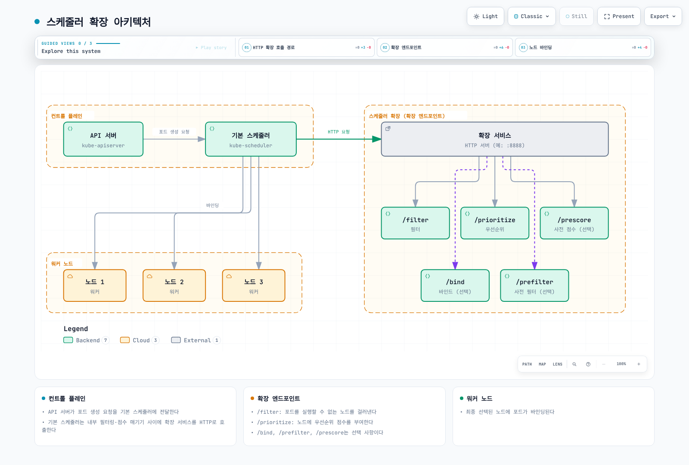
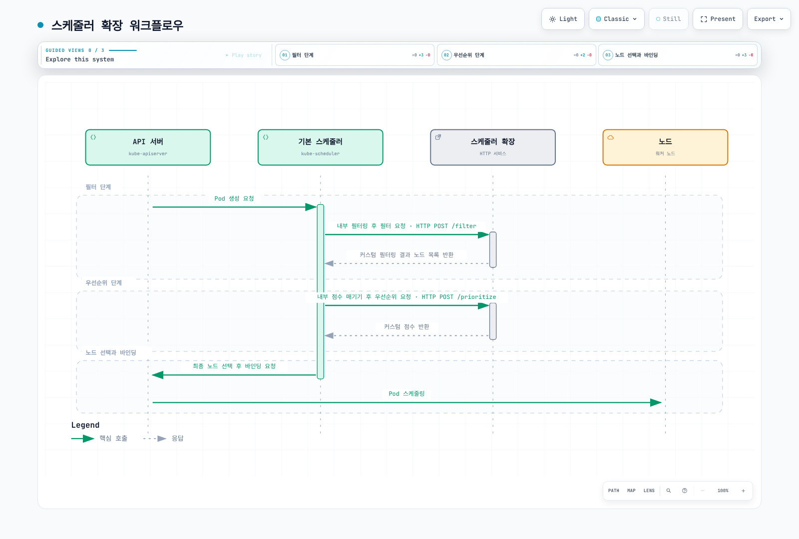
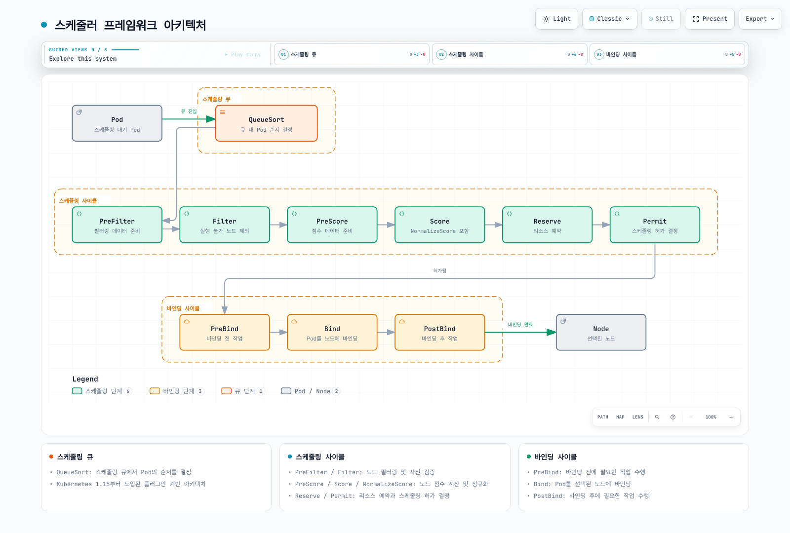
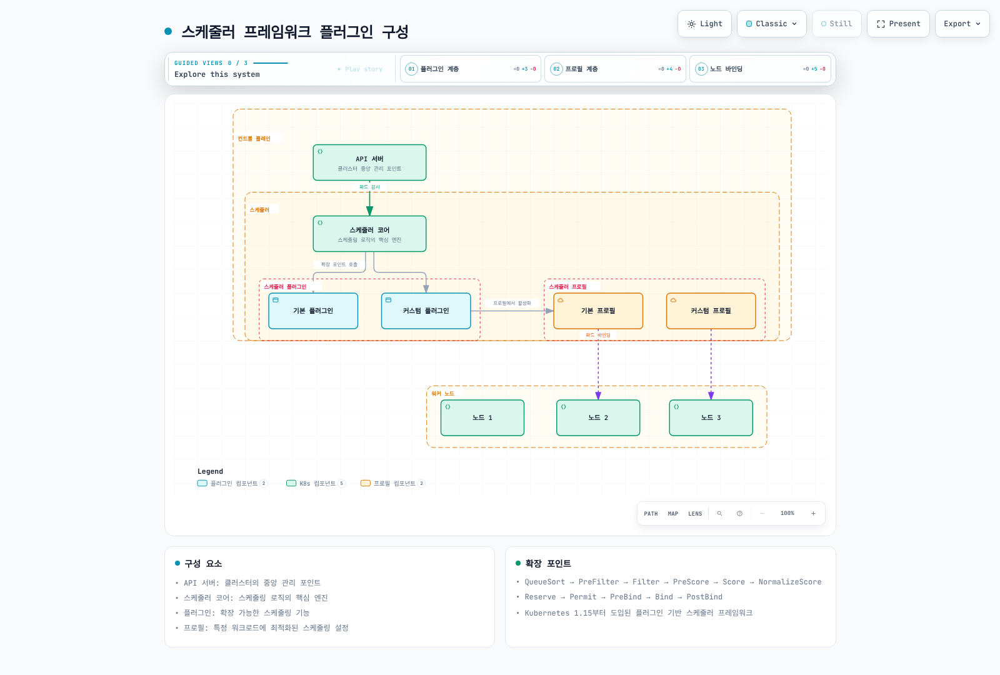
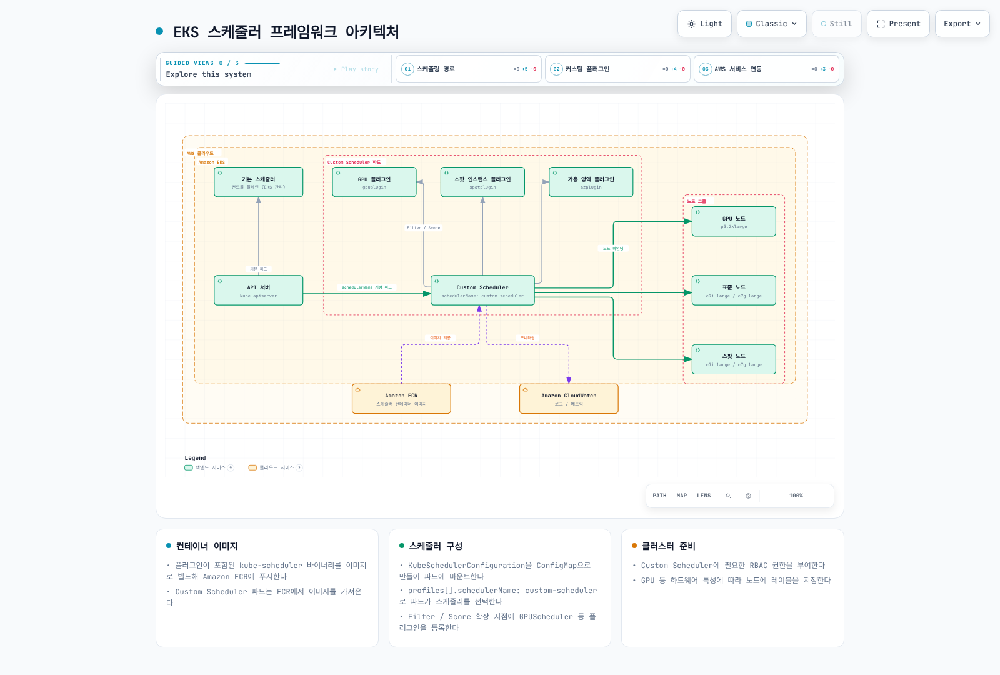

# Part 2: 구현

> **예제 기준 버전**: Kubernetes 1.35.8, Go 1.27.1
> **마지막 업데이트**: 2026년 9월 11일

[Part1의 모듈 설정과 전체 보조 스케줄러 RBAC/Deployment](01-custom-scheduler-part1.md)를 사용합니다. 아래는 해당 스케줄러의 서로 다른 두 확장 방법입니다. 예제는 로컬에서 확인하며 EKS 배포·GPU 실행·TLS 롤아웃·운영 장애 전환은 검증하지 않았습니다. 다른 Kubernetes 마이너 버전의 Go 인터페이스 호환성을 가정하지 말고 다시 검증하세요.

## 스케줄러 확장(Extender) 접근 방식

스케줄러 확장 접근 방식은 기본 스케줄러의 기능을 확장하는 방법입니다. 이 접근 방식에서는 기본 스케줄러가 HTTP 요청을 통해 외부 서비스(스케줄러 확장)를 호출하여 추가 필터링 및 우선순위 기능을 제공합니다.

### 스케줄러 확장 아키텍처

다음 다이어그램은 스케줄러 확장 접근 방식의 아키텍처를 보여줍니다:



[🔍 인터랙티브 다이어그램 보기](https://www.atomai.click/kubernetes-docs/archmaps/ko-scheduling-02-custom-scheduler-part2-10.html)

### 스케줄러 확장 워크플로우

스케줄러 확장의 워크플로우는 다음과 같습니다:



[🔍 인터랙티브 다이어그램 보기](https://www.atomai.click/kubernetes-docs/archmaps/ko-scheduling-02-custom-scheduler-part2-0.html)

### 스케줄러 확장 구현

extender는 설정한 **filter**, **prioritize**, **preempt**, **bind** HTTP callback 중 필요한 것을 구현합니다. 이 예제는 filter와 prioritize만 제공합니다. extender의 `PreFilter`·`PreScore` HTTP hook은 없으며, 이는 프로세스 내부 프레임워크 확장 지점입니다. 기본 바인더를 유지하려면 `bindVerb`를 생략합니다.

extender 우선순위는 **0–10**, 프레임워크 점수는 정규화 이후 **0–100**입니다. 필수 조건은 Filter에서 검사하세요. 이 고정 버전의 스케줄러는 prioritize 요청이 실패하면 기록 후 해당 점수를 제외하므로, 점수만으로 필수 조건을 강제할 수 없습니다.

스케줄러는 API를 감시하고 자체 큐·캐시를 유지합니다. 기본 필터 다음에 extender 필터를 적용하고 프레임워크 점수와 extender 선호도를 합칩니다. API 서버가 Pod를 공용 스케줄링 큐에 밀어 넣는 구조가 아닙니다. 위 아키텍처 그림의 `/prefilter`·`/prescore` 표기는 HTTP extender 계약에 해당하지 않습니다.

이 예제는 upstream 리소스 검사를 유지하면서 **GPU별 메모리 선언 조건**을 추가합니다. GPU를 검색하거나 남은 VRAM을 측정하거나 장치 메모리를 예약하지 않습니다.

공통 정책은 API 기본값이 적용된 Pod, 설치된 device plugin, MIG·time-slicing이 없는 동종 GPU 노드, 각 적격 GPU의 최소 메모리를 나타내는 관리자 관리 노드 레이블 `training.example.com/gpu-memory-mib`를 전제로 합니다. 이 키는 **실습용 사용자 키**이며 NVIDIA 표준 탐색 레이블이 아닙니다. 하드웨어 목록을 검증한 뒤 레이블을 지정하고 이기종·공유 GPU에는 장치를 인식하는 할당 방식을 사용하세요. 노드 레이블만으로 나중에 할당될 장치 특성을 보장할 수 없습니다.

Part1 모듈에 다음 파일을 저장합니다.

**`gpupolicy/policy.go`**

```go
package gpupolicy

import (
	"fmt"
	"strconv"

	v1 "k8s.io/api/core/v1"
	resourcehelper "k8s.io/component-helpers/resource"
)

const (
	MinMemoryAnnotation = "training.example.com/min-gpu-memory-mib"
	NodeMemoryLabel     = "training.example.com/gpu-memory-mib"
	ScoreCeilingMiB     = int64(80 * 1024)
)

// These are lab policy keys, not automatically populated NVIDIA labels.
// NodeMemoryLabel must describe the minimum memory per eligible GPU on a
// homogeneous, non-shared GPU node, not total or currently free VRAM.
type Requirement struct {
	HasGPU       bool
	MinMemoryMiB int64
}

func FromPod(pod *v1.Pod) (Requirement, error) {
	if pod == nil {
		return Requirement{}, fmt.Errorf("missing pod")
	}
	requests := resourcehelper.PodRequests(pod, resourcehelper.PodResourcesOptions{})
	gpu := requests[v1.ResourceName("nvidia.com/gpu")]
	req := Requirement{HasGPU: gpu.Sign() > 0}
	if raw, exists := pod.Annotations[MinMemoryAnnotation]; exists {
		value, err := strconv.ParseInt(raw, 10, 64)
		if err != nil || value <= 0 || value > 1024*1024 {
			return req, fmt.Errorf("minimum GPU memory must be 1..1048576 MiB")
		}
		if !req.HasGPU {
			return req, fmt.Errorf("minimum GPU memory requires a positive GPU request")
		}
		req.MinMemoryMiB = value
	}
	return req, nil
}

func nodeMemory(node *v1.Node) (int64, error) {
	if node == nil {
		return 0, fmt.Errorf("missing node")
	}
	value, err := strconv.ParseInt(node.Labels[NodeMemoryLabel], 10, 64)
	if err != nil || value <= 0 || value > 1024*1024 {
		return 0, fmt.Errorf("missing or invalid administrator GPU-memory label")
	}
	return value, nil
}

// FitsMemory checks only the declared memory label. The default scheduler
// filters must still check free GPU counts, taints, affinity, volumes, etc.
func FitsMemory(req Requirement, node *v1.Node) (bool, string) {
	if req.MinMemoryMiB == 0 {
		return true, ""
	}
	memory, err := nodeMemory(node)
	if err != nil {
		return false, err.Error()
	}
	if memory < req.MinMemoryMiB {
		return false, "GPU memory label is below the required minimum"
	}
	return true, ""
}

// The 80-GiB ceiling is a chosen scoring scale, not a hardware maximum.
func Score100(req Requirement, node *v1.Node) int64 {
	if !req.HasGPU {
		return 0
	}
	memory, err := nodeMemory(node)
	if err != nil {
		return 0
	}
	if memory >= ScoreCeilingMiB {
		return 100
	}
	return memory * 100 / ScoreCeilingMiB
}
```

**`extenderserver/handler.go`**

핸들러는 `nodeCacheCapable: false` 계약을 사용하고 실습 요청을 4 MiB·512개 노드로 제한하며 잘못되거나 누락된 입력을 거부합니다. 전달받은 후보의 부분집합만 반환합니다. 실제 클러스터는 제한값을 별도로 산정해야 합니다. 필수 메모리 레이블이 잘못되면 해당 노드를 제외하며, 다른 Pod를 선점해도 레이블 문제는 해결되지 않습니다.

```go
package extenderserver

import (
	"encoding/json"
	"errors"
	"io"
	"net/http"

	"example.com/custom-scheduler/gpupolicy"
	v1 "k8s.io/api/core/v1"
	extender "k8s.io/kube-scheduler/extender/v1"
)

const maxBodyBytes = 4 << 20

func NewHandler() http.Handler {
	mux := http.NewServeMux()
	mux.HandleFunc("POST /filter", filter)
	mux.HandleFunc("POST /prioritize", prioritize)
	return mux
}

func readArgs(w http.ResponseWriter, r *http.Request) (extender.ExtenderArgs, gpupolicy.Requirement, bool) {
	var args extender.ExtenderArgs
	body := http.MaxBytesReader(w, r.Body, maxBodyBytes)
	defer body.Close()
	decoder := json.NewDecoder(body)
	if err := decoder.Decode(&args); err != nil {
		var large *http.MaxBytesError
		status := http.StatusBadRequest
		if errors.As(err, &large) {
			status = http.StatusRequestEntityTooLarge
		}
		http.Error(w, "invalid or oversized extender request", status)
		return args, gpupolicy.Requirement{}, false
	}
	if err := decoder.Decode(new(any)); err != io.EOF {
		http.Error(w, "expected exactly one JSON object", http.StatusBadRequest)
		return args, gpupolicy.Requirement{}, false
	}
	if args.Pod == nil || args.Nodes == nil || args.NodeNames != nil {
		http.Error(w, "Pod and Nodes required; nodeCacheCapable must be false", http.StatusBadRequest)
		return args, gpupolicy.Requirement{}, false
	}
	if len(args.Nodes.Items) > 512 {
		http.Error(w, "lab candidate-node limit exceeded", http.StatusRequestEntityTooLarge)
		return args, gpupolicy.Requirement{}, false
	}
	seen := make(map[string]bool, len(args.Nodes.Items))
	for _, node := range args.Nodes.Items {
		if node.Name == "" || seen[node.Name] {
			http.Error(w, "missing or duplicate node name", http.StatusBadRequest)
			return args, gpupolicy.Requirement{}, false
		}
		seen[node.Name] = true
	}
	req, err := gpupolicy.FromPod(args.Pod)
	if err != nil {
		http.Error(w, err.Error(), http.StatusBadRequest)
		return args, req, false
	}
	return args, req, true
}

func writeJSON(w http.ResponseWriter, value any) {
	data, err := json.Marshal(value)
	if err != nil {
		http.Error(w, "response encoding failed", http.StatusInternalServerError)
		return
	}
	w.Header().Set("Content-Type", "application/json")
	_, _ = w.Write(data)
}

func filter(w http.ResponseWriter, r *http.Request) {
	args, req, ok := readArgs(w, r)
	if !ok {
		return
	}
	result := extender.ExtenderFilterResult{
		Nodes:                      &v1.NodeList{Items: []v1.Node{}},
		FailedAndUnresolvableNodes: extender.FailedNodesMap{},
	}
	for _, node := range args.Nodes.Items {
		if fits, reason := gpupolicy.FitsMemory(req, &node); fits {
			result.Nodes.Items = append(result.Nodes.Items, node)
		} else {
			// Preempting other Pods cannot change a hardware inventory label.
			result.FailedAndUnresolvableNodes[node.Name] = reason
		}
	}
	writeJSON(w, result)
}

func prioritize(w http.ResponseWriter, r *http.Request) {
	args, req, ok := readArgs(w, r)
	if !ok {
		return
	}
	result := make(extender.HostPriorityList, 0, len(args.Nodes.Items))
	for _, node := range args.Nodes.Items {
		result = append(result, extender.HostPriority{
			Host: node.Name, Score: gpupolicy.Score100(req, &node) / 10,
		})
	}
	// The wire response is an array, not a hostPriorities wrapper object.
	writeJSON(w, result)
}
```

**`cmd/extender/main.go`**

서버는 지정된 client CA가 서명한 클라이언트 인증서를 요구합니다. CA를 스케줄러 클라이언트용으로 제한하고 기존 Secret 관리 절차로 인증서를 교체하세요.

```go
package main

import (
	"crypto/tls"
	"crypto/x509"
	"flag"
	"log"
	"net/http"
	"os"
	"time"

	"example.com/custom-scheduler/extenderserver"
)

func main() {
	certFile := flag.String("tls-cert", "/etc/extender-tls/tls.crt", "server certificate")
	keyFile := flag.String("tls-key", "/etc/extender-tls/tls.key", "server private key")
	caFile := flag.String("client-ca", "/etc/extender-tls/client-ca.crt", "trusted scheduler client CA")
	flag.Parse()
	caPEM, err := os.ReadFile(*caFile)
	if err != nil {
		log.Fatal(err)
	}
	roots := x509.NewCertPool()
	if !roots.AppendCertsFromPEM(caPEM) {
		log.Fatal("client CA contains no certificates")
	}
	server := &http.Server{
		Addr:              ":8443",
		Handler:           extenderserver.NewHandler(),
		ReadHeaderTimeout: 2 * time.Second,
		ReadTimeout:       5 * time.Second,
		WriteTimeout:      5 * time.Second,
		IdleTimeout:       30 * time.Second,
		TLSConfig: &tls.Config{
			MinVersion: tls.VersionTLS12,
			ClientAuth: tls.RequireAndVerifyClientCert,
			ClientCAs:  roots,
		},
	}
	log.Fatal(server.ListenAndServeTLS(*certFile, *keyFile))
}
```

### 스케줄러 확장 배포

Part1과 같은 고정 모듈·Go 버전으로 `./cmd/extender`를 빌드하고 정적 바이너리를 non-root 이미지로 패키징한 뒤, 아래 레지스트리 자리표시자를 실제 이미지·digest로 바꿉니다. Pod는 매 요청으로 스케줄링 데이터를 받으므로 Kubernetes API 토큰이 필요하지 않습니다.

다음을 `Dockerfile.extender`로 저장하고 로컬 빌드합니다. 승인된 레지스트리를 선택하고 배포 이미지에는 게시한 결과를 지정하세요.

```dockerfile
FROM gcr.io/distroless/static-debian12:nonroot
COPY scheduler-extender /scheduler-extender
ENTRYPOINT ["/scheduler-extender"]
```

```bash
go mod tidy
CGO_ENABLED=0 go build -buildvcs=false -trimpath -o scheduler-extender ./cmd/extender
: "${REGISTRY:?Set the approved registry/repository prefix}"
docker build -f Dockerfile.extender -t "$REGISTRY/scheduler-extender:v1.35.8-1" .
```

`scheduler-lab`에 미리 필요한 항목은 `tls.crt`, `tls.key`, `client-ca.crt`가 있는 `extender-server-tls` Secret과, 스케줄러 클라이언트용 `tls.crt`, `tls.key`, 서버 검증용 `ca.crt`가 있는 `extender-client-tls` Secret입니다. 서버 인증서는 `scheduler-extender.scheduler-lab.svc`를 포함해야 합니다. 이 문서는 인증서나 Secret을 생성하지 않습니다. NetworkPolicy를 집행하는 CNI가 필요합니다. TCP readiness probe는 포트가 열렸는지만 확인하며 상호 TLS·스케줄링 성공을 검증하지 않습니다.

```yaml
apiVersion: apps/v1
kind: Deployment
metadata:
  name: scheduler-extender
  namespace: scheduler-lab
spec:
  replicas: 2
  selector:
    matchLabels:
      app: scheduler-extender
  template:
    metadata:
      labels:
        app: scheduler-extender
    spec:
      automountServiceAccountToken: false
      securityContext:
        runAsNonRoot: true
        runAsUser: 65532
        runAsGroup: 65532
        fsGroup: 65532
      nodeSelector:
        kubernetes.io/os: linux
      containers:
      - name: extender
        image: registry.example.com/training/scheduler-extender:v1.35.8-1
        ports:
        - name: https
          containerPort: 8443
        readinessProbe:
          tcpSocket:
            port: https
        securityContext:
          allowPrivilegeEscalation: false
          readOnlyRootFilesystem: true
          capabilities:
            drop: ["ALL"]
          seccompProfile:
            type: RuntimeDefault
        resources:
          requests:
            cpu: 100m
            memory: 64Mi
          limits:
            memory: 128Mi
        volumeMounts:
        - name: tls
          mountPath: /etc/extender-tls
          readOnly: true
      volumes:
      - name: tls
        secret:
          secretName: extender-server-tls
          defaultMode: 0440
---
apiVersion: v1
kind: Service
metadata:
  name: scheduler-extender
  namespace: scheduler-lab
spec:
  selector:
    app: scheduler-extender
  ports:
  - name: https
    port: 8443
    targetPort: https
---
apiVersion: networking.k8s.io/v1
kind: NetworkPolicy
metadata:
  name: scheduler-extender
  namespace: scheduler-lab
spec:
  podSelector:
    matchLabels:
      app: scheduler-extender
  policyTypes: [Ingress, Egress]
  ingress:
  - from:
    - namespaceSelector:
        matchLabels:
          kubernetes.io/metadata.name: scheduler-lab
      podSelector:
        matchLabels:
          app: custom-scheduler
    ports:
    - protocol: TCP
      port: 8443
  egress: []
```

### 스케줄러 구성

EKS에서도 **자체 보조 스케줄러**를 구성합니다. EKS는 관리형 기본 스케줄러의 설정 파일을 노출하지 않으며 EC2 워커의 `/etc/kubernetes/scheduler.conf`를 컨트롤 플레인 자격 증명처럼 마운트해서는 안 됩니다.

1. 아래 설정을 저장합니다. Part1의 프로필·별도 Lease와 기본 필터를 유지하고 extender 서버 인증서를 검증합니다. `ignorable: false`이면 filter 실패 시 해당 스케줄링 시도를 차단합니다. 앞서 설명한 prioritize 오류 동작은 바뀌지 않습니다. 이 extender는 남은 장치 수를 계산하지 않으므로 GPU에 `ignoredByScheduler: true`를 설정하지 마세요.

```yaml
apiVersion: kubescheduler.config.k8s.io/v1
kind: KubeSchedulerConfiguration
leaderElection:
  leaderElect: true
  resourceLock: leases
  resourceName: custom-scheduler
  resourceNamespace: scheduler-lab
  leaseDuration: 15s
  renewDeadline: 10s
  retryPeriod: 2s
profiles:
- schedulerName: custom-scheduler
extenders:
- urlPrefix: https://scheduler-extender.scheduler-lab.svc:8443
  filterVerb: filter
  prioritizeVerb: prioritize
  weight: 1
  enableHTTPS: true
  tlsConfig:
    caFile: /etc/extender-client/ca.crt
    certFile: /etc/extender-client/tls.crt
    keyFile: /etc/extender-client/tls.key
  httpTimeout: 2s
  nodeCacheCapable: false
  ignorable: false
```

2. 대응하는 ConfigMap을 `extender-scheduler-config.yaml`로 저장합니다:

```yaml
apiVersion: v1
kind: ConfigMap
metadata:
  name: extender-scheduler-config
  namespace: scheduler-lab
data:
  config.yaml: |
    apiVersion: kubescheduler.config.k8s.io/v1
    kind: KubeSchedulerConfiguration
    leaderElection:
      leaderElect: true
      resourceLock: leases
      resourceName: custom-scheduler
      resourceNamespace: scheduler-lab
      leaseDuration: 15s
      renewDeadline: 10s
      retryPeriod: 2s
    profiles:
    - schedulerName: custom-scheduler
    extenders:
    - urlPrefix: https://scheduler-extender.scheduler-lab.svc:8443
      filterVerb: filter
      prioritizeVerb: prioritize
      weight: 1
      enableHTTPS: true
      tlsConfig:
        caFile: /etc/extender-client/ca.crt
        certFile: /etc/extender-client/tls.crt
        keyFile: /etc/extender-client/tls.key
      httpTimeout: 2s
      nodeCacheCapable: false
      ignorable: false
```

3. 아래는 독립 Deployment가 아닌 **strategic merge patch**입니다. `extender-scheduler-patch.yaml`로 저장합니다. Part1 Deployment의 설정 볼륨을 바꾸고 클라이언트 인증서를 추가하되 ServiceAccount·probe·리소스·명령은 유지합니다.

```yaml
apiVersion: apps/v1
kind: Deployment
metadata:
  name: custom-scheduler
  namespace: scheduler-lab
spec:
  template:
    spec:
      volumes:
      - name: config
        configMap:
          name: extender-scheduler-config
      - name: extender-client
        secret:
          secretName: extender-client-tls
          defaultMode: 288
      containers:
      - name: custom-scheduler
        volumeMounts:
        - name: extender-client
          mountPath: /etc/extender-client
          readOnly: true
```

extender를 배포하고 이미지 자리표시자를 교체한 뒤 폐기 가능한 실습 환경에만 적용합니다:

```bash
kubectl -n scheduler-lab apply -f extender-scheduler-config.yaml
kubectl -n scheduler-lab patch deployment custom-scheduler --type=strategic --patch-file=extender-scheduler-patch.yaml
kubectl -n scheduler-lab rollout restart deployment/custom-scheduler
kubectl -n scheduler-lab rollout status deployment/custom-scheduler
```

스케줄러는 시작할 때 설정을 읽습니다. ConfigMap 파일이 갱신되는 것만으로 설정을 다시 읽지 않으며, `subPath` 마운트라면 일반적인 projected 파일 갱신도 적용되지 않습니다.

## 스케줄러 프레임워크 플러그인

Kubernetes 1.15부터 도입된 스케줄러 프레임워크는 플러그인 기반 아키텍처를 제공합니다. 이 접근 방식을 사용하면 스케줄링 파이프라인의 다양한 단계에 플러그인을 구현할 수 있습니다.

### 스케줄러 프레임워크 아키텍처

다음 다이어그램은 스케줄러 프레임워크의 아키텍처를 보여줍니다:



[🔍 인터랙티브 다이어그램 보기](https://www.atomai.click/kubernetes-docs/archmaps/ko-scheduling-02-custom-scheduler-part2-11.html)

### 스케줄러 프레임워크 플러그인 구성

다음 다이어그램은 스케줄러 프레임워크 플러그인의 구성을 보여줍니다:



[🔍 인터랙티브 다이어그램 보기](https://www.atomai.click/kubernetes-docs/archmaps/ko-scheduling-02-custom-scheduler-part2-12.html)

### 스케줄링 프레임워크 확장 포인트

프레임워크에는 `PreEnqueue`, `QueueSort`, `PreFilter`, `Filter`, `PostFilter`, `PreScore`, `Score`와 선택적 `NormalizeScore`, `Reserve`/`Unreserve`, `Permit`, `PreBind`, `Bind`, `PostBind`가 있습니다.

스케줄링 사이클은 순차적으로 노드를 선택하고 바인딩 사이클은 중첩될 수 있습니다. Reserve는 assume 상태를 기록하며 이후 실패하면 Unreserve가 해제합니다. PostFilter는 적합한 노드가 없을 때 선점을 시도할 수 있습니다. PostBind는 성공한 바인딩 이후 실행되며 이를 거부할 수 없습니다. 버전별로 추가 메서드가 필요한 확장 지점이 있으므로 대상 버전으로 컴파일하세요.

### 스케줄러 플러그인 구현

다음을 `gpuplugin/plugin.go`로 저장합니다. 앞의 공통 정책을 사용하며 `framework.NodeInfo`를 직접 받습니다. CycleState에서 읽을 수 있는 기본 `NodeInfoKey`는 없습니다. 이 플러그인은 선언된 메모리 레이블만 검사하며 기본 필터가 GPU 개수·taint·affinity·볼륨을 계속 처리합니다.

```go
package gpuplugin

import (
	"context"

	"example.com/custom-scheduler/gpupolicy"
	v1 "k8s.io/api/core/v1"
	"k8s.io/apimachinery/pkg/runtime"
	fwk "k8s.io/kube-scheduler/framework"
)

const Name = "GPUScheduler"

type Plugin struct{}

var _ fwk.FilterPlugin = &Plugin{}
var _ fwk.ScorePlugin = &Plugin{}

func (*Plugin) Name() string { return Name }

func (*Plugin) Filter(_ context.Context, _ fwk.CycleState, pod *v1.Pod, info fwk.NodeInfo) *fwk.Status {
	if info == nil || info.Node() == nil {
		return fwk.NewStatus(fwk.Error, "missing node")
	}
	req, err := gpupolicy.FromPod(pod)
	if err != nil {
		return fwk.NewStatus(fwk.UnschedulableAndUnresolvable, err.Error())
	}
	if ok, reason := gpupolicy.FitsMemory(req, info.Node()); !ok {
		return fwk.NewStatus(fwk.UnschedulableAndUnresolvable, reason)
	}
	return nil
}

func (*Plugin) Score(_ context.Context, _ fwk.CycleState, pod *v1.Pod, info fwk.NodeInfo) (int64, *fwk.Status) {
	if info == nil || info.Node() == nil {
		return 0, fwk.NewStatus(fwk.Error, "missing node")
	}
	req, err := gpupolicy.FromPod(pod)
	if err != nil {
		return 0, fwk.AsStatus(err)
	}
	return gpupolicy.Score100(req, info.Node()), nil
}

func (*Plugin) ScoreExtensions() fwk.ScoreExtensions { return nil }

func New(_ context.Context, _ runtime.Object, _ fwk.Handle) (fwk.Plugin, error) {
	return &Plugin{}, nil
}
```

### 스케줄러 플러그인 등록

플러그인을 등록하려면 아래 명령처럼 스케줄러 바이너리에 컴파일해야 합니다. 이 설정은 등록된 플러그인을 **활성화**하며 YAML만으로 Go 코드를 로드하지 않습니다. PreFilter·PreScore 인터페이스를 구현하지 않았다면 해당 지점에 활성화하지 마세요.

```yaml
apiVersion: kubescheduler.config.k8s.io/v1
kind: KubeSchedulerConfiguration
leaderElection:
  leaderElect: true
  resourceLock: leases
  resourceName: custom-scheduler
  resourceNamespace: scheduler-lab
  leaseDuration: 15s
  renewDeadline: 10s
  retryPeriod: 2s
profiles:
- schedulerName: custom-scheduler
  plugins:
    filter:
      enabled:
      - name: GPUScheduler
    score:
      enabled:
      - name: GPUScheduler
        weight: 10
```

## EKS에서의 스케줄러 프레임워크 구현

EKS에서는 Part1의 ServiceAccount/RBAC와 자체 프로필·Lease로 EC2 워커에 커스텀 스케줄러를 실행합니다. 클러스터 내부 API는 Kubernetes 자격 증명을 사용하며 ECR 게시 또는 선택적인 AWS API 호출에는 별도의 적절한 IAM 권한이 필요합니다. EKS Fargate 스케줄링은 AWS가 관리하고 GPU를 지원하지 않습니다. Fargate 프로필이 선택하지 않는 실습 네임스페이스를 사용하세요.

관리형 컨트롤 플레인에 플러그인 이미지만 주입하는 방식이 아니라 **플러그인이 포함된 스케줄러 바이너리**를 빌드합니다. 노드 레이블은 device plugin 리소스를 보완하며 GPU 용량을 생성하지 않습니다.

### EKS 스케줄러 프레임워크 아키텍처

보조 스케줄러는 API에서 Pod·Node 상태를 감시하고 등록된 플러그인을 내부에서 실행합니다. ECR은 이미지를 제공하며 CloudWatch 연동은 선택 사항입니다. 이 예제는 `GPUScheduler`만 구현합니다. 구조도에 표시한 Spot·AZ 플러그인은 별도 코드·테스트를 준비한 뒤 등록·활성화해야 합니다.



[🔍 인터랙티브 다이어그램 보기](https://www.atomai.click/kubernetes-docs/archmaps/ko-scheduling-02-custom-scheduler-part2-13.html)

### EKS 스케줄러 프레임워크 구현 단계

1. **커스텀 플러그인 등록** (`cmd/gpu-scheduler/main.go`). upstream 명령은 이미 기본 플러그인을 등록하므로 다시 등록하면 이름 중복으로 실패합니다.

```go
package main

import (
	"os"

	"example.com/custom-scheduler/gpuplugin"
	"k8s.io/component-base/cli"
	"k8s.io/kubernetes/cmd/kube-scheduler/app"
)

func main() {
	// Upstream already registers all built-in plugins. Register only our addition.
	command := app.NewSchedulerCommand(app.WithPlugin(gpuplugin.Name, gpuplugin.New))
	os.Exit(cli.Run(command))
}
```

2. **이미지 빌드**. 공통 정책과 플러그인을 저장하고 `go mod tidy`를 실행합니다. 이미지 아키텍처를 스케줄러의 Linux 워커와 맞추고 릴리스 절차에서는 기반 이미지를 digest로 고정하세요.

```dockerfile
FROM golang:1.27.1 AS builder
WORKDIR /src
COPY go.mod go.sum ./
RUN go mod download
COPY . .
RUN CGO_ENABLED=0 go build -buildvcs=false -trimpath -o /out/gpu-scheduler ./cmd/gpu-scheduler

FROM gcr.io/distroless/static-debian12:nonroot
COPY --from=builder /out/gpu-scheduler /gpu-scheduler
ENTRYPOINT ["/gpu-scheduler"]
```

3. **레지스트리 절차로 게시**. 아래 명령은 레지스트리를 명시적으로 선택해야 합니다. 이번 감사에서는 실행하지 않았습니다:

```bash
: "${REGISTRY:?Set the approved registry/repository prefix}"
docker build -t "$REGISTRY/gpu-scheduler:v1.35.8-1" .
docker push "$REGISTRY/gpu-scheduler:v1.35.8-1"
```

4. **`gpu-scheduler-config.yaml` 저장**. 구현한 인터페이스만 활성화하고 upstream 기본값을 유지합니다:

```yaml
apiVersion: v1
kind: ConfigMap
metadata:
  name: gpu-scheduler-config
  namespace: scheduler-lab
data:
  config.yaml: |
    apiVersion: kubescheduler.config.k8s.io/v1
    kind: KubeSchedulerConfiguration
    leaderElection:
      leaderElect: true
      resourceLock: leases
      resourceName: custom-scheduler
      resourceNamespace: scheduler-lab
      leaseDuration: 15s
      renewDeadline: 10s
      retryPeriod: 2s
    profiles:
    - schedulerName: custom-scheduler
      plugins:
        filter:
          enabled:
          - name: GPUScheduler
        score:
          enabled:
          - name: GPUScheduler
            weight: 10
```

5. **Part1 Deployment 갱신**. 이미지 자리표시자를 바꾼 뒤 아래 strategic merge patch를 `gpu-scheduler-patch.yaml`로 저장합니다. extender 설정의 대안이며 두 예제가 있다고 두 정책이 자동으로 함께 활성화되지는 않습니다.

```yaml
apiVersion: apps/v1
kind: Deployment
metadata:
  name: custom-scheduler
  namespace: scheduler-lab
spec:
  template:
    spec:
      volumes:
      - name: config
        configMap:
          name: gpu-scheduler-config
      containers:
      - name: custom-scheduler
        image: registry.example.com/training/gpu-scheduler:v1.35.8-1
```

```bash
kubectl -n scheduler-lab apply -f gpu-scheduler-config.yaml
kubectl -n scheduler-lab patch deployment custom-scheduler --type=strategic --patch-file=gpu-scheduler-patch.yaml
kubectl -n scheduler-lab rollout restart deployment/custom-scheduler
kubectl -n scheduler-lab rollout status deployment/custom-scheduler
```

6. **스케줄러와 GPU 요청**. 아래 BusyBox Pod를 준비된 실습 환경에서 실행하면 예약·배치만 확인할 수 있으며 CUDA를 실행하지 않습니다. 실제 GPU smoke test에는 검증된 CUDA 애플리케이션 이미지·호환 드라이버·장치 검사가 필요합니다. GPU 노드에 taint가 있으면 적절한 toleration을 추가하세요.

```yaml
apiVersion: v1
kind: Pod
metadata:
  name: gpu-pod
  annotations:
    training.example.com/min-gpu-memory-mib: "16384"
spec:
  schedulerName: custom-scheduler
  restartPolicy: Never
  containers:
  - name: gpu-reservation-smoke
    image: busybox:1.37.0
    command: ["sh", "-c", "sleep 60"]
    resources:
      requests:
        cpu: 100m
        memory: 64Mi
        nvidia.com/gpu: 1
      limits:
        memory: 128Mi
        nvidia.com/gpu: 1
```

## 결론

이 장에서는 스케줄러 확장(Extender) 접근 방식과 스케줄러 프레임워크 플러그인을 사용하여 Custom Scheduler를 구현하는 방법을 알아보았습니다. 또한 EKS 클러스터에서 스케줄러 프레임워크를 구현하는 방법도 살펴보았습니다.

다음 장에서는 EKS에서의 Custom Scheduler 구현 사례와 모니터링 방법을 알아보겠습니다.

## 참고 자료와 검증 한계

* [스케줄러 설정과 extender 필드](https://kubernetes.io/docs/reference/scheduling/config/)
* [Kubernetes 1.35.8 extender wire 타입](https://github.com/kubernetes/kubernetes/blob/v1.35.8/staging/src/k8s.io/kube-scheduler/extender/v1/types.go)
* [고정 버전 프레임워크 인터페이스](https://github.com/kubernetes/kubernetes/blob/v1.35.8/staging/src/k8s.io/kube-scheduler/framework/interface.go)
* [GPU 스케줄링](https://kubernetes.io/docs/tasks/manage-gpus/scheduling-gpus/)
* [EKS Fargate 스케줄링과 제한](https://docs.aws.amazon.com/eks/latest/userguide/fargate.html)

로컬 코드·설정 검사는 실제 하드웨어 레이블, 드라이버 호환성, 인증서 발급, 클러스터 배치·용량·운영 가용성을 검증하지 않습니다.

## 퀴즈

이 장에서 배운 내용을 테스트하려면 [주제 퀴즈](../quizzes/scheduling/02-custom-scheduler-part2-quiz.md)를 풀어보세요.
