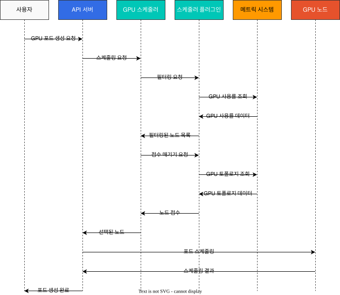
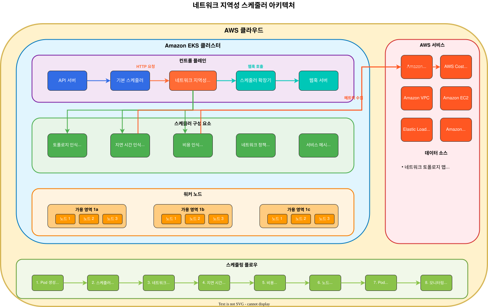
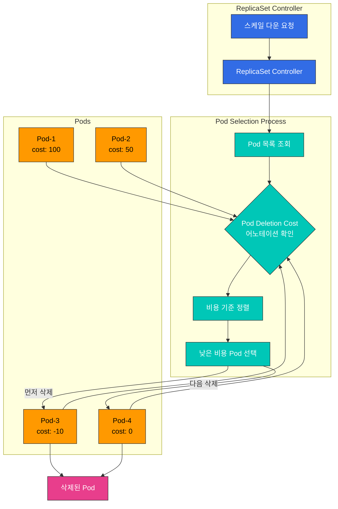
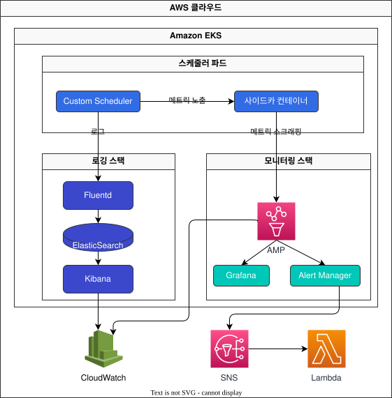
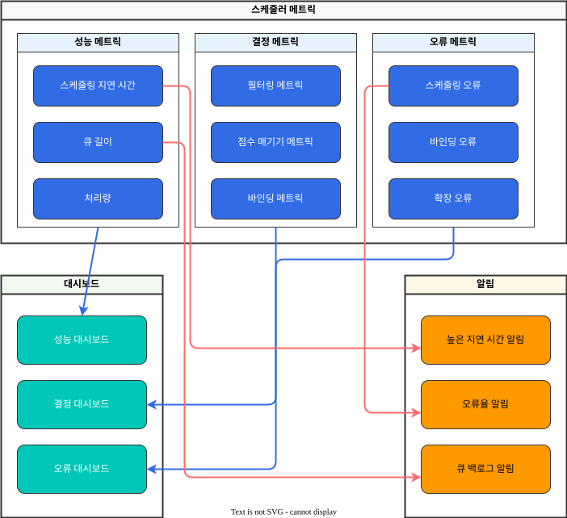

# Part 3: 커스텀 스케줄러 구현 사례 및 모니터링

## EKS에서의 커스텀 스케줄러 구현 사례

이 섹션에서는 EKS에서 커스텀 스케줄러를 구현하는 실제 사례를 살펴보겠습니다.

### 사례 1: GPU 워크로드 최적화 스케줄러

AI/ML 워크로드를 실행하는 EKS 클러스터에서는 GPU 리소스를 효율적으로 활용하는 것이 중요합니다. 다음은 GPU 워크로드를 최적화하는 커스텀 스케줄러의 구현 사례입니다.

#### GPU 워크로드 최적화 스케줄러 아키텍처

다음 다이어그램은 GPU 워크로드 최적화 스케줄러의 아키텍처를 보여줍니다:


#### GPU 워크로드 스케줄링 워크플로우

다음 다이어그램은 GPU 워크로드 스케줄링 워크플로우를 보여줍니다:



#### 요구 사항

1. GPU 메모리 요구 사항에 따라 노드 선택
2. GPU 모델(예: NVIDIA A100, V100, T4 등)에 따른 노드 선택
3. GPU 사용률을 고려한 노드 선택
4. 다중 GPU 인스턴스에서 GPU 공유 최적화

#### 구현 접근 방식

이 사례에서는 스케줄러 프레임워크 플러그인 접근 방식을 사용합니다.

1. **노드 레이블링**: 각 노드에 GPU 관련 정보를 레이블로 추가합니다.

```bash
# GPU 모델 레이블 추가
kubectl label node <node-name> gpu.nvidia.com/model=A100

# GPU 메모리 레이블 추가
kubectl label node <node-name> gpu.nvidia.com/memory=40960

# GPU 수 레이블 추가
kubectl label node <node-name> gpu.nvidia.com/count=8
```

2. **커스텀 스케줄러 플러그인 구현**:

```go
// GPUTopologyPlugin은 GPU 토폴로지를 고려하는 스케줄러 플러그인입니다.
type GPUTopologyPlugin struct {
    handle framework.Handle
}

// Filter는 GPU 요구 사항에 따라 노드를 필터링합니다.
func (gtp *GPUTopologyPlugin) Filter(ctx context.Context, state *framework.CycleState, pod *v1.Pod, node *framework.NodeInfo) *framework.Status {
    // GPU 요구 사항 확인
    gpuReq := getGPURequest(pod)
    if gpuReq == 0 {
        return framework.NewStatus(framework.Success, "")
    }

    // 노드의 GPU 정보 확인
    gpuCount := getGPUCount(node.Node())
    if gpuCount < gpuReq {
        return framework.NewStatus(framework.Unschedulable, "Not enough GPUs")
    }

    // GPU 모델 요구 사항 확인
    requiredModel := getRequiredGPUModel(pod)
    if requiredModel != "" && getGPUModel(node.Node()) != requiredModel {
        return framework.NewStatus(framework.Unschedulable, "GPU model mismatch")
    }

    // GPU 메모리 요구 사항 확인
    memReq := getGPUMemoryRequest(pod)
    if memReq > 0 && getGPUMemory(node.Node()) < memReq {
        return framework.NewStatus(framework.Unschedulable, "Not enough GPU memory")
    }

    return framework.NewStatus(framework.Success, "")
}

// Score는 GPU 토폴로지에 따라 노드에 점수를 할당합니다.
func (gtp *GPUTopologyPlugin) Score(ctx context.Context, state *framework.CycleState, pod *v1.Pod, nodeName string) (int64, *framework.Status) {
    nodeInfo, err := gtp.handle.SnapshotSharedLister().NodeInfos().Get(nodeName)
    if err != nil {
        return 0, framework.NewStatus(framework.Error, fmt.Sprintf("Error getting node info: %v", err))
    }

    node := nodeInfo.Node()
    
    // GPU 요구 사항이 없으면 기본 점수 반환
    gpuReq := getGPURequest(pod)
    if gpuReq == 0 {
        return 0, framework.NewStatus(framework.Success, "")
    }

    // GPU 사용률 확인
    gpuUtilization := getGPUUtilization(node)
    
    // GPU 수에 따른 점수 계산
    gpuCount := getGPUCount(node)
    
    // 사용 가능한 GPU가 요청된 GPU보다 약간 많은 노드에 높은 점수 할당
    // 이는 GPU 리소스를 효율적으로 활용하기 위함
    score := 100 - int64(math.Abs(float64(gpuCount-gpuReq))*10)
    if score < 0 {
        score = 0
    }
    
    // GPU 사용률이 낮은 노드에 더 높은 점수 할당
    utilizationScore := int64((1.0 - gpuUtilization) * 100)
    
    // 최종 점수는 두 점수의 가중 평균
    finalScore := (score * 7 + utilizationScore * 3) / 10
    
    return finalScore, framework.NewStatus(framework.Success, "")
}
```

3. **스케줄러 구성**:

```yaml
apiVersion: kubescheduler.config.k8s.io/v1beta1
kind: KubeSchedulerConfiguration
clientConnection:
  kubeconfig: /etc/kubernetes/scheduler.conf
profiles:
- schedulerName: gpu-scheduler
  plugins:
    filter:
      enabled:
      - name: GPUTopologyPlugin
    score:
      enabled:
      - name: GPUTopologyPlugin
        weight: 10
  pluginConfig:
  - name: GPUTopologyPlugin
    args: {}
```

4. **포드 스펙에서 GPU 요구 사항 지정**:

```yaml
apiVersion: v1
kind: Pod
metadata:
  name: gpu-pod
  annotations:
    gpu.nvidia.com/model: "A100"
    gpu.nvidia.com/memory: "40960"
spec:
  schedulerName: gpu-scheduler
  containers:
  - name: gpu-container
    image: nvidia/cuda:11.6.0-base-ubuntu20.04
    resources:
      limits:
        nvidia.com/gpu: 2
```

### 사례 2: 네트워크 지역성 최적화 스케줄러

EKS 클러스터에서 네트워크 비용을 최적화하기 위해 네트워크 지역성을 고려하는 커스텀 스케줄러를 구현할 수 있습니다.

#### 네트워크 지역성 최적화 스케줄러 아키텍처

다음 다이어그램은 네트워크 지역성 최적화 스케줄러의 아키텍처를 보여줍니다.



#### 네트워크 지역성 최적화 워크플로우

다음 다이어그램은 네트워크 지역성 최적화 스케줄러의 워크플로우를 보여줍니다.


## Pod Deletion Cost를 이용한 스케일 다운 최적화

Kubernetes 1.22부터 도입된 Pod Deletion Cost는 ReplicaSet, Deployment, StatefulSet과 같은 워크로드 리소스가 스케일 다운될 때 어떤 Pod을 먼저 삭제할지 제어할 수 있는 기능입니다. 이는 애플리케이션의 가용성과 성능을 최적화하는 데 유용합니다.

### Pod Deletion Cost 개념

Pod Deletion Cost는 `controller.kubernetes.io/pod-deletion-cost` 어노테이션을 통해 각 Pod에 비용 값을 할당합니다. 스케일 다운 시 낮은 비용의 Pod이 먼저 삭제됩니다.

**주요 특징**:
- 기본값: 0
- 범위: -2147483648 ~ 2147483647 (int32 범위)
- 더 높은 값 = 더 중요한 Pod (나중에 삭제)
- 더 낮은 값 = 덜 중요한 Pod (먼저 삭제)

### Pod Deletion Cost 아키텍처

다음 다이어그램은 Pod Deletion Cost가 스케일 다운 시 어떻게 작동하는지 보여줍니다:



### 사용 사례

#### 1. 캐시가 워밍업된 Pod 보호

애플리케이션 시작 시 캐시를 로드하는 경우, 워밍업된 Pod을 우선적으로 유지하여 성능을 최적화할 수 있습니다.

```yaml
apiVersion: v1
kind: Pod
metadata:
  name: app-pod-warmed-up
  annotations:
    controller.kubernetes.io/pod-deletion-cost: "100"  # 캐시가 워밍업됨
spec:
  containers:
  - name: app
    image: my-app:latest
    lifecycle:
      postStart:
        exec:
          command:
          - /bin/sh
          - -c
          - |
            # 캐시 워밍업
            /app/warm-cache.sh
            # 워밍업 완료 후 deletion cost 증가
            kubectl annotate pod $HOSTNAME \
              controller.kubernetes.io/pod-deletion-cost=100 --overwrite
```

#### 2. 활성 연결이 있는 Pod 보호

WebSocket이나 장기 실행 연결이 있는 Pod을 보호합니다:

```go
// Go 예제: 활성 연결 수에 따라 동적으로 deletion cost 업데이트
package main

import (
    "context"
    "fmt"
    "os"
    "time"

    metav1 "k8s.io/apimachinery/pkg/apis/meta/v1"
    "k8s.io/client-go/kubernetes"
    "k8s.io/client-go/rest"
)

type ConnectionTracker struct {
    activeConnections int
    k8sClient         *kubernetes.Clientset
    podName           string
    namespace         string
}

func NewConnectionTracker() (*ConnectionTracker, error) {
    config, err := rest.InClusterConfig()
    if err != nil {
        return nil, err
    }

    clientset, err := kubernetes.NewForConfig(config)
    if err != nil {
        return nil, err
    }

    return &ConnectionTracker{
        k8sClient: clientset,
        podName:   os.Getenv("POD_NAME"),
        namespace: os.Getenv("POD_NAMESPACE"),
    }, nil
}

func (ct *ConnectionTracker) UpdateDeletionCost() error {
    // 활성 연결 수에 비례하여 deletion cost 설정
    // 연결당 10의 비용, 최대 1000
    cost := ct.activeConnections * 10
    if cost > 1000 {
        cost = 1000
    }

    pod, err := ct.k8sClient.CoreV1().Pods(ct.namespace).Get(
        context.TODO(),
        ct.podName,
        metav1.GetOptions{},
    )
    if err != nil {
        return err
    }

    if pod.Annotations == nil {
        pod.Annotations = make(map[string]string)
    }

    pod.Annotations["controller.kubernetes.io/pod-deletion-cost"] = fmt.Sprintf("%d", cost)

    _, err = ct.k8sClient.CoreV1().Pods(ct.namespace).Update(
        context.TODO(),
        pod,
        metav1.UpdateOptions{},
    )

    return err
}

func (ct *ConnectionTracker) StartPeriodicUpdate() {
    ticker := time.NewTicker(30 * time.Second)
    defer ticker.Stop()

    for range ticker.C {
        if err := ct.UpdateDeletionCost(); err != nil {
            fmt.Printf("Failed to update deletion cost: %v\n", err)
        }
    }
}

func (ct *ConnectionTracker) OnConnectionOpen() {
    ct.activeConnections++
}

func (ct *ConnectionTracker) OnConnectionClose() {
    ct.activeConnections--
    if ct.activeConnections < 0 {
        ct.activeConnections = 0
    }
}
```

#### 3. 데이터 지역성이 있는 Pod 보호

특정 노드에 있는 데이터를 캐시하거나 사용하는 Pod을 보호합니다:

```yaml
apiVersion: apps/v1
kind: Deployment
metadata:
  name: data-processor
spec:
  replicas: 5
  selector:
    matchLabels:
      app: data-processor
  template:
    metadata:
      labels:
        app: data-processor
      annotations:
        # 데이터 지역성이 높은 Pod에 높은 비용 설정
        controller.kubernetes.io/pod-deletion-cost: "50"
    spec:
      affinity:
        podAntiAffinity:
          preferredDuringSchedulingIgnoredDuringExecution:
          - weight: 100
            podAffinityTerm:
              labelSelector:
                matchExpressions:
                - key: app
                  operator: In
                  values:
                  - data-processor
              topologyKey: kubernetes.io/hostname
      containers:
      - name: processor
        image: data-processor:latest
        env:
        - name: POD_NAME
          valueFrom:
            fieldRef:
              fieldPath: metadata.name
        - name: POD_NAMESPACE
          valueFrom:
            fieldRef:
              fieldPath: metadata.namespace
```

#### 4. 새로 시작된 Pod 우선 삭제

새로 시작된 Pod은 아직 충분히 워밍업되지 않았을 수 있으므로 먼저 삭제합니다:

```yaml
apiVersion: v1
kind: Pod
metadata:
  name: app-pod-new
  annotations:
    controller.kubernetes.io/pod-deletion-cost: "-50"  # 새 Pod은 낮은 비용
spec:
  containers:
  - name: app
    image: my-app:latest
    lifecycle:
      postStart:
        exec:
          command:
          - /bin/sh
          - -c
          - |
            # 초기에는 낮은 비용
            sleep 60
            # 1분 후 정상 비용으로 변경
            kubectl annotate pod $HOSTNAME \
              controller.kubernetes.io/pod-deletion-cost=0 --overwrite
```

### Horizontal Pod Autoscaler와의 통합

HPA와 함께 사용할 때 Pod Deletion Cost를 활용하여 스케일 다운 시 중요한 Pod을 보호할 수 있습니다:

```yaml
apiVersion: autoscaling/v2
kind: HorizontalPodAutoscaler
metadata:
  name: app-hpa
spec:
  scaleTargetRef:
    apiVersion: apps/v1
    kind: Deployment
    name: app
  minReplicas: 3
  maxReplicas: 10
  metrics:
  - type: Resource
    resource:
      name: cpu
      target:
        type: Utilization
        averageUtilization: 70
  behavior:
    scaleDown:
      stabilizationWindowSeconds: 300  # 5분 안정화 기간
      policies:
      - type: Percent
        value: 50
        periodSeconds: 60
      - type: Pods
        value: 2
        periodSeconds: 60
      selectPolicy: Min
```

### 동적 Pod Deletion Cost 업데이트 패턴

실시간으로 Pod의 중요도가 변경되는 경우 동적으로 deletion cost를 업데이트할 수 있습니다:

```python
# Python 예제: 메트릭 기반 동적 deletion cost 업데이트
from kubernetes import client, config
import time
import os

class DeletionCostManager:
    def __init__(self):
        config.load_incluster_config()
        self.v1 = client.CoreV1Api()
        self.pod_name = os.environ.get('POD_NAME')
        self.namespace = os.environ.get('POD_NAMESPACE')

    def calculate_cost(self, metrics):
        """
        메트릭을 기반으로 deletion cost 계산
        - 활성 요청 수
        - 캐시 히트율
        - 평균 응답 시간
        """
        base_cost = 0

        # 활성 요청이 많을수록 높은 비용
        active_requests = metrics.get('active_requests', 0)
        base_cost += active_requests * 5

        # 캐시 히트율이 높을수록 높은 비용
        cache_hit_rate = metrics.get('cache_hit_rate', 0)
        base_cost += int(cache_hit_rate * 100)

        # 응답 시간이 빠를수록 높은 비용 (최적화된 Pod)
        avg_response_time = metrics.get('avg_response_time_ms', 1000)
        if avg_response_time < 100:
            base_cost += 50
        elif avg_response_time < 500:
            base_cost += 20

        # 최대 1000으로 제한
        return min(base_cost, 1000)

    def update_deletion_cost(self, cost):
        """Pod의 deletion cost 어노테이션 업데이트"""
        try:
            pod = self.v1.read_namespaced_pod(
                name=self.pod_name,
                namespace=self.namespace
            )

            if pod.metadata.annotations is None:
                pod.metadata.annotations = {}

            pod.metadata.annotations['controller.kubernetes.io/pod-deletion-cost'] = str(cost)

            self.v1.patch_namespaced_pod(
                name=self.pod_name,
                namespace=self.namespace,
                body=pod
            )

            print(f"Updated deletion cost to {cost}")
        except Exception as e:
            print(f"Error updating deletion cost: {e}")

    def run(self, get_metrics_func):
        """주기적으로 메트릭을 수집하고 deletion cost 업데이트"""
        while True:
            try:
                metrics = get_metrics_func()
                cost = self.calculate_cost(metrics)
                self.update_deletion_cost(cost)
            except Exception as e:
                print(f"Error in main loop: {e}")

            time.sleep(30)  # 30초마다 업데이트

# 사용 예제
def get_app_metrics():
    """애플리케이션 메트릭 수집 (구현 필요)"""
    return {
        'active_requests': 15,
        'cache_hit_rate': 0.85,
        'avg_response_time_ms': 120
    }

if __name__ == '__main__':
    manager = DeletionCostManager()
    manager.run(get_app_metrics)
```

### 모니터링 및 디버깅

Pod Deletion Cost가 올바르게 작동하는지 확인하는 방법:

```bash
# 1. Pod의 deletion cost 확인
kubectl get pods -o custom-columns=\
NAME:.metadata.name,\
DELETION_COST:.metadata.annotations.controller\.kubernetes\.io/pod-deletion-cost

# 2. 특정 Deployment의 모든 Pod deletion cost 확인
kubectl get pods -l app=my-app -o json | \
  jq -r '.items[] | "\(.metadata.name): \(.metadata.annotations["controller.kubernetes.io/pod-deletion-cost"] // "0")"'

# 3. 스케일 다운 시뮬레이션
kubectl scale deployment my-app --replicas=3

# 4. 어떤 Pod이 삭제되었는지 확인
kubectl get events --field-selector involvedObject.kind=Pod,reason=Killing \
  --sort-by='.lastTimestamp'
```

### Prometheus 메트릭 수집

```yaml
# ServiceMonitor for Pod Deletion Cost metrics
apiVersion: monitoring.coreos.com/v1
kind: ServiceMonitor
metadata:
  name: pod-deletion-cost-monitor
  namespace: monitoring
spec:
  selector:
    matchLabels:
      app: my-app
  endpoints:
  - port: metrics
    interval: 30s
    relabelings:
    - sourceLabels: [__meta_kubernetes_pod_annotation_controller_kubernetes_io_pod_deletion_cost]
      targetLabel: pod_deletion_cost
```

### Grafana 대시보드

```json
{
  "dashboard": {
    "title": "Pod Deletion Cost Monitoring",
    "panels": [
      {
        "title": "Pod Deletion Cost Distribution",
        "targets": [
          {
            "expr": "kube_pod_annotations{annotation_controller_kubernetes_io_pod_deletion_cost!=\"\"}"
          }
        ],
        "type": "graph"
      },
      {
        "title": "Pods by Deletion Cost Range",
        "targets": [
          {
            "expr": "count(kube_pod_annotations{annotation_controller_kubernetes_io_pod_deletion_cost=~\"[0-9]+\"}) by (annotation_controller_kubernetes_io_pod_deletion_cost)"
          }
        ],
        "type": "piechart"
      }
    ]
  }
}
```

### 모범 사례

1. **일관된 비용 범위 사용**: 팀 내에서 일관된 비용 범위를 정의하여 사용합니다.
   - `-100 ~ -1`: 우선 삭제 (새로운 Pod, 워밍업 중인 Pod)
   - `0`: 기본값 (일반 Pod)
   - `1 ~ 100`: 보통 중요도 (활성 연결이 있는 Pod)
   - `100 ~ 1000`: 높은 중요도 (캐시가 워밍업된 Pod, 많은 연결이 있는 Pod)

2. **동적 업데이트**: Pod의 상태가 변경될 때 deletion cost를 동적으로 업데이트합니다.

3. **상한선 설정**: deletion cost에 상한선을 설정하여 너무 큰 값으로 인한 문제를 방지합니다.

4. **모니터링**: deletion cost의 분포를 모니터링하여 예상대로 작동하는지 확인합니다.

5. **테스트**: 프로덕션에 적용하기 전에 스테이징 환경에서 스케일 다운 동작을 테스트합니다.

6. **문서화**: 각 비용 범위가 의미하는 바를 문서화합니다.

### 제한사항

- **Pod Disruption Budget과의 상호작용**: PDB와 함께 사용할 때는 PDB가 우선됩니다.
- **Kubernetes 버전**: 1.22 이상에서만 사용 가능합니다.
- **워크로드 유형 제한**: ReplicaSet 컨트롤러를 사용하는 워크로드(Deployment, ReplicaSet)에서만 작동합니다.
- **Node 장애 시**: Node가 완전히 장애가 발생한 경우에는 deletion cost가 고려되지 않습니다.

## 커스텀 스케줄러 모니터링 및 디버깅

커스텀 스케줄러를 구현한 후에는 모니터링 및 디버깅이 중요합니다. 이 섹션에서는 커스텀 스케줄러를 모니터링하고 디버깅하는 방법을 알아보겠습니다.

### 모니터링 아키텍처

다음 다이어그램은 EKS에서 커스텀 스케줄러를 모니터링하기 위한 아키텍처를 보여줍니다.



### 주요 모니터링 메트릭

다음 다이어그램은 커스텀 스케줄러의 주요 모니터링 메트릭과 그 관계를 보여줍니다:



### 로깅

커스텀 스케줄러의 로그를 확인하여 스케줄링 결정을 이해할 수 있습니다:

```bash
kubectl logs -n kube-system -l app=custom-scheduler
```

### 이벤트 확인

포드 스케줄링과 관련된 이벤트를 확인할 수 있습니다:

```bash
kubectl get events --field-selector involvedObject.name=<pod-name>
```

### 메트릭 수집

Prometheus를 사용하여 커스텀 스케줄러의 메트릭을 수집할 수 있습니다:

```yaml
apiVersion: monitoring.coreos.com/v1
kind: ServiceMonitor
metadata:
  name: custom-scheduler
  namespace: monitoring
spec:
  selector:
    matchLabels:
      app: custom-scheduler
  endpoints:
  - port: metrics
    interval: 15s
```

### 대시보드 구성

Grafana를 사용하여 커스텀 스케줄러의 메트릭을 시각화할 수 있습니다:

```yaml
apiVersion: v1
kind: ConfigMap
metadata:
  name: custom-scheduler-dashboard
  namespace: monitoring
data:
  custom-scheduler-dashboard.json: |
    {
      "annotations": {
        "list": [
          {
            "builtIn": 1,
            "datasource": "-- Grafana --",
            "enable": true,
            "hide": true,
            "iconColor": "rgba(0, 211, 255, 1)",
            "name": "Annotations & Alerts",
            "type": "dashboard"
          }
        ]
      },
      "editable": true,
      "gnetId": null,
      "graphTooltip": 0,
      "id": 1,
      "links": [],
      "panels": [
        {
          "aliasColors": {},
          "bars": false,
          "dashLength": 10,
          "dashes": false,
          "datasource": null,
          "fieldConfig": {
            "defaults": {
              "custom": {}
            },
            "overrides": []
          },
          "fill": 1,
          "fillGradient": 0,
          "gridPos": {
            "h": 8,
            "w": 12,
            "x": 0,
            "y": 0
          },
          "hiddenSeries": false,
          "id": 2,
          "legend": {
            "avg": false,
            "current": false,
            "max": false,
            "min": false,
            "show": true,
            "total": false,
            "values": false
          },
          "lines": true,
          "linewidth": 1,
          "nullPointMode": "null",
          "options": {
            "alertThreshold": true
          },
          "percentage": false,
          "pluginVersion": "7.2.0",
          "pointradius": 2,
          "points": false,
          "renderer": "flot",
          "seriesOverrides": [],
          "spaceLength": 10,
          "stack": false,
          "steppedLine": false,
          "targets": [
            {
              "expr": "scheduler_scheduling_duration_seconds_count",
              "interval": "",
              "legendFormat": "",
              "refId": "A"
            }
          ],
          "thresholds": [],
          "timeFrom": null,
          "timeRegions": [],
          "timeShift": null,
          "title": "Scheduling Duration",
          "tooltip": {
            "shared": true,
            "sort": 0,
            "value_type": "individual"
          },
          "type": "graph",
          "xaxis": {
            "buckets": null,
            "mode": "time",
            "name": null,
            "show": true,
            "values": []
          },
          "yaxes": [
            {
              "format": "short",
              "label": null,
              "logBase": 1,
              "max": null,
              "min": null,
              "show": true
            },
            {
              "format": "short",
              "label": null,
              "logBase": 1,
              "max": null,
              "min": null,
              "show": true
            }
          ],
          "yaxis": {
            "align": false,
            "alignLevel": null
          }
        }
      ],
      "schemaVersion": 26,
      "style": "dark",
      "tags": [],
      "templating": {
        "list": []
      },
      "time": {
        "from": "now-6h",
        "to": "now"
      },
      "timepicker": {},
      "timezone": "",
      "title": "Custom Scheduler Dashboard",
      "uid": "custom-scheduler",
      "version": 1
    }
```

## 결론

커스텀 스케줄러는 특정 요구 사항에 맞게 Kubernetes 스케줄링 동작을 조정할 수 있는 강력한 방법입니다. EKS에서는 다중 스케줄러 접근 방식, 스케줄러 확장 접근 방식, 스케줄러 프레임워크 플러그인 접근 방식 등 다양한 방법으로 커스텀 스케줄러를 구현할 수 있습니다.

GPU 워크로드 최적화, 네트워크 지역성 최적화 등 다양한 사례에서 커스텀 스케줄러를 활용할 수 있습니다. 커스텀 스케줄러를 구현할 때는 모니터링 및 디버깅을 위한 도구를 함께 구성하는 것이 중요합니다.

## 퀴즈

이 장에서 배운 내용을 테스트하려면 [주제 퀴즈](../quizzes/scheduling/02-custom-scheduler-part3-quiz.md)를 풀어보세요.
