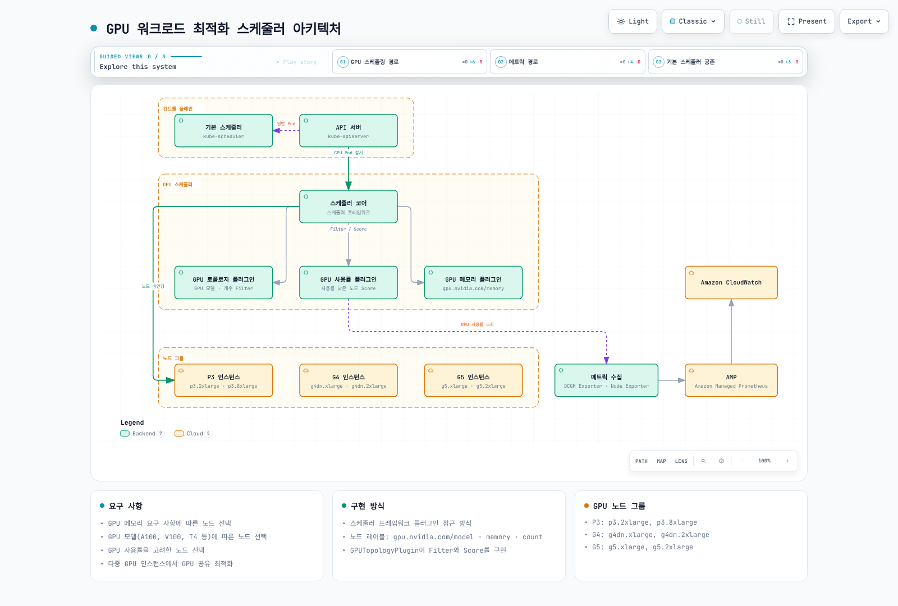
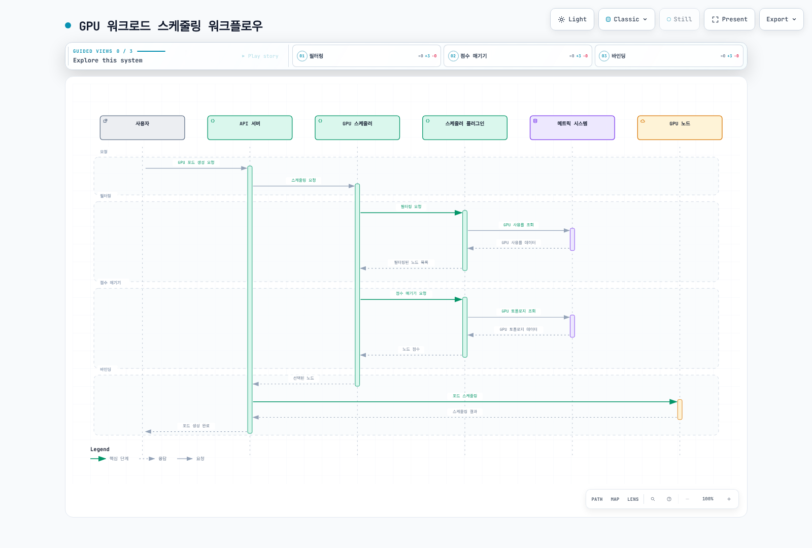
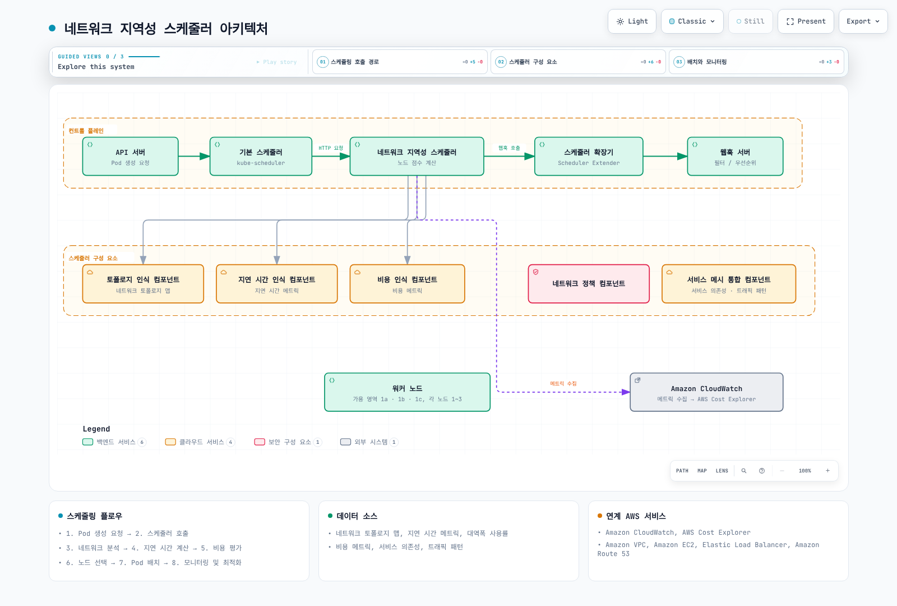
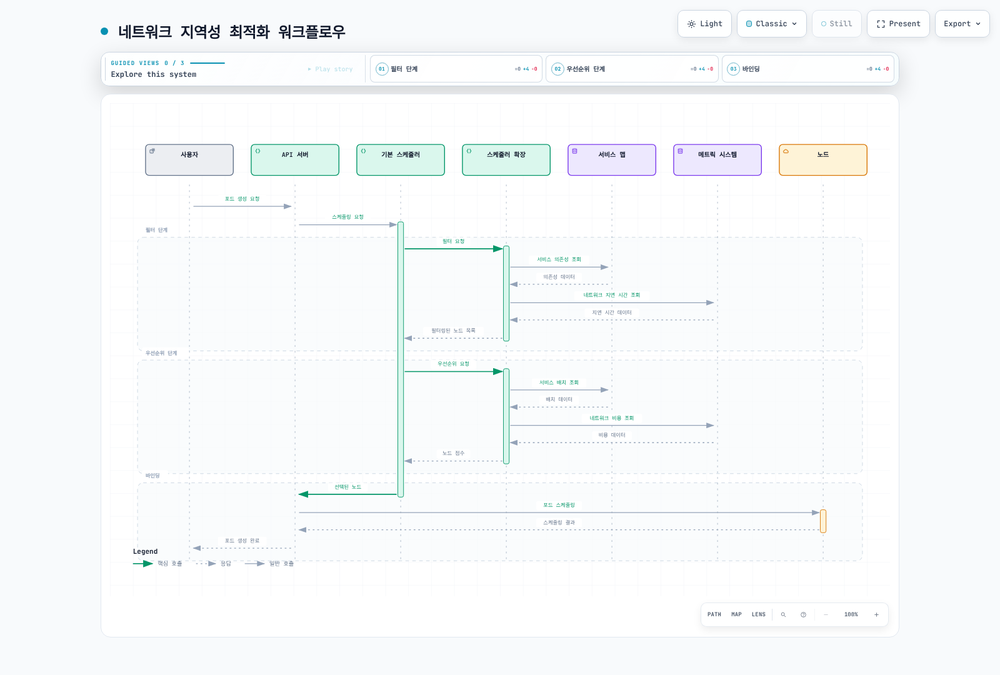
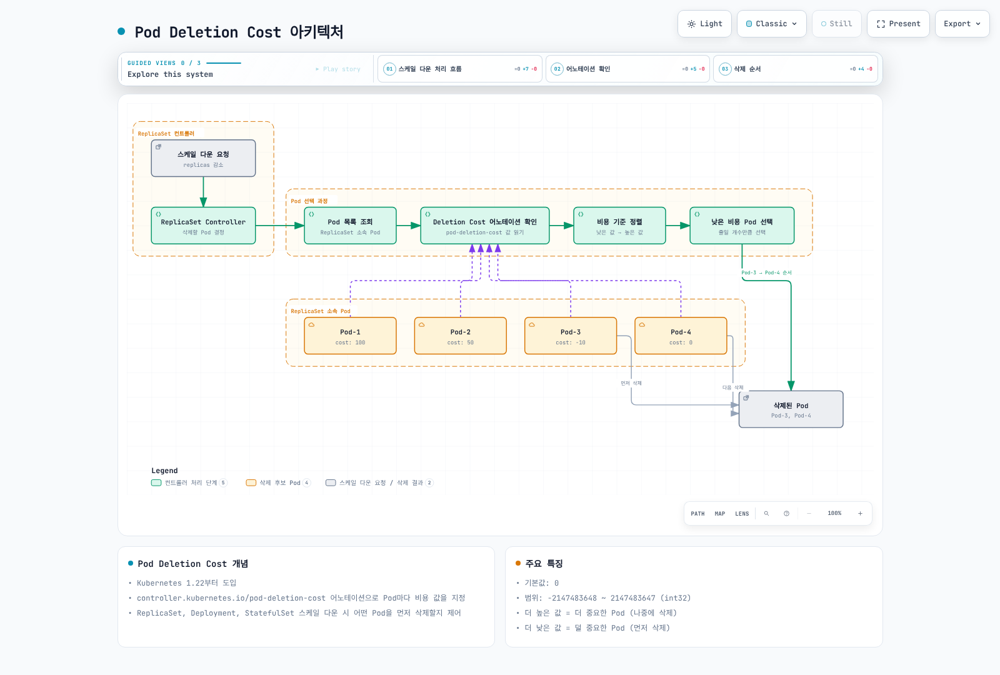
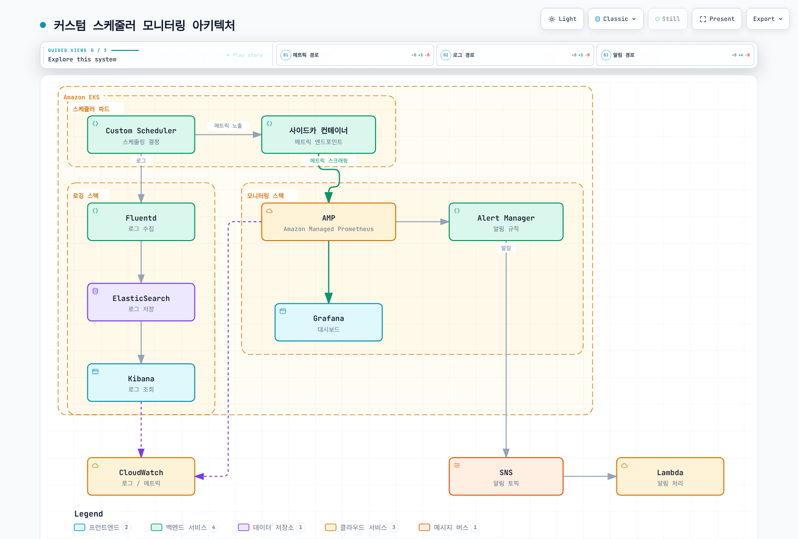
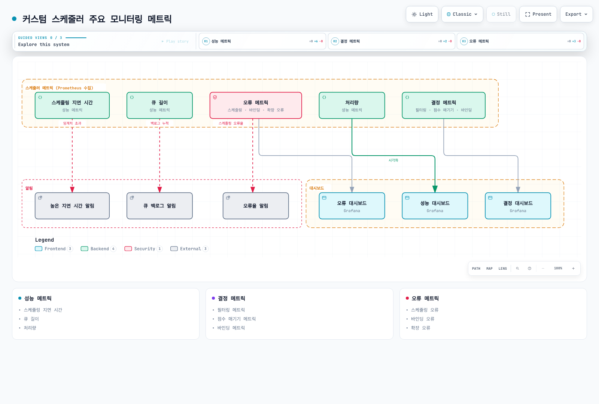

# Part 3: 고급 기능

> **예제 기준 버전**: Kubernetes 1.35.8, Go 1.27.1; Python 클라이언트 API 35.0.0
> **마지막 업데이트**: 2026년 9월 11일

[Part1 보조 스케줄러](01-custom-scheduler-part1.md)와 [Part2 프레임워크 인터페이스](02-custom-scheduler-part2.md)를 이용한 구현 패턴 예제입니다. 운영 배포 사례나 최적화 실측 보고서가 아닙니다. 로컬 코드·스키마 검사는 GPU 실행, 애플리케이션 준비 상태, 인증서 발급 또는 운영 가용성을 검증하지 않습니다.

## EKS에서의 커스텀 스케줄러 구현 사례

이 섹션은 EKS 스케줄링 정책 예제를 발전시킵니다. 실제 용량·장치 목록·트래픽·장애 동작은 대상 클러스터에서 검증해야 합니다.

### 사례 1: GPU 워크로드 최적화 스케줄러

AI/ML 워크로드를 실행하는 EKS 클러스터에서는 GPU 리소스를 효율적으로 활용하는 것이 중요합니다. 다음은 GPU 워크로드를 최적화하는 커스텀 스케줄러의 구현 사례입니다.

#### GPU 워크로드 최적화 스케줄러 아키텍처

GPU 배치 정책과 선택적인 메트릭 연동을 표현한 설계 예시입니다. 아래 구현은 캐시의 요청량을 사용하며 그림의 사용률 수집기가 구현·검증되었다는 뜻이 아닙니다.



[🔍 인터랙티브 다이어그램 보기](https://www.atomai.click/kubernetes-docs/archmaps/ko-scheduling-03-custom-scheduler-part3-10.html)

#### GPU 워크로드 스케줄링 워크플로우

다음 다이어그램은 GPU 워크로드 스케줄링 워크플로우를 보여줍니다:



[🔍 인터랙티브 다이어그램 보기](https://www.atomai.click/kubernetes-docs/archmaps/ko-scheduling-03-custom-scheduler-part3-11.html)

#### 요구 사항

1. 검증된 노드 레이블과 required node affinity로 GPU 메모리·모델 조건을 표현합니다.
2. `NodeResourcesFit`을 유지하여 유효 GPU 요청과 이미 할당·assume된 요청을 고려합니다.
3. 스케줄러 스냅샷으로 적합한 노드의 GPU를 모아 사용하도록 선호도를 줍니다. 실시간 사용률 가중치는 이 예제에 구현되지 않은 별도 연동입니다.
4. GPU 공유에는 적합한 device plugin·MIG·time-slicing 또는 DRA 할당 정책이 필요합니다. 노드 점수 함수가 장치를 분할하거나 프로세스별 GPU 메모리를 강제하지 않습니다.


#### 구현 접근 방식

이 사례에서는 스케줄러 프레임워크 플러그인 접근 방식을 사용합니다.

1. **레이블 전에 실제 목록을 검증합니다.** 아래 `training.example.com` 키는 관리자 정의 실습 레이블이며 NVIDIA 탐색 레이블이 아닙니다. 메모리는 공유하지 않는 동종 GPU 노드에서 각 적격 장치의 최소 메모리를 나타내야 합니다. GPU 수량은 `status.allocatable`에서 확인하며 개수 레이블은 남은 용량이 아닙니다.

```bash
kubectl get nodes -o custom-columns='NAME:.metadata.name,GPUS:.status.allocatable.nvidia\.com/gpu'

# Set only after verifying the actual node and per-device inventory.
: "${NODE_NAME:?Select a verified GPU node}"
: "${GPU_MODEL:?Set the observed model label value}"
: "${GPU_MEMORY_MIB:?Set verified minimum memory per GPU in MiB}"
kubectl label node "$NODE_NAME" \
  "training.example.com/gpu-model=$GPU_MODEL" \
  "training.example.com/gpu-memory-mib=$GPU_MEMORY_MIB" --overwrite
```

2. **기본 필터를 대체하지 않고 점수 플러그인을 추가합니다.** 다음을 `packing/plugin.go`로 저장합니다. 전체 개수 레이블·실시간 사용률 대신 allocatable에서 기존·assume된 요청과 신규 요청을 뺀 GPU 수량을 사용합니다. 0점은 노드 제외를 뜻하지 않습니다.

```go
package packing

import (
	"context"

	v1 "k8s.io/api/core/v1"
	"k8s.io/apimachinery/pkg/runtime"
	resourcehelper "k8s.io/component-helpers/resource"
	fwk "k8s.io/kube-scheduler/framework"
)

const Name = "GPUPacking"
const gpu v1.ResourceName = "nvidia.com/gpu"

type Plugin struct{}

var _ fwk.ScorePlugin = &Plugin{}

func (*Plugin) Name() string { return Name }

func (*Plugin) Score(_ context.Context, _ fwk.CycleState, pod *v1.Pod, info fwk.NodeInfo) (int64, *fwk.Status) {
	if pod == nil || info == nil || info.Node() == nil {
		return 0, fwk.NewStatus(fwk.Error, "missing node")
	}
	requests := resourcehelper.PodRequests(pod, resourcehelper.PodResourcesOptions{})
	request := requests[gpu]
	needed, exact := request.AsInt64()
	if !exact || needed < 0 {
		return 0, fwk.NewStatus(fwk.Error, "GPU request must be a non-negative integer")
	}
	if needed == 0 {
		return 0, nil
	}
	allocatable := info.GetAllocatable().GetScalarResources()[gpu]
	requested := info.GetRequested().GetScalarResources()[gpu]
	remaining := allocatable - requested - needed
	if remaining < 0 {
		// Score cannot exclude a node. NodeResourcesFit must remain enabled.
		return 0, nil
	}
	if remaining >= 10 {
		return 0, nil
	}
	return 100 - remaining*10, nil
}

func (*Plugin) ScoreExtensions() fwk.ScoreExtensions { return nil }

func New(_ context.Context, _ runtime.Object, _ fwk.Handle) (fwk.Plugin, error) {
	return &Plugin{}, nil
}
```

`cmd/gpu-packing-scheduler/main.go`에서 등록하고 `CGO_ENABLED=0 go build -buildvcs=false -o custom-scheduler ./cmd/gpu-packing-scheduler`로 Part1 이미지 절차를 사용합니다.

```go
package main

import (
	"os"

	"example.com/custom-scheduler/packing"
	"k8s.io/component-base/cli"
	"k8s.io/kubernetes/cmd/kube-scheduler/app"
)

func main() {
	command := app.NewSchedulerCommand(app.WithPlugin(packing.Name, packing.New))
	os.Exit(cli.Run(command))
}
```

기존 70:30 배치·사용률 아이디어는 `(packingScore * 7 + utilizationScore * 3) / 10`, `utilizationScore = (1 - utilization) * 100`이라는 설명용 식으로 표현할 수 있습니다. **이 바이너리에 연동되어 있지는 않습니다.** 실제 구현에는 일관되고 최신인 장치별 스냅샷, 0–1 범위의 유한 값, 제한된 수집 지연, 명시적인 누락 데이터 정책이 필요합니다. 메트릭 누락을 사용률0으로 처리하면 안 되며 사용률은 미할당 GPU 용량과 다릅니다.

3. **스케줄러 구성**:

```yaml
apiVersion: kubescheduler.config.k8s.io/v1
kind: KubeSchedulerConfiguration
leaderElection:
  leaderElect: true
  resourceLock: leases
  resourceName: custom-scheduler
  resourceNamespace: scheduler-lab
  leaseDuration: 15s
  renewDeadline: 10s
  retryPeriod: 2s
profiles:
- schedulerName: custom-scheduler
  plugins:
    score:
      enabled:
      - name: GPUPacking
        weight: 10
```

4. **Pod에 필수 배치 조건을 표현합니다.** 모델·메모리 예시 값은 실제 검증한 목록으로 바꾸세요. `Gt: "40959"`는 정수 레이블이 최소40960MiB라는 뜻입니다. 아래 BusyBox는 준비된 실습 환경에서 실행할 경우 GPU 리소스를 예약할 뿐 CUDA를 실행하거나 GPU를 검증하지 않습니다.

```yaml
apiVersion: v1
kind: Pod
metadata:
  name: gpu-reservation-demo
  namespace: scheduler-lab
spec:
  schedulerName: custom-scheduler
  automountServiceAccountToken: false
  restartPolicy: Never
  affinity:
    nodeAffinity:
      requiredDuringSchedulingIgnoredDuringExecution:
        nodeSelectorTerms:
        - matchExpressions:
          - key: training.example.com/gpu-model
            operator: In
            values:
            - A100
          - key: training.example.com/gpu-memory-mib
            operator: Gt
            values:
            - '40959'
  containers:
  - name: reservation
    image: busybox:1.37.0
    command:
    - sh
    - -c
    - sleep 60
    resources:
      requests:
        cpu: 100m
        memory: 64Mi
        nvidia.com/gpu: 2
      limits:
        memory: 128Mi
        nvidia.com/gpu: 2
```

### 사례 2: 네트워크 지역성 최적화 스케줄러

EKS 클러스터에서 네트워크 비용을 최적화하기 위해 네트워크 지역성을 고려하는 커스텀 스케줄러를 구현할 수 있습니다.

#### 네트워크 지역성 최적화 스케줄러 아키텍처

다음 다이어그램은 네트워크 지역성 최적화 스케줄러의 아키텍처를 보여줍니다.



[🔍 인터랙티브 다이어그램 보기](https://www.atomai.click/kubernetes-docs/archmaps/ko-scheduling-03-custom-scheduler-part3-12.html)

#### 네트워크 지역성 최적화 워크플로우

다음 다이어그램은 네트워크 지역성 최적화 스케줄러의 워크플로우를 보여줍니다.



[🔍 인터랙티브 다이어그램 보기](https://www.atomai.click/kubernetes-docs/archmaps/ko-scheduling-03-custom-scheduler-part3-13.html)

새 스케줄러를 만들기 전에 required/preferred Pod affinity, topology spread, 스토리지 토폴로지를 확인합니다. 실제 서비스 의존성과 적격 AZ를 모델링하세요. 같은 위치 배치로 일부 교차 AZ 트래픽을 줄일 수 있지만 장애 집중이나 경합이 커질 수 있습니다. 레이블·점수만으로 지연 시간·비용 절감을 입증할 수 없습니다.

그림은 가능한 연동 구조이며 완성된 NetworkPolicy·서비스 메시·CloudWatch 구현이 아닙니다. 후보 노드별 점수 계산 밖에서 메트릭을 수집하고 신선도·타임아웃을 제한하며 실제 트래픽으로 비용·가용성의 균형을 검증하세요. 이 장에 배포된 네트워크 지역성 스케줄러는 없습니다.

## Pod Deletion Cost를 이용한 스케일 다운 최적화

Pod Deletion Cost는 Deployment의 ReplicaSet이 소유한 Pod를 포함해 **ReplicaSet 축소 시 적용하는 best-effort 삭제 선호도**입니다. 1.21에서 alpha로 시작해1.22에서 기본 활성화된 beta가 되었으며, 참조 문서에서도 beta입니다. StatefulSet의 ordinal 삭제, 독립 Pod 삭제, 축출, 노드 장애를 제어하지 않습니다.

### Pod Deletion Cost 개념

각 Pod의 `controller.kubernetes.io/pod-deletion-cost` 어노테이션에 값을 지정합니다. 비용은 **같은 ReplicaSet 내부**에서 비교하며 Deployment·노드 전체의 전역 우선순위가 아닙니다. 높은 값도 더 우선하는 조건이 허용할 때만 유지 선호도를 높입니다.

**주요 특성:**

* 어노테이션이 없으면0이며 음수를 포함한 signed int32의 십진수 값이 유효합니다. 기능이 활성화된 상태에서 잘못된 값은 거부됩니다.
* 고정한 컨트롤러에서는 할당 여부·Pod phase·준비 상태가 비용보다 우선하고, 복제본 배치 등 다른 기준이 뒤따릅니다.
* 삭제 순서를 보장하지 않습니다. 모든 템플릿 비용이 같으면 복제본을 구분하지 못합니다.
* 잦은 메트릭 기반 갱신을 피하고 큰 애플리케이션 상태 전환이나 애플리케이션이 제어하는 축소 직전의 갱신을 사용하세요.


### Pod Deletion Cost 아키텍처

그림은 **할당·phase·준비 상태 등 관련 조건이 비교 가능한 경우**의 비용 선호도입니다. 확정적인 삭제 순서가 아닙니다.



[🔍 인터랙티브 다이어그램 보기](https://www.atomai.click/kubernetes-docs/archmaps/ko-scheduling-03-custom-scheduler-part3-0.html)

### 사용 사례

#### 1. 캐시가 워밍업된 Pod 보호

각 Pod의 비용을0으로 시작하는 Deployment입니다. **사용자 애플리케이션의 계약 예제**이므로 이미지를 바꾸고8080포트의 `/readyz`가 실제 워밍업 완료를 반영하도록 구현해야 합니다. 이번 감사에서는 해당 앱을 빌드·실행하지 않았습니다. 일정 시간이 지났다는 이유만으로 높은 비용을 주면 안 됩니다.

```yaml
apiVersion: v1
kind: Namespace
metadata:
  name: deletion-cost-lab
---
apiVersion: apps/v1
kind: Deployment
metadata:
  name: cache-app
  namespace: deletion-cost-lab
spec:
  replicas: 5
  selector:
    matchLabels:
      app: cache-app
  template:
    metadata:
      labels:
        app: cache-app
      annotations:
        controller.kubernetes.io/pod-deletion-cost: '0'
    spec:
      automountServiceAccountToken: false
      containers:
      - name: app
        image: registry.example.com/training/cache-app:validated
        ports:
        - name: http
          containerPort: 8080
        readinessProbe:
          httpGet:
            path: /readyz
            port: http
          periodSeconds: 5
        resources:
          requests:
            cpu: 100m
            memory: 128Mi
          limits:
            memory: 256Mi
        env:
        - name: POD_NAME
          valueFrom:
            fieldRef:
              fieldPath: metadata.name
        - name: POD_NAMESPACE
          valueFrom:
            fieldRef:
              fieldPath: metadata.namespace
        - name: POD_UID
          valueFrom:
            fieldRef:
              fieldPath: metadata.uid
```

특정 복제본의 실제 워밍업을 확인한 뒤 권한이 있는 운영자·컨트롤러가 그 Pod의 어노테이션을 갱신할 수 있습니다. Deployment 템플릿을 바꾸면 롤아웃과 새 ReplicaSet 생성이 발생합니다.

```bash
: "${POD_NAME:?Select a verified warm replica of cache-app}"
kubectl -n deletion-cost-lab annotate pod "$POD_NAME" \
  controller.kubernetes.io/pod-deletion-cost=100 --overwrite
```

예제 Deployment는 API 토큰을 마운트하지 않습니다. 아래 선택적 동적 갱신 함수에는 별도로 설정·인가한 Kubernetes 클라이언트가 필요합니다. 네임스페이스 RBAC의 `patch pods`는 호출한 Pod 자신으로 자동 제한되지 않습니다. 신뢰할 수 있는 컨트롤러나 적절한 자격 증명·어드미션 제약을 사용하세요. 이 예제는 그러한 운영 정책을 설치하지 않습니다.

#### 2. 활성 연결이 있는 Pod 보호

활성 연결 수는 유지 선호도의 한 입력이 될 수 있습니다. 비용이 삭제를 막지 않으므로 graceful shutdown과 연결 드레이닝은 여전히 필요합니다. 이 라이브러리는 갱신을 직렬화하고 큰 구간별 비용·Pod UID 검사를 사용하며 어노테이션만 패치하고 같은 값은 다시 쓰지 않습니다. 어노테이션의 단일 작성자와 Pod 템플릿에 이미 존재하는 annotations 객체를 전제로 합니다.

설정된 `client-go` 클라이언트와 어드미션된 Pod 이름·네임스페이스·UID를 전달합니다. Pod 내부 연동이면 식별자는 Downward API에서 얻을 수 있지만 식별자를 얻었다고 API 권한이 생기지는 않습니다. 연결 이벤트마다 호출하지 말고 제어하는 상태 전환이나 직접 제어하는 축소 직전에 `UpdateDeletionCost(ctx)`를 호출합니다.

```go
package deletioncost

import (
	"context"
	"encoding/json"
	"fmt"
	"strconv"
	"sync"
	"time"

	metav1 "k8s.io/apimachinery/pkg/apis/meta/v1"
	"k8s.io/apimachinery/pkg/types"
	"k8s.io/client-go/kubernetes"
)

const Annotation = "controller.kubernetes.io/pod-deletion-cost"

type ConnectionTracker struct {
	client                  kubernetes.Interface
	namespace, podName      string
	uid                     types.UID
	connectionsMu, updateMu sync.Mutex
	activeConnections       int64
	lastCost                int32
	lastCostSet             bool
}

func NewConnectionTracker(client kubernetes.Interface, namespace, podName string, uid types.UID) (*ConnectionTracker, error) {
	if client == nil || namespace == "" || podName == "" || uid == "" {
		return nil, fmt.Errorf("client and admitted Pod namespace/name/UID are required")
	}
	return &ConnectionTracker{client: client, namespace: namespace, podName: podName, uid: uid}, nil
}

func (t *ConnectionTracker) OnConnectionOpen() {
	t.connectionsMu.Lock()
	defer t.connectionsMu.Unlock()
	t.activeConnections++
}

func (t *ConnectionTracker) OnConnectionClose() {
	t.connectionsMu.Lock()
	defer t.connectionsMu.Unlock()
	if t.activeConnections > 0 {
		t.activeConnections--
	}
}

// Illustrative coarse policy, not a benchmark or an availability guarantee.
func CostForConnections(count int64) int32 {
	switch {
	case count <= 0:
		return 0
	case count < 10:
		return 100
	case count < 100:
		return 500
	default:
		return 1000
	}
}

// Call at an application-controlled transition or before a controlled scale-down,
// not for every request. Assumes a single owner of this Pod's cost annotation.
func (t *ConnectionTracker) UpdateDeletionCost(parent context.Context) (bool, error) {
	t.updateMu.Lock()
	defer t.updateMu.Unlock()
	if err := parent.Err(); err != nil {
		return false, err
	}
	t.connectionsMu.Lock()
	cost := CostForConnections(t.activeConnections)
	t.connectionsMu.Unlock()
	if t.lastCostSet && t.lastCost == cost {
		return false, nil
	}

	// The Deployment template must already contain an annotations object.
	// JSON Pointer escapes the slash in the annotation key as ~1.
	patch, err := json.Marshal([]map[string]any{
		{"op": "test", "path": "/metadata/uid", "value": string(t.uid)},
		{"op": "add", "path": "/metadata/annotations/controller.kubernetes.io~1pod-deletion-cost", "value": strconv.FormatInt(int64(cost), 10)},
	})
	if err != nil {
		return false, err
	}
	ctx, cancel := context.WithTimeout(parent, 3*time.Second)
	defer cancel()
	_, err = t.client.CoreV1().Pods(t.namespace).Patch(ctx, t.podName, types.JSONPatchType, patch, metav1.PatchOptions{})
	if err != nil {
		return false, err
	}
	t.lastCost, t.lastCostSet = cost, true
	return true, nil
}
```

#### 3. 데이터 지역성이 있는 Pod 보호

유용한 캐시를 가진 복제본에 지역성 힌트를 줄 수 있습니다. 아래는 모두50으로 시작하므로 신뢰할 수 있는 컨트롤러가 개별 Pod를 바꾸기 전까지 비용 차이가 없습니다. 비용이 데이터를 마운트·보존·복원하지 않으며 스토리지 제약·앱 복구는 별도입니다.

```yaml
apiVersion: apps/v1
kind: Deployment
metadata:
  name: data-processor
spec:
  replicas: 5
  selector:
    matchLabels:
      app: data-processor
  template:
    metadata:
      labels:
        app: data-processor
      annotations:
        # 데이터 지역성이 높은 Pod에 높은 비용 설정
        controller.kubernetes.io/pod-deletion-cost: "50"
    spec:
      affinity:
        podAntiAffinity:
          preferredDuringSchedulingIgnoredDuringExecution:
          - weight: 100
            podAffinityTerm:
              labelSelector:
                matchExpressions:
                - key: app
                  operator: In
                  values:
                  - data-processor
              topologyKey: kubernetes.io/hostname
      containers:
      - name: processor
        image: registry.example.com/training/data-processor:validated
        env:
        - name: POD_NAME
          valueFrom:
            fieldRef:
              fieldPath: metadata.name
        - name: POD_NAMESPACE
          valueFrom:
            fieldRef:
              fieldPath: metadata.namespace
```

#### 4. 새로 시작된 Pod 우선 삭제

초기 음수 비용은 다른 컨트롤러 조건이 같을 때 신규 복제본의 삭제를 선호하게 할 수 있습니다. **최초 배포 전** 템플릿에서 선택하고 실제 준비 상태 전환 뒤 개별 Pod를 갱신합니다. 고정된 postStart sleep은 캐시 준비 증거가 아니며 기존 Deployment 템플릿을 바꾸면 롤아웃이 발생합니다.

```yaml
# Deployment Pod-template fragment, chosen before initial deployment.
spec:
  template:
    metadata:
      annotations:
        controller.kubernetes.io/pod-deletion-cost: "-50"
```

### Horizontal Pod Autoscaler와의 통합

HPA는 원하는 복제본 수를 조정하고 Deployment·ReplicaSet 컨트롤러가 삭제할 Pod를 선택합니다. 비용은 그 선택의 힌트이며 HPA 신호나 보호 보장이 아닙니다. 아래 HPA는 앞의 `cache-app` Deployment를 대상으로 하며 정상 CPU 메트릭과 CPU requests가 필요합니다. `selectPolicy: Min`은 더 제한적인 축소 정책을 선택합니다.

```yaml
apiVersion: autoscaling/v2
kind: HorizontalPodAutoscaler
metadata:
  name: cache-app
  namespace: deletion-cost-lab
spec:
  scaleTargetRef:
    apiVersion: apps/v1
    kind: Deployment
    name: cache-app
  minReplicas: 3
  maxReplicas: 10
  metrics:
  - type: Resource
    resource:
      name: cpu
      target:
        type: Utilization
        averageUtilization: 70
  behavior:
    scaleDown:
      stabilizationWindowSeconds: 300
      policies:
      - type: Percent
        value: 50
        periodSeconds: 60
      - type: Pods
        value: 2
        periodSeconds: 60
      selectPolicy: Min
```

### 동적 Pod Deletion Cost 업데이트 패턴

대안 정책으로 최신 Pod별 요청·캐시·지연 시간 값을100점 구간의 힌트로 묶습니다. 가중치는 설명용이며 실측 성능 결과가 아닙니다. 가짜 수집기나 백그라운드 폴링 루프는 없습니다. Pod UID와 시간대가 있는 `observed_at`을 포함한 실제 샘플을 전달하세요. 누락·오류·오래된 샘플·다른 Pod의 데이터는 예외를 발생시키고 기존 어노테이션을 유지합니다.

미리 설정한 Kubernetes Python `ApiClient`를 전달합니다. 호출 시그니처는 클라이언트35.0.0으로 확인했습니다. JSON Patch 형식과 UID 검사, 제한된 연결·읽기 타임아웃을 명시합니다. 같은 Pod에 두 예제를 함께 실행하지 말고 어노테이션의 작성자·정책 하나를 선택하세요.

```python
from datetime import datetime, timezone
import math
import threading

ANNOTATION_PATH = (
    "/metadata/annotations/controller.kubernetes.io~1pod-deletion-cost"
)


def calculate_cost(metrics, now):
    """Illustrative coarse hint from a real, fresh per-Pod sample."""
    observed = datetime.fromisoformat(metrics["observed_at"].replace("Z", "+00:00"))
    if observed.tzinfo is None or now.tzinfo is None:
        raise ValueError("timestamps must include a timezone")
    age = (now - observed).total_seconds()
    if age < -5 or age > 60:
        raise ValueError("metrics timestamp is in the future or stale")

    active = metrics["active_requests"]
    if isinstance(active, bool) or not isinstance(active, int) or active < 0:
        raise ValueError("active_requests must be a non-negative integer")
    hit_rate = metrics["cache_hit_rate"]
    latency = metrics["avg_response_time_ms"]
    for value in (hit_rate, latency):
        if isinstance(value, bool) or not isinstance(value, (int, float)) or not math.isfinite(value):
            raise ValueError("metrics must be finite numbers")
    if not 0 <= hit_rate <= 1 or latency < 0:
        raise ValueError("invalid hit rate or latency")

    raw_cost = active * 5 + int(hit_rate * 100)
    raw_cost += 50 if latency < 100 else 20 if latency < 500 else 0
    # Coarse buckets reduce annotation churn. Weights are an example policy.
    return min(1000, (raw_cost // 100) * 100)


class DeletionCostManager:
    """Uses a configured Kubernetes Python ApiClient; starts no background loop."""

    def __init__(self, api_client, namespace, pod_name, pod_uid):
        if api_client is None or not all((namespace, pod_name, pod_uid)):
            raise ValueError("API client and admitted Pod namespace/name/UID required")
        self.api_client = api_client
        self.namespace = namespace
        self.pod_name = pod_name
        self.pod_uid = pod_uid
        self._last_cost = None
        self._lock = threading.Lock()

    def update_from_metrics(self, metrics, now=None):
        # A single writer should own this annotation. The Pod template must
        # already create the annotations object with an initial deletion cost.
        if metrics["pod_uid"] != self.pod_uid:
            raise ValueError("metrics belong to a different Pod UID")
        now = now or datetime.now(timezone.utc)
        cost = calculate_cost(metrics, now)
        with self._lock:
            if cost == self._last_cost:
                return False
            patch = [
                {"op": "test", "path": "/metadata/uid", "value": self.pod_uid},
                {"op": "add", "path": ANNOTATION_PATH, "value": str(cost)},
            ]
            # Explicit JSON Patch media type; preserve unrelated Pod fields.
            self.api_client.call_api(
                "/api/v1/namespaces/{namespace}/pods/{name}",
                "PATCH",
                path_params={"namespace": self.namespace, "name": self.pod_name},
                header_params={
                    "Accept": "application/json",
                    "Content-Type": "application/json-patch+json",
                },
                body=patch,
                response_type="V1Pod",
                auth_settings=["BearerToken"],
                _return_http_data_only=True,
                _request_timeout=(3, 5),
            )
            self._last_cost = cost
            return True
```

### 모니터링 및 디버깅

다음은 어노테이션을 조회하고 복제본 수를 바꾸지 않은 채 축소 요청을 검증합니다. 서버 dry run은 **ReplicaSet의 삭제 대상 선택을 시뮬레이션하지 않습니다.** 실제 축소 실험은 제어 가능한 격리 워크로드에서 진행하고 복제본 수를 다시 덮어쓸 HPA를 고려하며 전후 Pod UID·소유 ReplicaSet을 비교하세요. kubelet의 `Killing` 이벤트 하나로 비용 순서를 입증할 수 없습니다.

```bash
kubectl -n deletion-cost-lab get pods -l app=cache-app \
  -o custom-columns='NAME:.metadata.name,UID:.metadata.uid,COST:.metadata.annotations.controller\.kubernetes\.io/pod-deletion-cost'

kubectl -n deletion-cost-lab get pods -l app=cache-app -o json | \
  jq -r '.items[] | [.metadata.name, .metadata.uid, (.metadata.annotations["controller.kubernetes.io/pod-deletion-cost"] // "0")] | @tsv'

# Server-side dry run changes no replicas and does not predict victim selection.
kubectl -n deletion-cost-lab scale deployment/cache-app --replicas=3 --dry-run=server
kubectl -n deletion-cost-lab get replicasets,pods -l app=cache-app
```

### Prometheus 메트릭 수집

`kube_pod_annotations`는 애플리케이션이 아닌 **kube-state-metrics**가 제공합니다. 기존 exporter에 필요한 어노테이션만 허용하고 다른 플래그·허용 목록은 보존합니다. 기존 Prometheus 수집 대상이 정상이어야 하며 아래는 새 Deployment가 아닌 인자 조각입니다.

```yaml
# Fragment to merge into the existing kube-state-metrics container arguments.
# Preserve its other arguments and allowlisted keys.
args:
- --metric-annotations-allowlist=pods=[controller.kubernetes.io/pod-deletion-cost]
```

메트릭 값은1인 gauge이고 비용은 `annotation_controller_kubernetes_io_pod_deletion_cost` **레이블**입니다. 어노테이션을 relabel한다고 메트릭 값이 숫자 비용으로 바뀌지 않습니다. 시계열 누락은 수집 누락일 수 있으므로 비용0으로 단정하지 마세요.

### Grafana 대시보드

가져오기용 대시보드 JSON 객체이며 HTTP API의 `{"dashboard": ...}` 요청 wrapper가 아닙니다. `PROMETHEUS_UID`를 실제 데이터 소스 UID로 바꾸세요. 패널은 음수를 포함한 명시적 어노테이션 레이블별 Pod 수를 세며 gauge 값1을 비용으로 그리지 않습니다. 결과를 해석하기 전에 kube-state-metrics 허용 목록을 확인하세요.

```json
{
  "id": null,
  "uid": "pod-deletion-cost-hints",
  "title": "Pod Deletion Cost Hints",
  "schemaVersion": 39,
  "version": 1,
  "refresh": "30s",
  "time": {
    "from": "now-1h",
    "to": "now"
  },
  "panels": [
    {
      "id": 1,
      "title": "Pods by explicit deletion cost",
      "type": "piechart",
      "gridPos": {
        "h": 8,
        "w": 12,
        "x": 0,
        "y": 0
      },
      "datasource": {
        "type": "prometheus",
        "uid": "PROMETHEUS_UID"
      },
      "targets": [
        {
          "refId": "A",
          "expr": "count by (annotation_controller_kubernetes_io_pod_deletion_cost) (kube_pod_annotations{namespace=\"deletion-cost-lab\",annotation_controller_kubernetes_io_pod_deletion_cost=~\"-?[0-9]+\"})",
          "legendFormat": "{{annotation_controller_kubernetes_io_pod_deletion_cost}}",
          "instant": true
        }
      ],
      "fieldConfig": {
        "defaults": {
          "unit": "short"
        },
        "overrides": []
      },
      "options": {}
    },
    {
      "id": 2,
      "title": "Pods with an explicit cost",
      "type": "stat",
      "gridPos": {
        "h": 8,
        "w": 12,
        "x": 12,
        "y": 0
      },
      "datasource": {
        "type": "prometheus",
        "uid": "PROMETHEUS_UID"
      },
      "targets": [
        {
          "refId": "A",
          "expr": "count(kube_pod_annotations{namespace=\"deletion-cost-lab\",annotation_controller_kubernetes_io_pod_deletion_cost!=\"\"})",
          "legendFormat": "",
          "instant": true
        }
      ],
      "fieldConfig": {
        "defaults": {
          "unit": "short"
        },
        "overrides": []
      },
      "options": {}
    }
  ]
}
```

### 모범 사례

1. **일관된 비용 범위 사용**: 팀 내에서 일관된 비용 범위를 정의하여 사용합니다.
   * `-100 ~ -1`: 우선 삭제 (새로운 Pod, 워밍업 중인 Pod)
   * `0`: 기본값 (일반 Pod)
   * `1 ~ 100`: 보통 중요도 (활성 연결이 있는 Pod)
   * `100 ~ 1000`: 높은 중요도 (캐시가 워밍업된 Pod, 많은 연결이 있는 Pod)
2. **갱신 제한**: 큰 상태 전환이나 제어하는 축소 전에 갱신하고 요청·메트릭 샘플마다 쓰지 않습니다.
3. **상한선 설정**: deletion cost에 상한선을 설정하여 너무 큰 값으로 인한 문제를 방지합니다.
4. **모니터링**: deletion cost의 분포를 모니터링하여 예상대로 작동하는지 확인합니다.
5. **테스트**: 프로덕션에 적용하기 전에 스테이징 환경에서 스케일 다운 동작을 테스트합니다.
6. **문서화**: 각 비용 범위가 의미하는 바를 문서화합니다.

### 제한사항

* **PDB 범위**: 일반적인 ReplicaSet·Deployment 축소는 Pod를 직접 삭제하며 PDB가 차단하지 않습니다. PDB는 eviction API 요청을 제어하며 어느 방식도 장애 중 생존을 보장하지 않습니다.
* **버전·기능**: 1.21 alpha, 1.22부터 beta·기본 활성화입니다. 참조한1.35.8 기준에서도 활성화됩니다. 지원이 끝난 과거 마이너 버전을 배포하라는 의미는 아닙니다.
* **워크로드·소유권**: 한 ReplicaSet 내부의 선호도입니다. 독립 Pod·StatefulSet ordinal·전체 워크로드 삭제는 다른 경로입니다.
* **비동기 동작**: 동시 갱신·준비 상태·다른 선택 기준이 기대한 순서에 영향을 줄 수 있습니다. 새 Pod에는 자체 어노테이션이 필요하며 이 힌트는 영속 애플리케이션 상태가 아닙니다.


## 커스텀 스케줄러 모니터링 및 디버깅

커스텀 스케줄러를 구현한 후에는 모니터링 및 디버깅이 중요합니다. 이 섹션에서는 커스텀 스케줄러를 모니터링하고 디버깅하는 방법을 알아보겠습니다.

### 모니터링 아키텍처

관측 연동을 선택하는 개념도입니다. 수집 대상·인증·remote write·로그 경로는 별도 구성해야 하며 아래 예제는 스케줄러 자체 HTTPS 엔드포인트를 사용합니다.



[🔍 인터랙티브 다이어그램 보기](https://www.atomai.click/kubernetes-docs/archmaps/ko-scheduling-03-custom-scheduler-part3-14.html)

### 주요 모니터링 메트릭

다음 다이어그램은 커스텀 스케줄러의 주요 모니터링 메트릭과 그 관계를 보여줍니다:



[🔍 인터랙티브 다이어그램 보기](https://www.atomai.click/kubernetes-docs/archmaps/ko-scheduling-03-custom-scheduler-part3-15.html)

### 로깅

커스텀 스케줄러의 로그를 확인하여 스케줄링 결정을 이해할 수 있습니다:

```bash
kubectl logs -n scheduler-lab -l app=custom-scheduler --prefix --tail=100
```

### 이벤트 확인

포드 스케줄링과 관련된 이벤트를 확인할 수 있습니다:

```bash
kubectl -n scheduler-lab get events --field-selector involvedObject.name=<pod-name>
```

### 메트릭 수집

아래는10259에서 HTTPS 메트릭을 직접 제공하는 **보조 스케줄러**를 모니터링합니다. 메트릭 사이드카가 필수는 아닙니다. 그림의 AMP·CloudWatch·로그 수집기·알림 경로는 별도 설정이 필요합니다.

전제 조건은 탐색 권한이 있는 기존 Prometheus Operator 스택과 `custom-scheduler.scheduler-lab.svc`용 서버 인증서·개인 키가 들어 있는 `scheduler-lab/custom-scheduler-serving-tls` Secret입니다. 공개 CA는 `monitoring/custom-scheduler-ca`의 `ca.crt`에 둡니다. `monitoring/scheduler-scrape-token` Secret에는 Prometheus ServiceAccount의 유효하고 **교체되는 단기 토큰**이 필요합니다. 발급·교체는 이 예제에 구현하지 않았습니다.

PKI 준비 후 아래 **strategic merge patch**를 Part1 전체 Deployment에 적용합니다. 기존 이미지·설정·ServiceAccount를 유지하고 서버 키를 마운트합니다. 통제된 롤아웃 절차를 사용하세요. 이번 감사에서는 TLS 롤아웃을 실행하지 않았습니다.

```yaml
apiVersion: apps/v1
kind: Deployment
metadata:
  name: custom-scheduler
  namespace: scheduler-lab
spec:
  template:
    spec:
      containers:
      - name: custom-scheduler
        args:
        - --config=/etc/scheduler/config.yaml
        - --tls-cert-file=/etc/scheduler-serving/tls.crt
        - --tls-private-key-file=/etc/scheduler-serving/tls.key
        volumeMounts:
        - name: serving-tls
          mountPath: /etc/scheduler-serving
          readOnly: true
      volumes:
      - name: serving-tls
        secret:
          secretName: custom-scheduler-serving-tls
          defaultMode: 288
```

Service가 명명된 HTTPS 포트를 노출합니다. 예제의 `monitoring/prometheus` ServiceAccount는 실제 수집기 자격 증명으로 바꾸세요. 추가 ClusterRole은 non-resource `/metrics` GET만 허용하며 탐색 권한을 제공하지 않습니다. Prometheus 리소스가 ServiceMonitor의 레이블·네임스페이스를 선택하도록 설정해야 합니다.

```yaml
apiVersion: v1
kind: Service
metadata:
  name: custom-scheduler
  namespace: scheduler-lab
  labels:
    app: custom-scheduler
spec:
  selector:
    app: custom-scheduler
  ports:
  - name: https
    port: 10259
    targetPort: https
---
apiVersion: rbac.authorization.k8s.io/v1
kind: ClusterRole
metadata:
  name: custom-scheduler-metrics
rules:
- nonResourceURLs:
  - /metrics
  verbs:
  - get
---
apiVersion: rbac.authorization.k8s.io/v1
kind: ClusterRoleBinding
metadata:
  name: custom-scheduler-metrics
subjects:
- kind: ServiceAccount
  name: prometheus
  namespace: monitoring
roleRef:
  apiGroup: rbac.authorization.k8s.io
  kind: ClusterRole
  name: custom-scheduler-metrics
---
apiVersion: monitoring.coreos.com/v1
kind: ServiceMonitor
metadata:
  name: custom-scheduler
  namespace: monitoring
  labels:
    app: custom-scheduler
spec:
  namespaceSelector:
    matchNames:
    - scheduler-lab
  selector:
    matchLabels:
      app: custom-scheduler
  endpoints:
  - port: https
    path: /metrics
    scheme: https
    interval: 15s
    tlsConfig:
      serverName: custom-scheduler.scheduler-lab.svc
      ca:
        configMap:
          name: custom-scheduler-ca
          key: ca.crt
    authorization:
      type: Bearer
      credentials:
        name: scheduler-scrape-token
        key: token
```

### 대시보드 구성

안정 메트릭 `scheduler_scheduling_attempt_duration_seconds`는 `result`·`profile` 레이블이 있으며 histogram으로 시도 지연 시간을 추정합니다. `scheduler_schedule_attempts_total`은 counter이므로 처리량에는 rate를 사용합니다. `_count` 원시 값은 지연 시간이 아닙니다. `kubectl get --raw /metrics`는 보조 스케줄러가 아닌 API 서버의 메트릭을 반환합니다.

`PROMETHEUS_UID`를 바꾸고 내장 JSON을 가져오거나 Grafana 대시보드 provider·sidecar가 이 ConfigMap을 읽도록 구성합니다. ConfigMap 생성만으로 Grafana에 로드되지 않습니다. `grafana_dashboard: "1"`은 흔히 쓰는 provider 규칙이며 실제 설정과 일치해야 합니다. 실제 가져오기·쿼리 실행은 검증하지 않았습니다.

```yaml
apiVersion: v1
kind: ConfigMap
metadata:
  name: custom-scheduler-dashboard
  namespace: monitoring
  labels:
    grafana_dashboard: '1'
data:
  custom-scheduler-dashboard.json: |
    {
      "id": null,
      "uid": "custom-scheduler",
      "title": "Custom Scheduler",
      "schemaVersion": 39,
      "version": 1,
      "refresh": "30s",
      "time": {
        "from": "now-1h",
        "to": "now"
      },
      "panels": [
        {
          "id": 1,
          "title": "Successful scheduling attempt p95",
          "type": "timeseries",
          "gridPos": {
            "h": 8,
            "w": 12,
            "x": 0,
            "y": 0
          },
          "datasource": {
            "type": "prometheus",
            "uid": "PROMETHEUS_UID"
          },
          "targets": [
            {
              "refId": "A",
              "expr": "histogram_quantile(0.95, sum by (le, profile) (rate(scheduler_scheduling_attempt_duration_seconds_bucket{profile=\"custom-scheduler\",result=\"scheduled\"}[5m])))",
              "legendFormat": "{{profile}}",
              "instant": false
            }
          ],
          "fieldConfig": {
            "defaults": {
              "unit": "s"
            },
            "overrides": []
          },
          "options": {}
        },
        {
          "id": 2,
          "title": "Scheduling attempts per second",
          "type": "timeseries",
          "gridPos": {
            "h": 8,
            "w": 12,
            "x": 12,
            "y": 0
          },
          "datasource": {
            "type": "prometheus",
            "uid": "PROMETHEUS_UID"
          },
          "targets": [
            {
              "refId": "A",
              "expr": "sum by (result) (rate(scheduler_schedule_attempts_total{profile=\"custom-scheduler\"}[5m]))",
              "legendFormat": "{{result}}",
              "instant": false
            }
          ],
          "fieldConfig": {
            "defaults": {
              "unit": "ops"
            },
            "overrides": []
          },
          "options": {}
        }
      ]
    }
```

## 결론

커스텀 스케줄러는 특정 요구 사항에 맞게 Kubernetes 스케줄링 동작을 조정할 수 있는 강력한 방법입니다. EKS에서는 다중 스케줄러 접근 방식, 스케줄러 확장 접근 방식, 스케줄러 프레임워크 플러그인 접근 방식 등 다양한 방법으로 커스텀 스케줄러를 구현할 수 있습니다.

GPU 워크로드 최적화, 네트워크 지역성 최적화 등 다양한 사례에서 커스텀 스케줄러를 활용할 수 있습니다. 커스텀 스케줄러를 구현할 때는 모니터링 및 디버깅을 위한 도구를 함께 구성하는 것이 중요합니다.

## 참고 자료와 검증 범위

* [ReplicaSet 삭제 비용과 제한](https://kubernetes.io/docs/concepts/workloads/controllers/replicaset/#pod-deletion-cost)
* [Pod disruption budget](https://kubernetes.io/docs/concepts/workloads/pods/disruptions/)
* [고정 버전 ReplicaSet 삭제 경로](https://github.com/kubernetes/kubernetes/blob/v1.35.8/pkg/controller/replicaset/replica_set.go)
* [고정 버전 삭제 순서](https://github.com/kubernetes/kubernetes/blob/v1.35.8/pkg/controller/controller_utils.go)
* [스케줄러 메트릭](https://github.com/kubernetes/kubernetes/blob/v1.35.8/pkg/scheduler/metrics/metrics.go)
* [kube-state-metrics Pod 메트릭](https://github.com/kubernetes/kube-state-metrics/blob/main/docs/metrics/workload/pod-metrics.md)
* [Kubernetes Python 클라이언트 API](https://github.com/kubernetes-client/python/blob/v35.0.0/kubernetes/client/api_client.py)

로컬 테스트는 합성 Pod·가짜 API 클라이언트·산술 fixture를 사용합니다. 벤치마크 재실행, 실제 GPU 사용률·Pod 삭제·앱 워밍업·인증서/토큰 교체·운영 가용성을 검증한 결과가 아닙니다.

## 퀴즈

이 장에서 배운 내용을 테스트하려면 [주제 퀴즈](../quizzes/scheduling/02-custom-scheduler-part3-quiz.md)를 풀어보세요.
