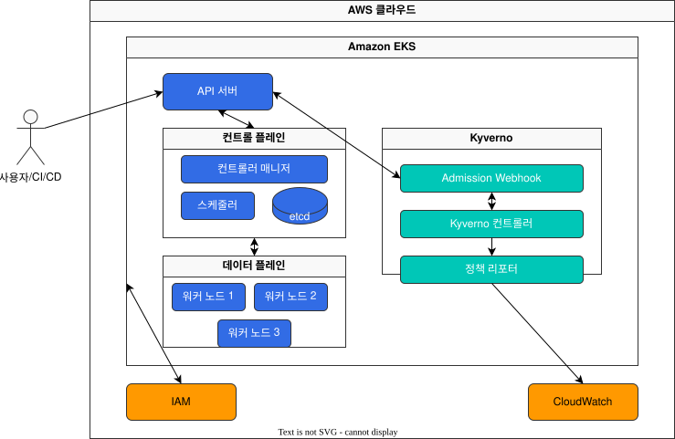
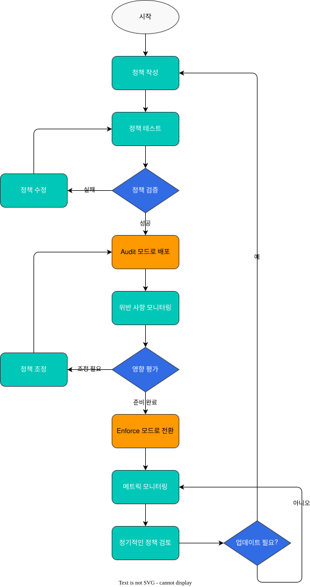

# Kyverno를 사용한 정책 관리

> **지원 버전**: Kubernetes 1.31, 1.32, 1.33  
> **마지막 업데이트**: 2026년 2월 19일

Kyverno는 Kubernetes 네이티브 정책 엔진으로, 클러스터 내에서 정책을 관리하고 적용하는 데 사용됩니다. 이 장에서는 Kyverno를 사용하여 EKS 클러스터에서 정책을 관리하는 방법을 알아보겠습니다.

## 실습 환경 설정

이 문서의 예제를 따라하기 위해서는 다음과 같은 도구와 환경이 필요합니다:

### 필수 도구
- kubectl v1.31 이상
- Helm v3.10 이상
- 작동하는 Kubernetes 클러스터 (EKS, minikube, kind 등)

### Kyverno 설치

```bash
# Helm 리포지토리 추가
helm repo add kyverno https://kyverno.github.io/kyverno/

# Helm 리포지토리 업데이트
helm repo update

# Kyverno 설치
helm install kyverno kyverno/kyverno -n kyverno --create-namespace
```

## Kyverno 소개

Kyverno는 Kubernetes 리소스로 정책을 정의하고 관리할 수 있는 정책 엔진입니다. Kyverno는 다음과 같은 기능을 제공합니다:

1. **검증(Validate)**: 리소스가 정책을 준수하는지 확인합니다.
2. **변형(Mutate)**: 리소스를 자동으로 수정합니다.
3. **생성(Generate)**: 관련 리소스를 자동으로 생성합니다.
4. **정리(Clean up)**: 더 이상 필요하지 않은 리소스를 자동으로 삭제합니다.

> **핵심 개념**: Kyverno는 Kubernetes 네이티브 접근 방식을 사용하므로 별도의 언어나 도구를 배울 필요가 없습니다. 정책은 Kubernetes 리소스로 정의되며, kubectl을 사용하여 관리할 수 있습니다.

### Kyverno 아키텍처 및 작동 방식


### Kyverno vs OPA Gatekeeper

Kyverno와 OPA Gatekeeper는 모두 Kubernetes 정책 관리를 위한 도구이지만, 몇 가지 중요한 차이점이 있습니다:

| 기능 | Kyverno | OPA Gatekeeper |
|------|---------|----------------|
| 정책 언어 | Kubernetes YAML | Rego (전용 언어) |
| 학습 곡선 | 낮음 (Kubernetes 사용자에게 친숙) | 높음 (Rego 학습 필요) |
| 변형 정책 | 기본 지원 | 제한적 지원 |
| 리소스 생성 | 지원 | 미지원 |
| 이미지 검증 | 기본 지원 | 사용자 정의 필요 |
| 정책 예외 처리 | 간단함 | 복잡함 |
| 성능 | 좋음 | 매우 좋음 (대규모 클러스터) |

Kyverno는 Kubernetes의 Admission Controller로 작동하여 API 서버로 들어오는 모든 요청을 가로채고 정의된 정책에 따라 검증, 변형, 생성 또는 정리 작업을 수행합니다. 또한 백그라운드 스캐너를 통해 기존 리소스에 대한 정책 준수 여부를 확인하고, 보고서 컨트롤러를 통해 정책 위반 사항을 보고합니다.

## Kyverno 설치

### Helm을 사용한 설치

Helm을 사용하여 Kyverno를 설치하는 방법은 다음과 같습니다:

```bash
# Helm 저장소 추가
helm repo add kyverno https://kyverno.github.io/kyverno/
helm repo update

# Kyverno 설치
helm install kyverno kyverno/kyverno --namespace kyverno --create-namespace
```

### YAML 매니페스트를 사용한 설치

YAML 매니페스트를 사용하여 Kyverno를 설치하는 방법은 다음과 같습니다:

```bash
# 네임스페이스 생성
kubectl create namespace kyverno

# Kyverno 설치
kubectl apply -f https://github.com/kyverno/kyverno/releases/download/v1.10.0/install.yaml
```

## 정책 유형

Kyverno는 다음과 같은 정책 유형을 지원합니다:

### 1. 검증 정책(Validation Policies)

검증 정책은 리소스가 특정 조건을 충족하는지 확인합니다. 조건을 충족하지 않으면 리소스 생성 또는 업데이트가 거부됩니다.

예: 모든 포드에 리소스 제한이 설정되어 있는지 확인하는 정책

```yaml
apiVersion: kyverno.io/v1
kind: ClusterPolicy
metadata:
  name: require-resource-limits
spec:
  validationFailureAction: enforce
  rules:
  - name: check-resource-limits
    match:
      resources:
        kinds:
        - Pod
    validate:
      message: "Resource limits are required for all containers."
      pattern:
        spec:
          containers:
          - resources:
              limits:
                memory: "?*"
                cpu: "?*"
```

### 2. 변형 정책(Mutation Policies)

변형 정책은 리소스를 자동으로 수정합니다. 이를 통해 기본값을 설정하거나 특정 필드를 추가할 수 있습니다.

예: 모든 포드에 기본 레이블을 추가하는 정책

```yaml
apiVersion: kyverno.io/v1
kind: ClusterPolicy
metadata:
  name: add-default-labels
spec:
  rules:
  - name: add-labels
    match:
      resources:
        kinds:
        - Pod
    mutate:
      patchStrategicMerge:
        metadata:
          labels:
            environment: "{{request.namespace}}"
            app.kubernetes.io/managed-by: kyverno
```

### 3. 생성 정책(Generation Policies)

생성 정책은 리소스가 생성될 때 관련 리소스를 자동으로 생성합니다.

예: 네임스페이스가 생성될 때 NetworkPolicy를 자동으로 생성하는 정책

```yaml
apiVersion: kyverno.io/v1
kind: ClusterPolicy
metadata:
  name: generate-networkpolicy
spec:
  rules:
  - name: generate-default-networkpolicy
    match:
      resources:
        kinds:
        - Namespace
    generate:
      kind: NetworkPolicy
      name: default-deny-all
      namespace: "{{request.object.metadata.name}}"
      data:
        spec:
          podSelector: {}
          policyTypes:
          - Ingress
          - Egress
```

## EKS에서의 Kyverno 활용 사례

EKS 클러스터에서 Kyverno를 활용하면 보안, 비용 최적화, 규정 준수 등 다양한 측면에서 정책을 적용할 수 있습니다.

### EKS와 Kyverno 통합 아키텍처

다음 다이어그램은 EKS 클러스터에서 Kyverno가 어떻게 통합되어 작동하는지 보여줍니다:



이 아키텍처에서 Kyverno는 EKS 클러스터 내에서 Admission Webhook으로 작동하여 API 서버로 들어오는 모든 요청을 가로채고 정의된 정책에 따라 처리합니다. 정책 위반 사항은 CloudWatch로 전송되어 모니터링 및 알림에 활용될 수 있습니다.

### 1. 보안 강화

#### 권한 있는 컨테이너 방지

```yaml
apiVersion: kyverno.io/v1
kind: ClusterPolicy
metadata:
  name: disallow-privileged-containers
spec:
  validationFailureAction: enforce
  rules:
  - name: privileged-containers
    match:
      resources:
        kinds:
        - Pod
    validate:
      message: "Privileged containers are not allowed."
      pattern:
        spec:
          containers:
          - name: "*"
            securityContext:
              privileged: false
```

#### 루트 사용자 실행 방지

```yaml
apiVersion: kyverno.io/v1
kind: ClusterPolicy
metadata:
  name: disallow-root-user
spec:
  validationFailureAction: enforce
  rules:
  - name: check-runAsNonRoot
    match:
      resources:
        kinds:
        - Pod
    validate:
      message: "Running as root is not allowed. Set runAsNonRoot to true."
      pattern:
        spec:
          containers:
          - securityContext:
              runAsNonRoot: true
```

### 2. 비용 최적화

#### 리소스 제한 설정

```yaml
apiVersion: kyverno.io/v1
kind: ClusterPolicy
metadata:
  name: set-default-resources
spec:
  rules:
  - name: set-default-resources
    match:
      resources:
        kinds:
        - Pod
    mutate:
      patchStrategicMerge:
        spec:
          containers:
          - (name): "*"
            resources:
              limits:
                memory: "512Mi"
                cpu: "500m"
              requests:
                memory: "256Mi"
                cpu: "250m"
```

#### 특정 인스턴스 유형 강제

```yaml
apiVersion: kyverno.io/v1
kind: ClusterPolicy
metadata:
  name: restrict-node-types
spec:
  validationFailureAction: enforce
  rules:
  - name: check-node-type
    match:
      resources:
        kinds:
        - Pod
    validate:
      message: "Pod must be scheduled on approved node types."
      pattern:
        spec:
          nodeSelector:
            node.kubernetes.io/instance-type: "?*"
          affinity:
            nodeAffinity:
              requiredDuringSchedulingIgnoredDuringExecution:
                nodeSelectorTerms:
                - matchExpressions:
                  - key: node.kubernetes.io/instance-type
                    operator: In
                    values:
                    - m5.large
                    - c5.large
                    - r5.large
```

### 3. 규정 준수

#### PodDisruptionBudget 자동 생성

```yaml
apiVersion: kyverno.io/v1
kind: ClusterPolicy
metadata:
  name: generate-pdb
spec:
  rules:
  - name: generate-pdb-for-deployment
    match:
      resources:
        kinds:
        - Deployment
    generate:
      kind: PodDisruptionBudget
      name: "{{request.object.metadata.name}}-pdb"
      namespace: "{{request.object.metadata.namespace}}"
      synchronize: true
      data:
        spec:
          minAvailable: 1
          selector:
            matchLabels:
              app: "{{request.object.metadata.labels.app}}"
```

#### 네임스페이스 리소스 쿼터 자동 생성

```yaml
apiVersion: kyverno.io/v1
kind: ClusterPolicy
metadata:
  name: generate-resourcequota
spec:
  rules:
  - name: generate-resourcequota
    match:
      resources:
        kinds:
        - Namespace
    generate:
      kind: ResourceQuota
      name: default-resourcequota
      namespace: "{{request.object.metadata.name}}"
      synchronize: true
      data:
        spec:
          hard:
            requests.cpu: "10"
            requests.memory: 10Gi
            limits.cpu: "20"
            limits.memory: 20Gi
            pods: "50"
```

## 정책 테스트 및 검증

Kyverno는 정책을 테스트하고 검증하기 위한 도구를 제공합니다.

### 정책 적용 워크플로우

다음 다이어그램은 Kyverno 정책의 일반적인 개발 및 적용 워크플로우를 보여줍니다:



### 정책 시뮬레이션

`kyverno test` 명령을 사용하여 정책을 시뮬레이션할 수 있습니다:

```bash
# Kyverno CLI 설치
curl -LO https://github.com/kyverno/kyverno/releases/download/v1.10.0/kyverno-cli_v1.10.0_linux_x86_64.tar.gz
tar -xvf kyverno-cli_v1.10.0_linux_x86_64.tar.gz
sudo mv kyverno /usr/local/bin/

# 정책 테스트
kyverno test ./policy.yaml --resource=./resource.yaml
```

### 정책 검증

`kubectl kyverno` 플러그인을 사용하여 정책을 검증할 수 있습니다:

```bash
# kubectl kyverno 플러그인 설치
kubectl krew install kyverno

# 정책 검증
kubectl kyverno apply ./policy.yaml --cluster
```

## 정책 모니터링 및 보고

Kyverno는 정책 위반을 모니터링하고 보고하기 위한 도구를 제공합니다.

### 정책 보고서

Kyverno는 다음과 같은 보고서 리소스를 생성합니다:

1. **ClusterPolicyReport**: 클러스터 수준의 정책 위반을 보고합니다.
2. **PolicyReport**: 네임스페이스 수준의 정책 위반을 보고합니다.

```bash
# 클러스터 정책 보고서 조회
kubectl get clusterpolicyreport

# 네임스페이스 정책 보고서 조회
kubectl get policyreport -n <namespace>
```

### Prometheus 메트릭

Kyverno는 Prometheus 메트릭을 제공하여 정책 위반을 모니터링할 수 있습니다:

```yaml
apiVersion: v1
kind: Service
metadata:
  name: kyverno-svc-metrics
  namespace: kyverno
  labels:
    app: kyverno
spec:
  ports:
  - port: 8000
    targetPort: 8000
    name: metrics
  selector:
    app: kyverno
---
apiVersion: monitoring.coreos.com/v1
kind: ServiceMonitor
metadata:
  name: kyverno-svc-metrics
  namespace: monitoring
  labels:
    release: prometheus
spec:
  selector:
    matchLabels:
      app: kyverno
  endpoints:
  - port: metrics
```

## 모범 사례

### 1. 점진적 적용

새로운 정책을 도입할 때는 먼저 `validationFailureAction: audit` 모드로 설정하여 위반 사항을 모니터링한 후, 준비가 되면 `enforce` 모드로 전환하는 것이 좋습니다.

```yaml
apiVersion: kyverno.io/v1
kind: ClusterPolicy
metadata:
  name: require-resource-limits
spec:
  validationFailureAction: audit  # 먼저 audit 모드로 시작
  rules:
  - name: check-resource-limits
    match:
      resources:
        kinds:
        - Pod
    validate:
      message: "Resource limits are required for all containers."
      pattern:
        spec:
          containers:
          - resources:
              limits:
                memory: "?*"
                cpu: "?*"
```

### 2. 예외 처리

특정 네임스페이스나 리소스에 대한 예외를 처리하려면 `exclude` 섹션을 사용합니다:

```yaml
apiVersion: kyverno.io/v1
kind: ClusterPolicy
metadata:
  name: require-resource-limits
spec:
  validationFailureAction: enforce
  rules:
  - name: check-resource-limits
    match:
      resources:
        kinds:
        - Pod
    exclude:
      resources:
        namespaces:
        - kube-system
        - kyverno
    validate:
      message: "Resource limits are required for all containers."
      pattern:
        spec:
          containers:
          - resources:
              limits:
                memory: "?*"
                cpu: "?*"
```

### 3. 정책 조직화

정책을 목적별로 조직화하고 명확한 이름을 사용하는 것이 좋습니다:

```
policies/
├── security/
│   ├── disallow-privileged-containers.yaml
│   ├── require-pod-probes.yaml
│   └── restrict-image-registries.yaml
├── cost-optimization/
│   ├── require-resource-limits.yaml
│   └── restrict-node-types.yaml
└── compliance/
    ├── generate-pdb.yaml
    └── generate-resourcequota.yaml
```

## 결론

Kyverno는 Kubernetes 네이티브 접근 방식을 사용하여 정책을 관리하는 강력한 도구입니다. EKS 클러스터에서 Kyverno를 사용하면 보안, 비용 최적화, 규정 준수 등 다양한 측면에서 정책을 적용할 수 있습니다. 정책을 점진적으로 도입하고, 예외를 처리하며, 잘 조직화하는 것이 중요합니다.

## 퀴즈

이 장에서 배운 내용을 테스트하려면 [Kyverno 정책 관리 퀴즈](../quizzes/security/01-kyverno-policy-management-quiz.md)를 풀어보세요.
