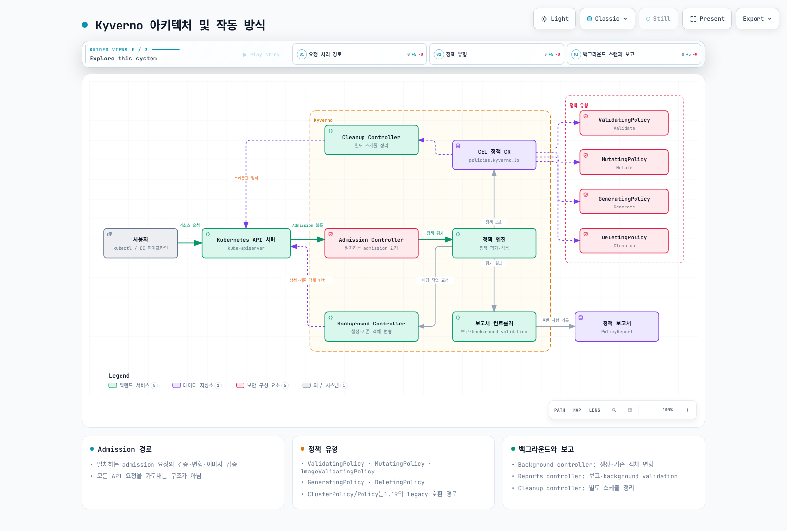
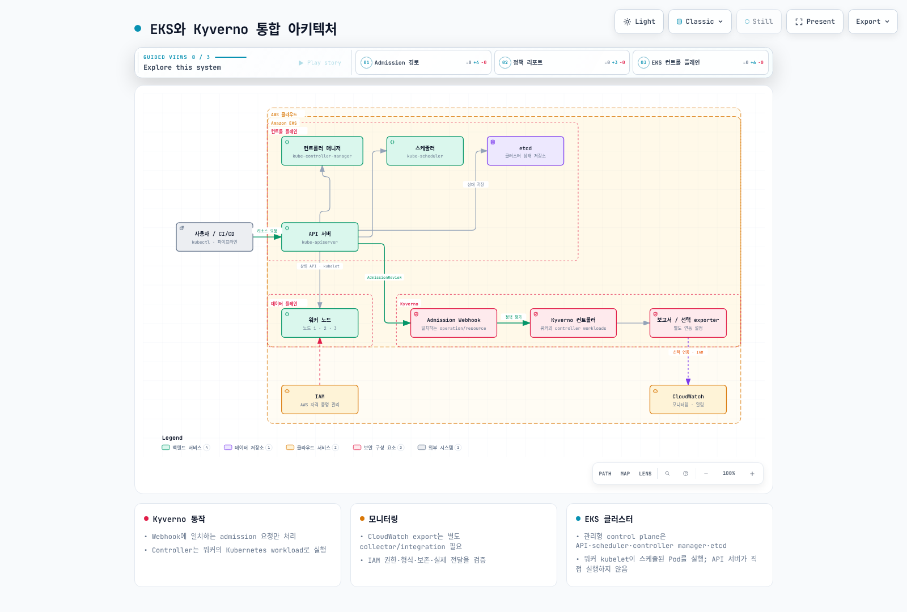
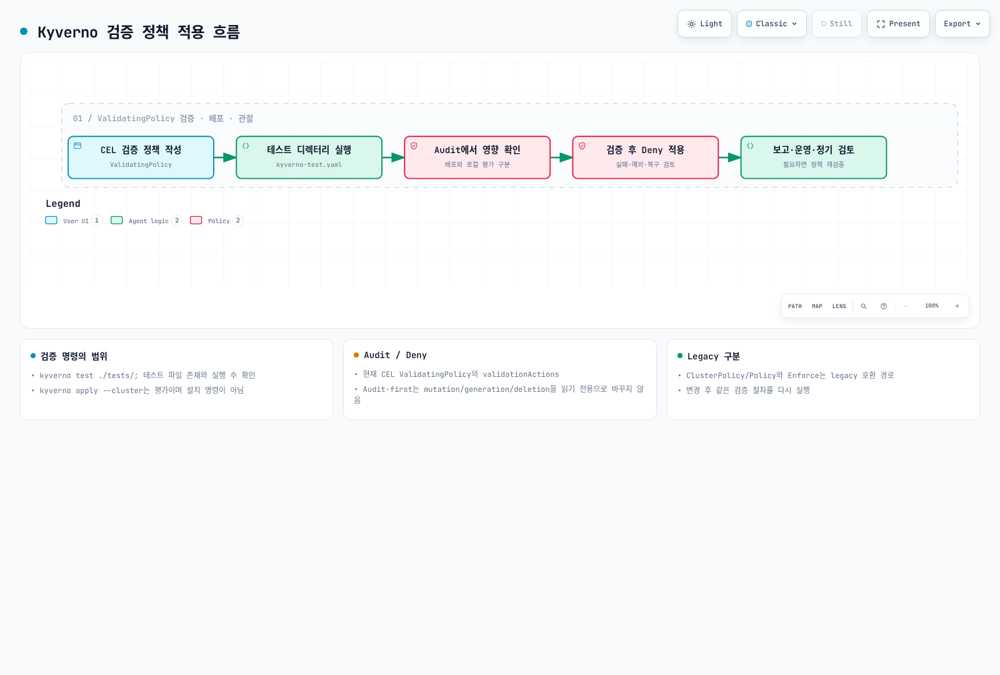

# Kyverno를 사용한 정책 관리

> **검토 기준**: Kyverno/CLI 1.19.1, Helm chart 3.9.1. 현재 release 문서가 명시한 테스트 범위는 Kubernetes 1.33–1.35이며, chart의 더 넓은 설치 조건이 호환성 보장은 아닙니다.
> **마지막 업데이트**: 2026년 9월 13일

Kyverno는 Kubernetes 정책을 평가하고 명시적으로 구성한 mutation·generation·deletion을 수행합니다. 다음 예제는 실제 CLI와 배포된 schema/chart로 로컬 검증했습니다. 실제 cluster 설치·admission·network isolation·cleanup·AWS 연동은 실행하지 않았습니다.

기존 ClusterPolicy 예제를 `policies.kyverno.io/v1` CEL 정책으로 수정했습니다. 공식 1.19 migration 지침은 ClusterPolicy/Policy·CleanupPolicy·기존 `kyverno.io` PolicyException을 deprecated로 표시하고 1.20에서 제거할 계획을 안내합니다. 1.19에서 이미 없어진 API라는 뜻은 아닙니다. apiVersion 문자열만 바꾸지 말고 규칙별로 이전·검증한 뒤 업그레이드합니다.

## 실습 환경 설정

### 필수 도구

대상 API server가 지원하는 version skew의 kubectl, 지원되는 OCI-capable Helm, 검증한 Kyverno 1.19.1 CLI를 사용합니다. CLI는 OS/architecture에 맞는 archive와 게시된 checksum/signature를 확인합니다. 1.10.0 archive를 재사용하거나 검증하지 않은 다운로드를 root 설치로 바로 연결하지 않습니다.

먼저 로컬 파일로 시작합니다. 아래 정책은 독립 예제이며 페이지 전체를 한꺼번에 적용하지 않습니다. Pod 예제는 `policy-lab`, generation은 추가 참여 label로 범위를 제한합니다. Policy·namespace label·Role·PolicyException 수정 권한도 통제합니다. Selector만으로 RBAC 보안 경계가 만들어지지는 않습니다.

### Kyverno 설치

Kyverno 전용 namespace를 준비합니다. 공유 cluster를 바꾸기 전에 EKS/Kubernetes 지원 버전, API server→webhook 연결, DNS, admission failure/timeout 동작과 CRD 업그레이드를 검토합니다. Controller의 권한은 Kubernetes ServiceAccount/RBAC로 관리하며, EKS에 Kyverno를 설치한다고 AWS administrator role이 필요한 것은 아닙니다.

## Kyverno 소개

### Kyverno 아키텍처 및 작동 방식



[인터랙티브 다이어그램 보기](https://www.atomai.click/kubernetes-docs/archmaps/ko-security-01-kyverno-policy-management-0.html)

| Component | 책임 |
|---|---|
| Admission controller | 매칭되는 admission 요청과 정책 검증·mutation·image 검사. 모든 GET/list를 가로채는 것은 아님 |
| Background controller | Generate와 명시적으로 활성화한 mutate-existing 작업 |
| Reports controller | Policy 결과 집계·보고 |
| Cleanup controller | Schedule 기반 deletion 정책과 허용된 정리 작업 |

Validating policy는 기존 위반 리소스를 삭제하거나 복구하지 않습니다. Background reporting·mutate-existing·generate-existing·scheduled deletion은 서로 다른 기능과 권한입니다. Generation은 비동기일 수 있으므로 namespace 생성과 생성된 NetworkPolicy enforcement가 원자적인 작업은 아닙니다.

### Kyverno vs OPA Gatekeeper

현재 Kyverno 정책은 YAML/JSON manifest 안에서 CEL을 사용하며 레거시 정책에는 pattern·JMESPath도 있습니다. Kubernetes-native 형식이라고 표현식을 배울 필요가 없어지는 것은 아닙니다. Gatekeeper는 ConstraintTemplate/Constraint와 해당 버전이 지원하는 policy engine, 별도 admission/audit/mutation 기능을 사용합니다. 필요한 기능·표현식·테스트·controller 가용성과 실제 workload 영향을 비교합니다. 이전의 “쉬움/복잡함”, “좋음/매우 좋음” 성능 평가는 근거 없는 비교이며 benchmark가 아니었습니다.

## Kyverno 설치

### Helm을 사용한 설치

다음을 `kyverno-values.yaml`로 저장합니다. 각 controller가 single replica인 **실습용** profile입니다. ServiceMonitor CRD와 해당 namespace/label을 선택하는 Prometheus가 이미 있어야 합니다. 예시 `release: kube-prom`은 실제 selector로 바꾸거나, 준비될 때까지 ServiceMonitor를 비활성화합니다.

```yaml
admissionController:
  replicas: 1
  serviceMonitor:
    enabled: true
    additionalLabels:
      release: kube-prom
backgroundController:
  replicas: 1
  serviceMonitor:
    enabled: true
    additionalLabels:
      release: kube-prom
cleanupController:
  replicas: 1
  serviceMonitor:
    enabled: true
    additionalLabels:
      release: kube-prom
reportsController:
  replicas: 1
  serviceMonitor:
    enabled: true
    additionalLabels:
      release: kube-prom
```

```bash
# Use an approved context; this changes real cluster resources.
: "${KUBE_CONTEXT:?Set the reviewed cluster context}"
helm repo add kyverno https://kyverno.github.io/kyverno/
helm repo update kyverno
helm template kyverno kyverno/kyverno --version 3.9.1 \
  --namespace kyverno --values kyverno-values.yaml > kyverno-rendered.yaml
# Inspect the render, CRD migration and webhook reachability before installation.
helm upgrade --install kyverno kyverno/kyverno --version 3.9.1 \
  --namespace kyverno --create-namespace --kube-context "$KUBE_CONTEXT" \
  --values kyverno-values.yaml
```

렌더링은 controller Deployment 4개와 metrics ServiceMonitor 4개를 포함합니다. Replica 증설은 topology·disruption·resource sizing·webhook 가용성을 함께 계획해야 합니다. 각 controller 하나씩 배치하는 것은 HA 설계가 아닙니다. Chart version label을 application version으로 해석하지 말고 실제 기본값과 rendered image tag를 확인합니다.

### YAML 매니페스트를 사용한 설치

GitOps가 YAML을 관리한다면 고정한 chart를 렌더링하고 CRD·RBAC·인증서·hook을 하나의 관리 집합으로 검토합니다. 단순 kubectl apply는 Helm hook/upgrade 의미를 실행하지 않습니다. 새 release 위에 기존 1.10.0 install.yaml을 적용하거나 동일 controller를 여러 도구가 소유하지 않도록 합니다.

## 정책 유형

### 1. 검증 정책(Validation Policies)

독립 예제를 `require-limits.yaml`로 저장합니다. **일반·init 컨테이너**의 CPU/memory limit이 비어 있지 않은지 검사합니다. Ephemeral container는 resource requests/limits를 선언할 수 없으므로 아래 보안 정책에서 별도로 검사합니다. 이는 선택한 per-container 정책이지 모든 Kubernetes workload가 이 전략을 써야 한다는 뜻이 아닙니다.

```yaml
apiVersion: policies.kyverno.io/v1
kind: ValidatingPolicy
metadata:
  name: require-container-limits
spec:
  validationActions:
  - Audit
  matchConstraints:
    resourceRules:
    - apiGroups:
      - ''
      apiVersions:
      - v1
      operations:
      - CREATE
      - UPDATE
      resources:
      - pods
  matchConditions:
  - name: lab-only
    expression: object.metadata.namespace == 'policy-lab'
  validations:
  - expression: variables.containers.all(c, has(c.resources) && has(c.resources.limits) && ['cpu', 'memory'].all(k, k in c.resources.limits
      && string(c.resources.limits[k]) != ''))
    message: Normal and init containers need nonempty CPU and memory limits.
  variables:
  - name: containers
    expression: object.spec.containers + object.spec.?initContainers.orValue([])
```

`validationActions: [Audit]`은 위반을 기록하면서 매칭되는 admission을 허용하고, `[Deny]`는 staging/영향 검토 후 거부하도록 설정합니다. Warn은 client 경고에 사용할 수 있습니다. Webhook `failurePolicy`는 평가/통신 실패를 처리하는 별도 설정입니다. CLI의 fail 결과를 실제 Audit 정책이 요청을 차단했다는 증거로 해석하지 않습니다.

### 2. 변형 정책(Mutation Policies)

`add-default-label.yaml`로 저장합니다. 명시적으로 빈 값을 포함해 기존 environment label을 보존합니다. Kyverno 안에 Helm Go-template if/hasKey를 넣는 대신 CEL ApplyConfiguration을 사용합니다.

```yaml
apiVersion: policies.kyverno.io/v1
kind: MutatingPolicy
metadata:
  name: add-default-label
spec:
  evaluation:
    mutateExisting:
      enabled: false
  matchConstraints:
    resourceRules:
    - apiGroups:
      - ''
      apiVersions:
      - v1
      operations:
      - CREATE
      - UPDATE
      resources:
      - pods
  matchConditions:
  - name: lab-only
    expression: object.metadata.namespace == 'policy-lab'
  mutations:
  - patchType: ApplyConfiguration
    applyConfiguration:
      expression: |-
        has(object.metadata.labels) && 'environment' in object.metadata.labels
        ? Object{}
        : Object{metadata: Object.metadata{labels: {"environment": object.metadata.namespace}}}
```

이 예제는 mutate-existing을 비활성화합니다. Admission mutation은 매칭되는 CREATE/UPDATE에 여전히 적용됩니다. JSONPatch를 사용한다면 labels parent map이 없을 때 먼저 생성하고 JSON Pointer의 `/`는 `~1`로 escape해야 합니다. 독립 정책 사이의 mutation 순서는 보장하지 않습니다.

### 3. 생성 정책(Generation Policies)

`generate-networkpolicy.yaml`로 저장합니다. 이름이 policy-lab이고 `training.example.com/managed: "true"`인 Namespace만 트리거합니다. Namespace 객체에는 namespace 필드가 아니라 **객체 name/label**을 사용해야 합니다.

```yaml
apiVersion: policies.kyverno.io/v1
kind: GeneratingPolicy
metadata:
  name: generate-lab-networkpolicy
spec:
  evaluation:
    synchronize:
      enabled: false
    generateExisting:
      enabled: false
    orphanDownstreamOnPolicyDelete:
      enabled: true
  matchConstraints:
    resourceRules:
    - apiGroups:
      - ''
      apiVersions:
      - v1
      operations:
      - CREATE
      - UPDATE
      resources:
      - namespaces
  matchConditions:
  - name: approved-lab-namespace
    expression: object.metadata.name == 'policy-lab' && object.metadata.?labels['training.example.com/managed'].orValue('')
      == 'true'
  generate:
  - expression: |-
      generator.Apply(object.metadata.name, [{
        "apiVersion": dyn("networking.k8s.io/v1"),
        "kind": dyn("NetworkPolicy"),
        "metadata": dyn({"name": "lab-default-deny", "namespace": object.metadata.name}),
        "spec": dyn({"podSelector": {}, "policyTypes": ["Ingress", "Egress"]})
      }])
```

Workload가 의존하기 전에 DNS/API/application allow rule을 준비합니다. NetworkPolicy를 집행하는 CNI가 필요하며 다른 allow policy는 합산되고 host-network 예외도 고려해야 합니다. 로컬 manifest 생성은 실제 통신 차단의 증거가 아닙니다.

예제는 synchronize와 generate-existing을 비활성화했습니다. Policy 설치 전에 존재한 Namespace는 자동 backfill되지 않습니다. 이후 매칭 trigger를 사용하거나 generate-existing 활성화의 영향을 명시적으로 검토한 뒤 설정을 바꿉니다. Synchronize를 활성화하면 data/clone source·trigger 변경·orphanDownstreamOnPolicyDelete에 따라 downstream lifecycle이 달라지며 보편적인 backup/rollback 기능이 아닙니다. Secret 공유는 정확한 source/target allowlist·RBAC·자격 증명 수명 검토가 필요합니다. 모든 새 namespace로 무조건 복사하지 않습니다.

### 4. 예약 삭제

DeletingPolicy는 spec.schedule과 CEL conditions를 사용하며 validation과 별도입니다. validationActions Audit switch가 있는 것으로 가정하지 않습니다. Cleanup controller에 명시적인 삭제 권한이 필요합니다. Namespace/object label·age/status retention 요구를 좁히고 후보 목록·복구를 검증한 뒤 schedule을 활성화합니다. 퀴즈의 선택 예제는 표시한 완료 Pod를 선택할 뿐 “24시간보다 오래된 Pod” 조건이 아니며 이번 감사에서 scheduled deletion은 실행하지 않았습니다.

## EKS에서의 Kyverno 활용 사례

### EKS와 Kyverno 통합 아키텍처



[인터랙티브 다이어그램 보기](https://www.atomai.click/kubernetes-docs/archmaps/ko-security-01-kyverno-policy-management-1.html)

EKS API server는 Kubernetes network/RBAC 경로로 매칭되는 webhook을 호출합니다. CloudWatch export는 collector/integration·IAM·retention을 별도로 구성해야 하며 설치만으로 PolicyReport가 자동 전송되지 않습니다. Secret이 포함될 수 있는 raw admission payload를 출력하지 않습니다.

### 1. 보안 강화

#### 권한 있는 컨테이너 방지

privileged가 없으면 false로 취급하며 일반·init·ephemeral container를 검사합니다. 선언한 pods/ephemeralcontainers 매칭은 대상 환경에서 실제 admission/subresource 검증이 별도로 필요합니다.

```yaml
apiVersion: policies.kyverno.io/v1
kind: ValidatingPolicy
metadata:
  name: disallow-privileged
spec:
  validationActions:
  - Audit
  matchConstraints:
    resourceRules:
    - apiGroups:
      - ''
      apiVersions:
      - v1
      operations:
      - CREATE
      - UPDATE
      resources:
      - pods
      - pods/ephemeralcontainers
  matchConditions:
  - name: lab-only
    expression: object.metadata.namespace == 'policy-lab'
  validations:
  - expression: variables.containers.all(c, !c.?securityContext.privileged.orValue(false))
    message: Privileged normal, init and ephemeral containers are not allowed.
  variables:
  - name: containers
    expression: object.spec.containers + object.spec.?initContainers.orValue([]) + object.spec.?ephemeralContainers.orValue([])
```

#### 루트 사용자 실행 방지

컨테이너 override 또는 Pod 기본값을 사용해 유효 runAsNonRoot를 요구하고 명시적 유효 UID 0을 거부합니다. 선언을 검증하는 정책이며 실제 kubelet/image 동작은 별도입니다.

```yaml
apiVersion: policies.kyverno.io/v1
kind: ValidatingPolicy
metadata:
  name: require-non-root
spec:
  validationActions:
  - Audit
  matchConstraints:
    resourceRules:
    - apiGroups:
      - ''
      apiVersions:
      - v1
      operations:
      - CREATE
      - UPDATE
      resources:
      - pods
      - pods/ephemeralcontainers
  matchConditions:
  - name: lab-only
    expression: object.metadata.namespace == 'policy-lab'
  validations:
  - expression: variables.containers.all(c, c.?securityContext.runAsNonRoot.orValue(object.spec.?securityContext.runAsNonRoot.orValue(false))
      && c.?securityContext.runAsUser.orValue(object.spec.?securityContext.runAsUser.orValue(-1)) != 0)
    message: Use effective runAsNonRoot=true and do not select UID 0.
  variables:
  - name: containers
    expression: object.spec.containers + object.spec.?initContainers.orValue([]) + object.spec.?ephemeralContainers.orValue([])
```

### 2. 비용 최적화

#### 리소스 제한 설정

`default-resources.yaml`로 저장합니다. CREATE에만 적용하여 일반 UPDATE에서 실행 중 Pod의 resource를 바꾸지 않으며, 일반 container에 **requests와 limits가 모두 없는 경우만** 기본값을 추가합니다. 기존 값 전체 또는 일부가 있으면 보존하여 workload sizing을 덮거나 작은 limit보다 큰 request를 만들지 않습니다. 부분 설정은 별도로 검토하며 모든 누락 필드나 init/ephemeral resources를 채우는 정책이 아닙니다.

```yaml
apiVersion: policies.kyverno.io/v1
kind: MutatingPolicy
metadata:
  name: default-unset-resources
spec:
  evaluation:
    mutateExisting:
      enabled: false
  matchConstraints:
    resourceRules:
    - apiGroups:
      - ''
      apiVersions:
      - v1
      operations:
      - CREATE
      resources:
      - pods
  matchConditions:
  - name: lab-only
    expression: object.metadata.namespace == 'policy-lab'
  mutations:
  - patchType: ApplyConfiguration
    applyConfiguration:
      expression: |-
        Object{spec: Object.spec{containers: object.spec.containers.map(c,
          (!has(c.resources) || ((!has(c.resources.requests) || c.resources.requests.size() == 0) &&
            (!has(c.resources.limits) || c.resources.limits.size() == 0)))
          ? Object.spec.containers{name: c.name, resources: Object.spec.containers.resources{
              requests: {"cpu": "250m", "memory": "256Mi"},
              limits: {"cpu": "500m", "memory": "512Mi"}
            }}
          : Object.spec.containers{name: c.name}
        )}}
```

#### 특정 인스턴스 유형 강제

기존 instance 이름은 allowlist 예시이며 현재 추천 사양이 아닙니다. 명시적 nodeSelector를 요구하고 admission의 CREATE에서만 nodeName 우회를 거부합니다. 스케줄된 Pod에는 정상적으로 nodeName이 생기므로 이 정책의 background scan은 껐습니다. Node label 신뢰, scheduler/binding 권한과 capacity는 별도입니다. Pod binding이나 Node 수정이 가능한 주체를 상대로 선언 검사만으로 실제 배치를 보장하지 않습니다.

```yaml
apiVersion: policies.kyverno.io/v1
kind: ValidatingPolicy
metadata:
  name: approved-node-selector
spec:
  validationActions:
  - Audit
  matchConstraints:
    resourceRules:
    - apiGroups:
      - ''
      apiVersions:
      - v1
      operations:
      - CREATE
      resources:
      - pods
  matchConditions:
  - name: lab-only
    expression: object.metadata.namespace == 'policy-lab'
  validations:
  - expression: object.spec.?nodeName.orValue('') == '' && object.spec.?nodeSelector['node.kubernetes.io/instance-type'].orValue('')
      in ['m5.large', 'c5.large', 'r5.large']
    message: Use an approved instance-type nodeSelector and do not bypass the scheduler with nodeName.
  evaluation:
    background:
      enabled: false
```

### 3. 규정 준수

#### PodDisruptionBudget 자동 생성

참여 label이 있는 Deployment의 desired replicas가 2 이상일 때 **spec.selector 전체**를 matchExpressions까지 복사합니다. Top-level app label은 없거나 Pod selector와 다를 수 있습니다. Desired replicas는 Ready replica 수의 증거가 아닙니다. Synchronization이 꺼진 정적 실습 budget은 scaling·selector 변경 후 소유자가 별도 검토해야 합니다. PDB는 해당하는 자발적 eviction을 제한할 뿐 모든 rollout/비자발적 장애를 막지 않습니다.

```yaml
apiVersion: policies.kyverno.io/v1
kind: GeneratingPolicy
metadata:
  name: generate-lab-pdb
spec:
  evaluation:
    synchronize:
      enabled: false
    generateExisting:
      enabled: false
    orphanDownstreamOnPolicyDelete:
      enabled: true
  matchConstraints:
    resourceRules:
    - apiGroups:
      - apps
      apiVersions:
      - v1
      operations:
      - CREATE
      - UPDATE
      resources:
      - deployments
  matchConditions:
  - name: approved-deployment
    expression: object.metadata.namespace == 'policy-lab' && object.metadata.?labels['training.example.com/managed'].orValue('')
      == 'true' && object.spec.?replicas.orValue(1) >= 2
  generate:
  - expression: |-
      generator.Apply(object.metadata.namespace, [{
        "apiVersion": dyn("policy/v1"), "kind": dyn("PodDisruptionBudget"),
        "metadata": dyn({"name": object.metadata.name + "-pdb", "namespace": object.metadata.namespace}),
        "spec": dyn({"minAvailable": 1, "selector": object.spec.selector})
      }])
```

Background controller에는 실제 생성 권한이 필요합니다. 다음은 렌더링한 kyverno release에 맞춘 namespace PDB 추가 권한 예시입니다. Chart에는 이미 다른 controller 권한이 있으므로 이것이 전체 effective RBAC라고 설명하지 않습니다. ServiceAccount 이름을 실제 render에 맞추고 cluster에서 권한을 확인합니다.

```yaml
apiVersion: rbac.authorization.k8s.io/v1
kind: Role
metadata:
  name: kyverno-lab-pdb-writer
  namespace: policy-lab
rules:
- apiGroups:
  - policy
  resources:
  - poddisruptionbudgets
  verbs:
  - get
  - list
  - watch
  - create
  - update
  - patch
  - delete
---
apiVersion: rbac.authorization.k8s.io/v1
kind: RoleBinding
metadata:
  name: kyverno-lab-pdb-writer
  namespace: policy-lab
subjects:
- kind: ServiceAccount
  name: kyverno-background-controller
  namespace: kyverno
roleRef:
  apiGroup: rbac.authorization.k8s.io
  kind: Role
  name: kyverno-lab-pdb-writer
```

#### 네임스페이스 리소스 쿼터 자동 생성

같은 명시적 Namespace 참여 조건을 사용합니다. Quota 값은 실습 정책이며 AWS budget 또는 비용 상한이 아닙니다. Workload requests·init container·limits·기존 quota 영향을 확인합니다.

```yaml
apiVersion: policies.kyverno.io/v1
kind: GeneratingPolicy
metadata:
  name: generate-lab-quota
spec:
  evaluation:
    synchronize:
      enabled: false
    generateExisting:
      enabled: false
    orphanDownstreamOnPolicyDelete:
      enabled: true
  matchConstraints:
    resourceRules:
    - apiGroups:
      - ''
      apiVersions:
      - v1
      operations:
      - CREATE
      - UPDATE
      resources:
      - namespaces
  matchConditions:
  - name: approved-lab-namespace
    expression: object.metadata.name == 'policy-lab' && object.metadata.?labels['training.example.com/managed'].orValue('')
      == 'true'
  generate:
  - expression: |-
      generator.Apply(object.metadata.name, [{
        "apiVersion": dyn("v1"), "kind": dyn("ResourceQuota"),
        "metadata": dyn({"name": "lab-resource-quota", "namespace": object.metadata.name}),
        "spec": dyn({"hard": {"requests.cpu": "10", "requests.memory": "10Gi",
          "limits.cpu": "20", "limits.memory": "20Gi", "pods": "50"}})
      }])
```

## 정책 테스트 및 검증

### 정책 적용 워크플로우



[인터랙티브 다이어그램 보기](https://www.atomai.click/kubernetes-docs/archmaps/ko-security-01-kyverno-policy-management-2.html)

정책 소유권·범위를 검토하고 로컬에서 정상/위반/skip 사례와 생성·변형 결과를 확인한 다음 실제 admission·controller 권한을 staging에서 검증합니다. Audit은 validation action이며 mutation·generation·deletion을 안전한 읽기로 바꾸지 않습니다. Pod controller autogeneration과 native ValidatingAdmissionPolicy/MutatingAdmissionPolicy 생성은 별도 opt-in 및 호환성 범위가 있습니다. Status의 생성 결과를 확인하고 모든 controller template이 자동 검사된다고 가정하지 않습니다.

### 정책 시뮬레이션

`policy-lab-tests/`를 만들고 다음 네 파일을 저장합니다. missing-label은 위반이 예상된 test case입니다. 테스트 통과는 기대 결과와 일치했다는 뜻이며 두 입력 모두 정책을 준수했다는 뜻이 아닙니다.

`require-team.yaml`:

```yaml
apiVersion: policies.kyverno.io/v1
kind: ValidatingPolicy
metadata:
  name: require-team
spec:
  validationActions:
  - Audit
  matchConstraints:
    resourceRules:
    - apiGroups:
      - ''
      apiVersions:
      - v1
      operations:
      - CREATE
      - UPDATE
      resources:
      - pods
  matchConditions:
  - name: lab-only
    expression: object.metadata.namespace == 'policy-lab'
  validations:
  - expression: object.metadata.?labels.team.orValue('') != ''
    message: A nonempty team label is required.
```

`pod.yaml` (로컬 fixture이며 image를 pull하지 않음):

```yaml
apiVersion: v1
kind: Pod
metadata:
  name: good
  namespace: policy-lab
  labels:
    team: platform
spec:
  containers:
  - name: app
    image: registry.example.com/app:fixture
```

`pod-missing.yaml`:

```yaml
apiVersion: v1
kind: Pod
metadata:
  name: missing-label
  namespace: policy-lab
spec:
  containers:
  - name: app
    image: registry.example.com/app:fixture
```

`kyverno-test.yaml`:

```yaml
apiVersion: cli.kyverno.io/v1alpha1
kind: Test
metadata:
  name: team-label-local-test
policies:
- require-team.yaml
resources:
- pod.yaml
- pod-missing.yaml
results:
- policy: require-team
  kind: Pod
  resources:
  - good
  result: pass
- policy: require-team
  kind: Pod
  resources:
  - missing-label
  result: fail
```

```bash
kyverno version
kyverno test ./policy-lab-tests --require-tests --warnings-as-errors
# Offline evaluation; this does not install a policy or modify cluster resources:
kyverno apply ./policy-lab-tests/require-team.yaml \
  --resource ./policy-lab-tests/pod-missing.yaml \
  --continue-on-error=false --warn-no-pass --warn-exit-code 2
# For mutation/generation, --output takes a file/directory path, not a format name:
kyverno apply add-default-label.yaml --resource ./policy-lab-tests/pod.yaml --output ./mutated/
```

### 정책 검증

kyverno test는 test manifest가 있는 directory를 받고, kyverno apply는 주어진 resource를 평가합니다. `--cluster`는 선택한 cluster의 resource를 읽어 평가하는 것이며 정책 설치 명령이 아닙니다. Kubectl/GitOps로 검토한 policy를 설치하는 것은 실제 cluster 변경입니다. 고정한 CLI help를 확인하세요. 일반적인 `kyverno validate` 또는 `kyverno create disallow-latest-tag` 흐름은 검증한 인터페이스가 아닙니다. Create 하위 명령 자체는 지원되는 Kyverno helper resource를 위해 존재합니다.

## 정책 모니터링 및 보고

### 정책 보고서

기본 profile은 Policy WG PolicyReport/ClusterPolicyReport API를 사용합니다. PolicyReport는 namespaced이고 ClusterPolicyReport는 cluster-scoped resource 결과를 다루며, 단순히 모든 namespace를 합친 이름이 아닙니다. Reporting 설정과 지원하는 rule 종류를 확인합니다. Background scan은 validation을 보고할 뿐 기존 객체를 소급해 거부·변형·삭제하지 않습니다. Background scan이 꺼져 있어도 기존 객체를 업데이트하면 매칭되는 admission 검사를 받습니다.

다음은 **합성 schema 예시**이며 실제 cluster에서 수집한 report가 아닙니다. `resource`/`status`가 아닌 `resources`/`result`를 사용합니다. Timestamp를 넣는다면 정수 seconds/nanos 형식이며 summary와 result 수가 일치해야 합니다.

```yaml
apiVersion: wgpolicyk8s.io/v1alpha2
kind: PolicyReport
metadata:
  name: example-report
  namespace: policy-lab
summary:
  pass: 1
  fail: 1
  warn: 0
  error: 0
  skip: 0
results:
- policy: require-team
  source: kyverno
  resources:
  - apiVersion: v1
    kind: Pod
    name: good
    namespace: policy-lab
  result: pass
- policy: require-team
  source: kyverno
  resources:
  - apiVersion: v1
    kind: Pod
    name: missing-label
    namespace: policy-lab
  result: fail
  message: A nonempty team label is required.
```

실제 결과는 `kubectl get policyreports -n policy-lab`, `kubectl get clusterpolicyreports`로 확인합니다. Reports Server/OpenReports는 별도 선택 설치·구성이므로 실제 설치한 API를 확인합니다.

### Prometheus 메트릭

검증한 chart values로 생성되는 metrics Service와 controller별 ServiceMonitor를 사용합니다. Service port 이름은 8000의 `metrics-port`이며 selector는 app: kyverno가 아니라 component/instance/part-of입니다. Render는 kyverno namespace와 namespaceSelector.matchNames=[kyverno]를 연결합니다. Prometheus가 해당 namespace/monitor를 선택해야 합니다. 리소스 존재만으로 실제 scrape나 CloudWatch export 성공이 입증되지는 않습니다.

## 모범 사례

### 1. 점진적 적용

새 validation은 Audit으로 시작해 실제 report/exception을 검토하고 필요한 곳에서 Deny를 선택합니다. Webhook failure policy·timeout·replica 가용성·비상 복구를 확인합니다. Generation·mutate-existing·destructive deletion 검토는 분리합니다.

### 2. 예외 처리

좁은 matchConstraints/matchConditions와 무제한 면제는 다릅니다. Namespace·name·kind·admission/user 정보의 가용성을 확인합니다. User/role 정보에 의존하는 classic rule이 background에서도 평가된다고 가정하지 않습니다. 현재 CEL PolicyException은 policies.kyverno.io/v1, 명시적 policyRefs/matchConditions와 선택적 expiresAt을 사용합니다. 생성 권한과 설치/feature 설정을 확인합니다. 예외는 authorization에 영향을 주므로 모든 앱 팀에 무제한 bypass 권한을 주지 않습니다.

### 3. 정책 조직화

Validation·mutation·generation·deletion을 버전과 tests·owner와 함께 관리합니다. Classic pattern/JMESPath와 CEL은 다른 문법이며 규칙별 출력 비교로 이전합니다. 현재 이미지 서명 정책은 ImageValidatingPolicy이고 [이미지 보안 문서](./07-image-security.md)의 attestor·registry·trust 전제 조건을 확인합니다. 서명 검증은 취약점 스캔이나 모든 registry를 제한하는 정책과 같지 않습니다.

## 결론

실제 Kyverno 1.19.1의 로컬 정책 평가·출력 보존, 배포된 API schema·chart render를 확인했습니다. 실제 webhook 순서/autogeneration·controller RBAC·networking·image trust·destructive lifecycle은 실행하지 않았으며 배포 환경의 인수 검증으로 남습니다.

- [Release 및 Kubernetes 테스트 범위](https://kyverno.io/docs/installation/releases/)
- [설치와 controller 책임](https://kyverno.io/docs/installation/installation/)
- [CEL migration](https://kyverno.io/docs/guides/migration-to-cel/)
- [ValidatingPolicy](https://kyverno.io/docs/policy-types/validating-policy/)
- [MutatingPolicy](https://kyverno.io/docs/policy-types/mutating-policy/)
- [GeneratingPolicy](https://kyverno.io/docs/policy-types/generating-policy/)
- [DeletingPolicy](https://kyverno.io/docs/policy-types/deleting-policy/)
- [CLI](https://kyverno.io/docs/kyverno-cli/reference/kyverno/)

## 퀴즈

[Kyverno 정책 관리 퀴즈](../quizzes/security/01-kyverno-policy-management-quiz.md)로 확인하세요.
