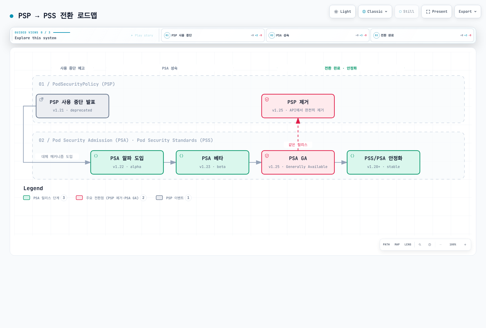
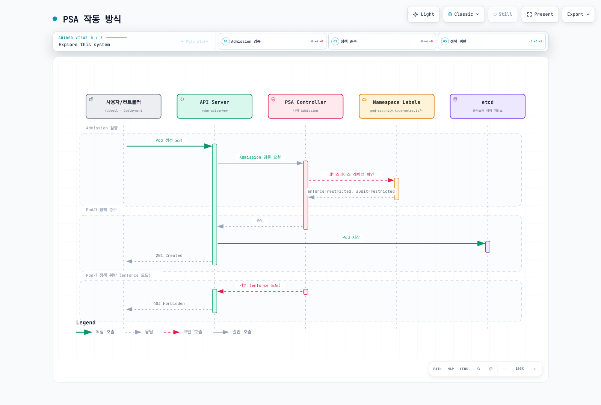
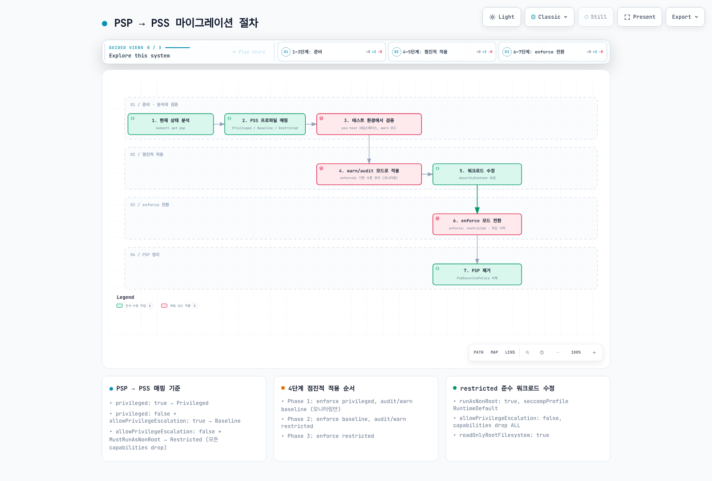

# Pod Security Standards (PSS)

> **지원 버전**: Kubernetes 1.31, 1.32, 1.33
> **마지막 업데이트**: 2026년 2월 22일

Pod Security Standards(PSS)는 Kubernetes에서 Pod 보안을 위한 표준화된 정책 프레임워크입니다. 이 문서에서는 PSS의 개념, 구성 방법, 그리고 EKS 환경에서의 적용 방법을 상세히 알아봅니다.

## 목차

1. [PSP에서 PSS로의 진화](#psp에서-pss로의-진화)
2. [Pod Security Admission (PSA) 컨트롤러](#pod-security-admission-psa-컨트롤러)
3. [보안 수준 (Security Levels)](#보안-수준-security-levels)
4. [적용 모드 (Enforcement Modes)](#적용-모드-enforcement-modes)
5. [네임스페이스 레벨 구성](#네임스페이스-레벨-구성)
6. [PSP에서 PSS로 마이그레이션](#psp에서-pss로-마이그레이션)
7. [EKS 기본 설정 및 구성](#eks-기본-설정-및-구성)
8. [보안 프로파일 상세](#보안-프로파일-상세)
9. [예외 구성](#예외-구성)
10. [점진적 도입 모범 사례](#점진적-도입-모범-사례)

---

## PSP에서 PSS로의 진화

### PodSecurityPolicy(PSP)의 역사

PodSecurityPolicy(PSP)는 Kubernetes 1.3에서 처음 도입된 Pod 보안 메커니즘이었습니다. 그러나 다음과 같은 문제점으로 인해 Kubernetes 1.21에서 사용 중단(deprecated)되었고, 1.25에서 완전히 제거되었습니다:

```
┌─────────────────────────────────────────────────────────────────┐
│                    PSP의 주요 문제점                              │
├─────────────────────────────────────────────────────────────────┤
│ 1. 복잡한 RBAC 바인딩 요구사항                                    │
│ 2. 암묵적 정책 적용 (어떤 정책이 적용되는지 불명확)                  │
│ 3. 사용자 vs 워크로드 권한 혼동                                    │
│ 4. Dry-run 모드 부재                                             │
│ 5. 감사(Audit) 기능 제한                                          │
└─────────────────────────────────────────────────────────────────┘
```

### PSS의 도입 배경

Pod Security Standards(PSS)와 Pod Security Admission(PSA)은 Kubernetes 1.22에서 알파로 도입되어, 1.23에서 베타, 1.25에서 GA(Generally Available)가 되었습니다.



[🔍 인터랙티브 다이어그램 보기](https://www.atomai.click/kubernetes-docs/archmaps/ko-security-03-pod-security-standards-0.html)

### PSP vs PSS 비교

| 특성 | PodSecurityPolicy (PSP) | Pod Security Standards (PSS) |
|------|------------------------|------------------------------|
| **활성화 방법** | Admission Controller 플러그인 | 내장 (기본 활성화) |
| **정책 정의** | 커스텀 PSP 리소스 | 사전 정의된 3가지 프로파일 |
| **정책 바인딩** | RBAC를 통한 복잡한 바인딩 | 네임스페이스 레이블로 간단히 적용 |
| **적용 범위** | 클러스터 전체 또는 네임스페이스 | 네임스페이스 레벨 |
| **Dry-run** | 미지원 | warn/audit 모드 지원 |
| **감사** | 제한적 | 내장 감사 지원 |
| **유연성** | 높음 (세밀한 제어 가능) | 중간 (표준화된 프로파일) |
| **복잡성** | 높음 | 낮음 |

---

## Pod Security Admission (PSA) 컨트롤러

### PSA 아키텍처

Pod Security Admission(PSA)은 Kubernetes API 서버에 내장된 Admission Controller로, Pod 생성 및 업데이트 요청을 가로채서 Pod Security Standards에 따라 검증합니다.

```
┌─────────────────────────────────────────────────────────────────────────┐
│                         Kubernetes API Server                            │
│  ┌─────────────────────────────────────────────────────────────────┐    │
│  │                    Admission Controllers                         │    │
│  │  ┌───────────┐  ┌───────────┐  ┌─────────────────────────────┐  │    │
│  │  │ Mutating  │──▶│Validating │──▶│  Pod Security Admission    │  │    │
│  │  │ Webhooks  │  │ Webhooks  │  │  (PSA Controller)           │  │    │
│  │  └───────────┘  └───────────┘  │  ┌───────────────────────┐  │  │    │
│  │                                 │  │ Security Standards    │  │  │    │
│  │                                 │  │ • Privileged          │  │  │    │
│  │                                 │  │ • Baseline            │  │  │    │
│  │                                 │  │ • Restricted          │  │  │    │
│  │                                 │  └───────────────────────┘  │  │    │
│  │                                 └─────────────────────────────┘  │    │
│  └─────────────────────────────────────────────────────────────────┘    │
└─────────────────────────────────────────────────────────────────────────┘
```

### PSA 작동 방식



[🔍 인터랙티브 다이어그램 보기](https://www.atomai.click/kubernetes-docs/archmaps/ko-security-03-pod-security-standards-1.html)

### PSA 활성화 상태 확인

Kubernetes 1.25 이상에서는 PSA가 기본적으로 활성화되어 있습니다:

```bash
# API 서버 설정 확인 (EKS에서는 관리형이므로 직접 확인 불가)
# 로컬 클러스터에서 확인
kubectl get pods -n kube-system -l component=kube-apiserver -o yaml | grep -A5 "enable-admission-plugins"

# PSA 기능 게이트 확인
kubectl get --raw /metrics | grep pod_security
```

---

## 보안 수준 (Security Levels)

PSS는 세 가지 보안 수준(프로파일)을 정의합니다. 각 수준은 점진적으로 더 엄격한 보안 제약을 적용합니다.

### 1. Privileged (특권)

가장 느슨한 정책으로, 제한이 없습니다. 시스템 및 인프라 수준의 워크로드에 적합합니다.

```yaml
# Privileged 수준: 모든 것이 허용됨
# 사용 사례: 시스템 데몬, CNI 플러그인, 모니터링 에이전트

apiVersion: v1
kind: Pod
metadata:
  name: privileged-pod
  namespace: kube-system
spec:
  hostNetwork: true      # 허용
  hostPID: true          # 허용
  hostIPC: true          # 허용
  containers:
  - name: privileged-container
    image: nginx
    securityContext:
      privileged: true   # 허용
      runAsRoot: true    # 허용
```

**Privileged 수준 허용 항목:**
- 호스트 네트워크, PID, IPC 네임스페이스
- 특권 컨테이너
- 모든 capabilities
- 호스트 경로 마운트
- 모든 사용자/그룹 ID

### 2. Baseline (기본)

최소한의 제한을 적용하여 알려진 권한 상승을 방지합니다. 대부분의 일반 워크로드에 적합합니다.

```yaml
# Baseline 수준: 알려진 권한 상승 방지
# 사용 사례: 일반 애플리케이션, 웹 서버, API 서버

apiVersion: v1
kind: Pod
metadata:
  name: baseline-pod
spec:
  containers:
  - name: app
    image: nginx
    securityContext:
      # 다음은 Baseline에서 금지됨:
      # privileged: true        ❌
      # allowPrivilegeEscalation: true (특정 조건)  ❌

      # 다음은 Baseline에서 허용됨:
      runAsNonRoot: false      # ✓ (허용되지만 권장하지 않음)
      readOnlyRootFilesystem: false  # ✓ (허용)
    ports:
    - containerPort: 80
```

**Baseline 수준 제한 항목:**

| 항목 | 제한 내용 |
|------|----------|
| HostProcess | Windows HostProcess 컨테이너 금지 |
| Host Namespaces | hostNetwork, hostPID, hostIPC 금지 |
| Privileged Containers | privileged: true 금지 |
| Capabilities | NET_RAW 외 추가 capabilities 금지 |
| HostPath Volumes | hostPath 볼륨 금지 |
| Host Ports | 호스트 포트 사용 금지 |
| AppArmor | 기본 프로파일 또는 localhost/* 만 허용 |
| SELinux | type은 제한된 값만, user/role 설정 금지 |
| /proc Mount Type | 기본값만 허용 |
| Seccomp | RuntimeDefault, Localhost만 허용 |
| Sysctls | 안전한 sysctls만 허용 |

### 3. Restricted (제한)

가장 엄격한 정책으로, Pod 보안 강화 모범 사례를 적용합니다. 보안이 중요한 워크로드에 적합합니다.

```yaml
# Restricted 수준: 보안 모범 사례 적용
# 사용 사례: 보안이 중요한 애플리케이션, 멀티테넌트 환경

apiVersion: v1
kind: Pod
metadata:
  name: restricted-pod
spec:
  securityContext:
    runAsNonRoot: true           # 필수
    seccompProfile:              # 필수
      type: RuntimeDefault
  containers:
  - name: app
    image: nginx
    securityContext:
      allowPrivilegeEscalation: false  # 필수
      readOnlyRootFilesystem: true     # 권장
      capabilities:
        drop:
          - ALL                  # 필수
      runAsNonRoot: true         # 필수
    resources:
      limits:
        memory: "128Mi"
        cpu: "500m"
```

**Restricted 수준 추가 제한 항목:**

| 항목 | 제한 내용 |
|------|----------|
| Volume Types | configMap, csi, downwardAPI, emptyDir, ephemeral, persistentVolumeClaim, projected, secret만 허용 |
| Privilege Escalation | allowPrivilegeEscalation: false 필수 |
| Running as Non-root | runAsNonRoot: true 필수 |
| Running as Non-root user | runAsUser는 0이 아닌 값 필수 (v1.23+) |
| Seccomp | RuntimeDefault 또는 Localhost 필수 |
| Capabilities | 모든 capabilities drop 필수, NET_BIND_SERVICE만 추가 허용 |

### 보안 수준 비교 차트

```
┌──────────────────────────────────────────────────────────────────────────┐
│                        보안 수준 비교                                      │
├──────────────────────────────────────────────────────────────────────────┤
│                                                                          │
│  제한 수준  ━━━━━━━━━━━━━━━━━━━━━━━━━━━━━━━━━━━━━━━━━━━━━━━━━━━▶          │
│             낮음                                          높음            │
│                                                                          │
│  ┌──────────────┐    ┌──────────────┐    ┌──────────────┐               │
│  │  Privileged  │    │   Baseline   │    │  Restricted  │               │
│  │              │    │              │    │              │               │
│  │  제한 없음   │    │ 알려진 권한  │    │ 보안 모범    │               │
│  │              │    │ 상승 방지    │    │ 사례 적용    │               │
│  │              │    │              │    │              │               │
│  │ 사용 사례:   │    │ 사용 사례:   │    │ 사용 사례:   │               │
│  │ - CNI       │    │ - 일반 앱   │    │ - 금융 앱   │               │
│  │ - CSI       │    │ - 웹 서버   │    │ - 의료 앱   │               │
│  │ - 모니터링  │    │ - API 서버  │    │ - 멀티테넌트 │               │
│  └──────────────┘    └──────────────┘    └──────────────┘               │
│                                                                          │
└──────────────────────────────────────────────────────────────────────────┘
```

---

## 적용 모드 (Enforcement Modes)

PSA는 세 가지 적용 모드를 제공합니다. 이 모드들은 독립적으로 또는 함께 사용할 수 있습니다.

### 1. enforce (적용)

정책 위반 시 Pod 생성을 차단합니다.

```yaml
# enforce 모드: 정책 위반 시 Pod 생성 차단
apiVersion: v1
kind: Namespace
metadata:
  name: production
  labels:
    pod-security.kubernetes.io/enforce: restricted
    pod-security.kubernetes.io/enforce-version: v1.31
```

**동작 예시:**
```bash
# 정책 위반 Pod 생성 시도
$ kubectl apply -f privileged-pod.yaml -n production
Error from server (Forbidden): error when creating "privileged-pod.yaml":
pods "privileged-pod" is forbidden: violates PodSecurity "restricted:v1.31":
privileged (container "app" must not set securityContext.privileged=true),
allowPrivilegeEscalation != false (container "app" must set
securityContext.allowPrivilegeEscalation=false)
```

### 2. audit (감사)

정책 위반 시 감사 로그에 기록하지만 Pod 생성은 허용합니다.

```yaml
# audit 모드: 정책 위반을 감사 로그에 기록
apiVersion: v1
kind: Namespace
metadata:
  name: staging
  labels:
    pod-security.kubernetes.io/audit: restricted
    pod-security.kubernetes.io/audit-version: v1.31
```

**감사 로그 예시:**
```json
{
  "kind": "Event",
  "apiVersion": "audit.k8s.io/v1",
  "level": "Metadata",
  "auditID": "abc123",
  "stage": "ResponseComplete",
  "requestURI": "/api/v1/namespaces/staging/pods",
  "verb": "create",
  "user": {
    "username": "developer@example.com"
  },
  "objectRef": {
    "resource": "pods",
    "namespace": "staging",
    "name": "my-pod"
  },
  "annotations": {
    "pod-security.kubernetes.io/audit-violations": "privileged (container \"app\" must not set securityContext.privileged=true)"
  }
}
```

### 3. warn (경고)

정책 위반 시 사용자에게 경고 메시지를 표시하지만 Pod 생성은 허용합니다.

```yaml
# warn 모드: 정책 위반 시 경고 메시지 표시
apiVersion: v1
kind: Namespace
metadata:
  name: development
  labels:
    pod-security.kubernetes.io/warn: restricted
    pod-security.kubernetes.io/warn-version: v1.31
```

**경고 메시지 예시:**
```bash
$ kubectl apply -f non-compliant-pod.yaml -n development
Warning: would violate PodSecurity "restricted:v1.31":
allowPrivilegeEscalation != false (container "app" must set
securityContext.allowPrivilegeEscalation=false),
unrestricted capabilities (container "app" must set
securityContext.capabilities.drop=["ALL"])
pod/my-pod created
```

### 모드 조합 전략

실제 환경에서는 여러 모드를 조합하여 사용하는 것이 권장됩니다:

```yaml
# 권장 구성: 모드 조합 사용
apiVersion: v1
kind: Namespace
metadata:
  name: app-namespace
  labels:
    # 현재 적용 수준
    pod-security.kubernetes.io/enforce: baseline
    pod-security.kubernetes.io/enforce-version: v1.31
    # 다음 단계 수준 감사
    pod-security.kubernetes.io/audit: restricted
    pod-security.kubernetes.io/audit-version: v1.31
    # 다음 단계 수준 경고
    pod-security.kubernetes.io/warn: restricted
    pod-security.kubernetes.io/warn-version: v1.31
```

```
┌─────────────────────────────────────────────────────────────────┐
│                    모드 조합 전략                                 │
├─────────────────────────────────────────────────────────────────┤
│                                                                 │
│  Phase 1: 현재 상태 파악                                         │
│  ┌─────────────────────────────────────────────────────────┐   │
│  │ enforce: privileged                                      │   │
│  │ audit: baseline                                          │   │
│  │ warn: baseline                                           │   │
│  └─────────────────────────────────────────────────────────┘   │
│                           │                                     │
│                           ▼                                     │
│  Phase 2: 점진적 강화                                            │
│  ┌─────────────────────────────────────────────────────────┐   │
│  │ enforce: baseline                                        │   │
│  │ audit: restricted                                        │   │
│  │ warn: restricted                                         │   │
│  └─────────────────────────────────────────────────────────┘   │
│                           │                                     │
│                           ▼                                     │
│  Phase 3: 최종 목표                                              │
│  ┌─────────────────────────────────────────────────────────┐   │
│  │ enforce: restricted                                      │   │
│  │ audit: restricted                                        │   │
│  │ warn: restricted                                         │   │
│  └─────────────────────────────────────────────────────────┘   │
│                                                                 │
└─────────────────────────────────────────────────────────────────┘
```

---

## 네임스페이스 레벨 구성

### 기본 레이블 구성

PSS는 네임스페이스 레이블을 통해 구성됩니다:

```yaml
apiVersion: v1
kind: Namespace
metadata:
  name: secure-namespace
  labels:
    # 형식: pod-security.kubernetes.io/<MODE>: <LEVEL>
    pod-security.kubernetes.io/enforce: restricted
    pod-security.kubernetes.io/enforce-version: v1.31
    pod-security.kubernetes.io/audit: restricted
    pod-security.kubernetes.io/audit-version: v1.31
    pod-security.kubernetes.io/warn: restricted
    pod-security.kubernetes.io/warn-version: v1.31
```

### 버전 지정

특정 Kubernetes 버전의 PSS 정의를 사용할 수 있습니다:

```yaml
apiVersion: v1
kind: Namespace
metadata:
  name: versioned-namespace
  labels:
    # 특정 버전의 PSS 정의 사용
    pod-security.kubernetes.io/enforce: restricted
    pod-security.kubernetes.io/enforce-version: v1.31  # 특정 버전

    # 'latest'를 사용하면 현재 클러스터 버전의 PSS 적용
    # pod-security.kubernetes.io/enforce-version: latest
```

### 환경별 구성 예시

```yaml
---
# 개발 환경: 느슨한 정책
apiVersion: v1
kind: Namespace
metadata:
  name: development
  labels:
    environment: development
    pod-security.kubernetes.io/enforce: baseline
    pod-security.kubernetes.io/warn: restricted
---
# 스테이징 환경: 중간 정책
apiVersion: v1
kind: Namespace
metadata:
  name: staging
  labels:
    environment: staging
    pod-security.kubernetes.io/enforce: baseline
    pod-security.kubernetes.io/audit: restricted
    pod-security.kubernetes.io/warn: restricted
---
# 프로덕션 환경: 엄격한 정책
apiVersion: v1
kind: Namespace
metadata:
  name: production
  labels:
    environment: production
    pod-security.kubernetes.io/enforce: restricted
    pod-security.kubernetes.io/audit: restricted
    pod-security.kubernetes.io/warn: restricted
```

### 기존 네임스페이스에 레이블 추가

```bash
# kubectl을 사용하여 레이블 추가
kubectl label namespace my-namespace \
  pod-security.kubernetes.io/enforce=restricted \
  pod-security.kubernetes.io/enforce-version=v1.31 \
  pod-security.kubernetes.io/audit=restricted \
  pod-security.kubernetes.io/warn=restricted

# 레이블 확인
kubectl get namespace my-namespace -o yaml | grep pod-security
```

---

## PSP에서 PSS로 마이그레이션

### 마이그레이션 개요

PSP에서 PSS로의 마이그레이션은 신중하게 계획하고 단계적으로 수행해야 합니다.



[🔍 인터랙티브 다이어그램 보기](https://www.atomai.click/kubernetes-docs/archmaps/ko-security-03-pod-security-standards-2.html)

### 1단계: 현재 PSP 분석

```bash
# 현재 PSP 목록 확인
kubectl get psp

# PSP 상세 정보 확인
kubectl get psp <psp-name> -o yaml

# PSP가 적용된 Pod 확인
kubectl get pods --all-namespaces -o jsonpath='{range .items[*]}{.metadata.namespace}/{.metadata.name}: {.metadata.annotations.kubernetes\.io/psp}{"\n"}{end}'
```

### 2단계: PSP를 PSS 프로파일로 매핑

```yaml
# 예시: 기존 PSP
apiVersion: policy/v1beta1
kind: PodSecurityPolicy
metadata:
  name: restricted-psp
spec:
  privileged: false
  allowPrivilegeEscalation: false
  requiredDropCapabilities:
    - ALL
  volumes:
    - 'configMap'
    - 'emptyDir'
    - 'projected'
    - 'secret'
    - 'downwardAPI'
    - 'persistentVolumeClaim'
  hostNetwork: false
  hostIPC: false
  hostPID: false
  runAsUser:
    rule: MustRunAsNonRoot
  seLinux:
    rule: RunAsAny
  fsGroup:
    rule: RunAsAny
  supplementalGroups:
    rule: RunAsAny
```

**매핑 결과:** 위 PSP는 `restricted` 프로파일에 해당

### PSP → PSS 매핑 테이블

| PSP 설정 | PSS 프로파일 | 비고 |
|----------|-------------|------|
| `privileged: true` | Privileged | - |
| `privileged: false`, `allowPrivilegeEscalation: true` | Baseline | - |
| `privileged: false`, `allowPrivilegeEscalation: false`, `runAsUser.rule: MustRunAsNonRoot` | Restricted | 모든 capabilities drop 필요 |

### 3단계: 테스트 환경에서 검증

```bash
# 테스트 네임스페이스 생성
kubectl create namespace pss-test

# warn 모드로 restricted 적용
kubectl label namespace pss-test \
  pod-security.kubernetes.io/warn=restricted \
  pod-security.kubernetes.io/warn-version=v1.31

# 기존 워크로드 배포 테스트
kubectl apply -f my-deployment.yaml -n pss-test

# 경고 메시지 확인 및 워크로드 수정
```

### 4단계: 점진적 적용

```yaml
# 단계별 마이그레이션 네임스페이스 구성
apiVersion: v1
kind: Namespace
metadata:
  name: migrating-namespace
  labels:
    # Phase 1: 모니터링만 (기존 동작 유지)
    pod-security.kubernetes.io/enforce: privileged
    pod-security.kubernetes.io/audit: baseline
    pod-security.kubernetes.io/warn: baseline

    # Phase 2: baseline 적용 후 restricted 모니터링
    # pod-security.kubernetes.io/enforce: baseline
    # pod-security.kubernetes.io/audit: restricted
    # pod-security.kubernetes.io/warn: restricted

    # Phase 3: 최종 restricted 적용
    # pod-security.kubernetes.io/enforce: restricted
```

### 5단계: 워크로드 수정

```yaml
# 수정 전: PSS 위반 Pod
apiVersion: v1
kind: Pod
metadata:
  name: old-pod
spec:
  containers:
  - name: app
    image: nginx
    # securityContext 없음

---
# 수정 후: restricted 준수 Pod
apiVersion: v1
kind: Pod
metadata:
  name: new-pod
spec:
  securityContext:
    runAsNonRoot: true
    seccompProfile:
      type: RuntimeDefault
  containers:
  - name: app
    image: nginx
    securityContext:
      allowPrivilegeEscalation: false
      capabilities:
        drop:
          - ALL
      runAsNonRoot: true
      readOnlyRootFilesystem: true
```

### 마이그레이션 자동화 스크립트

```bash
#!/bin/bash
# psp-to-pss-migration.sh

# 모든 네임스페이스에 warn 모드로 baseline 적용
for ns in $(kubectl get namespaces -o jsonpath='{.items[*].metadata.name}'); do
  # 시스템 네임스페이스 제외
  if [[ "$ns" != "kube-system" && "$ns" != "kube-public" && "$ns" != "kube-node-lease" ]]; then
    echo "Applying warn mode to namespace: $ns"
    kubectl label namespace "$ns" \
      pod-security.kubernetes.io/warn=baseline \
      pod-security.kubernetes.io/warn-version=v1.31 \
      --overwrite
  fi
done

# 위반 사항 모니터링
echo "Monitoring for violations..."
kubectl get events --all-namespaces --field-selector reason=FailedCreate | grep -i "pod security"
```

---

## EKS 기본 설정 및 구성

### EKS의 PSA 기본 설정

Amazon EKS는 Kubernetes 1.23 이상에서 PSA를 기본적으로 활성화합니다. 그러나 기본적으로 어떤 네임스페이스에도 PSS 레이블이 적용되어 있지 않습니다.

```bash
# EKS 클러스터에서 PSA 상태 확인
kubectl get namespaces -o yaml | grep pod-security

# 시스템 네임스페이스 확인
kubectl get namespace kube-system -o yaml
```

### EKS에서 PSS 구성

```yaml
# EKS 네임스페이스에 PSS 적용
apiVersion: v1
kind: Namespace
metadata:
  name: eks-app-namespace
  labels:
    # EKS 권장 구성
    pod-security.kubernetes.io/enforce: baseline
    pod-security.kubernetes.io/enforce-version: latest
    pod-security.kubernetes.io/audit: restricted
    pod-security.kubernetes.io/warn: restricted

    # EKS 관련 레이블
    app.kubernetes.io/managed-by: eks
```

### EKS 시스템 네임스페이스 고려사항

```yaml
# kube-system 네임스페이스는 privileged 필요
apiVersion: v1
kind: Namespace
metadata:
  name: kube-system
  labels:
    pod-security.kubernetes.io/enforce: privileged
    pod-security.kubernetes.io/audit: privileged
    pod-security.kubernetes.io/warn: privileged
---
# aws-for-fluent-bit 등 AWS 시스템 컴포넌트
apiVersion: v1
kind: Namespace
metadata:
  name: amazon-cloudwatch
  labels:
    pod-security.kubernetes.io/enforce: privileged  # 호스트 접근 필요
```

### EKS 애드온과 PSS 호환성

| EKS 애드온 | 권장 PSS 수준 | 비고 |
|-----------|-------------|------|
| VPC CNI (aws-node) | Privileged | 호스트 네트워킹 필요 |
| CoreDNS | Baseline | - |
| kube-proxy | Privileged | 호스트 네트워킹 필요 |
| EBS CSI Driver | Privileged | 호스트 볼륨 접근 필요 |
| EFS CSI Driver | Privileged | 호스트 볼륨 접근 필요 |
| CloudWatch Agent | Privileged | 호스트 접근 필요 |
| Fluent Bit | Privileged | 호스트 로그 접근 필요 |
| ALB Controller | Baseline | - |
| Cluster Autoscaler | Baseline | - |

### EKS Terraform 예시

```hcl
# Terraform으로 EKS 네임스페이스 및 PSS 구성
resource "kubernetes_namespace" "app" {
  metadata {
    name = "my-app"

    labels = {
      "pod-security.kubernetes.io/enforce"         = "restricted"
      "pod-security.kubernetes.io/enforce-version" = "latest"
      "pod-security.kubernetes.io/audit"           = "restricted"
      "pod-security.kubernetes.io/warn"            = "restricted"
      "environment"                                = "production"
    }
  }
}

# 시스템 네임스페이스에 대한 예외
resource "kubernetes_labels" "kube_system_pss" {
  api_version = "v1"
  kind        = "Namespace"

  metadata {
    name = "kube-system"
  }

  labels = {
    "pod-security.kubernetes.io/enforce" = "privileged"
    "pod-security.kubernetes.io/audit"   = "privileged"
    "pod-security.kubernetes.io/warn"    = "privileged"
  }
}
```

---

## 보안 프로파일 상세

### Privileged 프로파일 상세

Privileged 프로파일은 모든 권한을 허용하며, 제한이 없습니다.

```yaml
# Privileged 프로파일에서 허용되는 모든 옵션
apiVersion: v1
kind: Pod
metadata:
  name: privileged-example
spec:
  hostNetwork: true
  hostPID: true
  hostIPC: true
  containers:
  - name: privileged-container
    image: nginx
    securityContext:
      privileged: true
      allowPrivilegeEscalation: true
      runAsUser: 0
      capabilities:
        add:
          - ALL
    volumeMounts:
    - name: host-root
      mountPath: /host
  volumes:
  - name: host-root
    hostPath:
      path: /
      type: Directory
```

### Baseline 프로파일 상세

```yaml
# Baseline 프로파일 제한 사항 (v1.31)
#
# 금지되는 필드 및 값:
#
# spec.hostNetwork: true 금지
# spec.hostPID: true 금지
# spec.hostIPC: true 금지
#
# spec.containers[*].securityContext.privileged: true 금지
# spec.initContainers[*].securityContext.privileged: true 금지
# spec.ephemeralContainers[*].securityContext.privileged: true 금지
#
# spec.containers[*].securityContext.capabilities.add 제한
#   - 허용: NET_BIND_SERVICE (Restricted에서는 이것만)
#   - Baseline에서 추가 허용: AUDIT_WRITE, CHOWN, DAC_OVERRIDE,
#     FOWNER, FSETID, KILL, MKNOD, NET_BIND_SERVICE, NET_RAW,
#     SETFCAP, SETGID, SETPCAP, SETUID, SYS_CHROOT
#
# spec.volumes[*].hostPath 금지
#
# spec.containers[*].ports[*].hostPort 금지 (0 제외)
#
# spec.securityContext.appArmorProfile.type 제한
#   - 허용: RuntimeDefault, Localhost, "" (비어있음)
#   - 금지: Unconfined
#
# spec.securityContext.seLinuxOptions.type 제한
#   - 금지: 빈 문자열이 아닌 사용자 정의 타입 (container_t 등은 허용)
#
# spec.securityContext.seccompProfile.type 제한
#   - 금지: Unconfined
#
# spec.securityContext.sysctls 제한
#   - 안전한 sysctls만 허용

apiVersion: v1
kind: Pod
metadata:
  name: baseline-compliant
spec:
  containers:
  - name: app
    image: nginx:latest
    ports:
    - containerPort: 80  # hostPort 없음
    securityContext:
      # privileged 설정 없음 또는 false
      capabilities:
        add:
          - NET_BIND_SERVICE  # 허용됨
        drop:
          - ALL
    volumeMounts:
    - name: config
      mountPath: /etc/nginx/conf.d
  volumes:
  - name: config
    configMap:  # hostPath 대신 configMap 사용
      name: nginx-config
```

### Restricted 프로파일 상세

```yaml
# Restricted 프로파일: 가장 엄격한 보안
#
# Baseline의 모든 제한 + 추가 제한:
#
# 1. 볼륨 타입 제한
#    허용: configMap, csi, downwardAPI, emptyDir, ephemeral,
#          persistentVolumeClaim, projected, secret
#
# 2. allowPrivilegeEscalation 필수
#    spec.containers[*].securityContext.allowPrivilegeEscalation: false 필수
#    spec.initContainers[*].securityContext.allowPrivilegeEscalation: false 필수
#
# 3. runAsNonRoot 필수
#    spec.securityContext.runAsNonRoot: true 필수
#    또는 모든 컨테이너에서 개별 설정
#
# 4. Seccomp 프로파일 필수
#    spec.securityContext.seccompProfile.type: RuntimeDefault 또는 Localhost
#
# 5. Capabilities 제한
#    모든 capabilities drop 필수
#    NET_BIND_SERVICE만 add 허용

apiVersion: v1
kind: Pod
metadata:
  name: restricted-compliant
spec:
  securityContext:
    runAsNonRoot: true
    runAsUser: 1000
    runAsGroup: 1000
    fsGroup: 1000
    seccompProfile:
      type: RuntimeDefault
  containers:
  - name: app
    image: nginx:latest
    securityContext:
      allowPrivilegeEscalation: false
      readOnlyRootFilesystem: true
      runAsNonRoot: true
      runAsUser: 1000
      capabilities:
        drop:
          - ALL
        add:
          - NET_BIND_SERVICE  # 1024 미만 포트 바인딩 시 필요
    ports:
    - containerPort: 8080
    volumeMounts:
    - name: tmp
      mountPath: /tmp
    - name: cache
      mountPath: /var/cache/nginx
    - name: run
      mountPath: /var/run
  volumes:
  - name: tmp
    emptyDir: {}
  - name: cache
    emptyDir: {}
  - name: run
    emptyDir: {}
```

### Restricted 준수 Nginx 완전 예시

```yaml
apiVersion: apps/v1
kind: Deployment
metadata:
  name: nginx-restricted
  namespace: production
spec:
  replicas: 3
  selector:
    matchLabels:
      app: nginx
  template:
    metadata:
      labels:
        app: nginx
    spec:
      securityContext:
        runAsNonRoot: true
        runAsUser: 101  # nginx user
        runAsGroup: 101
        fsGroup: 101
        seccompProfile:
          type: RuntimeDefault
      containers:
      - name: nginx
        image: nginxinc/nginx-unprivileged:latest  # 비특권 nginx 이미지
        securityContext:
          allowPrivilegeEscalation: false
          readOnlyRootFilesystem: true
          runAsNonRoot: true
          runAsUser: 101
          capabilities:
            drop:
              - ALL
        ports:
        - containerPort: 8080
        resources:
          limits:
            cpu: 100m
            memory: 128Mi
          requests:
            cpu: 50m
            memory: 64Mi
        volumeMounts:
        - name: tmp
          mountPath: /tmp
        - name: cache
          mountPath: /var/cache/nginx
        - name: run
          mountPath: /var/run
        - name: config
          mountPath: /etc/nginx/conf.d
          readOnly: true
        livenessProbe:
          httpGet:
            path: /healthz
            port: 8080
          initialDelaySeconds: 5
          periodSeconds: 10
        readinessProbe:
          httpGet:
            path: /healthz
            port: 8080
          initialDelaySeconds: 5
          periodSeconds: 5
      volumes:
      - name: tmp
        emptyDir: {}
      - name: cache
        emptyDir: {}
      - name: run
        emptyDir: {}
      - name: config
        configMap:
          name: nginx-config
---
apiVersion: v1
kind: ConfigMap
metadata:
  name: nginx-config
  namespace: production
data:
  default.conf: |
    server {
        listen 8080;
        server_name localhost;

        location / {
            root /usr/share/nginx/html;
            index index.html;
        }

        location /healthz {
            return 200 'OK';
            add_header Content-Type text/plain;
        }
    }
```

---

## 예외 구성

### 클러스터 레벨 예외 구성

PSA는 AdmissionConfiguration을 통해 클러스터 레벨 예외를 구성할 수 있습니다.

```yaml
# /etc/kubernetes/admission/admission-config.yaml
apiVersion: apiserver.config.k8s.io/v1
kind: AdmissionConfiguration
plugins:
- name: PodSecurity
  configuration:
    apiVersion: pod-security.admission.config.k8s.io/v1
    kind: PodSecurityConfiguration

    # 기본 설정 (레이블이 없는 네임스페이스에 적용)
    defaults:
      enforce: "baseline"
      enforce-version: "latest"
      audit: "restricted"
      audit-version: "latest"
      warn: "restricted"
      warn-version: "latest"

    # 예외 구성
    exemptions:
      # 사용자 예외: 특정 사용자/그룹에 대한 예외
      usernames:
        - "system:serviceaccount:kube-system:*"

      # 런타임 클래스 예외
      runtimeClasses:
        - "gvisor"
        - "kata"

      # 네임스페이스 예외
      namespaces:
        - "kube-system"
        - "kube-public"
        - "kube-node-lease"
        - "amazon-cloudwatch"
        - "amazon-vpc-cni"
```

### EKS에서 예외 구성

EKS는 관리형 컨트롤 플레인을 사용하므로 AdmissionConfiguration을 직접 수정할 수 없습니다. 대신 네임스페이스 레이블을 통해 예외를 구성합니다:

```yaml
# 시스템 네임스페이스에 privileged 적용
apiVersion: v1
kind: Namespace
metadata:
  name: kube-system
  labels:
    pod-security.kubernetes.io/enforce: privileged
    pod-security.kubernetes.io/audit: privileged
    pod-security.kubernetes.io/warn: privileged
---
# CNI 네임스페이스
apiVersion: v1
kind: Namespace
metadata:
  name: amazon-vpc-cni
  labels:
    pod-security.kubernetes.io/enforce: privileged
---
# 모니터링 네임스페이스
apiVersion: v1
kind: Namespace
metadata:
  name: monitoring
  labels:
    # Prometheus node-exporter는 hostNetwork 필요
    pod-security.kubernetes.io/enforce: baseline
    pod-security.kubernetes.io/audit: restricted
    pod-security.kubernetes.io/warn: restricted
```

### 런타임 클래스 기반 예외

```yaml
# RuntimeClass 정의
apiVersion: node.k8s.io/v1
kind: RuntimeClass
metadata:
  name: gvisor
handler: runsc
---
# gVisor를 사용하는 Pod는 더 관대한 정책 허용 가능
apiVersion: v1
kind: Pod
metadata:
  name: sandboxed-pod
spec:
  runtimeClassName: gvisor
  containers:
  - name: app
    image: nginx
```

### Kyverno를 사용한 세밀한 예외

PSS만으로 예외를 구성하기 어려운 경우 Kyverno를 함께 사용할 수 있습니다:

```yaml
apiVersion: kyverno.io/v1
kind: ClusterPolicy
metadata:
  name: pss-exception-for-monitoring
spec:
  validationFailureAction: enforce
  background: true
  rules:
  - name: allow-hostpath-for-prometheus
    match:
      any:
      - resources:
          kinds:
            - Pod
          namespaces:
            - monitoring
          selector:
            matchLabels:
              app: prometheus-node-exporter
    validate:
      podSecurity:
        level: baseline
        version: latest
        exclude:
        - controlName: HostPath Volumes
          images:
          - 'quay.io/prometheus/node-exporter:*'
```

---

## 점진적 도입 모범 사례

### 1단계: 현재 상태 분석

```bash
#!/bin/bash
# analyze-pss-compliance.sh

echo "=== Pod Security Standards 준수 분석 ==="

# 모든 네임스페이스의 Pod 분석
for ns in $(kubectl get namespaces -o jsonpath='{.items[*].metadata.name}'); do
  echo ""
  echo "=== Namespace: $ns ==="

  # restricted 위반 확인
  kubectl label namespace "$ns" \
    pod-security.kubernetes.io/warn=restricted \
    pod-security.kubernetes.io/warn-version=v1.31 \
    --overwrite --dry-run=server 2>&1 | head -20

  # Pod별 분석
  for pod in $(kubectl get pods -n "$ns" -o jsonpath='{.items[*].metadata.name}'); do
    echo "  Pod: $pod"

    # privileged 컨테이너 확인
    kubectl get pod "$pod" -n "$ns" -o jsonpath='{range .spec.containers[*]}{.name}: privileged={.securityContext.privileged}{"\n"}{end}' 2>/dev/null

    # hostNetwork/hostPID 확인
    kubectl get pod "$pod" -n "$ns" -o jsonpath='hostNetwork={.spec.hostNetwork}, hostPID={.spec.hostPID}{"\n"}' 2>/dev/null
  done
done
```

### 2단계: 점진적 롤아웃 전략

```yaml
# GitOps를 사용한 점진적 롤아웃

# Phase 1: 모니터링 (Day 1-7)
# - 모든 네임스페이스에 warn: baseline 적용
# - 위반 사항 수집 및 분석

# Phase 2: 개발 환경 적용 (Day 8-14)
# - 개발 네임스페이스에 enforce: baseline 적용
# - 스테이징 네임스페이스에 warn: baseline 적용

# Phase 3: 스테이징 환경 적용 (Day 15-21)
# - 스테이징 네임스페이스에 enforce: baseline 적용
# - 프로덕션 네임스페이스에 warn: baseline 적용

# Phase 4: 프로덕션 환경 적용 (Day 22-28)
# - 프로덕션 네임스페이스에 enforce: baseline 적용
# - 모든 환경에 warn: restricted 적용

# Phase 5: restricted 강화 (Day 29+)
# - 새 네임스페이스에 enforce: restricted 기본 적용
# - 기존 네임스페이스 점진적 마이그레이션
```

### 3단계: 모니터링 및 알림 설정

```yaml
# Prometheus 알림 규칙
apiVersion: monitoring.coreos.com/v1
kind: PrometheusRule
metadata:
  name: pss-violations
  namespace: monitoring
spec:
  groups:
  - name: pod-security-standards
    rules:
    - alert: PSSViolationDetected
      expr: |
        increase(apiserver_admission_webhook_rejection_count{
          name="pod-security-webhook",
          error_type="no_error"
        }[5m]) > 0
      for: 1m
      labels:
        severity: warning
      annotations:
        summary: "Pod Security Standards 위반 감지"
        description: "{{ $labels.namespace }} 네임스페이스에서 PSS 위반이 감지되었습니다."

    - alert: PSSAuditViolation
      expr: |
        increase(pod_security_evaluations_total{
          mode="audit",
          decision="deny"
        }[5m]) > 10
      for: 5m
      labels:
        severity: info
      annotations:
        summary: "PSS Audit 모드 위반 증가"
        description: "PSS audit 위반이 {{ $value }}건 감지되었습니다."
```

### 4단계: 자동화된 준수 검사

```yaml
# CI/CD 파이프라인에서 PSS 준수 검사
# .gitlab-ci.yml 또는 GitHub Actions

name: PSS Compliance Check

on:
  pull_request:
    paths:
      - 'k8s/**'

jobs:
  pss-check:
    runs-on: ubuntu-latest
    steps:
    - uses: actions/checkout@v4

    - name: Install kubeconform
      run: |
        wget https://github.com/yannh/kubeconform/releases/latest/download/kubeconform-linux-amd64.tar.gz
        tar xzf kubeconform-linux-amd64.tar.gz
        sudo mv kubeconform /usr/local/bin/

    - name: Install kubectl
      uses: azure/setup-kubectl@v3

    - name: Check PSS compliance
      run: |
        for file in k8s/*.yaml; do
          echo "Checking $file..."

          # Pod 리소스 추출 및 PSS 검사
          if grep -q "kind: Pod\|kind: Deployment\|kind: StatefulSet\|kind: DaemonSet" "$file"; then
            kubectl apply --dry-run=server -f "$file" 2>&1 | grep -i "pod security" && exit 1
          fi
        done
        echo "All files are PSS compliant!"
```

### 5단계: 문서화 및 교육

```markdown
# Pod Security Standards 가이드라인

## 개발자를 위한 체크리스트

### Restricted 수준 Pod 작성 시:

- [ ] `spec.securityContext.runAsNonRoot: true` 설정
- [ ] `spec.securityContext.seccompProfile.type: RuntimeDefault` 설정
- [ ] 모든 컨테이너에 `allowPrivilegeEscalation: false` 설정
- [ ] 모든 컨테이너에 `capabilities.drop: ["ALL"]` 설정
- [ ] `readOnlyRootFilesystem: true` 설정 (권장)
- [ ] 비특권 이미지 사용 (예: nginxinc/nginx-unprivileged)
- [ ] 쓰기 가능 경로에 emptyDir 마운트

### 일반적인 문제 해결:

1. **nginx가 포트 80에 바인딩 실패**
   → `NET_BIND_SERVICE` capability 추가 또는 8080 포트 사용

2. **파일 쓰기 실패**
   → emptyDir 볼륨을 필요한 경로에 마운트

3. **프로세스가 root로 실행됨**
   → 비특권 기본 이미지 사용 또는 Dockerfile에서 USER 지시자 사용
```

---

## 문제 해결

### 일반적인 오류 및 해결 방법

#### 1. "allowPrivilegeEscalation != false" 오류

```yaml
# 오류 메시지
Error: pods "my-pod" is forbidden: violates PodSecurity "restricted:v1.31":
allowPrivilegeEscalation != false

# 해결: 모든 컨테이너에 설정 추가
spec:
  containers:
  - name: app
    securityContext:
      allowPrivilegeEscalation: false
```

#### 2. "unrestricted capabilities" 오류

```yaml
# 오류 메시지
Error: violates PodSecurity "restricted:v1.31":
unrestricted capabilities (container "app" must set securityContext.capabilities.drop=["ALL"])

# 해결: capabilities drop 설정
spec:
  containers:
  - name: app
    securityContext:
      capabilities:
        drop:
          - ALL
```

#### 3. "runAsNonRoot != true" 오류

```yaml
# 오류 메시지
Error: violates PodSecurity "restricted:v1.31":
runAsNonRoot != true

# 해결 1: Pod 레벨에서 설정
spec:
  securityContext:
    runAsNonRoot: true
    runAsUser: 1000

# 해결 2: 컨테이너 레벨에서 설정
spec:
  containers:
  - name: app
    securityContext:
      runAsNonRoot: true
      runAsUser: 1000
```

#### 4. "seccompProfile" 오류

```yaml
# 오류 메시지
Error: violates PodSecurity "restricted:v1.31":
seccompProfile (pod or container "app" must set securityContext.seccompProfile.type to "RuntimeDefault" or "Localhost")

# 해결: seccompProfile 설정
spec:
  securityContext:
    seccompProfile:
      type: RuntimeDefault
```

### PSS 위반 검사 도구

```bash
# kubectl을 사용한 dry-run 검사
kubectl apply -f my-pod.yaml --dry-run=server

# Polaris를 사용한 검사
polaris audit --audit-path ./k8s/ --format pretty

# kube-score를 사용한 검사
kube-score score my-deployment.yaml

# Trivy를 사용한 설정 검사
trivy config ./k8s/
```

---

## 요약

Pod Security Standards(PSS)는 Kubernetes에서 Pod 보안을 관리하는 표준화된 방법을 제공합니다:

1. **세 가지 보안 수준**: Privileged(모든 권한), Baseline(알려진 권한 상승 방지), Restricted(최소 권한)
2. **세 가지 적용 모드**: enforce(차단), audit(로깅), warn(경고)
3. **네임스페이스 레이블로 간단히 구성**: RBAC 바인딩 없이 레이블만으로 정책 적용
4. **점진적 도입 지원**: warn/audit 모드를 통한 안전한 마이그레이션

### 권장 사항

- 새 클러스터는 처음부터 PSS를 활성화
- 기존 클러스터는 warn 모드부터 시작하여 점진적으로 강화
- 프로덕션 환경에서는 최소한 baseline 수준 적용 권장
- 민감한 워크로드에는 restricted 수준 적용

---

## 참고 자료

- [Kubernetes Pod Security Standards 공식 문서](https://kubernetes.io/docs/concepts/security/pod-security-standards/)
- [Pod Security Admission 공식 문서](https://kubernetes.io/docs/concepts/security/pod-security-admission/)
- [EKS Best Practices Guide - Pod Security](https://aws.github.io/aws-eks-best-practices/security/docs/pods/)
- [PSP에서 PSS로 마이그레이션 가이드](https://kubernetes.io/docs/tasks/configure-pod-container/migrate-from-psp/)
