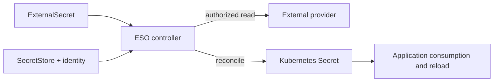
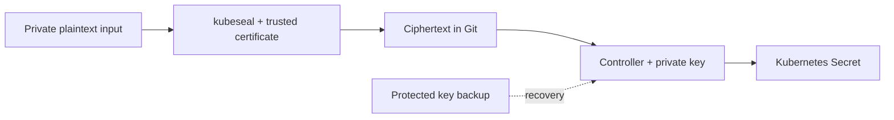

# 시크릿 관리 (Secrets Management)

> **마지막 업데이트**: 2026년 9월 13일

네이티브 Secret, ESO, AWS 저장소, Sealed Secrets, Vault, SOPS의 책임과 실제 연결 조건을 구분합니다. [전체 예제 파일](https://github.com/Atom-oh/kubernetes-docs/tree/main/examples/security/secrets-management)을 함께 사용합니다. 클러스터·AWS 설치나 실제 자격 증명 교체는 실행하지 않았습니다.

## 목차

- [Kubernetes 네이티브 Secrets](#kubernetes-네이티브-secrets)
- [암호화·갱신·감사 범위](#암호화·갱신·감사-범위)
- [External Secrets Operator (ESO)](#external-secrets-operator-eso)
- [PushSecret (역방향 동기화)](#pushsecret-역방향-동기화)
- [AWS Secrets Manager 통합](#aws-secrets-manager-통합)
- [AWS Systems Manager Parameter Store 통합](#aws-systems-manager-parameter-store-통합)
- [Sealed Secrets](#sealed-secrets)
- [HashiCorp Vault 통합](#hashicorp-vault-통합)
- [Vault CSI Driver와 Argo CD Vault Plugin](#vault-csi-driver와-argo-cd-vault-plugin)
- [SOPS (Secrets OPerationS)](#sops-secrets-operations)
- [EKS Pod Identity와 IRSA](#eks-pod-identity와-irsa)
- [도구 비교](#도구-비교)
- [모범 사례](#모범-사례)
- [요약](#요약)
- [참고 자료](#참고-자료)

## Kubernetes 네이티브 Secrets

### Secret 개요

Secret은 접근 제어·저장·소비 방식이 있는 API 오브젝트입니다. JSON/YAML의
`data` 표현은 Base64를 사용하지만 인코딩은 암호화가 아닙니다. `stringData`는
평문 입력을 받아 `data`로 병합하며 보안성이 더 높은 방식이 아닙니다.
server-side apply와도 잘 맞지 않습니다. 실제 자격 증명을 추적되는 매니페스트,
셸 기록, 로그에 쓰지 않습니다.

### Secret 유형

| Type | 용도 |
|---|---|
| `Opaque` | 애플리케이션이 정의한 값 |
| `kubernetes.io/service-account-token` | 명시적으로 만드는 기존 장기 토큰. TokenRequest/projected 단기 토큰 우선 검토 |
| `kubernetes.io/dockerconfigjson` | 레지스트리 자격 증명 |
| `kubernetes.io/basic-auth` / `kubernetes.io/ssh-auth` | 기본 인증 또는 SSH 인증 정보 |
| `kubernetes.io/tls` | 인증서와 개인키 |

### Secret 생성 방법

보호된 파일과 명시적 네임스페이스를 사용합니다. 경로는 승인된 자격 증명
관리 절차로 제공한 파일로 바꿉니다. 다음 명령은 생성한 Secret 값을 출력하지
않지만 실행자는 적절한 Kubernetes 권한이 필요합니다.

```bash
kubectl -n production create secret generic db-credentials   --from-file=username=/secure/input/username   --from-file=password=/secure/input/password   --from-file=host=/secure/input/host
kubectl -n production create secret generic ssh-key   --type=kubernetes.io/ssh-auth   --from-file=ssh-privatekey=/secure/input/id_rsa
kubectl -n production create secret tls app-tls   --cert=/secure/input/tls.crt --key=/secure/input/tls.key
kubectl -n production create secret generic regcred   --type=kubernetes.io/dockerconfigjson   --from-file=.dockerconfigjson=/secure/input/docker-config.json
```

리터럴 플래그는 **민감하지 않은 테스트 값**에는 편리하지만 실제 비밀번호를
명령 인자로 전달하면 셸 기록·프로세스 조회에 노출될 수 있습니다.

### Secret 사용 방법

`secretKeyRef`는 개별 키를, `envFrom.secretRef`는 전체 키를 가져옵니다.
실행 중인 컨테이너의 환경 변수는 자동 갱신되지 않습니다. Secret 볼륨은
일반적으로 지연 후 갱신되지만 `subPath` 마운트는 갱신을 받지 않습니다.
애플리케이션은 필요에 따라 파일을 다시 열고 설정을 로드해야 합니다.

다음 매니페스트는 비루트 애플리케이션에 그룹 읽기 권한으로 파일을 제공합니다.
이미지는 교체가 필요한 명시적 예시이며 실행하지 않았습니다. kubelet이
마운트하므로 파일 소비만을 위해 앱 ServiceAccount에 Secret `get` 권한을
줄 필요는 없습니다. 다만 Pod 생성 권한은 해당 네임스페이스 Secret에
간접적으로 접근하는 경로가 될 수 있습니다.

```yaml
# Replace the image with a reviewed application that reads /etc/app-secrets.
# This Pod is a manifest example; it was not started.
apiVersion: v1
kind: Pod
metadata:
  name: secret-file-consumer
  namespace: production
spec:
  automountServiceAccountToken: false
  securityContext:
    runAsNonRoot: true
    runAsUser: 10001
    runAsGroup: 10001
    fsGroup: 10001
    seccompProfile:
      type: RuntimeDefault
  containers:
    - name: app
      image: registry.example.com/team/app:replace-with-reviewed-tag
      securityContext:
        allowPrivilegeEscalation: false
        readOnlyRootFilesystem: true
        capabilities:
          drop: [ALL]
      volumeMounts:
        - name: secrets
          mountPath: /etc/app-secrets
          readOnly: true
  volumes:
    - name: secrets
      secret:
        secretName: db-credentials
        defaultMode: 0440
        items:
          - key: username
            path: username
          - key: password
            path: password
          - key: host
            path: host
```

## 암호화·갱신·감사 범위

### Secret의 한계

- 자체 관리 Kubernetes는 적절한 저장 암호화 구성이 필요합니다.
  **EKS 1.28 이상은 AWS 소유 KMS 키로 모든 Kubernetes API 데이터의
  envelope encryption을 기본 제공**하며 고객 관리 키도 선택할 수 있습니다.
- 저장 암호화는 권한 있는 API 조회자, 침해된 앱, Secret을 소비하는 Pod를
  만들 수 있는 주체의 접근까지 차단하지 않습니다.
- `immutable: true`는 모든 메타데이터가 아니라 **Secret 데이터**를 고정하며
  다시 mutable로 되돌릴 수 없습니다. 사용 중인 Secret을 삭제하기보다 새
  이름의 Secret과 통제된 워크로드 롤아웃을 검토합니다.
- 제공자 자격 증명 교체, Secret 갱신, 파일 전파, 앱 재로딩은 별도 단계입니다.
- API 감사 이벤트로 Secret 접근을 기록할 수 있습니다. 감사 저장소를 보호하고
  Secret 요청·응답 본문을 기록하지 않도록 합니다. 앱의 마운트 파일 읽기마다
  개별 Kubernetes API 감사 이벤트가 생기는 것은 아닙니다.

### etcd 암호화 구성

`EncryptionConfiguration`은 **자체 관리 API 서버**용입니다. EKS 관리형
컨트롤 플레인에 이 파일을 설치할 수 있다는 뜻이 아닙니다. 여러 provider 중
첫 번째가 새 쓰기를 암호화하고 뒤의 provider는 기존 데이터 복호화에 쓰입니다.
`identity`는 평문 읽기를 허용하며 이를 첫 번째로 두어 새 데이터를 평문으로
쓰지 않도록 주의해야 합니다.

자체 관리 KMS v2는 실제 플러그인 소켓·가용성·키 수명주기를 Kubernetes 문서에
따라 구성합니다. 기존 예제의 AES-CBC·KMS v1 방식 캐시·EKS 표기를 섞은 구성은
EKS 설치 절차가 아니었습니다. 암호화를 켠다고 기존 저장 오브젝트가 모두 다시
쓰이지는 않으므로 백업·이전·검증 절차를 따릅니다.


## External Secrets Operator (ESO)

### ESO 개요

ESO는 외부 값을 Kubernetes Secret으로 조정합니다. Store 리소스는 제공자
접근 설정이고 실제 API 호출은 컨트롤러가 수행합니다. SecretStore 자체가
별도로 실행되는 프록시는 아닙니다.



### ESO 설치

고정 검토 기준은 chart/application **2.10.0**입니다. Helm의 Kubernetes 버전
제약은 모든 EKS·애드온 조합의 호환성 시험 결과가 아닙니다.

```bash
helm repo add external-secrets https://charts.external-secrets.io
helm repo update external-secrets
helm upgrade --install external-secrets external-secrets/external-secrets   --version 2.10.0 --namespace external-secrets --create-namespace   --values eso-values.yaml
```

제공한 values는 PushSecret 조정을 기본 비활성화합니다. 차트 RBAC는 컨트롤러의
관리 권한이며 네임스페이스 범위 Store만 만든다고 클러스터 전체 컨트롤러가
테넌트 격리 경계가 되는 것은 아닙니다.

### SecretStore 구성

다음 전체 리소스 예시는 IRSA를 사용합니다. IAM 역할과 신뢰 정책을 먼저
구성해야 합니다. 참조하는 ServiceAccount는 SecretStore와 동일한
**production** 네임스페이스에 있습니다. ClusterSecretStore라면
`serviceAccountRef`에 네임스페이스를 명시하고 공유 Store를 사용할 수 있는
네임스페이스도 제한합니다.

### ExternalSecret 정의

현재 SecretStore/ExternalSecret 예시는 `external-secrets.io/v1`을 사용합니다.
기본 refreshPolicy인 `Periodic`의 양수 `refreshInterval`은 조정 주기이며,
제공자 오류·재시도가 있으므로 전달 완료 시한은 아닙니다. `OnChange`와
`CreatedOnce`는 다른 조건으로 갱신됩니다. `creationPolicy: Owner`는
Kubernetes 소유 관계에 영향을 줍니다. `deletionPolicy: Retain`은 제공자
삭제 처리 정책이며 ExternalSecret 삭제 등 모든 삭제를 방지하지 않습니다.

키를 명시적으로 고르면 불필요한 노출을 줄일 수 있습니다. 의도한 경우
`dataFrom.extract`로 전체 속성을 가져올 수 있습니다. 구조화된 템플릿 값은
이스케이프해야 합니다. 비밀번호를 PostgreSQL URL에 그대로 삽입하면 URL
문법이 깨질 수 있으므로 개별 필드와 앱의 연결 문자열 생성기를 우선 검토합니다.

```yaml
apiVersion: v1
kind: Namespace
metadata:
  name: production
---
apiVersion: v1
kind: ServiceAccount
metadata:
  name: external-secrets-reader
  namespace: production
  annotations:
    eks.amazonaws.com/role-arn: arn:aws:iam::123456789012:role/production-secret-reader
---
apiVersion: external-secrets.io/v1
kind: SecretStore
metadata:
  name: aws-secretsmanager
  namespace: production
spec:
  provider:
    aws:
      service: SecretsManager
      region: ap-northeast-2
      auth:
        jwt:
          serviceAccountRef:
            name: external-secrets-reader
---
apiVersion: external-secrets.io/v1
kind: ExternalSecret
metadata:
  name: database-credentials
  namespace: production
spec:
  refreshPolicy: Periodic
  refreshInterval: 1h
  secretStoreRef:
    name: aws-secretsmanager
    kind: SecretStore
  target:
    name: db-credentials
    creationPolicy: Owner
    deletionPolicy: Retain
  data:
    - secretKey: username
      remoteRef:
        key: production/database
        property: username
    - secretKey: password
      remoteRef:
        key: production/database
        property: password
    - secretKey: host
      remoteRef:
        key: production/database
        property: host
```

## PushSecret (역방향 동기화)

PushSecret은 별도의 역방향 쓰기 기능이며 위 읽기 전용 예제에 포함되지 않습니다.
**2.10.0**의 API도 `external-secrets.io/v1alpha1`이므로 모든 ESO 리소스의
버전을 일괄 v1으로 바꾸지 말고 설치한 CRD를 확인합니다.

활성화 전 별도 writer identity, 허용 원격 키, `updatePolicy`,
`deletionPolicy`를 정합니다. 그렇지 않으면 Kubernetes의 로컬 쓰기가 다른
시스템의 자격 증명을 덮어쓸 수 있습니다. 같은 키의 pull/push 순환을 피하고
Store 읽기 권한과 제공자 쓰기 권한을 구분합니다.


## AWS Secrets Manager 통합

### IRSA 설정

`irsa-trust.json`은 정확한 클러스터 OIDC issuer, `aud`,
`system:serviceaccount:production:external-secrets-reader` subject에
신뢰를 한정합니다. 예시 계정·OIDC ID를 바꾸고 IAM OIDC provider를 준비합니다.

`aws-reader-policy.json`은 Secrets Manager 시크릿 하나와 SSM 파라미터
하나를 읽습니다. 여섯 `?`는 서비스가 생성하는 ARN 접미부이며 가능하면
실제 ARN을 사용합니다. `ListSecrets`, 광범위한 탐색, 자격 증명 쓰기,
로테이션 권한은 제공하지 않습니다. 고객 관리 KMS 키는 적절히 제한한
decrypt 권한과 호환되는 키 정책이 모두 필요합니다.

### AWS Secrets Manager에 시크릿 생성

자격 증명 페이로드는 보호된 파일에 둡니다. 다음은 운영자용 예시이며
실제 AWS 계정에서 실행하지 않았습니다.

```bash
aws secretsmanager create-secret --region ap-northeast-2   --name production/database --secret-string file:///secure/input/database.json
aws secretsmanager put-secret-value --region ap-northeast-2   --secret-id production/database --secret-string file:///secure/input/database-next.json
```

저장된 비밀번호만 변경해도 데이터베이스 비밀번호가 바뀌지는 않습니다.
Secrets Manager는 관리형 로테이션 통합과 Lambda 기반 로테이션을 제공합니다.
Lambda 방식에는 지원 함수·권한·네트워크·대상 자격 증명 변경 로직이 필요하며,
ARN과 30일 주기를 명령에 적는 것만으로 준비가 끝나지 않습니다.

### 완전한 AWS ESO 예시

앞의 리소스 세트와 일치하는 신뢰·읽기 정책을 사용합니다. 결과 값을
출력하지 않고 SecretStore와 ExternalSecret 준비 상태를 기다릴 수 있습니다.

```bash
kubectl -n production wait secretstore/aws-secretsmanager   --for=condition=Ready --timeout=120s
kubectl -n production wait externalsecret/database-credentials   --for=condition=Ready --timeout=120s
```

첫 동기화 성공은 이후 로테이션·재로딩 성공을 입증하지 않습니다. 승인된
시험으로 제공자 버전·조정 상태·앱 인증을 확인합니다. 네이티브 Secret을
소비하는 앱이 ESO의 역할까지 상속할 필요는 없습니다.

```json
{
  "Version": "2012-10-17",
  "Statement": [
    {
      "Sid": "ReadOneSecret",
      "Effect": "Allow",
      "Action": ["secretsmanager:GetSecretValue", "secretsmanager:DescribeSecret"],
      "Resource": "arn:aws:secretsmanager:ap-northeast-2:123456789012:secret:production/database-??????",
      "Condition": {"StringEquals": {"aws:RequestedRegion": "ap-northeast-2"}}
    },
    {
      "Sid": "ReadOneParameter",
      "Effect": "Allow",
      "Action": ["ssm:GetParameter", "ssm:GetParameters"],
      "Resource": "arn:aws:ssm:ap-northeast-2:123456789012:parameter/production/api/key",
      "Condition": {"StringEquals": {"aws:RequestedRegion": "ap-northeast-2"}}
    }
  ]
}
```

## AWS Systems Manager Parameter Store 통합

### Parameter Store 설정

`SecureString`과 선택한 KMS 키를 사용합니다. CLI는 보호된
`--cli-input-json file:///secure/input/parameter.json` 입력으로 값을
명령 인자에서 제외할 수 있습니다. 파일에는 실제 `Name`, `Value`, `Type`,
의도한 overwrite·키 설정이 있어야 합니다.
`get-parameter --with-decryption`은 평문을 반환하므로 일반 상태 확인용으로
사용하지 않습니다.

AWS 관리형 `aws/ssm` 키와 고객 관리 키의 KMS 권한은 다릅니다. Parameter Store
권한·KMS 권한·경로 계층을 함께 확인해야 하며 넓은 재귀 경로 읽기는 하위
파라미터를 노출할 수 있습니다.

### ESO Parameter Store 구성

명시적으로 만든 production ServiceAccount를 재사용합니다. 읽기 정책에는
지정한 파라미터가 포함됩니다. Secrets Manager 권한만으로 SSM을 읽을 수는
없습니다.

```yaml
apiVersion: external-secrets.io/v1
kind: SecretStore
metadata:
  name: aws-parameter-store
  namespace: production
spec:
  provider:
    aws:
      service: ParameterStore
      region: ap-northeast-2
      auth:
        jwt:
          serviceAccountRef:
            name: external-secrets-reader
---
apiVersion: external-secrets.io/v1
kind: ExternalSecret
metadata:
  name: ssm-parameters
  namespace: production
spec:
  refreshPolicy: Periodic
  refreshInterval: 1h
  secretStoreRef:
    name: aws-parameter-store
    kind: SecretStore
  target:
    name: app-config
    creationPolicy: Owner
    deletionPolicy: Retain
  data:
    - secretKey: api-key
      remoteRef:
        key: /production/api/key
```

## Sealed Secrets

### Sealed Secrets 개요

공개 인증서로 암호화하고 적절한 개인키를 가진 주체는 복호화할 수 있습니다.
승인된 백업·복구 담당자도 복호화할 수 있으므로 컨트롤러만 수학적으로 가능한
유일한 복호화 주체는 아닙니다. 이름 등 메타데이터는 보이며 과거 키가 유출되면
Git 이력에 남은 암호문도 노출될 수 있습니다.



### Sealed Secrets 설치

chart **2.20.0**, controller/CLI **0.40.0**을 사용합니다. 기존
`bitnami-labs.github.io/sealed-secrets` 인덱스는 검토 시 404를 반환했습니다.

```bash
helm repo add sealed-secrets https://bitnami.github.io/sealed-secrets
helm repo update sealed-secrets
helm upgrade --install sealed-secrets sealed-secrets/sealed-secrets   --version 2.20.0 --namespace kube-system   --set-string fullnameOverride=sealed-secrets-controller
```

OS·아키텍처에 맞는 CLI 릴리스를 선택하고 공개된 체크섬을 확인한 뒤 설치합니다.
Linux arm64 CLI와 암호화 동작을 로컬에서 검증했습니다.

### SealedSecret 생성

의도한 클러스터의 인증된 컨텍스트에서 인증서를 가져오고 출처를 확인합니다.
공격자가 바꾼 인증서로 암호화하면 안전하지 않습니다.

```bash
kubeseal --fetch-cert --controller-name=sealed-secrets-controller   --controller-namespace=kube-system > sealed-secrets-pub.pem
kubectl -n production create secret generic app-sealed   --from-file=password=/secure/input/password --dry-run=client -o json   | kubeseal --cert sealed-secrets-pub.pem --scope strict --format yaml   > sealed-secret.yaml
```

파이프라인은 `set -o pipefail`로 실행하고 보호된 임시 파일을 거쳐 검증한
산출물을 교체합니다. 성공 여부를 확인한 뒤 커밋합니다.

### SealedSecret YAML

실제로 생성한 `bitnami.com/v1alpha1` SealedSecret을 사용합니다. `...`로 끝나는
문자열은 설명용이며 복호화 가능한 암호문이 아닙니다. metadata와 template의
이름·네임스페이스도 일치시킵니다.

### 스코프 설정

`strict`는 네임스페이스와 이름, `namespace-wide`는 네임스페이스에 바인딩하며
`cluster-wide`는 다른 네임스페이스 사용도 허용합니다. 그 접근이 의도된
경우에만 범위를 넓힙니다. 각 암호화 명령에 인증서·입력·출력을 함께 지정해야
하며 `kubeseal --scope`만으로 완전한 절차가 되지는 않습니다.

### 키 로테이션

sealing key는 컨트롤러의 설정 주기(기본 30일)로 갱신되고 과거 키는 복호화를
위해 유지됩니다. 이는 앱 비밀번호 교체가 아닙니다. **복구에 필요한 과거
sealing key 전체**를 파일 권한과 Git 외부 저장소로 보호합니다.
`kubeseal --re-encrypt`는 컨트롤러와 현재 키를 이용하지만 과거 Git 암호문을
지우거나 유출된 자격 증명을 폐기하지 않습니다. 백업에 의존하기 전에 복구를
시험합니다.


## HashiCorp Vault 통합

### Vault 아키텍처

Vault의 secrets engine·인증·감사 장치는 별도 기능입니다. Agent Injector,
Vault CSI provider, Argo CD Vault Plugin은 서로 다른 identity와 전달 경로로
Vault를 사용합니다. AVP는 Argo CD repo-server에서 매니페스트를 생성하며
실행 중인 Pod에 시크릿 파일을 마운트하는 방식이 아닙니다.

### Vault 설치 (Helm)

chart **0.34.1**의 기본 Vault는 2.0.4입니다. 예제는 서버와 주입되는 Agent
이미지를 **2.1.0**으로 명시적으로 바꾸고 TLS 비활성 기본값을 상속하지
않도록 TLS를 활성화합니다.

```bash
helm repo add hashicorp https://helm.releases.hashicorp.com
helm repo update hashicorp
helm upgrade --install vault hashicorp/vault --version 0.34.1   --namespace vault --create-namespace --values vault-values.yaml
```

values는 **렌더링 검증 기준**이며 프로덕션 설치 완료 구성이 아닙니다.
사용 전 서비스·Pod 엔드포인트에 맞는 SAN의 인증서·키·CA를
`vault-server-tls`로 제공하고 gp3 StorageClass, 배치·리소스, 네트워크,
초기화·unseal, Raft join, 백업·복구를 준비해야 합니다. Pod 세 개만으로
정상적인 3멤버 quorum을 입증하지 못합니다. `auditStorage`는 저장소만
마운트하므로 Vault audit device를 별도로 활성화합니다.

개발 모드의 자동 초기화·unseal 동작은 격리된 로컬 시험에 한정합니다.
이번 검토의 loopback dev-TLS는 JSON 템플릿 시험용이며 HA나 Kubernetes
인증을 검증한 것이 아닙니다.

### Kubernetes 인증 설정

Kubernetes 안에서 실행하는 지원 버전의 Vault는 로컬 projected reviewer
token을 다시 읽을 수 있습니다. 짧은 토큰을 `token_reviewer_jwt`에 복사한
뒤 영구적으로 갱신될 것으로 가정하지 않습니다. Vault ServiceAccount에
검토한 `system:auth-delegator` 바인딩 등 의도한 TokenReview 권한이 필요합니다.

정확한 경로의 정책을 만들고 `production/app-sa`와 예제 projected token의
`audience=vault`를 바인딩합니다. 실제 API 서버와 신뢰할 CA를 구성해야 합니다.
KV v2 mount 활성화·대상 경로 생성·운영자 인증은 사전 조건이며 샘플이
자동으로 준비하지 않습니다.

```hcl
path "secret/data/production/config" {
  capabilities = ["read"]
}
```

### Vault Agent Injector

셸 `export` 문장 대신 구조화된 JSON을 씁니다. 따옴표·줄바꿈·`$()`가 포함된
비밀번호도 데이터로 유지해야 합니다. `/bin/sh`가 항상 `source` 명령을
지원하지도 않습니다. 예제는 Agent 전용 audience 토큰을 사용하며 앱의
기본 API 토큰은 자동 마운트하지 않습니다.

앱은 `/vault/secrets/config.json`을 파싱하고 필요 시 다시 로드해야 합니다.
정적 KV 값을 새로 렌더링해도 앱 재로딩이 자동으로 일어나지 않으며
동적 lease에는 별도 갱신·만료 동작이 있습니다.

```yaml
# Requires a configured Vault Kubernetes auth role, KV v2 path and trusted CA.
# The application must parse JSON and reopen the file on refresh.
apiVersion: v1
kind: ServiceAccount
metadata:
  name: app-sa
  namespace: production
---
apiVersion: apps/v1
kind: Deployment
metadata:
  name: secret-json-consumer
  namespace: production
spec:
  replicas: 1
  selector:
    matchLabels:
      app: secret-json-consumer
  template:
    metadata:
      labels:
        app: secret-json-consumer
      annotations:
        vault.hashicorp.com/agent-inject: "true"
        vault.hashicorp.com/role: app-role
        vault.hashicorp.com/agent-service-account-token-volume-name: vault-token
        vault.hashicorp.com/tls-secret: vault-client-ca
        vault.hashicorp.com/ca-cert: /vault/tls/ca.crt
        vault.hashicorp.com/agent-inject-secret-config.json: secret/data/production/config
        vault.hashicorp.com/agent-inject-template-config.json: |
          {{- with secret "secret/data/production/config" -}}
          {{ .Data.data | toJSON }}
          {{- end }}
    spec:
      serviceAccountName: app-sa
      automountServiceAccountToken: false
      volumes:
        - name: vault-token
          projected:
            sources:
              - serviceAccountToken:
                  path: token
                  audience: vault
                  expirationSeconds: 3600
      containers:
        - name: app
          image: registry.example.com/team/app:replace-with-reviewed-tag
```

## Vault CSI Driver와 Argo CD Vault Plugin

### Vault CSI Driver

Secrets Store CSI Driver와 Vault provider를 모두 설치합니다. Vault 차트의
`csi` 플래그만 켜도 모든 의존성이 설치되는 것은 아닙니다. provider는
SecretProviderClass와 볼륨을 사용하는 Pod의 identity를 이용합니다.

신뢰하는 CA로 HTTPS를 검증합니다. `vaultCACertPath`는 **provider Pod 내부**
파일 경로이므로 그곳에 CA를 마운트해야 합니다. 앱 Pod 안에만 있는 파일은
충분하지 않습니다. audience·인증 mount·role을 일치시키고 예제를 동작시키기
위해 TLS 검증을 끄지 않습니다.

선택적인 `secretObjects` 동기화는 드라이버의 sync 기능과 실제 볼륨 마운트
Pod가 필요합니다. 회전 기능과 앱 재로딩 전략도 별도입니다. 동기화한
Secret에서 가져온 환경 변수 역시 실행 중인 컨테이너에서 갱신되지 않습니다.
AWS ASCP/CSI도 선택지이며 플랫폼·identity 지원을 별도로 확인합니다.

### ArgoCD Vault Plugin (AVP)

현재 Argo CD에서는 기존 `argocd-cm.configManagementPlugins` 방식 대신
repo-server **CMP sidecar**를 구성합니다. sidecar 내부
`/home/argocd/cmp-server/config/plugin.yaml`에 `argocd-plugin.yaml`을 둡니다.
이 ConfigManagementPlugin 형식 문서는 **Kubernetes CRD가 아닙니다**.

이미지에 AVP **1.18.1**과 의존성이 있어야 합니다. 버전이 있는 플러그인은
Application source에서 `argocd-vault-plugin-v1.18.1`로 선택합니다.
sidecar의 Vault 인증·CA·탐색 또는 명시적 선택·공유 소켓·격리된 임시 경로를
Argo CD 가이드에 따라 구성합니다.

`<password>` 같은 AVP 플레이스홀더는 매니페스트 생성 때 해석됩니다.
복호화 값이 Argo CD 렌더링·캐시·API 경로를 통과하므로 저장소·애플리케이션
접근을 제한하고 디버그 출력에 매니페스트가 노출되지 않게 합니다.


## SOPS (Secrets OPerationS)

### SOPS 개요

SOPS는 설정한 age/PGP/KMS identity로 보호하는 데이터 키를 이용해 파일 값을
암호화합니다. Git 접근 권한과 복호화 권한은 별도입니다. 검증 기준은
**SOPS 3.13.3 / age 1.3.2**입니다.

### SOPS 설치 및 설정

OS·아키텍처에 맞는 바이너리와 체크섬을 확인합니다. age identity는 저장소
밖에서 제한된 파일 권한으로 만들고 공개 recipient만 `.sops.yaml`에 넣습니다.
`AGE-SECRET-KEY-...`를 Git에 넣지 않습니다.

```bash
umask 077
age-keygen -o /secure/keys/docs-age.key
age-keygen -y /secure/keys/docs-age.key
```

Kubernetes YAML은 `encrypted_regex: '^(data|stringData)$'`로 메타데이터를
유지할 수 있습니다. creation rule은 **처음 일치한 경로 규칙**을 사용하며
설정 키는 `aws_kms`가 아니라 `kms`입니다. 중복되지 않는 패턴을 정하고
출력 리다이렉션 이름만이 아니라 SOPS에 실제 전달한 파일 경로를 시험합니다.

`sops-config.example.yaml`을 `.sops.yaml`로 복사하고 공개 recipient를 바꿉니다. 다른 디렉터리에서 실행하면 이 설정 파일을 명시적으로 지정합니다.

```yaml
# Copy to .sops.yaml and replace the public age recipient before encryption.
# The private age identity stays outside the repository.
creation_rules:
  - path_regex: '(^|/)app-secret(\.enc)?\.yaml$'
    encrypted_regex: '^(data|stringData)$'
    age: REPLACE_WITH_YOUR_PUBLIC_AGE_RECIPIENT
```

### SOPS로 Secret 암호화

recipient 구성 후 보호된 입력 파일을 암호화하고 값을 출력하지 않는 로컬
왕복 시험을 수행합니다.

```bash
sops encrypt /secure/input/app-secret.yaml > app-secret.enc.yaml
SOPS_AGE_KEY_FILE=/secure/keys/docs-age.key   sops decrypt app-secret.enc.yaml > /secure/output/app-secret.yaml
SOPS_AGE_KEY_FILE=/secure/keys/docs-age.key sops edit app-secret.enc.yaml
```

`SOPS_AGE_KEY_FILE`의 값은 개인키가 아니라 경로입니다. 파일 권한과 원자적인
출력 처리가 필요하며 명령 실패로 목적 파일이 잘릴 수 있습니다. 편집기 임시
파일과 백업도 보호해야 합니다.

### 암호화된 파일 형식

생성된 `sops` 메타데이터와 MAC을 유지합니다. `ENC[...data:...]`처럼 줄인 값은
유효한 배포 파일이 아닙니다. 값이 암호화되고 의도한 메타데이터가 남는지
검증합니다. 손상된 파일을 읽기 위해 MAC 확인을 비활성화하지 않습니다.

### FluxCD SOPS 통합

개인 identity 파일로 `flux-system/sops-age` Secret을 별도 생성하고 키 이름은
`.agekey`로 끝나게 합니다. 다음 Kustomization은 기존 Secret과 구성된
GitRepository를 참조합니다. Kubernetes/RBAC와 Flux 복호화 권한도 보안
경계입니다.

### AWS KMS with SOPS

유효한 KMS 키 ARN과 제한된 identity·키 정책을 사용합니다. 여러 recipient는
보통 대체 복호화 경로를 제공하며 모든 키 승인을 요구하지 않습니다.
threshold key group은 별도 기능입니다. `sops updatekeys`는 recipient,
`sops rotate`는 파일 데이터 키를 바꾸며 파일 안의 앱·DB 자격 증명을
교체하지는 않습니다.

```yaml
# Create flux-system/sops-age from a private age.agekey file separately.
# Never put an actual AGE-SECRET-KEY value in a tracked manifest.
apiVersion: kustomize.toolkit.fluxcd.io/v1
kind: Kustomization
metadata:
  name: app
  namespace: flux-system
spec:
  interval: 10m
  path: ./k8s
  prune: true
  sourceRef:
    kind: GitRepository
    name: my-repo
  decryption:
    provider: sops
    secretRef:
      name: sops-age
```

## EKS Pod Identity와 IRSA

### IRSA (IAM Roles for Service Accounts)

IRSA는 클러스터 OIDC provider와 역할 신뢰 정책을 사용합니다. SDK가 projected
token을 **임시 AWS 자격 증명**으로 교환하므로 자격 증명 없이 AWS를 호출하는
것이 아닙니다. 지원 SDK·기본 credential chain과 정확한 namespace/
ServiceAccount 바인딩을 확인합니다. 정적·환경 변수 자격 증명이 우선할 수도
있습니다.

### EKS Pod Identity (신규)

Pod Identity에는 `pods.eks.amazonaws.com` 서비스 주체,
`sts:AssumeRole`/`sts:TagSession`, 지원 SDK·플랫폼, association이 필요합니다.
IAM 역할 관리는 여전히 운영자의 책임입니다. EKS Auto Mode에는 agent가
내장되므로 무조건 중복 설치하지 않습니다. Fargate·Windows·하이브리드 등
실제 플랫폼의 현재 지원 여부를 확인합니다.

ESO에서는 **컨트롤러의** ServiceAccount와 역할을 연결합니다.
`SecretStore.auth.jwt.serviceAccountRef`로 다른 Pod Identity 연결
ServiceAccount를 가장할 수는 없습니다. 따라서 다음 대안 Store는 `auth`를
생략합니다. IRSA 예제와 섞고 동일한 Store별 identity 경계를 기대하지 않습니다.

### IRSA vs Pod Identity 비교

| 항목 | IRSA | EKS Pod Identity |
|---|---|---|
| 신뢰 | 클러스터 OIDC issuer·audience·subject | EKS 서비스 주체와 조건·세션 태그 |
| 바인딩 | ServiceAccount 어노테이션 | 정확한 cluster/namespace/ServiceAccount의 EKS association |
| 자격 증명 | 임시 STS 자격 증명 | 지원 agent/SDK 경로로 전달되는 임시 자격 증명 |
| 선택 | 플랫폼 지원과 기존 신뢰·운영 방식 | 플랫폼 지원과 association·운영 방식 |

클러스터가 새것인지 오래된 것인지만으로 선택하지 않습니다.

```yaml
# Alternative to IRSA. Associate the actual ESO controller ServiceAccount
# external-secrets/external-secrets-controller with a constrained Pod Identity role.
# This store intentionally has no auth.jwt.serviceAccountRef.
apiVersion: external-secrets.io/v1
kind: SecretStore
metadata:
  name: aws-controller-identity
  namespace: production
spec:
  provider:
    aws:
      service: SecretsManager
      region: ap-northeast-2
```

## 도구 비교

### 시크릿 관리 도구 비교표

| 도구 | 담당 기능 | 주요 한계 |
|---|---|---|
| Native Secret | Kubernetes 전달 오브젝트 | API/RBAC/저장소·앱 소비 경로 보호 필요 |
| ESO | 외부 값을 Secret으로 동기화 | 제공자 자격 증명 교체·앱 재로딩과 별도 |
| Sealed Secrets | Git용 공개키 암호화 | 개인키·백업 키 보호 필요. 키 갱신은 자격 증명 교체가 아님 |
| Vault | engine·identity·lease·설정한 감사 | TLS·저장소/quorum·unseal·정책·감사 장치 운영 필요 |
| SOPS | 암호화 파일과 recipient/데이터 키 관리 | 복호화 identity·평문 처리 경로 보호 필요 |

### 사용 사례별 권장

원본 관리 위치, 교체·재로딩 요구, 플랫폼 지원, 팀 운영 역량, 재해 복구,
비용을 기준으로 선택합니다. Git에는 값 없는 ESO 참조, SealedSecret 암호문,
SOPS 암호문을 둘 수 있습니다. 어떤 도구도 단독으로 규정 준수나 전체 사용
감사를 자동 보장하지 않습니다.


## 모범 사례

### 1. 시크릿 생성 및 저장

실제 값·개인키를 Git, 명령 인자, 빌드 출력에 넣지 않습니다. 암호화 산출물도
의도치 않은 평문이나 recipient가 없는지 검토합니다.

### 2. 최소 권한 원칙

API 조회자는 지정 Secret의 `get`만 허용하는 Role을 사용할 수 있습니다.
마운트 파일 소비만 하는 앱에는 그 Role이 필요하지 않습니다. Pod 생성,
exec/debug, 컨트롤러 관리, 외부 제공자 접근도 제한해야 하며 실제 권한
경계가 네임스페이스 분리를 뒷받침해야 합니다.

### 3. 시크릿 로테이션

대상 자격 증명 변경 → 제공자 버전 게시 → 조정 → 파일 갱신/필요한 재시작 →
앱 재로딩 → 인증 확인 → 과거 자격 증명 폐기까지 전체 경로를 시험합니다.
타이머만으로 이 과정의 성공을 입증할 수 없습니다.

### 4. 감사 및 모니터링

Falco syscall 이벤트에 Kubernetes API 감사 필드가 자동으로 들어오지
않습니다. Kubernetes 감사 규칙에는 적절한 source/plugin과 전달 경로가
필요하며 기존 `kevt`·와일드카드 목록 예시는 이를 구성하지 않았습니다.
명시적인 허용 identity, 거부/성공 접근 의미, 보호된 출력이 있는 검증한
감사 파이프라인을 사용합니다. `in` 목록에서 `*`로 끝나는 문자열이 자동
접두사 매칭을 뜻하지 않으며 kube-system ServiceAccount 전체를 허용된
시크릿 조회자로 취급하지 않습니다.

### 5. 개발 환경 분리

개발·운영의 제공자 경로, 제한된 역할, namespace store, 운영 소유자를
분리합니다. 리소스 이름만 다르게 정하는 것으로 격리되지 않습니다.

## 요약

네이티브 Secret은 접근·저장·소비·수명주기를 통제하면 프로덕션의 유효한
전달 오브젝트입니다. 외부 저장소·암호화 도구는 추가 문제를 해결하지만
Kubernetes와 앱의 보안 요구를 없애지는 않습니다.

### 핵심 권장사항

정의한 원본 관리 위치, 최소 권한, 보호된 키, 검증한 복구, 관측 가능한
교체·재로딩 절차를 사용합니다. 로컬 검증 근거는 프로덕션 배포 검증과
구분합니다.


## 참고 자료

- [Kubernetes Secrets](https://kubernetes.io/docs/concepts/configuration/secret/)
- [EKS default envelope encryption](https://docs.aws.amazon.com/eks/latest/userguide/envelope-encryption.html)
- [ESO AWS authentication](https://external-secrets.io/latest/provider/aws-access/)
- [ESO ExternalSecret refresh policies](https://external-secrets.io/latest/api/externalsecret/)
- [Sealed Secrets 0.40.0](https://github.com/bitnami/sealed-secrets/tree/v0.40.0)
- [Vault Kubernetes authentication](https://developer.hashicorp.com/vault/docs/auth/kubernetes)
- [Vault injector annotations](https://developer.hashicorp.com/vault/docs/deploy/kubernetes/injector/annotations)
- [Vault CSI configuration](https://developer.hashicorp.com/vault/docs/deploy/kubernetes/csi/configurations)
- [Argo CD CMP sidecars](https://argo-cd.readthedocs.io/en/stable/operator-manual/config-management-plugins/)
- [SOPS configuration](https://getsops.io/docs/usage/identities/config-file/)
- [Flux SOPS decryption](https://fluxcd.io/flux/components/kustomize/kustomizations/#decryption)
- [EKS Pod Identity](https://docs.aws.amazon.com/eks/latest/userguide/pod-identities.html)
