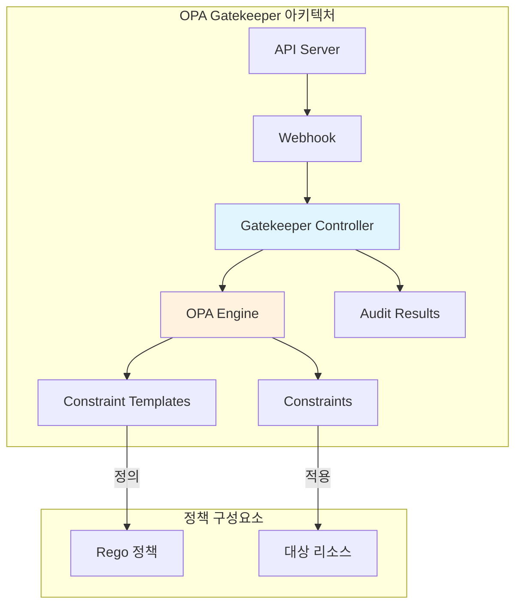

# OPA Gatekeeper

> **지원 버전**: Gatekeeper v3.14+, Kubernetes 1.25+
> **마지막 업데이트**: 2026년 2월 21일

## 개요

OPA(Open Policy Agent) Gatekeeper는 Kubernetes를 위한 정책 관리 도구로, Rego 언어를 사용하여 선언적 정책을 작성하고 Admission Controller를 통해 클러스터 정책을 강제합니다.



## Gatekeeper vs Kyverno 비교

| 특성 | Gatekeeper | Kyverno |
|------|------------|---------|
| **정책 언어** | Rego (선언적) | YAML (네이티브 K8s) |
| **학습 곡선** | 높음 (새로운 언어) | 낮음 (K8s 친화적) |
| **유연성** | 매우 높음 | 높음 |
| **외부 데이터** | OPA 번들, 외부 소스 | ConfigMap, API Call |
| **Mutation** | v3.10+ 지원 | 네이티브 지원 |
| **생성(Generate)** | 미지원 | 네이티브 지원 |
| **감사(Audit)** | 내장 | 내장 |
| **리소스 사용량** | 중간 | 낮음 |
| **커뮤니티** | CNCF Graduated | CNCF Incubating |

## Gatekeeper 설치

### Helm을 이용한 설치

```bash
# Gatekeeper Helm 저장소 추가
helm repo add gatekeeper https://open-policy-agent.github.io/gatekeeper/charts
helm repo update

# Gatekeeper 설치
helm install gatekeeper gatekeeper/gatekeeper \
  --namespace gatekeeper-system \
  --create-namespace \
  --set replicas=3 \
  --set audit.replicas=1 \
  --set audit.logLevel=INFO \
  --set controllerManager.logLevel=INFO
```

### 매니페스트를 이용한 설치

```bash
kubectl apply -f https://raw.githubusercontent.com/open-policy-agent/gatekeeper/v3.14.0/deploy/gatekeeper.yaml
```

### 설치 확인

```bash
# Pod 상태 확인
kubectl get pods -n gatekeeper-system

# CRD 확인
kubectl get crd | grep gatekeeper

# 출력 예시:
# configs.config.gatekeeper.sh
# constrainttemplates.templates.gatekeeper.sh
# constraintpodstatuses.status.gatekeeper.sh
# mutatorpodstatuses.status.gatekeeper.sh
# assignmetadata.mutations.gatekeeper.sh
# assign.mutations.gatekeeper.sh
# modifyset.mutations.gatekeeper.sh
```

## Rego 언어 기초

### Rego 문법 개요

```rego
# 패키지 선언
package kubernetes.admission

# import 문
import data.kubernetes.namespaces
import future.keywords.in
import future.keywords.contains
import future.keywords.if

# 기본 규칙 정의
deny[msg] {
    input.request.kind.kind == "Pod"
    container := input.request.object.spec.containers[_]
    not container.resources.limits.memory
    msg := sprintf("Container %v has no memory limit", [container.name])
}

# 헬퍼 함수
is_privileged(container) {
    container.securityContext.privileged == true
}

# 복합 조건
violation[{"msg": msg}] {
    container := input.request.object.spec.containers[_]
    is_privileged(container)
    msg := sprintf("Privileged container not allowed: %v", [container.name])
}
```

### Rego 데이터 타입

```rego
package examples

# 스칼라 값
string_val := "hello"
number_val := 42
boolean_val := true
null_val := null

# 복합 타입
array_val := ["a", "b", "c"]
object_val := {"key": "value", "nested": {"inner": 1}}
set_val := {"unique", "values", "only"}

# 컴프리헨션
filtered := [x | x := input.items[_]; x > 10]
mapped := {k: v | some k; v := input.data[k]; v != null}
```

### Rego 연산자와 내장 함수

```rego
package operators

# 비교 연산자
equal := 1 == 1
not_equal := 1 != 2
less_than := 1 < 2
greater_than := 2 > 1

# 문자열 함수
contains_check := contains("hello world", "world")
starts_check := startswith("kubernetes", "kube")
ends_check := endswith("pod.yaml", ".yaml")
lower_case := lower("HELLO")
upper_case := upper("hello")
split_result := split("a,b,c", ",")
sprintf_result := sprintf("pod-%s", ["name"])

# 정규식
regex_match := regex.match("^pod-.*", "pod-123")

# 배열/집합 함수
count_items := count([1, 2, 3])
sum_items := sum([1, 2, 3])
max_item := max([1, 2, 3])
min_item := min([1, 2, 3])
sort_items := sort([3, 1, 2])
array_concat := array.concat([1, 2], [3, 4])

# 객체 함수
object_get := object.get({"a": 1}, "a", 0)
object_keys := object.keys({"a": 1, "b": 2})
json_marshal := json.marshal({"key": "value"})
json_unmarshal := json.unmarshal("{\"key\":\"value\"}")
```

## Constraint Template 작성

### 기본 구조

```yaml
apiVersion: templates.gatekeeper.sh/v1
kind: ConstraintTemplate
metadata:
  name: k8srequiredlabels
  annotations:
    metadata.gatekeeper.sh/title: "Required Labels"
    metadata.gatekeeper.sh/version: 1.0.0
    description: "Requires resources to have specified labels"
spec:
  crd:
    spec:
      names:
        kind: K8sRequiredLabels
      validation:
        openAPIV3Schema:
          type: object
          properties:
            labels:
              type: array
              items:
                type: string
              description: "A list of required labels"
            message:
              type: string
              description: "Custom error message"
  targets:
    - target: admission.k8s.gatekeeper.sh
      rego: |
        package k8srequiredlabels

        import future.keywords.in

        violation[{"msg": msg, "details": {"missing_labels": missing}}] {
            provided := {label | input.review.object.metadata.labels[label]}
            required := {label | label := input.parameters.labels[_]}
            missing := required - provided
            count(missing) > 0
            msg := sprintf("Resource missing required labels: %v", [missing])
        }
```

### Privileged Container 방지

```yaml
apiVersion: templates.gatekeeper.sh/v1
kind: ConstraintTemplate
metadata:
  name: k8spsprivilegedcontainer
  annotations:
    metadata.gatekeeper.sh/title: "Privileged Container"
    description: "Prevents containers from running in privileged mode"
spec:
  crd:
    spec:
      names:
        kind: K8sPSPPrivilegedContainer
      validation:
        openAPIV3Schema:
          type: object
          properties:
            exemptImages:
              type: array
              items:
                type: string
              description: "Images exempt from this policy"
  targets:
    - target: admission.k8s.gatekeeper.sh
      rego: |
        package k8spsprivilegedcontainer

        import future.keywords.in

        violation[{"msg": msg, "details": {"container": container.name}}] {
            container := input_containers[_]
            container.securityContext.privileged == true
            not is_exempt(container)
            msg := sprintf("Privileged container not allowed: %v", [container.name])
        }

        input_containers[c] {
            c := input.review.object.spec.containers[_]
        }

        input_containers[c] {
            c := input.review.object.spec.initContainers[_]
        }

        input_containers[c] {
            c := input.review.object.spec.ephemeralContainers[_]
        }

        is_exempt(container) {
            exempt_image := input.parameters.exemptImages[_]
            startswith(container.image, exempt_image)
        }
```

### 리소스 제한 강제

```yaml
apiVersion: templates.gatekeeper.sh/v1
kind: ConstraintTemplate
metadata:
  name: k8scontainerlimits
  annotations:
    metadata.gatekeeper.sh/title: "Container Limits"
    description: "Requires containers to have resource limits"
spec:
  crd:
    spec:
      names:
        kind: K8sContainerLimits
      validation:
        openAPIV3Schema:
          type: object
          properties:
            cpu:
              type: string
              description: "Maximum CPU limit"
            memory:
              type: string
              description: "Maximum memory limit"
            exemptContainers:
              type: array
              items:
                type: string
  targets:
    - target: admission.k8s.gatekeeper.sh
      rego: |
        package k8scontainerlimits

        import future.keywords.in

        violation[{"msg": msg}] {
            container := input.review.object.spec.containers[_]
            not is_exempt(container.name)
            not container.resources.limits.cpu
            msg := sprintf("Container %v has no CPU limit", [container.name])
        }

        violation[{"msg": msg}] {
            container := input.review.object.spec.containers[_]
            not is_exempt(container.name)
            not container.resources.limits.memory
            msg := sprintf("Container %v has no memory limit", [container.name])
        }

        violation[{"msg": msg}] {
            container := input.review.object.spec.containers[_]
            not is_exempt(container.name)
            cpu_limit := container.resources.limits.cpu
            max_cpu := input.parameters.cpu
            exceeds_cpu(cpu_limit, max_cpu)
            msg := sprintf("Container %v CPU limit %v exceeds maximum %v",
                          [container.name, cpu_limit, max_cpu])
        }

        violation[{"msg": msg}] {
            container := input.review.object.spec.containers[_]
            not is_exempt(container.name)
            memory_limit := container.resources.limits.memory
            max_memory := input.parameters.memory
            exceeds_memory(memory_limit, max_memory)
            msg := sprintf("Container %v memory limit %v exceeds maximum %v",
                          [container.name, memory_limit, max_memory])
        }

        is_exempt(name) {
            exempt := input.parameters.exemptContainers[_]
            name == exempt
        }

        # CPU 비교 함수 (밀리코어 단위로 변환)
        exceeds_cpu(limit, max) {
            limit_milli := parse_cpu(limit)
            max_milli := parse_cpu(max)
            limit_milli > max_milli
        }

        parse_cpu(cpu) = milli {
            endswith(cpu, "m")
            milli := to_number(trim_suffix(cpu, "m"))
        }

        parse_cpu(cpu) = milli {
            not endswith(cpu, "m")
            milli := to_number(cpu) * 1000
        }

        # 메모리 비교 함수 (바이트 단위로 변환)
        exceeds_memory(limit, max) {
            limit_bytes := parse_memory(limit)
            max_bytes := parse_memory(max)
            limit_bytes > max_bytes
        }

        parse_memory(mem) = bytes {
            endswith(mem, "Gi")
            bytes := to_number(trim_suffix(mem, "Gi")) * 1073741824
        }

        parse_memory(mem) = bytes {
            endswith(mem, "Mi")
            bytes := to_number(trim_suffix(mem, "Mi")) * 1048576
        }

        parse_memory(mem) = bytes {
            endswith(mem, "Ki")
            bytes := to_number(trim_suffix(mem, "Ki")) * 1024
        }
```

### 이미지 레지스트리 제한

```yaml
apiVersion: templates.gatekeeper.sh/v1
kind: ConstraintTemplate
metadata:
  name: k8sallowedrepos
  annotations:
    metadata.gatekeeper.sh/title: "Allowed Repositories"
    description: "Requires container images from allowed repositories"
spec:
  crd:
    spec:
      names:
        kind: K8sAllowedRepos
      validation:
        openAPIV3Schema:
          type: object
          properties:
            repos:
              type: array
              items:
                type: string
              description: "List of allowed image repositories"
  targets:
    - target: admission.k8s.gatekeeper.sh
      rego: |
        package k8sallowedrepos

        import future.keywords.in

        violation[{"msg": msg}] {
            container := input.review.object.spec.containers[_]
            not image_allowed(container.image)
            msg := sprintf("Container %v uses image %v from disallowed repository",
                          [container.name, container.image])
        }

        violation[{"msg": msg}] {
            container := input.review.object.spec.initContainers[_]
            not image_allowed(container.image)
            msg := sprintf("InitContainer %v uses image %v from disallowed repository",
                          [container.name, container.image])
        }

        image_allowed(image) {
            repo := input.parameters.repos[_]
            startswith(image, repo)
        }
```

## Constraint 정의

### 기본 Constraint 작성

```yaml
apiVersion: constraints.gatekeeper.sh/v1beta1
kind: K8sRequiredLabels
metadata:
  name: require-app-labels
spec:
  enforcementAction: deny
  match:
    kinds:
      - apiGroups: [""]
        kinds: ["Pod"]
      - apiGroups: ["apps"]
        kinds: ["Deployment", "StatefulSet", "DaemonSet"]
    namespaces:
      - production
      - staging
    excludedNamespaces:
      - kube-system
      - gatekeeper-system
  parameters:
    labels:
      - "app.kubernetes.io/name"
      - "app.kubernetes.io/version"
      - "app.kubernetes.io/component"
    message: "All resources must have standard Kubernetes labels"
```

### Namespace 선택자 사용

```yaml
apiVersion: constraints.gatekeeper.sh/v1beta1
kind: K8sPSPPrivilegedContainer
metadata:
  name: deny-privileged-containers
spec:
  enforcementAction: deny
  match:
    kinds:
      - apiGroups: [""]
        kinds: ["Pod"]
    namespaceSelector:
      matchExpressions:
        - key: environment
          operator: In
          values: ["production", "staging"]
        - key: privileged-allowed
          operator: NotIn
          values: ["true"]
    labelSelector:
      matchExpressions:
        - key: skip-privileged-check
          operator: NotIn
          values: ["true"]
  parameters:
    exemptImages:
      - "gcr.io/google-containers/"
      - "k8s.gcr.io/"
```

### 리소스 제한 Constraint

```yaml
apiVersion: constraints.gatekeeper.sh/v1beta1
kind: K8sContainerLimits
metadata:
  name: container-resource-limits
spec:
  enforcementAction: deny
  match:
    kinds:
      - apiGroups: [""]
        kinds: ["Pod"]
    excludedNamespaces:
      - kube-system
      - gatekeeper-system
      - monitoring
  parameters:
    cpu: "4"
    memory: "8Gi"
    exemptContainers:
      - istio-proxy
      - linkerd-proxy
```

### 이미지 레지스트리 Constraint

```yaml
apiVersion: constraints.gatekeeper.sh/v1beta1
kind: K8sAllowedRepos
metadata:
  name: allowed-image-repos
spec:
  enforcementAction: deny
  match:
    kinds:
      - apiGroups: [""]
        kinds: ["Pod"]
    excludedNamespaces:
      - kube-system
  parameters:
    repos:
      - "123456789012.dkr.ecr.ap-northeast-2.amazonaws.com/"
      - "gcr.io/distroless/"
      - "docker.io/library/"
```

## 고급 정책 패턴

### 외부 데이터 참조

```yaml
apiVersion: config.gatekeeper.sh/v1alpha1
kind: Config
metadata:
  name: config
  namespace: gatekeeper-system
spec:
  sync:
    syncOnly:
      - group: ""
        version: "v1"
        kind: "Namespace"
      - group: ""
        version: "v1"
        kind: "ConfigMap"
      - group: "networking.k8s.io"
        version: "v1"
        kind: "Ingress"
```

### 네임스페이스 간 정책

```yaml
apiVersion: templates.gatekeeper.sh/v1
kind: ConstraintTemplate
metadata:
  name: k8suniqueingresshost
spec:
  crd:
    spec:
      names:
        kind: K8sUniqueIngressHost
  targets:
    - target: admission.k8s.gatekeeper.sh
      rego: |
        package k8suniqueingresshost

        import future.keywords.in

        violation[{"msg": msg}] {
            input.review.kind.kind == "Ingress"
            host := input.review.object.spec.rules[_].host
            other := data.inventory.namespace[ns][otherapiversion]["Ingress"][name]
            other.metadata.namespace != input.review.object.metadata.namespace
            other.metadata.name != input.review.object.metadata.name
            other_host := other.spec.rules[_].host
            host == other_host
            msg := sprintf("Ingress host %v is already used by %v/%v",
                          [host, ns, name])
        }
```

### 복합 조건 정책

```yaml
apiVersion: templates.gatekeeper.sh/v1
kind: ConstraintTemplate
metadata:
  name: k8spodsecuritystandard
spec:
  crd:
    spec:
      names:
        kind: K8sPodSecurityStandard
      validation:
        openAPIV3Schema:
          type: object
          properties:
            level:
              type: string
              enum: ["baseline", "restricted"]
  targets:
    - target: admission.k8s.gatekeeper.sh
      rego: |
        package k8spodsecuritystandard

        import future.keywords.in

        # Baseline 레벨 위반
        violation[{"msg": msg, "details": {"level": "baseline"}}] {
            input.parameters.level == "baseline"
            container := input_containers[_]
            container.securityContext.privileged == true
            msg := sprintf("Baseline violation: privileged container %v", [container.name])
        }

        violation[{"msg": msg, "details": {"level": "baseline"}}] {
            input.parameters.level == "baseline"
            container := input_containers[_]
            has_host_namespace(input.review.object.spec)
            msg := "Baseline violation: host namespaces not allowed"
        }

        # Restricted 레벨 위반 (Baseline 포함)
        violation[{"msg": msg, "details": {"level": "restricted"}}] {
            input.parameters.level == "restricted"
            container := input_containers[_]
            container.securityContext.privileged == true
            msg := sprintf("Restricted violation: privileged container %v", [container.name])
        }

        violation[{"msg": msg, "details": {"level": "restricted"}}] {
            input.parameters.level == "restricted"
            container := input_containers[_]
            not container.securityContext.runAsNonRoot == true
            msg := sprintf("Restricted violation: container %v must run as non-root",
                          [container.name])
        }

        violation[{"msg": msg, "details": {"level": "restricted"}}] {
            input.parameters.level == "restricted"
            container := input_containers[_]
            not container.securityContext.allowPrivilegeEscalation == false
            msg := sprintf("Restricted violation: container %v allows privilege escalation",
                          [container.name])
        }

        violation[{"msg": msg, "details": {"level": "restricted"}}] {
            input.parameters.level == "restricted"
            container := input_containers[_]
            has_dangerous_capabilities(container)
            msg := sprintf("Restricted violation: container %v has dangerous capabilities",
                          [container.name])
        }

        input_containers[c] {
            c := input.review.object.spec.containers[_]
        }

        input_containers[c] {
            c := input.review.object.spec.initContainers[_]
        }

        has_host_namespace(spec) {
            spec.hostNetwork == true
        }

        has_host_namespace(spec) {
            spec.hostPID == true
        }

        has_host_namespace(spec) {
            spec.hostIPC == true
        }

        has_dangerous_capabilities(container) {
            cap := container.securityContext.capabilities.add[_]
            dangerous_caps[cap]
        }

        dangerous_caps := {"ALL", "SYS_ADMIN", "NET_ADMIN", "SYS_PTRACE"}
```

## Mutation 기능

### AssignMetadata 사용

```yaml
apiVersion: mutations.gatekeeper.sh/v1
kind: AssignMetadata
metadata:
  name: add-owner-label
spec:
  match:
    scope: Namespaced
    kinds:
      - apiGroups: [""]
        kinds: ["Pod"]
    excludedNamespaces:
      - kube-system
  location: "metadata.labels.owner"
  parameters:
    assign:
      value: "platform-team"
```

### Assign 사용

```yaml
apiVersion: mutations.gatekeeper.sh/v1
kind: Assign
metadata:
  name: set-image-pull-policy
spec:
  applyTo:
    - groups: [""]
      kinds: ["Pod"]
      versions: ["v1"]
  match:
    scope: Namespaced
    excludedNamespaces:
      - kube-system
  location: "spec.containers[name:*].imagePullPolicy"
  parameters:
    assign:
      value: "Always"
```

### 조건부 Mutation

```yaml
apiVersion: mutations.gatekeeper.sh/v1
kind: Assign
metadata:
  name: add-tolerations-for-spot
spec:
  applyTo:
    - groups: [""]
      kinds: ["Pod"]
      versions: ["v1"]
  match:
    scope: Namespaced
    labelSelector:
      matchLabels:
        allow-spot: "true"
  location: "spec.tolerations"
  parameters:
    assign:
      value:
        - key: "kubernetes.io/spot"
          operator: "Exists"
          effect: "NoSchedule"
```

### ModifySet 사용

```yaml
apiVersion: mutations.gatekeeper.sh/v1
kind: ModifySet
metadata:
  name: add-security-capability
spec:
  applyTo:
    - groups: [""]
      kinds: ["Pod"]
      versions: ["v1"]
  match:
    scope: Namespaced
  location: "spec.containers[name:*].securityContext.capabilities.drop"
  parameters:
    operation: merge
    values:
      fromList:
        - "ALL"
```

## 감사(Audit) 및 모니터링

### Audit 설정

```yaml
apiVersion: config.gatekeeper.sh/v1alpha1
kind: Config
metadata:
  name: config
  namespace: gatekeeper-system
spec:
  # Audit 간격 설정 (초)
  # audit 명령어로 확인 가능
  validation:
    traces:
      - user: "*"
        kind:
          group: ""
          version: "v1"
          kind: "Pod"
```

### Constraint 위반 확인

```bash
# 모든 Constraint의 위반 상태 확인
kubectl get constraints

# 특정 Constraint의 상세 위반 정보
kubectl describe k8srequiredlabels require-app-labels

# 출력 예시:
# Status:
#   Audit Timestamp:  2026-02-21T10:30:00Z
#   Total Violations:  5
#   Violations:
#     Enforcement Action:  deny
#     Kind:               Pod
#     Name:               nginx-without-labels
#     Namespace:          default
#     Message:            Resource missing required labels: {"app.kubernetes.io/name"}
```

### Prometheus 메트릭

```yaml
# Gatekeeper ServiceMonitor
apiVersion: monitoring.coreos.com/v1
kind: ServiceMonitor
metadata:
  name: gatekeeper-controller-manager
  namespace: gatekeeper-system
spec:
  selector:
    matchLabels:
      control-plane: controller-manager
  endpoints:
    - port: metrics
      interval: 30s
```

주요 메트릭:

| 메트릭 이름 | 설명 |
|------------|------|
| `gatekeeper_violations` | Constraint별 위반 수 |
| `gatekeeper_constraints` | 총 Constraint 수 |
| `gatekeeper_constraint_templates` | 총 ConstraintTemplate 수 |
| `gatekeeper_request_count` | Admission 요청 수 |
| `gatekeeper_request_duration_seconds` | 요청 처리 시간 |
| `gatekeeper_audit_duration_seconds` | Audit 소요 시간 |

### Grafana 대시보드

```json
{
  "panels": [
    {
      "title": "Policy Violations by Constraint",
      "targets": [
        {
          "expr": "sum by (constraint_name) (gatekeeper_violations)",
          "legendFormat": "{{constraint_name}}"
        }
      ]
    },
    {
      "title": "Admission Request Latency",
      "targets": [
        {
          "expr": "histogram_quantile(0.99, sum(rate(gatekeeper_request_duration_seconds_bucket[5m])) by (le))",
          "legendFormat": "p99"
        }
      ]
    },
    {
      "title": "Admission Requests by Status",
      "targets": [
        {
          "expr": "sum by (admission_status) (rate(gatekeeper_request_count[5m]))",
          "legendFormat": "{{admission_status}}"
        }
      ]
    }
  ]
}
```

## 테스트 및 CI/CD 통합

### Gator CLI 테스트

```bash
# Gator 설치
go install github.com/open-policy-agent/gatekeeper/cmd/gator@latest

# 정책 검증
gator verify ./policies/

# 테스트 스위트 실행
gator test ./tests/
```

### 테스트 스위트 정의

```yaml
# tests/required-labels-test.yaml
kind: Suite
apiVersion: test.gatekeeper.sh/v1alpha1
metadata:
  name: required-labels-test
tests:
  - name: "Missing required labels should fail"
    template: ../templates/k8srequiredlabels.yaml
    constraint: ../constraints/require-app-labels.yaml
    cases:
      - name: pod-without-labels
        object: fixtures/pod-without-labels.yaml
        assertions:
          - violations: yes
            message: "missing required labels"

      - name: pod-with-all-labels
        object: fixtures/pod-with-labels.yaml
        assertions:
          - violations: no
```

### 테스트 픽스처

```yaml
# fixtures/pod-without-labels.yaml
apiVersion: v1
kind: Pod
metadata:
  name: test-pod
  namespace: production
spec:
  containers:
    - name: nginx
      image: nginx:latest
---
# fixtures/pod-with-labels.yaml
apiVersion: v1
kind: Pod
metadata:
  name: test-pod
  namespace: production
  labels:
    app.kubernetes.io/name: nginx
    app.kubernetes.io/version: "1.0"
    app.kubernetes.io/component: web
spec:
  containers:
    - name: nginx
      image: nginx:latest
```

### GitHub Actions 통합

```yaml
name: Policy Validation
on:
  pull_request:
    paths:
      - 'policies/**'
      - 'constraints/**'

jobs:
  validate:
    runs-on: ubuntu-latest
    steps:
      - uses: actions/checkout@v4

      - name: Setup Gator
        run: |
          go install github.com/open-policy-agent/gatekeeper/cmd/gator@latest

      - name: Validate Constraint Templates
        run: |
          gator verify ./policies/templates/

      - name: Run Policy Tests
        run: |
          gator test ./policies/tests/

      - name: Dry-run against cluster
        if: github.event_name == 'pull_request'
        run: |
          kubectl apply --dry-run=server -f ./policies/
```

## 모범 사례

### 정책 구조화

```
policies/
├── templates/
│   ├── security/
│   │   ├── privileged-container.yaml
│   │   ├── host-namespaces.yaml
│   │   └── capabilities.yaml
│   ├── resources/
│   │   ├── container-limits.yaml
│   │   └── storage-class.yaml
│   └── networking/
│       ├── allowed-repos.yaml
│       └── ingress-host.yaml
├── constraints/
│   ├── production/
│   │   ├── security-constraints.yaml
│   │   └── resource-constraints.yaml
│   └── development/
│       └── basic-constraints.yaml
├── mutations/
│   ├── defaults/
│   │   └── image-pull-policy.yaml
│   └── labels/
│       └── add-owner-label.yaml
└── tests/
    ├── security/
    │   └── privileged-test.yaml
    └── resources/
        └── limits-test.yaml
```

### 점진적 정책 적용

```yaml
# 1단계: Dry Run (warn 모드)
apiVersion: constraints.gatekeeper.sh/v1beta1
kind: K8sRequiredLabels
metadata:
  name: require-labels-dryrun
spec:
  enforcementAction: dryrun  # 로깅만
  match:
    kinds:
      - apiGroups: [""]
        kinds: ["Pod"]
---
# 2단계: Warn 모드
apiVersion: constraints.gatekeeper.sh/v1beta1
kind: K8sRequiredLabels
metadata:
  name: require-labels-warn
spec:
  enforcementAction: warn  # 경고만
  match:
    kinds:
      - apiGroups: [""]
        kinds: ["Pod"]
---
# 3단계: Deny 모드 (완전 적용)
apiVersion: constraints.gatekeeper.sh/v1beta1
kind: K8sRequiredLabels
metadata:
  name: require-labels-enforce
spec:
  enforcementAction: deny  # 거부
  match:
    kinds:
      - apiGroups: [""]
        kinds: ["Pod"]
```

### 정책 예외 관리

```yaml
# 예외를 위한 네임스페이스 레이블 활용
apiVersion: v1
kind: Namespace
metadata:
  name: legacy-app
  labels:
    policy-exceptions: "privileged"
---
# Constraint에서 예외 처리
apiVersion: constraints.gatekeeper.sh/v1beta1
kind: K8sPSPPrivilegedContainer
metadata:
  name: deny-privileged
spec:
  enforcementAction: deny
  match:
    kinds:
      - apiGroups: [""]
        kinds: ["Pod"]
    namespaceSelector:
      matchExpressions:
        - key: policy-exceptions
          operator: NotIn
          values: ["privileged"]
```

## 문제 해결

### 일반적인 문제

```bash
# Webhook 문제 확인
kubectl get validatingwebhookconfigurations gatekeeper-validating-webhook-configuration -o yaml

# Gatekeeper 로그 확인
kubectl logs -n gatekeeper-system -l control-plane=controller-manager -f

# Audit 로그 확인
kubectl logs -n gatekeeper-system -l control-plane=audit-controller -f

# Constraint 동기화 상태 확인
kubectl get constrainttemplatepodstatuses -n gatekeeper-system
kubectl get constraintpodstatuses -n gatekeeper-system
```

### 디버깅 팁

```yaml
# Rego 디버깅을 위한 print 문 사용
violation[{"msg": msg}] {
    container := input.review.object.spec.containers[_]
    print("Checking container:", container.name)
    print("Image:", container.image)
    not starts_with_allowed(container.image)
    msg := sprintf("Invalid image: %v", [container.image])
}
```

## 요약

OPA Gatekeeper는 강력한 정책 엔진으로:

1. **Rego 언어**: 선언적이고 유연한 정책 작성
2. **ConstraintTemplate**: 재사용 가능한 정책 템플릿
3. **Constraint**: 정책의 구체적 적용
4. **Mutation**: 리소스 자동 수정
5. **Audit**: 기존 리소스 정책 준수 검사
6. **테스트**: Gator를 통한 정책 검증

Kyverno 대비 학습 곡선이 높지만, 복잡한 정책 로직에서 더 큰 유연성을 제공합니다.

---

## 관련 문서

- [Kyverno 정책 관리](./01-kyverno-policy-management.md)
- [Pod Security Standards](./03-pod-security-standards.md)
- [EKS 보안 모범 사례](./06-eks-security-best-practices.md)
