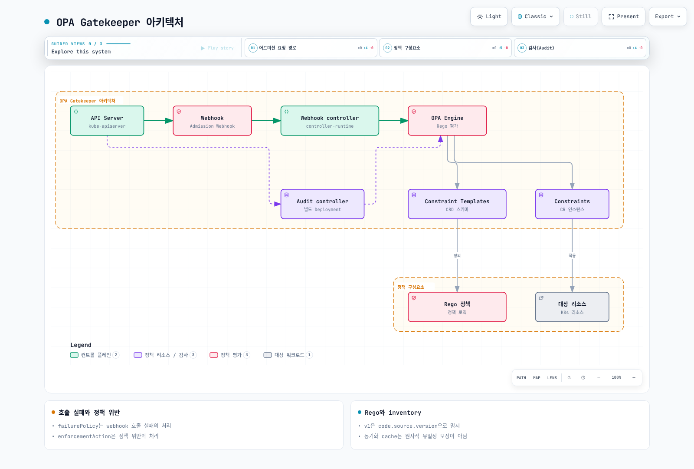

# OPA Gatekeeper

> **검증 기준**: Gatekeeper/Gator 3.23.1 · Helm chart 3.23.1

> **마지막 업데이트**: 2026년 9월 13일

## 개요

Gatekeeper는 Kubernetes admission과 주기적 audit에서 정책을 평가합니다. ConstraintTemplate은 로직·파라미터 schema를 정의하고 Constraint는 적용 범위·값·enforcementAction을 지정합니다. 이 장의 [전체 예제](https://github.com/Atom-oh/kubernetes-docs/tree/main/examples/security/gatekeeper)는 전용 `policy-lab` namespace와 로컬 테스트를 사용합니다. 운영 클러스터에 모든 test fixture를 적용하는 예제가 아닙니다.



[🔍 인터랙티브 다이어그램 보기](https://www.atomai.click/kubernetes-docs/archmaps/ko-security-09-opa-gatekeeper-0.html)

<span id="gatekeeper-vs-kyverno-비교"></span>

## Gatekeeper와 Kyverno 선택

Gatekeeper의 Rego·Constraint 모델과 Kyverno의 Kubernetes 지향 policy 모델 중 팀의 정책·테스트·운영 요구에 맞는 것을 선택합니다. Gatekeeper도 선택적으로 CEL 기반 Kubernetes native validation을 사용할 수 있으며 모든 기능이 Rego 하나에 한정되는 것은 아닙니다. 고정된 “메모리 중간/낮음” 또는 “다른 도구는 복잡한 로직을 표현할 수 없음” 비교를 근거 없이 사용하지 않습니다. OPA 프로젝트의 CNCF 졸업 상태와 Gatekeeper를 별도 졸업 프로젝트라고 부르는 것은 다릅니다.

<span id="helm을-이용한-설치"></span>

<span id="매니페스트를-이용한-설치"></span>

<span id="설치-확인"></span>

## Gatekeeper 설치

예제 디렉터리에서 고정된 chart와 지원되는 values를 사용합니다. `auditInterval`과 `logLevel`은 최상위 chart 필드이며 `audit.replicas`·`audit.logLevel` 같은 임의 값이 적용된다고 가정하지 않습니다. 예제는 webhook replica 3개와 audit Deployment 1개를 렌더링했습니다. EKS control plane에서 webhook Pod/Service로 연결되는 네트워크 경로, 인증서, 노드 배치와 가용 자원을 확인합니다.

```bash
helm repo add gatekeeper https://open-policy-agent.github.io/gatekeeper/charts
helm repo update gatekeeper
helm upgrade --install gatekeeper gatekeeper/gatekeeper --version 3.23.1 \
  --namespace gatekeeper-system --create-namespace --values values.yaml --wait
kubectl -n gatekeeper-system rollout status deployment/gatekeeper-controller-manager
kubectl -n gatekeeper-system rollout status deployment/gatekeeper-audit
```

`values.yaml`은 단계적 적용을 위해 chart의 validating/mutating webhook `failurePolicy: Ignore`를 명시적으로 유지합니다. Webhook 호출 실패 시 요청이 통과할 수 있으므로 Constraint의 `deny`와 같은 뜻이 아닙니다. `Fail`을 선택하려면 장애 시 API 가용성과 복구·제외 namespace를 함께 설계하고 검증합니다. Webhook의 범위는 개별 Constraint 범위보다 넓을 수 있습니다.

### 템플릿과 Constraint 적용 순서

Template을 생성하면 대응 Constraint CRD가 만들어집니다. CRD가 Established 상태이고 Template Pod status에 오류가 없는지 확인한 뒤 Constraint를 적용합니다. 예제 Constraint는 모두 `dryrun`이며 실제 image prefix·파라미터·namespace를 검토해야 합니다.

```bash
kubectl create namespace policy-lab --dry-run=client -o yaml | kubectl apply -f -
kubectl apply -f templates/
kubectl wait --for=condition=Established --timeout=90s \
  crd/docsrequiredlabels.constraints.gatekeeper.sh \
  crd/docsnoprivileged.constraints.gatekeeper.sh \
  crd/docsapprovedimages.constraints.gatekeeper.sh \
  crd/k8scontainerlimits.constraints.gatekeeper.sh \
  crd/docsuniqueingress.constraints.gatekeeper.sh
kubectl apply -f constraints/
```

<span id="rego-언어-기초"></span>

<span id="rego-문법-개요"></span>

<span id="rego-데이터-타입"></span>

<span id="rego-연산자와-내장-함수"></span>

## Rego 언어와 입력 계약

Gatekeeper 정책의 입력은 `input.review`이며 일반 OPA AdmissionReview 예제의 `input.request`와 혼동하지 않습니다. `input.parameters`는 Constraint 값, `data.inventory`는 동기화된 Kubernetes 객체입니다. 기존 `targets[].rego`는 기본적으로 지원되는 Rego v0입니다. Rego v1을 사용하려면 아래처럼 `code[].source.version: v1`을 명시합니다. 오래된 문법이라는 이유만으로 모든 v0 Template이 무효인 것은 아닙니다.

```yaml
apiVersion: templates.gatekeeper.sh/v1
kind: ConstraintTemplate
metadata:
  name: docsrequiredlabels
spec:
  crd:
    spec:
      names:
        kind: DocsRequiredLabels
      validation:
        openAPIV3Schema:
          type: object
          properties:
            labels:
              type: array
              minItems: 1
              items:
                type: string
                minLength: 1
          required:
          - labels
  targets:
  - target: admission.k8s.gatekeeper.sh
    code:
    - engine: Rego
      source:
        version: v1
        rego: "package docsrequiredlabels\nvalid_label(key) if {\n  value := input.review.object.metadata.labels[key]\n\
          \  is_string(value)\n  value != \"\"\n}\nviolation contains {\"msg\": sprintf(\"\
          required nonempty label: %v\", [key])} if {\n  some key in input.parameters.labels\n\
          \  not valid_label(key)\n}\n"
```

`violation contains ... if`는 v1 partial-set rule입니다. 같은 partial-set rule의 여러 정의는 결과를 합칩니다. 모든 동일 이름 rule이 충돌 없이 OR가 된다는 뜻은 아니며 complete document rule은 충돌할 수 있습니다. Rule 본문의 조건은 함께 충족되어야 합니다. Rego의 사용자 정의 재귀 rule과 `walk` 같은 JSON 순회 built-in을 혼동하지 않습니다.

```rego
package examples
items := [x | some x in input.items; x > 10]
keys := object.keys(object.get(input, "labels", {}))
missing := {"app", "team"} - keys
```

객체의 `obj[_]`는 값들을 선택합니다. 레이블 키가 필요하면 `object.keys` 또는 key를 명시적으로 바인딩합니다. 집합 차집합 `-`, 교집합 `&`, 합집합 `|`를 활용할 수 있습니다.

<span id="constraint-template-작성"></span>

<span id="기본-구조"></span>

<span id="privileged-container-방지"></span>

<span id="리소스-제한-강제"></span>

<span id="이미지-레지스트리-제한"></span>

<span id="constraint-정의"></span>

<span id="기본-constraint-작성"></span>

<span id="namespace-선택자-사용"></span>

<span id="리소스-제한-constraint"></span>

<span id="이미지-레지스트리-constraint"></span>

## 검증하는 정책과 범위

| Template | 검증하는 내용 | 범위·한계 |
|---|---|---|
| DocsRequiredLabels | 지정한 nonempty label | Pod metadata만 검사; Deployment metadata와 Pod template label은 다름 |
| DocsNoPrivileged | privileged=true 거부 | 일반·init·ephemeral 컨테이너; 전체 PSS 구현은 아님 |
| DocsApprovedImages | 승인 registry/path prefix | 세 container 종류 모두 검사; prefix는 `/` 경계로 끝나도록 schema 제한 |
| K8sContainerLimits | CPU·메모리 제한 존재/최대값 | 고정한 upstream policy; 일반·init 검사, ephemeral resource field는 K8s에서 설정 불가 |
| DocsUniqueIngress | 동기화 inventory의 exact host 충돌 | 같은 객체 update 제외; wildcard/동시 생성의 원자적 유일성은 보장하지 않음 |

### 이미지 경계와 정책 예외

`registry.example.com/team/`은 `registry.example.com/team-evil/` 또는 `registry.example.com.evil/`과 다릅니다. 단순 문자열 prefix라도 separator와 정규화된 full image name 계약이 있어야 합니다. 예제는 `skip-privileged-check=true`처럼 workload 작성자가 바꿀 수 있는 우회 라벨을 제공하지 않습니다. Namespace 예외가 필요하면 해당 라벨을 수정할 수 있는 RBAC·승인 주체·만료·감사 기록까지 통제합니다.

### 리소스 단위 처리

직접 만든 Gi/Mi/Ki 전용 parser는 `9G`, plain bytes 등에서 비교 결과가 undefined가 되어 위반을 놓칠 수 있습니다. 예제는 commit이 고정된 upstream `K8sContainerLimits`를 사용하고 인식하지 못하는 문자열 표현은 위반으로 처리합니다. Kubernetes가 허용하는 모든 quantity 표현을 허용하는 것은 아니므로 정책의 형식 제한을 문서화합니다. Native test에서 millicore, decimal/binary memory, plain bytes, 숫자 입력, 명시적으로 따옴표를 붙인 지수 문자열을 구분했습니다. YAML parser가 `8e9`를 숫자로 바꾸지 않도록 문자열 테스트에는 따옴표가 필요합니다.

### PSS와 controller 리소스

privileged·runAsNonRoot 몇 항목만 검사하는 Rego를 전체 Baseline/Restricted라고 부르지 않습니다. Host namespace, seccomp, capabilities, OS별 규칙, pod-level 상속, ephemeral container 등의 조건을 포함한 버전별 PSS에는 [Pod Security Standards](./03-pod-security-standards.md)를 사용합니다. 현재 예제는 Pod admission을 검사합니다. Deployment 생성 단계에서 Pod 정책을 미리 확인하려면 Pod template 또는 Gatekeeper ExpansionTemplate 기반 테스트를 별도로 구성합니다.

<span id="고급-정책-패턴"></span>

<span id="외부-데이터-참조"></span>

<span id="네임스페이스-간-정책"></span>

<span id="복합-조건-정책"></span>

## 동기화 데이터와 고급 정책

`sync.yaml`은 `networking.k8s.io/v1` Ingress를 inventory에 동기화합니다. 이는 외부 HTTP provider나 임의 OPA bundle을 자동 연결하는 기능과 다릅니다. 필요한 객체만 동기화하고 RBAC·메모리·민감 정보를 검토합니다.

```yaml
apiVersion: config.gatekeeper.sh/v1alpha1
kind: Config
metadata:
  name: config
  namespace: gatekeeper-system
spec:
  sync:
    syncOnly:
    - group: networking.k8s.io
      version: v1
      kind: Ingress
```

같은 namespace의 다른 이름, 다른 namespace의 같은 이름도 host 충돌일 수 있습니다. “namespace와 name이 모두 다름”이라는 AND 조건으로 제외하면 충돌을 놓칩니다. 예제는 namespace/name이 둘 다 같은 객체만 update로 제외합니다. Cache는 eventual consistency이므로 동시에 생성되는 두 객체의 전역 유일성을 원자적으로 보장하지 않습니다.

<span id="mutation-기능"></span>

<span id="assignmetadata-사용"></span>

<span id="assign-사용"></span>

<span id="조건부-mutation"></span>

<span id="modifyset-사용"></span>

## Mutation

AssignMetadata는 제한된 metadata label/annotation 추가용이며 기존 값을 강제로 덮어쓰는 일반 도구가 아닙니다. Assign은 지정한 필드를 설정합니다. Toleration 배열 전체를 Assign하면 기존 항목을 잃을 수 있으므로 예제는 ModifySet merge를 사용합니다. 이 toleration은 전용 lab taint를 허용할 뿐 Spot node를 선택하지 않습니다.

```yaml
apiVersion: mutations.gatekeeper.sh/v1
kind: ModifySet
metadata:
  name: docs-dedicated-toleration
spec:
  applyTo:
  - groups:
    - ''
    versions:
    - v1
    kinds:
    - Pod
  match:
    scope: Namespaced
    namespaces:
    - policy-lab
  location: spec.tolerations
  parameters:
    operation: merge
    values:
      fromList:
      - key: dedicated
        operator: Equal
        value: policy-lab
        effect: NoSchedule
```

Mutation은 defaulting 편의 기능과 검증의 역할을 구분합니다. CREATE/UPDATE 범위, 반복 적용, 다른 mutator와의 수렴, 기존 객체 영향을 검토합니다. Mutator를 만들었다고 기존 객체가 모두 자동 재작성되는 것은 아닙니다.

<span id="감사-audit-및-모니터링"></span>

<span id="audit-설정"></span>

<span id="constraint-위반-확인"></span>

<span id="prometheus-메트릭"></span>

<span id="grafana-대시보드"></span>

## Audit와 모니터링

Audit 주기는 chart의 `auditInterval`로 설정합니다. Config의 `validation.traces`는 특정 admission 평가를 디버깅하는 기능으로 audit 주기 설정이 아닙니다. Admission input과 Rego print에는 민감한 객체 내용이 포함될 수 있으므로 필요한 범위에서만 사용합니다. `constraintViolationsLimit`은 status에 저장할 상세 목록을 제한하며 `totalViolations` 전체 수와 같지 않을 수 있습니다.

```bash
kubectl get constraints
kubectl describe docsrequiredlabels required-labels
kubectl get constrainttemplatepodstatuses -n gatekeeper-system
kubectl get constraintpodstatuses -n gatekeeper-system
```

Chart의 webhook Service에는 HTTPS webhook port만 있고 metrics port는 없습니다. 예제 `podmonitor.yaml`은 실제 audit/webhook Deployment 양쪽의 `metrics:8888` container port를 선택합니다. Prometheus Operator CRD와 PodMonitor label/namespace selector를 먼저 맞춥니다.

| 지표 | 해석 |
|---|---|
| gatekeeper_validation_request_count | validation 요청; admission_status 등 실제 라벨 사용 |
| gatekeeper_validation_request_duration_seconds | validation latency histogram |
| gatekeeper_violations | audit 위반 수; enforcement_action 라벨, constraint_name이 기본으로 있다고 가정하지 않음 |
| gatekeeper_audit_last_run_end_time | 마지막 audit 완료 시각 |
| gatekeeper_constraint_templates | Template 상태 수 |

```promql
sum by (enforcement_action) (gatekeeper_violations)
histogram_quantile(0.99, sum by (le) (rate(gatekeeper_validation_request_duration_seconds_bucket[5m])))
```

<span id="테스트-및-ci-cd-통합"></span>

<span id="gator-cli-테스트"></span>

<span id="테스트-스위트-정의"></span>

<span id="테스트-픽스처"></span>

<span id="github-actions-통합"></span>

## Gator 테스트와 CI

공식 3.23.1 release asset과 checksum을 확인해 설치합니다. 이번 ARM64 release의 binary는 GitVersion에 `+dirty`를 표시하지만 게시된 archive checksum과 일치하는지 확인했습니다. `@latest` 또는 버전이 다른 CLI로 성공했다고 현재 정책의 검증 근거를 바꾸지 않습니다.

```bash
gator version
gator verify tests/suite.yaml --verbose
gator test -f templates/docsnoprivileged.yaml \
  -f constraints/no-privileged.yaml \
  -f tests/fixtures/tenant-skip-label-no-bypass.yaml --output=json
```

`verify`는 Suite의 예상 위반을 검사하고, `test -f`는 manifest들을 Template/Constraint에 평가합니다. Suite가 없는 디렉터리는 `verify`에서 무시될 수 있으므로 성공 exit뿐 아니라 5개 test·33개 case가 실행됐는지 확인합니다. 예제 registry image는 정책 test 입력이며 실제 pull할 workload가 아닙니다. CI는 credentials 없이 이 로컬 suite를 실행합니다. Cluster dry-run이 필요하면 별도의 신뢰된 환경과 승인된 권한을 사용합니다.

<span id="모범-사례"></span>

<span id="정책-구조화"></span>

<span id="점진적-정책-적용"></span>

<span id="정책-예외-관리"></span>

<span id="문제-해결"></span>

<span id="일반적인-문제"></span>

<span id="디버깅-팁"></span>

## 단계적 적용과 문제 해결

동일한 Constraint를 dryrun → warn → deny로 전환하고 각 단계의 audit·admission 결과와 예외를 검토합니다. 같은 Template의 파라미터 없는 Constraint 세 개를 생성하는 방식은 사용하지 않습니다. `dryrun`과 `warn`도 violation 데이터를 만들지만 Gator test의 exit는 0일 수 있습니다. `deny` 위반은 1입니다. Webhook availability failure와 정책 위반은 별도로 관찰합니다.

```bash
kubectl get validatingwebhookconfiguration gatekeeper-validating-webhook-configuration -o yaml
kubectl -n gatekeeper-system logs deployment/gatekeeper-controller-manager --tail=100
kubectl -n gatekeeper-system logs deployment/gatekeeper-audit --tail=100
```

정책 입력·match 범위·CRD/Template 오류·webhook 인증서·네트워크·audit 시각·inventory freshness를 순서대로 확인합니다. 오류 원인을 찾지 않고 webhook을 삭제하거나 광범위한 namespace 예외를 추가하지 않습니다.

<span id="요약"></span>

<span id="관련-문서"></span>

## 검증 범위와 관련 문서

Gator 3.23.1에서 33개 policy case와 세 enforcement mode를 실행했습니다. 고정 Helm render·8개 Gatekeeper CRD 객체·audit/webhook PodMonitor binding을 확인했습니다. Kubernetes admission, EKS networking, 실제 audit cache 동기화와 live API 장애 전환을 수행한 것은 아닙니다. Mutation의 별도 native 검증 결과는 리뷰 보고서에 기록합니다.

- [Gatekeeper 퀴즈](../quizzes/security/09-opa-gatekeeper-quiz.md)
- [Kyverno](./01-kyverno-policy-management.md)
- [Pod Security Standards](./03-pod-security-standards.md)
- [EKS 보안 모범 사례](./06-eks-security-best-practices.md)

## 참고 자료

- [Gatekeeper v3.23.1](https://github.com/open-policy-agent/gatekeeper/tree/v3.23.1)
- [ConstraintTemplate and Rego versions](https://github.com/open-policy-agent/gatekeeper/blob/v3.23.1/website/docs/constrainttemplates.md)
- [Gator](https://github.com/open-policy-agent/gatekeeper/blob/v3.23.1/website/docs/gator.md)
- [Mutation](https://github.com/open-policy-agent/gatekeeper/blob/v3.23.1/website/docs/mutation.md)
- [Audit](https://github.com/open-policy-agent/gatekeeper/blob/v3.23.1/website/docs/audit.md)
- [Metrics](https://github.com/open-policy-agent/gatekeeper/blob/v3.23.1/website/docs/metrics.md)
- [Pinned resource-limits policy](https://github.com/open-policy-agent/gatekeeper-library/blob/bd333d4704647b1000cef5a92017257ee46fe2c8/library/general/containerlimits/template.yaml)
