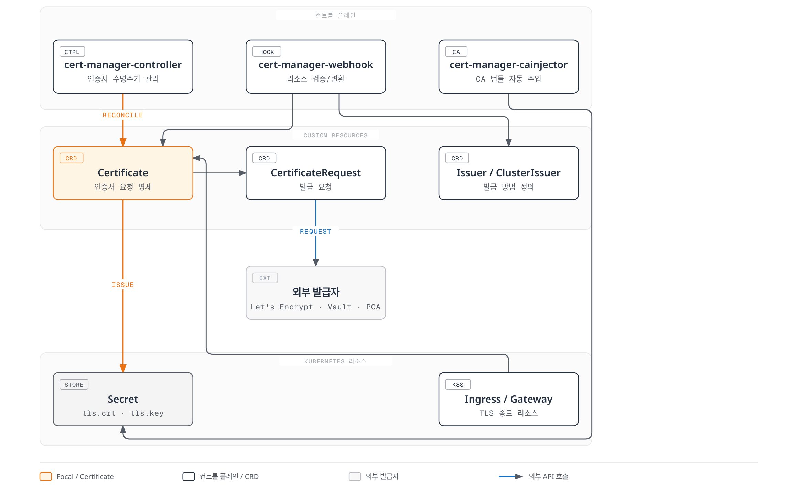
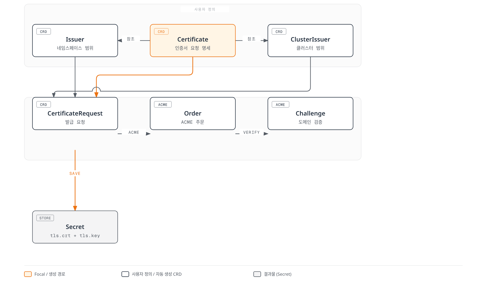
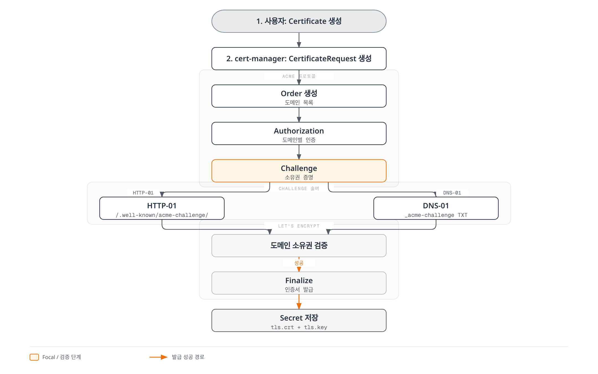
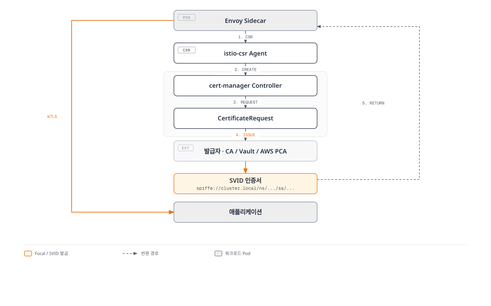

# cert-manager를 활용한 인증서 관리

> **지원 버전**: cert-manager 1.16+, Kubernetes 1.31, 1.32, 1.33
> **마지막 업데이트**: 2026년 7월 13일

cert-manager는 Kubernetes 클러스터 내에서 TLS 인증서의 발급, 갱신, 폐기를 자동화하는 CNCF Graduated 프로젝트입니다. X.509 인증서의 전체 수명주기를 Kubernetes 네이티브 방식으로 관리할 수 있습니다.

## 목차

1. [개요](#개요)
2. [아키텍처](#아키텍처)
3. [설치](#설치)
4. [핵심 개념](#핵심-개념)
5. [Issuer 유형](#issuer-유형)
6. [EKS 통합 패턴](#eks-통합-패턴)
7. [AWS 네이티브 대안: ACM + ACK](#aws-네이티브-대안-acm--ack)
8. [서비스 메시 통합](#서비스-메시-통합)
9. [trust-manager](#trust-manager)
10. [모니터링 및 트러블슈팅](#모니터링-및-트러블슈팅)
11. [모범 사례](#모범-사례)
12. [요약 및 참고 자료](#요약-및-참고-자료)

---

## 개요

### 인증서 자동화의 필요성

수동 인증서 관리의 문제점:

| 문제 | 설명 |
|------|------|
| **만료 위험** | 인증서 갱신 누락으로 인한 서비스 장애 |
| **확장성 부족** | 마이크로서비스 환경에서 수백 개 인증서 수동 관리 불가 |
| **보안 취약점** | 긴 유효기간의 인증서 사용으로 인한 보안 위험 |
| **운영 부담** | 인증서 발급/갱신/폐기에 대한 반복 작업 |
| **일관성 부재** | 팀/서비스별 상이한 인증서 관리 방식 |

### cert-manager의 주요 기능

| 기능 | 설명 |
|------|------|
| **자동 발급** | Certificate CR 생성 시 자동으로 인증서 발급 |
| **자동 갱신** | 만료 전 자동 갱신 (기본 만료 30일 전) |
| **다중 Issuer** | Let's Encrypt, Vault, AWS PCA 등 다양한 발급자 지원 |
| **Ingress 통합** | Ingress 어노테이션으로 자동 인증서 프로비저닝 |
| **Gateway API** | Gateway API의 TLS 구성 자동화 |
| **서비스 메시** | Istio, Linkerd와 통합하여 mTLS 인증서 관리 |

### CNCF Graduated 프로젝트

cert-manager는 2022년 CNCF Graduated 프로젝트로 승격되었습니다. 이는 프로젝트의 성숙도, 채택률, 거버넌스가 프로덕션 환경에서 검증되었음을 의미합니다.

---

## 아키텍처

### 구성요소



### 구성요소 상세

| 구성요소 | 역할 | 설명 |
|----------|------|------|
| **controller** | 핵심 컨트롤러 | Certificate, Issuer 리소스 감시 및 인증서 수명주기 관리 |
| **webhook** | Admission Webhook | CRD 유효성 검증, 기본값 설정, 버전 변환 |
| **cainjector** | CA 번들 주입 | ValidatingWebhookConfiguration, MutatingWebhookConfiguration에 CA 번들 자동 주입 |

---

## 설치

### Helm을 사용한 설치

```bash
# cert-manager Helm 저장소 추가
helm repo add jetstack https://charts.jetstack.io
helm repo update

# 네임스페이스 생성
kubectl create namespace cert-manager

# cert-manager 설치 (CRD 포함)
helm install cert-manager jetstack/cert-manager \
  --namespace cert-manager \
  --version v1.16.2 \
  --set crds.enabled=true \
  --set prometheus.enabled=true \
  --set webhook.timeoutSeconds=30
```

### 프로덕션 환경 권장 설정

```yaml
# cert-manager-values.yaml
replicaCount: 2

resources:
  requests:
    cpu: 50m
    memory: 64Mi
  limits:
    cpu: 200m
    memory: 256Mi

# Prometheus 메트릭 활성화
prometheus:
  enabled: true
  servicemonitor:
    enabled: true

# PodDisruptionBudget 설정
podDisruptionBudget:
  enabled: true
  minAvailable: 1

# 고가용성을 위한 Pod Anti-Affinity
affinity:
  podAntiAffinity:
    preferredDuringSchedulingIgnoredDuringExecution:
      - weight: 100
        podAffinityTerm:
          labelSelector:
            matchExpressions:
              - key: app.kubernetes.io/name
                operator: In
                values:
                  - cert-manager
          topologyKey: kubernetes.io/hostname

# Webhook 설정
webhook:
  replicaCount: 2
  timeoutSeconds: 30
  resources:
    requests:
      cpu: 25m
      memory: 32Mi

# CA Injector 설정
cainjector:
  replicaCount: 2
  resources:
    requests:
      cpu: 25m
      memory: 64Mi
```

```bash
# 프로덕션 설정으로 설치
helm install cert-manager jetstack/cert-manager \
  --namespace cert-manager \
  --version v1.16.2 \
  --set crds.enabled=true \
  -f cert-manager-values.yaml
```

### 설치 확인

```bash
# Pod 상태 확인
kubectl get pods -n cert-manager

# 예상 출력:
# NAME                                       READY   STATUS    RESTARTS   AGE
# cert-manager-5d7f97b46d-xxxxx              1/1     Running   0          2m
# cert-manager-cainjector-5c55bb7cb4-xxxxx   1/1     Running   0          2m
# cert-manager-webhook-64b6f8f5b-xxxxx       1/1     Running   0          2m

# CRD 확인
kubectl get crd | grep cert-manager

# 예상 출력:
# certificaterequests.cert-manager.io
# certificates.cert-manager.io
# challenges.acme.cert-manager.io
# clusterissuers.cert-manager.io
# issuers.cert-manager.io
# orders.acme.cert-manager.io

# API 리소스 확인
kubectl api-resources --api-group=cert-manager.io
```

---

## 핵심 개념

### 리소스 관계도



### Certificate

Certificate 리소스는 원하는 인증서의 명세를 정의합니다.

```yaml
apiVersion: cert-manager.io/v1
kind: Certificate
metadata:
  name: example-com-tls
  namespace: default
spec:
  # 발급된 인증서를 저장할 Secret 이름
  secretName: example-com-tls-secret

  # 인증서 유효기간 (기본: 2160h = 90일)
  duration: 2160h

  # 갱신 시점 (만료 전 720시간 = 30일 전에 갱신)
  renewBefore: 720h

  # 인증서 주체 정보
  subject:
    organizations:
      - My Organization

  # 인증서에 포함할 도메인
  commonName: example.com
  dnsNames:
    - example.com
    - www.example.com
    - api.example.com

  # IP 주소 (선택)
  ipAddresses:
    - 192.168.1.100

  # 개인키 설정
  privateKey:
    algorithm: RSA
    size: 2048
    encoding: PKCS1
    rotationPolicy: Always

  # 사용할 Issuer 참조
  issuerRef:
    name: letsencrypt-prod
    kind: ClusterIssuer
    group: cert-manager.io

  # 추가 사용처 (선택)
  usages:
    - server auth
    - client auth
```

### Issuer vs ClusterIssuer

| 특성 | Issuer | ClusterIssuer |
|------|--------|---------------|
| **범위** | 단일 네임스페이스 | 클러스터 전체 |
| **사용 사례** | 팀/앱별 독립적인 발급자 | 공유 발급자 (Let's Encrypt 등) |
| **Secret 위치** | 동일 네임스페이스 | cert-manager 네임스페이스 |
| **RBAC** | 네임스페이스 권한으로 제어 | 클러스터 관리자 권한 필요 |

```yaml
# Issuer (네임스페이스 범위)
apiVersion: cert-manager.io/v1
kind: Issuer
metadata:
  name: team-a-issuer
  namespace: team-a
spec:
  selfSigned: {}

---
# ClusterIssuer (클러스터 범위)
apiVersion: cert-manager.io/v1
kind: ClusterIssuer
metadata:
  name: letsencrypt-prod
spec:
  acme:
    server: https://acme-v02.api.letsencrypt.org/directory
    email: admin@example.com
    privateKeySecretRef:
      name: letsencrypt-prod-account-key
    solvers:
      - http01:
          ingress:
            class: nginx
```

### CertificateRequest

CertificateRequest는 Certificate 컨트롤러가 자동으로 생성하는 리소스입니다. 직접 생성하는 경우는 드물지만, 외부 시스템과 통합 시 유용합니다.

```yaml
apiVersion: cert-manager.io/v1
kind: CertificateRequest
metadata:
  name: example-com-tls-xxxxx
  namespace: default
spec:
  # Base64 인코딩된 CSR (Certificate Signing Request)
  request: LS0tLS1CRUdJTi...

  issuerRef:
    name: letsencrypt-prod
    kind: ClusterIssuer
    group: cert-manager.io

  duration: 2160h
  usages:
    - server auth
```

---

## Issuer 유형

### 유형별 비교

| Issuer 유형 | 사용 사례 | 장점 | 단점 |
|-------------|----------|------|------|
| **SelfSigned** | 개발/테스트, 부트스트랩 CA | 즉시 발급, 외부 의존성 없음 | 브라우저 신뢰 불가 |
| **CA** | 내부 PKI, 프라이빗 서비스 | 전체 제어 가능, 비용 없음 | CA 관리 필요 |
| **ACME** | 퍼블릭 웹사이트 | 무료, 자동화, 브라우저 신뢰 | Rate Limit, 도메인 소유 필요 |
| **AWS PCA** | 엔터프라이즈 프라이빗 PKI | AWS 통합, 규정 준수 | 비용 발생 |
| **Vault PKI** | 복잡한 PKI 요구사항 | 유연성, 감사 로그 | 운영 복잡성 |

### SelfSigned Issuer

개발/테스트 환경이나 Root CA 부트스트랩에 사용합니다.

```yaml
apiVersion: cert-manager.io/v1
kind: ClusterIssuer
metadata:
  name: selfsigned-issuer
spec:
  selfSigned: {}
```

**Root CA 부트스트랩 패턴:**

```yaml
# 1. Self-signed로 Root CA 인증서 생성
apiVersion: cert-manager.io/v1
kind: Certificate
metadata:
  name: root-ca
  namespace: cert-manager
spec:
  isCA: true
  commonName: My Root CA
  secretName: root-ca-secret
  duration: 87600h  # 10년
  renewBefore: 8760h  # 1년 전 갱신
  privateKey:
    algorithm: RSA
    size: 4096
  issuerRef:
    name: selfsigned-issuer
    kind: ClusterIssuer
    group: cert-manager.io

---
# 2. Root CA를 사용하는 CA Issuer 생성
apiVersion: cert-manager.io/v1
kind: ClusterIssuer
metadata:
  name: root-ca-issuer
spec:
  ca:
    secretName: root-ca-secret
```

### CA Issuer

기존 CA 인증서와 개인키를 사용하여 인증서를 발급합니다.

```yaml
# CA 인증서와 개인키를 Secret으로 저장
apiVersion: v1
kind: Secret
metadata:
  name: ca-key-pair
  namespace: cert-manager
type: kubernetes.io/tls
data:
  tls.crt: LS0tLS1CRUdJTi...  # Base64 인코딩된 CA 인증서
  tls.key: LS0tLS1CRUdJTi...  # Base64 인코딩된 CA 개인키

---
apiVersion: cert-manager.io/v1
kind: ClusterIssuer
metadata:
  name: internal-ca-issuer
spec:
  ca:
    secretName: ca-key-pair
```

### ACME Issuer (Let's Encrypt)

#### 인증서 발급 흐름



#### HTTP-01 솔버

HTTP-01은 웹 서버를 통해 도메인 소유권을 증명합니다.

```yaml
apiVersion: cert-manager.io/v1
kind: ClusterIssuer
metadata:
  name: letsencrypt-prod
spec:
  acme:
    # Let's Encrypt 프로덕션 서버
    server: https://acme-v02.api.letsencrypt.org/directory

    # 계정 이메일 (만료 알림 수신)
    email: admin@example.com

    # ACME 계정 키를 저장할 Secret
    privateKeySecretRef:
      name: letsencrypt-prod-account-key

    solvers:
      # HTTP-01 솔버
      - http01:
          ingress:
            # Ingress 컨트롤러 클래스
            ingressClassName: nginx

            # 또는 레거시 방식
            # class: nginx

---
# 스테이징 서버 (테스트용, Rate Limit 없음)
apiVersion: cert-manager.io/v1
kind: ClusterIssuer
metadata:
  name: letsencrypt-staging
spec:
  acme:
    server: https://acme-staging-v02.api.letsencrypt.org/directory
    email: admin@example.com
    privateKeySecretRef:
      name: letsencrypt-staging-account-key
    solvers:
      - http01:
          ingress:
            ingressClassName: nginx
```

#### DNS-01 솔버 (Route53 + IRSA)

DNS-01은 DNS TXT 레코드를 통해 도메인 소유권을 증명합니다. 와일드카드 인증서 발급에 필수입니다.

```yaml
# EKS에서 IRSA를 사용한 Route53 DNS-01 설정
apiVersion: cert-manager.io/v1
kind: ClusterIssuer
metadata:
  name: letsencrypt-dns01
spec:
  acme:
    server: https://acme-v02.api.letsencrypt.org/directory
    email: admin@example.com
    privateKeySecretRef:
      name: letsencrypt-dns01-account-key
    solvers:
      - dns01:
          route53:
            region: ap-northeast-2
            # IRSA 사용 시 accessKeyID와 secretAccessKeySecretRef 생략
            # hostedZoneID는 선택사항 (여러 호스팅 영역이 있을 때 지정)
            hostedZoneID: Z1234567890ABC
        # 특정 도메인에만 적용
        selector:
          dnsZones:
            - example.com
```

**IRSA 설정:**

```bash
# 1. IAM 정책 생성
cat > cert-manager-policy.json << 'EOF'
{
  "Version": "2012-10-17",
  "Statement": [
    {
      "Effect": "Allow",
      "Action": "route53:GetChange",
      "Resource": "arn:aws:route53:::change/*"
    },
    {
      "Effect": "Allow",
      "Action": [
        "route53:ChangeResourceRecordSets",
        "route53:ListResourceRecordSets"
      ],
      "Resource": "arn:aws:route53:::hostedzone/Z1234567890ABC"
    },
    {
      "Effect": "Allow",
      "Action": "route53:ListHostedZonesByName",
      "Resource": "*"
    }
  ]
}
EOF

aws iam create-policy \
  --policy-name CertManagerRoute53Policy \
  --policy-document file://cert-manager-policy.json

# 2. IRSA 설정 (eksctl 사용)
eksctl create iamserviceaccount \
  --cluster=my-cluster \
  --namespace=cert-manager \
  --name=cert-manager \
  --attach-policy-arn=arn:aws:iam::123456789012:policy/CertManagerRoute53Policy \
  --override-existing-serviceaccounts \
  --approve

# 3. cert-manager Helm 재설치 (ServiceAccount 사용)
helm upgrade cert-manager jetstack/cert-manager \
  --namespace cert-manager \
  --set serviceAccount.create=false \
  --set serviceAccount.name=cert-manager
```

#### 와일드카드 인증서

```yaml
apiVersion: cert-manager.io/v1
kind: Certificate
metadata:
  name: wildcard-example-com
  namespace: default
spec:
  secretName: wildcard-example-com-tls
  issuerRef:
    name: letsencrypt-dns01
    kind: ClusterIssuer
  dnsNames:
    - "example.com"
    - "*.example.com"  # 와일드카드 (DNS-01 필수)
```

### AWS Private CA Issuer

AWS Private Certificate Authority와 통합하여 프라이빗 인증서를 발급합니다.

```bash
# AWS PCA Issuer 설치
helm repo add awspca https://cert-manager.github.io/aws-privateca-issuer
helm install aws-pca-issuer awspca/aws-privateca-issuer \
  --namespace cert-manager
```

```yaml
apiVersion: awspca.cert-manager.io/v1beta1
kind: AWSPCAClusterIssuer
metadata:
  name: aws-pca-issuer
spec:
  arn: arn:aws:acm-pca:ap-northeast-2:123456789012:certificate-authority/xxxxxxxx-xxxx-xxxx-xxxx-xxxxxxxxxxxx
  region: ap-northeast-2

---
apiVersion: cert-manager.io/v1
kind: Certificate
metadata:
  name: internal-service-tls
  namespace: default
spec:
  secretName: internal-service-tls-secret
  duration: 8760h  # 1년
  renewBefore: 720h  # 30일 전 갱신
  commonName: internal-service.example.internal
  dnsNames:
    - internal-service.example.internal
  issuerRef:
    name: aws-pca-issuer
    kind: AWSPCAClusterIssuer
    group: awspca.cert-manager.io
```

### Vault PKI Issuer

HashiCorp Vault의 PKI Secrets Engine과 통합합니다.

```yaml
apiVersion: cert-manager.io/v1
kind: ClusterIssuer
metadata:
  name: vault-pki-issuer
spec:
  vault:
    # Vault 서버 주소
    server: https://vault.example.com

    # PKI 시크릿 엔진 경로
    path: pki/sign/example-role

    # CA 번들 (Vault 서버 TLS 검증용)
    caBundle: LS0tLS1CRUdJTi...

    # 인증 방식
    auth:
      # Kubernetes 인증 방식
      kubernetes:
        role: cert-manager-role
        mountPath: /v1/auth/kubernetes
        serviceAccountRef:
          name: cert-manager
```

**Vault PKI 설정:**

```bash
# Vault PKI 설정
vault secrets enable pki
vault secrets tune -max-lease-ttl=87600h pki

# Root CA 생성
vault write -field=certificate pki/root/generate/internal \
  common_name="Example Root CA" \
  ttl=87600h

# PKI 역할 생성
vault write pki/roles/example-role \
  allowed_domains="example.com" \
  allow_subdomains=true \
  max_ttl=720h

# Kubernetes 인증 설정
vault auth enable kubernetes
vault write auth/kubernetes/config \
  kubernetes_host="https://kubernetes.default.svc"

vault write auth/kubernetes/role/cert-manager-role \
  bound_service_account_names=cert-manager \
  bound_service_account_namespaces=cert-manager \
  policies=pki-policy \
  ttl=1h
```

---

## EKS 통합 패턴

### ACM vs cert-manager 비교

| 항목 | AWS ACM | cert-manager |
|------|---------|--------------|
| **비용** | 퍼블릭 인증서 무료 | 무료 (인프라 비용만) |
| **로드밸런서** | ALB, NLB 네이티브 통합 | Ingress/Gateway 통합 |
| **TLS 종단** | 로드밸런서에서 종단 | Pod에서 종단 가능 |
| **프라이빗 인증서** | ACM PCA (유료) | CA Issuer (무료) |
| **와일드카드** | 지원 | DNS-01로 지원 |
| **자동 갱신** | 자동 | 자동 |
| **Kubernetes 네이티브** | ACK 사용 시 가능 (아래 참조) | 예 |
| **멀티 클러스터** | 리전별 관리 | GitOps로 통합 관리 |
| **서비스 메시** | 별도 구성 필요 | istio-csr 통합 |

> ACM을 Kubernetes 리소스(YAML)로 직접 정의하고 발급/갱신/Secret 생성까지 자동화하려면 [AWS 네이티브 대안: ACM + ACK](#aws-네이티브-대안-acm--ack) 절을 참고하십시오.

### ALB Ingress + ACM

ACM 인증서를 ALB Ingress Controller와 함께 사용:

```yaml
apiVersion: networking.k8s.io/v1
kind: Ingress
metadata:
  name: app-ingress
  annotations:
    kubernetes.io/ingress.class: alb
    alb.ingress.kubernetes.io/scheme: internet-facing
    # ACM 인증서 ARN
    alb.ingress.kubernetes.io/certificate-arn: arn:aws:acm:ap-northeast-2:123456789012:certificate/xxxxxxxx
    alb.ingress.kubernetes.io/listen-ports: '[{"HTTPS":443}]'
    alb.ingress.kubernetes.io/ssl-redirect: '443'
spec:
  rules:
    - host: app.example.com
      http:
        paths:
          - path: /
            pathType: Prefix
            backend:
              service:
                name: app-service
                port:
                  number: 80
```

### Ingress-nginx + cert-manager

Ingress-nginx와 cert-manager를 통합하여 자동 TLS:

```yaml
apiVersion: networking.k8s.io/v1
kind: Ingress
metadata:
  name: app-ingress
  annotations:
    # cert-manager Issuer 지정
    cert-manager.io/cluster-issuer: letsencrypt-prod
spec:
  ingressClassName: nginx
  tls:
    - hosts:
        - app.example.com
      secretName: app-example-com-tls  # cert-manager가 자동 생성
  rules:
    - host: app.example.com
      http:
        paths:
          - path: /
            pathType: Prefix
            backend:
              service:
                name: app-service
                port:
                  number: 80
```

### NLB + TLS 종단

NLB에서 TLS를 종단하는 경우:

```yaml
apiVersion: v1
kind: Service
metadata:
  name: app-nlb
  annotations:
    service.beta.kubernetes.io/aws-load-balancer-type: external
    service.beta.kubernetes.io/aws-load-balancer-nlb-target-type: ip
    service.beta.kubernetes.io/aws-load-balancer-scheme: internet-facing
    # ACM 인증서 사용
    service.beta.kubernetes.io/aws-load-balancer-ssl-cert: arn:aws:acm:ap-northeast-2:123456789012:certificate/xxxxxxxx
    service.beta.kubernetes.io/aws-load-balancer-ssl-ports: "443"
spec:
  type: LoadBalancer
  ports:
    - name: https
      port: 443
      targetPort: 8080
  selector:
    app: my-app
```

### Gateway API + cert-manager

Gateway API와 cert-manager 통합:

```yaml
apiVersion: gateway.networking.k8s.io/v1
kind: Gateway
metadata:
  name: app-gateway
  annotations:
    cert-manager.io/cluster-issuer: letsencrypt-prod
spec:
  gatewayClassName: nginx
  listeners:
    - name: https
      hostname: app.example.com
      port: 443
      protocol: HTTPS
      tls:
        mode: Terminate
        certificateRefs:
          - name: app-example-com-tls  # cert-manager가 자동 생성
      allowedRoutes:
        namespaces:
          from: Same

---
apiVersion: gateway.networking.k8s.io/v1
kind: HTTPRoute
metadata:
  name: app-route
spec:
  parentRefs:
    - name: app-gateway
  hostnames:
    - app.example.com
  rules:
    - matches:
        - path:
            type: PathPrefix
            value: /
      backendRefs:
        - name: app-service
          port: 80
```

---

## AWS 네이티브 대안: ACM + ACK

### 개요

2025년 12월 15일, AWS는 [AWS Certificate Manager(ACM)와 AWS Controllers for Kubernetes(ACK)를 통합](https://aws.amazon.com/about-aws/whats-new/2025/12/acm-automated-certificate-management-kubernetes)하여 Kubernetes 환경에서 인증서 발급/갱신을 자동화하는 기능을 발표했습니다. 클러스터에 ACM용 ACK 컨트롤러를 설치하면 인증서를 Kubernetes 커스텀 리소스(YAML)로 정의할 수 있고, ACK 컨트롤러가 발급 요청 → 소유권/도메인 검증 → Kubernetes Secret 생성 및 갱신까지 전체 라이프사이클을 자동으로 처리합니다.

cert-manager가 Let's Encrypt 등 다양한 ACME 발급자를 지원하는 CNCF 오픈소스 솔루션인 반면, ACM+ACK 통합은 **AWS 네이티브 대안**입니다. 이미 IAM/ACM 생태계를 사용 중인 조직이라면 별도의 오픈소스 컨트롤러 운영 없이도 동일한 자동화를 얻을 수 있어 관리 부담을 줄일 수 있습니다.

### 2026년 7월 업데이트: ACM의 ACME 프로토콜 지원

2026년 7월, ACM이 [ACME 프로토콜을 통한 퍼블릭 인증서 발급](https://aws.amazon.com/about-aws/whats-new/2026/07/aws-certificate-manager-acme/)을 지원하기 시작했습니다. 완전 관리형 ACME 서버 엔드포인트를 프로비저닝하면 Certbot, acme.sh는 물론 Kubernetes의 cert-manager 같은 ACMEv2 호환 클라이언트로 Amazon Trust Services가 발급하는 유효기간 45일의 퍼블릭 TLS 인증서를 자동 발급/갱신할 수 있습니다. 즉, ACK 컨트롤러를 설치하지 않고도 기존 cert-manager의 ACME Issuer에서 `server`만 ACM ACME 엔드포인트로 지정해 ACM 퍼블릭 인증서를 사용할 수 있습니다.

PKI 관리자는 엔드포인트 수준에서 도메인 범위 제한, 와일드카드 사용 정책 등 중앙 거버넌스를 적용하면서 DNS 자격 증명을 배포하지 않고 애플리케이션 팀에 인증서 요청을 위임할 수 있으며, 모든 활동은 CloudTrail 로깅과 CloudWatch 지표로 감사할 수 있습니다. CA/Browser 포럼이 2029년까지 인증서 수명을 47일로 의무화함에 따라, cert-manager + ACM ACME 엔드포인트 조합은 Let's Encrypt의 AWS 네이티브 대안으로 자리잡을 수 있습니다.

### 지원 인증서 유형

| 유형 | 용도 |
|------|------|
| **ACM Exportable Public Certificates** | 퍼블릭 도메인 인증서를 Kubernetes Secret으로 내보내 Pod/Ingress에서 직접 사용 |
| **AWS Private CA** | 내부 서비스, 서비스 메시(Istio, Linkerd) mTLS 등 프라이빗 PKI가 필요한 워크로드 |

### 적용 시나리오

- 애플리케이션 Pod에서 직접 TLS 종료 (NGINX, 커스텀 애플리케이션)
- 서비스 메시(Istio, Linkerd) 워크로드 인증서
- 서드파티 Ingress Controller(NGINX Ingress, Traefik) 등 ALB/NLB 네이티브 인증서 통합을 쓰지 않는 환경
- 멀티 클러스터/하이브리드 환경에서 인증서를 일관되게 관리해야 하는 경우

### 예시: ACK를 통한 Certificate 리소스 정의

```yaml
apiVersion: acm.services.k8s.aws/v1alpha1
kind: Certificate
metadata:
  name: example-com-tls
  namespace: default
spec:
  domainName: example.com
  subjectAlternativeNames:
    - "*.example.com"
  validationMethod: DNS
  tags:
    - key: managed-by
      value: ack
```

ACK 컨트롤러가 이 리소스를 감시하여 ACM에 인증서를 요청하고, 발급이 완료되면 Kubernetes Secret을 생성/갱신합니다. 실제 필드명과 Secret 내보내기 방식은 ACM ACK 컨트롤러 버전에 따라 달라질 수 있으므로 설치 전 공식 문서를 확인하십시오.

### cert-manager와 비교

| 항목 | cert-manager | ACM + ACK |
|------|--------------|-----------|
| **발급자** | Let's Encrypt, Vault, AWS PCA 등 다양 | ACM(퍼블릭), AWS Private CA |
| **생태계** | CNCF 오픈소스, 벤더 중립 | AWS 네이티브, IAM 기반 권한 관리 |
| **설치 대상** | cert-manager 컨트롤러 | ACM용 ACK 서비스 컨트롤러 |
| **비용** | 무료 (인프라 비용만) | ACM/AWS Private CA 기존 요금 그대로, Kubernetes 연동 자체는 추가 비용 없음 |
| **적합한 조직** | 멀티 클라우드, ACME 발급자가 필요한 조직 | 이미 ACM/IAM 생태계를 사용 중인 AWS 중심 조직 |

두 방식은 상호 배타적이지 않습니다. 예를 들어 퍼블릭 도메인 인증서는 ACM+ACK로, 내부 mTLS 인증서는 cert-manager+AWS PCA Issuer로 관리하는 등 혼용도 가능합니다.

---

## 서비스 메시 통합

### Istio + istio-csr

istio-csr는 Istio의 워크로드 인증서를 cert-manager를 통해 발급합니다. 이를 통해 Istio의 mTLS를 외부 PKI와 통합할 수 있습니다.

#### istio-csr 아키텍처



#### istio-csr 설치

```bash
# istio-csr 설치
helm repo add jetstack https://charts.jetstack.io
helm repo update

helm install istio-csr jetstack/cert-manager-istio-csr \
  --namespace cert-manager \
  --set "app.tls.rootCAFile=/var/run/secrets/istio-csr/ca.pem" \
  --set "app.tls.certificateDNSNames[0]=cert-manager-istio-csr.cert-manager.svc" \
  --set "app.certmanager.issuer.name=istio-ca" \
  --set "app.certmanager.issuer.kind=ClusterIssuer" \
  --set "app.certmanager.issuer.group=cert-manager.io"
```

#### Istio CA Issuer 설정

```yaml
# Self-signed Root CA for Istio
apiVersion: cert-manager.io/v1
kind: Certificate
metadata:
  name: istio-ca
  namespace: cert-manager
spec:
  isCA: true
  commonName: istio-ca
  secretName: istio-ca-secret
  duration: 87600h  # 10년
  renewBefore: 8760h
  privateKey:
    algorithm: RSA
    size: 4096
  issuerRef:
    name: selfsigned-issuer
    kind: ClusterIssuer

---
apiVersion: cert-manager.io/v1
kind: ClusterIssuer
metadata:
  name: istio-ca
spec:
  ca:
    secretName: istio-ca-secret
```

#### Istio 설치 (istio-csr 사용)

```yaml
# istioctl install -f istio-config.yaml
apiVersion: install.istio.io/v1alpha1
kind: IstioOperator
spec:
  profile: default
  meshConfig:
    # istio-csr 사용을 위한 설정
    caCertificates:
      - pem: |
          # cert-manager CA 인증서
        certSigners:
          - clusterissuers.cert-manager.io/istio-ca
  components:
    pilot:
      k8s:
        env:
          # istiod의 자체 CA 비활성화
          - name: ENABLE_CA_SERVER
            value: "false"
  values:
    global:
      # istio-csr를 CA 서버로 사용
      caAddress: cert-manager-istio-csr.cert-manager.svc:443
```

### Linkerd + trust-manager

Linkerd는 Trust Anchor를 통해 mTLS를 구현합니다. cert-manager와 trust-manager를 사용하여 인증서를 관리할 수 있습니다.

```yaml
# Linkerd Trust Anchor CA
apiVersion: cert-manager.io/v1
kind: Certificate
metadata:
  name: linkerd-trust-anchor
  namespace: linkerd
spec:
  isCA: true
  commonName: root.linkerd.cluster.local
  secretName: linkerd-trust-anchor
  duration: 87600h
  renewBefore: 8760h
  privateKey:
    algorithm: ECDSA
    size: 256
  issuerRef:
    name: selfsigned-issuer
    kind: ClusterIssuer

---
# Linkerd Identity Issuer
apiVersion: cert-manager.io/v1
kind: Certificate
metadata:
  name: linkerd-identity-issuer
  namespace: linkerd
spec:
  isCA: true
  commonName: identity.linkerd.cluster.local
  secretName: linkerd-identity-issuer
  duration: 8760h
  renewBefore: 720h
  privateKey:
    algorithm: ECDSA
    size: 256
  issuerRef:
    name: linkerd-trust-anchor-issuer
    kind: Issuer

---
apiVersion: cert-manager.io/v1
kind: Issuer
metadata:
  name: linkerd-trust-anchor-issuer
  namespace: linkerd
spec:
  ca:
    secretName: linkerd-trust-anchor
```

---

## trust-manager

trust-manager는 cert-manager 프로젝트의 일부로, 여러 네임스페이스에 CA 번들을 배포하고 동기화합니다.

### 설치

```bash
helm install trust-manager jetstack/trust-manager \
  --namespace cert-manager \
  --wait
```

### Bundle 리소스

```yaml
apiVersion: trust.cert-manager.io/v1alpha1
kind: Bundle
metadata:
  name: public-ca-bundle
spec:
  sources:
    # cert-manager에서 발급한 CA
    - secret:
        name: "root-ca-secret"
        key: "ca.crt"

    # 기본 CA 번들
    - useDefaultCAs: true

    # ConfigMap에서 가져오기
    - configMap:
        name: "custom-ca"
        key: "ca.crt"

    # 인라인 PEM
    - inLine: |
        -----BEGIN CERTIFICATE-----
        ...
        -----END CERTIFICATE-----

  target:
    # ConfigMap으로 배포
    configMap:
      key: "ca-bundle.crt"

    # 네임스페이스 선택자
    namespaceSelector:
      matchLabels:
        trust-bundle: enabled
```

### 사용 예시

```yaml
# 네임스페이스에 레이블 추가
kubectl label namespace default trust-bundle=enabled

# 애플리케이션에서 CA 번들 사용
apiVersion: apps/v1
kind: Deployment
metadata:
  name: app
spec:
  template:
    spec:
      containers:
        - name: app
          image: my-app
          volumeMounts:
            - name: ca-bundle
              mountPath: /etc/ssl/certs/ca-certificates.crt
              subPath: ca-bundle.crt
              readOnly: true
      volumes:
        - name: ca-bundle
          configMap:
            name: public-ca-bundle
```

---

## 모니터링 및 트러블슈팅

### Prometheus 메트릭

cert-manager는 다음 메트릭을 노출합니다:

| 메트릭 | 설명 |
|--------|------|
| `certmanager_certificate_ready_status` | 인증서 Ready 상태 |
| `certmanager_certificate_expiration_timestamp_seconds` | 인증서 만료 시간 |
| `certmanager_certificate_renewal_timestamp_seconds` | 다음 갱신 시간 |
| `certmanager_controller_sync_call_count` | 컨트롤러 동기화 횟수 |
| `certmanager_http_acme_client_request_count` | ACME 클라이언트 요청 횟수 |

**Grafana 대시보드:**

```yaml
# ServiceMonitor for Prometheus Operator
apiVersion: monitoring.coreos.com/v1
kind: ServiceMonitor
metadata:
  name: cert-manager
  namespace: cert-manager
spec:
  selector:
    matchLabels:
      app.kubernetes.io/name: cert-manager
  endpoints:
    - port: http-metrics
      interval: 30s
```

**PrometheusRule for 알림:**

```yaml
apiVersion: monitoring.coreos.com/v1
kind: PrometheusRule
metadata:
  name: cert-manager-alerts
  namespace: cert-manager
spec:
  groups:
    - name: cert-manager
      rules:
        # 7일 내 만료 예정 인증서
        - alert: CertificateExpiringSoon
          expr: |
            certmanager_certificate_expiration_timestamp_seconds - time() < 604800
          for: 1h
          labels:
            severity: warning
          annotations:
            summary: "Certificate {{ $labels.name }} expires in less than 7 days"

        # 인증서 Not Ready
        - alert: CertificateNotReady
          expr: |
            certmanager_certificate_ready_status{condition="True"} == 0
          for: 15m
          labels:
            severity: critical
          annotations:
            summary: "Certificate {{ $labels.name }} is not ready"
```

### 인증서 상태 확인

```bash
# 모든 인증서 상태 확인
kubectl get certificates -A

# 상세 상태 확인
kubectl describe certificate <name> -n <namespace>

# CertificateRequest 확인
kubectl get certificaterequests -A

# ACME Order 확인 (ACME Issuer 사용 시)
kubectl get orders -A

# ACME Challenge 확인
kubectl get challenges -A
```

### cmctl CLI

cmctl은 cert-manager 전용 CLI 도구입니다.

```bash
# cmctl 설치
curl -fsSL https://github.com/cert-manager/cmctl/releases/latest/download/cmctl_linux_amd64.tar.gz | tar xz
sudo mv cmctl /usr/local/bin/

# cert-manager API 상태 확인
cmctl check api

# 인증서 상태 확인
cmctl status certificate <name> -n <namespace>

# 인증서 수동 갱신
cmctl renew <name> -n <namespace>

# 승인 대기 중인 CertificateRequest 승인
cmctl approve <name> -n <namespace>
```

### 일반적인 문제 해결

#### DNS 전파 지연 (DNS-01)

```bash
# Challenge 상태 확인
kubectl describe challenge <name>

# DNS 레코드 확인
dig +short TXT _acme-challenge.example.com

# 로그 확인
kubectl logs -n cert-manager deploy/cert-manager -f
```

**해결 방법:**
- DNS 전파 대기 시간 증가: `--dns01-recursive-nameservers-only --dns01-recursive-nameservers=8.8.8.8:53`

#### Let's Encrypt Rate Limit

| 제한 | 값 | 설명 |
|------|-----|------|
| 도메인당 인증서 | 50/주 | 동일 도메인에 대한 인증서 발급 제한 |
| 중복 인증서 | 5/주 | 동일한 도메인 세트에 대한 인증서 |
| 실패한 검증 | 5/시간 | 동일 계정, 호스트명, 시간당 |
| 계정 등록 | 10/IP/3시간 | 신규 ACME 계정 등록 |

**해결 방법:**
- 스테이징 서버에서 테스트: `https://acme-staging-v02.api.letsencrypt.org/directory`
- 와일드카드 인증서 사용으로 인증서 수 감소
- 인증서 재사용 (Secret 백업)

#### Webhook 타임아웃

```bash
# Webhook 로그 확인
kubectl logs -n cert-manager deploy/cert-manager-webhook

# Webhook 연결 테스트
kubectl get validatingwebhookconfigurations cert-manager-webhook -o yaml
```

**해결 방법:**
- Webhook 타임아웃 증가: `--webhook-timeout=30s`
- Webhook replica 수 증가

---

## 모범 사례

### 갱신 버퍼 설정

```yaml
spec:
  # 90일 유효기간
  duration: 2160h
  # 30일 전 갱신 (1/3 지점)
  renewBefore: 720h
```

- 권장: 유효기간의 1/3 지점에서 갱신
- 최소: 만료 14일 전

### 백업 CA 전략

프로덕션 환경에서는 여러 Issuer를 구성하여 장애에 대비합니다:

```yaml
# Primary: Let's Encrypt
apiVersion: cert-manager.io/v1
kind: ClusterIssuer
metadata:
  name: letsencrypt-primary
spec:
  acme:
    server: https://acme-v02.api.letsencrypt.org/directory
    # ...

---
# Backup: AWS PCA
apiVersion: awspca.cert-manager.io/v1beta1
kind: AWSPCAClusterIssuer
metadata:
  name: aws-pca-backup
spec:
  arn: arn:aws:acm-pca:...
```

### 멀티 테넌트 Issuer 전략

| 전략 | 구현 | 장점 | 단점 |
|------|------|------|------|
| **단일 ClusterIssuer** | 모든 네임스페이스가 공유 | 관리 단순 | 격리 부족 |
| **네임스페이스별 Issuer** | 각 네임스페이스에 Issuer | 팀별 독립성 | 관리 복잡 |
| **하이브리드** | 공용 ClusterIssuer + 팀별 Issuer | 유연성 | 정책 일관성 필요 |

```yaml
# 팀별 Issuer 예시
apiVersion: cert-manager.io/v1
kind: Issuer
metadata:
  name: team-a-issuer
  namespace: team-a
spec:
  ca:
    secretName: team-a-ca-secret

---
# RBAC으로 팀별 접근 제어
apiVersion: rbac.authorization.k8s.io/v1
kind: Role
metadata:
  name: cert-manager-issuer-user
  namespace: team-a
rules:
  - apiGroups: ["cert-manager.io"]
    resources: ["certificates", "certificaterequests"]
    verbs: ["create", "delete", "get", "list", "watch"]
  - apiGroups: ["cert-manager.io"]
    resources: ["issuers"]
    verbs: ["get", "list", "watch"]
```

### 개인키 관리

```yaml
spec:
  privateKey:
    # 알고리즘: RSA (호환성) 또는 ECDSA (성능)
    algorithm: ECDSA
    size: 256

    # 인코딩: PKCS1 (레거시) 또는 PKCS8 (권장)
    encoding: PKCS8

    # 갱신 시 키 교체: Always (권장) 또는 Never
    rotationPolicy: Always
```

### Secret 템플릿

```yaml
spec:
  secretTemplate:
    annotations:
      # 외부 시크릿 동기화 도구와 통합
      external-secrets.io/managed: "true"
    labels:
      app.kubernetes.io/managed-by: cert-manager
```

---

## 요약 및 참고 자료

### 핵심 정리

| 개념 | 설명 |
|------|------|
| **Certificate** | 원하는 인증서 명세 정의 |
| **Issuer** | 네임스페이스 범위 인증서 발급자 |
| **ClusterIssuer** | 클러스터 범위 인증서 발급자 |
| **CertificateRequest** | 발급 요청 (자동 생성) |
| **Order** | ACME 주문 (자동 생성) |
| **Challenge** | 도메인 검증 (자동 생성) |

### Issuer 선택 가이드

| 사용 사례 | 권장 Issuer |
|----------|-------------|
| 개발/테스트 환경 | SelfSigned |
| 내부 마이크로서비스 | CA Issuer |
| 퍼블릭 웹사이트 | ACME (Let's Encrypt) |
| 엔터프라이즈 프라이빗 PKI | AWS PCA, Vault PKI |
| 서비스 메시 mTLS | istio-csr + CA Issuer |

### 참고 자료

**공식 문서:**
- [cert-manager 공식 문서](https://cert-manager.io/docs/)
- [cert-manager GitHub](https://github.com/cert-manager/cert-manager)
- [istio-csr 문서](https://cert-manager.io/docs/usage/istio-csr/)
- [trust-manager 문서](https://cert-manager.io/docs/trust/trust-manager/)

**AWS 관련:**
- [AWS PCA Issuer](https://github.com/cert-manager/aws-privateca-issuer)
- [EKS Workshop - cert-manager](https://www.eksworkshop.com/docs/security/cert-manager/)
- [ACM 자동 인증서 관리 for Kubernetes (2025-12-15)](https://aws.amazon.com/about-aws/whats-new/2025/12/acm-automated-certificate-management-kubernetes)

**Let's Encrypt:**
- [Let's Encrypt 문서](https://letsencrypt.org/docs/)
- [Rate Limits](https://letsencrypt.org/docs/rate-limits/)
- [ACME 프로토콜 RFC 8555](https://datatracker.ietf.org/doc/html/rfc8555)

**HashiCorp Vault:**
- [Vault PKI Secrets Engine](https://developer.hashicorp.com/vault/docs/secrets/pki)
- [cert-manager Vault Issuer](https://cert-manager.io/docs/configuration/vault/)
