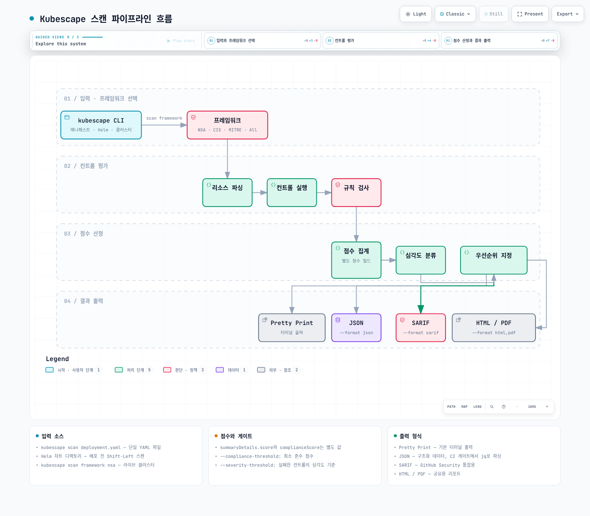
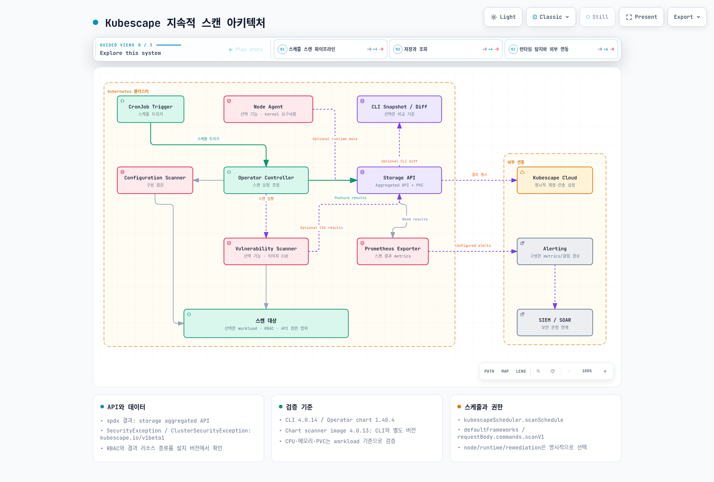
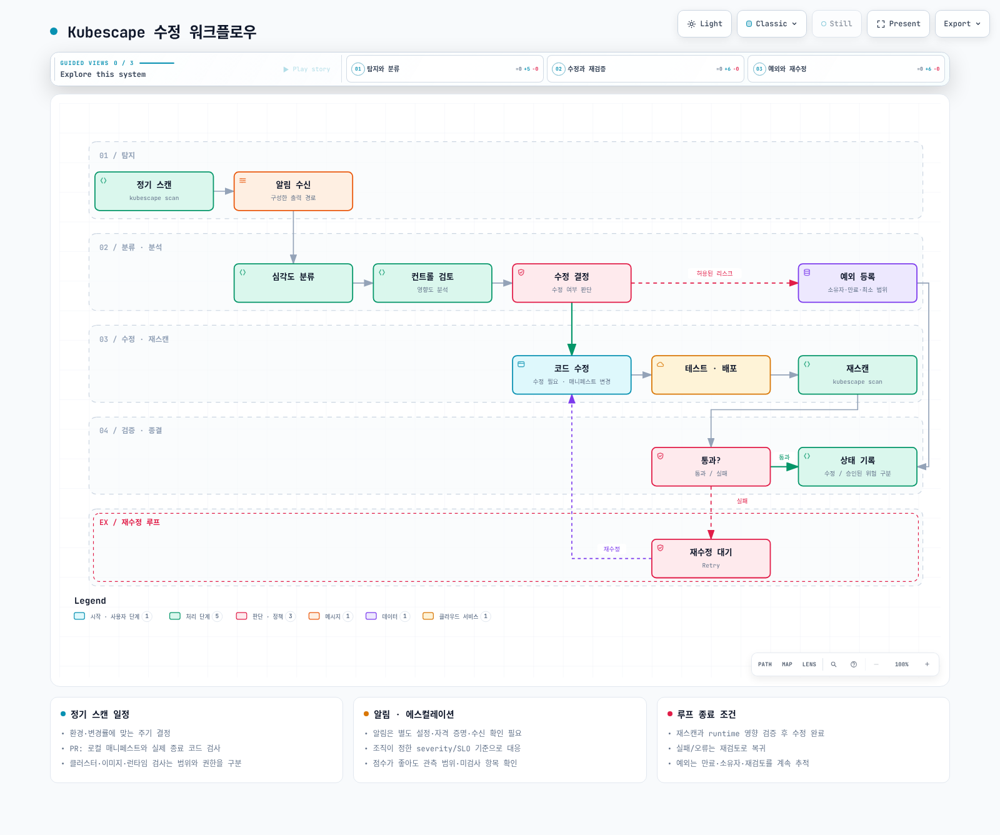

<span id="목차"></span>

# Kubescape를 활용한 보안 태세 관리

> **마지막 업데이트**: 2026년 9월 13일
> **검증 기준**: CLI 4.0.14, Operator chart 1.40.4. 차트의 scanner image는 4.0.13으로 CLI와 다릅니다. 정책 bundle은 예제 디렉터리의 SHA-256 기록을 기준으로 합니다.

Kubescape는 Kubernetes 구성과 선택한 이미지·런타임 데이터를 평가합니다. **스캔 통과는 보안 보증이나 컴플라이언스 인증이 아니며, 검사하지 못한 항목도 구분**해야 합니다. 이 문서는 로컬 YAML·정책 bundle·실제 CLI·차트 렌더링을 검증했습니다. 실제 클러스터 스캔, node-agent 설치, 이미지 pull/취약점 DB 스캔, SaaS 제출은 실행하지 않았습니다.

<span id="kubescape란"></span>
<span id="kubescape-vs-다른-도구-비교"></span>
<span id="아키텍처-개요"></span>

## 개요

Kubescape는 2022년 12월 13일 CNCF에 합류했고 **2025년 1월 13일 Incubating** 단계로 승격됐습니다. 이전 Sandbox 설명과 도구별 CNCF 상태 비교표를 현재 사실로 사용하지 않습니다.

CLI는 명시한 파일이나 클러스터를 일회성으로 검사하고 Operator는 설치한 capability에 따라 지속·예약 검사를 수행합니다. 구성 컨트롤, RBAC 분석, 이미지 CVE, runtime 탐지는 서로 다른 범위입니다. kube-bench의 노드/CIS 점검, Polaris의 workload 정책, Trivy의 이미지·구성 스캔과 비교할 때 버전과 실제 필요한 기능을 기준으로 판단합니다.


[인터랙티브 다이어그램 보기](https://www.atomai.click/kubernetes-docs/archmaps/ko-security-11-kubescape-0.html)


<span id="설치-확인"></span>
<span id="kubescape-cloud-연동-선택사항"></span>

## 설치

### CLI 설치

[공식 4.0.14 release](https://github.com/kubescape/kubescape/releases/tag/v4.0.14)에서 OS/CPU에 맞는 binary를 내려받고 release checksum을 확인합니다. 아래 Linux AMD64 예제는 검토한 archive hash를 고정합니다. ARM64는 다른 archive/hash가 필요합니다.

```bash
curl --fail --location \
  https://github.com/kubescape/kubescape/releases/download/v4.0.14/kubescape_4.0.14_linux_amd64.tar.gz \
  --output kubescape.tgz
printf '%s  %s\n' '1d253b70f88e80b74f68af73ccd422f897381468300be7cc486fdd656d907a40' kubescape.tgz | sha256sum --check
tar -xzf kubescape.tgz kubescape
./kubescape version
./kubescape scan --help
```

Homebrew/Krew 등의 설치 방식은 각 패키지의 현재 버전을 확인합니다. 의도하지 않은 원격 installer 실행이나 kubeconfig 전달을 피하고 필요한 파일·명령만 준비합니다. `kubescape scan`처럼 대상 파일을 생략하면 현재 클러스터를 검사할 수 있습니다.

### Helm을 이용한 Operator 설치

[예제 디렉터리](https://github.com/Atom-oh/kubernetes-docs/tree/main/examples/security/kubescape)를 내려받고 `examples/security/kubescape`에서 명령을 실행합니다. 다음 profile은 구성 검사와 metrics 위주이며 node/image/runtime/remediation capability를 명시적으로 끕니다.

```bash
helm repo add kubescape https://kubescape.github.io/helm-charts
helm repo update kubescape
helm upgrade --install kubescape kubescape/kubescape-operator \
  --version 1.40.4 --namespace kubescape --create-namespace \
  --values operator-values.yaml
```

```yaml
clusterName: documentation-cluster
defaultFrameworks:
- nsa
- mitre
capabilities:
  continuousScan: enable
  configurationScan: enable
  nodeScan: disable
  nodeSbomGeneration: disable
  vulnerabilityScan: disable
  relevancy: disable
  runtimeObservability: disable
  networkPolicyService: disable
  networkEventsStreaming: disable
  runtimeDetection: disable
  nodeProfileService: disable
  admissionController: disable
  httpDetection: disable
  seccompProfileService: disable
  prometheusExporter: enable
  riskAcceptance: disable
  remediation: disable
  manageWorkloads: disable
global:
  enableClusterWideSecretAccess: false
persistence:
  storageClass: gp3
kubescapeScheduler:
  scanSchedule: 0 8 * * *
```


PVC용 gp3 StorageClass와 CSI driver, 대상 namespace·RBAC·CRD·aggregated API 가용성을 확인합니다. EKS Auto Mode와 일반 EBS CSI StorageClass는 provisioner가 다를 수 있습니다. Helm render 통과는 설치·저장·스캔 성공이 아닙니다.

`credentials.cloudSecret`는 기존 Secret의 이름이지 account ID가 아닙니다. SaaS가 필요하면 해당 backend·account/accessKey·전송 범위를 명시적으로 구성하고 승인합니다. CLI의 `--submit`은 결과 전송을 요청하며, 로컬 예제는 `--keep-local`과 별도 cache를 사용합니다. node/runtime 기능은 host 권한·kernel/BTF·노드 종류를 검토한 후 별도 활성화합니다.

<span id="프레임워크-비교표"></span>
<span id="nsa-cisa-kubernetes-하드닝-가이드"></span>
<span id="cis-kubernetes-benchmark"></span>
<span id="mitre-att-ck-for-kubernetes"></span>

## 보안 프레임워크

### 프레임워크와 컨트롤

프레임워크 이름·컨트롤 수는 정책 bundle에 따라 달라집니다. 검토 시 내려받은 bundle에는 NSA, MITRE, SOC2, ArmoBest, DevOpsBest, AllControls, CIS 버전별 프레임워크 등이 있었으며 NSA는 26개 control을 포함했습니다. 로컬 Pod에 모두 적용되는 것은 아닙니다.

```bash
kubescape list frameworks
kubescape list controls --framework NSA
kubescape list controls --framework NSA --search container
```

검토 bundle의 CIS 이름은 예를 들어 `cis-v1.12.0`, `cis-eks-t1.8.0`입니다. `cis-v1.23`이나 `cis`를 모든 버전에서 통하는 별칭으로 가정하지 않습니다. 정책 업데이트는 검사 범위·점수를 바꾸므로 binary 버전과 policy hash를 함께 기록합니다.

| Control ID | 검토 bundle의 이름 |
|---|---|
| C-0004 | Resources memory limit and request |
| C-0009 | Resource limits |
| C-0013 | Non-root containers |
| C-0016 | Allow privilege escalation |
| C-0034 | Automatic mapping of service account |
| C-0035 | Administrative Roles |
| C-0036 | Validate admission controller (validating) |
| C-0039 | Validate admission controller (mutating) |
| C-0057 | Privileged container |

C-0036/0039를 RBAC wildcard 또는 위험한 ServiceAccount 컨트롤로 설명하지 않습니다. 심각도도 bundle 기준입니다. 검토한 C-0057은 High이며 모든 배포에서 Critical이라고 고정하지 않습니다.

### 커스텀 프레임워크

`--use-from`은 로컬 policy 객체를 사용합니다. 이름과 미해결 control ID 목록만 적은 YAML이 완전한 실행 policy라고 가정하지 않습니다. 예제의 `policies/nsa.json`은 실제로 실행한 bundle이며 license·출처·SHA를 같이 보관합니다. 새로운 Rego 정책은 `kubescape policy init`과 `kubescape policy test` 같은 현재 CLI 기능으로 작성·검증하고 조직 정책에 맞게 리뷰합니다.

<span id="스캔-파이프라인-흐름"></span>
<span id="클러스터-스캔"></span>
<span id="특정-컨트롤-스캔"></span>
<span id="yaml-helm-매니페스트-스캔-shift-left"></span>
<span id="이미지-취약점-스캐닝"></span>
<span id="rbac-시각화-및-분석"></span>

## CLI 스캐닝



[인터랙티브 다이어그램 보기](https://www.atomai.click/kubernetes-docs/archmaps/ko-security-11-kubescape-1.html)


### 클러스터와 로컬 파일의 구분

```bash
# 실제 현재 클러스터에 접근하므로 권한·범위를 먼저 확인합니다.
kubescape scan framework nsa --include-namespaces production
# 로컬 파일만 검사하는 예제:
kubescape scan framework nsa secure-pod.yaml \
  --use-from policies/nsa.json --controls-config policies/controls-inputs.json \
  --exceptions no-exceptions.json --keep-local \
  --format json --output report.json
```

형식은 `--format`/`-f`, 파일 경로는 `--output`/`-o`입니다. `-o json > report.json`은 JSON 형식 선택이 아닙니다. 4.0.14는 JSON/SARIF/HTML/PDF/JUnit/gitlab-sast 등 여러 형식을 지원하지만 소비 도구에 맞는 형식을 선택해야 합니다.

Helm/Kustomize는 먼저 로컬에서 렌더링하고 출력 파일을 검사하면 적용된 values가 명확합니다. 로컬 검사에서는 실제 API defaulting, admission, IAM 권한, 네트워크 연결을 재현하지 못합니다. `--include-api-audit`, `--custom-framework`, `--sort-by`는 검토 CLI에서 알 수 없는 flag였습니다. `scan rbac`를 독립된 현재 CLI subcommand로 제시하지 않습니다.

### 실제 로컬 검사 결과

예제의 `insecure-pod.yaml`은 **배포하지 않고 스캔하는 합성 fixture**입니다. Kubernetes에 존재하지 않는 runAsRoot 필드는 제거하고 privileged/runAsUser 등 실제 필드로 문제를 표현했습니다. `secure-pod.yaml`도 일반 보안 설정을 보여주는 fixture이며 app image는 교체해야 합니다.

| 로컬 입력 | Compliance | score | 결과 |
|---|---:|---:|---|
| insecure Pod | 55 | 62.5 | High 실패 존재 |
| secure Pod | 95 | 6.818182 | High gate 통과, 모든 control 통과는 아님 |

이 수치는 첨부 정책 snapshot과 단일 Pod의 로컬 결과입니다. 클러스터 보안 수준이나 실제 exploit 가능성을 측정한 값이 아닙니다.

### 이미지와 RBAC 분석

이미지 스캔은 `kubescape scan image IMAGE`로 명시적으로 요청합니다. CLI 4.0.14 소스는 Grype 0.104.1과 Syft 1.42.3을 사용하지만 Operator kubevuln은 별도 image/version입니다. registry 접근·credential·platform·DB 갱신과 scan 실패를 확인합니다. host scan은 이미지 스캔과 다르며 추가 host 접근/리소스 생성이 수반될 수 있습니다.

RBAC 컨트롤은 수집한 Role/Binding과 API 범위 내에서 평가됩니다. RoleBinding은 해당 namespace에 권한을 부여하며 “모든 namespace” RoleBinding이라는 설명은 틀립니다. 정적 역할 분석만으로 모든 미사용 권한·외부 IAM·유효한 접근 경로를 검증했다고 단정하지 않습니다.

<span id="지속적-스캔-아키텍처"></span>
<span id="operator-컴포넌트"></span>
<span id="지속적-스캐닝-설정"></span>
<span id="스캔-결과-조회"></span>
<span id="런타임-위협-탐지-node-agent"></span>
<span id="kubernetes-api-공격-탐지"></span>

## Operator 모드 (인클러스터)



[인터랙티브 다이어그램 보기](https://www.atomai.click/kubernetes-docs/archmaps/ko-security-11-kubescape-2.html)


스캔 일정은 실제 chart의 `kubescapeScheduler.scanSchedule`과 요청 `requestBody.commands[].args.scanV1`을 사용합니다. `defaultFrameworks`는 대상이 비어 있는 요청의 기본값이며 명시한 targetNames가 우선합니다. 임의 ConfigMap의 scanSchedule 필드를 만든다고 controller가 읽는 것은 아닙니다.

결과용 `spdx.softwarecomposition.kubescape.io/v1beta1`은 storage 컴포넌트가 제공하는 **aggregated API**입니다. 모두 Kubernetes CRD라고 부르지 않습니다. 별도로 SecurityException, ClusterSecurityException, OperatorCommand 등 실제 CRD가 존재합니다. API discovery로 리소스 이름과 scope를 확인하고 결과를 조회합니다.

```bash
kubectl get apiservices v1beta1.spdx.softwarecomposition.kubescape.io
kubectl api-resources --api-group=spdx.softwarecomposition.kubescape.io
kubectl get pods,pvc -n kubescape
```

기존 예제의 ScanSchedule, VulnerabilityScanConfig, ThreatDetectionConfig, AcceptedRisk, ScanConfiguration을 현재 chart에 포함된 API로 제시하지 않습니다. node-agent 프로파일/탐지 설정 역시 해당 image·chart의 실제 capability와 API를 사용해야 합니다. 설정을 켰다는 것과 모든 노드의 수집·탐지가 정상이라는 것은 다릅니다.

<span id="리스크-점수-계산"></span>
<span id="심각도-수준"></span>
<span id="우선순위-지정"></span>

## 리스크 스코어링

`summaryDetails.complianceScore`와 `summaryDetails.score`는 서로 다른 집계입니다. compliance는 높을수록 더 많은 검사가 통과한 방향이며 risk score는 동일한 값이나 단순한 `100 - compliance`가 아닙니다. 임의 심각도 가중치 공식·조치 SLA를 Kubescape의 보편 공식으로 제시하지 않습니다.

```bash
jq '{compliance: .summaryDetails.complianceScore, risk: .summaryDetails.score,
     failed: [.summaryDetails.controls[] | select(.status == "failed") | {controlID, name, severity}]}' report.json
```

게이트는 `--compliance-threshold`의 **최소 준수 점수**와 `--severity-threshold`의 실패 컨트롤 심각도를 사용합니다. 로컬 점수 55는 threshold 55에서 exit 0, threshold 56에서 exit 1이었습니다. `--min-severity`는 출력 필터이며 현재 gate 계산을 대체하지 않습니다.

**`--fail-threshold`는 4.0.14에서 deprecated로 받아들이지만 값이 실제 게이트에 적용되지 않는 호환용 flag입니다.** 시험에서 실패 findings가 있어도 `--fail-threshold 0`만으로는 exit 0이 나왔습니다. `--scan-images`, `--skip-controls`처럼 여전히 처리되는 flag와 알 수 없는 flag도 구분합니다.

<span id="ci-cd-워크플로우"></span>
<span id="github-actions-워크플로우"></span>
<span id="gitlab-ci-파이프라인"></span>
<span id="jenkins-파이프라인"></span>

<span id="cicd-통합"></span>

## CI/CD 통합


[인터랙티브 다이어그램 보기](https://www.atomai.click/kubernetes-docs/archmaps/ko-security-11-kubescape-3.html)


### 공통 보안 게이트

```bash
#!/usr/bin/env bash
# Scan explicit local manifests. Never falls back to the current cluster.
set -euo pipefail
if [[ $# -ne 2 ]]; then
  printf 'Usage: %s LOCAL_MANIFEST OUTPUT_JSON\n' "$0" >&2
  exit 2
fi
manifest_path=$1
report_path=$2
if [[ ! -f $manifest_path ]]; then
  printf 'Expected an existing local manifest file: %s\n' "$manifest_path" >&2
  exit 2
fi
script_dir=$(cd -- "$(dirname -- "${BASH_SOURCE[0]}")" && pwd)
: "${KUBESCAPE_BIN:=kubescape}"
: "${COMPLIANCE_MINIMUM:=90}"
: "${SEVERITY_LIMIT:=high}"
: "${KS_CACHE_DIR:=${TMPDIR:-/tmp}/kubescape-example-cache}"
# This does not make the CI score a compliance certification or runtime test.
exec "$KUBESCAPE_BIN" --cache-dir "$KS_CACHE_DIR" scan framework nsa "$manifest_path" \
  --use-from "$script_dir/policies/nsa.json" \
  --controls-config "$script_dir/policies/controls-inputs.json" \
  --exceptions "$script_dir/no-exceptions.json" \
  --keep-local \
  --compliance-threshold "$COMPLIANCE_MINIMUM" \
  --severity-threshold "$SEVERITY_LIMIT" \
  --format json --output "$report_path"
```


잘못된 경로·스캔 오류·기준 미달은 nonzero로 끝나며 continue-on-error나 `|| true`로 숨기지 않습니다. 결과 업로드는 실패 뒤에도 실행할 수 있지만 성공 판정을 대신하지 않습니다. 예외로 control을 제외하면 검사 분모가 바뀐다는 사실도 기록합니다.

### GitHub Actions

[검증한 workflow](https://github.com/Atom-oh/kubernetes-docs/blob/main/examples/security/kubescape/github-actions.yaml)는 binary/checksum을 고정하고, 로컬 policy snapshot과 `k8s/rendered.yaml`만 검사합니다. 프로젝트가 먼저 이 파일을 생성해야 하며 없으면 실패합니다. 기본 권한은 contents:read이고 외부 PR 코멘트·SaaS 전송은 없습니다.

### GitLab과 Jenkins

두 시스템에서도 같은 `scan-manifests.sh`의 종료 코드를 그대로 전달하고 보고서 artifact를 보관합니다. Kubescape 일반 JSON을 GitLab SAST 또는 Code Quality schema라고 지정하지 않습니다. GitLab 통합 보고서가 필요하면 현재 `--format gitlab-sast` 출력과 해당 버전 schema를 검증합니다. Jenkins의 readJSON/publishHTML은 플러그인이 필요하고 생성하지 않은 HTML을 publish하지 않습니다.

<span id="eks-전용-컨트롤"></span>
<span id="aws-auth-configmap-분석"></span>
<span id="irsa-iam-roles-for-service-accounts-검증"></span>
<span id="eks-보안-스캔-스크립트"></span>

## EKS 특화 가이드

EKS control plane·IAM·access entry·Pod Identity/IRSA·노드 정책은 Kubernetes manifest 검사만으로 모두 검증되지 않습니다. 특히 aws-auth는 legacy 인증 경로이며 현재 인증 모드와 access entries를 먼저 확인합니다. system:masters 또는 IAM 사용자 emergency-admin을 “최소 권한” 예제로 제시하지 않습니다.

C-0034는 서비스 계정 token 자동 마운트 검사이며 IRSA role trust·aud/sub·IAM 정책 전체를 검증하는 컨트롤이 아닙니다. IRSA의 projected STS token과 Kubernetes API token 자동 마운트는 구분합니다. 실제 권한은 workload identity 설정과 AWS API 허용 범위로 검증해야 합니다.

노드/host 검사와 remediation capability는 권한·변경 범위를 검토한 후 별도 승인·실행합니다. 예제 profile은 cluster-wide Secret 접근과 remediation을 비활성화하지만 scanner/operator/storage가 요구하는 나머지 RBAC도 설치 전 확인합니다.

<span id="예외-정책-정의"></span>
<span id="인라인-예외-어노테이션"></span>
<span id="허용된-리스크-문서화"></span>

## 컨트롤 예외 처리

### CLI 예외

```json
[
  {
    "name": "documentation-privileged-exception",
    "policyType": "postureExceptionPolicy",
    "actions": [
      "alertOnly"
    ],
    "resources": [
      {
        "designatorType": "Attributes",
        "attributes": {
          "namespace": "demo-app",
          "kind": "Pod",
          "name": "insecure-example"
        }
      }
    ],
    "posturePolicies": [
      {
        "controlID": "C-0057"
      }
    ]
  }
]
```


이것은 CLI가 읽는 **JSON 배열**이며 ConfigMap wrapper가 아닙니다. `alertOnly` 예외는 검토한 local fixture에서 C-0057을 acknowledged로 표시했지만 실패와 compliance 55를 그대로 유지했습니다. `--exclude-controls C-0057`은 control을 평가에서 제거해 분모와 compliance를 바꿨습니다. 예외 등록을 수정 완료로 해석하지 않습니다.

### 인클러스터 예외

```yaml
apiVersion: kubescape.io/v1beta1
kind: SecurityException
metadata:
  name: documentation-privileged-exception
  namespace: demo-app
spec:
  author: documentation-security-team
  reason: Synthetic scan example; replace with an approved owner and justification.
  expiresAt: '2026-09-30T00:00:00Z'
  match:
    resources:
      - apiGroup: ''
        kind: Pod
        name: insecure-example
  posture:
    - controlID: C-0057
      action: alert_only
```


현재 API는 `kubescape.io/v1beta1` SecurityException/ClusterSecurityException입니다. namespace 범위, match, posture action, 만료일·승인자를 실제 운영 정책에 맞게 설정합니다. CRD schema 통과는 controller 적용·RBAC·CEL 검증의 대체가 아닙니다. CLI JSON의 `alertOnly`와 CRD의 `alert_only`를 혼동하지 않습니다. 임의 ignore annotation에 전체 예외 처리를 의존하지 않습니다.

<span id="정기-스캐닝-일정"></span>
<span id="알림-및-에스컬레이션"></span>
<span id="컴플라이언스-리포팅"></span>
<span id="수정-워크플로우"></span>
<span id="보안-강화-체크리스트"></span>

## 모범 사례



[인터랙티브 다이어그램 보기](https://www.atomai.click/kubernetes-docs/archmaps/ko-security-11-kubescape-4.html)


검사 범위, 성공/실패/미검사 항목, policy hash, tool image, 예외 소유자·만료일을 기록합니다. 비교하는 점수는 같은 입력·policy 범위여야 합니다. node scan·이미지 scan·runtime 탐지를 하나의 점수로 오해하지 않습니다.

### Prometheus 연동

```yaml
apiVersion: monitoring.coreos.com/v1
kind: PodMonitor
metadata:
  name: kubescape-posture
  namespace: monitoring
spec:
  namespaceSelector:
    matchNames: [kubescape]
  selector:
    matchLabels:
      app.kubernetes.io/name: kubescape-operator
      app.kubernetes.io/instance: kubescape
      app.kubernetes.io/component: prometheus-exporter
  podMetricsEndpoints:
    - port: metrics
      path: /metrics
      interval: 60s
```


검토 chart의 exporter Pod에는 `metrics`라는 container port 8080이 있지만 Service port에는 이름이 없습니다. 따라서 예제는 해당 Pod label/port를 선택하는 PodMonitor를 사용합니다. Prometheus Operator와 Prometheus의 PodMonitor 선택 설정은 별도 전제입니다.

Exporter 0.2.23의 실제 gauge 예시는 `kubescape_controls_total_cluster_high`, `kubescape_controls_total_workload_high`입니다. `_total`이라는 이름만으로 counter라고 가정하지 않습니다. 기존 문서의 kubescape_compliance_score/critical_findings/last_scan_timestamp를 실제 존재하는 공통 metric으로 제시하지 않습니다. scrape 누락과 데이터 갱신 상태도 확인합니다.

<span id="핵심-요점"></span>
<span id="주요-명령어-요약"></span>
<span id="참고-자료"></span>

## 요약 및 참고 자료

로컬 검증은 binary/checksum, 정책 snapshot, threshold 경계·severity·deprecated gate, exception/exclusion, 실제 shell gate, Helm render, SecurityException schema, PodMonitor 대상, GitHub Actions 구문, 다이어그램 30개 browser 사례를 포함합니다. 실제 AWS/Kubernetes/registry/알림/SaaS 작업은 실행하지 않았습니다.

- [CNCF Kubescape history](https://www.cncf.io/projects/kubescape/)
- [Kubescape documentation](https://kubescape.io/docs/)
- [Frameworks and controls](https://kubescape.io/docs/frameworks-and-controls/)
- [Operator documentation](https://kubescape.io/docs/operator/)
- [CLI 4.0.14](https://github.com/kubescape/kubescape/releases/tag/v4.0.14)
- [Pinned CLI flags](https://github.com/kubescape/kubescape/blob/v4.0.14/cmd/scan/scan.go)
- [Operator chart 1.40.4](https://github.com/kubescape/helm-charts/releases/tag/kubescape-operator-1.40.4)
- [Policy library](https://github.com/kubescape/regolibrary)
- [Exporter metrics 0.2.23](https://github.com/kubescape/prometheus-exporter/blob/v0.2.23/metrics/metrics.go)
- [Runtime security](./08-runtime-security.md)
- [EKS security practices](./06-eks-security-best-practices.md)
