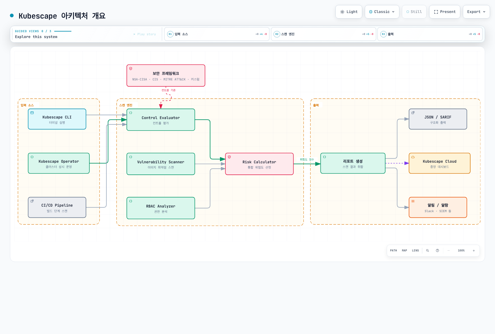
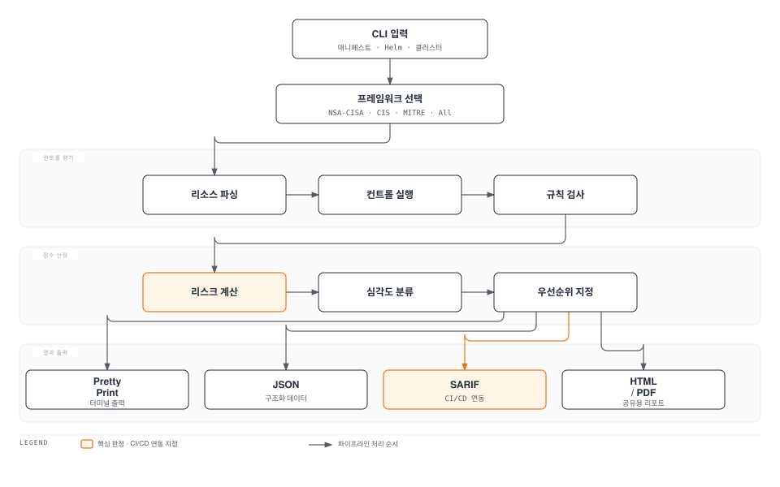
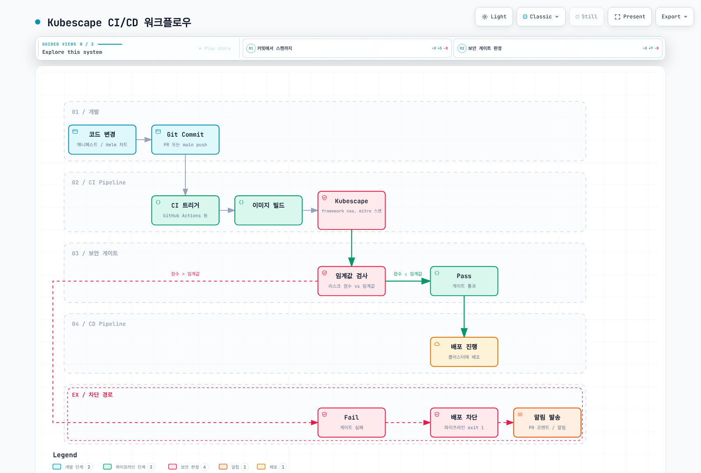
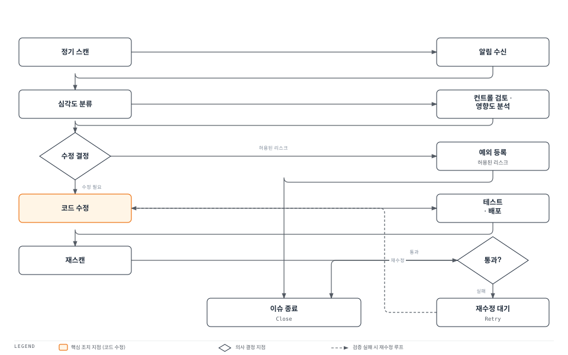

# Kubescape를 활용한 보안 태세 관리

> **지원 버전**: Kubescape 3.0+, Kubernetes 1.31, 1.32, 1.33
> **마지막 업데이트**: 2026년 2월 25일

Kubescape는 Kubernetes 클러스터의 보안 태세를 평가하고, 취약점을 식별하며, 컴플라이언스를 검증하는 오픈소스 보안 플랫폼입니다. CNCF Sandbox 프로젝트로, NSA-CISA, CIS, MITRE ATT&CK 등 다양한 보안 프레임워크를 지원합니다.

## 목차

1. [개요](#개요)
2. [설치](#설치)
3. [보안 프레임워크](#보안-프레임워크)
4. [CLI 스캐닝](#cli-스캐닝)
5. [Operator 모드 (인클러스터)](#operator-모드-인클러스터)
6. [리스크 스코어링](#리스크-스코어링)
7. [CI/CD 통합](#cicd-통합)
8. [EKS 특화 가이드](#eks-특화-가이드)
9. [컨트롤 예외 처리](#컨트롤-예외-처리)
10. [모범 사례](#모범-사례)
11. [요약 및 참고 자료](#요약-및-참고-자료)

---

## 개요

### Kubescape란?

Kubescape는 개발부터 운영까지 전체 Kubernetes 보안 라이프사이클을 지원하는 통합 보안 도구입니다. 다음과 같은 핵심 기능을 제공합니다:

- **보안 태세 평가**: 업계 표준 프레임워크 기반 클러스터 스캔
- **취약점 스캐닝**: 컨테이너 이미지 CVE 탐지
- **RBAC 분석**: 과도한 권한 및 위험한 역할 바인딩 식별
- **런타임 위협 탐지**: eBPF 기반 실시간 모니터링
- **Shift-Left 보안**: CI/CD 파이프라인 및 매니페스트 사전 스캔

### Kubescape vs 다른 도구 비교

| 특성 | Kubescape | kube-bench | Polaris | Trivy |
|------|-----------|------------|---------|-------|
| **프레임워크 지원** | NSA-CISA, CIS, MITRE, 커스텀 | CIS만 | 자체 정책 | CIS, 커스텀 |
| **이미지 스캐닝** | 지원 | 미지원 | 미지원 | 지원 |
| **RBAC 분석** | 상세 분석 | 미지원 | 기본 | 미지원 |
| **런타임 탐지** | eBPF 기반 | 미지원 | 미지원 | 미지원 |
| **CI/CD 통합** | 네이티브 | 제한적 | 지원 | 지원 |
| **Operator 모드** | 지원 | 미지원 | 지원 | 지원 |
| **리스크 스코어** | 정량적 점수 | Pass/Fail | Pass/Warn/Fail | 심각도 |
| **CNCF 상태** | Sandbox | 미가입 | 미가입 | Graduated |
| **학습 곡선** | 낮음 | 낮음 | 낮음 | 낮음 |

### 아키텍처 개요



[🔍 인터랙티브 다이어그램 보기](https://www.atomai.click/kubernetes-docs/archmaps/ko-security-11-kubescape-0.html)

---

## 설치

### CLI 설치

Kubescape CLI는 다양한 방법으로 설치할 수 있습니다.

**curl을 이용한 설치 (Linux/macOS)**

```bash
# 최신 버전 설치
curl -s https://raw.githubusercontent.com/kubescape/kubescape/master/install.sh | /bin/bash

# 특정 버전 설치
curl -s https://raw.githubusercontent.com/kubescape/kubescape/master/install.sh | /bin/bash -s -- -v v3.0.0

# 설치 확인
kubescape version
```

**Homebrew (macOS)**

```bash
brew install kubescape
```

**Krew (kubectl 플러그인)**

```bash
kubectl krew install kubescape
kubectl kubescape scan
```

**Windows (Chocolatey)**

```powershell
choco install kubescape
```

### Helm을 이용한 Operator 설치

인클러스터 지속적 스캐닝을 위한 Kubescape Operator를 설치합니다.

```bash
# Kubescape Helm 저장소 추가
helm repo add kubescape https://kubescape.github.io/helm-charts
helm repo update

# 기본 설치
helm install kubescape kubescape/kubescape-operator \
  --namespace kubescape \
  --create-namespace \
  --set clusterName=my-eks-cluster
```

**상세 설정 values.yaml**

```yaml
# values.yaml
clusterName: my-eks-cluster

# 스캔 스케줄 (cron 형식)
kubescape:
  schedule: "0 8 * * *"  # 매일 오전 8시
  frameworks:
    - nsa
    - mitre

# 취약점 스캐닝
kubevuln:
  enabled: true
  schedule: "0 */6 * * *"  # 6시간마다

# 런타임 탐지 (Node Agent)
nodeAgent:
  enabled: true
  resources:
    limits:
      memory: 500Mi
      cpu: 500m

# 스토리지
storage:
  enabled: true
  storageClass: gp3

# Kubescape Cloud 연동
credentials:
  cloudSecret: ""  # ARMO Platform 계정 ID

# 리소스 제한
operator:
  resources:
    limits:
      memory: 512Mi
      cpu: 500m
```

```bash
# values.yaml을 사용한 설치
helm install kubescape kubescape/kubescape-operator \
  --namespace kubescape \
  --create-namespace \
  -f values.yaml
```

### 설치 확인

```bash
# Pod 상태 확인
kubectl get pods -n kubescape

# 출력 예시:
# NAME                                  READY   STATUS    RESTARTS   AGE
# kubescape-operator-7d8b9c5f6-x2k4l   1/1     Running   0          2m
# kubevuln-7f9b8c6d5-m3n2p             1/1     Running   0          2m
# node-agent-4k8j2                      1/1     Running   0          2m
# node-agent-7m3n5                      1/1     Running   0          2m
# storage-5d6e7f8g9-h1i2j              1/1     Running   0          2m

# CRD 확인
kubectl get crd | grep kubescape

# 출력 예시:
# configurationscans.spdx.softwarecomposition.kubescape.io
# vulnerabilitymanifests.spdx.softwarecomposition.kubescape.io
# workloadconfigurationscans.spdx.softwarecomposition.kubescape.io
```

### Kubescape Cloud 연동 (선택사항)

ARMO Platform과 연동하여 중앙화된 대시보드와 히스토리 추적을 사용할 수 있습니다.

```bash
# 계정 ID로 CLI 연동
kubescape config set accountID <your-account-id>

# Operator 설치 시 연동
helm install kubescape kubescape/kubescape-operator \
  --namespace kubescape \
  --create-namespace \
  --set account=<your-account-id> \
  --set clusterName=my-eks-cluster
```

---

## 보안 프레임워크

Kubescape는 여러 업계 표준 보안 프레임워크를 지원합니다.

### 프레임워크 비교표

| 프레임워크 | 목적 | 컨트롤 수 | 대상 | 업데이트 주기 |
|------------|------|-----------|------|---------------|
| **NSA-CISA** | Kubernetes 하드닝 | ~30 | 일반 K8s | 연간 |
| **CIS Benchmark** | 보안 구성 검증 | ~120 | 일반 K8s | 분기별 |
| **MITRE ATT&CK** | 위협 기반 평가 | ~50 | 공격 패턴 | 수시 |
| **SOC2** | 컴플라이언스 | ~40 | 서비스 조직 | 연간 |
| **NIST-800-53** | 연방 보안 | ~100 | 정부/공공 | 수시 |
| **ArmoBest** | 종합 모범사례 | ~150 | 전체 | 월간 |

### NSA-CISA Kubernetes 하드닝 가이드

NSA와 CISA가 공동 발표한 Kubernetes 보안 가이드로, 다음 영역을 다룹니다:

```bash
# NSA-CISA 프레임워크 스캔
kubescape scan framework nsa --verbose

# 주요 컨트롤 카테고리:
# - Pod Security: 권한 있는 컨테이너, 호스트 네트워크/PID/IPC
# - Network: 네트워크 정책, Ingress/Egress 제어
# - Authentication: 서비스 계정, RBAC 설정
# - Logging: 감사 로깅, 로그 수집
# - Upgrades: 버전 관리, 취약점 패치
```

**NSA-CISA 주요 컨트롤 예시**

| 컨트롤 ID | 이름 | 설명 | 심각도 |
|-----------|------|------|--------|
| C-0001 | Forbidden Container Registries | 허용되지 않은 레지스트리 사용 | High |
| C-0002 | Exec into Container | kubectl exec 허용 | Medium |
| C-0004 | Resource Limits | 리소스 제한 미설정 | Low |
| C-0009 | Resource Requests | 리소스 요청 미설정 | Low |
| C-0013 | Non-root Containers | root로 실행되는 컨테이너 | Medium |
| C-0016 | Allow Privilege Escalation | 권한 상승 허용 | High |
| C-0017 | Immutable Container Filesystem | 쓰기 가능한 파일시스템 | Medium |
| C-0034 | Automatic Mapping of SA | 자동 SA 토큰 마운트 | Medium |
| C-0038 | Host PID/IPC Privileges | 호스트 PID/IPC 공유 | High |
| C-0041 | HostNetwork Access | 호스트 네트워크 사용 | High |
| C-0044 | Container Hostport | 호스트 포트 사용 | Medium |
| C-0046 | Insecure Capabilities | 위험한 Linux 기능 | High |
| C-0055 | Linux Hardening | seccomp/AppArmor 미적용 | Medium |
| C-0057 | Privileged Containers | 권한 있는 컨테이너 | Critical |

### CIS Kubernetes Benchmark

CIS(Center for Internet Security)에서 제공하는 상세한 보안 구성 가이드입니다.

```bash
# CIS 벤치마크 스캔
kubescape scan framework cis-v1.23

# CIS 카테고리:
# 1. Control Plane Components
# 2. etcd
# 3. Control Plane Configuration
# 4. Worker Nodes
# 5. Policies
```

### MITRE ATT&CK for Kubernetes

실제 공격 기술과 전술에 기반한 위협 모델링 프레임워크입니다.

```bash
# MITRE ATT&CK 프레임워크 스캔
kubescape scan framework mitre

# MITRE 전술 카테고리:
# - Initial Access: 초기 침투
# - Execution: 코드 실행
# - Persistence: 지속성 확보
# - Privilege Escalation: 권한 상승
# - Defense Evasion: 탐지 회피
# - Credential Access: 자격 증명 탈취
# - Discovery: 정보 수집
# - Lateral Movement: 측면 이동
# - Collection: 데이터 수집
# - Impact: 영향
```

### 커스텀 프레임워크

조직의 보안 요구사항에 맞는 커스텀 프레임워크를 정의할 수 있습니다.

```yaml
# custom-framework.yaml
name: my-organization-framework
description: "조직 맞춤 보안 프레임워크"
controls:
  - id: C-0057  # Privileged containers
  - id: C-0016  # Allow privilege escalation
  - id: C-0034  # Automatic mapping of SA
  - id: C-0017  # Immutable container filesystem
  - id: C-0046  # Insecure capabilities
  - id: custom-0001  # 커스텀 컨트롤
```

```bash
# 커스텀 프레임워크로 스캔
kubescape scan framework --use-from custom-framework.yaml
```

---

## CLI 스캐닝

### 스캔 파이프라인 흐름



### 클러스터 스캔

**기본 프레임워크 스캔**

```bash
# NSA-CISA 프레임워크로 전체 클러스터 스캔
kubescape scan framework nsa

# CIS 벤치마크 스캔
kubescape scan framework cis-v1.23

# MITRE ATT&CK 스캔
kubescape scan framework mitre

# 모든 컨트롤 스캔
kubescape scan framework allcontrols

# 여러 프레임워크 동시 스캔
kubescape scan framework nsa,mitre,cis-v1.23
```

**특정 네임스페이스 스캔**

```bash
# 특정 네임스페이스만 스캔
kubescape scan framework nsa --include-namespaces production,staging

# 네임스페이스 제외
kubescape scan framework nsa --exclude-namespaces kube-system,kubescape
```

**출력 형식 지정**

```bash
# JSON 출력
kubescape scan framework nsa -o json > report.json

# SARIF 출력 (GitHub Security 통합용)
kubescape scan framework nsa -o sarif > report.sarif

# HTML 리포트
kubescape scan framework nsa -o html > report.html

# PDF 리포트
kubescape scan framework nsa -o pdf > report.pdf

# 상세 출력
kubescape scan framework nsa --verbose
```

### 특정 컨트롤 스캔

```bash
# 단일 컨트롤 스캔
kubescape scan control C-0034  # Automatic mapping of SA

# 여러 컨트롤 스캔
kubescape scan control C-0034,C-0057,C-0016

# 컨트롤 이름으로 스캔
kubescape scan control "Privileged container"

# 컨트롤 목록 확인
kubescape list controls

# 특정 프레임워크의 컨트롤 목록
kubescape list controls --framework nsa
```

### YAML/Helm 매니페스트 스캔 (Shift-Left)

배포 전에 매니페스트를 스캔하여 보안 문제를 사전에 발견합니다.

```bash
# 단일 YAML 파일 스캔
kubescape scan deployment.yaml

# 디렉토리 전체 스캔
kubescape scan ./kubernetes/manifests/

# Helm 차트 스캔
kubescape scan helm ./my-chart/

# Helm values 적용하여 스캔
kubescape scan helm ./my-chart/ --set replicas=3

# Kustomize 출력 스캔
kustomize build ./overlays/production | kubescape scan -

# URL에서 매니페스트 스캔
kubescape scan https://raw.githubusercontent.com/example/repo/main/deployment.yaml
```

**Shift-Left 예시: 문제 있는 매니페스트**

```yaml
# insecure-deployment.yaml
apiVersion: apps/v1
kind: Deployment
metadata:
  name: insecure-app
spec:
  replicas: 1
  selector:
    matchLabels:
      app: insecure-app
  template:
    metadata:
      labels:
        app: insecure-app
    spec:
      containers:
      - name: app
        image: nginx:latest  # 태그 미고정
        securityContext:
          privileged: true   # 권한 있는 컨테이너
          runAsRoot: true    # root 실행
        # 리소스 제한 없음
```

```bash
# 스캔 실행
kubescape scan insecure-deployment.yaml -o json

# 결과 예시 (요약):
# Controls: 15 (Failed: 8, Passed: 7)
# Risk Score: 67%
# Failed Controls:
#   - C-0057: Privileged container (Critical)
#   - C-0013: Non-root containers (Medium)
#   - C-0004: Resource limits (Low)
#   - C-0009: Resource requests (Low)
```

### 이미지 취약점 스캐닝

```bash
# 특정 이미지 스캔
kubescape scan image nginx:1.25

# 클러스터에서 사용 중인 모든 이미지 스캔
kubescape scan framework nsa --scan-images

# 심각도 필터링
kubescape scan image nginx:1.25 --severity Critical,High

# JSON 출력
kubescape scan image nginx:1.25 -o json > vuln-report.json
```

**취약점 스캔 결과 예시**

```
Image: nginx:1.25.3
Vulnerabilities found: 47
┌──────────────────┬──────────┬──────────┬─────────────────────────────────────┐
│ CVE ID           │ Severity │ Package  │ Fixed Version                       │
├──────────────────┼──────────┼──────────┼─────────────────────────────────────┤
│ CVE-2023-44487   │ Critical │ nghttp2  │ 1.51.0-1+deb12u1                   │
│ CVE-2023-38545   │ High     │ curl     │ 7.88.1-10+deb12u5                  │
│ CVE-2023-38546   │ Medium   │ curl     │ 7.88.1-10+deb12u5                  │
│ CVE-2023-4911    │ High     │ glibc    │ 2.36-9+deb12u3                     │
└──────────────────┴──────────┴──────────┴─────────────────────────────────────┘
```

### RBAC 시각화 및 분석

```bash
# RBAC 전체 분석
kubescape scan rbac

# 특정 서비스 계정 분석
kubescape scan rbac --service-account default:my-service-account

# 위험한 권한 식별
kubescape scan rbac --show-rules-with-verbs create,delete,patch

# 클러스터 관리자 권한 사용자 목록
kubescape scan rbac --list-cluster-admins
```

**RBAC 분석 결과 예시**

```
RBAC Analysis Results:

High Risk Service Accounts:
┌─────────────────────────────────┬───────────────────────┬──────────────────────────┐
│ Service Account                 │ Namespace             │ Risk Level               │
├─────────────────────────────────┼───────────────────────┼──────────────────────────┤
│ admin-sa                        │ default               │ Critical (cluster-admin) │
│ deployment-controller           │ kube-system           │ High (secrets access)    │
│ monitoring-sa                   │ monitoring            │ Medium (wide read)       │
└─────────────────────────────────┴───────────────────────┴──────────────────────────┘

Dangerous Role Bindings:
- ClusterRoleBinding "admin-binding" grants cluster-admin to "admin-sa"
- RoleBinding "secret-reader" grants secrets read to "monitoring-sa" in all namespaces
```

---

## Operator 모드 (인클러스터)

### 지속적 스캔 아키텍처


[🔍 인터랙티브 다이어그램 보기](https://www.atomai.click/kubernetes-docs/archmaps/ko-security-11-kubescape-2.html)

### Operator 컴포넌트

| 컴포넌트 | 역할 | 리소스 사용 |
|----------|------|-------------|
| **Operator** | 스캔 조정, CRD 관리 | 256Mi / 200m |
| **Kubevuln** | 이미지 취약점 스캔 | 512Mi / 500m |
| **Node Agent** | 런타임 탐지 (eBPF) | 500Mi / 500m per node |
| **Storage** | 스캔 결과 저장 | 1Gi PVC |
| **Gateway** | Cloud 연동, API | 128Mi / 100m |

### 지속적 스캐닝 설정

```yaml
# kubescape-config.yaml
apiVersion: v1
kind: ConfigMap
metadata:
  name: kubescape-config
  namespace: kubescape
data:
  config.json: |
    {
      "scanSchedule": "0 */6 * * *",
      "vulnerabilityScanSchedule": "0 2 * * *",
      "frameworks": ["nsa", "mitre"],
      "severityThreshold": "medium",
      "scanNewDeployments": true,
      "continuousScanning": true
    }
```

### 스캔 결과 조회

```bash
# 워크로드 구성 스캔 결과
kubectl get workloadconfigurationscans -n production

# 취약점 매니페스트
kubectl get vulnerabilitymanifests -n production

# 상세 결과 확인
kubectl get workloadconfigurationscans nginx-deployment -n production -o yaml
```

**스캔 결과 CRD 예시**

```yaml
apiVersion: spdx.softwarecomposition.kubescape.io/v1beta1
kind: WorkloadConfigurationScan
metadata:
  name: nginx-deployment
  namespace: production
spec:
  workload:
    kind: Deployment
    name: nginx
    namespace: production
status:
  controls:
    passed: 25
    failed: 3
    skipped: 2
  riskScore: 23
  lastScanTime: "2026-02-25T08:00:00Z"
  failedControls:
    - id: C-0034
      name: "Automatic mapping of service account token"
      severity: Medium
    - id: C-0004
      name: "Resource limits"
      severity: Low
    - id: C-0009
      name: "Resource requests"
      severity: Low
```

### 런타임 위협 탐지 (Node Agent)

Node Agent는 eBPF를 사용하여 런타임 위협을 실시간으로 탐지합니다.

**탐지 가능한 위협**

| 위협 유형 | 설명 | 심각도 |
|-----------|------|--------|
| **프로세스 실행** | 의심스러운 바이너리 실행 | High |
| **파일 접근** | 민감한 파일 읽기/쓰기 | Medium-High |
| **네트워크 연결** | 비정상적인 아웃바운드 연결 | High |
| **권한 상승** | setuid, capability 변경 | Critical |
| **암호화폐 채굴** | 마이닝 소프트웨어 탐지 | High |
| **리버스 셸** | 셸 연결 시도 | Critical |

```yaml
# Node Agent 활성화
# values.yaml
nodeAgent:
  enabled: true
  config:
    applicationProfiles:
      enabled: true
      updatePeriod: 5m
    networkMonitoring:
      enabled: true
    fileMonitoring:
      enabled: true
      paths:
        - /etc/passwd
        - /etc/shadow
        - /root/.ssh
    processMonitoring:
      enabled: true
```

### Kubernetes API 공격 탐지

```bash
# API 서버 감사 로그 분석
kubescape scan framework mitre --include-api-audit

# 탐지 가능한 API 공격:
# - 과도한 API 요청 (열거 시도)
# - 권한 상승 시도
# - 시크릿 접근 시도
# - exec/attach/portforward 남용
# - 서비스 계정 토큰 탈취 시도
```

---

## 리스크 스코어링

### 리스크 점수 계산

Kubescape는 정량적 리스크 점수를 계산하여 보안 태세를 평가합니다.

**리스크 점수 공식**

```
리스크 점수 = Σ(컨트롤 심각도 × 영향 범위 × 실패 비율) / 전체 컨트롤 수
```

| 구성 요소 | 가중치 | 설명 |
|-----------|--------|------|
| **심각도 (Severity)** | Critical=4, High=3, Medium=2, Low=1 | 컨트롤의 기본 심각도 |
| **영향 범위 (Scope)** | 1.0-2.0 | 영향받는 리소스 비율 |
| **실패 비율 (Failure Rate)** | 0.0-1.0 | 해당 컨트롤 실패 리소스 비율 |

### 심각도 수준

| 레벨 | 점수 범위 | 설명 | 조치 |
|------|-----------|------|------|
| **Critical** | 80-100 | 즉각적인 위험 | 즉시 수정 필요 |
| **High** | 60-79 | 심각한 취약점 | 24시간 내 수정 |
| **Medium** | 40-59 | 중간 수준 위험 | 1주 내 수정 |
| **Low** | 20-39 | 낮은 위험 | 다음 릴리스에 수정 |
| **Passed** | 0-19 | 양호 | 유지 관리 |

### 우선순위 지정

```bash
# 심각도별 필터링
kubescape scan framework nsa --severity-threshold high

# 결과를 심각도순으로 정렬
kubescape scan framework nsa --sort-by severity

# 특정 심각도만 표시
kubescape scan framework nsa --severity Critical,High
```

**우선순위 지정 출력 예시**

```
Risk Score: 45 (Medium)

Priority 1 - Critical (Immediate Action):
┌────────┬─────────────────────────────────┬───────────────┬──────────────┐
│ Control│ Name                            │ Failed Count  │ Remediation  │
├────────┼─────────────────────────────────┼───────────────┼──────────────┤
│ C-0057 │ Privileged container            │ 3             │ Remove priv  │
│ C-0046 │ Insecure capabilities           │ 5             │ Drop caps    │
└────────┴─────────────────────────────────┴───────────────┴──────────────┘

Priority 2 - High (Within 24h):
┌────────┬─────────────────────────────────┬───────────────┬──────────────┐
│ C-0016 │ Allow privilege escalation      │ 12            │ Set to false │
│ C-0038 │ Host PID/IPC privileges         │ 2             │ Remove host* │
└────────┴─────────────────────────────────┴───────────────┴──────────────┘

Priority 3 - Medium (Within 1 Week):
┌────────┬─────────────────────────────────┬───────────────┬──────────────┐
│ C-0034 │ Automatic mapping of SA         │ 45            │ Set false    │
│ C-0013 │ Non-root containers             │ 28            │ runAsNonRoot │
└────────┴─────────────────────────────────┴───────────────┴──────────────┘
```

---

## CI/CD 통합

### CI/CD 워크플로우



[🔍 인터랙티브 다이어그램 보기](https://www.atomai.click/kubernetes-docs/archmaps/ko-security-11-kubescape-3.html)

### GitHub Actions 워크플로우

```yaml
# .github/workflows/kubescape-scan.yaml
name: Kubescape Security Scan

on:
  pull_request:
    branches: [main, develop]
    paths:
      - 'kubernetes/**'
      - 'helm/**'
  push:
    branches: [main]

env:
  SEVERITY_THRESHOLD: high
  SCORE_THRESHOLD: 50

jobs:
  manifest-scan:
    name: Scan Kubernetes Manifests
    runs-on: ubuntu-latest
    steps:
      - name: Checkout code
        uses: actions/checkout@v4

      - name: Install Kubescape
        run: |
          curl -s https://raw.githubusercontent.com/kubescape/kubescape/master/install.sh | /bin/bash

      - name: Scan Kubernetes manifests
        id: kubescape-scan
        run: |
          kubescape scan framework nsa,mitre \
            ./kubernetes/ \
            --severity-threshold ${{ env.SEVERITY_THRESHOLD }} \
            --compliance-threshold ${{ env.SCORE_THRESHOLD }} \
            -o json > scan-results.json
        continue-on-error: true

      - name: Upload scan results
        uses: actions/upload-artifact@v4
        with:
          name: kubescape-results
          path: scan-results.json

      - name: Parse scan results
        id: parse-results
        run: |
          RISK_SCORE=$(jq '.riskScore' scan-results.json)
          FAILED_CONTROLS=$(jq '.controlsSummary.failed' scan-results.json)
          echo "risk_score=$RISK_SCORE" >> $GITHUB_OUTPUT
          echo "failed_controls=$FAILED_CONTROLS" >> $GITHUB_OUTPUT

      - name: Check security gate
        run: |
          RISK_SCORE=${{ steps.parse-results.outputs.risk_score }}
          if (( $(echo "$RISK_SCORE > ${{ env.SCORE_THRESHOLD }}" | bc -l) )); then
            echo "Security gate failed! Risk score: $RISK_SCORE (threshold: ${{ env.SCORE_THRESHOLD }})"
            exit 1
          fi
          echo "Security gate passed. Risk score: $RISK_SCORE"

      - name: Comment PR with results
        if: github.event_name == 'pull_request'
        uses: actions/github-script@v7
        with:
          script: |
            const fs = require('fs');
            const results = JSON.parse(fs.readFileSync('scan-results.json', 'utf8'));

            const body = `## Kubescape Security Scan Results

            | Metric | Value |
            |--------|-------|
            | Risk Score | ${results.riskScore}% |
            | Controls Passed | ${results.controlsSummary.passed} |
            | Controls Failed | ${results.controlsSummary.failed} |
            | Severity Threshold | ${{ env.SEVERITY_THRESHOLD }} |

            ${results.riskScore > ${{ env.SCORE_THRESHOLD }} ? '**Security Gate: FAILED**' : '**Security Gate: PASSED**'}
            `;

            github.rest.issues.createComment({
              issue_number: context.issue.number,
              owner: context.repo.owner,
              repo: context.repo.repo,
              body: body
            });

  image-scan:
    name: Scan Container Images
    runs-on: ubuntu-latest
    needs: manifest-scan
    steps:
      - name: Checkout code
        uses: actions/checkout@v4

      - name: Install Kubescape
        run: |
          curl -s https://raw.githubusercontent.com/kubescape/kubescape/master/install.sh | /bin/bash

      - name: Extract images from manifests
        id: extract-images
        run: |
          IMAGES=$(grep -rh "image:" kubernetes/ | awk '{print $2}' | sort -u | tr '\n' ',')
          echo "images=$IMAGES" >> $GITHUB_OUTPUT

      - name: Scan images for vulnerabilities
        run: |
          IFS=',' read -ra IMAGE_ARRAY <<< "${{ steps.extract-images.outputs.images }}"
          for image in "${IMAGE_ARRAY[@]}"; do
            if [ -n "$image" ]; then
              echo "Scanning image: $image"
              kubescape scan image "$image" \
                --severity Critical,High \
                -o json > "vuln-${image//\//_}.json" || true
            fi
          done

      - name: Upload vulnerability reports
        uses: actions/upload-artifact@v4
        with:
          name: vulnerability-reports
          path: vuln-*.json
```

### GitLab CI 파이프라인

```yaml
# .gitlab-ci.yml
stages:
  - security-scan
  - deploy

variables:
  KUBESCAPE_VERSION: "v3.0.0"
  SEVERITY_THRESHOLD: "high"
  SCORE_THRESHOLD: "50"

kubescape-scan:
  stage: security-scan
  image: ubuntu:22.04
  before_script:
    - apt-get update && apt-get install -y curl jq
    - curl -s https://raw.githubusercontent.com/kubescape/kubescape/master/install.sh | /bin/bash
  script:
    - kubescape scan framework nsa,mitre ./kubernetes/
      --severity-threshold $SEVERITY_THRESHOLD
      --compliance-threshold $SCORE_THRESHOLD
      -o json > scan-results.json
    - |
      RISK_SCORE=$(jq '.riskScore' scan-results.json)
      if (( $(echo "$RISK_SCORE > $SCORE_THRESHOLD" | bc -l) )); then
        echo "Security gate failed! Risk score: $RISK_SCORE"
        exit 1
      fi
  artifacts:
    reports:
      codequality: scan-results.json
    paths:
      - scan-results.json
    expire_in: 1 week
  rules:
    - if: '$CI_PIPELINE_SOURCE == "merge_request_event"'
    - if: '$CI_COMMIT_BRANCH == "main"'

deploy:
  stage: deploy
  needs: [kubescape-scan]
  script:
    - echo "Deploying application..."
  rules:
    - if: '$CI_COMMIT_BRANCH == "main"'
```

### Jenkins 파이프라인

```groovy
// Jenkinsfile
pipeline {
    agent any

    environment {
        SEVERITY_THRESHOLD = 'high'
        SCORE_THRESHOLD = '50'
    }

    stages {
        stage('Install Kubescape') {
            steps {
                sh '''
                    curl -s https://raw.githubusercontent.com/kubescape/kubescape/master/install.sh | /bin/bash
                '''
            }
        }

        stage('Security Scan') {
            steps {
                sh '''
                    kubescape scan framework nsa,mitre ./kubernetes/ \
                        --severity-threshold ${SEVERITY_THRESHOLD} \
                        --compliance-threshold ${SCORE_THRESHOLD} \
                        -o json > scan-results.json
                '''

                script {
                    def results = readJSON file: 'scan-results.json'
                    def riskScore = results.riskScore

                    if (riskScore > env.SCORE_THRESHOLD.toInteger()) {
                        error "Security gate failed! Risk score: ${riskScore}"
                    }

                    echo "Security gate passed. Risk score: ${riskScore}"
                }
            }
            post {
                always {
                    archiveArtifacts artifacts: 'scan-results.json', fingerprint: true
                }
            }
        }

        stage('Deploy') {
            when {
                branch 'main'
            }
            steps {
                echo 'Deploying application...'
            }
        }
    }
}
```

---

## EKS 특화 가이드

### EKS 전용 컨트롤

Amazon EKS 환경에서 특히 중요한 보안 컨트롤입니다.

| 컨트롤 | 설명 | EKS 관련성 |
|--------|------|------------|
| **aws-auth ConfigMap** | IAM 역할 매핑 검증 | 높음 |
| **IRSA 설정** | 서비스 계정 IAM 역할 | 높음 |
| **EKS 보안 그룹** | 네트워크 접근 제어 | 높음 |
| **암호화 설정** | etcd 암호화, KMS | 높음 |
| **로깅 설정** | Control Plane 로깅 | 중간 |
| **노드 그룹 보안** | 관리형 노드 설정 | 중간 |

### aws-auth ConfigMap 분석

```bash
# aws-auth ConfigMap 검사
kubescape scan control "aws-auth-configmap" --verbose

# 또는 직접 분석
kubectl get configmap aws-auth -n kube-system -o yaml
```

**안전한 aws-auth ConfigMap 예시**

```yaml
apiVersion: v1
kind: ConfigMap
metadata:
  name: aws-auth
  namespace: kube-system
data:
  mapRoles: |
    # 노드 역할 - 최소 권한
    - rolearn: arn:aws:iam::111122223333:role/EKSNodeRole
      username: system:node:{{EC2PrivateDNSName}}
      groups:
        - system:bootstrappers
        - system:nodes

    # 관리자 역할 - 명시적 그룹
    - rolearn: arn:aws:iam::111122223333:role/EKSAdminRole
      username: admin:{{SessionName}}
      groups:
        - system:masters

    # 개발자 역할 - 제한된 권한
    - rolearn: arn:aws:iam::111122223333:role/EKSDeveloperRole
      username: developer:{{SessionName}}
      groups:
        - developers  # 커스텀 ClusterRole에 바인딩

  mapUsers: |
    # 긴급 접근용 IAM 사용자 (최소화 권장)
    - userarn: arn:aws:iam::111122223333:user/emergency-admin
      username: emergency-admin
      groups:
        - system:masters
```

### IRSA (IAM Roles for Service Accounts) 검증

```bash
# IRSA 설정 검사
kubescape scan control "irsa-configuration"

# 서비스 계정 IAM 역할 확인
kubectl get sa -A -o jsonpath='{range .items[*]}{.metadata.namespace}/{.metadata.name}: {.metadata.annotations.eks\.amazonaws\.com/role-arn}{"\n"}{end}' | grep -v ": $"
```

**안전한 IRSA 설정 예시**

```yaml
# 서비스 계정 with IRSA
apiVersion: v1
kind: ServiceAccount
metadata:
  name: s3-reader
  namespace: production
  annotations:
    eks.amazonaws.com/role-arn: arn:aws:iam::111122223333:role/S3ReaderRole
    eks.amazonaws.com/sts-regional-endpoints: "true"

---
# Pod에서 IRSA 사용
apiVersion: v1
kind: Pod
metadata:
  name: s3-reader-pod
  namespace: production
spec:
  serviceAccountName: s3-reader
  containers:
  - name: app
    image: amazon/aws-cli:latest
    command: ["aws", "s3", "ls"]
    # automountServiceAccountToken은 IRSA에서 true 필요
  securityContext:
    runAsNonRoot: true
    runAsUser: 1000
```

### EKS 보안 스캔 스크립트

```bash
#!/bin/bash
# eks-security-scan.sh

set -e

CLUSTER_NAME=${1:-$(kubectl config current-context | cut -d'/' -f2)}
OUTPUT_DIR="./security-reports/${CLUSTER_NAME}"
TIMESTAMP=$(date +%Y%m%d-%H%M%S)

mkdir -p "$OUTPUT_DIR"

echo "=== EKS 클러스터 보안 스캔: $CLUSTER_NAME ==="

# 1. Kubescape 전체 프레임워크 스캔
echo "[1/5] NSA-CISA 프레임워크 스캔..."
kubescape scan framework nsa \
  -o json > "$OUTPUT_DIR/nsa-scan-$TIMESTAMP.json"

# 2. MITRE ATT&CK 스캔
echo "[2/5] MITRE ATT&CK 스캔..."
kubescape scan framework mitre \
  -o json > "$OUTPUT_DIR/mitre-scan-$TIMESTAMP.json"

# 3. RBAC 분석
echo "[3/5] RBAC 분석..."
kubescape scan rbac \
  -o json > "$OUTPUT_DIR/rbac-scan-$TIMESTAMP.json"

# 4. 이미지 취약점 스캔
echo "[4/5] 이미지 취약점 스캔..."
kubescape scan framework nsa --scan-images \
  -o json > "$OUTPUT_DIR/vuln-scan-$TIMESTAMP.json"

# 5. aws-auth ConfigMap 분석
echo "[5/5] aws-auth ConfigMap 분석..."
kubectl get configmap aws-auth -n kube-system -o yaml > "$OUTPUT_DIR/aws-auth-$TIMESTAMP.yaml"

# 요약 리포트 생성
echo ""
echo "=== 스캔 완료 ==="
echo "결과 위치: $OUTPUT_DIR"

# 리스크 점수 요약
NSA_SCORE=$(jq '.riskScore' "$OUTPUT_DIR/nsa-scan-$TIMESTAMP.json")
MITRE_SCORE=$(jq '.riskScore' "$OUTPUT_DIR/mitre-scan-$TIMESTAMP.json")

echo ""
echo "리스크 점수 요약:"
echo "  - NSA-CISA: ${NSA_SCORE}%"
echo "  - MITRE ATT&CK: ${MITRE_SCORE}%"
```

---

## 컨트롤 예외 처리

### 예외 정책 정의

특정 컨트롤을 의도적으로 예외 처리해야 하는 경우가 있습니다.

```yaml
# kubescape-exceptions.yaml
apiVersion: kubescape.io/v1
kind: Exception
metadata:
  name: allowed-privileged-containers
spec:
  # 예외 대상 컨트롤
  controls:
    - C-0057  # Privileged container

  # 예외 범위
  resources:
    - namespace: kube-system
      kind: DaemonSet
      name: aws-node
    - namespace: kube-system
      kind: DaemonSet
      name: kube-proxy
    - namespace: monitoring
      kind: DaemonSet
      name: node-exporter

  # 예외 사유
  reason: "시스템 컴포넌트로 권한 있는 컨테이너 필요"

  # 예외 만료일
  expirationDate: "2026-12-31"

  # 승인자
  approvedBy: "security-team@company.com"

---
apiVersion: kubescape.io/v1
kind: Exception
metadata:
  name: host-network-ingress
spec:
  controls:
    - C-0041  # HostNetwork access
  resources:
    - namespace: ingress-nginx
      kind: DaemonSet
      name: ingress-nginx-controller
  reason: "Ingress 컨트롤러는 호스트 네트워크 필요"
  expirationDate: "2026-12-31"
  approvedBy: "platform-team@company.com"
```

```bash
# 예외 적용하여 스캔
kubescape scan framework nsa --exceptions kubescape-exceptions.yaml

# 예외 상태 확인
kubescape list exceptions
```

### 인라인 예외 (어노테이션)

```yaml
# Pod 레벨 예외
apiVersion: v1
kind: Pod
metadata:
  name: special-pod
  annotations:
    kubescape.io/ignore: "C-0057,C-0041"
    kubescape.io/ignore-reason: "레거시 시스템 호환성"
spec:
  hostNetwork: true
  containers:
  - name: legacy-app
    image: legacy-app:1.0
    securityContext:
      privileged: true
```

### 허용된 리스크 문서화

```yaml
# accepted-risks.yaml
apiVersion: v1
kind: ConfigMap
metadata:
  name: kubescape-accepted-risks
  namespace: kubescape
data:
  risks.json: |
    {
      "acceptedRisks": [
        {
          "controlId": "C-0057",
          "resource": "kube-system/daemonset/aws-node",
          "reason": "AWS VPC CNI 플러그인 요구사항",
          "approvedBy": "security-team",
          "approvedDate": "2026-01-15",
          "reviewDate": "2026-07-15"
        },
        {
          "controlId": "C-0034",
          "resource": "default/*",
          "reason": "레거시 애플리케이션 마이그레이션 기간",
          "approvedBy": "security-team",
          "approvedDate": "2026-02-01",
          "expirationDate": "2026-06-01"
        }
      ]
    }
```

---

## 모범 사례

### 정기 스캐닝 일정

| 스캔 유형 | 주기 | 대상 | 출력 |
|-----------|------|------|------|
| **전체 클러스터** | 매일 | 모든 네임스페이스 | JSON + 알림 |
| **프로덕션** | 6시간마다 | production NS | JSON + PagerDuty |
| **CI/CD** | PR마다 | 변경된 매니페스트 | SARIF + PR 코멘트 |
| **이미지 취약점** | 매일 | 모든 이미지 | JSON + Jira |
| **RBAC** | 주간 | 전체 클러스터 | HTML 리포트 |
| **컴플라이언스** | 월간 | 전체 클러스터 | PDF 리포트 |

### 알림 및 에스컬레이션

```yaml
# alerting-config.yaml
apiVersion: v1
kind: ConfigMap
metadata:
  name: kubescape-alerting
  namespace: kubescape
data:
  config.yaml: |
    alerting:
      channels:
        - type: slack
          webhook: https://hooks.slack.com/services/xxx
          severity: [medium, high, critical]

        - type: pagerduty
          apiKey: xxx
          severity: [critical]

        - type: email
          recipients:
            - security@company.com
          severity: [high, critical]

      escalation:
        - severity: critical
          timeout: 1h
          escalateTo: pagerduty

        - severity: high
          timeout: 24h
          escalateTo: email
```

### 컴플라이언스 리포팅

```bash
# 월간 컴플라이언스 리포트 생성
#!/bin/bash
# monthly-compliance-report.sh

MONTH=$(date +%Y-%m)
REPORT_DIR="./compliance-reports/$MONTH"
mkdir -p "$REPORT_DIR"

# SOC2 컴플라이언스 스캔
kubescape scan framework soc2 \
  -o pdf > "$REPORT_DIR/soc2-compliance-$MONTH.pdf"

# CIS 벤치마크 스캔
kubescape scan framework cis-v1.23 \
  -o pdf > "$REPORT_DIR/cis-benchmark-$MONTH.pdf"

# 요약 JSON
kubescape scan framework nsa,mitre,cis-v1.23 \
  -o json > "$REPORT_DIR/full-scan-$MONTH.json"

# 트렌드 분석 (이전 월과 비교)
PREV_MONTH=$(date -d "last month" +%Y-%m)
if [ -f "./compliance-reports/$PREV_MONTH/full-scan-$PREV_MONTH.json" ]; then
  echo "트렌드 분석:"
  PREV_SCORE=$(jq '.riskScore' "./compliance-reports/$PREV_MONTH/full-scan-$PREV_MONTH.json")
  CURR_SCORE=$(jq '.riskScore' "$REPORT_DIR/full-scan-$MONTH.json")
  echo "  이전 월: ${PREV_SCORE}%"
  echo "  현재 월: ${CURR_SCORE}%"
fi
```

### 수정 워크플로우



### 보안 강화 체크리스트

**Pod 보안 강화**

```yaml
# secure-pod-template.yaml
apiVersion: v1
kind: Pod
metadata:
  name: secure-pod
spec:
  # 서비스 계정 토큰 자동 마운트 비활성화
  automountServiceAccountToken: false

  securityContext:
    # Pod 레벨 보안 컨텍스트
    runAsNonRoot: true
    runAsUser: 1000
    runAsGroup: 1000
    fsGroup: 1000
    seccompProfile:
      type: RuntimeDefault

  containers:
  - name: app
    image: myapp:v1.0.0@sha256:abc123...  # 다이제스트 고정

    securityContext:
      # 컨테이너 레벨 보안 컨텍스트
      allowPrivilegeEscalation: false
      readOnlyRootFilesystem: true
      capabilities:
        drop:
          - ALL

    resources:
      limits:
        memory: "256Mi"
        cpu: "500m"
      requests:
        memory: "128Mi"
        cpu: "250m"

    # 프로브 설정
    livenessProbe:
      httpGet:
        path: /healthz
        port: 8080
      initialDelaySeconds: 10
      periodSeconds: 10

    readinessProbe:
      httpGet:
        path: /ready
        port: 8080
      initialDelaySeconds: 5
      periodSeconds: 5
```

---

## 요약 및 참고 자료

### 핵심 요점

1. **다중 프레임워크 지원**: NSA-CISA, CIS, MITRE ATT&CK 등 업계 표준 프레임워크로 포괄적인 보안 평가
2. **Shift-Left 보안**: CI/CD 파이프라인에 통합하여 배포 전 보안 문제 탐지
3. **정량적 리스크 스코어**: 객관적인 점수로 보안 태세 측정 및 추적
4. **지속적 모니터링**: Operator 모드로 인클러스터 실시간 스캐닝
5. **EKS 최적화**: AWS 환경에 특화된 컨트롤 및 IRSA 검증

### 주요 명령어 요약

```bash
# 프레임워크 스캔
kubescape scan framework nsa
kubescape scan framework cis-v1.23
kubescape scan framework mitre

# 특정 컨트롤 스캔
kubescape scan control C-0057

# 매니페스트 스캔 (Shift-Left)
kubescape scan ./kubernetes/manifests/

# 이미지 스캔
kubescape scan image nginx:1.25

# RBAC 분석
kubescape scan rbac

# 출력 형식
kubescape scan framework nsa -o json > report.json
kubescape scan framework nsa -o sarif > report.sarif
kubescape scan framework nsa -o pdf > report.pdf
```

### 참고 자료

**공식 문서**

- [Kubescape 공식 문서](https://kubescape.io/docs/)
- [Kubescape GitHub](https://github.com/kubescape/kubescape)
- [ARMO Platform](https://cloud.armosec.io/)

**보안 프레임워크**

- [NSA-CISA Kubernetes Hardening Guide](https://media.defense.gov/2022/Aug/29/2003066362/-1/-1/0/CTR_KUBERNETES_HARDENING_GUIDANCE_1.2_20220829.PDF)
- [CIS Kubernetes Benchmark](https://www.cisecurity.org/benchmark/kubernetes)
- [MITRE ATT&CK for Containers](https://attack.mitre.org/matrices/enterprise/containers/)

**관련 문서**

- [런타임 보안 (Falco, Tetragon)](./08-runtime-security.md)
- [OPA Gatekeeper](./09-opa-gatekeeper.md)
- [Kyverno 정책 관리](./01-kyverno-policy-management.md)
- [EKS 보안 모범 사례](./06-eks-security-best-practices.md)

**CNCF 프로젝트 상태**

Kubescape는 CNCF Sandbox 프로젝트로, 활발한 개발과 커뮤니티 지원을 받고 있습니다. 프로덕션 환경에서의 안정성과 지속적인 기능 개선이 이루어지고 있습니다.
