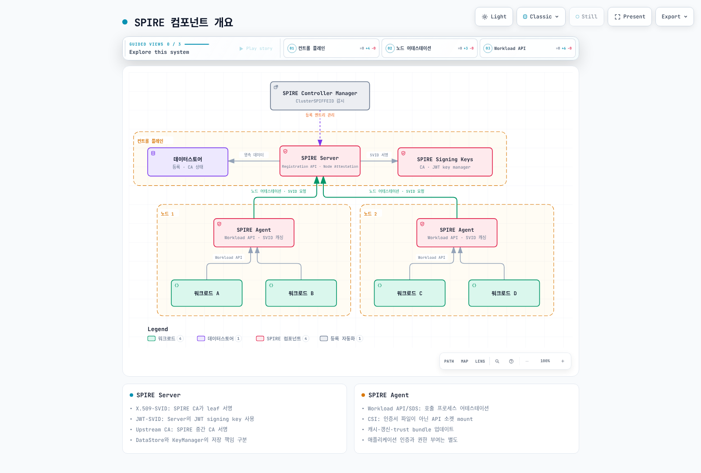
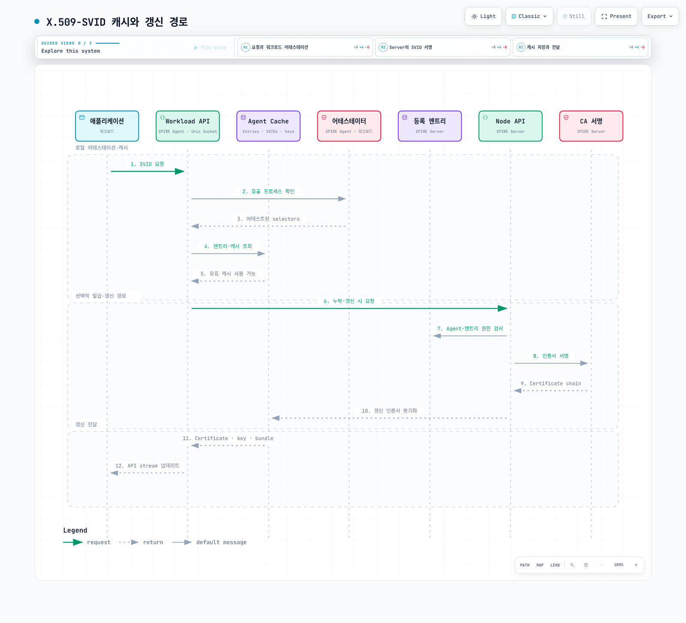
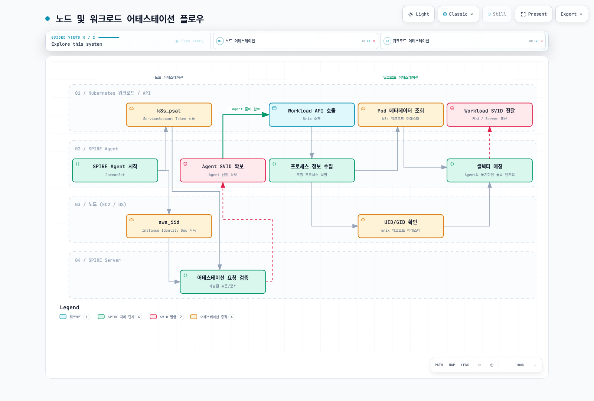
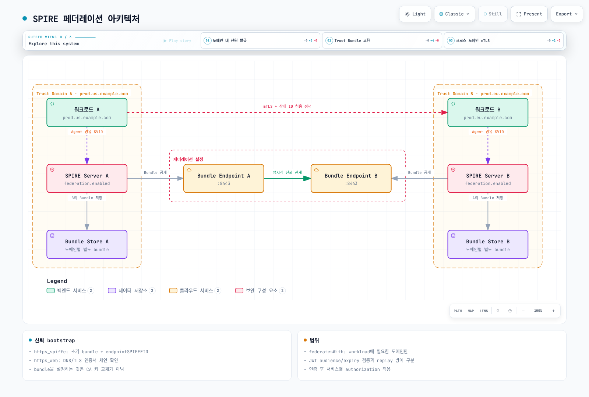

<span id="목차"></span>

# SPIFFE/SPIRE를 활용한 워크로드 아이덴티티

> **마지막 업데이트**: 2026년 9월 13일
> **검증 기준**: SPIRE 1.15.3, hardened chart 0.30.2 / CRD chart 0.6.1, Controller Manager 0.7.0, chart의 SPIFFE CSI image 0.2.7(별도 최신 CSI 0.2.13 문서도 확인), go-spiffe 2.8.1. chart와 실제 image 버전은 렌더링 결과로 확인합니다.

SPIFFE는 워크로드 신원과 자격 증명·전달·신뢰 형식을 정의하고 SPIRE는 이를 구현합니다. **신원 발급만으로 트래픽 암호화나 서비스 권한 부여가 자동 구현되지는 않습니다.** 이 문서는 로컬 설정·schema·라이브러리·차트·다이어그램을 검증했으며 실제 클러스터·AWS CA·SPIRE attestation·서비스 메시 설치는 실행하지 않았습니다.

<span id="왜-spiffe-spire가-필요한가"></span>

## 개요

SPIFFE와 SPIRE는 CNCF Graduated 프로젝트입니다. CNCF 프로젝트 페이지는 각각 2022년 8월 23일과 8월 22일을 기록합니다. 프로젝트 성숙도와 개별 설치의 운영 검증은 구분합니다.

IP·Pod 수명에 의존하지 않는 신원은 유용하지만 애플리케이션이 Workload API, SDK, proxy 또는 명시적 파일 변환기를 사용해야 합니다. “모든 앱이 코드 변경 없이 자동 보안 통신”이라는 설명은 성립하지 않습니다. 이 장은 SPIRE의 X.509-SVID/JWT-SVID 경로를 다루며, 별도로 존재하는 **Incubating WIT-SVID 사양**을 이미 모든 배포에서 지원하는 기능으로 가정하지 않습니다.

<span id="svid-spiffe-verifiable-identity-document"></span>
<span id="x-509-svid-vs-jwt-svid-비교"></span>
<span id="trust-bundle"></span>

<span id="1-핵심-개념"></span>

## 1. 핵심 개념

### SPIFFE ID

```text
spiffe://example.org/ns/payments/sa/payment-processor
```

SPIFFE ID는 scheme·trust domain·선택적 path로 구성됩니다. query, fragment, port, dot-segment와 percent-encoded path를 허용하지 않습니다. Trust domain은 DNS처럼 보이는 이름을 권장하지만 DNS 조회 대상이어야 한다는 뜻은 아닙니다. 사양상 IPv4 형태나 숫자도 무조건 무효는 아니므로 형식 유효성과 좋은 네이밍을 구분합니다.

### SVID와 검증

| 항목 | X.509-SVID | JWT-SVID |
|---|---|---|
| 신원 위치 | leaf의 SPIFFE URI SAN | sub |
| 검증 | chain·유효기간·SVID 규칙·trust domain | 서명·sub·audience·expiry |
| 사용 | TLS client/server 인증 | bearer token을 받는 API 등 |
| 키 | workload/Agent 경로의 개인키 | 서명 개인키는 issuer가 보유 |
| 수명 | 정책과 실제 발급 수명에 따라 다름 | 정책과 실제 token exp에 따라 다름 |

CN은 SPIFFE 신원 기준이 아닙니다. 로컬 go-spiffe 시험에서 CN-only, 복수 SPIFFE URI, 만료, 잘못된 trust domain을 거부했습니다. JWT audience 검사는 수신 대상을 제한하지만 replay 방어 자체가 아닙니다. 같은 유효 bearer token은 검증 함수에서 다시 통과했으며 별도 token 사용 정책·TLS·필요한 replay 방어가 필요합니다.

Trust bundle에는 X.509 authority뿐 아니라 JWT 검증 키와 관련 메타데이터도 있습니다. PEM, SPIFFE bundle JSON, 임의 YAML을 서로 바꿔 사용할 수 없습니다. 공개 bundle에는 workload/CA 개인키를 넣지 않습니다.

<span id="컴포넌트-개요"></span>
<span id="spire-server"></span>
<span id="spire-agent"></span>
<span id="svid-발급-플로우"></span>

<span id="2-spire-아키텍처"></span>

## 2. SPIRE 아키텍처



[인터랙티브 다이어그램 보기](https://www.atomai.click/kubernetes-docs/archmaps/ko-security-12-spiffe-spire-0.html)


Server는 Agent attestation과 registration을 관리하고 X.509/JWT 서명을 처리합니다. DataStore와 KeyManager의 저장 책임은 구분합니다. AWS Private CA 같은 UpstreamAuthority는 SPIRE 중간 CA를 서명하며, 모든 workload leaf 서명을 외부 CA에 넘기는 구조가 아닙니다.

Agent는 Workload API를 호출한 프로세스를 로컬에서 어테스트하고 동기화된 entry·SVID cache를 사용합니다. 유효 cache가 있으면 매번 Server에 새 인증서를 요청하지 않습니다. 소비자는 API stream·SDK 또는 proxy를 통해 교체된 자격 증명을 반영해야 합니다.



[인터랙티브 다이어그램 보기](https://www.atomai.click/kubernetes-docs/archmaps/ko-security-12-spiffe-spire-1.html)


<span id="helm-차트를-이용한-설치"></span>
<span id="프로덕션-구성"></span>
<span id="설치-확인"></span>

<span id="3-설치-및-구성"></span>

## 3. 설치 및 구성

[예제 디렉터리](https://github.com/Atom-oh/kubernetes-docs/tree/main/examples/security/spiffe)를 내려받고 `examples/security/spiffe`에서 사용합니다. 실제 node의 hostPath·CSI·kernel·kubelet 접근을 확인합니다. Fargate처럼 필요한 host 접근이 없는 환경에 동일한 DaemonSet을 설치할 수 있다고 가정하지 않습니다.

```bash
helm repo add spiffe https://spiffe.github.io/helm-charts-hardened
helm repo update spiffe
helm upgrade --install spire-crds spiffe/spire-crds \
  --version 0.6.1 --namespace spire-system --create-namespace
helm upgrade --install spire spiffe/spire \
  --version 0.30.2 --namespace spire-system --values lab-values.yaml
```

### 단일 서버 실습

```yaml
global:
  spire:
    trustDomain: example.org
    clusterName: documentation
    caSubject:
      organization: Documentation Lab
      country: KR
    namespaces:
      server:
        name: spire-system
      system:
        name: spire-system
  installAndUpgradeHooks:
    enabled: false
  deleteHooks:
    enabled: false
spire-server:
  replicaCount: 1
  controllerManager:
    enabled: true
    identities:
      clusterSPIFFEIDs:
        default:
          enabled: false
        oidc-discovery-provider:
          enabled: false
        test-keys:
          enabled: false
  externalControllerManagers:
    enabled: false
  persistence:
    enabled: true
    size: 1Gi
spire-agent:
  workloadAttestors:
    k8s:
      verification:
        type: apiServerCA
    unix:
      enabled: true
spiffe-oidc-discovery-provider:
  enabled: false
spiffe-csi-driver:
  enabled: true
```


이 profile은 SQLite를 쓰는 단일 서버 실습입니다. 기본 broad identity·test identity·사용하지 않는 OIDC identity를 끄고 별도 ClusterSPIFFEID로 workload를 선택합니다. chart 기본 kubelet verification은 skip이므로 apiServerCA를 명시했습니다. 이는 실제 kubelet serving certificate를 API server CA로 검증할 수 있는 환경을 전제로 합니다. 다른 PKI라면 올바른 CA/host certificate 방식을 준비하며 skip으로 우회하지 않습니다.

설치/삭제 hook은 예제에서 껐습니다. 필요한 migration·cleanup은 별도 절차로 수행해야 합니다. 실제 렌더링은 Server StatefulSet과 Controller Manager sidecar, Agent·CSI DaemonSet을 포함합니다. 리소스 이름·label·socket은 릴리스 이름에 따라 확인합니다.

### 고가용성 구성

[ha-values.yaml](https://github.com/Atom-oh/kubernetes-docs/blob/main/examples/security/spiffe/ha-values.yaml)은 3 replicas와 공유 PostgreSQL, existing password Secret, verify-full TLS CA mount, 실제 label과 일치하는 anti-affinity를 사용합니다. 단순히 SQLite replicas를 3으로 늘리는 것은 공유 HA datastore 구성이 아닙니다.

PostgreSQL endpoint·DNS·CA ConfigMap·spire-database Secret/password key·StorageClass·네트워크 경로를 먼저 준비합니다. chart가 Secret을 env로 연결하고 `-expandEnv`를 사용하는 것을 확인했지만 DB 연결·failover는 실행하지 않았습니다. HA는 replicas뿐 아니라 DB·키 저장·backup·bundle rollover·장애 복구 시험을 포함합니다.

<span id="어테스테이션-방식-비교"></span>
<span id="노드-및-워크로드-어테스테이션-플로우"></span>
<span id="kubernetes-psat-어테스테이션-구성"></span>
<span id="aws-iid-어테스테이션-구성"></span>

<span id="4-노드-어테스테이션"></span>

## 4. 노드 어테스테이션



[인터랙티브 다이어그램 보기](https://www.atomai.click/kubernetes-docs/archmaps/ko-security-12-spiffe-spire-2.html)


k8s_psat은 Agent의 projected ServiceAccount token을 Server가 **Kubernetes TokenReview API**로 검증하고 namespace·SA·Pod·node 정보를 확인합니다. IRSA용 IAM OIDC provider와 같은 절차가 아닙니다. Server/Agent의 logical cluster 이름, token audience, SA allowlist와 TokenReview 권한이 맞아야 합니다.

기본 Agent ID는 `spiffe://TRUST_DOMAIN/spire/agent/k8s_psat/CLUSTER/NODE_UID` 형태입니다. 현재 버전은 선택적으로 Pod UID 방식도 지원합니다. 임의 parentID를 추정하지 말고 등록된 Agent/alias ID를 확인하세요. CLI의 token generate/entry create/bundle set은 실제 상태를 바꾸는 명령입니다.

aws_iid는 EC2 IID 기반의 다른 선택지입니다. EKS에서 무조건 PSAT보다 강하다거나 EKS 밖에서만 가능하다고 단정하지 않습니다. skip_block_device·local validation·허용 AWS account와 추가 selector의 신뢰 가정을 검토합니다. static AWS key를 ConfigMap에 넣지 않습니다.

<span id="kubernetes-워크로드-어테스터"></span>
<span id="spire-agent-구성-워크로드-어테스터"></span>
<span id="등록-엔트리-생성"></span>

<span id="5-워크로드-어테스테이션"></span>

## 5. 워크로드 어테스테이션

Agent는 호출 PID/cgroup과 kubelet 정보를 이용합니다. 읽기 전용 kubelet 10255나 skip_kubelet_verification=true를 기본 보안 예제로 제시하지 않습니다. secure kubelet 인증·서버 CA·network reachability가 필요합니다.

일반 selector는 k8s:ns, k8s:sa, k8s:pod-label, k8s:pod-uid, k8s:container-name/image 등입니다. container-image는 K8s가 보고하는 tag 또는 digest이며 `nginx:*`를 glob처럼 해석하지 않습니다. 이미지 tag 문자열이 supply-chain 검증을 대체하지 않습니다. 필요한 경우 검증된 digest/서명 attestor 기능을 별도로 사용합니다.

namespace label·Pod label·ServiceAccount를 바꾸거나 그 SA로 Pod를 만들 수 있는 주체는 해당 신원에 영향을 줄 수 있습니다. namespace·SA·Pod 생성 권한과 identity 정책의 소유자를 함께 통제합니다. Unix UID/GID/path/hash selector도 plugin 설정과 위협 모델에 맞게 선택합니다.

<span id="spiffe-csi-driver"></span>
<span id="spire-controller-manager-자동-등록"></span>
<span id="envoy-sds-연동"></span>

<span id="6-kubernetes-통합"></span>

## 6. Kubernetes 통합

### CSI는 API 소켓을 연결

chart의 SPIFFE CSI 0.2.7과 현재 0.2.13 구현은 **Workload API Unix socket이 있는 디렉터리**를 Pod에 mount합니다. svid.pem·svid.key·bundle.pem을 자동 생성하는 파일 인증서 드라이버가 아닙니다. 파일 기반 앱은 별도 변환기와 갱신/reload 경로가 필요합니다.

```yaml
apiVersion: v1
kind: Namespace
metadata:
  name: payments
  labels:
    spiffe-enabled: 'true'
---
apiVersion: v1
kind: ServiceAccount
metadata:
  name: payment-processor
  namespace: payments
---
apiVersion: spire.spiffe.io/v1alpha1
kind: ClusterSPIFFEID
metadata:
  name: payments-workload
spec:
  spiffeIDTemplate: spiffe://{{ .TrustDomain }}/ns/{{ .PodMeta.Namespace }}/sa/{{
    .PodSpec.ServiceAccountName }}
  namespaceSelector:
    matchLabels:
      spiffe-enabled: 'true'
  podSelector:
    matchLabels:
      spiffe-managed: 'true'
  workloadSelectorTemplates:
  - k8s:ns:{{ .PodMeta.Namespace }}
  - k8s:sa:{{ .PodSpec.ServiceAccountName }}
  - k8s:container-name:app
  ttl: 1h
  jwtTtl: 5m
---
apiVersion: v1
kind: Pod
metadata:
  name: payment-processor
  namespace: payments
  labels:
    spiffe-managed: 'true'
spec:
  serviceAccountName: payment-processor
  containers:
  - name: app
    image: registry.example.com/team/payment-app:REPLACE_WITH_APPROVED_VERSION
    env:
    - name: SPIFFE_ENDPOINT_SOCKET
      value: unix:///spiffe-workload-api/spire-agent.sock
    volumeMounts:
    - name: spiffe-workload-api
      mountPath: /spiffe-workload-api
      readOnly: true
  volumes:
  - name: spiffe-workload-api
    csi:
      driver: csi.spiffe.io
      readOnly: true
```


example app image를 실제 Workload API 사용 애플리케이션으로 교체합니다. controller template의 `jwtTTL` chart value와 CRD의 `jwtTtl` 필드를 구분합니다. 명시적 workload selector는 app container를 선택하므로 Envoy를 별도 container로 실행하면 해당 proxy용 등록 정책도 맞춰야 합니다.

### Envoy SDS

[완전한 bootstrap 예제](https://github.com/Atom-oh/kubernetes-docs/blob/main/examples/security/spiffe/envoy.yaml)는 HTTP filter chain, SDS cluster, `require_client_certificate: true`, 허용된 상대 URI의 exact matcher를 포함합니다. Envoy 프로세스도 SPIRE가 어테스트할 수 있어야 하며 지정한 server/client ID 각각의 등록이 필요합니다.

SDS는 Workload API와 같은 public Agent socket을 사용합니다. TLS certificate resource는 workload SPIFFE ID 또는 default, validation context는 trust domain ID 또는 ROOTCA/ALL을 사용합니다. ALL과 기본 SPIFFE validator 지원·버전도 확인합니다. 예제는 protocol schema와 exact URI matcher의 구현을 확인했으며 실제 Envoy/SDS/mTLS handshake는 실행하지 않았습니다.

<span id="istio-spire"></span>
<span id="cilium-spire"></span>
<span id="linkerd-spire"></span>

<span id="7-서비스-메시-연동"></span>

## 7. 서비스 메시 연동

### Istio

SPIRE Server의 8081을 Istio CA 주소로 바꾸거나 존재하지 않는 ENABLE_SPIFFE_IDENTITY/PILOT_ENABLE_SPIRE_INTEGRATION 변수로 연동하지 않습니다. 현재 [공식 Istio 통합](https://istio.io/latest/docs/ops/integrations/spire/)은 workload의 CSI socket mount와 SPIRE identity registration, sidecar/gateway template을 구성합니다.

Kubernetes native sidecar를 사용하면 istio-proxy가 initContainers에 있으므로 그 경로를 patch합니다. 일반 sidecar를 명시적으로 사용한 경우 containers 경로를 사용합니다. 실제 설치 버전·template·socket 경로·readiness를 검증하고 기존 injector ConfigMap 전체를 부분 예제로 덮어쓰지 않습니다.

### Cilium

Cilium 1.20.1의 mutual authentication은 **beta이며 일반 연결과 별도로 수행되는 out-of-band 인증**입니다. traffic 암호화는 WireGuard/IPsec 등 별도 구성이 필요합니다. SPIFFE ID 문자열을 임의 label로 붙이면 자동 인증 정책이 된다는 예제는 삭제했습니다.

공식 설정은 `authentication.mutual.spire.enabled`와 bundled SPIRE를 쓰는 경우 `authentication.mutual.spire.install.enabled`를 사용합니다. 외부 SPIRE와 bundled 설치를 혼합하지 말고 해당 버전의 [설치 원문](https://github.com/cilium/cilium/blob/v1.20.1/Documentation/network/servicemesh/mutual-authentication/installation.rst)을 확인합니다. NetworkPolicy의 endpoint selector·authentication mode와 신원 발급/암호화의 책임을 구분합니다.

### Linkerd

SPIRE bundle JSON을 Linkerd PEM trust-anchor 파일로 전달하거나 SPIRE CA 개인키를 issuer key로 복사하지 않습니다. Linkerd identity issuer에는 별도 유효한 issuer certificate/key와 신뢰 root가 필요합니다. 외부 issuer의 갱신과 root rollover를 구성하고 [검토한 cert-manager/Linkerd 경로](./10-cert-manager.md)를 참고합니다. root bundle 공유만으로 SPIFFE Workload API/SDS 연동이 되는 것은 아닙니다.

<span id="페더레이션-아키텍처"></span>
<span id="페더레이션-구성"></span>
<span id="크로스-클러스터-워크로드-등록"></span>
<span id="페더레이션-상태-확인"></span>

<span id="8-페더레이션"></span>

## 8. 페더레이션



[인터랙티브 다이어그램 보기](https://www.atomai.click/kubernetes-docs/archmaps/ko-security-12-spiffe-spire-3.html)


신뢰 관계는 방향별로 명시하며 자동 상호 신뢰나 authorization을 의미하지 않습니다. bundle endpoint 접근·TLS 검증·갱신 실패·만료·rollover를 운영해야 합니다.

```yaml
apiVersion: spire.spiffe.io/v1alpha1
kind: ClusterFederatedTrustDomain
metadata:
  name: partner-domain
spec:
  trustDomain: partner.example.org
  bundleEndpointURL: https://bundle.partner.example.org
  bundleEndpointProfile:
    type: https_web
```


이 예제는 실제 Web PKI 인증서를 가진 HTTPS endpoint를 전제로 한 https_web 방식입니다. https_spiffe 방식은 endpointSPIFFEID와 **처음 신뢰할 bundle을 별도 신뢰 경로로 확보**해야 하므로 URL만 설정하면 완성되지 않습니다. 필요한 workload의 federatesWith에는 `partner.example.org`처럼 trust domain 이름을 사용합니다. bundle을 가져오는 것과 상대 workload ID를 허용하는 것은 별도입니다.

<span id="irsa-vs-spiffe-비교"></span>
<span id="eks-pod-identity-vs-spire-비교"></span>
<span id="하이브리드-사용-사례"></span>
<span id="aws-private-ca-통합"></span>

<span id="9-eks-통합"></span>

## 9. EKS 통합

IRSA/Pod Identity는 AWS API 자격 증명 경로이고 SPIFFE/SPIRE는 workload identity 경로입니다. 서로 대체하거나 항상 둘을 함께 써야 하는 것은 아닙니다. IRSA는 cross-account 구성이 가능하며 SDK·projected token 갱신에 따라 credential을 갱신하므로 Pod 재시작이 필수라는 설명은 틀립니다. 수명을 무조건 12시간으로 고정하지 않습니다.

IRSA annotation은 ServiceAccount에 구성하고 trust policy의 aud/sub·AWS 권한을 검증합니다. Pod annotation과 AWS_ROLE_ARN 환경 변수만으로 연결이 완성되지 않습니다. workload mTLS가 필요하면 앱/프록시가 SVID를 소비하고 peer ID를 승인하는 별도 경로를 구성합니다.

### AWS Private CA

[검증한 plugin 필드](https://github.com/spiffe/spire/blob/v1.15.3/doc/plugin_server_upstreamauthority_aws_pca.md)를 완전한 server config의 plugins에 넣습니다. 다음은 독립 실행 config가 아닌 plugin fragment입니다.

```hcl
# Merge this plugin into an otherwise complete server configuration.
UpstreamAuthority "aws_pca" {
  plugin_data {
    region = "ap-northeast-2"
    certificate_authority_arn = "arn:aws:acm-pca:ap-northeast-2:111122223333:certificate-authority/REPLACE_CA_ID"
    ca_signing_template_arn = "arn:aws:acm-pca:::template/SubordinateCACertificate_PathLen0/V1"
  }
}
```


SPIRE가 중간 CA를 소유하고 leaf를 서명합니다. IAM의 DescribeCertificateAuthority/IssueCertificate/GetCertificate는 사용할 CA ARN으로 제한한 [정책 예제](https://github.com/Atom-oh/kubernetes-docs/blob/main/examples/security/spiffe/aws-pca-policy.json)를 참고하세요. signing algorithm과 template은 실제 CA에 맞춰야 합니다. supplemental_bundle_path는 추가 PEM authority bundle이며 보조 리전 설정이 아닙니다. aws_kms는 KeyManager plugin과 UpstreamAuthority를 구분합니다.

<span id="trust-domain-네이밍-전략"></span>
<span id="svid-ttl-튜닝"></span>
<span id="고가용성-배포"></span>
<span id="키-로테이션"></span>
<span id="보안-강화-체크리스트"></span>

<span id="10-모범-사례"></span>

## 10. 모범 사례

TTL은 만료·갱신 실패·clock skew·발급 부하·offline 시간을 함께 고려합니다. 짧은 수명이 모든 회수 문제나 JWT replay를 해결하지 않습니다. bundle set은 신뢰 bundle을 변경하는 명령이지 CA 개인키를 회전시키는 명령이 아닙니다.

네트워크 정책은 Server↔Agent뿐 아니라 DNS, TokenReview/Kubernetes API, datastore, upstream CA/KMS, federation endpoint와 metrics 경로를 고려합니다. 특정 namespace의 Pod selector는 다른 namespace의 Agent를 자동 선택하지 않습니다. 실제 연결을 검증하기 전 “모든 보안 트래픽 허용”이라고 주장하지 않습니다.

Workload API 문제를 조사할 때 Agent Pod 안에서 fetch하면 그 호출 프로세스를 어테스트합니다. 실제 앱의 selector 검증을 대신하지 않으므로 동일 workload context에서 승인된 진단을 수행합니다. 로그의 selector·token·key 등 민감 자료 노출도 제한합니다.

<span id="핵심-요약"></span>
<span id="구현-로드맵"></span>
<span id="참고-자료"></span>

<span id="11-요약-및-참고-자료"></span>

## 11. 요약 및 참고 자료

로컬 검증은 SPIRE server/agent configuration, go-spiffe ID 9개·X.509 5개·JWT 6개, lab/HA Helm, CRD와 Pod schema, Envoy protobuf schema, 8개 다이어그램의 브라우저 24개 사례를 포함합니다. 실제 attestation·클러스터 설치·DB 연결·AWS 발급·federation 교환·mTLS 통신은 실행하지 않았습니다.

- [SPIFFE ID specification](https://spiffe.io/docs/latest/spiffe-specs/spiffe-id/)
- [X.509-SVID](https://spiffe.io/docs/latest/spiffe-specs/x509-svid/)
- [JWT-SVID](https://spiffe.io/docs/latest/spiffe-specs/jwt-svid/)
- [Incubating WIT-SVID](https://spiffe.io/docs/latest/spiffe-specs/wit-svid/)
- [Trust domain and bundle](https://spiffe.io/docs/latest/spiffe-specs/spiffe_trust_domain_and_bundle/)
- [Federation specification](https://spiffe.io/docs/latest/spiffe-specs/spiffe_federation/)
- [SPIFFE CNCF history](https://www.cncf.io/projects/spiffe/)
- [SPIRE CNCF history](https://www.cncf.io/projects/spire/)
- [SPIRE 1.15.3](https://github.com/spiffe/spire/releases/tag/v1.15.3)
- [SPIFFE CSI 0.2.13](https://github.com/spiffe/spiffe-csi/blob/v0.2.13/README.md)
- [Hardened Helm charts](https://github.com/spiffe/helm-charts-hardened)
- [Cilium 1.20.1 mutual authentication](https://github.com/cilium/cilium/blob/v1.20.1/Documentation/network/servicemesh/mutual-authentication/mutual-authentication.rst)
