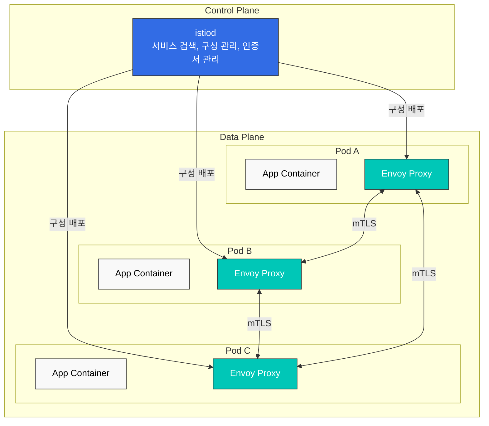

# Istio

> **지원 버전**: Istio 1.28.0
> **EKS 버전**: 1.34 (Kubernetes 1.28+)
> **마지막 업데이트**: 2025년 1월

## 목차

- [소개](#소개)
- [주요 기능](#주요-기능)
- [아키텍처 개요](#아키텍처-개요)
- [상세 문서](#상세-문서)
- [빠른 시작](#빠른-시작)
- [학습 자료](#학습-자료)

## 소개

Istio는 마이크로서비스 애플리케이션을 위한 오픈소스 서비스 메시 플랫폼입니다. 서비스 메시는 서비스 간 통신을 처리하는 인프라 계층으로, 애플리케이션 코드를 변경하지 않고도 서비스 간 통신을 제어하고 관찰할 수 있게 해줍니다.

### 서비스 메시란?

서비스 메시는 다음과 같은 핵심 기능을 제공합니다:

1. **트래픽 관리**: 서비스 간 트래픽 흐름 제어
2. **보안**: 서비스 간 통신 암호화 및 인증
3. **관찰성**: 서비스 간 통신에 대한 가시성 제공

### Istio의 주요 이점

- **플랫폼 독립성**: 다양한 환경(Kubernetes, VM 등)에서 작동
- **투명한 통합**: 애플리케이션 코드 변경 없이 적용 가능
- **자동 mTLS**: 서비스 간 통신 자동 암호화
- **고급 트래픽 관리**: 라우팅, 로드 밸런싱, 장애 주입 등
- **상세한 메트릭**: 서비스 간 통신에 대한 자세한 메트릭 제공
- **정책 시행**: 액세스 제어 및 속도 제한 적용

## 주요 기능

### 1. 트래픽 관리

Istio는 강력한 트래픽 관리 기능을 제공합니다:

- **Gateway**: 외부 트래픽을 메시로 라우팅
- **VirtualService**: 서비스 간 라우팅 규칙 정의
- **DestinationRule**: 로드 밸런싱 및 연결 풀 설정
- **트래픽 분할**: Canary 배포 및 A/B 테스트 지원
- **Argo Rollouts 통합**: 자동화된 점진적 배포

### 2. 보안

포괄적인 보안 기능:

- **mTLS**: 서비스 간 자동 암호화
- **Authorization Policy**: 세밀한 액세스 제어
- **Request Authentication**: JWT 기반 인증
- **Peer Authentication**: 서비스 간 인증 정책

### 3. 관찰성

서비스 메시에 대한 완전한 가시성:

- **메트릭**: Prometheus 통합
- **분산 추적**: Jaeger/Zipkin 지원
- **로깅**: 액세스 로그 및 구조화된 로그
- **시각화**: Kiali 대시보드

### 4. 복원력

서비스 복원력 패턴:

- **Circuit Breaker**: 과부하 방지
- **Retry**: 자동 재시도
- **Timeout**: 요청 시간 초과 설정
- **Outlier Detection**: 비정상 인스턴스 제외
- **Rate Limiting**: 요청 속도 제한

## 아키텍처 개요

Istio는 **Control Plane**과 **Data Plane**으로 구성됩니다.



### Control Plane (istiod)

istiod는 Istio의 중앙 제어 구성 요소로 다음을 제공합니다:

- **서비스 검색**: 메시의 서비스 레지스트리 유지
- **구성 관리**: Istio 구성 저장 및 배포
- **인증서 관리**: mTLS를 위한 인증서 생성 및 순환

### Data Plane (Envoy Proxy)

Envoy는 고성능 프록시로 각 파드의 사이드카로 배포되어:

- **트래픽 라우팅**: 서비스 간 트래픽 제어
- **로드 밸런싱**: 서비스 인스턴스 간 분산
- **보안**: mTLS 암호화 및 인증
- **관찰성**: 메트릭, 로그, 트레이스 수집

## 상세 문서

Istio의 모든 기능에 대한 상세 가이드입니다.

### 📚 기본 문서

| 문서 | 설명 |
|------|------|
| [설치 가이드](istio/installation.md) | Istio 설치 및 초기 설정 |
| [핵심 개념](istio/core-concepts.md) | Istio의 기본 개념과 용어 |
| [구성 요소](istio/components.md) | Istio 아키텍처와 구성 요소 |

### 🚦 트래픽 관리

| 문서 | 설명 |
|------|------|
| [Gateway & VirtualService](istio/traffic-management/01-gateway-virtualservice.md) | Ingress/Egress Gateway 구성 |
| [라우팅](istio/traffic-management/02-routing.md) | VirtualService 라우팅 규칙 |
| [DestinationRule](istio/traffic-management/03-destination-rule.md) | 서비스 트래픽 정책 |
| [트래픽 분할](istio/traffic-management/04-traffic-splitting.md) | Canary 배포 및 A/B 테스트 |
| [Timeout과 Retry](istio/traffic-management/05-retry-timeout.md) | 시간 초과 및 재시도 정책 |
| [로드 밸런싱](istio/traffic-management/06-load-balancing.md) | 다양한 로드 밸런싱 전략 |
| [Circuit Breaker](istio/traffic-management/07-circuit-breaker.md) | 서킷 브레이커 패턴 구현 |
| [장애 주입](istio/traffic-management/08-fault-injection.md) | 카오스 엔지니어링 |
| [트래픽 미러링](istio/traffic-management/09-traffic-mirror.md) | 트래픽 미러링 및 섀도우 테스트 |
| [Session Affinity](istio/traffic-management/10-session-affinity.md) | 세션 어피니티 설정 |

### 🔐 보안

| 문서 | 설명 |
|------|------|
| [mTLS](istio/security/01-mtls.md) | 서비스 간 mTLS 구성 |
| [Authorization Policy](istio/security/02-authorization-policy.md) | 액세스 제어 정책 |
| [Request Authentication](istio/security/03-request-authentication.md) | JWT 기반 인증 |
| [Peer Authentication](istio/security/04-peer-authentication.md) | 서비스 간 인증 |

### 📊 관찰성

| 문서 | 설명 |
|------|------|
| [메트릭](istio/observability/01-metrics.md) | Prometheus 메트릭 수집 |
| [분산 추적](istio/observability/02-distributed-tracing.md) | Jaeger/Zipkin 통합 |
| [로깅](istio/observability/03-logging.md) | 액세스 로그 및 구조화 로깅 |
| [시각화](istio/observability/04-visualization.md) | Kiali, Grafana 대시보드 |

### 💪 복원력

| 문서 | 설명 |
|------|------|
| [Outlier Detection](istio/resilience/01-outlier-detection.md) | 비정상 인스턴스 감지 |
| [Rate Limiting](istio/resilience/02-rate-limiting.md) | 로컬 및 글로벌 속도 제한 |
| [Zone Aware Routing](istio/resilience/03-zone-aware-routing.md) | 지역 인식 라우팅 |

### 🚀 고급 주제

| 문서 | 설명 |
|------|------|
| [Ambient Mode](istio/advanced/01-ambient-mode.md) | 사이드카 없는 서비스 메시 |
| [Multi-cluster](istio/advanced/02-multi-cluster.md) | 멀티 클러스터 메시 구성 |
| [EnvoyFilter](istio/advanced/03-envoy-filter.md) | Envoy 커스터마이제이션 |
| [DNS Caching](istio/advanced/04-dns-cache.md) | DNS 캐싱으로 성능 향상 |
| [gRPC](istio/advanced/05-grpc.md) | gRPC 프로토콜 지원 |
| [WebSocket](istio/advanced/06-websocket.md) | WebSocket 연결 지원 |
| [Sidecar Injection](istio/advanced/07-sidecar-injection.md) | Sidecar 주입 메커니즘 |
| [Argo Rollouts](istio/advanced/08-argo-rollouts.md) | Progressive Delivery 통합 |

### ✅ 모범 사례

| 문서 | 설명 |
|------|------|
| [Best Practices](istio/best-practices.md) | 프로덕션 체크리스트 및 권장 사항 |

## 빠른 시작

### 1. 사전 요구 사항

- Kubernetes 클러스터 (v1.28+)
- kubectl 설정
- 관리자 권한

### 2. Istio 설치

```bash
# Istioctl 다운로드
curl -L https://istio.io/downloadIstio | sh -
cd istio-1.28.0
export PATH=$PWD/bin:$PATH

# 기본 프로필로 설치
istioctl install --set profile=default -y

# 네임스페이스에 Sidecar 주입 활성화
kubectl label namespace default istio-injection=enabled
```

### 3. 샘플 애플리케이션 배포

```bash
# Bookinfo 샘플 애플리케이션 배포
kubectl apply -f samples/bookinfo/platform/kube/bookinfo.yaml

# Gateway 생성
kubectl apply -f samples/bookinfo/networking/bookinfo-gateway.yaml

# 설치 확인
kubectl get pods
kubectl get svc istio-ingressgateway -n istio-system
```

### 4. 트래픽 전송

```bash
# Ingress Gateway 주소 확인
export INGRESS_HOST=$(kubectl get svc istio-ingressgateway -n istio-system -o jsonpath='{.status.loadBalancer.ingress[0].hostname}')
export INGRESS_PORT=$(kubectl get svc istio-ingressgateway -n istio-system -o jsonpath='{.spec.ports[?(@.name=="http2")].port}')
export GATEWAY_URL=$INGRESS_HOST:$INGRESS_PORT

# 애플리케이션 접속
curl -s "http://${GATEWAY_URL}/productpage"
```

### 5. 관찰성 도구 접속

```bash
# Kiali 대시보드
istioctl dashboard kiali

# Prometheus
istioctl dashboard prometheus

# Grafana
istioctl dashboard grafana

# Jaeger
istioctl dashboard jaeger
```

## 학습 자료

### 공식 문서

- [Istio 공식 문서](https://istio.io/latest/docs/)
- [Istio GitHub 저장소](https://github.com/istio/istio)
- [Envoy 프록시 문서](https://www.envoyproxy.io/docs/envoy/latest/)

### AWS 관련

- [AWS EKS Workshop - Istio](https://www.eksworkshop.com/docs/security/servicemesh/)
- [AWS App Mesh vs Istio](https://aws.amazon.com/blogs/containers/choosing-between-aws-app-mesh-and-istio/)

### 커뮤니티

- [Istio Discuss](https://discuss.istio.io/)
- [Istio Slack](https://istio.slack.com/)
- [CNCF Istio Working Group](https://github.com/cncf/tag-app-delivery)

### 추가 자료

- [Service Mesh Patterns (O'Reilly)](https://www.oreilly.com/library/view/service-mesh-patterns/9781492086444/)
- [Istio in Action (Manning)](https://www.manning.com/books/istio-in-action)
- [Istio 성능 최적화 가이드](https://istio.io/latest/docs/ops/deployment/performance-and-scalability/)

## 퀴즈

Istio에 대한 이해도를 테스트하려면 [Istio 퀴즈](../quizzes/service-mesh/02-istio-quiz.md)를 풀어보세요.

퀴즈는 다음 주제를 다룹니다:

- 서비스 메시 기본 개념
- Istio 아키텍처
- 트래픽 관리 (Canary 배포)
- 보안 (mTLS)
- Gateway 및 Ingress
- 관찰성 도구
- 최신 서비스 메시 트렌드
- Rate Limiting
- Locality 라우팅
- Amazon EKS 통합

---

**다음 단계**: [설치 가이드](istio/installation.md)를 참고하여 Istio를 설치하고, [핵심 개념](istio/core-concepts.md)에서 기본 개념을 학습하세요.
