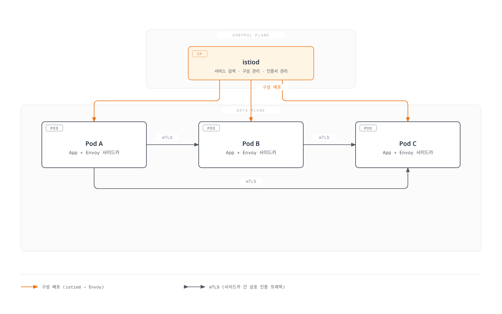

# Istio

> **검토일**: 2026년 9월 11일 · Istio 1.31 안내

이 개요는 이전 장 URL을 유지합니다. 상세 절차와 호환성 매트릭스는 유지 관리 중인 [Istio 문서 목차](istio/README.md)와 [설치 가이드](istio/01-installation.md)를 기준으로 확인하세요.

## 목차

- [소개](#소개)
- [주요 기능](#주요-기능)
- [아키텍처 개요](#아키텍처-개요)
- [상세 문서](#상세-문서)
- [빠른 시작](#빠른-시작)
- [학습 자료](#학습-자료)

## 소개

Istio는 마이크로서비스 애플리케이션을 위한 오픈소스 서비스 메시 플랫폼입니다. 서비스 메시는 서비스 간 통신을 처리하는 인프라 계층으로, 인프라 수준에서 서비스 통신을 제어하고 관찰하도록 합니다. Trace context 전파, 정상 종료와 비즈니스 멱등성에는 애플리케이션의 참여가 여전히 필요합니다.

### 서비스 메시란?

서비스 메시는 다음과 같은 핵심 기능을 제공합니다:

1. **트래픽 관리**: 서비스 간 트래픽 흐름 제어
2. **보안**: 서비스 간 통신 암호화 및 인증
3. **관찰성**: 서비스 간 통신에 대한 가시성 제공

### Istio의 주요 이점

- **플랫폼 독립성**: 다양한 환경(Kubernetes, VM 등)에서 작동
- **투명한 통합**: 많은 네트워크 제어를 비즈니스 로직 변경 없이 추가 가능
- **워크로드 mTLS**: 등록된 메시 경로의 identity·전송 보호. 실제 적용과 예외 확인 필요
- **고급 트래픽 관리**: 라우팅, 로드 밸런싱, 장애 주입 등
- **상세한 메트릭**: 서비스 간 통신에 대한 자세한 메트릭 제공
- **정책 시행**: 액세스 제어와 명시적으로 구성한 로컬·글로벌 속도 제한

## 주요 기능

### 1. 트래픽 관리

Istio는 강력한 트래픽 관리 기능을 제공합니다:

- **Gateway**: 외부 트래픽 라우팅. Istio Gateway와 Kubernetes Gateway API 구분 필요
- **VirtualService / HTTPRoute**: 선택한 데이터 플레인·controller가 지원하는 API로 라우팅 구성
- **DestinationRule**: 로드 밸런싱 및 연결 풀 설정
- **트래픽 분할**: Canary 배포 및 A/B 테스트 지원
- **Argo Rollouts 통합**: 분석·실패 처리를 별도로 구성하는 점진적 배포

### 2. 보안

포괄적인 보안 기능:

- **mTLS**: 등록된 워크로드 전송의 identity 인증과 암호화
- **Authorization Policy**: 세밀한 액세스 제어
- **Request Authentication**: JWT 검증. JWT 필수 조건은 AuthorizationPolicy로 적용
- **Peer Authentication**: 수신 워크로드 mTLS 정책

### 3. 관찰성

선택한 모드에 맞춰 구성하는 telemetry와 backend 통합:

- **메트릭**: Prometheus 통합
- **분산 추적**: OpenTelemetry·Jaeger 등의 provider/backend 구성과 애플리케이션 context 전파
- **로깅**: 액세스 로그 및 구조화된 로그
- **시각화**: Kiali 대시보드

### 4. 복원력

서비스 복원력 패턴:

- **Circuit Breaker**: 연결·요청 풀 제한. 과부하 방지의 절대 보장은 아님
- **Retry**: 안전한 작업의 명시적 예산. 결과가 미확정인 쓰기는 재시도 비활성화
- **Timeout**: 요청 시간 초과 설정
- **Outlier Detection**: 비정상 인스턴스 제외
- **Rate Limiting**: 로컬 token bucket 또는 글로벌 rate-limit service 구성

## 아키텍처 개요

Istio는 **Control Plane**과 **Data Plane**으로 구성됩니다. 다음 그림은 sidecar 구조이며 ambient 토폴로지는 아닙니다.



[🔍 인터랙티브 다이어그램 보기](https://www.atomai.click/kubernetes-docs/archmaps/ko-service-mesh-02-istio-0.html)

### Control Plane (istiod)

istiod는 Istio의 중앙 제어 구성 요소로 다음을 제공합니다:

- **서비스 검색**: 메시의 서비스 레지스트리 유지
- **구성 관리**: 설정 감시·변환과 proxy 설정 배포. API 리소스 영속 저장은 Kubernetes가 담당
- **인증서 관리**: 구성한 CA를 통한 workload 인증서 요청·갱신 관리

### Data Plane: Sidecar와 Ambient

Sidecar 모드에서는 등록된 애플리케이션 Pod 옆에 Envoy가 실행되어:

- **트래픽 라우팅**: 서비스 간 트래픽 제어
- **로드 밸런싱**: 서비스 인스턴스 간 분산
- **보안**: mTLS 암호화 및 인증
- **관찰성**: 메트릭, 로그, 트레이스 수집

Ambient는 노드별 ztunnel의 L4 전송과 지원되는 L7 기능용 선택적 Envoy waypoint를 사용합니다. 모든 애플리케이션 Pod에 Envoy를 주입하지 않습니다. 모드별 기능·정책 부착·리소스 사용이 다르며 이 구조만으로 일정한 절감률이나 보편적인 성능 우위를 보장할 수 없습니다. [Ambient Mode](istio/advanced/01-ambient-mode.md)를 참고하세요.

## 상세 문서

다음은 유지 관리되는 문서 트리의 학습 경로입니다. 해당 목차에는 추가·신규 주제도 포함됩니다.

### 📚 기본 문서

| 문서 | 설명 |
|------|------|
| [설치 가이드](istio/01-installation.md) | Istio 설치 및 초기 설정 |
| [핵심 개념](istio/02-basic-concepts.md) | Istio의 기본 개념과 용어 |
| [구성 요소](istio/03-architecture.md) | Istio 아키텍처와 구성 요소 |

### 🚦 트래픽 관리

| 문서 | 설명 |
|------|------|
| [Gateway & VirtualService](istio/traffic-management/01-gateway-virtualservice.md) | Ingress/Egress Gateway 구성 |
| [라우팅](istio/traffic-management/02-routing.md) | VirtualService 라우팅 규칙 |
| [DestinationRule](istio/traffic-management/03-destination-rule.md) | 서비스 트래픽 정책 |
| [트래픽 분할](istio/traffic-management/04-traffic-splitting.md) | Canary 배포 및 A/B 테스트 |
| [Timeout과 Retry](istio/traffic-management/05-retry-timeout.md) | 시간 초과 및 재시도 정책 |
| [로드 밸런싱](istio/traffic-management/06-load-balancing.md) | 다양한 로드 밸런싱 전략 |
| [Circuit Breaker](istio/traffic-management/07-circuit-breaker.md) | 서킷 브레이커 패턴 구현 |
| [장애 주입](istio/traffic-management/08-fault-injection.md) | 카오스 엔지니어링 |
| [트래픽 미러링](istio/traffic-management/09-traffic-mirror.md) | 트래픽 미러링 및 섀도우 테스트 |
| [Session Affinity](istio/traffic-management/10-session-affinity.md) | 세션 어피니티 설정 |

### 🔐 보안

| 문서 | 설명 |
|------|------|
| [mTLS](istio/security/01-mtls.md) | 서비스 간 mTLS 구성 |
| [Authorization Policy](istio/security/03-authorization.md) | 액세스 제어 정책 |
| [Request Authentication](istio/security/02-authentication.md) | JWT 기반 인증 |
| [Peer Authentication](istio/security/01-mtls.md) | 서비스 간 인증 |

### 📊 관찰성

| 문서 | 설명 |
|------|------|
| [메트릭](istio/observability/01-metrics.md) | Prometheus 메트릭 수집 |
| [분산 추적](istio/observability/02-tracing.md) | Jaeger/Zipkin 통합 |
| [로깅](istio/observability/03-logging.md) | 액세스 로그 및 구조화 로깅 |
| [시각화](istio/observability/04-dashboards.md) | Kiali, Grafana 대시보드 |

### 💪 복원력

| 문서 | 설명 |
|------|------|
| [Outlier Detection](istio/resilience/01-outlier-detection.md) | 비정상 인스턴스 감지 |
| [Rate Limiting](istio/resilience/02-rate-limiting.md) | 로컬 및 글로벌 속도 제한 |
| [Zone Aware Routing](istio/resilience/03-zone-aware-routing.md) | 지역 인식 라우팅 |

### 🚀 고급 주제

| 문서 | 설명 |
|------|------|
| [Ambient Mode](istio/advanced/01-ambient-mode.md) | 사이드카 없는 서비스 메시 |
| [Multi-cluster](istio/advanced/02-multi-cluster.md) | 멀티 클러스터 메시 구성 |
| [EnvoyFilter](istio/advanced/03-envoy-filter.md) | Envoy 커스터마이제이션 |
| [DNS Capture와 Caching](istio/advanced/04-dns-cache.md) | DNS capture, 이름 해석과 측정한 cache 동작 |
| [gRPC](istio/advanced/05-grpc.md) | gRPC 프로토콜 지원 |
| [WebSocket](istio/advanced/06-websocket.md) | WebSocket 연결 지원 |
| [Sidecar Injection](istio/advanced/07-sidecar-injection.md) | Sidecar 주입 메커니즘 |
| [Argo Rollouts](istio/advanced/08-argo-rollouts.md) | Progressive Delivery 통합 |

### ✅ 모범 사례

| 문서 | 설명 |
|------|------|
| [Best Practices](istio/best-practices.md) | 프로덕션 체크리스트 및 권장 사항 |

## 빠른 시작

1. [설치 가이드](istio/01-installation.md)에서 정확한 Istio/Kubernetes/EKS 호환 범위의 교집합을 확인하세요. 현재 Istio 릴리스에 “Kubernetes 1.28 이상”만으로는 충분하지 않습니다.
2. Sidecar 또는 ambient를 선택하고 고정한 CLI/chart, 격리된 namespace와 플랫폼 전제 조건을 따릅니다. 버전을 지정하지 않은 최신 CLI를 받은 뒤 과거 버전 디렉터리로 이동하지 않습니다.
3. 유지 관리되는 가이드의 같은 버전 Bookinfo와 gateway 절차를 사용하세요. Default profile은 ingress gateway Deployment를 자동 제공하지 않으며 Gateway 설정 객체 하나로 모든 설치 방식의 gateway/LoadBalancer가 생성되지 않습니다.
4. 실제 gateway 주소, Service port, route 상태와 HTTP 응답을 확인합니다. Load balancer는 IP나 hostname을 제공할 수 있으므로 AWS hostname 필드나 특정 port 이름만 가정하지 않습니다.
5. Dashboard 명령 전에 선택한 [관측성 backend](istio/observability/README.md)를 설치·설정하세요. Default Istio profile에 Prometheus, Grafana, Kiali와 tracing 저장소가 자동 설치되지 않습니다.

해당 절차 이후 기본 확인:

```bash
istioctl version
istioctl analyze -A
istioctl proxy-status
```

Proxy status는 진단 정보의 일부입니다. Ambient enrollment·ztunnel은 별도 확인이 필요하며 analyzer 오류가 없다는 것만으로 종단 트래픽이 검증되지는 않습니다.

## 학습 자료

### 공식 문서

- [Istio 공식 문서](https://istio.io/latest/docs/)
- [Istio GitHub 저장소](https://github.com/istio/istio)
- [Envoy 프록시 문서](https://www.envoyproxy.io/docs/envoy/latest/)

### AWS와 커뮤니티

- [Amazon EKS의 Istio](https://istio.io/latest/docs/setup/platform-setup/amazon-eks/)
- [유지 관리되는 AWS 통합 가이드](istio/04-aws-integration.md)
- [AWS App Mesh 수명 주기 안내](https://docs.aws.amazon.com/app-mesh/latest/userguide/what-is-app-mesh.html): AWS는 2026년 9월 30일 지원 종료를 안내합니다. 마이그레이션 요구를 검토하며 새 배포 권장으로 해석하지 않습니다.
- [Istio 커뮤니티·채널·워킹 그룹](https://istio.io/latest/get-involved/)

### 추가 자료

- [Service Mesh Patterns (O'Reilly)](https://www.oreilly.com/library/view/service-mesh-patterns/9781492086444/)
- [Istio in Action (Manning)](https://www.manning.com/books/istio-in-action)
- [Istio 성능 최적화 가이드](https://istio.io/latest/docs/ops/deployment/performance-and-scalability/)

## 퀴즈

Istio에 대한 이해도를 테스트하려면 [Istio 퀴즈](../quizzes/service-mesh/02-istio-quiz.md)를 풀어보세요.

퀴즈는 다음 주제를 다룹니다:

- 서비스 메시 기본 개념
- Istio 아키텍처
- 트래픽 관리 (Canary 배포)
- 보안 (mTLS)
- Gateway 및 Ingress
- 관찰성 도구
- Sidecar와 ambient 모드
- Rate Limiting
- Locality 라우팅
- Amazon EKS 통합

---

**다음 단계**: [설치 가이드](istio/01-installation.md)를 참고하여 Istio를 설치하고, [핵심 개념](istio/02-basic-concepts.md)에서 기본 개념을 학습하세요.
