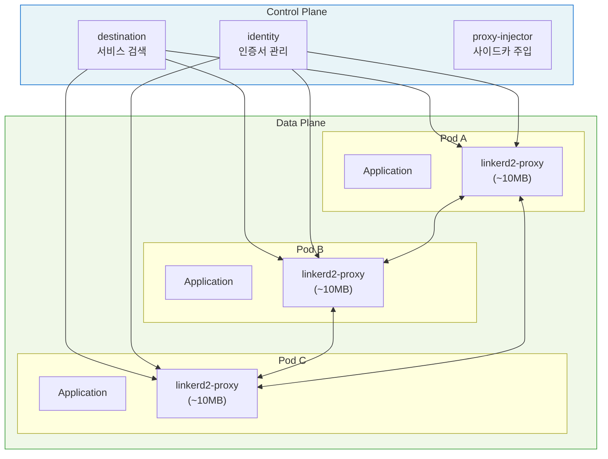
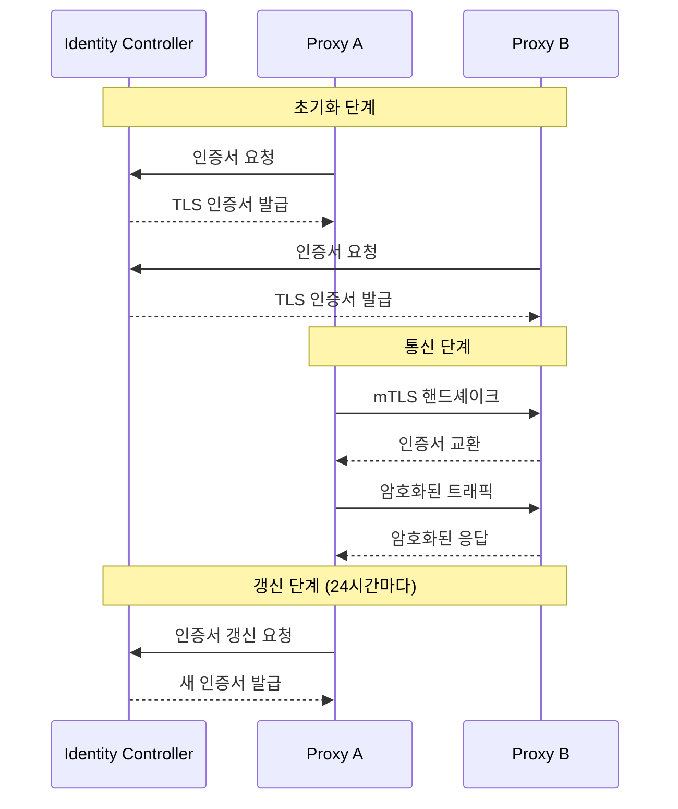
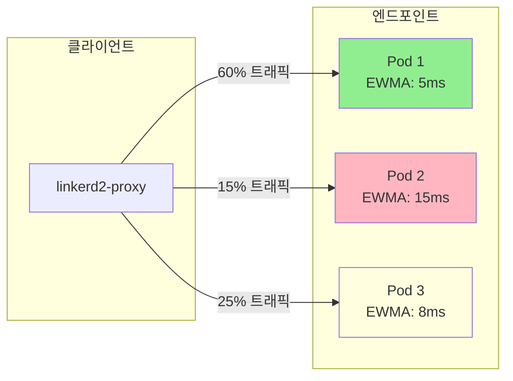
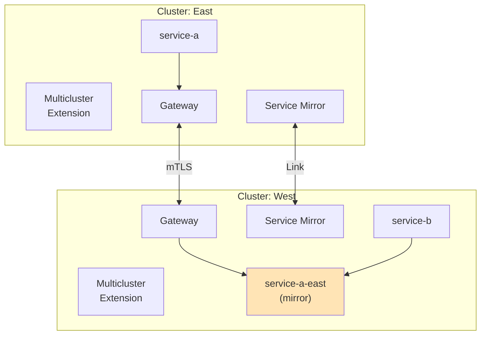

# Linkerd

> **지원 버전**: Linkerd 2.16+
> **마지막 업데이트**: 2025년 11월 24일

Linkerd는 Kubernetes를 위한 경량 서비스 메시로, CNCF graduated 프로젝트입니다. Rust로 작성된 초경량 프록시를 사용하여 최소한의 리소스로 서비스 간 통신의 안정성, 보안 및 가시성을 제공합니다.

## 목차

- [Linkerd 소개](#linkerd-소개)
- [아키텍처](#아키텍처)
- [설치 및 초기 설정](#설치-및-초기-설정)
- [핵심 기능](#핵심-기능)
- [Observability](#observability)
- [Multi-cluster 연결](#multi-cluster-연결)
- [Istio 대비 장단점 비교](#istio-대비-장단점-비교)
- [EKS에서의 Linkerd 배포 가이드](#eks에서의-linkerd-배포-가이드)
- [모범 사례](#모범-사례)

## Linkerd 소개

### 역사와 배경

Linkerd는 2016년 Buoyant에서 처음 개발되었으며, 최초의 서비스 메시 프로젝트입니다. 초기 버전(Linkerd 1.x)은 Scala/JVM 기반이었으나, 2018년 Linkerd 2.0부터 Rust로 완전히 재작성되어 혁신적인 경량화를 달성했습니다.

**주요 이정표:**

| 연도 | 이벤트 |
|------|--------|
| 2016 | Linkerd 1.0 출시 (Scala 기반) |
| 2017 | CNCF 인큐베이팅 프로젝트 승격 |
| 2018 | Linkerd 2.0 발표 (Rust 재작성) |
| 2021 | CNCF Graduated 프로젝트 승격 |
| 2024 | Linkerd 2.16 릴리스 |

### 설계 철학

Linkerd는 다음 원칙을 기반으로 설계되었습니다:

1. **경량성 (Lightweight)**: 프록시당 ~10MB 메모리, 최소 CPU 사용
2. **단순성 (Simplicity)**: 복잡한 설정 없이 즉시 사용 가능
3. **보안 기본 (Secure by Default)**: mTLS가 기본으로 활성화
4. **Kubernetes 네이티브**: Kubernetes에 최적화된 설계

### Istio와의 차별점 개요

| 측면 | Linkerd | Istio |
|------|---------|-------|
| 프록시 | Rust 기반 linkerd2-proxy | Envoy (C++) |
| 리소스 사용 | ~10MB 메모리/프록시 | ~50-100MB 메모리/프록시 |
| 설정 복잡도 | 낮음 | 높음 |
| 기능 범위 | 핵심 기능에 집중 | 포괄적인 기능 제공 |
| 학습 곡선 | 완만함 | 가파름 |

## 아키텍처

Linkerd는 Control Plane과 Data Plane의 두 계층으로 구성됩니다.

### 전체 아키텍처



### Control Plane 컴포넌트

#### destination

서비스 검색을 담당하는 컴포넌트입니다:

- Kubernetes 서비스 정보를 프록시에 제공
- 엔드포인트 변경 사항을 실시간으로 전파
- ServiceProfile 기반 라우팅 정보 관리

#### identity

mTLS를 위한 인증서 관리를 담당합니다:

- 각 프록시에 TLS 인증서 발급
- 인증서 자동 갱신 (24시간 주기)
- SPIFFE 호환 ID 체계 사용

#### proxy-injector

사이드카 프록시 자동 주입을 담당합니다:

- Kubernetes Admission Webhook으로 동작
- `linkerd.io/inject: enabled` 어노테이션 감지
- Init Container와 Proxy Container 자동 추가

### Data Plane: linkerd2-proxy

linkerd2-proxy는 Rust로 작성된 초경량 프록시입니다:

```
┌─────────────────────────────────────────────────────┐
│                    linkerd2-proxy                    │
├─────────────────────────────────────────────────────┤
│  특징:                                               │
│  - 메모리: ~10MB (idle 상태)                         │
│  - 시작 시간: < 1초                                  │
│  - 언어: 100% Rust                                   │
│  - 프로토콜: HTTP/1.1, HTTP/2, gRPC, TCP            │
│  - mTLS: 기본 활성화                                 │
├─────────────────────────────────────────────────────┤
│  기능:                                               │
│  - 자동 프로토콜 감지                                │
│  - EWMA 기반 로드 밸런싱                             │
│  - 재시도 및 타임아웃                                │
│  - 메트릭 수집                                       │
└─────────────────────────────────────────────────────┘
```

## 설치 및 초기 설정

### 사전 요구사항

- Kubernetes 1.24 이상
- kubectl 설치 및 클러스터 접근 권한
- Helm 3.x (Helm 설치 시)

### CLI 설치

#### Linux/macOS

```bash
# 최신 버전 설치
curl --proto '=https' --tlsv1.2 -sSfL https://run.linkerd.io/install | sh

# PATH에 추가
export PATH=$PATH:$HOME/.linkerd2/bin

# 설치 확인
linkerd version
```

#### Homebrew (macOS)

```bash
brew install linkerd
```

### 클러스터 사전 검사

설치 전 클러스터 호환성을 확인합니다:

```bash
# 클러스터 환경 검사
linkerd check --pre

# 예상 출력:
# kubernetes-api
# --------------
# √ can initialize the client
# √ can query the Kubernetes API
#
# kubernetes-version
# ------------------
# √ is running the minimum Kubernetes API version
```

### Linkerd Control Plane 설치

#### CLI를 통한 설치

```bash
# CRD 설치
linkerd install --crds | kubectl apply -f -

# Control Plane 설치
linkerd install | kubectl apply -f -

# 설치 확인
linkerd check
```

#### Helm을 통한 설치

```bash
# Helm 레포지토리 추가
helm repo add linkerd https://helm.linkerd.io/stable
helm repo update

# CRD 설치
helm install linkerd-crds linkerd/linkerd-crds -n linkerd --create-namespace

# Control Plane 설치
helm install linkerd-control-plane linkerd/linkerd-control-plane \
  -n linkerd \
  --set identity.issuer.scheme=kubernetes.io/tls
```

### HA 모드 설정

프로덕션 환경에서는 고가용성(HA) 모드를 권장합니다:

```bash
# HA 모드 설치
linkerd install --ha | kubectl apply -f -
```

HA 모드의 주요 변경사항:

| 컴포넌트 | 기본 | HA |
|----------|------|-----|
| 레플리카 수 | 1 | 3 |
| Pod Anti-Affinity | 없음 | 필수 |
| Resource Requests | 낮음 | 높음 |
| PodDisruptionBudget | 없음 | 설정됨 |

#### Helm HA 값 파일 예시

```yaml
# ha-values.yaml
controllerReplicas: 3

destinationResources: &ha_resources
  requests:
    cpu: 100m
    memory: 128Mi
  limits:
    cpu: 1
    memory: 1Gi

identityResources: *ha_resources
proxyInjectorResources: *ha_resources

podAntiAffinity:
  preferredDuringSchedulingIgnoredDuringExecution:
    - weight: 100
      podAffinityTerm:
        labelSelector:
          matchExpressions:
            - key: linkerd.io/control-plane-component
              operator: In
              values:
                - destination
        topologyKey: topology.kubernetes.io/zone
```

```bash
# HA 값으로 설치
helm install linkerd-control-plane linkerd/linkerd-control-plane \
  -n linkerd \
  -f ha-values.yaml
```

### 설치 검증

```bash
# 전체 검사 수행
linkerd check

# 예상 출력:
# linkerd-existence
# -----------------
# √ 'linkerd-config' config map exists
# √ heartbeat ServiceAccount exist
# √ control plane replica sets are ready
#
# linkerd-config
# --------------
# √ control plane Namespace exists
# √ control plane ClusterRoles exist
# √ control plane ClusterRoleBindings exist
#
# linkerd-identity
# ----------------
# √ certificate config is valid
# √ trust anchors are using supported crypto algorithm
# √ trust anchors are within their validity period
# √ trust anchors are valid for at least 60 days
# √ issuer cert is using supported crypto algorithm
# √ issuer cert is within its validity period
#
# Status check results are √
```

## 핵심 기능

### 자동 mTLS

Linkerd의 가장 강력한 기능 중 하나는 설정 없이 자동으로 활성화되는 mTLS입니다.

#### 작동 방식



#### mTLS 상태 확인

```bash
# 네임스페이스의 mTLS 상태 확인
linkerd edges deployment -n my-namespace

# 특정 서비스 간 mTLS 확인
linkerd viz edges deployment -n my-namespace

# 예상 출력:
# SRC           DST           SRC_NS      DST_NS      SECURED
# web           api           default     default     √
# api           database      default     default     √
```

#### 인증서 관리

```bash
# 현재 인증서 정보 확인
linkerd identity -n linkerd

# Trust Anchor 유효기간 확인
kubectl get cm linkerd-identity-trust-roots -n linkerd -o yaml | \
  grep -A 1 "ca-bundle.crt"

# 인증서 교체 (외부 CA 사용 시)
linkerd install --identity-external-issuer | kubectl apply -f -
```

### 트래픽 분할 (TrafficSplit CRD)

SMI(Service Mesh Interface) 표준의 TrafficSplit을 사용하여 트래픽을 분할합니다.

#### TrafficSplit 구조

```yaml
apiVersion: split.smi-spec.io/v1alpha4
kind: TrafficSplit
metadata:
  name: web-split
  namespace: default
spec:
  # 트래픽을 받을 대상 서비스
  service: web
  backends:
    # Stable 버전으로 90% 트래픽
    - service: web-stable
      weight: 900
    # Canary 버전으로 10% 트래픽
    - service: web-canary
      weight: 100
```

#### Canary 배포 예시

```yaml
# 1. Stable 배포
apiVersion: apps/v1
kind: Deployment
metadata:
  name: web-stable
  namespace: default
spec:
  replicas: 3
  selector:
    matchLabels:
      app: web
      version: stable
  template:
    metadata:
      labels:
        app: web
        version: stable
      annotations:
        linkerd.io/inject: enabled
    spec:
      containers:
        - name: web
          image: my-app:v1.0.0
          ports:
            - containerPort: 8080
---
# 2. Canary 배포
apiVersion: apps/v1
kind: Deployment
metadata:
  name: web-canary
  namespace: default
spec:
  replicas: 1
  selector:
    matchLabels:
      app: web
      version: canary
  template:
    metadata:
      labels:
        app: web
        version: canary
      annotations:
        linkerd.io/inject: enabled
    spec:
      containers:
        - name: web
          image: my-app:v1.1.0
          ports:
            - containerPort: 8080
---
# 3. 서비스 정의
apiVersion: v1
kind: Service
metadata:
  name: web
spec:
  selector:
    app: web
  ports:
    - port: 80
      targetPort: 8080
---
apiVersion: v1
kind: Service
metadata:
  name: web-stable
spec:
  selector:
    app: web
    version: stable
  ports:
    - port: 80
      targetPort: 8080
---
apiVersion: v1
kind: Service
metadata:
  name: web-canary
spec:
  selector:
    app: web
    version: canary
  ports:
    - port: 80
      targetPort: 8080
---
# 4. TrafficSplit
apiVersion: split.smi-spec.io/v1alpha4
kind: TrafficSplit
metadata:
  name: web-split
spec:
  service: web
  backends:
    - service: web-stable
      weight: 900
    - service: web-canary
      weight: 100
```

#### 점진적 트래픽 전환

```bash
# 트래픽 비율 점진적 변경 스크립트
#!/bin/bash

for canary_weight in 10 25 50 75 100; do
  stable_weight=$((100 - canary_weight))

  cat <<EOF | kubectl apply -f -
apiVersion: split.smi-spec.io/v1alpha4
kind: TrafficSplit
metadata:
  name: web-split
spec:
  service: web
  backends:
    - service: web-stable
      weight: ${stable_weight}0
    - service: web-canary
      weight: ${canary_weight}0
EOF

  echo "Canary: ${canary_weight}%, Stable: ${stable_weight}%"
  sleep 60  # 1분 대기 후 다음 단계
done
```

### 재시도 및 타임아웃 (ServiceProfile)

ServiceProfile CRD를 통해 라우트별 재시도와 타임아웃을 설정합니다.

#### ServiceProfile 구조

```yaml
apiVersion: linkerd.io/v1alpha2
kind: ServiceProfile
metadata:
  name: web.default.svc.cluster.local
  namespace: default
spec:
  routes:
    # GET /api/users - 읽기 요청은 재시도 허용
    - name: GET /api/users
      condition:
        method: GET
        pathRegex: /api/users
      timeout: 5s
      isRetryable: true

    # POST /api/users - 쓰기 요청은 재시도 비허용
    - name: POST /api/users
      condition:
        method: POST
        pathRegex: /api/users
      timeout: 10s
      isRetryable: false

    # GET /api/users/{id} - 경로 파라미터 포함
    - name: GET /api/users/{id}
      condition:
        method: GET
        pathRegex: /api/users/[^/]+
      timeout: 3s
      isRetryable: true

  # 재시도 예산 설정
  retryBudget:
    # 재시도는 최대 20%까지만 허용
    retryRatio: 0.2
    # 초당 최소 10회 재시도 허용
    minRetriesPerSecond: 10
    # 5초 동안의 요청을 기준으로 계산
    ttl: 5s
```

#### ServiceProfile 자동 생성

```bash
# Swagger/OpenAPI 스펙에서 자동 생성
linkerd profile --open-api swagger.yaml web > web-profile.yaml

# 현재 트래픽 기반 자동 생성 (tap 사용)
linkerd profile --tap deploy/web --tap-duration 30s web > web-profile.yaml

# 적용
kubectl apply -f web-profile.yaml
```

#### 재시도 예산 작동 방식

```
┌────────────────────────────────────────────────────────────┐
│                     재시도 예산 (Retry Budget)              │
├────────────────────────────────────────────────────────────┤
│                                                            │
│  retryRatio: 0.2 (20%)                                    │
│  ├── 100 요청 중 최대 20회 재시도 허용                      │
│  └── 초과 시 재시도 중단 (서비스 보호)                      │
│                                                            │
│  minRetriesPerSecond: 10                                   │
│  ├── 트래픽이 적을 때도 최소 재시도 보장                    │
│  └── 저트래픽 서비스의 일시적 장애 대응                     │
│                                                            │
│  ttl: 5s                                                   │
│  └── 5초 윈도우에서 비율 계산                              │
│                                                            │
└────────────────────────────────────────────────────────────┘
```

### 로드 밸런싱 (EWMA)

Linkerd는 EWMA(Exponentially Weighted Moving Average) 알고리즘을 사용하여 지연 시간 기반 로드 밸런싱을 수행합니다.

#### EWMA 알고리즘

```
EWMA = α × 현재_지연시간 + (1 - α) × 이전_EWMA

여기서 α (알파)는 가중치 계수:
- α가 높으면: 최근 지연시간에 더 민감
- α가 낮으면: 히스토리에 더 가중치
```

#### 작동 방식



#### 기존 라운드 로빈과의 비교

| 특성 | 라운드 로빈 | EWMA |
|------|------------|------|
| 트래픽 분배 | 균등 | 지연시간 기반 |
| 느린 Pod 처리 | 동일한 트래픽 | 트래픽 감소 |
| 핫스팟 방지 | 제한적 | 자동 |
| 콜드 스타트 | 문제 없음 | 초기 가중치 높음 |

## Observability

### Viz 확장 설치

Linkerd Viz는 대시보드와 관찰성 도구를 제공하는 확장입니다.

```bash
# Viz 확장 설치
linkerd viz install | kubectl apply -f -

# 설치 확인
linkerd viz check

# 대시보드 열기
linkerd viz dashboard &
```

### Viz 대시보드

대시보드에서 제공하는 정보:

- **Namespace 개요**: 메시화된 워크로드 상태
- **Deployment 상세**: 성공률, RPS, 지연시간
- **Pod 상태**: 개별 Pod의 메트릭
- **서비스 토폴로지**: 서비스 간 연결 관계

### Prometheus 연동

#### 내장 Prometheus 사용

```bash
# Viz에 포함된 Prometheus에 접근
kubectl port-forward -n linkerd-viz svc/prometheus 9090:9090

# 메트릭 쿼리 예시
# 요청 성공률
sum(rate(request_total{classification="success"}[1m])) by (deployment) /
sum(rate(request_total[1m])) by (deployment)
```

#### 외부 Prometheus 연동

```yaml
# prometheus-additional.yaml
apiVersion: v1
kind: ConfigMap
metadata:
  name: prometheus-config
  namespace: monitoring
data:
  prometheus.yml: |
    scrape_configs:
      - job_name: 'linkerd-proxy'
        kubernetes_sd_configs:
          - role: pod
        relabel_configs:
          - source_labels: [__meta_kubernetes_pod_container_name]
            action: keep
            regex: linkerd-proxy
          - source_labels: [__meta_kubernetes_pod_annotation_linkerd_io_proxy_admin_port]
            action: keep
            regex: \d+
          - source_labels: [__address__, __meta_kubernetes_pod_annotation_linkerd_io_proxy_admin_port]
            action: replace
            regex: ([^:]+)(?::\d+)?;(\d+)
            replacement: $1:$2
            target_label: __address__
          - action: labelmap
            regex: __meta_kubernetes_pod_label_(.+)
```

### Tap/Top 명령

실시간 트래픽을 검사하는 강력한 디버깅 도구입니다.

#### linkerd tap

```bash
# Deployment의 모든 트래픽 감시
linkerd viz tap deploy/web -n default

# 특정 경로만 필터링
linkerd viz tap deploy/web -n default --path /api/users

# 실패한 요청만 확인
linkerd viz tap deploy/web -n default | grep -E "status:[45]"

# 출력 예시:
# req id=0:0 proxy=in  src=10.0.0.1:54312 dst=10.0.0.2:8080 tls=true :method=GET :path=/api/users
# rsp id=0:0 proxy=in  src=10.0.0.1:54312 dst=10.0.0.2:8080 tls=true :status=200 latency=12ms
```

#### linkerd top

```bash
# 가장 많은 트래픽을 받는 라우트 확인
linkerd viz top deploy/web -n default

# 예상 출력:
# Source        Destination   Method  Path           Count  Best   Worst  Last   Success
# web-abc123    api-def456    GET     /api/users     1523   2ms    150ms  5ms    99.87%
# web-abc123    api-def456    POST    /api/users     234    5ms    200ms  10ms   98.29%
```

### Grafana 대시보드

Linkerd Viz에는 사전 구성된 Grafana 대시보드가 포함되어 있습니다.

```bash
# Grafana 접근
kubectl port-forward -n linkerd-viz svc/grafana 3000:3000
```

#### 제공되는 대시보드

| 대시보드 | 설명 |
|----------|------|
| Top Line | 전체 메시 개요 |
| Deployment | Deployment별 상세 메트릭 |
| Pod | Pod별 상세 메트릭 |
| Service | 서비스별 수신/발신 트래픽 |
| Route | 라우트별 지연시간, 성공률 |
| Authority | 외부 서비스 연결 상태 |
| Cronjob | CronJob 워크로드 모니터링 |
| Health | Control Plane 상태 |

#### Golden Metrics

```
┌─────────────────────────────────────────────────────────────┐
│                    Linkerd Golden Metrics                    │
├─────────────────────────────────────────────────────────────┤
│                                                             │
│  1. Request Rate (RPS)                                      │
│     - 초당 요청 수                                           │
│     - 쿼리: sum(rate(request_total[1m])) by (deployment)    │
│                                                             │
│  2. Success Rate (%)                                        │
│     - 성공 요청 비율                                         │
│     - 쿼리: success_total / request_total                   │
│                                                             │
│  3. Latency (P50, P95, P99)                                │
│     - 요청 지연시간 분포                                     │
│     - 쿼리: histogram_quantile(0.99, response_latency)     │
│                                                             │
└─────────────────────────────────────────────────────────────┘
```

## Multi-cluster 연결

Linkerd Multi-cluster를 사용하면 여러 Kubernetes 클러스터 간에 서비스를 연결할 수 있습니다.

### 아키텍처 개요



### Service Mirror 컨트롤러

Service Mirror는 원격 클러스터의 서비스를 로컬에 미러링합니다:

```
원격 클러스터 (East)          로컬 클러스터 (West)
┌─────────────────┐          ┌─────────────────────┐
│  service-a      │  ──────> │  service-a-east     │
│  (실제 서비스)   │  Mirror  │  (미러 서비스)       │
└─────────────────┘          └─────────────────────┘
                                      │
                                      ▼
                             ┌─────────────────────┐
                             │  service-b          │
                             │  (로컬 서비스)       │
                             │  service-a-east 호출│
                             └─────────────────────┘
```

### Multi-cluster 설정

#### 1. Multi-cluster 확장 설치

```bash
# 양쪽 클러스터에 설치
for ctx in east west; do
  linkerd --context=${ctx} multicluster install | kubectl --context=${ctx} apply -f -
done
```

#### 2. Gateway 설정

```bash
# 게이트웨이 설치 확인
for ctx in east west; do
  echo "Cluster: ${ctx}"
  linkerd --context=${ctx} multicluster gateways
done
```

#### 3. 클러스터 연결 (Link)

```bash
# East 클러스터의 자격 증명을 West에 연결
linkerd --context=east multicluster link --cluster-name east | \
  kubectl --context=west apply -f -

# 연결 확인
linkerd --context=west multicluster check
```

#### 4. 서비스 내보내기

```bash
# East 클러스터에서 서비스 내보내기
kubectl --context=east label svc/service-a mirror.linkerd.io/exported=true

# West에서 미러 서비스 확인
kubectl --context=west get svc -l mirror.linkerd.io/cluster-name=east
```

### 교차 클러스터 통신

```yaml
# West 클러스터에서 East의 서비스 호출
apiVersion: apps/v1
kind: Deployment
metadata:
  name: client
  namespace: default
spec:
  template:
    spec:
      containers:
        - name: client
          image: curlimages/curl
          command:
            - sh
            - -c
            - |
              while true; do
                # East 클러스터의 service-a 호출
                curl http://service-a-east.default.svc.cluster.local:8080
                sleep 5
              done
```

## Istio 대비 장단점 비교

### 상세 비교표

| 항목 | Linkerd | Istio |
|------|---------|-------|
| **리소스 사용** | | |
| 프록시 메모리 | ~10MB | ~50-100MB |
| 프록시 CPU | 매우 낮음 | 중간 |
| Control Plane 크기 | 최소 | 큼 |
| **복잡성** | | |
| 설치 난이도 | 쉬움 (2개 명령어) | 중간-어려움 |
| CRD 수 | ~10개 | ~50개 이상 |
| 설정 복잡도 | 낮음 | 높음 |
| **기능 범위** | | |
| 트래픽 관리 | 기본 (SMI) | 고급 (VirtualService) |
| mTLS | 자동 (기본) | 자동 (설정 필요) |
| 관찰성 | 기본 내장 | Kiali, Jaeger 통합 |
| 정책 | ServiceProfile | AuthorizationPolicy |
| **성능** | | |
| 지연시간 추가 | ~1ms | ~3-5ms |
| 처리량 영향 | 최소 | 중간 |
| 시작 시간 | 빠름 | 중간 |
| **커뮤니티** | | |
| CNCF 상태 | Graduated | Graduated |
| 기업 지원 | Buoyant | Google, IBM, Solo.io |
| 생태계 | 집중됨 | 광범위함 |
| **학습 곡선** | | |
| 초기 학습 | 1-2일 | 1-2주 |
| 고급 기능 | 3-5일 | 2-4주 |
| **적합한 사용 사례** | | |
| | 리소스 제약 환경 | 복잡한 트래픽 요구 |
| | 빠른 도입 필요 | 세밀한 정책 제어 |
| | Kubernetes 전용 | 멀티 플랫폼 |

### 선택 가이드

```
┌──────────────────────────────────────────────────────────────────┐
│                      서비스 메시 선택 가이드                       │
├──────────────────────────────────────────────────────────────────┤
│                                                                  │
│  Linkerd를 선택하는 경우:                                         │
│  ✓ 리소스가 제한된 환경 (엣지, IoT)                               │
│  ✓ 빠른 도입과 낮은 운영 부담이 필요                              │
│  ✓ mTLS와 기본 트래픽 관리로 충분                                 │
│  ✓ Kubernetes만 사용                                             │
│  ✓ 작은 팀에서 운영                                              │
│                                                                  │
│  Istio를 선택하는 경우:                                           │
│  ✓ 복잡한 트래픽 라우팅 규칙 필요                                 │
│  ✓ 세밀한 보안 정책 제어 필요                                     │
│  ✓ VM과 Kubernetes 혼합 환경                                     │
│  ✓ 다양한 통합 (Kiali, Jaeger, Prometheus)                       │
│  ✓ 대규모 전담 플랫폼 팀 존재                                     │
│                                                                  │
└──────────────────────────────────────────────────────────────────┘
```

## EKS에서의 Linkerd 배포 가이드

### 사전 준비

#### EKS 클러스터 요구사항

- EKS 버전: 1.24 이상
- 노드 타입: AMD64 또는 ARM64
- CNI: Amazon VPC CNI (기본) 또는 Cilium

#### IAM 설정

Linkerd는 기본적으로 특별한 IAM 권한이 필요하지 않습니다. 단, 외부 인증서 관리를 사용할 경우:

```yaml
# cert-manager와 AWS PCA 연동 시 필요한 IRSA 설정
apiVersion: v1
kind: ServiceAccount
metadata:
  name: cert-manager
  namespace: cert-manager
  annotations:
    eks.amazonaws.com/role-arn: arn:aws:iam::ACCOUNT_ID:role/CertManagerRole
```

### NLB 연동

Linkerd Gateway를 외부에 노출할 때 Network Load Balancer를 사용합니다:

```yaml
# linkerd-gateway-nlb.yaml
apiVersion: v1
kind: Service
metadata:
  name: linkerd-gateway
  namespace: linkerd-multicluster
  annotations:
    service.beta.kubernetes.io/aws-load-balancer-type: "nlb"
    service.beta.kubernetes.io/aws-load-balancer-scheme: "internet-facing"
    service.beta.kubernetes.io/aws-load-balancer-cross-zone-load-balancing-enabled: "true"
    service.beta.kubernetes.io/aws-load-balancer-backend-protocol: "tcp"
spec:
  type: LoadBalancer
  ports:
    - name: mc-gateway
      port: 4143
      targetPort: 4143
  selector:
    app: linkerd-gateway
```

### Karpenter 호환성

Karpenter와 함께 사용할 때 고려사항:

```yaml
# NodePool 설정 예시
apiVersion: karpenter.sh/v1
kind: NodePool
metadata:
  name: linkerd-nodes
spec:
  template:
    spec:
      requirements:
        - key: kubernetes.io/arch
          operator: In
          values: ["amd64", "arm64"]
        - key: karpenter.sh/capacity-type
          operator: In
          values: ["on-demand"]
      taints: []
  disruption:
    # Linkerd Control Plane Pod가 있는 노드는 신중하게 정리
    consolidationPolicy: WhenEmpty
    consolidateAfter: 30m
```

#### Pod Disruption Budget 설정

```yaml
# HA 모드에서 PDB 확인
apiVersion: policy/v1
kind: PodDisruptionBudget
metadata:
  name: linkerd-destination
  namespace: linkerd
spec:
  minAvailable: 1
  selector:
    matchLabels:
      linkerd.io/control-plane-component: destination
```

### 가용 영역 고려사항

#### Control Plane 분산 배치

```yaml
# HA 설치 시 Zone 분산을 위한 topology spread
apiVersion: apps/v1
kind: Deployment
metadata:
  name: linkerd-destination
  namespace: linkerd
spec:
  template:
    spec:
      topologySpreadConstraints:
        - maxSkew: 1
          topologyKey: topology.kubernetes.io/zone
          whenUnsatisfiable: DoNotSchedule
          labelSelector:
            matchLabels:
              linkerd.io/control-plane-component: destination
```

#### Multi-cluster Gateway Zone 인식

```yaml
# Gateway를 여러 Zone에 배포
apiVersion: apps/v1
kind: Deployment
metadata:
  name: linkerd-gateway
  namespace: linkerd-multicluster
spec:
  replicas: 3
  template:
    spec:
      topologySpreadConstraints:
        - maxSkew: 1
          topologyKey: topology.kubernetes.io/zone
          whenUnsatisfiable: ScheduleAnyway
          labelSelector:
            matchLabels:
              app: linkerd-gateway
      affinity:
        podAntiAffinity:
          preferredDuringSchedulingIgnoredDuringExecution:
            - weight: 100
              podAffinityTerm:
                labelSelector:
                  matchLabels:
                    app: linkerd-gateway
                topologyKey: topology.kubernetes.io/zone
```

### EKS 전용 Helm 값

```yaml
# eks-values.yaml
identity:
  issuer:
    scheme: kubernetes.io/tls

# 리소스 설정 (EKS 노드 크기에 맞춤)
destinationResources:
  requests:
    cpu: 100m
    memory: 128Mi
  limits:
    cpu: 1
    memory: 512Mi

# Pod Security Standards 준수
podSecurityPolicy:
  enabled: false

# ARM64 지원
proxy:
  image:
    version: stable-2.16.0

# 프록시 리소스 (애플리케이션 크기에 따라 조정)
proxyResources:
  requests:
    cpu: 10m
    memory: 20Mi
  limits:
    cpu: 500m
    memory: 256Mi
```

```bash
# EKS에 설치
helm install linkerd-control-plane linkerd/linkerd-control-plane \
  -n linkerd \
  -f eks-values.yaml
```

## 모범 사례

### 점진적 롤아웃 전략

#### 1단계: 비프로덕션 환경 테스트

```bash
# Dev/Staging 네임스페이스에 먼저 적용
kubectl annotate namespace dev linkerd.io/inject=enabled

# 특정 배포만 메시화
kubectl patch deployment web -n dev -p '
{
  "spec": {
    "template": {
      "metadata": {
        "annotations": {
          "linkerd.io/inject": "enabled"
        }
      }
    }
  }
}'
```

#### 2단계: 프로덕션 점진적 확장

```bash
# 중요도가 낮은 서비스부터 시작
kubectl annotate namespace staging linkerd.io/inject=enabled

# 메트릭 모니터링 후 확장
linkerd viz stat deploy -n staging

# 문제 없으면 프로덕션 적용
kubectl annotate namespace production linkerd.io/inject=enabled
```

#### 3단계: 전체 메시화

```bash
# 클러스터 전체 기본값 설정 (새 네임스페이스 자동 적용)
kubectl label namespace kube-system config.linkerd.io/proxy-default=enabled
```

### 모니터링 권장사항

#### 필수 알림 설정

```yaml
# prometheus-rules.yaml
apiVersion: monitoring.coreos.com/v1
kind: PrometheusRule
metadata:
  name: linkerd-alerts
  namespace: linkerd-viz
spec:
  groups:
    - name: linkerd.rules
      rules:
        # 성공률 저하 알림
        - alert: LinkerdSuccessRateLow
          expr: |
            sum(rate(request_total{classification="success"}[5m])) by (deployment, namespace)
            /
            sum(rate(request_total[5m])) by (deployment, namespace)
            < 0.95
          for: 5m
          labels:
            severity: warning
          annotations:
            summary: "Linkerd success rate below 95%"
            description: "{{ $labels.namespace }}/{{ $labels.deployment }} success rate is {{ $value | humanizePercentage }}"

        # P99 지연시간 알림
        - alert: LinkerdHighLatency
          expr: |
            histogram_quantile(0.99,
              sum(rate(response_latency_ms_bucket[5m])) by (le, deployment, namespace)
            ) > 1000
          for: 5m
          labels:
            severity: warning
          annotations:
            summary: "Linkerd P99 latency above 1s"
            description: "{{ $labels.namespace }}/{{ $labels.deployment }} P99 latency is {{ $value }}ms"

        # Control Plane 상태 알림
        - alert: LinkerdControlPlaneDown
          expr: |
            sum(up{job="linkerd-controller"}) == 0
          for: 1m
          labels:
            severity: critical
          annotations:
            summary: "Linkerd Control Plane is down"
```

### 업그레이드 전략

#### CLI 업그레이드

```bash
# 현재 버전 확인
linkerd version

# 새 CLI 다운로드
curl --proto '=https' --tlsv1.2 -sSfL https://run.linkerd.io/install | sh

# 업그레이드 전 검사
linkerd check --pre

# Control Plane 업그레이드
linkerd upgrade | kubectl apply -f -

# Data Plane 롤링 업그레이드
kubectl rollout restart deploy -n my-namespace

# 업그레이드 검증
linkerd check
```

#### Helm 업그레이드

```bash
# 차트 업데이트
helm repo update

# 업그레이드 시뮬레이션
helm upgrade linkerd-control-plane linkerd/linkerd-control-plane \
  -n linkerd \
  --dry-run

# 실제 업그레이드
helm upgrade linkerd-control-plane linkerd/linkerd-control-plane \
  -n linkerd \
  -f eks-values.yaml

# Data Plane 재시작
kubectl rollout restart deploy --all -n my-namespace
```

### 트러블슈팅

#### 일반적인 문제 해결

```bash
# Control Plane 상태 확인
linkerd check

# 프록시 상태 확인
linkerd viz stat deploy -n my-namespace

# 프록시 로그 확인
kubectl logs deploy/my-app -c linkerd-proxy -n my-namespace

# 인증서 문제 디버깅
linkerd identity -n linkerd

# 네트워크 연결 테스트
linkerd viz tap deploy/my-app -n my-namespace
```

#### 자주 발생하는 오류와 해결책

| 오류 | 원인 | 해결책 |
|------|------|--------|
| `certificate has expired` | Trust Anchor 만료 | 인증서 갱신 |
| `connection refused` | 프록시 미주입 | 어노테이션 확인 |
| `no endpoints available` | 서비스 검색 실패 | destination 로그 확인 |
| `context deadline exceeded` | 타임아웃 | ServiceProfile 조정 |

### 보안 강화

#### Trust Anchor 외부 관리

```bash
# cert-manager로 Trust Anchor 관리
kubectl apply -f - <<EOF
apiVersion: cert-manager.io/v1
kind: Certificate
metadata:
  name: linkerd-trust-anchor
  namespace: linkerd
spec:
  isCA: true
  commonName: root.linkerd.cluster.local
  secretName: linkerd-trust-anchor
  privateKey:
    algorithm: ECDSA
    size: 256
  issuerRef:
    name: self-signed-issuer
    kind: ClusterIssuer
    group: cert-manager.io
EOF
```

#### 네트워크 정책

```yaml
# Control Plane 보호
apiVersion: networking.k8s.io/v1
kind: NetworkPolicy
metadata:
  name: linkerd-control-plane
  namespace: linkerd
spec:
  podSelector:
    matchLabels:
      linkerd.io/control-plane-ns: linkerd
  policyTypes:
    - Ingress
    - Egress
  ingress:
    - from:
        - namespaceSelector: {}
      ports:
        - protocol: TCP
          port: 8085  # destination
        - protocol: TCP
          port: 8080  # identity
  egress:
    - to:
        - namespaceSelector: {}
```

## 결론

Linkerd는 Kubernetes 환경에서 서비스 메시를 도입하려는 팀에게 훌륭한 선택입니다. 특히:

- **리소스 효율성**: 최소한의 오버헤드로 메시 기능 제공
- **운영 단순성**: 설정과 관리가 간단
- **보안 기본**: mTLS가 기본으로 활성화되어 즉시 보안 강화
- **빠른 도입**: 짧은 학습 곡선으로 빠른 생산성

복잡한 트래픽 관리가 필요하거나 VM 환경을 포함한 하이브리드 환경에서는 Istio가 더 적합할 수 있지만, 대부분의 Kubernetes 워크로드에서 Linkerd는 충분한 기능을 제공하면서도 운영 부담을 최소화합니다.

## 참고 자료

- [Linkerd 공식 문서](https://linkerd.io/docs/)
- [Linkerd GitHub](https://github.com/linkerd/linkerd2)
- [SMI 스펙](https://smi-spec.io/)
- [Buoyant 블로그](https://buoyant.io/blog)
- [CNCF Linkerd 페이지](https://www.cncf.io/projects/linkerd/)
