# Cilium Service Mesh

> **지원 버전**: Cilium 1.16+
> **마지막 업데이트**: 2025년 11월 24일

Cilium Service Mesh는 eBPF 기반의 사이드카 없는(sidecar-less) 서비스 메시 솔루션으로, Kubernetes 네트워킹과 서비스 메시를 단일 플랫폼에서 통합합니다. 기존의 사이드카 프록시 방식과 달리, Cilium은 Linux 커널의 eBPF 기술을 활용하여 더 높은 성능과 낮은 리소스 오버헤드를 제공합니다.

## 목차

- [Cilium Service Mesh 소개](#cilium-service-mesh-소개)
- [아키텍처](#아키텍처)
- [L7 트래픽 관리](#l7-트래픽-관리)
- [mTLS](#mtls)
- [Observability](#observability)
- [Ingress Controller](#ingress-controller)
- [Istio 대비 장단점](#istio-대비-장단점)
- [EKS에서의 Cilium Service Mesh 배포](#eks에서의-cilium-service-mesh-배포)
- [Cilium CNI 문서 크로스 레퍼런스](#cilium-cni-문서-크로스-레퍼런스)
- [모범 사례](#모범-사례)

## Cilium Service Mesh 소개

### Sidecar-less 아키텍처의 필요성

전통적인 서비스 메시 솔루션(예: Istio, Linkerd)은 각 Pod에 사이드카 프록시(Envoy)를 주입하여 트래픽을 관리합니다. 이 방식은 다음과 같은 문제점을 가지고 있습니다:

- **리소스 오버헤드**: 각 Pod마다 추가 컨테이너가 필요하여 메모리와 CPU 소비 증가
- **지연 시간**: 모든 트래픽이 사용자 공간 프록시를 통과하여 추가 지연 발생
- **복잡성**: 사이드카 주입, 업그레이드, 디버깅의 운영 복잡성
- **확장성 제한**: 대규모 클러스터에서 수천 개의 사이드카 관리 부담

### eBPF 기반 서비스 메시

Cilium Service Mesh는 eBPF를 활용하여 이러한 문제를 해결합니다:

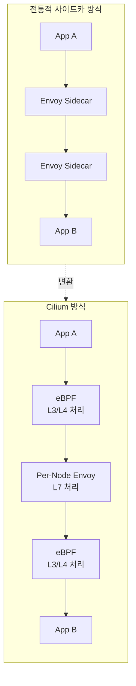

**핵심 특징:**

- **커널 레벨 처리**: L3/L4 트래픽은 eBPF를 통해 커널에서 직접 처리
- **선택적 L7 처리**: L7 기능이 필요한 경우에만 Envoy 프록시 사용
- **Per-Node 프록시**: 각 노드당 하나의 Envoy 인스턴스로 리소스 효율성 극대화
- **CNI 통합**: 기존 Cilium CNI와 완벽하게 통합

### Cilium CNI에서 Service Mesh로의 진화

Cilium은 단순한 CNI 플러그인에서 시작하여 완전한 서비스 메시 플랫폼으로 진화했습니다:

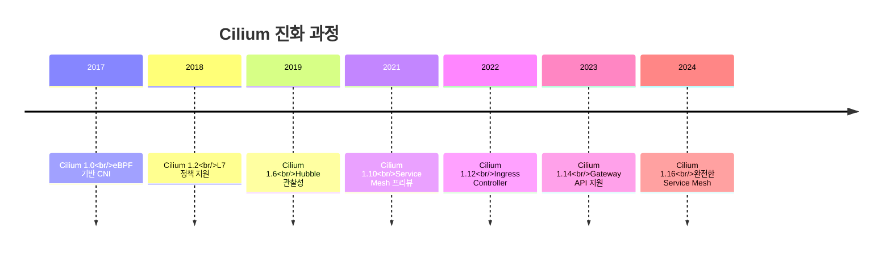

## 아키텍처

### eBPF Datapath for L3/L4 Processing

Cilium Service Mesh의 핵심은 eBPF 기반 데이터 경로입니다. L3/L4 레벨의 트래픽은 커널 공간에서 직접 처리됩니다:

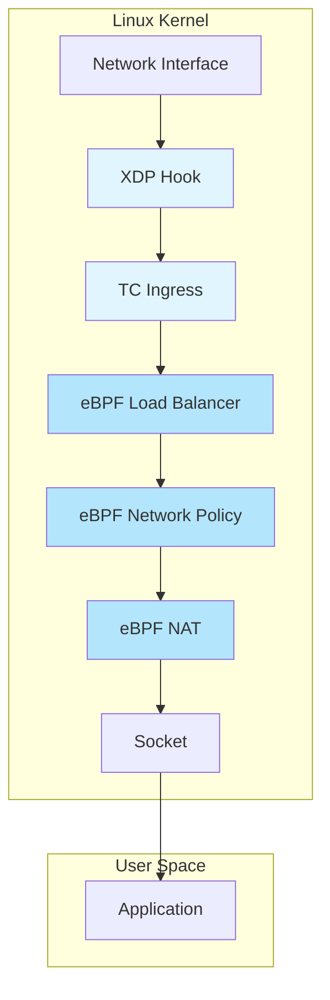

**eBPF 프로그램 유형:**

| 프로그램 유형 | 위치 | 기능 |
|-------------|------|------|
| XDP | 네트워크 드라이버 | 초고속 패킷 필터링 및 리다이렉션 |
| TC (Traffic Control) | 커널 네트워크 스택 | 패킷 수정, 정책 적용 |
| Socket Operations | 소켓 레벨 | 연결 추적, 소켓 레벨 로드 밸런싱 |
| Cgroup | 프로세스 그룹 | 리소스 제어, 네트워크 정책 |

### Envoy Integration for L7 Processing

L7(HTTP, gRPC, Kafka 등) 기능이 필요한 경우, Cilium은 Per-Node Envoy 프록시를 사용합니다:

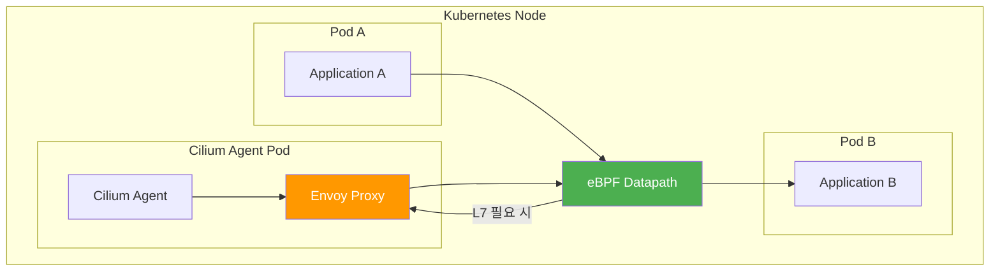

### Per-Node Proxy vs Traditional Sidecar Model

**리소스 비교:**

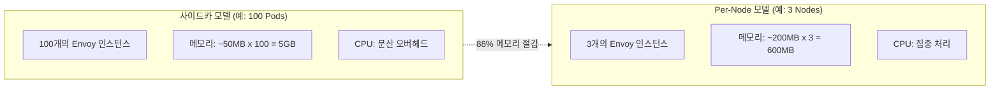

### CiliumEnvoyConfig CRD

Cilium Service Mesh는 `CiliumEnvoyConfig` CRD를 통해 Envoy 설정을 관리합니다:

```yaml
apiVersion: cilium.io/v2
kind: CiliumEnvoyConfig
metadata:
  name: envoy-lb-listener
  namespace: default
spec:
  services:
    - name: my-service
      namespace: default
  backendServices:
    - name: backend-v1
      namespace: default
    - name: backend-v2
      namespace: default
  resources:
    - "@type": type.googleapis.com/envoy.config.listener.v3.Listener
      name: envoy-lb-listener
      filter_chains:
        - filters:
            - name: envoy.filters.network.http_connection_manager
              typed_config:
                "@type": type.googleapis.com/envoy.extensions.filters.network.http_connection_manager.v3.HttpConnectionManager
                stat_prefix: envoy-lb-listener
                rds:
                  route_config_name: lb_route
                http_filters:
                  - name: envoy.filters.http.router
                    typed_config:
                      "@type": type.googleapis.com/envoy.extensions.filters.http.router.v3.Router
```

### 상세 아키텍처 다이어그램

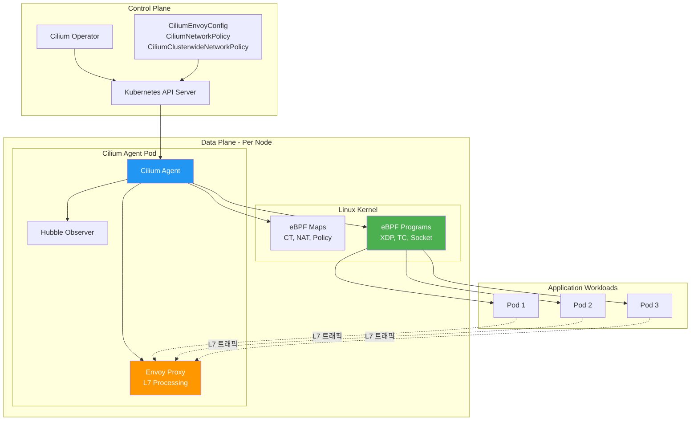

## L7 트래픽 관리

### CiliumEnvoyConfig

#### 설정 구조

CiliumEnvoyConfig는 Envoy의 xDS API를 직접 노출하여 고급 L7 트래픽 제어를 가능하게 합니다:

```yaml
apiVersion: cilium.io/v2
kind: CiliumEnvoyConfig
metadata:
  name: http-filter-config
  namespace: default
spec:
  # 프론트엔드 서비스 (트래픽 수신)
  services:
    - name: frontend-service
      namespace: default
      ports:
        - 80

  # 백엔드 서비스 (트래픽 전달 대상)
  backendServices:
    - name: backend-v1
      namespace: default
    - name: backend-v2
      namespace: default

  # Envoy 리소스 정의
  resources:
    - "@type": type.googleapis.com/envoy.config.listener.v3.Listener
      name: http-listener
      filter_chains:
        - filters:
            - name: envoy.filters.network.http_connection_manager
              typed_config:
                "@type": type.googleapis.com/envoy.extensions.filters.network.http_connection_manager.v3.HttpConnectionManager
                stat_prefix: ingress_http
                codec_type: AUTO
                route_config:
                  name: local_route
                  virtual_hosts:
                    - name: backend
                      domains: ["*"]
                      routes:
                        - match:
                            prefix: "/"
                          route:
                            cluster: backend-cluster
                http_filters:
                  - name: envoy.filters.http.router
                    typed_config:
                      "@type": type.googleapis.com/envoy.extensions.filters.http.router.v3.Router
```

#### Filter Chain 설정

```yaml
apiVersion: cilium.io/v2
kind: CiliumEnvoyConfig
metadata:
  name: advanced-filter-chain
spec:
  services:
    - name: api-gateway
      namespace: default
  resources:
    - "@type": type.googleapis.com/envoy.config.listener.v3.Listener
      name: api-listener
      filter_chains:
        - filter_chain_match:
            destination_port: 8080
          filters:
            - name: envoy.filters.network.http_connection_manager
              typed_config:
                "@type": type.googleapis.com/envoy.extensions.filters.network.http_connection_manager.v3.HttpConnectionManager
                stat_prefix: api_http
                http_filters:
                  # Rate Limiting Filter
                  - name: envoy.filters.http.local_ratelimit
                    typed_config:
                      "@type": type.googleapis.com/envoy.extensions.filters.http.local_ratelimit.v3.LocalRateLimit
                      stat_prefix: http_local_rate_limiter
                      token_bucket:
                        max_tokens: 100
                        tokens_per_fill: 100
                        fill_interval: 1s
                  # CORS Filter
                  - name: envoy.filters.http.cors
                    typed_config:
                      "@type": type.googleapis.com/envoy.extensions.filters.http.cors.v3.Cors
                  # Router (항상 마지막)
                  - name: envoy.filters.http.router
                    typed_config:
                      "@type": type.googleapis.com/envoy.extensions.filters.http.router.v3.Router
```

### HTTP/gRPC 라우팅

#### Header 기반 라우팅

```yaml
apiVersion: cilium.io/v2
kind: CiliumEnvoyConfig
metadata:
  name: header-based-routing
spec:
  services:
    - name: api-service
      namespace: default
  backendServices:
    - name: api-v1
      namespace: default
    - name: api-v2
      namespace: default
    - name: api-canary
      namespace: default
  resources:
    - "@type": type.googleapis.com/envoy.config.listener.v3.Listener
      name: api-listener
      filter_chains:
        - filters:
            - name: envoy.filters.network.http_connection_manager
              typed_config:
                "@type": type.googleapis.com/envoy.extensions.filters.network.http_connection_manager.v3.HttpConnectionManager
                stat_prefix: api
                route_config:
                  name: api_routes
                  virtual_hosts:
                    - name: api
                      domains: ["*"]
                      routes:
                        # Canary 테스트 사용자 (특정 헤더)
                        - match:
                            prefix: "/"
                            headers:
                              - name: "x-canary"
                                exact_match: "true"
                          route:
                            cluster: "default/api-canary"
                        # API 버전 헤더 기반 라우팅
                        - match:
                            prefix: "/"
                            headers:
                              - name: "x-api-version"
                                exact_match: "v2"
                          route:
                            cluster: "default/api-v2"
                        # 기본 라우팅
                        - match:
                            prefix: "/"
                          route:
                            cluster: "default/api-v1"
                http_filters:
                  - name: envoy.filters.http.router
                    typed_config:
                      "@type": type.googleapis.com/envoy.extensions.filters.http.router.v3.Router
```

#### Path 기반 라우팅

```yaml
apiVersion: cilium.io/v2
kind: CiliumEnvoyConfig
metadata:
  name: path-based-routing
spec:
  services:
    - name: gateway
      namespace: default
  backendServices:
    - name: users-service
      namespace: default
    - name: orders-service
      namespace: default
    - name: products-service
      namespace: default
  resources:
    - "@type": type.googleapis.com/envoy.config.listener.v3.Listener
      name: gateway-listener
      filter_chains:
        - filters:
            - name: envoy.filters.network.http_connection_manager
              typed_config:
                "@type": type.googleapis.com/envoy.extensions.filters.network.http_connection_manager.v3.HttpConnectionManager
                stat_prefix: gateway
                route_config:
                  name: gateway_routes
                  virtual_hosts:
                    - name: api
                      domains: ["api.example.com"]
                      routes:
                        # 사용자 API
                        - match:
                            prefix: "/api/v1/users"
                          route:
                            cluster: "default/users-service"
                            prefix_rewrite: "/"
                        # 주문 API
                        - match:
                            prefix: "/api/v1/orders"
                          route:
                            cluster: "default/orders-service"
                            prefix_rewrite: "/"
                        # 상품 API (정규식 매칭)
                        - match:
                            safe_regex:
                              google_re2: {}
                              regex: "^/api/v[12]/products.*"
                          route:
                            cluster: "default/products-service"
                http_filters:
                  - name: envoy.filters.http.router
                    typed_config:
                      "@type": type.googleapis.com/envoy.extensions.filters.http.router.v3.Router
```

### 트래픽 분할

#### Weighted 라우팅

```yaml
apiVersion: cilium.io/v2
kind: CiliumEnvoyConfig
metadata:
  name: weighted-routing
spec:
  services:
    - name: frontend
      namespace: default
  backendServices:
    - name: backend-v1
      namespace: default
    - name: backend-v2
      namespace: default
  resources:
    - "@type": type.googleapis.com/envoy.config.listener.v3.Listener
      name: weighted-listener
      filter_chains:
        - filters:
            - name: envoy.filters.network.http_connection_manager
              typed_config:
                "@type": type.googleapis.com/envoy.extensions.filters.network.http_connection_manager.v3.HttpConnectionManager
                stat_prefix: frontend
                route_config:
                  name: weighted_routes
                  virtual_hosts:
                    - name: backend
                      domains: ["*"]
                      routes:
                        - match:
                            prefix: "/"
                          route:
                            weighted_clusters:
                              clusters:
                                - name: "default/backend-v1"
                                  weight: 90
                                - name: "default/backend-v2"
                                  weight: 10
                              total_weight: 100
                http_filters:
                  - name: envoy.filters.http.router
                    typed_config:
                      "@type": type.googleapis.com/envoy.extensions.filters.http.router.v3.Router
```

#### Canary 배포 예제

```bash
#!/bin/bash
# Canary 배포 스크립트

# 1. Canary 버전 배포
kubectl apply -f - <<EOF
apiVersion: apps/v1
kind: Deployment
metadata:
  name: backend-canary
  namespace: default
  labels:
    app: backend
    version: canary
spec:
  replicas: 1
  selector:
    matchLabels:
      app: backend
      version: canary
  template:
    metadata:
      labels:
        app: backend
        version: canary
    spec:
      containers:
      - name: backend
        image: myapp/backend:v2.0.0-canary
        ports:
        - containerPort: 8080
---
apiVersion: v1
kind: Service
metadata:
  name: backend-canary
  namespace: default
spec:
  selector:
    app: backend
    version: canary
  ports:
  - port: 80
    targetPort: 8080
EOF

# 2. 점진적 트래픽 증가 함수
increase_canary_traffic() {
  local weight=$1
  local stable_weight=$((100 - weight))

  kubectl apply -f - <<EOF
apiVersion: cilium.io/v2
kind: CiliumEnvoyConfig
metadata:
  name: canary-routing
spec:
  services:
    - name: backend
      namespace: default
  backendServices:
    - name: backend-stable
      namespace: default
    - name: backend-canary
      namespace: default
  resources:
    - "@type": type.googleapis.com/envoy.config.listener.v3.Listener
      name: canary-listener
      filter_chains:
        - filters:
            - name: envoy.filters.network.http_connection_manager
              typed_config:
                "@type": type.googleapis.com/envoy.extensions.filters.network.http_connection_manager.v3.HttpConnectionManager
                stat_prefix: canary
                route_config:
                  name: canary_routes
                  virtual_hosts:
                    - name: backend
                      domains: ["*"]
                      routes:
                        - match:
                            prefix: "/"
                          route:
                            weighted_clusters:
                              clusters:
                                - name: "default/backend-stable"
                                  weight: ${stable_weight}
                                - name: "default/backend-canary"
                                  weight: ${weight}
EOF
}

# 3. 점진적 트래픽 증가
for weight in 5 10 25 50 75 100; do
  echo "Canary 트래픽: ${weight}%"
  increase_canary_traffic $weight
  sleep 300  # 5분 대기 후 메트릭 확인
done
```

### 로드 밸런싱

#### Maglev Hashing

Maglev는 Google에서 개발한 일관된 해싱 알고리즘으로, 백엔드 변경 시에도 최소한의 연결 재분배를 보장합니다:

```yaml
apiVersion: cilium.io/v2
kind: CiliumEnvoyConfig
metadata:
  name: maglev-lb
spec:
  services:
    - name: api-gateway
      namespace: default
  backendServices:
    - name: api-backend
      namespace: default
  resources:
    - "@type": type.googleapis.com/envoy.config.cluster.v3.Cluster
      name: api-backend-cluster
      type: EDS
      eds_cluster_config:
        eds_config:
          ads: {}
      lb_policy: MAGLEV
      maglev_lb_config:
        table_size: 65537  # 소수 사용 권장
      common_lb_config:
        healthy_panic_threshold:
          value: 50
```

```bash
# Cilium ConfigMap에서 Maglev 활성화
cilium config view | grep maglev

# Helm으로 Maglev 활성화
helm upgrade cilium cilium/cilium \
  --namespace kube-system \
  --set loadBalancer.algorithm=maglev \
  --set maglev.tableSize=65537
```

#### Session Affinity

```yaml
apiVersion: cilium.io/v2
kind: CiliumEnvoyConfig
metadata:
  name: session-affinity
spec:
  services:
    - name: web-app
      namespace: default
  backendServices:
    - name: web-backend
      namespace: default
  resources:
    - "@type": type.googleapis.com/envoy.config.cluster.v3.Cluster
      name: web-backend-cluster
      type: EDS
      eds_cluster_config:
        eds_config:
          ads: {}
      lb_policy: RING_HASH
      ring_hash_lb_config:
        minimum_ring_size: 1024
        maximum_ring_size: 8388608
    - "@type": type.googleapis.com/envoy.config.route.v3.RouteConfiguration
      name: web_routes
      virtual_hosts:
        - name: web
          domains: ["*"]
          routes:
            - match:
                prefix: "/"
              route:
                cluster: web-backend-cluster
                hash_policy:
                  - cookie:
                      name: "SERVERID"
                      ttl: 3600s
                      path: "/"
```

## mTLS

### SPIFFE 기반 인증서

Cilium Service Mesh는 SPIFFE(Secure Production Identity Framework For Everyone) 표준을 사용하여 워크로드 ID를 관리합니다:

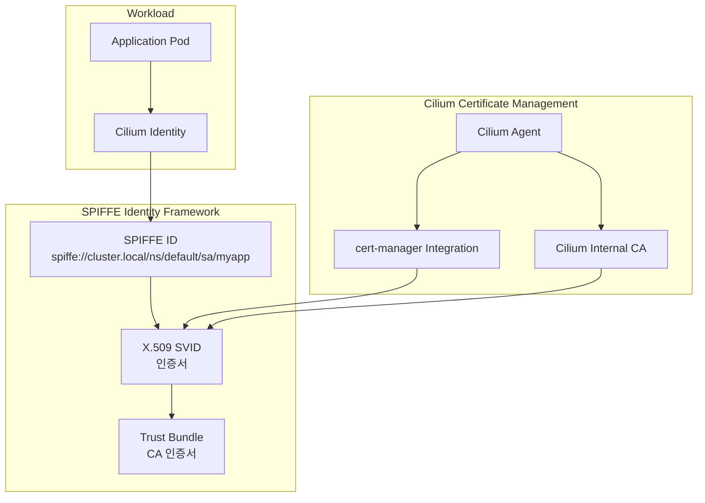

**SPIFFE ID 형식:**

```
spiffe://<trust-domain>/ns/<namespace>/sa/<service-account>

예시:
spiffe://cluster.local/ns/production/sa/payment-service
```

### Mutual Authentication

#### Authentication Policy 설정

```yaml
apiVersion: cilium.io/v2alpha1
kind: CiliumMutualAuthentication
metadata:
  name: strict-mtls
spec:
  # 인증 모드: required, optional, disabled
  mode: required

  # 적용 대상 선택자
  endpointSelector:
    matchLabels:
      io.cilium.policy.enforce: "true"

  # 인증서 설정
  certificate:
    # 인증서 유효 기간
    validity: 24h
    # 갱신 비율 (만료 전 갱신)
    renewBefore: 4h
```

```yaml
# CiliumNetworkPolicy를 통한 mTLS 강제
apiVersion: cilium.io/v2
kind: CiliumNetworkPolicy
metadata:
  name: require-mtls
  namespace: production
spec:
  endpointSelector:
    matchLabels:
      app: payment-service
  ingress:
    - fromEndpoints:
        - matchLabels:
            app: order-service
      authentication:
        mode: required
      toPorts:
        - ports:
            - port: "8080"
              protocol: TCP
```

#### mTLS 모드

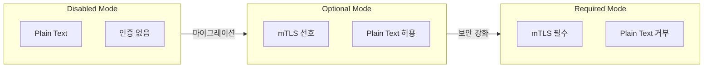

### 자동 인증서 관리

#### cert-manager 통합

```bash
# cert-manager 설치
kubectl apply -f https://github.com/cert-manager/cert-manager/releases/download/v1.14.0/cert-manager.yaml

# Cilium과 cert-manager 통합 설정
helm upgrade cilium cilium/cilium \
  --namespace kube-system \
  --set authentication.mutual.spire.enabled=false \
  --set authentication.mutual.certManager.enabled=true \
  --set authentication.mutual.certManager.issuerRef.name=cilium-ca \
  --set authentication.mutual.certManager.issuerRef.kind=Issuer
```

```yaml
# Cilium용 Issuer 생성
apiVersion: cert-manager.io/v1
kind: Issuer
metadata:
  name: cilium-ca
  namespace: kube-system
spec:
  selfSigned: {}
---
apiVersion: cert-manager.io/v1
kind: Certificate
metadata:
  name: cilium-ca
  namespace: kube-system
spec:
  isCA: true
  commonName: cilium-ca
  secretName: cilium-ca-secret
  privateKey:
    algorithm: ECDSA
    size: 256
  issuerRef:
    name: cilium-ca
    kind: Issuer
    group: cert-manager.io
---
apiVersion: cert-manager.io/v1
kind: ClusterIssuer
metadata:
  name: cilium-issuer
spec:
  ca:
    secretName: cilium-ca-secret
```

#### SPIRE 통합 (대안)

```bash
# SPIRE 서버 설치
helm repo add spiffe https://spiffe.github.io/helm-charts-hardened/
helm install spire spiffe/spire \
  --namespace spire \
  --create-namespace

# Cilium과 SPIRE 통합
helm upgrade cilium cilium/cilium \
  --namespace kube-system \
  --set authentication.mutual.spire.enabled=true \
  --set authentication.mutual.spire.serverAddress=spire-server.spire.svc:8081 \
  --set authentication.mutual.spire.trustDomain=cluster.local
```

## Observability

### Hubble

Hubble은 Cilium의 네이티브 관찰성 플랫폼으로, eBPF를 통해 네트워크 흐름을 실시간으로 모니터링합니다:

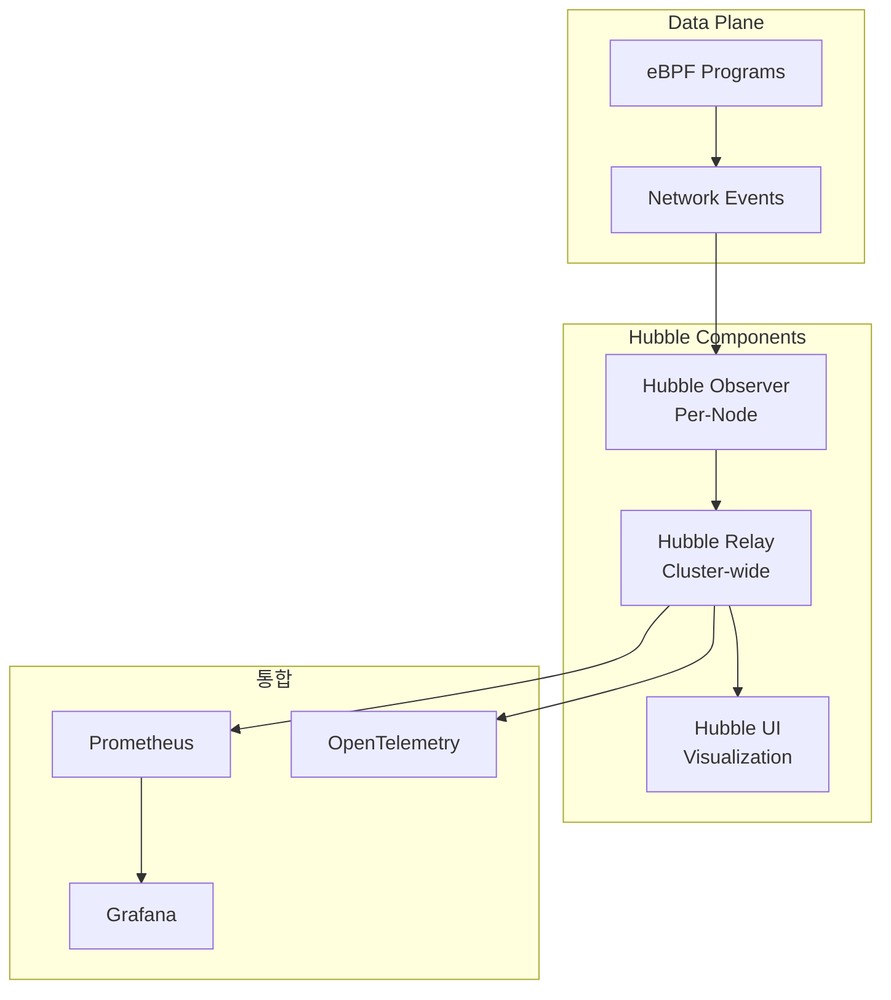

#### Hubble CLI 사용법

```bash
# Hubble 설치 및 활성화
cilium hubble enable --ui

# Hubble CLI 설치
HUBBLE_VERSION=$(curl -s https://raw.githubusercontent.com/cilium/hubble/master/stable.txt)
curl -L --fail --remote-name-all https://github.com/cilium/hubble/releases/download/$HUBBLE_VERSION/hubble-linux-amd64.tar.gz
sudo tar xzvfC hubble-linux-amd64.tar.gz /usr/local/bin
rm hubble-linux-amd64.tar.gz

# 포트 포워딩 설정
cilium hubble port-forward &

# 연결 상태 확인
hubble status

# 실시간 네트워크 흐름 관찰
hubble observe

# 특정 네임스페이스 필터링
hubble observe --namespace production

# 특정 Pod 트래픽 관찰
hubble observe --pod production/frontend

# HTTP 트래픽만 필터링
hubble observe --protocol http

# 거부된 트래픽만 표시
hubble observe --verdict DROPPED

# JSON 형식 출력
hubble observe --output json

# 특정 서비스 간 통신 추적
hubble observe --from-pod production/order-service --to-pod production/payment-service
```

#### Hubble UI 접근

```bash
# UI 포트 포워딩
kubectl port-forward -n kube-system svc/hubble-ui 12000:80

# 브라우저에서 접근
# http://localhost:12000
```

### L7 가시성

#### HTTP 메트릭

```yaml
# L7 가시성 활성화 CiliumNetworkPolicy
apiVersion: cilium.io/v2
kind: CiliumNetworkPolicy
metadata:
  name: l7-visibility
  namespace: production
spec:
  endpointSelector:
    matchLabels:
      app: api-service
  ingress:
    - toPorts:
        - ports:
            - port: "8080"
              protocol: TCP
          rules:
            http:
              - method: "GET"
              - method: "POST"
              - method: "PUT"
              - method: "DELETE"
```

```bash
# HTTP 요청/응답 메트릭 조회
hubble observe --protocol http --output json | jq '.flow.l7.http'

# HTTP 상태 코드별 통계
hubble observe --protocol http --output json | \
  jq -r '.flow.l7.http.code // empty' | \
  sort | uniq -c | sort -rn

# 느린 요청 탐지 (500ms 이상)
hubble observe --protocol http --output json | \
  jq 'select(.flow.l7.latency_ns > 500000000)'
```

#### DNS 가시성

```bash
# DNS 쿼리 관찰
hubble observe --protocol dns

# DNS 쿼리 실패 탐지
hubble observe --protocol dns --verdict DROPPED

# 특정 도메인에 대한 DNS 조회
hubble observe --protocol dns --output json | \
  jq 'select(.flow.l7.dns.query == "api.example.com")'
```

### Grafana 대시보드

```bash
# Prometheus 및 Grafana 설치 (kube-prometheus-stack)
helm repo add prometheus-community https://prometheus-community.github.io/helm-charts
helm install prometheus prometheus-community/kube-prometheus-stack \
  --namespace monitoring \
  --create-namespace

# Hubble 메트릭 노출 설정
helm upgrade cilium cilium/cilium \
  --namespace kube-system \
  --set hubble.metrics.enabled="{dns,drop,tcp,flow,icmp,http}" \
  --set hubble.metrics.serviceMonitor.enabled=true

# Grafana 대시보드 가져오기
# Cilium 공식 대시보드 ID: 16611 (Cilium Agent Metrics)
# Hubble 대시보드 ID: 16612 (Hubble L7 HTTP Metrics)
```

**Grafana 대시보드 JSON 예시:**

```json
{
  "dashboard": {
    "title": "Cilium Service Mesh Overview",
    "panels": [
      {
        "title": "HTTP Request Rate",
        "type": "graph",
        "targets": [
          {
            "expr": "sum(rate(hubble_http_requests_total[5m])) by (method, status)",
            "legendFormat": "{{method}} - {{status}}"
          }
        ]
      },
      {
        "title": "HTTP Latency (p99)",
        "type": "graph",
        "targets": [
          {
            "expr": "histogram_quantile(0.99, sum(rate(hubble_http_request_duration_seconds_bucket[5m])) by (le, destination))",
            "legendFormat": "{{destination}}"
          }
        ]
      },
      {
        "title": "Network Policy Drops",
        "type": "stat",
        "targets": [
          {
            "expr": "sum(rate(hubble_drop_total[5m]))",
            "legendFormat": "Drops/sec"
          }
        ]
      }
    ]
  }
}
```

## Ingress Controller

### Cilium Ingress

Cilium은 자체 Ingress Controller를 제공하여 외부 트래픽을 클러스터 내부로 라우팅합니다.

#### Dedicated vs Shared 모드

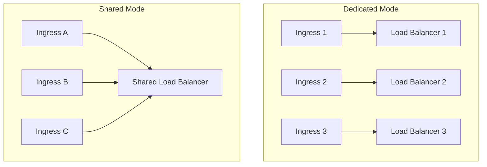

```bash
# Dedicated 모드 활성화 (기본값)
helm upgrade cilium cilium/cilium \
  --namespace kube-system \
  --set ingressController.enabled=true \
  --set ingressController.loadbalancerMode=dedicated

# Shared 모드 활성화
helm upgrade cilium cilium/cilium \
  --namespace kube-system \
  --set ingressController.enabled=true \
  --set ingressController.loadbalancerMode=shared \
  --set ingressController.service.name=cilium-ingress \
  --set ingressController.service.type=LoadBalancer
```

#### Ingress 리소스 예제

```yaml
apiVersion: networking.k8s.io/v1
kind: Ingress
metadata:
  name: web-ingress
  namespace: production
  annotations:
    # Cilium Ingress 사용 지정
    kubernetes.io/ingress.class: cilium
spec:
  rules:
    - host: api.example.com
      http:
        paths:
          - path: /v1
            pathType: Prefix
            backend:
              service:
                name: api-v1
                port:
                  number: 80
          - path: /v2
            pathType: Prefix
            backend:
              service:
                name: api-v2
                port:
                  number: 80
    - host: web.example.com
      http:
        paths:
          - path: /
            pathType: Prefix
            backend:
              service:
                name: frontend
                port:
                  number: 80
  tls:
    - hosts:
        - api.example.com
        - web.example.com
      secretName: tls-secret
```

### Gateway API 지원

Cilium 1.14+부터 Kubernetes Gateway API를 완전히 지원합니다.

#### GatewayClass

```yaml
apiVersion: gateway.networking.k8s.io/v1
kind: GatewayClass
metadata:
  name: cilium
spec:
  controllerName: io.cilium/gateway-controller
```

#### Gateway

```yaml
apiVersion: gateway.networking.k8s.io/v1
kind: Gateway
metadata:
  name: production-gateway
  namespace: production
spec:
  gatewayClassName: cilium
  listeners:
    # HTTP 리스너
    - name: http
      protocol: HTTP
      port: 80
      hostname: "*.example.com"
      allowedRoutes:
        namespaces:
          from: Same
    # HTTPS 리스너
    - name: https
      protocol: HTTPS
      port: 443
      hostname: "*.example.com"
      tls:
        mode: Terminate
        certificateRefs:
          - name: wildcard-tls
            kind: Secret
      allowedRoutes:
        namespaces:
          from: Same
```

#### HTTPRoute

```yaml
apiVersion: gateway.networking.k8s.io/v1
kind: HTTPRoute
metadata:
  name: api-routes
  namespace: production
spec:
  parentRefs:
    - name: production-gateway
      namespace: production
  hostnames:
    - "api.example.com"
  rules:
    # 헤더 기반 라우팅
    - matches:
        - headers:
            - name: "x-version"
              value: "v2"
          path:
            type: PathPrefix
            value: /api
      backendRefs:
        - name: api-v2
          port: 80
    # 가중치 기반 트래픽 분할
    - matches:
        - path:
            type: PathPrefix
            value: /api
      backendRefs:
        - name: api-v1
          port: 80
          weight: 90
        - name: api-v2
          port: 80
          weight: 10
    # 기본 라우팅
    - matches:
        - path:
            type: PathPrefix
            value: /
      backendRefs:
        - name: frontend
          port: 80
```

#### TLS Termination

```yaml
# TLS Secret 생성
apiVersion: v1
kind: Secret
metadata:
  name: wildcard-tls
  namespace: production
type: kubernetes.io/tls
data:
  tls.crt: <base64-encoded-cert>
  tls.key: <base64-encoded-key>
---
# TLS가 적용된 Gateway
apiVersion: gateway.networking.k8s.io/v1
kind: Gateway
metadata:
  name: secure-gateway
  namespace: production
spec:
  gatewayClassName: cilium
  listeners:
    - name: https
      protocol: HTTPS
      port: 443
      hostname: "secure.example.com"
      tls:
        mode: Terminate
        certificateRefs:
          - name: wildcard-tls
        options:
          # 최소 TLS 버전
          gateway.networking.k8s.io/tls-min-version: "TLSv1.2"
      allowedRoutes:
        namespaces:
          from: All
```

## Istio 대비 장단점

### 상세 비교 표

| 항목 | Cilium Service Mesh | Istio |
|------|---------------------|-------|
| **아키텍처** | Sidecar-less (Per-Node Proxy) | Sidecar Proxy (Per-Pod) |
| **데이터 플레인** | eBPF + Envoy (선택적) | Envoy Sidecar |
| **L3/L4 처리** | 커널 공간 (eBPF) | 사용자 공간 (Envoy) |
| **L7 처리** | Per-Node Envoy | Per-Pod Envoy |
| **메모리 오버헤드** | 낮음 (~200MB/노드) | 높음 (~50MB/Pod) |
| **지연 시간** | 매우 낮음 (μs 단위) | 낮음 (ms 단위) |
| **mTLS** | 지원 (SPIFFE/cert-manager) | 완전 지원 (내장 CA) |
| **트래픽 관리** | CiliumEnvoyConfig | VirtualService/DestinationRule |
| **관찰성** | Hubble | Kiali, Jaeger, Prometheus |
| **Gateway API** | 완전 지원 | 완전 지원 |
| **멀티 클러스터** | Cluster Mesh | Multi-Primary/Remote |
| **프로토콜 지원** | HTTP, gRPC, Kafka, DNS | HTTP, gRPC, TCP |
| **정책 모델** | CiliumNetworkPolicy | AuthorizationPolicy |
| **성숙도** | 성장 중 | 성숙 |
| **커뮤니티** | CNCF Graduated | CNCF Graduated |
| **학습 곡선** | 중간 (eBPF 지식 유용) | 높음 |
| **CNI 통합** | 네이티브 (Cilium CNI) | 별도 CNI 필요 |

### 성능 비교

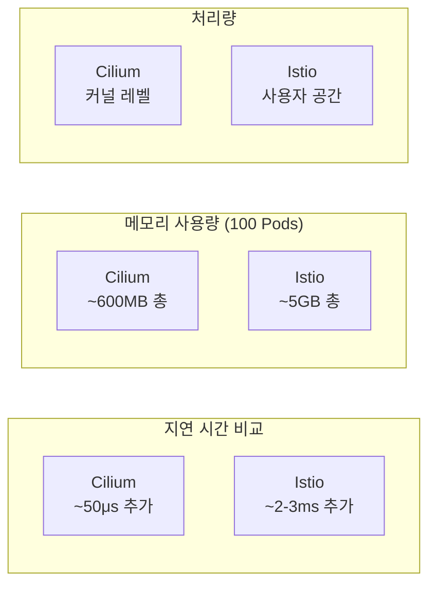

### 선택 가이드

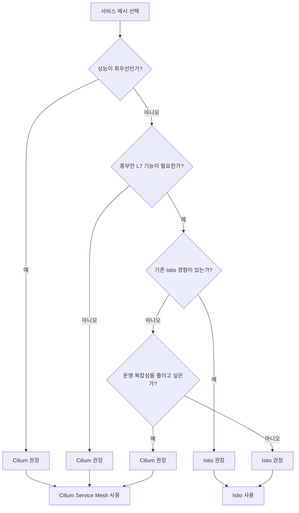

**Cilium Service Mesh를 선택해야 하는 경우:**

- 이미 Cilium CNI를 사용 중인 경우
- 극한의 성능과 낮은 지연 시간이 필요한 경우
- 리소스 효율성이 중요한 경우
- 단일 플랫폼으로 CNI와 서비스 메시를 통합하고 싶은 경우
- eBPF 기반 보안 및 관찰성을 원하는 경우

**Istio를 선택해야 하는 경우:**

- 고급 L7 트래픽 관리 기능이 필요한 경우 (Fault Injection, Mirror 등)
- 복잡한 인증/인가 정책이 필요한 경우
- 기존 Istio 환경이 있거나 팀에 Istio 경험이 있는 경우
- 더 성숙한 에코시스템과 커뮤니티 지원이 필요한 경우
- VM 워크로드와의 통합이 필요한 경우

## EKS에서의 Cilium Service Mesh 배포

### EKS 네이티브 VPC CNI 교체 방법

EKS에서 Cilium Service Mesh를 사용하려면 기본 VPC CNI를 Cilium으로 교체해야 합니다.

#### 방법 1: 새 클러스터에서 Cilium 설치

```bash
# 1. EKS 클러스터 생성 (VPC CNI 없이)
eksctl create cluster \
  --name cilium-cluster \
  --region ap-northeast-2 \
  --version 1.29 \
  --without-nodegroup

# 2. 기본 aws-node DaemonSet 삭제
kubectl -n kube-system delete daemonset aws-node

# 3. Cilium 설치
helm repo add cilium https://helm.cilium.io/
helm install cilium cilium/cilium \
  --version 1.16.0 \
  --namespace kube-system \
  --set eni.enabled=true \
  --set ipam.mode=eni \
  --set egressMasqueradeInterfaces=eth0 \
  --set routingMode=native \
  --set hubble.enabled=true \
  --set hubble.relay.enabled=true \
  --set hubble.ui.enabled=true \
  --set ingressController.enabled=true

# 4. 노드 그룹 추가
eksctl create nodegroup \
  --cluster cilium-cluster \
  --region ap-northeast-2 \
  --node-type m5.large \
  --nodes 3
```

#### 방법 2: 기존 클러스터에서 마이그레이션

```bash
# 주의: 다운타임이 발생할 수 있습니다.
# 프로덕션 환경에서는 신중하게 계획하세요.

# 1. 기존 워크로드 백업
kubectl get all --all-namespaces -o yaml > backup.yaml

# 2. aws-node CNI 삭제
kubectl -n kube-system delete daemonset aws-node
kubectl -n kube-system delete configmap amazon-vpc-cni

# 3. Cilium 설치
helm install cilium cilium/cilium \
  --version 1.16.0 \
  --namespace kube-system \
  --set eni.enabled=true \
  --set ipam.mode=eni \
  --set tunnel=disabled \
  --set hubble.enabled=true \
  --set hubble.relay.enabled=true

# 4. 노드 순차 재시작 (Rolling)
for node in $(kubectl get nodes -o name); do
  kubectl drain $node --ignore-daemonsets --delete-emptydir-data
  # AWS Console 또는 ASG에서 인스턴스 재시작
  kubectl uncordon $node
  sleep 60
done
```

### kube-proxy 대체 (eBPF kube-proxy replacement)

Cilium은 kube-proxy 없이 eBPF로 서비스 로드 밸런싱을 처리할 수 있습니다:

```bash
# kube-proxy 대체와 함께 Cilium 설치
helm install cilium cilium/cilium \
  --version 1.16.0 \
  --namespace kube-system \
  --set eni.enabled=true \
  --set ipam.mode=eni \
  --set kubeProxyReplacement=true \
  --set k8sServiceHost=${API_SERVER_IP} \
  --set k8sServicePort=443 \
  --set hubble.enabled=true \
  --set hubble.relay.enabled=true \
  --set hubble.ui.enabled=true

# kube-proxy DaemonSet 삭제 (Cilium이 대체)
kubectl -n kube-system delete daemonset kube-proxy
kubectl -n kube-system delete configmap kube-proxy

# kube-proxy 대체 상태 확인
cilium status | grep KubeProxyReplacement
```

**kube-proxy 대체의 이점:**

- iptables 규칙 제거로 성능 향상
- 대규모 클러스터에서 확장성 개선
- Socket-level 로드 밸런싱으로 지연 시간 감소
- DSR(Direct Server Return) 지원

### AWS ENI 모드와 호환성

```yaml
# Cilium ENI 모드 ConfigMap
apiVersion: v1
kind: ConfigMap
metadata:
  name: cilium-config
  namespace: kube-system
data:
  # ENI 모드 활성화
  ipam: "eni"
  enable-endpoint-routes: "true"
  auto-create-cilium-node-resource: "true"

  # AWS ENI 설정
  eni-tags: '{"Owner": "cilium"}'
  aws-enable-prefix-delegation: "true"

  # Service Mesh 기능
  enable-l7-proxy: "true"
  enable-envoy-config: "true"

  # Hubble 설정
  enable-hubble: "true"
  hubble-listen-address: ":4244"
  hubble-metrics-server: ":9965"
  hubble-metrics: "dns,drop,tcp,flow,icmp,http"
```

### Helm 설치 전체 예제

```bash
#!/bin/bash
# EKS Cilium Service Mesh 완전 설치 스크립트

CLUSTER_NAME="my-eks-cluster"
REGION="ap-northeast-2"
CILIUM_VERSION="1.16.0"

# 1. EKS API 서버 주소 가져오기
API_SERVER=$(aws eks describe-cluster \
  --name $CLUSTER_NAME \
  --region $REGION \
  --query 'cluster.endpoint' \
  --output text | sed 's|https://||')

# 2. Helm 리포지토리 추가
helm repo add cilium https://helm.cilium.io/
helm repo update

# 3. Cilium 설치 (전체 Service Mesh 기능 포함)
helm install cilium cilium/cilium \
  --version $CILIUM_VERSION \
  --namespace kube-system \
  --set eni.enabled=true \
  --set ipam.mode=eni \
  --set egressMasqueradeInterfaces=eth0 \
  --set routingMode=native \
  --set kubeProxyReplacement=true \
  --set k8sServiceHost=$API_SERVER \
  --set k8sServicePort=443 \
  --set hubble.enabled=true \
  --set hubble.relay.enabled=true \
  --set hubble.ui.enabled=true \
  --set hubble.metrics.enabled="{dns,drop,tcp,flow,icmp,http}" \
  --set hubble.metrics.serviceMonitor.enabled=true \
  --set ingressController.enabled=true \
  --set ingressController.loadbalancerMode=shared \
  --set gatewayAPI.enabled=true \
  --set authentication.mutual.spire.enabled=false \
  --set loadBalancer.algorithm=maglev \
  --set operator.replicas=2

# 4. 설치 확인
cilium status --wait

# 5. 연결 테스트
cilium connectivity test
```

### Service Mesh 기능 활성화 확인

```bash
# Cilium 상태 확인
cilium status

# Service Mesh 관련 기능 확인
cilium config view | grep -E "(proxy|envoy|l7|ingress|gateway)"

# Envoy 프록시 상태 확인
kubectl -n kube-system get pods -l k8s-app=cilium-envoy

# Hubble 상태 확인
hubble status

# Gateway API CRD 확인
kubectl get crd | grep gateway
```

## Cilium CNI 문서 크로스 레퍼런스

Cilium Service Mesh는 Cilium CNI의 기반 위에 구축됩니다. 더 깊은 이해를 위해 다음 문서들을 참조하세요:

> **관련 문서**: Cilium CNI에 대한 자세한 내용은 다음을 참조하세요:
> - [Cilium 소개](../cilium/01-introduction.md) - Cilium의 기본 개념과 아키텍처
> - [eBPF](../cilium/02-ebpf.md) - Service Mesh의 핵심 기술인 eBPF 심층 분석
> - [네트워킹](../cilium/03-networking.md) - Cilium 네트워킹 모델과 데이터 경로
> - [보안 및 가시성](../cilium/06-security-visibility.md) - 네트워크 정책과 Hubble 관찰성
> - [고급 주제](../cilium/07-advanced-topics.md) - 성능 튜닝, 멀티 클러스터, 실제 사례

**개념 연결:**

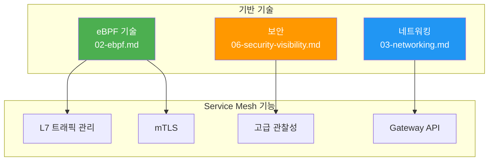

## 모범 사례

### 마이그레이션 전략 (kube-proxy에서)

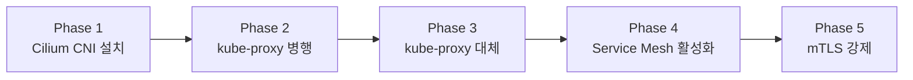

**단계별 마이그레이션:**

```bash
# Phase 1: Cilium CNI 설치 (kube-proxy 유지)
helm install cilium cilium/cilium \
  --namespace kube-system \
  --set kubeProxyReplacement=false

# Phase 2: 안정성 확인 후 kube-proxy 대체 준비
helm upgrade cilium cilium/cilium \
  --namespace kube-system \
  --set kubeProxyReplacement=true \
  --set kubeProxyReplacementHealthzBindAddr="0.0.0.0:10256"

# Phase 3: kube-proxy 제거
kubectl -n kube-system delete daemonset kube-proxy

# Phase 4: Service Mesh 기능 활성화
helm upgrade cilium cilium/cilium \
  --namespace kube-system \
  --set hubble.enabled=true \
  --set hubble.relay.enabled=true \
  --set ingressController.enabled=true

# Phase 5: mTLS 활성화
kubectl apply -f - <<EOF
apiVersion: cilium.io/v2alpha1
kind: CiliumMutualAuthentication
metadata:
  name: default-mtls
spec:
  mode: required
EOF
```

### 모니터링 및 알림

```yaml
# Prometheus 알림 규칙
apiVersion: monitoring.coreos.com/v1
kind: PrometheusRule
metadata:
  name: cilium-alerts
  namespace: monitoring
spec:
  groups:
    - name: cilium.rules
      rules:
        # Cilium Agent 상태
        - alert: CiliumAgentNotReady
          expr: cilium_agent_ready == 0
          for: 5m
          labels:
            severity: critical
          annotations:
            summary: "Cilium agent is not ready"
            description: "Cilium agent on {{ $labels.node }} is not ready"

        # 높은 패킷 드롭율
        - alert: CiliumHighDropRate
          expr: rate(hubble_drop_total[5m]) > 100
          for: 5m
          labels:
            severity: warning
          annotations:
            summary: "High packet drop rate detected"

        # Envoy 프록시 오류
        - alert: CiliumEnvoyErrors
          expr: rate(cilium_proxy_errors_total[5m]) > 10
          for: 5m
          labels:
            severity: warning
          annotations:
            summary: "High Envoy proxy error rate"

        # HTTP 5xx 응답 비율
        - alert: CiliumHighHTTP5xxRate
          expr: |
            sum(rate(hubble_http_requests_total{code=~"5.."}[5m])) /
            sum(rate(hubble_http_requests_total[5m])) > 0.05
          for: 5m
          labels:
            severity: warning
          annotations:
            summary: "HTTP 5xx error rate exceeds 5%"
```

### 업그레이드 절차

```bash
#!/bin/bash
# Cilium 안전한 업그레이드 스크립트

NEW_VERSION="1.16.1"

# 1. 현재 상태 백업
cilium status > cilium-status-before.txt
kubectl get ciliumnetworkpolicies -A -o yaml > cnp-backup.yaml
kubectl get ciliumenvoyconfigs -A -o yaml > cec-backup.yaml

# 2. Pre-flight 체크
cilium preflight upgrade

# 3. Helm 업그레이드 (Rolling Update)
helm upgrade cilium cilium/cilium \
  --version $NEW_VERSION \
  --namespace kube-system \
  --reuse-values \
  --set upgradeCompatibility=1.15

# 4. 업그레이드 상태 모니터링
watch cilium status

# 5. 연결성 테스트
cilium connectivity test

# 6. 이전 버전 정리
kubectl -n kube-system delete configmap cilium-config-previous --ignore-not-found
```

### 프로덕션 체크리스트

```markdown
## Cilium Service Mesh 프로덕션 배포 체크리스트

### 인프라
- [ ] Linux 커널 5.4+ (eBPF 완전 지원)
- [ ] Kubernetes 1.27+
- [ ] 충분한 노드 리소스 (Cilium Agent: 2GB RAM, 1 CPU 권장)

### 네트워킹
- [ ] ENI 모드 설정 (EKS)
- [ ] kube-proxy 대체 활성화
- [ ] 적절한 IPAM 설정

### 보안
- [ ] mTLS 정책 정의
- [ ] 네트워크 정책 적용
- [ ] RBAC 권한 최소화

### 관찰성
- [ ] Hubble 활성화
- [ ] Prometheus/Grafana 통합
- [ ] 알림 규칙 설정

### 운영
- [ ] 백업 전략 수립
- [ ] 업그레이드 절차 문서화
- [ ] 롤백 계획 준비
- [ ] 성능 기준선 측정
```

### 문제 해결 가이드

```bash
# 일반적인 문제 해결 명령어

# 1. Cilium Agent 상태 확인
cilium status --verbose

# 2. Cilium Agent 로그 확인
kubectl -n kube-system logs -l k8s-app=cilium --tail=100

# 3. Envoy 프록시 상태 확인
kubectl -n kube-system exec -it $(kubectl -n kube-system get pods -l k8s-app=cilium -o jsonpath='{.items[0].metadata.name}') -- cilium envoy admin

# 4. eBPF 맵 상태 확인
kubectl -n kube-system exec -it $(kubectl -n kube-system get pods -l k8s-app=cilium -o jsonpath='{.items[0].metadata.name}') -- cilium bpf ct list global

# 5. 엔드포인트 상태 확인
kubectl -n kube-system exec -it $(kubectl -n kube-system get pods -l k8s-app=cilium -o jsonpath='{.items[0].metadata.name}') -- cilium endpoint list

# 6. 서비스 목록 확인
kubectl -n kube-system exec -it $(kubectl -n kube-system get pods -l k8s-app=cilium -o jsonpath='{.items[0].metadata.name}') -- cilium service list

# 7. 네트워크 정책 적용 상태
kubectl -n kube-system exec -it $(kubectl -n kube-system get pods -l k8s-app=cilium -o jsonpath='{.items[0].metadata.name}') -- cilium policy get

# 8. Hubble로 실시간 트래픽 디버깅
hubble observe --namespace production --follow
```

---

## 요약

Cilium Service Mesh는 eBPF 기반의 혁신적인 서비스 메시 솔루션으로, 전통적인 사이드카 방식의 한계를 극복합니다:

- **성능**: 커널 레벨 처리로 최소 지연 시간
- **효율성**: Per-Node 프록시로 리소스 절감
- **통합**: CNI와 Service Mesh의 단일 플랫폼
- **관찰성**: Hubble을 통한 eBPF 기반 가시성
- **호환성**: Gateway API, Ingress Controller 지원

EKS 환경에서 고성능 서비스 메시가 필요하다면 Cilium Service Mesh는 훌륭한 선택입니다.
