# Cilium Service Mesh 아키텍처

> **지원 버전**: Cilium 1.16+, Kubernetes 1.28+
> **마지막 업데이트**: 2025년 2월 21일

## 개요

Cilium Service Mesh의 아키텍처는 전통적인 사이드카 기반 서비스 메시와 근본적으로 다릅니다. eBPF를 활용하여 커널 레벨에서 L3/L4 트래픽을 처리하고, 노드당 하나의 공유 Envoy 프록시로 L7 기능을 제공합니다. 이 장에서는 Cilium Service Mesh의 핵심 아키텍처 컴포넌트와 동작 방식을 자세히 설명합니다.

## 전체 아키텍처

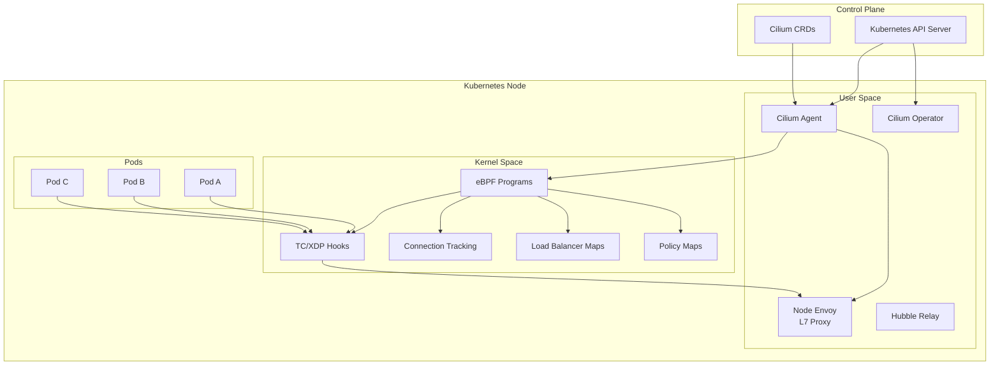

## eBPF 데이터패스

### eBPF란?

eBPF(extended Berkeley Packet Filter)는 Linux 커널 내에서 샌드박스된 프로그램을 실행할 수 있게 해주는 기술입니다. 커널을 수정하지 않고도 네트워크, 보안, 관찰성 기능을 구현할 수 있습니다.

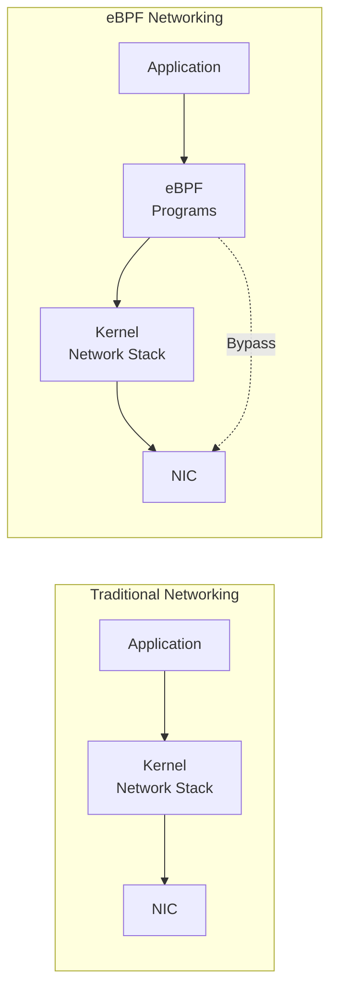

### eBPF 훅 포인트

Cilium은 여러 eBPF 훅 포인트를 활용합니다:

| 훅 포인트 | 위치 | 용도 |
|-----------|------|------|
| **XDP (eXpress Data Path)** | NIC 드라이버 | 초고속 패킷 처리, DDoS 방어 |
| **TC (Traffic Control)** | 네트워크 스택 진입점 | 패킷 필터링, 리다이렉션 |
| **Socket Operations** | 소켓 레벨 | 소켓 연결 가속 |
| **cgroup** | 프로세스 그룹 | 리소스 제어, 정책 적용 |

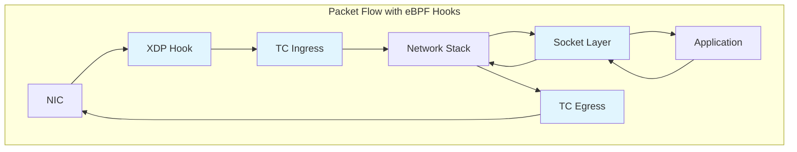

### L3/L4 처리

eBPF에서 L3/L4 처리는 다음과 같이 이루어집니다:

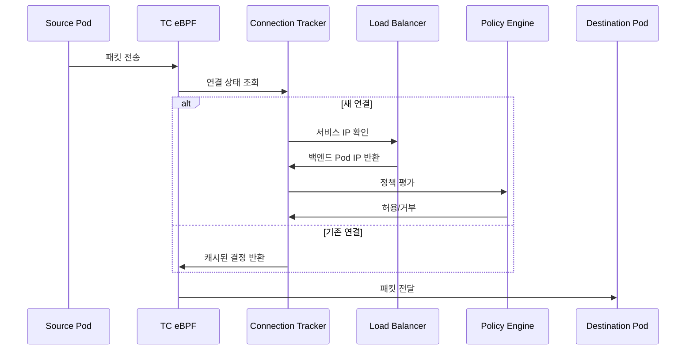

#### eBPF 맵 구조

```c
// 연결 추적 맵 (Connection Tracking Map)
struct ct_entry {
    __u32 src_ip;
    __u32 dst_ip;
    __u16 src_port;
    __u16 dst_port;
    __u8  protocol;
    __u64 lifetime;
    __u32 rx_packets;
    __u32 tx_packets;
};

// 서비스 맵 (Service Map)
struct lb_service {
    __u32 service_ip;
    __u16 service_port;
    __u32 backend_count;
    __u32 backend_slot;
};

// 정책 맵 (Policy Map)
struct policy_entry {
    __u32 identity;
    __u16 port;
    __u8  protocol;
    __u8  action;  // ALLOW, DENY, AUDIT
};
```

### kube-proxy 대체

Cilium의 eBPF 기반 로드 밸런서는 kube-proxy를 완전히 대체할 수 있습니다:

```yaml
# Cilium 설치 시 kube-proxy 대체 활성화
kubeProxyReplacement: true

# 로드 밸런서 알고리즘 설정
loadBalancer:
  algorithm: maglev  # 또는 random
  mode: dsr          # Direct Server Return
```

**kube-proxy vs Cilium eBPF 비교:**

| 기능 | kube-proxy (iptables) | Cilium eBPF |
|------|----------------------|-------------|
| 규칙 복잡도 | O(n) - 서비스 수에 비례 | O(1) - 해시 맵 조회 |
| 연결 추적 | conntrack 모듈 | eBPF CT 맵 |
| DSR 지원 | 제한적 | 완전 지원 |
| 세션 어피니티 | iptables 기반 | Maglev 해싱 |
| 성능 | 중간 | 높음 |

## 노드당 Envoy 프록시

### 사이드카 vs 노드 프록시

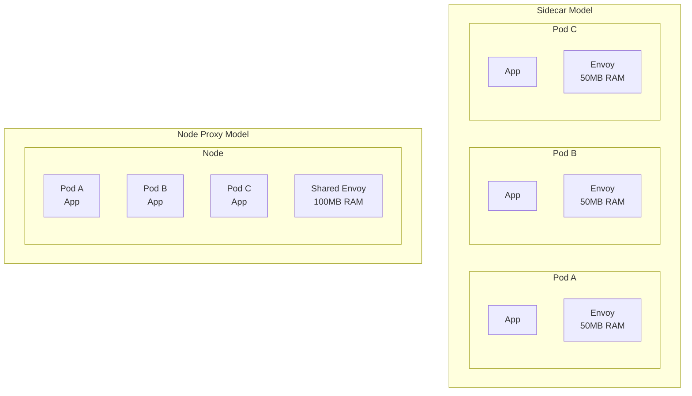

### Envoy 배포 방식

Cilium은 노드당 하나의 Envoy 프록시를 DaemonSet으로 배포합니다:

```bash
# Envoy DaemonSet 확인
kubectl get daemonset -n kube-system cilium-envoy

# 예상 출력
NAME           DESIRED   CURRENT   READY   UP-TO-DATE   AVAILABLE
cilium-envoy   3         3         3       3            3
```

### L7 처리 흐름

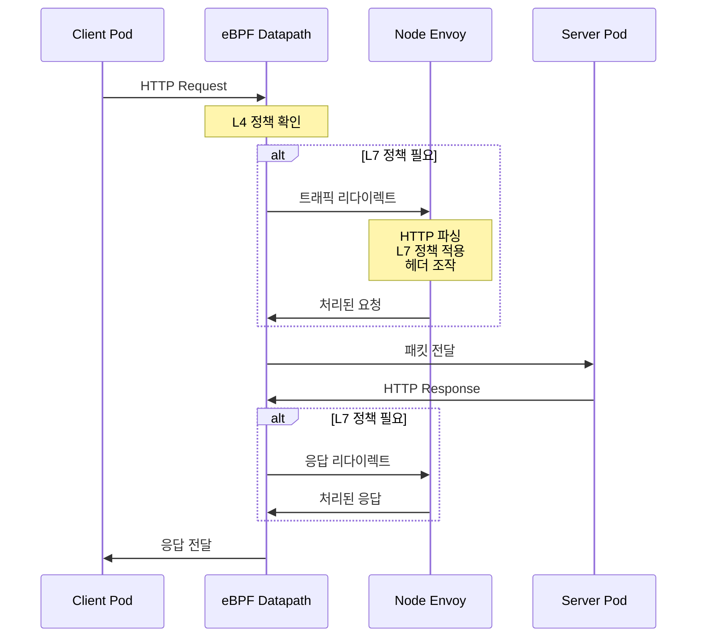

### Envoy 리소스 설정

```yaml
# values.yaml
envoy:
  enabled: true
  resources:
    limits:
      cpu: 2000m
      memory: 2Gi
    requests:
      cpu: 100m
      memory: 256Mi

  # Envoy 동시 연결 설정
  maxConnectionsPerHost: 1000
  connectTimeout: 5s

  # 프록시 프로토콜 설정
  proxy:
    protocol:
      http2:
        enabled: true
      tls:
        enabled: true
```

## CRD 모델

### Cilium CRD 구조

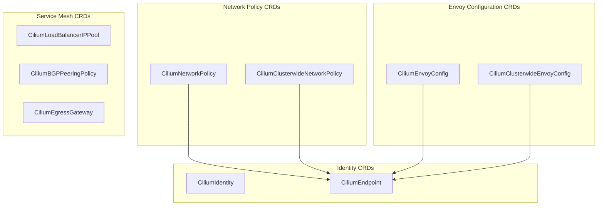

### CiliumEnvoyConfig

CiliumEnvoyConfig는 네임스페이스 범위의 Envoy 설정을 정의합니다:

```yaml
apiVersion: cilium.io/v2
kind: CiliumEnvoyConfig
metadata:
  name: http-filter
  namespace: default
spec:
  # 이 설정이 적용될 서비스 선택
  services:
  - name: my-service
    namespace: default

  # Envoy 리소스 정의
  resources:
  - "@type": type.googleapis.com/envoy.config.listener.v3.Listener
    name: my-service-listener
    filter_chains:
    - filters:
      - name: envoy.filters.network.http_connection_manager
        typed_config:
          "@type": type.googleapis.com/envoy.extensions.filters.network.http_connection_manager.v3.HttpConnectionManager
          stat_prefix: my-service
          route_config:
            name: local_route
            virtual_hosts:
            - name: my-service
              domains: ["*"]
              routes:
              - match:
                  prefix: "/"
                route:
                  cluster: default/my-service
          http_filters:
          - name: envoy.filters.http.router
            typed_config:
              "@type": type.googleapis.com/envoy.extensions.filters.http.router.v3.Router
```

### CiliumClusterwideEnvoyConfig

클러스터 전체에 적용되는 Envoy 설정:

```yaml
apiVersion: cilium.io/v2
kind: CiliumClusterwideEnvoyConfig
metadata:
  name: global-ratelimit
spec:
  # 클러스터 전체 서비스에 적용
  services:
  - name: "*"
    namespace: "*"

  resources:
  - "@type": type.googleapis.com/envoy.config.listener.v3.Listener
    name: global-listener
    filter_chains:
    - filters:
      - name: envoy.filters.network.http_connection_manager
        typed_config:
          "@type": type.googleapis.com/envoy.extensions.filters.network.http_connection_manager.v3.HttpConnectionManager
          stat_prefix: global
          http_filters:
          - name: envoy.filters.http.local_ratelimit
            typed_config:
              "@type": type.googleapis.com/envoy.extensions.filters.http.local_ratelimit.v3.LocalRateLimit
              stat_prefix: http_local_rate_limiter
              token_bucket:
                max_tokens: 1000
                tokens_per_fill: 100
                fill_interval: 1s
          - name: envoy.filters.http.router
            typed_config:
              "@type": type.googleapis.com/envoy.extensions.filters.http.router.v3.Router
```

### CiliumNetworkPolicy (L7)

L7 규칙이 포함된 네트워크 정책:

```yaml
apiVersion: cilium.io/v2
kind: CiliumNetworkPolicy
metadata:
  name: l7-policy
  namespace: default
spec:
  endpointSelector:
    matchLabels:
      app: backend

  ingress:
  - fromEndpoints:
    - matchLabels:
        app: frontend
    toPorts:
    - ports:
      - port: "8080"
        protocol: TCP
      rules:
        http:
        - method: GET
          path: "/api/v1/.*"
          headers:
          - name: "X-Request-ID"
            value: ".*"
        - method: POST
          path: "/api/v1/users"
        - method: DELETE
          path: "/api/v1/users/[0-9]+"

  egress:
  - toEndpoints:
    - matchLabels:
        app: database
    toPorts:
    - ports:
      - port: "5432"
        protocol: TCP
```

## Cilium Agent와 서비스 메시

### Cilium Agent 역할

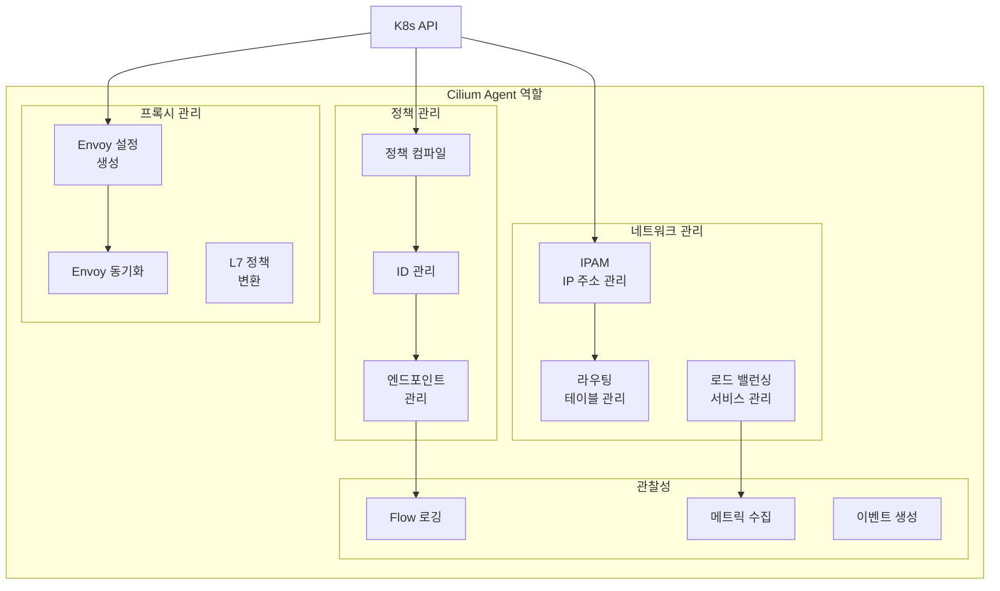

### Agent 설정

```yaml
# ConfigMap: cilium-config
apiVersion: v1
kind: ConfigMap
metadata:
  name: cilium-config
  namespace: kube-system
data:
  # Agent 기본 설정
  debug: "false"
  enable-ipv4: "true"
  enable-ipv6: "false"

  # 서비스 메시 설정
  enable-l7-proxy: "true"
  enable-envoy-config: "true"

  # kube-proxy 대체
  kube-proxy-replacement: "true"

  # 관찰성
  enable-hubble: "true"
  hubble-listen-address: ":4244"
  hubble-metrics-server: ":9965"

  # 암호화
  enable-wireguard: "true"
  enable-ipsec: "false"
```

## 서비스 ID와 SPIFFE

### Cilium Identity

Cilium은 각 워크로드에 고유한 ID를 할당합니다:

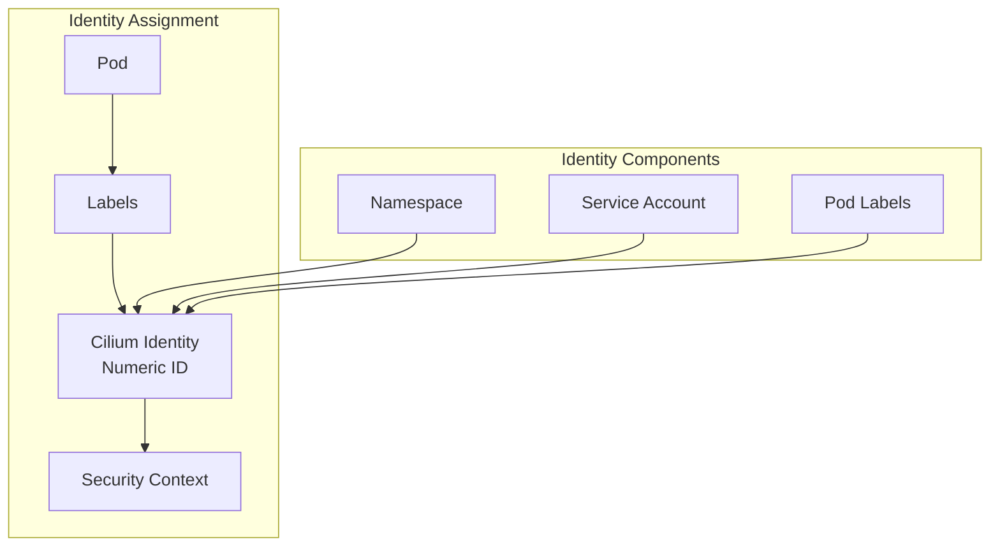

### Identity 기반 정책

```yaml
# Pod의 Identity 확인
apiVersion: cilium.io/v2
kind: CiliumIdentity
metadata:
  name: "12345"
  labels:
    app: frontend
    k8s:io.kubernetes.pod.namespace: default
spec:
  security-labels:
    k8s:app: frontend
    k8s:io.kubernetes.pod.namespace: default
```

```bash
# Identity 목록 확인
cilium identity list

# 예상 출력
ID      LABELS
1       reserved:host
2       reserved:world
3       reserved:health
12345   k8s:app=frontend,k8s:io.kubernetes.pod.namespace=default
12346   k8s:app=backend,k8s:io.kubernetes.pod.namespace=default
```

### SPIFFE 통합

SPIFFE(Secure Production Identity Framework for Everyone)를 통한 워크로드 ID:

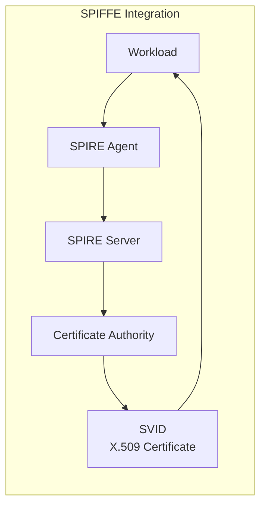

```yaml
# SPIRE 통합 설정
authentication:
  mutual:
    spire:
      enabled: true
      install:
        enabled: true
        server:
          dataStorage:
            size: 1Gi
        agent:
          socketPath: /run/spire/sockets/agent.sock
```

SPIFFE ID 형식:
```
spiffe://cluster.local/ns/<namespace>/sa/<service-account>
```

## 패킷 흐름 분석

### Pod-to-Pod 통신 (동일 노드)

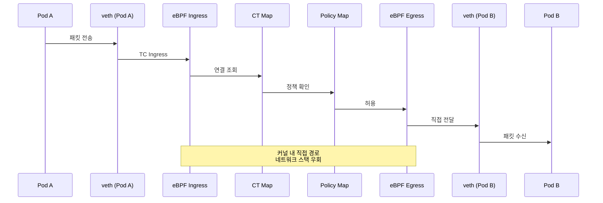

### Pod-to-Pod 통신 (다른 노드)

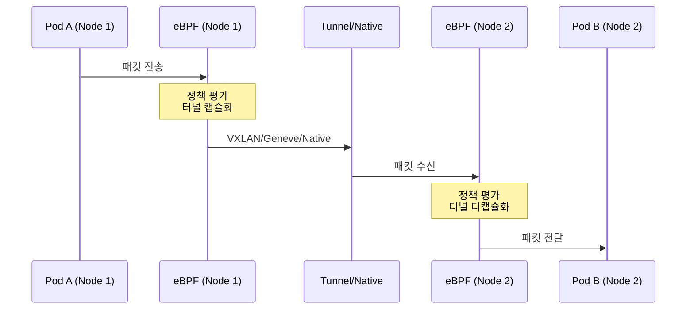

### L7 처리가 필요한 경우

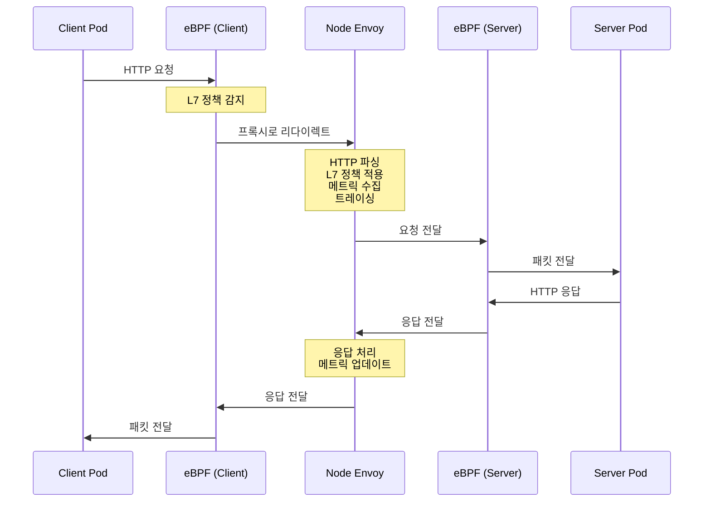

## Istio 사이드카 아키텍처 비교

### 아키텍처 비교 표

| 측면 | Cilium Service Mesh | Istio Sidecar |
|------|---------------------|---------------|
| **프록시 위치** | 노드당 1개 | Pod당 1개 |
| **프록시 유형** | eBPF + Envoy | Envoy only |
| **L4 처리** | 커널 (eBPF) | 사용자 공간 (Envoy) |
| **L7 처리** | 사용자 공간 (Envoy) | 사용자 공간 (Envoy) |
| **메모리 사용** | ~100MB/노드 | ~50MB/Pod |
| **CPU 사용** | 낮음 | 중간-높음 |
| **지연 시간** | 0.1-0.5ms | 1-3ms |
| **설정 모델** | CiliumEnvoyConfig | VirtualService/DestinationRule |
| **mTLS 구현** | eBPF/WireGuard | Envoy |
| **Injection** | 불필요 | 사이드카 인젝션 필요 |

### 지연 시간 분석

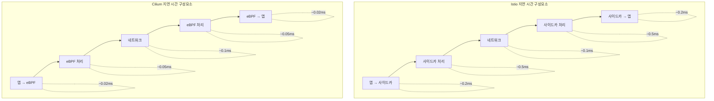

### 리소스 효율성 분석

100개 Pod 클러스터 기준:

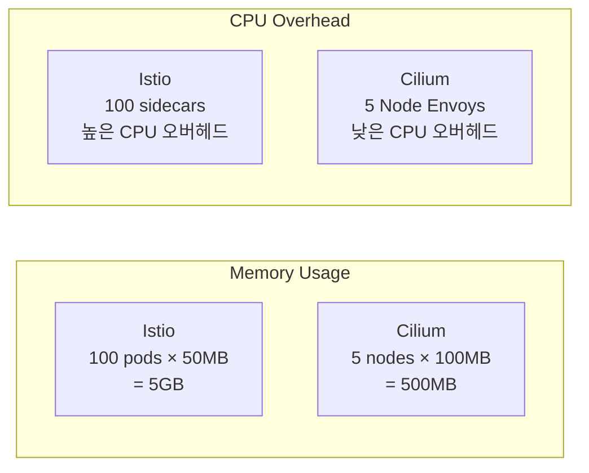

## 확장성 고려사항

### eBPF 맵 크기

```yaml
# Cilium ConfigMap 설정
bpf-map-dynamic-size-ratio: "0.0025"
bpf-ct-global-tcp-max: "524288"
bpf-ct-global-any-max: "262144"
bpf-nat-global-max: "524288"
bpf-policy-map-max: "16384"
```

### 대규모 클러스터 설정

```yaml
# 대규모 클러스터 (1000+ 노드) 설정
apiVersion: v1
kind: ConfigMap
metadata:
  name: cilium-config
  namespace: kube-system
data:
  # Identity 관련 설정
  cluster-id: "1"
  cluster-name: "production"

  # 연결 추적 최적화
  bpf-ct-global-tcp-max: "1048576"
  bpf-ct-global-any-max: "524288"

  # NAT 테이블 크기
  bpf-nat-global-max: "1048576"

  # 정책 맵 크기
  bpf-policy-map-max: "65536"

  # 성능 최적화
  sockops-enable: "true"
  bpf-lb-sock: "true"

  # Hubble 설정
  hubble-disable: "false"
  hubble-socket-path: "/var/run/cilium/hubble.sock"
```

### 노드 Envoy 스케일링

```yaml
# Envoy 리소스 스케일링
envoy:
  resources:
    limits:
      cpu: 4000m
      memory: 4Gi
    requests:
      cpu: 500m
      memory: 512Mi

  # Envoy 워커 스레드
  concurrency: 4

  # 연결 제한
  perConnectionBufferLimitBytes: 32768

  # 클러스터 설정
  cluster:
    connectTimeout: 5s
    circuitBreakers:
      maxConnections: 10000
      maxPendingRequests: 10000
      maxRequests: 10000
```

## 다음 단계

- [트래픽 관리](./02-traffic-management.md): L7 라우팅과 트래픽 제어 구성
- [보안](./03-security.md): mTLS와 L7 네트워크 정책 설정
- [관찰성](./04-observability.md): Hubble을 통한 서비스 메시 모니터링

## 참고 자료

- [Cilium Architecture Documentation](https://docs.cilium.io/en/stable/concepts/overview/)
- [eBPF Documentation](https://ebpf.io/what-is-ebpf/)
- [Envoy Proxy Architecture](https://www.envoyproxy.io/docs/envoy/latest/intro/arch_overview/arch_overview)
- [SPIFFE Specification](https://spiffe.io/docs/latest/spiffe-about/overview/)
