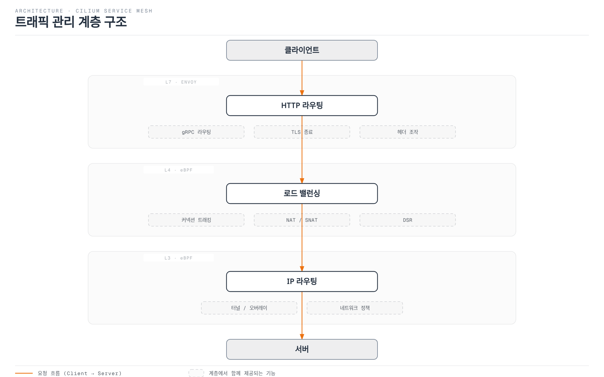
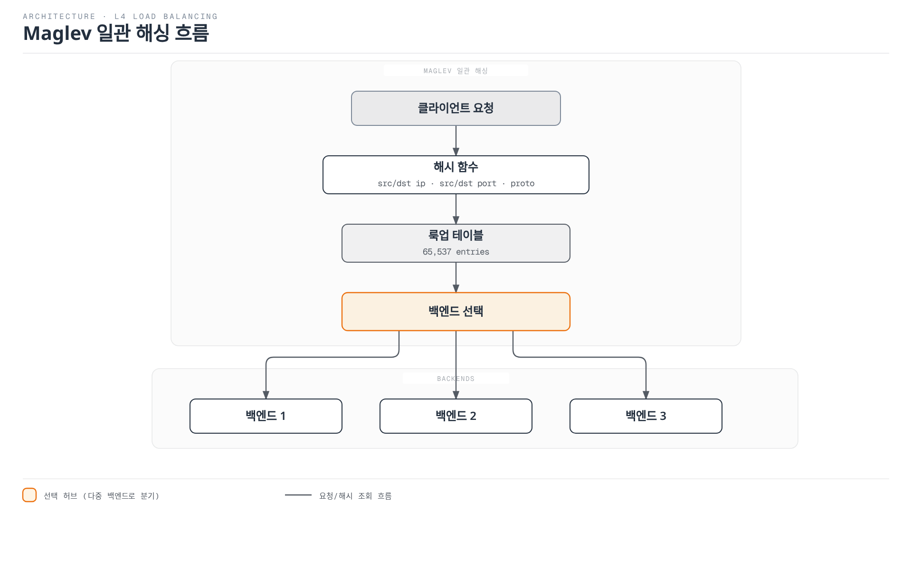

# Cilium Service Mesh 트래픽 관리

> **지원 버전**: Cilium 1.16+, Kubernetes 1.28+
> **마지막 업데이트**: 2026년 2월 22일

## 개요

Cilium Service Mesh의 트래픽 관리는 eBPF 기반 L4 로드 밸런싱과 Envoy 기반 L7 라우팅을 결합하여 제공됩니다. 이 장에서는 CiliumEnvoyConfig, CiliumNetworkPolicy의 L7 규칙, Gateway API 통합 등을 통한 고급 트래픽 관리 기능을 설명합니다.

## 트래픽 관리 아키텍처



## CiliumEnvoyConfig

### 기본 구조

CiliumEnvoyConfig는 특정 서비스에 대한 Envoy 설정을 정의합니다:

```yaml
apiVersion: cilium.io/v2
kind: CiliumEnvoyConfig
metadata:
  name: my-service-config
  namespace: default
spec:
  # 이 설정이 적용될 서비스
  services:
  - name: my-service
    namespace: default

  # 백엔드 서비스 (선택적)
  backendServices:
  - name: backend-v1
    namespace: default
  - name: backend-v2
    namespace: default

  # Envoy 리소스 정의
  resources:
  - "@type": type.googleapis.com/envoy.config.listener.v3.Listener
    name: my-service-listener
    # ... listener 설정
```

### HTTP 라우팅

#### 경로 기반 라우팅

```yaml
apiVersion: cilium.io/v2
kind: CiliumEnvoyConfig
metadata:
  name: path-routing
  namespace: default
spec:
  services:
  - name: api-gateway
    namespace: default

  backendServices:
  - name: users-service
    namespace: default
  - name: orders-service
    namespace: default
  - name: products-service
    namespace: default

  resources:
  - "@type": type.googleapis.com/envoy.config.listener.v3.Listener
    name: api-gateway-listener
    filter_chains:
    - filters:
      - name: envoy.filters.network.http_connection_manager
        typed_config:
          "@type": type.googleapis.com/envoy.extensions.filters.network.http_connection_manager.v3.HttpConnectionManager
          stat_prefix: api-gateway
          codec_type: AUTO
          route_config:
            name: api_routes
            virtual_hosts:
            - name: api
              domains: ["*"]
              routes:
              # /users/* -> users-service
              - match:
                  prefix: "/users"
                route:
                  cluster: default/users-service

              # /orders/* -> orders-service
              - match:
                  prefix: "/orders"
                route:
                  cluster: default/orders-service

              # /products/* -> products-service
              - match:
                  prefix: "/products"
                route:
                  cluster: default/products-service

              # 기본 라우트
              - match:
                  prefix: "/"
                direct_response:
                  status: 404
                  body:
                    inline_string: "Not Found"

          http_filters:
          - name: envoy.filters.http.router
            typed_config:
              "@type": type.googleapis.com/envoy.extensions.filters.http.router.v3.Router
```

#### 헤더 기반 라우팅

```yaml
apiVersion: cilium.io/v2
kind: CiliumEnvoyConfig
metadata:
  name: header-routing
  namespace: default
spec:
  services:
  - name: api-service
    namespace: default

  backendServices:
  - name: api-v1
    namespace: default
  - name: api-v2
    namespace: default
  - name: api-beta
    namespace: default

  resources:
  - "@type": type.googleapis.com/envoy.config.listener.v3.Listener
    name: header-routing-listener
    filter_chains:
    - filters:
      - name: envoy.filters.network.http_connection_manager
        typed_config:
          "@type": type.googleapis.com/envoy.extensions.filters.network.http_connection_manager.v3.HttpConnectionManager
          stat_prefix: api-service
          route_config:
            name: header_routes
            virtual_hosts:
            - name: api
              domains: ["*"]
              routes:
              # X-API-Version: v2 헤더가 있으면 v2로 라우팅
              - match:
                  prefix: "/"
                  headers:
                  - name: "X-API-Version"
                    exact_match: "v2"
                route:
                  cluster: default/api-v2

              # X-Beta-User: true 헤더가 있으면 beta로 라우팅
              - match:
                  prefix: "/"
                  headers:
                  - name: "X-Beta-User"
                    exact_match: "true"
                route:
                  cluster: default/api-beta

              # 기본: v1으로 라우팅
              - match:
                  prefix: "/"
                route:
                  cluster: default/api-v1

          http_filters:
          - name: envoy.filters.http.router
            typed_config:
              "@type": type.googleapis.com/envoy.extensions.filters.http.router.v3.Router
```

#### 메서드 기반 라우팅

```yaml
apiVersion: cilium.io/v2
kind: CiliumEnvoyConfig
metadata:
  name: method-routing
  namespace: default
spec:
  services:
  - name: rest-api
    namespace: default

  backendServices:
  - name: read-service
    namespace: default
  - name: write-service
    namespace: default

  resources:
  - "@type": type.googleapis.com/envoy.config.listener.v3.Listener
    name: method-routing-listener
    filter_chains:
    - filters:
      - name: envoy.filters.network.http_connection_manager
        typed_config:
          "@type": type.googleapis.com/envoy.extensions.filters.network.http_connection_manager.v3.HttpConnectionManager
          stat_prefix: rest-api
          route_config:
            name: method_routes
            virtual_hosts:
            - name: api
              domains: ["*"]
              routes:
              # GET 요청 -> read-service
              - match:
                  prefix: "/"
                  headers:
                  - name: ":method"
                    exact_match: "GET"
                route:
                  cluster: default/read-service

              # POST, PUT, DELETE -> write-service
              - match:
                  prefix: "/"
                  headers:
                  - name: ":method"
                    safe_regex_match:
                      google_re2: {}
                      regex: "POST|PUT|DELETE|PATCH"
                route:
                  cluster: default/write-service

          http_filters:
          - name: envoy.filters.http.router
            typed_config:
              "@type": type.googleapis.com/envoy.extensions.filters.http.router.v3.Router
```

## L7 트래픽 정책

### CiliumNetworkPolicy L7 규칙

CiliumNetworkPolicy를 통해 L7 레벨의 세밀한 트래픽 제어가 가능합니다:

```yaml
apiVersion: cilium.io/v2
kind: CiliumNetworkPolicy
metadata:
  name: l7-http-policy
  namespace: default
spec:
  endpointSelector:
    matchLabels:
      app: backend-api

  ingress:
  - fromEndpoints:
    - matchLabels:
        app: frontend
    toPorts:
    - ports:
      - port: "8080"
        protocol: TCP
      rules:
        http:
        # GET /api/users/* 허용
        - method: GET
          path: "/api/users/.*"

        # GET /api/products/* 허용
        - method: GET
          path: "/api/products/.*"

        # POST /api/orders 허용
        - method: POST
          path: "/api/orders"

        # 헤더 조건 포함
        - method: GET
          path: "/api/admin/.*"
          headers:
          - "X-Admin-Token: secret-token"
```

### 다양한 프로토콜 지원

#### Kafka L7 정책

```yaml
apiVersion: cilium.io/v2
kind: CiliumNetworkPolicy
metadata:
  name: kafka-l7-policy
  namespace: kafka
spec:
  endpointSelector:
    matchLabels:
      app: kafka-broker

  ingress:
  - fromEndpoints:
    - matchLabels:
        app: kafka-producer
    toPorts:
    - ports:
      - port: "9092"
        protocol: TCP
      rules:
        kafka:
        # 특정 토픽에 대한 produce 허용
        - apiKey: "produce"
          topic: "orders"
        - apiKey: "produce"
          topic: "events"

  - fromEndpoints:
    - matchLabels:
        app: kafka-consumer
    toPorts:
    - ports:
      - port: "9092"
        protocol: TCP
      rules:
        kafka:
        # 특정 토픽에 대한 fetch 허용
        - apiKey: "fetch"
          topic: "orders"
        - apiKey: "fetch"
          topic: "events"
        # consumer group 관리 허용
        - apiKey: "offsetcommit"
          topic: "orders"
        - apiKey: "offsetfetch"
          topic: "orders"
```

#### DNS L7 정책

```yaml
apiVersion: cilium.io/v2
kind: CiliumNetworkPolicy
metadata:
  name: dns-l7-policy
  namespace: default
spec:
  endpointSelector:
    matchLabels:
      app: web-app

  egress:
  - toEndpoints:
    - matchLabels:
        k8s:io.kubernetes.pod.namespace: kube-system
        k8s-app: kube-dns
    toPorts:
    - ports:
      - port: "53"
        protocol: UDP
      rules:
        dns:
        # 특정 도메인만 조회 허용
        - matchPattern: "*.example.com"
        - matchPattern: "api.external-service.io"
        - matchName: "database.internal.svc.cluster.local"
```

#### gRPC L7 정책

```yaml
apiVersion: cilium.io/v2
kind: CiliumNetworkPolicy
metadata:
  name: grpc-l7-policy
  namespace: default
spec:
  endpointSelector:
    matchLabels:
      app: grpc-server

  ingress:
  - fromEndpoints:
    - matchLabels:
        app: grpc-client
    toPorts:
    - ports:
      - port: "50051"
        protocol: TCP
      rules:
        http:
        # gRPC는 HTTP/2 기반이므로 http 규칙 사용
        - method: POST
          path: "/myapp.UserService/GetUser"
        - method: POST
          path: "/myapp.UserService/ListUsers"
        - method: POST
          path: "/myapp.OrderService/.*"
```

## 로드 밸런싱

### L4 로드 밸런싱 (eBPF)

eBPF 기반 L4 로드 밸런싱은 kube-proxy를 대체합니다:

```yaml
# Cilium 설정 (values.yaml)
kubeProxyReplacement: true

loadBalancer:
  # 로드 밸런싱 알고리즘
  algorithm: maglev  # maglev 또는 random

  # 모드 설정
  mode: snat  # snat, dsr, 또는 hybrid

  # DSR 설정 (선택적)
  dsrDispatch: opt  # opt 또는 ipip

  # 세션 어피니티
  serviceTopology: true

  # 상태 확인
  healthCheckNodePort: true
```

#### Maglev 해싱



### L7 로드 밸런싱 (Envoy)

L7 로드 밸런싱은 Envoy를 통해 제공됩니다:

```yaml
apiVersion: cilium.io/v2
kind: CiliumEnvoyConfig
metadata:
  name: l7-load-balancing
  namespace: default
spec:
  services:
  - name: api-service
    namespace: default

  backendServices:
  - name: api-backend
    namespace: default

  resources:
  # 클러스터 정의
  - "@type": type.googleapis.com/envoy.config.cluster.v3.Cluster
    name: default/api-backend
    connect_timeout: 5s
    type: EDS
    eds_cluster_config:
      eds_config:
        api_config_source:
          api_type: GRPC
          grpc_services:
          - envoy_grpc:
              cluster_name: xds-grpc-cilium

    # 로드 밸런싱 정책
    lb_policy: ROUND_ROBIN

    # 이상치 감지 (Circuit Breaker)
    outlier_detection:
      consecutive_5xx: 5
      interval: 10s
      base_ejection_time: 30s
      max_ejection_percent: 50

    # 헬스 체크
    health_checks:
    - timeout: 5s
      interval: 10s
      unhealthy_threshold: 3
      healthy_threshold: 2
      http_health_check:
        path: "/health"
        expected_statuses:
        - start: 200
          end: 299

    # 연결 풀 설정
    circuit_breakers:
      thresholds:
      - priority: DEFAULT
        max_connections: 1000
        max_pending_requests: 1000
        max_requests: 1000
        max_retries: 3
```

#### 로드 밸런싱 알고리즘 옵션

```yaml
# Round Robin
lb_policy: ROUND_ROBIN

# Least Request
lb_policy: LEAST_REQUEST
least_request_lb_config:
  choice_count: 2

# Random
lb_policy: RANDOM

# Ring Hash (Consistent Hashing)
lb_policy: RING_HASH
ring_hash_lb_config:
  hash_function: XX_HASH
  minimum_ring_size: 1024
  maximum_ring_size: 8388608

# Maglev
lb_policy: MAGLEV
maglev_lb_config:
  table_size: 65537
```

## 트래픽 분할 (카나리 배포)

### 가중치 기반 트래픽 분할

```yaml
apiVersion: cilium.io/v2
kind: CiliumEnvoyConfig
metadata:
  name: canary-deployment
  namespace: default
spec:
  services:
  - name: frontend
    namespace: default

  backendServices:
  - name: frontend-stable
    namespace: default
  - name: frontend-canary
    namespace: default

  resources:
  - "@type": type.googleapis.com/envoy.config.listener.v3.Listener
    name: canary-listener
    filter_chains:
    - filters:
      - name: envoy.filters.network.http_connection_manager
        typed_config:
          "@type": type.googleapis.com/envoy.extensions.filters.network.http_connection_manager.v3.HttpConnectionManager
          stat_prefix: frontend
          route_config:
            name: canary_routes
            virtual_hosts:
            - name: frontend
              domains: ["*"]
              routes:
              - match:
                  prefix: "/"
                route:
                  weighted_clusters:
                    clusters:
                    # 90% -> stable
                    - name: default/frontend-stable
                      weight: 90
                    # 10% -> canary
                    - name: default/frontend-canary
                      weight: 10
                    total_weight: 100

          http_filters:
          - name: envoy.filters.http.router
            typed_config:
              "@type": type.googleapis.com/envoy.extensions.filters.http.router.v3.Router
```

### 헤더 기반 카나리

```yaml
apiVersion: cilium.io/v2
kind: CiliumEnvoyConfig
metadata:
  name: header-canary
  namespace: default
spec:
  services:
  - name: api
    namespace: default

  backendServices:
  - name: api-stable
    namespace: default
  - name: api-canary
    namespace: default

  resources:
  - "@type": type.googleapis.com/envoy.config.listener.v3.Listener
    name: header-canary-listener
    filter_chains:
    - filters:
      - name: envoy.filters.network.http_connection_manager
        typed_config:
          "@type": type.googleapis.com/envoy.extensions.filters.network.http_connection_manager.v3.HttpConnectionManager
          stat_prefix: api
          route_config:
            name: header_canary_routes
            virtual_hosts:
            - name: api
              domains: ["*"]
              routes:
              # X-Canary: true 헤더가 있으면 canary로 라우팅
              - match:
                  prefix: "/"
                  headers:
                  - name: "X-Canary"
                    exact_match: "true"
                route:
                  cluster: default/api-canary

              # 기본: stable로 라우팅
              - match:
                  prefix: "/"
                route:
                  cluster: default/api-stable

          http_filters:
          - name: envoy.filters.http.router
            typed_config:
              "@type": type.googleapis.com/envoy.extensions.filters.http.router.v3.Router
```

## 재시도 및 타임아웃

### 재시도 설정

```yaml
apiVersion: cilium.io/v2
kind: CiliumEnvoyConfig
metadata:
  name: retry-config
  namespace: default
spec:
  services:
  - name: api-service
    namespace: default

  backendServices:
  - name: api-backend
    namespace: default

  resources:
  - "@type": type.googleapis.com/envoy.config.listener.v3.Listener
    name: retry-listener
    filter_chains:
    - filters:
      - name: envoy.filters.network.http_connection_manager
        typed_config:
          "@type": type.googleapis.com/envoy.extensions.filters.network.http_connection_manager.v3.HttpConnectionManager
          stat_prefix: api-service
          route_config:
            name: retry_routes
            virtual_hosts:
            - name: api
              domains: ["*"]
              routes:
              - match:
                  prefix: "/"
                route:
                  cluster: default/api-backend
                  timeout: 30s

                  # 재시도 정책
                  retry_policy:
                    # 재시도할 상태 코드
                    retry_on: "5xx,reset,connect-failure,retriable-4xx"

                    # 최대 재시도 횟수
                    num_retries: 3

                    # 재시도 간격
                    per_try_timeout: 10s

                    # 재시도 백오프
                    retry_back_off:
                      base_interval: 0.5s
                      max_interval: 10s

                    # 재시도 가능한 헤더
                    retriable_headers:
                    - name: "x-envoy-retriable-on"
                      exact_match: "true"

                    # 재시도 우선순위
                    retry_priority:
                      name: envoy.retry_priorities.previous_priorities
                      typed_config:
                        "@type": type.googleapis.com/envoy.extensions.retry.priority.previous_priorities.v3.PreviousPrioritiesConfig
                        update_frequency: 2

          http_filters:
          - name: envoy.filters.http.router
            typed_config:
              "@type": type.googleapis.com/envoy.extensions.filters.http.router.v3.Router
```

### 타임아웃 설정

```yaml
apiVersion: cilium.io/v2
kind: CiliumEnvoyConfig
metadata:
  name: timeout-config
  namespace: default
spec:
  services:
  - name: slow-service
    namespace: default

  resources:
  - "@type": type.googleapis.com/envoy.config.listener.v3.Listener
    name: timeout-listener
    filter_chains:
    - filters:
      - name: envoy.filters.network.http_connection_manager
        typed_config:
          "@type": type.googleapis.com/envoy.extensions.filters.network.http_connection_manager.v3.HttpConnectionManager
          stat_prefix: slow-service

          # 연결 타임아웃
          common_http_protocol_options:
            idle_timeout: 300s
            headers_with_underscores_action: REJECT_REQUEST

          # 스트림 타임아웃
          stream_idle_timeout: 60s
          request_timeout: 120s

          route_config:
            name: timeout_routes
            virtual_hosts:
            - name: slow-service
              domains: ["*"]
              routes:
              # 기본 라우트
              - match:
                  prefix: "/"
                route:
                  cluster: default/slow-service
                  timeout: 60s

              # 긴 처리 시간이 필요한 엔드포인트
              - match:
                  prefix: "/long-running"
                route:
                  cluster: default/slow-service
                  timeout: 300s

              # 스트리밍 엔드포인트 (무제한)
              - match:
                  prefix: "/stream"
                route:
                  cluster: default/slow-service
                  timeout: 0s  # 무제한

          http_filters:
          - name: envoy.filters.http.router
            typed_config:
              "@type": type.googleapis.com/envoy.extensions.filters.http.router.v3.Router
```

## Rate Limiting

### 로컬 Rate Limiting

```yaml
apiVersion: cilium.io/v2
kind: CiliumEnvoyConfig
metadata:
  name: local-ratelimit
  namespace: default
spec:
  services:
  - name: api-service
    namespace: default

  resources:
  - "@type": type.googleapis.com/envoy.config.listener.v3.Listener
    name: ratelimit-listener
    filter_chains:
    - filters:
      - name: envoy.filters.network.http_connection_manager
        typed_config:
          "@type": type.googleapis.com/envoy.extensions.filters.network.http_connection_manager.v3.HttpConnectionManager
          stat_prefix: api-service
          route_config:
            name: ratelimit_routes
            virtual_hosts:
            - name: api
              domains: ["*"]
              routes:
              - match:
                  prefix: "/"
                route:
                  cluster: default/api-service

          http_filters:
          # 로컬 Rate Limiter
          - name: envoy.filters.http.local_ratelimit
            typed_config:
              "@type": type.googleapis.com/envoy.extensions.filters.http.local_ratelimit.v3.LocalRateLimit
              stat_prefix: http_local_rate_limiter

              # 전역 토큰 버킷
              token_bucket:
                max_tokens: 1000
                tokens_per_fill: 100
                fill_interval: 1s

              # 응답 헤더
              response_headers_to_add:
              - append_action: OVERWRITE_IF_EXISTS_OR_ADD
                header:
                  key: x-ratelimit-limit
                  value: "1000"
              - append_action: OVERWRITE_IF_EXISTS_OR_ADD
                header:
                  key: x-ratelimit-remaining
                  value: "%DYNAMIC_METADATA(envoy.http.local_rate_limit:remaining)%"

              # Rate Limit 초과 시 응답
              status:
                code: TooManyRequests
              filter_enabled:
                runtime_key: local_rate_limit_enabled
                default_value:
                  numerator: 100
                  denominator: HUNDRED
              filter_enforced:
                runtime_key: local_rate_limit_enforced
                default_value:
                  numerator: 100
                  denominator: HUNDRED

          - name: envoy.filters.http.router
            typed_config:
              "@type": type.googleapis.com/envoy.extensions.filters.http.router.v3.Router
```

### 경로별 Rate Limiting

```yaml
apiVersion: cilium.io/v2
kind: CiliumEnvoyConfig
metadata:
  name: per-route-ratelimit
  namespace: default
spec:
  services:
  - name: api-service
    namespace: default

  resources:
  - "@type": type.googleapis.com/envoy.config.listener.v3.Listener
    name: per-route-ratelimit-listener
    filter_chains:
    - filters:
      - name: envoy.filters.network.http_connection_manager
        typed_config:
          "@type": type.googleapis.com/envoy.extensions.filters.network.http_connection_manager.v3.HttpConnectionManager
          stat_prefix: api-service
          route_config:
            name: ratelimit_routes
            virtual_hosts:
            - name: api
              domains: ["*"]
              routes:
              # 인증 엔드포인트 - 낮은 rate limit
              - match:
                  prefix: "/auth"
                route:
                  cluster: default/api-service
                typed_per_filter_config:
                  envoy.filters.http.local_ratelimit:
                    "@type": type.googleapis.com/envoy.extensions.filters.http.local_ratelimit.v3.LocalRateLimit
                    stat_prefix: auth_rate_limiter
                    token_bucket:
                      max_tokens: 10
                      tokens_per_fill: 5
                      fill_interval: 60s

              # 검색 엔드포인트 - 중간 rate limit
              - match:
                  prefix: "/search"
                route:
                  cluster: default/api-service
                typed_per_filter_config:
                  envoy.filters.http.local_ratelimit:
                    "@type": type.googleapis.com/envoy.extensions.filters.http.local_ratelimit.v3.LocalRateLimit
                    stat_prefix: search_rate_limiter
                    token_bucket:
                      max_tokens: 100
                      tokens_per_fill: 50
                      fill_interval: 1s

              # 기본 - 높은 rate limit
              - match:
                  prefix: "/"
                route:
                  cluster: default/api-service
                typed_per_filter_config:
                  envoy.filters.http.local_ratelimit:
                    "@type": type.googleapis.com/envoy.extensions.filters.http.local_ratelimit.v3.LocalRateLimit
                    stat_prefix: default_rate_limiter
                    token_bucket:
                      max_tokens: 1000
                      tokens_per_fill: 100
                      fill_interval: 1s

          http_filters:
          - name: envoy.filters.http.local_ratelimit
            typed_config:
              "@type": type.googleapis.com/envoy.extensions.filters.http.local_ratelimit.v3.LocalRateLimit
              stat_prefix: http_local_rate_limiter
          - name: envoy.filters.http.router
            typed_config:
              "@type": type.googleapis.com/envoy.extensions.filters.http.router.v3.Router
```

## URL 재작성 및 헤더 조작

### URL 재작성

```yaml
apiVersion: cilium.io/v2
kind: CiliumEnvoyConfig
metadata:
  name: url-rewrite
  namespace: default
spec:
  services:
  - name: api-gateway
    namespace: default

  backendServices:
  - name: users-service
    namespace: default

  resources:
  - "@type": type.googleapis.com/envoy.config.listener.v3.Listener
    name: rewrite-listener
    filter_chains:
    - filters:
      - name: envoy.filters.network.http_connection_manager
        typed_config:
          "@type": type.googleapis.com/envoy.extensions.filters.network.http_connection_manager.v3.HttpConnectionManager
          stat_prefix: api-gateway
          route_config:
            name: rewrite_routes
            virtual_hosts:
            - name: api
              domains: ["*"]
              routes:
              # /api/v1/users/* -> /users/*
              - match:
                  prefix: "/api/v1/users"
                route:
                  cluster: default/users-service
                  prefix_rewrite: "/users"

              # 정규식 재작성
              - match:
                  safe_regex:
                    google_re2: {}
                    regex: "/v([0-9]+)/(.*)"
                route:
                  cluster: default/users-service
                  regex_rewrite:
                    pattern:
                      google_re2: {}
                      regex: "/v([0-9]+)/(.*)"
                    substitution: "/api/\\2?version=\\1"

              # 호스트 재작성
              - match:
                  prefix: "/legacy"
                route:
                  cluster: default/users-service
                  host_rewrite_literal: "legacy.internal.svc.cluster.local"
                  prefix_rewrite: "/"

          http_filters:
          - name: envoy.filters.http.router
            typed_config:
              "@type": type.googleapis.com/envoy.extensions.filters.http.router.v3.Router
```

### 헤더 조작

```yaml
apiVersion: cilium.io/v2
kind: CiliumEnvoyConfig
metadata:
  name: header-manipulation
  namespace: default
spec:
  services:
  - name: api-service
    namespace: default

  resources:
  - "@type": type.googleapis.com/envoy.config.listener.v3.Listener
    name: header-listener
    filter_chains:
    - filters:
      - name: envoy.filters.network.http_connection_manager
        typed_config:
          "@type": type.googleapis.com/envoy.extensions.filters.network.http_connection_manager.v3.HttpConnectionManager
          stat_prefix: api-service
          route_config:
            name: header_routes
            virtual_hosts:
            - name: api
              domains: ["*"]

              # 가상 호스트 레벨 헤더
              request_headers_to_add:
              - header:
                  key: "X-Forwarded-By"
                  value: "cilium-envoy"
                append_action: OVERWRITE_IF_EXISTS_OR_ADD

              response_headers_to_add:
              - header:
                  key: "X-Served-By"
                  value: "cilium-service-mesh"
                append_action: OVERWRITE_IF_EXISTS_OR_ADD

              response_headers_to_remove:
              - "server"
              - "x-powered-by"

              routes:
              - match:
                  prefix: "/"
                route:
                  cluster: default/api-service

                  # 라우트 레벨 헤더
                  request_headers_to_add:
                  - header:
                      key: "X-Request-Start"
                      value: "%START_TIME(%s.%3f)%"
                    append_action: OVERWRITE_IF_EXISTS_OR_ADD
                  - header:
                      key: "X-Envoy-Original-Path"
                      value: "%REQ(:PATH)%"
                    append_action: OVERWRITE_IF_EXISTS_OR_ADD

                  response_headers_to_add:
                  - header:
                      key: "X-Response-Time"
                      value: "%RESPONSE_DURATION%ms"
                    append_action: OVERWRITE_IF_EXISTS_OR_ADD
                  - header:
                      key: "X-Upstream-Host"
                      value: "%UPSTREAM_HOST%"
                    append_action: OVERWRITE_IF_EXISTS_OR_ADD

          http_filters:
          - name: envoy.filters.http.router
            typed_config:
              "@type": type.googleapis.com/envoy.extensions.filters.http.router.v3.Router
```

## Gateway API 통합

### GatewayClass 및 Gateway

```yaml
# GatewayClass 정의
apiVersion: gateway.networking.k8s.io/v1
kind: GatewayClass
metadata:
  name: cilium
spec:
  controllerName: io.cilium/gateway-controller
---
# Gateway 정의
apiVersion: gateway.networking.k8s.io/v1
kind: Gateway
metadata:
  name: api-gateway
  namespace: default
spec:
  gatewayClassName: cilium
  listeners:
  - name: http
    protocol: HTTP
    port: 80
    allowedRoutes:
      namespaces:
        from: Same

  - name: https
    protocol: HTTPS
    port: 443
    tls:
      mode: Terminate
      certificateRefs:
      - kind: Secret
        name: api-gateway-tls
    allowedRoutes:
      namespaces:
        from: Same
```

### HTTPRoute

```yaml
apiVersion: gateway.networking.k8s.io/v1
kind: HTTPRoute
metadata:
  name: api-routes
  namespace: default
spec:
  parentRefs:
  - name: api-gateway
    namespace: default

  hostnames:
  - "api.example.com"

  rules:
  # /users/* -> users-service
  - matches:
    - path:
        type: PathPrefix
        value: /users
    backendRefs:
    - name: users-service
      port: 80

  # /orders/* -> orders-service
  - matches:
    - path:
        type: PathPrefix
        value: /orders
    backendRefs:
    - name: orders-service
      port: 80

  # 헤더 기반 라우팅
  - matches:
    - path:
        type: PathPrefix
        value: /
      headers:
      - name: X-API-Version
        value: v2
    backendRefs:
    - name: api-v2
      port: 80

  # 가중치 기반 분할
  - matches:
    - path:
        type: PathPrefix
        value: /
    backendRefs:
    - name: api-stable
      port: 80
      weight: 90
    - name: api-canary
      port: 80
      weight: 10
```

### HTTPRoute 고급 기능

```yaml
apiVersion: gateway.networking.k8s.io/v1
kind: HTTPRoute
metadata:
  name: advanced-routes
  namespace: default
spec:
  parentRefs:
  - name: api-gateway

  rules:
  - matches:
    - path:
        type: PathPrefix
        value: /api

    # 요청 헤더 수정
    filters:
    - type: RequestHeaderModifier
      requestHeaderModifier:
        add:
        - name: X-Request-ID
          value: "%REQ(X-REQUEST-ID)%"
        set:
        - name: X-Forwarded-Proto
          value: https
        remove:
        - X-Internal-Header

    # 응답 헤더 수정
    - type: ResponseHeaderModifier
      responseHeaderModifier:
        add:
        - name: X-Frame-Options
          value: DENY
        - name: X-Content-Type-Options
          value: nosniff

    # URL 재작성
    - type: URLRewrite
      urlRewrite:
        path:
          type: ReplacePrefixMatch
          replacePrefixMatch: /v1

    backendRefs:
    - name: api-service
      port: 80

  # 리다이렉트
  - matches:
    - path:
        type: Exact
        value: /old-endpoint
    filters:
    - type: RequestRedirect
      requestRedirect:
        scheme: https
        hostname: new.example.com
        path:
          type: ReplaceFullPath
          replaceFullPath: /new-endpoint
        statusCode: 301
```

## 트래픽 미러링

```yaml
apiVersion: cilium.io/v2
kind: CiliumEnvoyConfig
metadata:
  name: traffic-mirror
  namespace: default
spec:
  services:
  - name: production-service
    namespace: default

  backendServices:
  - name: production-backend
    namespace: default
  - name: shadow-backend
    namespace: default

  resources:
  - "@type": type.googleapis.com/envoy.config.listener.v3.Listener
    name: mirror-listener
    filter_chains:
    - filters:
      - name: envoy.filters.network.http_connection_manager
        typed_config:
          "@type": type.googleapis.com/envoy.extensions.filters.network.http_connection_manager.v3.HttpConnectionManager
          stat_prefix: production-service
          route_config:
            name: mirror_routes
            virtual_hosts:
            - name: production
              domains: ["*"]
              routes:
              - match:
                  prefix: "/"
                route:
                  cluster: default/production-backend

                  # 트래픽 미러링 설정
                  request_mirror_policies:
                  - cluster: default/shadow-backend
                    runtime_fraction:
                      default_value:
                        numerator: 100  # 100% 미러링
                        denominator: HUNDRED
                    trace_sampled: false

          http_filters:
          - name: envoy.filters.http.router
            typed_config:
              "@type": type.googleapis.com/envoy.extensions.filters.http.router.v3.Router
```

## 다음 단계

- [보안](./03-security.md): mTLS와 L7 네트워크 정책 설정
- [관찰성](./04-observability.md): Hubble을 통한 트래픽 모니터링
- [인그레스 & 게이트웨이](./05-ingress-gateway.md): 외부 트래픽 관리

## 참고 자료

- [Cilium L7 Policy Documentation](https://docs.cilium.io/en/stable/security/policy/language/#layer-7-examples)
- [CiliumEnvoyConfig Reference](https://docs.cilium.io/en/stable/network/servicemesh/envoy-config/)
- [Gateway API Documentation](https://gateway-api.sigs.k8s.io/)
- [Envoy HTTP Connection Manager](https://www.envoyproxy.io/docs/envoy/latest/configuration/http/http_conn_man/http_conn_man)
